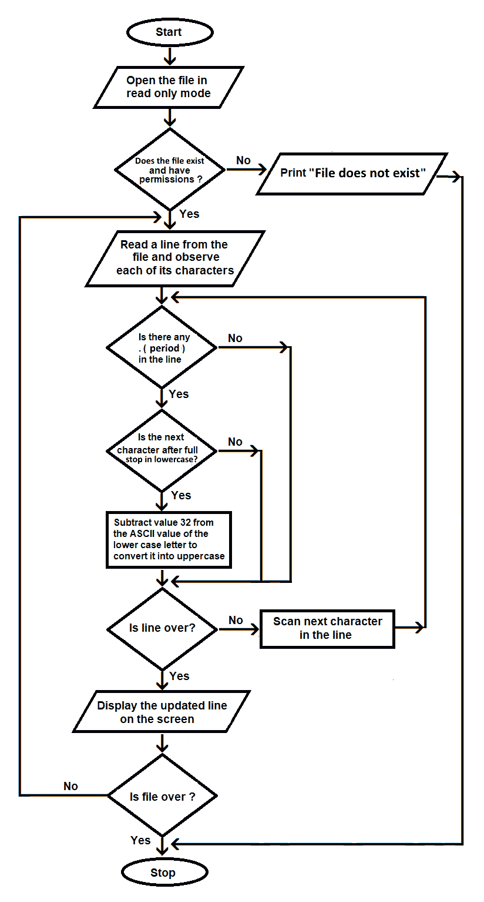
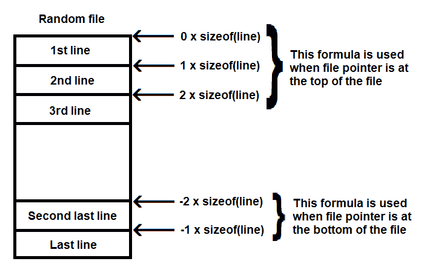
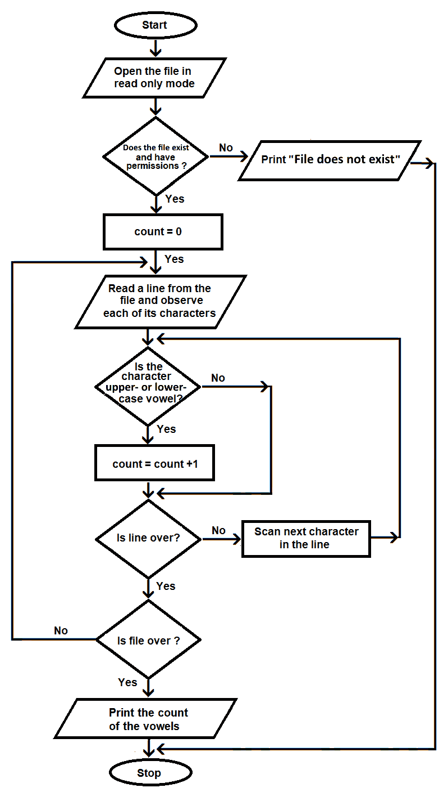
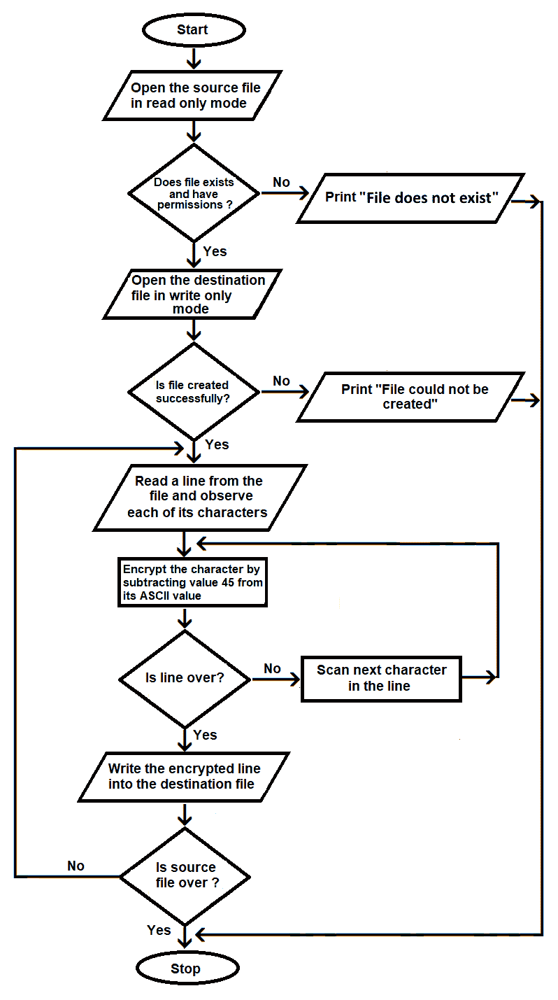

# 文件处理

数据存储是所有应用程序的必备功能。当我们运行程序时输入任何数据，该数据将存储为 RAM，这意味着它是临时的。当我们下次运行程序时，我们将无法获取该数据。但如果我们希望数据保留在那里，以便在需要时再次引用它，我们应该怎么办？在这种情况下，我们必须存储数据。

基本上，我们希望我们的数据能够被存储，并且可以在需要时随时访问和重用。在 C 语言中，数据存储可以通过传统的文件处理技术以及数据库系统来完成。以下是 C 语言中可用的两种文件处理类型：

+   **顺序文件处理**：数据以简单的文本格式写入，可以顺序读取和写入。要读取第*n*行，我们必须首先读取*n*-1 行。

+   **随机文件处理**：数据以字节形式写入，可以随机读取或写入。我们可以通过将文件指针定位在所需位置来随机读取或写入任何行。

在本章中，我们将通过文件处理来介绍以下食谱：

+   读取文本文件并将所有句号后面的字符转换为大写

+   以逆序显示随机文件的内容

+   计算文件中元音字母的数量

+   在文件中将一个单词替换为另一个单词

+   加密文件

在我们开始食谱之前，让我们回顾一下我们将使用的一些函数来创建我们的食谱。

# 文件处理中使用的函数

我将这一部分分为两部分。在第一部分中，我们将查看针对顺序文件处理方法特定的函数。在第二部分中，我们将查看用于随机文件的函数。

# 顺序文件处理中常用的函数

以下是一些用于在顺序文件中打开、关闭、读取和写入的函数。

# fopen()

`fopen()`函数用于打开文件进行读取、写入和其他操作。以下是它的语法：

```cpp
FILE *fopen (const char *file_name, const char *mode)
```

在这里，`file_name`代表我们想要工作的文件，而`mode`表示我们想要打开文件的目的。它可以以下列之一：

+   `r`**:** 以读取模式打开文件并将文件指针设置为文件的第一字符。

+   `w`**:** 以写入模式打开文件。如果文件存在，它将被覆盖。

+   `a`**:** 以追加模式打开文件。新输入的数据将被添加到文件末尾。

+   `r+`**:** 以读写模式打开文件。文件指针被设置为指向文件的开头。如果文件已存在，则不会删除文件内容。如果文件不存在，则不会创建文件。

+   `w+`**:** 这也以读写模式打开文件。文件指针被设置为指向文件的开头。如果文件已存在，则将删除文件内容，但如果文件不存在，则将创建文件。

+   `a+`**:** 以读取和追加新内容的方式打开文件。

`fopen`函数返回一个文件描述符，指向文件以执行不同的操作。

# fclose()

`fclose()`函数用于关闭文件。以下是它的语法：

```cpp
int fclose(FILE *file_pointer)
```

在这里，`file_pointer`代表指向打开文件的文件指针。

如果文件成功关闭，该函数返回`0`值。

# fgets()

`fgets()`函数用于从指定的文件中读取字符串。以下是它的语法：

```cpp
char *fgets(char *string, int length, FILE *file_pointer)
```

此函数具有以下功能：

+   `string`**:** 这代表将读取自文件的数据分配到的字符数组。

+   `length`**:** 这代表可以从文件中读取的最大字符数。将从文件中读取*length-1*个字符。读取数据将从文件停止在*length-1*位置或在新行字符`\n`处，以先到者为准。

+   `file_pointer`**:** 这代表指向文件的文件指针。

# fputs()

`fputs()`函数用于写入文件。以下是它的语法：

```cpp
int fputs (const char *string, FILE *file_pointer)
```

在这里，`string`代表包含要写入文件的数据的字符数组。`file_pointer`短语代表指向文件的文件指针。

# 常用于随机文件的函数

以下函数用于在随机文件中设置文件指针到指定位置，指示文件指针当前指向的位置，以及将文件指针重置到随机文件的开始。

# fseek()

`fseek()`函数用于在文件中设置文件指针到特定位置。以下是它的语法：

```cpp
fseek(FILE *file_pointer, long int offset, int location);
```

此函数具有以下功能：

+   `file_pointer`**:** 这代表指向文件的文件指针。

+   `offset`**:** 这代表文件指针需要从位置参数指定的位置移动的字节数。如果`offset`的值为正，文件指针将在文件中向前移动，如果为负，文件指针将从给定位置向后移动。

+   `location`**:** 这是定义文件指针需要移动的位置的值。也就是说，文件指针将从`location`参数指定的位置移动等于`offset`参数指定的字节数。其值可以是`0`、`1`或`2`，如下表所示：

| **值** | **含义** |
| --- | --- |
| `0` | 文件指针将从文件开头移动 |
| `1` | 文件指针将从当前位置移动 |
| `2` | 文件指针将从文件末尾移动 |

让我们看看以下示例。在这里，文件指针将从文件开头向前移动`5`个字节：

```cpp
fseek(fp,5L,0)
```

在以下示例中，文件指针将从文件末尾向后移动`5`个字节：

```cpp
fseek(fp,-5L,2)
```

# ftell()

`ftell()` 函数返回文件指针 `file_pointer` 当前在文件中的字节位置。以下是它的语法：

```cpp
long int ftell(FILE *file_pointer)
```

这里，`file_pointer` 是指向文件的文件指针。

# rewind()

`rewind()` 函数用于将文件指针移动到指定文件的开始位置。以下是它的语法：

```cpp
void rewind(FILE *file_pointer)
```

这里，`file_pointer` 是指向文件的文件指针。

在本章中，我们将通过使用制作实时应用的菜谱来学习使用这两种类型的文件处理。

# 读取文本文件并将所有句点后的字符转换为大写

假设我们有一个包含一些文本的文件。我们认为文本中存在一个异常——每个句点后的第一个字符应该大写，但实际上都是小写。在本菜谱中，我们将读取该文本文件并将每个句点（`.`）后面的字符（即小写）转换为大写。

在本菜谱中，我假设您知道如何创建文本文件以及如何读取文本文件。如果您不知道如何执行这些操作，您可以在 *附录 A* 中找到这两个操作的程序。

# 如何做到这一点…

1.  使用以下代码以只读模式打开顺序文件：

```cpp
    fp = fopen (argv [1],"r");
```

1.  如果文件不存在或权限不足，将显示错误消息，程序将终止。使用以下代码设置此操作：

```cpp
if (fp == NULL) {
    printf("%s file does not exist\n", argv[1]);
    exit(1);
 }
```

1.  从文件中读取一行，如下面的代码所示：

```cpp
fgets(buffer, BUFFSIZE, fp);
```

1.  逐个访问行的每个字符并检查是否存在句点，如下面的代码所示：

```cpp
for(i=0;i<n;i++)
    if(buffer[i]=='.')

```

1.  如果找到句点，将检查句点后面的字符以确认它是否为大写，如下面的代码所示：

```cpp
if(buffer[i] >=97 && buffer[i] <=122)
```

1.  如果句点后面的字符是小写，则从小写字符的 ASCII 值中减去 32，将其转换为大写，如下面的代码所示：

```cpp
buffer[i]=buffer[i]-32;
```

1.  如果行还没有结束，则从步骤 4 开始的序列将重复到步骤 6；否则，将在屏幕上显示更新的行，如下面的代码所示：

```cpp
puts(buffer);
```

1.  使用以下代码检查是否已到达文件末尾。如果文件未结束，则重复从步骤 3 开始的序列：

```cpp
while(!feof(fp))
```

以下图表（*图 5.1*）中直观地解释了前面的步骤：



图 5.1

将文件中句点后的小写字符转换为大写的 `convertcase.c` 程序如下：

```cpp
#include <stdio.h>
#include <string.h>
#include <stdlib.h>

#define BUFFSIZE 255

void main (int argc, char* argv[])
{
    FILE *fp;
    char buffer[BUFFSIZE];
    int i,n;

    fp = fopen (argv [1],"r");
    if (fp == NULL) {
        printf("%s file does not exist\n", argv[1]);
        exit(1);
    }
    while (!feof(fp))
    {
        fgets(buffer, BUFFSIZE, fp);
        n=strlen(buffer);
        for(i=0;i<n;i++)
        {
            if(buffer[i]=='.')
            {
                i++;
                while(buffer[i]==' ')
                {
                    i++;
                }
                if(buffer[i] >=97 && buffer[i] <=122)
                {
                    buffer[i]=buffer[i]-32;
                }
            }
        }
        puts(buffer);
    }
    fclose(fp);
}
```

现在，让我们看看幕后。

# 它是如何工作的...

将命令行参数中提供的文件名作为参数打开的文件以只读模式打开，并由文件指针 `fp` 指向。本菜谱专注于读取文件并更改其大小写，因此如果文件不存在或没有读取权限，将显示错误信息，程序将终止。

将设置一个`while`循环，直到`feof`（文件末尾）到达时执行。在`while`循环中，文件中的每一行将被逐行读取并分配给名为`buffer`的字符串。将使用`fgets()`函数一次从文件中读取一行。从文件中读取一定数量的字符，直到遇到换行符`\n`，最多读取 254 个字符。

以下步骤将在分配给字符串缓冲区的每一行上执行：

1.  将计算缓冲区字符串的长度，并执行一个`for`循环以访问字符串缓冲区中的每个字符。

1.  将检查字符串缓冲区中是否有任何句号。

1.  如果找到，将检查其后的字符是否为小写。然后使用 ASCII 值将小写字符转换为大写（有关与字母表中的字母对应的 ASCII 值的更多信息，请参阅第二章，*字符串管理*）。如果句号后的字符是小写，则从小写字符的 ASCII 值中减去`32`以将其转换为大写。记住，大写字母的 ASCII 值比对应的小写字母低`32`。

1.  将句号后面的字符转换为大写的更新后的字符串`buffer`将在屏幕上显示。

当读取并显示文件的所有行后，由`fp`指针指向的文件将被关闭。

让我们使用 GCC 编译`convertcase.c`程序，如下所示：

```cpp
D:\CBook>gcc convertcase.c -o convertcase
```

如果你没有收到错误或警告，这意味着`convertcase.c`程序已经被编译成一个可执行文件，名为`convertcase.exe`。

假设我已经创建了一个名为`textfile.txt`的文件，其内容如下：

```cpp
D:\CBook>type textfile.txt
I am trying to create a sequential file. it is through C programming. It is very hot today. I have a cat. do you like animals? It might rain. Thank you. Bye
```

前面的命令是在 Windows 的命令提示符中执行的。

让我们运行可执行文件`convertcase.exe`，然后将`textfile.txt`文件传递给它，如下面的代码所示：

```cpp
D:\CBook>./convertcase textfile.txt
I am trying to create a sequential file. It is through C programming. It is very hot today. I have a cat. Do you like animals? It might rain. Thank you. Bye
```

你可以在前面的输出中看到，句号之后的字符现在已经被转换为大写。

让我们继续下一个菜谱！

# 以相反顺序显示随机文件的内容

假设我们有一个包含一些文本行的随机文件。让我们找出如何反转这个文件的内容。

如果随机文件不存在，这个程序将不会给出正确的输出。请阅读*附录 A*了解如何创建随机文件。

# 如何做到这一点...

1.  使用以下代码以只读模式打开随机文件：

```cpp
fp = fopen (argv[1], "rb");
```

1.  如果文件不存在或没有足够的权限，将显示错误消息，程序将终止，如下面的代码所示：

```cpp
if (fp == NULL) {
     perror ("An error occurred in opening the file\n");
     exit(1);
 }
```

1.  要按反向顺序读取随机文件，执行一个等于文件行数的循环。循环的每次迭代都将从文件底部读取一行。以下公式将用于找出文件中的行数：

*文件中使用的总字节数/每行字节数的大小*

执行此操作的代码如下：

```cpp
fseek(fp, 0L, SEEK_END);
n = ftell(fp);
nol=n/sizeof(struct data);
```

1.  因为文件必须按反向顺序读取，文件指针将被定位到文件底部，如下面的代码所示：

```cpp
fseek(fp, -sizeof(struct data)*i, SEEK_END); 
```

1.  设置一个循环，使其等于在第 3 步中计算的文件行数，如下面的代码所示：

```cpp
for (i=1;i<=nol;i++)
```

1.  在循环中，文件指针将被定位如下：



图 5.2

1.  要读取最后一行，文件指针将被定位到最后一行开始的字节位置，即**-1 x sizeof(line)**字节位置。最后一行将被读取并在屏幕上显示，如下面的代码所示：

```cpp
fread(&line,sizeof(struct data),1,fp);
puts(line.str);
```

1.  接下来，文件指针将被定位到从倒数第二行开始的字节位置，即**-2 x sizeof(line)**字节位置。再次，倒数第二行将被读取并在屏幕上显示。

1.  该过程将重复进行，直到文件中的所有行都被读取并在屏幕上显示。

读取随机文件的反向顺序的`readrandominreverse.c`程序如下：

```cpp
#include <string.h>
#include <stdio.h>
#include <stdlib.h>

struct data{  
    char str[ 255 ];  
};

void main (int argc, char* argv[])
{
    FILE *fp;
    struct data line;
    int n,nol,i;
    fp = fopen (argv[1], "rb");
    if (fp == NULL) {
        perror ("An error occurred in opening the file\n");
        exit(1);
    }
    fseek(fp, 0L, SEEK_END); 
    n = ftell(fp);
    nol=n/sizeof(struct data);
    printf("The content of random file in reverse order is :\n");
    for (i=1;i<=nol;i++)
    {
        fseek(fp, -sizeof(struct data)*i, SEEK_END); 
        fread(&line,sizeof(struct data),1,fp);
        puts(line.str);
    }
    fclose(fp);
}
```

现在，让我们看看幕后。

# 它是如何工作的...

我们将以只读模式打开选定的文件。如果文件打开成功，它将由文件指针`fp`指向。接下来，我们将使用以下公式找出文件中的总行数：

*文件使用的总字节数/每行使用的字节数*

要知道文件使用的总字节数，文件指针将被定位到文件底部，我们将调用`ftell`函数。`ftell`函数找到文件指针的当前位置。因为文件指针位于文件末尾，使用此函数将告诉我们文件使用的总字节数。要找出每行使用的字节数，我们将使用`sizeof`函数。我们将应用前面的公式来计算文件中的总行数；这将分配给变量`nol`。

我们将设置一个`for`循环，执行`nol`次。在`for`循环中，文件指针将被定位到最后一行的末尾，以便可以按反向顺序访问文件中的所有行。因此，文件指针首先被设置在文件底部的`(-1 * size of one line)`位置。一旦文件指针定位在这个位置，我们将使用`fread`函数读取文件的最后一行并将其分配给结构变量`line`。然后，将字符串显示在屏幕上。

在屏幕上显示最后一行后，文件指针将设置在倒数第二行的字节位置`(-2 * 行的大小)`。我们再次使用`fread`函数读取倒数第二行并在屏幕上显示它。

这个过程将执行`for`循环执行的次数，`for`循环将执行与文件中行数相同的次数。然后关闭文件。

让我们使用 GCC 编译`readrandominreverse.c`程序，如下所示：

```cpp
D:\CBook>gcc readrandominreverse.c -o readrandominreverse
```

如果你没有收到任何错误或警告，这意味着`readrandominreverse.c`程序已经被编译成可执行文件，`readrandominreverse.exe`。

假设我们有一个随机文件`random.data`，其文本如下：

```cpp
This is a random file. I am checking if the code is working
perfectly well. Random file helps in fast accessing of
desired data. Also you can access any content in any order.
```

让我们运行可执行文件`readrandominreverse.exe`，以下代码将按逆序显示随机文件`random.data`：

```cpp
D:\CBook>./readrandominreverse random.data
The content of random file in reverse order is :
desired data. Also you can access any content in any order.
perfectly well. Random file helps in fast accessing of
This is a random file. I am checking if the code is working
```

通过比较原始文件与前面的输出，你可以看到文件内容是按逆序显示的。

现在，让我们继续下一个菜谱！

# 计算文件中的元音字母数量

在这个菜谱中，我们将打开一个顺序文本文件，并计算其中包含的元音字母（大写和小写）的数量。

在这个菜谱中，我将假设一个顺序文件已经存在。请阅读*附录 A*了解如何创建顺序文件。

# 如何做到这一点...

1.  使用以下代码以只读模式打开顺序文件：

```cpp
fp = fopen (argv [1],"r");
```

1.  如果文件不存在或没有足够的权限，将显示错误消息，程序将终止，如下面的代码所示：

```cpp
if (fp == NULL) {
    printf("%s file does not exist\n", argv[1]);
    exit(1);
 }
```

1.  将用于计算文件中元音字母数量的计数器初始化为`0`，如下面的代码所示：

```cpp
count=0;
```

1.  从文件中读取一行，如下面的代码所示：

```cpp
fgets(buffer, BUFFSIZE, fp);
```

1.  逐个访问并检查行中的每个字符，看是否有小写或大写元音字母，如下面的代码所示：

```cpp
if(buffer[i]=='a' || buffer[i]=='e' || buffer[i]=='i' || buffer[i]=='o' || buffer[i]=='u' || buffer[i]=='A' || buffer[i]=='E' || buffer[i]=='I' || buffer[i]=='O' || buffer[i]=='U')
```

1.  如果发现任何元音字母，计数器的值将增加`1`，如下面的代码所示：

```cpp
count++;
```

1.  步骤 5 将重复进行，直到达到行尾。检查是否已到达文件末尾。从步骤 4 重复，直到文件末尾，如下面的代码所示：

```cpp
while (!feof(fp))
```

1.  通过在屏幕上打印计数器变量的值来显示文件中元音字母数量的计数，如下面的代码所示：

```cpp
printf("The number of vowels are %d\n",count);
```

前面的步骤如下面的图所示：



图 5.3

计算顺序文本文件中元音字母数量的`countvowels.c`程序如下：

```cpp
#include <stdio.h>
#include <stdlib.h>
#include <string.h>

#define BUFFSIZE 255

void main (int argc, char* argv[])
{
    FILE *fp;
    char buffer[BUFFSIZE];
    int n, i, count=0;
    fp = fopen (argv [1],"r");
    if (fp == NULL) {
        printf("%s file does not exist\n", argv[1]);
        exit(1);
    }
    printf("The file content is :\n");
    while (!feof(fp))
    {
        fgets(buffer, BUFFSIZE, fp);
        puts(buffer);
        n=strlen(buffer);
        for(i=0;i<n;i++)
        {
            if(buffer[i]=='a' || buffer[i]=='e' || buffer[i]=='i' || 
            buffer[i]=='o' || buffer[i]=='u' || buffer[i]=='A' || 
            buffer[i]=='E' || buffer[i]=='I' || buffer[i]=='O' || 
            buffer[i]=='U') count++;
        }         
    }
    printf("The number of vowels are %d\n",count);
    fclose(fp);
}
```

现在，让我们看看幕后发生了什么。

# 它是如何工作的...

我们将以只读模式打开选定的顺序文件。如果文件成功打开，它将被文件指针`fp`指向。为了计算文件中的元音字母数量，我们将计数器初始化为`0`。

我们将设置一个`while`循环，直到文件指针`fp`到达文件末尾才执行。在`while`循环中，将使用`fgets`函数读取文件中的每一行。`fgets`函数将从文件中读取`BUFFSIZE`个字符。`BUFFSIZE`变量的值是`255`，因此`fgets`将读取文件中的`254`个字符或读取字符直到遇到换行符`\n`，以先到者为准。

从文件中读取的行被分配给`buffer`字符串。为了显示文件内容以及元音字母的计数，将在屏幕上显示`buffer`字符串中的内容。将计算`buffer`字符串的长度，并设置一个`for`循环，使其执行次数等于字符串的长度。

缓冲字符串中的每个字符都将在`for`循环中进行检查。如果该行中出现任何小写或大写元音字母，计数变量的值将增加`1`。当`while`循环结束时，计数变量将包含文件中出现的元音字母的总数。最后，计数变量的值将在屏幕上显示。

让我们使用 GCC 编译`countvowels.c`程序，如下所示：

```cpp
D:\CBook>gcc countvowels.c -o countvowels
```

如果没有错误或警告，则表示`countvowels.c`程序已被编译成名为`countvowels.exe`的可执行文件。

假设我们有一个名为`textfile.txt`的文本文件，其中包含一些内容。我们将运行可执行文件`countvowels.exe`，并将`textfile.txt`文件作为参数传递给它，以计算其中的元音字母数量，如下面的代码所示：

```cpp
D:\CBook>./countvowels textfile.txt
The file content is :
I am trying to create a sequential file. it is through C programming. It is very hot today. I have a cat. do you like animals? It might rain. Thank you. bye
The number of vowels are 49
```

您可以从程序的输出中看到，程序不仅显示了元音字母的计数，还显示了文件的完整内容。

现在，让我们继续下一个菜谱！

# 在文件中将一个单词替换为另一个单词

假设您想在您的某个文件中将单词`is`的所有出现替换为单词`was`。让我们找出如何做到这一点。

在这个菜谱中，我将假设已经存在一个顺序文件。请阅读*附录 A*以了解如何创建顺序文件。

# 如何做到这一点...

1.  使用以下代码以只读模式打开文件：

```cpp
    fp = fopen (argv [1],"r");
```

1.  如果文件不存在或没有足够的权限，将显示错误消息，并且程序将终止，如下面的代码所示：

```cpp
if (fp == NULL) {
    printf("%s file does not exist\n", argv[1]);
    exit(1);
 }
```

1.  使用以下代码输入要替换的单词：

```cpp
printf("Enter a string to be replaced: ");
scanf("%s", str1);
```

1.  使用以下代码输入将替换旧单词的新单词：

```cpp
printf("Enter the new string ");
scanf("%s", str2);
```

1.  使用以下代码从文件中读取一行：

```cpp
fgets(line, 255, fp);
```

1.  使用以下代码检查要替换的单词是否出现在该行中的任何地方：

```cpp
if(line[i]==str1[w])
{
     oldi=i;
     while(w<ls1)
     {
         if(line[i] != str1[w])
             break;
         else
         {
             i++;
             w++;
         }
     }
}
```

1.  如果单词出现在该行中，则使用以下代码简单地将其替换为新的单词：

```cpp
if(w==ls1)
{
     i=oldi;
     for (k=0;k<ls2;k++)
     {
         nline[x]=str2[k];
         x++;
     }
     i=i+ls1-1;
 }
```

1.  如果单词在该行中任何地方都没有出现，则进行下一步。使用以下代码打印替换单词后的行：

```cpp
puts(nline);
```

1.  使用以下代码检查是否已到达文件末尾：

```cpp
while (!feof(fp))
```

1.  如果尚未到达文件末尾，请转到步骤 4。使用以下代码关闭文件：

```cpp
fclose(fp);
```

`replaceword.c`程序将文件中的指定单词替换为另一个单词，并在屏幕上显示修改后的内容：

```cpp
#include <stdio.h>
#include <string.h>
#include <stdlib.h>

void main (int argc, char* argv[])
{
    FILE *fp;
    char line[255], nline[300], str1[80], str2[80];
    int i,ll, ls1,ls2, x,k, w, oldi;

    fp = fopen (argv [1],"r");
    if (fp == NULL) {
        printf("%s file does not exist\n", argv[1]);
        exit(1);
    }
    printf("Enter a string to be replaced: ");
    scanf("%s", str1);
    printf("Enter the new string ");
    scanf("%s", str2);
    ls1=strlen(str1);
    ls2=strlen(str2);
    x=0;
    while (!feof(fp))
    {
        fgets(line, 255, fp);
        ll=strlen(line);
        for(i=0;i<ll;i++)
        {
            w=0;
            if(line[i]==str1[w])
            {
                oldi=i;    
                while(w<ls1)
                {
                    if(line[i] != str1[w])
                        break;
                    else
                    {
                        i++;
                        w++;
                    }
                }
                if(w==ls1)
                {
                    i=oldi;
                    for (k=0;k<ls2;k++)
                    {
                        nline[x]=str2[k];
                        x++;
                    }
                    i=i+ls1-1;
                }
                else
                {
                    i=oldi;
                    nline[x]=line[i];
                    x++;       
                }         
            }
            else
            {
                nline[x]=line[i];
                x++;
            }
        }
        nline[x]='\0';
        puts(nline);
     }
     fclose(fp);
}
```

现在，让我们看看幕后。

# 它是如何工作的...

以只读模式打开选定的文件。如果文件成功打开，则文件指针`fp`将设置为指向它。输入要替换的单词并将其分配给字符串变量`str1`。同样，输入将分配给另一个字符串变量`str2`的新字符串。将两个字符串`str1`和`str2`的长度计算并分别分配给变量`ls1`和`ls2`。

设置一个`while`循环，直到`fp`指针指向的文件结束。在`while`循环中，将使用`fgets`函数读取文件中的一行。`fgets`函数读取文件，直到指定的最大长度或新行字符`\n`到达，以先到者为准。由于字符串以强制性的空字符`\0`终止，因此从文件中最多读取`254`个字符。

从文件中读取的字符串将被分配给`line`变量。计算`line`字符串的长度并将其分配给变量`ll`。使用`for`循环，访问`line`变量中的每个字符，以检查它们是否与`str1[0]`匹配——即与要替换的字符串的第一个字符匹配。不与要替换的字符串匹配的`line`变量中的字符将被分配给另一个字符串，称为`nline`。`nline`字符串将包含所需的内容——即`line`变量中的所有字符和新字符串。如果它在`line`中存在，则将字符串替换为新字符串，并将整个修改后的内容分配给新字符串`nline`。

如果要替换的字符串的第一个字符与`line`中的任何字符匹配，则将使用`while`循环来匹配要替换的字符串的后续字符与`line`中的后续字符。如果要替换的字符串的所有字符都与`line`中的后续字符匹配，则将所有要替换的字符串的字符替换为新字符串，并分配给新字符串`nline`。这样，`while`循环将一次读取文件中的一行文本，搜索要替换的字符串的出现。如果找到，则将其替换为新字符串，并将修改后的文本行分配给另一个字符串`nline`。在修改后的字符串`nline`中添加空字符`\0`，并在屏幕上显示。最后，关闭由文件指针`fp`指向的文件。

在这个示例中，我正在替换所需的单词和另一个字符串，并在屏幕上显示更新后的内容。如果你想让更新后的内容写入另一个文件，那么你总是可以以写入模式打开另一个文件，并执行`fputs`函数来将更新后的内容写入其中。

让我们使用 GCC 编译`replaceword.c`程序，如下所示：

```cpp
D:\CBook>gcc replaceword.c -o replaceword
```

如果你没有错误或警告，那么这意味着`replaceword.c`程序已被编译成可执行文件`replaceword.exe`。让我们运行可执行文件`replaceword.exe`，并向其提供一个文本文件。我们将假设存在一个名为`textfile.txt`的文本文件，其内容如下：

```cpp
I am trying to create a sequential file. it is through C programming. It is very hot today. I have a cat. do you like animals? It might rain. Thank you. bye
```

现在，让我们使用此文件，使用以下代码将其中的一个单词替换为另一个单词：

```cpp
D:\CBook>./replaceword textfile.txt
Enter a string to be replaced: is
Enter the new string was
I am trying to create a sequential file. it was through C programming. It was very hot today. I have a cat. do you like animals? It might rain. Thank you. Bye
```

你可以看到`textfile.txt`中所有`is`的出现都被替换为`was`，并且修改后的内容显示在屏幕上。我们已经成功替换了我们选择的单词。

现在，让我们继续下一个示例！

# 加密文件

加密意味着将内容转换为编码格式，这样未经授权的人员将无法看到或访问文件的原始内容。可以通过对内容的 ASCII 值应用公式来加密文本文件。

公式或代码的选择由你决定，它可以像你想要的那样简单或复杂。例如，假设你选择将所有字母的当前 ASCII 值向前移动 15 个值。在这种情况下，如果字母是 ASCII 值为 97 的小写字母*a*，那么 ASCII 值向前移动 15 个值将使加密后的字母变为小写字母*p*，其 ASCII 值为 112（97 + 15 = 112）。

在这个示例中，我假设你想要加密的顺序文件已经存在。请阅读*附录 A*了解如何创建顺序文件。如果你想知道加密文件是如何解密的，也可以参考*附录 A*。

# 如何做到这一点...

1.  使用以下代码以只读模式打开源文件：

```cpp
fp = fopen (argv [1],"r");
```

1.  如果文件不存在或没有足够的权限，将显示错误消息，程序将终止，如下面的代码所示：

```cpp
if (fp == NULL) {
    printf("%s file does not exist\n", argv[1]);
    exit(1);
 }
```

1.  使用以下代码以只写模式打开目标文件，即将要写入加密文本的文件：

```cpp
fq = fopen (argv[2], "w");
```

1.  使用以下代码从文件中读取一行并访问其每个字符：

```cpp
fgets(buffer, BUFFSIZE, fp);
```

1.  使用以下代码，从每行的每个字符的 ASCII 值中减去`45`的值来加密该字符：

```cpp
for(i=0;i<n;i++)
    buffer[i]=buffer[i]-45;
```

1.  重复步骤 5，直到行结束。一旦行中的所有字符都被加密，使用以下代码将加密行写入目标文件：

```cpp
fputs(buffer,fq);
```

1.  使用以下代码检查文件末尾是否已到达：

```cpp
while (!feof(fp))
```

1.  使用以下代码关闭两个文件：

```cpp
fclose (fp);
fclose (fq);
```

以下图显示了前面的步骤：



图 5.4

加密文件的`encryptfile.c`程序如下所示：

```cpp
#include <stdio.h>
#include <stdlib.h>
#include <string.h> 

#define BUFFSIZE 255
void main (int argc, char* argv[])
{
    FILE *fp,*fq;
    int  i,n;
    char buffer[BUFFSIZE];

    /* Open the source file in read mode */
    fp = fopen (argv [1],"r");
    if (fp == NULL) {
        printf("%s file does not exist\n", argv[1]);
        exit(1);
    }
    /* Create the destination file.  */
    fq = fopen (argv[2], "w");
    if (fq == NULL) {
        perror ("An error occurred in creating the file\n");
        exit(1);
    }
    while (!feof(fp))
    {
        fgets(buffer, BUFFSIZE, fp);
        n=strlen(buffer);
        for(i=0;i<n;i++)
            buffer[i]=buffer[i]-45;
        fputs(buffer,fq);
    }
    fclose (fp);
    fclose (fq); 
}
```

现在，让我们看看幕后。

# 它是如何工作的...

通过命令行参数传递的第一个文件名以只读模式打开。通过命令行参数传递的第二个文件名以只写模式打开。如果两个文件都正确打开，那么`fp`和`fq`指针分别将指向只读和只写文件。

我们将设置一个`while`循环，直到达到源文件末尾。在循环中，将使用`fgets`函数从源文件中读取一行。`fgets`函数从文件中读取指定数量的字节或直到遇到新行字符`\n`。如果文件中没有出现新行字符，那么`BUFFSIZE`常量将限制从文件中读取的字节数为`254`。

从文件中读取的行被分配给`buffer`字符串。计算字符串`buffer`的长度并将其分配给变量`n`。然后我们将设置一个`for`循环，直到达到`buffer`字符串长度的末尾，在循环中，每个字符的 ASCII 值将被改变。

为了加密文件，我们将从每个字符的 ASCII 值中减去`45`，尽管我们可以应用任何我们喜欢的公式。只需确保你记住这个公式，因为我们将在解密文件时需要反转它。

在将公式应用于所有字符后，加密行将被写入目标文件。此外，为了在屏幕上显示加密版本，加密行将在屏幕上显示。

当`while`循环结束时，源文件中的所有行将在加密后写入目标文件。最后，两个文件将被关闭。

让我们使用 GCC 编译`encryptfile.c`程序，如下所示：

```cpp
D:\CBook>gcc encryptfile.c -o encryptfile
```

如果你没有错误或警告，这意味着`encryptfile.c`程序已经被编译成可执行文件`encryptfile.exe`。让我们运行这个可执行文件。

在运行可执行文件之前，让我们看一下将被此程序加密的文本文件`textfile.txt`。这个文本文件的内容如下：

```cpp
I am trying to create a sequential file. it is through C programming. It is very hot today. I have a cat. do you like animals? It might rain. Thank you. bye
```

让我们在`textfile.txt`上运行可执行文件`encryptfile.exe`，并将加密内容放入另一个名为`encrypted.txt`的文件中，如下所示：

```cpp
D:\CBook>./encryptfile textfile.txt encrypted.txt
```

`textfile.txt`中的普通内容被加密，加密内容被写入另一个名为`encrypted.txt`的文件。加密内容将如下所示：

```cpp
D:\CBook>type encrypted.txt
≤4@≤GEL<A:≤GB≤6E84G8≤4≤F8DH8AG<4?≤9<?8≤<G≤<F≤G;EBH:;≤≤CEB:E4@@<A:≤≤≤G≤<F≤I8EL≤;BG≤GB74L≤;4I8≤4≤64G≤≤7B≤LBH≤?<>8≤4A<@4?F≤≤≤≤G≤@<:;G≤E4<A';4A>≤LBH≤5L8
```

上述命令在 Windows 的命令提示符中执行。

哇！我们已经成功加密了文件！
