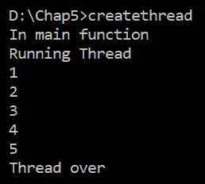
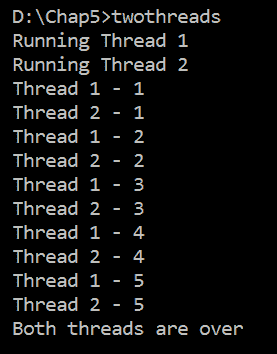
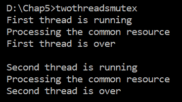
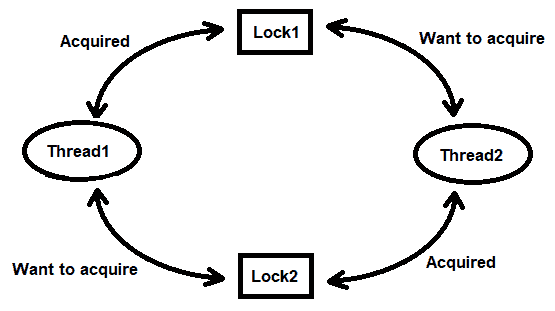
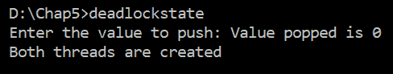
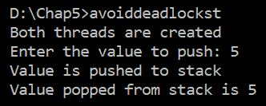

# 第七章：实现并发

多任务处理是几乎所有操作系统的关键特性；它提高了 CPU 的效率，并以更好的方式利用资源。线程是实现多任务处理的最佳方式。一个进程可以包含多个线程以实现多任务处理。

在本章中，我们将介绍以下涉及线程的食谱：

+   使用单个线程执行任务

+   使用多个线程执行多个任务

+   使用 `mutex` 在两个线程之间共享数据

+   理解死锁是如何产生的

+   避免死锁

进程和线程这两个术语可能会令人困惑，所以首先，我们要确保你理解它们。

# 进程和线程是什么？

每当我们运行一个程序时，当它从硬盘（或任何其他存储）加载到内存中时，它就变成了一个**进程**。**进程**由处理器执行，并且为了执行它，它需要一个**程序计数器（PC**）来跟踪下一个要执行的指令，CPU 寄存器，信号等。

**线程**指的是程序中的一组可以独立执行的指令。线程有自己的 PC 和一组寄存器，以及其他一些东西。这样，一个进程由多个线程组成。两个或多个线程可以共享它们的代码、数据和其他资源，但在线程之间共享资源时必须格外小心，因为这可能会导致歧义和死锁。操作系统还管理线程池。

**线程池**包含一组等待分配任务以进行并发执行的线程。使用线程池中的线程而不是实例化新线程有助于避免创建和销毁新线程造成的延迟；因此，它提高了应用程序的整体性能。

基本上，线程通过并行性提高了应用程序的效率，即通过同时运行两个或更多独立代码集。这被称为**多线程**。

C 语言不支持多线程，因此为了实现它，使用 POSIX 线程（`Pthreads`）。GCC 允许实现一个 `pthread`。

当使用 `pthread` 时，定义一个 `pthread_t` 类型的变量来存储线程标识符。**线程标识符**是一个唯一的整数，即分配给系统中的线程。

你可能想知道用于创建线程的函数是哪个。`pthread_create` 函数被调用以创建线程。以下四个参数传递给 `pthread_create` 函数：

+   指向线程标识符的指针，该指针由该函数设置

+   线程的属性；通常，为此参数提供 `NULL` 以使用默认属性

+   用于创建线程时要执行的函数的名称

+   要传递给线程的参数，如果不需要传递参数，则设置为 `NULL`

当两个或多个线程操作相同的数据时，即它们共享相同的资源，必须应用某些检查措施，以确保一次只允许一个线程操作共享资源；其他线程的访问必须被阻塞。帮助避免线程间共享资源时歧义的一种方法就是互斥。

# 互斥

为了避免两个或多个线程访问相同资源时的歧义，**互斥**实现了对共享资源的序列化访问。当一个线程正在使用资源时，不允许其他线程访问相同的资源。所有其他线程都会被阻塞，直到资源再次空闲。

`互斥锁`基本上是与共享资源相关联的锁。要读取或修改共享资源，线程必须首先获取该资源的锁。一旦线程获取了该资源的锁（或`互斥锁`），它就可以继续处理该资源。所有其他希望处理该资源的线程都将被迫等待，直到资源解锁。当线程完成对共享资源的处理时，它会解锁`互斥锁`，使其他等待的线程能够获取该资源的`互斥锁`。除了`互斥锁`之外，信号量也用于进程同步。

**信号量**是一个用于避免在并发系统中两个或多个进程访问公共资源的概念。它基本上是一个变量，通过操作它只允许一个进程访问公共资源并实现进程同步。信号量使用信号机制，即分别调用`wait`和`signal`函数来通知公共资源已被获取或释放。另一方面，`互斥锁`使用锁定机制——进程在操作公共资源之前必须获取`互斥锁`对象的锁。

虽然`互斥锁`有助于管理线程之间的共享资源，但存在一个问题。`互斥锁`的错误顺序应用可能导致死锁。死锁发生在这样一个情况下：一个持有`锁 X`的线程试图获取`锁 Y`以完成其处理，而另一个持有`锁 Y`的线程试图获取`锁 X`以完成其执行。在这种情况下，将发生死锁，因为两个线程都将无限期地等待对方释放其锁。由于没有线程能够完成其执行，因此没有线程能够释放其锁。避免死锁的一种解决方案是让线程以特定的顺序获取锁。

以下函数用于创建和管理线程：

+   `pthread_join`: 这个函数使线程等待其所有派生线程的完成。如果不使用它，线程将在完成任务后立即退出，忽略其派生线程的状态。换句话说，`pthread_join`会阻塞调用线程，直到该函数中指定的线程终止。

+   `pthread_mutex_init`: 这个函数使用指定的属性初始化`mutex`对象。如果使用`NULL`作为属性，则使用默认的`mutex`属性来初始化`mutex`对象。当`mutex`初始化时，它处于未锁定状态。

+   `pthread_mutex_lock`: 这个函数锁定指定的`mutex`对象。如果`mutex`已被其他线程锁定，则调用线程将被挂起，即它将被要求等待直到`mutex`解锁。此函数返回一个锁定状态的`mutex`对象。锁定`mutex`的线程成为其所有者，并保持所有者状态，直到它解锁`mutex`。

+   `pthread_mutex_unlock`: 这个函数释放指定的`mutex`对象。调用`pthread_mutex_lock`函数并等待`mutex`解锁的线程将变为非阻塞状态，即它将被要求等待直到`mutex`解锁。此函数返回一个锁定状态的`mutex`对象。锁定`mutex`的线程成为其所有者，并保持所有者状态，直到它解锁`mutex`。

+   `pthread_mutex_destroy`: 这个函数销毁一个`mutex`对象并释放其分配的资源。在调用此方法之前，`mutex`必须处于未锁定状态。

根据操作系统，锁可能是一个**自旋锁**。如果有任何线程试图获取锁但锁不可用，自旋锁将使线程在一个循环中等待，直到锁变为可用。这种锁在等待锁释放时使线程保持忙碌状态。它们是高效的，因为它们避免了在进程重新调度或上下文切换中消耗时间和资源。

理论就到这里。现在，让我们从一些实际例子开始！

# 使用单个线程执行任务

在这个菜谱中，我们将创建一个线程来执行一个任务。在这个任务中，我们将显示从`1`到`5`的序列号。这个菜谱的重点是学习如何创建线程以及如何请求主线程等待线程完成任务。

# 如何做…

1.  定义一个`pthread_t`类型的变量来存储线程标识符：

```cpp
pthread_t tid;
```

1.  创建一个线程并将前一步创建的标识符传递给`pthread_create`函数。线程使用默认属性创建。还要指定一个需要执行以创建线程的函数：

```cpp
pthread_create(&tid, NULL, runThread, NULL);
```

1.  在该函数中，你将显示一条文本消息以指示线程已创建并正在运行：

```cpp
printf("Running Thread \n");
```

1.  通过运行线程调用一个`for`循环来显示从`1`到`5`的序列号：

```cpp
for(i=1;i<=5;i++) printf("%d\n",i);
```

1.  在主函数中调用 `pthread_join` 方法，使 `main` 方法等待直到线程完成任务：

```cpp
pthread_join(tid, NULL);
```

创建线程并使其执行任务的 `createthread.c` 程序如下：

```cpp
#include <stdio.h>
#include <stdlib.h>
#include <pthread.h>

void *runThread(void *arg)
{
    int i;
    printf("Running Thread \n");
    for(i=1;i<=5;i++) printf("%d\n",i);
    return NULL;
}

int main()
{
    pthread_t tid;
    printf("In main function\n");
    pthread_create(&tid, NULL, runThread, NULL);
    pthread_join(tid, NULL);
    printf("Thread over\n");
    return 0;
}
```

现在，让我们看看幕后。

# 它是如何工作的...

我们将定义一个名为 `tid` 的类型为 `pthread_t` 的变量以存储线程标识符。**线程标识符**是一个唯一的整数，即分配给系统中的线程。在创建线程之前，屏幕上会显示消息 `In main function`。我们将创建一个线程并将标识符 `tid` 传递给 `pthread_create` 函数。线程使用默认属性创建，并将 `runThread` 函数设置为执行以创建线程。

在 `runThread` 函数中，我们将显示文本消息 `Running Thread` 以指示线程已被创建并正在运行。我们将调用一个 `for` 循环，通过运行中的线程显示从 `1` 到 `5` 的数字序列。通过调用 `pthread_join` 方法，我们将使 `main` 方法等待直到线程完成任务。在这里调用 `pthread_join` 是非常重要的；否则，`main` 方法将在不等待线程完成的情况下退出。

让我们使用 GCC 编译 `createthread.c` 程序，如下所示：

```cpp
D:\CBook>gcc createthread.c -o createthread
```

如果你没有收到任何错误或警告，这意味着 `createthread.c` 程序已经被编译成了一个可执行文件，`createthread.exe`。让我们运行这个可执行文件：



哇！我们已经成功使用单个线程完成了一个任务。现在，让我们继续下一个菜谱！

# 使用多个线程执行多个任务

在这个菜谱中，你将学习如何通过并行执行两个线程来执行多任务。这两个线程将独立执行它们自己的任务。由于两个线程不会共享资源，因此不会出现竞争条件或歧义的情况。CPU 将随机执行任何线程，但最终，两个线程都将完成分配的任务。两个线程将执行的任务是显示从 `1` 到 `5` 的数字序列。

# 如何做到这一点…

1.  定义两个类型为 `pthread_t` 的变量以存储两个线程标识符：

```cpp
pthread_t tid1, tid2;
```

1.  调用 `pthread_create` 函数两次以创建两个线程，并分配我们在上一步中创建的标识符。这两个线程使用默认属性创建。指定两个线程各自需要执行的功能：

```cpp
pthread_create(&tid1,NULL,runThread1,NULL);
pthread_create(&tid2,NULL,runThread2,NULL);
```

1.  在第一个线程的功能中，显示一条文本消息以指示第一个线程已被创建并正在运行：

```cpp
printf("Running Thread 1\n");
```

1.  为了指示第一个线程的执行，在第一个函数中执行一个 `for` 循环以显示从 `1` 到 `5` 的数字序列。为了与第二个线程区分开来，第一个线程生成的数字序列前面加上 `Thread 1`：

```cpp
for(i=1;i<=5;i++)
    printf("Thread 1 - %d\n",i);
```

1.  类似地，在第二个线程中，显示一条文本消息以告知第二个线程也已创建并正在运行：

```cpp
  printf("Running Thread 2\n");
```

1.  再次，在第二个函数中，执行一个 `for` 循环以显示从 `1` 到 `5` 的数字序列。为了区分这些数字与 `thread1` 生成的数字，这个数字序列将以前缀 `Thread 2` 开头：

```cpp
for(i=1;i<=5;i++)
    printf("Thread 2 - %d\n",i);
```

1.  调用 `pthread_join` 两次，并将我们在第一步中创建的线程标识符传递给它。`pthread_join` 将使两个线程，并且 `main` 方法将等待直到两个线程都完成任务：

```cpp
pthread_join(tid1,NULL);
pthread_join(tid2,NULL);
```

1.  当两个线程都完成后，将显示一条文本消息以确认这一点：

```cpp
printf("Both threads are over\n");
```

创建两个线程并在独立资源上使它们工作的 `twothreads.c` 程序如下：

```cpp
#include<pthread.h>
#include<stdio.h>

void *runThread1(void *arg){
    int i;
    printf("Running Thread 1\n");
    for(i=1;i<=5;i++)
        printf("Thread 1 - %d\n",i);
}

void *runThread2(void *arg){
    int i;
    printf("Running Thread 2\n");
    for(i=1;i<=5;i++)
        printf("Thread 2 - %d\n",i);
}

int main(){
    pthread_t tid1, tid2;
    pthread_create(&tid1,NULL,runThread1,NULL);
    pthread_create(&tid2,NULL,runThread2,NULL);
    pthread_join(tid1,NULL);
    pthread_join(tid2,NULL);
    printf("Both threads are over\n");
    return 0;
}
```

现在，让我们看看幕后。

# 它是如何工作的...

我们将定义两个名为 `tid1` 和 `tid2` 的 `pthread_t` 类型的变量，以存储两个线程标识符。这些线程标识符唯一地代表系统中的线程。我们将调用 `pthread_create` 函数两次以创建两个线程，并将它们的标识符分配给两个变量 `tid1` 和 `tid2`，其地址被传递给 `pthread_create` 函数。

两个线程使用默认属性创建。我们将执行 `runThread1` 函数以创建第一个线程，然后执行 `runThread2` 函数以创建第二个线程。

在 `runThread1` 函数中，我们将显示消息 `Running Thread 1` 以指示第一个线程已被创建并正在运行。此外，我们将调用一个 `for` 循环，通过运行中的线程显示从 `1` 到 `5` 的数字序列。第一个线程生成的数字序列将以前缀 `Thread 1` 开头。

类似地，在 `runThread2` 函数中，我们将显示消息 `Running Thread 2` 以告知第二个线程也已创建并正在运行。再次，我们将调用一个 `for` 循环以显示从 `1` 到 `5` 的数字序列。为了区分这些数字与 `thread1` 生成的数字，这些数字将以前缀 `Thread 2` 开头。

然后，我们将调用 `pthread_join` 方法两次，并将我们的两个线程标识符 `tid1` 和 `tid2` 传递给它。`pthread_join` 被调用以使两个线程，并且 `main` 方法等待直到两个线程都完成了它们各自的任务。当两个线程都结束时，即当 `runThread1` 和 `runThread2` 函数结束时，在 `main` 函数中将显示一条消息，说明 `Both threads are over`。

让我们使用 GCC 编译 `twothreads.c` 程序，如下所示：

```cpp
D:\CBook>gcc twothreads.c -o twothreads
```

如果没有错误或警告，这意味着 `twothreads.c` 程序已被编译成可执行文件，名为 `twothreads.exe`。让我们运行这个可执行文件：



您可能不会得到完全相同的输出，因为这取决于 CPU，但可以肯定的是，两个线程将同时退出。

哇！我们已经成功地使用多个线程完成了多个任务。现在，让我们继续下一个菜谱！

# 使用 `mutex` 在两个线程之间共享数据

独立运行两个或更多线程，其中每个线程访问其自己的资源，相当方便。然而，有时我们希望线程能够同时共享和处理相同的资源，以便我们可以更快地完成任务。共享公共资源可能会导致问题，因为一个线程可能会在另一个线程写入更新数据之前读取数据，导致模糊的情况。为了避免这种情况，使用 `mutex`。在本菜谱中，你将学习如何在两个线程之间共享公共资源。

# 如何做到这一点...

1.  定义两个 `pthread_t` 类型的变量来存储两个线程标识符。同时，定义一个 `mutex` 对象：

```cpp
pthread_t tid1,tid2;
pthread_mutex_t lock;
```

1.  调用 `pthread_mutex_init` 方法以默认 `mutex` 属性初始化 `mutex` 对象：

```cpp
pthread_mutex_init(&lock, NULL)
```

1.  调用两次 `pthread_create` 函数来创建两个线程，并分配我们在第一步中创建的标识符。执行一个用于创建两个线程的函数：

```cpp
pthread_create(&tid1, NULL, &runThread, NULL);
pthread_create(&tid2, NULL, &runThread, NULL);
```

1.  在函数中，调用 `pthread_mutex_lock` 方法并将 `mutex` 对象传递给它以锁定它：

```cpp
pthread_mutex_lock(&lock);
```

1.  调用 `pthread_self` 方法并将调用线程的 ID 赋值给一个 `pthread_t` 类型的变量。调用 `pthread_equal` 方法并将其与变量进行比较，以找出当前正在执行的线程。如果第一个线程正在执行，则在屏幕上显示消息 `First thread is running`：

```cpp
pthread_t id = pthread_self();
if(pthread_equal(id,tid1))                                
    printf("First thread is running\n");
```

1.  为了表示线程正在执行公共资源，在屏幕上显示文本消息 `Processing the common resource`：

```cpp
printf("Processing the common resource\n");
```

1.  调用 `sleep` 方法使第一个线程休眠 `5` 秒：

```cpp
sleep(5);
```

1.  经过 `5` 秒的持续时间后，在屏幕上显示消息 `First thread is over`：

```cpp
printf("First thread is over\n\n");
```

1.  将调用 `pthread_mutex_unlock` 函数，并将我们在第一步中创建的 `mutex` 对象传递给它以解锁它：

```cpp
pthread_mutex_unlock(&lock);  
```

1.  第二个线程将调用 `thread` 函数。再次锁定 `mutex` 对象：

```cpp
pthread_mutex_lock(&lock);

```

1.  为了表示此时第二个线程正在运行，在屏幕上显示消息 `Second thread is running`：

```cpp
printf("Second thread is running\n");
```

1.  再次，为了表示线程正在访问公共资源，在屏幕上显示消息 `Processing the common resource`：

```cpp
printf("Processing the common resource\n");
```

1.  引入 `5` 秒的延迟。然后，在屏幕上显示消息 `second thread is over`：

```cpp
sleep(5);
printf("Second thread is over\n\n"); 
```

1.  解锁 `mutex` 对象：

```cpp
pthread_mutex_unlock(&lock);  
```

1.  调用 `pthread_join` 方法两次并将线程标识符传递给它：

```cpp
pthread_join(tid1, NULL);
pthread_join(tid2, NULL);
```

1.  调用 `pthread_mutex_destroy` 方法来销毁 `mutex` 对象：

```cpp
pthread_mutex_destroy(&lock);
```

创建两个线程共享公共资源的 `twothreadsmutex.c` 程序如下：

```cpp
#include<stdio.h>
#include<pthread.h>
#include<unistd.h>
pthread_t tid1,tid2;
pthread_mutex_t lock;

void* runThread(void *arg)
{
    pthread_mutex_lock(&lock);
    pthread_t id = pthread_self();
    if(pthread_equal(id,tid1))
        printf("First thread is running\n");
    else
        printf("Second thread is running\n");
    printf("Processing the common resource\n");
    sleep(5);
    if(pthread_equal(id,tid1))
        printf("First thread is over\n\n");
    else
        printf("Second thread is over\n\n"); 
    pthread_mutex_unlock(&lock);  
    return NULL;
}

int main(void)
{ 
    if (pthread_mutex_init(&lock, NULL) != 0)
        printf("\n mutex init has failed\n");
    pthread_create(&tid1, NULL, &runThread, NULL);
    pthread_create(&tid2, NULL, &runThread, NULL);
    pthread_join(tid1, NULL);
    pthread_join(tid2, NULL);
    pthread_mutex_destroy(&lock);
    return 0;
}
```

现在，让我们看看幕后。

# 它是如何工作的...

我们首先通过名称`lock`定义一个`mutex`对象。回想一下，`mutex`基本上是与共享资源相关联的锁。为了读取或修改共享资源，线程需要首先获取该资源的锁。我们将定义两个`pthread_t`类型的变量，分别命名为`tid1`和`tid2`，以存储两个线程标识符。

我们将调用初始化`lock`对象的`pthread_mutex_init`方法，该对象具有默认的`mutex`属性。初始化后，`lock`对象处于未锁定状态。然后，我们两次调用`pthread_create`函数来创建两个线程并将它们的标识符分配给两个变量`tid1`和`tid2`，这些变量的地址被传递给`pthread_create`函数。这两个线程是以默认属性创建的。

接下来，我们将执行`runThread`函数以创建两个线程。在`runThread`函数中，我们将调用`pthread_mutex_lock`方法并将`mutex`对象`lock`传递给它以锁定它。现在，其余的线程（如果有）将被要求等待，直到`mutex`对象`lock`被解锁。我们将调用`pthread_self`方法并将调用线程的 ID 赋值给`pthread_t`类型的变量`id`。然后，我们将调用`pthread_equal`方法以确保如果调用线程是分配给`tid1`变量的标识符的线程，则屏幕上会显示消息`First thread is running`。

接下来，屏幕上显示消息`Processing the common resource`。我们将调用`sleep`方法使第一个线程休眠`5`秒。经过`5`秒的持续时间后，屏幕上会显示消息`First thread is over`，以指示第一个线程已完成。然后，我们将调用`pthread_mutex_unlock`并将`mutex`对象`lock`传递给它以解锁。解锁`mutex`对象是向其他线程发出信号，表明其他线程也可以使用共享资源。

`runThread`方法将由第二个线程（标识符为`tid2`）调用。再次，`mutex`对象`lock`被锁定，调用线程的`id`，即第二个线程，被分配给变量`id`。屏幕上显示消息`Second thread is running`，随后显示消息`Processing the common resource`。

我们将引入`5`秒的延迟以指示第二个线程正在处理共享资源。然后，屏幕上会显示消息`second thread is over`。此时，`mutex`对象`lock`已解锁。我们将两次调用`pthread_join`方法并将`tid1`和`tid2`线程标识符传递给它。调用`pthread_join`是为了使两个线程和`main`方法等待，直到两个线程都完成了它们的任务。

当两个线程都完成后，我们将调用`pthread_mutex_destroy`方法来销毁`mutex`对象`lock`并释放为其分配的资源。

让我们使用 GCC 编译`twothreadsmutex.c`程序，如下所示：

```cpp
D:\CBook>gcc twothreadsmutex.c -o twothreadsmutex
```

如果没有错误或警告，则表示`twothreadsmutex.c`程序已编译成可执行文件，`twothreadsmutex.exe`。让我们运行这个可执行文件：



哇！我们已经成功使用`mutex`在两个线程之间共享数据。现在，让我们继续下一个菜谱！

# 理解死锁是如何产生的

锁定资源有助于得到非歧义的结果，但锁定也可能导致死锁。**死锁**是一种情况，其中线程已经获取了一个资源的锁并想要获取第二个资源的锁。然而，同时，另一个线程已经获取了第二个资源的锁，但想要第一个资源的锁。因为第一个线程将一直等待第二个资源锁变为空闲，而第二个线程将一直等待第一个资源锁变为空闲，所以线程将无法进一步进行，应用程序将挂起（如下面的图所示）：



在这个菜谱中，我们将使用栈。栈需要两个操作——`push`和`pop`。为了确保一次只有一个线程执行`push`或`pop`操作，我们将使用两个`mutex`对象——`pop_mutex`和`push_mutex`。线程需要在两个对象上获取锁才能操作栈。为了创建死锁的情况，我们将使一个线程获取一个锁并要求它获取另一个锁，而这个锁已经被另一个线程获取了。

# 如何做到这一点…

1.  定义一个值为`10`的宏，并定义一个大小相等的数组：

```cpp
#define max 10
int stack[max];
```

1.  定义两个`mutex`对象；一个将在从栈中弹出时使用（`pop_mutex`），另一个将在将值推入栈时使用（`push_mutex`）：

```cpp
pthread_mutex_t pop_mutex;
pthread_mutex_t push_mutex;
```

1.  要使用`stack`，将`top`的值初始化为`-1`：

```cpp
int top=-1;
```

1.  定义两个类型为`pthread_t`的变量以存储两个线程标识符：

```cpp
pthread_t tid1,tid2;
```

1.  调用`pthread_create`函数以创建第一个线程；线程将使用默认属性创建。执行`push`函数以创建此线程：

```cpp
pthread_create(&tid1,NULL,&push,NULL);
```

1.  再次调用`pthread_create`函数以创建第二个线程；此线程也将使用默认属性创建。执行`pop`函数以创建此线程：

```cpp
pthread_create(&tid2,NULL,&pop,NULL);
```

1.  在`push`函数中，调用`pthread_mutex_lock`方法并将`push`操作的`mutex`对象（`push_mutex`）传递给它以锁定它：

```cpp
pthread_mutex_lock(&push_mutex);
```

1.  然后，`pop`操作的`mutex`对象（`pop_mutex`）将被第一个线程锁定：

```cpp
pthread_mutex_lock(&pop_mutex);
```

1.  用户被要求输入要推入`stack`的值：

```cpp
printf("Enter the value to push: ");
scanf("%d",&n);
```

1.  `top`的值增加至`0`。在之前步骤中输入的值被推入位置`stack[0]`：

```cpp
top++;
stack[top]=n;
```

1.  调用`pthread_mutex_unlock`并解锁用于`pop`（`pop_mutex`）和`push`操作的`mutex`对象（`push_mutex`）：

```cpp
pthread_mutex_unlock(&pop_mutex);                                                       pthread_mutex_unlock(&push_mutex);  
```

1.  在`push`函数的底部，显示一条文本消息，表明值已推入栈中：

```cpp
printf("Value is pushed to stack \n");
```

1.  在`pop`函数中，调用`pthread_mutex_lock`函数以锁定`mutex`对象`pop_mutex`。它将导致死锁：

```cpp
pthread_mutex_lock(&pop_mutex);
```

1.  再次尝试锁定`push_mutex`对象，尽管这是不可能的，因为它总是被第一个线程获取：

```cpp
sleep(5);
pthread_mutex_lock(&push_mutex);
```

1.  栈中的值，即由`top`指针指向的值将被弹出：

```cpp
k=stack[top];
```

1.  此后，`top`的值将减去`1`再次变为`-1`。从栈中弹出的值将在屏幕上显示：

```cpp
top--;
printf("Value popped is %d \n",k);
```

1.  然后，解锁`mutex`对象`push_mutex`和`pop_mutex`对象：

```cpp
pthread_mutex_unlock(&push_mutex);     
pthread_mutex_unlock(&pop_mutex);
```

1.  在`main`函数中，调用`pthread_join`方法并将步骤 1 中创建的线程标识符传递给它：

```cpp
pthread_join(tid1,NULL);
pthread_join(tid2,NULL);
```

创建两个线程并理解在获取锁的过程中如何发生死锁的`deadlockstate.c`程序如下：

```cpp
#include <stdio.h>
#include <pthread.h>
#include <unistd.h>
#include <stdlib.h>

#define max 10
pthread_mutex_t pop_mutex;
pthread_mutex_t push_mutex;
int stack[max];
int top=-1;

void * push(void *arg) {
    int n;
    pthread_mutex_lock(&push_mutex);
    pthread_mutex_lock(&pop_mutex);
    printf("Enter the value to push: ");
    scanf("%d",&n);
    top++;
    stack[top]=n;
    pthread_mutex_unlock(&pop_mutex);
    pthread_mutex_unlock(&push_mutex);
    printf("Value is pushed to stack \n");
}
void * pop(void *arg) {
    int k;
    pthread_mutex_lock(&pop_mutex);
    pthread_mutex_lock(&push_mutex);
    k=stack[top];
    top--;
    printf("Value popped is %d \n",k);
    pthread_mutex_unlock(&push_mutex);
    pthread_mutex_unlock(&pop_mutex);
}

int main() {
    pthread_t tid1,tid2;
    pthread_create(&tid1,NULL,&push,NULL);
    pthread_create(&tid2,NULL,&pop,NULL);
    printf("Both threads are created\n");
    pthread_join(tid1,NULL);
    pthread_join(tid2,NULL);
    return 0;
}
```

现在，让我们深入了解。

# 它是如何工作的...

我们将首先定义一个名为`max`的值为`10`的宏，以及一个大小为`max`的数组`stack`。然后，我们将定义两个名为`pop_mutex`和`push_mutex`的`mutex`对象。为了使用`stack`，我们将`top`的值初始化为`-1`。我们还将定义两个类型为`pthread_t`的变量，分别命名为`tid1`和`tid2`，以存储两个线程标识符。

我们将调用`pthread_create`函数来创建第一个线程，并将函数返回的标识符分配给变量`tid1`。线程将使用默认属性创建，我们将执行`push`函数来创建此线程。

我们将再次调用`pthread_create`函数来创建第二个线程，并将函数返回的标识符分配给变量`tid2`。此线程也将使用默认属性创建，我们将执行`pop`函数来创建此线程。在屏幕上，我们将显示消息`Both threads are created`。

在`push`函数中，我们将调用`pthread_mutex_lock`方法并将`mutex`对象`push_mutex`传递给它以锁定它。现在，如果任何其他线程请求`push_mutex`对象，它将需要等待直到对象被解锁。

然后，`mutex`对象`pop_mutex`将被第一个线程锁定。我们将被要求输入要推入栈中的值。输入的值将被分配给变量`n`。`top`的值将增加至`0`。我们输入的值将被推入位置`stack[0]`。

接下来，我们将调用`pthread_mutex_unlock`并将`mutex`对象`pop_mutex`传递给它以解锁它。同时，`mutex`对象`push_mutex`也将被解锁。在`push`函数的底部，我们将显示消息`Value is pushed to stack`。

在`pop`函数中，将锁定`mutex`对象`pop_mutex`，然后尝试锁定已经被第一个线程锁定的`push_mutex`对象。栈中的值，即由指针`top`指向的值将被弹出。因为`top`的值为`0`，所以`stack[0]`位置的值将被取出并分配给变量`k`。之后，`top`的值将减`1`，再次变为`-1`。从栈中弹出的值将在屏幕上显示。然后，将解锁`mutex`对象`push_mutex`，随后解锁`pop_mutex`对象。

在`main`函数中，我们将调用`pthread_join`方法两次，并将`tid1`和`tid2`线程标识符传递给它。我们调用`pthread_join`方法的原因是使两个线程和`main`方法等待，直到两个线程都完成了它们的工作。

在这个程序中，由于在`push`函数中，第一个线程锁定了`push_mutex`对象并试图获取`pop_mutex`对象的锁，而该锁已经被第二个线程在`pop`函数中锁定，因此发生了死锁。在`pop`函数中，线程锁定了`mutex`对象`pop_mutex`并试图锁定已经被第一个线程锁定的`push_mutex`对象。因此，两个线程都无法完成，它们将无限期地等待另一个线程释放其`mutex`对象。

让我们使用 GCC 编译`deadlockstate.c`程序，如下所示：

```cpp
D:\CBook>gcc deadlockstate.c -o deadlockstate
```

如果没有错误或警告，则表示`deadlockstate.c`程序已编译成可执行文件`deadlockstate.exe`。让我们运行这个可执行文件：



你现在已经看到了死锁是如何发生的。现在，让我们继续到下一个菜谱！

# 避免死锁

如果允许线程按顺序获取锁，则可以避免死锁。假设一个线程获取了一个资源的锁，并想要获取第二个资源的锁。任何尝试获取第一个锁的其他线程将被要求等待，因为它已经被第一个线程获取了。因此，第二个线程也无法获取第二个资源的锁，因为它只能按顺序获取锁。然而，我们的第一个线程将被允许获取第二个资源的锁，而无需等待。

将一个序列应用于资源锁定与只允许一次只有一个线程获取资源是相同的。其他线程只有在之前的线程完成后才能获取资源。这样，我们手中就不会有死锁了。

# 如何做到这一点…

1.  定义一个包含`10`个元素的数组：

```cpp
#define max 10
int stack[max];
```

1.  定义两个`mutex`对象——一个用于表示栈的`pop`操作（`pop_mutex`），另一个用于表示栈的`push`操作（`push_mutex`）：

```cpp
pthread_mutex_t pop_mutex;
pthread_mutex_t push_mutex;
```

1.  要使用栈，`top`的值被初始化为`-1`：

```cpp
int top=-1;
```

1.  定义两个类型为 `pthread_t` 的变量，用于存储两个线程标识符：

```cpp
pthread_t tid1,tid2;
```

1.  调用 `pthread_create` 函数来创建第一个线程。线程以默认属性创建，并执行 `push` 函数以创建线程：

```cpp
pthread_create(&tid1,NULL,&push,NULL);
```

1.  再次调用 `pthread_create` 函数以创建第二个线程。线程以默认属性创建，并执行 `pop` 函数以创建此线程：

```cpp
pthread_create(&tid2,NULL,&pop,NULL);
```

1.  要表示已创建了两个线程，显示消息 `Both threads are created`：

```cpp
printf("Both threads are created\n");
```

1.  在 `push` 函数中，调用 `pthread_mutex_lock` 方法并将与 `push` 操作相关的 `mutex` 对象 `push_mutex` 传递给它，以锁定它：

```cpp
pthread_mutex_lock(&push_mutex);
```

1.  睡眠 `2` 秒后，`mutex` 对象，即打算调用 `pop` 操作 `pop_mutex` 的对象，将被第一个线程锁定：

```cpp
sleep(2);
pthread_mutex_lock(&pop_mutex);
```

1.  输入要推入栈中的值：

```cpp
printf("Enter the value to push: ");
scanf("%d",&n);
```

1.  `top` 的值增加至 `0`。将用户输入的值推入 `stack[0]` 位置：

```cpp
top++;
stack[top]=n;
```

1.  调用 `pthread_mutex_unlock` 并将 `mutex` 对象 `pop_mutex` 传递给它以解锁它。同时，`mutex` 对象 `push_mutex` 也将被解锁：

```cpp
pthread_mutex_unlock(&pop_mutex);                                                   pthread_mutex_unlock(&push_mutex);
```

1.  在 `push` 函数的底部，显示消息 `Value is pushed to stack`：

```cpp
printf("Value is pushed to stack \n");
```

1.  在 `pop` 函数中，调用 `pthread_mutex_lock` 函数来锁定 `mutex` 对象 `push_mutex`：

```cpp
pthread_mutex_lock(&push_mutex);
```

1.  在睡眠（或延迟）`5` 秒后，`pop` 函数将尝试锁定 `pop_mutex` 对象。然而，由于线程正在等待 `push_mutex` 对象解锁，`pthread_mutex_lock` 函数将不会被调用：

```cpp
sleep(5);
pthread_mutex_lock(&pop_mutex);
```

1.  通过指针 `top` 指向的栈中的值被弹出。因为 `top` 的值为 `0`，所以从 `stack[0]` 位置取出的值被选中：

```cpp
k=stack[top];
```

1.  此后，`top` 的值将减 `1` 以再次使其为 `-1`。从栈中弹出的值将在屏幕上显示：

```cpp
top--;
printf("Value popped is %d \n",k);
```

1.  然后，`mutex` 对象 `pop_mutex` 将被解锁，接着是 `push_mutex` 对象：

```cpp
pthread_mutex_unlock(&pop_mutex);
pthread_mutex_unlock(&push_mutex);
```

1.  在 `main` 函数中，调用 `pthread_join` 方法两次，并将步骤 1 中创建的线程标识符传递给它：

```cpp
pthread_join(tid1,NULL);
pthread_join(tid2,NULL);
```

用于创建两个线程并理解如何在获取锁时避免死锁的 `avoiddeadlockst.c` 程序如下：

```cpp
#include <stdio.h>
#include <pthread.h>
#include<unistd.h>
#include <stdlib.h>

#define max 10
pthread_mutex_t pop_mutex;
pthread_mutex_t push_mutex;
int stack[max];
int top=-1;

void * push(void *arg) {
    int n;
    pthread_mutex_lock(&push_mutex);
    sleep(2);
    pthread_mutex_lock(&pop_mutex);
    printf("Enter the value to push: ");
    scanf("%d",&n);
    top++;
    stack[top]=n;
    pthread_mutex_unlock(&pop_mutex);
    pthread_mutex_unlock(&push_mutex);
    printf("Value is pushed to stack \n");
}

void * pop(void *arg) {
    int k;
    pthread_mutex_lock(&push_mutex);
    sleep(5);
    pthread_mutex_lock(&pop_mutex);
    k=stack[top];
    top--;
    printf("Value popped from stack is %d \n",k);
    pthread_mutex_unlock(&pop_mutex);
    pthread_mutex_unlock(&push_mutex);
}

int main() {
    pthread_t tid1,tid2;
    pthread_create(&tid1,NULL,&push,NULL);
    pthread_create(&tid2,NULL,&pop,NULL);
    printf("Both threads are created\n");
    pthread_join(tid1,NULL);
    pthread_join(tid2,NULL);
    return 0;
}
```

现在，让我们看看幕后。

# 它是如何工作的...

我们将首先定义一个名为 `max` 的宏，其值为 `10`。然后，我们将定义一个大小为 `max` 的数组 `stack`。我们将定义两个名为 `pop_mutex` 和 `push_mutex` 的 `mutex` 对象。

要使用栈，`top` 的值将被初始化为 `-1`。我们将定义两个类型为 `pthread_t` 的变量，分别命名为 `tid1` 和 `tid2`，以存储两个线程标识符。

我们将调用 `pthread_create` 函数来创建第一个线程，并将函数返回的标识符分配给变量 `tid1`。线程将以默认属性创建，并执行 `push` 函数以创建此线程。

我们将第二次调用`pthread_create`函数来创建第二个线程，并将函数返回的标识符赋值给变量`tid2`。该线程将以默认属性创建，并执行`pop`函数以创建此线程。在屏幕上，我们将显示消息`Both threads are created`。

在`push`函数中，将调用`pthread_mutex_lock`方法，并将`mutex`对象`push_mutex`传递给它以锁定。现在，如果任何其他线程请求`pop_mutex`对象，它将需要等待直到对象被解锁。经过`2`秒的睡眠后，`mutex`对象`pop_mutex`将被第一个线程锁定。

我们将被提示输入要推送到栈中的值。输入的值将被赋值给变量`n`。`top`的值将增加至`0`。我们输入的值将被推送到`stack[0]`的位置。现在，将调用`pthread_mutex_unlock`，并将`mutex`对象`pop_mutex`传递给它以解锁。同时，`mutex`对象`push_mutex`也将被解锁。在`push`函数的底部，将显示消息`Value is pushed to stack`。

在`pop`函数中，它将尝试锁定`mutex`对象`push_mutex`，但由于它已被第一个线程锁定，因此此线程将被要求等待。经过`5`秒的睡眠或延迟后，它也将尝试锁定`pop_mutex`对象。栈中的值，即由指针`top`指向的值将被弹出。因为`top`的值为`0`，所以`stack[0]`中的值将被取出并赋值给变量`k`。之后，`top`的值将减`1`，再次变为`-1`。从栈中弹出的值将在屏幕上显示。然后，将解锁`mutex`对象`pop_mutex`，接着是`push_mutex`对象。

在`main`函数中，将两次调用`pthread_join`方法，并将`tid1`和`tid2`线程标识符传递给它。调用`pthread_join`是为了使两个线程和`main`方法等待，直到两个线程都完成了它们的工作。

在这里，我们避免了死锁，因为`mutex`对象的加锁和解锁是按照顺序进行的。在`push`函数中，第一个线程锁定了`push_mutex`对象，并尝试锁定`pop_mutex`对象。由于`pop_mutex`保持空闲状态，因为`pop`函数中的第二个线程首先尝试锁定`push_mutex`对象，然后是`pop_mutex`对象。由于第一个线程已经锁定了`push_mutex`对象，第二个线程被要求等待。因此，两个`mutex`对象，`push_mutex`和`pop_mutex`，都处于未锁定状态，第一个线程能够轻松地锁定这两个`mutex`对象并使用公共资源。完成其任务后，第一个线程将解锁这两个`mutex`对象，使得第二个线程能够锁定这两个`mutex`对象并访问公共资源线程。

让我们使用 GCC 编译`avoiddeadlockst.c`程序，如下所示：

```cpp
D:\CBook>gcc avoiddeadlockst.c -o avoiddeadlockst
```

如果你没有收到任何错误或警告，这意味着`avoiddeadlockst.c`程序已经被编译成了一个可执行文件，名为`avoiddeadlockst.exe`。现在我们来运行这个可执行文件：



哇！我们已经成功避免了死锁。
