# 第一章. Cocos2d-x 入门

在本章中，我们将安装 Cocos2d-x 并设置开发环境。本章将涵盖以下主题：

+   设置我们的 Android 开发环境

+   安装 Cocos2d-x

+   使用 Cocos 命令

+   使用 Xcode 构建项目

+   使用 Eclipse 构建项目

+   实现多分辨率支持

+   准备你的原始游戏

# 简介

Cocos2d-x 是一个开源的跨平台游戏引擎，它是免费且成熟的。它可以发布适用于移动设备和桌面设备（包括 iPhone、iPad、Android、Kindle、Windows 和 Mac）的游戏。Cocos2d-x 是用 C++编写的，因此可以在任何平台上构建。Cocos2d-x 是用 C++编写的开源项目，因此我们可以自由地阅读游戏框架。Cocos2d-x 不是一个黑盒，这在我们使用它时证明是一个很大的优势。支持 C++11 的 Cocos2d-x 版本 3 最近才发布。它还支持 3D，并具有改进的渲染性能。本书专注于使用 3.4 版本，这是本书写作时可用的最新版本的 Cocos2d-x。本书还专注于 iOS 和 Android 开发，我们将使用 Mac，因为我们需要它来开发 iOS 应用程序。本章解释了如何设置 Cocos2d-x。

# 设置我们的 Android 开发环境

## 准备工作

我们首先设置我们的 Android 开发环境。如果你只想在 iOS 上构建，你可以跳过此步骤。要遵循此食谱，你需要一些文件。

以下列表提供了设置 Android 所需下载的先决条件：

+   Eclipse ADT（Android 开发者工具）与 Android SDK：

    [`dl.google.com/android/adt/adt-bundle-mac-x86_64-20140702.zip`](https://dl.google.com/android/adt/adt-bundle-mac-x86_64-20140702.zip)

    Eclipse ADT（Android 开发者工具）包括 Android SDK 和 Eclipse IDE。这是用于开发 Android 应用程序的 Android 开发工具。Android Studio 是一个 Android 开发 IDE，但不支持构建 NDK。官方网站表示，将很快发布支持 NDK 的 Android Studio 版本。这就是为什么我们在本书中使用 Eclipse 的原因。

+   Android NDK（本地开发工具包）：

    [`dl.google.com/android/ndk/android-ndk-r10c-darwin-x86_64.bin`](https://dl.google.com/android/ndk/android-ndk-r10c-darwin-x86_64.bin)

    构建 Android 应用程序需要 NDK（Native Development Kit）。你必须使用 NDK r10c。这是因为使用 NDK r9 或更早版本时可能会出现编译和链接错误。

+   Apache ANT：

    你可以从[`ant.apache.org/bindownload.cgi`](http://ant.apache.org/bindownload.cgi)下载 Apache ANT

    这是一个帮助构建软件的 Java 库。在本书编写时，版本 1.9.4 是可用的最新稳定版本。

## 如何做到这一点...

1.  您首先使用 Android SDK 安装 Eclipse ADT，然后继续解压缩 zip 文件到您所知的任何工作目录。我建议您将其解压缩到 `Documents` 文件夹 (`~/adt-bundle-mac-x86_64-20140702`)。ADT 包括 Android SDK 和 Eclipse。SDK 和 Eclipse 文件夹位于 ADT 文件夹下。我们将位于 ADT 文件夹下的 SDK 文件夹路径称为 `ANDROID_SDK_ROOT`。您必须记住它，因为您将在下一个菜谱中使用它。现在，您可以从 `~/adt-bundle-mac-x86_64-20140702/eclipse/Eclipse.app` 启动 Eclipse。

1.  下一步是更新 Android SDK：

    +   从 ADT 中位于 `eclipse` 文件夹的 Eclipse 启动。

    +   前往 **窗口** | **Android SDK 管理器**。

    +   在打开 **Android SDK 管理器** 后，检查 **工具** 和最新的 Android SDK (`API21`)，`Android 2.3.3(API10)`，以及如果需要，任何其他 SDK，如图所示：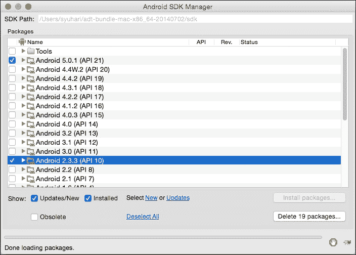

    +   点击 **安装包...**。

    +   选择每个许可并点击 **接受**，如图所示：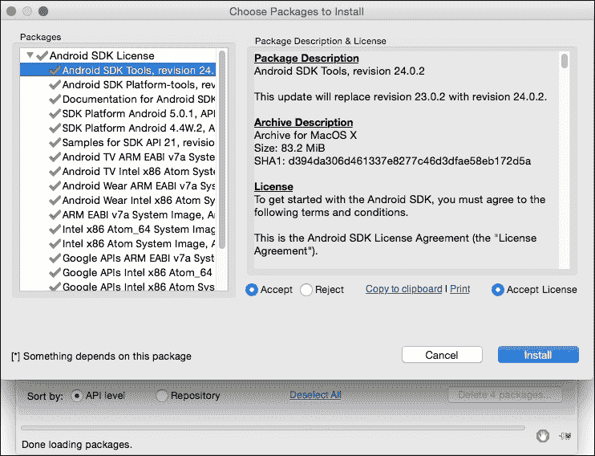

    +   接受所有许可后，您将看到**安装**按钮已启用。点击它。

    +   您需要等待很长时间才能更新和安装 SDK。

1.  安装 NDK：

    打开终端窗口，将目录更改为您下载包的路径。更改下载包的权限并执行包。例如：

    ```cpp
    $ chmod 700 android-ndk-r10c-darwin-x86_64.bin
    $ ./android-ndk-r10c-darwin-x86_64.bin

    ```

    最后，您将 `NDK` 文件夹移动到 `Documents` 文件夹。我们称 NDK 的安装路径为 `NDK_ROOT`。`NDK_ROOT` 是包含文件的文件夹的地址，它帮助 Cocos2dx 引擎定位 Android 的本地文件。您必须记住 `NDK_ROOT`，因为您将在下一个菜谱中使用它。

1.  安装 Apache ANT：

    将文件解压缩到 `Documents` 文件夹。这就完成了。我们将 ANT 的安装路径称为 `ANT_ROOT`。您必须记住 `ANT_ROOT`，因为我们将在下一个菜谱中使用它。

1.  安装 Java：

    通过在终端中输入以下命令，您可以自动安装 Java（如果您之前尚未安装）：

    ```cpp
    $ java --version

    ```

    安装完成后，您可以通过再次输入命令来检查它是否已成功安装。

## 它是如何工作的...

让我们看看在整个过程中我们做了什么：

+   安装 Eclipse：您可以将 Eclipse 用作 Cocos2d-x 的编辑器

+   安装 ADT：您可以在 Eclipse 上开发 Android 应用程序

+   安装 NDK：您可以为 Java 构建一个 C++ 源代码

+   安装 ANT：您可以使用 Cocos2d-x 的命令行工具

现在您已经完成了 Android 开发环境的设置。此时，您知道如何安装它们及其路径。在下一个菜谱中，您将使用它们来构建和执行 Android 应用程序。当您想要调试 Android 应用程序时，这将非常有用。

# 安装 Cocos2d-x

## 准备中

要遵循此食谱，你需要从 Cocos2d-x 的官方网站下载 zip 文件（[`www.cocos2d-x.org/download`](http://www.cocos2d-x.org/download)）。

在撰写这本书的时候，版本 3.4 是当时可用的最新稳定版本。这本书将使用这个版本。

## 如何操作...

1.  将你的文件解压到任何文件夹中。这次，我们将安装到用户的家目录。例如，如果用户名是 `syuhari`，那么安装路径是 `/Users/syuhari/cocos2d-x-3.4`。在这本书中，我们称之为 `COCOS_ROOT`。

1.  以下步骤将指导你完成设置 Cocos2d-x 的过程：

    +   打开终端

    +   在终端中更改目录到 `COCOS_ROOT`，使用以下命令：

        ```cpp
        $ cd ~/cocos2d-x-v3.4

        ```

    +   使用以下命令运行 `setup.py`：

        ```cpp
        $ ./setup.py

        ```

    +   终端会要求你输入 `NDK_ROOT`。输入到 `NDK_ROOT` 路径。

    +   终端会要求你输入 `ANDROID_SDK_ROOT`。输入 `ANDROID_SDK_ROOT` 路径。

    +   最后，终端会要求你输入 `ANT_ROOT`。输入 `ANT_ROOT` 路径。

    +   执行 `setup.py` 命令后，你需要执行以下命令来添加系统变量：

        ```cpp
        $ source ~/.bash_profile

        ```

        ### 小贴士

        打开 `.bash_profile` 文件，你会看到 `setup.py` 展示了如何在系统中设置每个路径。你可以使用 `cat` 命令查看 `.bash_profile` 文件：

        ```cpp
        $ cat ~/.bash_profile

        ```

1.  我们现在验证 Cocos2d-x 是否可以安装：

    +   打开终端并运行不带参数的 `cocos` 命令：

        ```cpp
        $ cocos

        ```

    +   如果你看到一个像以下截图所示的窗口，说明你已经成功完成了 Cocos2d-x 的安装过程：

    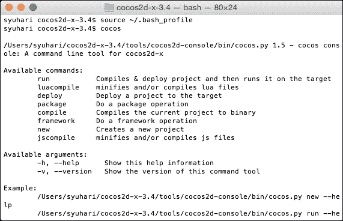

## 它是如何工作的...

让我们看看在上面的食谱中我们做了什么。你可以通过解压来安装 Cocos2d-x。你知道 `setup.py` 只是在环境中设置 `cocos` 命令和 Android 构建路径。安装 Cocos2d-x 非常简单和直接。如果你想安装 Cocos2d-x 的不同版本，你也可以这样做。要做到这一点，你需要遵循这个食谱中给出的相同步骤，但它们将适用于不同的版本。

## 更多内容...

设置 Android 环境有点困难。如果你最近开始开发 Cocos2d-x，你可以跳过 Android 的设置部分，并在 Android 上运行时进行设置。在这种情况下，你不需要安装 Android SDK、NDK 和 Apache ANT。此外，当你运行 `setup.py` 时，你只需按 *Enter* 键，无需为每个问题输入路径。

# 使用 Cocos 命令

下一步是使用 `cocos` 命令。这是一个跨平台工具，你可以用它来创建新项目、构建、运行和部署。`cocos` 命令适用于所有 Cocos2d-x 支持的平台，如果你不想使用 IDE，你也不需要使用它。在这个食谱中，我们将查看这个命令并解释如何使用它。

## 如何操作...

1.  你可以通过执行带有 `--help` 参数的 `cocos` 命令来使用 `cocos` 命令的帮助，如下所示：

    ```cpp
    $ cocos --help

    ```

1.  我们接下来将生成我们的新项目：

    首先，我们使用`cocos new`命令创建一个新的 Cocos2d-x 项目，如下所示：

    ```cpp
    $ cocos new MyGame -p com.example.mygame -l cpp -d ~/Documents/

    ```

    此命令的结果如下截图所示：

    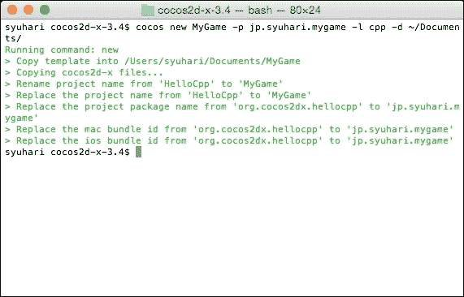

    在`new`参数后面是项目名称。提到的其他参数表示以下内容：

    +   `MyGame`是项目的名称。

    +   `-p`是 Android 的包名。这是 Google Play 商店中的应用程序 ID。因此，你应该使用反向域名作为唯一名称。

    +   `-l`是项目使用的编程语言。你应该使用`cpp`，因为我们将在本书中使用 C++。

    +   `-d`是生成新项目的位置。这次，我们在用户的文档目录中生成。

    你可以使用以下命令查找这些变量：

    ```cpp
    $ cocos new —help

    ```

    恭喜你，你可以生成你的新项目。下一步是使用`cocos`命令构建和运行。

1.  编译项目：

    如果你想为 iOS 构建和运行，你需要执行以下命令：

    ```cpp
    $ cocos run -s ~/Documents/MyGame -p ios

    ```

    提到的参数解释如下：

    +   `-s`是项目目录。这可以是绝对路径或相对路径。

    +   `-p`表示要运行的平台。如果你想运行在 Android 上，使用`-p android`。可用选项有 IOS、Android、Win32、Mac 和 Linux。

    +   你可以通过运行`cocos run –help`来获取更详细的信息。

    此命令的结果如下截图所示：

    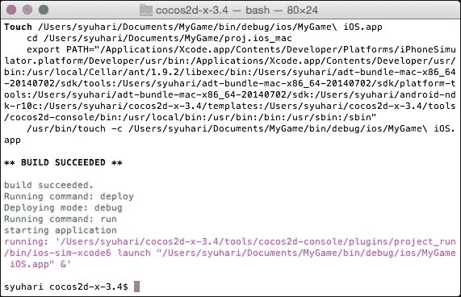

1.  现在，你可以在 cocos2d-x 上构建和运行 iOS 应用程序。然而，如果你是第一次构建 iOS 应用程序，你可能需要等待很长时间。构建 Cocos2d-x 库需要很长时间，这取决于是否是干净构建或首次构建。

## 它是如何工作的...

`cocos`命令可以创建新项目并构建它。如果你想创建新项目，你应该使用`cocos`命令。当然，你也可以使用 Xcode 或 Eclipse 来构建。你可以使用这些工具轻松开发和调试。

## 还有更多...

cocos `run`命令还有其他参数。它们如下所示：

+   `--portrait`会将项目设置为横幅模式。此命令没有参数。

+   `--ios-bundleid`将为 iOS 项目设置包 ID。然而，稍后设置它并不困难。

`cocos`命令还包括其他一些命令，如下所示：

+   `compile`命令：此命令用于构建项目。以下模式是有用的参数。如果你执行`cocos compile [–h]`命令，你可以看到所有参数和选项：

    ```cpp
    cocos compile [-h] [-s SRC_DIR] [-q] [-p PLATFORM] [-m MODE]

    ```

+   `deploy`命令：此命令仅在目标平台为 Android 时生效。它将重新安装指定的项目到 Android 设备或模拟器：

    ```cpp
    cocos deploy [-h] [-s SRC_DIR] [-q] [-p PLATFORM] [-m MODE]

    ```

    ### 小贴士

    `run`命令继续编译和部署命令。

# 使用 Xcode 构建项目

## 准备工作

在使用 Xcode 构建项目之前，您需要一个带有 iOS 开发者账户的 Xcode 来在物理设备上进行测试。然而，您也可以在 iOS 模拟器上进行测试。如果您尚未安装 Xcode，您可以从 Mac App Store 获取它。一旦安装，请激活它。

## 如何操作...

1.  从 Xcode 打开您的项目：

    您可以通过双击放置在以下位置的文件来打开您的项目：`~/Documents/MyGame/proj.ios_mac/MyGame.xcodeproj`：

    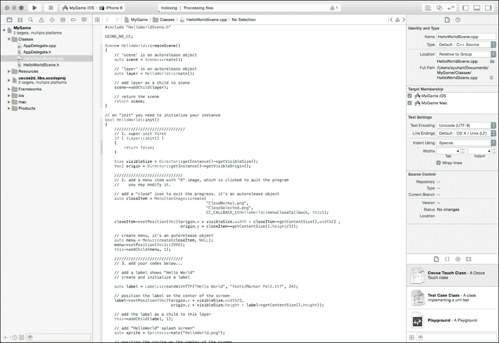

1.  使用 Xcode 进行构建和运行：

    您应该选择一个 iOS 模拟器或真实设备，您想在上面运行您的项目。

## 它是如何工作的...

如果这是您第一次构建，它将花费较长时间，但请有信心继续构建，因为这是第一次。如果您使用 Xcode 而不是 Eclipse 进行开发和调试，您可以更快地开发您的游戏。

# 使用 Eclipse 构建项目

## 准备工作

在开始此步骤之前，您必须完成第一个菜谱。如果您还没有完成，您将需要安装 Eclipse。

## 如何操作...

1.  设置 `NDK_ROOT`：

    +   打开 Eclipse 的首选项

    +   打开 **C++** | **Build** | **Environment**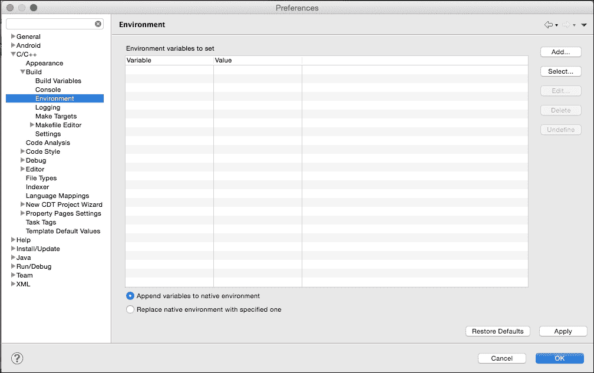

1.  点击 **添加** 并设置新变量，名称为 `NDK_ROOT`，其值为 `NDK_ROOT` 路径：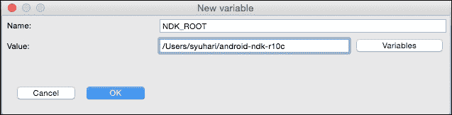

1.  将您的项目导入到 Eclipse 中：

    +   打开文件并点击 **导入**

    +   前往 **Android** | **Existing Android Code into Workspace**

    +   点击 **下一步**

    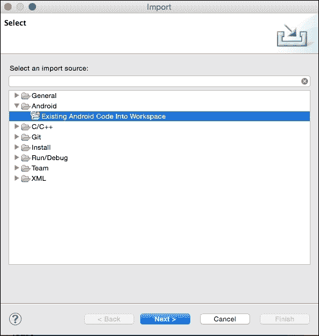

1.  在 `~/Documents/MyGame/proj.android` 处将项目导入到 Eclipse：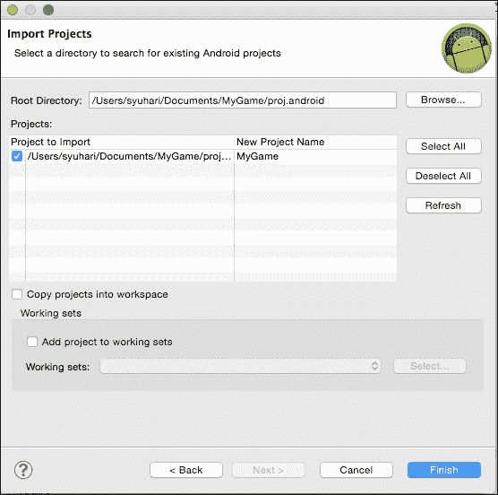

1.  将 Cocos2d-x 库导入到 Eclipse 中：

    +   从步骤 3 到步骤 4 执行相同的步骤。

    +   使用以下命令在 `~/Documents/MyGame/cocos2d/cocos/platform/android/java` 处导入项目 `cocos2d lib`：

        ```cpp
        importing cocos2d lib

        ```

    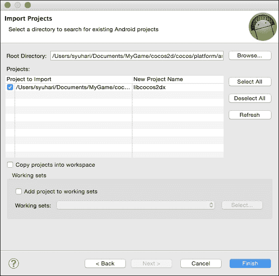

1.  构建和运行：

    +   点击 `Run` 图标

    +   第一次运行时，Eclipse 将会要求您选择运行应用程序的方式。选择 **Android Application** 并点击 **确定**，如图所示：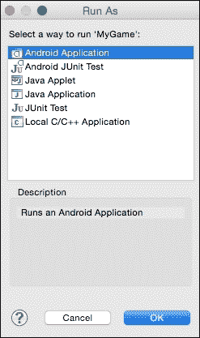

    +   如果您已将 Android 设备连接到您的 Mac，您可以在真实设备或模拟器上运行您的游戏。以下截图显示它在 Nexus5 上运行：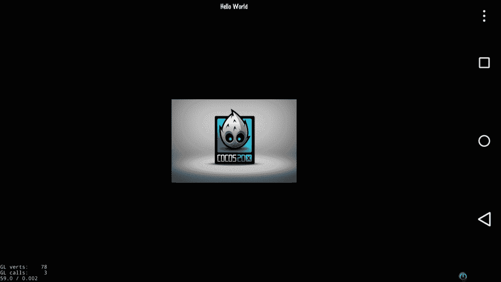

1.  如果您将 `cpp` 文件添加到您的项目中，您必须修改 `~/Documents/MyGame/proj.android/jni/Android.mk` 中的 `Android.mk` 文件。此文件是构建 NDK 所必需的。为了添加文件，需要进行此修复。

1.  原始的 `Android.mk` 可能如下所示：

    ```cpp
    LOCAL_SRC_FILES := hellocpp/main.cpp \
                       ../../Classes/AppDelegate.cpp \
                       ../../Classes/HelloWorldScene.cpp
    ```

1.  如果您添加了 `TitleScene.cpp` 文件，您必须按照以下代码进行修改：

    ```cpp
    LOCAL_SRC_FILES := hellocpp/main.cpp \
                       ../../Classes/AppDelegate.cpp \
                       ../../Classes/HelloWorldScene.cpp \
                       ../../Classes/TitleScene.cpp 
    ```

上述示例显示了添加 `TitleScene.cpp` 文件的一个实例。然而，如果您还添加了其他文件，您需要添加所有添加的文件。

## 它是如何工作的...

当你将项目导入 Eclipse 时，你会遇到很多错误，但不要慌张。在导入 Cocos2d-x 库后，错误很快就会消失。这允许我们设置 NDK 的路径，Eclipse 可以编译 C++。在你修改了 C++ 代码后，在 Eclipse 中运行你的项目。Eclipse 会自动编译 C++ 代码、Java 代码，然后运行。

再次修复 `Android.mk` 以添加 C++ 文件是一项繁琐的任务。以下代码是原始的 `Android.mk`：

```cpp
LOCAL_SRC_FILES := hellocpp/main.cpp \
                   ../../Classes/AppDelegate.cpp \
                   ../../Classes/HelloWorldScene.cpp

LOCAL_C_INCLUDES := $(LOCAL_PATH)/../../Classes
```

以下代码是自动添加 C++ 文件的定制 `Android.mk`：

```cpp
CPP_FILES := $(shell find $(LOCAL_PATH)/../../Classes -name *.cpp)
LOCAL_SRC_FILES := hellocpp/main.cpp
LOCAL_SRC_FILES += $(CPP_FILES:$(LOCAL_PATH)/%=%)

LOCAL_C_INCLUDES := $(shell find $(LOCAL_PATH)/../../Classes -type d)
```

代码的第一行将 C++ 文件移动到 `Classes` 目录，并将它们添加到 `CPP_FILES` 变量中。第二行和第三行将 C++ 文件添加到 `LOCAL_C_INCLUDES` 变量中。这样做后，C++ 文件将自动在 NDK 中编译。如果你需要编译扩展名不是 `.cpp` 的文件，你需要手动添加它。

## 还有更多...

如果你想在 NDK 中手动构建 C++，可以使用以下命令：

```cpp
$ ./build_native.py

```

这个脚本位于 `~/Documents/MyGame/proj.android`。它使用了 `ANDROID_SDK_ROOT` 和 `NDK_ROOT`。如果你想查看它的选项，运行 `./build_native.py –help`。

# 实现多分辨率支持

你可能会在不同设备上注意到屏幕外观的差异。在一些之前的菜谱中，有一个 iOS 的屏幕截图和一个 Nexus 5 的屏幕截图。它们显示了不同的图像大小。这张图片是位于 `MyGame/Resources` 的 `HelloWorld.png`，分辨率为 480 x 320 像素。在这个菜谱中，我们解释了如何保持相同的大小，无论屏幕大小如何。

## 如何做到这一点…

通过 Xcode 打开 `AppDelegate.cpp`，并在 `director->setAnimationInterval(1.0/60.0);` 行之后添加代码，如下所示：

```cpp
director->setAnimationInterval(1.0 / 60);
glview->setDesignResolutionSize(640, 960, ResolutionPolicy::NO_BORDER);
```

在这本书中，我们设计游戏时使用了 iPhone 3.5 英寸屏幕的屏幕尺寸。因此，我们使用 `setDesignResolutionSize` 方法将这个屏幕尺寸设置为设计分辨率大小。以下截图是在实现多分辨率后的 Nexus 5 的截图：

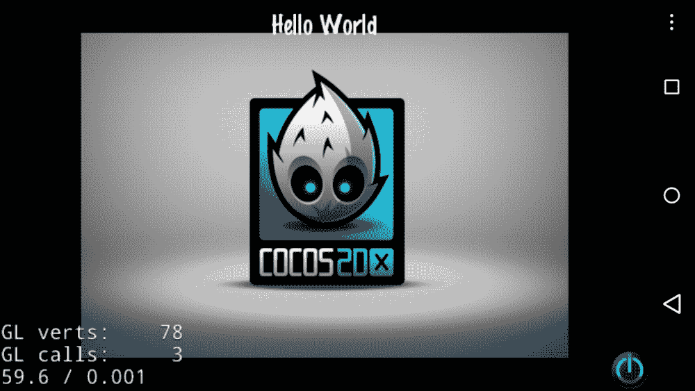

以下截图是 iPhone 5 模拟器的截图。你现在知道这两个截图的外观是相同的：

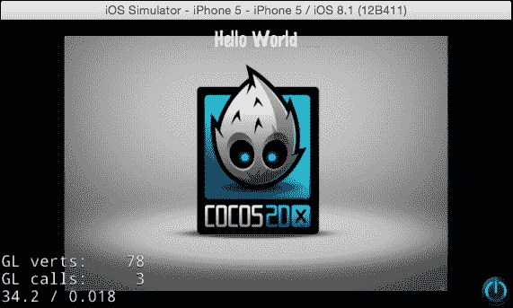

## 它是如何工作的…

分辨率策略有 `EXACT_FIT`、`NO_BORDER`、`SHOW_ALL`、`FIXED_HEIGHT` 和 `FIXED_WIDTH`。以下是对它们的解释：

+   `EXACT_FIT`：整个应用程序在指定区域内可见，不尝试保留原始宽高比。

+   `NO_BORDER`：整个应用程序填充指定区域，无扭曲但可能有些裁剪，同时保持应用程序的原始宽高比。

+   `SHOW_ALL`：整个应用程序在指定区域内可见，无扭曲，同时保持应用程序的内部宽高比。应用程序的两侧可能会出现边框。

+   `FIXED_HEIGHT`: 应用程序采用设计分辨率大小的高度，并修改内部画布的宽度，以便适应设备的纵横比。不会发生扭曲，但是你必须确保你的应用程序可以在不同的纵横比上运行。

+   `FIXED_WIDTH`: 应用程序采用设计分辨率大小的宽度，并修改内部画布的高度，以便适应设备的纵横比。不会发生扭曲，但是你必须确保你的应用程序可以在不同的纵横比上运行。

通过实现多分辨率，无论屏幕大小如何，你都将保持屏幕上的图像。

# 准备你的原始游戏

在下一章中，我们将开始原始游戏。你知道`HelloWorldScene.cpp`和`HelloWorldScene.h`文件中有很多注释和代码。这就是为什么我们将从模板项目中删除不必要的代码，并立即开始原始游戏。

## 如何操作…

1.  打开`HelloWorldScene.h`并删除`menuCloseCallback`方法和不必要的注释。现在`HelloWorldScene.h`应该看起来像以下代码：

    ```cpp
     #ifndef __HELLOWORLD_SCENE_H__
       #define __HELLOWORLD_SCENE_H__
       #include "cocos2d.h" 

       class HelloWorld : public cocos2d::Layer
       { 
    public:
        static cocos2d::Scene* createScene();
        virtual bool init();
        CREATE_FUNC(HelloWorld);
    };
    #endif // __HELLOWORLD_SCENE_H__
    ```

1.  下一步是打开`HelloWorldScene.cpp`并删除不必要的注释、代码和方法。现在`HelloWorldScene.cpp`应该看起来像以下代码：

    ```cpp
    #include "HelloWorldScene.h"
    USING_NS_CC; 
    Scene* HelloWorld::createScene()
    {
        auto scene = Scene::create();
        auto layer = HelloWorld::create();
        scene->addChild(layer);
        return scene;
    } 
    bool HelloWorld::init()
    {
        if ( !Layer::init() )
        {
            return false;
        }
        return true;
    }
    ```

1.  下一步是删除`resources`中的不必要图像。从 Xcode 中的`Resources`文件夹中删除`CloseNormal.png`、`CloseSelected.png`和`HelloWorld.png`：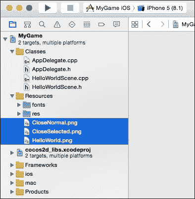

1.  最后，如果你只开发 iOS 和 Android 应用程序，你不需要为 Linux、Windows 和 Windows Phone 等其他平台准备文件。你应该删除这些文件。

    在删除平台文件之前，它应该看起来像以下截图：

    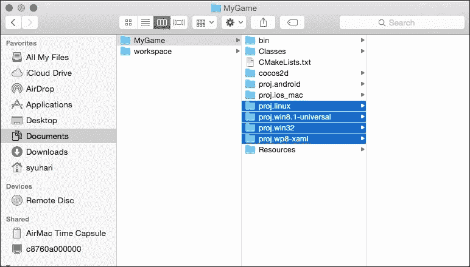

    删除平台文件后，它应该看起来像以下截图：

    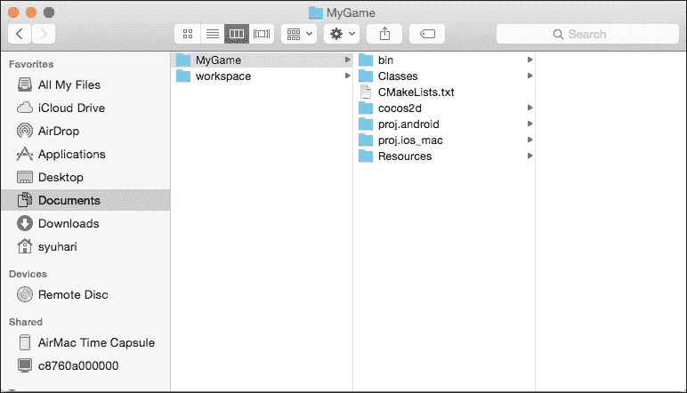

## 它是如何工作的…

使用这个配方，你可以在删除不必要的注释、代码和方法之前准备好最简单的项目。删除不必要的平台代码和资源对于减小应用程序的大小很重要。如果你从头开始构建你的原始游戏，你需要遵循这个配方，否则，如果你构建并运行这个项目，可能会得到一个黑屏。在下一章中，你可以在这个简单项目中开始编码。
