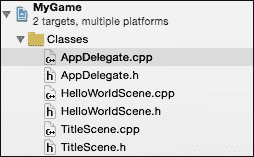
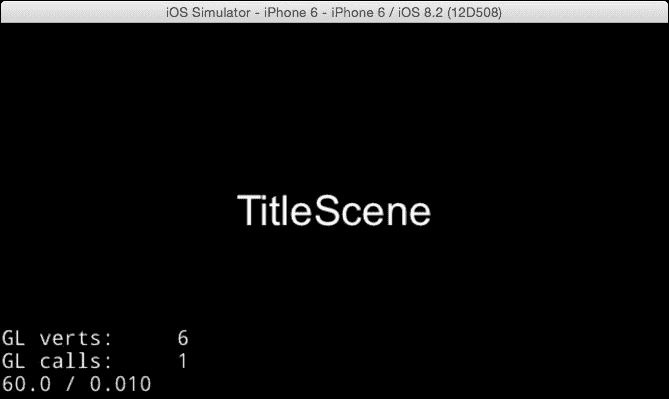

# 第四章：构建场景和层

本章将涵盖以下主题：

+   创建场景

+   场景间的切换

+   使用效果切换场景

+   为替换场景制作原创过渡效果

+   为弹出场景制作原创过渡效果

+   创建层

+   创建模态层

# 简介

一屏有一个场景。场景是一个容器，它包含精灵、标签和其他对象。例如，场景可以是标题场景、游戏场景或选项菜单场景。每个场景都有多个层。层是一个类似于 Photoshop 层的透明纸。添加到层中的对象将在屏幕上显示。在本章中，我们将解释如何使用`Scene`类和`Layer`类以及如何在场景间进行切换。最后，在本章结束时，你将能够创建原创的场景和层。

# 创建场景

在 Cocos2d-x 中，你的游戏应该有一个或多个场景。场景基本上是一个节点。在本食谱中，我们将解释如何创建和使用`Scene`类。

## 如何做...

在本食谱中，我们将使用在第一章中创建的项目，即*Cocos2d-x 入门*。

1.  首先，在`Finder`中复制`HelloWorldScene.cpp`和`HelloWorldScene.h`文件，并将它们重命名为`TitleScene.cpp`和`TitleScene.h`。其次，将它们添加到 Xcode 项目中。结果如下所示：

1.  接下来，我们必须将`HelloWorldScene`更改为`TitleScene`，并将搜索和替换方法放在提示部分。

    ### 小贴士

    **如何搜索和替换类名？**

    在此情况下，选择`TitleScene.h`，然后在 Xcode 中选择**查找** | **查找和替换…**菜单。然后，在**字符串匹配**区域输入`HelloWorld`，在**替换字符串**区域输入`TitleScene`。执行所有替换。对`TitleScene.cpp`执行相同的操作。结果如下所示：

    `TitleScene.h`的结果如下：

    ```cpp
    #ifndef __TitleScene_SCENE_H__
    #define __TitleScene_SCENE_H__

    #include "cocos2d.h"
    class TitleScene : public cocos2d::Layer
    {
    public:
        static cocos2d::Scene* createScene();
        virtual bool init();
        CREATE_FUNC(TitleScene);
    };

    #endif // __TitleScene_SCENE_H__
    ```

    接下来，`TitleScene.cpp`的结果如下：

    ```cpp
    #include "TitleScene.h"

    USING_NS_CC;

    Scene* TitleScene::createScene()
    {
        auto scene = Scene::create();
        auto layer = TitleScene::create();
        scene->addChild(layer);
        return scene;
    }

    // on "init" you need to initialize your instance
    bool TitleScene::init()
    {
        if ( !Layer::init() )
        {
            return false;
        }

        return true;
    }
    ```

1.  接下来，在`TitleScene`和`HelloWorldScene`之间的差异处添加一个标签。在`TitleScene::init`方法的返回行之前添加如下：

    ```cpp
    bool TitleScene::init()
    {
        if ( !Layer::init() )
        {
            return false;
        }

        auto size = Director::getInstance()->getWinSize();
        auto label =
        Label::createWithSystemFont("TitleScene", "Arial",
        40);
        label->setPosition(size/2);
        this->addChild(label);

        return true;
    }
    ```

1.  类似地，在`HelloWorld::init`方法中添加标签。

    ```cpp
    bool HelloWorld::init()
    {
        if ( !Layer::init() )
        {
            return false;
        }

        auto size = Director::getInstance()->getWinSize();
        auto label = Label::createWithSystemFont("HelloWorld",
        "Arial", 40);
        label->setPosition(size/2);
        this->addChild(label);

        return true;
    }
    ```

1.  接下来，为了显示`TitleScene`类，按照以下方式修改`AppDelegate.cpp`：

    ```cpp
    #include "TitleScene.h"

    bool AppDelegate::applicationDidFinishLaunching() {
        // initialize director
        auto director = Director::getInstance();
        auto glview = director->getOpenGLView();
        if(!glview) {
            glview = GLViewImpl::create("My Game");
            director->setOpenGLView(glview);
        }

        // turn on display FPS
        director->setDisplayStats(true);

        // set FPS. the default value is 1.0/60 if you don't
        call this director->setAnimationInterval(1.0 / 60);
        glview->setDesignResolutionSize(640, 960,
        ResolutionPolicy::NO_BORDER); 
        // create a scene. it's an autorelease object
        auto scene = TitleScene::createScene();

        // run
        director->runWithScene(scene);

        return true;
    }
    ```

结果如下所示：



## 它是如何工作的...

首先，你需要通过复制`HelloWorldScene`类文件来创建`TitleScene`。从空白文件创建一个原创的`Scene`类相当困难。然而，`Scene`的基本类是模式化的。因此，你可以通过复制和修改`HelloWorldScene`类文件来轻松创建它。当你开发游戏时，当你需要新的场景时，你需要执行此步骤。

最后，我们更改 `AppDelegate.cpp` 文件。`AppDelegate` 类是 Cocos2d-x 中首先执行的一个类。当应用程序准备好运行时，会执行 `AppDelegate::applicationDidFinishLaunching` 方法。此方法将准备 Cocos2d-x 的执行。然后，它将创建第一个场景并运行它。

```cpp
auto scene = TitleScene::createScene();
// run
director->runWithScene(scene);
```

`TitleScene::createScene` 方法用于创建一个标题场景，而 `runWithScene` 方法用于运行它。

# 场景之间的转换

您的游戏需要在场景之间进行转换。例如，在启动游戏后，会显示标题场景。然后，它会转换到关卡选择场景、游戏场景等等。在这个菜谱中，我们将解释如何促进场景之间的转换，这将提高游戏玩法和游戏流程。

## 如何做到这一点...

一个游戏有很多场景。因此，您可能需要在游戏中在不同场景之间移动。也许，当游戏开始时，会显示一个标题场景。然后，在下一个标题场景中会出现一个游戏场景。有两种方法可以转换到场景。

1.  一种方法是使用 `Director::replaceScene` 方法。此方法直接替换场景。

    ```cpp
    auto scene = HelloWorld::createScene();
    Director::getInstance()->replaceScene(scene);
    ```

1.  另一种方法是使用 `Director::pushScene` 方法。此方法挂起正在运行的场景，并在挂起场景的堆栈上推入一个新的场景。

    ```cpp
    auto scene = HelloWorld::createScene();
    Director::getInstance()->pushScene(scene);
    ```

在这种情况下，旧场景被挂起。您可以回到旧场景以弹出新的场景。

```cpp
auto Director::getInstance()->popScene();
```

## 它是如何工作的...

可以通过使用 `addChild` 方法来显示层、精灵和其他节点。然而，场景不能通过 `addChild` 方法来显示；它可以通过使用 `Director::replaceScene` 或 `Director::pushScene` 方法来显示。这就是为什么场景在同一时间只能在一个屏幕上可见。`Scene` 和 `Layer` 类似，但存在显著差异。

通常，当您从标题场景切换到游戏场景时，您会使用 `replaceScene` 方法。进一步，您可以使用 `pushScene` 方法显示模态场景，例如在游戏暂停期间。在这种情况下，挂起游戏场景的一个简单方法是暂停游戏。

### 小贴士

当在游戏中替换场景时，应用程序将释放旧场景使用的内存。然而，如果游戏推入场景，它们将不会释放旧场景使用的内存，因为它们将挂起它。此外，当弹出新场景时，游戏将恢复。如果您使用 `pushScene` 方法添加了大量的场景，设备内存将不再足够。

# 带效果的场景转换

流行游戏在场景转换时显示一些效果。这些效果可以是自然的、戏剧性的等等。Cocos2d-x 有很多转换效果。在这个菜谱中，我们将解释如何使用转换效果及其产生的效果。

## 如何做到这一点...

您可以使用 `Transition` 类为场景过渡添加视觉效果。Cocos2d-x 有许多种 `Transition` 类。然而，使用它们的模式只有一种。

```cpp
auto nextScene = HelloWorld::createScene();
auto transition = TransitionFade::create(1.0f, nextScene);
Director::getInstance()->replaceScene(transition);
```

这可以在场景被推入时使用。

```cpp
auto nextScene = HelloWorld::createScene();
auto transition = TransitionFade::create(1.0f, nextScene);
Director::getInstance()->pushScene(transition);
```

## 它是如何工作的...

首先，您需要创建 `nextscene` 对象。然后，您需要创建一个具有设定持续时间和即将进入的场景对象的 `transition` 对象。最后，您需要使用 `transition` 对象运行 `Director::pushScene`。此配方将过渡场景的持续时间和淡入淡出动作设置为 1 秒。以下表格列出了主要的 `Transition` 类：

| `Transition Class` | 描述 |
| --- |
| `TransitionRotoZoom` | 旋转并缩放即将离开的场景，然后旋转并缩放进入即将进入的场景。 |
| `TransitionJumpZoom` | 缩放并跳转到即将离开的场景，然后跳转并缩放进入即将进入的场景。 |
| `TransitionMoveInL` | 从右向左移动场景。 |
| `TransitionSlideInL` | 从左侧滑入即将进入的场景。 |
| `TransitionShrinkGrow` | 在缩小即将离开的场景的同时放大即将进入的场景。 |
| `TransitionFlipX` | 水平翻转屏幕。 |
| `TransitionZoomFlipX` | 通过缩放和平移水平翻转屏幕。正面显示的是即将离开的场景，背面显示的是即将进入的场景。 |
| `TransitionFlipAngular` | 将屏幕水平翻转一半，垂直翻转一半。 |
| `TransitionZoomFlipAngular` | 通过稍微缩放和平移水平翻转一半，垂直翻转一半。 |
| `TransitionFade` | 从即将离开的场景淡出，然后淡入即将进入的场景。 |
| `TransitionCrossFade` | 使用 `RenderTexture` 对象交叉淡入两个场景。 |
| `TransitionTurnOffTiles` | 以随机顺序关闭即将离开的场景的瓦片。 |
| `TransitionSplitCols` | 奇数列向上移动，偶数列向下移动。 |
| `TransitionSplitRows` | 奇数行向左移动，偶数行向右移动。 |
| `TransitionFadeTR` | 从左下角到右上角渐变即将离开的场景的瓦片。 |
| `TransitionFadeUp` | 从底部到顶部渐变即将离开的场景的瓦片。 |
| `TransitionPageTurn` | 将场景的右下角翻起，以过渡到下面的场景，从而模拟翻页效果。 |
| `TransitionProgressRadialCW` | 逆时针径向过渡到下一个场景。 |

## 还有更多...

您还可以通过使用 `onEnterTransitionDidFinish` 方法和 `onExitTransitionDidStart` 方法来学习过渡场景的开始和结束。当您的游戏完全显示新场景时，`onEnterTransitionDidFinish` 方法会被调用。当旧场景开始消失时，`onExitTransitionDidStart` 方法会被调用。如果您想在场景出现或消失期间做些事情，您将需要使用这些方法。

现在我们来看一个使用 `onEnterTransitionDidFinish` 和 `onExitTransitionDidStart` 方法的例子。`HelloWorldScene.h` 包含以下代码：

```cpp
class HelloWorld : public cocos2d::Layer
{
public:
  static cocos2d::Scene* createScene();
  virtual bool init();
  CREATE_FUNC(HelloWorld);

  virtual void onEnterTransitionDidFinish();
  virtual void onExitTransitionDidStart();
};

HelloWorldScene.cpp has the following code:
void HelloWorld::onEnterTransitionDidFinish()
{
  CCLOG("finished enter transition");
}

void HelloWorld::onExitTransitionDidStart()
{
  CCLOG("started exit transition");
}
```

# 为替换场景制作原创过渡

你知道 Cocos2d-x 有很多过渡效果。然而，如果你需要的过渡效果它没有，那么创建一个原创的过渡效果是困难的。但是，如果你有基本的过渡效果知识，你仍然可以创建它。在这个菜谱中，我们将向你展示如何创建原创的过渡效果。

## 如何做...

尽管 Cocos2d-x 有很多不同类型的 `Transition` 类，但你可能找不到你需要的过渡效果。在这个菜谱中，你可以创建一个如开门这样的原创过渡效果。当场景替换开始时，上一个场景被分割成两部分并向左或向右打开。

你必须创建名为 "`TransactionDoor.h`" 和 "`TransactionDoor.cpp`" 的新文件，并将它们添加到你的项目中。

`TransactionDoor.h` 包含以下代码：

```cpp
#ifndef __TRANSITIONDOOR_H__
#define __TRANSITIONDOOR_H__

#include "cocos2d.h"

NS_CC_BEGIN

class CC_DLL TransitionDoor : public TransitionScene , public TransitionEaseScene
{
public:
  static TransitionDoor* create(float t, Scene* scene);

  virtual ActionInterval* action();
  virtual void onEnter() override;
  virtual ActionInterval * easeActionWithAction(ActionInterval * action) override;
  virtual void onExit() override;
  virtual void draw(Renderer *renderer, const Mat4 &transform,
  uint32_t flags) override;
  CC_CONSTRUCTOR_ACCESS:
  TransitionDoor();
  virtual ~TransitionDoor();

protected:
  NodeGrid* _gridProxy;
  private:
  CC_DISALLOW_COPY_AND_ASSIGN(TransitionDoor);
};

class CC_DLL SplitDoor : public TiledGrid3DAction
{
public:
  /**
   * creates the action with the number of columns to split and
   the duration
   * @param duration in seconds
   */
  static SplitDoor* create(float duration, unsigned int cols);

  // Overrides
  virtual SplitDoor* clone() const override;
  /**
   * @param time in seconds
   */ 
  virtual void update(float time) override;
  virtual void startWithTarget(Node *target) override;

CC_CONSTRUCTOR_ACCESS:
  SplitDoor() {}
  virtual ~SplitDoor() {}

  /** initializes the action with the number of columns to split
and the duration */
  bool initWithDuration(float duration, unsigned int cols);

protected:
  unsigned int _cols;
  Size _winSize;

private:
  CC_DISALLOW_COPY_AND_ASSIGN(SplitDoor);
};

NS_CC_END

#endif /* defined(__TRANSITIONDOOR_H__) */
```

使用以下代码为 `TransactionDoor.cpp`：

```cpp
#include "TransitionDoor.h"

NS_CC_BEGIN

TransitionDoor::TransitionDoor()
{
  _gridProxy = NodeGrid::create();
  _gridProxy->retain();
}
TransitionDoor::~TransitionDoor()
{
  CC_SAFE_RELEASE(_gridProxy);
}

TransitionDoor* TransitionDoor::create(float t, Scene* scene)
{
  TransitionDoor* newScene = new (std::nothrow) TransitionDoor();
  if(newScene && newScene->initWithDuration(t, scene))
  {
    newScene->autorelease();
    return newScene;
  }
  CC_SAFE_DELETE(newScene); 
  return nullptr;
}

void TransitionDoor::onEnter()
{
  TransitionScene::onEnter();

  _inScene->setVisible(true);

  _gridProxy->setTarget(_outScene);
  _gridProxy->onEnter();

  ActionInterval* split = action();
  ActionInterval* seq = (ActionInterval*)Sequence::create
  (
   split,
   CallFunc::create(CC_CALLBACK_0(TransitionScene::finish,this)),
   StopGrid::create(),
   nullptr
   );

  _gridProxy->runAction(seq);
}

void TransitionDoor::draw(Renderer *renderer, const Mat4
&transform, uint32_t flags)
{
  Scene::draw(renderer, transform, flags);
  _inScene->visit();
  _gridProxy->visit(renderer, transform, flags);
}

void TransitionDoor::onExit()
{
  _gridProxy->setTarget(nullptr);
  _gridProxy->onExit();
  TransitionScene::onExit();
}

ActionInterval* TransitionDoor:: action()
{
  return SplitDoor::create(_duration, 3);
}

ActionInterval*
TransitionDoor::easeActionWithAction(ActionInterval * action)
{
  return EaseInOut::create(action, 3.0f);
}

SplitDoor* SplitDoor::create(float duration, unsigned int cols)
{
  SplitDoor *action = new (std::nothrow) SplitDoor();

  if (action)
  {
    if (action->initWithDuration(duration, cols))
    {
      action->autorelease();
    }
    else
    {
      CC_SAFE_RELEASE_NULL(action);
    }
  }

  return action;
}

bool SplitDoor::initWithDuration(float duration, unsigned int cols)
{
  _cols = cols;
  return TiledGrid3DAction::initWithDuration(duration, Size(cols,
1));
}

SplitDoor* SplitDoor::clone() const 
{
  // no copy constructor
  auto a = new (std::nothrow) SplitDoor();
  a->initWithDuration(_duration, _cols);
  a->autorelease();
  return a;
}

void SplitDoor::startWithTarget(Node *target)
{
  TiledGrid3DAction::startWithTarget(target);
  _winSize = Director::getInstance()->getWinSizeInPixels();
}

void SplitDoor::update(float time)
{
  for (unsigned int i = 0; i < _gridSize.width; ++i) 
  {
    Quad3 coords = getOriginalTile(Vec2(i, 0));
    float  direction = 1;

    if ( (i % 2 ) == 0 )
    {
      direction = -1;
    }

    coords.bl.x += direction * _winSize.width/2 * time;
    coords.br.x += direction * _winSize.width/2 * time;
    coords.tl.x += direction * _winSize.width/2 * time;
    coords.tr.x += direction * _winSize.width/2 * time;|

    setTile(Vec2(i, 0), coords);
  }
}
NS_CC_END
```

以下代码将允许我们使用 `TransitionDoor` 效果：

```cpp
auto trans = TransitionDoor::create(1.0f,
HelloWorld::createScene());
Director::getInstance()->replaceScene(trans);
```

## 它是如何工作的...

所有类型的过渡都以 `TransitionScene` 作为 `SuperClass`。`TransitionScene` 是一个基本类，具有基本的过渡过程。如果你想以更简单的方式创建原创的过渡效果，你会在 Cocos2d-x 中寻找类似的过渡效果。然后，你可以从类似的类创建你的类。`TransitionDoor` 类是从 `TransitionSplitCol` 类创建的。然后，根据需要添加和修改它们。然而，为了修复它们，你需要对这些有基本的知识。

`Transition` 类的一些重要属性如下：

| 属性 | 描述 |
| --- | --- |
| `_inScene` | 指向下一个场景的指针。 |
| `_outScene` | 出场景的指针。 |
| `_duration` | 过渡的持续时间，由创建方法指定的浮点值。 |
| `_isInSceneOnTop` | 布尔值；如果为真，则下一个场景是场景图的顶部。 |

`transition` 类的一些重要属性如下：

| 属性 | 描述 |
| --- | --- |
| `onEnter` | 开始过渡效果。 |
| `Action` | 创建效果动作。 |
| `onExit` | 完成过渡效果并进行清理。 |

在 `TransitionDoor` 类的情况下，下一个场景在 `onEnter` 方法中被设置为可见，上一个场景在分割成两个网格。然后，开始一个如开门这样的效果。在动作方法中，通过使用 `SplitDoor` 类创建 `Action` 类的实例。`SplitDoor` 类基于 Cocos2d-x 中的 `SplitCol` 类。`SplitDoor` 类将上一个场景的两个网格向左或向右移动。

## 更多...

除了上述描述的方法之外，还有一些必要的方法。这些方法在 `Node` 类中定义。

| 属性 | 描述 |
| --- | --- |
| `onEnter` | 节点开始出现在屏幕上 |
| `onExit` | 节点从屏幕消失 |
| `onEnterTransitionDidFinish` | 节点在屏幕上出现后完成过渡效果 |
| `onExitTransitionDidStart` | 节点在从屏幕消失前开始过渡效果 |

如果您想在场景出现在屏幕上时播放背景音乐，您可以通过使用 `onEnter` 方法来播放它。如果您想在过渡效果完成之前播放它，请使用 `onEnterTransitionDidFinish` 方法。除此之外，`onEnter` 方法中的初始过程在 `onEnterTransitionDidFinish` 方法中开始动画，在 `onExit` 方法中清理过程，等等。

# 为弹出场景创建原创过渡效果

Cocos2d-x 为推入场景提供了过渡效果。但由于某种原因，它没有为弹出场景提供过渡效果。我们希望在推入场景后使用效果弹出场景。在本教程中，我们将解释如何为弹出场景创建一个原创的过渡效果。

## 准备工作

在本教程中，您将了解如何使用效果弹出过渡场景。您需要创建一个新的类，因此您必须创建名为 `DirectorEx.h` 和 `DirectorEx.cpp` 的新类文件，并将它们添加到您的项目中。

## 如何操作...

Cocos2d-x 为推入场景提供了带有效果的过渡场景。然而，它没有为弹出场景提供过渡效果。因此，我们创建了一个名为 `DirectorEx` 的原创类来为弹出场景创建过渡效果。接下来的代码片段提供了代码示例。

`DirectorEx.h` 包含以下代码：

```cpp
class DirectorEx : public Director
{
public:
  Scene* previousScene(void);
  void popScene(Scene* trans);
};
```

`DirectorEx.cpp` 包含以下代码：

```cpp
#include "DirectorEx.h"

Scene* DirectorEx::previousScene()
{
  ssize_t sceneCount = _scenesStack.size();
  if (sceneCount <= 1) {
    return nullptr;
  }
  return _scenesStack.at(sceneCount-2);
}

void DirectorEx::popScene(Scene* trans)
{
  _scenesStack.popBack();
  ssize_t sceneCount = _scenesStack.size();
  if (sceneCount==0) {
    end();
  } else {
    _sendCleanupToScene = true;
    _nextScene = trans;
  }
}
```

此类可以使用如下：

```cpp
DirectorEx* directorEx = static_cast<DirectorEx*>(Director::getInstance());
Scene* prevScene = directorEx->previousScene();
Scene* pScene = TransitionFlipX::create(duration, prevScene);
directorEx->popScene(pScene);
```

## 它是如何工作的...

如果我们自定义了 Cocos2d-x 中的 `Director` 类，它可以使用弹出场景的效果进行过渡。然而，这并不是一个好主意。因此，我们创建了一个名为 `DirectorEx` 的 `Director` 类的子类，并使用此类如下：

1.  首先，您可以通过获取 `DirectorEx` 类的实例来将 `Director` 类的实例进行转换。

    ```cpp
    DirectorEx* directorEx = static_cast<DirectorEx*>(Director::getInstance());
    ```

1.  此外，您还需要获取前一个场景的实例。

    ```cpp
    Scene* prevScene = directorEx->previousScene();
    ```

1.  接下来，您必须创建一个过渡效果。

    ```cpp
    Scene* pScene = TransitionFlipX::create(duration, prevScene);
    ```

1.  最后，您可以使用 `DirectorEx::popScene` 方法使用此效果弹出场景。

    ```cpp
    directorEx->popScene(pScene);
    ```

# 创建层

层是一个可以在 `Scene` 上使用的对象。它类似于 Photoshop 中的图层的一个透明层。所有对象都添加到 `Layer` 中，以便在屏幕上显示。此外，一个场景可以有多个层。层还负责接受输入、绘制和触摸。例如，在游戏中，一个场景有一个背景层、HUD 层和一个玩家的层。在本教程中，我们将解释如何使用 `Layer`。

## 如何操作...

以下代码展示了如何创建一个层并将其添加到场景中：

```cpp
auto layer = Layer::create();
this->addChild(layer);
```

这很简单。如果您有一个颜色层，您就可以做到。

```cpp
auto layer = LayerColor::create(Color4B::WHITE);
this->addChild(layer);
```

## 它是如何工作的...

场景类是显示在屏幕上的，但 `Layer` 类可以堆叠在多个层中。场景有一个或多个层，精灵必须位于一个层上。`Layer` 类是一个透明的纸。此外，一个透明的节点需要更多的 CPU 资源。因此，你需要小心不要堆叠太多的层。

# 创建模态层

在用户界面设计中，模态层是一个重要的层。模态层就像一个子窗口。当模态层显示时，玩家不能触摸模态层外的任何其他按钮。他们只能触摸模态层上的按钮。当我们需要与玩家确认某些事情时，我们需要模态层。在这个菜谱中，我们将解释如何创建模态层。

## 如何操作...

首先，你需要创建两个名为 `ModalLayer.h` 和 `ModalLayer.cpp` 的新文件。它们应该包含以下代码：

`ModalLayer.h` 应该包含以下代码：

```cpp
#include "cocos2d.h"

USING_NS_CC;

class ModalLayer : public Layer
{
public:
  ModalLayer();
  ~ModalLayer();
  bool init();
  CREATE_FUNC(ModalLayer);
  void close(Ref* sender=nullptr);
};

ModalLayer.cpp should have the following code:
#include "ModalLayer.h"
USING_NS_CC;

ModalLayer::ModalLayer()
{
}

ModalLayer::~ModalLayer()
{
}

bool ModalLayer::init()
{
  if (!Layer::init())
  {
    return false;
  }

  auto listener = EventListenerTouchOneByOne::create();
  listener->setSwallowTouches(true);
  listener->onTouchBegan = [](Touch *touch,Event*event)->bool{
  return true; };
  this->getEventDispatcher()->addEventListenerWithSceneGraphPriority(listener, this);

  return true;
}

void ModalLayer::close(Ref* sender)
{
  this->removeFromParentAndCleanup(true);
}
```

你应该从 `ModalLayer` 类创建一个子类，并添加一个菜单按钮或你需要的设计。然后，你必须创建它的一个实例并将其添加到正在运行的场景中。然后，它应该启用模态层上的按钮，但禁用模态层底部的按钮。

```cpp
// add modal layer
auto modal = ModalLayer::create();
this->addChild(modal);

// close modal layer
modal->close();
```

## 它是如何工作的...

在 Cocos2d-x 版本 3 中创建模态层很容易。在版本 3 中，触摸事件从层的顶部发生。所以，如果模态层捕捉到所有触摸事件，那么位于模态层下的节点会收到这些事件的通知。模态层正在捕捉所有的事件。请参考以下代码：

```cpp
listener->onTouchBegan = [](Touch *touch,Event*event)->bool{ return true; };
```

### 小贴士

这个模态层可以捕捉所有触摸事件。然而，Android 有像返回键这样的按键事件。当玩家在模态层显示时触摸返回键，你必须决定如何处理。在一种情况下，模态层会被关闭，在另一种情况下，返回键会被忽略。
