# 第五章：创建 GUI

在本章中，我们将创建各种 UI 组件。本章将涵盖以下主题：

+   创建菜单

+   创建按钮

+   创建复选框

+   创建加载条

+   创建滑块

+   创建文本字段

+   创建滚动视图

+   创建页面视图

+   创建列表视图

# 简介

游戏有很多 GUI 组件，例如，有菜单、按钮、复选框、加载条等等。没有这些组件我们无法制作游戏。此外，这些与之前讨论的节点略有不同。在本章中，我们将了解如何为游戏创建各种 GUI 组件，如菜单、滑块、文本字段等。

# 创建菜单

在这个菜谱中，我们将创建一个菜单。菜单有各种按钮，例如开始按钮和暂停按钮。菜单是任何游戏都非常重要的组件，并且它们也非常有用。使用菜单的步骤稍微复杂一些。在这个菜谱中，我们将简要了解创建菜单的过程，以了解其复杂性并熟悉它们。

## 准备中

我们准备了一张作为按钮图像的图片，并将其添加到项目中的`Resources/res`文件夹。我们将使用以下按钮图片作为菜单：

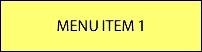

## 如何做...

首先，我们将创建一个简单的菜单，其中有一个按钮项。我们将使用`item1.png`文件作为按钮图像。通过以下代码创建菜单。

```cpp
auto normalItem = Sprite::create("res/item1.png");
auto selectedItem = Sprite::create("res/item1.png");
selectedItem->setColor(Color3B::GRAY);
auto item = MenuItemSprite::create(normalItem, selectedItem,
[](Ref* sender){
    CCLOG("tapped item");
});
auto size = Director::getInstance()->getVisibleSize();
item->setPosition(size/2);
auto menu = Menu::create(item, nullptr);
menu->setPosition(Vec2());
this->addChild(menu);
```

以下图像显示了此代码的执行结果：

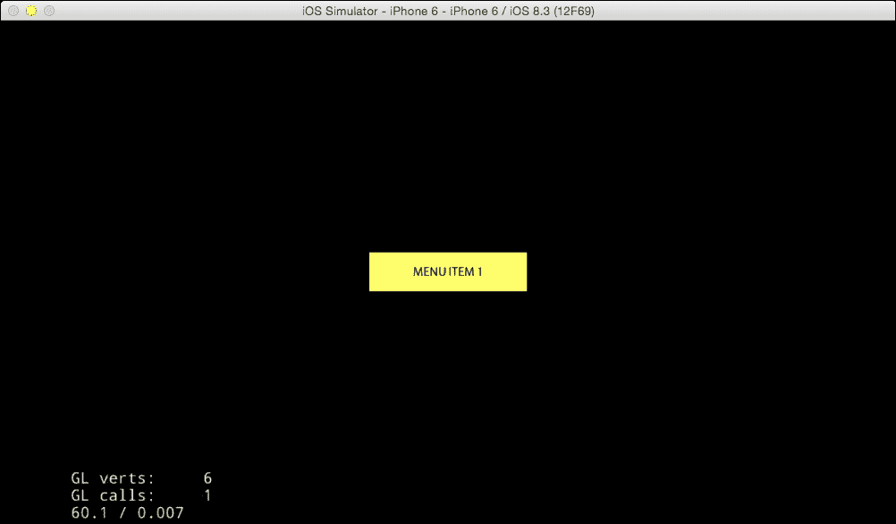

此外，你可以在点击菜单项后在日志中看到`tapped item`文本。你会注意到当你点击按钮时，按钮会变得稍微暗一些。

## 它是如何工作的...

1.  创建一个表示未操作时按钮的正常状态的精灵。

1.  在按钮被按下时创建一个表示选中状态的精灵。在这种情况下，我们使用了正常状态和选中状态相同的图像，但玩家在点击按钮时无法理解状态的变化。这就是为什么我们通过使用`setColor`方法将选中图像改为稍微暗一些的图像。

1.  通过使用这两个精灵创建`MenuItemSprite`类的实例。第三个参数指定了当按钮被按下时需要处理的 lambda 表达式。

这次，我们在菜单中只创建了一个按钮，但我们可以添加更多按钮。要做到这一点，我们可以在`Menu::create`方法中枚举几个项目，并在末尾指定`nullptr`。要添加多个按钮到菜单中，请使用以下代码：

```cpp
auto menu = Menu::create(item1, item2, item3, nullptr);
```

此外，还可以通过使用菜单实例的`addChild`方法添加项目。

```cpp
menu->addChild(item);
```

如果按钮被按下，当你创建`MenuItemSprite`实例时指定的 lambda 表达式开始运行。参数传递了一个被按下的`MenuItemSprite`实例。

## 还有更多...

还可以自动对齐多个按钮。我们在`Resources/res`文件夹中创建了三个项目。这些项目的名称分别为`item1.png`、`item2.png`和`item3.png`。您可以创建三个按钮，并使用以下代码将这些按钮垂直对齐在屏幕中央：

```cpp
Vector<MenuItem*> menuItems;
for (int i=1; i<=3; i++) {
    std::string name = StringUtils::format("res/item%d.png", i);
    auto normalItem = Sprite::create(name);
    auto selectedItem = Sprite::create(name);
    selectedItem->setColor(Color3B::GRAY);
    auto item = MenuItemSprite::create(normalItem, selectedItem,
[](Ref* sender){
        auto node = dynamic_cast<Node*>(sender);
        if (node!=nullptr) {
            CCLOG("tapped item %d", node->getTag());
        }
    });
    item->setTag(i);
    menuItems.pushBack(item);
}
auto size = Director::getInstance()->getVisibleSize();
auto menu = Menu::createWithArray(menuItems);
menu->setPosition(size/2);
menu->alignItemsVertically();
this->addChild(menu);
```

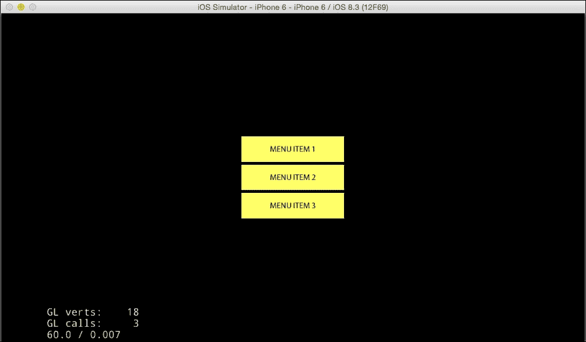

如果您想水平对齐这些项目，可以使用以下代码：

```cpp
menu->alignItemsHorizontally();
```

到目前为止，间隔的对齐已经自动调整；然而，如果您想指定填充，可以使用另一种方法。

以下代码将以垂直方式指定并排的间隔：

```cpp
menu->alignItemsVerticallyWithPadding(20.0f);
```

以下代码将以水平方式指定并排的间隔：

```cpp
menu->alignItemsHorizontallyWithPadding(20.0f);
```

# 创建按钮

在这个菜谱中，我们将解释如何创建按钮。在`Button`类发布之前，我们通过使用之前菜谱中介绍的`Menu`类创建按钮。由于`Button`类的出现，现在可以精细控制按钮的按下。

## 准备工作

要使用本章中提到的`Button`类和其他 GUI 组件，您必须包含`CocosGUI.h`文件。让我们在`HelloWorldScene.cpp`中添加以下代码行：

```cpp
#include "ui/CocosGUI.h"
```

## 如何做...

让我们使用`Button`类创建一个按钮。首先，您将使用之前菜谱中使用的`item1.png`图像生成按钮实例。我们还将通过使用`addEventListener`方法在按钮按下时指定回调函数作为 lambda 表达式。您可以使用以下代码创建按钮：

```cpp
auto size = Director::getInstance()->getVisibleSize();
auto button = ui::Button::create("res/item1.png");
button->setPosition(size/2);
this->addChild(button);
button-> addTouchEventListener(
    [](Ref* sender, ui::Widget::TouchEventType type){
        switch (type) {
            case ui::Widget::TouchEventType::BEGAN:
                CCLOG("touch began");
                break;
            case ui::Widget::TouchEventType::MOVED:
                CCLOG("touch moved");
                break;
            case ui::Widget::TouchEventType::ENDED:
                CCLOG("touch ended");
                break;
            case ui::Widget::TouchEventType::CANCELED:
                CCLOG("touch canceled");
                break;

            default:
                break;
        }
    });
```

## 工作原理...

您现在可以运行此项目并按下按钮。进一步，您可以移动触摸位置并释放手指。这样，您将看到按钮的触摸状态将在日志中改变。让我们一步一步地看看。

当您使用本章中提到的`Button`类和其他 GUI 组件时，您必须包含`CocosGUI.h`文件，因为这个文件定义了必要的类。此外，请注意，这些类有自己的命名空间，例如"`cocos2d::ui`"。

创建`Button`类的实例很容易。您只需指定精灵文件名。此外，您可以通过使用`addTouchEventListener`方法创建一个回调函数作为 lambda 表达式。此函数有两个参数。第一个参数是按下的按钮实例。第二个参数是触摸状态。触摸状态有四种类型。`TouchEventType::BEGAN`是在按钮按下时的状态。`TouchEventType::MOVE`是在按下后移动手指时发生的事件类型。`TouchEventType::ENDED`是在您从屏幕上释放手指时的状态。`TouchEventType::CANCELED`是在您在按钮外部释放手指时发生的事件。

## 还有更多...

可以通过指定选择状态图片和禁用状态图片来创建按钮实例。使用以下代码创建此按钮。

```cpp
auto button = ui::Button::create(
    "res/normal.png",
    "res/selected.png",
    "res/disabled.png");
```

与`MenuItemSprite`类不同，您无法通过更改使用`setColor`方法设置的普通图片颜色来指定选择状态。您必须准备选择图片和禁用图片。

# 创建复选框

在这个菜谱中，我们将创建一个复选框。在 Cocos2d-x 版本 2 中，复选框是通过使用`MenuItemToggle`类创建的。然而，这样做相当繁琐。在 Cocos2d-x 版本 3 中，我们可以通过使用 Cocos Studio 中的`Checkbox`类来创建复选框。

## 准备中

因此，在您开始之前，让我们准备复选框的图片。在这里，我们已经准备了所需的最低`On`和`Off`状态图片。请将这些图片添加到`Resouces/res`文件夹中。

关闭状态的图片看起来可能如下所示：


开启状态的图片看起来可能如下所示：


## 如何操作...

让我们使用`Checkbox`类创建一个复选框。首先，您将使用`check_box_normal.png`图片和`check_box_active.png`图片生成复选框实例。您还将通过使用`addEventListener`方法指定当复选框状态改变时的回调函数，作为 lambda 表达式。使用以下代码创建复选框：

```cpp
auto size = Director::getInstance()->getVisibleSize();
auto checkbox = ui::CheckBox::create(
    "res/check_box_normal.png",
    "res/check_box_active.png");
checkbox->setPosition(size/2);
this->addChild(checkbox);
checkbox->addEventListener([](Ref* sender, ui::CheckBox::EventType type){
    switch (type) {
        case ui::CheckBox::EventType::SELECTED:
            CCLOG("selected checkbox");
            break;
        case ui::CheckBox::EventType::UNSELECTED:
            CCLOG("unselected checkbox");
            break;
        default:
            break;
    }
});
```

以下图示显示了运行前面的代码后复选框被选中。

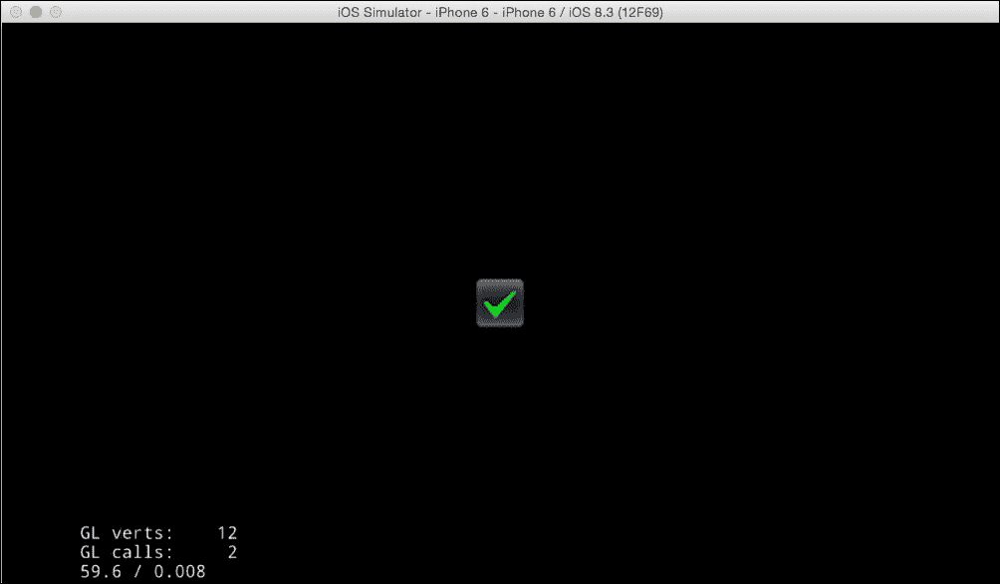

## 它是如何工作的...

它通过指定`On`和`Off`图片生成复选框实例。此外，回调函数的指定方式与之前菜谱中`Button`类的方式相同。复选框有两个`EventType`选项，即`ui::Checkbox::EventType::SELECTED`和`ui::Checkbox::EventType::UNSELECTED`。

您也可以使用`isSelected`方法获取复选框的状态。

```cpp
If (checkbox->isSelected()) {
    CCLOG("selected checkbox");
} else {
  CCLOG("unselected checkbox");
}
```

您也可以使用`setSelected`方法更改复选框的状态。

```cpp
checkbox->setSelected(true);
```

## 更多内容...

此外，还可以进一步指定更详细复选框状态的图片。`Checkbox::create`方法有五个参数。这些参数如下：

+   未选择图片

+   未选择且按下图片

+   选择图片

+   未选择且禁用图片

+   选择且禁用图片

这里是如何指定这五种状态图片的：

```cpp
auto checkbox = ui::CheckBox::create(
    "res/check_box_normal.png",
    "res/check_box_normal_press.png",
    "res/check_box_active.png",
    "res/check_box_normal_disable.png",
    "res/check_box_active_disable.png");
```

要禁用复选框，请使用以下代码：

```cpp
checkbox->setEnabled(false);
```

# 创建加载条

当您正在处理一个进程或下载某些内容时，您可以通过向用户展示其进度来表明它没有冻结。为了显示这样的进度，Cocos2d-x 有一个`LoadingBar`类。在这个菜谱中，您将学习如何创建和显示加载条。

## 准备中

首先，我们必须为进度条准备一个图片。这个图片被称为`loadingbar.png`。您需要将这个图片添加到`Resouces/res`文件夹中。


## 如何做...

通过指定加载条的图像生成加载条的实例。进一步地，使用`setPercent`方法将其设置为 0%。最后，为了使条从 0%到 100%以每 0.1 秒 1%的速度前进，我们将使用以下`schedule`方法：

```cpp
auto loadingbar = ui::LoadingBar::create("res/loadingbar.png");
loadingbar->setPosition(size/2);
loadingbar->setPercent(0);
this->addChild(loadingbar);
this->schedule(={
    float percent = loadingbar->getPercent();
    percent++;
    loadingbar->setPercent(percent);
    if (percent>=100.0f) {
        this->unschedule("updateLoadingBar");
    }
}, 0.1f, "updateLoadingBar");
```

以下图是加载条在 100%时的图像。

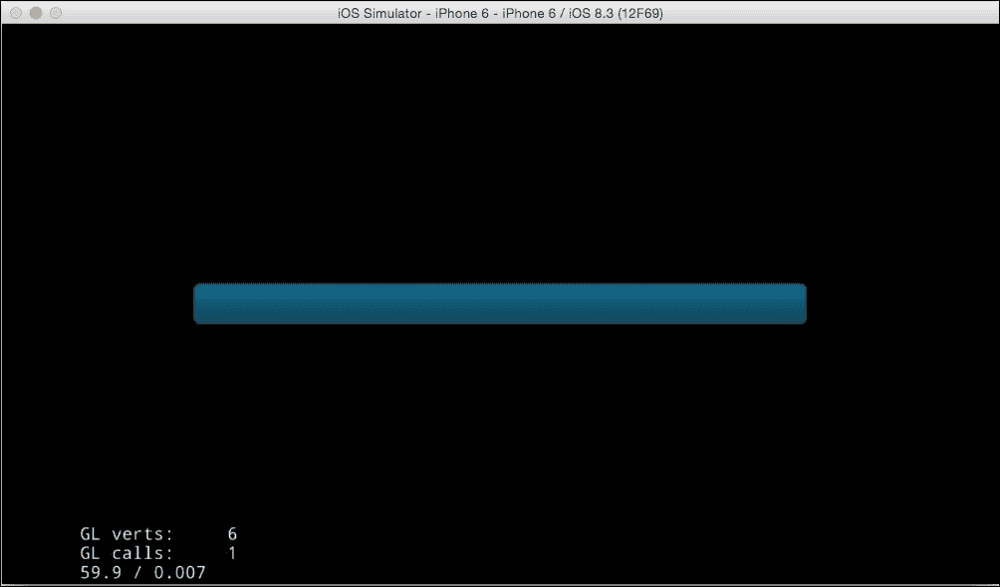

## 工作原理...

您必须指定一个图像作为加载条图像以创建`LoadingBar`类的实例。您可以通过使用`setPercent`方法设置加载条的百分比。此外，您可以通过使用`getPercent`方法获取其百分比。

## 还有更多...

默认情况下，加载条将向右移动。您可以通过使用`setDirection`方法更改此方向。

```cpp
loadingbar->setDirection(ui::LoadingBar::Direction::RIGHT);
```

当您设置`ui::LoadingBar::Direction::RIGHT`值时，加载条的开始位置是右边缘。然后，加载条将向左方向移动。

# 创建滑块

在本配方中，我们将解释滑块。滑块将用于更改声音或音乐的音量等任务。Cocos2d-x 有一个`Slider`类用于此目的。如果我们使用此类，我们可以轻松创建滑块。

## 准备工作

因此，在我们开始之前，让我们准备滑块的图像。请在`Resouces/res`文件夹中添加这些图像。

+   `sliderTrack.png`：滑块的背景

+   `sliderThumb.png`：用于移动滑块的图像

## 如何做...

让我们使用`Slider`类创建一个滑块。首先，您将使用`sliderTrack.png`图像和`sliderThumb.png`图像生成滑块实例。您还将通过使用`addEventListener`方法指定当滑块值改变时的回调函数，作为 lambda 表达式。

```cpp
auto slider = ui::Slider::create("res/sliderTrack.png",
"res/sliderThumb.png");
slider->setPosition(size/2);
this->addChild(slider);
slider->addEventListener([](Ref* sender, ui::Slider::EventType
type){
    auto slider = dynamic_cast<ui::Slider*>(sender);
    if (type==ui::Slider::EventType::ON_PERCENTAGE_CHANGED) {
        CCLOG("percentage = %d", slider->getPercent());
    }
});
```

以下图显示了前面代码的结果。

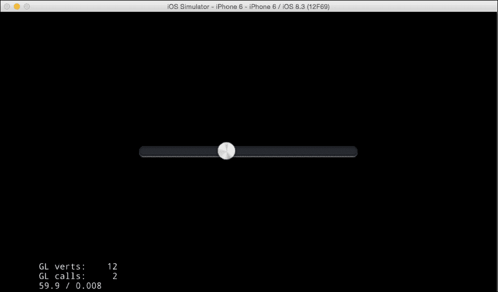

## 工作原理...

您必须指定两个图像作为滑块的条形图像和滑块的拇指图像以创建`Slider`类的实例。回调函数的指定方式与之前配方中的`Button`类相同。滑块只有一个`EventType`，即`ui::Slider::EventType::ON_PERCENTAGE_CHANGED`。这就是为什么状态是唯一变化值的原因。您可以通过使用`getPercent`方法获取滑条上显示的百分比。

## 还有更多...

如果您想在滑块上看到进度，您可以使用`loadProgressBarTexture`方法。我们需要一个进度条的图像。以下图像显示了进度条图像。让我们将其添加到`Resources/res`文件夹中。


然后，我们通过指定此图像使用`loadProgressbarTexture`方法。

```cpp
slider->loadProgressBarTexture("res/sliderProgress.png");
```

让我们运行到目前为止已修改的代码。您将看到如下截图所示的条左侧的颜色：

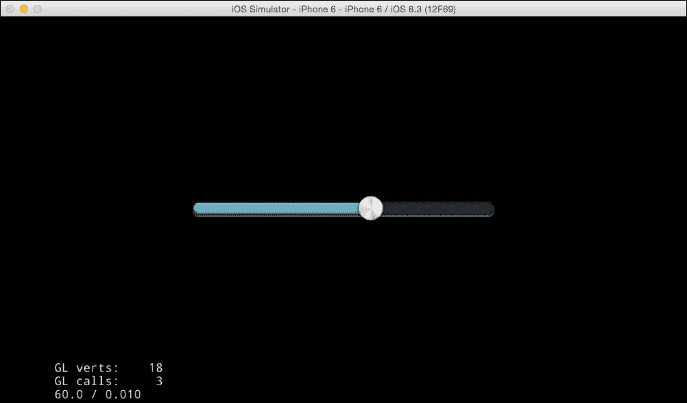

# 创建文本字段

你可能想在游戏中设置一个昵称。要设置昵称或获取玩家的输入文本，你可以使用`TextField`类。在本教程中，我们将学习一个简单的`TextField`示例以及如何在游戏中添加文本框。

## 如何做...

你将通过指定占位符文本、字体名称和字体大小来创建一个文本字段。然后，你通过使用`addEventListener`设置一个回调函数。在回调函数中，你可以获取玩家在`textField`中输入的文本。通过以下代码创建`textField`：

```cpp
auto textField = ui::TextField::create("Enter your name", "Arial", 30);
textField->setPosition(Vec2(size.width/2, size.height*0.75f));
this->addChild(textField);
textField->addEventListener([](Ref* sender,
ui::TextField::EventType type){
    auto textField = dynamic_cast<ui::TextField*>(sender);
    switch (type) {
        case ui::TextField::EventType::ATTACH_WITH_IME:
                CCLOG("displayed keyboard");
                break;
        case ui::TextField::EventType::DETACH_WITH_IME:
                CCLOG("dismissed keyboard");
                break;
          case ui::TextField::EventType::INSERT_TEXT:
                CCLOG("inserted text : %s",
                textField->getString().c_str());
                break;
          case ui::TextField::EventType::DELETE_BACKWARD:
                CCLOG("deleted backward");
                break;
          default:
                break;
    }
});
```

让我们运行这段代码。你将在占位符文本中看到它，并且它将自动显示键盘，如下面的截图所示：

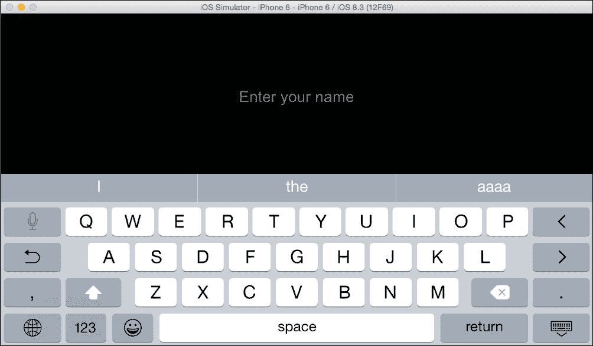

## 它是如何工作的...

1.  你创建了一个`TextField`类的实例。第一个参数是占位符字符串。第二个参数是字体名称。你可以指定仅真型字体。第三个参数是字体大小。

1.  你可以通过使用`addEventListener`方法获取事件。以下列表提供了事件名称及其描述：

| 事件名称 | 描述 |
| --- | --- |
| `ATTACH_WITH_IME` | 键盘将出现。 |
| `DETACH_WITH_IME` | 键盘将消失。 |
| `INSERT_TEXT` | 文本已输入。你可以通过使用`getString`方法获取字符串。 |
| `DELETE_BACKWARD` | 文本被删除。 |

## 还有更多...

当玩家输入密码时，你必须使用`setPasswordEnable`方法来隐藏它。

```cpp
textField->setPasswordEnabled(true);
```

让我们运行到目前为止修改过的代码。你将看到如何隐藏你输入的密码，如下面的截图所示：

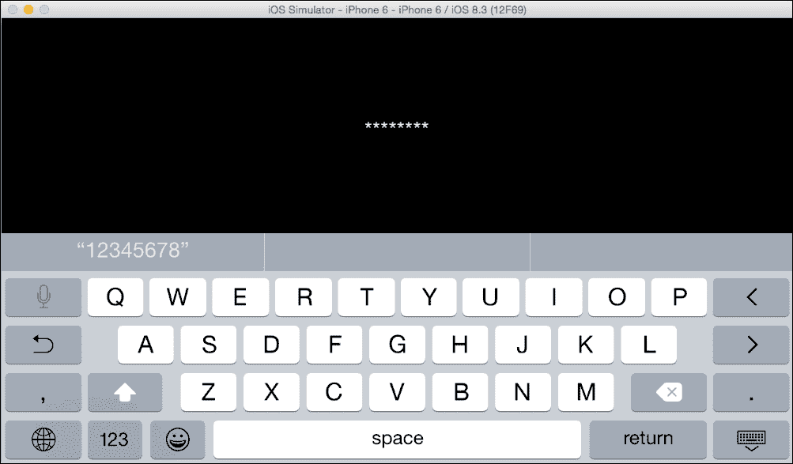

# 创建滚动视图

当你在游戏中显示一个巨大的地图时，需要一个滚动视图。它可以通过滑动来滚动，并在区域边缘弹跳。在本教程中，我们解释了 Cocos2d-x 的`ScrollView`类。

## 如何做...

让我们立即实现它。在这种情况下，我们将`HelloWorld.png`的大小加倍。此外，我们尝试在`ScrollView`中显示这个巨大的图像。通过以下代码创建滚动视图：

```cpp
auto scrollView = ui::ScrollView::create();
scrollView->setPosition(Vec2());
scrollView->setDirection(ui::ScrollView::Direction::BOTH);
scrollView->setBounceEnabled(true);
this->addChild(scrollView);

auto sprite = Sprite::create("res/HelloWorld.png");
sprite->setScale(2.0f);
sprite->setPosition(sprite->getBoundingBox().size/2);
scrollView->addChild(sprite);
scrollView->setInnerContainerSize(sprite->getBoundingBox().size);
scrollView->setContentSize(sprite->getContentSize());
```

让我们运行这段代码。你将看到巨大的`HelloWorld.png`图像。此外，你将看到你可以通过滑动来滚动它。

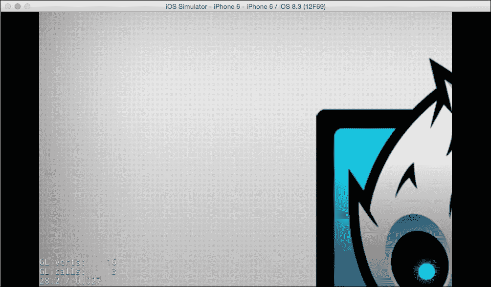

## 它是如何工作的...

1.  你可以通过不带参数的`create`方法创建一个`ScrollView`类的实例。

1.  你可以通过使用`setDirection`方法设置滚动视图的方向。在这种情况下，我们想要上下左右滚动，所以你应该设置`ui::ScrollView::Direction::BOTH`。这意味着我们可以垂直和水平滚动。如果你想只上下滚动，你设置`ui::ScrollView::Direction::VERTICAL`。如果你想只左右滚动，你设置`ui::ScrollView::Direction::HORIZONTAL`。

1.  如果你希望在区域边缘滚动时产生弹跳效果，你应该使用`setBounceEnabled`方法将其设置为`true`。

1.  你将提供要在滚动视图中显示的内容。在这里，我们使用了放大两倍的`HelloWorld.png`。

1.  你必须使用`setInnerContainerSize`方法指定滚动视图中的内容大小。在这种情况下，我们在`setInnerContainerSize`方法中指定了`HelloWorld.png`的两倍大小。

1.  你必须使用`setContentSize`方法指定滚动视图的大小。在这种情况下，我们使用`setContentSize`方法指定了`HelloWorld.png`的原始大小。

# 创建页面视图

页面视图类似于滚动视图，但它将按页面滚动。`PageView`也是 Cocos2d-x 中的一个类。在这个菜谱中，我们将解释如何使用`PageView`类。

## 如何实现...

让我们立即实现它。在这里，我们将三个`HelloWorld.png`图像并排排列在页面视图中。通过以下代码创建页面视图：

```cpp
auto pageView = ui::PageView::create();
pageView->setPosition(Vec2());
pageView->setContentSize(size);
this->addChild(pageView);

for (int i=0; i<3; i++) {
    auto page = ui::Layout::create();
    page->setContentSize(pageView->getContentSize());

    auto sprite = Sprite::create("res/HelloWorld.png");
    sprite->setPosition(sprite->getContentSize()/2);
    page->addChild(sprite);
    pageView->insertPage(page, i);
}

pageView->addEventListener([](Ref* sender, ui::PageView::EventType type){
    if (type==ui::PageView::EventType::TURNING) {
        auto pageView = dynamic_cast<ui::PageView*>(sender);
        CCLOG("current page no =%zd",
        pageView->getCurPageIndex());
    }
});
```

当你运行此代码时，你会看到一个`HelloWorld.png`。你会看到你可以通过滑动动作移动到下一页。

## 如何工作...

使用不带参数的`create`方法创建`PageView`类的实例。在这里，我们将其设置为与屏幕相同的大小。

并排显示三个`HelloWorld.png`图像。你必须使用`Layout`类在`PageView`中设置页面布局。

使用`addChild`方法设置页面大小并添加图片。

使用`insertPage`方法将`Layout`类的实例插入到页面视图中。此时，你指定页面编号作为第二个参数。

获取页面变化的事件，你使用`addEventListener`方法。`PageView`只有一个事件，即`PageView::EventType::TURNING`。你可以通过使用`getCurPageIndex`方法获取当前页面编号。

# 创建列表视图

`ListView`是 Cocos2d-x 中的一个类，类似于 iOS 中的`UITableView`或 Android 中的`List View`。`ListView`在设置场景时需要创建大量按钮时非常有用。在这个菜谱中，我们将解释如何使用`ListView`类。

## 如何实现...

在这里，我们尝试显示包含 20 个按钮的`ListView`。每个按钮都有一个像"`list item 10.`"这样的编号。此外，当你点击任何按钮时，你会在日志上显示你选择的按钮编号。通过以下代码创建列表视图：

```cpp
auto listView = ui::ListView::create();
listView->setPosition(Vec2(size.width/2 - 200, 0.0f));
listView->setDirection(ui::ListView::Direction::VERTICAL);
listView->setBounceEnabled(true);
listView->setContentSize(size);
this->addChild(listView);

for (int i=0; i<20; i++) {
    auto layout = ui::Layout::create();
    layout->setContentSize(Size(400, 50));
    layout->setBackGroundColorType(ui::Layout::BackGroundColorType::SOLID);
    layout->setBackGroundColor(Color3B::WHITE);

    auto button = ui::Button::create();
    button->setPosition(layout->getContentSize()/2);
    std::string name = StringUtils::format("list item %d", i); 
    button->setTitleText(name);
    button->setTitleFontSize(30);
    button->setTitleColor(Color3B::BLACK);
    layout->addChild(button);
    listView->addChild(layout);
}

listView->addEventListener([](Ref* sender, ui::ListView::EventType 
type){
    auto listView = dynamic_cast<ui::ListView*>(sender);
    switch (type) {
        case ui::ListView::EventType::ON_SELECTED_ITEM_START:
            CCLOG("select item started");
            break;
        case ui::ListView::EventType::ON_SELECTED_ITEM_END:
            CCLOG("selected item : %zd", listView->getCurSelectedIndex());
            break;
        default: 
            break; 
    } 
});
```

当你运行此代码时，你会看到一些按钮。你会看到你可以通过滑动来滚动它，并且你可以获取你点击的按钮编号。

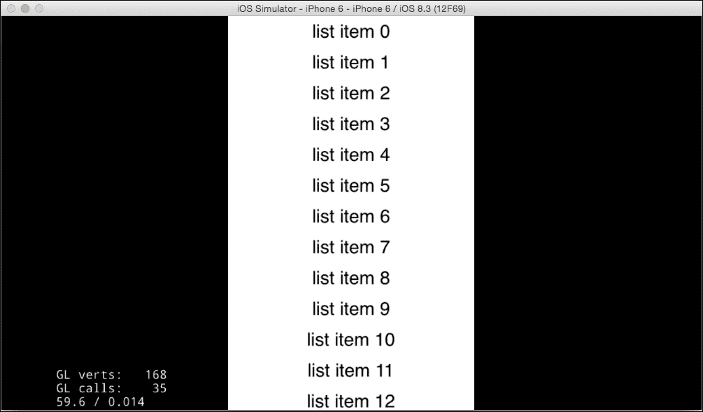

## 如何工作...

1.  创建`ListView`类的实例。你可以像`ScrollView`一样指定滚动方向。由于我们只想在垂直方向上滚动，你指定`ui::ListView::Direction::VERTICAL`。此外，你可以通过使用`setBounceEnabled`方法来指定区域边缘的弹跳效果。

1.  在列表视图中创建 20 个按钮。您必须使用`Layout`类来显示列表视图中的内容，就像在`PageView`的情况下一样。您需要将`Button`类的一个实例添加到`Layout`类的实例中。

1.  通过使用`addEventListener`方法来获取事件。`ListView`有两个事件，即`ON_SELECTED_ITEM_START`和`ON_SELECTED_ITEM_END`。当您触摸列表视图时，会触发`ON_SELECTED_ITEM_START`。当您不移动手指就释放时，会触发`ON_SELECTED_ITEM_END`。如果您移动手指，则不会触发`ON_SELECTED_ITEM_END`，这将是一个滚动过程。您可以通过使用`getCurSelectedIndex`方法来获取按钮编号。
