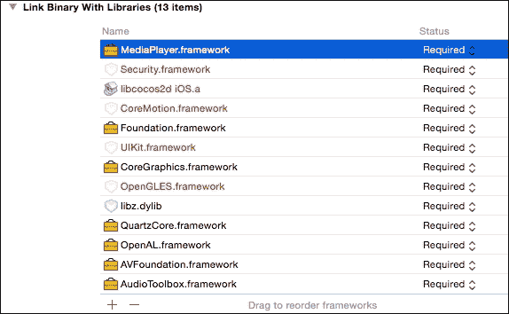

# 第六章. 播放声音

没有声音的游戏将会无聊且缺乏活力。适合视觉的背景音乐和音效可以使游戏更加生动。最初，我们使用了一个非常著名的音频引擎，名为`SimpleAudioEngine`，但现在 Cocos2d-x 3.3 版本已经推出了全新的`AudioEngine`。在本章中，我们将讨论`SimpleAudioEngine`和`AudioEngine`。本章将涵盖以下主题：

+   播放背景音乐

+   播放一个音效

+   控制音量、音调和平衡

+   暂停和恢复背景音乐

+   暂停和恢复音效

+   使用 AudioEngine 播放背景音乐和音效

+   播放电影

# 播放背景音乐

通过使用`SimpleAudioEngine`，我们可以非常容易地播放背景音乐。`SimpleAudioEngine`是一个共享的单例对象，可以在代码的任何地方调用。在`SimpleAudioEngine`中，我们只能播放一个背景音乐。

## 准备工作

我们必须包含`SimpleAudioEngine`的头文件才能使用它。因此，您需要添加以下代码：

```cpp
#include "SimpleAudioEngine.h"
```

## 如何操作...

以下代码用于播放名为`background.mp3`的背景音乐。

```cpp
auto audio = CocosDenshion::SimpleAudioEngine::getInstance();
audio->preloadBackgroundMusic("background.mp3");

// play the background music and continuously play it.
audio->playBackgroundMusic("background.mp3", true);
```

## 它是如何工作的...

`SimpleAudioEngine`有一个名为`CocosDenshion`的命名空间。对于`SimpleAudioEngine`，您只需使用`getInstance`方法获取一个实例。您可以在不预加载的情况下播放背景音乐，但这可能会导致播放延迟。这就是为什么您应该在播放之前预加载音乐。如果您希望播放连续，则需要将 true 值作为第二个参数设置。

## 更多内容...

`SimpleAudioEngine`支持多种格式，包括 MP3 和 Core Audio 格式。它可以播放以下格式：

| 格式 | iOS (BGM) | iOS (SE) | Android (BGM) | Android (SE) |
| --- | --- | --- | --- | --- |
| IMA (.caf) | ○ | ○ | □ | □ |
| Vorbis (.ogg) | □ | □ | ○ | ○ |
| MP3 (.mp3) | ○ | ○ | ○ | ○ |
| WAVE (.wav) | ○ | ○ | △ | △ |

如果您想在 iOS 和 Android 上播放不同格式的声音，您可以使用以下宏代码来播放：

```cpp
#if (CC_TARGET_PLATFORM == CC_PLATFORM_ANDROID) 
#defie MUSIC_FILE        "background.ogg" 
#else
#define MUSIC_FILE        "background.caf" 
#endif

audio->playBackgroundMusic(MUSIC_FILE, true);
```

在此代码中，如果设备是 Android，它将播放`.ogg`文件。如果设备是 iOS，它将播放`.caf`文件。

# 播放一个音效

通过使用`SimpleAudioEngine`，我们可以播放音效；要播放它们，我们只需要执行两个步骤，即预加载和播放。音效不是背景音乐；请注意，我们可以同时播放多个音效，但只能同时播放一个背景音乐。在本食谱中，我们将解释如何播放音效。

## 准备工作

就像播放背景音乐一样，你必须包含`SimpleAudioEngine`的头文件。

```cpp
#include "SimpleAudioEngine.h"
```

## 如何操作...

让我们立即尝试播放一个音效。音频格式根据操作系统通过在播放背景音乐时引入的宏来改变。播放音效的代码如下：

```cpp
#if (CC_TARGET_PLATFORM == CC_PLATFORM_ANDROID) 
#define EFFECT_FILE        "effect.ogg" 
#else 
#define EFFECT_FILE        "effect.caf" 
#endif

auto audio = CocosDenshion::SimpleAudioEngine::getInstance();
audio->preloadEffect( EFFECT_FILE ); 
audio->playEffect(EFFECT_FILE); 
```

## 它是如何工作的...

整体流程与播放背景音乐相同。在播放之前，您需要预加载一个音效文件。音效文件比背景音乐文件小。因此，在播放之前，您可以预加载很多音效。

## 更多内容...

在 Android 上，我们可以同时播放的音效数量少于 iOS。因此，我们现在将解释如何增加 Android 上的这个数量。最大同时播放次数在 `Cocos2dxSound.java` 中定义。

`Cocos2dxSound.java` 的路径是 `cocos2d/cocos/platform/android/java/src/org/cocos2dx/lib`。然后，在第 66 行，定义了最大同时播放次数。

```cpp
private static final int MAX_SIMULTANEOUS_STREAMS_DEFAULT = 5;
```

如果我们将这个值改为 10，我们就可以同时播放 10 个音效。

# 控制音量、音调和平衡

您可以控制音效的音量、音调和平衡，这三个因素的恰当组合可以使游戏听起来更加有趣。

## 如何操作...

让我们尝试通过控制音量、音调和平衡立即播放一个音效。以下是一个代码片段来完成此操作：

```cpp
auto audio = CocosDenshion::SimpleAudioEngine::getInstance(); 
// set volume 
audio->setEffectsVolume(0.5); 

// set pitch, pan, gain with playing a sound effect.
float pitch = 1.0f;
float pan = 1.0f;
float gain = 1.0f;
audio->playEffect(EFFECT_FILE, true, pitch, pan, gain);
```

## 它是如何工作的...

您可以使用 `setEffectsVolume` 方法控制音效的音量。音量的最大值是 1.0，最小值是 0.0。如果您将音量设置为 0.0，音效将被静音。音量的默认值是 1.0。

您可以同时播放多个音效，但不能单独设置这些音效的音量。要更改音效的主音量，请使用 `setEffectsVolume` 方法设置音量。如果您想单独更改音量，应使用 `gain` 值；我们将在后面解释。

`playEffect` 方法中的第二个参数是连续播放音效的标志。对于第三个及以后的参数，请参考以下表格：

| 参数 | 描述 | 最小值 | 最大值 |
| --- | --- | --- | --- |
| 第三个参数 (`pitch`) | 播放速度 | 0.0 | 2.0 |
| 第四个参数 (`pan`) | 左右平衡 | -1.0 | 1.0 |
| 第五个参数 (`gain`) | 与音源的距离 | 0.0 | 1.0 |

`pitch` 是一个允许我们将声音分类为相对高音或低音的品质。通过使用这个 `pitch`，我们可以控制第三个参数中的播放速度。如果您将 `pitch` 设置为小于 1.0，音效将缓慢播放。如果设置为大于 1.0，音效将快速播放。如果设置为 1.0，音效将以原始速度播放。`pitch` 的最大值是 2.0。然而，在 iOS 中，您可以设置 `pitch` 大于 2.0。另一方面，Android 中 `pitch` 的最大值是 2.0。因此，我们采用了最大值作为下限。

你可以通过更改第四个参数中的`pan`来改变左右扬声器的平衡。如果你将其设置为-1.0，你只能从左扬声器听到声音。如果你将其设置为 1.0，你只能从右扬声器听到声音。默认值为 0.0；你可以从左右扬声器以相同的音量听到声音。不幸的是，你将无法在设备的扬声器中听到太多差异。如果你使用耳机，你可以听到这种差异。

你可以通过更改第五个参数中的`gain`来改变每个音效的音量。你可以使用`setEffectVolume`方法设置主音量，通过改变增益值来设置每个音效的音量。如果你将其设置为 0.0，则音量为静音。如果设置为 1.0，则音量为最大。音效的最终音量将是增益值和`setEffectsVolume`方法中指定的值的组合。

# 暂停和恢复背景音乐

这个配方将帮助你更好地理解暂停和恢复背景音乐的概念。

## 如何操作...

停止或暂停背景音乐非常简单。使用这些方法时，你不需要指定参数。停止背景音乐的代码如下：

```cpp
auto audio = CocosDenshion::SimpleAudioEngine::getInstance();
// stop the background music
audio->stopBackgroundMusic();
```

暂停代码：

```cpp
// pause the background music 
audio->pauseBackgroundMusic();
```

恢复暂停的背景音乐代码：

```cpp
// resume the background music 
audio->resumeBackgroundMusic();
```

## 它是如何工作的...

你可以使用`stopBackgroundMusic`方法停止正在播放的背景音乐。或者，你可以使用`pauseBackgroundMusic`方法暂停背景音乐。一旦停止，你可以使用`playBackgroundMusic`方法再次播放。此外，如果你暂停了它，你可以使用`resumeBackgroundMusic`方法恢复播放音乐。

## 更多内容...

你可以使用`isBackgroundMusicPlaying`方法来确定背景音乐是否正在播放。以下代码可以用来实现这一点：

```cpp
auto audio = CocosDenshion::SimpleAudioEngine::getInstance();
if (audio->isBackgroundMusicPlaying()) { 
    // background music is playing 
} else { // background music is not playing 
}
```

### 小贴士

然而，在使用此方法时，你需要小心。此方法总是返回一个表示 iOS 模拟器中播放状态的 true 值。在 Cocos2d-x 中的`audio/ios/CDAudioManager.m`的第 201 行，如果设备是 iOS 模拟器，`SimpleAudioEngine`将音量设置为零并连续播放。这就是为什么在 iOS 模拟器中存在问题。然而，我们在注释掉此过程之前测试了最新的 iOS 模拟器，发现没有问题。如果你想使用此方法，你应该注释掉此过程。

# 暂停和恢复音效

你可能还想停止音效。此外，你可能想先暂停它们，然后再恢复。

## 如何操作...

停止或暂停音效非常简单。以下是将它停止的代码：

```cpp
auto audio = CocosDenshion::SimpleAudioEngine::getInstance();
unsigned int _soundId; 
// get the sound id as playing the sound effect
_soundId = audio->playEffect(EFFECT_FILE); 
// stop the sound effect by specifying the sound id
audio->stopEffect(_soundId);
```

以下是将它暂停的代码：

```cpp
// pause the sound effect
audio->pauseEffect(_soundId);
```

你可以这样恢复暂停的代码：

```cpp
// resume the sound effect
audio->resumeEffect(_soundId);
```

## 它是如何工作的...

`SimpleAudioEngine` 可以播放多个音效。因此，如果你想单独停止或暂停某个音效，你必须指定该音效。当你播放音效时，你可以得到音效 ID。你可以使用这个 ID 停止、暂停或恢复特定的音效。

## 还有更多...

你可以停止、暂停或恢复所有正在播放的音效。执行此操作的代码如下：

```cpp
auto audio = CocosDenshion::SimpleAudioEngine::getInstance();
// stop all sound effects audio->stopAllEffects();
// pause all sound effects
audio->pauseAllEffects();
// resume all sound effects
audio->resumeAllEffects();
```

# 使用 AudioEngine 播放背景音乐和音效

`AudioEngine` 是从 Cocos2d-x 版本 3.3 中引入的新类。`SimpleAudioEngine` 无法播放多个背景音乐，但 `AudioEngine` 可以。此外，`AudioEngine` 在播放背景音乐完成后可以调用回调函数。另外，我们可以通过回调函数获取播放时间。在这个菜谱中，我们将学习全新的 `AudioEngine`。

## 准备工作

我们必须包含 `AudioEngine` 的头文件才能使用它。此外，`AudioEngine` 有一个名为 `experimental` 的命名空间。为了包含头文件，你需要添加以下代码：

```cpp
#include "audio/include/AudioEngine.h" USING_NS_CC; 
using namespace experimental;
```

## 如何操作...

`AudioEngine` 比起 `SimpleAudioEngine` 来说更容易使用。它的 API 非常简单。以下代码可以用来播放、停止、暂停和恢复背景音乐。

```cpp
// play the background music 
int id = AudioEngine::play2d("sample_bgm.mp3"); 
// set continuously play
AudioEngine::setLoop(id, true); 
// change the volume, the value is from 0.0 to 1.0 
AudioEngine::setVolume(id, 0.5f); 
// pause it
AudioEngine::pause(id); 
// resume it that was pausing 
AudioEngine::resume(id); 
// stop it
AudioEngine::stop(id); 
// seek it by specifying the time 
AudioEngine::setCurrentTime(int id, 12.3f); 
// set the callback when it finished playing it
AudioEngine::setFinishCallback(int id, [](int audioId, std::string filePath){ 
    // this is the process when the background music was finished.
});
```

## 它是如何工作的...

`AudioEngine` 不再需要预加载方法。进一步来说，`AudioEngine` 不区分背景音乐和音效。你可以使用相同的方法播放两者。当你播放时，你可以得到一个作为返回值的音效 ID。当你改变音量、停止、暂停等操作时，你必须指定这个音效 ID。

## 还有更多...

如果你想要从内存中卸载音频文件，你可以通过使用 `AudioEngine::uncache` 方法或 `AudioEngine::uncacheAll` 方法来 `uncache`。在使用 `uncache` 方法的情况下，你必须指定你想要卸载的路径。在使用 `uncacheAll` 方法的情况下，所有音频数据都会从内存中卸载。在卸载文件时，你必须停止相关的音乐和音效。

# 播放电影

你可能想在游戏中播放电影以丰富表现。Cocos2d-x 提供了一个 `VideoPlayer` 类来实现这个目的。这个类使得播放电影变得简单；然而，它仍然是一个 `experimental` 类。所以，在使用它时你必须非常小心。

## 准备工作

在使用 `VideoPlayer` 类之前，你必须做一些准备工作。

1.  你必须将电影文件添加到 `Resources/res` 文件夹中。在这个例子中，我们添加了名为 `splash.mp4` 的视频。

1.  接下来，你必须包含一个头文件。执行此操作的代码如下：

    ```cpp
    #include "ui/CocosGUI.h"
    USING_NS_CC;
    using namespace experimental::ui;
    ```

1.  然后，你必须向 `proj.android/jni/Android.mk` 文件添加以下代码以构建 Android 应用程序。

    ```cpp
    LOCAL_WHOLE_STATIC_LIBRARIES += cocos_ui_static
    $(call import-module,ui)
    ```

1.  在 Xcode 中，你必须为 iOS 添加 `MediaPlayer.framework`，如下面的图片所示：



## 如何操作...

让我们尝试在你的游戏中播放视频。这里就是：

```cpp
auto visibleSize = Director::getInstance()->getVisibleSize(); auto videoPlayer = VideoPlayer::create(); 

videoPlayer->setContentSize(visibleSize); 
videoPlayer->setPosition(visibleSize/2); 
videoPlayer->setKeepAspectRatioEnabled(true); 
this->addChild(videoPlayer);

videoPlayer->addEventListener([](Ref *sender, 
VideoPlayer::EventType eventType) { 
    switch (eventType) { 
        case VideoPlayer::EventType::PLAYING: 
            CCLOG("PLAYING");
            break;
        case VideoPlayer::EventType::PAUSED: 
            CCLOG("PAUSED"); 
            break;
        case VideoPlayer::EventType::STOPPED: 
            CCLOG("STOPPED"); 
            break;
        case VideoPlayer::EventType::COMPLETED: 
            CCLOG("COMPLETED"); 
            break; 
        default:
            break; 
    }
});

videoPlayer->setFileName("res/splash.mp4"); 
videoPlayer->play();
```

## 它是如何工作的...

基本上，`VideoPlayer` 类与其他节点相同。首先，你创建一个实例，指定其位置，然后将其添加到图层上。接下来，通过使用 `setContentSize` 方法设置内容大小。如果你通过使用 `setKeepAspectRatioEnabled` 方法设置一个假值，视频播放器的尺寸将等于你通过 `setContentSize` 方法指定的内容大小。相反，如果你设置一个真值，视频播放器将保留电影的宽高比。

你可以通过添加事件监听器来获取播放状态的事件。`VideoPlayer::EventType` 有四种类型的事件，分别是 `PLAYING`、`PAUSED`、`STOPPED` 和 `COMPLETED`。

最后，你通过使用 `setFileName` 方法设置电影文件，并通过使用 `play` 方法播放它。

### 小贴士

视频格式有很多。然而，你可以在 iOS 和 Android 上播放的视频格式是 mp4。这就是为什么你应该使用 mp4 格式在你的游戏中播放视频。
