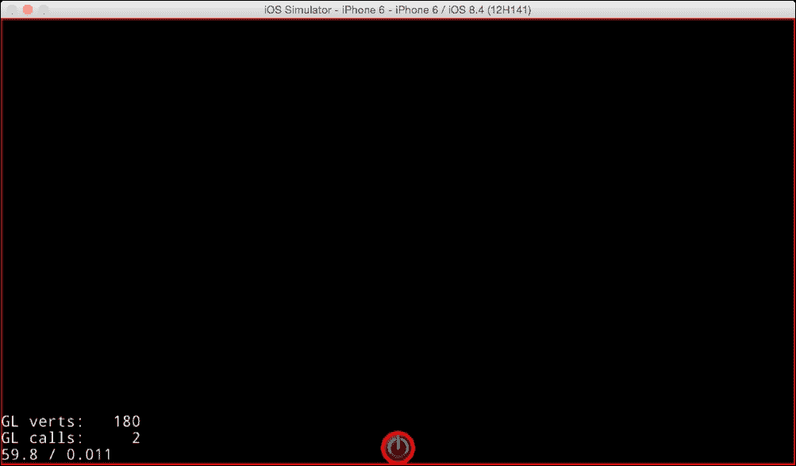
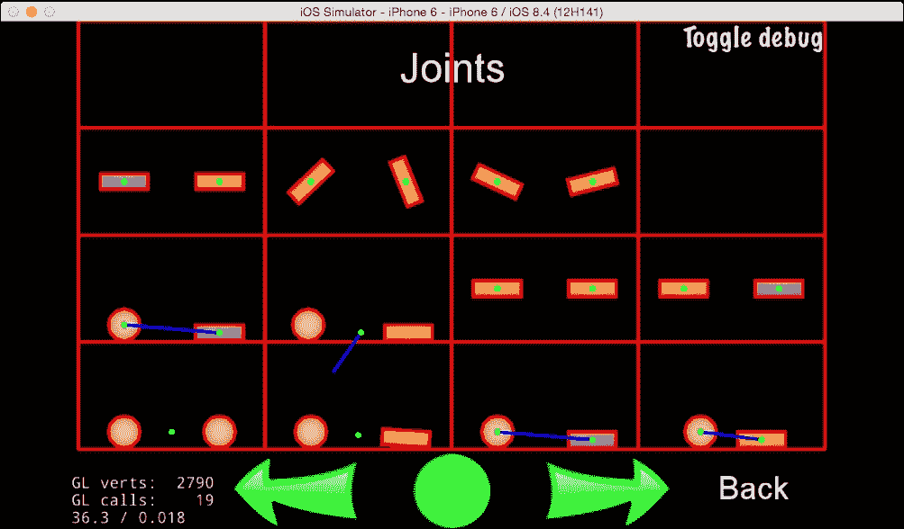
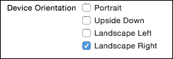

# 第九章 控制物理

本章将涵盖以下主题：

+   使用物理引擎

+   检测碰撞

+   使用关节

+   使用加速度传感器改变重力

# 简介

物理对于游戏来说非常重要。玩家需要模拟现实世界的情况。你可以通过使用物理引擎来给你的游戏增加物理真实感。正如你所知，有两个著名的物理引擎：Box2D 和 Chipmunk。在 Cocos2d-x 2.x 版本中，你必须使用这些物理引擎。然而，使用它们相当困难。自从 Cocos2d-x 3.x 版本以来，Cocos2d-x 已经包含了一个封装在 Chipmunk 中的有用物理引擎。因此，物理引擎不再是我们的担忧，因为它可扩展且 CPU 友好。在本章中，你将学习如何在游戏中轻松使用物理引擎。

# 使用物理引擎

当你意识到你的游戏需要模拟现实世界的情况时，你应该怎么做？你知道答案是使用物理引擎。当你开始使用物理引擎时，你必须使用一些新的类和方法。在本菜谱中，你将学习如何在 Cocos2d-x 中使用基本的物理引擎。

## 如何做到这一点...

1.  首先，你必须在场景中创建一个物理世界。你可以通过以下代码来创建它：

    ```cpp
    Scene* HelloWorld::createScene()
    {
        auto scene = Scene::createWithPhysics();
        auto layer = HelloWorld::create();
        scene->addChild(layer);
    	return scene;
    }
    ```

1.  接下来，你必须向物理世界中添加物理体。物理体是不可见的。它是一个物理形状，如正方形、圆形或更复杂的形状。在这里，让我们创建一个正方形形状。你必须创建它并将其设置为精灵以使其可见。

    ```cpp
    bool HelloWorld::init()
    {
        if ( !Layer::init() )
        {
            return false;
        }
        Size visibleSize = Director::getInstance()->getVisibleSize();
        Vec2 origin = Director::getInstance()->getVisibleOrigin();

        auto wall = Node::create();
        auto wallBody = PhysicsBody::createEdgeBox(visibleSize, 
    PhysicsMaterial(0.1f, 1.0f, 0.0f)); 
        wall->setPhysicsBody(wallBody);
        wall->setPosition(Vec2(visibleSize.width/2+origin.x, 
    VisibleSize.height/2+origin.y));
        addChild(wall);

        auto sprite = Sprite::create("CloseNormal.png");
        sprite->setPosition(visibleSize/2);
        auto physicsBody = PhysicsBody::createCircle(sprite-
    >getContentSize().width/2);
        physicsBody->setDynamic(true); 
        sprite->setPhysicsBody(physicsBody);
        this->addChild(sprite);

        return true;
    }
    ```

1.  最后，你必须运行前面的代码。然后你可以看到精灵在地面上下落和弹跳。

## 它是如何工作的...

1.  首先，你必须使用`Scene::createWithPhysics`方法在场景中创建物理世界。这样，你就可以在游戏中使用物理引擎。

1.  接下来，你必须创建一个倒置的墙，从屏幕边缘的左侧到右侧。如果你移除这个墙并运行代码，精灵对象将永远下落。你可以通过使用`PhysicsBody::createEdgeBox`方法以及这个大小和材料设置来创建一个边缘框。在这种情况下，墙的大小将与屏幕相同。材料设置指定为`PhysicsMaterial(0.1f, 1.0f, 0.0f)`。这意味着密度是`1.0f`，恢复系数是`1.0f`，摩擦系数是`0.0f`。让我们尝试改变这个参数，并在给定的情况下检查它。

1.  最后，你可以使用精灵创建物理体。在这种情况下，精灵是圆形的。因此，你需要使用`PhysicsBody::createCircle`方法来创建圆形物理体。然后，使用`Sprite::setPhysicsBody`方法将物理体添加到精灵中。

1.  Cocos2d-x 有很多物理体形状，如下表所示：

| 形状 | 描述 |
| --- | --- |
| PhysicsShapeCircle | 实心圆形形状 |
| PhysicsShapePolygon | 实心多边形形状 |
| PhysicsShapeBox | 实心矩形形状 |
| PhysicsShapeEdgeSegment | 段形 |
| PhysicsShapeEdgePolygon | 空心多边形形状 |
| PhysicsShapeEdgeBox | 空心矩形形状 |
| PhysicsShapeEdgeChain | 用于连接多个边缘 |

## 还有更多…

然后，你可以通过使用 `Scene::getPhysicsWorld` 方法来获取一个 `PhysicsWorld` 实例。在这个示例中，我们将 `PhysicsWorld::DEBUGDRAW_ALL` 设置为物理世界。这就是为什么你可以看到所有物理对象边缘都是红色线条。当你发布你的游戏时，你必须移除这个设置。

```cpp
Scene* HelloWorld::createScene()
{
    auto scene = Scene::createWithPhysics();
    auto layer = HelloWorld::create();
    scene->addChild(layer);

    PhysicsWorld* world = scene->getPhysicsWorld();
    world->setDebugDrawMask(PhysicsWorld::DEBUGDRAW_ALL);

    return scene;
}
```



此外，你可以将原始重力值设置为 `PhysicsWorld`。例如，你可以在设备倾斜时更改重力。以下是如何更改重力的代码：

```cpp
PhysicsWorld* world = scene->getPhysicsWorld();
auto gravity = Vec2(0, 98.0f);
world->setGravity(gravity);
```

上述代码与地球重力相反。默认重力值是 `Vec2(0, -98.0f)`。

# 检测碰撞

当物理对象之间发生碰撞时，你想要对物理体采取行动，例如显示爆炸和显示粒子。在这个示例中，你将学习如何检测物理世界中的碰撞。

## 如何实现...

1.  首先，你必须在 `init` 方法中创建事件监听器，如下所示：

    ```cpp
    auto contactListener = 
    EventListenerPhysicsContact::create();
    contactListener->onContactBegin = [](PhysicsContact& contact){
        CCLOG("contact begin");
        auto shapeA = contact.getShapeA();
        auto bodyA = shapeA->getBody();

        auto shapeB = contact.getShapeB();
        auto bodyB = shapeB->getBody();
        return true;
    };
    this->getEventDispatcher()->addEventListenerWithSceneGraphPriority(contactListener, this);
    ```

1.  接下来，你必须设置你想要检查碰撞的物理体的接触测试位掩码。在这个示例中，你设置了墙壁体和精灵体，如下所示：

    ```cpp
    auto wallBody = PhysicsBody::createEdgeBox(visibleSize, PhysicsMaterial(0.1f, 1.0f, 0.0f)); 
    wallBody->setContactTestBitmask(1);

    auto physicsBody = PhysicsBody::createCircle(sprite->getContentSize().width/2);
    physicsBody->setContactTestBitmask(1);
    ```

## 它是如何工作的...

你可以通过使用 `EventListenerPhysicsContact` 类在物理世界中检测碰撞。它将接收物理世界中所有的接触回调。如果你在这个监听器中设置了 `onContactBegin` 方法，你可以捕获物理体的碰撞。你可以在 `onContactBegin` 方法中使用 `getShapeA`、`getShapeB` 和 `getBody` 方法从参数的 `PhysicsContact` 实例中获取两个物理形状，如下所示：

```cpp
contactListener->onContactBegin = [](PhysicsContact& contact){
    CCLOG("contact begin");
    auto shapeA = contact.getShapeA();
    auto bodyA = shapeA->getBody();

    auto shapeB = contact.getShapeB();
    auto bodyB = shapeA->getBody();
    return true;
};
```

`onContactBegin` 方法返回 true 或 false。如果返回 true，两个物理体将发生碰撞。如果返回 false，则不会有碰撞响应。所以，你可以决定以任何方式检查两个体的碰撞类型。

`setContactTestBitmask` 方法有一个参数用于接触测试位掩码。这个掩码定义了哪些类型的物体与这个物理体发生交叉通知。当两个物体共享相同的空间时，每个物体的类别掩码通过执行逻辑与操作与另一个物体的接触掩码进行比较。如果任一比较结果不为零，则创建 `PhysicsContact` 对象并将其传递给物理世界的代理。为了获得最佳性能，只为需要的交互设置接触掩码中的位。位掩码是一个整数。默认值是 `0x00000000`（所有位清除）。

`PhysicsContact` 有一些其他事件，如下表所示：

| 事件 | 描述 |
| --- | --- |
| `onContactBegin` | 当两个形状开始接触时调用 |
| `onContactPreSolve` | 两个形状正在接触 |
| `onContactPostSolve` | 已处理两个形状的碰撞响应 |
| `onContactSeparate` | 当两个形状分离时调用 |

# 使用关节

关节用于将两个物理体连接在一起。然后，你可以创建一个复杂形状来连接一些形状。此外，你可以创建齿轮或电机等对象来使用关节。Cocos2d-x 有很多不同类型的关节。在这个菜谱中，我们解释了一种典型的关节类型。

## 准备工作

你将创建一个创建物理对象的方法。这就是为什么你必须创建多个物理对象的原因。这个方法被称为 **makeSprite**。你必须在 `HelloWorld.h` 中添加以下代码：

```cpp
cocos2d::Sprite* makeSprite();
```

你必须在 `HelloWorld.cpp` 中添加以下代码：

```cpp
Sprite* HelloWorld::makeSprite()
{
    auto sprite = Sprite::create("CloseNormal.png");
    auto physicsBody = PhysicsBody::createCircle(sprite->getContentSize().width/2);
    physicsBody->setDynamic(true);
    physicsBody->setContactTestBitmask(true);
    sprite->setPhysicsBody(physicsBody);
    return sprite;
}
```

## 如何做到...

在这个菜谱中，我们解释了 `PhysicsJointGear`。这个关节的作用是保持一对物体的角速度比。

1.  首先，你必须在 `HelloWorld.h` 中添加以下代码：

    ```cpp
    void onEnter();
    cocos2d::DrawNode* _drawNode;
    cocos2d::PhysicsWorld* _world;
    ```

1.  其次，你必须在 `HelloWorld.cpp` 中添加 `onEnter` 方法，通过使用两个物理对象和 `PhysicsJointGear` 类来创建齿轮关节：

    ```cpp
    void HelloWorld::onEnter()
    {
        Layer::onEnter();

        Size visibleSize = Director::getInstance()->getVisibleSize();
        Vec2 origin = Director::getInstance()->getVisibleOrigin();

        _world = Director::getInstance()->getRunningScene()->getPhysicsWorld();

        // wall
        auto wall = Node::create();
        auto wallBody = PhysicsBody::createEdgeBox(visibleSize, PhysicsMaterial(0.1f, 1.0f, 0.0f));
        wallBody->setContactTestBitmask(true);
        wall->setPhysicsBody(wallBody);
        wall->setPosition(Vec2(visibleSize.width/2+origin.x, visibleSize.height/2+origin.y));
        addChild(wall);

        // gear object 1
        auto sp1 = this->makeSprite();
        sp1->setPosition(visibleSize/2);
        this->addChild(sp1);
        // gear object 2
       auto sp2 = this->makeSprite();
        sp2->setPosition(Vec2(visibleSize.width/2+2, visibleSize.height));
        this->addChild(sp2);

        // joint: gear
        auto body1 = sp1->getPhysicsBody();
        auto body2 = sp2->getPhysicsBody();
        auto pin1 = PhysicsJointPin::construct(body1, wallBody, sp1->getPosition());  
        _world->addJoint(pin1);
        auto pin2 = PhysicsJointPin::construct(body2, wallBody, sp2->getPosition());
        _world->addJoint(pin2);
        auto joint = PhysicsJointGear::construct(body1, body2, 0.0f, 2.0f);
        _world->addJoint(joint);
    }
    ```

1.  接下来，你必须能够触摸物理对象。在 `HellowWorld.h` 中添加以下代码：

    ```cpp
    bool onTouchBegan(cocos2d::Touch* touch, cocos2d::Event* event);
    void onTouchMoved(cocos2d::Touch* touch, cocos2d::Event* event);
    void onTouchEnded(cocos2d::Touch* touch, cocos2d::Event* event);
    cocos2d::Node* _touchNode;
    ```

    然后，在 `HelloWorld.cpp` 中的 `HelloWorld::onEnter` 方法中添加以下代码：

    ```cpp
    auto touchListener = EventListenerTouchOneByOne::create();
    touchListener->onTouchBegan = CC_CALLBACK_2(HelloWorld::onTouchBegan, this);
    touchListener->onTouchMoved = CC_CALLBACK_2(HelloWorld::onTouchMoved, this);
    touchListener->onTouchEnded = CC_CALLBACK_2(HelloWorld::onTouchEnded, this);
    _eventDispatcher->addEventListenerWithSceneGraphPriority(touchListener, this);
    ```

1.  接下来，你按照以下方式在三个触摸方法中编写执行代码：

    ```cpp
    bool HelloWorld::onTouchBegan(Touch* touch, Event* event)
    {
        auto location = touch->getLocation();
        auto shapes = _world->getShapes(location);
        if (shapes.size()<=0) {
            return false;
    	}
        PhysicsShape* shape = shapes.front();
        PhysicsBody* body = shape->getBody();
        if (body != nullptr) {
            _touchNode = Node::create();
            auto touchBody = PhysicsBody::create(PHYSICS_INFINITY, PHYSICS_INFINITY);
            _touchNode->setPhysicsBody(touchBody);
            _touchNode->getPhysicsBody()->setDynamic(false);
            _touchNode->setPosition(location);
            this->addChild(_touchNode);
            PhysicsJointPin* joint = PhysicsJointPin::construct(touchBody, body, location);
            joint->setMaxForce(5000.0f * body->getMass());
            _world->addJoint(joint);
            return true;
        }
        return false;
    }

    void HelloWorld::onTouchMoved(Touch* touch, Event* event)
    {
        if (_touchNode!=nullptr) {
            _touchNode->setPosition(touch->getLocation());
        }
    }

    void HelloWorld::onTouchEnded(Touch* touch, Event* event)
    {
        if (_touchNode!=nullptr) {
            _touchNode->removeFromParent();
            _touchNode = nullptr;
        }
    }
    ```

1.  最后，你将通过触摸物理对象来运行和测试齿轮关节。

## 它是如何工作的...

1.  首先，你必须将齿轮对象固定在墙上，因为如果它们没有被固定，齿轮对象会掉到地板上。为了固定它们，你使用 `PhysicsJointPin` 类。

    ```cpp
    auto pin1 = PhysicsJointPin::construct(body1, wallBody, sp1->getPosition());
    ```

1.  然后，你使用 `PhysicsJointGear` 类创建齿轮关节。在 `PhysicsJointGear::construct` 方法中，你指定两个物理体，即相位值和比值。相位值是两个物体的初始角偏移量。比值是齿轮比。如果比值是 `2.0f`，一个轴将旋转两次，另一个轴将旋转一次。

    ```cpp
    auto joint = PhysicsJointGear::construct(body1, body2, 0.0f, 2.0f);
    _world->addJoint(joint);
    ```

1.  你在第二步中能够创建齿轮关节。然而，你不能移动这个齿轮。这就是为什么你启用屏幕触摸和物理对象的移动。在 `onTouchBegan` 方法中，我们检查触摸区域中的物理对象。如果对象在触摸位置不存在，它返回 `false`。

    ```cpp
    auto location = touch->getLocation();
    auto shapes = _world->getShapes(location);
    if (shapes.size()<=0) {
        return false;
    }
    ```

1.  如果对象存在于触摸位置，从物理形状中获取物理体。然后，在触摸位置创建一个节点，并将物理体添加到这个节点上。这个节点用于 `onTouchMoved` 方法。

    ```cpp
    PhysicsShape* shape = shapes.front();
    PhysicsBody* body = shape->getBody();
    if (body != nullptr) {
        _touchNode = Node::create();
        auto touchBody = PhysicsBody::create(PHYSICS_INFINITY, PHYSICS_INFINITY);
        _touchNode->setPhysicsBody(touchBody);
        _touchNode->getPhysicsBody()->setDynamic(false);
        _touchNode->setPosition(location);
        this->addChild(_touchNode);
    ```

1.  要给这个对象添加力，使用 `touchBody` 和触摸 `location` 添加 `PhysicsJointPin`。然后，使用 `setMaxForce` 方法设置力。

    ```cpp
    PhysicsJointPin* joint = PhysicsJointPin::construct(touchBody, body, location);
    joint->setMaxForce(5000.0f * body->getMass());
    _world->addJoint(joint);
    ```

1.  在 `onTouchMoved` 方法中，按照以下方式移动触摸节点：

    ```cpp
    void HelloWorld::onTouchMoved(Touch* touch, Event* event)
    {
        if (_touchNode!=nullptr) {
            _touchNode->setPosition(touch->getLocation());
        }
    }
    ```

1.  在 `onTouchEnded` 方法中，按照以下方式移除触摸节点：

    ```cpp
    void HelloWorld::onTouchEnded(Touch* touch, Event* event)
    {
        if (_touchNode!=nullptr) {
            _touchNode->removeFromParent();
            _touchNode = nullptr;
        }}
    ```

## 还有更多…

Cocos2d-x 有很多关节。每个关节都有不同的任务，如下表所示：

| 关节 | 描述 |
| --- | --- |
| `PhysicsJointFixed` | 固定关节在参考点上连接两个物体。固定关节对于创建可以稍后拆分的复杂形状非常有用。 |
| `PhysicsJointLimit` | 极限关节在两个物体之间施加最大距离限制。 |
| `PhysicsJointPin` | 允许两个物体独立绕销轴旋转 |
| `PhysicsJointDistance` | 使用固定距离连接两个物体 |
| `PhysicsJointSpring` | 使用弹簧连接两个物体 |
| `PhysicsJointRotarySpring` | 类似于可以旋转的弹簧关节 |
| `PhysicsJointRotaryLimit` | 类似于可以旋转的极限关节 |
| `PhysicsJointRatchet` | 类似于扳手 |
| `PhysicsJointGear` | 保持一对物体的角速度比 |
| `PhysicsJointMotor` | 保持一对物体的相对角速度 |

这很难用文字解释。所以，你应该检查 Cocos2d-x 提供的 cpp-tests 应用程序。你运行 cpp-tests 应用程序并从菜单中选择 `Node::Physics`。你可以检查以下图片：



然后，你可以触摸或拖动这些物理对象，因此，你可以看到每个关节的工作情况。

# 通过使用加速度传感器改变重力

带有物理引擎的游戏通常会通过倾斜设备来改变重力的方向。这样做可以在游戏中增加现实感。在这个菜谱中，你可以通过使用加速度传感器来改变重力的方向。

## 准备工作

为了避免屏幕旋转，你必须更改一些代码和设置。首先，你应该将 **设备方向** 设置为仅 **横向右**，如图所示：



其次，你需要在 `RootViewController.mm` 中将 `shouldAutorotate` 方法的返回值更改为 false。

```cpp
- (BOOL) shouldAutorotate {
    return NO;
}
```

## 如何做到...

你可以在 `HelloWorld.cpp` 中检查加速度传感器值，如下所示：

```cpp
Device::setAccelerometerEnabled(true);
auto listener = EventListenerAcceleration::create(={
    auto gravity = Vec2(acc->x*100.0f, acc->y*100.0f);
    world->setGravity(gravity);
});
this->getEventDispatcher()->addEventListenerWithSceneGraphPriority(listener, this);
```

## 它是如何工作的...

如果你倾斜设备，你可以获取变化的加速度 `x` 和 `y` 值。此时，x 轴和 y 轴的值是 100 倍。这就是为什么加速度的值对于使用重力来说非常小。

```cpp
auto gravity = Vec2(acc->x*100.0f, acc->y*100.0f);
```

在旋转设备时，如果主页按钮在右侧，那么它就是主页位置。此时，加速度 y 值是负的。在旋转时，如果主页按钮在左侧；加速度 y 值是正的。在旋转时，如果处于纵向位置，那么加速度 x 值是正的。或者，在旋转时，如果颠倒，那么加速度 x 值是负的。然后，通过使用加速度传感器值来改变重力，你可以在游戏中实现真实重力。
