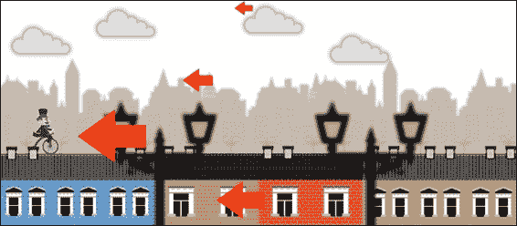
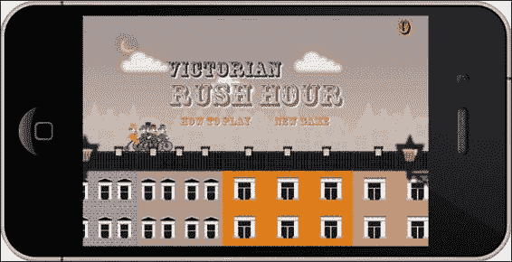
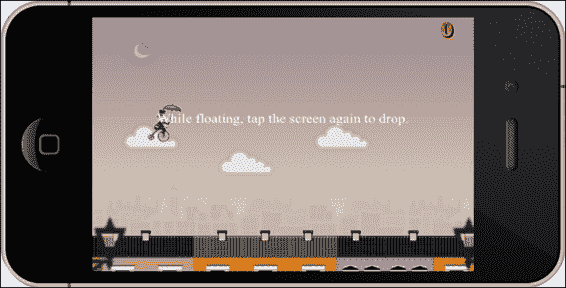

# 第七章。添加外观 – 维多利亚时代高峰时段

*现在我们有了测试游戏，是时候让它变得漂亮了！我们将介绍添加到游戏中以使其看起来更美观的新精灵元素，并涵盖一个或两个新主题。然而，到目前为止，你应该能够理解这个项目最终代码中的所有内容。*

*因此，你可以坐下来放松一下。这次，我不会让你打这么多字。我保证！*

在本章中，你将学习：

+   如何使用多个精灵为瓦片地形贴图

+   如何在`SpriteBatchNode`内部使用多个容器

+   如何创建视差效果

+   如何在你的游戏中添加菜单

+   如何构建游戏教程

# 维多利亚时代高峰时段 – 游戏画面

从本书的**支持**页面（[www.packtpub.com/support](http://www.packtpub.com/support)）下载`4198_07_START_PROJECT.zip`文件，并在 Xcode 中运行项目。你应该能够识别出我们在测试版本中所做的所有工作，并定位到一些额外的元素。你还会看到实际的游戏玩法中没有任何新增内容。

在《维多利亚时代高峰时段》中，我想让地形成为游戏中的主要挑战，但我也想向你展示如何轻松地添加新元素到建筑中并与它们交互。

你可以稍后使用相同的逻辑来添加敌人、障碍物或为自行车精灵添加拾取物。你真正需要做的只是扩展碰撞检测逻辑以检查新项目。例如，你可以添加雨伞作为拾取物，每次`_player`对象漂浮时，它就会少一把雨伞。

接下来，我将列出添加到游戏中的新元素。


## 新精灵

我们的游戏中添加了许多精灵：

+   游戏开始时有一群代表交通的自行车手。

+   我们添加了一个背景层（`cityscape`）和一个前景层（`lamp posts`），以帮助我们实现视差效果。背景中的云彩也是效果的一部分。

+   我们为建筑添加了烟囱。当玩家点击屏幕时，烟囱会冒烟。

+   当然，还有常规内容——得分标签、游戏标志和游戏结束信息。

    在下面的屏幕截图中，你可以看到`player`精灵和一群自行车手的图像：

    

## 动画

一些精灵现在运行动画动作：

+   `_player`精灵运行一个动画，展示他骑自行车的样子（`_rideAnimation`）。

+   我还添加了我们老朋友摆动动画，当`_player`精灵漂浮时显示（`_floatAnimation`）。这也是为什么自行车精灵上的注册点看起来很奇怪的原因，因为摆动动画如果精灵的锚点不在中心位置看起来会更好。

+   在游戏的介绍部分，我们的自行车手团队也被动画化，并在游戏开始时移出屏幕（`_jamAnimate`, `_jamMove`）。

+   当玩家跳跃时，我们显示从烟囱中冒出的烟。这个动画存储在新的 `Block.cpp` 类中，并通过一系列动作创建，包括帧动画 (`_puffAnimation`, `_puffSpawn`, `_puffMove`, `_puffFade` 和 `_puffScale`).

+   在 `GameLayer.cpp` 中，当 `_player` 对象死亡时，我们在 `_hat` 精灵上运行几个动作，使其在空中上升并再次落下，以增加一些幽默感。

现在，让我们回顾一下添加的逻辑。

# 使用精灵纹理我们的建筑

因此，在我们刚刚编写的测试版本中，我们的游戏屏幕被分成了 iPad 视网膜屏幕上 128 像素的瓦片。`Block` 对象的宽度和高度属性基于这个测量。所以一个宽度为两个瓦片、高度为三个瓦片的建筑实际上宽度为 256 像素，高度为 384 像素。间隙也会这样测量，尽管其高度设置为 `0`。

我们用于纹理建筑的逻辑将考虑这些瓦片。


因此，让我们看看添加纹理到我们建筑物的代码。

# 是时候进行纹理处理了——给建筑物添加纹理

`initBlock` 方法的运行方式现在有一些变化：

1.  每个方块将存储四种不同类型的纹理的引用，代表游戏中使用的四种类型的建筑 (`_tile1`, `_tile2`, `_tile3` 和 `_tile4`)。因此，我们现在在 `initBlock` 方法中存储这些信息：

    ```cpp
    void Block::initBlock() {

      _tile1 = SpriteFrameCache::getInstance()- >getSpriteFrameByName ("building_1.png");
      _tile2 = SpriteFrameCache::getInstance()- >getSpriteFrameByName ("building_2.png");
      _tile3 = SpriteFrameCache::getInstance()- >getSpriteFrameByName ("building_3.png");
      _tile4 = SpriteFrameCache::getInstance()- >getSpriteFrameByName ("building_4.png");
    ```

1.  每个方块还存储了两种纹理的引用，用于建筑屋顶瓦片 (`_roof1` 和 `_roof2`):

    ```cpp
    _roof1 = SpriteFrameCache::getInstance()-> getSpriteFrameByName ("roof_1.png");
      _roof2 = SpriteFrameCache::getInstance()- >getSpriteFrameByName ("roof_2.png");
    ```

1.  接下来，我们创建并分配形成我们建筑的各个精灵瓦片：

    ```cpp
    //create tiles
    for (int i = 0; i < 5; i++) {
       auto tile = Sprite::createWithSpriteFrameName("roof_1.png");
       tile->setAnchorPoint(Vec2(0, 1));
       tile->setPosition(Vec2(i * _tileWidth, 0));
       tile->setVisible(false);
       this->addChild(tile, kMiddleground, kRoofTile);
       _roofTiles.pushBack(tile);
       for (int j = 0; j < 4; j++) {
          tile =  Sprite::createWithSpriteFrameName("building_1.png");
          tile->setAnchorPoint(Vec2(0, 1));
          tile->setPosition(Vec2(i * _tileWidth, -1 *  (_tileHeight * 0.47f + j * _tileHeight)));
          tile->setVisible(false);
          this->addChild(tile, kBackground, kWallTile);
          _wallTiles.pushBack(tile);
       }
    }
    ```

    一个方块由 `_wallTiles` 向量中存储的 20 个精灵和 `_roofTiles` 向量中存储的 5 个精灵组成。因此，当我们初始化一个 `Block` 对象时，实际上创建了一个宽度为五个瓦片、高度为四个瓦片的建筑。我决定游戏中的任何建筑都不会超过这个大小。如果你决定更改这个，那么你需要在的地方进行更改。

1.  `initBlock` 方法还创建了五个烟囱精灵，并将它们放置在建筑的顶部。这些精灵稍后根据建筑类型分布，很容易变成我们的 `_player` 精灵的障碍。我们还在 `initBlock` 中创建了烟雾动画动作。

1.  接下来是我们的新 `setupBlock` 方法，这是将不必要的瓦片和烟囱变为不可见并展开可见烟囱的地方。我们开始这个方法如下：

    ```cpp
    void Block::setupBlock (int width, int height, int type) {

      this->setPuffing(false);

      _type = type;

      _width = width * _tileWidth;
      //add the roof height to the final height of the block
      _height = height * _tileHeight + _tileHeight * 0.49f;
      this->setPositionY(_height);

      SpriteFrame * wallFrame;
      SpriteFrame * roofFrame = rand() % 10 > 6 ? _roof1 :  _roof2;

      int num_chimneys;
      float chimneyX[] = {0,0,0,0,0};
    ```

1.  然后，根据建筑类型，我们为烟囱精灵提供不同的 `x` 位置，并确定我们将用于墙面瓦片的纹理：

    ```cpp
    switch (type) {

      case kBlockGap:
        this->setVisible(false);
        return;

      case kBlock1:
        wallFrame = _tile1;
        chimneyX[0] = 0.2f;
        chimneyX[1] = 0.8f;
        num_chimneys = 2;
        break;
      case kBlock2:
        wallFrame = _tile2;
        chimneyX[0] = 0.2f;
         chimneyX[1] = 0.8f;
        chimneyX[2] = 0.5f;
        num_chimneys = 3;
        break;
      case kBlock3:
        wallFrame = _tile3;
        chimneyX[0] = 0.2f;
        chimneyX[1] = 0.8f;
        chimneyX[2] = 0.5f;
        num_chimneys = 3;

        break;
      case kBlock4:
        wallFrame = _tile4;
        chimneyX[0] = 0.2f;
        chimneyX[1] = 0.5f;
        num_chimneys = 2;
        break;
    }
    ```

1.  然后该方法继续定位可见的烟囱。我们最终转向建筑的纹理化。纹理屋顶和墙砖的逻辑是相同的；例如，以下是墙壁如何通过通过`setDisplayFrame`方法更改每个墙精灵的纹理来铺贴，然后使未使用的砖块不可见：

    ```cpp
    count = _wallTiles->count();
      for (i  = 0; i < count; i++) {
        tile = (Sprite *) _wallTiles->objectAtIndex(i);
        if (tile->getPositionX() < _width && tile ->getPositionY() > -_height) {
          tile->setVisible(true);
          tile->setDisplayFrame(wallFrame);
        } else {
          tile->setVisible(false);
        }
      }
    }
    ```

## *发生了什么事？*

当我们在`initBlock`中实例化一个块时，我们创建了一个由墙砖和屋顶砖块组成的 5 x 4 建筑，每个都是一个精灵。当我们需要将这个建筑变成 3 x 2 建筑，或 4 x 4 建筑，或任何其他建筑时，我们只需在`setupBlock`的末尾将多余的砖块设置为不可见。

屋顶使用的纹理是随机选择的，但墙壁使用的纹理是基于建筑类型（来自我们的`patterns`数组）。它也位于这个`for`循环中，所有定位在新建筑宽度高度点以上的砖块都被设置为不可见。

# 容器中的容器

在我们转向视差效果逻辑之前，我想谈谈与我们`_gameBatchNode`对象分层相关的一些事情，你可能还记得它是一个`SpriteBatchNode`对象。

如果你进入`Terrain.cpp`中的静态`create`方法，你会注意到对象仍然使用对`blank.png`纹理的引用创建：

```cpp
terrain->initWithSpriteFrameName("blank.png")
```

事实上，测试版本中使用的相同的 1 x 1 像素图像现在在我们的精灵图集中，只是这次图像是透明的。

这是一种有点黑客式的方法，但却是必要的，因为只有当精灵的纹理源与创建批处理节点使用的纹理相同时，才能将其放置在批处理节点内。但是`Terrain`只是一个容器，它没有纹理。然而，通过将其`blank`纹理设置为包含在我们的精灵图集中的某个东西，我们可以将`_terrain`放置在`_gameBatchNode`中。

同样的操作也应用于`Block`类，现在，在游戏的最终版本中，它表现得像一个没有纹理的容器。它将包含墙壁和屋顶砖块以及烟囱和冒烟动画作为其子项。

我们`_gameBatchNode`对象内部层的组织可能看起来很复杂，有时甚至荒谬。毕竟，在同一个节点中，我们有一个前景“层”的街灯，一个中景“层”的建筑，以及一个背景“层”包含城市景观。玩家也被放置在背景中，但位于城市景观之上。不仅如此，这三个层以不同的速度移动以创建我们的视差效果，所有这些都在同一个`SpriteBatchNode`中！

但这种安排为我们节省的代码量足以证明我们在尝试保持批处理节点组织时可能遇到的任何困惑。现在我们可以动画化烟的冒烟，例如，而不用担心当地形向左滚动时将它们“附着”到相应的`chimney`精灵上。容器将负责保持一切在一起。

# 创建视差效果

Cocos2d-x 有一个名为`ParallaxNode`的特殊节点，关于它的一个令人惊讶的事情是，你实际上很少能用到它！`ParallaxNode`有助于使用有限层或有限滚动创建透视效果，这意味着如果你的游戏屏幕有滚动限制，你可以使用它。将`ParallaxNode`应用于可以无限滚动的游戏屏幕，例如*Victorian Rush Hour*中的屏幕，通常需要比构建自己的效果更多的努力。

通过在不同深度以不同速度移动对象来创建透视效果。一个层看起来离屏幕越远，其速度应该越慢。在游戏中，这通常意味着玩家精灵的速度被分成所有在其后面的层，并乘以出现在玩家精灵前面的层：



让我们将其添加到我们的游戏中。

# 现在是时候创建透视效果了

我们的透视效果发生在主循环中：

1.  因此，在我们的`update`方法中，你会找到以下代码行：

    ```cpp
    if (_player->getVector().x > 0) {
      _background->setPositionX(_background->getPosition().x -  _player->getVector().x * 0.25f);
    ```

    首先，我们移动包含城市景观纹理沿`x`轴重复三次的`_background`精灵，并以`_player`精灵的四分之一速度移动它。

1.  `_background`精灵向左滚动，一旦第一张城市景观纹理离开屏幕，我们就将整个`_background`容器向右移动到第二张城市景观纹理应该出现的位置。我们通过从精灵的总宽度中减去精灵的位置来获取这个值：

    ```cpp
    float diffx;

    if (_background->getPositionX() < -_background ->getContentSize().width) {
      diffx = fabs(_background->getPositionX()) - _background ->getContentSize().width;
      _background->setPositionX(-diffx);
    }
    ```

    因此，实际上，我们只滚动容器内的第一个纹理精灵。

1.  使用`_foreground`精灵及其包含的三个路灯精灵重复类似的过程。只有`_foreground`精灵以玩家精灵的四倍速度移动。这些代码如下所示：

    ```cpp
    _foreground->setPositionX(_foreground->getPosition().x - _player->getVector().x * 4);

    if (_foreground->getPositionX() < -_foreground ->getContentSize().width * 4) {
      diffx = fabs(_foreground->getPositionX()) - _foreground ->getContentSize().width * 4;
      _foreground->setPositionX(-diffx);
    }
    ```

1.  我们还在透视效果中使用了我们的`cloud`精灵。由于它们出现在城市景观之后，因此距离`_player`更远，云层的移动速度更低（`0.15`）：

    ```cpp
    for (auto cloud : _clouds) {
       cloud->setPositionX(cloud->getPositionX() - _player->getVector().x * 0.15f);
       if (cloud->getPositionX() + cloud->getBoundingBox().size.width * 0.5f < 0 ) {
          cloud->setPositionX(_screenSize.width + cloud->getBoundingBox().size.width * 0.5f);
       }
    }
    ```

## *发生了什么？*

我们只是通过在不同深度使用不同比例的玩家速度，简单地在我们的游戏中添加了透视效果。逻辑中稍微复杂的一部分是如何确保精灵连续滚动。但数学上非常简单。你只需要确保精灵正确对齐。

# 向我们的游戏中添加菜单

目前，我们只能在介绍屏幕上看到游戏标志。我们需要添加按钮来开始游戏，以及选择玩教程的选项。

为了做到这一点，我们将使用一种特殊的`Layer`类，称为`Menu`。

`Menu`是一组`MenuItems`。层负责分配其项目以及跟踪所有项目上的触摸事件。项目可以是精灵、标签、图像等等。



# 现在是时候创建菜单和 MenuItem 了

在`GameLayer.cpp`中，向下滚动到`createGameScreen`方法。我们将在这个方法的末尾添加新的逻辑。

1.  首先，创建开始游戏按钮的菜单项：

    ```cpp
    auto menuItemOn =  Sprite::createWithSpriteFrameName("btn_new_on.png");
    auto menuItemOff =  Sprite::createWithSpriteFrameName("btn_new_off.png");

    auto starGametItem = MenuItemSprite::create( menuItemOff,
    menuItemOn, CC_CALLBACK_1(GameLayer::startGame, this));
    ```

    我们通过为按钮的每个状态传递一个精灵来创建一个`MenuItemSprite`对象。当用户触摸一个`MenuItemSprite`对象时，关闭状态的精灵变为不可见，而开启状态的精灵变为可见，所有这些操作都在触摸开始事件中完成。如果触摸结束或取消，关闭状态将再次显示。

    我们还传递了此项目的回调函数；在这种情况下，`GameLayer::StartGame`。

1.  接下来，我们添加教程按钮：

    ```cpp
    menuItemOn =  Sprite::createWithSpriteFrameName("btn_howto_on.png");
    menuItemOff =  Sprite::createWithSpriteFrameName("btn_howto_off.png");

    auto howToItem = MenuItemSprite::create( menuItemOff,  menuItemOn, CC_CALLBACK_1(GameLayer::showTutorial, this));
    ```

1.  然后是创建菜单的时间：

    ```cpp
    _mainMenu = Menu::create(howToItem, starGametItem, nullptr);
    _mainMenu->alignItemsHorizontallyWithPadding(120);
    _mainMenu->setPosition(Vec2(_screenSize.width *  0.5f, _screenSize.height * 0.54));

    this->addChild(_mainMenu, kForeground);
    ```

    `Menu`构造函数可以接收你希望显示的任意数量的`MenuItemSprite`对象。这些项目随后通过以下调用进行分布：`alignItemsHorizontally`、`alignItemsHorizontallyWithPadding`、`alignItemsVerticallyWithPadding`、`alignItemsInColumns`和`alignItemsInRows`。项目将按照传递给`Menu`构造函数的顺序显示。

1.  然后我们需要添加我们的回调函数：

    ```cpp
    void GameLayer::startGame (Ref* pSender) {
      _tutorialLabel->setVisible(false);
      _intro->setVisible(false);
      _mainMenu->setVisible(false);

      _jam->runAction(_jamMove);
      SimpleAudioEngine::getInstance() ->playEffect("start.wav");
      _terrain->setStartTerrain ( true );
      _state = kGamePlay;
    }

    void GameLayer::showTutorial (Ref* pSender) {
      _tutorialLabel->setString ("Tap the screen to make the player jump.");
      _state = kGameTutorialJump;
      _jam->runAction(_jamMove);
      _intro->setVisible(false);
      _mainMenu->setVisible(false);
      SimpleAudioEngine::getInstance() ->playEffect("start.wav");
      _tutorialLabel->setVisible(true);

    }
    ```

    这些是在我们的菜单按钮被点击时调用的，一个用于开始游戏，一个用于显示教程。

## *发生了什么？*

我们刚刚创建了游戏的主菜单。`Menu`可以为我们节省很多时间处理按钮的所有交互逻辑。尽管它可能不如 Cocos2d-x 中的其他项目灵活，但如果我们需要它，了解它的存在仍然是有用的。

我们将在下一节处理教程部分。

# 将教程添加到我们的游戏中

让我们面对现实。除了*空气曲棍球*可能之外，这本书中到目前为止的每个游戏都可以从教程或“如何玩”部分中受益。在*维多利亚时代交通高峰期*中，我将向你展示一种快速实现教程的方法。

游戏教程的未言明规则是——使其可玩。这正是我们将在这里尝试的。

我们将为我们的教程创建一个游戏状态，并将一个`Label`对象添加到我们的舞台中，除非教程状态开启，否则使其不可见。我们将使用`Label`对象来显示我们的教程文本，如图中所示：



让我们回顾一下创建游戏教程所需的步骤。

# 是时候添加教程了

让我们回到我们的`createGameScreen`方法。

1.  在那个方法中，添加以下行以创建我们的`Label`对象：

    ```cpp
    _tutorialLabel = Label::createWithTTF("", "fonts/Times.ttf", 60);
    _tutorialLabel->setPosition(Vec2 (_screenSize.width *  0.5f, _screenSize.height * 0.6f) );
    this->addChild(_tutorialLabel, kForeground);
    _tutorialLabel->setVisible(false);
    ```

1.  我们在我们的游戏状态枚举列表中添加了四个状态。这些将代表教程中的不同步骤：

    ```cpp
    typedef enum {
      kGameIntro,
      kGamePlay,
      kGameOver,
      kGameTutorial,
      kGameTutorialJump,
      kGameTutorialFloat,
      kGameTutorialDrop

    } GameState;
    ```

    第一个教程状态`kGameTutorial`作为与其他游戏状态的分隔符。因此，如果`_state`的值大于`kGameTutorial`，我们就处于教程模式。

    现在，根据模式的不同，我们显示不同的消息，并等待不同的条件来切换到新的教程状态。

1.  如果你还记得，我们的`showTutorial`方法从一条消息开始，告诉玩家触摸屏幕使精灵跳跃：

    ```cpp
    _tutorialLabel->setString ("Tap the screen to make the player jump.");
    _state = kGameTutorialJump;
    ```

1.  然后，在 `update` 方法的末尾，我们开始添加显示我们教程剩余信息的行。首先，如果玩家精灵正在跳跃并且刚刚开始下落，我们使用以下代码：

    ```cpp
    if (_state > kGameTutorial) {
      if (_state == kGameTutorialJump) {
        if (_player->getState() == kPlayerFalling && _player ->getVector().y < 0) {
          _player->stopAllActions();
          _jam->setVisible(false);
          _jam->stopAllActions();
          _running = false;
          _tutorialLabel->setString ("While in the air, tap the screen to float.");
          _state = kGameTutorialFloat;
        }
    ```

    如你所见，我们让玩家知道再次点击将打开雨伞并导致精灵漂浮。

1.  接下来，当精灵在空中漂浮时，当它到达建筑物的一定距离时，我们通知玩家，再次点击将关闭雨伞并导致精灵下落。以下是这些指令的代码：

    ```cpp
      } else if (_state == kGameTutorialFloat) {
        if (_player->getPositionY() < _screenSize.height *  0.95f) {
          _player->stopAllActions();
          _running = false;
          _tutorialLabel->setString ("While floating, tap the screen again to drop.");
          _state = kGameTutorialDrop;
        }
    ```

1.  之后，教程将完成，并显示玩家可以开始游戏的消息：

    ```cpp
      } else {
        _tutorialLabel->setString ("That's it. Tap the screen to play.");
        _state = kGameTutorial;
      }
    }
    ```

    每当我们更改教程状态时，我们会暂时暂停游戏并等待点击。我们将在 `onTouchBegan` 中处理其余的逻辑，所以我们将稍后添加它。

1.  在 `onTouchBegan` 函数内部，在 `switch` 语句中，添加以下情况：

    ```cpp
    case kGameTutorial:
      _tutorialLabel->setString("");
      _tutorialLabel->setVisible(false);
      _terrain->setStartTerrain ( true );
      _state = kGamePlay;
      break;

    case kGameTutorialJump:
      if (_player->getState() == kPlayerMoving) {
        SimpleAudioEngine::getInstance() ->playEffect("jump.wav");
        _player->setJumping(true);
      }
      break;

    case kGameTutorialFloat:
      if (!_player->getFloating()) {
        _player->setFloating (true);
        _running = true;
      }
      break;

    case kGameTutorialDrop:
      _player->setFloating (false);
      _running = true;
      break;
    ```

## *发生了什么？*

我们在我们的游戏中添加了一个教程！正如你所见，我们使用了相当多的新状态。但现在我们可以将教程直接整合到我们的游戏中，让一个状态流畅地过渡到另一个状态。所有这些更改都可以在项目的最终版本 `4198_07_FINAL_PROJECT.zip` 中看到，你可以在本书的 **支持** 页面上找到。

现在，你已经猜到了，让我们在 Android 中运行它。

# 行动时间 - 在 Android 中运行游戏

按照以下步骤将游戏部署到 Android：

1.  在文本编辑器中打开你项目中的 `Android.mk` 文件。

1.  将 `LOCAL_SRC_FILES` 中的行编辑为以下内容：

    ```cpp
    LOCAL_SRC_FILES := hellocpp/main.cpp \
                       ../../Classes/AppDelegate.cpp \
                       ../../Classes/Block.cpp \
                       ../../Classes/GameSprite.cpp \
                       ../../Classes/Player.cpp \
                       ../../Classes/Terrain.cpp \
                       ../../Classes/GameLayer.cpp
    ```

1.  将游戏导入 Eclipse 并等待所有类编译完成。

1.  就这样。保存并运行你的应用程序。

## *发生了什么？*

现在，你已经可以在 Android 上运行 *维多利亚时代高峰时段* 了。

# 摘要

在我们的测试游戏中，我们详细调整了游戏玩法后，引入精灵图集和游戏状态看起来非常简单和容易。

但在这个阶段，我们也可以考虑新的方法来改进游戏玩法。例如，意识到从烟囱冒出的烟雾云可以为玩家提供很好的视觉提示，以识别建筑物的位置，如果骑自行车的人跳得太高。或者，空中飞舞的帽子可能很有趣！

现在是时候将物理效果引入我们的游戏了，所以继续阅读下一章。
