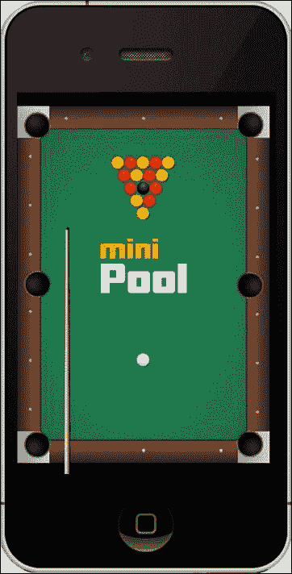
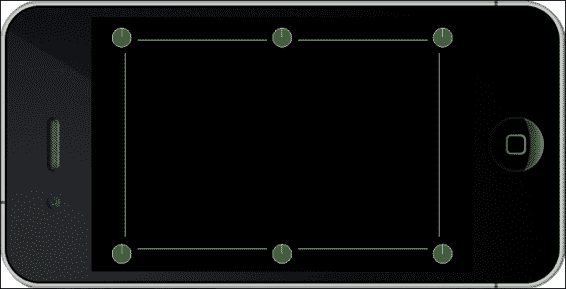
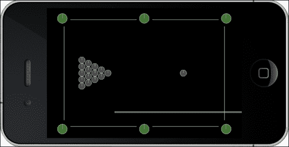
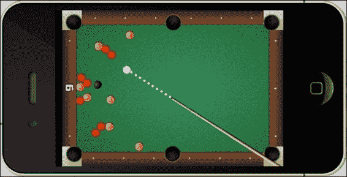

# 第八章. 获得物理感 – Box2D

*是时候处理物理了！Cocos2d-x 随带 Box2D 和 Chipmunk。这些都是所谓的 2D 物理引擎 – 第一个是用 C++ 编写的，第二个是用 C 编写的。Chipmunk 有一个更近期的 Objective-C 版本，但 Cocos2d-x 必须使用用 C 编写的原始版本以保持兼容性。*

*我们将在这本书的示例中使用 Box2D。接下来两个我将展示的游戏将使用该引擎开发，从简单的台球游戏开始，以展示在项目中使用 Box2D 的所有主要点。*

在本章中，你将学习：

+   如何设置和运行 Box2D 模拟

+   如何创建刚体

+   如何使用调试绘制功能快速测试你的概念

+   如何使用碰撞过滤器监听器

# 使用 Cocos2d-x 构建 Box2D 项目

使用框架的 3.x 版本，我们不再需要指定我们想要使用物理引擎。项目默认添加了这些 API。因此，为了创建一个 Box2D 项目，你只需要创建一个常规的 Cocos2d-x 项目，就像我们到目前为止在示例中所做的那样。

然而，如果你想在项目中使用一个名为调试绘制的功能，你需要执行一个额外的步骤。所以，让我们现在设置它。

# 行动时间 – 在你的 Box2D 项目中使用调试绘制

让我们先创建项目。在我的机器上，我在桌面上创建了一个名为 MiniPool 的游戏。以下是步骤：

1.  打开终端并输入以下命令：

    ```cpp
    cocos new MiniPool -p com.rengelbert.MiniPool -l cpp -d /Users/rengelbert/Desktop/MiniPool
    ```

1.  在 Xcode 中打开新项目。

1.  现在，导航到 Cocos2d-x 框架文件夹内的 `Tests` 文件夹。这可以在 `tests/cpp-tests/Classes` 中找到。然后打开 `Box2DTestBed` 文件夹。

1.  将文件 `GLES-Render.h` 和 `GLES-Render.cpp` 拖到你的 Xcode 项目中。

1.  你也可以打开测试文件夹 `Box2DTest` 中的 `Box2dTest.cpp` 类，因为我们将从那里复制并粘贴一些方法。

1.  在 `HelloWorldScene.h` 头文件中，保留现有的包含，但将类声明更改为以下内容：

    ```cpp
    class HelloWorld : public cocos2d::Layer {
    public:
        virtual ~HelloWorld();
        HelloWorld();

       static cocos2d::Scene* scene();

        void initPhysics();
        void update(float dt);
        virtual void draw(Renderer *renderer, const Mat4 &transform, uint32_t flags) override;

    private:
       GLESDebugDraw * _debugDraw;
        b2World* world;
        Mat4 _modelViewMV;
        void onDraw();
        CustomCommand _customCommand;
    };
    ```

1.  然后在顶部添加以下 `include` 语句：

    ```cpp
    #include "GLES-Render.h"
    ```

1.  然后，在 `HelloWorldScene.cpp` 实现文件中，将 `using namespace CocosDenshion` 和 `HelloWorld::scene` 方法之间的行替换为以下内容：

    ```cpp
    #define PTM_RATIO 32

    HelloWorld::HelloWorld()
    {
        this->initPhysics();
        scheduleUpdate();
    }

    HelloWorld::~HelloWorld()
    {
        delete world;
        world = nullptr;

        delete _debugDraw;
       _debugDraw = nullptr;
    }

    void HelloWorld::initPhysics() {

        b2Vec2 gravity;
        gravity.Set(0.0f, -10.0f);
        world = new b2World(gravity);

        // Do we want to let bodies sleep?
        world->SetAllowSleeping(true);
        world->SetContinuousPhysics(true);

        _debugDraw = new (std::nothrow) GLESDebugDraw( PTM_RATIO );
        world->SetDebugDraw(_debugDraw);

        uint32 flags = 0;
        flags += b2Draw::e_shapeBit;
        //        flags += b2Draw::e_jointBit;
        //        flags += b2Draw::e_aabbBit;
        //        flags += b2Draw::e_pairBit;
        //        flags += b2Draw::e_centerOfMassBit;
        _debugDraw->SetFlags(flags);

    }
    void HelloWorld::update(float dt)
    {
        world->Step(dt, 8, 1);

    }
    ```

1.  现在是 `draw` 方法的实现时间。你可以从 `Box2DTest` 文件夹复制并粘贴大部分代码：

    ```cpp
    void GameLayer::draw(Renderer *renderer, const Mat4 &transform, uint32_t flags)
    {
       //
        // IMPORTANT:
        // This is only for debug purposes
        // It is recommended to disable it
        //
       Layer::draw(renderer, transform, flags);
      GL::enableVertexAttribs( cocos2d::GL::VERTEX_ATTRIB_FLAG_POSITION );
        auto director = Director::getInstance();
        CCASSERT(nullptr != director, "Director is null when setting matrix stack");
        director->pushMatrix(MATRIX_STACK_TYPE::MATRIX_STACK_MODELVIEW);

        _modelViewMV = director->getMatrix(MATRIX_STACK_TYPE::MATRIX_STACK_MODELVIEW);

        _customCommand.init(_globalZOrder);
        _customCommand.func = CC_CALLBACK_0(GameLayer::onDraw, this);
        renderer->addCommand(&_customCommand);

        director->popMatrix(MATRIX_STACK_TYPE::MATRIX_STACK_MODELVIEW);

    }

    void GameLayer::onDraw()
    {
       auto director = Director::getInstance();
       Mat4 oldMV;
        oldMV = director->getMatrix(MATRIX_STACK_TYPE::MATRIX_STACK_MODELVIEW);
        director->loadMatrix(MATRIX_STACK_TYPE::MATRIX_STACK_MODELVIEW, _modelViewMV);
        _world->DrawDebugData();
        director->loadMatrix(MATRIX_STACK_TYPE::MATRIX_STACK_MODELVIEW, oldMV);
    }
    ```

## *发生了什么？*

`GLES-Render` 类是使用 Box2D 中的调试绘制功能所必需的。这将在屏幕上绘制模拟的所有元素。调试绘制对象在 `initPhysics` 方法中与 Box2D 模拟（`b2World`）一起创建。我们稍后会介绍这个逻辑。

如 `draw` 方法中的注释所述，一旦你完成游戏开发，应该关闭调试绘制功能。因此，当你准备发布版本时，应该注释掉与该对象以及 `draw` 方法相关的所有行。

# 那么物理引擎是什么？

著名的艾萨克·牛顿曾说，*每一个作用力都有一个反作用力*。就在他说完这句话后，他问道，*谁他妈扔的那个苹果？*

到目前为止，在我们的游戏中，我们涵盖了非常简单的碰撞系统，基本上只是检查简单的形状（圆形和矩形）是否重叠。到目前为止，我们游戏中这些碰撞的反应也非常简单：通过向量反转或者简单地让物体在接触后消失。使用 Box2D，你将得到更多！

Box2D 是一个非常健壮的碰撞检测引擎，当然可以仅为此目的使用。但模拟还会处理并返回从碰撞和物体之间的相互作用中派生的一组信息，这意味着根据它们的形状、质量和模拟中所有作用力，物体应该如何表现。

## 认识 Box2D

在引擎的核心，你有一个 `b2World` 对象。这就是模拟。你用 `b2Body` 对象填充世界，然后通过 `b2World->Step()` 来遍历模拟。然后你从模拟中获取结果，并通过你的精灵将它们显示给用户，通过获取一个 `b2Body` 对象的位置和旋转并将其应用到精灵上。

调试绘图对象允许你不用任何精灵就能看到模拟。有点像我们第六章中的测试项目版本，*快速简单的精灵 – 维多利亚时代的交通高峰*。

## 认识世界

大多数时候，物理模拟意味着创建一个 `b2World` 对象。然而，请注意，你*可以*在同一个游戏中管理多个 `world` 对象，例如为了多个视角。但这将是另一本书的内容。

在我们的简化基本项目中，世界的创建方式如下：

```cpp
b2Vec2 gravity;
gravity.Set(0.0f, -10.0f);
world = new b2World(gravity);

// Do we want to let bodies sleep?
world->SetAllowSleeping(true);
world->SetContinuousPhysics(true);

_debugDraw = new (std::nothrow) GLESDebugDraw( PTM_RATIO );
world->SetDebugDraw(_debugDraw);

uint32 flags = 0;
flags += b2Draw::e_shapeBit;
//        flags += b2Draw::e_jointBit;
//        flags += b2Draw::e_aabbBit;
//        flags += b2Draw::e_pairBit;
//        flags += b2Draw::e_centerOfMassBit;
_debugDraw->SetFlags(flags);
```

Box2D 有自己的向量结构，`b2Vec2`，我们在这里用它来创建世界的重力。`b2World` 对象接收这个作为它的参数。当然，模拟并不总是需要重力；在这种情况下，参数将是一个 `(0, 0)` 向量。

`SetAllowSleeping` 表示如果对象没有移动并且因此没有生成派生数据，则跳过检查这些对象的派生数据。

`SetContinuousPhysics` 表示我们手中有一些快速的对象，我们稍后会将其指向模拟，以便它对碰撞给予额外的关注。

然后我们创建调试绘图对象。正如我之前所说的，这是可选的。标志指示你希望在绘图中看到什么。在之前的代码中，我们只想看到物体的形状。

然后是`PTM_RATIO`，这是我们传递给 debug draw 的参数定义的常量。Box2D 出于各种原因使用米而不是像素，这些原因对任何人来说都完全没有必要知道。除了一个原因，**像素到米**（**PTM**），所以游戏中使用的每个像素位置值都将除以这个比例常数。如果这个除法的结果超过 10 或低于 0.1，相应地增加或减少`PTM_RATIO`的值。

当然，你有一些灵活性。一旦你的游戏完成，不妨玩玩这个值，并特别注意速度上的细微差别（这个比例的另一个常见值是 100）。

## 运行模拟

正如我之前所说，你使用`Step`方法来运行模拟，通常在主循环内部进行，尽管不一定是这样：

```cpp
world->Step(dt, 8, 1);
```

你需要传递给它时间步长，这里由主循环中的 delta 时间表示。然后传递步中的速度迭代次数和位置迭代次数。这基本上意味着速度和位置将在一个步长内被处理多少次。

在前面的例子中，我使用了 Cocos2d-x 中 Box2D 模板的默认值。通常，固定时间步长比 delta 更好，如果你的游戏中的物体移动得很快，可能还需要更高的位置迭代值。但始终记得玩这些值，目标是找到尽可能低的值。

## Box2D 中没有 Ref 对象

Box2D 不使用`Ref`对象。所以，没有内存管理！记得通过`delete`而不是`release`来删除所有 Box2D 对象。如果你已经知道了……嗯，你记得：

```cpp
HelloWorld::~HelloWorld(){
    delete world;
    world = nullptr;

    delete _debugDraw;
   _debugDraw = nullptr;
}
```

### 注意

正如我之前提到的，C++11 引入了智能指针，它们是内存管理的，这意味着你*不需要*自己删除这些对象。然而，共享指针的话题超出了本书的范围，在本章中使用唯一指针会添加很多与 Box2D 无关的行。尽管智能指针很棒，但它们的语法和用法，嗯，让我们说非常“C++风格”。

## 遇到物体

`b2Body`对象是你在 Box2D 模拟中花费大部分时间处理的东西。你有三种主要的`b2Bodies`类型：动态、静态和运动学。前两种更为重要，也是我们在游戏中会使用的类型。

物体是通过将身体定义与身体固定件组合来创建的。身体定义是一个包含类型、位置、速度和角度等信息的数据结构。固定件包含有关形状的信息，包括其密度、弹性和摩擦。

因此，要创建一个宽度为 40 像素的圆形，你会使用以下方法：

```cpp
b2BodyDef bodyDef;
bodyDef.type = b2_dynamicBody;
//or make it static bodyDef.type = b2_staticBody;
b2Body * body = world->CreateBody(&bodyDef);

//create circle shape
b2CircleShape  circle;
circle.m_radius = 20.0/PTM_RATIO;

//define fixture
b2FixtureDef fixtureDef;
fixtureDef.shape = &circle;
fixtureDef.density = 1;
fixtureDef.restitution = 0.7;
fixtureDef.friction = 0.4;

body->CreateFixture(&fixtureDef);
```

要创建一个宽度为 40 像素的盒子，你会使用以下方法：

```cpp
//create body
b2BodyDef bodyDef;
bodyDef.type = b2_dynamicBody;
b2Body * body = world->CreateBody(&bodyDef);

//define shape
b2PolygonShape box;
box.SetAsBox(20 /PTM_RATIO, 20 / PTM_RATIO);

//Define fixture
b2FixtureDef fixtureDef;
fixtureDef.shape = &box;
fixtureDef.density = 2;
fixtureDef.restitution = 0;
body->CreateFixture(&fixtureDef);
```

注意，你使用`world`对象来创建物体。还要注意，盒子是用其期望宽度和高度的一半创建的。

密度、摩擦和恢复系数都有默认值，所以你不必总是设置这些。

# 我们的游戏 – MiniPool

我们的游戏由十六个球（圆形）、一个球杆（矩形）以及由六条线（边缘）和六个球洞（圆形）组成的台球桌组成。从 Box2D 模拟的角度来看，这就是全部内容。

如果你希望跟随最终代码，请从本书的 **支持** 页面下载最终项目。Box2D 是一个复杂的 API，最好是通过审查和暴露逻辑而不是通过大量输入来工作。所以这次将没有起始项目可供工作。你可以选择任何方式将完成的项目中的文件添加到我在展示如何设置调试绘制对象时开始的项目中。最终游戏将看起来像这样：



## 游戏设置

这是一个仅支持竖屏的游戏，不允许屏幕旋转，并且是通用应用。游戏是为标准 iPhone（320 x 480）设计的，其分辨率大小设置为 `kResolutionShowAll`。这将显示不匹配 iPhone 1.5 屏幕比例的设备上的主屏幕周围的边框。

```cpp
//in AppDelegate.cpp
auto screenSize = glview->getFrameSize();
auto designSize = Size(320, 480);

glview->setDesignResolutionSize(designSize.width, designSize.height, ResolutionPolicy::SHOW_ALL);
std::vector<std::string> searchPaths;
   if (screenSize.width > 640) {
      searchPaths.push_back("ipadhd");
      director->setContentScaleFactor(1280/designSize.width);
   } else if (screenSize.width > 320) {
      searchPaths.push_back("ipad");
      director->setContentScaleFactor(640/designSize.width);
   } else {
      searchPaths.push_back("iphone");
      director->setContentScaleFactor(320/designSize.width);
   }
   auto fileUtils = FileUtils::getInstance();
   fileUtils->setSearchPaths(searchPaths);
```

注意，我使用 iPhone 的尺寸来识别更大的屏幕。所以 iPad 和 iPhone retina 被认为是 320 x 480 的两倍，而视网膜 iPad 被认为是 320 x 480 的四倍。

## 精灵加 b2Body 等于 b2Sprite

在 Cocos2d-x 中处理 `b2Body` 对象最常见的方式是将它们与精灵结合使用。在我将要展示的游戏中，我创建了一个名为 `b2Sprite` 的类，它扩展了精灵并添加了一个 `_body` 成员属性，该属性指向其自己的 `b2Body`。我还添加了一些辅助方法来处理我们讨厌的 `PTM_RATIO`。请随意添加您认为必要的这些方法。

`b2Body` 对象有一个极其有用的属性，称为 `userData`。你可以在其中存储任何你希望的内容，并且这些对象将携带它穿过整个模拟。所以，大多数开发者会这样做，他们在对象的 `userData` 属性中存储一个指向包裹它的精灵实例的引用。所以 `b2Sprite` 知道它的 `body`，而 `body` 知道它的 `b2Sprite`。

### 小贴士

实际上，在处理 Box2D 时，组合是关键。所以，在设计你的游戏时，确保每个对象都知道其他对象或可以快速访问它们。这将非常有帮助。

## 创建台球桌

在调试绘制视图中，桌子看起来是这样的：



这里看到的所有元素都是在 `GameLayer.cpp` 中的 `initPhysics` 方法内部创建的。桌子除了我们游戏中使用的背景图像外没有视觉表示。所以没有精灵附加到单个球洞上，例如。

球洞对象是在 `for` 循环内部创建的，我使用了我能想到的最佳算法来正确地在屏幕上分布它们。这个逻辑可以在 `initPhysics` 方法中找到，所以让我们看看它，看看我们的第一个 `b2Body` 对象是如何创建的：

```cpp
b2Body * pocket;
b2CircleShape circle;
float startX = _screenSize.width * 0.07;
float startY = _screenSize.height * 0.92f;
for (int i = 0; i < 6; i++) {
   bodyDef.type = b2_staticBody;
   if (i < 3) {
      bodyDef.position.Set(startX/PTM_RATIO,
(startY - i * (_screenSize.height * 0.84f * 0.5f))/PTM_RATIO);

    } else {
        bodyDef.position.Set(
        (startX + _screenSize.width * 0.85f)/PTM_RATIO,
        (startY - (i-3) * (_screenSize.height * 0.84f * 0.5f))/PTM_RATIO);
    }
    pocket = _world->CreateBody(&bodyDef);
    fixtureDef.isSensor = true;
    circle.m_radius = (float) (1.5 * BALL_RADIUS) / PTM_RATIO;
    fixtureDef.shape = &circle;

    pocket->CreateFixture(&fixtureDef);
    auto pocketData = new b2Sprite(this, kSpritePocket);
    pocket->SetUserData(pocketData);
}
```

`pocket`物体是静态物体，我们在它们的固定定义中确定它们应该像传感器一样行为：

```cpp
fixtureDef.isSensor = true;
```

这将关闭一个对象的全部物理属性，将其变成碰撞热点。传感器仅用于确定是否有物体接触它。

### 提示

几乎总是最好忽略 Box2D 传感器，并使用自己的精灵或点在你的碰撞逻辑中。传感器的一个很酷的功能是，它们使得确定某物刚刚停止接触它们变得非常容易，正如我们一旦覆盖了接触监听器就会看到的那样。

## 创建边缘

如果一个形状只能从一侧被击中，那么边缘可能就是你需要的东西。以下是我们如何在游戏中创建边缘的方法：

```cpp
b2BodyDef tableBodyDef;
tableBodyDef.position.Set(0, 0);
b2Body* tableBody = _world->CreateBody(&tableBodyDef);

// Define the table edges
b2EdgeShape tableBox;

// bottom edge
tableBox.Set(b2Vec2(_screenSize.width * 0.14f/PTM_RATIO, _screenSize.height * 0.09f/PTM_RATIO),
b2Vec2(_screenSize.width * 0.86f/PTM_RATIO, _screenSize.height * 0.09f/PTM_RATIO));
tableBody->CreateFixture(&tableBox,0);

// top edge
tableBox.Set(b2Vec2(_screenSize.width * 0.14f/PTM_RATIO, _screenSize.height * 0.91f/PTM_RATIO),
    b2Vec2(_screenSize.width * 0.86f/PTM_RATIO, _screenSize.height * 0.91f/PTM_RATIO));
tableBody->CreateFixture(&tableBox,0);
```

因此，同一个`b2Body`对象可以有你需要的大量边缘。你设置一个边缘，指定其起点和终点（在这种情况下，是`b2Vec2`结构），并将其作为固定件添加到身体中，密度为`0`。

## 创建球对象

在游戏中，有一个名为`Ball`的类，它扩展了`b2Sprite`，用于目标球和球杆球。这些对象也是在`initPhysics`方法内部创建的。以下是该对象的基本配置：

```cpp
//create Box2D body
b2BodyDef bodyDef;
bodyDef.type = b2_dynamicBody;

_body = _game->getWorld()->CreateBody(&bodyDef);
_body->SetLinearDamping(1.2f);
_body->SetAngularDamping(0.2f);

//create circle shape
b2CircleShape  circle;
circle.m_radius = BALL_RADIUS/PTM_RATIO;

//define fixture
b2FixtureDef fixtureDef;
fixtureDef.shape = &circle;
fixtureDef.density = 5;
fixtureDef.restitution = 0.7f;

//add collision filters so only white ball can be hit by cue
if (_type == kSpriteBall) {
    fixtureDef.filter.categoryBits = 0x0010;
} else if (_type == kSpritePlayer) {
//white ball is tracked as bullet by simulation
    _body->SetBullet(true);
    fixtureDef.filter.categoryBits = 0x0100;
}

//set sprite texture
switch (_color) {
    case kColorBlack:
        this->initWithSpriteFrameName("ball_black.png");
        break;
    case kColorRed:
        this->initWithSpriteFrameName("ball_red.png");
        break;
    case kColorYellow:
        this->initWithSpriteFrameName("ball_yellow.png");
        break;
    case kColorWhite:
        this->initWithSpriteFrameName("ball_white.png");
        break;
}

_body->CreateFixture(&fixtureDef);
//store the b2Sprite as the body's userData
_body->SetUserData(this);
```

`friction`固定属性涉及两个接触表面（两个物体）的反应。在这种情况下，我们想要与桌面表面创建“摩擦”，而桌面根本不是一个物体。因此，我们需要使用的是**阻尼**。这将产生与摩擦类似的效果，但不需要额外的表面。阻尼可以应用于物体的线性速度向量，如下所示：

```cpp
_body->SetLinearDamping(1.2);
```

并且将其角速度设置为如下：

```cpp
_body->SetAngularDamping(0.2);
```

此外，白球被设置为子弹形状：

```cpp
_body->SetBullet(true);
```

这将使模拟在碰撞方面对这个对象给予额外的关注。我们本可以将游戏中的所有球都设置为子弹形状，但这不仅是不必要的（通过测试揭示的事实），而且也不太适合处理。

## 创建碰撞过滤器

在`ball`对象中，固定定义内部有一个`filter`属性，我们使用它来屏蔽碰撞。这意味着我们确定哪些物体可以相互碰撞。球杆球接收与其它球不同的`categoryBits`值。

```cpp
fixtureDef.filter.categoryBits = 0x0100;
```

当我们创建球杆体时，我们在其固定定义中设置了一个`maskBits`属性，如下所示：

```cpp
fixtureDef.filter.maskBits = 0x0100;
```

我们将其设置为与白球的`categoryBits`相同的值。

所有这些的结果？现在球杆只能击中具有相同`categoryBits`的物体，在这里这意味着球杆只能与白球碰撞。

可以使用位运算符`|`将多个类别添加到屏蔽中，如下所示：

```cpp
fixtureDef.filter.maskBits = 0x0100 | 0x0010;
```

或者，例如，不与球杆球碰撞，如下所示：

```cpp
fixtureDef.filter.maskBits = 0xFFFF & ~0x0100;
```

## 创建球杆

球杆球也扩展了`b2Sprite`，其身体被设置为盒子形状。

```cpp
//create body
b2BodyDef bodyDef;
bodyDef.type = b2_dynamicBody;

_body = _game->getWorld()->CreateBody(&bodyDef);
_body->SetLinearDamping(8);
_body->SetAngularDamping(5);

//Define shape
b2PolygonShape box;
box.SetAsBox(BALL_RADIUS * 21 /PTM_RATIO, BALL_RADIUS * 0.2 / PTM_RATIO);

//Define fixture
b2FixtureDef fixtureDef;
fixtureDef.shape = &box;
fixtureDef.filter.maskBits = 0x0100;
fixtureDef.density = 10;
fixtureDef.restitution = 1;
_body->CreateFixture(&fixtureDef);
_body->SetUserData(this);
```

它具有非常高的阻尼值，因为在玩家偶尔错过母球的情况下，球杆不会飞出屏幕，而是在白球几像素之外停止。

如果我们想要将球杆创建为梯形或三角形，我们需要给`b2PolygonShape`选项提供我们想要的顶点。以下是一个例子：

```cpp
b2Vec2 vertices[3];
vertices[0].Set(0.0f, 0.0f);
vertices[1].Set(1.0f, 0.0f);
vertices[2].Set(0.0f, 1.0f);
int32 count = 3;

b2PolygonShape triangle;
triangle.Set(vertices, count);
```

并且顶点必须逆时针添加到数组中。这意味着，如果我们首先添加三角形的顶点，下一个顶点必须是左边的那个。

一旦所有元素都到位，调试绘制看起来是这样的：



## 创建接触监听器

除了碰撞过滤器之外，Box2D 中还有另一个有助于碰撞管理的功能，那就是创建一个接触监听器。

在`initPhysics`方法内部，我们创建`world`对象如下：

```cpp
b2Vec2 gravity;
gravity.Set(0.0f, 0.0f);
_world = new b2World(gravity);

_world->SetAllowSleeping(true);
_world->SetContinuousPhysics(true);
_collisionListener = new CollisionListener();
_world->SetContactListener(_collisionListener);
```

我们的`CollisionListener`类扩展了 Box2D 的`b2ContactListener`类，并且必须实现以下方法中的至少一个：

+   `void BeginContact(b2Contact* contact);`

+   `void EndContact(b2Contact* contact);`

+   `void PreSolve(b2Contact* contact, const b2Manifold* oldManifold);`

+   `void PostSolve(b2Contact* contact, const b2ContactImpulse* impulse);`

这些事件都与一个接触（碰撞）相关，并在接触的不同阶段触发。

### 注意

传感器对象只能触发`BeginContact`和`EndContact`事件。

在我们的游戏中，我们实现了这两种方法中的两种。第一种是：

```cpp
void CollisionListener::BeginContact(b2Contact* contact) {
    b2Body * bodyA = contact->GetFixtureA()->GetBody();
    b2Body * bodyB = contact->GetFixtureB()->GetBody();

    b2Sprite * spriteA = (b2Sprite *) bodyA->GetUserData();
    b2Sprite * spriteB = (b2Sprite *) bodyB->GetUserData();

    if (spriteA && spriteB) {
        //track collision between balls and pockets
        if (spriteA->getType() == kSpritePocket) {
            spriteB->setVisible(false);
        } else if (spriteB->getType() == kSpritePocket) {
            spriteA->setVisible(false);
        } else if (spriteA->getType() == kSpriteBall &&
            spriteB->getType() == kSpriteBall) {
            if (spriteA->mag() > 10 || spriteB->mag() > 10) {
            SimpleAudioEngine::getInstance()->playEffect("ball.wav");
            }
        } else if ((spriteA->getType() == kSpriteBall &&
                    spriteB->getType() == kSpritePlayer) ||
                    (spriteB->getType() == kSpriteBall &&
                    spriteA->getType() == kSpritePlayer)) {
            if (spriteA->mag() > 10 || spriteB->mag() > 10) {
               SimpleAudioEngine::getInstance()->playEffect("ball.wav");
            }
        }
    }
}
```

现在，你可以看到`userData`属性有多么重要。我们可以通过`userData`属性快速访问`b2Contact`对象中列出的身体所附加的精灵。

除了那之外，我们所有的精灵都有一个`_type`属性，它在我们的逻辑中就像标识标签。注意，你当然可以使用 Cocos2d-x 标签来做到这一点，但我发现有时，如果你可以将`Sprite`标签与它们的`_type`值结合起来，你可能会产生有趣的排序逻辑。

因此，在`BeginContact`中，我们跟踪球和袋之间的碰撞。但我们还跟踪球之间的碰撞。在第一种情况下，当球接触到袋时，球会变得不可见。在第二种情况下，每当两个球以一定速度（我们通过一个`b2Sprite`辅助方法检索精灵速度向量的平方模量来确定）相撞时，我们会播放音效。

监听器中的另一种方法是：

```cpp
void CollisionListener::PreSolve(b2Contact* contact, const b2Manifold* oldManifold)  {

    b2Body * bodyA = contact->GetFixtureA()->GetBody();
    b2Body * bodyB = contact->GetFixtureB()->GetBody();

    b2Sprite * spriteA = (b2Sprite *) bodyA->GetUserData();
    b2Sprite * spriteB = (b2Sprite *) bodyB->GetUserData();

    if (spriteA && spriteB) {

    //track collision between player and cue ball
        if (spriteA->getType() == kSpriteCue && spriteA->mag() > 2) {
            if (spriteB->getType() == kSpritePlayer && spriteA->isVisible()) {
                SimpleAudioEngine::getInstance()->playEffect("hit.wav");
                spriteA->setVisible(false);
                spriteB->getGame()->setCanShoot(false);
            }
        } else if (spriteB->getType() == kSpriteCue && spriteA->mag()> 2) {
            if (spriteA->getType() == kSpritePlayer && spriteB->isVisible()) {
                SimpleAudioEngine::getInstance()->playEffect("hit.wav");
                spriteB->setVisible(false);
                spriteA->getGame()->setCanShoot(false);
            }
        } 

    }
}
```

在这里，我们在计算反应之前监听碰撞。如果球杆和白球之间发生碰撞，我们会播放音效，并隐藏球杆。

### 注意

如果你想要强制自己的逻辑到碰撞反应并覆盖 Box2D，你应该在`PreSolve`方法中这样做。然而，在这个游戏中，我们本可以将所有这些碰撞逻辑添加到`BeginContact`方法中，效果也会一样好。

## 游戏控制

在游戏中，玩家必须点击白球，然后拖动手指来激活球杆。手指离白球越远，射击力就越强。

因此，让我们添加事件来处理用户输入。

# 是时候添加触摸事件了

我们首先处理`onTouchBegan`。

1.  在 `onTouchBegan` 方法中，我们首先更新游戏状态：

    ```cpp
    bool GameLayer::onTouchBegan(Touch * touch, Event * event) {

        if (!_running) return true;

        if (_gameState == kGameOver) {
            if (_gameOver->isVisible()) _gameOver->setVisible(false);
            resetGame();
            return true;
        }
    ```

1.  接下来，我们检查 `_canShoot` 的值。如果白球没有移动，它将返回 `true`。

    ```cpp
    if (!_canShoot) return true;
    ```

1.  接下来，我们确定触摸是否落在白球上。如果是，如果游戏尚未运行，我们就开始游戏并使计时器可见。以下是执行此操作的代码：

    ```cpp
    if (touch) {

        auto tap = touch->getLocation();
        auto playerPos = _player->getPosition();
        float diffx = tap.x - playerPos.x;
        float diffy = tap.y - playerPos.y;
        float diff = pow(diffx, 2) + pow(diffy, 2);
        if (diff < pow(BALL_RADIUS * 4, 2)) {
            if (_gameState != kGamePlay) {
                _gameState = kGamePlay;
                if (_intro->isVisible()) _intro->setVisible(false);
                _timer->setVisible(true);
            }
        }
    }
    ```

    注意，我们在我们的逻辑中使用了一个较大的白球半径（四倍大）。这是因为我们不希望目标区域太小，因为这个游戏将在 iPhone 和 iPad 上运行。我们希望玩家能够舒适地用手指击打白球。

1.  我们存储点在球中的位置。这样，玩家就可以在不同的位置击打球，使其以不同的角度移动：

    ```cpp
    //make point lie within ball
    if (diff > pow(BALL_RADIUS * 2, 2)) {
        float angle = atan2(diffy, diffx);
        _cueStartPoint = Vec2(
                playerPos.x + BALL_RADIUS * 0.8f * cos(angle),
                playerPos.y + BALL_RADIUS * 0.8f * sin(angle));
    } else {
        _cueStartPoint = playerPos;
    }
    ```

    由于我们使白球成为 `touch` 事件的一个更大的目标，现在我们必须确保玩家实际选择的点位于球内。因此，我们可能需要在这里做一些调整。

1.  我们将点传递给我们的 `LineContainer` 对象，并准备要使用的球杆身体，如下所示：

    ```cpp
    _lineContainer->setBallPoint(_cueStartPoint);
    _cue->getBody()->SetLinearVelocity(b2Vec2(0,0));
    _cue->getBody()->SetAngularVelocity(0.0);
    _touch = touch;
    ```

    我们再次有一个 `LineContainer` 节点，这样我们就可以在提示和球上将要击中的点之间画一条虚线。这为玩家准备他们的击球提供了一个视觉辅助。视觉辅助效果如下所示：

    

1.  在 `onTouchMoved` 中，我们只需要根据玩家手指的位置移动球杆身体。因此，我们计算移动触摸和白球之间的距离。如果球杆身体仍然太靠近球，我们将将其 `body` 对象设置为 `sleep` 并将其 `texture` 对象设置为 `invisible`。

    ```cpp
    void GameLayer::onTouchMoved(Touch * touch, Event * event) {
       if (touch && touch == _touch) {
             Point tap = touch->getLocation();
             float diffx = tap.x - _player->getPositionX();
             float diffy = tap.y - _player->getPositionY();
             if (pow(diffx,2) + pow(diffy,2) < pow(BALL_RADIUS * 2,2)) {
                _usingCue = false;
                _lineContainer->setDrawing(false);
                _cue->setVisible(false);
               _cue->getBody()->SetAwake(false);
             } else {
               _usingCue = true;
               _cue->setVisible(true);
               _lineContainer->setDrawing(true);
              placeCue(tap);
              _cue->getBody()->SetAwake(true);
             }
       }
    }
    ```

1.  否则，我们唤醒身体并按照以下方式调用 `placeCue` 方法：

    ```cpp
    void GameLayer::placeCue(Point position) {
        float diffx = _cueStartPoint.x - position.x;
        float diffy = _cueStartPoint.y - position.y;

        float angle = atan2(diffy, diffx);
       float distance = sqrt(pow (diffx, 2) + pow(diffy, 2));

        _pullBack = distance * 0.5f;
        Point cuePosition = Vec2(
            _cueStartPoint.x - (BALL_RADIUS * 21 + _pullBack) * cos(angle),
            _cueStartPoint.y - (BALL_RADIUS * 21 + _pullBack) * sin(angle)
        );

        _cue->getBody()->SetTransform(
            b2Vec2(cuePosition.x/PTM_RATIO, cuePosition.y/PTM_RATIO), 
            angle);

        _lineContainer->setCuePoint(Vec2(
            _cueStartPoint.x - ( _pullBack) * cos(angle),
         _cueStartPoint.y - ( _pullBack) * sin(angle)));
    }
    ```

    此方法随后计算球杆身体的角位置和相应地转换球杆的 `b2Body` 方法。`b2Body` 方法的 `SetTransform` 选项负责其位置和角度。

1.  最后，在 `onTouchEnded` 中，我们按照以下方式释放球杆身体：

    ```cpp
    void GameLayer::onTouchEnded(Touch* touch, Event* event) {

        if (_usingCue && _touch) {
            auto cueBody = _cue->getBody();
            float angle = cueBody->GetAngle();

            //release cue!
            cueBody->ApplyLinearImpulse(
                b2Vec2 (_pullBack * cos(angle) * SHOT_POWER,
                _pullBack * sin(angle) * SHOT_POWER),
                cueBody->GetWorldCenter());
        }

        _usingCue = false;
        _touch = nullptr;
        _lineContainer->setDrawing(false);
    }
    ```

    我们使用 `ApplyLinearImpulse`。这个方法接收一个表示要施加的冲量的向量以及应该在身体上应用此冲量的位置。

    `_pullback` 变量存储了玩家释放球杆身体时球杆身体与球之间的距离信息。它越远，射击力就越强。

## *发生了什么事？*

我们添加了允许玩家用球杆身体击打白球的 `touch` 事件。这个过程非常简单。我们首先需要确保玩家正在触摸白球；然后，当玩家拖动手指时，我们移动球杆身体。最后，当触摸释放时，我们使用 `ApplyLinearImpulse` 使球杆弹簧向白球弹射。

我们还可以通过使用 `SetLinearVelocity` 或 `ApplyForce` 在 Box2D 中移动一个身体，每个都有细微和不太细微的差异。我建议你尝试一下这些。

## 主循环

如我之前所展示的，模拟只需要你在主循环中调用它的`Step()`方法。Box2D 会处理其所有方面。

通常剩下的就是游戏逻辑的其余部分：得分、游戏状态，以及更新你的精灵以匹配`b2Bodies`方法。

调用每个球和球杆的`update`方法是很重要的。这是我们的`b2Sprite update`方法的样子：

```cpp
void b2Sprite::update(float dt) {
    if (_body && this->isVisible()) {
        this->setPositionX(_body->GetPosition().x * PTM_RATIO);
        this->setPositionY(_body->GetPosition().y * PTM_RATIO);
        this->setRotation(_RADIANS_TO_DEGREES(-1 * _body->GetAngle()));
    }
}
```

你需要做的只是确保`Sprite`方法与`b2Body`对象中的信息相匹配。并且确保在这样做的时候将米转换回像素。

因此，让我们添加我们的主循环。

# 行动时间 – 添加主循环

这是在我们的主循环中更新我们的`b2World`对象的地方。

1.  首先，按照以下方式更新模拟：

    ```cpp
    void GameLayer::update(float dt) {

       if (!_running) return;
       if (_gameState == kGameOver) return;
        _world->Step(dt, 10, 10);
    ```

1.  接下来，我们需要通过检查当前游戏中球的数量来确定游戏是否结束。我们使用以下方法：

    ```cpp
    //track invisible objects
    for (auto ball : _balls) {
       if (!ball->isVisible() && ball->getInPlay()) {
            ball->setInPlay(false);
            ball->hide();
            //count down balls
            _ballsInPlay--;
            SimpleAudioEngine::getInstance()->playEffect("drop.wav");
            if (_ballsInPlay == 0) {
                _gameState = kGameOver;
                _gameOver->setVisible(true);
            }
        } else {
            ball->update(dt);
        }
    }
    ```

1.  接下来，我们继续按照以下方式更新精灵：

    ```cpp
    if (!_cue->isVisible())  {
        _cue->hide();
    } else {
        _cue->update(dt);
    }
    if (!_player->isVisible()) {
        _player->reset();
        _player->setVisible(true);
        SimpleAudioEngine::getInstance()->playEffect("whitedrop.wav");
    }
    _player->update(dt);
    ```

1.  我们还确定何时允许玩家进行新的射击。我决定只有在白球停止时才允许这样做。而确定这一点最快的方法是检查它的向量。下面是如何做的：

    ```cpp
    //check to see if player ball is slow enough for a new shot
    if (_player->mag() < 0.5f && !_canShoot) {
        _player->getBody()->SetLinearVelocity(b2Vec2_zero);
        _player->getBody()->SetAngularVelocity(0);
        _canShoot = true;
    }
    ```

## *发生了什么？*

我们添加了主循环。这将更新 Box2D 模拟，然后我们负责根据结果信息定位我们的精灵。

### 注意

Box2D 的一个非常重要的方面是理解在`b2World::Step`调用内部可以更改什么，不能更改什么。

例如，一个物体不能在步骤内部被设置为不活跃（`b2Body::SetActive`）或被销毁（`b2World::DestroyBody`）。你需要检查步骤之外的条件来做出这些更改。例如，在我们的游戏中，我们检查球精灵是否可见，如果不可见，则将它们的身体设置为不活跃。所有这些都是在调用`b2World::Step`之后完成的。

## 为我们的游戏添加计时器

在 MiniPool 中，我们计算玩家清理桌子的秒数。让我给你展示如何做到这一点。

# 行动时间 – 创建计时器

我们创建计时器的方式基本上与我们创建主循环的方式相同。

1.  首先，我们通过在`GameLayer`构造函数中添加以下行来添加第二个计划的事件：

    ```cpp
    this->schedule(CC_SCHEDULE_SELECTOR(GameLayer::ticktock), 1.5f);
    ```

1.  通过这样，我们创建了一个单独的计时器，每`1.5`秒运行一次`ticktock`方法（我最终决定`1.5`秒看起来更好）。

1.  该方法持续更新`_time`属性的价值，并在`_timer`标签中显示它。

    ```cpp
    void GameLayer::ticktock(float dt) {
        if (_gameState == kGamePlay) {
            _time++;
            _timer->setString(std::to_string(_time));
        }
    }
    ```

## *发生了什么？*

我们通过安排第二个更新（指定我们想要的时间间隔）使用`schedule`方法来为我们的游戏添加计时器。

如果你希望移除计时器，你只需要在任何地方调用你类中的`unschedule(SEL_SCHEDULE selector)`方法。

现在，让我们将我们的 Box2D 游戏带到 Android 上。

# 行动时间 – 在 Android 上运行游戏

按照以下步骤部署 Box2D 游戏到 Android：

1.  在文本编辑器中打开`Android.mk`文件（你可以在`proj.android/jni`文件夹中找到它）。

1.  编辑`LOCAL_SRC_FILES`中的行，使其读取：

    ```cpp
    LOCAL_SRC_FILES := hellocpp/main.cpp \
                       ../../Classes/AppDelegate.cpp \
                      ../../Classes/GLES-Render.cpp \
                       ../../Classes/b2Sprite.cpp \
                       ../../Classes/Ball.cpp \
                       ../../Classes/CollisionListener.cpp \
                       ../../Classes/Cue.cpp \
                       ../../Classes/LineContainer.cpp \
                       ../../Classes/GameLayer.cpp 
    ```

1.  打开清单文件并将应用方向设置为`portrait`。

1.  将游戏导入 Eclipse，等待所有类编译完成。

1.  构建并运行你的应用程序。

## *发生了什么？*

就这些了。使用 Box2D 构建的游戏和不使用 Box2D 构建的游戏之间没有区别。Box2D API 已经包含在`make`文件中，在外部文件夹中的类导入行。

当然，你不需要在你的最终项目中添加`GLES-Render`类。

## 尝试一下英雄

为了使游戏更有趣，可以做一些改动：限制白色球击中球袋的次数；另一个选项是让计时器作为一个倒计时，这样玩家在时间耗尽前有有限的时间来清理桌面。

此外，这款游戏还需要一些动画。当球击中球袋时，使用`Action`方法缩小并淡出球会看起来非常漂亮。

## 突击测验

Q1\. Box2D 模拟中的主要对象是什么？

1.  `b2Universe`。

1.  `b2d`。

1.  `b2World`。

1.  `b2Simulation`。

Q2\. 一个`b2Body`对象可以是哪种类型？

1.  `b2_dynamicBody`，`b2_sensorBody`，`b2_liquidBody`。

1.  `b2_dynamicBody`，`b2_staticBody`，`b2_kinematicBody`。

1.  `b2_staticBody`，`b2_kinematicBody`，`b2_debugBody`。

1.  `b2_kinematicBody`，`b2_transparentBody`，`b2_floatingBody`。

Q3\. 以下哪些属性可以在固定定义中设置？

1.  密度，摩擦，恢复力，形状。

1.  位置，密度，子弹状态。

1.  角阻尼，活动状态，摩擦。

1.  线性阻尼，恢复力，固定旋转。

Q4\. 如果两个物体在它们的固定定义中具有相同的唯一值`maskBits`属性，这意味着：

1.  这两个物体永远不会发生碰撞。

1.  这两个物体只会触发开始接触事件。

1.  这两个物体只能相互碰撞。

1.  这两个物体只会触发结束接触事件。

# 摘要

现在，似乎世界上每个人在某个时刻都玩过或将要玩一款基于物理的游戏。Box2D 无疑是休闲游戏领域最受欢迎的引擎。你在这里学到的命令几乎可以在引擎的每个端口中找到，包括一个正在变得越来越受欢迎的 JavaScript 端口。

设置引擎并使其运行起来非常简单——也许过于简单。开发 Box2D 游戏需要大量的测试和值调整，很快你就会发现，在开发基于物理的游戏时，保持引擎按你的意愿运行是最重要的技能。选择合适的摩擦、密度、恢复力、阻尼、时间步长、PTM 比率等值可以使你的游戏成功或失败。

在下一章中，我们将继续使用 Box2D，但我们将关注 Cocos2d-x 还能做些什么来帮助我们组织游戏。
