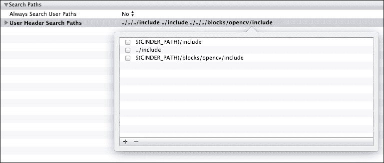

# 第三章。使用图像处理技术

在本章中，我们将涵盖：

+   调整图像的对比度和亮度

+   与 OpenCV 集成

+   检测边缘

+   检测面部

+   在图像中检测特征

+   将图像转换为矢量图形

# 简介

在本章中，我们将展示使用 Cinder 中实现图像处理技术的示例，以及使用第三方库的示例。在大多数示例中，我们将使用以下著名的测试图像，该图像广泛用于说明计算机视觉算法和技术：


您可以从维基百科下载 Lenna 的图像（[`en.wikipedia.org/wiki/File:Lenna.png`](http://en.wikipedia.org/wiki/File:Lenna.png)）。

# 调整图像的对比度和亮度

在本配方中，我们将介绍使用`Surface`类进行像素操作的基本图像颜色转换。

## 准备工作

要更改对比度和亮度的值，我们将使用第二章中介绍的`InterfaceGl`，*在设置 GUI 以调整参数时做准备*配方。我们需要一个样本图像来继续操作；将其保存到您的`assets`文件夹中，命名为`image.png`。

## 如何操作...

我们将创建一个具有简单 GUI 的应用程序，用于在样本图像上调整对比度和亮度。执行以下步骤：

1.  包含必要的头文件：

    ```cpp
    #include "cinder/gl/gl.h"
    #include "cinder/gl/Texture.h"
    #include "cinder/Surface.h"
    #include "cinder/ImageIo.h"
    ```

1.  向主类添加属性：

    ```cpp
    float mContrast,mContrastOld;
    float mBrightness,mBrightnessOld;
    Surface32f  mImage, mImageOutput;
    ```

1.  在`setup`方法中，加载一张图像进行处理，并准备`Surface`对象以存储处理后的图像：

    ```cpp
    mImage = loadImage( loadAsset("image.png") );
    mImageOutput = Surface32f(mImage.getWidth(), 
            mImage.getHeight(), false);
    ```

1.  设置窗口大小为默认值：

    ```cpp
    setWindowSize(1025, 512);
    mContrast = 0.f;
    mContrastOld = -1.f;
    mBrightness = 0.f;
    mBrightnessOld = -1.f;
    ```

1.  将参数控制添加到`InterfaceGl`窗口中：

    ```cpp
    mParams.addParam("Contrast", &mContrast, 
    "min=-0.5 max=1.0 step=0.01");
    mParams.addParam("Brightness", &mBrightness, 
          "min=-0.5 max=0.5 step=0.01");
    ```

1.  按如下方式实现`update`方法：

    ```cpp
    if(mContrastOld != mContrast || mBrightnessOld != mBrightness) {
    float c = 1.f + mContrast;
        Surface32f::IterpixelIter = mImage.getIter();
        Surface32f::IterpixelOutIter = mImageOutput.getIter();

        while( pixelIter.line() ) {
        pixelOutIter.line();
        while( pixelIter.pixel() ) {
        pixelOutIter.pixel();

        // contrast transformation
        pixelOutIter.r() = (pixelIter.r() - 0.5f) * c + 0.5f;
        pixelOutIter.g() = (pixelIter.g() - 0.5f) * c + 0.5f;
        pixelOutIter.b() = (pixelIter.b() - 0.5f) * c + 0.5f;

        // brightness transformation
        pixelOutIter.r() += mBrightness;
        pixelOutIter.g() += mBrightness;
        pixelOutIter.b() += mBrightness;

            }
        }

    mContrastOld = mContrast;
    mBrightnessOld = mBrightness;
    }
    ```

1.  最后，我们将在`draw`方法内部添加以下代码行来绘制原始图像和处理后的图像：

    ```cpp
    gl::draw(mImage);
    gl::draw(mImageOutput, Vec2f(512.f+1.f, 0.f));
    ```

## 如何工作...

最重要的一部分在`update`方法中。在第 6 步中，我们检查对比度和亮度的参数是否已更改。如果已更改，我们将遍历原始图像的所有像素，并将重新计算的颜色值存储在`mImageOutput`中。调整亮度只是增加或减少每个颜色组件，而计算对比度则稍微复杂一些。对于每个颜色组件，我们使用乘法公式，*颜色 = (颜色 - 0.5) * 对比度 + 0.5*，其中对比度是一个介于 0.5 和 2 之间的数字。在 GUI 中，我们设置一个介于-0.5 和 1.0 之间的值，这是一个更自然的范围；然后在第 6 步的开始进行重新计算。在处理图像时，我们必须更改所有像素的颜色值，因此在第 6 步的后面，您可以看到我们使用两个`while`循环遍历每行的后续列。为了移动到下一行，我们在`Surface`迭代器上调用`line`方法，然后调用`pixel`方法来移动到当前行的下一个像素。这种方法比使用例如`getPixel`和`setPixel`方法要快得多。


我们的应用程序在左侧渲染原始图像，在右侧渲染处理后的图像，因此你可以比较颜色调整的结果。

# 与 OpenCV 集成

OpenCV 是一个非常强大的开源计算机视觉库。该库是用 C++编写的，因此可以轻松集成到你的 Cinder 应用程序中。Cinder 包中提供了一个非常有用的 OpenCV Cinder 块，可在 GitHub 仓库中找到（[`github.com/cinder/Cinder-OpenCV`](https://github.com/cinder/Cinder-OpenCV)）。

## 准备工作

确保 Xcode 正在运行，并且已经打开了一个 Cinder 项目。

## 如何操作…

我们将向你的项目中添加 OpenCV Cinder 块，这同时也说明了将任何其他 Cinder 块添加到项目中的通常方法。执行以下步骤：

1.  在我们的 Xcode 项目根目录中添加一个新的组，并将其命名为`Blocks`。然后，将`opencv`文件夹拖到`Blocks`组中。务必选择以下截图所示的**为添加的任何文件夹创建组**单选按钮：

1.  你只需要项目结构中`opencv`文件夹内的`include`文件夹，因此删除对其他文件夹的任何引用。最终的项目结构应如下截图所示：

1.  在你的项目构建设置的**其他链接器标志**部分添加 OpenCV 库文件的路径，例如：

    ```cpp
    $(CINDER_PATH)/blocks/opencv/lib/macosx/libopencv_imgproc.a
    $(CINDER_PATH)/blocks/opencv/lib/macosx/libopencv_core.a
    $(CINDER_PATH)/blocks/opencv/lib/macosx/libopencv_objdetect.a
    ```

    这些路径如下截图所示：

    

1.  在你的项目构建设置的**用户头文件搜索路径**部分添加你将要使用的 OpenCV Cinder 块头文件的路径：

    ```cpp
    $(CINDER_PATH)/blocks/opencv/include
    ```

    如下截图所示，这是该路径：

    

1.  包含 OpenCV Cinder 块头文件：

    ```cpp
    #include "CinderOpenCV.h"
    ```

## 它是如何工作的…

OpenCV Cinder 块提供了`toOcv`和`fromOcv`函数，用于 Cinder 和 OpenCV 之间的数据交换。在设置好项目后，你可以使用它们，如下面的简短示例所示：

```cpp
Surface mImage, mImageOutput;
mImage = loadImage( loadAsset("image.png") );
cv::Mat ocvImage(toOcv(mImage));
cv::cvtColor(ocvImage, ocvImage, CV_BGR2GRAY ); 
mImageOutput = Surface(fromOcv(ocvImage));
```

你可以使用`toOcv`和`fromOcv`函数在 Cinder 和 OpenCV 类型之间进行转换，存储通过`ImageSourceRef`类型处理的图像数据，如`Surface`或`Channel`；还有其他类型，如下表所示：

| Cinder 类型 | OpenCV 类型 |
| --- | --- |
| `ImageSourceRef` | `Mat` |
| `Color` | `Scalar` |
| `Vec2f` | `Point2f` |
| `Vec2i` | `Point` |
| `Area` | `Rect` |

在此示例中，我们链接了 OpenCV 包中的以下三个文件：

+   `libopencv_imgproc.a`：此图像处理模块包括图像操作函数、过滤器、特征检测等

+   `libopencv_core.a`：此模块提供核心功能和数据结构

+   `libopencv_objdetect.a`：此模块包含如级联分类器等目标检测工具

你可以在[`docs.opencv.org/index.html`](http://docs.opencv.org/index.html)找到所有 OpenCV 模块的文档。

## 还有更多…

在 OpenCV Cinder 块中打包的预编译 OpenCV 库中，有一些功能是不可用的，但你可以始终编译自己的 OpenCV 库，并在你的项目中仍然使用 OpenCV Cinder 块中的交换函数。

# 检测边缘

在这个菜谱中，我们将演示如何使用边缘检测函数，这是 Cinder 直接实现的一种图像处理函数。

## 准备工作

确保 Xcode 正在运行，并且已经打开了一个空的 Cinder 项目。我们将需要一个示例图像来继续，所以将其保存到你的资源文件夹中，命名为`image.png`。

## 如何做到这一点…

我们将使用边缘检测函数处理示例图像。执行以下步骤来完成此操作：

1.  包含必要的头文件：

    ```cpp
    #include "cinder/gl/Texture.h"
    #include "cinder/Surface.h"
    #include "cinder/ImageIo.h"

    #include "cinder/ip/EdgeDetect.h"
    #include "cinder/ip/Grayscale.h"
    ```

1.  向你的主类添加两个属性：

    ```cpp
    Surface8u mImageOutput;
    ```

1.  在`setup`方法中加载源图像并设置处理图像的`Surface`：

    ```cpp
    mImage = loadImage( loadAsset("image.png") );
    mImageOutput = Surface8u(mImage.getWidth(), mImage.getHeight(), false);
    ```

1.  使用图像处理函数：

    ```cpp
    ip::grayscale(mImage, &mImage);
    ip::edgeDetectSobel(mImage, &mImageOutput);
    ```

1.  在`draw`方法内部添加以下两行代码以绘制图像：

    ```cpp
    gl::draw(mImage);
    gl::draw(mImageOutput, Vec2f(512.f+1.f, 0.f));
    ```

## 它是如何工作的…

如您所见，由于 Cinder 直接实现了基本的图像处理函数，因此在 Cinder 中检测边缘非常简单，因此您不需要包含任何第三方库。在这种情况下，我们使用`grayscale`函数将原始图像的颜色空间转换为灰度。这是图像处理中常用的功能，因为许多算法在灰度图像上运行得更有效率，或者甚至是为仅与灰度源图像一起工作而设计的。边缘检测是通过`edgeDetectSobel`函数实现的，并使用 Sobel 算法。在这种情况下，第一个参数是源原始灰度图像，第二个参数是输出`Surface`对象，结果将存储在其中。

在`draw`方法内部，我们绘制了两个图像，如下面的截图所示：


## 还有更多…

你可能会发现 Cinder 中实现的图像处理函数不足，因此你也可以将第三方库，如 OpenCV，包含到你的项目中。我们在先前的菜谱中解释了如何将 Cinder 和 OpenCV 一起使用，*与 OpenCV 集成*。

在边缘检测的上下文中，其他有用的函数是`Canny`和`findContours`。以下是如何使用它们的示例：

```cpp
vector<vector<cv::Point> > contours; 
cv::Mat inputMat( toOcv( frame ) );
// blur
cv::cvtColor( inputMat, inputMat, CV_BGR2GRAY );
cv::Mat blurMat;
cv::medianBlur(inputMat, blurMat, 11);

// threshold
cv::Mat thresholdMat;
cv::threshold(blurMat, thresholdMat, 50, 255, CV_8U );

// erode
cv::Mat erodeMat;
cv::erode(thresholdMat, erodeMat, 11);

// Detect edges
cv::Mat cannyMat;
int thresh = 100;
cv::Canny(erodeMat, cannyMat, thresh, thresh*2, 3 );

// Find contours
cv::findContours(cannyMat, contours, CV_RETR_TREE, CV_CHAIN_APPROX_SIMPLE);
```

执行前面的代码后，形成轮廓的点存储在`contours`变量中。

# 检测人脸

在这个菜谱中，我们将检查我们的应用程序如何被用来识别人脸。多亏了 OpenCV 库，这真的非常简单。

## 准备工作

我们将使用 OpenCV 库，因此请参阅*与 OpenCV 集成*配方以获取有关如何设置项目的信息。我们将需要一个示例图像来继续，所以将其保存到您的`assets`文件夹中作为`image.png`。将用于正面人脸识别的 Haar 级联分类器文件放入`assets`目录中。级联文件可以在下载的 OpenCV 包中找到，或者在位于[`github.com/Itseez/opencv/blob/master/data/haarcascades/haarcascade_frontalface_alt.xml`](https://github.com/Itseez/opencv/blob/master/data/haarcascades/haarcascade_frontalface_alt.xml)的在线公共存储库中找到。

## 如何做…

我们将创建一个应用程序，演示如何使用 Cinder 与 OpenCV 的级联分类器。执行以下步骤：

1.  包含必要的头文件：

    ```cpp
    #include "cinder/gl/Texture.h"
    #include "cinder/Surface.h"
    #include "cinder/ImageIo.h"
    ```

1.  将以下成员添加到您的主类中：

    ```cpp
    Surface8u mImage;
    cv::CascadeClassifier  mFaceCC;
    std::vector<Rectf>  mFaces;
    ```

1.  将以下代码片段添加到`setup`方法中：

    ```cpp
    mImage = loadImage( loadAsset("image.png") );
    mFaceCC.load( getAssetPath( "haarcascade_frontalface_alt.xml" ).string() );
    ```

1.  还需要在`setup`方法的末尾添加以下代码片段：

    ```cpp
    cv::Mat cvImage( toOcv( mImage, CV_8UC1 ) );
    std::vector<cv::Rect> faces;
    mFaceCC.detectMultiScale( cvImage, faces );
    std::vector<cv::Rect>::const_iterator faceIter;
    for(faceIter = faces.begin(); faceIter != faces.end(); ++faceIter ) {
      Rectf faceRect( fromOcv( *faceIter ) );
      mFaces.push_back( faceRect );
    }
    ```

1.  在`draw`方法的末尾添加以下代码片段：

    ```cpp
    gl::color( Color::white() );
    gl::draw(mImage);
    gl::color( ColorA( 1.f, 0.f, 0.f, 0.45f ) );
    std::vector<Rectf>::const_iterator faceIter;
    for(faceIter = mFaces.begin(); faceIter != mFaces.end(); ++faceIter ) {
      gl::drawStrokedRect( *faceIter );
    }
    ```

## 它是如何工作的…

在第 3 步中，我们加载了一个图像文件用于处理和一个 XML 分类器文件，该文件描述了要识别的对象特征。在第 4 步中，我们通过在`mFaceCC`对象上调用`detectMultiScale`函数执行图像检测，我们将`cvImage`作为输入指向，并将结果存储在一个向量结构中，`cvImage`是从`mImage`转换而来的 8 位单通道图像（`CV_8UC1`）。我们接下来所做的是遍历所有检测到的人脸并存储`Rectf`变量，该变量描述了检测到的人脸周围的边界框。最后，在第 5 步中，我们绘制了原始图像和所有识别到的人脸作为描边的矩形。

我们使用的是 OpenCV 中实现的级联分类器，它可以训练来检测图像中的特定对象。有关训练和使用级联分类器进行对象检测的更多信息，请参阅位于[`docs.opencv.org/modules/objdetect/doc/cascade_classification.html`](http://docs.opencv.org/modules/objdetect/doc/cascade_classification.html)的 OpenCV 文档。


## 还有更多…

您可以使用来自相机的视频流并处理每一帧以实时跟踪人脸。请参阅第十一章中的*从相机捕获*配方，*从相机获取感应和跟踪输入*。

# 在图像中检测特征

在这个配方中，我们将使用图像中查找特征特征的方法之一。我们将使用 OpenCV 库实现的 SURF 算法。

## 准备工作

我们将使用 OpenCV 库，因此请参考*与 OpenCV 集成*菜谱，了解如何设置您的项目。我们将需要一个样本图像来继续，所以将其保存到您的`assets`文件夹中，命名为`image.png`，然后保存样本图像的副本为`image2.png`，并对它进行一些变换，例如旋转。

## 如何做到这一点…

我们将创建一个应用程序，用于可视化两张图像之间的匹配特征。执行以下步骤来完成此操作：

1.  在您项目的构建设置中**其他链接器标志**部分添加 OpenCV 库文件的路径，例如：

    ```cpp
    $(CINDER_PATH)/blocks/opencv/lib/macosx/libopencv_imgproc.a
    $(CINDER_PATH)/blocks/opencv/lib/macosx/libopencv_core.a
    $(CINDER_PATH)/blocks/opencv/lib/macosx/libopencv_objdetect.a
    $(CINDER_PATH)/blocks/opencv/lib/macosx/libopencv_features2d.a
    $(CINDER_PATH)/blocks/opencv/lib/macosx/libopencv_flann.a
    ```

1.  包含必要的标题：

    ```cpp
    #include "cinder/gl/Texture.h"
    #include "cinder/Surface.h"
    #include "cinder/ImageIo.h"
    ```

1.  在您的主类声明中添加方法和属性：

    ```cpp
    int matchImages(Surface8u img1, Surface8u img2);

    Surface8u   mImage, mImage2;
    gl::Texture mMatchesImage;
    ```

1.  在`setup`方法中加载图像并调用匹配方法：

    ```cpp
    mImage = loadImage( loadAsset("image.png") );
    mImage2 = loadImage( loadAsset("image2.png") );

    int numberOfmatches = matchImages(mImage, mImage2);
    ```

1.  现在您必须实现之前声明的`matchImages`方法：

    ```cpp
    int MainApp::matchImages(Surface8u img1, Surface8u img2)
    {
      cv::Mat image1(toOcv(img1));
      cv::cvtColor( image1, image1, CV_BGR2GRAY );

      cv::Mat image2(toOcv(img2));
      cv::cvtColor( image2, image2, CV_BGR2GRAY );

      // Detect the keypoints using SURF Detector
      std::vector<cv::KeyPoint> keypoints1, keypoints2;

      cv::SurfFeatureDetector detector;
      detector.detect( image1, keypoints1 );
      detector.detect( image2, keypoints2 );

      // Calculate descriptors (feature vectors)
      cv::SurfDescriptorExtractor extractor;
      cv::Mat descriptors1, descriptors2;

      extractor.compute( image1, keypoints1, descriptors1 );
      extractor.compute( image2, keypoints2, descriptors2 );

      // Matching
      cv::FlannBasedMatcher matcher;
      std::vector<cv::DMatch> matches;
      matcher.match( descriptors1, descriptors2, matches );

      double max_dist = 0; 
      double min_dist = 100;

      for( int i = 0; i< descriptors1.rows; i++ )
        {
      double dist = matches[i].distance;
      if( dist<min_dist ) min_dist = dist;
      if( dist>max_dist ) max_dist = dist;
          }

      std::vector<cv::DMatch> good_matches;

      for( int i = 0; i< descriptors1.rows; i++ )
          {
      if( matches[i].distance<2*min_dist )
      good_matches.push_back( matches[i]);
          }

      // Draw matches
      cv::Matimg_matches;
      cv::drawMatches(image1, keypoints1, image2, keypoints2,
      good_matches, img_matches, cv::Scalar::all(-1),cv::Scalar::all(-1),
      std::vector<char>(), cv::DrawMatchesFlags::NOT_DRAW_SINGLE_POINTS );

      mMatchesImage = gl::Texture(fromOcv(img_matches));

      return good_matches.size();
        }
    ```

1.  最后，我们需要可视化匹配，所以将以下代码行放在`draw`方法中：

    ```cpp
    gl::draw(mMatchesImage);
    ```

## 工作原理…

让我们讨论第 5 步下的代码。首先，我们将`image1`和`image2`转换为 OpenCV Mat 结构。然后，我们将这两张图像转换为灰度图。现在我们可以开始使用 SURF 处理图像了，因此我们正在检测关键点——该算法计算出的图像的特征点。我们可以使用这两个图像计算出的关键点，并使用 FLANN 进行匹配，或者更确切地说，使用`FlannBasedMatcher`类。在过滤掉适当的匹配并将它们存储在`good_matches`向量中后，我们可以按以下方式可视化它们：


请注意，第二张图像已旋转，然而算法仍然可以找到并链接相应的关键点。

## 更多内容…

在图像中检测特征对于匹配图片至关重要，也是用于增强现实应用中的更高级算法的一部分。

### 如果图像匹配

有可能确定一张图像是否是另一张图像的副本，或者是否已旋转。您可以使用`matchImages`方法返回的匹配数量。

### 其他可能性

SURF 算法对于实时匹配来说相当慢，所以如果您需要实时处理来自摄像机的帧，可以尝试您项目的 FAST 算法。FAST 算法也包含在 OpenCV 库中。

## 参见

+   OpenCV 的特征检测算法比较可以在[`computer-vision-talks.com/2011/01/comparison-of-the-opencvs-feature-detection-algorithms-2/`](http://computer-vision-talks.com/2011/01/comparison-of-the-opencvs-feature-detection-algorithms-2/)找到。

# 将图像转换为矢量图形

在这个菜谱中，我们将尝试使用 OpenCV 库和 Cairo 库的矢量绘图和导出功能，将简单的手绘草图转换为矢量图形。

## 入门

我们将使用 OpenCV 库，因此请参考本章前面的 *与 OpenCV 集成* 菜谱，获取有关如何设置你的项目的信息。你可能想准备自己的绘图以便处理。在这个例子中，我们使用了一张在纸上绘制的简单几何形状的照片。


## 如何做到这一点…

我们将创建一个应用程序来展示矢量形状的转换。执行以下步骤：

1.  包含必要的头文件：

    ```cpp
    #include "cinder/gl/Texture.h"
    #include "cinder/Surface.h"
    #include "cinder/ImageIo.h"
    #include "cinder/cairo/Cairo.h"
    ```

1.  在主类中添加以下声明：

    ```cpp
    void renderDrawing( cairo::Context&ctx );

    Surface mImage, mIPImage;
    std::vector<std::vector<cv::Point> >mContours, mContoursApprox;
    double mApproxEps;
    int mCannyThresh;
    ```

1.  在 `setup` 方法中加载你的绘图并设置默认值：

    ```cpp
    mImage = loadImage( loadAsset("drawing.jpg") );

    mApproxEps = 1.0;
    mCannyThresh = 200;
    ```

1.  在 `setup` 方法的末尾添加以下代码片段：

    ```cpp
    cv::Mat inputMat( toOcv( mImage ) );

    cv::Mat bgr, gray, outputFrame;
    cv::cvtColor(inputMat, bgr, CV_BGRA2BGR);
    double sp = 50.0;
    double sr = 55.0;
    cv::pyrMeanShiftFiltering(bgr.clone(), bgr, sp, sr);

    cv::cvtColor(bgr, gray, CV_BGR2GRAY);
    cv::cvtColor(bgr, outputFrame, CV_BGR2BGRA);
    mIPImage = Surface(fromOcv(outputFrame));
    cv::medianBlur(gray, gray, 7);

    // Detect edges using
    cv::MatcannyMat;
    cv::Canny(gray, cannyMat, mCannyThresh, mCannyThresh*2.f, 3 );
    mIPImage = Surface(fromOcv(cannyMat));

    // Find contours
    cv::findContours(cannyMat, mContours, CV_RETR_LIST, CV_CHAIN_APPROX_SIMPLE);

    // prepare outline
    for( int i = 0; i<mContours.size(); i++ )
    {
    std::vector<cv::Point> approxCurve;
    cv::approxPolyDP(mContours[i], approxCurve, mApproxEps, true);
    mContoursApprox.push_back(approxCurve);
    }
    ```

1.  添加 `renderDrawing` 方法的实现：

    ```cpp
    void MainApp::renderDrawing( cairo::Context&ctx )
    {
      ctx.setSource( ColorA( 0, 0, 0, 1 ) );
      ctx.paint();

      ctx.setSource( ColorA( 1, 1, 1, 1 ) );
      for( int i = 0; i<mContoursApprox.size(); i++ )
        {
      ctx.newSubPath();
      ctx.moveTo(mContoursApprox[i][0].x, mContoursApprox[i][0].y);
      for( int j = 1; j <mContoursApprox[i].size(); j++ )
            {
    ctx.lineTo(mContoursApprox[i][j].x, mContoursApprox[i][j].y);
            }
    ctx.closePath();
    ctx.fill();

    ctx.setSource(Color( 1, 0, 0 ));
    for( int j = 1; j <mContoursApprox[i].size(); j++ )
            {
    ctx.circle(mContoursApprox[i][j].x, mContoursApprox[i][j].y, 2.f);
            }
    ctx.fill();
        }
    }
    ```

1.  按照以下方式实现你的 `draw` 方法：

    ```cpp
      gl::clear( Color( 0.1f, 0.1f, 0.1f ) );

      gl::color(Color::white());

      gl::pushMatrices();
      gl::scale(Vec3f(0.5f,0.5f,0.5f));
      gl::draw(mImage);
      gl::draw(mIPImage, Vec2i(0, mImage.getHeight()+1));
      gl::popMatrices();

      gl::pushMatrices();
      gl::translate(Vec2f(mImage.getWidth()*0.5f+1.f, 0.f));
      gl::color( Color::white() );

      cairo::SurfaceImage vecSurface( mImage.getWidth(), mImage.getHeight() );
      cairo::Context ctx( vecSurface );
      renderDrawing(ctx);
      gl::draw(vecSurface.getSurface());

      gl::popMatrices();
    ```

1.  在 `keyDown` 方法中插入以下代码片段：

    ```cpp
    if( event.getChar() == 's' ) {
    cairo::Context ctx( cairo::SurfaceSvg( getAppPath() / fs::path("..") / "output.svg",mImage.getWidth(), mImage.getHeight() ) );
    renderDrawing( ctx );
    }
    ```

## 它是如何工作的…

关键部分在步骤 4 中实现，我们在图像中检测边缘然后找到轮廓。我们在 `renderDrawing` 方法中步骤 5 内绘制处理形状的矢量表示。为了绘制矢量图形，我们使用 Cairo 库，它还能将结果保存为多种矢量格式。如图所示，在屏幕左上角是原始图像，其下方是检测到的轮廓预览。我们简单手绘图像的矢量版本在右侧：


每个形状都是一个黑色填充路径。路径由步骤 4 中计算出的点组成。以下是对突出显示的点的可视化：


你可以通过按 *S* 键将矢量图形保存为文件。文件将保存在应用程序可执行文件相同的文件夹下，命名为 `output.svg`。SVG 只是以下可用导出选项之一：

| 方法 | 用法 |
| --- | --- |
| `SurfaceSvg` | 准备 SVG 文件渲染的上下文 |
| `SurfacePdf` | 准备 PDF 文件渲染的上下文 |
| `SurfacePs` | 准备 PostScript 文件渲染的上下文 |
| `SurfaceEps` | 准备 Illustrator EPS 文件渲染的上下文 |

导出的图形如下所示：


## 参见

+   **Cairo**: [`cairographics.org/`](http://cairographics.org/)
