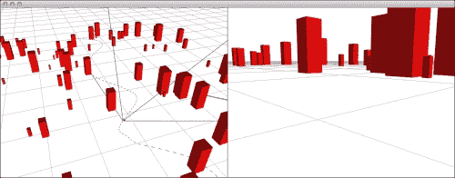
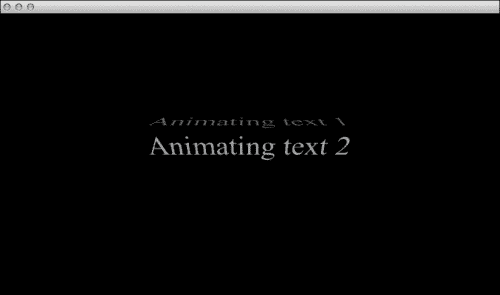
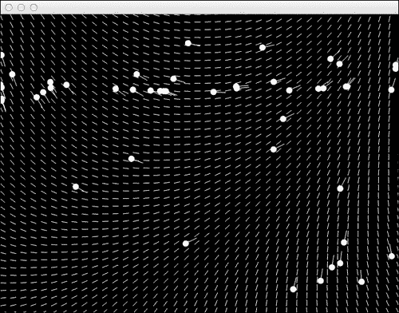
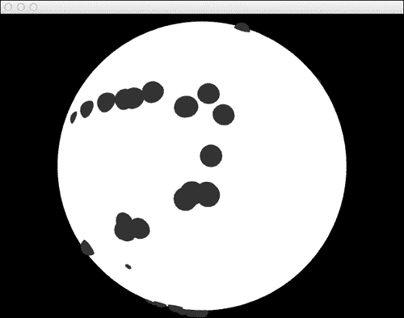

# 第九章。添加动画

在本章中，我们将学习动画化 2D 和 3D 对象的技术。我们将介绍 Cinder 在此领域的功能，例如时间轴和数学函数。

本章的食谱将涵盖以下内容：

+   使用时间轴动画化

+   使用时间轴创建动画序列

+   沿路径动画化

+   将相机运动与路径对齐

+   动画化文本 - 文本作为电影的遮罩

+   动画化文本 - 滚动文本行

+   使用 Perlin 噪声创建流场

+   在 3D 中创建图像库

+   使用 Perlin 噪声创建球形流场

# 使用时间轴动画化

在本食谱中，我们将学习如何使用 Cinder 的新功能；时间轴来动画化值。

当用户按下鼠标按钮时，我们动画化背景颜色、圆的位置和半径。

## 准备工作

包含必要的文件以使用时间轴、生成随机数和使用 OpenGL 绘制。在源文件顶部添加以下代码片段：

```cpp
#include "cinder/gl/gl.h"
#include "cinder/Timeline.h"
#include "cinder/Rand.h"
```

此外，添加以下有用的 `using` 语句：

```cpp
using namespace ci;
using namespace ci::app;
using namespace std;
```

## 如何做到这一点...

我们将创建几个参数，这些参数将使用时间轴进行动画化。执行以下步骤来完成此操作：

1.  声明以下成员以进行动画化：

    ```cpp
    Anim<Color> mBackgroundColor;
    Anim<Vec2f> mCenter;
    Anim<float> mRadius;
    ```

1.  在 `setup` 方法中初始化参数。

    ```cpp
    mBackgroundColor = Color( CM_HSV, randFloat(), 1.0f, 1.0f );
    mCenter = getWindowCenter();
    mRadius = randFloat( 20.0f, 100.0f );
    ```

1.  在 `draw` 方法中，我们需要使用在 `mBackgroundColor` 中定义的颜色清除背景，并在 `mCenter` 位置使用 `mRadius` 作为半径绘制一个圆。

    ```cpp
    gl::clear( mBackgroundColor.value() ); 
    gl::drawSolidCircle( mCenter.value(), mRadius.value() );
    ```

1.  要在用户按下鼠标按钮时动画化值，我们需要声明 `mouseDown` 事件处理器。

    ```cpp
    void mouseDown( MouseEvent event );  
    ```

1.  让我们实现 `mouseDown` 事件处理器并将动画添加到主时间轴。我们将动画化 `mBackgroundColor` 到一个新的随机颜色，将 `mCenter` 设置为鼠标光标的当前位置，并将 `mRadius` 设置为一个新的随机值。

    ```cpp
    Color backgroundColor( CM_HSV, randFloat(), 1.0f, 1.0f );
    timeline().apply( &mBackgroundColor, backgroundColor, 2.0f, EaseInCubic() );
    timeline().apply( &mCenter, (Vec2f)event.getPos(), 1.0f, EaseInCirc() );
    timeline().apply( &mRadius, randFloat( 20.0f, 100.0f ), 1.0f, EaseInQuad() );
    ```

## 它是如何工作的...

时间轴是 Cinder 在 0.8.4 版本中引入的新功能。它允许用户通过将参数添加到时间轴一次来动画化参数，所有更新都在幕后进行。

动画必须是模板类 `ci::Anim` 的对象。此类可以使用支持 `+` 操作符的任何模板类型创建。

主 `ci::Timeline` 对象可以通过调用 `ci::app::App::timeline()` 方法访问。始终有一个主时间轴，用户也可以创建其他 `ci::Timeline` 对象。

`ci::Timeline::apply` 方法中的第四个参数是一个表示 Tween 方法的 `functor` 对象。Cinder 有几个可用的 Tweens 可以作为参数传递，以定义动画的类型。

## 还有更多...

在先前的示例中使用的 `ci::Timeline::apply` 方法使用了 `ci::Anim` 对象的初始值，但也可以创建一个动画，其中开始和结束值都传递。

例如，如果我们想将 `mRadius` 从起始值 10.0 动画到结束值 100.0 秒，我们将调用以下方法：

```cpp
timeline().apply( &mRadius, 10.0f, 100.0f 1.0f, EaseInQuad() );
```

## 参见

+   要查看所有可用的缓动函数，请参阅 Cinder 文档，位于 [`libcinder.org/docs/v0.8.4/_easing_8h.html`](http://libcinder.org/docs/v0.8.4/_easing_8h.html)。

# 使用时间轴创建动画序列

在本菜谱中，我们将学习如何使用 Cinder 强大的时间轴功能来创建动画序列。我们将绘制一个圆，并按顺序动画化半径和颜色。

## 准备工作

包含必要的文件以使用时间轴、在 OpenGL 中绘制以及生成随机数。

```cpp
#include "cinder/gl/gl.h"
#include "cinder/Timeline.h"
#include "cinder/Rand.h"
```

还要添加以下有用的 `using` 语句：

```cpp
using namespace ci;
using namespace ci::app;
using namespace std;
```

## 如何实现…

我们将使用时间轴依次动画化几个参数。执行以下步骤来完成：

1.  声明以下成员以定义圆的位置、半径和颜色：

    ```cpp
    Anim<float> mRadius;
    Anim<Color> mColor;
    Vec2f mPos;
    ```

1.  在 `setup` 方法中，初始化成员。将位置设置为窗口中心，半径为 30，并使用 HSV 颜色模式生成一个随机颜色。

    ```cpp
    mPos = (Vec2f)getWindowCenter();
    mRadius = 30.0f;
    mColor = Color( CM_HSV, randFloat(), 1.0f, 1.0f );
    ```

1.  在 `draw` 方法中，我们将使用黑色清除背景，并使用之前定义的成员来绘制圆圈。

    ```cpp
    gl::clear( Color::black() ); 
    gl::color( mColor.value() );
    gl::drawSolidCircle( mPos, mRadius.value() );
    ```

1.  声明 `mouseDown` 事件处理器。

    ```cpp
      void mouseDown( MouseEvent event );
    ```

1.  在 `mouseDown` 的实现中，我们将应用动画到主时间轴上。

    我们将首先将 `mRadius` 从 30 动画到 200，然后向 `mRadius` 附加另一个从 200 到 30 的动画。

    将以下代码片段添加到 `mouseDown` 方法中：

    ```cpp
    timeline().apply( &mRadius, 30.0f, 200.0f, 2.0f, EaseInOutCubic() );
    timeline().appendTo( &mRadius, 200.0f, 30.0f, 1.0f, EaseInOutCubic() );
    ```

1.  让我们使用 HSV 颜色模式创建一个随机颜色，并将其用作动画 `mColor` 的目标颜色，然后将此动画附加到 `mRadius`。

    在 `mouseDown` 方法内添加以下代码片段：

    ```cpp
        Color targetColor = Color( CM_HSV, randFloat(), 1.0f, 1.0f );
    timeline().apply( &mColor, targetColor, 1.0f, EaseInQuad() ).appendTo( &mRadius );
    ```

## 它是如何工作的…

附加动画是创建复杂动画序列的强大且简单的方法。

在第 5 步中，我们使用以下代码行将动画添加到 `mRadius`：

```cpp
timeline().appendTo( &mRadius, 200.0f, 30.0f, 1.0f, EaseInOutCubic() );
```

这意味着此动画将在之前的 `mRadius` 动画完成后发生。

在第 6 步中，我们使用以下代码行将 `mColor` 动画附加到 `mRadius`：

```cpp
timeline().apply( &mColor, targetColor, 1.0f, EaseInQuad() ).appendTo( &mRadius );
```

这意味着 `mColor` 动画仅在之前的 `mRadius` 动画完成后才会发生。

## 还有更多…

当附加两个不同的动画时，可以通过定义偏移秒数作为第二个参数来偏移起始时间。

因此，例如，将第 6 步中的行更改为以下内容：

```cpp
timeline().apply( &mColor, targetColor, 1.0f, EaseInQuad() ).appendTo( &mRadius, -0.5f );
```

这意味着 `mColor` 动画将在 `mRadius` 完成后 0.5 秒开始。

# 沿路径动画化

在本菜谱中，我们将学习如何在 3D 空间中绘制平滑的 B 样条，并动画化对象沿计算出的 B 样条的位置。

## 准备工作

要在 3D 空间中导航，我们将使用在 第二章 中介绍的 *使用 MayaCamUI* 菜单的 `MayaCamUI`，*为开发做准备*。

## 如何实现…

我们将创建一个示例动画，展示一个对象沿着样条曲线移动。执行以下步骤来完成：

1.  包含必要的头文件。

    ```cpp
    #include "cinder/Rand.h"
    #include "cinder/MayaCamUI.h"
    #include "cinder/BSpline.h"
    ```

1.  从声明成员变量开始，以保留 B 样条和当前对象的位置。

    ```cpp
    Vec3f       mObjPosition;
    BSpline3f   spline;
    ```

1.  在`setup`方法内部准备一个随机的样条曲线：

    ```cpp
    mObjPosition = Vec3f::zero();

    vector<Vec3f> splinePoints;
    float step = 0.5f;
    float width = 20.f;
    for (float t = 0.f; t < width; t += step) {
     Vec3f pos = Vec3f(
      cos(t)*randFloat(0.f,2.f),
      sin(t)*0.3f,
      t - width*0.5f);
     splinePoints.push_back( pos );
    }
    spline = BSpline3f( splinePoints, 3, false, false );
    ```

1.  在`update`方法内部，检索沿着样条移动的物体的位置。

    ```cpp
    float dist = math<float>::abs(sin( getElapsedSeconds()*0.2f ));
    mObjPosition = spline.getPosition( dist );
    ```

1.  绘制场景的代码片段看起来如下：

    ```cpp
    gl::enableDepthRead();
    gl::enableDepthWrite();
    gl::enableAlphaBlending();
    gl::clear( Color::white() );
    gl::setViewport(getWindowBounds());
    gl::setMatrices(mMayaCam.getCamera());

    // draw dashed line
    gl::color( ColorA(0.f, 0.f, 0.f, 0.8f) );
    float step = 0.005f;
    glBegin(GL_LINES);
    for (float t = 0.f; t <= 1.f; t += step) {
      gl::vertex(spline.getPosition(t));
    }
    glEnd();

    // draw object
    gl::color(Color(1.f,0.f,0.f));
    gl::drawSphere(mObjPosition, 0.25f);
    ```

## 它是如何工作的…

首先，看看第 3 步，我们在该步骤中通过基于正弦和余弦函数以及 x 轴上的一些随机点计算 B 样条。路径存储在`spline`类成员中。

然后，我们可以轻松地检索路径上任何距离的 3D 空间中的位置。我们在第 4 步中这样做；使用`spline`成员上的`getPosition`方法。路径上的距离作为 0.0 到 1.0 范围内的`float`值传递，其中 0.0 表示路径的开始，1.0 表示路径的结束。

最后，在第 5 步中，我们绘制了一个动画，一个红色球体沿着我们的路径（用黑色虚线表示）移动，如下面的截图所示：


## 参见

+   *将相机运动与路径对齐*配方

+   第七章中的*在曲线上动画文本*配方，*使用 2D 图形*

# 将相机运动与路径对齐

在本配方中，我们将学习如何动画化沿着路径（计算为 B 样条）的相机位置。

## 准备工作

在本例中，我们将使用`MayaCamUI`，因此请参阅第二章中的*使用 MayaCamUI*配方，*准备开发*。

## 如何操作…

我们将创建一个演示该机制的程序。执行以下步骤：

1.  包含必要的头文件。

    ```cpp
    #include "cinder/Rand.h"
    #include "cinder/MayaCamUI.h"
    #include "cinder/BSpline.h"
    ```

1.  从成员变量的声明开始。

    ```cpp
    MayaCamUI mMayaCam;
    BSpline3f   spline;
    CameraPersp mMovingCam;
    Vec3f       mCamPosition;
    vector<Rectf> mBoxes;
    ```

1.  设置成员的初始值。

    ```cpp
    setWindowSize(640*2, 480);
    mCamPosition = Vec3f::zero();

    CameraPersp  mSceneCam;
    mSceneCam.setPerspective(45.0f, 640.f/480.f, 0.1, 10000);
    mSceneCam.setEyePoint(Vec3f(7.f,7.f,7.f));
    mSceneCam.setCenterOfInterestPoint(Vec3f::zero());
    mMayaCam.setCurrentCam(mSceneCam);

    mMovingCam.setPerspective(45.0f, 640.f/480.f, 0.1, 100.f);
    mMovingCam.setCenterOfInterestPoint(Vec3f::zero());

    vector<Vec3f> splinePoints;
    float step = 0.5f;
    float width = 20.f;
    for (float t = 0.f; t < width; t += step) {
     Vec3f pos = Vec3f( cos(t)*randFloat(0.8f,1.2f),
      0.5f+sin(t*0.5f)*0.5f,
      t - width*0.5f);
     splinePoints.push_back( pos );
    }
    spline = BSpline3f( splinePoints, 3, false, false );

    for(int i = 0; i<100; i++) {
     Vec2f pos = Vec2f(randFloat(-10.f,10.f), 
      randFloat(-10.f,10.f));
     float size = randFloat(0.1f,0.5f);
     mBoxes.push_back(Rectf(pos, pos+Vec2f(size,size*3.f)));
    }
    ```

1.  在`update`方法内部更新相机属性。

    ```cpp
    float step = 0.001f;
    float pos = abs(sin( getElapsedSeconds()*0.05f ));
    pos = min(0.99f, pos);
    mCamPosition = spline.getPosition( pos );

    mMovingCam.setEyePoint(mCamPosition);
    mMovingCam.lookAt(spline.getPosition( pos+step ));
    ```

1.  现在的整个`draw`方法看起来如下代码片段：

    ```cpp
    gl::enableDepthRead();
    gl::enableDepthWrite();
    gl::enableAlphaBlending();
    gl::clear( Color::white() );
    gl::setViewport(getWindowBounds());
    gl::setMatricesWindow(getWindowSize());

    gl::color(ColorA(0.f,0.f,0.f, 1.f));
    gl::drawLine(Vec2f(640.f,0.f), Vec2f(640.f,480.f));

    gl::pushMatrices();
    gl::setViewport(Area(0,0, 640,480));
    gl::setMatrices(mMayaCam.getCamera());

    drawScene();

    // draw dashed line
    gl::color( ColorA(0.f, 0.f, 0.f, 0.8f) );
    float step = 0.005f;
    glBegin(GL_LINES);
    for (float t = 0.f; t <= 1.f; t += step) {
      gl::vertex(spline.getPosition(t));
    }
    glEnd();

    // draw object
    gl::color(Color(0.f,0.f,1.f));
    gl::drawFrustum(mMovingCam);

    gl::popMatrices();

    // -------------

    gl::pushMatrices();
    gl::setViewport(Area(640,0, 640*2,480));
    gl::setMatrices(mMovingCam);
    drawScene();
    gl::popMatrices();
    ```

1.  现在我们必须实现`drawScene`方法，它实际上绘制我们的 3D 场景。

    ```cpp
    GLfloat light0_position[] = { 1000.f, 500.f, -500.f, 0.1f };
    GLfloat light1_position[] = { -1000.f, 100.f, 500.f, 0.1f };
    GLfloat light1_color[] = { 1.f, 1.f, 1.f };

    glLightfv( GL_LIGHT0, GL_POSITION, light0_position );
    glLightfv( GL_LIGHT1, GL_POSITION, light1_position );
    glLightfv( GL_LIGHT1, GL_DIFFUSE, light1_color );

    glEnable( GL_LIGHTING );
    glEnable( GL_LIGHT0 );
    glEnable( GL_LIGHT1 );

    ci::ColorA diffuseColor(0.9f, 0.2f, 0.f );
    gl::color(diffuseColor);
    glMaterialfv( GL_FRONT, GL_DIFFUSE,  diffuseColor );

    vector<Rectf>::iterator it;
    for(it = mBoxes.begin(); it != mBoxes.end(); ++it) {
     gl::pushMatrices();
     gl::translate(0.f, it->getHeight()*0.5f, 0.f);
     Vec2f center = it->getCenter();
     gl::drawCube(Vec3f(center.x, 0.f, center.y), 
      Vec3f(it->getWidth(),
     it->getHeight(), it->getWidth()));
     gl::popMatrices();
    }

    glDisable( GL_LIGHTING );
    glDisable( GL_LIGHT0 );
    glDisable( GL_LIGHT1 );

    // draw grid
    drawGrid(50.0f, 2.0f);
    ```

1.  我们最后需要的是`drawGrid`方法，其实现可以在第二章中的*使用 3D 空间指南*配方中找到，*准备开发*。

## 它是如何工作的…

在本例中，我们使用 B 样条作为路径，我们的相机沿着该路径移动。请参阅*沿着路径动画*配方，以查看对象在路径上动画化的基本实现。如您在第 4 步中看到的，我们通过在`mMovingCam`成员上调用`setEyePosition`方法来设置相机位置，我们必须设置相机视图方向。为此，我们获取路径上的下一个点的位置并将其传递给`lookAt`方法。

我们正在绘制一个分割屏幕，其中左侧是我们的场景预览，右侧我们可以看到沿着路径移动的相机视锥体内的内容。



## 参见

+   *沿着路径动画*配方

+   第二章中的*使用 3D 空间指南*食谱，*准备开发*

+   第二章中的*使用 MayaCamUI*食谱，*准备开发*

# 动画文本 – 文本作为电影的遮罩

在这个食谱中，我们将学习如何使用简单的着色器程序将文本用作电影的遮罩。

## 准备工作

在这个例子中，我们使用了一部由 NASA 提供的令人惊叹的视频，由国际空间站（ISS）机组人员拍摄，你可以在[`eol.jsc.nasa.gov/`](http://eol.jsc.nasa.gov/)找到它。请下载一个并将其保存为`assets`文件夹内的`video.mov`。

## 如何做…

我们将创建一个示例 Cinder 应用程序来展示该机制。按照以下步骤进行操作：

1.  包含必要的头文件。

    ```cpp
    #include "cinder/gl/Texture.h"
    #include "cinder/Text.h"
    #include "cinder/Font.h"
    #include "cinder/qtime/QuickTime.h"
    #include "cinder/gl/GlslProg.h"
    ```

1.  声明成员变量。

    ```cpp
    qtime::MovieGl mMovie;
    gl::Texture     mFrameTexture, mTextTexture;
    gl::GlslProg  mMaskingShader;
    ```

1.  实现以下`setup`方法：

    ```cpp
    setWindowSize(854, 480);

    TextLayout layout;
    layout.clear( ColorA(0.f,0.f,0.f, 0.f) );
    layout.setFont( Font("Arial Black", 96 ) );
    layout.setColor( Color( 1, 1, 1 ) );
    layout.addLine( "SPACE" );
    Surface8u rendered = layout.render( true );

    gl::Texture::Format format;
    format.setTargetRect();
    mTextTexture = gl::Texture( rendered, format );

    try {
      mMovie = qtime::MovieGl( getAssetPath("video.mov") );
      mMovie.setLoop();
      mMovie.play();
    } catch( ... ) {
      console() <<"Unable to load the movie."<<endl;
      mMovie.reset();
    }

    mMaskingShader = gl::GlslProg( loadAsset("passThru_vert.glsl"), loadAsset("masking_frag.glsl") );
    ```

1.  在`update`方法内部，我们必须更新我们的`mFrameTexture`，其中我们保存当前的电影帧。

    ```cpp
    if( mMovie ) mFrameTexture = mMovie.getTexture();
    ```

1.  `draw`方法将类似于以下代码片段：

    ```cpp
    gl::enableAlphaBlending();
    gl::clear( Color::gray(0.05f) );
    gl::setViewport(getWindowBounds());
    gl::setMatricesWindow(getWindowSize());

    gl::color(ColorA::white());
    if(mFrameTexture) {
     Vec2f maskOffset = (mFrameTexture.getSize() 
      - mTextTexture.getSize() ) * 0.5f;
     mFrameTexture.bind(0);
     mTextTexture.bind(1);
     mMaskingShader.bind();
     mMaskingShader.uniform("sourceTexture", 0);
     mMaskingShader.uniform("maskTexture", 1);
     mMaskingShader.uniform("maskOffset", maskOffset);
     gl::pushMatrices();
     gl::translate(getWindowCenter()-mTextTexture.getSize()*0.5f);
     gl::drawSolidRect( mTextTexture.getBounds(), true );
     gl::popMatrices();
     mMaskingShader.unbind();
    }
    ```

1.  正如你在`setup`方法中看到的，我们正在加载一个用于遮罩的着色器。我们必须通过`assets`文件夹内的一个名为`passThru_vert.glsl`的顶点着色器传递。你可以在第七章的*实现 2D 元球*食谱中找到它，*使用 2D 图形*。

1.  最后，片段着色器程序代码将类似于以下代码片段，并且也应该位于`assets`文件夹下，命名为`masking_frag.glsl`。

    ```cpp
    #extension GL_ARB_texture_rectangle : require

    uniform sampler2DRect sourceTexture;
    uniform sampler2DRect maskTexture;
    uniform vec2 maskOffset;

    void main() 
    { 
      vec2 texCoord = gl_TexCoord[0].st;  

      vec4 sourceColor = texture2DRect( sourceTexture, texCoord+maskOffset );   
      vec4 maskColor = texture2DRect( maskTexture, texCoord ); 

      vec4 color = sourceColor * maskColor;

      gl_FragColor = color;
    }
    ```

## 它是如何工作的…

在第 3 步的`setup`方法内部，我们将文本渲染为`Surface`，然后将其转换为`gl::Texture`，我们稍后将其用作遮罩纹理。当我们将其用作电影的遮罩时，设置遮罩纹理的矩形格式非常重要，因为`qtime::MovieGl`正在创建一个具有矩形帧的纹理。为此，我们定义了一个名为`format`的`gl::Texture::Format`对象，并在其上调用`setTargetRect`方法。在创建`gl::Texture`时，我们必须将`format`作为第二个参数传递给构造函数。

要绘制电影帧，我们使用在第 5 步中应用的遮罩着色器程序。我们必须传递三个参数，分别是电影帧作为`sourceTexture`、带有文本的遮罩纹理作为`maskTexture`以及遮罩的位置作为`maskOffset`。

在第 7 步中，你可以看到片段着色器代码，它简单地乘以`sourceTexture`和`maskTexture`中相应像素的颜色。请注意，我们正在使用`sampler2DRect`和`texture2DRect`来处理矩形纹理。


# 动画文本 – 滚动文本行

在这个食谱中，我们将学习如何逐行创建文本滚动。

## 如何做…

我们现在将创建一个带有滚动文本的动画。按照以下步骤进行操作：

1.  包含必要的头文件。

    ```cpp
    #include "cinder/gl/Texture.h"
    #include "cinder/Text.h"
    #include "cinder/Font.h"
    #include "cinder/Utilities.h"
    ```

1.  添加成员值。

    ```cpp
    vector<gl::Texture> mTextTextures;
    Vec2f   mTextSize;
    ```

1.  在`setup`方法内部，我们需要为每行文本生成纹理。

    ```cpp
    setWindowSize(854, 480);
    string font( "Times New Roman" );

    mTextSize = Vec2f::zero();
    į
    for(int i = 0; i<5; i++) {
       TextLayout layout;
       layout.clear( ColorA(0.f,0.f,0.f, 0.f) );
       layout.setFont( Font( font, 48 ) );
       layout.setColor( Color( 1, 1, 1 ) );
       layout.addLine( "Animating text " + toString(i) );
       Surface8u rendered = layout.render( true );
       gl::TexturetextTexture = gl::Texture( rendered );
       textTexture.setMagFilter(GL_NICEST);
       textTexture.setMinFilter(GL_NICEST);
       mTextTextures.push_back(textTexture);
       mTextSize.x = math<float>::max(mTextSize.x, 
        textTexture.getWidth());
       mTextSize.y = math<float>::max(mTextSize.y, 
        textTexture.getHeight());
    }
    ```

1.  此示例的`draw`方法如下所示：

    ```cpp
    gl::enableAlphaBlending();
    gl::clear( Color::black() );
    gl::setViewport(getWindowBounds());
    gl::setMatricesWindowPersp(getWindowSize());

    gl::color(ColorA::white());

    float time = getElapsedSeconds()*0.5f;
    float timeFloor = math<float>::floor( time );
    inttexIdx = 1 + ( (int)timeFloor % (mTextTextures.size()-1) );
    float step = time - timeFloor;

    gl::pushMatrices();
    gl::translate(getWindowCenter() - mTextSize*0.5f);

    float radius = 30.f;
    gl::color(ColorA(1.f,1.f,1.f, 1.f-step));
    gl::pushMatrices();
    gl::rotate( Vec3f(90.f*step,0.f,0.f) );
    gl::translate(0.f,0.f,radius);
    gl::draw(mTextTextures[texIdx-1], Vec2f(0.f, -mTextTextures[texIdx-1].getHeight()*0.5f) );
    gl::popMatrices();

    gl::color(ColorA(1.f,1.f,1.f, step));
    gl::pushMatrices();
    gl::rotate( Vec3f(-90.f + 90.f*step,0.f,0.f) );
    gl::translate(0.f,0.f,radius);
    gl::draw(mTextTextures[texIdx], Vec2f(0.f, -mTextTextures[texIdx].getHeight()*0.5f) );
    gl::popMatrices();

    gl::popMatrices();
    ```

## 它是如何工作的…

在步骤 3 中，我们在`setup`方法内部首先执行的操作是生成带有渲染文本的纹理，并将其推送到向量结构`mTextTextures`中。

在步骤 4 中，你可以找到绘制当前和先前文本的代码，以构建连续循环动画。



# 使用 Perlin 噪声创建流动场

在本食谱中，我们将学习如何使用流动场来动画化对象。我们的流动场将是一个二维速度向量网格，它将影响对象的移动方式。

我们还将使用 Perlin 噪声计算出的向量来动画化流动场。

## 准备工作

包含必要的文件以使用 OpenGL 图形、Perlin 噪声、随机数和 Cinder 的数学工具。

```cpp
#include "cinder/gl/gl.h"
#include "cinder/Perlin.h"
#include "cinder/Rand.h"
#include "cinder/CinderMath.h"
```

还要添加以下有用的`using`语句：

```cpp
using namespace ci;
using namespace ci::app;
using namespace std;
```

## 如何做…

我们将使用流动场创建一个动画。执行以下步骤以实现此目的：

1.  我们将首先创建一个`Follower`类来定义将受流动场影响的对象。

    在主应用程序类之前声明以下类：

    ```cpp
    class Follower{
    public:
     Follower( const Vec2f& pos ){
      this->pos = pos;
     }
     void update( const Vec2f& newVel ){
      vel += ( newVel - vel ) * 0.2f;
      pos += vel;
      if( pos.x < 0.0f ){
       pos.x = (float)getWindowWidth();
       vel = Vec2f();
      }
      if( pos.x > (float)getWindowWidth() ){
       pos.x = 0.0f;
       vel = Vec2f();
      }
      if( pos.y < 0.0f ){
       pos.y = (float)getWindowHeight();
       vel = Vec2f();
      }
      if( pos.y > (float)getWindowHeight() ){
       pos.y = 0.0f;
       vel = Vec2f();
      } 
     }
     void draw(){
      gl::drawSolidCircle( pos, 5.0f );
      gl::drawLine( pos, pos + ( vel * 20.0f ) );
     }
     Vec2f pos, vel;
    };
    ```

1.  让我们创建流动场。声明一个二维`std::vector`来定义流动场，以及定义向量间隔和行数列数的变量。

    ```cpp
    vector< vector< Vec2f> > mFlowField;
    Vec2f mGap;
    float mCounter;
    int mRows, mColumns;
    ```

1.  在`setup`方法中，我们将定义行数和列数，并计算每个向量之间的间隔。

    ```cpp
    mRows = 40;
    mColumns = 40;
    mGap.x = (float)getWindowWidth() / (mRows-1);
    mGap.y = (float)getWindowHeight() / (mColumns-1);
    ```

1.  根据行数和列数，我们可以初始化`mFlowField`。

    ```cpp
    mFlowField.resize( mRows );
    for( int i=0; i<mRows; i++ ){
      mFlowField[i].resize( mColumns );
    ```

1.  让我们使用 Perlin 噪声来动画化流动场。为此，声明以下成员：

    ```cpp
      Perlin mPerlin;
    float mCounter;
    ```

1.  在`setup`方法中，将`mCounter`初始化为零。

    ```cpp
      mCounter = 0.0f;
    }
    ```

1.  在`update`方法中，我们将增加`mCounter`并使用嵌套的`for`循环遍历`mFlowField`，并使用`mPerlin`来动画化向量。

    ```cpp
    for( int i=0; i<mRows; i++ ){
     for( int j=0; j<mColumns; j++ ){
      float angle= mPerlin.noise( ((float)i)*0.01f + mCounter,
       ((float)j)*0.01f ) * M_PI * 2.0f;
      mFlowField[i][j].x = cosf( angle );
      mFlowField[i][j].y = sinf( angle );
     } 
    }
    ```

1.  现在，遍历`mFlowField`并绘制表示向量方向的线条。

    在`draw`方法内部添加以下代码片段：

    ```cpp
    for( int i=0 i<mRows; i++ ){
     for( int j=0; j<mColumns; j++ ){
      float x = (float)i*mGap.x;
      float y = (float)j*mGap.y;
      Vec2f begin( x, y );
      Vec2f end = begin + ( mFlowField[i][j] * 10.0f );
      gl::drawLine( begin, end );
     }
    }
    ```

1.  让我们添加一些`Followers`。声明以下成员：

    ```cpp
    vector<shared_ptr<Follower>> mFollowers;
    ```

1.  在`setup`方法中，我们将初始化一些跟随者并将它们随机添加到窗口中的位置。

    ```cpp
    int numFollowers = 50;
    for( int i=0; i<numFollowers; i++ ){
     Vec2f pos( randFloat( getWindowWidth() ), 
      randFloat(getWindowHeight() ) );
     mFollowers.push_back( 
      shared_ptr<Follower>( new Follower( pos ) ) );
    }
    ```

1.  在更新中，我们将遍历`mFollowers`并根据其位置在`mFlowField`中计算相应的向量。

    然后，我们将使用该向量更新`Follower`类。

    ```cpp
    for( vector<shared_ptr<Follower> >::iterator it = 
     mFollowers.begin(); it != mFollowers.end(); ++it ){
     shared_ptr<Follower> follower = *it;
     int indexX= ci::math<int>::clamp(follower->pos.x / mGap.x,0,
      mRows-1 );
     int indexY= ci::math<int>::clamp(follower->pos.y / mGap.y,0, 
      mColumns-1 );
     Vec2f flow = mFlowField[ indexX ][ indexY ];
     follower->update( flow );
    }
    ```

1.  最后，我们只需要绘制每个`Follower`类。

    在`draw`方法内部添加以下代码片段：

    ```cpp
    for( vector< shared_ptr<Follower> >::iterator it = 
     mFollowers.begin(); it != mFollowers.end(); ++it ){
     (*it)->draw();
    }
    ```

    以下结果是：



## 如何工作…

`Follower`类代表一个将跟随流动场的代理。在`Follower::update`方法中，将一个新的速度向量作为参数传递。`follower`对象将将其速度插值到传递的值中，并使用它进行动画。`Follower::update`方法还负责通过在对象位于窗口外部时扭曲其位置来保持每个代理在窗口内。

在步骤 11 中，我们计算了流场中影响`Follower`对象的向量，使用其位置。

# 创建一个 3D 图片库

在这个菜谱中，我们将学习如何创建一个 3D 图片库。图片将从用户选择的文件夹中加载，并以三维圆形方式显示。使用键盘，用户可以更改选定的图片。

## 准备工作

当启动应用程序时，您将被要求选择一个包含图片的文件夹，所以请确保您有一个。

此外，在您的代码中包含使用 OpenGL 绘图调用、纹理、时间轴和加载图片所需的必要文件。

```cpp
#include "cinder/gl/gl.h"
#include "cinder/gl/Texture.h"
#include "cinder/Timeline.h"
#include "cinder/ImageIo.h"
```

此外，添加以下有用的`using`语句：

```cpp
using namespace ci;
using namespace ci::app;
using namespace std;
```

## 如何操作…

我们将在 3D 空间中显示和动画图片。执行以下步骤以实现此目的：

1.  我们将首先创建一个`Image`类。在主应用程序类之前添加以下代码片段：

    ```cpp
    class Image{
    public:
    Image( gl::Texture texture, constRectf& maxRect ){
     this->texture = texture;
     distance = 0.0f;
     angle = 0.0f;
     Vec2f size = Vec2f(texture.getWidth(), texture.getHeight());
     rect = Rectf(-size * 0.5f, size*0.5f).getCenteredFit( 
      maxRect, true );
    }
    void draw(){
     gl::pushMatrices();
     glRotatef( angle, 0.0f, 1.0f, 0.0f );
     gl::translate( 0.0f, 0.0f, distance );
     gl::draw( texture, rect );
     gl::popMatrices();
    }
    gl::Texture texture;
    float distance;
    float angle;
    Rectfrect;
    }
    ```

1.  在主应用程序类中，我们将声明以下成员：

    ```cpp
    vector<shared_ptr<Image>> mImages;
    int mSelectedImageIndex;
    Anim<float> mRotationOffset;
    ```

1.  在`setup`方法中，我们将要求用户选择一个文件夹，然后尝试从文件夹中的每个文件创建一个纹理。如果纹理成功创建，我们将使用它来创建一个`Image`对象并将其添加到`mImages`中。

    ```cpp
    fs::path imageFolder = getFolderPath( "" );
    if( imageFolder.empty() == false ){
     for( fs::directory_iterator it( imageFolder ); it !=
      fs::directory_iterator(); ++it ){
      const fs::path& file = it->path();
      gl::Texture texture;
      try {
       texture = loadImage( file );
      } catch ( ... ) { }
      if( texture ){
       Rectf maxRect(RectfmaxRect( Vec2f( -50.0f, -50.0f),
        Vec2f( 50.0f,50.0f ) );
       mImages.push_back( shared_ptr<Image>( 
        new Image( texture, maxRect) ) );
      } 
     }
    }
    ```

1.  我们需要遍历`mImages`并定义每个图片与中心的角度和距离。

    ```cpp
    float angle = 0.0f;
    float angleAdd = 360.0f / mImages.size();
    float radius = 300.0f;
    for( int i=0; i<mImages.size(); i++ ){
     mImages[i]->angle = angle;
     mImages[i]->distance = radius;
     angle += angleAdd;
    }
    ```

1.  现在，我们可以初始化剩余的成员。

    ```cpp
    mSelectedImageIndex = 0;
    mRotationOffset = 0.0f;
    ```

1.  在`draw`方法中，我们首先清除窗口，将窗口的矩阵设置为支持 3D，并启用深度缓冲区的读写：

    ```cpp
    gl::clear( Color( 0, 0, 0 ) ); 
    gl::setMatricesWindowPersp( getWindowWidth(), getWindowHeight() );
    gl::enableDepthRead();
    gl::enableDepthWrite();
    ```

1.  接下来，我们将绘制图片。由于所有图片都已围绕原点显示，我们必须将它们平移到窗口的中心。我们还将使用`mRotationOffset`中的值围绕 y 轴旋转它们。所有这些都将放在一个`if`语句中，该语句将检查`mImages`是否包含任何图片，以防在设置过程中没有生成图片。

1.  在`draw`方法内部添加以下代码片段：

    ```cpp
    if( mImages.size() ){
     Vec2f center = (Vec2f)getWindowCenter();
     gl::pushMatrices();
     gl::translate( center.x, center.y, 0.0f );
     glRotatef( mRotationOffset, 0.0f, 1.0f, 0.0f );
     for(vector<shared_ptr<Image> >::iterator it=mImages.begin();
      it != mImages.end(); ++it ){
      (*it)->draw();
     }
     gl::popMatrices();
    }
    ```

1.  由于用户可以使用键盘切换图片，我们必须声明`keyUp`事件处理程序。

    ```cpp
    void keyUp( KeyEvent event );
    ```

1.  在`keyUp`的实现中，我们将根据左键或右键是否释放将图片移动到左侧或右侧。

    如果选定的图片已更改，我们将`mRotationOffset`动画到相应的值，以便正确的图片现在面向用户。

    在`keyUp`方法内部添加以下代码片段：

    ```cpp
    bool imageChanged = false;
    if( event.getCode() == KeyEvent::KEY_LEFT ){
     mSelectedImageIndex--;
     if( mSelectedImageIndex< 0 ){
      mSelectedImageIndex = mImages.size()-1;
      mRotationOffset.value() += 360.0f;
     }
     imageChanged = true;
    } else if( event.getCode() == KeyEvent::KEY_RIGHT ){
     mSelectedImageIndex++;
     if( mSelectedImageIndex>mImages.size()-1 ){
      mSelectedImageIndex = 0;
      mRotationOffset.value() -= 360.0f;
     }
     imageChanged = true;
    }
    if( imageChanged ){
     timeline().apply( &mRotationOffset, 
      mImages[ mSelectedImageIndex]->angle, 1.0f, 
      EaseOutElastic() );
    }
    ```

1.  构建并运行应用程序。您将被提示选择一个包含图片的文件夹，然后图片将以圆形方式显示。按键盘上的左键或右键更改选定的图片。

## 工作原理…

`Image`类的`draw`方法将围绕 y 轴旋转坐标系，然后在 z 轴上平移图像绘制。这将根据给定的角度从中心向外扩展图像。这是一个简单且方便的方法，无需处理坐标变换即可实现所需效果。

`Image::rect`成员用于绘制纹理，并计算以适应在构造函数中传入的矩形内。

在选择要显示在前面图像时，`mRotationOffset`的值将是图像角度的相反数，使其成为在视图中绘制的图像。

在`keyUp`事件中，我们检查是否按下了左键或右键，并将`mRotationOffset`动画化到所需值。我们还考虑到角度是否绕过，以避免动画中的故障。

# 使用 Perlin 噪声创建球形流场

在这个菜谱中，我们将学习如何使用球形流场与 Perlin 噪声，并以有机的方式在球体周围动画化对象。

我们将使用球形坐标来动画化我们的对象，然后将其转换为笛卡尔坐标以绘制它们。

## 准备工作

添加必要的文件以使用 Perlin 噪声和用 OpenGL 绘制：

```cpp
#include "cinder/gl/gl.h"
#include "cinder/Perlin.h"
#include "cinder/Rand.h"
```

添加以下有用的`using`语句：

```cpp
using namespace ci;
using namespace ci::app;
using namespace std;
```

## 如何做到这一点...

我们将创建在球形流场中有机移动的`Follower`对象。执行以下步骤来完成此操作：

1.  我们将首先创建一个表示将跟随球形流场的对象的`Follower`类。

    在应用程序类的声明之前添加以下代码片段：

    ```cpp
    class Follower{
    public:
    Follower(){
     theta = 0.0f;
     phi = 0.0f;
    }
    void moveTo( const Vec3f& target ){
     prevPos = pos;
     pos += ( target - pos ) * 0.1f;
    }
    void draw(){
     gl::drawSphere( pos, 10.0f, 20 );
     Vec3f vel = pos - prevPos;
     gl::drawLine( pos, pos + ( vel * 5.0f ) );
    }
    Vec3f pos, prevPos;
    float phi, theta;
    };
    ```

1.  我们将使用球形到笛卡尔坐标，因此在应用程序的类中声明以下方法：

    ```cpp
    Vec3f sphericalToCartesians(sphericalToCartesians( float radius, float theta, float phi );
    ```

1.  此方法的实现如下：

    ```cpp
    float x = radius * sinf( theta ) * cosf( phi );
    float y = radius * sinf( theta ) * sinf( phi );
    float z = radius * cosf( theta );
    return Vec3f( x, y, z );
    ```

1.  在应用程序的类中声明以下成员：

    ```cpp
    vector<shared_ptr< Follower > > mFollowers;
    float mRadius;
    float mCounter;
    Perlin mPerlin;
    ```

1.  在`setup`方法中，我们首先初始化`mRadius`和`mCounter`：

    ```cpp
    mRadius = 200.0f;
    mCounter = 0.0f;
    ```

1.  现在，让我们创建 100 个跟随者并将它们添加到`mFollowers`中。我们还将为`Follower`对象的`phi`和`theta`变量分配随机值，并设置它们的初始位置：

    ```cpp
    int numFollowers = 100;
    for( int i=0; i<numFollowers; i++ ){
     shared_ptr<Follower> follower( new Follower() );
     follower->theta = randFloat( M_PI * 2.0f );
     follower->phi = randFloat( M_PI * 2.0f );
     follower->pos = sphericalToCartesian( mRadius, 
      follower->theta, follower->phi );
     mFollowers.push_back( follower );
    }
    ```

1.  在`update`方法中，我们将动画化我们的对象。让我们首先增加`mCounter`。

    ```cpp
    mCounter += 0.01f;
    ```

1.  现在，我们将遍历`mFollowers`中的所有对象，并根据跟随者的位置使用 Perlin 噪声来计算它在球形坐标上应该移动多少。然后我们将计算相应的笛卡尔坐标，并移动对象。

    在`update`方法内部添加以下代码片段：

    ```cpp
    float resolution = 0.01f;
    for( int i=0; i<mFollowers.size(); i++ ){
     shared_ptr<Follower> follower = mFollowers[i];
     Vec3f pos = follower->pos;
     float thetaAdd = mPerlin.noise( pos.x * resolution, 
      pos.y * resolution, mCounter ) * 0.1f;
     float phiAdd = mPerlin.noise( pos.y * resolution, 
      pos.z * resolution, mCounter ) * 0.1f;
     follower->theta += thetaAdd;
     follower->phi += phiAdd;
     Vec3f targetPos = sphericalToCartesian( mRadius, 
      follower->theta, follower->phi );
     follower->moveTo( targetPos );
    }
    ```

1.  让我们转到`draw`方法，首先清除背景，设置窗口矩阵，并启用深度缓冲区的读写。

    ```cpp
    gl::clear( Color( 0, 0, 0 ) ); 
    gl::setMatricesWindowPersp( getWindowWidth(), getWindowHeight() );
    gl::enableDepthRead();
    gl::enableDepthWrite();
    ```

1.  由于跟随者正在围绕原点移动，我们将使用深灰色将它们平移到原点进行绘制。我们还将绘制一个白色球体，以便更好地理解运动。

    ```cpp
    gl::pushMatrices();
    Vec2f center = getWindowCenter();
    gl::translate( center );
    gl::color( Color( 0.2f, 0.2f, 0.2f ) );
    for(vector<shared_ptr<Follower> >::iterator it = 
     mFollowers.begin(); it != mFollowers.end(); ++it ){
     (*it)->draw();
    }
    gl::color( Color::white() );
    gl::drawSphere( Vec3f(), mRadius, 100 );
    gl::popMatrices();
    ```

## 它是如何工作的...

我们使用 Perlin 噪声来计算`Follower`对象中`theta`和`phi`成员的变化。我们使用这些值，再加上`mRadius`，通过标准的球坐标到笛卡尔坐标的转换来计算对象的位置。由于 Perlin 噪声根据`Follower`对象的当前位置使用坐标来给出连贯的值，我们得到了相当于一个流场的等效效果。`mCounter`变量用于在第三维度中动画化流场。



## 参见

+   想了解更多关于笛卡尔坐标系的信息，请参阅[`en.wikipedia.org/wiki/Cartesian_coordinate_system`](http://en.wikipedia.org/wiki/Cartesian_coordinate_system)

+   想了解更多关于球坐标系统，请参阅[`en.wikipedia.org/wiki/Spherical_coordinate_system`](http://en.wikipedia.org/wiki/Spherical_coordinate_system)

+   想了解更多关于球坐标到笛卡尔坐标转换的信息，请参阅[`en.wikipedia.org/wiki/List_of_common_coordinate_transformations#From_spherical_coordinate`](http://en.wikipedia.org/wiki/List_of_common_coordinate_transformations#From_spherical_coordinate)
