# 2

# Clang 架构

在本章中，我们将检查 Clang 的内部架构及其与其他 LLVM 组件的关系。我们将从整体编译器架构的概述开始，特别关注 clang 驱动程序。作为编译器的骨架，驱动程序运行所有编译阶段并控制它们的执行。最后，我们将专注于 Clang 编译器的前端部分，这包括词法分析和语义分析，并生成**抽象语法树（AST**）作为其主要输出。AST 是大多数 Clang 工具的基础，我们将在下一章中更详细地研究它。

本章将涵盖以下主题：

+   编译器概述

+   Clang 驱动程序概述，包括编译阶段及其执行的说明

+   Clang 前端概述，包括预处理步骤、解析和语义分析

## 2.1 技术要求

本章的源代码位于本书 GitHub 仓库的`chapter2`文件夹中：[`github.com/PacktPublishing/Clang-Compiler-Frontend-Packt/tree/main/chapter2`](https://github.com/PacktPublishing/Clang-Compiler-Frontend-Packt/tree/main/chapter2)。

## 2.2 编译器入门

尽管编译器用于将程序从一种形式转换为另一种形式，但它们也可以被视为使用各种算法和数据结构的大型软件系统。通过研究编译器获得的知识可以用来设计其他可扩展的软件系统。另一方面，编译器也是活跃的科学研究的主题，有许多未探索的领域和主题需要研究。

您可以在此处找到有关编译器内部结构的一些基本信息。我们将尽可能保持其基础性，以便信息适用于任何编译器，而不仅仅是 Clang。我们将简要介绍编译的所有阶段，这将有助于理解 Clang 在整体编译器架构中的位置。

### 2.2.1 探索编译器工作流程

编译器的主要功能是将用特定编程语言（如 C/C++或 FORTRAN）编写的程序转换为可以在目标平台上执行的形式。这个过程涉及到编译器的使用，它接收源文件和任何编译标志，并生成构建工件，例如可执行文件或对象文件，如图 2.1 所示。


**图 2.1**：编译器工作流程

“目标平台”这个术语可以具有广泛的意义。它可以指在同一主机上执行的目标机器代码，这是典型情况。但它也可以指交叉编译，在这种情况下，编译器为不同于主机的不同计算机架构生成代码。例如，使用英特尔机器作为主机可以生成在 ARM 上运行的移动应用程序或嵌入式应用程序的代码。此外，目标平台不仅限于机器代码。例如，一些早期的 C++编译器（如“cc”）会生成纯 C 代码作为输出。这是因为在当时，C 是最广泛使用且最成熟的编程语言，C 编译器是生成机器代码最可靠的方式。这种方法允许早期的 C++程序在广泛的平台上运行，因为大多数系统已经提供了 C 编译器。然后，生成的 C 代码可以使用任何流行的 C 编译器（如 GCC 或 LCC）编译成机器代码。

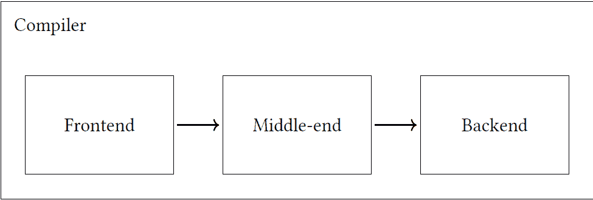

**图 2.2**：典型的编译器工作流程：源程序通过不同的阶段：前端、中间端和后端

我们将关注生成二进制代码的编译器，并展示这样一个编译器的典型编译器工作流程图 2.2。编译的阶段可以描述如下：

+   前端：前端执行词法分析和解析，包括语法分析和语义分析。语法分析假设你的程序根据语言语法规则组织得很好。语义分析对程序的意义进行检查，并拒绝无效的程序，例如使用错误类型的程序。

+   中间端：中间端对中间表示（IR）代码（Clang 的 LLVM-IR）执行各种优化。

+   后端：编译器后端接收优化或转换后的 IR，并生成目标平台可执行的目标机器代码或汇编代码。

源程序在通过各个阶段时被转换成不同的形式。例如，前端生成 IR 代码，然后由中间端进行优化，最后由后端转换为本地代码（见图 2.3）。

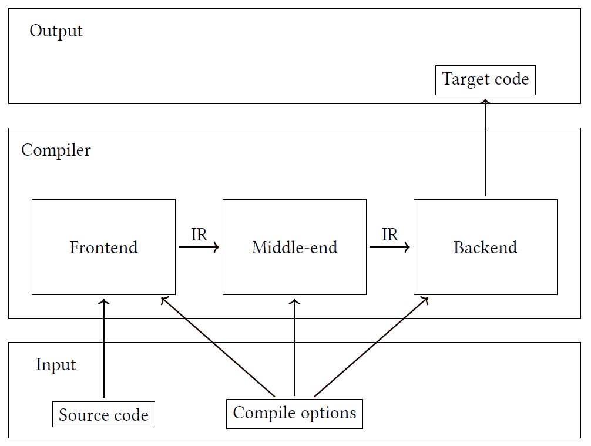

**图 2.3**：编译器对源代码的转换

输入数据包括**源代码**和**编译选项**。源代码通过**前端**转换成**IR**。**中间端**对**IR**进行不同的优化，并将最终（优化后的）结果传递给**后端**。**后端**生成**目标代码**。**前端**、**中间端**和**后端**使用**编译选项**作为代码转换的设置。让我们首先研究编译器的前端，它是编译器工作流程的第一个组件。

### 2.2.2 前端

前端的主要目标是将给定的源代码转换成中间形式。值得注意的是，在生成 IR 之前，前端还将源代码转换成各种形式。前端将是本书的主要焦点，因此我们将检查其组件。前端的第一组件是 Lexer（见图 2.4）。它将源代码转换成一组标记，这些标记用于创建一个特殊的数据结构，即抽象语法树（AST）。最后一个组件是代码生成器（Codegen），它遍历 AST 并从中生成 IR。

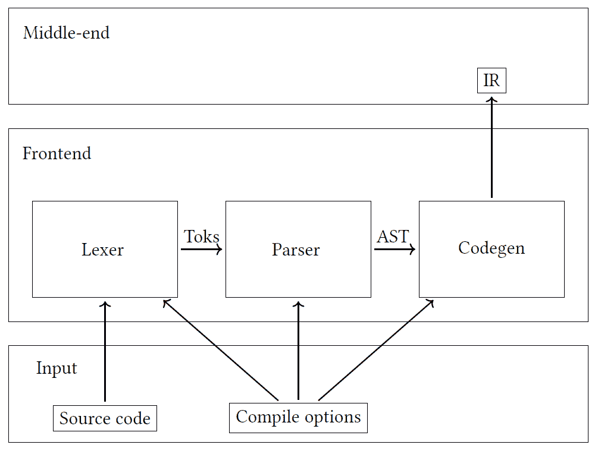

**图 2.4**：编译器前端

源代码通过 Lexer 转换成一组标记（**Toks**）。解析器（Parser）接收这些标记并创建一个**抽象语法树**（**AST**），我们将在第三章*，Clang AST*中详细探讨。代码生成器（Codegen）从 AST 生成**中间表示**（**IR**）。

我们将使用一个简单的 C/C++程序来计算两个数的最大值，以演示前端的工作原理。该程序的代码如下：

```cpp

1 int max(int a, int b) { 

2   if (a > b) 

3     return a; 

4   return b; 

5 }
```

**图 2.5**：编译器前端测试程序

前端的第一组件是 lexer。让我们来考察它。

#### Lexer

前端处理过程从 Lexer 开始，它将输入源代码转换成一系列的标记。在我们的示例程序中（见图 2.5），第一个标记是关键字`int`，它代表整数类型。接下来是函数名`max`的标识符。下一个标记是左括号`(`，以此类推（见图 2.6）。

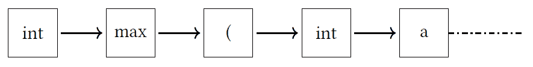

**图 2.6**：Lexer：程序源代码被转换成一系列的标记

#### 解析器

解析器是紧随 Lexer 之后的下一个组件。解析器的主要输出称为**抽象语法树（AST**）。这棵树代表了用编程语言编写的源代码的抽象句法结构。解析器通过将 Lexer 产生的标记流作为输入并组织成树状结构来生成 AST。树中的每个节点代表源代码中的一个结构，如语句或表达式，节点之间的边代表这些结构之间的关系。

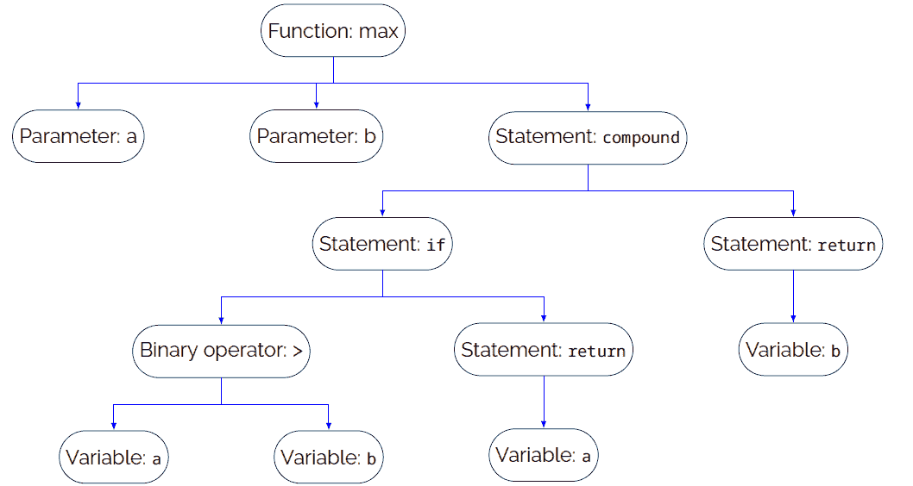

**图 2.7**：计算两个数最大值的示例程序的 AST

我们示例程序的 AST 显示在图 2.7。如图所示，我们的函数（`max`）有两个参数（`a`和`b`）和一个主体。主体在图 2.7 中被标记为复合语句，参见图 2.40，在那里我们从 C++标准中提供了一个复合语句的定义。复合语句由其他语句组成，例如`return`和`if`。变量`a`和`b`在这些语句的主体中使用。您可能还对 Clang 为复合语句生成的真实 AST 感兴趣，其结果显示在图 2.8 中。

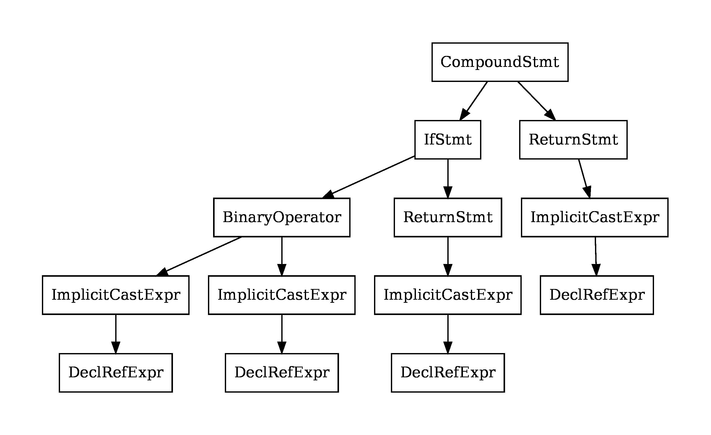

**图 2.8**：Clang 生成的复合语句的 AST。由`clang -cc1 -ast-view <...>`命令生成的树

解析器执行两个活动：

1.  语法分析：解析器通过分析程序的语法来构建抽象语法树（AST）。

1.  语义分析：解析器从语义上分析程序。

解析器的一项工作是，如果在语法或语义分析阶段解析失败，则生成错误消息。如果没有发生错误，那么我们得到语法分析的解析树（或 AST），在语义分析的情况下，我们得到语义验证的解析树。我们可以通过考虑语法分析检测到的错误类型以及语义分析检测到的错误类型来获得这种感觉。

语法分析假设程序在语言的指定语法方面应该是正确的。例如，以下程序在语法上无效，因为最后一个返回语句缺少分号：

```cpp
1 int max(int a, int b) { 

2   if (a > b) 

3     return a; 

4   return b // missing ; 

5 }
```

**图 2.9**：具有语法错误的程序代码列表

Clang 为该程序生成了以下输出：

```cpp
max_invalid_syntax.cpp:4:11: error: expected ’;’ after return statement
  return b // missing ;
          ^
          ;
```

**图 2.10**：具有语法错误的程序的编译器输出

另一方面，一个程序可能在语法上是正确的，但没有任何意义。在这种情况下，解析器应该检测到语义错误。例如，以下程序有关返回值类型使用错误的语义错误：

```cpp
1 int max(int a, int b) { 

2   if (a > b) 

3     return a; 

4   return &b; // invalid return type 

5 }
```

**图 2.11**：包含语义错误的程序代码列表

Clang 为该程序生成了以下输出：

```cpp
max_invalid_sema.cpp:4:10: error: cannot initialize return object of type \
’int’ with an rvalue of type ’int *’
  return &b; // invalid return type
         ^~
```

**图 2.12**：具有语义错误的程序的编译器输出

AST 主要是语法分析的结果，但对于某些语言，如 C++，语义分析对于构建 AST 也是至关重要的，尤其是对于 C++模板实例化。

在语法分析期间，编译器验证模板声明是否遵循语言的语法和语法规则，包括正确使用“template”和“typename”等关键字，以及模板参数和主体的形成。

另一方面，语义分析涉及编译器执行模板实例化，这为模板的特定实例生成抽象语法树（AST）。值得注意的是，模板的语义分析可能相当复杂，因为编译器必须为每个模板实例化执行类型检查、名称解析等任务。此外，实例化过程可能是递归的，并可能导致大量代码重复，称为代码膨胀。为了解决这个问题，C++编译器采用模板实例化缓存等技术来最小化生成的冗余代码量。

#### 代码生成

代码生成（值得一提的是，我们还有一个作为后端一部分的另一个 Codegen 组件，它生成目标代码）或代码生成器，是编译器前端的最后一个组件，其主要目标是生成**中间表示（IR）**。为此，编译器遍历由解析器生成的 AST，并将其转换为称为中间表示或 IR 的其他源代码。IR 是一种与语言无关的表示，允许相同的中间端组件用于不同的前端（FORTRAN 与 C++）。使用中间表示（IR）的另一个原因是，如果我们明天有新的架构可用，我们可以生成特定于该架构的目标代码。由于源语言保持不变，所有导致 IR 的步骤都将保持不变。IR 提供了这种灵活性。

编译器中使用 IR 的概念已经存在了几十年。在编译过程中使用中间表示来表示程序源代码的想法随着时间的推移而发展，IR 首次在编译器中引入的确切日期尚不清楚。

然而，众所周知，20 世纪 50 年代和 60 年代的第一批编译器没有使用 IR，而是直接将源代码翻译成机器代码。到 20 世纪 60 年代和 70 年代，研究人员开始尝试在编译器中使用 IR 来提高编译过程的效率和灵活性。

最早广泛使用的 IR 之一是三地址代码，它在 20 世纪 60 年代中期用于 IBM/360 的 FORTRAN 编译器。其他早期的 IR 示例包括 20 世纪 70 年代和 80 年代分别引入的**寄存器传输语言（RTL）**和**静态单赋值（SSA）**形式。

今天，编译器中使用 IR 已成为标准做法，许多编译器在整个编译过程中使用多个 IR。这允许应用更强大的优化和代码生成技术。

## 2.3 Clang 驱动概述

讨论编译器时，我们通常指的是一个命令行工具，用于启动和管理编译过程。例如，要使用 GNU 编译器集合，必须调用`gcc`来启动编译过程。同样，要使用 Clang 编译 C++程序，必须将`clang`作为编译器调用。控制编译过程的程序被称为驱动程序。驱动程序协调编译的不同阶段并将它们连接在一起。在本书中，我们将重点关注 LLVM，并使用 Clang 作为编译过程的驱动程序。

对于读者来说，可能会感到困惑的是，同一个词“Clang”被用来指代编译器前端和编译驱动程序。相比之下，在其他编译器中，驱动程序和 C++编译器可以是独立的可执行文件，而“Clang”是一个单一的可执行文件，它既作为驱动程序也作为编译器前端。要仅将 Clang 用作编译器前端，必须传递特殊选项`-cc1`。

### 2.3.1 示例程序

我们将使用简单的“Hello world!”示例程序进行 Clang 驱动程序的实验。主要源文件名为`hello.cpp`。该文件实现了一个简单的 C++程序，将“Hello world!”打印到标准输出。

```cpp
1 #include <iostream> 

2  

3 int main() { 

4   std::cout << "Hello world!" << std::endl; 

5   return 0; 

6 }
```

**图 2.13**：示例程序：hello.cpp

您可以使用以下命令编译源代码：

```cpp
$ <...>/llvm-project/install/bin/clang hello.cpp -o /tmp/hello -lstdc++
```

**图 2.14**：`hello.cpp`的编译

如您所见，我们使用了`clang`可执行文件作为编译器，并指定了`-lstdc++`库选项，因为我们使用了标准 C++库中的`<iostream>`头文件。我们还使用`-o`选项指定了可执行文件的输出（`/tmp/hello`）。

### 2.3.2 编译阶段

我们为示例程序使用了两个输入。第一个是我们的源代码，第二个是标准 C++库的共享库。Clang 驱动程序应将这些输入组合在一起，通过编译过程的各个阶段传递它们，并最终在目标平台上提供可执行文件。

Clang 使用与图 2.2 中所示相同的典型编译器工作流程。您可以使用`-ccc-print-phases`附加参数要求 Clang 显示阶段。

```cpp
$ <...>/llvm-project/install/bin/clang hello.cpp -o /tmp/hello -lstdc++ \
                                       -ccc-print-phases
```

**图 2.15**：打印 hello.cpp 编译阶段的命令

命令的输出如下：

```cpp
              +- 0: input, "hello.cpp", c++
         +- 1: preprocessor, {0}, c++-cpp-output
      +- 2: compiler, {1}, ir
   +- 3: backend, {2}, assembler
+- 4: assembler, {3}, object
|- 5: input, "1%dM", object
6 : linker, {4, 5}, image
```

**图 2.16**：hello.cpp 的编译阶段

我们可以将输出可视化，如图 2.17 所示。

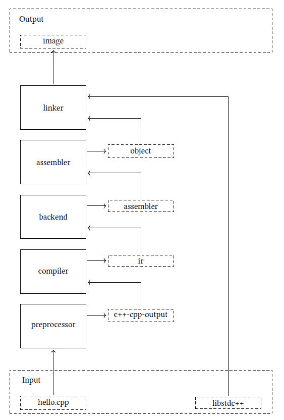

**图 2.17**：Clang 驱动程序阶段

如图 2.17 所示，驱动程序接收一个输入文件`hello.cpp`，这是一个 C++文件。该文件由预处理器处理，我们获得预处理器输出（标记为`c++-cpp-output`）。结果由编译器编译成 IR 形式，然后后端将其转换为汇编形式。这种形式随后被转换成目标文件。最终的目标文件与另一个目标文件（`libstdc++`）结合，生成最终的二进制文件（`image`）。

### 2.3.3 工具执行

阶段被组合为几个工具执行。Clang 驱动程序调用不同的程序以生成最终的可执行文件。具体来说，对于我们的示例，它调用`clang`编译器和`ld`链接器。这两个程序都需要由驱动程序设置的额外参数。

例如，我们的示例程序（`hello.cpp`）包含以下头文件：

```cpp
1#include <iostream> 

2 ...
```

**图 2.18**：iostream 头文件在 hello.cpp 中

在调用编译时，我们没有指定任何额外的参数（例如，搜索路径，例如，`-I`）。然而，不同的架构和操作系统可能具有不同的路径来定位头文件。

在 Fedora 39 上，头文件位于`/usr/include/c++/13/iostream`文件夹中。我们可以使用`-###`选项检查驱动程序执行的过程和使用的参数的详细描述：

```cpp
$ <...>/llvm-project/install/bin/clang hello.cpp -o /tmp/hello -lstdc++ -###
```

**图 2.19**：打印 hello.cpp 工具执行的命令

该命令的输出相当广泛，此处省略了某些部分。请参阅图 2.20。

```cpp
1clang version 18.1.0rc (https://github.com/llvm/llvm-project.git ...) 

2  "<...>/llvm-project/install/bin/clang-18" 

3    "-cc1" ... \ 

4    "-internal-isystem" \ 

5    "/usr/include/c++/13" ... \ 

6    "-internal-isystem" \ 

7    "/usr/include/c++/13/x86_64-redhat-linux" ... \ 

8    "-internal-isystem" ... \ 

9    "<...>/llvm-project/install/lib/clang/18/include" ... \ 

10    "-internal-externc-isystem" \ 

11    "/usr/include" ... \ 

12    "-o" "/tmp/hello-XXX.o" "-x" "c++" "hello.cpp" 

13  ".../bin/ld" ... \ 

14    "-o" "/tmp/hello" ... \ 

15    "/tmp/hello-XXX.o" \ 

16    "-lstdc++" ...
```

**图 2.20**：Clang 驱动程序工具执行。主机系统是 Fedora 39。

如图 2.20 所示，驱动程序启动了两个过程：带有`-cc1`标志的`clang-18`（见*行 2-12*）和链接器`ld`（见*行 13-16*）。Clang 编译器隐式接收几个搜索路径，如*行 5、7、9 和 11*所示。这些路径对于在测试程序中包含`iostream`头文件是必要的。

第一个可执行文件（`/tmp/hello-XXX.o`）的输出作为第二个可执行文件的输入（见*行 12 和 15*）。对于链接器，设置了`-lstdc++`和`-o /tmp/hello`参数，而第一个参数（hello.cpp）为编译器调用（第一个可执行文件）提供。


**图 2.21**：Clang 驱动程序工具执行。Clang 驱动程序运行两个可执行文件：带有-cc1 标志的 clang 可执行文件和链接器-ld 可执行文件

该过程可以如图 2.21 所示进行可视化，其中我们可以看到两个可执行文件作为编译过程的一部分被执行。第一个是带有特殊标志（`-cc1`）的`clang-18`。第二个是链接器：`ld`。

### 2.3.4 将所有内容组合在一起

我们可以使用图 2.22 总结到目前为止所获得的知识。该图说明了 Clang 驱动程序启动的两个不同过程。第一个是`clang -cc1`（编译器），第二个是`ld`（链接器）。编译器过程与 Clang 驱动程序（`clang`）相同的可执行文件，但它使用特殊参数：`-cc1`。编译器生成一个对象文件，然后由链接器（`ld`）处理以生成最终的二进制文件。

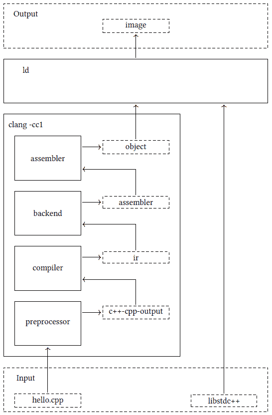

**图 2.22**：Clang 驱动器：驱动器获取了输入文件 hello.cpp，这是一个 C++文件。它启动了两个进程：clang 和 ld。第一个进程执行真正的编译并启动集成汇编器。最后一个进程是链接器（ld），它从编译器接收到的结果和外部库（libstdc++）生成最终的二进制（镜像）

在图 2.22 中，我们可以观察到之前提到的编译器中的类似组件（参见*第 2.2 节**，开始使用编译器*）。然而，主要区别在于**预处理器**（词法分析器的一部分）被单独显示，而前端和中端被组合到**编译器**中。此外，该图描述了一个由驱动器执行的**汇编器**，用于生成目标代码。需要注意的是，汇编器可以是集成的，如图图 2.22 所示，或者可能需要单独的进程来执行。

重要提示

这里是一个使用`-c`（仅编译）和`-o`（输出文件）选项以及适用于您平台的适当标志指定外部汇编器的示例：

```cpp
$<...>/llvm-project/install/bin/clang -c hello.cpp \
                                      -o /tmp/hello.o
as -o /tmp/hello.o /tmp/hello.s
```

### 2.3.5 调试 Clang

我们将逐步通过我们的编译过程调试会话，如图图 2.14 所示。

重要提示

我们将使用之前在*第 1.3.3 节**，* *LLVM 调试器、其构建和使用*中创建的 LLDB 构建，以及本书中其他调试会话进行此调试会话。您也可以使用主机系统提供的 LLDB。

我们选择的感兴趣点，或断点，是`clang::ParseAST`函数。在一个典型的调试会话中，它类似于图 1.11 中概述的，你会在`"- -"`符号之后输入命令行参数。命令应该看起来像这样：

```cpp
$ lldb <...>/llvm-project/install/bin/clang -- hello.cpp -o /tmp/hello \
                                               -lstdc++
```

**图 2.23**：编译 hello.cpp 文件时的调试器运行

在这种情况下，`<...>`代表用于克隆 LLVM 项目的目录路径。

不幸的是，这种方法与 Clang 编译器不兼容：

```cpp
1$ lldb <...>/llvm-project/install/bin/clang -- hello.cpp -o /tmp/hello.o -lstdc++ 

2 ... 

3 (lldb) b clang::ParseAST 

4 ... 

5 (lldb) r 

6 ... 

72  locations added to breakpoint 1 

8 ... 

9 Process 247135 stopped and restarted: thread 1 received signal: SIGCHLD 

10 Process 247135 stopped and restarted: thread 1 received signal: SIGCHLD 

11 Process 247135 exited with status = 0 (0x00000000) 

12 (lldb)
```

**图 2.24**：失败的干扰调试会话

如我们从*第 7 行*可以看到，断点已设置，但进程成功完成（*第 11 行*）而没有任何中断。换句话说，在这个实例中，我们的断点没有触发。

理解 Clang 驱动程序的内部结构可以帮助我们识别当前的问题。如前所述，`clang` 可执行文件在此上下文中充当驱动程序，运行两个独立的进程（参见图 2.21）。因此，如果我们想调试编译器，我们需要使用 `-cc1` 选项来运行它。

重要提示

值得注意的是，Clang 在 2019 年实现了一种特定的优化 [22]。当使用 `-c` 选项时，Clang 驱动程序不会为编译器启动一个新的进程：

```cpp
$ <...>/llvm-project/install/bin/clang -c hello.cpp  \
                                       -o /tmp/hello.o \
                                       -###
clang version 18.1.0rc ...
InstalledDir: <...>/llvm-project/install/bin
 (in-process)
 "<...>/llvm-project/install/bin/clang-18" "-cc1"..."hello.cpp"
 ...
```

如上图所示，Clang 驱动程序不会启动一个新的进程，而是在同一个进程中调用“cc1”工具。这个特性不仅提高了编译器的性能，还可以用于 Clang 调试。

使用 `-cc1` 选项并排除 `-lstdc++` 选项（这是针对第二个进程，即 ld 链接器的特定选项）后，调试器将生成以下输出：

```cpp
1$ lldb <...>/llvm-project/install/bin/clang -- -cc1 hello.cpp -o /tmp/hello.o 

2 ... 

3 (lldb) b clang::ParseAST 

4 ... 

5 (lldb) r 

6 ... 

72  locations added to breakpoint 1 

8 Process 249890 stopped 

9 * thread #1, name = ’clang’, stop reason = breakpoint 1.1 

10     frame #0: ... at ParseAST.cpp:117:3 

11    114 

12    115  void clang::ParseAST(Sema &S, bool PrintStats, bool SkipFunctionBodies) { 

13    116    // Collect global stats on Decls/Stmts (until we have a module streamer). 

14 -> 117    if (PrintStats) { 

15    118      Decl::EnableStatistics(); 

16    119      Stmt::EnableStatistics(); 

17    120    } 

18 (lldb) c 

19 Process 249890 resuming 

20 hello.cpp:1:10: fatal error: ’iostream’ file not found 

21 #include <iostream> 

22          ^~~~~~~~~~ 

231  error generated. 

24 Process 249890 exited with status = 1 (0x00000001) 

25 (lldb)
```

**图 2.25**：缺少搜索路径的调试会话

因此，我们可以看到我们成功地设置了断点，但进程以错误结束（见 *行 20-24*）。这个错误是由于我们省略了某些搜索路径，这些路径通常是 Clang 驱动程序隐式附加的，对于成功编译所需的所有包含文件是必要的。

如果我们在编译器调用中明确包含所有必要的参数，我们可以成功执行该过程。以下是这样做的方法：

```cpp
lldb <...>/llvm-project/install/bin/clang -- -cc1                    \
     -internal-isystem /usr/include/c++/13                           \
     -internal-isystem /usr/include/c++/13/x86_64-redhat-linux       \
     -internal-isystem <...>/llvm-project/install/lib/clang/18/include \
     -internal-externc-isystem /usr/include                          \
     hello.cpp                                                       \
     -o /tmp/hello.o
```

**图 2.26**：使用指定搜索路径运行调试器。主机系统是 Fedora 39

然后，我们可以设置 `clang::ParseAST` 的断点并运行调试器。执行将无错误完成，如下所示：

```cpp
1(lldb) b clang::ParseAST 

2 ... 

3 (lldb) r 

4 ... 

52  locations added to breakpoint 1 

6 Process 251736 stopped 

7 * thread #1, name = ’clang’, stop reason = breakpoint 1.1 

8    frame #0: 0x00007fffe803eae0 ... at ParseAST.cpp:117:3 

9    114 

10    115  void clang::ParseAST(Sema &S, bool PrintStats, bool SkipFunctionBodies) { 

11    116    // Collect global stats on Decls/Stmts (until we have a module streamer). 

12 -> 117    if (PrintStats) { 

13    118     Decl::EnableStatistics(); 

14    119     Stmt::EnableStatistics(); 

15    120    } 

16 (lldb) c 

17 Process 251736 resuming 

18 Process 251736 exited with status = 0 (0x00000000) 

19 (lldb)
```

**图 2.27**：编译器的成功调试会话

总之，我们已经成功地演示了 Clang 编译器调用的调试。所介绍的技术可以有效地用于探索编译器的内部结构和解决与编译器相关的错误。

## 2.4 Clang 前端概述

很明显，Clang 编译器工具链符合各种编译器书籍中广泛描述的模式 [1, 18]。然而，Clang 的前端部分与典型的编译器前端有显著差异。这种差异的主要原因是 C++ 语言的复杂性。一些特性，如宏，可以修改源代码本身，而其他特性，如 typedef，可以影响标记的类型。Clang 还可以生成多种格式的输出。例如，以下命令生成了*图 2.5*中显示的程序的美观 HTML 视图：

```cpp
$ <...>/llvm-project/install/bin/clang -cc1 -emit-html max.cpp
```

注意，我们将输出源程序 HTML 形式的参数传递给 Clang 前端，使用`-cc1`选项指定。或者，您也可以通过`-Xclang`选项将选项传递给前端，这需要一个额外的参数来表示选项本身，例如：

```cpp
$ <...>/llvm-project/install/bin/clang -Xclang -emit-html max.cpp \
                                       -fsyntax-only
```

你可能会注意到，在前面的命令中，我们使用了`-fsyntax-only`选项，指示 Clang 只执行预处理器、解析器和语义分析阶段。

因此，我们可以指示 Clang 前端执行不同的操作，并根据提供的编译选项生成不同类型的输出。这些操作的基类被称为`FrontendAction`。

### 2.4.1 前端操作

Clang 前端一次只能执行一个前端操作。前端操作是基于提供的编译器选项，前端执行的具体任务或过程。以下是一些可能的前端操作列表（表格仅包含可用前端操作的一个子集）：

|

* * *

|

* * *

|

* * *

|

| FrontendAction | 编译器选项 | 描述 |
| --- | --- | --- |

|

* * *

|

* * *

|

* * *

|

| EmitObjAction | `-emit-obj`（默认） | 编译为对象文件 |
| --- | --- | --- |

|

* * *

|

* * *

|

* * *

|

| EmitBCAction | `-emit-llvm-bc` | 编译为 LLVM 字节码 |
| --- | --- | --- |

|

* * *

|

* * *

|

* * *

|

| EmitLLVMAction | `-emit-llvm` | 编译为 LLVM 可读形式 |
| --- | --- | --- |

|

* * *

|

* * *

|

* * *

|

| ASTPrintAction | `-ast-print` | 构建抽象语法树（AST）并格式化输出。 |
| --- | --- | --- |

|

* * *

|

* * *

|

* * *

|

| HTMLPrintAction | `-emit-html` | 以 HTML 形式打印程序源代码 |
| --- | --- | --- |

|

* * *

|

* * *

|

* * *

|

| DumpTokensAction | `-dump-tokens` | 打印预处理器标记 |
| --- | --- | --- |

|

* * *

|

* * *

|

* * *

|

|  |  |  |
| --- | --- | --- |

**表 2.1**: 前端操作

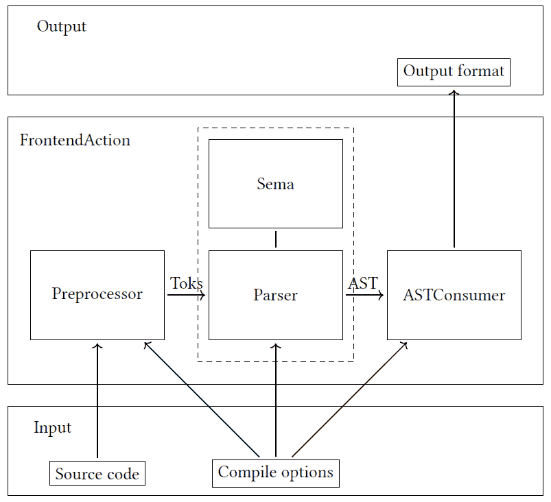

**图 2.28**: Clang 前端组件

图 2.28 所示为基本前端架构，该架构与图 2.4 所示的架构类似。然而，Clang 有一些特定的显著差异。

一个显著的变化是词法分析器的命名。在 Clang 中，词法分析器被称为预处理器。这种命名约定反映了词法分析器实现被封装在`Preprocessor`类中的事实。这种变更受到了 C/C++语言独特方面的启发，包括需要特殊预处理的特殊类型的标记（宏）。

另一个值得注意的差异出现在解析器组件中。虽然传统的编译器通常在解析器中同时执行语法和语义分析，但 Clang 将这些任务分配到不同的组件中。`Parser`组件专注于语法分析，而`Sema`组件处理语义分析。

此外，Clang 还提供以不同形式或格式生成输出的能力。例如，`CodeGenAction` 类是各种代码生成操作的基类，如 `EmitObjAction` 或 `EmitLLVMAction`。

我们将使用 图 2.5 中的 `max` 函数代码进行我们未来对 Clang 前端内部结构的探索：

```cpp
1 int max(int a, int b) { 

2   if (a > b) 

3     return a; 

4   return b; 

5 }
```

**图 2.29**：`max` 函数的源代码：max.cpp

通过使用 `-cc1` 选项，我们可以直接调用 Clang 前端，绕过驱动程序。这种方法允许我们更详细地检查和分析 Clang 前端的内部工作原理。

### 2.4.2 预处理器

第一部分是 Lexer，在 Clang 中被称为预处理器。其主要目标是把输入程序转换成令牌流。您可以使用以下 `-dump-tokens` 选项打印令牌流：

```cpp
$ <...>/llvm-project/install/bin/clang -cc1 -dump-tokens max.cpp
```

命令的输出如下所示：

```cpp
int ’int’        [StartOfLine]  Loc=<max.cpp:1:1>
identifier ’max’         [LeadingSpace] Loc=<max.cpp:1:5>
l_paren ’(’             Loc=<max.cpp:1:8>
int ’int’               Loc=<max.cpp:1:9>
identifier ’a’   [LeadingSpace] Loc=<max.cpp:1:13>
comma ’,’               Loc=<max.cpp:1:14>
int ’int’        [LeadingSpace] Loc=<max.cpp:1:16>
identifier ’b’   [LeadingSpace] Loc=<max.cpp:1:20>
r_paren ’)’             Loc=<max.cpp:1:21>
l_brace ’{’      [LeadingSpace] Loc=<max.cpp:1:23>
if ’if’  [StartOfLine] [LeadingSpace]   Loc=<max.cpp:2:3>
l_paren ’(’      [LeadingSpace] Loc=<max.cpp:2:6>
identifier ’a’          Loc=<max.cpp:2:7>
greater ’>’      [LeadingSpace] Loc=<max.cpp:2:9>
identifier ’b’   [LeadingSpace] Loc=<max.cpp:2:11>
r_paren ’)’             Loc=<max.cpp:2:12>
return ’return’  [StartOfLine] [LeadingSpace]   Loc=<max.cpp:3:5>
identifier ’a’   [LeadingSpace] Loc=<max.cpp:3:12>
semi ’;’                Loc=<max.cpp:3:13>
return ’return’  [StartOfLine] [LeadingSpace]   Loc=<max.cpp:4:3>
identifier ’b’   [LeadingSpace] Loc=<max.cpp:4:10>
```

```cpp
semi ’;’                Loc=<max.cpp:4:11>
r_brace ’}’      [StartOfLine]  Loc=<max.cpp:5:1>
eof ’’          Loc=<max.cpp:5:2>
```

**图 2.30**：Clang 输出令牌

如我们所见，存在不同类型的令牌，例如语言关键字（例如 `int`、`return`）、标识符（例如 `max`、`a`、`b` 等）和特殊符号（例如分号、逗号等）。我们小程序的令牌被称为 **普通** **令牌**，由令牌化器返回。

除了普通令牌外，Clang 还有一种称为 **注解令牌** 的额外令牌类型。主要区别是这些令牌还存储了额外的语义

信息。例如，一系列普通令牌可以被解析器替换为包含类型或 C++ 范围信息的单个注解令牌。使用此类令牌的主要原因是为了性能，因为它允许在解析器需要回溯时防止重新解析。

由于注解令牌用于解析器的内部实现，因此考虑一个使用 LLDB 的示例可能会有所帮助。假设我们有以下 C++ 代码：

```cpp
1 namespace clangbook { 

2 template <typename T> class A {}; 

3 } // namespace clangbook 

4 clangbook::A<int> a;
```

**图 2.31**：使用注解标记的源代码：annotation.cpp

代码的最后一行声明了变量 `a`，其类型如下：

`clangbook``::``A``<``int``>`. 该类型表示为一个注解标记，如下面的 LLDB 会话所示：

```cpp
1$ lldb <...>/llvm-project/install/bin/clang -- -cc1 annotation.cpp 

2 ... 

3 (lldb) b clang::Parser::ConsumeAnnotationToken 

4 ... 

5 (lldb) r 

6 ... 

7    608    } 

8    609 

9    610    SourceLocation ConsumeAnnotationToken() { 

10 -> 611      assert(Tok.isAnnotation() && "wrong consume method"); 

11    612      SourceLocation Loc = Tok.getLocation(); 

12    613      PrevTokLocation = Tok.getAnnotationEndLoc(); 

13    614      PP.Lex(Tok); 

14 (lldb) p Tok.getAnnotationRange().printToString(PP.getSourceManager()) 

15 (std::string) "<annotation.cpp:4:1, col:17>"
```

**图 2.32**：annotation.cpp 的 LLDB 会话

如我们所见，Clang 从 图 2.31 中显示的程序的第 4 行消耗了一个注解标记。该标记位于第 1 列和第 7 列之间。参见 图 2.32。这对应于以下用作标记的文本：`clangbook``::``A``<``int``>`. 该标记由其他标记组成，例如 'clangbook'、'::' 等。将所有标记组合在一起将显著简化解析并提高整体解析性能。

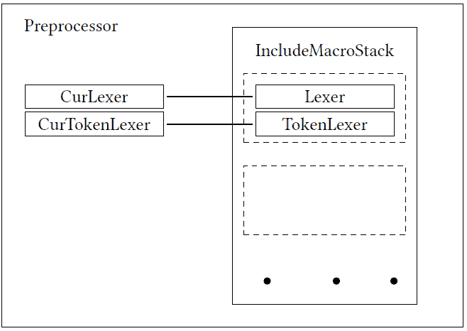

**图 2.33**：预处理器（Clang 令牌化器）类内部结构

C/C++语言有一些特定的方面影响了`Preprocessor`类的内部实现。第一个是关于宏的。`Preprocessor`类有两个不同的辅助类来检索令牌：

+   `Lexer`类用于将文本缓冲区转换为令牌流。

+   `TokenLexer`类用于从宏展开中检索令牌。

应该注意的是，一次只能激活这些辅助类中的一个。

C/C++的另一个特定方面是`#include`指令（这也适用于导入指令）。在这种情况下，我们需要维护一个包含栈，其中每个包含可以有自己的`TokenLexer`或`Lexer`，这取决于其中是否包含宏展开。因此，`Preprocessor`类为每个`#include`指令保留了一个令牌化器栈（`IncludeMacroStack`类），如图 2.33 所示。

### 2.4.3 解析器和语义分析

解析器和语义分析是 Clang 编译器前端的关键组件。它们处理源代码的语法和语义分析，输出 AST（抽象语法树）。可以使用以下命令可视化我们的测试程序：

```cpp
$ <...>/llvm-project/install/bin/clang -cc1 -ast-dump max.cpp
```

此命令的输出如下：

```cpp
TranslationUnitDecl 0xa9cb38 <<invalid sloc>> <invalid sloc>
|-TypedefDecl 0xa9d3a8 <<invalid sloc>> <invalid sloc>
implicit __int128_t ’__int128’
| ‘-BuiltinType 0xa9d100 ’__int128’
...
‘-FunctionDecl 0xae6a98 <max.cpp:1:1, line:5:1> line:1:5 max
’int (int, int)’
  |-ParmVarDecl 0xae6930 <col:9, col:13> col:13 used a ’int’
  |-ParmVarDecl 0xae69b0 <col:16, col:20> col:20 used b ’int’
  ‘-CompoundStmt 0xae6cd8 <col:23, line:5:1>
    |-IfStmt 0xae6c70 <line:2:3, line:3:12>
    | |-BinaryOperator 0xae6c08 <line:2:7, col:11> ’bool’ ’>’
    | | |-ImplicitCastExpr 0xae6bd8 <col:7> ’int’ <LValueToRValue>
    | | | ‘-DeclRefExpr 0xae6b98 <col:7> ’int’ lvalue ParmVar 0xae6930
            ’a’ ’int’
    | | ‘-ImplicitCastExpr 0xae6bf0 <col:11> ’int’ <LValueToRValue>
    | |   ‘-DeclRefExpr 0xae6bb8 <col:11> ’int’ lvalue ParmVar 0xae69b0
            ’b’ ’int’
    | ‘-ReturnStmt 0xae6c60 <line:3:5, col:12>
    |   ‘-ImplicitCastExpr 0xae6c48 <col:12> ’int’ <LValueToRValue>
    |     ‘-DeclRefExpr 0xae6c28 <col:12> ’int’ lvalue ParmVar 0xae6930
            ’a’ ’int’
    ‘-ReturnStmt 0xae6cc8 <line:4:3, col:10>
      ‘-ImplicitCastExpr 0xae6cb0 <col:10> ’int’ <LValueToRValue>
```

```cpp
        ‘-DeclRefExpr 0xae6c90 <col:10> ’int’ lvalue ParmVar 0xae69b0
            ’b’ ’int’
```

**图 2.34**：Clang AST 转储输出

Clang 使用手写的递归下降解析器 [10]。这个解析器可以被认为是简单的，这种简单性是其选择的关键原因之一。此外，为 C/C++语言指定的复杂规则需要一个具有易于适应规则的临时解析器。

让我们通过我们的示例来探索它是如何工作的。解析从顶级声明开始，称为`TranslationUnitDecl`，代表一个单独的翻译单元。C++标准将翻译单元定义为如下 [21, lex.separate]：

一个源文件，包括所有头文件（16.5.1.2）和通过预处理指令#include 包含的源文件（15.3），但不包括任何由条件包含（15.2）预处理指令跳过的源代码行，被称为翻译单元。

解析器首先识别出源代码的初始令牌对应于 C++标准中定义的函数定义 [21, dcl.fct.def.general]：

```cpp
function-definition :
        ... declarator ... function-body
        ...
```

**图 2.35**：C++标准中的函数定义

相应的代码如下：

```cpp
1int max(...) { 

2   ... 

3 }
```

**图 2.36**：与 C++标准中函数定义相对应的示例代码的一部分

函数定义需要声明符和函数体。我们将从声明符开始，它在 C++标准中定义为 [21, dcl.decl.general]：

```cpp
declarator:
        ...
        ... parameters-and-qualifiers ...
...
parameters-and-qualifiers:
        ( parameter-declaration-clause ) ...
...
parameter-declaration-clause:
        parameter-declaration-list ...
parameter-declaration-list:
        parameter-declaration
        parameter-declaration-list , parameter-declaration
```

**图 2.37**：C++标准中的声明符定义

换句话说，声明符在括号内指定了一系列参数声明。相应的源代码片段如下：

```cpp
1... (int a, int b) 

2   ...
```

**图 2.38**：与 C++标准中声明符相对应的示例代码的一部分

如上所述，函数定义还需要一个函数体。C++标准如下指定了函数体：[21, dcl.fct.def.general]

```cpp
function-body:
       ... compound-statement
       ...
```

**图 2.39**: C++标准的函数体定义

因此，函数体由一个复合语句组成，这在 C++标准中如下定义 [21, stmt.block]：

```cpp
compound-statement:
       { statement-seq ... }
statement-seq:
       statement
       statement-seq statement
```

**图 2.40**: C++标准的复合语句定义

因此，它描述了一个被`{...`括号包围的语句序列。

我们程序有两种类型的语句：条件语句（`if`）和返回语句。这些在 C++语法定义中如下表示 [21, stmt.pre]：

```cpp
statement:
        ...
        selection-statement
        ...
        jump-statement
        ...
```

**图 2.41**: C++标准的语句定义

在此上下文中，`selection`语句对应于我们程序中的`if`条件，而`jump`语句对应于`return`运算符。

让我们更详细地检查`jum`语句 [21, stmt.jump.general]：

```cpp
jump-statement:
        ...
        return expr-or-braced-init-list;
        ...
```

**图 2.42**: C++标准的跳转语句定义

其中`expr-or-braced-init-list`定义为 [21, dcl.init.general]：

```cpp
expr-or-braced-init-list:
        expression
        ...
```

**图 2.43**: C++标准的返回表达式定义

在此上下文中，`return`关键字后面跟着一个表达式和一个分号。在我们的情况下，有一个隐式转换表达式，它自动将变量转换为所需类型（`int`）。

通过 LLDB 调试器检查解析器的操作可能会有所启发：

```cpp
$ lldb <...>/llvm-project/install/bin/clang -- -cc1 max.cpp
```

调试会话输出显示在图 2.44。如您所见，在*行 1*，我们已为返回语句的解析设置了断点。我们的程序有两个返回语句。我们跳过了第一个调用（行 4）并在第二个方法调用处停止（*行 9*）。从*行 13*的`bt`命令的回溯显示了解析过程的调用栈。这个栈反映了我们之前描述的解析块，遵循[21, lex.separate]中详细描述的 C++语法。

```cpp
1(lldb) b clang::Parser::ParseReturnStatement 

2 (lldb) r 

3 ... 

4 (lldb) c 

5 ... 

6 * thread #1, name = ’clang’, stop reason = breakpoint 1.1 

7    frame #0: ... clang::Parser::ParseReturnStatement(...) ... 

8    2421 StmtResult Parser::ParseReturnStatement() { 

9 -> 2422   assert((Tok.is(tok::kw_return) || Tok.is(tok::kw_co_return)) && 

10    2423         "Not a return stmt!"); 

11    2424   bool IsCoreturn = Tok.is(tok::kw_co_return); 

12    2425   SourceLocation ReturnLoc = ConsumeToken();  // eat the ’return’. 

13 (lldb) bt 

14   * frame #0: ... clang::Parser::ParseReturnStatement( ... 

15    ... 

16    frame #2: ... clang::Parser::ParseStatementOrDeclaration( ... 

17    frame #3: ... clang::Parser::ParseCompoundStatementBody( ... 

18    frame #4: ... clang::Parser::ParseFunctionStatementBody( ... 

19    frame #5: ... clang::Parser::ParseFunctionDefinition( ... 

20    ...
```

**图 2.44**: 在 max.cpp 示例程序中解析第二个返回语句

解析结果生成 AST。我们还可以使用调试器检查 AST 的创建过程。为此，我们需要在`clang::ReturnStmt::Create`方法设置相应的断点：

```cpp
1$ lldb <...>/llvm-project/install/bin/clang -- -cc1 max.cpp 

2 ... 

3 (lldb) b clang::ReturnStmt::Create 

4 (lldb) r 

5 ... 

6 (lldb) c 

7 ... 

8 * thread #1, name = ’clang’, stop reason = breakpoint 1.1 

9    frame #0: ... clang::ReturnStmt::Create(...) at Stmt.cpp:1205:8 

10    1202 

11    1203 ReturnStmt *ReturnStmt::Create(const ASTContext &Ctx, SourceLocation RL, 

12    1204                              Expr *E, const VarDecl *NRVOCandidate) { 

13 -> 1205   bool HasNRVOCandidate = NRVOCandidate != nullptr; 

14    1206   ... 

15    1207   ... 

16    1208   return new (Mem) ReturnStmt(RL, E, NRVOCandidate); 

17 (lldb) bt 

18 * thread #1, name = ’clang’, stop reason = breakpoint 1.1 

19   * frame #0: ... clang::ReturnStmt::Create( ... 

20    frame #1: ... clang::Sema::BuildReturnStmt( ... 

21    frame #2: ... clang::Sema::ActOnReturnStmt( ... 

22    frame #3: ... clang::Parser::ParseReturnStatement( ... 

23    frame #4: ... clang::Parser::ParseStatementOrDeclarationAfterAttributes( ... 

24    ...
```

**图 2.45**: 在`clang::ReturnStmt::Create`处的断点

如所见，返回语句的 AST 节点是由 Sema 组件创建的。

返回语句解析器的开始可以定位在帧 4：

```cpp
1(lldb) f 4 

2 frame #4: ... clang::Parser::ParseStatementOrDeclarationAfterAttributes( ... 

3    323     SemiError = "break"; 

4    324     break; 

5    325    case tok::kw_return:             // C99 6.8.6.4: return-statement 

6 -> 326     Res = ParseReturnStatement(); 

7    327     SemiError = "return"; 

8    328     break; 

9    329    case tok::kw_co_return:           // C++ Coroutines: ... 

10 (lldb)
```

**图 2.46**: 在调试器中解析返回语句

如我们所见，有一个对相应语句的 C99 标准的引用 [25]。该标准 [25] 提供了关于该语句及其处理过程的详细描述。

代码假设当前标记的类型为`tok::kw_return`，在这种情况下，解析器调用相关的`clang::Parser::ParseReturnStatement`方法。

虽然 AST 节点创建的过程在不同 C++结构中可能有所不同，但它通常遵循图 2.47 中显示的模式。

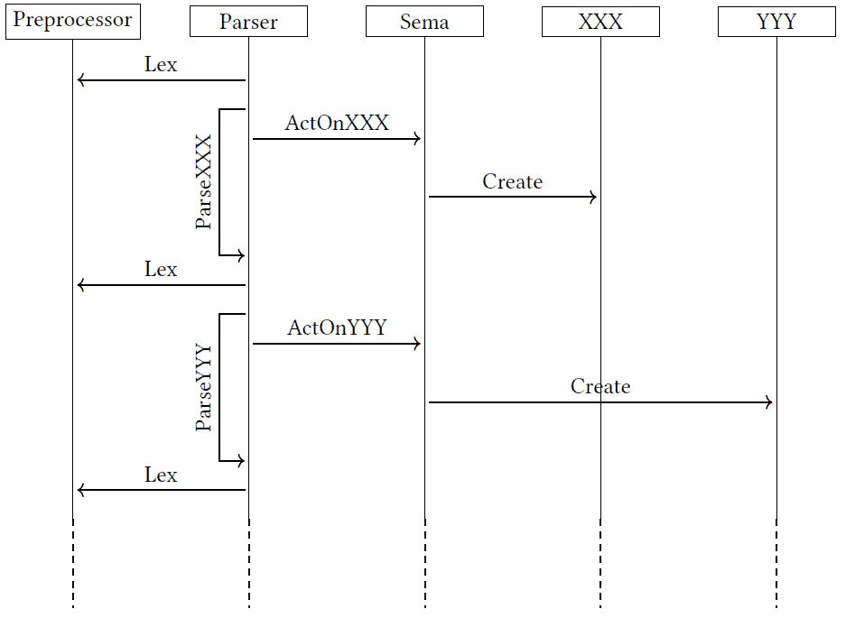

**图 2.47**: Clang 前端 C++解析

在图 2.47 中，方框表示相应的类，函数调用表示为带有调用函数作为边标签的边。可以看出，`Parser`调用`Preprocessor::Lex`方法从词法分析器检索一个标记。然后它调用与标记相对应的方法，例如，对于标记`XXX`，调用`Parser::ParseXXX`。然后该方法调用`Sema::ActOnXXX`，使用`XXX::Create`创建相应的对象。然后使用新的标记重复此过程。

通过这种方式，我们现在已经完全探索了 Clang 中典型编译器前端流程的实现。我们可以看到词法分析器组件（预处理程序）如何与解析器（包括解析器和语义组件）协同工作，以生成未来代码生成的初级数据结构：抽象语法树（AST）。AST 不仅对代码生成至关重要，也对代码分析和修改至关重要。Clang 提供了对 AST 的便捷访问，从而使得开发各种编译器工具成为可能。

## 2.5 概述

在本章中，我们获得了对编译器架构的基本理解，并深入探讨了编译过程的各个阶段，重点关注 Clang 驱动程序。我们探索了 Clang 前端内部，研究了将程序转换为一系列标记的预处理程序，以及与称为“Sema”的组件交互的解析器。这些元素共同执行语法和语义分析。

下一章将专注于 Clang 抽象语法树（AST）——Clang 工具中使用的首要数据结构。我们将讨论其构建和遍历它的方法。

## 2.6 进一步阅读

+   C++编程语言标准草案：[`eel.is/c++draft/`](https://eel.is/c++draft/)

+   “Clang” CFE 内部手册：[`clang.llvm.org/docs/InternalsManual.html`](https://clang.llvm.org/docs/InternalsManual.html)

+   Keith Cooper 和 Linda Torczon：《编译器工程》，2012 [18] 
