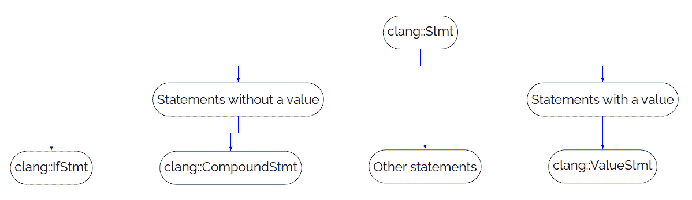
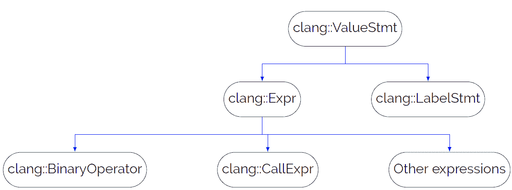

# 3

# Clang AST

任何编译器的解析阶段都会生成一个解析树，**抽象语法树 (AST)** 是在给定输入程序的解析过程中生成的基本算法结构。AST 作为 Clang 前端的框架，也是各种 Clang 工具（包括代码检查器）的主要工具。Clang 提供了用于搜索（或匹配）各种 AST 节点的复杂工具。这些工具使用 **领域特定语言 (DSL)** 实现。理解其实现对于有效地使用这些工具至关重要。

我们将从 Clang 构建 AST 所使用的基层数据结构和类层次结构开始。此外，我们还将探索用于 AST 遍历的方法，并突出一些在遍历过程中帮助节点匹配的辅助类。我们将涵盖以下主题：

+   用于构建 AST 的基本块

+   如何遍历 AST

+   递归访问者是基本的 AST 遍历工具

+   AST 匹配器和它们在辅助 AST 遍历中的作用

+   Clang-Query 作为探索 AST 内部的基本工具

+   编译错误及其对 AST 的影响

## 3.1 技术要求

本章的源代码位于本书 GitHub 仓库的 `chapter3` 文件夹中：[`github.com/PacktPublishing/Clang-Compiler-Frontend-Packt/tree/main/chapter3`](https://github.com/PacktPublishing/Clang-Compiler-Frontend-Packt/tree/main/chapter3)。

## 3.2 AST

AST 通常被表示为树形结构，其叶节点对应于各种对象，例如函数声明和循环体。通常，AST 表示语法分析的结果，即解析。Clang 的 AST 节点被设计为不可变的。这种设计要求 Clang AST 存储语义分析的结果，这意味着 Clang AST 代表了语法和语义分析的结果。

重要注意事项

虽然 Clang 也使用 AST，但值得注意的是，Clang 的 AST 不是一个真正的树。存在反向边使得“图”这个词更适合描述 Clang 的 AST。

在 C++ 中实现的典型树结构具有所有节点都从基类派生。Clang 采用不同的方法。它将不同的 C++ 构造分成不同的组，并为每个组提供基本类：

+   语句：`clang::Stmt` 是所有语句的基本类。这包括普通语句，如 `if` 语句（`clang::IfStmt` 类），以及表达式和其他 C++ 构造。

+   声明：`clang::Decl`是声明的基类。这包括变量、typedef、函数、结构体等。还有一个用于具有上下文声明的单独基类，即可能包含其他声明的声明。此类称为`clang::DeclContext`。`clang::DeclContext`中包含的声明可以通过`clang::DeclContext::decls`方法访问。翻译单元（`clang::TranslationUnitDecl`类）和命名空间（`clang::NamespaceDecl`类）是具有上下文声明的典型示例。

+   类型：C++有一个丰富的类型系统。它包括基本类型，如用于整数的`int`，以及自定义定义的类型和通过`typedef`或`using`进行的类型重定义。C++中的类型可以有诸如`const`之类的限定符，并且可以表示不同的内存寻址模式，即指针、引用等。Clang 使用`clang::Type`作为 AST 中类型表示的基本类。

值得注意的是，组之间存在额外的关系。例如，继承自`clang::Stmt`的`clang::DeclStmt`类有检索相应声明的功能。此外，继承自`clang::Stmt`的表达式（由`clang::Expr`类表示）有处理类型的方法。让我们详细看看所有这些组。

### 3.2.1 语句

`Stmt` 是所有语句的基本类。语句可以组合成两组（见图 3.1）。第一组包含带有值的语句，而与之相反的组是用于不带值的语句。



**图 3.1**：Clang AST：语句

不带值的语句组包括不同的 C++构造，例如`if`语句（`clang::IfStmt`类）或复合语句（`clang::CompoundStmt`类）。所有语句中的大多数都归入这一组。

带有值的语句组由一个基类`clang::ValueStmt`组成，它有几个子类，如`clang::LabelStmt`（用于标签表示）或`clang::ExprStmt`（用于表达式表示），见图 3.2。



**图 3.2**：Clang AST：带有值的语句

### 3.2.2 声明

声明也可以组合成两个主要组：具有上下文和无上下文的声明。具有上下文的声明可以被认为是其他声明的占位符。例如，C++命名空间以及翻译单元或函数声明可能包含其他声明。友元实体声明（`clang::DeclFriend`）可以被认为是无上下文声明的例子。

必须注意的是，从`DeclContext`继承的类也有`clang::Decl`作为它们的顶级父类。

一些声明可以被重新声明，如下面的例子所示：

```cpp
1 extern int a; 

2 int a = 1;
```

**图 3.3**: 声明示例：redeclaration.cpp

这样的声明有一个额外的父类，通过 `clang``::``Redeclarable``<...>` 模板实现。

### 3.2.3 类型

C++是一种静态类型语言，这意味着变量的类型必须在编译时声明。类型允许编译器对程序的意义做出合理的推断，这使得类型成为语义分析的重要组成部分。`clang``::``Type` 是 Clang 中类型的基类。

C/C++中的类型可能有被称为 CV-限定符的限定符，如标准[21，basic.type.qualifier)] 所述。在这里，CV 代表两个关键字 `const` 和 `volatile`，它们可以用作类型的限定符。

重要提示

C99 标准有一个额外的类型限定符 `restrict`，Clang 也支持它[25，6.7.3]。类型限定符指示编译器，在指针的生命周期内，不会使用其他指针来访问它所指向的对象。这允许编译器执行诸如向量化等优化，否则这些优化是不可能的。`restrict` 有助于限制指针别名效应，即当多个指针引用相同的内存位置时发生的效应，从而有助于优化。然而，如果程序员的意图声明没有得到遵循，并且对象被独立指针访问，则会导致未定义的行为。

Clang 有一个特殊类来支持具有限定符的类型，`clang``::``QualType`，它是一个指向 `clang``::``Type` 的指针和一个包含类型限定符信息的位掩码。该类有一个方法来检索指向 `clang``::``Type` 的指针并检查不同的限定符。以下代码（LLVM 18.x，`clang/lib/AST/ExprConstant.cpp`，*行* *3918*）展示了我们如何检查具有 const 限定符的类型：

```cpp
  bool checkConst(QualType QT) { 

    // Assigning to a const object has undefined behavior. 

    if (QT.isConstQualified()) { 

      Info.FFDiag(E, diag::note_constexpr_modify_const_type) << QT; 

      return false; 

    } 

    return true; 

  }
```

**图 3.4**: 从 clang/lib/AST/ExprConstant.cpp 的 checkConst 实现

值得注意的是，`clang``::``QualType` 实现了 `operator``->()` 和 `operator``*()`，这意味着它可以被视为底层 `clang``::``Type` 类的智能指针。

除了限定符之外，类型还可以有额外的信息，表示不同的内存地址模型。例如，可以有一个指向对象的指针或引用。`clang``::``Type` 有以下辅助方法来检查不同的地址模型：

+   `clang``::``Type``::``isPointerType``() 用于检查指针类型

+   `clang``::``Type``::``isReferenceType``() 用于检查引用类型

C/C++中的类型也可以使用别名，这些别名是通过使用 `typedef` 或 `using` 关键字引入的。以下代码将 `foo` 和 `bar` 定义为 `int` 类型的别名。

```cpp
1using foo = int; 

2 typedef int bar;
```

**图 3.5**: 类型别名声明

原始类型，在我们的例子中是`int`，被称为规范类型。你可以使用`clang::QualType::isCanonical()`方法测试类型是否为规范类型。`clang::QualType`还提供了一个方法来从别名中检索规范类型：`clang::QualType::getCanonicalType()`。

在了解了 Clang 中用于 AST 的基本块之后，现在是时候研究如何使用这些块进行 AST 遍历了。这是编译器和编译器工具使用的基本操作，我们将在整本书中广泛使用它。

## 3.3 AST 遍历

编译器需要遍历 AST 以生成 IR 代码。因此，对于 AST 设计来说，拥有一个良好的树遍历数据结构至关重要。换句话说，AST 的设计应优先考虑便于树遍历。在许多系统中，一个标准的方法是为所有 AST 节点提供一个公共基类。这个类通常提供了一个方法来检索节点的子节点，允许使用如广度优先搜索（BFS）19 等流行算法进行树遍历。然而，Clang 采取了不同的方法：它的 AST 节点没有共同的祖先。这提出了一个问题：在 Clang 中树遍历是如何组织的？

Clang 采用了三种独特的技术：

+   用于访问者类定义的奇特重复模板模式（CRTP）

+   针对不同节点定制的临时方法

+   宏，可以被视为临时方法和 CRTP 之间的连接层

我们将通过一个简单的程序来探索这些技术，该程序旨在识别函数定义并显示函数名及其参数。

### 3.3.1 DeclVisitor 测试工具

我们的测试工具将建立在`clang::DeclVisitor`类之上，该类被定义为一个简单的访问者类，有助于创建 C/C++声明的访问者。

我们将使用与我们的第一个 Clang 工具创建相同的 CMake 文件（参见图 1.13）。新工具的唯一添加是`clangAST`库。结果`CMakeLists.txt`文件如图 3.6 所示：

```cpp
2 project("declvisitor") 

3  

4 if ( NOT DEFINED ENV{LLVM_HOME}) 

5   message(FATAL_ERROR "$LLVM_HOME is not defined") 

6 else() 

7   message(STATUS "$LLVM_HOME found: $ENV{LLVM_HOME}") 

8   set(LLVM_HOME $ENV{LLVM_HOME} CACHE PATH "Root of LLVM installation") 

9   set(LLVM_LIB ${LLVM_HOME}/lib) 

10   set(LLVM_DIR ${LLVM_LIB}/cmake/llvm) 

11   find_package(LLVM REQUIRED CONFIG) 

12   include_directories(${LLVM_INCLUDE_DIRS}) 

13   link_directories(${LLVM_LIBRARY_DIRS}) 

14   set(SOURCE_FILE DeclVisitor.cpp) 

15   add_executable(declvisitor ${SOURCE_FILE}) 

16   set_target_properties(declvisitor PROPERTIES COMPILE_FLAGS "-fno-rtti") 

17   target_link_libraries(declvisitor 

18     LLVMSupport 

19     clangAST 

20     clangBasic 

21     clangFrontend 

22     clangSerialization 

23     clangTooling 

24   )
```

**图 3.6**: DeclVisitor 测试工具的 CMakeLists.txt 文件

我们工具的`main`函数如下所示：

```cpp
1 #include "clang/Tooling/CommonOptionsParser.h" 

2 #include "clang/Tooling/Tooling.h" 

3 #include "llvm/Support/CommandLine.h" // llvm::cl::extrahelp 

4  

5 #include "FrontendAction.hpp" 

6  

7 namespace { 

8 llvm::cl::OptionCategory TestCategory("Test project"); 

9 llvm::cl::extrahelp 

10     CommonHelp(clang::tooling::CommonOptionsParser::HelpMessage); 

11 } // namespace 

12  

13 int main(int argc, const char **argv) { 

14   llvm::Expected<clang::tooling::CommonOptionsParser> OptionsParser = 

15       clang::tooling::CommonOptionsParser::create(argc, argv, TestCategory); 

16   if (!OptionsParser) { 

17     llvm::errs() << OptionsParser.takeError(); 

18     return 1; 

19   } 

20   clang::tooling::ClangTool Tool(OptionsParser->getCompilations(), 

21                                  OptionsParser->getSourcePathList()); 

22   return Tool.run(clang::tooling::newFrontendActionFactory< 

23                       clangbook::declvisitor::FrontendAction>() 

24                       .get()); 

25 }
```

**图 3.7**: DeclVisitor 测试工具的主函数

从*第 5 行和第 23 行*可以看出，我们使用了针对我们项目定制的自定义前端操作：`clangbook::declvisitor::FrontendAction`。

下面是这个类的代码：

```cpp
1 #include "Consumer.hpp" 

2 #include "clang/Frontend/FrontendActions.h" 

3  

4 namespace clangbook { 

5 namespace declvisitor { 

6 class FrontendAction : public clang::ASTFrontendAction { 

7 public: 

8   virtual std::unique_ptr<clang::ASTConsumer> 

9   CreateASTConsumer(clang::CompilerInstance &CI, 

10                     llvm::StringRef File) override { 

11     return std::make_unique<Consumer>(); 

12   } 

13 }; 

14 } // namespace declvisitor 

15 } // namespace clangbook
```

**图 3.8**: DeclVisitor 测试工具的自定义 FrontendAction 类

你会注意到我们已覆盖了`clang::ASTFrontendAction`类中的`CreateASTConsumer`函数，以实例化我们自定义的 AST 消费者类`Consumer`，该类定义在`clangbook::declvisitor`命名空间中，如图 3.8 中突出显示的*第 9-12 行*。

类的实现如下：

```cpp
1 #include "Visitor.hpp" 

2 #include "clang/Frontend/ASTConsumers.h" 

3  

4 namespace clangbook { 

5 namespace declvisitor { 

6 class Consumer : public clang::ASTConsumer { 

7 public: 

8   Consumer() : V(std::make_unique<Visitor>()) {} 

9  

10   virtual void HandleTranslationUnit(clang::ASTContext &Context) override { 

11     V->Visit(Context.getTranslationUnitDecl()); 

12   } 

13  

14 private: 

15   std::unique_ptr<Visitor> V; 

16 }; 

17 } // namespace declvisitor 

18 } // namespace clangbook
```

**图 3.9**：DeclVisitor 测试工具的消费者类

在这里，我们可以看到我们创建了一个示例访问者，并使用`clang::ASTConsumer`类中的重写方法`HandleTranslationUnit`来调用它（参见图 3.9，*第 11 行*）。

然而，最引人入胜的部分是访问者的代码：

```cpp
1 #include "clang/AST/DeclVisitor.h" 

2  

3 namespace clangbook { 

4 namespace declvisitor { 

5 class Visitor : public clang::DeclVisitor<Visitor> { 

6 public: 

7   void VisitFunctionDecl(const clang::FunctionDecl *FD) { 

8     llvm::outs() << "Function: ’" << FD->getName() << "’\n"; 

9     for (auto Param : FD->parameters()) { 

10       Visit(Param); 

11     } 

12   } 

13   void VisitParmVarDecl(const clang::ParmVarDecl *PVD) { 

14     llvm::outs() << "\tParameter: ’" << PVD->getName() << "’\n"; 

15   } 

16   void VisitTranslationUnitDecl(const clang::TranslationUnitDecl *TU) { 

17     for (auto Decl : TU->decls()) { 

18       Visit(Decl); 

19     } 

20   } 

21 }; 

22 } // namespace declvisitor 

23 } // namespace clangbook
```

**图 3.10**：访问者类实现

我们将在稍后更深入地探索代码。目前，我们观察到它在*第 8 行*打印函数名，在*第 14 行*打印参数名。

我们可以使用与测试项目相同的命令序列来编译我们的程序，如*第 1.4 节*中详细说明的，测试项目 – 使用 Clang 工具进行语法检查。

```cpp
export LLVM_HOME=<...>/llvm-project/install
mkdir build
cd build
cmake -G Ninja -DCMAKE_BUILD_TYPE=Debug ...
ninja
```

**图 3.11**：DeclVisitor 测试工具的配置和构建命令

如你所注意到的，我们为 CMake 使用了`-DCMAKE_BUILD_TYPE=Debug`选项。我们使用的选项将降低整体性能，但我们使用它是因为我们可能想要在调试器下调查生成的程序。

重要提示

我们为我们的工具使用的构建命令假设所需的库安装在了`<...>/llvm-project/install`文件夹下，这是在 CMake 配置命令期间通过`-DCMAKE_INSTALL_PREFIX`选项指定的，如*第 1.4 节*中所述，测试项目 – 使用 Clang 工具进行语法检查。参见图 1.12：

```cpp
cmake -G Ninja -DCMAKE_BUILD_TYPE=Debug -DCMAKE_INSTALL_PREFIX=../install -DLLVM_TARGETS_TO_BUILD="X86" -DLLVM_ENABLE_PROJECTS="clang" -DLLVM_USE_LINKER=gold -DLLVM_USE_SPLIT_DWARF=ON -DBUILD_SHARED_LIBS=ON ../llvm
```

必须使用`ninja install`命令安装所需的构建工件。

我们将使用我们在之前的调查中引用的程序（参见图 2.5）来研究 AST 遍历：

```cpp
1 int max(int a, int b) { 

2   if (a > b) 

3     return a; 

4   return b; 

5 }
```

**图 3.12**：测试程序 max.cpp

该程序由一个名为`max`的单个函数组成，它接受两个参数`a`和`b`，并返回这两个数中的最大值。

我们可以按照以下方式运行我们的程序：

```cpp
$ ./declvisitor max.cpp -- -std=c++17
...
Function: ’max’
        Parameter: ’a’
        Parameter: ’b’
```

**图 3.13**：在测试文件上运行 declvisitor 实用程序的结果

重要提示

我们在图 3.13 中使用了`- -`来向编译器传递额外的参数，具体是指定我们想要使用 C++17，并使用选项`-std=c++17`。我们也可以传递其他编译器参数。另一种选择是使用`-p`选项指定编译数据库路径，如下所示：

```cpp
$ ./declvisitor max.cpp -p <path>
```

在这里，`<path>`是包含编译数据库的文件夹的路径。你可以在*第九章*附录 1：编译数据库中找到更多关于编译数据库的信息。

让我们详细调查`Visitor`类的实现。

### 3.3.2 访问者实现

让我们深入探讨`Visitor`代码（参见图 3.10）。首先，你会注意到一个不寻常的结构，即我们的类是从一个由我们的类参数化的基类派生的：

```cpp
5 class Visitor : public clang::DeclVisitor<Visitor> {

```

**图 3.14**：访问者类声明

这个结构被称为“奇特重复模板模式”，或简称 CRTP。

当遇到相应的 AST 节点时，Visitor 类有几个回调会被触发。第一个回调针对的是表示函数声明的 AST 节点：

```cpp
7   void VisitFunctionDecl(const clang::FunctionDecl *FD) { 

8     llvm::outs() << "Function: ’" << FD->getName() << "’\n"; 

9     for (auto Param : FD->parameters()) { 

10       Visit(Param); 

11     } 

12   }
```

**图 3.15**: FunctionDecl 回调

如图 3.15 所示，函数名在*第 8 行*打印出来。我们接下来的步骤是打印参数名。为了检索函数参数，我们可以利用`clang::FunctionDecl`类的`parameters()`方法。这个方法之前被提及为 AST 遍历的临时方法。每个 AST 节点都提供自己的方法来访问子节点。由于我们有一个特定类型的 AST 节点（即`clang::FunctionDecl`*）作为参数，我们可以使用这些方法。

函数参数被传递到基类`clang::DeclVisitor<>`的`Visit(...)`方法，如图 3.15 中的*第 12 行*所示。这个调用随后被转换成另一个回调，专门针对`clang::ParmVarDecl` AST 节点：

```cpp
13   void VisitParmVarDecl(const clang::ParmVarDecl *PVD) { 

14     llvm::outs() << "\tParameter: ’" << PVD->getName() << "’\n"; 

15   }
```

**图 3.16**: ParmVarDecl 回调

你可能想知道这种转换是如何实现的。答案是 CRTP 和 C/C++宏的组合。为了理解这一点，我们需要深入了解`clang::DeclVisitor<>`类的`Visit()`方法实现。这个实现严重依赖于 C/C++宏，因此要查看实际代码，我们必须展开这些宏。这可以通过使用`shell`-E 编译器选项来完成。让我们对`CMakeLists.txt`做一些修改，并引入一个新的自定义目标。

```cpp

25   add_custom_command( 

26     OUTPUT ${SOURCE_FILE}.preprocessed 

27     COMMAND ${CMAKE_CXX_COMPILER} -E -I ${LLVM_HOME}/include ${CMAKE_CURRENT_SOURCE_DIR}/${SOURCE_FILE} > ${SOURCE_FILE}.preprocessed 

28     DEPENDS ${SOURCE_FILE} 

29     COMMENT "Preprocessing ${SOURCE_FILE}" 

30   ) 

31   add_custom_target(preprocess ALL DEPENDS ${SOURCE_FILE}.preprocessed)
```

**图 3.17**: 自定义目标以扩展宏

我们可以按照以下方式运行目标：

```cpp
$ ninja preprocess
```

生成的文件可以位于之前指定的构建文件夹中，命名为`DeclVisitor.cpp.preprocessed`。包含该文件的构建文件夹是我们之前在执行 cmake 命令时指定的（参见图 3.11）。在这个文件中，`Visit()`方法的生成代码如下所示：

```cpp
1RetTy Visit(typename Ptr<Decl>::type D) { 

2   switch (D->getKind()) { 

3    ... 

4    case Decl::ParmVar: return static_cast<ImplClass*>(this)->VisitParmVarDecl(static_cast<typename Ptr<ParmVarDecl>::type>(D)); 

5    ... 

6   } 

7 }
```

**图 3.18**: Visit()方法的生成代码

这段代码展示了在 Clang 中使用 CRTP。在此上下文中，CRTP 被用来回退到我们的`Visitor`类，该类被引用为`ImplClass`。CRTP 允许基类从继承的类中调用方法。这种模式可以作为虚拟函数的替代方案，并提供了几个优点，其中最显著的是与性能相关的优点。具体来说，方法调用是在编译时解决的，消除了与虚拟方法调用相关的 vtable 查找的需要。

代码是使用 C/C++宏生成的，如这里所示。这个特定的代码来源于`clang/include/clang/AST/DeclVisitor.h`头文件：

```cpp
34 #define DISPATCH(NAME, CLASS) \ 

35   return static_cast<ImplClass*>(this)->Visit##NAME(static_cast<PTR(CLASS)>(D))
```

**图 3.19**: 从`clang/include/clang/AST/DeclVisitor.h`中的 DISPATCH 宏定义

图 3.19 中的`NAME`被节点名替换；在我们的例子中，它是`ParmVarDecl`。

`DeclVisitor`用于遍历 C++声明。Clang 还有`StmtVisitor`和`TypeVisitor`分别用于遍历语句和类型。这些访问者基于与我们示例中的声明访问者相同的原理。然而，这些访问者存在一些问题。它们只能与特定的 AST 节点组一起使用。例如，`DeclVisitor`只能与`Decl`类的后代一起使用。另一个限制是我们需要实现递归。例如，我们在第 9-11 行设置了递归以遍历函数声明（参见图 3.10）。相同的递归被用于遍历翻译单元内的声明（参见图 3.10，*第 17-19 行*）。这又提出了另一个问题：可能会错过递归的一些部分。例如，如果`max`函数声明在命名空间内部指定，我们的代码将无法正确运行。为了解决此类场景，我们需要实现一个额外的特定于命名空间声明的访问方法。

这些挑战将由递归访问者解决，我们将在稍后讨论。

## 3.4 递归 AST 访问者

递归 AST 访问者解决了观察到的专用访问者的局限性。我们将创建相同的程序，该程序搜索并打印函数声明及其参数，但这次我们将使用递归访问者。

递归访问者测试工具的`CMakeLists.txt`将以前类似的方式使用。只有项目名称（图 3.20 中的*第 2 行和第 15-17 行*）和源文件名（图 3.20 中的*第 14 行*）已更改：

```cpp
1 cmake_minimum_required(VERSION 3.16) 

2 project("recursivevisitor") 

3  

4 if ( NOT DEFINED ENV{LLVM_HOME}) 

5   message(FATAL_ERROR "$LLVM_HOME is not defined") 

6 else() 

7   message(STATUS "$LLVM_HOME found: $ENV{LLVM_HOME}") 

8   set(LLVM_HOME $ENV{LLVM_HOME} CACHE PATH "Root of LLVM installation") 

9   set(LLVM_LIB ${LLVM_HOME}/lib) 

10   set(LLVM_DIR ${LLVM_LIB}/cmake/llvm) 

11   find_package(LLVM REQUIRED CONFIG) 

12   include_directories(${LLVM_INCLUDE_DIRS}) 

13   link_directories(${LLVM_LIBRARY_DIRS}) 

14   set(SOURCE_FILE RecursiveVisitor.cpp) 

15   add_executable(recursivevisitor ${SOURCE_FILE}) 

16   set_target_properties(recursivevisitor PROPERTIES COMPILE_FLAGS "-fno-rtti") 

17   target_link_libraries(recursivevisitor 

18     LLVMSupport 

19     clangAST 

20     clangBasic 

21     clangFrontend 

22     clangSerialization 

23     clangTooling 

24   ) 

25 endif()
```

**图 3.20**：RecursiveVisitor 测试工具的 CMakeLists.txt 文件

我们工具的`main`函数与图 3.7 中定义的‘DeclVisitor’类似。

```cpp
1 #include "clang/Tooling/CommonOptionsParser.h" 

2 #include "clang/Tooling/Tooling.h" 

3 #include "llvm/Support/CommandLine.h" // llvm::cl::extrahelp 

4  

5 #include "FrontendAction.hpp" 

6  

7 namespace { 

8 llvm::cl::OptionCategory TestCategory("Test project"); 

9 llvm::cl::extrahelp 

10     CommonHelp(clang::tooling::CommonOptionsParser::HelpMessage); 

11 } // namespace 

12  

13 int main(int argc, const char **argv) { 

14   llvm::Expected<clang::tooling::CommonOptionsParser> OptionsParser = 

15       clang::tooling::CommonOptionsParser::create(argc, argv, TestCategory); 

16   if (!OptionsParser) { 

17     llvm::errs() << OptionsParser.takeError(); 

18     return 1; 

19   } 

20   clang::tooling::ClangTool Tool(OptionsParser->getCompilations(), 

21                                  OptionsParser->getSourcePathList()); 

22   return Tool.run(clang::tooling::newFrontendActionFactory< 

23                       clangbook::recursivevisitor::FrontendAction>() 

24                       .get()); 

25 }
```

**图 3.21**：RecursiveVisitor 测试工具的主函数

如您所见，我们仅在*第 23 行*更改了自定义前端动作的命名空间名称。

前端动作和消费者的代码与图 3.8 和图 3.9 中的相同，唯一的区别是将命名空间从`declvisitor`更改为`recursivevisitor`。程序中最有趣的部分是`Visitor`类的实现。

```cpp
1 #include "clang/AST/RecursiveASTVisitor.h" 

2  

3 namespace clangbook { 

4 namespace recursivevisitor { 

5 class Visitor : public clang::RecursiveASTVisitor<Visitor> { 

6 public: 

7   bool VisitFunctionDecl(const clang::FunctionDecl *FD) { 

8     llvm::outs() << "Function: ’" << FD->getName() << "’\n"; 

9     return true; 

10   } 

11   bool VisitParmVarDecl(const clang::ParmVarDecl *PVD) { 

12     llvm::outs() << "\tParameter: ’" << PVD->getName() << "’\n"; 

13     return true; 

14   } 

15 }; 

16 } // namespace recursivevisitor 

17 } // namespace clangbook
```

**图 3.22**：Visitor 类实现

与“DeclVisitor”的代码相比，有几个变化（参见图 3.10）。第一个变化是未实现递归。我们只实现了对我们感兴趣的节点回调。一个合理的问题出现了：递归是如何控制的？答案是另一个变化：我们的回调现在返回一个布尔结果。`false`值表示递归应停止，而`true`表示访问者应继续遍历。

程序可以使用与我们之前使用的相同命令序列进行编译。参见图 3.11。

我们可以像以下这样运行我们的程序，见图 3.23：

```cpp
$ ./recursivevisitor max.cpp -- -std=c++17
...
Function: ’max’
        Parameter: ’a’
        Parameter: ’b’
```

**图 3.23**：在测试文件上运行 recursivevisitor 实用程序的结果

如我们所见，它产生了与使用 DeclVisitor 实现获得的结果相同的结果。到目前为止考虑的 AST 遍历技术并不是 AST 遍历的唯一方法。我们后面考虑的大多数工具将使用基于 AST 匹配器的不同方法。

## 3.5 AST 匹配器

AST 匹配器 [16] 提供了定位特定 AST 节点的另一种方法。它们在搜索不正确的模式使用时特别有用，或者在重构工具中识别要修改的 AST 节点时也很有用。

我们将创建一个简单的程序来测试 AST 匹配。程序将识别一个名为 `max` 的函数定义。我们将使用之前示例中略微修改的 `CMakeLists.txt` 文件来包含支持 AST 匹配所需的库：

```cpp
1 cmake_minimum_required(VERSION 3.16) 

2 project("matchvisitor") 

3  

4 if ( NOT DEFINED ENV{LLVM_HOME}) 

5   message(FATAL_ERROR "$LLVM_HOME is not defined") 

6 else() 

7   message(STATUS "$LLVM_HOME found: $ENV{LLVM_HOME}") 

8   set(LLVM_HOME $ENV{LLVM_HOME} CACHE PATH "Root of LLVM installation") 

9   set(LLVM_LIB ${LLVM_HOME}/lib) 

10   set(LLVM_DIR ${LLVM_LIB}/cmake/llvm) 

11   find_package(LLVM REQUIRED CONFIG) 

12   include_directories(${LLVM_INCLUDE_DIRS}) 

13   link_directories(${LLVM_LIBRARY_DIRS}) 

14   set(SOURCE_FILE MatchVisitor.cpp) 

15   add_executable(matchvisitor ${SOURCE_FILE}) 

16   set_target_properties(matchvisitor PROPERTIES COMPILE_FLAGS "-fno-rtti") 

17   target_link_libraries(matchvisitor 

18     LLVMFrontendOpenMP 

19     LLVMSupport 

20     clangAST 

21     clangASTMatchers 

22     clangBasic 

23     clangFrontend 

24     clangSerialization 

25     clangTooling 

26   ) 

27 endif()
```

**图 3.24**：AST 匹配器测试工具的 CMakeLists.txt

增加了两个额外的库：`LLVMFrontendOpenMP` 和 `clangASTMatchers`（见图 3.24 中的第 18 和 21 行）。我们的工具的 `main` 函数如下所示：

```cpp
1 #include "clang/Tooling/CommonOptionsParser.h" 

2 #include "clang/Tooling/Tooling.h" 

3 #include "llvm/Support/CommandLine.h" // llvm::cl::extrahelp 

4 #include "MatchCallback.hpp" 

5  

6 namespace { 

7 llvm::cl::OptionCategory TestCategory("Test project"); 

8 llvm::cl::extrahelp 

9     CommonHelp(clang::tooling::CommonOptionsParser::HelpMessage); 

10 } // namespace 

11  

12 int main(int argc, const char **argv) { 

13   llvm::Expected<clang::tooling::CommonOptionsParser> OptionsParser = 

14       clang::tooling::CommonOptionsParser::create(argc, argv, TestCategory); 

15   if (!OptionsParser) { 

16     llvm::errs() << OptionsParser.takeError(); 

17     return 1; 

18   } 

19   clang::tooling::ClangTool Tool(OptionsParser->getCompilations(), 

20                                  OptionsParser->getSourcePathList()); 

21   clangbook::matchvisitor::MatchCallback MC; 

22   clang::ast_matchers::MatchFinder Finder; 

23   Finder.addMatcher(clangbook::matchvisitor::M, &MC); 

24   return Tool.run(clang::tooling::newFrontendActionFactory(&Finder).get()); 

25 }
```

**图 3.25**：AST 匹配器测试工具的 main 函数

如您所观察到的 (*第 21-23 行*), 我们使用了 `MatchFinder` 类并定义了一个自定义回调（通过标题在第 4 行包含），该回调概述了我们打算匹配的特定 AST 节点。回调的实现如下：

```cpp
1 #include "clang/ASTMatchers/ASTMatchFinder.h" 

2 #include "clang/ASTMatchers/ASTMatchers.h" 

3  

4 namespace clangbook { 

5 namespace matchvisitor { 

6 using namespace clang::ast_matchers; 

7 static const char *MatchID = "match-id"; 

8 clang::ast_matchers::DeclarationMatcher M = 

9     functionDecl(decl().bind(MatchID), matchesName("max")); 

10  

11 class MatchCallback : public clang::ast_matchers::MatchFinder::MatchCallback { 

12 public: 

13   virtual void 

14   run(const clang::ast_matchers::MatchFinder::MatchResult &Result) final { 

15     if (const auto *FD = Result.Nodes.getNodeAs<clang::FunctionDecl>(MatchID)) { 

16       const auto &SM = *Result.SourceManager; 

17       const auto &Loc = FD->getLocation(); 

18       llvm::outs() << "Found ’max’ function at " << SM.getFilename(Loc) << ":" 

19                    << SM.getSpellingLineNumber(Loc) << ":" 

20                    << SM.getSpellingColumnNumber(Loc) << "\n"; 

21     } 

22   } 

23 }; 

24  

25 } // namespace matchvisitor 

26 } // namespace clangbook
```

**图 3.26**：AST 匹配器测试工具的匹配回调

代码中最关键的部分位于第 7-9 行。每个匹配器都有一个 ID，在我们的情况下是’match-id’。匹配器本身在第 8-9 行定义：

```cpp
8 clang::ast_matchers::DeclarationMatcher M = 

9     functionDecl(decl().bind(MatchID), matchesName("max"));
```

此匹配器寻找具有特定名称的函数声明，使用 `functionDecl``()`，如 `matchesName``()` 中所示。我们利用专门的领域特定语言（DSL）来指定匹配器。DSL 是通过 C++宏实现的。我们也可以创建自己的匹配器，如第 7.3.3 节*，检查实现*所示。值得注意的是，递归 AST 访问者作为匹配器实现中 AST 遍历的骨干。

程序可以使用我们之前使用的相同命令序列进行编译。见图 3.11。

我们将使用图 2.5 中显示的示例的略微修改版本，并添加一个额外的函数：

```cpp
1 int max(int a, int b) { 

2   if (a > b) return a; 

3   return b; 

4 } 

5  

6 int min(int a, int b) { 

7   if (a > b) return b; 

8   return a; 

9 }
```

**图 3.27**：用于 AST 匹配器的测试程序 minmax.cpp

当我们在示例上运行我们的测试工具时，我们将获得以下输出：

```cpp
./matchvisitor minmax.cpp -- -std=c++17
...
Found the ’max’ function at minmax.cpp:1:5
```

**图 3.28**：在测试文件上运行 matchvisitor 实用程序的结果

如我们所见，它只找到了一个具有匹配器指定名称的函数声明。

匹配器的 DSL 通常用于自定义 Clang 工具，如 clang-tidy（如第*第五章**，Clang-Tidy Linter Framework*）中讨论的），但它也可以作为一个独立的工具使用。一个名为`clang-query`的专用程序可以执行不同的匹配查询，这些查询可以用来在分析过的 C++代码中搜索特定的 AST 节点。让我们看看这个工具是如何工作的。

## 3.6 使用 clang-query 探索 Clang AST

AST 匹配器非常有用，有一个工具可以方便地检查各种匹配器并分析你的源代码的 AST。这个工具被称为`clang-query`工具。你可以使用以下命令构建和安装这个工具：

```cpp
$ ninja install-clang-query
```

**图 3.29**: clang-query 的安装

你可以按照以下方式运行这个工具：

```cpp
$ <...>/llvm-project/install/bin/clang-query minmax.cpp
```

**图 3.30**: 在测试文件上运行 clang-query

我们可以使用以下`match`命令：

```cpp
clang-query> match functionDecl(decl().bind("match-id"), matchesName("max"))
Match #1:
minmax.cpp:1:1: note: "match-id" binds here
int max(int a, int b) {
^~~~~~~~~~~~~~~~~~~~~~~
minmax.cpp:1:1: note: "root" binds here
int max(int a, int b) {
^~~~~~~~~~~~~~~~~~~~~~~
1  match.
clang-query>
```

**图 3.31**: 使用 clang-query 进行操作

图 3.31 展示了默认输出，被称为`’diag’`。在几种可能的输出中，对我们来说最相关的一个是`’dump’`。当输出设置为`’dump’`时，clang-query 将显示找到的 AST 节点。例如，以下展示了如何匹配名为`a`的函数参数：

```cpp
clang-query> set output dump
clang-query> match parmVarDecl(hasName("a"))
Match #1:
Binding for "root":
ParmVarDecl 0x6775e48 <minmax.cpp:1:9, col:13> col:13 used a ’int’
Match #2:
Binding for "root":
ParmVarDecl 0x6776218 <minmax.cpp:6:9, col:13> col:13 used a ’int’
2  matches.
clang-query>
```

**图 3.32**: 使用 dump 输出进行 clang-query 操作

当你想测试特定的匹配器或调查 AST 树的一部分时，这个工具非常有用。我们将使用这个工具来探索 Clang 如何处理编译错误。

## 3.7 错误情况下处理 AST

Clang 最有趣的特点之一与错误处理相关。错误处理包括错误检测、显示相应的错误消息以及潜在的错误恢复。后者在 Clang AST 方面尤其引人入胜。当 Clang 在遇到编译错误时不会停止，而是继续编译以检测更多问题时，就会发生错误恢复。

这种行为有各种好处。最明显的一个是用户便利性。当程序员编译程序时，他们通常希望在一次编译运行中尽可能多地了解错误。如果编译器在第一个错误处停止，程序员将不得不纠正该错误，重新编译，然后解决后续的错误，并再次重新编译，依此类推。这个过程可能会很繁琐和令人沮丧，尤其是在较大的代码库或复杂的错误中。虽然这种行为对编译语言如 C/C++特别有用，但值得注意的是，解释型语言也表现出这种行为，这可以帮助用户逐步处理错误。

另一个令人信服的原因集中在 IDE 集成上，这将在*第八章*中更详细地讨论，即 IDE 支持和 Clangd。IDEs 提供结合了集成编译器的导航支持。我们将探讨`clangd`作为此类工具之一。在 IDE 中编辑代码通常会导致编译错误。大多数错误局限于代码的特定部分，在这种情况下停止导航可能不是最优的。

Clang 在错误恢复方面采用了各种技术。对于解析的语法阶段，它使用启发式方法；例如，如果用户忘记插入分号，Clang 可能会尝试将其作为恢复过程的一部分添加。恢复阶段可以缩写为 DIRT，其中 D 代表删除一个字符（例如，多余的分号），I 代表插入一个字符（如示例所示），R 代表替换（替换一个字符以匹配特定令牌），T 代表转置（重新排列两个字符以匹配令牌）。

如果可能，Clang 将执行完全恢复，并生成一个与修改后的文件相对应的 AST，其中所有编译错误都已修复。最有趣的情况是当无法进行完全恢复时，Clang 在创建 AST 时实施独特的错误恢复管理技术。

考虑一个程序（maxerr.cpp），它在语法上是正确的，但存在语义错误。例如，它可能使用了未声明的变量。在这个程序中，参考*第 3 行*，其中使用了未声明的变量`ab`：

```cpp
1 int max(int a, int b) { 

2   if (a > b) { 

3     return ab; 

4   } 

5   return b; 

6 }
```

**图 3.33**：包含语义错误（未声明的变量）的 maxerr.cpp 测试程序

我们对 Clang 生成的 AST 结果感兴趣，我们将使用`clang-query`来检查它，可以按照以下方式运行：

```cpp
$ <...>/llvm-project/install/bin/clang-query maxerr.cpp
...
maxerr.cpp:3:12: error: use of undeclared identifier ’ab’
    return ab;
           ^
```

**图 3.34**：编译错误示例

从输出中，我们可以看到 clang-query 显示了编译器检测到的编译错误。值得注意的是，尽管如此，程序仍然生成了一个 AST，我们可以检查它。我们特别感兴趣的是返回语句，并可以使用相应的匹配器突出显示 AST 的相关部分。

我们还将设置输出以生成 AST 并搜索我们感兴趣的返回语句：

```cpp
clang-query> set output dump
clang-query> match returnStmt()
```

**图 3.35**：设置返回语句的匹配器

生成的输出识别出我们程序中的两个返回语句：第一个匹配在*第 5 行*，第二个匹配在*第 3 行*：

```cpp
Match #1:
Binding for "root":
ReturnStmt 0x6b63230 <maxerr.cpp:5:3, col:10>
‘-ImplicitCastExpr 0x6b63218 <col:10> ’int’ <LValueToRValue>
  ‘-DeclRefExpr 0x6b631f8 <col:10> ’int’ lvalue ParmVar 0x6b62ec8 ’b’ ’int’

Match #2:
Binding for "root":
ReturnStmt 0x6b631b0 <maxerr.cpp:3:5, col:12>
‘-RecoveryExpr 0x6b63190 <col:12> ’<dependent type>’ contains-errors lvalue

2  matches.
```

**图 3.36**：在 maxerr.cpp 测试程序中匹配 ReturnStmt 节点

正如我们所见，第一个匹配对应于第 5 行的语义正确代码，并包含对 `a` 参数的引用。第二个匹配对应于第 3 行，该行存在编译错误。值得注意的是，Clang 插入了一种特殊的 AST 节点：`RecoveryExpr`。值得注意的是，在某些情况下，Clang 可能会生成一个不完整的 AST。这可能会影响 Clang 工具，如 lint 检查。在编译错误的情况下，lint 检查可能会产生意外的结果，因为 Clang 无法从编译错误中准确恢复。我们将在探索第五章（Clang-Tidy Linter Framework）的 clang-tidy lint 检查框架时重新审视这个问题。

## 3.8 摘要

我们探讨了 Clang AST，这是创建各种 Clang 工具的主要工具。我们了解了 Clang AST 实现所选择的架构设计原则，并研究了 AST 遍历的不同方法。我们深入研究了专门的遍历技术，例如针对 C/C++ 声明的遍历技术，还探讨了更通用的技术，这些技术使用了递归访问者和 Clang AST 匹配器。我们的探索以 `clang-query` 工具结束，并讨论了如何使用它来探索 Clang AST。具体来说，我们用它来理解 Clang 如何处理编译错误。

下一章将讨论在 Clang 和 LLVM 开发中使用的库。我们将探讨 LLVM 代码风格和基础 Clang/LLVM 类，例如 `SourceManager` 和 `SourceLocation`。我们还将介绍用于代码生成的 TableGen 库和 LLVM 集成测试 (LIT) 框架。

## 3.9 进一步阅读

+   如何编写 RecursiveASTVisitor: [`clang.llvm.org/docs/RAVFrontendAction.html`](https://clang.llvm.org/docs/RAVFrontendAction.html)

+   AST 匹配器参考: [`clang.llvm.org/docs/LibASTMatchersReference.html`](https://clang.llvm.org/docs/LibASTMatchersReference.html)
