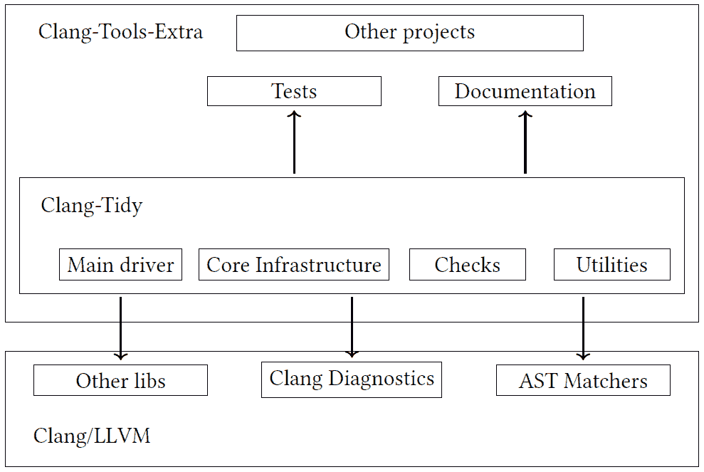
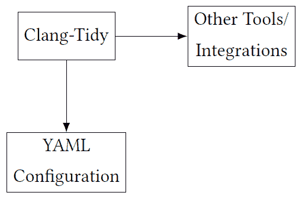

# 5

# Clang-Tidy Linter 框架

本章介绍了 Clang-Tidy，这是一个基于 clang 的代码检查框架，它利用 **抽象语法树**（**AST**）来识别 C/C++/Objective-C 代码中的反模式。首先，我们将讨论 Clang-Tidy 的功能、它提供的检查类型以及如何使用它们。之后，我们将深入探讨 Clang-Tidy 的架构，并探讨如何创建我们自己的自定义 lint 检查。在本章中，我们将涵盖以下主题：

+   Clang-Tidy 概述，包括对默认提供的不同检查的简要描述

+   Clang-Tidy 的内部设计

+   如何创建自定义的 Clang-Tidy 检查

## 5.1 技术要求

本章的源代码位于本书 GitHub 存储库的 `chapter5` 文件夹中：[`github.com/PacktPublishing/Clang-Compiler-Frontend-Packt/tree/main/chapter5`](https://github.com/PacktPublishing/Clang-Compiler-Frontend-Packt/tree/main/chapter5)。

## 5.2 Clang-Tidy 概述和用法示例

Clang-Tidy 是 C 和 C++ 代码的代码检查器和静态分析工具。它是 Clang 和 LLVM 项目的一部分。该工具建立在 Clang 前端之上，这意味着它能够深入理解你的代码，从而具有捕捉广泛问题的能力。

以下是一些关于 Clang-Tidy 的关键点：

+   **检查**：Clang-Tidy 包含一系列“检查”，用于识别各种问题或提出改进建议。这些检查涵盖了从性能改进和潜在错误到编码风格和现代 C++ 最佳实践。例如，它可能会建议在某些情况下使用 `emplace_back` 而不是 `push_back`，或者识别你可能会意外使用整数溢出的区域。

+   **可扩展性**：可以向 Clang-Tidy 添加新的检查，使其成为一个高度可扩展的工具。如果你有特定的编码指南或实践想要强制执行，你可以为其编写一个检查。

+   **集成**：Clang-Tidy 通常用于 CI/CD 管道中或与开发环境集成。许多 IDE 直接支持 Clang-Tidy 或通过插件支持，因此你可以在编写代码时实时获得代码反馈。

+   **自动修复**：Clang-Tidy 的一个强大功能是它不仅能够识别问题，还能自动修复其中许多问题。这是通过 `-fix` 选项实现的。然而，审查提出的更改是很重要的，因为自动修复可能并不总是完美的。

+   **配置**：你可以使用配置文件或命令行选项来配置 Clang-Tidy 执行的检查。这允许团队强制执行特定的编码标准或优先考虑某些类型的问题。例如，`-checks=’-*,modernize-*’` 命令行选项将禁用所有检查，但不会禁用 modernize 集中的检查。

+   **现代 C++ 最佳实践**：Clang-Tidy 被广泛欣赏的一个特性是它对现代 C++ 习语和最佳实践的重视。它可以指导开发者编写更安全、性能更高、更符合 C++ 习惯的代码。

在掌握关于 Clang-Tidy 的基础知识之后，让我们来看看它是如何构建的。

### 5.2.1 构建 和 测试 Clang-Tidy

我们将使用 Figure 1.4 中指定的基本构建配置，并使用以下 Ninja 命令构建 Clang-Tidy：

```cpp
$ ninja clang-tidy
```

**Figure 5.1**: 使用 Ninja 命令构建 Clang-Tidy

我们可以使用以下命令将 Clang-Tidy 二进制文件安装到指定的 `install` 文件夹：

```cpp
$ ninja install-clang-tidy
```

**Figure 5.2**: 使用 Ninja 命令安装 Clang-Tidy

使用 Figure 1.4 中的构建配置，命令将在 `<...>/llvm-project/install/bin` 文件夹下安装 Clang-Tidy 二进制文件。在这里，`<...>/llvm-project` 指的是克隆 LLVM 代码库的路径（参见 Figure 1.1）。

重要提示

如果您使用具有共享库的构建配置（将 `BUILD_SHARED_LIBS` 标志设置为 `ON`），如 Figure 1.12 所示，那么您可能需要使用 `ninja install` 安装和构建所有工件。

Clang-Tidy 是 Clang-Tools-Extra 的一部分，其测试是 `clang-tools` CMake 目标的一部分。因此，我们可以使用以下命令运行测试：

```cpp
$ ninja check-clang-tools
```

**Figure 5.3**: 使用 Ninja 命令运行 Clang-Tidy 测试

该命令将运行所有 Clang-Tidy 检查的 LIT 测试（参见 *Section** 4.5.2**，LLVM 测试* *框架*），并且还将运行 Clang-Tidy 核心系统的单元测试。您也可以单独运行特定的 LIT 测试；例如，如果我们想运行 `modernize-loop-convert` 检查的 LIT 测试，我们可以使用以下命令：

```cpp
$ cd <...>/llvm-project
$ build/bin/llvm-lit -v \
clang-tools-extra/test/clang-tidy/checkers/modernize/loop-convert-basic.cpp
```

**Figure 5.4**: 测试 modernize-loop-convert clang-tidy 检查

该命令将产生以下输出：

```cpp
-- Testing: 1 tests, 1 workers --
PASS: Clang Tools :: clang-tidy/checkers/modernize/loop-convert-basic.cpp
(1 of 1)

Testing Time: 1.38s
  Passed: 1
```

**Figure 5.5**: cppcoreguidelines-owning-memory clang-tidy 检查的 LIT 测试输出

在构建和测试 Clang-Tidy 之后，现在是我们运行它来测试一些代码示例的时候了。

### 5.2.2 Clang-Tidy 使用方法

要测试 Clang-Tidy，我们将使用以下测试程序：

```cpp
1 #include <iostream> 

2 #include <vector> 

3  

4 int main() { 

5   std::vector<int> numbers = {1, 2, 3, 4, 5}; 

6   for (std::vector<int>::iterator it = numbers.begin(); it != numbers.end(); 

7        ++it) { 

8     std::cout << *it << std::endl; 

9   } 

10   return 0; 

11 }
```

**Figure 5.6**: Clang-Tidy 测试程序：loop-convert.cpp

程序是按照旧的 C++ 代码风格正确编写的，即 C++11 之前。Clang-Tidy 有一些检查，鼓励采用现代 C++ 代码风格并使用最新 C++ 标准中可用的新的 C++ 习惯用法。这些检查可以按照以下方式在程序上运行：

```cpp
1$ <...>/llvm-project/install/bin/clang-tidy \ 

2   -checks=’-*,modernize-*’               \ 

3   loop-convert.cpp                       \ 

4   -- -std=c++17
```

**Figure 5.7**: 在 loop-convert.cpp 上运行 Clang-Tidy 现代化检查

Figure 5.7 中的最重要的部分如下：

+   *Line 1*: 这里指定了 Clang-Tidy 二进制文件的路径。

+   *Line 2*: 我们使用 `’`-*`’` 选项删除所有检查。然后，我们通过使用 `’`-*modernize-*`’` 作为 `’`--checks`’` 参数的值来启用所有以 `’`modernize`’` 前缀的检查。

+   *Line 3*: 我们指定要测试的代码的路径。

+   *Line 4*: 我们向编译器传递额外的参数，特别是指定我们希望编译器使用 C++17 作为 C++ 标准。

程序的输出将如下所示：

```cpp
loop-convert.cpp:4:5: warning: use a trailing return type for this function
...
    4 | int main() {
      | ~~~ ^
      | auto       -> int
loop-convert.cpp:6:3: warning: use range-based for loop instead
[modernize-loop-convert]
    6 |   for (std::vector<int>::iterator it = numbers.begin();
          it != numbers.end();
      |   ^   ~~~~~~~~~~~~~~~~~~~~~~~~~~~~~
              ~~~~~~~~~~~~~~~~~~~~~~~~~~~~~~~~~~~~~~~~~
      |       (int & number : numbers)
    7 |        ++it) {
      |        ~~~~~
    8 |     std::cout << *it << std::endl;
      |                  ~~~
      |                  number
loop-convert.cpp:6:8: warning: use auto when declaring iterators
[modernize-use-auto]
    6 |   for (std::vector<int>::iterator it = numbers.begin();
          it != numbers.end();
```

```cpp
      |        ^
note: this fix will not be applied because it overlaps with another fix

```

**图 5.8**：在 loop-convert.cpp 上运行 Clang-Tidy 的输出

如我们所见，检测到几个问题，Clang-Tidy 建议了一些修复。不幸的是，其中一些相互冲突，特别是`modernize-loop-convert`和`modernize-use-auto`，不能一起应用。另一方面，我们可以通过仅运行此特定检查来应用`modernize-loop-convert`建议的修复，以避免任何冲突，如下所示：

```cpp
1$ <...>/llvm-project/install/bin/clang-tidy \ 

2   -checks=’-*,modernize-loop-convert’    \ 

3   -fix                                  \ 

4   loop-convert.cpp                       \ 

5   -- -std=c++17
```

**图 5.9**：在 loop-convert.cpp 上运行 modernize-loop-convert 检查

如我们所见，与图 5.7 相比，第二行已更改，并添加了另一行（3）。后者指示 Clang-Tidy 应用检查建议的修复。结果代码可以在原始文件中找到：

```cpp
1 #include <iostream> 

2 #include <vector> 

3  

4 int main() { 

5   std::vector<int> numbers = {1, 2, 3, 4, 5}; 

6   for (int & number : numbers) { 

7     std::cout << number << std::endl; 

8   } 

9   return 0; 

10 }
```

**图 5.10**：Clang-Tidy 的修复测试程序：loop-convert.cpp

如我们所见，与图 5.6 中的原始代码相比，*第 6 行*和*第 7 行*已更改。这种功能使 Clang-Tidy 成为一个强大的工具，它不仅可以检测问题，还可以修复它们。我们将在稍后的*第 7.3 节*中更深入地探讨这种可能性，即 Clang-Tidy 作为代码修改工具。

### 5.2.3 Clang-Tidy 检查

Clang-Tidy 拥有多种检查，这些检查被分组到不同的类别中。以下是一些主要类别的简要列表，包括每个类别中的一个示例检查和简要描述：

1.  **boost-***:

    +   `boost-use-to-string`: 建议将`boost::lexical_cast<std::string>`替换为`boost::to_string`

1.  **bugprone-***:

    +   `bugprone-integer-division`: 当在浮点上下文中进行整数除法可能导致意外精度损失时发出警告

1.  **cert-***（与 CERT C++安全编码标准相关的检查）:

    +   `cert-dcl03-c`: 确保宏不在不安全上下文中使用

1.  **cppcoreguidelines-***（来自 C++核心指南的检查）:

    +   `cppcoreguidelines-slicing`: 在切片（对象切片，即派生对象被赋值给基对象，切掉派生部分）时发出警告

1.  **google-***（谷歌编码规范）:

    +   `google-build-using-namespace`: 标记使用 using 指令的标志

1.  **llvm-***（LLVM 编码规范）:

    +   `llvm-namespace-comment`: 确保命名空间有结尾注释

1.  **misc-***（杂项检查）:

    +   `misc-unused-parameters`: 标记未使用的参数

1.  **modernize-***（C++现代化检查）:

    +   `modernize-use-auto`: 建议在适当的情况下使用`auto`进行变量声明

1.  **performance-***:

    +   `performance-faster-string-find`: 建议使用更快的字符串搜索替代方案

1.  **readability-***:

    +   `readability-identifier-naming`: 确保一致的标识符命名

这个列表只是可用检查子集的一个表示。每个类别都包含多个检查，工具中还有其他类别。要获取检查的完整、最新列表及其详细描述，请参阅官方 Clang-Tidy 文档 [17] 或在您的系统上使用 `clang-tidy -list-checks` 命令。

在学习如何构建和使用 clang-tidy 之后，现在是时候深入了解并检查其内部设计。

## 5.3 Clang-Tidy 的内部设计

Clang-Tidy 是建立在 Clang 之上的。在其核心，Clang-Tidy 利用 Clang 解析和分析源代码到 AST 的能力。Clang-Tidy 中的每个检查本质上都涉及定义与这个 AST 匹配的模式或条件。当找到匹配时，可以引发诊断，在许多情况下，还可以建议自动修复。该工具基于针对特定问题或编码风格的单个“检查”操作。检查作为插件实现，使 Clang-Tidy 具有可扩展性。`ASTMatchers` 库通过提供用于查询 AST 的领域特定语言来简化这些检查的编写；有关更多信息，请参阅 *第 3.5 节* 中的 AST 匹配器和官方文档 [16]。这确保了检查既简洁又表达力强。Clang-Tidy 还支持使用编译数据库分析代码库，该数据库提供编译标志等上下文信息（有关更多信息，请参阅 *第九章* 附录 1：编译数据库）。这种与 Clang 内部功能的综合集成使 Clang-Tidy 成为一个功能强大的静态分析工具，具有精确的代码转换能力。

### 5.3.1 内部组织

由于与 Clang 库的深度集成，clang-tidy 在 Clang 代码库中的内部组织可能很复杂，但从高层次来看，其组织可以分解如下：

1.  **源代码和头文件**：`clang-tidy` 的主要源代码和头文件位于 `clang-tools-extra` 仓库中，具体位于 `clang-tidy` 目录下。

1.  **主要驱动程序**：位于 `tool` 子文件夹中的 `ClangTidyMain.cpp` 文件是 Clang-Tidy 工具的主要驱动程序。

1.  **核心基础设施**：例如 `ClangTidy.cpp` 和 `ClangTidy.h` 这样的文件管理着核心功能和选项。

1.  **检查**：检查根据类别（例如，`bugprone` 或 `modernize`）组织到子目录中。

1.  **实用工具**：`utils` 目录包含实用类和函数。

1.  **AST 匹配器**：我们之前在 *第 3.5 节* 中探讨的 `ASTMatchers` 库，AST 匹配器，对于查询 AST 是至关重要的。

1.  **Clang 诊断**：Clang-Tidy 主动使用 Clang 诊断子系统来打印诊断消息和建议修复（请参阅 *第 4.4.2 节* 中的诊断支持）。

1.  **测试**：测试位于 `test` 目录中，并使用 LLVM 的 LIT 框架（见*第 4.5.2 节*，LLVM 测试框架）。值得注意的是，测试文件夹与 `clang-tools-extra` 文件夹内的其他项目共享。

1.  **文档**：`docs` 目录包含 Clang-Tidy 的文档。与测试一样，文档也是 `clang-tools-extra` 文件夹内其他项目的一部分。

这些关系在以下图中以示意图的形式展示：



**图 5.11**：Clang-Tidy 的内部组织

现在我们已经了解了 Clang-Tidy 的内部结构和它与 Clang/LLVM 其他部分的关系，是时候探索 Clang-Tidy 二进制文件外部的组件了：它的配置和其他利用 Clang-Tidy 提供的功能的工具。

### 5.3.2 配置和集成

Clang-Tidy 二进制文件可以与其他组件交互，如图 5.12 所示。



**图 5.12**：Clang-Tidy 的外部组件：配置和集成

Clang-Tidy 可以无缝集成到各种 **集成开发环境**（**IDEs**），如 Visual Studio Code、CLion 和 Eclipse，以在编码时提供实时反馈。我们将在*第 8.5.2 节*中探讨这种可能性，即 Clang-Tidy。

它还可以集成到构建系统，如 CMake 和 Bazel，以在构建期间运行检查。**持续集成**（**CI**）平台，如 Jenkins 和 GitHub Actions，通常使用 Clang-Tidy 来确保拉取请求的代码质量。代码审查平台，如 Phabricator，利用 Clang-Tidy 进行自动审查。此外，自定义脚本和静态分析平台可以利用 Clang-Tidy 的功能来实现定制工作流程和组合分析。

Clang-Tidy 在图 5.12 中显示的另一个重要部分是其配置。让我们详细探讨一下。

#### Clang-Tidy 配置

Clang-Tidy 使用配置文件来指定要运行的检查以及为这些检查设置选项。此配置是通过 `.clang-tidy` 文件完成的。

`.clang-tidy` 文件是用 YAML 格式编写的。它通常包含两个主要键：`Checks` 和 `CheckOptions`。

我们将从 `Checks` 键开始，该键允许我们指定要启用或禁用的检查：

+   使用 - 来禁用一个检查

+   使用 * 作为通配符来匹配多个检查

+   检查项用逗号分隔

这里有一个例子：

```cpp
1  Checks: ’-*,modernize-*’
```

**图 5.13**：.clang-tidy 配置文件的 Checks 键

下一个键是 `CheckOptions`。此键允许我们为特定的检查设置选项，每个选项指定为一个键值对。这里提供了一个示例：

```cpp
1CheckOptions: 

2   - key: readability-identifier-naming.NamespaceCase 

3    value: CamelCase 

4   - key: readability-identifier-naming.ClassCase 

5    value: CamelCase
```

**图 5.14**：.clang-tidy 配置文件的 CheckOptions 键

当运行 Clang-Tidy 时，它会在正在处理的文件及其父目录中搜索`.clang-tidy`文件。当找到文件时，搜索停止。

现在我们已经了解了 Clang-Tidy 的内部设计，是时候根据我们从本书的这些章节和前几章中获得的信息创建我们的第一个自定义 Clang-Tidy 检查了。

## 5.4 自定义 Clang-Tidy 检查

在本章的这一部分，我们将把我们的插件示例（见*第 4.6 节**，Clang 插件项目*）转换为一个 Clang-Tidy 检查。此检查将根据类包含的方法数量估计 C++ 类的复杂性。我们将定义一个阈值作为检查的参数。

Clang-Tidy 提供了一个旨在帮助创建检查的工具。让我们首先为我们的检查创建一个骨架。

### 5.4.1 为检查创建骨架

Clang-Tidy 提供了一个特定的 Python 脚本，`add_new_check.py`，以帮助创建新的检查。此脚本位于`clang-tools-extra/clang-tidy`目录中。脚本需要两个位置参数：

+   `module`：这指的是新 tidy 检查将被放置的模块目录。在我们的情况下，这将是在`misc`。

+   `check`：这是要添加的新 tidy 检查的名称。为了我们的目的，我们将将其命名为`classchecker`。

在`llvm-project`目录（其中包含克隆的 LLVM 仓库）中运行脚本，我们得到以下输出：

```cpp
$ ./clang-tools-extra/clang-tidy/add_new_check.py misc classchecker
...
Updating ./clang-tools-extra/clang-tidy/misc/CMakeLists.txt...
Creating ./clang-tools-extra/clang-tidy/misc/ClasscheckerCheck.h...
Creating ./clang-tools-extra/clang-tidy/misc/ClasscheckerCheck.cpp...
Updating ./clang-tools-extra/clang-tidy/misc/MiscTidyModule.cpp...
Updating clang-tools-extra/docs/ReleaseNotes.rst...
Creating clang-tools-extra/test/clang-tidy/checkers/misc/classchecker.cpp...
Creating clang-tools-extra/docs/clang-tidy/checks/misc/classchecker.rst...
Updating clang-tools-extra/docs/clang-tidy/checks/list.rst...
```

```cpp
Done. Now it’s your turn!

```

**图 5.15**：为`misc-classchecker`检查创建骨架

从输出中，我们可以观察到`clang-tools-extra/clang-tidy`目录下的几个文件已被更新。这些文件与检查注册有关，例如`misc/MiscTidyModule.cpp`，或与构建配置有关，例如`misc/CMakeLists.txt`。脚本还生成了几个新文件，我们需要修改这些文件以实现我们检查所需的功能：

+   `misc/ClasscheckerCheck.h`：这是我们的检查的头文件

+   `misc/ClasscheckerCheck.cpp`：此文件将包含我们检查的实现

此外，脚本还为我们检查生成了一个 LIT 测试，命名为`ClassChecker.cpp`。此测试可以在`clang-tools-extra/test/clang-tidy/checkers/misc`目录中找到。

除了源文件外，脚本还修改了`clang-tools-extra/docs`目录中的某些文档文件：

+   `ReleaseNotes.rst`：此文件包含带有我们新检查占位符的更新版发布说明

+   `clang-tidy/checks/misc/classchecker.rst`：这是我们的检查的主要文档

+   `clang-tidy/checks/list.rst`：检查列表已更新，包括我们新的检查以及其他来自`misc`模块的检查。

现在，我们将把注意力转向实现检查和随后的构建过程。

### 5.4.2 Clang-Tidy 检查实现

我们将首先修改`ClasscheckerCheck.cpp`。生成的文件可以在`clang-tools-extra/clang-tidy/misc`目录中找到。让我们用以下代码替换生成的代码（注意：为了简洁，省略了包含许可信息的生成注释）：

```cpp
1 #include "ClasscheckerCheck.h" 

2 #include "clang/AST/ASTContext.h" 

3 #include "clang/ASTMatchers/ASTMatchFinder.h" 

4 using namespace clang::ast_matchers; 

5  

6 namespace clang::tidy::misc { 

7 void ClasscheckerCheck::registerMatchers(MatchFinder *Finder) { 

8     // Match every C++ class. 

9     Finder->addMatcher(cxxRecordDecl().bind("class"), this); 

10 } 

11 void ClasscheckerCheck::check(const MatchFinder::MatchResult &Result) { 

12     const auto *ClassDecl = Result.Nodes.getNodeAs<CXXRecordDecl>("class"); 

13     if (!ClassDecl || !ClassDecl->isThisDeclarationADefinition()) 

14         return; 

15     unsigned MethodCount = 0; 

16     for (const auto *D : ClassDecl->decls()) { 

17         if (isa<CXXMethodDecl>(D)) 

18             MethodCount++; 

19     } 

20     unsigned Threshold = Options.get("Threshold", 5); 

21     if (MethodCount > Threshold) { 

22         diag(ClassDecl->getLocation(), 

23              "class %0 is too complex: method count = %1", 

24              DiagnosticIDs::Warning) 

25             << ClassDecl->getName() << MethodCount; 

26     } 

27 } 

28 } // namespace clang::tidy::misc
```

**图 5.16**：对 ClasscheckerCheck.cpp 的修改

我们用*第 15-35 行*替换了原始的占位符以实现必要的更改。

要将我们的检查集成到 Clang-Tidy 二进制文件中，我们可以在 LLVM 源树中的`build`目录内执行标准构建过程；参见图 5.2。

我们的检查名称定义在`clang-tools-extra/clang-tidy/misc`文件夹中修改后的`MiscTidyModule.cpp`文件中：

```cpp
40 class MiscModule : public ClangTidyModule { 

41 public: 

42   void addCheckFactories(ClangTidyCheckFactories &CheckFactories) override { 

43     CheckFactories.registerCheck<ClasscheckerCheck>( 

44         "misc-classchecker"); 

45     CheckFactories.registerCheck<ConfusableIdentifierCheck>( 

46         "misc-confusable-identifiers");
```

**图 5.17**：对 MiscTidyModule.cpp 的修改

如图 5.17 所示（*第 43-44 行*），我们在名称为`"``misc``-``classchecker``"`下注册了新的检查。代码修改后，我们就可以重新编译 Clang-Tidy 了

```cpp
$ ninja install
```

我们可以通过以下方式执行 Clang-Tidy 并使用`-list-checks`参数来验证检查是否已添加：

```cpp
<...>/llvm-project/install/bin/clang-tidy -checks ’*’ -list-checks
...
    misc-classchecker
...
```

**图 5.18**：Clang-Tidy `-list-checks`选项

值得注意的是，我们使用`-checks '*’`命令行选项启用了所有检查，如图 5.18 所示。

要测试这个检查，我们可以使用图 4.39 中看到的 clang 插件项目中的文件：

```cpp
1 class Simple { 

2 public: 

3   void func1() {} 

4   void func2() {} 

5   void func3() {} 

6 };
```

**图 5.19**：misc-classchecker clang-tidy 检查的测试文件：test.cpp

此文件包含三个方法。要触发警告，我们必须将阈值设置为 2，如下所示：

```cpp
1$ <...>/llvm-project/install/bin/clang-tidy                           \ 

2   -checks=’-*,misc-classchecker’                                      \ 

3   -config="{CheckOptions: [{key:misc-classchecker.Threshold, value:’2’}]}"\ 

4   test.cpp                                                           \ 

5   -- -std=c++17
```

**图 5.20**：在测试文件 test.cpp 上运行 misc-classchecker 检查

输出将如下所示：

```cpp
test.cpp:1:7: warning: class Simple is too complex: method count = 3
[misc-classchecker]
class Simple {
      ^
```

**图 5.21**：对 test.cpp 测试文件的 misc-classchecker 检查输出

在使用自定义源代码测试文件后，是时候为我们的检查创建一个 LIT 测试了。

### 5.4.3 LIT 测试

对于 LIT 测试，我们将使用图 4.43 中略微修改的代码。让我们按照以下方式修改位于`clang-tools-extra/test/clang-tidy/checkers/misc`文件夹中的`classchecker.cpp`：

```cpp
1 // RUN: %check_clang_tidy %s misc-classchecker %t 

2  

3 class Simple { 

4 public: 

5   void func1() {} 

6   void func2() {} 

7 }; 

8  

9 // CHECK-MESSAGES: :[[LINE+1]]:{{[0-9]+}}: warning: class Complex is too complex: method count = 6 [misc-classchecker] 

10 class Complex { 

11 public: 

12   void func1() {} 

13   void func2() {} 

14   void func3() {} 

15   void func4() {} 

16   void func5() {} 

17   void func6() {} 

18 };
```

**图 5.22**：LIT 测试：classchecker.cpp

如我们所见，与图 4.43 相比，唯一的区别在于*第 1 行*，我们指定了应该运行哪些命令，以及在*第 9 行*定义了测试模式。

我们可以按照以下方式运行测试：

```cpp
$ cd <...>/llvm-project
$ build/bin/llvm-lit -v \
  clang-tools-extra/test/clang-tidy/checkers/misc/classchecker.cpp
```

**图 5.23**：测试 misc-classchecker clang-tidy 检查

命令将产生以下输出：

```cpp
-- Testing: 1 tests, 1 workers --
PASS: Clang Tools :: clang-tidy/checkers/misc/classchecker.cpp (1 of 1)

Testing Time: 0.12s
  Passed: 1
```

**图 5.24**：测试 misc-classchecker 的输出

我们还可以使用图 5.3 中显示的命令来运行所有 clang-tidy 检查，包括我们新添加的检查。

当我们在真实代码库上运行检查，而不是合成测试时，我们可能会遇到意外结果。在*第 3.7 节**，错误情况下的 AST 处理*中已经讨论了一个这样的问题，并涉及到编译错误对 Clang-Tidy 结果的影响。让我们通过一个具体的例子深入研究这个问题。

### 5.4.4 编译错误情况下的结果

Clang-Tidy 使用 AST 作为检查的信息提供者，如果信息源损坏，检查可能会产生错误的结果。一个典型的情况是当分析代码有编译错误时（见*第 3.7 节**，错误情况下的 AST 处理）。

考虑以下代码作为示例：

```cpp
1 class MyClass { 

2 public: 

3   void doSomething(); 

4 }; 

5  

6 void MyClass::doSometing() {}
```

**图 5.25**：包含编译错误的测试文件：error.cpp

在这个例子中，我们在*第 6 行*中犯了一个语法错误：方法名错误地写成’doSometing’而不是’doSomet**h**ing’。如果我们不带任何参数运行我们的检查，我们将收到以下输出：

```cpp
error.cpp:1:7: warning: class MyClass is too complex: method count = 7
[misc-classchecker]
class MyClass {
      ^
error.cpp:6:15: error: out-of-line definition of ’doSometing’ ...
[clang-diagnostic-error]
void MyClass::doSometing() {}
              ^~~~~~~~~~
              doSomething
error.cpp:3:8: note: ’doSomething’ declared here
  void doSomething();
       ^
Found compiler error(s).
```

**图 5.26**：在包含编译错误的文件上运行 misc-classchecker 检查

我们的检查似乎与这段代码不正确地工作。它假设类有七个方法，而实际上只有一个。

编译错误的案例可以被视为边缘情况，并且我们可以正确地处理它。在处理这些情况之前，我们应该调查生成的 AST 以检查问题。

### 5.4.5 编译错误作为边缘情况

让我们使用`clang-query`（见*第 3.6 节**，使用*clang-query*探索 Clang AST）来探索 AST 发生了什么。修复错误的程序如下所示：

```cpp
1 class MyClass { 

2 public: 

3   void doSomething(); 

4 }; 

5  

6 void MyClass::doSomething() {}
```

**图 5.27**：修复了编译错误的 noerror.cpp 测试文件

可以按照以下方式在文件上运行`clang-query`命令：

```cpp
$ <...>/llvm-project/install/bin/clang-query noerror.cpp -- --std=c++17
```

**图 5.28**：在修复了编译错误的 noerror.cpp 文件上运行 Clang-Query

然后，我们将 Clang-Query 的输出设置为`dump`并找到所有`CXXRecordDecl`的匹配项

```cpp
clang-query> set output dump
clang-query> match cxxRecordDecl()
```

**图 5.29**：设置 Clang-Query 输出并运行匹配器

结果如下所示

```cpp
Match #1:

Binding for "root":
CXXRecordDecl ... <noerror.cpp:1:1, line:4:1> line:1:7 class MyClass
definition
|-DefinitionData ...
| |-DefaultConstructor exists trivial ...
| |-CopyConstructor simple trivial ...
| |-MoveConstructor exists simple trivial ...
| |-CopyAssignment simple trivial ...
| |-MoveAssignment exists simple trivial ...
| ‘-Destructor simple irrelevant trivial ...
|-CXXRecordDecl ... <col:1, col:7> col:7 implicit class MyClass
|-AccessSpecDecl ... <line:2:1, col:7> col:1 public
‘-CXXMethodDecl ... <line:3:3, col:20> col:8 doSomething ’void ()’
...
```

**图 5.30**：修复了编译错误的 noerror.cpp 文件的 AST

将它与有错误的代码的输出进行比较（见图 5.25）。我们在 error.cpp 文件上运行 Clang-Query 并设置所需的匹配器如下

```cpp
$ <...>/llvm-project/install/bin/clang-query error.cpp -- --std=c++17
clang-query> set output dump
clang-query> match cxxRecordDecl()
```

**图 5.31**：在 error.cpp 上运行 Clang-Query

找到的匹配项如下所示：

```cpp
CXXRecordDecl ... <error.cpp:1:1, line:4:1> line:1:7 class MyClass
definition
|-DefinitionData ...
| |-DefaultConstructor exists trivial ...
| |-CopyConstructor simple trivial ..
| |-MoveConstructor exists simple trivial
| |-CopyAssignment simple trivial ...
| |-MoveAssignment exists simple trivial
| ‘-Destructor simple irrelevant trivial
|-CXXRecordDecl ... <col:1, col:7> col:7 implicit class MyClass
|-AccessSpecDecl ... <line:2:1, col:7> col:1 public
|-CXXMethodDecl ... <line:3:3, col:20> col:8 doSomething ’void ()’
|-CXXConstructorDecl ... <line:1:7> col:7 implicit constexpr MyClass
’void ()’ ...
|-CXXConstructorDecl ... <col:7> col:7 implicit constexpr MyClass
’void (const MyClass &)’ ...
| ‘-ParmVarDecl ... <col:7> col:7 ’const MyClass &’
|-CXXMethodDecl ... <col:7> col:7 implicit constexpr operator= ’MyClass
&(const MyClass &)’ inline default trivial ...
| ‘-ParmVarDecl ... <col:7> col:7 ’const MyClass &’
|-CXXConstructorDecl ... <col:7> col:7 implicit constexpr MyClass ’void
(MyClass &&)’ ...
| ‘-ParmVarDecl ... <col:7> col:7 ’MyClass &&’
|-CXXMethodDecl ... <col:7> col:7 implicit constexpr operator= ’MyClass
&(MyClass &&)’ ...
| ‘-ParmVarDecl ... <col:7> col:7 ’MyClass &&’

‘-CXXDestructorDecl ... <col:7> col:7 implicit ~MyClass ’void ()’ inline
default ...
...

```

**图 5.32**：包含编译错误的 error.cpp 文件的 AST

如我们所见，所有额外的方法都是隐式添加的。我们可以通过修改*第 30 行*（见图 5.16）来排除它们，如下所示：

```cpp
29     for (const auto *D : ClassDecl->decls()) { 

30       if (isa<CXXMethodDecl>(D) && !D->isImplicit()) 

31             MethodCount++; 

32     }
```

**图 5.33**：从检查报告中排除隐式声明

如果我们在包含编译错误的文件上运行修改后的检查，我们将得到以下输出：

```cpp
error.cpp:6:15: error: out-of-line definition of ’doSometing’ ...
[clang-diagnostic-error]
void MyClass::doSometing() {}
              ^~~~~~~~~~
              doSomething
error.cpp:3:8: note: ’doSomething’ declared here
  void doSomething();
       ^
Found compiler error(s).
```

**图 5.34**：在包含编译错误的文件上运行修复后的 misc-classchecker 检查

如我们所见，编译器错误被报告了，但我们的检查没有触发任何警告。

尽管我们正确处理了不寻常的 clang-tidy 结果，但值得注意的是，并非每个编译错误都能被正确处理。如*第 3.7 节*中所述，“错误情况下处理 AST”，Clang 编译器即使在遇到编译错误时也会尝试生成 AST。这种做法是因为它被设计为供 IDE 和其他工具使用，即使存在错误，也能尽可能多地提供信息。然而，这种 AST 的“错误恢复”模式可能会产生 Clang-Tidy 可能没有预料到的结构。因此，我们应该遵守以下规则：

小贴士

在运行 Clang-Tidy 和其他 Clang 工具之前，始终确保你的代码没有错误。这保证了 AST 既准确又完整。

## 5.5 摘要

在本章中，我们深入探讨了 Clang-Tidy，这是一个用于代码分析的强大工具。我们研究了其配置、执行和内部架构。此外，我们还开发了一个定制的 Clang-Tidy 检查来评估类复杂性。我们的检查使用了基本的 AST 匹配器，类似于 AST 中的正则表达式。对于复杂性的确定，我们采用了简单的方法。更复杂的度量，如圈复杂度，需要像**控制流图（CFGs**）这样的工具。冒险将在下一章继续，我们将深入探讨使用 CFG 设计复杂检查。

## 5.6 进一步阅读

+   Clang-Tidy 额外 Clang 工具文档：[`clang.llvm.org/extra/clang-tidy/`](https://clang.llvm.org/extra/clang-tidy/)

+   AST 匹配器参考：[`clang.llvm.org/docs/LibASTMatchersReference.html`](https://clang.llvm.org/docs/LibASTMatchersReference.html)
