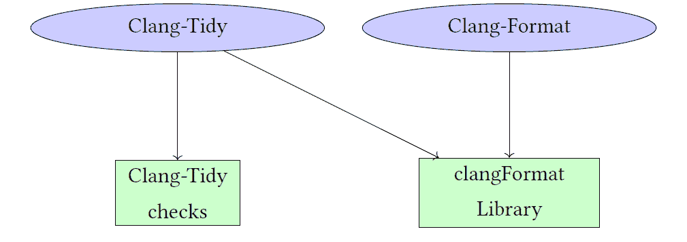

# 7

# 重构工具

Clang 因其提供代码修复建议的能力而闻名。例如，如果你遗漏了分号，Clang 会建议你插入它。修改源代码的能力不仅限于编译过程，而且在各种代码修改工具中得到了广泛应用，尤其是在重构工具中。提供修复的能力是扩展 lint 框架功能的一个强大特性，例如 Clang-Tidy，它不仅能够检测问题，还能提供修复建议。

在本章中，我们将探讨重构工具。我们将从讨论用于代码修改的基本类开始，特别是 `clang``::``Rewriter`。我们将使用 Rewriter 构建一个自定义的重构工具，该工具可以更改类中的方法名。在章节的后面部分，我们将使用 Clang-Tidy 重新实现该工具，并深入研究 `clang``::``FixItHint`，这是 Clang 诊断子系统的一个组件，Clang-Tidy 和 Clang 编译器都使用它来修改源代码。

为了结束本章，我们将介绍一个关键的 Clang 工具，称为 Clang-Format。这个工具被广泛用于代码格式化。我们将探讨该工具提供的功能，深入研究其设计，并理解其开发过程中做出的具体设计决策背后的原因。

本章涵盖了以下主题：

+   如何创建自定义的 Clang 代码重构工具

+   如何将代码修改集成到 Clang-Tidy 检查中

+   Clang-Format 概述及其如何与 Clang-Tidy 集成

## 7.1 技术要求

本章的源代码位于本书 GitHub 仓库的 `chapter7` 文件夹中：[`github.com/PacktPublishing/Clang-Compiler-Frontend-Packt/tree/main/chapter7`](https://github.com/PacktPublishing/Clang-Compiler-Frontend-Packt/tree/main/chapter7)。

## 7.2 自定义代码修改工具

我们将创建一个 Clang 工具，帮助我们为用于单元测试的类重命名方法。我们将从对 `clang``::``Rewriter` 类的描述开始——这是用于代码修改的基本类。

### 7.2.1 Clang 中的代码修改支持

`clang``::``Rewriter` 是一个 Clang 库类，它简化了在翻译单元内进行源代码重写操作。它提供了在源代码的**抽象语法树**（AST）中插入、删除和替换代码的方法。开发者可以使用 `clang``::``Rewriter` 进行复杂的代码修改，例如重构或生成新的代码结构。它可以应用于代码生成和代码重构任务，使其在多种代码转换目的上具有多功能性。

该类有几个用于文本插入的方法；例如，`clang``::``Rewriter` `::``InsertText`在指定的源位置插入文本，而`clang` `::``SourceLocation`用于指定缓冲区中的确切位置，见*第 4.4.1 节**，*源管理器和源位置*。除了文本插入外，您还可以使用`clang``::``Rewriter``::``RemoveText`删除文本，或使用`clang``::``Rewriter``::``ReplaceText`用新文本替换文本。后两种使用源范围（`clang``::``SourceRange`）来指定要删除或替换的文本位置。

`clang``::``Rewriter`使用`clang``::``SourceManager`，如*第 4.4.1 节**，源管理器和源位置*中所述，来访问需要修改的源代码。让我们看看 Rewriter 如何在实际项目中使用。

### 7.2.2 测试类

假设我们有一个用于测试的类。类的名称以“Test”前缀开头（例如，`TestClass`），但类的公共方法没有“test_”前缀。例如，该类有一个名为’pos’的公共方法（`TestClass``::``pos`），而不是’test_pos’（`TestClass``::``test_pos``()）。我们想要创建一个工具，为类方法添加这样的前缀。

```cpp
1 class TestClass { 

2 public: 

3   TestClass(){}; 

4   void pos(){}; 

5  

6 private: 

7   void private_pos(){}; 

8 };
```

**原始代码**

**```cpp
1 class TestClass { 

2 public: 

3   TestClass(){}; 

4   void test_pos(){}; 

5  

6 private: 

7   void private_pos(){}; 

8 };
```

**修改后的代码**

****图 7.1**: TestClass 的代码转换

因此，我们希望将方法`TestClass``::``pos`（见图 7.1）在类声明中替换为`TestClass``::``test_pos`。

如果我们有调用方法的代码，应进行以下替换：

```cpp
1      TestClass test; 

2       test.pos();
```

**原始代码**

**```cpp
1      TestClass test; 

2       test.test_pos();
```

**修改后的代码**

****图 7.2**: TestClass 的方法调用代码转换

工具还应忽略所有已手动或自动应用了所需修改的公共方法。换句话说，如果一个方法已经有了所需的’test_’前缀，则工具不应修改它。

我们将创建一个名为“methodrename”的 Clang 工具，该工具将执行所有必要的代码修改。这个工具将利用在第*第 3.4 节**，递归 AST 访问者*中讨论的递归 AST 访问者。最关键的部分是实现`Visitor`类。让我们详细地检查它。

### 7.2.3 访问者类实现

我们的`Visitor`类应该处理以下 AST 节点中的特定处理：

+   `clang``::``CXXRecordDecl`：这涉及到处理以“Test”前缀开头的 C++类定义。对于此类，所有用户定义的公共方法都应该以“test_”为前缀。

+   `clang``::``CXXMemberCallExpr`：此外，我们还需要识别所有修改后方法的使用实例，并在类定义中方法重命名后进行相应的更改。

对于`clang``::``CXXRecordDecl`节点的处理如下：

```cpp
10   bool VisitCXXRecordDecl(clang::CXXRecordDecl *Class) { 

11     if (!Class->isClass()) 

12       return true; 

13     if (!Class->isThisDeclarationADefinition()) 

14       return true; 

15     if (!Class->getName().starts_with("Test")) 

16       return true; 

17     for (const clang::CXXMethodDecl *Method : Class->methods()) { 

18       clang::SourceLocation StartLoc = Method->getLocation(); 

19       if (!processMethod(Method, StartLoc, "Renamed method")) 

20         return false; 

21     } 

22     return true; 

23   }
```

**图 7.3**：CXXRecordDecl 访问者实现

图 7.3 中的 *第 11-16 行* 表示我们从检查的节点中需要的条件。例如，相应的类名应以 "Test" 前缀开头（参见 图 7.3 中的 *第 15-16 行*），在那里我们使用了 `llvm::StringRef` 类的 `starts_with()` 方法。

在验证这些条件之后，我们继续检查找到的类中的方法。

验证过程在 `Visitor::processMethod` 方法中实现，其实现如下代码片段：

```cpp
44   bool processMethod(const clang::CXXMethodDecl *Method, 

45                      clang::SourceLocation StartLoc, const char *LogMessage) { 

46     if (Method->getAccess() != clang::AS_public) 

47       return true; 

48     if (llvm::isa<clang::CXXConstructorDecl>(Method)) 

49       return true; 

50     if (!Method->getIdentifier() || Method->getName().starts_with("test_")) 

51       return true; 

52  

53     std::string OldMethodName = Method->getNameAsString(); 

54     std::string NewMethodName = "test_" + OldMethodName; 

55     clang::SourceManager &SM = Context.getSourceManager(); 

56     clang::tooling::Replacement Replace(SM, StartLoc, OldMethodName.length(), 

57                                         NewMethodName); 

58     Replaces.push_back(Replace); 

59     llvm::outs() << LogMessage << ": " << OldMethodName << " to " 

60                  << NewMethodName << "\n"; 

61     return true; 

62   }
```

**图 7.4**：`processMethod` 的实现

图 7.4 中的 *第 46-51 行* 包含了对所需条件的检查。例如，在第 *46-47 行*，我们验证方法是否为公共的。*第 48-49 行* 用于排除构造函数的处理，而 *第 50-51 行* 用于排除已经具有所需前缀的方法。

主要的替换逻辑实现在 *第 53-58 行*。特别是，在第 *56-57 行*，我们创建了一个特殊的 `clang::tooling::Replacement` 对象，它作为所需代码修改的包装器。该对象的参数如下：

1.  `clang::SourceManager`：我们在 *第 55 行* 从 `clang::ASTContext` 获取源管理器。

1.  `clang::SourceLocation`：指定替换的起始位置。位置作为我们 `processMethod` 方法的第二个参数传递，如 *第 45 行* 所见。

1.  `unsigned`：替换文本的长度。

1.  `clang::StringRef`：替换文本，我们在 *第 54 行* 创建。

我们将替换存储在 `Replaces` 对象中，它是我们访问者类的私有成员：

```cpp
40 private: 

41   clang::ASTContext &Context; 

42   std::vector<clang::tooling::Replacement> Replaces;
```

有一个特殊的获取器可以用于在访问者类外部访问对象：

```cpp
36   const std::vector<clang::tooling::Replacement> &getReplacements() { 

37     return Replaces; 

38   }
```

我们在第 *59-60 行使用 `LogMessage` 作为日志消息的前缀记录操作。对于不同的 AST 节点，使用不同的日志消息；例如，对于 `clang::CXXRecordDecl`，我们使用 "Renamed method"（参见 图 7.3，*第 19 行*）。

方法调用将会有不同的日志消息。相应的处理在下面的图中展示。

```cpp
25   bool VisitCXXMemberCallExpr(clang::CXXMemberCallExpr *Call) { 

26     if (clang::CXXMethodDecl *Method = Call->getMethodDecl()) { 

27       clang::CXXRecordDecl *Class = Method->getParent(); 

28       if (!Class->getName().starts_with("Test")) 

29         return true; 

30       clang::SourceLocation StartLoc = Call->getExprLoc(); 

31       return processMethod(Method, StartLoc, "Renamed method call"); 

32     } 

33     return true; 

34   }
```

**图 7.5**：CXXMemberCallExpr 访问者实现

我们在第 *27-29 行验证包含测试方法类的类名以 "Test" 前缀开头。替换源位置在第 *30 行获得。在第 *31 行，我们调用我们的 `processMethod` 函数来处理找到的方法，将 "Renamed method call" 作为日志消息传递给调用。

`Visitor` 在 `Consumer` 类中初始化，这将是我们的下一个目标。

### 7.2.4 Consumer 类实现

`Consumer` 类在 `HandleTranslationUnit` 方法中初始化访问者并开始 AST 遍历。该类可以编写如下：

```cpp
6 class Consumer : public clang::ASTConsumer { 

7 public: 

8   void HandleTranslationUnit(clang::ASTContext &Context) override { 

9     Visitor V(Context); 

10     V.TraverseDecl(Context.getTranslationUnitDecl()); 

11  

12     // Apply the replacements. 

13     clang::Rewriter Rewrite(Context.getSourceManager(), clang::LangOptions()); 

14     auto &Replaces = V.getReplacements(); 

15     for (const auto &Replace : Replaces) { 

16       if (Replace.isApplicable()) { 

17         Replace.apply(Rewrite); 

18       } 

19     } 

20  

21     // Apply the Rewriter changes. 

22     if (Rewrite.overwriteChangedFiles()) { 

23       llvm::errs() << "Error: Cannot apply changes to the file\n"; 

24     } 

25   } 

26 }; 

27 } // namespace methodrename
```

**图 7.6**：Consumer 类实现

我们初始化访问者，并从*第 9-10 行*开始遍历（见图 7.6）。重写器在第 13 行创建，替换在第 14-19 行应用。最后，结果在第 22-24 行存储在原始文件中。

访问者和消费者类被封装在`clangbook::methodrename`命名空间中。消费者实例在 FrontendAction 类中创建。这个类的实现与图 3.8 中详细描述的`RecursiveVisitor`和`DeclVisitor`的实现类似。唯一的区别是，新工具使用了`clangbook::methodrename`命名空间。

### 7.2.5 构建配置和主函数

我们工具的`main`函数与图 3.21 中定义的递归访问者类似：

```cpp
13 int main(int argc, const char **argv) { 

14   llvm::Expected<clang::tooling::CommonOptionsParser> OptionsParser = 

15       clang::tooling::CommonOptionsParser::create(argc, argv, TestCategory); 

16   if (!OptionsParser) { 

17     llvm::errs() << OptionsParser.takeError(); 

18     return 1; 

19   } 

20   clang::tooling::ClangTool Tool(OptionsParser->getCompilations(), 

21                                  OptionsParser->getSourcePathList()); 

22   return Tool.run(clang::tooling::newFrontendActionFactory< 

23                       clangbook::methodrename::FrontendAction>() 

24                       .get()); 

25 }
```

**图 7.7**：'methodrename'测试工具的主函数

如您所见，我们只在第 23 行更改了自定义前端动作的命名空间名称。

构建配置如下：

```cpp
1 cmake_minimum_required(VERSION 3.16) 

2 project("methodrename") 

3  

4 if ( NOT DEFINED ENV{LLVM_HOME}) 

5   message(FATAL_ERROR "$LLVM_HOME is not defined") 

6 else() 

7   message(STATUS "$LLVM_HOME found: $ENV{LLVM_HOME}") 

8   set(LLVM_HOME $ENV{LLVM_HOME} CACHE PATH "Root of LLVM installation") 

9   set(LLVM_LIB ${LLVM_HOME}/lib) 

10   set(LLVM_DIR ${LLVM_LIB}/cmake/llvm) 

11   find_package(LLVM REQUIRED CONFIG) 

12   include_directories(${LLVM_INCLUDE_DIRS}) 

13   link_directories(${LLVM_LIBRARY_DIRS}) 

14   set(SOURCE_FILE MethodRename.cpp) 

15   add_executable(methodrename ${SOURCE_FILE}) 

16   set_target_properties(methodrename PROPERTIES COMPILE_FLAGS "-fno-rtti") 

17   target_link_libraries(methodrename 

18     LLVMSupport 

19     clangAST 

20     clangBasic 

21     clangFrontend 

22     clangSerialization 

23     clangToolingCore 

24     clangRewrite 

25     clangTooling 

26   ) 

27 endif()
```

**图 7.8**：'methodrename'测试工具的构建配置

与图 3.20 中的代码相比，最显著的变化在第 23 和 24 行，我们添加了两个新的库来支持代码修改：`clangToolingCore`和`clangRewrite`。其他更改还包括工具的新名称（第 2 行）和包含主函数的源文件（第 14 行）。

一旦我们完成代码，就是时候构建和运行我们的工具了。

### 7.2.6 运行代码修改工具

程序可以使用与我们在*第 3.3 节**，AST 遍历*中之前使用的相同命令序列进行编译，见图 3.11：

```cpp
export LLVM_HOME=<...>/llvm-project/install
mkdir build
cd build
cmake -G Ninja -DCMAKE_BUILD_TYPE=Debug ...
ninja
```

**图 7.9**：'methodrename'工具的配置和构建命令

我们可以在以下测试文件（`TestClass.cpp`）上运行创建工具：

```cpp
1 class TestClass { 

2 public: 

3   TestClass(){}; 

4   void pos(){}; 

5 }; 

6  

7 int main() { 

8   TestClass test; 

9   test.pos(); 

10   return 0; 

11 }
```

**图 7.10**：原始 TestClass.cpp

我们可以按以下方式运行工具：

```cpp
$ ./methodrename TestClass.cpp -- -std=c++17
Renamed method: pos to test_pos
Renamed method call: pos to test_pos
```

**图 7.11**：在 TestClass.cpp 上运行 methodrename Clang Tool

如我们所见，方法`TestClass::pos`被重命名为`TestClass::test_pos`。方法调用也如以下图所示进行了更新：

```cpp
1 class TestClass { 

2 public: 

3   TestClass(){}; 

4   void test_pos(){}; 

5 }; 

6  

7 int main() { 

8   TestClass test; 

9   test.test_pos(); 

10   return 0; 

11 }
```

**图 7.12**：修改后的 TestClass.cpp

提供的示例演示了 Clang 如何协助创建重构工具。创建的 Clang Tool 使用递归访问者来设置所需的代码转换。另一个可能的选项是使用 Clang-Tidy，我们之前在*第五章**，Clang-Tidy Linter Framework*中进行了调查。让我们更详细地考察这个选项。

## 7.3 Clang-Tidy 作为代码修改工具

我们计划研究`FixItHint`，它是 Clang 诊断子系统的一部分（参见*第 4.4.2 节**，诊断支持*）。`FixItHint`可以与之前探索过的`clang::Rewriter`和`clang::tooling::Replacement`集成，提供用于 Clang-Tidy 等强大工具的高级诊断。

### 7.3.1 FixItHint

`clang::FixItHint`是 Clang 编译器中的一个类，它显著增强了其诊断能力。其主要作用是提供编译器检测到的代码错误或问题的自动修正建议。这些建议被称为“修复”，是 Clang 诊断消息的一部分，旨在指导开发者在他们的代码中解决已识别的问题。

当 Clang 遇到编码错误、警告或风格问题时，它会生成一个`FixItHint`。这个提示包含对源代码更改的具体建议。例如，它可能建议用修正后的版本替换文本片段或在特定位置插入或删除代码。

例如，考虑以下源代码：

```cpp
1 void foo() { 

2   constexpr int a = 0; 

3   constexpr const int *b = &a; 

4 }

```

**图 7.13**: 测试文件 foo.cpp

如果我们对文件进行编译，我们将得到以下错误：

```cpp
$ <...>/llvm-project/install/bin/clang -cc1 -emit-obj foo.cpp -o /tmp/foo.o
foo.cpp:3:24: error: constexpr variable ’b’ must be initialized by a
constant expression
    3 |   constexpr const int *b = &a;
      |                        ^   ~~
foo.cpp:3:24: note: pointer to ’a’ is not a constant expression
foo.cpp:2:17: note: address of non-static constexpr variable ’a’ may differ
on each invocation of the enclosing function; add ’static’ to give it a
constant address
    2 |   constexpr int a = 0;
      |                 ^
      |   static
1  error generated.
```

**图 7.14**: 在 foo.cpp 中生成的编译错误

如您所见，编译器建议为图 7.13 中显示的程序在*第 2 行*添加`static`关键字。

错误由 Clang 使用 FixItHint 对象处理，如图 7.15 所示。如图 7.15 所示，当 Clang 在源代码中检测到问题并生成诊断时，它还可以生成一个`clang::FixItHint`，建议如何修复问题。提示随后由 Clang 诊断子系统处理并显示给用户。

需要强调的是，提示也可以转换为`Replacement`对象，它表示所需的精确文本更改。例如，Clang-Tidy 使用`Replacement`对象作为其`DiagnosticConsumer`类实现中从`FixItHint`获取信息的临时存储，允许将 FixItHint 转换为表示所需精确文本更改的`Replacement`对象。

```cpp
      if (VarD && VarD->isConstexpr()) { 

        // Non-static local constexpr variables have unintuitive semantics: 

        //   constexpr int a = 1; 

        //   constexpr const int *p = &a; 

        // ... is invalid because the address of ’a’ is not constant. Suggest 

        // adding a ’static’ in this case. 

        Info.Note(VarD->getLocation(), diag::note_constexpr_not_static) 

            << VarD 

            << FixItHint::CreateInsertion(VarD->getBeginLoc(), "static ");
```

**图 7.15**: 来自 clang/lib/AST/ExprConstant.cpp 的代码片段

总体而言，`clang::FixItHint`增强了 Clang 的用户友好性和实用性，为开发者提供了提高代码质量和有效解决问题的实用工具。它集成到 Clang 的诊断系统中，体现了编译器不仅关注定位代码问题，还帮助解决这些问题的重点。我们计划在 Clang-Tidy 检查中使用此功能，该检查将重命名测试类中的方法，并将图 7.10 中的代码转换为图 7.12 中的代码。

### 7.3.2 创建项目骨架

让我们为我们的 Clang-Tidy 检查创建项目骨架。我们将我们的检查命名为”methodrename”，它将是”misc”集合的一部分 Clang-Tidy 检查。我们将使用第 5.4.1 节中的命令。

```cpp
$ ./clang-tools-extra/clang-tidy/add_new_check.py misc methodrename
```

**图 7.16**：为 misc-methodrename 检查创建骨架

从图 7.16 中的命令应该在克隆的 LLVM 项目的根目录下运行。我们为`add_new_check.py`脚本指定了两个参数：`misc` – 将包含我们的新检查的检查集，和`methodrename` – 我们检查的名称。

命令将产生以下输出：

```cpp
Updating ./clang-tools-extra/clang-tidy/misc/CMakeLists.txt...
Creating ./clang-tools-extra/clang-tidy/misc/MethodrenameCheck.h...
Creating ./clang-tools-extra/clang-tidy/misc/MethodrenameCheck.cpp...
Updating ./clang-tools-extra/clang-tidy/misc/MiscTidyModule.cpp...
Updating clang-tools-extra/docs/ReleaseNotes.rst...
Creating clang-tools-extra/test/clang-tidy/checkers/misc/methodrename.cpp...
Creating clang-tools-extra/docs/clang-tidy/checks/misc/methodrename.rst...
Updating clang-tools-extra/docs/clang-tidy/checks/list.rst...
Done. Now it’s your turn!
```

**图 7.17**：为 misc-methodrename 检查创建的工件

我们必须修改`./clang-tools-extra/clang-tidy` `/misc`文件夹中的至少两个生成的文件：

1.  `MethodrenameCheck.h`：这是我们的检查的头文件。在这里，我们想要添加一个额外的私有方法`processMethod`，用于检查方法属性并显示诊断信息。

1.  `MethodrenameCheck.cpp`：此文件包含处理逻辑，我们需要实现三个方法：`registerMatchers`、`check`和新增的私有方法`processMethod`。

### 7.3.3 检查实现

我们将从修改头文件开始：

```cpp
27 private: 

28   void processMethod(const clang::CXXMethodDecl *Method, 

29                      clang::SourceLocation StartLoc, const char *LogMessage); 

30 };
```

**图 7.18**：MethodrenameCheck.h 修改

新增的私有方法`MethodrenameCheck::processMethod`具有与我们在 Clang Tool ’methodrename’中较早引入的方法相同的参数，如图 7.4 所示。

我们从我们的检查的`MethodrenameCheck::registerMatchers`方法开始实现，如下所示：

```cpp
26 void MethodrenameCheck::registerMatchers(MatchFinder *Finder) { 

27   auto ClassMatcher = hasAncestor(cxxRecordDecl(matchesName("::Test.*$"))); 

28   auto MethodMatcher = cxxMethodDecl(isNotTestMethod(), ClassMatcher); 

29   auto CallMatcher = cxxMemberCallExpr(callee(MethodMatcher)); 

30   Finder->addMatcher(MethodMatcher.bind("method"), this); 

31   Finder->addMatcher(CallMatcher.bind("call"), this); 

32 }
```

**图 7.19**：registerMatchers 实现

*第 30 行和第 31 行*注册了两个匹配器。第一个是用于方法声明（绑定到”method”标识符），第二个是用于方法调用（绑定到”call”标识符）。

在这里，我们使用在*第 3.5 节**中定义的**领域特定语言（DSL）*，即*AST 匹配器*。`ClassMatcher`指定我们的方法声明必须在以“Test”前缀开头的类内部声明。

方法声明匹配器（`MethodMatcher`）定义在*第 28 行*。它必须在由`ClassMatcher`指定的类内部声明，并且应该是一个测试方法（关于`isNotTestMethod`匹配器的详细信息将在下面描述）。

最后一个匹配器，`CallMatcher`，定义在*第 29 行*，并指定它必须是对满足`MethodMatcher`条件的方法的调用。

`isNotTestMethod`匹配器是一个专门用于检查我们特定条件的匹配器。我们可以使用`AST_MATCHER`和相关宏来定义自己的匹配器。它的实现可以在这里找到：

```cpp

18 AST_MATCHER(CXXMethodDecl, isNotTestMethod) { 

19   if (Node.getAccess() != clang::AS_public) return false; 

20   if (llvm::isa<clang::CXXConstructorDecl>(&Node)) return false; 

21   if (!Node.getIdentifier() || Node.getName().startswith("test_")) return false; 

22  

23   return true; 

24 }
```

**图 7.20**：`isNotTestMethod`匹配器实现

宏有两个参数。第一个参数指定我们想要检查的 AST 节点，在我们的情况下是`clang`::`CXXMethodDecl`。第二个参数是我们想要用于用户定义匹配器的匹配器名称，在我们的情况下是`isNotTestMethod`。

AST 节点可以在宏体中以`Node`变量访问。宏应该返回`true`如果节点符合所需条件。我们使用与我们在图 7.4 中使用的相同条件，用于我们的`methodrename` Clang 工具（*行* *46-51*）。

`MethodrenameCheck`::`check`是我们检查的主要方法，可以如下实现：

```cpp
34 void MethodrenameCheck::check(const MatchFinder::MatchResult &Result) { 

35   if (const auto *Method = Result.Nodes.getNodeAs<CXXMethodDecl>("method")) { 

36     processMethod(Method, Method->getLocation(), "Method"); 

37   } 

38  

39   if (const auto *Call = Result.Nodes.getNodeAs<CXXMemberCallExpr>("call")) { 

40     if (CXXMethodDecl *Method = Call->getMethodDecl()) { 

41       processMethod(Method, Call->getExprLoc(), "Method call"); 

42     } 

43   } 

44 }
```

**图 7.21**：检查实现

代码有两个块。第一个块（*行 35-37*）处理方法声明，最后一个块（*行 39-42*）处理方法调用。两者都调用`MethodrenameCheck` `::` `processMethod`来显示诊断并创建所需的代码修改。

让我们检查它的实现以及如何使用`clang`::`FixItHint`。

```cpp
46 void MethodrenameCheck::processMethod(const clang::CXXMethodDecl *Method, 

47                                       clang::SourceLocation StartLoc, 

48                                       const char *LogMessage) { 

49   diag(StartLoc, "%0 %1 does not have ’test_’ prefix") << LogMessage << Method; 

50   diag(StartLoc, "insert ’test_’", DiagnosticIDs::Note) 

51       << FixItHint::CreateInsertion(StartLoc, "test_"); 

52 }
```

**图 7.22**：processMethod 实现

我们在*行 49*打印关于检测到的问题的诊断信息。*行 50-51*打印有关建议的代码修改的信息性消息，并在*行 51*创建相应的代码替换。要插入文本，我们使用`clang`::`FixItHint`::`CreateInsertion`。我们还以注释的形式显示插入到主要警告中。

一旦所有必要的更改都应用到生成的骨架中，就是时候在测试文件上构建和运行我们的检查了。

### 7.3.4 构建和运行检查

我们假设使用了图 1.12 中的构建配置。因此，我们必须运行以下命令来构建我们的检查：

```cpp
$ ninja clang-tidy
```

我们可以使用以下命令将其安装到`install`文件夹中：

```cpp
$ ninja install
```

我们可以在`TestClass`上如下运行我们的检查，如图 7.10 所示：

```cpp
$ <...>/llvm-project/install/bin/clang-tidy \
             -checks=’-*,misc-methodrename’ \
             ./TestClass.cpp              \
             -- -std=c++17
```

**图 7.23**：在测试文件 TestClass.cpp 上运行的 Clang-Tidy misc-methodrename 检查

命令将产生以下输出：

```cpp
TestClass.cpp:4:8: warning: Method ’pos’ does not have ’test_’ prefix
[misc-methodrename]
  void pos(){};
       ^
TestClass.cpp:4:8: note: insert ’test_’
  void pos(){};
       ^
       test_
TestClass.cpp:9:8: warning: Method call ’pos’ does not have ’test_’ prefix
[misc-methodrename]
  test.pos();
       ^
TestClass.cpp:9:8: note: insert ’test_’
  test.pos();
       ^
       test_
```

**图 7.24**：由 misc-methodrename 检查为 TestClass.cpp 生成的警告

如我们所见，检查正确地检测到两个需要更改方法名的地方并创建了替换。来自图 7.23 的命令不会修改原始源文件。我们必须指定一个额外的参数`-fix-notes`来将指定的插入作为注释应用到原始警告中。所需的命令将如下所示：

```cpp
$ <...>/llvm-project/install/bin/clang-tidy \
             -fix-notes                   \
             -checks=’-*,misc-methodrename’ \
             ./TestClass.cpp              \
             -- -std=c++17
```

**图 7.25**：带有-fix-notes 选项的 Clang-Tidy

命令输出如下：

```cpp
2 warnings generated.
TestClass.cpp:4:8: warning: Method ’pos’ does not have ’test_’ prefix
[misc-methodrename]
  void pos(){};
       ^
TestClassSmall.cpp:4:8: note: FIX-IT applied suggested code changes
TestClass.cpp:4:8: note: insert ’test_’
  void pos(){};
       ^
       test_
TestClass.cpp:9:8: warning: Method call ’pos’ does not have ’test_’ prefix
[misc-methodrename]
  test.pos();
       ^
TestClass.cpp:9:8: note: FIX-IT applied suggested code changes
TestClass.cpp:9:8: note: insert ’test_’
```

```cpp
  test.pos();
       ^
       test_
clang-tidy applied 2 of 2 suggested fixes.
```

**图 7.26**：Clang-Tidy 对 TestClass.cpp 应用的修复

如我们所见，所需的插入已在此处应用。Clang-Tidy 具有强大的工具来控制应用的修复，并且可以被认为是代码修改的重要资源。另一个用于代码修改的流行工具是 Clang-Format。正如其名所示，该工具专门用于代码格式化。让我们详细探讨它。

## 7.4 代码修改和 Clang-Format

Clang-Format 是 Clang/LLVM 项目中的一个重要工具，旨在格式化 C、C++、Java、JavaScript、Objective-C 或 Protobuf 代码。它在 Clang 工具生态系统扮演着关键角色，提供了解析、分析和操作源代码的能力。

Clang-Format 是 Clang 的一部分，如果已经构建并安装了 Clang 编译器，则必须安装它。让我们看看它是如何使用的。

### 7.4.1 Clang-Format 配置和使用示例

Clang-Format 使用 `.clang-format` 配置文件。实用程序将使用最近的配置文件；即，如果该文件位于我们想要格式化的源文件所在的文件夹中，则将使用该文件夹的配置。配置文件的格式是 YAML，与 Clang-Tidy 配置文件使用的格式相同，如 *图** 5.12**，*Clang-Tidy 配置*。让我们创建以下简单的配置文件：

```cpp
1 BasedOnStyle: LLVM
```

**图** 7.27**: 简单的 .clang-format 配置文件

配置文件指出我们将使用由 LLVM 定义的代码风格，请参阅 [`llvm.org/docs/CodingStandards.html`](https://llvm.org/docs/CodingStandards.html)。

假设我们有一个未格式化的文件 `main.cpp`，那么以下命令将格式化它：

```cpp
$ <...>/llvm-project/install/bin/clang-format -i main.cpp
```

格式化的结果如下所示：

```cpp
1 namespace clang { 

2 class TestClang { 

3 public: 

4 void testClang(){}; 

5 }; 

6 }int main() { 

7 TestClang test; 

8 test.testClang(); 

9 return 0; 

10 }
```

**原始代码**

**[PRE36**]

**格式化后的代码**

****图** 7.28**: main.cpp 的格式化

在 图** 7.28 提供的示例中，我们可以看到应用了由 LLVM 代码风格定义的缩进。我们还可以观察到 Clang-Format 将原始源代码中的 *第 6 行* 分割，并使主函数定义从新的一行开始。此外，我们还可以看到 Clang-Format 在格式化代码的第 *6* 行添加了一个注释到命名空间关闭括号。

在考虑了使用示例之后，现在是时候看看 Clang-Format 的内部设计了。

### 7.4.2 设计考虑

Clang-Format 的核心是 Clang Lexer（见 *图** 2.5**，Lexer*），它将输入源代码分解成单个标记，如关键字、标识符和字面量。这些标记是格式化决策的基础。

Clang-Format 的初始设计文档考虑了解析器和 AST 作为格式化的基本组件。尽管 AST 等高级数据结构提供了优势，但这种方法也有一些缺点：

+   解析器需要完整的构建过程和相应的构建配置。

+   解析器在处理源文本的一部分时能力有限，这是格式化中的一个典型任务，例如格式化单个函数或源文件的源范围。

+   当使用 AST 作为格式化的基本结构时，格式化宏是一个具有挑战性的任务。例如，处理过的宏可能没有在编译后的代码中调用，因此可能在 AST 中被遗漏。

+   解析器比 Lexer 慢得多。

Clang-Format 利用 `clang``::``tooling``::``Replacement` 来表示代码格式化更改，并利用 `clang``::``Rewriter` 将这些更改应用到源代码中。

配置在 Clang-Format 的操作中起着关键作用。用户通过在 `.clang-format` 文件中配置规则来定义他们首选的格式化风格。此配置指定了缩进宽度、括号放置、换行符等详细信息。

Clang-Format 支持各种预定义和可自定义的格式化风格，如“LLVM”、“Google”和“Chromium”。用户可以选择与项目编码标准一致的风格。

一旦进行标记，Clang-Format 会处理标记流，考虑到当前上下文、缩进级别和配置的样式规则。然后相应地调整空白和换行符，以符合所选风格。

Clang-Format 的一个显著特点是它能够有效地处理宏，保留宏和复杂宏中的原始格式。

自定义是 Clang-Format 的一个关键方面。用户可以通过在配置文件中定义自定义规则和格式化选项来扩展或自定义其行为。这种灵活性允许团队强制执行特定的编码标准或根据项目特定需求调整 Clang-Format。

它提供了一个用户友好的命令行界面，允许手动格式化代码或集成到脚本和自动化中。

Clang-Format 利用 Clang 的格式化库来准确生成格式化代码。这个库确保代码始终遵循所需的格式化风格。设计遵循 LLVM 的主要范式：“一切皆库”，如*第 1.2.1 节*“简短的 LLVM 历史”中所述。因此，我们可以有效地在其他 Clang 工具中使用格式化功能。例如，可以使用 Clang-Tidy 的修复来格式化代码。让我们考虑一个如何使用此功能的例子。

### 7.4.3 Clang-Tidy 和 Clang-Format

应用 Clang-Tidy 修复可能会破坏格式。Clang-Tidy 建议使用 `-format-style` 选项来解决这个问题。此选项将使用 clangFormat 库提供的功能进行格式化。格式化应用于修改后的代码行。考虑我们的 TestClass 格式化损坏的例子。

如果我们像之前一样运行 Clang-Tidy（见图 7.25），则格式将保持不变和损坏：

```cpp
1 class TestClass { 

2 public: 

3   TestClass(){}; 

4 void pos(){}; 

5 }; 

6  

7 int main() { 

8   TestClass test; 

9 test.pos(); 

10   return 0; 

11 }
```

**原始代码**

**```cpp
1 class TestClass { 

2 public: 

3   TestClass(){}; 

4 void test_pos(){}; 

5 }; 

6  

7 int main() { 

8   TestClass test; 

9 test.test_pos(); 

10   return 0; 

11 }
```

**应用修复**

****图 7.29**: 在 TestClassNotFormated.cpp 上应用 Clang-Tidy 修复而不进行格式化

我们使用以下命令生成了图 7.29

```cpp
$ <...>/llvm-project/install/bin/clang-tidy\
  -fix-notes                               \
  -checks=’-*,misc-methodrename’           \
  ./TestClassNotFormated.cpp               \
  -- -std=c++17
```

如果我们使用 `-format-style` 选项运行 Clang-Tidy，结果将不同，例如：

```cpp
$ <...>/llvm-project/install/bin/clang-tidy\
  -format-style ’llvm’                     \
  -fix-notes                               \
  -checks=’-*,misc-methodrename’           \
  ./TestClassNotFormated.cpp               \
  -- -std=c++17
```

如我们所见，示例中选择了“llvm”格式化风格。结果将在以下图中展示：

```cpp
1 class TestClass { 

2 public: 

3   TestClass(){}; 

4 void pos(){}; 

5 }; 

6  

7 int main() { 

8   TestClass test; 

9 test.pos(); 

10   return 0; 

11 }
```

**原始代码**

**```cpp
1 class TestClass { 

2 public: 

3   TestClass(){}; 

4   void test_pos(){}; 

5 }; 

6  

7 int main() { 

8   TestClass test; 

9   test.test_pos(); 

10   return 0; 

11 }
```

**应用格式化修复**

****图 7.30**: 在 TestClassNotFormated.cpp 上应用 Clang-Tidy 格式化修复

正如我们刚才所展示的，Clang-Tidy 和 Clang-Format 之间的关系可以如图所示：



**图 7.31**: Clang-Tidy 和 Clang-Format 集成

在图中，Clang-Tidy 和 Clang-Format 都使用`clangFormat`库来格式化代码。

提供的示例演示了各种 Clang 工具的集成。模块化，LLVM/Clang 中一个基本的设计决策，是此类集成的一个关键组件。这个例子并不独特，我们将探讨不同 Clang 工具的进一步集成，以增强**集成开发环境**（**IDEs**）如**Visual Studio Code**（**VS Code**）的开发体验。这将是下一章的主题。

## 7.5 摘要

在本章中，我们研究了 Clang 提供的不同代码修改选项。我们创建了一个专门用于重命名测试类中方法的 Clang 工具。我们还使用 Clang-Tidy 重写了工具，并探讨了如何创建自定义 AST 匹配器。此外，我们还深入研究了 Clang 提供的各种不同类，用于代码修改。其中之一，`clang``::``FixItHint`，与 Clang 诊断子系统集成，为 Clang 以及使用 Clang 创建的不同工具中的代码修改提供了一个强大的工具。我们以 Clang-Format 结束，这是本书中唯一不使用 AST 而是利用 Clang 词法分析器进行代码格式化的工具。下一章将专注于 IDE 中不同 Clang 工具的集成。

## 7.6 进一步阅读

+   Clang-Format 样式选项：[`clang.llvm.org/docs/ClangFormatStyleOptions.html`](https://clang.llvm.org/docs/ClangFormatStyleOptions.html)

+   彼得·戈尔茨伯勒，Clang 中的诊断输出 [23]

+   AST 匹配器参考：[`clang.llvm.org/docs/LibASTMatchersReference.html`](https://clang.llvm.org/docs/LibASTMatchersReference.html)********************
