# 8

# IDE 支持和 Clangd

本章介绍**语言服务器协议（LSP**）以及如何利用它来增强你的**集成开发环境（IDE**）。我们首选的 IDE 是**Visual Studio Code (VS Code**)。LLVM 有自己实现的 LSP，称为**Clangd**。我们将首先描述 LSP，并探讨 Clangd 如何利用它来扩展 IDE 提供的能力。最后，我们将通过示例说明如何通过各种 Clang 工具，如 Clang-Tidy 和 Clang-Format，通过 Clangd 无缝集成到 IDE 中。

本章将涵盖以下主题：

+   什么是语言服务器协议（LSP）以及它是如何提高 IDE 能力的？

+   如何安装 VS Code 和 Clangd（Clang LSP 服务器）

+   通过示例说明如何使用 LSP 连接 VS Code 和 Clangd

+   Clangd 如何与其他 Clang 工具集成

+   为什么性能对 Clangd 很重要以及为了使 Clangd 快速所进行的优化

## 8.1 技术要求

本章的源代码位于本书 GitHub 仓库的`chapter8`文件夹中：[`github.com/PacktPublishing/Clang-Compiler-Frontend-Packt/tree/main/chapter8`](https://github.com/PacktPublishing/Clang-Compiler-Frontend-Packt/tree/main/chapter8)

## 8.2 语言服务器协议

IDE 是一种软件应用程序或平台，它提供了一套全面的工具和功能，以帮助开发者创建、编辑、调试和管理软件代码。IDE 通常包括具有语法高亮的代码编辑器、调试功能、项目管理功能、版本控制集成，以及通常支持各种编程语言和框架的插件或扩展。

流行 IDE 的例子有 Visual Studio/VS Code、IntelliJ IDEA、Emacs 和 Vim。这些工具旨在简化开发过程，使开发者能够更高效地编写、测试和维护代码。

典型的 IDE 支持多种语言，集成每种语言可能是一项具有挑战性的任务。每种语言都需要特定的支持，这可以在图 8.1 中可视化。值得注意的是，不同编程语言的开发过程有许多相似之处。例如，图 8.1 中显示的语言具有代码导航功能，允许开发者快速定位和查看其代码库中符号或标识符的定义。

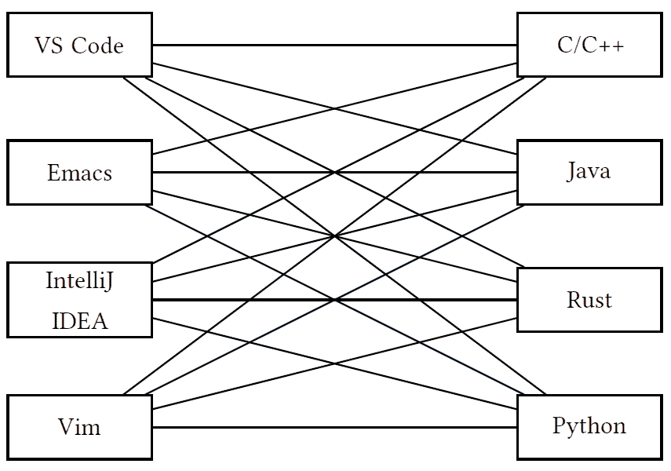

**图 8.1**：IDE 中的编程语言集成

本章中将此功能称为**跳转到定义**。这些相似之处表明，通过引入一个称为**语言服务器协议（LSP**）的中间层，可以简化图 8.1 中显示的关系。如上所示：

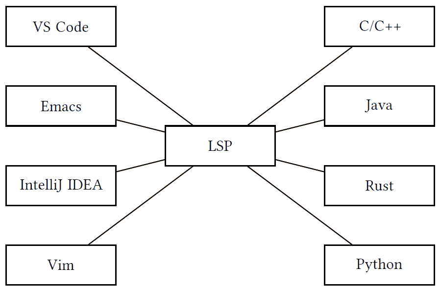

**图 8.2**: 在 IDE 中使用 LSP 进行编程语言集成

**LSP**项目由微软于 2015 年启动，作为其改进 VS Code（一个轻量级、开源代码编辑器）努力的一部分。微软认识到在 VS Code 和其他代码编辑器中为不同编程语言提供丰富语言服务需要一个标准化的方式。

LSP 在开发者社区中迅速获得了流行和采用。包括 VS Code、Emacs 和 Eclipse 在内的许多代码编辑器和 IDE 开始实现 LSP 的支持。

为各种编程语言出现了语言服务器实现。这些语言服务器由微软和开源社区共同开发，提供了特定于语言的知识和服务，使得将语言功能集成到不同的编辑器中变得更加容易。

在本章中，我们将探讨**Clangd**，它是 clang-tools-extra 的一部分的语言服务器。Clangd 利用 Clang 编译器前端，提供了一套全面的代码分析和语言支持功能。Clangd 通过智能代码补全、语义分析和实时诊断帮助开发者更高效地编写代码，并在开发过程中早期捕捉错误。我们将在此处详细探讨 Clangd，从 IDE（VS Code）和 Clangd 之间的交互的真实示例开始。我们将从环境设置开始，包括 Clangd 构建和 VS Code 设置。

## 8.3 环境设置

我们将开始我们的环境设置，首先构建 Clangd。然后，我们将安装 VS Code，设置 Clangd 扩展，并在其中配置 Clangd。

### 8.3.1 Clangd 构建

值得注意的是，我们应该以发布模式构建 Clangd，就像我们在*第 1.3.3 节*中为 LLDB 所做的那样，即*LLVM 调试器、其构建和使用*。这是因为性能在 IDE 中至关重要。例如，Clangd 需要构建 AST 以提供代码导航功能。如果用户修改了文档，则应重新构建文档，并且导航功能将不会在重新构建过程完成之前可用。这可能导致 IDE 响应延迟。为了防止 IDE 响应缓慢，我们应该确保 Clangd 以所有必需的优化构建。您可以使用以下项目配置命令：

```cpp
cmake -G Ninja -DCMAKE_BUILD_TYPE=Release -DCMAKE_INSTALL_PREFIX=../install -DLLVM_TARGETS_TO_BUILD="X86" -DLLVM_ENABLE_PROJECTS="clang;clang-tools-extra" ../llvm
```

**图 8.3**: Clangd 构建的发布配置

命令必须在我们在*第 1.3.3 节*中创建的`release`文件夹中运行，即 LLVM 调试器、其构建和使用，如图图 1.8 所示。正如您所看到的，我们在图 8.3 中启用了两个项目：`clang`和`clang-tools-extra`。

您可以使用以下命令构建和安装 Clangd：

```cpp
$ ninja install-clangd -j $(nproc)
```

此命令将利用系统上可用的最大线程数，并将二进制文件安装到我们在图 8.3 中指定的 CMake 命令的文件夹中，即 LLVM 源树下的`install`文件夹。

在构建 Clangd 二进制文件后，我们的下一步将包括安装 VS Code 并将其配置为与 Clangd 一起使用。

### 8.3.2 VS Code 安装和配置

您可以从 VS Code 网站 [`code.visualstudio.com/download`](https://code.visualstudio.com/download) 下载并安装 VS Code。

运行 VS Code 后的第一步是安装 **Clangd** 扩展。有一个开源扩展可以通过 LSP 与 Clangd 一起使用。该扩展的源代码可以在 GitHub 上找到：[`github.com/clangd/vscode-clangd`](https://github.com/clangd/vscode-clangd)。然而，我们可以轻松地从 VS Code 内部直接安装扩展的最新版本。

要做到这一点，请按 *Ctrl+Shift+X*（或在 macOS 上按  *+Shift+X*）以打开扩展面板。搜索 `Clangd` 并单击 **安装** 按钮。

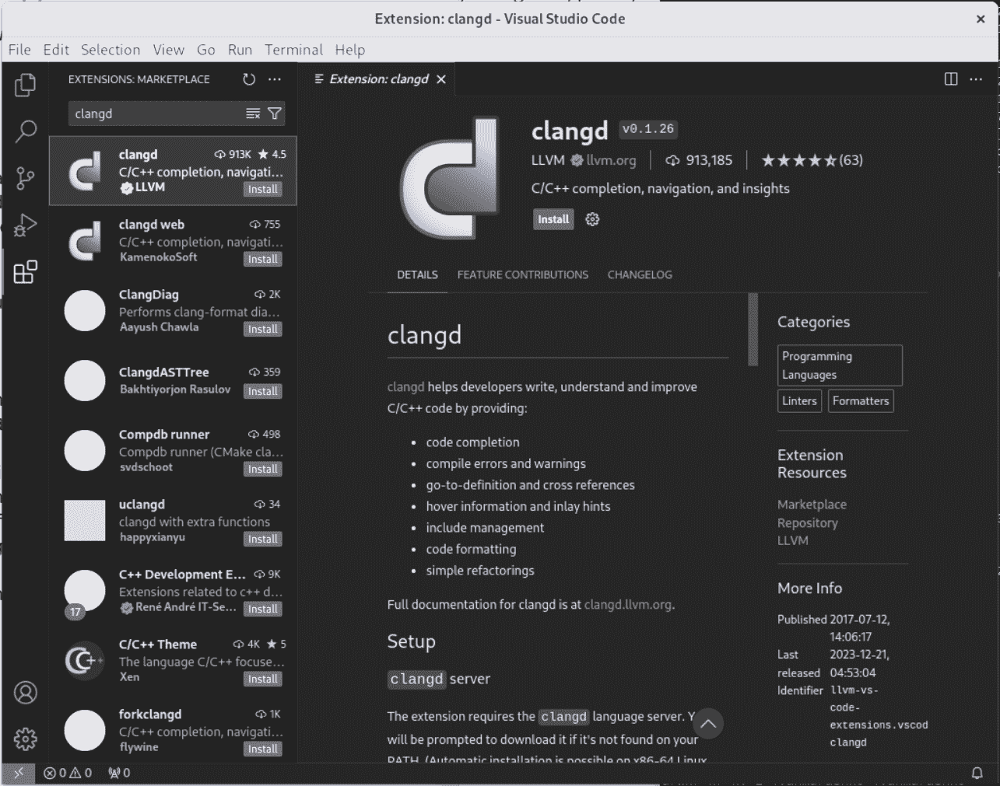

**图 8.4**：安装 Clangd 扩展

安装扩展后，我们需要对其进行设置。主要步骤是指定 Clangd 可执行文件的路径。

您可以通过 **文件 — 首选项 — 设置** 菜单或按 *Ctrl + ,*（或在 macOS 上按  *+,*）访问此设置，如下面的截图所示：

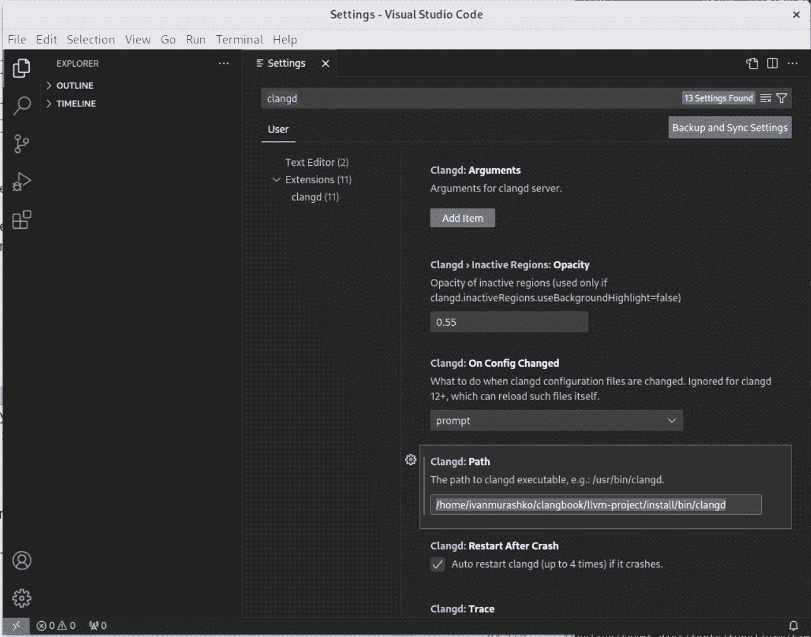

**图 8.5**：设置 Clangd 扩展

如 图 8.5 所示，我们已将 Clangd 路径配置为 `/home/ivanmurashko` `/clangbook/llvm-project/install/bin/clangd`。此路径在 *第 8.3.1 节* 中使用，即 Clangd 二进制文件的安装和构建。

您可以打开您喜欢的 C/C++ 源文件并尝试在其中导航。例如，您可以搜索一个标记的定义，在源文件和头文件之间切换，等等。在我们的下一个示例中，我们将研究如何通过 LSP 进行导航，特别是如何实现跳转到定义。

重要提示

我们的设置仅适用于不需要特殊编译标志的简单项目。如果您的项目需要特殊配置才能构建，那么您必须使用生成的 `compile_commands.json` 文件，该文件应放置在您的项目根目录下。此文件应包含一个 **编译数据库**（**CDB**），以 JSON 格式指定项目中每个文件的编译标志。有关设置的更多信息，请参阅 *图 9.5* 中关于 Clangd 为大型项目设置的内容。

在安装了所需的组件后，我们现在准备进行 LSP 演示，我们将模拟在 IDE 中典型的开发活动（打开和修改文档、跳转到标记定义等）并探索它是如何通过 LSP 表示的。

## 8.4 LSP 演示

在这个简短的 LSP 演示中，我们将展示 Clangd 如何打开文件并找到符号的定义。Clangd 具有一个全面的日志子系统，它提供了关于其与 IDE 交互的宝贵见解。我们将使用日志子系统来获取必要的信息。

### 8.4.1 演示描述

在我们的例子中，我们打开一个测试文件，如图所示，并检索`doPrivateWork`标记的定义：

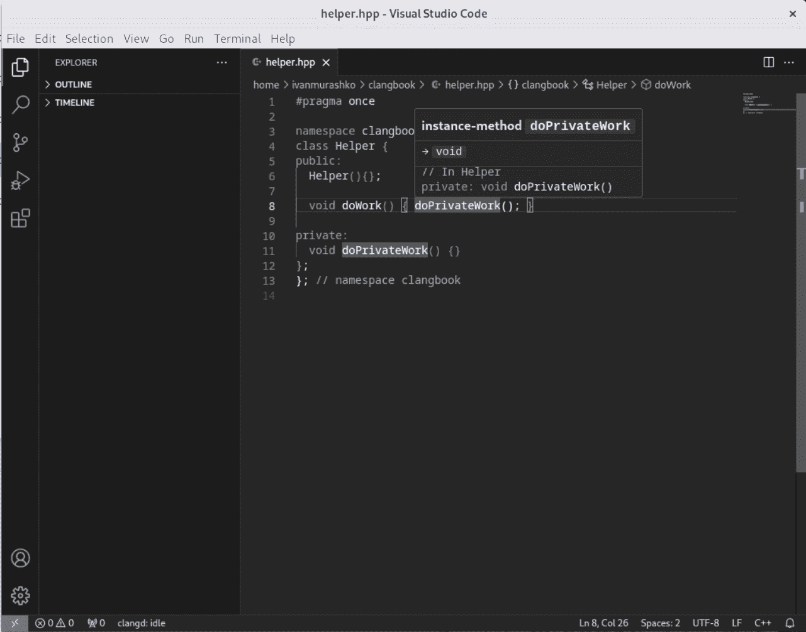

**图 8.6**：跳转到`doPrivateWork`标记的定义并悬停

VS Code 通过标准输入/输出与 Clangd 通信，我们将使用 Clangd 日志来捕获交互。

这可以通过在 VS Code 设置中设置包装器 shell 脚本而不是使用实际的 clangd 二进制文件来实现：

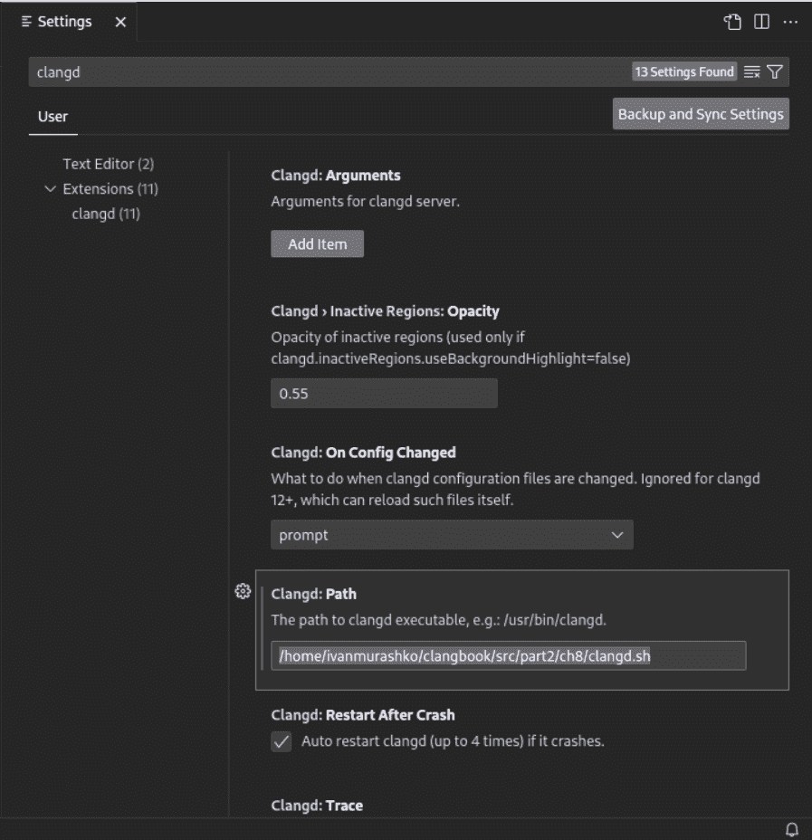

**图 8.7**：在 VS Code 中设置包装器 shell 脚本

我们可以使用以下脚本，`clangd.sh`：

```cpp
1 #!/bin/sh 

2 $HOME/clangbook/llvm-project/install/bin/clangd -log verbose -pretty 2> /tmp/clangd.log
```

**图 8.8**：clangd 的包装器 shell 脚本

在图 8.8 中，我们使用了两个日志选项：

+   第一个选项，`-log verbose`，激活详细日志记录以确保 Clangd 与 IDE 之间的实际 LSP 消息将被记录。

+   第二个选项，`-pretty`，用于提供格式良好的 JSON 消息。在我们的例子中，我们还把 stderr 输出重定向到日志文件，`/tmp/clangd.log`。

因此，该文件将包含我们示例会话的日志。我们可以使用以下命令查看这些日志：

```cpp
$ cat /tmp/clangd.log
```

在日志中，我们可以找到由 VS Code 发送的`"textDocument/definition"`：

```cpp
V[16:24:39.336] <<< {
  "id": 13,
  "jsonrpc": "2.0",
  "method": "textDocument/definition",
  "params": {
    "position": {
      "character": 26,
      "line": 7
    },
```

```cpp
    "textDocument": {
      "uri": "file:///home/ivanmurashko/clangbook/helper.hpp"
    }
  }
}
```

**图 8.9**：IDE 发送的”textDocument/definition”请求

IDE 发送的请求被 Clangd 接收并处理。相应的日志记录如下：

```cpp
I[16:24:39.336] <-- textDocument/definition(13)
V[16:24:39.336] ASTWorker running Definitions on version 1 of /home/.../
helper.hpp
```

**图 8.10**：Clangd 对”textDocument/definition”请求的处理

最后，Clangd 创建响应并将其发送到 IDE。相应的日志记录显示回复已发送：

```cpp
I[16:24:39.336] --> reply:textDocument/definition(13) 0 ms
V[16:24:39.336] >>> {
  "id": 13,
  "jsonrpc": "2.0",
  "result": [
    {
      "range": {
        "end": {
          "character": 20,
          "line": 10
        },
```

```cpp
        "start": {
          "character": 7,
          "line": 10
        }
      },
      "uri": "file:///home/ivanmurashko/clangbook/helper.hpp"
    }
  ]
}
```

**图 8.11**：Clangd 的”textDocument/definition”回复

日志将成为我们调查 LSP 内部的主要工具。让我们深入研究更复杂的示例。

### 8.4.2 LSP 会话

LSP 会话由对 Clangd 服务器的多个请求和响应组成。它从一个 `"initialize"` 请求开始。然后，我们打开一个文档，VS Code 发送一个 `"textDocument/didOpen"` 通知。在请求之后，Clangd 将定期响应 `"textDocument/publishDiagnostics"` 通知，当打开的文件状态发生变化时。例如，这发生在编译完成并且准备好处理导航请求时。接下来，我们发起一个针对标记的跳转到定义请求，Clangd 响应以找到的定义的位置信息。我们还研究了 Clangd 如何处理客户端通过 `"textDocument/didChange"` 通知通知的文件修改。当我们关闭打开的文件时，我们通过 `"textDocument/didClose"` 请求结束我们的会话。以下图展示了交互的示意图：

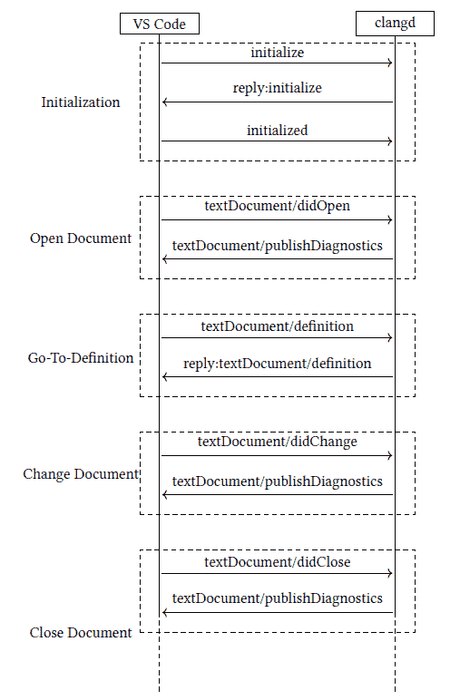

**图 8.12**: LSP 会话示例

让我们详细看看这个例子。我们将从 `"initialize"` 请求开始。

#### 初始化

为了建立通信，客户端（代码编辑器或 IDE）和语言服务器交换 JSON-RPC 消息。初始化过程以客户端向语言服务器发送一个 `"initialize"` 请求开始，指定它支持的功能。VS Code 实际发送的请求相当大，以下是一个简化版本，其中请求的一些部分被 `"..."` 替换：

```cpp
1{ 

2   "id": 0, 

3   "jsonrpc": "2.0", 

4   "method": "initialize", 

5   "params": { 

6     "capabilities": { 

7       ... 

8       "textDocument": { 

9         ... 

10         "definition": { 

11           "dynamicRegistration": true, 

12           "linkSupport": true 

13         }, 

14         ... 

15     }, 

16     "clientInfo": { 

17       "name": "Visual Studio Code", 

18       "version": "1.85.1" 

19     }, 

20     ... 

21   } 

22 }
```

**图 8.13**: VS Code 到 Clangd（初始化请求）

在请求中，客户端（VS Code）告诉服务器（Clangd）客户端支持哪些功能；例如，在 图 8.13 的 *第 10-13 行*，客户端表示它支持用于跳转到定义请求的 `"textDocument/definition"` 请求类型。

语言服务器以包含服务器支持的功能的响应来回复请求：

```cpp
1{ 

2   "id": 0, 

3   "jsonrpc": "2.0", 

4   "result": { 

5     "capabilities": { 

6       ... 

7       "definitionProvider": true, 

8       ... 

9     }, 

10     "serverInfo": { 

11       "name": "clangd", 

12       "version": "clangd version 16.0.6 (https://github.com/llvm/llvm-project.git 7cbf1a2591520c2491aa35339f227775f4d3adf6) linux x86_64-unknown-linux-gnu" 

13     } 

14   } 

15 }
```

**图 8.14**: Clangd 到 VS Code（初始化回复）

如我们所见，相同的 `id` 用于将请求与其回复连接起来。Clangd 回复说它支持在 *第 7 行* 图 8.14 中指定的跳转到定义请求。因此，我们的客户端（VS Code）可以向服务器发送导航请求，我们将在 *图 8.19**，跳转到定义* 中稍后探讨。

VS Code 通过发送 `"initialized"` 通知来确认初始化：

```cpp
1{ 

2   "jsonrpc": "2.0", 

3   "method": "initialized" 

4 }
```

与 `"initialize"` 请求相反，这里有一个通知，并且它不期望服务器有任何响应。因此，它没有 `"id"` 字段。`"initialized"` 通知只能发送一次，并且它应该在客户端发送任何其他请求或通知之前接收。初始化完成后，我们就可以打开文档并发送相应的 `"textDocument/didOpen"` 通知。

#### 打开文档

当开发者打开一个 C++源文件时，客户端发送`"textDocument/didOpen"`通知，通知语言服务器关于新打开的文件。在我们的例子中，打开的文件位于`/home/ivanmurashko/clangbook/helper.hpp`，VS Code 发送的相应通知将如下所示：

```cpp
{ 

  "jsonrpc": "2.0", 

  "method": "textDocument/didOpen", 

  "params": { 

   "textDocument": { 

     "languageId": "cpp", 

     "text": "#pragma once\n\nnamespace clangbook {\nclass Helper {\npublic:\n  Helper(){};\n\n  void doWork() { doPrivateWork(); }\n\nprivate:\n  void doPrivateWork() {}\n};\n}; // namespace clangbook\n", 

     "uri": "file:///home/ivanmurashko/clangbook/helper.hpp",
```

```cpp
     "version": 1 

   } 

  } 

}
```

**图 8.15**: VS Code 到 Clangd（didOpen 通知）

如我们所见，VS Code 发送了包含在`"params/textDocument"`字段中的参数的通知。这些参数包括`"uri"`字段中的文件名和`"text"`字段中的源文件文本。

Clangd 在接收到’didOpen’通知后开始编译文件。它构建一个 AST 并从中提取关于不同标记的语义信息。服务器使用这些信息来区分具有相同名称的不同标记。例如，我们可以使用名为’foo’的标记，它可能根据使用的范围作为类成员或局部变量，如下面的代码片段所示：

```cpp
1 class TestClass { 

2 public: 

3   int foo(){return 0}; 

4 }; 

5  

6 int main() { 

7   TestClass test; 

8   int foo = test.foo(); 

9   return foo; 

10 }
```

**图 8.16**: foo.hpp 中’foo’标记的出现

正如我们在*第 8 行*中看到的，我们使用了`’foo’`标记两次：作为函数调用和在局部变量定义中。

跳转到定义的请求将延迟到编译过程完成。值得注意的是，大多数请求都被放入队列中，等待编译过程完成。该规则有一些例外，一些请求可以在没有 AST 的情况下执行，并具有有限的提供功能。其中一个例子是代码格式化请求。代码格式化不需要 AST，因此格式化功能可以在 AST 构建之前提供。

如果文件的状态发生变化，Clangd 将通过`"textDocument/publishDiagnostics"`通知通知 VS Code。例如，当编译过程完成后，Clangd 将发送通知到 VS Code：

```cpp
1{ 

2   "jsonrpc": "2.0", 

3   "method": "textDocument/publishDiagnostics", 

4   "params": { 

5    "diagnostics": [], 

6    "uri": "file:///home/ivanmurashko/clangbook/helper.hpp", 

7    "version": 1 

8   } 

9 }
```

**图 8.17**: Clangd 到 VS Code（publishDiagnostics 通知）

如我们所见，没有编译错误；`params/diagnostics`为空。如果我们的代码包含编译错误或警告，它将包含错误或警告描述，如下所示：

```cpp
1{ 

2   "jsonrpc": "2.0", 

3   "method": "textDocument/publishDiagnostics", 

4   "params": { 

5    "diagnostics": [ 

6      { 

7        "code": "expected_semi_after_expr", 

8        "message": "Expected ’;’ after expression (fix available)", 

9        "range": { 

10          "end": { 

11            "character": 35, 

12            "line": 7 

13          }, 

14          "start": { 

15            "character": 34, 

16            "line": 7 

17          } 

18        }, 

19        "relatedInformation": [], 

20        "severity": 1, 

21        "source": "clang" 

22      } 

23    ], 

24    "uri": "file:///home/ivanmurashko/clangbook/helper.hpp", 

25    "version": 5 

26   } 

27 }
```

**图 8.18**: Clangd 到 VS Code（带有编译错误的 publishDiagnostics）

VS Code 处理诊断信息并将其显示出来，如下面的屏幕截图所示：

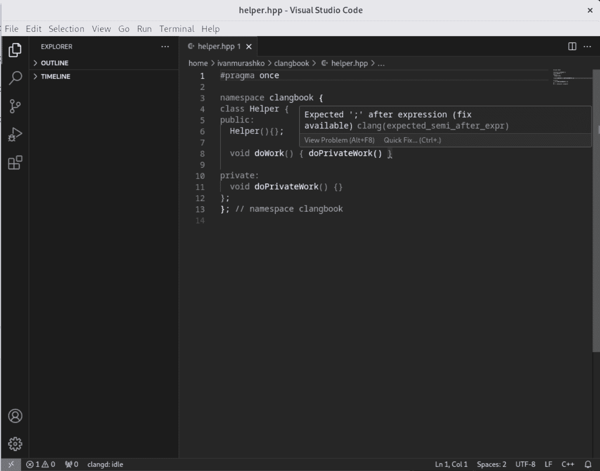

**图 8.19**: helper.hpp 中的编译错误

编译完成后，我们收到`"textDocument/publishDiagnostics"`后，Clangd 就准备好处理导航请求，例如`"textDocument/definition"`（跳转到定义）。

#### 跳转到定义

要在一个 C++文件中查找符号的定义，客户端向语言服务器发送`"textDocument/definition"`请求：

```cpp
1{ 

2   "id": 13, 

3   "jsonrpc": "2.0", 

4   "method": "textDocument/definition", 

5   "params": { 

6    "position": { 

7      "character": 26, 

8      "line": 7 

9    }, 

10    "textDocument": { 

11      "uri": "file:///home/ivanmurashko/clangbook/helper.hpp" 

12    } 

13   } 

14 }
```

**图 8.20**: VS Code 到 Clangd（textDocument/definition 请求）

行位置指定为 7 而不是编辑器中的实际行 8，如图 8.6 所示。这是因为行号从 0 开始。

语言服务器在 C++ 代码中响应定义位置：

```cpp
1{ 

2   "id": 13, 

3   "jsonrpc": "2.0", 

4   "result": [ 

5    { 

6      "range": { 

7        "end": { 

8          "character": 20, 

9          "line": 10 

10        }, 

11        "start": { 

12          "character": 7, 

13          "line": 10 

14        } 

15      }, 

16      "uri": "file:///home/ivanmurashko/clangbook/helper.hpp" 

17    } 

18   ] 

19 }
```

**图 8.21**：Clangd 到 VS Code（textDocument/definition 响应）

如我们所见，服务器响应了定义的实际位置。在 IDE 中另一个流行的操作是文档修改。此功能由 `"textDocument/didChange"` 通知提供。让我们看看它。

#### 更改文档

作为文档修改的一部分，让我们在 *第 6 行* 插入注释 `// Constructor`，如图所示：

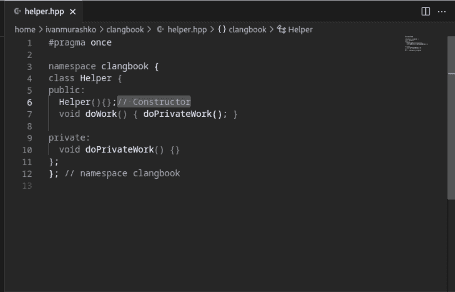

**图 8.22**：更改文档

VS Code 将检测到文档已被修改，并使用以下通知通过 LSP 服务器（Clangd）进行通知：

```cpp
1{ 

2   "jsonrpc": "2.0", 

3   "method": "textDocument/didChange", 

4   "params": { 

5     "contentChanges": [ 

6       { 

7         "range": { 

8           "end": { 

9             "character": 13, 

10             "line": 5 

11           }, 

12           "start": { 

13             "character": 13, 

14             "line": 5 

15           } 

16         }, 

17         "rangeLength": 0, 

18         "text": "// Constructor" 

19       } 

20     ], 

21     "textDocument": { 

22       "uri": "file:///home/ivanmurashko/clangbook/helper.hpp", 

23       "version": 2 

24     } 

25   } 

26 }
```

**图 8.23**：VS Code 到 Clangd（didChange 通知）

如我们所见，通知包含范围规范和用于替换文档中指定范围的文本。通知的一个重要部分是 `"version"` 字段，它指定了文档的版本。

我们可以观察到 `version` 从文档打开时使用的 1 变为 2，用于文档修改（如图 8.23 的第 23 行图 8.23 所示）。

由于文档修改可能导致用于导航请求的结果 AST 发生重大变化，Clangd 将开始文档编译。一旦编译完成，服务器将响应相应的 `"textDocument/publishDiagnostics"` 通知，如图所示：

```cpp
1{ 

2   "jsonrpc": "2.0", 

3   "method": "textDocument/publishDiagnostics", 

4   "params": { 

5     "diagnostics": [], 

6     "uri": "file:///home/ivanmurashko/clangbook/helper.hpp", 

7     "version": 2 

8 }
```

**图 8.24**：Clangd 到 VS Code（publishDiagnostics 通知）

如我们所见，由于它包含指向版本 2 的版本字段，因此对修改后的文档发送了诊断信息，这对应于图 8.24 的第 7 行图 8.24。

在示例中的最后一个操作是关闭文档。让我们更仔细地看看它。

#### 关闭文档

当我们完成对文档的工作并关闭它时，VS Code 向语言服务器发送 `"textDocument/didClose"` 通知：

```cpp
1{ 

2   "jsonrpc": "2.0", 

3   "method": "textDocument/didClose", 

4   "params": { 

5    "textDocument": { 

6      "uri": "file:///home/ivanmurashko/clangbook/helper.hpp" 

7    } 

8   } 

9 }
```

**图 8.25**：VS Code 到 Clangd（textDocument/didClose 请求）

接收到请求后，Clangd 将从其内部结构中删除文档。Clangd 将不再为该文档发送任何更新，因此它将通过发送最终的空 `"textDocument/publishDiagnostics"` 消息来清空客户端（例如，在 VS Code 的 **问题** 面板中）上显示的诊断列表，如图所示：

```cpp
1{ 

2   "jsonrpc": "2.0", 

3   "method": "textDocument/publishDiagnostics", 

4   "params": { 

5    "diagnostics": [], 

6    "uri": "file:///home/ivanmurashko/clangbook/helper.hpp" 

7   } 

8 }
```

**图 8.26**：Clangd 到 VS Code（textDocument/didClose 请求）

所示示例演示了 Clangd 和 VS Code 之间的典型交互。提供的示例利用了 Clang 前端的功能，即基本的 Clang 功能。另一方面，Clangd 与其他 Clang 工具（如 Clang-Format 和 Clang-Tidy）有很强的联系，并且可以重用这些工具提供的功能。让我们更详细地看看这一点。

## 8.5 与 Clang 工具的集成

Clangd 利用 LLVM 模块架构，并与其他 Clang 工具有非常强的集成。特别是，Clangd 使用 Clang-Format 库来提供格式化功能，并使用 Clang-Tidy 库（例如带有 clang-tidy 检查的库）来支持 IDE 中的代码检查器。集成方案在以下图中展示：

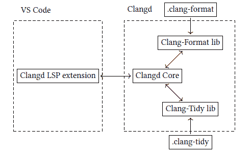

**图 8.27**：带有 LSP 扩展和 Clangd 服务器用于 C++ 的 VS Code

`.clang-format`（参见 *第 7.4.1 节**，Clang-Format* *配置和使用示例*）中的配置用于格式化，而 `.clang-tidy`（参见 *图 5.12**，Clang-Tidy 配置*）用于代码检查器。让我们看看 Clangd 中格式化是如何工作的。

### 8.5.1 Clangd 使用 LSP 消息支持代码格式化

Clangd 提供了对代码格式化的强大支持。这一功能对于开发者保持 C 和 C++ 项目的代码风格一致性和可读性至关重要。Clangd 利用 LSP 消息，主要是 `"textDocument/formatting"` 和 `"textDocument/rangeFormatting"` 请求，来实现这一功能。

#### 格式化整个文档

当开发者想要格式化文档的全部内容时，会使用 `"textDocument/formatting"` 请求。此请求通常由用户在 VS Code 中通过按 *Ctrl + Shift + I*（或 macOS 上的  *+ Shift + I*）来启动；IDE 会向 Clangd 发送一个针对整个文档的 `"textDocument/formatting"` 请求：

```cpp
1{ 

2   "id": 9, 

3   "jsonrpc": "2.0", 

4   "method": "textDocument/formatting", 

5   "params": { 

6    "options": { 

7      "insertSpaces": true, 

8      "tabSize": 4 

9    }, 

10    "textDocument": { 

11      "uri": "file:///home/ivanmurashko/clangbook/helper.hpp" 

12    } 

13   } 

14 }
```

**图 8.28**：VS Code 到 Clangd（textDocument/formatting 请求）

Clangd 通过利用项目 `.clang-format` 文件中指定的代码风格配置来处理此请求。`.clang-format` 文件包含格式化规则和首选项，允许开发者定义他们想要的代码风格；参见 *第 7.4.1 节**，Clang-Format 配置和使用* *示例*。

响应中包含要应用到打开文档中的修改列表：

```cpp
1{ 

2   "id": 9, 

3   "jsonrpc": "2.0", 

4   "result": [ 

5    { 

6      "newText": "\n  ", 

7      "range": { 

8        "end": { 

9          "character": 0, 

10          "line": 5 

11        }, 

12        "start": { 

13          "character": 7, 

14          "line": 4 

15        } 

16      } 

17    } 

18   ] 

19 }
```

**图 8.29**：Clangd 到 VS Code（textDocument/formatting 响应）

在示例中，我们应该将 图 8.29 中 *第 7-16 行* 的文本替换为新文本，该文本指定在 *第 6 行*。

#### 格式化特定的代码范围

除了格式化整个文档外，Clangd 还支持格式化文档中的特定代码范围。这是通过使用`"textDocument/rangeFormatting"`请求实现的。开发者可以在代码中选择一个范围，例如一个函数、一段代码块，甚至只有几行，并请求对该特定范围进行格式化，如下面的截图所示：

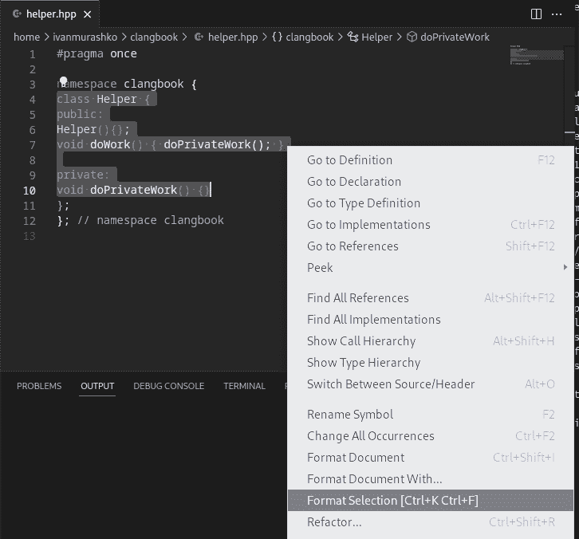

**图 8.30**：在 helper.hpp 中重新格式化特定的代码范围

当选择菜单项或按*Ctrl + K*然后*Ctrl + F*（或 macOS 上的 *+ K*然后 *+ F*），VS Code 将向 Clangd 发送以下请求：

```cpp
1{ 

2   "id": 89, 

3   "jsonrpc": "2.0", 

4   "method": "textDocument/rangeFormatting", 

5   "params": { 

6    "options": { 

7      "insertSpaces": true, 

8      "tabSize": 4 

9    }, 

10    "range": { 

11      "end": { 

12        "character": 2, 

13        "line": 10 

14      }, 

15      "start": { 

16        "character": 0, 

17        "line": 3 

18      } 

19    }, 

20    "textDocument": { 

21      "uri": "file:///home/ivanmurashko/clangbook/helper.hpp" 

22    } 

23   } 

24 }
```

**图 8.31**：VS Code 到 Clangd（textDocument/rangeFormatting 请求）

`"textDocument/rangeFormatting"`请求指定了文档中需要格式化的范围，Clangd 将`.clang-format`文件中的相同格式化规则应用于这个特定的代码段。响应将与格式化请求类似，并将包含应用于原始文本的修改，如图图 8.29 所示。唯一的区别将是方法名，在这种情况下应该是`"textDocument/rangeFormatting"`。

另一个通过 Clangd 集成的工具是 Clang-Tidy，它相对于我们刚刚描述的格式化功能，以不同的方式使用 LSP 协议。

### 8.5.2 Clang-Tidy

如我们所见，Clangd 使用特定的 LSP 方法来实现与 Clang-Format 的集成：

+   `"textDocument/formatting"`

+   `"textDocument/rangeFormatting"`

另一方面，与 Clang-Tidy 的集成实现不同，它重用了`"publishDiagnostics"`通知来报告 lint 警告和错误。

让我们调查它是如何工作的，并作为第一步创建一个自定义的 Clang-Tidy 配置。

#### Clang-Tidy 与 LSP 集成

我们将运行我们最近创建的用于测试方法重命名的`misc-methodrename`检查，参见*第 7.3 节**，Clang-Tidy 作为一个代码修改工具*。我们的 Clang-Tidy 配置将如下所示：

```cpp
1 Checks: ’-*,misc-methodrename’
```

**图 8.32**：IDE 集成用的.clang-tidy 配置

应将包含配置的`.clang-tidy`文件放置在我们的测试项目文件夹中。

如果我们将辅助类重命名为`TestHelper`，我们将能够观察到我们在*第 7.3 节**，Clang-Tidy 作为一个代码修改工具*中创建的 lint 检查将开始报告关于测试类使用的错误方法名。相应的诊断将在下拉面板和**问题**选项卡中显示，如下面的截图所示：

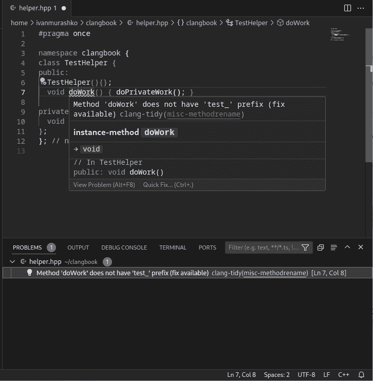

**图 8.33**：Clang-Tidy 集成

消息作为诊断信息的一部分显示。具体来说，以下通知是从 Clang 发送到 VS Code 的：

```cpp
1{ 

2   "jsonrpc": "2.0", 

3   "method": "textDocument/publishDiagnostics", 

4   "params": { 

5    "diagnostics": [ 

6      { 

7        "code": "misc-methodrename", 

8        "codeDescription": { 

9          "href": "https://clang.llvm.org/extra/clang-tidy/checks/misc/ 

10                    methodrename.html" 

11        }, 

12        "message": "Method ’testdoWork’ does not have ’test_’ prefix (fix available)", 

13        "range": { 

14          "end": { 

15            "character": 17, 

16            "line": 6 

17          }, 

18          "start": { 

19            "character": 7, 

20            "line": 6 

21          } 

22        }, 

23        "relatedInformation": [], 

24        "severity": 2, 

25        "source": "clang-tidy" 

26      } 

27    ], 

28    "uri": "file:///home/ivanmurashko/clangbook/helper.hpp", 

29    "version": 11 

30   }
```

**图 8.34**：Clangd 到 VS Code（publishDiagnostics 通知）

如图中（*第 11 行*）所示，问题的修复也是可用的。在 IDE 中应用 Clang-Tidy 修复有一个惊人的机会。让我们探索如何使用 LSP 实现此功能。

#### 在 IDE 中应用修复

修复可以在 IDE 中应用，并且该功能通过 `"textDocument/codeAction"` 方法提供。此方法由 VS Code 用于提示 Clangd 计算特定文档和范围的命令。以下示例中提供了命令最重要的部分：

```cpp
1{ 

2   "id": 98, 

3   "jsonrpc": "2.0", 

4   "method": "textDocument/codeAction", 

5   "params": { 

6     "context": { 

7       "diagnostics": [ 

8         { 

9           "code": "misc-methodrename", 

10           ... 

11           "range": ..., 

12       ... 

13     }, 

14     ... 

15   } 

16 }
```

**图 8.35**：VS Code 到 Clangd（textDocument/codeAction 请求）

请求最重要的部分在 *第 7-11 行*，我们可以看到原始诊断通知的副本。此信息将被用于检索由 `clang::FixItHint` 在激活的检查中提供的必要文档修改。因此，Clangd 可以响应描述所需修改的动作：

```cpp
1{ 

2   "id": 98, 

3   "jsonrpc": "2.0", 

4   "result": [ 

5    { 

6      "diagnostics": [ 

7        ... 

8      ], 

9      "edit": { 

10        "changes": { 

11          "file:///home/ivanmurashko/clangbook/helper.hpp": [ 

12            { 

13              "newText": "test_", 

14              "range": { 

15                "end": { 

16                  "character": 7, 

17                  "line": 6 

18                }, 

19                "start": { 

20                  "character": 7, 

21                  "line": 6 

22                } 

23              } 

24            } 

25      ... 

26    } 

27   ] 

28 }
```

**图 8.36**：Clangd 到 VS Code（codeAction 响应）

图 8.36 中的 `"edit"` 字段是响应中最重要的一部分，因为它描述了对原始文本的更改。

由于 Clangd 核心构建 AST 用于导航和诊断目的，因此无需额外计算即可与 Clang-Tidy 集成。AST 可以用作 Clang-Tidy 检查的种子，从而消除运行单独的 Clang-Tidy 可执行文件以从代码检查器检索消息的需求。这不是 Clangd 做出的唯一优化；现在让我们看看 Clangd 中性能优化的另一个示例。

## 8.6 性能优化

获得平滑的 IDE 体验，提供准确的结果且无可见延迟是一项挑战性任务。实现这种体验的一种方法是通过编译器性能优化，因为良好的导航可以通过良好解析的源代码提供。Clangd 提供了性能优化的优秀示例，我们将详细探讨。我们将从代码修改的优化开始。

### 8.6.1 修改文档的优化

正如我们在*第 4 行*中看到的那样，打开文档、导航支持需要 AST 作为基本数据结构，因此我们必须使用 Clang 前端来获取它。此外，当文档发生修改时，我们必须重建 AST。文档修改是开发者的常见活动，如果我们总是从头开始启动构建过程，我们将无法提供良好的 IDE 体验。

#### 源代码前缀

要深入了解用于加速修改文档的抽象语法树（AST）构建的想法，让我们检查一个简单的 C++ 程序：

```cpp
1 #include <iostream> 

2  

3 int main() { 

4   std::cout << "Hello world!" << std::endl; 

5   return 0; 

6 }
```

**图 8.37**：C++ 程序：helloworld.cpp

程序有六行代码，但结论可能会误导。`#include`指令插入了大量的附加代码。如果我们使用带有`-E`命令行选项的 Clang 运行并计算行数，我们可以估计预处理器插入的代码量，如下所示：

```cpp
$ <...>/llvm-project/install/bin/clang -E helloworld.cpp | wc -l
36215 
```

**图 8.38**：后处理程序中的行数

其中`<...>`是克隆 llvm-project 的文件夹；参见图 1.1。

如我们所见，应该解析的代码包含超过 36,000 行代码。这是一个常见的模式，大多数要编译的代码都是从包含的头文件中插入的。位于源文件开头并包含包含指令的部分称为**前导部分**。

值得注意的是，前导部分的修改是可能的，但很少见，例如，当我们插入一个新的头文件时。大多数的修改都位于前导部分之外的代码中。

性能优化的主要思想是缓存前导部分的 AST，并为其任何修改的文档重用。

#### 在 Clangd 中构建的 AST

Clangd 中进行的性能优化涉及两个部分的编译过程。在第一部分，包含所有包含的头文件的前导部分被编译成一个预编译头文件；参见*第 10.2 节**，预编译头文件*。然后，这个预编译头文件在编译过程的第二阶段用于构建 AST。

这个复杂的过程作为性能优化，尤其是在用户对需要重新编译的文件进行修改时。尽管编译时间的大部分都花在了头文件上，但这些文件通常不会频繁修改。为了解决这个问题，Clangd 将预编译头文件中的头文件 AST 进行缓存。

因此，当对头文件之外的部分进行修改时，Clangd 不需要从头开始重新构建它们。相反，它可以重用缓存的头文件 AST，显著提高编译性能，并减少处理头文件时重新编译所需的时间。如果用户的修改影响了头文件，那么整个 AST 应该被重新构建，这会导致在这些情况下缓存失效。值得注意的是，对头文件的修改不如对主要源代码（不包括包含的头文件）的修改常见。因此，我们可以预期普通文档修改的缓存命中率相当高。

预编译头文件可以存储在磁盘上的临时文件中，但也可以驻留在内存中，这也可以被视为一种性能优化。

缓存的前导部分是一个强大的工具，它显著提高了 Clangd 处理用户对文档所做的更改的性能。另一方面，我们应该始终考虑涉及前导部分修改的边缘情况。前导部分可以通过两种主要方式修改：

1.  **显式地**：当用户显式修改前言时，例如，通过向其中插入一个新的头文件或删除现有的一个

1.  **隐式地**：当用户隐式修改前言时，例如，通过修改包含在前言中的头文件

第一个可以通过影响前言位置的`"textDocument/didChange"`通知轻松检测到。第二个比较棘手，Clangd 应该监控包含的头文件中的修改，以正确处理导航请求。

Clangd 也有一些修改旨在使前言编译更快。其中一些修改需要在 Clang 中进行特定处理。让我们详细探讨一下。

### 8.6.2 构建前言优化

可以应用一种有趣的优化到函数体上。函数体可以被视为主索引的一个基本部分，因为它包含用户可以点击的符号，例如获取符号的定义。这主要适用于用户在 IDE 中可见的函数体。另一方面，许多函数及其实现（函数体）在包含的头文件中隐藏起来，用户无法从这样的函数体请求符号信息。然而，这些函数体对编译器是可见的，因为编译器解析包含指令并从指令中解析头文件。考虑到一个复杂的项目可能有众多的依赖关系，导致用户打开的文档中包含许多头文件，编译器花费的时间可能是显著的。一个明显的优化是在解析前言中的头文件时跳过函数体。这可以通过使用一个特殊的前端选项来实现：

```cpp
/// FrontendOptions - Options for controlling the behavior of the frontend. 

class FrontendOptions { 

  ... 

  /// Skip over function bodies to speed up parsing in cases where you do not need 

  /// them (e.g., with code completion). 

  unsigned SkipFunctionBodies : 1;
```

```cpp
  ... 

};
```

**图 8.39**：来自 clang/Frontend/FrontendOptions.h 的 FrontendOptions 类

Clangd 在以下方式构建前言时使用此选项：

```cpp
1std::shared_ptr<const PreambleData> 

2 buildPreamble(PathRef FileName, CompilerInvocation CI, 

3               const ParseInputs &Inputs, bool StoreInMemory, 

4               PreambleParsedCallback PreambleCallback, 

5               PreambleBuildStats *Stats) { 

6   ... 

7   // Skip function bodies when building the preamble to speed up building 

8   // the preamble and make it smaller. 

9   assert(!CI.getFrontendOpts().SkipFunctionBodies); 

10   CI.getFrontendOpts().SkipFunctionBodies = true; 

11   ... 

12   auto BuiltPreamble = PrecompiledPreamble::Build(...); 

13   ... 

14   // When building the AST for the main file, we do want the function 

15   // bodies. 

16   CI.getFrontendOpts().SkipFunctionBodies = false; 

17   ... 

18 };
```

**图 8.40**：来自 clang-tools-extra/clangd/Preamble.cpp 的 buildPreamble

如我们所见，Clangd 使用前端选项在头文件中跳过函数体，但在构建主文档的 AST 之前禁用它；参见图 8.40 中的*第 10 行*和*第 16 行*。

这种优化可以显著提高复杂 C++源文件的文档准备时间（当打开的文档准备好响应用户的导航请求时）。

虽然这里讨论的性能优化为 Clangd 的效率提供了宝贵的见解，但重要的是要注意，Clangd 采用了多种其他技术来确保其可靠性和速度。Clangd 是一个出色的平台，用于实验和实现各种优化策略，使其成为性能增强和创新的灵活环境。

## 8.7 总结

在本章中，我们了解了 LSP（语言服务器协议），这是一种用于提供开发工具与 IDE 集成的协议。我们探讨了 Clangd，它是 LLVM 的一部分，可以被视为书中讨论的各种工具如何集成的典范。Clangd 使用 Clang 前端来显示编译错误，并利用 AST（抽象语法树）作为基本的数据结构，为导航请求提供信息，例如跳转到定义的请求。此外，Clangd 与前几章中介绍的其他工具无缝集成，例如 Clang-Tidy 和 Clang-Format。这种集成展示了 LLVM/Clang 模块结构的显著优势。

## 8.8 进一步阅读

+   语言服务器协议规范：[`microsoft.github.io/language-server-protocol/`](https://microsoft.github.io/language-server-protocol/)

+   Clangd 文档：[`clangd.llvm.org/`](https://clangd.llvm.org/)
