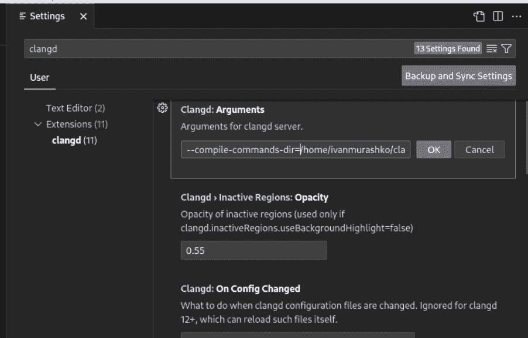
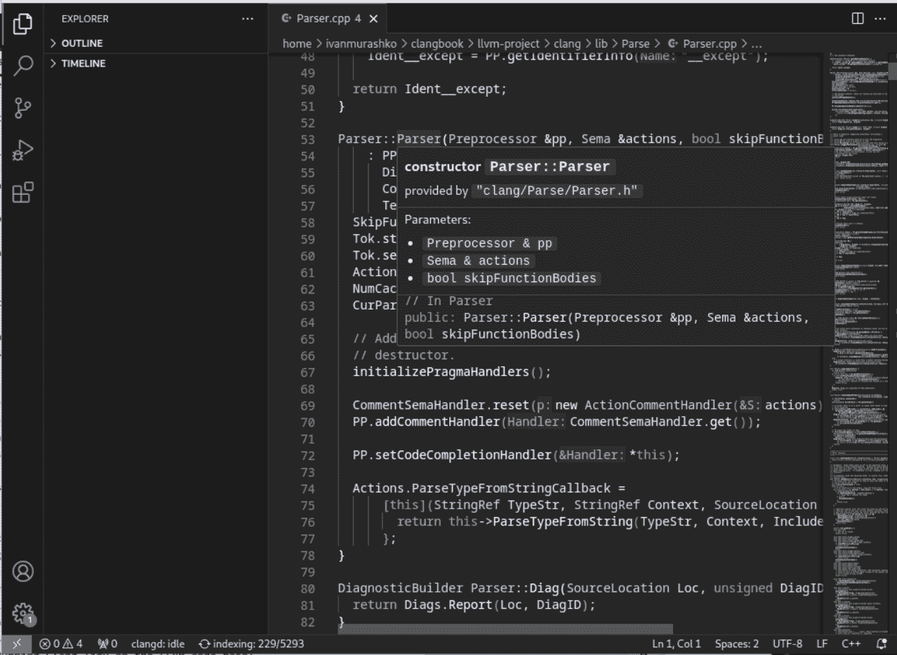

# 附录 1

# 编译数据库

书中考虑的测试示例不需要特殊的编译标志，通常可以不带任何标志进行编译。然而，如果你想在真实项目中使用这些材料，例如在你的代码库上运行 lint 检查，情况就不同了。在这种情况下，你需要为每个要处理的文件提供特殊的编译标志。Clang 提供了各种方法来提供这些标志。我们将详细探讨 JSON 编译数据库，这是向 Clang 工具（如 Clang-Tidy 和 Clangd）提供编译标志的主要工具之一。

## 9.1 编译数据库定义

**编译数据库（CDB）**是一个 JSON 文件，它指定了代码库中每个源文件应该如何编译。这个 JSON 文件通常命名为`compile_commands.json`，位于项目的根目录中。它提供了构建过程中所有编译器调用的机器可读记录，并且常被各种工具用于更精确的分析、重构等。这个 JSON 文件中的每个条目通常包含以下字段：

+   **directory**：编译的工作目录。

+   **command**：实际的编译命令，包括编译器选项。

+   **arguments**：另一个可以用来指定编译参数的字段。它包含参数列表。

+   **file**：正在编译的源文件路径。

+   **output**：此编译步骤创建的输出路径。

从字段描述中我们可以看出，有三种方式可以指定编译标志：使用**命令**或**参数**字段。让我们看一个具体的例子。假设我们的 C++文件`ProjectLib.cpp`位于`/home/user/project/src/lib`文件夹中，可以使用以下调用命令（命令仅作为示例，你可以忽略其参数）

```cpp
$ cd /home/user/project/src/lib
$ clang -Wall -I../headers ProjectLib.cpp -o ProjectLib.o
```

以下 CDB 可以用来表示命令：

```cpp
1[ 

2    { 

3        "directory": "/home/user/project/src/lib", 

4        "command": "clang -Wall -I../headers ProjectLib.cpp -o ProjectLib.o", 

5        "file": "ProjectLib.cpp", 

6        "output": "ProjectLib.o" 

7    } 

8 ]
```

**图 9.1**：ProjectLib.cpp 的编译数据库

在示例中使用了`"command"`字段。我们也可以以另一种形式创建 CDB 并使用`"arguments"`字段。结果如下：

```cpp
1[ 

2    { 

3        "directory": "/home/user/project/src/lib", 

4        "arguments": [ 

5            "clang", 

6            "-Wall", 

7            "-I../headers", 

8            "ProjectLib.cpp", 

9            "-o", 

10            "ProjectLib.o" 

11        ], 

12        "file": "ProjectLib.cpp", 

13        "output": "ProjectLib.o" 

14    } 

15 ]
```

**图 9.2**：ProjectLib.cpp 的 CDB

图 9.2 中显示的**CDB**与图 9.1 中的相同编译配方，但它使用参数列表（"arguments"字段）而不是图 9.1 中使用的调用命令（"command"字段）。重要的是要注意，参数列表也包含可执行文件"clang"作为其第一个参数。CDB 处理工具可以使用这个参数在存在不同编译器的环境中（如 GCC 与 Clang）决定使用哪个编译器进行编译。

提供的 CDB 示例只包含一个文件的记录。一个真实的项目可能包含数千条记录。LLVM 是一个很好的例子，如果你查看我们用于 LLVM 构建的 `build` 文件夹（见 *第 1.3.1 节**，使用 CMake 进行配置*），你可能会注意到它包含一个 `compile_commands.json` 文件，其中包含我们选择构建的项目 CDB。值得注意的是，LLVM 默认创建 CDB，但你的项目可能需要一些特殊的操作来创建它。让我们详细看看如何创建 CDB。

## 9.2 CDB 创建

`shell`compile˙commands.json 文件可以通过多种方式生成。例如，构建系统 CMake 内置了对生成编译数据库的支持。一些工具也可以从 Makefiles 或其他构建系统生成此文件。甚至有像 Bear 和 intercept-build 这样的工具可以通过拦截实际编译命令的执行来生成 CDB。

因此，虽然这个术语通常与 Clang 和基于 LLVM 的工具相关联，但这个概念本身更为通用，理论上可以被任何需要理解一组源文件编译设置的工具体现。我们将从使用 CMake 生成 CDB 开始，CMake 是最受欢迎的构建系统之一。

#### 使用 CMake 生成 CDB

使用 CMake 生成 CDB 涉及几个步骤：

1.  首先，打开一个终端或命令提示符，并导航到你的项目根目录。

1.  然后，使用 `-DCMAKE_EXPORT_COMPILE_COMMANDS=ON` 选项运行 CMake，该选项指示 CMake 创建一个 `compile_commands.json` 文件。此文件包含项目中所有源文件的编译命令。

1.  在使用 CMake 配置你的项目后，你可以在运行配置命令的同一目录中找到 `compile_commands.json` 文件。

正如我们之前所注意到的，LLVM 默认创建了 CDB。这是可行的，因为 `llvm/CMakeLists.txt` 包含以下设置：

```cpp
# Generate a CompilationDatabase (compile_commands.json file) for our build, 

# for use by clang_complete, YouCompleteMe, etc. 

set(CMAKE_EXPORT_COMPILE_COMMANDS 1)
```

**图 9.3**：从 llvm/CMakeLists.txt 的 LLVM-18.x CMake 配置

即，它默认设置了 CDB 生成。

#### 使用 Ninja 生成 CDB

Ninja 也可以用来生成 CDB。我们可以使用一个名为 `"compdb"` 的 Ninja 子工具将 CDB 输出到 stdout。要运行子工具，我们使用 Ninja 的 `-t <subtool>` 命令行选项。因此，我们将使用以下命令使用 Ninja 生成 CDB：

```cpp
$ ninja -t compdb > compile_commands.json
```

**图 9.4**：使用 Ninja 创建 CDB

此命令指示 Ninja 生成 CDB 信息并将其保存到 `compile_commands.json` 文件中。

生成的编译数据库可以与书中描述的不同 Clang 工具一起使用。让我们看看两个最有价值的例子，包括 Clang-Tidy 和 Clangd。

## 9.3 Clang 工具和 CDB

CDB 的概念并不仅限于 Clang，基于 Clang 的工具广泛地使用了它。例如，Clang 编译器本身可以使用编译数据库来理解如何在项目中编译文件。像 Clang-Tidy 和 Clangd（用于 IDE 中的语言支持）这样的工具也可以使用它来确保它们理解代码的构建方式，从而使它们的分析和转换更加准确。

#### 大型项目的 Clang-Tidy 配置

要使用 CDB 与 clang-tidy，通常不需要任何额外的配置。Clang-tidy 可以自动检测并利用项目根目录中的 `compile_commands.json` 文件。

另一方面，Clang 工具提供了一个特殊的选项，**-p**，定义如下：

```cpp
-p <build-path> is used to read a compile command database
```

您可以使用此选项在 Clang 源代码的文件上运行 Clang-Tidy。例如，如果您从包含源代码的 llvm-project 文件夹中运行它，它将看起来像这样：

```cpp
$ ./install/bin/clang-tidy clang/lib/Parse/Parser.cpp -p ./build/
```

**图 9.5**：在 LLVM 代码库上运行 Clang-Tidy

在这种情况下，我们正在从安装 Clang-Tidy 的文件夹中运行 Clang-Tidy，如 *第 5.2.1 节* 中所述，构建和测试 Clang-Tidy。我们还指定了 `build` 文件夹作为包含 CDB 的项目根文件夹。

Clang-Tidy 是积极使用 CDB 在大型项目上执行的工具之一。另一个工具是 Clangd，我们也将对其进行探讨。

#### 大型项目的 Clangd 设置

Clangd 提供了一个特殊的配置选项来指定 CDB 的路径。此选项定义如下：

```cpp
$ clangd --help
...
--compile-commands-dir=<string> - Specify a path to look for
compile_commands.json.If the path is invalid, clangd will search
```

```cpp
in the current directory and parent paths of each source file.
...
```

**图 9.6**：从 `clangd –help` 输出中获取的 `–compile-commands-dir` 选项的描述

您可以通过以下图中的 **设置** 面板在 Visual Studio Code 中指定此选项：



**图 9.7**：为 clangd 配置 CDB 路径

因此，如果您从 Clang 源代码打开一个文件，您将能够访问 Clangd 提供的导航支持，如图所示：



**图 9.8**：Clangd 在 clang/lib/Parse/Parser.cpp 为 Parser::Parser 方法提供的悬停信息

将编译命令与 Clang 工具（如 Clang-Tidy 或 Clangd）集成，为探索和分析您的源代码提供了一个强大的工具。

## 9.4 进一步阅读

+   Clang 文档 - JSON 编译数据库格式规范：[`clang.llvm.org/docs/JSONCompilationDatabase.html`](https://clang.llvm.org/docs/JSONCompilationDatabase.html)

+   Clangd 文档 - 编译命令：[`clangd.llvm.org/design/compile-commands`](https://clangd.llvm.org/design/compile-commands)
