# 3

# 嵌入式 C++生态系统

每个嵌入式系统的核心都有一块微控制器。从基本核心到更现代核心的转变反映了技术的演变。微控制器领域非常广泛，从经济实惠的 8 位和 16 位核心到基于现代 32 位 Arm 和 RISC-V®的微控制器。这种多样的架构影响了工具和编译器的开发。虽然一些制造商选择专注于 C 语言支持，但许多制造商已经认识到 C++的重要性，并在他们的工具链中提供了良好的 C++开发支持。

由于嵌入式系统非常广泛，不可能涵盖所有可用的架构和供应商，我们将重点关注 Arm® Cortex®-M 作为现代微控制器和**片上系统**（**SoCs**）的主要架构之一。我们将探讨提供对 Arm Cortex-M C++开发支持的可用开发环境和工具链。我们还将探讨诸如静态分析器等工具，学习如何对嵌入式目标进行性能分析，并介绍单元测试等方法。

在本章中，我们将涵盖以下主要主题：

+   编译器和开发环境

+   静态分析器

+   单元测试

+   性能分析

# 技术要求

为了充分利用本章内容，我强烈建议在阅读示例时使用编译器探索器（[`godbolt.org/`](https://godbolt.org/)）。选择 GCC 作为编译器，并针对 x86 架构。这将允许您查看标准输出（stdio）结果，并更好地观察代码的行为。由于我们使用了大量的现代 C++特性，请确保选择 C++23 标准，通过在编译器选项框中添加`-std=c++23`来实现。

本章的示例可在 GitHub 上找到（[`github.com/PacktPublishing/Cpp-in-Embedded-Systems/tree/main/Chapter03`](https://github.com/PacktPublishing/Cpp-in-Embedded-Systems/tree/main/Chapter03)）。

# 编译器和开发环境

C++在嵌入式系统中的采用受到编译器支持的影响。虽然大多数编译器支持 C 语言，但 C++的支持较慢。如今，根据目标架构和功能安全要求，有各种编译器和工具链可供选择。对 32 位架构如 Arm Cortex-M 的支持通常很好，但支持水平取决于工具链供应商和功能安全要求。

许多供应商提供符合不同行业安全标准的认证编译器的工具功能安全版本。功能安全标准旨在确保软件即使在硬件故障或操作错误的情况下也能正确且安全地运行。IEC 61508 是功能安全国际伞形安全标准，以下是一些行业的标准：

+   **ISO 26262**：汽车安全标准

+   **EN 50128**：欧洲铁路安全标准

+   **IEC 62304**：医疗软件的国际标准

+   **IEC 60730-1**：家用电器自动电气控制

在选择新项目的编译器时，功能性安全要求是我们清单上的首要事项之一。如果需要合格的编译器，那么我们将局限于提供符合特定标准合格编译器的商业版本。

虽然许多为嵌入式开发提供工具的供应商提供其工具和编译器的功能性安全版本，但也有用于嵌入式系统开发的免费开发环境和开源编译器，可用于非关键应用。

开发环境打包了不同的工具，以使开发过程无缝，并允许您专注于开发。这些工具也可以单独使用，并根据个人或组织偏好进行定制。用于嵌入式开发的工具，无论是单独使用还是集成到开发环境中，如下列出：

+   **代码编辑器**：这可以是一个基本的文本编辑器，也可以是一个更高级的工具，如 Vim 或支持语法高亮、自动完成、跨不同源文件进行代码导航和重构等插件的 Visual Studio Code。

+   **编译器和链接器**：这些用于将代码转换为目标文件并将它们链接到可烧录到目标的可执行和二进制文件。一些最受欢迎的 C++ 编译器是 GCC、Clang、Arm Compiler for Embedded 和 IAR C/C++ Compiler。

+   **调试器**：用于烧录和调试目标。调试系统的一部分是调试器探头和与探头通信以调试连接目标的软件。

+   **构建系统**：使用诸如 GNU Make 和 Ninja 等工具来控制编译和链接的过程。CMake 和 Bazel 用于构建自动化和依赖管理。

+   **静态分析工具**：这些工具用于分析源代码。根据功能，它们可以检测一些未定义的行为，例如越界访问、未初始化的变量、空指针解引用等。专门的静态分析工具可以检查代码是否符合 MISRA 或 AUTOSAR 标准。

+   **运行时分析器**：这些是目标功能、软件仪器和调试器探头组合，用于测量函数执行时间并分析软件的性能。

大多数嵌入式**集成开发环境**（**IDE**）提供以下功能：

+   项目创建和组织

+   构建自动化

+   调试

一些开发环境集成了更高级的代码分析功能，如下所示：

+   静态分析

+   性能分析和性能分析

我们将在下一页介绍一些行业中最常用的开发环境和编译器。

## Arm Keil MDK 和 Arm Compiler for Embedded

**Arm® Keil® MDK**是一套用于在（主要是）Arm Cortex-M 微控制器上进行嵌入式开发的工具集，它包括以下内容：

+   Keil Studio，一套 VS Code 的扩展

+   Keil μVision，一个基于传统 Windows®的 IDE

+   Arm 编译器嵌入式版，一个 C 和 C++编译器

+   Arm 虚拟硬件

**Keil Studio**和**Keil μVision**都提供了嵌入式开发所需的 IDE 功能，包括针对不同目标的配置、构建和目标调试。

Keil μVision 提供了对 PC-Lint 的支持，这是一个静态的 C 和 C++分析器，而 VS Code（Keil Studio）可以配置为使用`clang-tidy`或`cppcheck`。

Keil μVision 集成了 Keil 模拟器，允许在 PC 上的模拟目标上运行固件，并且它还包含了一个作为μVision 调试器一部分的集成分析器。

Arm Keil MDK 附带 Arm 虚拟硬件固定虚拟平台，这是 Arm 的云平台，允许你在模拟目标上运行二进制文件，并为模拟环境中的 CI/CD 提供基础设施。

对于非商业用途（社区版），Keil MDK 有一个基本版本，以及两个商业版本（基本版和专业版），具体取决于可用的功能。只有专业商业版提供了功能安全支持和扩展维护。接下来，我们将介绍 Arm 编译器嵌入式版，这是一个与 MDK 一起提供的 C 和 C++编译器，它还包括链接器和标准库。

**Arm 编译器嵌入式版**是 Arm 提供的一个 C 和 C++编译器。Arm 还提供了一个根据 IEC 61508、ISO 26262、EN 50128 和 IEC 62304 安全标准认证的**功能安全**（**FuSa**）版本的编译器。

FuSa 版本仅在 MDK 的最高版——专业版中提供。

Arm 编译器嵌入式版包括以下工具链组件：

+   `armclang`，一个基于**低级虚拟机**（**LLVM**）的编译器

+   `armlink`，一个将对象和库组合起来生成可执行文件的工具

+   Arm C 库

+   基于 LLVM `libc++`项目的 Arm C++库

Arm 编译器支持 C++17 标准，而最新版本的 Arm 编译器嵌入式 FuSa 6.16 支持 C++14。尽管我们撰写这本书的时候是 2024 年，但最新版本的 C++标准的支持速度仍然很慢。在 C++17 之后，C++20 和 C++23 也相继发布。

商业编译器对最新 C++标准的支持仍然相当缓慢，这使得这些环境中最新的语言特性不可用。

## IAR C/C++编译器和 IAR 嵌入式工作台 Arm

**IAR 嵌入式工作台®**是用于 Arm Cortex-M、Cortex-R 和 Cortex-A 核心的开发环境（IAR 代表 Ingenjörsfirma Anders Rundgren）。它集成了以下工具：

+   IDE，包括调试器和分析器

+   IAR C/C++编译器

+   IAR C-STAT®，一个静态分析器

+   IAR C-RUN®，一个运行时分析工具

IAR 嵌入式工作台是用于 Arm Cortex-M 核心开发的全面解决方案。IDE 中包含标准工具，如调试器，但也提供了更高级的嵌入式工具，如性能分析器和在模拟器中运行固件。

IAR 提供 C-STAT，这是一种静态分析工具，可以对 MISRAC++2008 等安全编码标准进行静态分析。

IAR 还提供了 C-RUN，这是一种运行时分析工具，通过对你的代码进行仪器化，涵盖了堆检查、边界检查、缓冲区溢出、整数溢出和其他运行时检查。

IAR C/C++编译器从 9.30.1 版本开始支持 C++17。IAR 嵌入式工作台（针对 Arm）的 FuSa 版本，版本 9.50.3（2024 年 2 月），也提供了 C++17 支持。

IAR C/C++编译器和 Arm 编译器是嵌入式开发的商业选项。除了可以期望的商业项目支持外，这些工具的优势在于它们为安全关键项目提供了安全认证版本。

一些微控制器供应商提供他们自己的开发环境版本，通常基于 Eclipse®，为他们的产品提供额外的支持。

## 供应商支持的 IDE 和 GCC

商业开发环境的替代方案是供应商支持的环境，这些环境主要基于 Eclipse 和**GNU 编译器集合**（**GCC**）工具以及**GNU 项目调试器（GDB**）进行调试。例如，ST®的 STM32CubeIDE 和 NXP®的 MCUXpresso。

这些工具包含代码配置器用户界面，可以生成用于 GPIO 配置、时钟设置和外设驱动程序初始化的 C 代码。

一些供应商，如 Nordic Semiconductor®，选择了 VS Code 作为其 IDE 解决方案的基础。他们提供了 GPIO 配置和调试的插件。VS Code 是一个现代代码编辑器，允许开发者使用 IntelliSense 等插件进行代码补全、参数信息、语法高亮等功能，以增强开发体验。

### GCC

GCC 是通用中最常用的 C 和 C++编译器之一。它是免费软件，也是非关键应用中最受欢迎的编译器，这些应用不需要合格的编译器。然而，即使是 GCC 也可以是合格的。认证过程包括编译和运行测试程序，并将输出与预期结果进行比较。所有发现的问题都必须记录下来，并必须建立一种流程来减轻这些问题。

除了编译器外，GCC 还包括汇编器和链接器，为用户提供所谓的驱动程序（C 语言的`gcc`和 C++的`g++`）。当调用时，驱动程序运行预处理、编译、汇编和链接。以下图示展示了 GCC 编译过程：

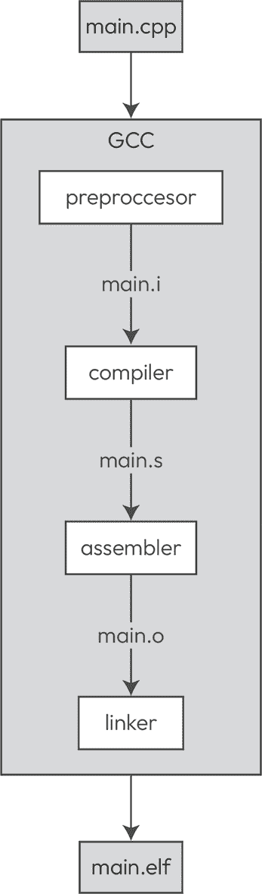

图 3.1 – GCC 编译过程

在**图 3.1**中，我们看到当使用 GCC 编译单个文件`main.cpp`时会发生什么：

1.  GCC 首先运行预处理器，添加所有由 `#include` 指令指定的头文件，并在翻译单元中展开宏。

1.  预处理器阶段的输出将通过编译器运行，生成汇编代码。

1.  汇编阶段的输出是一个目标文件。

1.  最后，链接器将目标文件与 C 和 C++ 标准库链接，并生成 ELF 文件。

GCC 驱动程序可以通过提供额外的参数来提供中间阶段的输出。要将预处理器输出重定向到标准输出，可以使用 `-E` 标志：

```cpp
arm-none-eabi-g++ -E main.cpp 
```

如果 `main.cpp` 包含了 **C 标准输入输出** (**cstdio**) 库，前面的命令将产生一个冗长的输出。您可以编写一个简单的 `hello world` 程序，并通过运行前面的命令亲自查看，或者您可以使用编译器探索器。

### 编译器探索器

**编译器探索器** ([`github.com/compiler-explorer/compiler-explorer`](https://github.com/compiler-explorer/compiler-explorer)) 是一个交互式在线编译器，它显示了编译的 C++、Rust、Go 和其他代码的汇编输出。您可以在网上尝试它 ([`godbolt.org/`](https://godbolt.org/))。这是一个非常棒的工具，默认情况下显示汇编输出，并且可以用来探索不同编译器和编译器标志下的不同语言特性。

让我们使用编译器探索器来探索 GCC 编译过程。我们将选择 **ARM GCC 11.2.1 (none)** 作为我们的编译器，并为其提供 `-E` 标志。**ARM GCC 11.2.1 (none)**，或 **arm-none-eabi-gcc**，是用于 Cortex-M 架构的 GCC。在下面的图中，我们可以看到编译器探索器中的预处理器输出：

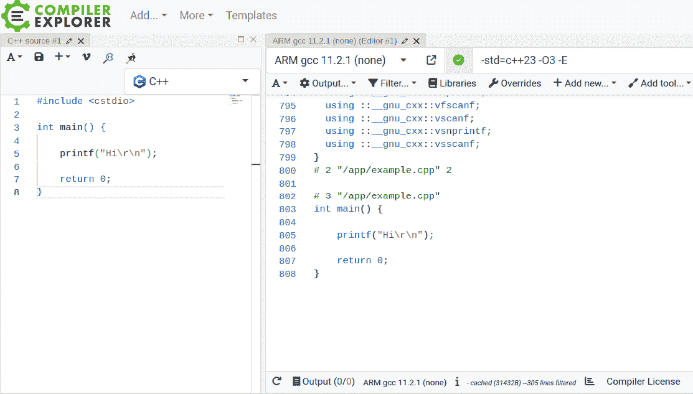

图 3.2 – 编译器探索器：预处理器输出

在 *图 3*.2 中，我们可以看到预处理器为我们简单的 `hello world` 示例增加了正好 800 行。预处理器遍历 `cstdio` 文件，解析所有预处理器指令，并将结果粘贴到翻译单元中，从而产生了 808 行代码。

编译器探索器的默认视图是汇编输出，我们可以通过简单地从上一个示例中移除 `–E` 标志来获取它，如下面的图所示：

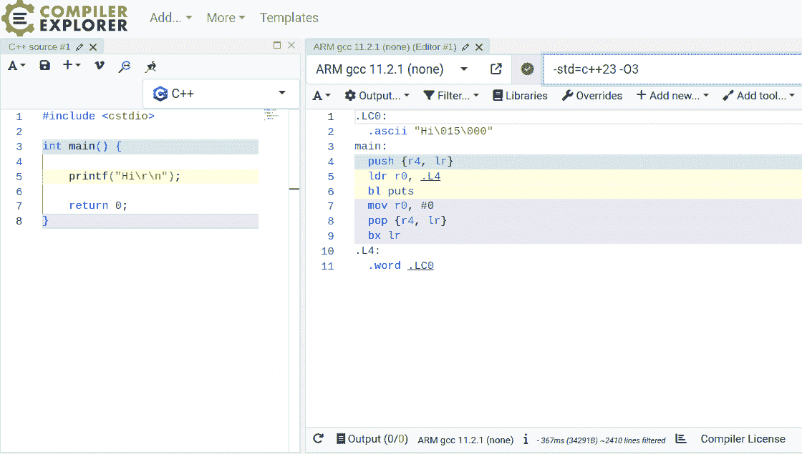

图 3.3 – 编译器探索器：汇编输出

在 *图 3*.3 中，我们可以看到 GCC 编译过程的生成汇编输出。我们可以看到优化过程用 `puts` 函数替换了 `printf` 函数。我们也看不到 `puts` 函数的主体，因为这个函数是我们链接的 C 标准库的一部分。该过程的下一步如下：

1.  编译器将生成汇编代码的目标代码。

1.  链接器将生成的目标代码与包含 `puts` 实现的 C 标准库链接（以及其他函数）。

在这个简单的例子中，我们经历了 GCC 的编译过程，这不会产生我们可以在微控制器上运行的代码，因为我们还需要执行以下步骤：

1.  添加时钟和硬件外设初始化代码。

1.  为我们的目标设置架构和指令集的编译器标志。

1.  添加包含复位处理程序和 C 和 C++运行时初始化的启动汇编脚本。

1.  添加一个链接脚本，为目标定义不同的内存区域，包括 RAM 和 Flash 区域。

1.  为链接器添加指令，以便链接到特定的 C 和 C++标准库。

GCC 编译过程的最后阶段的输出，即链接阶段，是一个**可执行和链接格式**（**ELF**）文件。ELF 文件使用 `objdump` 工具转换为二进制或十六进制格式，因为二进制和十六进制格式通常用于闪存过程，以便加载到目标设备上。

从版本 10 开始，GCC 集成了静态分析器，可以通过 `–fanalyzer` 编译器标志来启用。

# 静态分析器

**静态分析器**是遍历源代码并检测代码潜在问题的工具，例如检测未定义行为，或者检查代码是否符合 MISRA®或 AUTOSAR®等安全标准。并非所有静态分析器都具有相同的功能，只有商业版本支持安全标准检查。静态分析器可以检测到的一些问题如下：

+   使用未初始化的数据

+   越界数组访问

+   空指针解引用

+   除以零

+   删除后使用、双重删除和其他内存管理问题

我们可以通过向 GCC 驱动程序提供 `–fanalyzer` 标志来启用 GCC 的静态分析器。以下是一个简单的求和函数的例子，该函数接受一个 `std::array<int, 4>` 常量引用并返回以下示例中的总和：

```cpp
#include <array>
int sum(const std::array<int, 4> &arr) {
    int ret;
    for(int elem: arr) {
        ret += elem;
    }
    return ret;
} 
```

前一个例子的问题是我们没有将 `ret` 变量初始化为零。在 `sum` 函数中变量在栈上的分配过程中，`ret` 变量的值将被填充为分配位置上的任何内容，从而导致未定义行为。我们可以在编译器探索器中添加 `-fanalyzer` 标志并打开编译器输出，如图下所示截图：

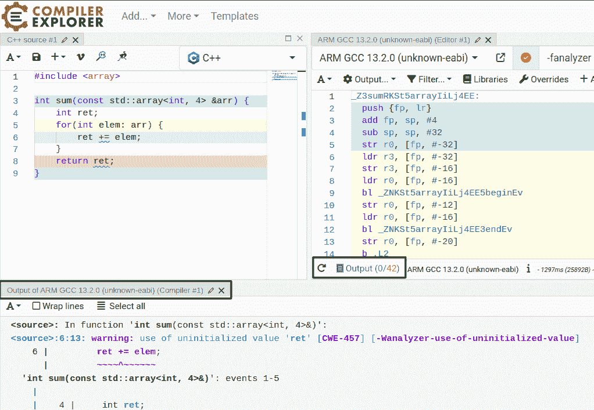

图 3.4 – 编译器探索器：静态分析器，使用未初始化的值

在 *图 3**.4* 中，我们可以看到编译器输出在一个新的平面上，这是通过点击 **输出（0/42）** 启用的。我们可以看到静态分析器已经识别出我们正在使用未初始化的变量，并发出了警告。GCC，像许多其他编译器一样，可以发出编译器警告，也可以检测代码中的不同问题，包括未初始化的变量。我们可以使用 `-Wall`、`-Wextra`、`-Wpedantic` 等标志启用常规编译器警告，但在这个情况下，它们不会捕获未初始化的变量。

我们可以在以下屏幕截图中看到这一点：

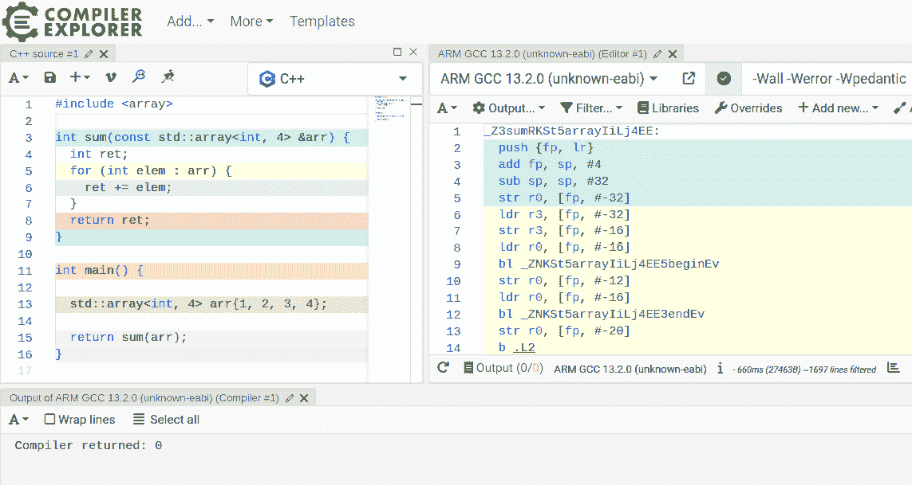

图 3.5 – Compiler Explorer：GCC 警告，未初始化值

在**图 3.5**中，我们可以看到 GCC 在常规编译器警告中并未对未初始化的数据发出警告。使用`–fanalyzer`标志启用静态分析器可以帮助检测问题，但也要记住静态分析需要更多时间，这可能在大型代码库中成为一个问题。还有一个 GCC 标志`–Wuninitialized`，它应该会对未初始化的变量生成警告。在这个特定的例子中，它只会在程序使用不同于 0 的优化标志（例如，`-O2`）编译时生成警告。

不同的编译器有不同的功能，包括检测代码中的问题。如果我们使用`clang`编译器编译这个例子（在 Compiler Explorer 中将编译器切换到**armv7-a clang 11.0.1**），我们会看到`clang`编译器会检测到这个未初始化变量的问题并发出警告。此外，静态分析器有不同的功能，因此运行代码通过几个静态分析器是一个好习惯，因为一个可能检测到其他分析器无法检测到的问题，反之亦然。

这里是静态分析器在检测越界访问时的另一个示例：

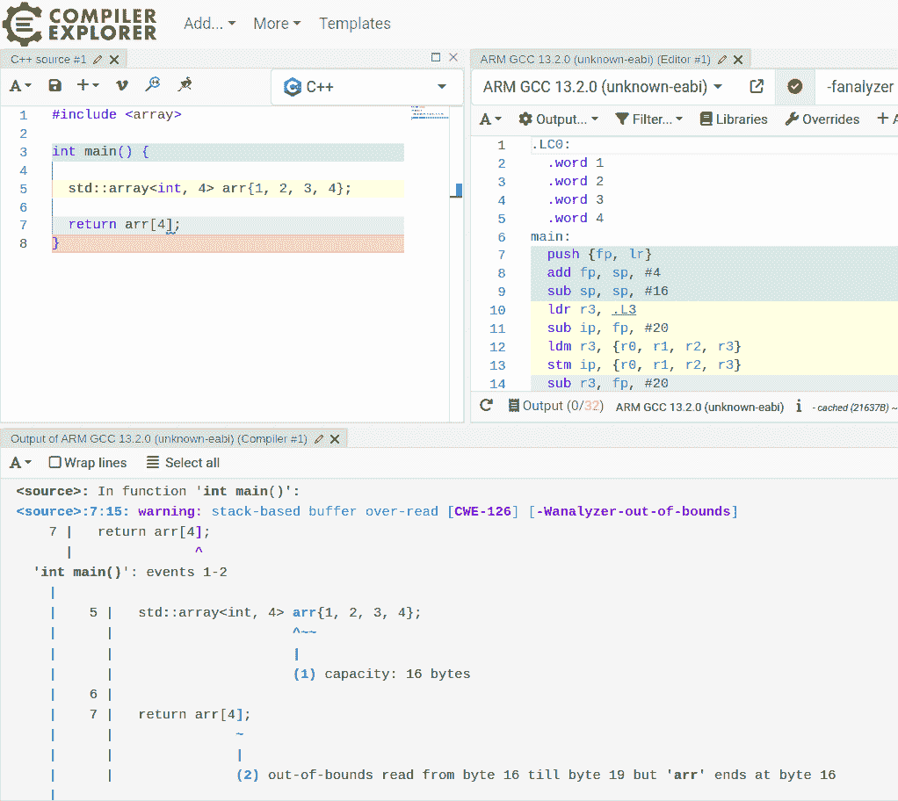

图 3.6 – Compiler Explorer：静态分析器，越界访问

在**图 3.6**中，我们正在尝试访问一个有四个元素的数组的第五个元素，这将导致未定义的行为。这个问题被 GCC 的静态分析器捕获，并发出描述性的警告。在 GCC 中，警告可以被当作错误处理，这将导致编译失败并且不会生成 ELF 文件。要将警告当作错误处理，只需在 GCC 驱动程序调用中添加`-Werror`编译器标志。

还有其他常用的静态分析器，最著名的是`clang-tidy`和`cppcheck`。`clang-tidy`可以通过 Compiler Explorer 中的**添加工具**选项启用。`clang-tidy`([`clang.llvm.org/extra/clang-tidy/`](https://clang.llvm.org/extra/clang-tidy/))和`cppcheck`([`cppcheck.sourceforge.io/`](https://cppcheck.sourceforge.io/))都易于安装和使用，如前所述，通常使用几个静态分析器来捕捉代码的不同问题是一个好主意。

静态分析器非常适合捕捉常见的编程错误和代码中可能的问题，或者确保代码符合安全标准，但它们不能保证代码确实做了它应该做的事情。为了验证我们固件的实际功能，我们可以在目标上手动测试，或者我们可以使用单元测试为我们的代码的各个部分编写测试用例。

# 单元测试

**单元测试**是通过使用提供测试设置、运行和报告基础设施的测试框架来测试代码单元的过程。那么，什么是代码单元呢？这取决于我们想要测试什么；它可以是函数或软件模块，或者我们可以将单元测试视为对工作单元的测试。当用户按下按钮时，固件需要做什么，或者如果我们通过**蓝牙低功耗**（**BLE**）连接接收到特定的数据包时，它需要做什么？

根据单元测试的粒度，我们可以在个体层面上测试固件的各个组件及其交互，以确保其正常功能。单元测试在与其他软件组件隔离的情况下测试代码单元或工作单元。这迫使我们关注这些单元的功能，并在开发过程中更容易地分配组件之间的责任，从而产生更健壮的软件。

由于生成的二进制文件大小，大多数 C++测试框架不适合在小型、嵌入式目标上运行，尤其是由于标准库中`ostream`的使用。这使我们有了在主机机器上而不是在嵌入式目标上运行单元测试的选择。这并不是说单元测试不能在嵌入式目标上运行。在目标上运行测试需要更多时间，因为所有测试都需要为目标编译并闪存到目标中，我们还需要在主机机器上有一个捕获报告的机制来读取测试结果。

在主机机器上运行目标外的测试是一种常见做法。然而，这种方法存在一些担忧，因为测试是在不同的架构上运行的，甚至数据类型的大小也可能不同。为了解决这个问题，可以强制使用固定宽度的数据类型（例如，`uint8_t`或`int32_t`）。此外，主机和目标机器使用的编译器之间可能存在差异，因此建议使用相同的编译器版本。在主机机器上运行测试更快、更简单，但架构和设置之间的差异可能会对测试结果产生影响。存在手动目标测试、系统和集成测试，这些测试可以发现代码功能中的潜在问题，并作为功能验证的额外层。

对于 C++，存在不同的测试框架，以下是一些最常用的：

+   Google Test

+   Catch2

+   Boost.Test

+   CppUTest

我们可以在编译器探索器中轻松尝试它们，通过添加相关的库。首先要做的是添加一个**仅执行**面板，如图所示：

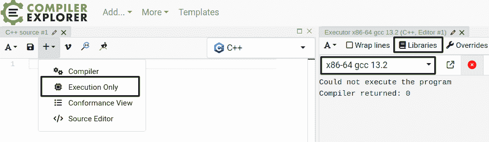

图 3.7 – 编译器探索器：执行面板

在*图 3.7*中，我们添加了一个执行面板，并选择**x86-64 gcc 13.2**作为编译器。现在，我们需要通过在执行面板中点击**库**按钮来添加 Google Test 库。它将打开一个新窗口，我们可以在此搜索库并将其包含在内，如图所示：

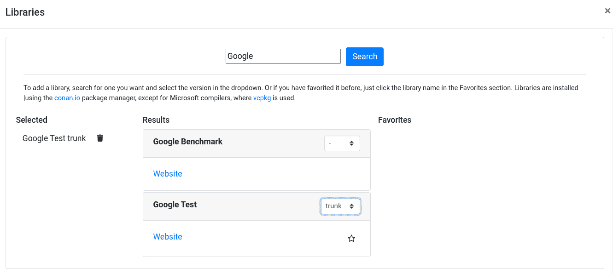

图 3.8 – 编译器探索器：包含库

在*图 3.8*中，我们搜索 Google Test 库，并通过在下拉菜单中选择版本将其添加到项目中。让我们看看如何使用 Google Test 测试第一章中提到的通用环形缓冲区实现。以下是与环形缓冲区实现和几个简单测试相关的代码：

```cpp
#include <array>
#include <cstdio>
#include "gtest/gtest.h"
template <class T, std::size_t N> struct ring_buffer {
  std::array<T, N> arr;
  std::size_t write_idx = 0;
  std::size_t read_idx = 0;
  std::size_t count = 0;
  void push(T t) {
    arr.at(write_idx) = t;
    write_idx = (write_idx + 1) % N;
    if (count < N) {
      count++;
    } else {
      read_idx = (read_idx + 1) % N;
    }
  }
  T pop() {
    if (count == 0) {
      return T{};
    }
    T value = arr.at(read_idx);
    read_idx = (read_idx + 1) % N;
    --count;
    return value;
  }
  bool is_empty() const {
      return count == 0;
  }
  std::size_t get_count() const {
      return count;
  }
};
TEST(RingBufferInt, PushPop) {
    ring_buffer<int, 2> rb;
    rb.push(1);
    rb.push(2);
    EXPECT_EQ(rb.pop(), 1);
    EXPECT_EQ(rb.pop(), 2);
}
TEST(RingBufferInt, GetCount) {
    ring_buffer<int, 20> rb;
    for(int i = 0; i < 50; i++) {
        rb.push(i);
    }
    EXPECT_EQ(rb.get_count(), 20);
    for(int i = 0; i < 10; i++) {
        rb.pop();
    }
    EXPECT_EQ(rb.get_count(), 10);
}
int main() {
  testing::InitGoogleTest();
  return RUN_ALL_TESTS();
} 
```

在前面的例子中，环形缓冲区实现与第一章相同，增加了`get_count`方法，该方法返回缓冲区当前持有的元素数量。我们使用`TEST`宏定义了一个测试套件，名为`RingBufferInt`。我们指定了两个测试，分别命名为`PushPop`和`GetCount`。

在`PushPop`测试中，我们正在测试环形缓冲区的`push`和`pop`功能，确保`pop`将使用`EXPECT_EQ`宏按正确顺序返回推送的值。

在`GetCount`测试中，我们通过以下场景检查缓冲区持有的元素数量是否与预期功能匹配：

1.  我们首先向缓冲区推送 50 个值，该缓冲区最多可以容纳 20 个值，确保`get_count`将返回`20`。

1.  然后，我们从缓冲区中弹出 10 个值，并检查计数是否等于`10`。

运行前面的程序将在标准输出上生成 Google Test 的报告，如图所示：

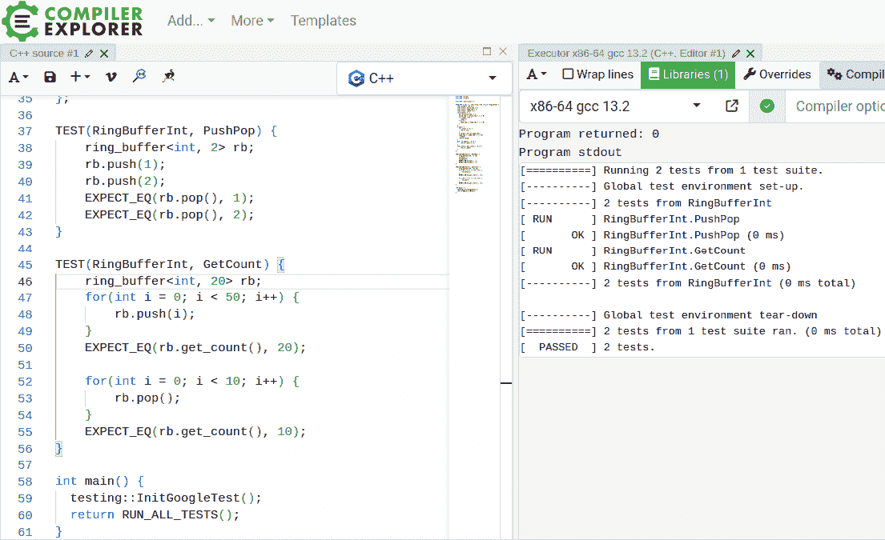

图 3.9 – 编译器探索器：Google Test 执行

在*图 3.9*中，我们可以在执行面板中看到测试的结果。`TEST`宏将确保测试自动注册到框架中，因此我们不需要手动添加。这使我们能够专注于编写利用框架提供的基础设施的测试。Google Test 提供了更多功能，这个例子只是对其能力的一瞥。

编写单元测试让我们思考我们的代码如何与系统中的其他软件模块交互。通过关注代码单元，我们可以编写松散耦合的代码，使我们的软件更加灵活和健壮。单元测试对于像**测试驱动开发**（**TDD**）这样的开发技术至关重要，它要求我们在编写代码之前编写测试。在编写单元测试后，我们编写实际代码只是为了通过测试，然后添加更多测试，重构实现，并迭代这个过程。

单元测试是验证我们代码功能的有效工具，无论我们在目标设备还是主机平台上运行它们。然而，它们并没有告诉我们很多关于固件性能的信息。为了做到这一点，我们需要在目标设备上运行生产固件，并使用性能分析工具来测量性能。

# 性能分析

在目标设备上运行代码并进行性能分析是确保关键功能**最坏情况执行时间**（**WCET**）的最佳方法，并在必要时进行必要的优化。

性能分析的挑战在于它是一种侵入性操作，因为代码源需要修改或插桩以启用可以告诉我们更多关于目标内部发生情况的跟踪。

性能分析依赖于目标设备的能力。一些核心集成了用于跟踪的单元，正如我们在上一章中看到的，这提供了最小侵入性的性能分析。此外，一些目标设备具有特殊的接口，允许通过连接到主机的高级调试和跟踪探针进行高速跟踪数据传输。以下图示展示了用于某些 Cortex-M 目标设备的性能分析基础设施示例：

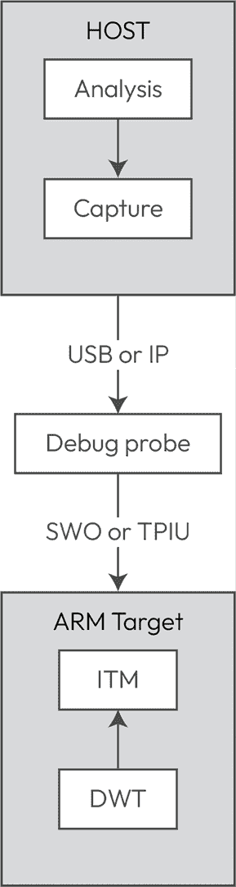

图 3.10 – 通过调试探针连接到主机机的 Arm 目标设备

在**图 3.10**中，我们可以看到一个通过调试探针连接到主机机的 Arm 目标设备。性能分析或跟踪数据流可以通过以下步骤进行描述：

1.  使用 DWT 对**程序计数器**（**PC**）进行采样并生成一个事件。

1.  ITM 通过**单线输出 SWO**将 DWT 生成的事件和插桩代码发送到调试探针。

1.  调试探针将跟踪数据通过 USB 传输到主机上的捕获软件。

1.  捕获软件通常是更大软件包的一部分，可以分析和可视化捕获到的接收数据。

为了获得关于函数执行时间的精确信息，源代码需要通过添加生成跟踪数据的指令来进行**代码插桩**。我们在上一章中看到了如何使用 GCC 编译器的功能为每个函数的入口和退出添加指令来实现这一点。这些数据可以通过 ITM 发送到在主机上运行的性能分析软件。这种方法具有很好的准确性，但通过向代码中添加指令，我们为了测量目的而降低了性能。

PC 采样可能比代码插桩更不侵入，但它的准确性较低，只能用于检测固件中的瓶颈，而无需精确的计时信息。

一些 Arm 核心集成了**嵌入式跟踪宏单元**（**ETM**）。ETM 记录指令执行，生成跟踪数据，并将其发送到连接的探头。有了指令跟踪数据，性能分析器可以精确测量函数的执行时间，并为每个函数调用创建调用图，就像代码仪器化一样。ETM 使得在不产生仪器化成本的情况下进行代码性能分析成为可能。

**代码仪器化**仍然是一个非常常见的方法，因为它对目标集成的跟踪能力依赖较少。SEGGER 的 SystemView 是嵌入式目标性能分析器的一个例子。正如我们在上一章中简要讨论的，我们需要在目标上使用 SEGGER 的 SystemView 和 RTT 库来启用跟踪生成。在下面的内容中，您可以看到 SystemView 生成的数据：

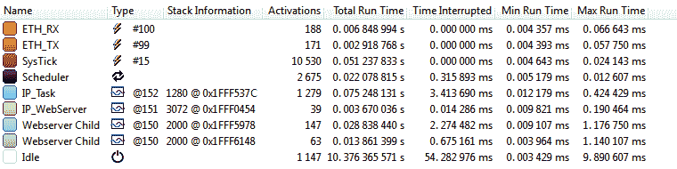

图 3.11 – SystemView

在*图 3.11*中，我们可以看到来自仪器化固件的功能名称，包括最小和最大运行时间。性能分析代码可以帮助优化固件中时间关键部分，从而确保系统的时序要求。

# 摘要

在本章中，我们发现了嵌入式领域 C++开发的可用工具。有各种各样的开发环境和编译器。虽然商业解决方案提供保证支持，并且有工具的功能安全版本，但免费工具也很常见，如果需要甚至可以合格。

静态分析器可以帮助避免常见的编程问题，并确保符合安全指南。通过使用单元测试，我们可以验证我们固件的功能，而性能分析器可以帮助检测瓶颈、测量 WCET 以及确保时序要求。

在下一章中，我们将使用选定的免费工具为嵌入式应用创建 C++的开发环境。

# 加入我们的 Discord 社区

加入我们社区的 Discord 空间，与作者和其他读者进行讨论：

[`packt.link/embeddedsystems`](https://packt.link/embeddedsystems)


