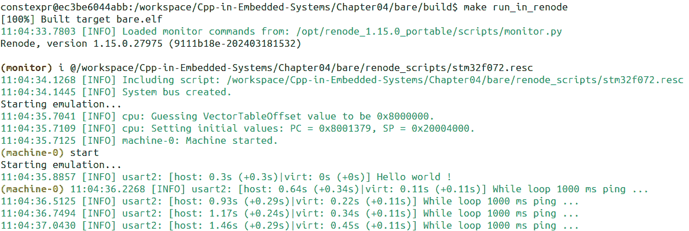

# 设置 C++嵌入式项目的开发环境

在上一章中，我们探讨了嵌入式工具生态系统，并回顾了行业中最广泛使用的工具。现在，我们将为现代嵌入式开发环境和其各个组件设定要求。然后，我们将设置我们的开发环境，以便运行本书剩余部分提供的示例。

集成环境的主要卖点之一是它们易于使用。它们通过简单的安装步骤为您提供所需的一切。另一方面，定制环境需要单独安装所有组件，包括每个组件的所有依赖项。确保可重复构建和可靠的调试环境非常重要，因此容器化定制环境具有重要意义。

您将获得一个用于本书中使用的开发环境的 Docker 容器，但我们将单独分析其所有组件。了解我们日常工作中使用的工具对于理解和控制其背后的流程是必要的。

在本章中，我们将涵盖以下主要主题：

+   现代软件开发环境的要求

+   容器化开发环境

+   容器化开发环境和 Visual Studio Code

# 技术要求

对于本章，您需要安装 Docker（[`www.docker.com/）。`](https://www.docker.com/) 请遵循为您的特定操作系统提供的安装说明。本章将指导您完成下载和运行具有预配置开发环境的容器的基本步骤。对于更高级的 Docker 使用，请参阅他们网站上可用的官方 Docker 文档。

本章的代码可在 GitHub 上找到（[`github.com/PacktPublishing/Cpp-in-Embedded-Systems/tree/main/Chapter04）。`](https://github.com/PacktPublishing/Cpp-in-Embedded-Systems/tree/main/Chapter04)。)

# 现代软件开发环境的要求

**固件开发**与其他任何形式的软件开发没有区别，我们使用的工具对于有效工作至关重要。为了尽可能使本书和示例易于访问，我们设定的第一个要求是使用免费工具。**编译器**是每个开发要求的基础和最重要的部分，因此让我们定义要求并选择适合我们需求的编译器。

## 编译器

由于我们正在探索现代 C++，因此我们需要支持 C++23 标准的编译器。**ARM GNU Toolchain**（基于 GCC）的最新版本是 13.2；它支持 C++23 且免费。它也是 ARM 开发中最常用的免费编译器工具链，使其成为我们的编译器的完美选择。

ARM GNU 工具链包含 C 和 C++ 编译器，**GNU 调试器**（**GDB**），我们将用它进行调试，以及其他有用的工具，如 `objcopy`、`objdump`、`size` 等，可以从 [`developer.arm.com/downloads/-/arm-gnu-toolchain-downloads.`](https://developer.arm.com/downloads/-/arm-gnu-toolchain-downloads.) 下载。我们需要的 Arm Cortex-M 架构是 `arm-none-eabi`。

ARM GNU 工具链 `arm-none-eabi` 可用于所有常见的主机架构：

+   GNU/Linux x86_64 和 AArch64 主机架构

+   仅适用于 Windows x86 主机架构（兼容 `x86_64`）

+   macOS x86_64 和 Apple Silicon

编译单个文件或少数几个文件就像在终端运行几个命令一样简单，但构建即使是简单的嵌入式项目也涉及以下步骤：

1.  编译所有 C 和 C++ 源文件、包含主函数的文件，以及至少来自 **硬件抽象层**（**HAL**）的几个文件。你将在 *第十二章* 中了解更多关于 HAL 的内容。

    1.  设置编译器包含路径。

    1.  设置编译器 C 和 C++ 标志。

    1.  设置编译器定义宏。

    1.  编译启动汇编脚本。

    1.  设置链接器选项，包括链接器脚本、静态库、CPU 架构和指令集以及标准库选项。

在这样做之后，我们必须将 ELF 文件转换为闪存程序常用的其他格式，例如 `bin` 和 `hex`。

在终端手动运行所有这些任务将是一个繁琐的过程，因此我们开发环境的下一个要求是 *构建自动化*。构建自动化的第一个候选者是 **make** 工具。它是一个常用的工具，用于自动化不同行业中大量软件项目。它非常适合这项任务，但它是一个语法古怪的老工具。然而，我们可以使用 **CMake**，这是一个更灵活的工具，具有更现代的语法，可以为我们生成 Makefiles。

## 构建自动化

**CMake** 不是一个实际的构建自动化工具，但它为其他自动化工具生成文件，例如 make 工具。它是跨平台的、免费的、开源的构建自动化过程软件，涉及测试、打包和安装软件。它通过使用编译器无关的方法来实现。

我们将使用 **CMake** 来帮助我们为 make 工具生成目标，该工具将执行以下操作：

+   配置源文件，包括路径和链接器设置以构建 ELF 文件

+   将 ELF 文件转换为十六进制和二进制格式

+   启动模拟器并加载生成的 ELF 文件

我们将使用构建自动化工具不仅来构建固件，还要启动将运行固件的模拟器。

## 模拟器

为了使本书对更广泛的读者群体可访问，我们将使用 **模拟器** 来运行为 ARM Cortex M 目标编译的示例。**Renode** ([`github.com/renode/renode`](https://github.com/renode/renode)) 是一个开源的模拟框架，对 ARM 目标有良好的支持。

Renode 允许您运行具有多个目标的模拟，并在它们之间模拟无线和有线连接。我们将使用一个简单场景，其中涉及在单个目标上运行模拟。Renode 还可以启动 GDB 服务器，允许您连接到它并调试目标。

我们将使用高度可配置的 **Visual Studio Code** 集成模拟执行和调试，以及编译器和构建自动化。

## 代码编辑器

**Visual Studio Code** 是一个现代且灵活的代码编辑器。它为我们提供了将所有工具集成到单个环境中的所有扩展。我们将在 Visual Studio Code 中安装以下扩展：

+   **C/C++**：此扩展提供语法高亮、代码自动完成和代码导航

+   **Cortex-Debug**：此扩展允许通过 GDB 进行调试

+   **CS 128 Clang-Tidy**：此扩展将 clang-tidy 集成到 Visual Studio Code 中

+   **Dev Containers**：此扩展将连接到正在运行的容器，并用于开发目的

我们将基于 Docker 容器构建我们的开发环境。Visual Studio Code 将连接到该容器并使用它。

# 容器化开发环境

Visual Studio Code Dev Containers 扩展允许 Visual Studio Code 连接到一个正在运行的 Docker 容器，并使用其中安装的所有工具。要使用此功能，我们需要构建一个容器。

我们将使用 Docker 构建以下工具的容器：

+   ARM GNU Toolchain 版本 13.2

+   CMake 和 make 工具

+   Renode 版本 1.14

请确保您已按照官方网站上提供的说明在主机机器上安装了 Docker ([`docs.docker.com`](https://docs.docker.com))。

您可以在本书的 GitHub 仓库中找到用于构建容器的 **Dockerfile** ([`github.com/PacktPublishing/Cpp-in-Embedded-Systems`](https://github.com/PacktPublishing/Cpp-in-Embedded-Systems))，位于 `Chapter04` 文件夹中。

您还可以从 Docker Hub ([`hub.docker.com/`](https://hub.docker.com/)) 下载一个镜像。您可以使用以下命令拉取它：

```cpp
$ docker pull mahmutbegovic/cpp_in_embedded_systems:latest 
```

请确保按照您平台上的说明启动了 Docker 守护进程；它们可在官方网站上找到。在下载镜像后，使用以下命令启动 Docker：

```cpp
$ docker run -d -it --name dev_env mahmutbegovic/cpp_in_embedded_systems 
```

这将在分离和交互模式下启动 Docker 容器。如果您已经使用 `docker run` 命令创建了一个 Docker 容器，您需要通过运行以下命令来启动它：

```cpp
$ docker start dev_env 
```

要访问已启动容器的 bash，我们可以使用以下命令：

```cpp
$ docker exec -it dev_env /bin/bash 
```

如以下截图所示，我们可以运行各种命令以确保容器中已安装编译器、调试器、模拟器和其它工具：


图 4.1 – 开发环境容器 bash

*图 4.1*显示了使用我们用来检查已安装工具版本的命令所期望的输出。

我们可以使用运行中的容器作为一个自包含的环境。让我们首先通过克隆项目 GitHub 仓库([`github.com/PacktPublishing/Cpp-in-Embedded-Systems):`](https://github.com/PacktPublishing/Cpp-in-Embedded-Systems):)开始

```cpp
$ git clone https://github.com/PacktPublishing/Cpp-in-Embedded-Systems.git 
```

完成这些后，转到`Chapter04/bare`文件夹。这个文件夹包含我们将要在 Renode 中运行的 STM32F072 的*Hello, World!*示例固件。项目组织成以下文件夹：

+   `app`: 包含业务层代码，包括`main.cpp`

+   `hal`: 包含 HAL C++代码

+   `平台`: 包含特定平台的代码，包括 C 语言中的 ST 提供的 HAL 层、CMSIS、启动脚本和链接脚本

+   `renode_scripts`: 包含 Renode 模拟器脚本

在项目文件夹中，你也会看到`CMakeLists.txt`，这是一个我们将用来指定如何构建固件的 CMake 文件。让我们通过一个例子来学习如何使用 CMake。

## 使用 CMake 构建 Hello, World!程序

我们可以使用 CMake 指定工具链、源文件、编译器包含路径和编译器标志。在 CMake 文件中，我们必须做的第一件事是指定正在使用的 CMake 版本，如下所示：

```cpp
cmake_minimum_required(VERSION 3.13) 
```

CMake 是一个强大的工具，它允许我们编写高度灵活的构建文件。我们可以在单独的文件中编写工具链细节并将它们包含在主项目文件中，这样我们就可以为不同的架构重用它们。然而，在我们的例子中，我们在主 CMake 文件中包含工具链细节。以下行指定了各种工具链组件：

set(CMAKE_C_COMPILER “arm-none-eabi-gcc”)

set(CMAKE_CXX_COMPILER “arm-none-eabi-g++”)

set(CMAKE_ASM_COMPILER “arm-none-eabi-gcc”)

使用`CMAKE_C_COMPILER`、`CMAKE_CXX_COMPILER`和`CMAKE_ASM_COMPILER` CMake 变量，我们分别指定 C、C++和汇编编译器的路径。我们需要使用所有三个，因为我们的项目包含用 C 编写的 ST 提供的 HAL、我们的 C++代码和一个汇编启动脚本。

现在，我们必须通过在`CMakeLists.txt`文件中运行以下行来指定各种编译器选项和预处理器宏：

set(CDEFS “-DUSE_HAL_DRIVER -DSTM32F072xB”）

set(MCU “-mcpu=cortex-m0 -mthumb”)

set(COMMON_FLAGS “${MCU} ${CDEFS} -fdata-sections -ffunction-sections -Wno-address-of-packed-member -Wall -Wextra -Wno-unused-parameter”)

set(CMAKE_C_FLAGS “${COMMON_FLAGS}”)

set(CMAKE_CXX_FLAGS “${COMMON_FLAGS} -Wno-register -fno-exceptions -fno-rtti -fno-threadsafe-statics”)

在这里，我们设置了 `USE_HAL_DRIVER` 和 `STM32F072xB` 编译时宏，这些宏由 ST 的 HAL 使用。然后，我们设置了用于 C 和 C++ 文件的编译器标志：

+   `-mcpu=cortex-m0` 和 `-mthumb`：架构特定的标志。

+   `-fdata-sections`: 此选项告诉编译器将数据项放置在结果对象文件中的自己的部分。这可以用于优化目的（删除未使用的部分）。

+   `-ffunction-sections`: 与 `-fdata-sections` 类似，但用于函数。每个函数都获得自己的部分，允许链接器可能丢弃未使用的函数。

+   `-Wno-address-of-packed-member`: 抑制与结构体打包成员的地址相关的警告。

+   `-Wall`: 启用所有推荐的正常操作中的常见警告消息。

+   `-Wextra`: 启用 `-Wall` 未启用的额外警告标志。

    +   `-Wno-unused-parameter`: 禁用关于函数中未使用参数的警告。

然后，我们设置 C++ 特定的编译器标志：

+   `-Wno-register`: 禁用关于使用 `register` 关键字的警告，该关键字在现代 C++ 中已弃用，但可能在旧代码中使用

+   `-fno-exceptions`: 禁用 C++ 中的异常支持

+   `-fno-rtti`: 禁用 **运行时类型信息**（**RTTI**）

+   `-fno-threadsafe-statics`: 防止编译器使用额外的代码来确保静态局部变量以线程安全的方式初始化

我们 CMake 文件的下一部分是项目特定的：我们必须声明一个新的项目，给它一个名称，启用我们想要使用的语言，并指定 CMake 目标、源文件和链接器选项。

这是我们的 C++（混合 C）项目的基本设置编译器设置：

```cpp
project(bare VERSION 1.0.6)
enable_language(C CXX ASM)
set(CMAKE_CXX_STANDARD 17)
set(CMAKE_CXX_STANDARD_REQUIRED True)
# global include directories
include_directories(
  ${CMAKE_SOURCE_DIR}/platform/inc
  ${CMAKE_SOURCE_DIR}/platform/CMSIS/Device/ST/STM32F0xx/Include
${CMAKE_SOURCE_DIR}/platform/CMSIS/Include
${CMAKE_SOURCE_DIR}/platform/STM32F0xx_HAL_Driver/Inc
  ${CMAKE_SOURCE_DIR}/app/inc
  ${CMAKE_SOURCE_DIR}/hal/uart/inc
  ${CMAKE_SOURCE_DIR}/hal/inc
  )
set(EXECUTABLE ${PROJECT_NAME}.elf)
add_executable(
  ${EXECUTABLE}
  platform/STM32F0xx_HAL_Driver/Src/stm32f0xx_hal.c
  platform/STM32F0xx_HAL_Driver/Src/stm32f0xx_hal_cortex.c
  platform/STM32F0xx_HAL_Driver/Src/stm32f0xx_hal_gpio.c
  platform/STM32F0xx_HAL_Driver/Src/stm32f0xx_hal_rcc.c
  platform/STM32F0xx_HAL_Driver/Src/stm32f0xx_hal_uart.c
  platform/STM32F0xx_HAL_Driver/Src/stm32f0xx_hal_uart_ex.c
  platform/startup_stm32f072xb.s
  platform/src/stm32f0xx_hal_msp.c
  platform/src/stm32f0xx_it.c
  platform/src/system_stm32f0xx.c
  app/src/main.cpp
  hal/uart/src/uart_stm32.cpp
  ) 
```

在前面的 CMake 代码中，我们有 `TARGET`。这代表一个由 CMake 构建的对象实体，无论是整个固件（可执行文件）还是静态库。在我们的例子中，目标是整个固件，目标名称是通过项目名称和 `.elf` 后缀创建的，这意味着 CMake 将为我们创建一个 `bare.elf` 目标。

剩下的步骤是使用以下行指定链接器选项：

```cpp
target_link_options(
  ${EXECUTABLE}
  PUBLIC
  -T${CMAKE_SOURCE_DIR}/platform/STM32F072C8Tx_FLASH.ld
  -mcpu=cortex-m0
  -mthumb
  -specs=nano.specs
  -Wl,--no-warn-rwx-segments
  -Wl,-Map=${PROJECT_NAME}.map,--cref
  -Wl,--gc-sections) 
```

这里，我们指定了要使用的链接脚本——即 `STM32F072C8Tx_FLASH.ld`——设置目标 CPU 和指令集，并指定要创建的新-lib nano 系统库和映射文件。

现在，让我们使用 CMake 构建固件。

## 使用 CMake 构建固件

这里，我们将创建一个构建文件夹，并使用以下命令在 `Debug` 模式下配置构建：

```cpp
$ cd Cpp-in-Embedded-Systems/Chapter04/bare/
$ mkdir build && cd build
$ cmake .. -DCMAKE_BUILD_TYPE=Debug 
```

如果你使用 `ls –l` 列出构建文件夹中的文件，你会看到 CMake 生成的 `Makefile`，它用于构建固件。让我们运行它来构建固件：

```cpp
$ make -j4 
```

你应该看到以下输出：


图 4.2 – 构建固件

*图 4.2* 显示了构建固件的结果。我们可以使用以下命令在 Renode 中运行生成的 ELF 文件，`bare.elf`：

```cpp
$ make run_in_renode 
```

这将使用 `renode_scripts` 文件夹中的 `stm32f072.resc` Renode 脚本启动模拟器。脚本将使用 STM32F072 目标架构创建一个新的 Renode 机器，并用 `bare.elf` 文件加载它。我们将看到以下内容作为终端输出的部分：



图 4.3 – 在 Renode 中运行固件

*图 4.3* 显示了在 Renode 控制台模式下（禁用 GUI）运行的模拟器输出。要停止模拟，请输入 *q* 并按 *Enter*。

请记住，如果你停止或重置 Docker 容器，包括克隆的 GitHub 仓库在内的所有更改都将丢失。为了防止这种情况发生，你需要使用 `docker commit` 命令保存它们。

到目前为止，我们有一个包含在 Docker 容器中的相当的开发环境。然而，为了充分利用它，我们必须将其连接到 Visual Studio Code。

# 容器化开发环境和 Visual Studio Code

要开始，请安装 Visual Studio Code ([`code.visualstudio.com/`](https://code.visualstudio.com/))。完成此操作后，转到 **Extensions** 并搜索并安装以下扩展：

+   C/C++

+   Cortex-Debug

+   CS 128 Clang-Tidy

+   Dev Containers

完成这些操作后，打开 **View**| **Command Palette** (*Ctrl* + *Shift* + *P*)，找到 **Dev Containers: Attach to Running Container** 并选择 `dev_env`。这应该会打开一个新的 Visual Studio Code 窗口，其中容器的名称位于左下角的状态栏中：


图 4.4 – Visual Studio Code 连接到正在运行的容器

*图 4.4* 显示 Visual Studio Code 已成功连接到正在运行的容器。现在，让我们打开位于 `/workspace/Cpp-in-Embedded-Systems/Chapter04/bare` 的项目文件夹。在 **EXPLORER** 视图中打开 `main.cpp` 文件，并在第 23 行设置断点，如下面的截图所示：


图 4.5 – 在 Visual Studio Code 中设置断点

在设置断点，如图 *图 4.5* 所示后，选择 **Run**| **Start Debugging** (*F5*)。这将执行以下操作：

+   以调试模式配置项目

+   启动模拟器和加载 ELF

+   将 GDB 客户端连接到模拟器中运行的 GDB 服务器

+   允许你在模拟器中调试目标运行程序

如果一切设置正确，程序流程将在第 23 行停止，你将看到以下输出：


图 4.6 – Visual Studio Code 程序流程

*图 4.6* 显示程序流程在第 23 行停止。我们可以切换到 **TERMINAL** 视图来查看 Renode 的输出。Renode 处于控制台模式，它也会显示 **UART**。让我们切换到 **TERMINAL** 视图并按 **Continue** (*F5*)。你应该会看到以下输出：


图 4.7 – Visual Studio Code Renode 输出

在 *图 4.7* 中，我们可以看到 Visual Studio Code 的 **终端** 视图中的 Renode 输出。为了能够调试汇编文件，我们需要在 Visual Studio Code 中执行以下操作：

1.  前往 **文件**|**首选项**|**设置**。

1.  搜索“允许在任何地方设置断点”并选择相关复选框。

现在，我们可以在 **platform/startup_stm32f072xb.s** 的第 87 行设置断点，停止调试会话，然后再次运行。程序流程应该停止，如下所示：


图 4.8 – Visual Studio Code 汇编调试

在 *图 4.8* 中，我们可以看到程序流程在汇编启动脚本的第 87 行执行了 `SystemInit` 函数，在 `main` 函数之前。如果我们使用 **进入** (*F11*)，程序流程将进入 `SystemInit` 函数，Visual Studio Code 将打开 `platform/src/system_stm32f0xx.c` 文件。如果我们继续使用 **单步执行** (*F10*)，最终会进入 `main` 函数。这表明 `main` 不是第一个被调用的函数。

注意，`startup_stm32f072xb.s` 中的 `Reset_Handler` 是固件的入口点。这在链接脚本（`platform/STM32F072C8Tx_FLASH.ld`）中定义。它执行以下操作：

+   **初始化堆栈指针**：它从堆栈的末尾（`_estack`）设置初始堆栈指针。

+   **复制数据**：它将初始化值从闪存复制到 SRAM 的数据部分，以确保初始化的全局/静态变量被正确设置。

+   **零 BSS**：通过将其设置为零来清除 BSS 部分，这对于未初始化的全局/静态变量是必需的。

+   **调用 SystemInit**：`SystemInit` 函数用于设置默认系统时钟（系统时钟源、PLL 乘数和除数因子、AHB/APBx 预分频器以及闪存设置）。

+   **调用 __libc_init_array**：`__libc_init_array` 函数用于初始化 C++ 程序中的静态构造函数或在 C 程序中运行初始化函数。

+   **调用 main**：此操作结束启动脚本的活动，并将程序流程转移到 `main` 函数。

现在我们已经完全设置了现代开发环境，我们准备好深入学习嵌入式系统的 C++ 了。Renode 模拟器使我们能够高效地运行、测试和调试我们的固件，消除了在开发初期阶段需要物理硬件的需求。这为嵌入式系统学习和测试提供了一个灵活且高效的解决方案。

# 摘要

在本章中，我们定义了嵌入式系统 C++ 开发环境的组件。我们使用 Docker 容器遍历了所有组件，并将其连接到 Visual Studio Code，以实现无缝的开发体验和调试。

我们还使用 CMake 设置了编译器标志，通过 Renode 模拟器运行了固件，并通过调试器逐步执行相关的汇编启动脚本，学习了如何设置我们的 C 和 C++运行时环境。

在下一章中，我们将使用本章创建的开发环境来学习更多关于 C++中的类。
