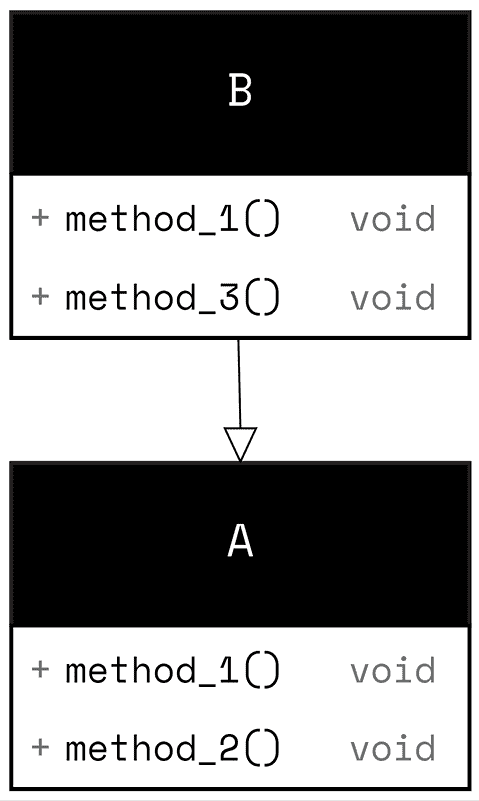
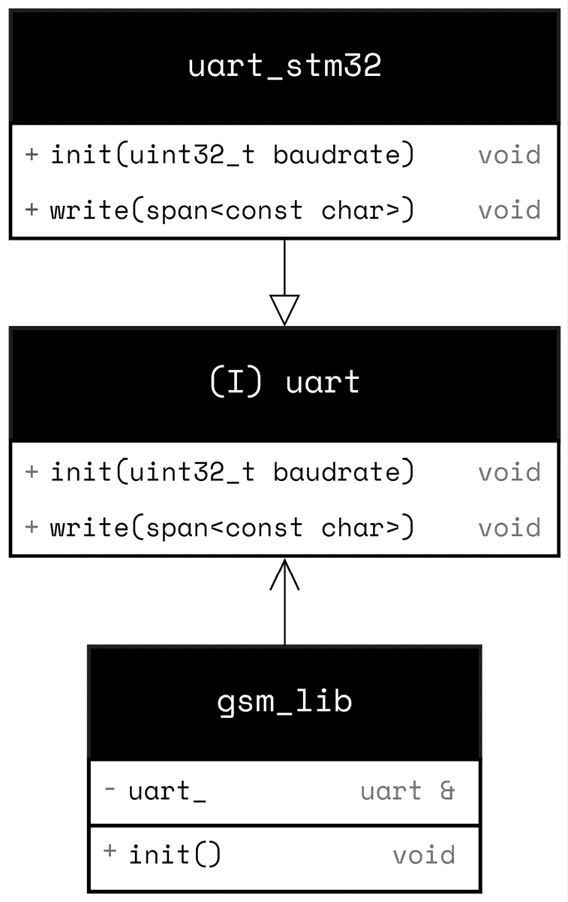

# 类 – C++应用程序的构建块

**类**在 C++中是组织代码成逻辑单元的手段。它们允许我们将数据以及对这些数据进行操作的函数按照蓝图进行结构化。这些蓝图可以用来构建类的实例，即所谓的**对象**。我们可以通过初始化对象来赋予它们数据，通过调用它们上的函数或方法来操作它们，将它们存储在容器中，或者将它们的引用传递给其他类的对象，以实现系统不同部分之间的交互。

类是 C++应用程序的基本构建块。它们帮助我们以具有独立责任、反映与其他系统部分依赖和交互的单元组织代码。它们可以组合或扩展，使我们能够重用其功能并添加额外的功能。我们使用它们来抽象嵌入式系统不同部分，包括低级组件，如**通用异步收发传输器**（**UART**）驱动程序和库，或业务逻辑组件，如蜂窝调制解调器库。

本章的目标是深入探讨 C++类，并学习我们如何使用它们来编写更好的代码。在本章中，我们将涵盖以下主要主题：

+   封装

+   存储持续时间和初始化

+   继承和动态多态

# 技术要求

为了充分利用本章内容，我强烈建议在阅读示例时使用编译器探索器（[`godbolt.org/`](https://godbolt.org/))。选择 GCC 作为您的编译器，并针对 x86 架构。这将允许您看到标准输出（stdio）结果，并更好地观察代码的行为。由于我们使用了大量的现代 C++特性，请确保在编译器选项框中添加`-std=c++23`以选择 C++23 标准。

本章的示例可在 GitHub 上找到（[`github.com/PacktPublishing/Cpp-in-Embedded-Systems/tree/main/Chapter05`](https://github.com/PacktPublishing/Cpp-in-Embedded-Systems/tree/main/Chapter05))。

# 封装

**封装**是一种编程概念，它将代码组织成包含数据和操作这些数据的函数的单元。它与**面向对象编程**（**OOP**）并不严格相关，并且常用于其他编程范式。封装允许我们将代码解耦成具有单一职责的单元，使得代码更容易推理，提高可读性，并便于维护。

在面向对象编程的术语中，封装还可以指隐藏对象成员或限制外部对这些成员的访问。在 C++中，这可以通过使用访问说明符来实现。C++有以下说明符：

+   公共

+   私有

+   受保护的

**公共**和**私有**是最常用的修饰符。它们赋予我们控制类接口的能力，即控制哪些类成员对类的用户可用。以下示例演示了如何定义具有公共和私有访问部分的类，展示了封装的概念：

```cpp
#include <cstdint>
class uart {
public:
    uart(std::uint32_t baud = 9600): baudrate_(baud) {}
    void init() {
        write_brr(calculate_uartdiv());
    }
private:
    std::uint32_t baudrate_;
    std::uint8_t calculate_uartdiv() {
        return baudrate_ / 32000;
    }
    void write_brr(std::uint8_t) {}
};
int main () {
    uart uart1(115200);
    uart1.init();
    return 0;
} 
```

在这个例子中，`uart` 类有公共和私有访问部分。让我们一步一步地分析代码：

+   `public` 部分包括一个构造函数，用于初始化 `baudrate_` 私有成员变量

+   我们在公共部分还有一个 `init` 方法，在其中我们使用 `write_brr` 私有方法将一个值写入一个**波特率寄存器**（**BRR**），这是 STM32 平台特有的

+   写入到 BRR 寄存器的值是在 `calculate_uartdiv` 私有方法中计算的

如我们所见，`uart` 类中具有公共访问修饰符的方法可以使用私有成员变量和方法。然而，如果我们尝试在 `uart1` 对象上使用 `write_brr`，如 `uart1.write_brr(5)`，则程序的编译将失败。

私有访问修饰符允许我们隐藏类（在这种情况下，`main` 函数）用户的方法和数据。这有助于我们在 C++ 中为类定义一个清晰的接口。通过控制用户可以使用的哪些方法，我们不仅保护了类，也保护了用户免受不受欢迎的行为。

这个例子旨在解释 C++ 中的访问修饰符，但让我们也用它来解释 `init` 方法。如果我们已经有了构造函数，为什么还需要它？

`init` 的目的是允许我们完全控制硬件的初始化。对象也可以作为全局或静态变量构造。静态和全局对象的初始化是在到达 `main` 函数并初始化硬件之前完成的。这就是为什么在嵌入式项目中常见的 `init` 方法。使用它，我们可以确保所有硬件外设都按正确的顺序初始化。

C++ 中类的默认访问修饰符是私有，因此我们可以将上一个示例中的 `uart` 类定义写为以下内容：

```cpp
class uart {
    std::uint32_t baudrate_;
    std::uint8_t calculate_uartdiv();
    void write_brr(std::uint8_t);
public:
    uart(std::uint32_t baud = 9600);
    void init();
}; 
```

我们选择明确定义私有访问部分。我们将其放在 `public` 部分之后，因为公开可访问的成员是类的接口，当你阅读代码和类定义时，你首先想看到的是接口。你想要看到如何与类交互，以及哪些方法是公共接口的一部分，你可以使用它们。

在这个例子中，我们只有一个数据成员 `baudrate_`。它是私有的，`uart` 类的用户设置它的唯一选项是通过构造函数。对于我们要公开的数据成员，定义设置器和获取器是一种常见的做法。

## 设置器和获取器

在 `uart` 类中，我们可以为 `baudrate_` 成员定义如下设置器和获取器：

```cpp
 std::uint32_t get_baudrate() const{
        return baudrate_;
    }
    void set_baudrate(baudrate) {
        baudrate_ = baudrate;
    } 
```

现在，这使我们能够通过公共接口设置和获取 `baudrate` 值，但这些简单的设置器和获取器并没有为我们的接口增加任何价值。它们只是暴露了 `baudrate_` 成员。如果我们将它放在公共访问指定符下，效果是一样的。设置器和获取器应该有一个明确的目的。例如，设置器可以包含验证逻辑，如下所示：

```cpp
 void set_baudrate(baudrate) {
        if (baudrate <= c_max_baudrate) {
            baudrate_ = baudrate;
        } else {
            baudrate = c_max_baudrate;
        }
    } 
```

在修改后的设置器中，我们对要设置的值进行合理性检查，并且只有在这样做有意义的情况下才设置私有成员，否则将其设置为系统支持的最高波特率 (`c_max_baudrate`)。这只是一个例子；在 UART 初始化后更改波特率可能没有意义。

通过设置器和获取器暴露数据成员在一定程度上破坏了封装。封装的想法是隐藏实现细节，而数据成员是实现细节。因此，设置器和特别是获取器应该谨慎使用，并且只有在它们有明确意义时才使用。

我们可以使用 C++ 中的类来封装仅有的功能，而不包含数据，或者数据是类中所有用户共同拥有的。为此，我们可以使用静态方法。

## 静态方法

**静态方法** 是使用 `static` 关键字声明的 C++ 方法，它们可以在不实例化对象的情况下访问。在 `uart` 类示例中，除了构造函数外，我们还有 `init` 方法，它是公共接口的一部分。我们通过调用之前使用单参数构造函数创建的对象上的此方法来使用它，并提供波特率。我们也可以设计 `uart` 类为具有所有静态方法的类型，并如下使用它：

```cpp
#include <cstdint>
class uart {
public:
    static void init(std::uint32_t baudrate) {
        write_brr(calculate_uartdiv(baudrate));
    }
private:
    static std::uint8_t calculate_uartdiv(std::uint32_t baudrate) {
        return baudrate / 32000;
    }
    static void write_brr(std::uint8_t) {}
};
int main () {
    uart::init(115200);
    return 0;
} 
```

正如你所见，我们移除了单参数构造函数，并将所有方法声明为静态。我们还移除了 `baudrate_` 私有数据成员，并直接从 `init` 方法传递给 `calculate_uartdiv` 方法。现在我们有一个可以在不创建对象实例的情况下使用的类型。我们通过在类名后跟一个双冒号和方法名来调用 `init` 方法，如 `main` 函数中所示。值得注意的是，静态方法只能使用类中的静态数据成员和其他静态函数，因为非静态成员需要对象实例化。

我们可以使用命名空间在 C++ 中将函数分组到一个共同的 *单元* 中。然而，将它们分组到类型中是有用的，因为我们可以将类型作为模板参数传递。我们将在本书的后面讨论命名空间和模板，以更好地理解这种方法的优点。命名空间将在 *第六章* 中讨论，模板将在 *第八章* 中讨论。

在 C++ 中，我们还可以使用 struct 关键字来定义一个类型。结构体成员的默认访问级别是公共的。从历史上看，结构体用于与 C 兼容，因此可以为在 C 和 C++ 程序中使用的库编写头文件。在这种情况下，我们将在 C 和 C++ 程序之间共享的结构体只能包含公共数据类型，不能有作为成员的方法。

## 结构体

**结构体**在 C++ 中通常用于只包含我们希望公开提供给用户的具有数据成员的类型。它们与类大致相同，区别在于默认访问级别，结构体的默认访问级别是公共的。

这里是一个只包含数据成员的结构体示例：

```cpp
struct accelerometer_data {
    std::uint32_t x;
    std::uint32_t y;
    std::uint32_t z;
}; 
```

`accelerometer_data` 可以由一个 `sensor` 类生成，存储在一个 `ring_buffer` 类中，并由一个 `sensor_fusion` 类使用。`accelerometer_data` 类的成员是从 `x`、`y` 和 `z` 轴的值，并且它们对该类的用户是公开的。

在这种情况下，我们只使用 `accelerometer_data` 结构体作为数据持有者，并将与此数据相关的行为实现在其他地方。这只是一个示例。在简单结构体中结构化数据与使用具有数据和复杂行为的类之间的设计选择取决于具体的应用。

结构体也用于将函数分组为类型。它们通常都被声明为静态，并公开提供给用户。在这种情况下，使用结构体而不是类是方便的，因为默认访问指定符是公共的，这也反映了我们的意图，因为结构体通常用于所有成员都是公开的情况下。

除了公共和私有访问指定符之外，C++ 中还有一个**受保护的指定符**。受保护的指定符与继承有关，将在本章后面解释。

现在我们来讨论构造函数和 C++ 中变量和对象的初始化。对象初始化是一个重要的任务，未能正确执行可能会在程序中引起问题。我们将讨论对象初始化的不同选项，并分析潜在的问题以及如何避免它们。

# 存储持续时间和初始化

C++ 中具有自动存储期的对象在声明时初始化，在退出变量作用域时销毁。对象也可以具有静态存储期。对象的成员数据也可以有静态存储指定符，并且对这些成员的初始化有一些规则。我们将首先介绍非静态成员的初始化。

## 非静态成员初始化

初始化非静态类成员有不同的方法。当我们讨论初始化和 C++ 时，首先想到的是构造函数。虽然构造函数是强大的 C++ 功能，允许我们对初始化有很好的控制，但让我们从**默认成员初始化器**开始。

### 默认成员初始化

自 C++11 以来，我们可以在类定义中直接为成员设置默认值，如下所示：

```cpp
class my_class{
    int a = 4;
    int *ptr = nullptr;
} 
```

如果我们使用任何预 C++11 标准编译此代码片段，它将无法编译。默认成员初始化器允许我们在类定义中为类成员设置默认值，这提高了可读性，并使我们免于在多个构造函数中设置相同的成员变量。这对于设置指针的默认值尤其有用。

如果我们没有为 `ptr` 使用默认初始化器，它将加载内存中的某个随机值。解引用这样的指针会导致从随机位置读取或写入，可能引发严重故障。这种假设情况会被编译器或静态分析器检测到，因为它们会报告使用未初始化的值，这是未定义的行为。尽管如此，这显示了使用默认值初始化成员变量的重要性，而默认成员初始化器是完成此任务的选项之一。

### 构造函数和成员初始化列表

构造函数是类定义中的无名称方法，不能被显式调用。它们在对象初始化时被调用。一个可以无参数调用的构造函数被称为默认构造函数。我们在 `uart` 类的示例中已经看到了一个：

```cpp
 uart(std::uint32_t baud = 9600): baudrate_(baud) {
    // empty constructor body
    } 
```

尽管这个构造函数有一个参数，但我们使用了默认参数，如果它无参数被调用，这个参数将被提供给构造函数。如果在调用点没有提供参数，`baud` 参数将使用默认值 `9600`。

当我们想要使用默认构造函数时，我们使用以下语法：

```cpp
 uart uart1; 
```

这也被称为**默认初始化**，当对象声明时没有初始化器时执行。请注意，这里没有括号，因为这会导致语法歧义，并且编译器会将其解释为函数声明。

```cpp
 uart uart1(); 
```

前一行会被编译器解释为声明一个名为 `uart1` 的函数，该函数返回 `uart` 类的对象，并且不接受任何参数。这就是为什么我们在使用默认构造函数时没有使用括号的原因。

由于我们的 `uart` 类构造函数也可以接受参数，我们可以使用直接初始化语法，并为构造函数提供一个参数，如下所示：

```cpp
 uart uart1(115200); 
```

这将调用 `uart` 类构造函数，并为 `baud` 参数提供一个 `115200` 的值。虽然我们已经解释了与默认构造函数语法相关的细微差别，但我们仍然需要解释 `baudrate_` 成员变量的初始化。在这种情况下，我们使用成员初始化列表。它指定在冒号字符之后和复合语句的开括号之前，作为 `baudrate_(baud)`。在我们的例子中，成员初始化列表中只有一个条目；如果有更多，它们用逗号分隔，如下例所示：

```cpp
class sensor {
public:
    sensor(uart &u, std::uint32_t read_interval):
                uart_(u),
                read_interval_(read_interval) {}
private:
    uart &uart_;
    const std::uint32_t read_interval_;
};
int main() {
    uart uart1;
    sensor sensor1(uart1, 500);
    return 0;
} 
```

在前面的代码中，我们在`sensor`构造函数的成员初始化列表中初始化了对`uart`的引用和`read_interval_`无符号整数。

需要注意的重要事项是`uart`类对象的引用。在 C++中，引用类似于 C 中的指针；也就是说，它们指向一个已经创建的对象。然而，它们在声明时需要初始化，并且不能重新赋值以指向另一个对象。引用和`const`限定成员必须使用成员初始化列表进行初始化。

构造函数可以有零个或多个参数。如果一个构造函数有一个参数并且没有使用**显式指定符**声明，它被称为转换构造函数。

### 转换构造函数和显式指定符

**转换构造函数**允许编译器将其参数的类型隐式转换为类的类型。为了更好地理解这一点，让我们看一下以下示例：

```cpp
#include <cstdio>
#include <student>
struct uart {
    uart(std::uint32_t baud = 9600): baudrate_(baud) {}
    std::uint32_t baudrate_;
};
void uart_consumer(uart u) {
   printf("Uart baudrate is %d\r\n", u.baudrate_);
}
int main() {
    uart uart1;
    uart_consumer(uart1);
    uart_consumer(115200);
    return 0;
} 
```

本例中有趣的部分是使用`115200`参数调用`uart_consumer`函数。`uart_consumer`函数期望以`uart`类的对象作为参数，但由于隐式转换规则和现有的转换构造函数，编译器使用`115200`作为参数构造了一个`uart`类的对象，导致程序输出以下内容：

```cpp
Uart baudrate is 9600
Uart baudrate is 115200 
```

隐式转换可能是不安全的，并且通常是不希望的。为了防止这种情况，我们可以使用显式指定符声明一个构造函数，如下所示：

```cpp
 explicit uart(std::uint32_t baud = 9600): baudrate_(baud) {} 
```

使用显式构造函数编译前面的示例将导致编译错误：

```cpp
<source>:19:19: error: could not convert '115200' from 'int' to 'uart'
   19 |     uart_consumer(115200); 
```

通过将构造函数声明为显式，我们可以确保我们的类的用户不会创建可能导致程序中不希望的行为的潜在隐式转换的情况。但如果我们想防止使用浮点类型调用我们的构造函数呢？这可能不是一个很好的例子，但你可以想象一个期望`uint8_t`类型的构造函数，有人用`uint32_t`参数调用它。

我们可以删除特定的构造函数，这将导致编译失败。我们可以在类声明中使用以下语法来完成此操作：

```cpp
 uart(float) = delete; 
```

使用浮点类型调用构造函数将导致以下编译错误：

```cpp
<source>:12:25: error: use of deleted function 'uart::uart(float)'
   12 |     uart uart1(100000.0f); 
```

我们还可以使用花括号列表初始化，这限制了转换并防止了浮点数到整数的转换。我们可以如下使用它：

```cpp
 uart uart1{100000.0f}; 
```

此调用将导致以下编译错误：

```cpp
<source>:11:25: error: narrowing conversion of '1.0e+5f' from 'float' to 'uint8_t' {aka 'unsigned char'} [-Wnarrowing]
   11 |     uart uart1{100000.0f}; 
```

列表初始化限制了隐式转换，并有助于在编译时检测问题。

类数据成员可以使用`static`关键字声明，并且对它们的初始化有一些特殊规则。

## 静态成员初始化

静态成员与类或结构体的对象无关。它们是具有静态存储期的变量，可以由类的任何对象访问。让我们通过一个简单的例子来更好地理解静态成员以及我们如何初始化它们：

```cpp
#include <cstdio>
struct object_counter {
    static int cnt;
    object_counter() {
        cnt++;
    }
    ~object_counter() {
        cnt--;
    }
};
int object_counter::cnt = 0;
int main() {
    {
        object_counter obj1;
        object_counter obj2;
        object_counter obj3;
        printf("Number of existing objects in this scope is: %d\r\n",
 object_counter::cnt);
    }
    printf("Number of existing objects in this scope is: %d\r\n", 
 object_counter::cnt);
    return 0;
} 
```

在这个例子中，我们有一个简单的 `object_counter` 结构体。该结构体有一个静态数据成员，即 `cnt` 整数。在构造函数中，我们增加这个计数器变量，在析构函数中，我们减少它。在 `main` 函数中，我们在一个未命名的范围内创建了三个 `object_counter` 对象。

当程序流程退出未命名的范围时，将调用析构函数。我们在范围内部和离开它之后打印现有对象的数量。在未命名的范围内，`cnt` 的值应该等于 `3`，因为我们创建了三个对象，当我们退出它，并且析构函数减少 `cnt` 变量时，它应该为 `0`。以下示例的输出如下：

```cpp
Number of existing objects in this scope is: 3
Number of existing objects in this scope is: 0 
```

输出显示 `cnt` 静态变量的行为正如我们所预测的那样。在这种情况下，我们在类声明中声明了一个静态变量，但使用以下行定义它：

```cpp
int object_counter::cnt = 0; 
```

根据 C++17 标准，可以在结构体（或类）定义中使用 `inline` 说明符声明静态变量，并提供初始化器，如下所示：

```cpp
struct object_counter {
    inline static int cnt = 0;
    ...
}; 
```

这使得代码更加简洁，更容易使用，因为我们不需要在类定义外部定义变量，并且更容易阅读。

我们已经介绍了 C++ 中类的基础知识，包括访问说明符、初始化方法和构造函数。现在，我们将看到如何通过继承和动态多态来重用类。

# 继承和动态多态

在 C++ 中，我们可以通过继承来扩展类的功能，而无需修改它。继承是建立类之间层次关系的例子；例如，`ADXL345` 是一个加速度计。让我们通过一个简单的例子来演示 C++ 中的继承：

```cpp
#include <cstdio>
class A {
public:
    void method_1() {
        printf("Class A, method1\r\n");
    }
    void method_2() {
        printf("Class A, method2\r\n");
    }
protected:
    void method_protected() {
        printf("Class A, method_protected\r\n");
    }
};
class B : public A{
public:
    void method_1() {
        printf("Class B, method1\r\n");
    }
    void method_3() {
        printf("Class B, method3\r\n");
        A::method_2();
        A::method_protected();
    }
};
int main() {
    B b;
    b.method_1();
    b.method_2();
    b.method_3();
    printf("-----------------\r\n");
    A &a = b;
    a.method_1();
    a.method_2();
    return 0;
} 
```

在这个例子中，`class B` 从 `class A` 继承了私有和受保护的成员。`class A` 是基类，`class B` 从它派生。派生类可以访问基类的公共和受保护成员。在 `main` 函数中，我们创建了一个 `class B` 的对象，并调用了 `method_1`、`method_2` 和 `method_3` 方法。这部分代码的输出如下所示：

```cpp
Class B, method1
Class A, method2
Class B, method3
Class A, method2
Class A, method_protected 
```

在 `main` 函数的第一行，我们看到对对象 `b` 的 `method_1` 函数的调用执行了 `class B` 中定义的 `method_1`，尽管它继承自 `class A`，而 `class A` 也定义了 `method_1`。这被称为 **静态绑定**，因为调用 `method_1` 的决定是在 `class A` 中定义的，并且由编译器做出。

派生类 `class B` 的对象包含基类 `class A` 的对象。如果我们对对象 `b` 调用 `method_2` 方法，编译器将在 `class B` 中找不到定义，但由于类 `B` 继承自类 `A`，编译器将调用对象 `a` 的 `method_2` 方法，而对象 `a` 是对象 `b` 的一部分。

在 `method_3` 中，我们看到我们可以从派生类中调用基类的函数。我们还可以看到我们可以调用基类的受保护方法。这是私有访问说明符的一个用例；它允许对派生类进行访问。

我们可以将派生类的对象赋值给基类引用。我们也可以对指针做同样的事情。以下是方法调用结果：

```cpp
Class A, method1
Class A, method2 
```

对基类引用调用 `method_1` 将导致调用 `class A` 中定义的 `method_1`。这是静态绑定作用的一个例子。但如果我们想让对基类引用或指针的调用在派生类中执行函数呢？我们为什么要这样做？让我们首先解决“如何做”的问题。C++ 通过虚函数提供了一种动态绑定的机制。

## 虚函数

在我们的例子中，我们将类型为 `A&` 的引用赋值给 `class B` 的对象。如果我们想让对这个引用（`A& a`）的 `method_1` 调用执行 `class B` 中定义的 `method_1` 函数，我们可以在 `class A` 中将 `method_1` 声明为虚函数，如下所示：

```cpp
class A {
public:
    virtual void method_1() {
        printf("Class A, method1\r\n");
    }
...
}; 
```

现在，对绑定到 `class B` 对象的 `class A` 引用上的 `method_1` 调用将导致调用 `class B` 中定义的 `method_1`，正如我们在输出中看到的那样：

```cpp
Class B, method1
Class A, method2 
```

这里，我们看到 `method_1` 调用的输出与 `class B` 中此方法的定义相匹配。我们说 `class B` 覆盖了 `class A` 中的 `method_1`，对此有一个特殊的术语，如下所示：

```cpp
class B: public A {
public:
    void method_1() override {
        printf("Class B, method1\r\n");
    }
...
}; 
```

**override** 关键字让编译器知道我们有意覆盖基类中的虚方法。如果我们覆盖的方法没有被声明为虚方法，编译器将引发错误。

C++ 中的虚函数通常使用虚表来实现。这是编译器为我们完成的工作。它创建一个虚表，存储每个虚函数的指针，这些指针指向覆盖的实现。

### 虚函数实现

每个覆盖虚函数的类都有一个虚表。你可以把它想象成一个隐藏的功能指针表。类的每个对象都有一个指向这个表的指针。这个指针在运行时用于访问表并找到在对象上要调用的正确函数。让我们稍微修改一下 `class A` 和 `class B`，以便更好地理解这一点。以下是被修改的 `class A` 和 `class B` 的代码：

```cpp
class A {
public:
    void method_1() virtual{
        printf("Class A, method1\r\n");
    }
    void method_2() virtual{
        printf("Class A, method2\r\n");
    }
};
class B : public A{
public:
    void method_2() override{
        printf("Class B, method2\r\n");
    }
 }; 
```

我们修改了 `class A` 和 `class B`，使得 `class A` 有两个虚方法，`method_1` 和 `method_2`。`class B` 只覆盖 `method_2`。编译器将为 `class B` 生成一个虚表和一个指针，每个 `class B` 的对象都将持有这个指针。虚指针指向生成的虚表。

这可以如下可视化：


图 5.1 – 虚表

*图 5.1* 展示了在 C++ 中使用虚表和虚指针实现虚函数的可能实现。如果我们对一个 `类 B` 对象的引用调用 `method_2`，它将跟随虚指针到虚表，并选择指向 `类 B` 中 `method_2` 实现的函数指针，即重写的虚函数。这种机制发生在运行时。有一个间接层来获取重写的函数，这导致了空间和时间开销。

在 C++ 中，我们可以定义一个虚函数为纯虚函数。如果一个类有一个纯虚函数，它被称为 **抽象类**，并且不能被实例化。派生类必须重写纯虚函数，否则它们也是抽象类。让我们通过以下代码示例来了解：

```cpp
class A {
public:
    virtual void method_1() = 0;
};
class B : public A{
};
int main() {
    B b;
    return 0;
} 
```

这个程序将无法编译，因为 `类 B` 没有重写从 `类 A` 继承来的 `method_1` 虚函数。抽象类将某些行为（方法）的实现责任转移到派生类。所有方法都是虚方法的类被称为接口。

继承定义了类之间的层次关系，我们可以说 `类 B` 是 `类 A` 的子类，就像猫是动物一样。我们可以在 **统一建模语言**（**UML**）图中表示这种关系。

### UML 类图

UML 图用于描述软件组件。如果它们描述了类之间的关系，它们被称为 UML 类图。以下图示展示了这样一个图：



图 5.2 – 类 A 和类 B 关系的 UML 图

*图 5.2* 展示了一个 UML 类图，可视化 `A` 和 `B` 之间的层次关系。连接 `B` 和 `A` 的空心、未填充的三角形箭头指向 `A` 表示 `B` 是 `A` 的子类。这个 UML 图还显示了两个类中都有的方法。

UML 图对于描述设计模式很有用，我们将在本书中使用它们来帮助我们可视化代码示例中软件组件之间的关系。

我们已经学习了继承是什么以及我们如何使用虚函数来实现动态绑定。让我们回到为什么我们需要这些机制以及我们如何使用它们来创建更好的软件的问题。本章我们学习的机制提供了动态（运行时）多态性的手段。

## 动态多态性

**多态性** 是一种机制，它使不同类型具有单一接口。它可以是静态的或动态的。C++ 中的动态多态性是通过继承和虚函数实现的。这种多态性也称为 **子类型化**，因为它基于基类的接口处理子类型或派生类。

多态允许我们使用单个接口来实现不同的功能。让我们通过一个 GSM 库的例子来了解一下。GSM 模拟器通常通过 UART 接口与主机微控制器通信。一个微控制器可能有多个 UART 外设，例如 STM32 上的 UART 和 **低功耗通用异步收发传输器** (**LPUART**)。我们可能还希望在不同的微控制器上使用此库。

我们可以为不同平台上的不同 UART 实现定义一个通用接口，并在我们的 GSM 库中使用此接口。UART 的实现将由我们使用 GSM 库的平台提供，并且它将实现通用 UART 接口。我们可以使用 UML 类图来可视化我们的库设计，如下图所示：



图 5.3 – GSM 库和 UART 接口的 UML 图

在 *图 5**.3 中，我们看到 `gsm_lib`、`uart` 和 `uart_stm32` 类之间的关系。GSM 库的功能在 `gsm_lib` 类中实现，它使用 `uart` 接口。`uart` 接口由 `uart_stm32` 类实现。GSM 库的功能很复杂，但让我们通过一个非常简化的代码示例来展示这三个类之间的关系以及它们是如何协同工作的。以下是一个简化的示例：

```cpp
#include <span>
#include <cstdio>
#include <cstdint>
class uart {
public:
    virtual void init(std::uint32_t baudrate) = 0;
    virtual void write(std::span<const char> data) = 0;
};
class uart_stm32 : public uart{
public:
    void init(std::uint32_t baudrate = 9600) override { 
        printf("uart_stm32::init: setting baudrate to %d\r\n", baudrate);
    } 
    void write(std::span<const char> data) override {
        printf("uart_stm32::write: ");
        for(auto ch: data) {
            putc(ch, stdout);
        }
    }
};
class gsm_lib{
    public:
        gsm_lib(uart &u) : uart_(u) {}
        void init() {
            printf("gsm_lib::init: sending AT command\r\n");
            uart_.write("AT");
        }
    private:
        uart &uart_;
};
int main() {
    uart_stm32 uart_stm32_obj;
    uart_stm32_obj.init(115200);
    gsm_lib gsm(uart_stm32_obj);
    gsm.init();
    return 0;
} 
```

在这个代码示例中，我们看到 `uart` 类有两个纯虚函数，这使得它成为一个接口类。这个接口被 `uart_stm32` 类继承并实现。在 `main` 函数中，我们创建了一个 `uart_stm32` 类的对象，其引用被传递到 `gsm_lib` 类的构造函数中，在那里它被用来初始化一个指向 `uart` 接口的私有成员引用。

您也可以在上一章中提到的模拟器环境中运行此程序。它位于 `Chapter05/gsm_lib` 文件夹中。

使用 UART 接口设计的 GSM 库使我们能够拥有一个灵活的库，我们可以在不同的平台上使用。这种设计还允许我们通过提供用作夹具的 UART 实现来调试库与 GSM 模拟器之间的通信，该实现将重定向读取和写入操作，并同时记录它们。

# 摘要

在本章中，我们介绍了 C++ 中类的基础知识。我们学习了成员访问说明符、初始化对象的不同方式以及继承。我们还更详细地了解了虚函数，并学习了如何使用它们来实现动态多态。

在下一章中，我们将更多地讨论 C++ 中的其他基本概念，例如命名空间、函数重载和标准库。

# 加入我们的 Discord 社区

加入我们社区的 Discord 空间，与作者和其他读者进行讨论：

[`packt.link/embeddedsystems`](https://packt.link/embeddedsystems)


