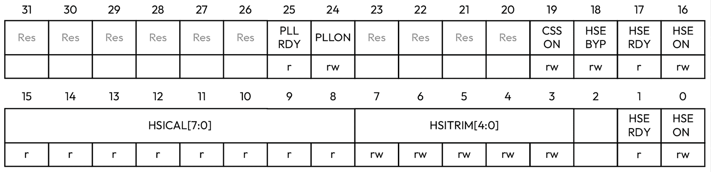

# 12

# 编写 C++ HAL

**硬件抽象层**（**HAL**）是嵌入式项目中的核心软件组件。它通过提供一个易于使用的接口来简化与硬件外围设备的交互，该接口抽象了硬件细节。HAL 管理内存映射外围寄存器的读写，允许您使用 GPIO、定时器和串行通信接口等外围设备，而无需直接处理低级硬件的细节。它通常支持同一系列内的多个设备。

通过使用 HAL，固件可以在不同设备和同一供应商的类似系列设备之间变得更加便携。它隐藏了内存映射外围设备的寄存器布局，使得在各种设备上重用驱动程序和业务逻辑变得更加容易。HAL 处理特定平台的细节，使开发者能够专注于应用程序而不是硬件的细微差别。它还管理不同系列**微控制器**（**MCU**）之间的差异。

建议使用供应商提供的 HAL，通常以 C 库的形式提供，因为它们经过充分测试并定期维护。然而，在某些情况下，可能需要直接与内存映射外围设备工作，因此在本章中，我们将探讨 C++技术，这些技术可以帮助您编写更安全、更易于表达的 HAL。在本章中，我们将涵盖以下主题：

+   内存映射外围设备

+   定时器

# 技术要求

本章的示例可在 GitHub 上找到（[`github.com/PacktPublishing/Cpp-in-Embedded-Systems/tree/main/Chapter12`](https://github.com/PacktPublishing/Cpp-in-Embedded-Systems/tree/main/Chapter12)）。为了充分利用本章内容，请在 Renode 模拟器中运行示例。

# 内存映射外围设备

**内存映射外围设备**允许程序通过读取和写入特定内存地址来控制硬件设备。外围寄存器和 RAM 都映射到相同的地址空间，使得与硬件寄存器的通信变得如同写入和读取指向这些位置的指针一样简单。

在本书前面的示例中，我们使用了一个用 C 语言编写的 ST 提供的 HAL，它通过**通用微控制器软件接口标准**（**CMSIS**）头文件来控制硬件外围设备。

CMSIS 是一个针对基于 Arm Cortex 的微控制器的供应商独立 HAL 和软件库集合。由 Arm 开发，它标准化了硬件访问和配置，简化了软件开发，并提高了不同制造商之间的代码可移植性。每个微控制器供应商都提供自己的 CMSIS 实现，将核心 API 和驱动程序适配到其特定设备。接下来，我们将探讨 STM32F072 微控制器的内存映射外围设备的 CMSIS 实现。

## CMSIS 内存映射外围设备

CMSIS 中的寄存器访问通过指向描述寄存器布局的结构体的指针进行建模。CMSIS 定义了表示内存映射外围设备指针的宏。

根据 CMSIS 命名约定，结构体使用外设名称缩写和`_TypeDef`后缀命名。**复位和时钟控制**（**RCC**）外设结构体命名为`RCC_TypeDef`。它在示例项目中定义在`platform/CMSIS/Device/ST/STM32F0xx/Include/stm32f072xb.h`文件中，如下所示：

```cpp
typedef struct
{
  __IO uint32_t CR;         /* Address offset: 0x00 */
  __IO uint32_t CFGR;      /* Address offset: 0x04 */
  __IO uint32_t CIR;       /* Address offset: 0x08 */
  __IO uint32_t APB2RSTR;  /* Address offset: 0x0C */
  __IO uint32_t APB1RSTR;  /* Address offset: 0x10 */
  __IO uint32_t AHBENR;    /* Address offset: 0x14 */ 
  __IO uint32_t APB2ENR;   /* Address offset: 0x18 */ 
  __IO uint32_t APB1ENR;   /* Address offset: 0x1C */  
  __IO uint32_t BDCR;      /* Address offset: 0x20 */  
  __IO uint32_t CSR;       /* Address offset: 0x24 */   
  __IO uint32_t AHBRSTR;   /* Address offset: 0x28 */  
  __IO uint32_t CFGR2;     /* Address offset: 0x2C */
  __IO uint32_t CFGR3;     /* Address offset: 0x30 */
  __IO uint32_t CR2;       /* Address offset: 0x34 */
} RCC_TypeDef; 
```

在同一个头文件中，除了`RCC_TypeDef`结构体外，还定义了以下宏：

```cpp
#define PERIPH_BASE           0x40000000UL
/*!< Peripheral memory map */
#define APBPERIPH_BASE        PERIPH_BASE
#define AHBPERIPH_BASE       (PERIPH_BASE + 0x00020000UL)
/*!< AHB peripherals */
#define RCC_BASE            (AHBPERIPH_BASE + 0x00001000UL)
/*!< Peripheral_declaration */
#define RCC                 ((RCC_TypeDef *) RCC_BASE) 
SystemInit function:
```

```cpp
/* Set HSION bit */
RCC->CR |= (uint32_t)0x00000001U; 
```

在此代码中，我们正在设置时钟控制寄存器（`CR`）或`RCC`外设的 HSION 位，我们知道我们在做这件事是因为代码中的注释。此外，没有任何东西阻止我们将`CR`设置为任何随机值。以下是`RCC`外设的时钟配置寄存器（`CFGR`）的用法示例：

```cpp
/* Reset SW[1:0], HPRE[3:0], PPRE[2:0], ADCPRE, MCOSEL[2:0], MCOPRE[2:0] and PLLNODIV bits */
RCC->CFGR &= (uint32_t)0x08FFB80CU; 
```

此代码设置了 PLL 分频、各种预分频器和时钟设置。从十六进制值`0x08FFB80CU`中并不明显可以看出应用了哪些设置。

尽管这种方法很常见，但使用寄存器结构体和指向外设基地址的指针来模拟对外设的访问有几个问题：

+   第一个问题是可读性降低。我们可以以十六进制格式写入任意的`uint32_t`值，这使得代码变得毫无意义，并需要我们查阅微控制器的参考手册。

+   由于我们可以向寄存器写入任何我们想要的值，我们很容易写错甚至随机写入值。

+   在结构体中，外设的各个寄存器必须按照它们的内存布局顺序排列。使用名为`RESERVERDn`的成员用于在结构体中添加空间以调整外设寄存器的地址，并防止填充。

+   CMSIS 头文件可能包含宏定义，用于访问寄存器中单个设置的位掩码，这简化了对外设寄存器的访问。然而，这些宏并没有使代码更安全，只是更容易使用。

让我们看看如何利用 C++来解决这些问题，使代码更安全、更易读。

## C++中的内存映射外设

我们将利用在前几章中学到的知识，创建一个表达性强且类型安全的接口来访问 C++中的内存映射外设。我们将创建一个具有以下特性的接口：

+   对硬件寄存器的读写访问控制

+   对寄存器的类型安全写入

+   表达性强且易于使用

让我们从实现一个表示内存映射寄存器的接口的基本示例开始，这个接口的功能将与 CMSIS 方法相匹配。代码如下所示：

```cpp
struct read_access{};
struct write_access{};
struct read_write_access : read_access, write_access {};
template<std::uintptr_t Address, typename Access = read_write_access, typename T = std::uint32_t>
struct reg {
template <typename Access_ = Access>
static std::enable_if_t<std::is_base_of_v<read_access, Access_>, T> 
read()
{
    return *reinterpret_cast<volatile T*>(Address);
}
template <typename Access_ = Access>
static std::enable_if_t<std::is_base_of_v<write_access, Access_>, void>
write(T val)
{
    *reinterpret_cast<volatile T*>(Address) = val;
}
}; 
```

在此代码中，类模板`reg`模拟了一个硬件寄存器。它有以下模板参数：

+   `uintptr_t Address`：硬件寄存器的内存地址

+   `typename Access`：寄存器的访问权限（默认为`read_write_access`）

+   `typename T`：与寄存器大小匹配的数据类型（默认为`std::uint32_t`）

类模板 `reg` 有两个静态方法：`read` 和 `write`。这些方法分别用于从寄存器读取和写入。这两个方法都通过 SFINAE 在编译时启用或禁用，我们已经在 *第八章* 中讨论过。我们使用的访问控制类型如下：

+   `struct read_access`

+   `struct write_access`

+   `struct read_write_access`: 这个结构体从 `read_access` 和 `write_access` 继承

为了在编译时使用 SFINAE 启用和禁用 `write` 和 `read` 方法，我们将这两个方法都设计为模板函数。这允许我们在这些方法的返回类型中使用类模板 `enable_if` 来根据提供的条件启用或禁用它们。

`write` 和 `read` 的模板参数都是 `Access_`，默认为 `Access`。它通过使替换依赖于函数本身的模板参数来确保 SFINAE 正确工作。

我们使用 `std::enable_if_t<std::is_base_of_v<read_access, Access_>, T>` 启用 `read` 方法。这意味着如果 `std::is_base_of_v<read_access, Access_>` 为真（即，如果 `Access_` 是从 `read_access` 继承或与 `read_access` 相同），则 `std::enable_if_t` 解析为 `T`，函数被启用。否则，它会导致替换失败，函数不会被包含在重载集中。我们以类似的方式启用 `write` 方法，通过检查 `Access_` 类型是否从 `write_access` 继承或与之相同。

我们使用 `reinterpret_cast<volatile T*>` 将整数模板参数 `Address` 转换为指向类型 `T`（默认为 `std::uint32_t`）的 volatile 变量的指针。`volatile` 关键字通知编译器该内存位置的值可能在程序控制之外任何时候改变——由硬件引起。这防止编译器应用可能省略对该地址必要读取或写入的某些优化。

没有使用 `volatile`，编译器可能会假设从同一地址的多次读取会产生相同的值，或者写入该地址的顺序可以重排，甚至可以省略，这可能导致与硬件交互时出现不正确的行为。

正如我们在 *第九章* 中讨论的那样，使用 `reinterpret_cast` 将整数转换为指针在 C++ 中被认为是实现定义的行为。这意味着 C++ 标准没有指定它应该如何工作，不同的编译器或平台可能会有不同的处理方式。直接写入特定的内存位置固有不安全性，并且依赖于不一定能在所有系统间保证可移植性的行为。因此，我们需要谨慎考虑此解决方案的可移植性，因为某些平台可能以不同的方式实现指针转换。

这里是使用类模板 `reg` 的几个示例：

```cpp
using rcc = reg<0x40021000>;
auto val = rcc::read(); // ok
rcc::write(0xDEADBEEF); // ok
using rcc_read = reg<0x40021000, read_access>;
auto val = rcc_read::read(); // ok
rcc_read::write(0xDEADBEEF); // compiler-error, no write access
using rcc_write = reg<0x40021000, write_access>;
auto val = rcc_write::read(); // compiler-error, no read access
rcc_write::write(0xDEADBEEF); // ok 
```

这些示例演示了使用实现接口访问内存映射外设的用法。当使用类模板 `reg` 定义类型时，我们向它提供寄存器的地址以及 `write` 访问权限，如果我们正在处理只写或只读寄存器。默认访问类型允许我们同时具有读和写权限。

前面的解决方案与 CMSIS 方法一样有效。您可以通过在 Renode 中运行完整示例并比较二进制大小来实验完整的示例。启动 Visual Studio Code，将其附加到正在运行的容器，按照 *第四章* 中所述打开 `Chapter12/cpp_hal` 项目，在 Visual Studio Code 终端中运行以下命令，或者在容器终端中直接运行它们：

```cpp
$ cmake -B build -DCMAKE_BUILD_TYPE=Release -DMAIN_CPP_FILE_NAME=main_basic_reg.cpp
$ cmake --build build --target run_in_renode 
```

我们当前的解决方案仍然允许我们向寄存器写入任意值。为了解决这个问题，我们将使用基于 `enum` 类的强类型来建模用于在寄存器中设置不同设置的位字段。

## C++ 中的类型安全的内存映射外设

为了防止使用类模板 `reg` 对寄存器进行任意写入，我们将添加一个新的静态方法 `set`，它将只接受满足某些标准的类型。我们将通过创建 `BitFieldConcept` 来建模这些类型。我们在 *第八章* 中介绍了概念。此外，我们将移除对 `write` 方法的公共访问权限，并将其放在 `private` 部分。修改后的代码如下：

```cpp
template<typename BitField, typename Reg, typename T>
concept BitFieldConcept =
    std::is_same_v<Reg, typename BitField::reg> &&
    std::is_enum_v<typename BitField::value> &&
    std::is_same_v<std::underlying_type_t<typename
BitField::value>, T>;
template<std::uintptr_t Address, typename Access = read_write_access, typename T = std::uint32_t>
struct reg {
using RegType = T;
     // Type alias for the current instantiation
using ThisReg = reg<Address, Access, T>;
template<typename BitField>
requires `BitFieldConcept`<BitField, ThisReg, T>
static void set(BitField::value bits_val)
{
    auto reg_value = read();
    reg_value &= ~BitField::c_mask;
    reg_value |= (static_cast<T>(bits_val) <<
          BitField::c_position) & BitField::c_mask;
    write(reg_value);
}
template <typename Access_ = Access>
static std::enable_if_t<std::is_base_of_v<read_access, Access_>, T> 
read()
{
    return *reinterpret_cast<volatile T*>(Address);
}
private:

template <typename Access_ = Access>
static std::enable_if_t<std::is_base_of_v<write_access, Access_>, void> 
write(T val)
{
    *reinterpret_cast<volatile T*>(Address) = val;
}
}; 
```

模板方法 `set` 有一个单独的模板参数 – 类型 `BitField`。我们使用 `BitFieldConcept` 对 `BitField` 强制以下要求：

+   `Reg` 必须与 `BitField::reg` 相同。这确保了位字段与正确的寄存器相关联。

+   `BitField::value` 必须是一个 `enum`。

+   `BitField::value` `enum` 的底层类型必须是 `T`。这确保了 `enum` 表示的值可以适合寄存器。

`set` 函数参数是 `BitField::value bits_val`。该函数本身很简单，并执行以下操作：

+   读取当前寄存器值

+   清除由 `BitField::c_mask` 指定的位

+   通过将 `bits_val` 移位到正确的位置（`BitField::c_position`）并应用掩码来设置新位

+   将修改后的值写回寄存器

要使用 `set` 函数，我们需要定义描述寄存器位字段并满足 `BitFieldConcept` 强制要求的类型。

### 建模 RCC 寄存器中的 HSION 和 HSITRIM 位字段

让我们检查 STM32F0x2 参考手册文档中定义的 RCC CR 寄存器中的位字段，如图 *图 12.1* 所示：



图 12.1 – RCC CR 寄存器

*图 12.1* 展示了 RCC CR 寄存器中的位字段。让我们定义一个名为 `hsion` 的结构体，它描述了 RCC CR 寄存器中的 HSI 时钟 `enable` 位字段。它只在位置 `0` 有一个位，因此我们可以将其建模如下：

```cpp
using rcc = reg<0x40021000>;
struct hsion {
    using reg = rcc;
    using T = reg::RegType;
    static constexpr T c_position = 0U;
    static constexpr T c_mask = (1U << c_position);
    enum class value : T {
        disable = 0U,
        enable  = 1U,
    };
}; 
```

在此代码中，我们通过提供 RCC 寄存器的地址将类型 `rcc` 声明为类模板 `reg` 的一个实例。然后，我们创建一个具有以下属性的 `hsion` 结构：

+   一个公共 `typedef` 成员 `reg`，我们将其设置为 `rcc`。这“映射”了 `hsion` 到 `rcc` 寄存器，归功于 `BitFieldConcept`。

+   `constexpr` 变量 `c_position` 和 `c_mask`，用于通过 `set` 方法进行位操作。

+   定义 `enable` 和 `disable` 的 `enum` 类 `value`。

我们可以使用 `hsion` 结构通过以下代码启用或禁用 HSI 时钟：

```cpp
rcc::set<hsion>(hsion::value::enable);
rcc::set<hsion>(hsion::value::disable); 
```

此代码允许我们安全地在寄存器中设置位。它也非常清晰：语法 `rcc::set<hsion>(hsion::value::enable);` 明确传达了意图——在 `rcc` 寄存器上将 `hsion` 位字段设置为 `enable`。

如我们在 *图 12**.1 中所见，`CR` 寄存器中定义的大多数位字段是 `enable`/`disable` 位。例外情况包括：

+   `HSICAL[7:0]: HSI 时钟校准`：这些位在启动时自动初始化，并且可以通过 `HSITRIM` 设置由软件进行调整。

+   `HSITRIM[4:0]: HSI 时钟微调`：这些位提供了额外的用户可编程微调值，并将其添加到 `HSICAL[7:0]` 位。此设置允许对电压和温度变化进行调整，这些变化可能会影响 HSI 频率。

`HSICAL` 位在启动时初始化，这意味着我们不应该修改它们。`HSITRIM` 位是用户可编程的，并占用 5 位。在 `BitField` 值 `enum` 中定义所有 5 位的组合在实践上并不实用，因此我们将通过提供模板参数的方式来处理这个问题，如代码所示：

```cpp
template<auto Bits>
struct `hsi_trim` {
    using reg = rcc;
    using T = reg::RegType;
    `static_assert`(std::is_same_v<T, decltype(Bits)>);
    static constexpr T c_position = 3;
    static constexpr T c_mask = (0x1F << c_position);
    `static_assert`(Bits <= 0x1F);
    enum class value : T {
        val = Bits
    };
}; 
```

在此代码中，我们定义了具有自动模板参数 `Bits` 的类模板 `hsitrim`。`auto` 关键字用于表示我们正在使用非类型模板参数。我们使用 `static_assert` 来确保提供的参数 `Bits`（`decltype(Bits)`）的类型与底层寄存器类型相同，以满足 `BitFieldConcept` 强加的要求。

我们使用 `Bits` 对 `enum` 类值 `val` 进行编码。这将在类型本身中编码值，并使其能够与 `reg` 结构的 `set` 方法一起使用。我们还利用 `static_assert` 来确保提供的值适合分配的位数数量——`static_assert(Bits <= 0x1F)`。再次，我们正在利用编译时操作来确保类型安全。以下是一个使用 `hsitrim` 结构的示例：

```cpp
rcc::set<hsi_trim<0xFLU>>(hsi_trim<0xFLU>::value::val); 
```

此代码将 `rcc` 寄存器中的 `hstrim` 值设置为 `0xF`。您可以在 Renode 中尝试完整的示例。启动 Visual Studio Code，将其附加到正在运行的容器，打开 `Chapter12/cpp_hal` 项目，如 *第四章* 中所述，然后在 Visual Studio Code 终端中运行以下命令，或者在容器终端中直接运行它们：

```cpp
$ cmake -B build -DCMAKE_BUILD_TYPE=Release -DMAIN_CPP_FILE_NAME=main_type_safe_reg.cpp
$ cmake --build build --target run_in_renode 
```

### hsion 和 hsi_trim 的通用版本

为了使具有单个位（启用/禁用）的单个位字段（如`hsion`）可重用，我们将定义类模板`reg_bits_enable_disable`，如下所示：

```cpp
template<typename Reg, uint32_t Pos>
struct `reg_bits`_enable_disable {
    using reg = Reg;
    using T = reg::RegType;
    static constexpr T c_position = Pos;
    static constexpr T c_mask = (0x1UL << c_position);
    enum class value : T {
        disable = 0,
        enable = 1
    };
}; 
```

此定义的模板类型`reg_bits_enable_disable`可以用来定义`hsion`类型，如下面的代码所示：

```cpp
using hsion = reg_bits_enable_disable<rcc, 0U>; 
```

接下来，我们将创建用于设置具有值的多个字段（如`hsi_trim`）的类型的一般版本。我们将称之为`reg_bits`，代码如下所示：

```cpp
template<auto Bits, typename Reg, uint32_t Mask, uint32_t Pos = 0>
struct reg_bits {
    using reg = Reg; using T = reg::RegType;
    static_assert(std::is_same_v<T, decltype(Bits)>);
    static constexpr T c_position = Pos;
    static constexpr T c_mask = (Mask << c_position);
    static_assert(Bits <= Mask);
    enum class value : T {
        val = Bits
    };
}; 
```

我们可以使用通用类型`reg_bits`来定义`hsi_trim`模板类型，如下所示：

```cpp
template<auto Bits>
using hsi_trim = reg_bits<Bits, rcc, 0x1F, 3U>; 
```

接下来，我们将探讨如何使用 C++创建类似但也有一些实现差异的外设模板。

# 计时器

`STM32F072`有多个计时器，包括 TIM2 和 TIM3。TIM2 是一个 32 位计时器，TIM3 是一个 16 位计时器。

我们将创建一个依赖于包含计时器特定细节的计时器特性结构的模板类计时器。以下是计时器特性结构的代码：

```cpp
struct timer2_traits {
    constexpr static std::uintptr_t base_address = 0x40000000;
    constexpr static IRQn_Type irqn = TIM2_IRQn;
    constexpr static std::uint32_t arr_bit_mask = 0xFFFFFFFF;
};
struct timer3_traits {
    constexpr static std::uintptr_t base_address = 0x40000400;
    constexpr static IRQn_Type irqn = TIM3_IRQn;
    constexpr static std::uint32_t arr_bit_mask = 0xFFFF;
}; 
```

在此代码中，`timer2_traits`和`timer3_traits`是封装 TIM2 和 TIM3 计时器硬件特定细节的特性结构。它们具有以下成员：

+   `base_address`：计时器寄存器映射的基内存地址

+   `irqn`：与计时器相关联的中断请求号

+   `arr_bit_mask`：自动重载寄存器（ARR）的位掩码：

    +   对于 TIM2，它是`0xFFFFFFFF`（32 位计时器）。

    +   对于 TIM3，它是`0xFFFF`（16 位计时器）。

接下来，让我们看看模板类计时器：

```cpp
template <typename TimerTraits>
struct timer {
    constexpr static std::uintptr_t base_address =
                                    TimerTraits::base_address;
    using cr1 = reg<base_address + 0x00>;
    using dier = reg<base_address + 0x0C>;
    using sr = reg<base_address + 0x10>;
    using psc = reg<base_address + 0x28>;
    using arr = reg<base_address + 0x2C>;

    template<auto Bits>
    using psc_bits = reg_bits<Bits, psc, static_cast<uint32_t>(0xFFFF)>;
    template<auto Bits>
    using arr_bits = reg_bits<Bits, arr, TimerTraits::arr_bit_mask>;
    using uie = reg_bits_enable_disable<dier, 0UL>;
    using cen = reg_bits_enable_disable<cr1, 0UL>;
    using uif = reg_bits_enable_disable<sr, 0UL>;
    template<std::uint32_t Period>
 static void start() {
        // a magic number prescaler value
// for 1ms timer resolution
constexpr std::uint32_t prescaler = 9999;
        constexpr std::uint32_t auto_reload = Period - 1;
        psc::template set<psc_bits<prescaler>>
                    (psc_bits<prescaler>::value::val);
        arr::template set<arr_bits<auto_reload>>
                    (arr_bits<auto_reload>::value::val);
        dier::template set<uie>(uie::value::enable);
        NVIC_SetPriority(TimerTraits::irqn, 1);
        NVIC_EnableIRQ(TimerTraits::irqn);
        cr1::template set<cen>(cen::value::enable);
    }
}; 
```

在此代码中，我们定义了一个模板类计时器，其模板参数为`TimerTraits` – 一个提供硬件特定常数的特性类。计时器类模板提供了一个通用的接口来配置和控制计时器，通过`TimerTraits`针对每个特定计时器进行定制。

请注意，为了简化示例，这是设置 STM32 计时器外设所需的最小代码。

在计时器类内部，我们定义寄存器类型别名，如下所示：

```cpp
constexpr static std::uintptr_t base_address = TimerTraits::base_address;
using cr1 = reg<base_address + 0x00>;
using dier = reg<base_address + 0x0C>;
using sr = reg<base_address + 0x10>;
using psc = reg<base_address + 0x28>;
using arr = reg<base_address + 0x2C>; 
```

这些类型别名代表计时器的硬件寄存器，每个映射到特定的内存地址。每个寄存器都是`reg`类模板的实例化，它提供了对硬件寄存器的读写访问。

接下来，我们为`BitFields`定义类型别名：

```cpp
template<auto Bits>
using psc_bits = reg_bits<Bits, psc, static_cast<uint32_t> (0xFFFF)>;
template<auto Bits>
using arr_bits = reg_bits<Bits, arr, TimerTraits::arr_bit_mask>;
using uie = reg_bits_enable_disable<dier, 0UL>;
using cen = reg_bits_enable_disable<cr1, 0UL>;
using uif = reg_bits_enable_disable<sr, 0UL>; 
```

在此代码中，我们使用类模板`reg_bits`和`reg_bits_enable_disable`实例化位字段。

最后，我们在类模板计时器中定义了模板静态方法`start`。此`static`函数使用所需的周期设置计时器并启动它。代码执行以下步骤：

1.  计算预分频器和自动重载值。该函数使用模板参数 Period 来计算这些值。

1.  设置预分频器（PSC）和自动重载（ARR）寄存器。

1.  在 DIER 寄存器上启用更新中断。它使用`uie`位字段在 DIER 寄存器中启用更新中断。

1.  使用 CMSIS 函数配置 NVIC 以启用计时器中断。

1.  开始计时器。它使用 `cen` 位字段在 CR1 寄存器中启用计时器计数器。

现在我们来看看我们如何使用提供的计时器模板类：

```cpp
using timer2 = timer<timer2_traits>;
using timer3 = timer<timer3_traits>;
extern "C" void TIM2_IRQHandler(void)
{
    if (timer2::sr::read() & TIM_SR_UIF)
    {
        timer2::sr::set<timer2::uif> (timer2::uif::value::disable);
        printf("TIM2 IRQ..\r\n");
    }
}
extern "C" void TIM3_IRQHandler(void)
{
    if (timer3::sr::read() & TIM_SR_UIF)
    {
        timer3::sr::set<timer3::uif> (timer3::uif::value::disable);
        printf("TIM3 IRQ..\r\n");
    }
}
int main()
{
    timer2::start<1000>();
    timer3::start<500>();
    while(true)
    {
    }
} 
```

在此代码中，我们创建了类型别名 `timer2` 和 `timer3`，并为 `TIM2` 和 `TIM3` 中断实现了**中断请求 (IRQ**) 函数。在 IRQ 中，我们清除中断标志。我们在 `main` 函数中调用 `timer2` 和 `timer3` 类型的启动函数。

你可以在 Renode 中运行完整示例。启动 Visual Studio Code，将其附加到正在运行的容器，打开如*第四章*所述的 `Chapter12/cpp_hal` 项目，并在 Visual Studio Code 终端中运行以下命令，或者在容器终端中直接运行它们：

```cpp
$ cmake -B build -DCMAKE_BUILD_TYPE=Release -DMAIN_CPP_FILE_NAME=main_timer_peripheral.cpp
$ cmake --build build --target run_in_renode 
```

在本节中，我们学习了如何通过利用 C++ 模板和特性类创建一个基于模板的通用计时器接口。通过定义封装 TIM2 和 TIM3 定时器硬件特定细节的 `TimerTraits` 结构（`timer2_traits` 和 `timer3_traits`），我们可以实例化一个灵活的 `timer` 类模板，该模板抽象了不同计时器的配置和控制。这种方法提供了两个主要好处：它通过模板在编译时强制正确使用，从而增加了类型安全性；并且由于模板和 constexpr 的使用，生成的代码与传统 C HAL 实现一样高效，因为模板的使用和 constexpr 允许编译器彻底优化代码。

# 摘要

在本章中，我们学习了可以应用于创建更安全的 C++ HAL 代码的技术。我们涵盖了内存映射外设的实现。该设计利用模板和诸如 SFINAE 等高级技术，这些技术我们在*第八章*中发现了。我们将前几章中嵌入式系统领域的知识应用于实践。

我们还学习了如何设计实现通用行为并依赖于特性类以提供具体细节的类。我们开发的代码与手编写的（基于 CMSIS 的）解决方案一样高效，这得益于模板的使用和编译时计算，使得编译器能够进行优化。

在下一章中，我们将介绍如何在 C++ 中使用 C 库。
