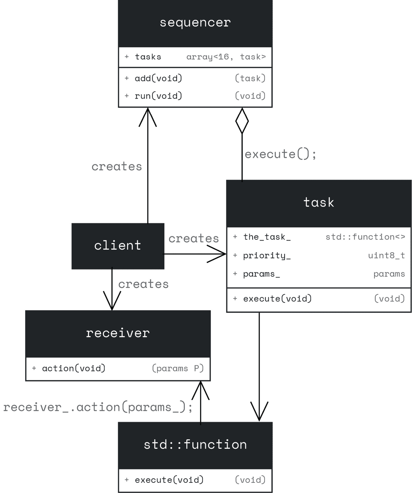
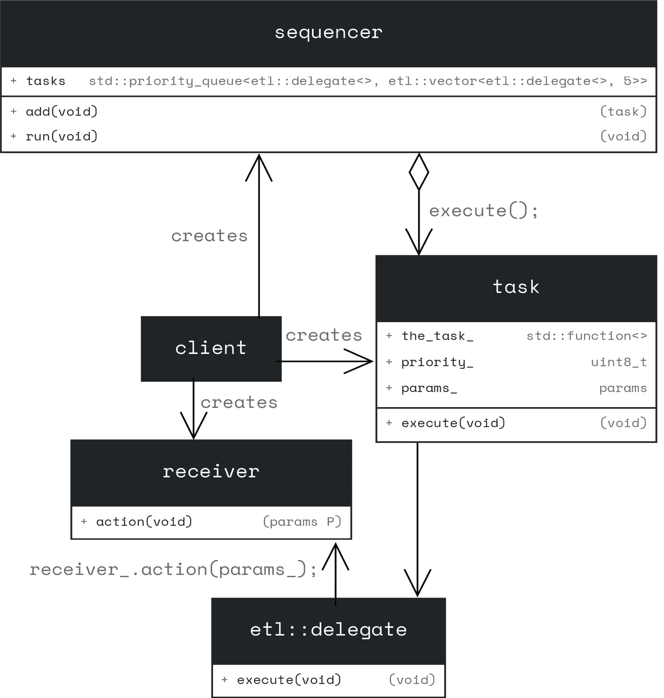

# 使用序列器增强超级循环

**超级循环**是裸机固件的基本软件架构。它是一个无限循环，根据在**中断服务例程**（**ISR**）中设置的标志执行任务（函数）。随着业务逻辑复杂性的增加，超级循环的大小也会增加，这可能会迅速变成一团糟。为了在裸机约束（没有操作系统）内解决这个问题，我们可以使用序列器。

**序列器**以有组织的方式存储和执行任务（函数）。我们不是在 ISR 中设置一个标志，在超级循环中检查它，如果设置了标志就执行一个函数，而是简单地从 ISR 中将一个任务添加到序列器中。然后超级循环运行序列器，执行添加的任务。序列器中的任务可以被优先级排序，因此序列器会首先执行优先级较高的任务。

在本章中，我们将通过以下主要主题来介绍序列器的设计和实现：

+   超级循环和序列器的动机

+   设计序列器

+   存储可调用对象

+   实现序列器

# 技术要求

本章的示例可在 GitHub 上找到（[`github.com/PacktPublishing/Cpp-in-Embedded-Systems/tree/main/Chapter14`](https://github.com/PacktPublishing/Cpp-in-Embedded-Systems/tree/main/Chapter14)）。为了充分利用本章内容，请在 Renode 模拟器中运行示例。

# 超级循环和序列器的动机

在我们深入到序列器的设计和实现之前，我们将首先分析超级循环的限制。在通常的超级循环场景中，我们检查由 ISR 设置的标志。下面是一个超级循环的示例伪代码：

```cpp
bool data_read_ready = false;
bool data_send_timeout = false;
int main() {
    // initialize hardware
while(1) {
        if(data_read_ready) {
            sensor_data_read_and_buffer();
            data_read_ready = false;
        }
        if(data_send_timeout) {
            data_send_from_buffer();
            data_send_timeout = false;
        }
        if(!data_read_ready && !data_send_timeout) {
            enter_sleep();
        }
    }
} 
```

在前面的伪代码中，我们执行以下步骤：

1.  检查布尔标志`data_read_ready`，如果它被设置，则执行函数`sensor_data_read_and_buffer`。然后我们重置`data_read_ready`标志。

1.  检查布尔标志`data_send_timeout`，如果它被设置，则执行函数`data_send_from_buffer`。然后我们重置`data_send_timeout`标志。

1.  `data_read_ready`和`data_send_timeout`标志都由 ISR 设置。在我们的例子中，这可能是计时器的 ISR。

1.  最后，我们检查两个标志是否都为假，如果是，则进入睡眠模式。

我们讨论的例子很简单，但随着标志数量的增加，超级循环的大小、全局变量（标志）的数量以及出现错误的可能性（如重置标志或忘记将其包含在`if`语句中，这提供了进入睡眠模式的条件）也会增加。

现在，假设我们想要优先执行超级循环中的函数。使用当前的方法会很困难。添加一个优先级变量并在`if`语句中检查它可能最初有效，但代码会很快变得混乱且难以维护。

为了解决裸机环境中的超级循环问题，我们将利用序列器。我们不会定义全局标志并在中断服务例程中设置它们，而是将从中断服务例程中将任务添加到序列器中。每个任务都将包括优先级信息，使序列器能够根据它们的优先级在内部队列中组织它们。

在主循环中，序列器会反复运行。它通过始终从队列中选取优先级最高的任务并首先执行，以保持任务管理高效且有序。

接下来，我们将继续进行序列器的设计。

# 设计序列器

我们将基于我们在 *第十章* 中介绍的命令模式来设计序列器。在命令模式中，序列器将扮演调用者的角色。在我们的设计中，我们将使用术语 *task* 而不是 *command*。这个 *task* 等同于一个函数 – 它代表了一个特定的功能单元 – 而不是操作系统定义的任务。



图 14.1 – 序列器设计 – UML 图

*图 14.1* 展示了一个序列器的 UML 图。我们可以看到它扮演了前面描述的命令模式中的序列器角色。与命令接口和具体命令不同，这个 UML 设计使用了 `std::function` 类模板（我们在 *第十章* 的 *GPIO 中断管理器* 示例中也使用了相同的方法）。

`sequencer` 类包含一个任务数组，用于存储可调用对象。序列器提供了一个简单的接口，仅包含两个方法：

+   `void add(task t)`: 用于将任务添加到序列器中的方法

+   `void run()`: 用于获取具有最高优先级的任务，执行它，并将其从序列器中移除的方法

在我们进入序列器方法的实现之前，我们首先回顾一下 `task` 类以及存储任务的 `std::array` 的替代方案。`task` 类代表一个将被序列器根据优先级执行的功能单元。它具有以下成员：

+   `std::function<void()> the_task_`: 将要执行的实际可调用对象

+   `std::uint8_t priority_`: 根据该优先级对任务进行排序，以便在序列器的存储中排序

下面是实现 `task` 类的代码：

```cpp
template<typename CallableHolder>
class task {
public:
    constexpr static std::uint8_t c_prio_default = 250;
    constexpr static std::uint8_t c_prio_max = 255;
    constexpr static std::uint8_t c_prio_min = 0;
    task(CallableHolder the_task, std::uint8_t prio = c_prio_default) :
        the_task_(the_task), priority_(prio) {}
    void execute() {
        if(the_task_) {
            the_task_();
        }
    }
    bool operator<(const task &rhs) const
    {
        return priority_ < rhs.priority_;
    }
private:
    CallableHolder the_task_;
    std::uint8_t priority_ = c_prio_default;
}; 
```

此代码将任务实现为一个类模板，使我们能够使用不同的可调用持有者。我们在书中之前介绍的是 `std::function`。类模板 `task` 具有以下成员：

+   一个构造函数，用于初始化 `the_task_` 成员，其类型为 `CallableHolder`

+   `void execute()` 方法，它调用 `the_task_` 上的 `operator()`

+   `operator<`, 用于按优先级比较任务

此代码演示了类模板 `task` 的使用：

```cpp
 using callable_holder = std::function<void()>;
    auto fun_a = []() {
        printf("High priority task!\r\n");
    };
    task<callable_holder> task_a(fun_a, 255);
    auto fun_b = []() {
        printf("Low priority task!\r\n");
    };
    task<callable_holder> task_b(fun_b, 20);
    if(task_a < task_b) {
        task_b.execute();
    }
    else {
        task_a.execute();
    } 
```

在此示例中，我们使用`std::function<void()>`实例化类模板`task`。我们创建了两个对象`task_a`和`task_b`，然后通过使用`operator<`来比较它们，执行优先级更高的一个。在此示例中，任务对象使用 lambda 初始化，这些 lambda 内部存储在`std::function<void()>`中。如果您运行前面的示例，您将看到以下输出：

```cpp
High priority task! 
```

如您所见，由于重载的`operator<`，优先级更高的任务被执行。

在*第十章*中，我们了解到类模板`std::function`可以求助于动态内存分配来存储捕获的 lambda。为了减轻这一担忧，我们将介绍**嵌入式模板库**（**ETL**），这是一个定义了一组容器和算法的库，其操作是确定的且不使用动态内存分配。ETL 将在*第十七章*中进一步讨论。

# 存储一个可调用对象

我们可以使用来自 ETL 的`etl::delegate`代替`std::function` – 一个可调用持有者。它的一个限制是它不与捕获的 lambda 一起工作。这可能会影响代码的表达性，但它为我们提供了等效的功能，使我们能够捕获不同的可调用对象。以下代码演示了使用类模板`task`与`etl::delegate`：

```cpp
 using callable_etl = etl::delegate<void()>;
    using task_etl = task<callable_etl>;
    class test {
    public:
        test(int x) : x_(x) {}
        void print() const {
            printf("This is a test, x = %d.\r\n", x_);
        }
        void static print_static() {
            printf("This is a static method in test.\r\n");
        }
    private:
        int x_ = 0;
    };
    test test_1(42);
    task_etl task_member_fun(callable_etl::create<test, &test::print>
(test_1));
    task_member_fun.execute();
    task_etl task_static_fun(callable_etl::create<test::print_static>());
    task_static_fun.execute();
    task_etl task_lambda([](){
        printf("This is non capturing lambda!\r\n");
    });
    task_lambda.execute(); 
```

此代码演示了我们如何使用`etl::delegate`来存储一个可调用对象：

+   `callable_etl::create<test, &test::print>(test_1)` 使用模板方法`create`（通过实例化的类`test`和其成员`print`）创建`etl::delegate`

+   `callable_etl::create<test::print_static>()` 使用模板方法`create`（通过实例化的静态方法`print_static`）创建`etl::delegate`

+   `task_lambda([](){ printf("This is non capturing lambda!\r\n");});` 使用提供的非捕获 lambda 初始化`etl::delegate`

运行前面的示例将产生以下输出：

```cpp
This is a test, x = 42.
This is a static method in test.
This is non capturing lambda! 
```

您可以在 Renode 模拟器中运行完整示例。启动 Visual Studio Code，将其附加到正在运行的容器，打开`Chapter14/sequencer`项目，如*第四章*中所述，然后在 Visual Studio Code 终端中运行以下命令，或者在容器终端中直接运行：

```cpp
cmake -B build -DCMAKE_BUILD_TYPE=MinSizeRel
cmake --build build --target run_in_renode 
```

我们有可调用存储的替代实现 – 标准库中的`std::function`，或者更嵌入式友好的 ETL 中的`etl::delegate`。接下来，让我们考虑在序列器内部存储任务的容器选项。

在*图 14.1*的 UML 图中，序列器使用`std::array`来存储任务。这意味着根据优先级对数组元素进行排序是由序列器本身处理的。我们不必手动实现这一点，可以使用来自标准库的容器适配器`std::priority_queue`。

`std::priority_queue`是一个模板类，用作另一个容器的适配器，该容器提供随机访问迭代器和以下方法：

+   `front()`

+   `push_back()`

+   `pop_back()`

我们可以使用标准库中的 `std::vector`，因为它满足 `std::priority_queue` 强加的所有要求。如您所知，`std::vector` 使用动态内存分配，这使其不适合大多数嵌入式应用。

ETL 提供了一个具有类似标准库实现的固定大小向量的实现。这使得它与优先队列兼容。此代码演示了使用 `etl::vector` 与 `std::priority_queue`：

```cpp
 std::priority_queue<int, etl::vector<int, 6>> pq{};
    pq.push(12);
    pq.push(6);
    pq.push(16);
    pq.push(8);
    pq.push(1);
    pq.push(10);
    printf("priority queue elements:\r\n");
    while(!pq.empty()) {
        printf("top element: %d, size: %d\r\n", pq.top(), pq.size());
        pq.pop();
    } 
```

此代码执行以下步骤：

1.  `std::priority_queue<int, etl::vector<int, 6>> pq{}` 定义了一个优先队列 `pq`，其底层容器为 `etl::vector<int, 6>`，这是一个大小为 `6` 的固定大小向量。

1.  `pq.push(12)` 将元素 (`12`) 插入优先队列 `pq` 并对队列进行排序。

1.  使用 `push` 方法，我们在队列中添加了 5 个更多元素 – `6`、`16`、`8`、`1` 和 `10`。

1.  使用 `while(!pq.empty())`，我们运行一个 `while` 循环，直到优先队列为空。

1.  在 `while` 循环内部，我们打印最高元素，使用 `top()` 方法访问，并使用 `size()` 方法打印大小。然后，我们使用 `pop()` 从队列中弹出最高元素。

运行前面的代码将产生以下输出：

```cpp
priority queue elements:
top element: 16, size: 6
top element: 12, size: 5
top element: 10, size: 4
top element: 8, size: 3
top element: 6, size: 2
top element: 1, size: 1 
```

如您从输出中看到的，优先队列中的元素是排序的。这使得它成为存储可以因重载 `operator<` 而排序的任务的好解决方案。您可以在 Renode 模拟器中运行完整示例。启动 Visual Studio Code，将其附加到正在运行的容器，打开 `Chapter14/sequencer` 项目，如 *第四章* 中所述，并在 Visual Studio Code 终端中运行以下命令，或者在容器终端中直接运行它们：

```cpp
cmake -B build -DCMAKE_BUILD_TYPE=MinSizeRel
-DMAIN_CPP_FILE_NAME=main_pq.cpp
cmake --build build --target run_in_renode 
```

现在我们已经拥有了实现顺序器所需的所有元素，我们将继续进行实现。

# 实现顺序器

在本章中，我们介绍了 `etl::delegate` – `std::function` 的替代方案和来自 ETL 的固定大小向量实现。由于 ETL 避免动态内存分配，我们将使用这些组件来实现顺序器。以下是更新后的 UML 图：



图 14.2 – 使用 ETL 组件的 UML 顺序图

*图 14.2* 展示了一个使用代理和向量 ETL 组件以及标准库中的优先队列的 UML 顺序图。此代码实现了 `顺序器`：

```cpp
template<typename Task, std::size_t Size>
struct sequencer {
    sequencer() = delete;
    static void add(Task task) {
        if(pq.size() < Size) {
            __disable_irq();
            pq.push(task);
            __enable_irq();
        }
    }
    static void run() {
        if(!pq.empty()) {
            __disable_irq();
            auto task = pq.top();
            pq.pop();
            __enable_irq();
            task.execute();
        }
    }
private:
    static inline std::priority_queue<Task, etl::vector<Task, Size>> pq{};
}; 
```

在此代码中，`顺序器` 被实现为一个静态模板类，`Task` 和 `Size` 作为模板参数。这允许我们使用基于 `std::function` 或 `etl::function` 的任务，并定义 ETL 向量的尺寸。`顺序器` 有以下成员：

+   `static inline std::priority_queue<Task, etl::vector<Task, Size>> pq{}`：基于 ETL 向量的私有静态优先队列。

+   `static void add(Task task)`：一个静态方法，用于使用`push`方法将任务添加到队列中，通过禁用和启用中断来保护，因为它可以从 ISR 中调用。

+   `static void run()`：一个静态方法，用于从队列中取出顶部元素并执行它。对队列的访问通过禁用和启用中断来保护。

下面是使用序列器的示例：

```cpp
 using callable_etl = etl::delegate<void()>;
    using task_etl = task<callable_etl>;
    class test {
    public:
        test(int x) : x_(x) {}
        void print() const {
            printf("This is a test, x = %d.\r\n", x_);
        }
        void static print_static() {
            printf("This is a static method in test.\r\n");
        }
    private:
        int x_ = 0;
    };
    test test_1(42);
    task_etl task_member_fun(callable_etl::create<test, &test::print>
(test_1), 20);
    task_etl task_static_fun(callable_etl::create<test::print_static>(), 30);
    task_etl task_lambda([](){
        printf("This is non capturing lambda!\r\n");
    }, 10);
    using seq = sequencer<task_etl, 16>;
    seq::add(task_member_fun);
    seq::add(task_static_fun);
    seq::add(task_lambda);
    while(true)
    {
        seq::run();
    } 
```

在此代码中，我们执行以下操作：

+   实例化基于`etl::delegate`的任务`task_member_fun`、`task_static_fun`和`task_lambda`。

+   我们使用序列器的`add`方法将任务添加到序列器中。

+   我们使用`run()`方法在主`while`循环中运行序列器。

运行前面的代码将产生以下输出：

```cpp
This is a static method in test.
This is a test, x = 42.
This is non capturing lambda! 
```

如此代码所示，任务将根据分配的优先级执行。您可以在 Renode 中运行完整示例。启动 Visual Studio Code，将其附加到正在运行的容器，打开`Chapter14/sequencer`项目，如*第四章*中所述，然后在 Visual Studio Code 终端中运行以下命令，或者在容器终端中直接运行它们：

```cpp
cmake -B build -DCMAKE_BUILD_TYPE=MinSizeRel
-DMAIN_CPP_FILE_NAME=main_seq.cpp
cmake --build build --target run_in_renode 
```

在模拟器中运行示例应提供相同的控制台输出。我邀请您通过添加来自计时器或外部中断的任务来探索序列器。

序列器通过以严格顺序、优先级的方式组织任务，提供了一个比超级循环更好的替代方案。通过任务实现确保确定性行为。例如，在实时需求的情况下，每个任务都必须包括内部监控，以确保它满足必要的实时约束。

# 摘要

在本章中，我们探讨了基本超级循环的常见问题，这促使我们转向序列器设计。我们详细介绍了序列器设计，并引入了 ETL 组件`etl::delegate`——一个可调用的持有者，它是`std::function`的替代品——以及固定大小的向量，它们都是嵌入式应用的绝佳选择，因为它们不使用动态内存分配。

在下一章中，我们将学习观察者模式并将其应用于温度读取应用。
