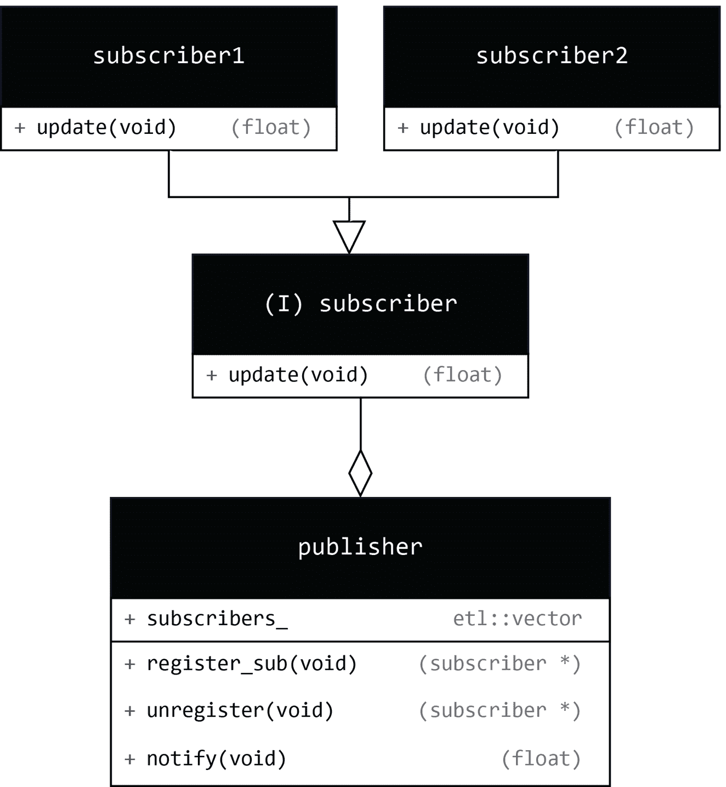

# 实用模式 - 构建温度发布者

设计模式是解决常见问题的工具。到目前为止，我们在本书中已经介绍了一些设计模式，例如命令模式和适配器模式。在本章中，我们将介绍**观察者模式**并将其应用于嵌入式系统中的常见问题——处理系统不同部分的温度读数。

我们将首先探讨观察者模式及其在运行时的实现方式。当多个组件需要响应来自中央数据源的变化时，此模式特别有用。想象一下，在嵌入式设备中的一个温度传感器会向多个监听器报告变化。这可能是智能恒温器、工业机器监控器或 HVAC 控制板的一部分——每个部分都有屏幕、记录器或风扇控制器等组件，它们会对温度更新做出反应。

接下来，我们将使用现代 C++技术，如变长模板和折叠表达式，将相同的模式转换为编译时实现。通过利用这些技术，我们可以在编译时生成高度优化的代码，避免与运行时多态相关的虚拟调度。这种方法导致内存占用更小，代码运行更快，更适合资源有限的系统。

在本章中，我们将涵盖以下主要内容：

+   观察者模式

+   运行时实现

+   编译时实现

# 技术要求

为了充分利用本章内容，我强烈建议您在阅读示例时使用 Compiler Explorer ([`godbolt.org/`](https://godbolt.org/))。添加一个执行面板，使用 GCC 作为 x86 架构的编译器。这将允许您查看标准输出并更好地观察代码的行为。由于我们使用了大量的现代 C++特性，请确保选择 C++23 标准，通过在**编译器选项**框中添加`-std=c++23`，并将优化级别设置为`-O3`。此外，添加一个使用`ARM gcc 11.2.1 (none)`的编译器面板，以检查示例的汇编输出。

您可以在*第四章*中设置的 Docker 容器中的 Renode 模拟器中尝试本章的示例。请确保 Docker 容器正在运行。

您可以在 GitHub 上找到本章的文件，地址为[`github.com/PacktPublishing/Cpp-in-Embedded-Systems/tree/main/Chapter15/observer`](https://github.com/PacktPublishing/Cpp-in-Embedded-Systems/tree/main/Chapter15/observer)。

# 观察者模式

**观察者模式**常用于事件驱动系统，用于向已订阅的对象发布事件，通常通过调用它们的方法来实现。发布事件的对象称为**主题**或**发布者**。从发布者接收事件的对象称为**观察者**或**订阅者**。从现在起，我们将使用**发布者**和**订阅者**这两个术语。

发布者有一个内部的订阅者列表，并提供了一个接口来注册和注销内部列表中的订阅者。它还提供了一个`notify`方法，该方法由其客户端使用，进而调用订阅者的`update`方法——这就是我们说发布者通知订阅者的原因。

一个在嵌入式系统中常见的发布者-订阅者机制的例子是一个温度发布者，它定期通知记录器、显示器和数据发送器。在我们继续此示例的实现之前，我们首先将查看观察者模式的 UML 图。



图 15.1 – 观察者模式的 UML 图

*图 15.1*展示了观察者模式的 UML 类图。在图中，我们可以看到`publisher`类有以下成员：

+   `etl::vector<subscribers_, 8>`：指向订阅者接口的指针的内部列表，我们将使用 ETL 中的`vector`。

+   `register_sub(subscriber *)`：用于注册订阅者的方法。`register`关键字在 C++中是保留的，用作存储指定符，所以我们使用`register_sub`作为此方法的名称。

+   `unregister(subscriber *)`：用于注销订阅者的方法。

+   `notify(float)`：发布者客户端用来触发订阅者更新的方法。

`subscriber`接口类有一个纯虚方法——`void update(float)`。该方法在`subscriber`类的具体实现中被重写。为了展示其作用，我们将继续进行观察者模式的运行时实现。

# 运行时实现

我们将通过温度发布者的例子来讲解观察者模式的运行时实现。订阅者将是一个记录器、显示器和数据发送器。订阅者接口和具体订阅者的代码如下所示：

```cpp
#include <cstdio>
#include “etl/vector.h”
#include <algorithm>
class subscriber {
public:
    virtual void update(float) = 0;
    virtual ~subscriber() = default;
};
class display : public subscriber {
public:
    void update(float temp) override {
        printf(“Displaying temperature %.2f \r\n”, temp);
    }
};
class data_sender : public subscriber {
public:
    void update(float temp) override {
        printf(“Sending temperature %.2f \r\n”, temp);
    }
};
class logger : public subscriber {
public:
    void update(float temp) override {
        printf(“Logging temperature %.2f \r\n”, temp);
    }
}; 
```

上述代码定义了`subscriber`接口和具体的订阅者类：`display`、`data_sender`和`logger`。具体类覆盖了接口类中的纯虚`update`方法。为了简化示例，所有具体实现都打印温度到标准输出。

使用接口类允许发布者依赖于接口。发布者维护一个指向订阅者接口的指针的内部容器。这使得通过基接口类上的指针添加不同的订阅者接口实现成为可能。`publisher`类的代码如下所示：

```cpp
class publisher {
public:
    void register_sub(subscriber * sub) {
        if(std::find(subs_.begin(), subs_.end(), sub) == subs_.end())
        {
            subs_.push_back(sub);
        }
    }
    void unregister(subscriber * sub) {
        if(auto it = std::find(subs_.begin(), subs_.end(),
                                  sub); it != subs_.end())
        {
            subs_.erase(it);
        }
    }
    void notify(float value) {
        for(auto sub: subs_) {
            sub->update(value);
        }
    }
private:
    etl::vector<subscriber*, 8> subs_;
}; 
```

在前面的`publisher`类中，我们可以看到以下成员：

+   `etl::vector<subscriber*, 8> subs_`：用于维护订阅者的私有容器。如果您在 Compiler Explorer 中运行此示例，请确保使用**库**选项添加 ETL 库。

+   `void register_sub(subscriber * sub)`: 用于注册订阅者的方法。它使用 `std::find` 算法检查订阅者是否已经被添加。

+   `void unregister(subscriber * sub)`: 用于注销订阅者的方法。它使用 `std::find` 算法检查在调用方法 `erase` 移除之前订阅者是否已被添加。如果 `std::find` 返回的迭代器与 `subs_.end()` 不同，则提供 `erase` 方法。

+   `void notify(float value)`: 遍历已注册的订阅者，并在它们上调用 `update` 方法。

现在，让我们看看如何在以下代码中使用前面的发布者和订阅者：

```cpp
int main() {   
    logger temp_logger;
    display temp_display;
    data_sender temp_data_sender;
    publisher temp_publisher;
    temp_publisher.register_sub(&temp_logger);
    temp_publisher.register_sub(&temp_display);
    temp_publisher.notify(24.02f);
    temp_publisher.unregister(&temp_logger);
    temp_publisher.register_sub(&temp_data_sender);
    temp_publisher.notify(44.02f);
    return 0;
} 
```

在代码中，我们执行以下步骤：

1.  实例化以下具体订阅者：`temp_logger`、`temp_display` 和 `temp_data_sender`。

1.  实例化发布者 `temp_publisher`。

1.  注册订阅者 `temp_logger` 和 `temp_display`。

1.  在 `temp_publisher` 上调用 `notify(24.02f)`。

在这些步骤之后，我们期望得到以下输出：

```cpp
Logging temperature 24.02
Displaying temperature 24.02 
```

接下来，我们执行以下步骤：

1.  注销订阅者 `temp_logger`。

1.  注册订阅者 `temp_data_sender`。

1.  在 `temp_publisher` 上调用 `notify(44.02f)`。

在这些步骤之后，我们期望得到以下输出：

```cpp
Displaying temperature 44.02
Sending temperature 44.02 
```

作为一项*练习*，创建一个新的订阅者类 `eeprom_writer`，当温度低于或高于设定的阈值时记录温度。

你可以在 Renode 中运行完整的示例。启动 Visual Studio Code，将其附加到正在运行的容器，按照*第四章*中所述打开 `Chapter15/observer` 项目，并在 Visual Studio Code 终端或直接在容器终端中运行以下命令：

```cpp
$ cmake –B build
$ cmake --build build --target run_in_renode 
```

接下来，我们将介绍观察者模式的编译时实现。

# 编译时实现

在大多数嵌入式应用中，我们知道在编译时系统行为的信息很多。这意味着当使用观察者模式时，我们已经知道所有订阅者。如果我们假设订阅者只注册一次且不会注销，我们可以创建观察者模式的编译时版本。

为了启用此功能，我们首先分解使编译时实现可行的关键 C++17 特性。

## 利用变长模板

我们将基于变长模板来实现。我们将从一个简化的实现开始，以解释变长模板、参数包和折叠表达式——这些是 C++特性，将使我们能够创建观察者模式的编译时版本。让我们从以下代码开始：

```cpp
#include <cstdio>
struct display {
    static void update(float temp) {
        printf(“Displaying temperature %.2f \r\n”, temp);
    }
};
struct data_sender {
    static void update(float temp) {
        printf(“Sending temperature %.2f \r\n”, temp);
    }
};
struct logger {
    static void update(float temp) {
        printf(“Logging temperature %.2f \r\n”, temp);
    }
};
template <typename... Subs>
struct publisher {
    static void notify(float temp) {
        (Subs::update(temp), ...);
    }
};
int main() {
    using temp_publisher = publisher<display,
    data_sender,
    logger>;
    temp_publisher::notify(23.47);
    return 0;
} 
```

在上面的代码中，我们有订阅者结构体 `display`、`data_sender` 和 `logger`。所有结构体都实现了静态方法 `update`，该方法接受 `temperature` 作为参数并打印它。

结构 `publisher` 是一个可变参数类模板。一个**可变参数模板**是一个至少有一个**参数包**的模板。一个模板参数包是一个接受零个或多个模板参数的模板参数。`typename... Subs` 是一个名为 `Subs` 的类型模板参数包，这意味着我们可以用零个或多个不同的类型实例化 `publisher` 结构。总结一下：

+   `publisher` 是一个可变参数类模板，因为它有一个模板参数包 `typename... Subs`。

+   我们可以用提供的变量数量的类型作为模板参数来实例化它。这是向发布者注册订阅者的方法。

在 `main` 函数中，我们创建了别名 `temp_publisher` 作为 `publisher<display, data_sender, logger>`。我们在这个别名上调用 `notify` 方法，这将导致通过模板参数包提供的类型中的更新函数被调用，这是由于 `notify` 方法中的折叠表达式。

拼图最后的碎片是折叠表达式 `(Subs::update(temp), ...)`。这是一个使用逗号运算符作为折叠运算符的折叠表达式。它展开为：`(display::update(temp), data_sender::update(temp), logger::update(temp))`。

折叠表达式确保首先调用 `display::update(temp)`，然后是 `data_sender::update(temp)`，最后是 `logger::update(temp)`。逗号运算符的操作数评估顺序是严格从左到右。每个 `update(temp)` 调用都会返回一个值（可能是 `void`）。

逗号运算符丢弃除了最后一个之外的所有返回值，所以只有最后的 `logger::update(temp)` 决定了折叠的结果。如果它们都返回 `void`，整个表达式也返回 `void`。

折叠表达式是在 C++17 中引入的，使用逗号运算符是调用参数包中每个类型的函数的简洁方式。在那之前，需要递归才能遍历类型并调用它们上的函数。

当在 Compiler Explorer 中检查反汇编输出时，你会注意到生成的汇编代码相对简短，总共大约 30 行，如下所示：

```cpp
.LC0:
.ascii “Displaying temperature %.2f \015\012\000”
.LC1:
.ascii “Sending temperature %.2f \015\012\000”
.LC2:
.ascii “Logging temperature %.2f \015\012\000”
main:
push    {r4, r5, r6, lr}
        mov r4, #-536870912
ldr r5, .L3
        mov r2, r4
mov r3, r5
ldr r0, .L3+4
bl      printf
        mov r2, r4
mov r3, r5
ldr r0, .L3+8
bl      printf
        mov r2, r4
mov r3, r5
ldr r0, .L3+12
bl      printf
        mov r0, #0
pop     {r4, r5, r6, lr}
        bx lr
.L3:
.word 1077377105
.word   .LC0
        .word   .LC1
        .word   .LC2 
```

在这段汇编代码中，我们可以看到没有从 `display`、`data_sender` 和 `logger` 结构体调用静态更新方法。这意味着编译器能够优化这些调用，包括订阅者的注册和对发布者 `notify` 方法的调用，从而直接调用 `printf` 函数。

结果是小的内存占用和快速的性能。这个例子演示了零成本抽象设计原则：我们为发布者和订阅者提供了抽象，但没有任何开销，因为编译器能够优化代码，使其尽可能高效，就像它是手工编写的一样。

使用相同的优化级别（`-O3`）比较编译时实现和运行时实现的汇编输出。很明显，编译时实现使用的内存更少，速度更快，因为编译器优化掉了大部分函数调用，并且没有由虚函数引起的间接调用。

当我们分析汇编代码时，让我们利用这个机会更好地理解折叠表达式。为了防止 GCC 优化掉对`update`方法的调用，我们可以使用`__attribute__((noinline))`函数属性，例如`static void __attribute__((noinline)) update(float temp)`。将此属性添加到`display`、`data_sender`和`logger`结构的静态`update`方法中，并观察生成的汇编代码。您将看到`main`函数中对`notify`方法的调用如何导致参数包展开并生成对`display`、`data_sender`和`logger`结构`update`方法的调用。

您可以在 Renode 中运行完整的示例。启动 Visual Studio Code，将其附加到正在运行的容器，按照*第四章*中描述的方式打开`Chapter15/observer`项目，然后在 Visual Studio Code 终端中运行以下命令，或者在容器终端中直接运行它们：

```cpp
$ cmake -B build
-DMAIN_CPP_FILE_NAME=main_observer_ct_basic.cpp
$ cmake --build build --target run_in_renode 
```

简化的观察者模式编译时实现有几个限制：

+   订阅者只能被注册。

+   当发布者实例化时，所有订阅者都会被注册。发布者实例化后不能注册。

接下来，我们将解决最后一个问题，因为将所有订阅者注册在一行代码中可能很繁琐，并不总是实用。这将为我们提供一个更灵活的编译时设计。

## 改进编译时实现

我们不会改变发布者模板结构的接口。相反，我们将允许它接收其他发布者作为参数。下面的代码是：

```cpp
template<typename T>
concept Updatable = requires (T, float f) {
    { T::update(f) } -> std::same_as<void>;
};
template<typename T>
concept Notifiable = requires (T, float f) {
    { T::notify(f) } -> std::same_as<void>;
};
template <typename... Subs>
struct publisher {
    static void notify(float temp) {
        (call_update_or_notify<Subs>(temp), ...);
    }
private:
    template<typename T>
 static void call_update_or_notify(float temp) {
        if constexpr (Updatable<T>) {
            T::update(temp);
        } else if constexpr (Notifiable<T>) {
            T::notify(temp);
        }
        else {
            static_assert(false, “Type is not Updatable or Notifiable”);
        }
    }
}; 
```

在上面的代码中，我们定义了以下概念：

+   `Updatable`：这描述了一个具有接受浮点数的静态方法`update`的类型

+   `Notifiable`：这描述了一个具有接受浮点数的静态方法`notify`的类型

我们在*第八章*中更详细地介绍了概念。变长模板类`publisher`有一个新方法——`call_update_or_notify`。它在`notify`方法中使用折叠表达式和逗号运算符在参数包`typename... Subs`中的每个类型上调用。

在`call_update_or_notify`方法中，我们使用`if constexpr`在编译时检查类型是否为`Updatable`或`Notifiable`，并分别调用其上的`update`或`notify`静态方法。

下面是使用观察者模式新版本的示例：

```cpp
 using temp_publisher = publisher<display, data_sender>;
    temp_publisher::notify(23.47);
    using temp_publisher_new = publisher<temp_publisher, logger>;
    temp_publisher_new::notify(42.42); 
```

在上面的代码中，我们通过提供变长类模板`publisher`的类型`display`和`data_sender`来实例化`temp_publisher`，这两个订阅者都是`Updatable`。

接下来，我们通过提供之前实例化的`temp_publisher`和订阅者`logger`给`publisher`来实例化`temp_publisher_new`。以下是上述示例的输出：

```cpp
Displaying temperature 23.47
Sending temperature 23.47
Displaying temperature 42.42
Sending temperature 42.42
Logging temperature 42.42 
```

你可以在 Renode 中运行完整示例。启动 Visual Studio Code，将其附加到正在运行的容器，按照*第四章*中所述打开`Chapter15/observer`项目，并在 Visual Studio Code 终端中运行以下命令，或者直接在容器终端中运行它们：

```cpp
$ cmake -B build -DMAIN_CPP_FILE_NAME=main_observer_ct.cpp
$ cmake --build build --target run_in_renode 
```

这种观察者模式的实现使我们能够以更灵活的方式注册订阅者。为了使其更通用，作为一个练习，你可以修改它，使得`notify`方法能够接受可变数量的参数。

# 摘要

在本章中，我们探讨了观察者模式，包括运行时和编译时实现。

编译时实现是利用我们在编译时对应用程序的了解。它基于变长模板类和折叠表达式。结果是代码非常紧凑且运行速度快，因为我们既不在容器中存储订阅者的信息，也不需要遍历容器来调用`update`方法。

在下一章中，我们将介绍**有限状态机（FSM**）以及在 C++中实现状态模式。

# 加入我们的 Discord 社区

加入我们的社区 Discord 空间，与作者和其他读者进行讨论：

[`packt.link/embeddedsystems`](https://packt.link/embeddedsystems)


