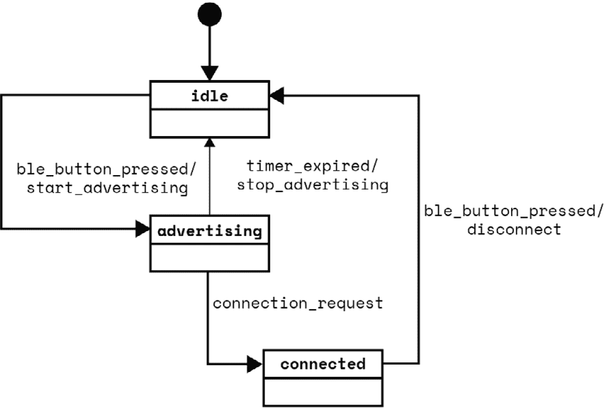
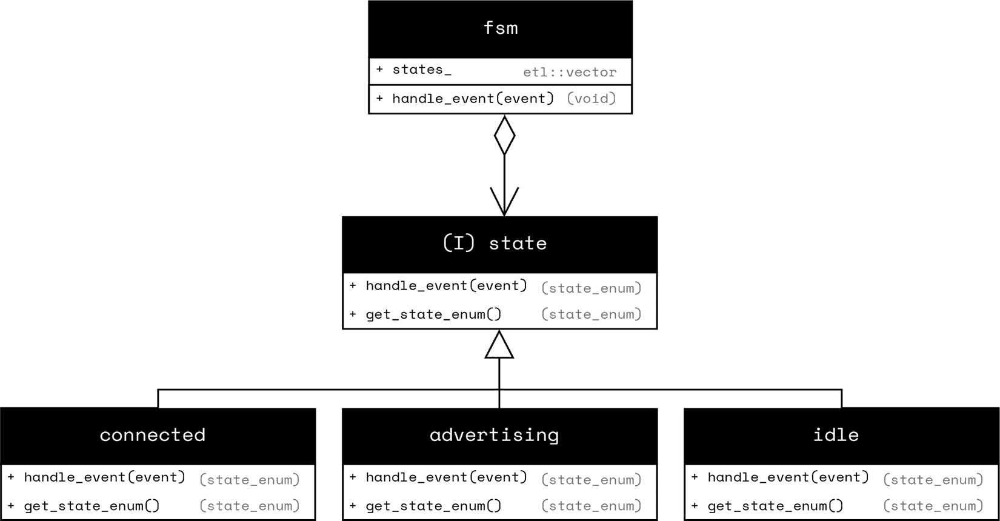

# 第十六章：设计可扩展的有限状态机

**有限状态机**（`FSM`）是一个抽象的计算模块，用于表示在任何给定时间可以处于有限多个状态之一的状态系统。`FSM`可以在给定输入的情况下从一个状态转换到另一个状态，并且在转换过程中可以执行一个动作。

在控制理论中，有 Moore 和 Mealy 机器的分类。Moore 的`FSM`输出只依赖于状态，也就是说，`FSM`只使用入口动作。Mealy 的`FSM`输出依赖于输入和当前状态，也就是说，它执行的动作由当前状态和输入共同决定。

本章中我们将涵盖的`FSM`是 Moore 和 Mealy `FSM`的组合，因为它们支持在转换期间执行的动作以及仅依赖于当前状态的动作。`FSM`也称为**统一建模语言**（**UML**）状态机，并在嵌入式系统的实际应用中用于描述和控制机器。例如，`FSM`通常用于控制洗衣机、电梯系统或网络设备的通信协议，以基于各种输入管理复杂的操作序列。理解`FSM`将帮助您设计更可预测和可维护的嵌入式系统。

在本章中，我们将涵盖以下主要主题：

+   `FSM` – 一个简单的实现

+   `FSM` – 使用状态模式实现

+   使用标签分派实现状态模式

+   Boost SML（状态机语言）

# 技术要求

为了充分利用本章内容，我强烈建议在阅读示例时使用 Compiler Explorer（[`godbolt.org/`](https://godbolt.org/))。选择 GCC 作为您的编译器，并针对 x86 架构。这将允许您看到标准输出（`stdio`）结果，并更好地观察代码的行为。由于我们使用了大量的现代 C++特性，请确保在编译器选项框中添加`-std=c++23`以选择 C++23 标准。

Compiler Explorer 使得尝试代码、调整代码并立即看到它如何影响输出和生成的汇编变得容易。大多数示例也可以在 ARM Cortex M0 目标上的 Renode 模拟器中运行，并在 GitHub 上提供（[`github.com/PacktPublishing/Cpp-in-Embedded-Systems/tree/main/Chapter16`](https://github.com/PacktPublishing/Cpp-in-Embedded-Systems/tree/main/Chapter16))。

# FSM – 一个简单的实现

我们将直接进入一个处理`FSM`的`Bluetooth Low Energy`（**BLE**）设备连接状态的示例，分析其不足之处，并看看我们如何可以使用状态设计模式来改进它。

为了清晰和更容易理解，示例`FSM`将被简化。我们将有三个状态 – `idle`（空闲）、`advertising`（广播）和`connected`（连接）。以下是示例`FSM`的状态图：



图 16.1 – BLE 设备连接状态图

*图 16.1* 描述了 BLE 设备连接的`FSM`状态图。该图展示了状态之间的转换以及以下描述的动作：

+   默认状态是`idle`。在`ble_button_pressed`事件发生时，它转换到`advertising`状态。在转换过程中，执行`start_advertising`动作。简单来说，这意味着如果设备处于`idle`状态，并且用户按下指定的按钮，它将开始广播并改变状态。

+   从`advertising`状态，`FSM`可以在`connection_request`事件发生时转换到`connected`状态，或者在`timer_expired`状态下返回`idle`状态，同时通过执行`stop_advertising`动作停止广播。

+   当处于`connected`状态时，在执行`disconnect`动作的同时，`FSM`只能由`ble_button_pressed`事件转换到`idle`状态。

请记住，这是一个为了示例目的而极度简化的`FSM`，而在现实生活中的`FSM`将包括更多的状态和事件，以正确描述 BLE 设备的连接行为。

`FSM`也可以使用状态转换表来描述。此表显示了`FSM`根据当前状态和输入（接收的事件）移动到的状态，以及它在转换期间执行的动作。以下是本章中分析的 BLE 设备`FSM`的转换表：

| **当前状态** | **事件** | **下一个状态** | **动作** |
| --- | --- | --- | --- |
| **idle** | `ble_button_pressed` | advertising | `start_advertising` |
| **advertising** | `timer_expired` | `idle` | `stop_advertising` |
| **advertising** | `connection_request` | connected |  |
| **connected** | `ble_button_pressed` | `idle` | disconnect |

表 16.1 – BLE 设备状态转换表

*表 16.1* 通过列出行中的转换来描述 BLE 设备的`FSM`。它作为状态图的替代，用于描述`FSM`的行为。我们将首先通过定义状态和事件来实现这个`FSM`。

## 描述状态和事件

我们将使用`enum`类型来表示状态和事件，如下面的代码所示：

```cpp
`enum` class ble_state {
    idle,
    advertising,
    connected
};
`enum` class ble_event {
    ble_button_pressed,
    connection_request,
    timer_expired
}; 
```

上述`enum`类型描述了我们的 BLE 设备`FSM`的状态和事件。

## 跟踪当前状态和处理事件 – `FSM`类

接下来，我们将定义一个名为`ble_fsm`的类，该类将跟踪当前状态并提供一个公共方法`handle_event`，我们将使用它向`FSM`提供事件。代码如下：

```cpp
class ble_fsm {
public:
    void handle_event(ble_event event);
    ble_state get_state() const {
        return current_state_;
    }
private:
    ble_state current_state_ = ble_state::idle;
    void start_advertising() {
        printf("Action: start_advertising()\n");
    }
    void stop_advertising() {
        printf("Action: stop_advertising()\n");
    }
    void disconnect() {
        printf("Action: disconnect()\n");
    }
}; 
```

在上面的代码中，我们定义了具有以下成员的`ble_fsm`类：

+   `ble_state current_state_` – 默认值为`ble_state::idle`的私有成员。我们使用它来跟踪当前状态，初始值设置为`idle`。

+   `void start_advertising()` – 用于实现动作的私有方法。

+   `void stop_advertising()` – 用于实现动作的私有方法。

+   `void disconnect()` – 用于实现动作的私有方法。

+   `ble_state get_state() const` – 一个私有方法，用于检索当前状态。

+   `void handle_event(ble_event event)` – 一个公共方法，用于通过执行操作并根据 `current_event_` 改变当前状态来响应事件。

`handle_event` 方法实现了 `FSM` 的实际行为，其代码如下所示：

```cpp
void ble_fsm::handle_event(ble_event event) {
switch (current_state_) {
    case ble_state::idle:
    if (event == ble_event::ble_button_pressed)
    {
        start_advertising();
        current_state_ = ble_state::advertising;
    }
    break;
    case ble_state::advertising:
    if (event == ble_event::connection_request)
    {
        current_state_ = ble_state::connected;
    }
    else if (event == ble_event::timer_expired)
    {
        stop_advertising();
        current_state_ = ble_state::idle;
    }
    break;

    case ble_state::connected:
    if (event ==ble_event::ble_button_pressed)
    {
        disconnect();
        current_state_ = ble_state::idle;
    }
    break;

    default:
    break;
}
} 
```

上述代码显示了 `ble_fsm` 类的 `handle_event` 方法的实现。它使用 `switch` 语句在 `current_state_` 上进行 `switch`，根据它处理事件并接收事件。事件通过调用适当的操作并按照 `FSM` 描述的状态进行状态转换来处理。

接下来，我们将看到如何使用 `ble_fsm` 类。

## 使用 ble_fsm 类

我们首先定义一个辅助函数 `state_to_string`，用于调试我们的 `FSM`。代码如下所示：

```cpp
static const char* state_to_string(ble_state state) {
    switch (state) {
        case ble_state::idle:        return "`idle`";
        case ble_state::advertising: return "advertising";
        case ble_state::connected:   return "connected";
        default:                     return "unknown";
    }
} 
```

`state_to_string` 函数返回一个给定状态 `enum` 的字符串字面量。

接下来，让我们看看如何使用 `ble_fsm` 类，如下面的代码所示：

```cpp
int main() {
    ble_fsm my_ble_fsm;
    const auto print_current_state = [&]() {
        printf("Current State: %s\n",
            state_to_string(my_ble_fsm.get_state()));
    };
    print_current_state();
    my_ble_fsm.handle_event(ble_event::ble_button_pressed);
    print_current_state();
    my_ble_fsm.handle_event(ble_event::connection_request);
    print_current_state();
    my_ble_fsm.handle_event(ble_event::ble_button_pressed);
    print_current_state();

    return 0;
} 
```

上述 `main` 函数中的代码创建了一个 `ble_fsm` 类型的对象 `my_ble_fsm`，并按照以下顺序向其中提供事件：

1.  它首先将 `ble_event::ble_button_pressed` 传递给 `FSM` 的 `handle_event` 方法。`FSM` 的初始状态是 `idle`，在此事件之后，它将过渡到 `advertising` 状态。

1.  接下来，它将 `ble_event::connection_request` 事件传递给 `FSM`，这将使其过渡到 `connected` 状态。

1.  最后，它第二次将 `ble_event::ble_button_pressed` 事件传递给 `FSM`，使其返回到 `idle` 状态。

上述代码使用 `state_to_string` 函数从状态 `enum` 获取字符串字面量，并使用它来打印在向 `FSM` 提供事件后的当前状态。

## 分析输出

运行完整示例将提供以下输出：

```cpp
Current State: idle
Action: start_advertising()
Current State: advertising
Current State: connected
Action: disconnect()
Current State: idle 
```

上述输出显示了 `FSM` 状态和执行的操作。

您可以从书籍的 GitHub 仓库中的 Renode 模拟器运行完整示例。它位于 `Chapter16/fsm` 目录下，您可以使用以下命令构建和运行它：

```cpp
$ cmake –B build
$ cmake --build build --target run_in_renode 
```

我们刚才讨论的 `FSM` 实现方法对于简单的 `FSM` 来说效果很好。在实际应用中，`FSM` 通常更复杂——它们有更多的状态、操作和事件。`ble_fsm` 中的 `handle_event` 方法由于使用了 `switch-case` 和 `if-else` 逻辑，因此扩展性不佳。添加更多状态，以及处理更多事件和操作，使得代码可读性降低，维护难度增加。

接下来，我们将看到如何利用状态设计模式来缓解这些问题。

# FSM – 使用状态模式实现

在基于我们的开关方法的基础上，我们现在将使用状态设计模式重构 BLE 设备连接 `FSM`。这种模式是“以状态为中心”的，意味着每个状态都被封装为其自己的类。一个常见的基类接口将允许 `FSM` 在容器中存储指向这些具体状态类的指针。

在典型的`FSM`中，状态在运行时动态变化，以响应外部中断和定时器。在我们的示例中，我们将继续使用枚举来区分状态，并将当前状态存储在私有成员变量中。这种基于枚举的方法仍然与状态模式很好地工作，因为它允许我们快速定位并在`FSM`管理的具体状态对象之间切换。我们将从状态类接口开始实现。

## 理解状态类接口

`state`类接口如下所示：

```cpp
class state {
public:
    virtual ble_state handle_event(ble_event event) = 0;
    virtual ble_state get_state_`enum`() = 0;
}; 
```

在前面的代码中，我们可以看到状态接口简单且有两个纯虚方法：

+   `virtual ble_state handle_event(ble_event event)` – 一个旨在由派生类实现的方法，用于处理实际事件。它返回一个`ble_state`枚举以向`FSM`信号新状态。如果处理事件不会导致转换，则应返回对应于当前状态的枚举。

+   `virtual ble_state get_state_enum()` – 一个用于返回对应于实际状态的`ble_state`枚举的方法。

接下来，我们将介绍具体状态类的实现：`idle`、`advertising`和`connected`。我们将从`idle`类开始，如下所示代码所示：

```cpp
class idle : public state{
public:
    ble_state handle_event(ble_event event) {
        if (event == ble_event::ble_button_pressed) {
            start_advertising();
            return ble_state::advertising;
        }
        return get_state_enum();
    }
    ble_state get_state_enum() {
       return ble_state::idle;
    }
private:
    void start_advertising() {
        printf("Action: start_advertising()\n");
    }
}; 
```

在前面的代码中，我们可以看到`idle`类实现了在`state`接口类中定义的纯虚方法：

+   `ble_state handle_event(ble_event event)` – `idle`类检查接收到的事件是否为`ble_event::ble_button_pressed`，如果是，则调用`start_advertising`并返回`ble_state::advertising`枚举。在接收到任何其他事件的情况下，它返回由`get_state_enum`提供的状态。

+   `ble_state get_state_enum()` – 这返回与`idle`类对应的`ble_state`枚举，即`ble_state::idle`。

接下来，我们将通过以下代码查看派生类`advertising`：

```cpp
class advertising : public state{
public:
    ble_state handle_event(ble_event event) {
        if (event == ble_event::connection_request) {
            return ble_state::connected;
        }
        if (event == ble_event::timer_expired) {
            stop_advertising();
            return ble_state::idle;
        }
        return get_state_enum();
    }
    ble_state get_state_enum() {
       return ble_state::advertising;
    }
private:
    void stop_advertising() {
        printf("Action: stop_advertising()\n");
    }
}; 
```

在此代码中，`advertising`类通过适当地处理事件实现了在`state`接口类中定义的纯虚方法。

接下来，我们将介绍`connected`的具体类：

```cpp
class connected : public state{
public:
    ble_state handle_event(ble_event event) {
        if (event == ble_event::ble_button_pressed) {
            disconnect();
            return ble_state::idle;
        }
        return get_state_enum();
    }
    ble_state get_state_enum() {
       return ble_state::connected;
    }
private:
    void disconnect() {
        printf("Action: disconnect()\n");
    }
}; 
```

如前所述的代码所示，`connected`类实现了状态接口，并适当地实现了`handle_event`和`get_state_enum`虚方法。

接下来，我们将重构`ble_fsm`类，以使用状态类接口在容器中存储具体类对象的指针。

## 重构 ble_fsm 类

我们将从以下代码所示的`ble_fsm`类的重构开始：

```cpp
class ble_fsm {
public:
    void handle_event(ble_event event) {
        if(auto the_state = get_the_state(current_state_)) { 
            current_state_ = the_state->handle_event(event);
        }
    }
    ble_state get_state() const {
        return current_state_;
    }
    void add_state(state *the_state) {
        states_.push_back(the_state);
    }
private:
    ble_state current_state_ = ble_state::idle;
    etl::vector<state*, 3> states_;
    state* get_the_state(ble_state state_enum); }; 
```

让我们分解`ble_fsm`类的实现：

+   `ble_state current_state_` – 一个具有默认值`ble_state::idle`的私有成员。我们使用它来跟踪当前状态，就像之前一样。

+   `etl::vector<state*, 3> states_` – 一个用于存储状态接口指针的容器。如果您使用编译器探索器跟随此示例，您可以将其替换为`std::vector`（并包含`<vector>`头文件）。

+   `state* get_the_state(ble_state state_enum)` – 一个用于使用`ble_state` `enum`获取实际状态的私有方法。

+   `void handle_event(ble_event event)` – 一个用于处理事件的公共方法。它调用提供`current_state_`的`get_the_state`方法来获取实际状态对象的指针。如果指针有效，它将在状态对象上调用`handle_event`并存储返回值在`current_state_`中。

接下来，让我们回顾一下`get_the_state`方法实现，如下所示：

```cpp
state* ble_fsm::get_the_state(ble_state state_enum) {
const auto is_state_enum = & {
        return the_state->get_state_enum() == state_enum;
};
auto it = std::find_if(states_.begin(), states_.end(), is_state_enum);
if (it != states_.end()) {
    return *it;
}
return nullptr;
} 
```

在`get_the_state`方法中，我们使用`std::find_if`函数（来自`<algorithm>`头文件）来搜索一个指向匹配给定`state_enum`的`state`对象的指针。搜索使用`is_state_enum`lambda 作为谓词，它比较每个状态的`enum`值。如果找到匹配的状态，方法返回指向它的指针；否则，返回`nullptr`。

接下来，让我们看看如何使用重构的`ble_fsm`类、`state`接口以及具体的`idle`、`advertising`和`connected`类来实现`FSM`。

## 实现状态模式

接下来，我们将看到如何在以下代码中使用上述状态模式的实现：

```cpp
int main() {
    ble_fsm my_ble_fsm;
    idle idle_s;
    advertising advertising_s;
    connected connected_s;
    my_ble_fsm.add_state(&idle_s);
    my_ble_fsm.add_state(&advertising_s);
    my_ble_fsm.add_state(&connected_s);
    const auto print_current_state = [&]() {
        printf("Current State: %s\n",
            state_to_string(my_ble_fsm.get_state()));
    };
    print_current_state();
    my_ble_fsm.handle_event(ble_event::ble_button_pressed);
    print_current_state();
    my_ble_fsm.handle_event(ble_event::connection_request);
    print_current_state();
    my_ble_fsm.handle_event(ble_event::ble_button_pressed);
    print_current_state();

    return 0;
} 
```

在此代码中，我们看到在创建`ble_fsm`类型的对象`my_ble_fsm`之后，我们创建了具体状态的实例：`idle`、`advertising`和`connected`。然后，我们使用`add_state`方法将具体状态的指针添加到`my_ble_fsm`对象中。接下来，我们像在初始实现中那样使用`FSM`并给它提供事件。

您可以从书中 GitHub 仓库的 Renode 模拟器中运行完整的示例。它位于`Chapter16/fsm`目录下，您可以使用以下命令构建和运行它：

```cpp
$ cmake –B build -DMAIN_CPP_FILE_NAME=main_fsm_state_pattern.cpp
$ cmake --build build --target run_in_renode 
```

我们刚才讨论的例子是使用状态设计模式。接下来，我们将讨论状态设计模式的通用形式。

## 状态设计模式

让我们回顾一下 BLE 设备连接`FSM`的 UML 图，如图*图 16.2*所示：



图 16.2 – BLE 设备连接状态机-FSM UML 图

*图 16.2*展示了 BLE 设备连接`FSM`的 UML 图。我们已经讨论了如何将状态设计模式应用于`FSM`实现。让我们总结一下：

+   `FSM`类在容器中持有对状态类接口的指针。

+   `FSM`跟踪当前状态。

+   `FSM`将`handle_event`调用委托给当前的具体状态。

+   具体状态实现状态接口。

+   具体状态实现动作并在处理事件时适当地调用它们。

+   具体状态从`handle_event`方法返回一个新的状态。这允许`FSM`更新当前状态。

状态设计模式是一种简单而有效的模式，它允许我们将复杂的 switch 语句分解成更易于管理的代码。然而，正如我们之前在示例中看到的那样，具体状态通过`if-else`逻辑处理事件。随着`FSM`复杂性的增加，处理函数也可能变得杂乱。为了减轻这种情况，我们可以应用标签调度技术。

# 使用标签调度实现状态模式

在之前的示例（前几节中），事件处理程序中的程序流程是在运行时使用`if-else`逻辑确定的。接下来，我们将使用标签调度技术将不同事件的处理解耦到单独的方法中。我们将不再依赖于`ble_event`枚举，而是创建空类型作为事件，如下面的代码所示：

```cpp
struct ble_button_pressed{};
struct connection_request{};
struct timer_expired{}; 
```

现在，类`state`将为每个定义的事件重载`handle_event`虚拟方法，如下所示：

```cpp
class state {
public:
    virtual ble_state handle_event(ble_button_pressed) {
        return get_state_enum();
    }
    virtual ble_state handle_event(connection_request) {
        return get_state_enum();
    }
    virtual ble_state handle_event(timer_expired) {
        return get_state_enum();
    }
    virtual ble_state get_state_enum() = 0;
}; 
```

在此代码中，我们可以看到类`state`不再是接口，而是一个抽象类（因为并非所有虚拟方法都是纯方法）。它为类型`ble_button_pressed`、`connection_request`和`timer_expired`重载了`handle_event`函数。它通过返回由`get_state_enum`生成的值来实现所有重载，这是一个纯虚拟方法，将由派生类实现，即具体状态。

接下来，让我们看看`advertising`类的实现：

```cpp
class advertising : public state{
public:
    ble_state handle_event(connection_request cr){
        return ble_state::connected;
    }
    ble_state handle_event(timer_expired te){
        stop_advertising();
        return ble_state::idle;
    }
    ble_state get_state_enum() {
       return ble_state::advertising;
    }
private:
    void stop_advertising() {
        printf("Action: stop_advertising()\n");
    }
}; 
```

在此代码中，我们可以看到`advertising`类实现了以下虚拟方法的重载：

+   `ble_state handle_event(connection_request cr)` 返回 `ble_state::connected`。

+   `ble_state handle_event(timer_expired te)` 调用 `stop_advertising` 并返回 `ble_state::idle`。

通过使用重载函数，我们可以在单独的方法中实现不同事件的处理，并通过调用`handle_event`并传递不同类型来轻松地调度对这些方法的调用。为了完成实现，我们还需要在`FSM`中对所有可能的事件重载`handle_event`方法。我们可以通过将其制作成模板方法来实现这一点，如下面的代码所示：

```cpp
class ble_fsm {
public:
    template<typename E>
 void handle_event(E event) {
        if(auto the_state = get_the_state(current_state_))
        {
            current_state_= the_state->handle_event(event);
        }
    }
//...
}; 
```

上述代码显示了`ble_fsm`类的模板方法`handle_event`，这使我们的标签调度技术应用完整。

您可以在书中 GitHub 仓库的 Renode 模拟器中运行完整示例。它位于`Chapter16/fsm`目录下，您可以使用以下命令构建和运行它：

```cpp
$ cmake –B build
-DMAIN_CPP_FILE_NAME=main_fsm_state_pattern_tag_dispatch.cpp
$ cmake --build build --target run_in_renode 
```

到目前为止，我们在本章中看到了三种在 C++中实现`FSM`的方法。我们从一个简单的基于 switch 和 if-else 的方法开始，应用了状态设计模式，然后利用了标签调度。每一步都为我们提供了更多的设计灵活性——使代码更易于阅读和管理，这对于处理复杂的`FSM`非常重要。

实现一个 `FSM` 的其他方法基于状态转换表，它在一个地方描述转换。Boost **状态机语言**（**SML**）使用基于表的策略来使用描述性语法描述 `FSM`。

# Boost SML

Boost SML 是一个高度表达的 C++14 单头库，用于实现 `FSM`s（有限状态机）。我们将直接通过实现相同的 BLE 设备连接 `FSM` 来使用它。以下是代码：

```cpp
#include "sml.hpp"
namespace sml = boost::sml;
struct ble_button_pressed{};
struct connection_request{};
struct timer_expired{};
constexpr auto start_advertising = [](){
    printf("Action: start_advertising()\n");
};
constexpr auto stop_advertising = [](){
    printf("Action: stop_advertising()\n");
};
constexpr auto disconnect = [](){
    printf("Action: disconnect()\n");
};
struct ble_fsm {
  auto operator()() const {
    using namespace sml;
        return make_transition_table(
        *"idle"_s + event<ble_button_pressed>
        / start_advertising                          = "advertising"_s,
        "advertising"_s  + event<connection_request> = "connected"_s,
        "advertising"_s  + event<timer_expired>     
        / stop_advertising                           = "idle"_s,
        "connected"_s + event<ble_button_pressed>
        / disconnect                                 = "idle"_s
    );
  }
}; 
```

让我们分解这个示例：

+   事件被建模为结构体，与我们的标签分派实现相同。

+   动作被定义为 `constexpr` lambda 表达式。

+   我们将 `ble_fsm` 类型定义为具有重载 `operator()` 的结构体，该操作符从 `sml` 命名空间调用 `make_transition_table` 返回结果。

`make_transition_table` 中的代码允许 SML 提取转换定义，在其中，我们使用以下语法：`src_state + event [ guard ] / action = dst_state`。以下是语法的分解：

+   `src_state` – 这是转换开始的初始状态。

+   `+ event` – 这是触发检查可能转换的事件。如果事件到达且守卫满足条件，则进行转换。

+   `[ guard ]` – 守卫是一个可选的布尔谓词，必须评估为真才能发生转换。如果省略，则指定事件无条件发生转换。

+   `/ action` – 当状态转换发生时，动作是一个可选的 lambda 表达式，用于执行操作。

+   `= dst_state` – 如果发生转换，`FSM` 将进入的目标状态。

转换语法是 SML 的精髓。通过在 `operator()` 内写入多行这些规则，我们以声明性和可读性的方式完全描述了 `FSM` 的行为。

现在我们来看看如何使用 Boost SML 中讨论的 `FSM`：

```cpp
 sm<ble_fsm> my_ble_fsm{};
    const auto print_current_state = [&]() {
        printf("Current State: ");
        if(my_ble_fsm.is("idle"_s)) {
            printf("idle\n");
        }
        if(my_ble_fsm.is("advertising"_s)) {
            printf("advertising\n");
        }
        if(my_ble_fsm.is("connected"_s)) {
            printf("connected\n");
        }
    };
    print_current_state();
    my_ble_fsm.process_event(ble_button_pressed{});
    print_current_state();
    my_ble_fsm.process_event(connection_request{});
    print_current_state();
    my_ble_fsm.process_event(ble_button_pressed{});
    print_current_state(); 
```

在此代码中，我们创建了一个 `my_ble_fsm` 类型的对象。然后，我们使用 `process_event` 方法向其发送事件。您可以从书籍的 GitHub 仓库中的 Renode 模拟器运行完整示例。它位于 `Chapter16/fsm` 目录下，您可以使用以下命令构建和运行它：

```cpp
$ cmake –B build -DMAIN_CPP_FILE_NAME=main_fsm_boost_sml.cpp
$ cmake --build build --target run_in_renode 
```

Boost SML 是一个高度表达的库，它减少了之前 `FSM` 实现中的样板代码。它还提供了诸如守卫变量和组合状态等功能。以下是您可以探索更多信息的项目链接：[`github.com/boost-ext/sml`](https://github.com/boost-ext/sml)。

Boost SML 不仅是一个高度表达性的库，而且性能也非常出色，这得益于它使用编译时模板元编程来积极优化代码。事件调度依赖于标签调度（在编译时解决）与最小运行时查找相结合，避免了昂贵的分支或间接引用。这种方法通常优于基于手动 switch-`enum`的解决方案和基于状态模式的实现（这些实现会带来虚拟调用开销）。具体性能比较，请参阅以下链接的基准测试：[`github.com/boost-ext/sml?tab=readme-ov-file#benchmark`](https://github.com/boost-ext/sml?tab=readme-ov-file#benchmark)。

摘要

在本章中，我们从基于简单 switch-case 方法的实现开始，讨论了状态模式、标签调度以及使用 Boost SML 库进行高度表达性代码的实现。

最基本的基于 switch 的实现适用于具有有限状态和转换的小型`FSM`。当`FSM`的复杂性增加时，阅读和管理变得困难。转向基于状态模式的解决方案可以提高代码的可读性，并使更改更容易。Boost SML 提供了终极的表达性，为我们提供了一个可读性强的语法，使我们能够以简洁的方式编写非常复杂的`FSM`。

在下一章中，我们将概述可用于嵌入式系统开发的 C++库和框架。
