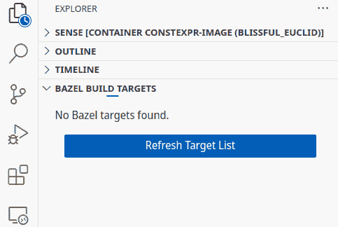
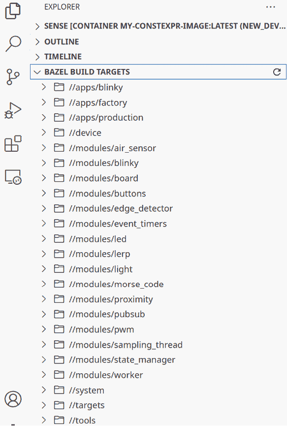
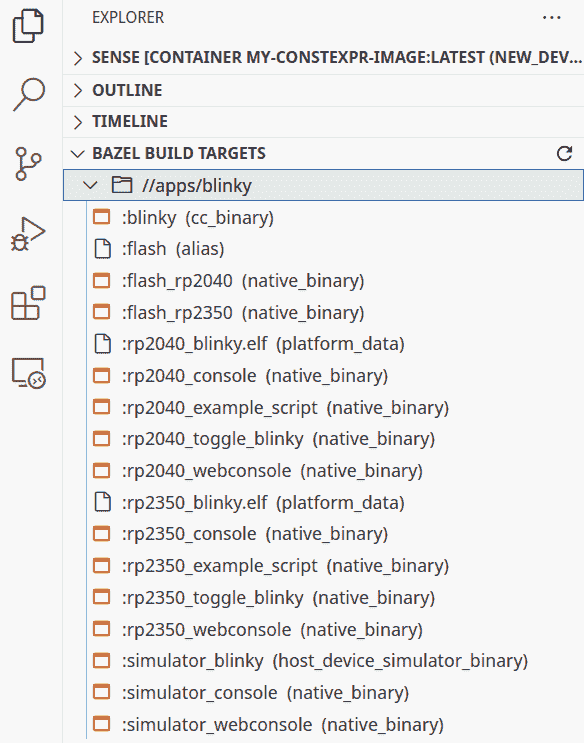
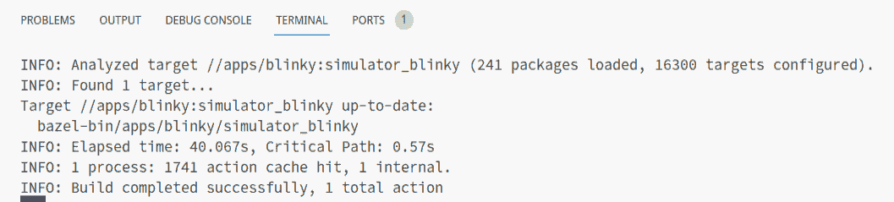
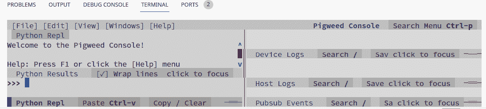
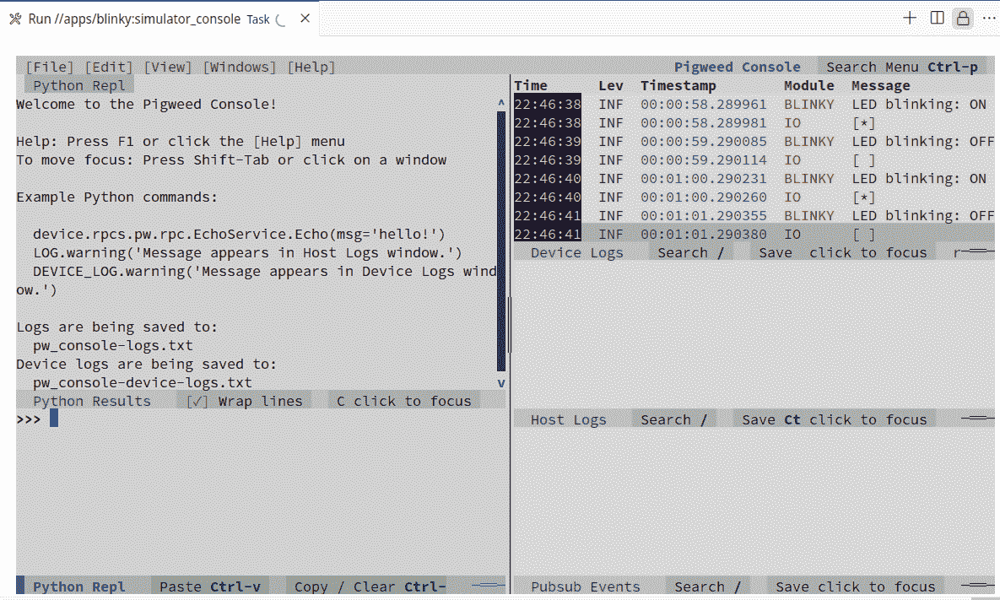

# 第十七章：库和框架

虽然 C++标准库提供了大量的容器和算法，但某些方面——例如动态内存分配——在受限环境中可能会带来挑战。在*第二章*中，我们探讨了这些问题及其解决方法。然而，像**嵌入式模板库**（**ETL**）这样的专用库提供了确定性行为和固定内存占用，非常适合嵌入式系统。

嵌入式应用程序依赖于供应商提供的作为 C 库的**硬件抽象层**（**HALs**）。在*第十二章*中，我们探讨了如何使用接口将应用层 C++代码与底层基于 C 的硬件交互解耦。将整个 HAL 用 C++包装是一项大量工作，但幸运的是，有像 Google 的 Pigweed 这样的项目正在处理这个问题，同时为嵌入式开发提供了额外的功能和灵活性。

在*第十一章*中，我们探讨了 C++如何在编译时执行计算，从而减少内存占用。在*第十五章*中，我们学习了观察者模式并检查了其编译时实现。英特尔公司的**编译时初始化和构建**（**CIB**）将这些想法提升到了更高的层次，使得在编译时配置固件应用成为一种声明式方法。在本章中，我们将介绍以下 C++库：

+   标准库

+   嵌入式模板库

+   猪草

+   编译时初始化和构建

# 技术要求

您可以在*第四章*中设置的 Docker 容器中的 Renode 模拟器中尝试本章的示例。请确保 Docker 容器正在运行。

您可以在 GitHub 上找到本章的文件，地址为[`github.com/PacktPublishing/Cpp-in-Embedded-Systems/tree/main/Chapter17`](https://github.com/PacktPublishing/Cpp-in-Embedded-Systems/tree/main/Chapter17)。

# 标准库

C++标准定义了两种标准库实现类型——带宿主环境和独立环境：

+   独立实现旨在在没有依赖操作系统通常提供的服务的情况下运行，例如文件系统访问或多线程支持。因此，C++标准仅指定了必须由独立实现提供的标准库头文件的一个有限子集。

+   带宿主环境的实现需要一个全局定义的主函数，环境负责在启动时调用此函数。在独立实现中，启动例程和程序的入口点是实现定义的，这允许开发者有更大的灵活性来指定其应用程序的初始化和执行流程。

虽然标准在全局定义的 `main` 函数方面对托管和独立实现进行了明确的区分，但本书中的一些示例配置模糊了两者之间的界限。

## GCC 中的独立和托管实现

尽管我们在一个独立的环境中操作（没有操作系统），本书中的一些示例使用了 C++ 标准库的组件（例如，`std::function`），这些组件通常与托管实现相关联。这是可能的，因为：

+   正如我们在 *第四章* 中观察到的，我们在链接器脚本中将程序入口点设置为 `Reset_Handler`。

+   在汇编器启动脚本中实现的 `Reset_Handler` 执行低级初始化并显式调用 `main`。

+   我们使用 nano 规范（*第七章*），链接到一个大小优化的 C++ 标准库子集。这允许有限地使用托管功能，如 `std::function`，同时避免对操作系统的依赖。

这种混合方法利用 GCC 的灵活性，在裸机环境中结合独立执行（自定义入口点，没有操作系统）和托管库功能（标准头文件，实用工具）。

要明确请求 GCC 使用标准库的独立实现，应使用编译器标志 `-ffreestanding`。C++ 标准库提供了许多“按需付费”的组件，即使在资源受限的环境中也非常有用。在前几章中，你已经与标准库的许多部分一起工作过，因此你对它的功能有了坚实的理解。在这里，我们将概述最适合资源受限环境的部分，并指出哪些部分应谨慎使用或避免使用。

## 数值和数学

嵌入式系统通常用于自动化和过程控制，需要精确控制数值类型、它们的范围和数学运算。C++ 标准库提供了 `<cstdint>`、`<limits>` 和 `<cmath>` 头文件来定义固定宽度的整数、查询数值限制和执行数学计算，有助于确保在资源受限环境中可预测的行为、可移植性和效率。

### `<cstdint>`

`<cstdint>` 头文件提供了固定宽度的整数类型，如 `std::int8_t`、`std::uint32_t`，以及其他在 `stdint.h` 中定义的知名 C 类型。这些类型在嵌入式环境中非常有用，在这些环境中，整数的大小和位宽对于直接访问硬件寄存器、可预测的溢出行为和内存使用考虑非常重要。通过使用它们，你明确记录了变量大小的意图，从而提高了代码的可移植性，并防止在不同原生整数宽度平台之间迁移时出现潜在惊喜。

### `<limits>`

该头文件提供了 `std::numeric_limits` 模板，它描述了基本数值类型（如最小和最大值、符号和精度）的性质。这在嵌入式环境中处理溢出时特别有用。典型用法发生在编译时或通过编译器的简单内联，从而产生最小的运行时开销。通过使用 `std::numeric_limits::max()` 等函数，您避免了散布魔法常数或架构特定的假设，有助于可移植性和可维护性。

### <cmath>

`<cmath>` 头文件提供了标准数学函数，如 `std::sin`、`std::cos`、`std::sqrt` 等。在嵌入式环境中，尤其是在没有浮点硬件的环境中，这些函数在运行时性能和代码大小方面可能相对昂贵。仔细考虑您是否真的需要浮点数学，如果是这样，是否近似或定点例程可能足够且更高效。

## 容器和算法

嵌入式系统通常管理结构化数据，并在资源受限的紧密约束下需要高效地处理它。C++ 标准库提供了容器和算法头文件，如 `<array>`、`<span>` 和 `<algorithm>`，以组织数据并执行常见的操作，如搜索、排序和转换，从而实现更易读和可维护的代码。

### std::array

在标准库中，唯一避免动态分配的固定大小容器是 `std::array`。我们在*第一章*中讨论泛型类型时提到了它。在同一章中，我们将环形缓冲区实现基于 `std::array`，这使得我们可以使用相同的泛型代码创建不同类型和大小的环形缓冲区。

`std::array` 通常被实现为一个围绕 C 风格数组的包装器。除了是一个泛型类型外，它还提供了基于索引访问的 `at` 方法，该方法具有运行时边界检查，使其成为原始数组的更安全替代品。如果请求超出边界的索引，`at` 方法将抛出异常。如果禁用了异常，它可能会调用 `std::terminate` 或 `std::abort`，具体取决于库的实现。这些行为应根据您的系统要求通过实现适当的终止和信号处理程序来处理。

### std:: priority_queue

`std::priority_queue` 是一个提供优先队列功能的容器适配器。默认情况下，它使用 `std::vector` 作为底层容器。然而，如*第十四章*所示，您可以将其替换为来自 ETL 的 `etl::vector`，从而避免动态内存分配的问题。

### std:: span

如*第九章*所示，`std::span` 是围绕连续对象序列的轻量级、非拥有包装器，其中第一个元素位于位置 0。它提供了诸如 `size()` 方法、用于元素访问的 `operator[]` 以及 `begin()` 和 `end()` 迭代器等基本功能，使其能够无缝地与标准库算法集成。

`std::span` 可以从 C 风格数组以及容器如 `std::array`、`std::vector` 或 `etl::vector` 中构造。这使得它成为使用单独的指针和大小参数的实用替代品，这在将 C++ 代码与 C 库（如 HAL 中使用的库）接口时特别有用。

### 迭代器

迭代器是抽象，它们像通用指针一样工作，提供了一种统一的方式来遍历和访问容器内的元素。例如，标准库容器实现了 `begin()` 和 `end()` 方法，它们返回标记序列起始和结束位置的迭代器。这种一致的接口允许算法在多种容器类型上以通用方式工作，增强代码的可重用性和清晰性。

让我们通过以下使用 `std::array` 的示例来了解：

```cpp
#include <array>
#include <algorithm>
#include <cstdio>
int main() {
    std::array<int, 5> arr = {5, 3, 4, 1, 2};
    std::array<int, 5>::iterator start = arr.begin();
    auto finish = arr.end();
    std::sort(start, finish);
    for (auto it = arr.begin(); it != arr.end(); ++it) {
        printf("%d ", *it);
    }
    printf("\n");
    return 0;
} 
```

此示例演示了如何使用标准库容器与迭代器一起使用：

+   迭代器 `start` 明确声明为 `std::array<int, 5>::iterator` 以展示完整的类型名，而迭代器 `finish` 使用 `auto` 声明以提高简洁性，允许编译器推断其类型。

+   使用从 `arr.begin()` 和 `arr.end()` 获得的迭代器 `start` 和 `finish` 应用 `std::sort` 算法，以升序对数组进行排序。

+   循环使用 `auto` 声明迭代器 `it`，这使得代码更加简洁。循环遍历排序后的数组，并使用 `printf` 打印每个元素。

迭代器用于遍历容器。它们不仅促进了通用编程，还使得在不更改算法逻辑的情况下轻松切换容器类型变得容易。

### 算法

标准库中的算法提供了一种在不同容器中解决常见问题的统一方式，使代码更具表达性和易于维护。它们允许您使用统一接口执行搜索、排序、复制和累积数据等操作。以下列出了一些最常用的算法：

+   `std::sort`：默认按升序对元素范围进行排序，使用小于运算符进行比较。它还可以接受自定义比较器，根据不同的标准进行排序，例如降序或特定对象属性。

+   `std::find`：在范围内搜索给定值的第一个出现，并返回指向它的迭代器。如果找不到该值，则返回结束迭代器，表示搜索失败。

+   `std::for_each`：将指定的函数或 lambda 应用于范围内的每个元素。

+   `std::copy`：将一个范围的元素复制到另一个目标范围。

+   `std::copy_if`：仅复制满足指定谓词的元素，这使得在复制数据时过滤数据变得很有用。

+   `std::min` 和 `std::max`：分别返回两个值中的较小或较大值，默认使用小于运算符（或提供的比较函数）。它们在只需要比较两个值的最小或最大值时非常有用。

+   `std::min_element` 和 `std::max_element`：返回范围中最小或最大元素的迭代器。当您需要在一个容器中找到极端值的位罝时（而不是仅仅比较两个值），这些非常有用。

+   `std::accumulate`：遍历一个范围，并使用二进制运算（默认为加法）将元素与初始值组合。这允许对值求和、计算乘积或执行您定义的任何自定义聚合。

## 模板元编程

如*第八章*所述，C++类型特性是编译时谓词和转换，允许编译器根据类型的属性强制约束。它们用于编写通用、健壮的代码，而不会产生运行时开销。在*第十二章*中，我们使用类型特性创建类型安全的寄存器访问，防止编译时无效类型的使用，并降低细微错误的几率。

在本节中提到的章节中，我们利用了一些具体的类型特性：

+   `std::enable_if`：根据布尔编译时表达式启用或禁用函数模板

+   `std::is_same`：检查两个类型是否完全相同

+   `std::is_enum`：检查一个类型是否是枚举类型

+   `std::underlying_type`：检索枚举的基本整数类型

+   `std::is_arithmetic`：检查一个类型是否是算术类型（整型或浮点型）

+   `std::is_integral`：检查一个类型是否是整型

+   `std::is_floating_point`：检查一个类型是否是浮点类型

## 在嵌入式应用程序中应避免的标准库部分

标准库中的许多容器，如 `std::vector`、`std::list` 和 `std::string`，使用动态内存分配。如果您的嵌入式应用程序不允许动态内存分配，应避免使用这些。

包含在头文件 `<iostream>` 中的 `iostream` 库需要大量的内存资源，并且依赖于动态分配。这就是为什么我们使用了 `<cstdio>` 头文件和 `printf` 函数来进行控制台输出。

在*第十章*中，我们介绍了 `<functional>` 头文件中的 `std::function`。在那里，我们概述了在某些情况下，`std::function` 可以使用动态内存分配，这意味着如果使用，应谨慎使用。请注意，`std::function` 在独立实现中不可用。

接下来，我们将简要概述 ETL，它补充了在受限嵌入式环境中的标准库。

# 嵌入式模板库

在*第二章*中，我们了解到`std::vector`默认使用动态内存分配。我们还了解到，我们可以使用`std::polymorphic_allocator`和一个单调缓冲区使其使用静态分配的内存。这种方法仍然不是万无一失的，因为即使在采用这种方法的情况下，`std::vector`在某些情况下仍然可能求助于动态内存分配。

为了解决标准库在嵌入式环境中所提出的挑战，ETL 提供了一套模板容器和算法，它们紧密模仿标准库对应物的接口，但针对资源有限的系统进行了定制。

## 固定大小的容器

ETL 的主要优势之一是其容器（如`etl::vector`、`etl::list`、`etl::string`等）允许你在编译时指定一个固定的最大大小。容器实现确保在运行时不会执行动态内存分配，因为内存是在前端作为原子或静态存储预留的。

由于 ETL 容器旨在模仿标准库容器，并且它们实现了迭代器，因此它们可以与标准库中的大多数算法和容器适配器一起使用。这使我们能够利用标准库中的组件，而无需担心动态分配。

由于 C++11 中引入了`std::array`，ETL 为不支持 C++11 的平台提供了`etl::array`。

## 使用`etl::delegate`存储可调用对象

如*第十四章*所示，你可以使用`etl::delegate`代替`std::function`来存储可调用对象。然而，`etl::delegate`是非所有权的，因此你必须小心处理潜在的悬垂引用。

## ETL 提供的其他实用工具

除了固定大小的容器和`etl::delegate`之外，ETL 还提供了一些实用工具，例如消息框架——一组消息、消息路由器、消息总线以及有限状态机。它还提供了 CRC 计算、校验和以及哈希函数。

ETL 允许你配置错误处理。它可以配置为抛出异常或将错误发送到用户定义的处理程序。这提供了更大的灵活性和基于项目需求的配置。

你可以在[`www.etlcpp.com/`](https://www.etlcpp.com/)网站上了解更多关于 ETL 的信息。

接下来，我们将讨论 Pigweed——由 Google 开发的一组轻量级、模块化的 C++库，用于嵌入式系统，提供日志记录、断言和蓝牙连接等组件，以简化开发并提高代码重用性。

# Pigweed

嵌入式系统开发中最大的挑战之一是可移植性。为了使代码真正可移植，它必须依赖于接口。为了在不同的硬件目标上运行，需要有人在不同的目标上实现这些接口。在各个项目和设备之间维护一致的接口可能很困难。Google 的 Pigweed 项目旨在通过提供嵌入式应用的软件模块来解决这一问题，其中许多目标已经实现了硬件接口。

Pigweed 旨在用于复杂项目和大型团队。除了硬件接口外，它还：

+   打包了基于它们的软件模块，例如日志记录、串行通信（SPI、I2C 和 UART）、蓝牙**主机控制器接口**（**HCI**）、交互式控制台、**远程过程调用**（**RPC**）系统等。

+   提供了标准库组件的嵌入式友好替代方案：固定大小的字符串和容器。

+   开箱即用管理整个工具链，简化了开发环境的设置。

+   提供了一个完整的框架——`pw_system`——它将 Pigweed 中的许多模块组合在一起，构建了一个具有 RPC、日志记录等功能的运行系统。

如您所见，Pigweed 不仅是一个库——它是一个完整的开发生态系统。它可以作为一个框架使用，但您也可以挑选适合您需求的单个模块。正如文档网站[`pigweed.dev/`](https://pigweed.dev/)上所述——Pigweed 仍处于早期阶段；一些模块仍在开发中，而一些则已稳定并用于市场上的一些设备。与任何库一样，您需要评估它是否适合在您的项目中使用。

我们将进行 Pigweed 的 Sense 教程，以展示其一些功能——主要是交互式控制台和**RPC**系统。

## Pigweed 的 Sense 教程

Sense 项目是一个演示项目，它利用了许多 Pigweed 组件，并展示了它们是如何协同工作的。

Sense 是一个简化版的空气质量传感器，它只包含完整产品的一些功能。目标是让您通过以下步骤获得使用 Pigweed 的实际经验：

1.  首先，确保 Docker 守护进程正在运行。以网络主机模式启动一个 Docker 镜像并将其附加到 Bash。在 Linux 环境中，您可以使用以下命令：

    ```cpp
    $ sudo systemctl start docker
    $ docker run --network=host -d -it --name dev_env mahmutbegovic/cpp_in_embedded_systems
    $ docker exec -it dev_env /bin/bash 
    ```

对于基于 Windows 的主机，请使用以下命令来转发运行教程所需的端口：

```cpp
$ docker run -d -it --name dev_env -p 33000:33000 -p 8080:8080 mahmutbegovic/cpp_in_embedded_systems 
```

1.  接下来，克隆 Sense 仓库：

    ```cpp
    $ git clone https://pigweed.googlesource.com/pigweed/showcase/sense 
    ```

1.  接下来，启动 Visual Studio Code，连接到正在运行的容器，并打开`/workspace/sense`文件夹。如果您在**Visual Studio Code**中看到一个弹出消息建议安装 Pigweed 扩展，请接受它；否则，转到**扩展**，搜索`Pigweed`并安装它。


图 17.1 – Visual Studio Code 扩展

*图 17.1*展示了 Visual Studio Code Pigweed 扩展。

1.  安装扩展后，转到资源管理器视图并展开 **BAZEL 构建目标** 节点。点击 **刷新目标列表** 按钮。



图 17.2 – BAZEL 构建目标节点

刷新目标列表可能需要 30 秒到几分钟不等。Pigweed 使用 Bazel 进行构建自动化。刷新后的目标列表应类似于以下内容：



图 17.3 – BAZEL 构建目标

*图 17.3* 描述了 Bazel 构建目标。

1.  接下来，展开 **//apps/blinky** 节点。



图 17.4 – //apps/blinky 目标

1.  现在，我们将构建一个在主机上运行的应用程序版本。右键单击 **simulator_blinky (host_device_simulator_binary**)，然后点击 **构建目标**。构建可能需要大约 10 分钟。完成后，你应该会看到类似以下的消息：



图 17.5 – 构建成功

1.  构建成功后，我们将启动应用程序。右键单击 **simulator_blinky (host_device_simulator_binary**)，然后选择 **运行目标**。如果成功，你应该会在终端中看到以下消息：**在端口 33000 上等待连接**。

1.  接下来，右键单击 **simulator_console (native_binary**)，然后选择 **运行目标**。这将构建一个控制台并将其连接到正在运行的模拟器。如果成功，你应该会看到以下屏幕：



图 17.6 – 在终端视图中运行的交互式控制台

在 *图 17.6* 中，你可以看到在 Visual Studio Code 的终端视图中运行的交互式控制台。

1.  为了使控制台更容易使用，右键单击 **Run //apps/blinky:simulator_console** 并选择 **将终端移动到新窗口**。这将把控制台移动到单独的窗口，如图所示：



图 17.7 – 在单独窗口中运行的交互式控制台

在 *图 17.7* 中，右上角的 **设备日志** 窗格中，我们可以看到来自模拟设备（在主机上运行的应用程序）的日志。它每秒发送 **LED 闪烁** 消息。

1.  接下来，我们将使用 RPC 协议向设备发送消息，以检索设备测量的温度。在左下角的窗格中输入以下命令 – **Python Repl**：

    ```cpp
    $ device.rpcs.board.Board.OnboardTemp() 
    ```

你应该会看到以下响应：

```cpp
$ (Status.OK, board.OnboardTempResponse(temp=20.0)) 
```

1.  接下来，发送一条将切换 LED 的消息：

    ```cpp
    $ device.rpcs.blinky.Blinky.Blink(interval_ms=200, blink_count=3) 
    ```

此调用将使 LED 以 200 毫秒的间隔闪烁三次，然后停止 **LED 闪烁** 消息。这表明我们也可以向 RPC 调用提供参数。

接下来，我们将更详细地介绍 Pigweed 的 RPC。

## RPC 和 Protocol Buffers

Pigweed 的 RPC 系统基于 Protocol Buffers – 一种用于数据序列化的平台无关机制。Protocol Buffers 是一种具有自己语法的语言，它可以编译成我们的 Sense 设备上的 C++ 等目标语言以及我们在 Python **Read Eval Print Loop**（**REPL**）中使用的 Python 代码。

那么，为什么在嵌入式应用程序中使用像 Protocol Buffers 这样的额外抽象层呢？标准化序列化给您的项目带来了一些好处：

+   紧凑的二进制消息 – 它们添加的额外开销非常小。

+   系统不同部分之间精确的合同（`.proto` 文件），确保所有各方都同意交换数据的结构和含义。

+   通过修改 proto 文件可以管理通信协议的更新。

简而言之，而不是在多个代码库（C++ 和 Python）中编写序列化和反序列化代码并维护它们，您在 proto 文件中编写通信协议，并使用 Protocol Buffers 编译器生成用于序列化的 C++ 和 Python 代码。

让我们检查 `modules/blinky/blinky.proto` 文件的一部分，该部分描述了在 *Pigweed 的 Sense 教程* 部分中使用的 Blinky 服务，该服务在以下代码中以 200 毫秒的间隔闪烁 LED 三次：

```cpp
syntax = "proto3";
package blinky;
import "pw_protobuf_protos/common.proto";
service Blinky {
// Toggles the LED on or off.
rpc ToggleLed(pw.protobuf.Empty) returns(pw.protobuf.Empty);
// Blinks the board LED a specified number of times.
rpc Blink(BlinkRequest) returns (pw.protobuf.Empty);
}
message BlinkRequest {
// The interval at which to blink the LED, in milliseconds. uint32 interval_ms = 1;
// The number of times to blink the LED.
optional uint32 blink_count = 2;
} 
```

此 proto 文件定义了一个名为 `Blinky` 的服务，用于控制 LED，使用 Protocol Buffers 版本 3（`syntax = "proto3"`）。它导入了一个 `common` proto 文件并定义了两个方法：

+   `ToggleLed`: 一个简单的使用空请求和响应切换 LED 开关的方法。

+   `Blink`: 一种通过可配置的 `interval_ms` 和 `optional blink_count`（`BlinkRequest` 的成员）闪烁 LED 的方法。使用 `optional` 关键字意味着在调用方法时可以省略此参数。

这是对 blinky.proto 文件的简要说明。更详细的 Protocol Buffers 指南可以在以下网站上找到：[`protobuf.dev/programming-guides/proto3/`](https://protobuf.dev/programming-guides/proto3/)。

对于 `blinky` proto 文件中的每个服务，Pigweed 的代码生成器将生成相应的 C++ 类。生成的 `Blinky` 类位于文件包的专用 `pw_rpc::nanopb` 子命名空间内：`blinky::pw_rpc::nanopb::Blinky::Service`。

生成的类作为必须继承以实现服务方法的基类。它基于派生类进行模板化。`BlinkyService` 类实现了基类。以下代码是其定义的一部分，来自 `modules/blinky/service.h` 文件：

```cpp
class BlinkyService final : public ::blinky::pw_rpc::nanopb::Blinky::Service {
public:
    pw::Status ToggleLed(const pw_protobuf_Empty&, pw_protobuf_Empty&);
    pw::Status Blink(const blinky_BlinkRequest& request, pw_protobuf_Empty&);
private:
    Blinky blinky_;
}; 
```

`BlinkyService` 在生成的 RPC 接口与控制 LED 的具体实现之间架起桥梁。它有一个私有的 `blinky_` 对象，其类型为 `Blinky`，用于控制 LED，如以下代码块中 `modules/blinky/service.cc` 文件中 `ToggleLed` 和 `Blink` 方法的实现所示：

```cpp
pw::Status BlinkyService::ToggleLed(
const pw_protobuf_Empty&,
pw_protobuf_Empty&)
{
    blinky_.Toggle();
    return pw::OkStatus();
}
pw::Status BlinkyService::Blink(
const blinky_BlinkRequest& request,
pw_protobuf_Empty&) 
{
    uint32_t interval_ms = request.interval_ms;
    uint32_t blink_count = request.has_blink_count;
    return blinky_.Blink(blink_count, interval_ms);
} 
```

在此代码中，`ToggleLed`和`Blink`方法使用`blinky_`对象来控制 LED。当通过传输层接收到`blinky`服务的二进制 proto 消息时，它们被转换为对用于控制硬件的代码的实际调用，这是 RPC 的本质。

作为练习，通过添加`BlinkTwice`方法来扩展`blinky`服务。你已经知道需要修改的文件——proto 文件和`BlinkyService`实现文件。

Pigweed 使用**nanopb** ([`github.com/nanopb/nanopb`](https://github.com/nanopb/nanopb))在 C 文件中编译 proto 文件，然后将其封装在 C++中。为微控制器特别设计的纯 C++实现协议缓冲区是嵌入式 Proto。它是一个面向对象的实现，只使用静态内存分配。它是在遵循 MISRA C++指南的基础上开发的。这些特性使得嵌入式 Proto 适用于具有广泛要求的各种应用，从低内存使用到安全性考虑。你可以在 GitHub 页面上了解更多信息：[`github.com/Embedded-AMS/EmbeddedProto`](https://github.com/Embedded-AMS/EmbeddedProto)。

Pigweed 的学习曲线很陡峭，应该根据您的系统要求仔细评估。由于学习成本较高，它更适合大型、更复杂的项目。此外，评估硬件支持，并考虑一些模块可能引入的内存开销。

与 Pigweed 相比，Intel 的**CIB**库利用了 C++的编译时能力。这种方法在增强灵活性和表现力的同时，最小化了内存开销。接下来，我们将介绍 CIB 库。

# 编译时初始化和构建

在嵌入式系统中，C++的一个主要优势是它能够在编译时执行计算。在大多数情况下，我们在编译之前对应用程序有相当的了解，这使我们能够在编译时对其进行配置。Intel 的 CIB 库在编译时提供了一个声明性接口来配置固件组件。

正如你在*第十五章*中看到的，观察者设计模式在事件驱动系统中被广泛使用，用于将事件源（发布者）与对那些事件做出反应的实体（观察者或订阅者）解耦。通过使用订阅者接口，观察者可以注册自己到事件源，然后事件源会通知它们变化或事件，而无需了解观察者实现的具体细节。

这种解耦使得系统设计在灵活性、模块化方面更加出色，因为组件可以添加、删除或修改，而无需将它们紧密耦合到事件生成器。CIB 库利用了这一特性，它通过实现编译时观察者模式来提供配置固件应用程序的声明性接口。通过在编译时解决依赖关系并建立事件驱动关系，CIB 消除了运行时开销，同时保持组件松散耦合和高效互联。

我们将从一个简单的温度发布者示例开始探索 CIB 库。整个示例可在 [`github.com/PacktPublishing/Cpp-in-Embedded-Systems/tree/main/Chapter17/cib`](https://github.com/PacktPublishing/Cpp-in-Embedded-Systems/tree/main/Chapter17/cib) 找到。您可以使用以下命令运行它：

```cpp
$ cmake –B build
$ cmake --build build --target run_in_renode 
```

您可以使用 `app/src/main.cpp` 来跟踪示例，因为撰写本文时，CIB 在 Compiler Explorer 中不可作为库使用。

## 在温度发布者示例中使用 CIB

让我们从以下步骤开始：

1.  我们首先需要声明一个服务（发布者），它是一个继承自 `callback::service` 的空结构体，`callback::service` 是一个变长类模板，提供了将被订阅者接受的类型，如下代码所示：

    ```cpp
    struct send_temperature : public callback::service<float> {}; 
    ```

1.  接下来，我们将创建订阅者（在 CIB 库的上下文中也称为组件）`display_temperature_component` 和 `data_sender_component`，如下代码所示：

    ```cpp
    struct display_temperature_component {
    constexpr static auto display_temperature = [](float temperature) {
        printf("Temperature is %.2f C\r\n", temperature);
    };
    constexpr static auto config = cib::config(
        cib::extend<send_temperature>(display_temperature)
    );
    };
    struct data_sender_component {
    constexpr static auto send_temp = [](float temp) {
        printf("Sending temperature %.2f C\r\n", temp);
    };
    constexpr static auto config = cib::config(
        cib::extend<send_temperature>(send_temp)
    );
    }; 
    ```

上述代码定义了两个组件，它们执行以下操作：

+   在 `constexpr` 狼形函数 `display_temperature` 和 `send_temp` 中为 `send_temperature` 服务提供处理程序。

+   定义通过它们扩展服务（订阅事件）的 `constexpr static auto config` 成员。

配置成员是变长模板类 `cib::config` 的实例，并由 CIB 库在编译时连接应用程序，即连接服务（事件生成器、发布者）与扩展这些服务的软件组件（观察者）。编译时初始化和构建过程由 `cib::nexus` 执行，它需要提供项目配置。以下是此简单项目的配置代码：

```cpp
struct my_project {
constexpr static auto config = cib::config(
    cib::exports<send_temperature>,

    cib::components<display_temperature_component,
                    data_sender_component>
);
}; 
```

此项目配置是一个简单的结构体 `my_project`，具有 `constexpr` 成员 `config`，它提供了以下内容：

+   `cib::exports<send_temperature>`：用于声明服务（发布者）

+   `cib::components<display_temperature_component, data_sender_component>`：用于声明可以扩展服务的软件组件

1.  接下来，让我们看看如何在以下代码中的固件应用程序中使用所有这些功能：

    ```cpp
    int main() {
        cib::nexus<my_project> nexus{};
        nexus.init();
        for(int i = 0; i < 3; i++)
        {
            nexus.service<send_temperature>(42.0f);
        }
        return 0;
    } 
    ```

在此代码中，我们执行以下步骤：

+   `cib::nexus<my_project> nexus{};`：创建由项目配置 `my_project` 提供的类模板 `cib::nexus` 的实例。

+   `nexus.init();`：初始化 Nexus。

+   `nexus.service<send_temperature>(42.0f);`: 访问服务并提供浮点参数（温度）。这将触发调用扩展 `send_temperature` 服务的组件中的 lambda。

## 扩展温度发布器示例

接下来，我们将通过添加两个组件扩展这个简单的示例 – 一个虚拟温度传感器和名为 `temperature_sensor_component` 和 `i2c` 的 I2C 组件。我们还将引入两个新的服务 – `runtime_init` 和 `main_loop`：

1.  让我们从定义此代码中的新服务开始：

    ```cpp
    struct runtime_init : public flow::service<> {};
    struct main_loop : public callback::service<> {}; 
    ```

在这里，我们定义了两个服务：

+   `runtime_init`: 继承自变长类模板 `flow::service`，允许我们按顺序执行操作。

+   `main_loop`: 继承自 `callback::service`，它将在主 `while` 循环中被调用。

1.  我们现在将转向 I2C 组件的实现，如下所示：

    ```cpp
    struct i2c {
    constexpr static auto init = flow::action<"i2c_init">(
        [](){
            printf("I2C init ...\r\n");
        });
    constexpr static auto config = cib::config(
        cib::extend<runtime_init>(*init)
    );
    }; 
    ```

此代码定义了一个新的组件 – `i2c` – 作为具有以下内容的结构体：

+   `constexpr static auto init`: 一个包装在 `flow::action` 中的 lambda，它实现了 I2C 外设的初始化。

+   `constexpr static auto config`: 将上述操作添加到 `runtime_init` 流服务中。`*` 操作符显式地将操作添加到流程中。没有它，操作会被引用但不会添加，导致编译时错误。

1.  接下来，让我们通过以下代码查看温度传感器组件：

    ```cpp
    struct temperature_sensor_component {
    constexpr static auto init = flow::action<"temp_sensor_init">(
        []() {
            printf("Initializing temperature sensor ... \r\n");
        });
    constexpr static auto read_temperature = []() {
        float temperature = 23.4f;
        cib::service<send_temperature>(temperature);
    };
    constexpr static auto config = cib::config(

        cib::extend<main_loop>(read_temperature),
        cib::extend<runtime_init>(i2c::init >> *init)
    );
    }; 
    ```

上述代码展示了具有以下成员的 `temperature_sensor_component` 结构体：

+   `constexpr static auto init`: 一个实现温度传感器初始化的 `flow_action`。

+   `constexpr static auto read_temperature`: 一个 lambda，它实现温度传感器的周期性读取，并使用 `cib::service<read_temperature>` 发布读取值。

+   `constexpr static auto config`: 使用 `read_temperature` lambda 扩展 `main_loop` 服务，并使用 `runtime_init` 流中的 `i2c::init >> *init` 扩展 `runtime_init` 流，表示 `i2c::init` 在 `init` 之前。

1.  接下来，我们需要修改 `my_project` 结构体以导出新的服务和添加新的组件，如下所示：

    ```cpp
    struct my_project {
    constexpr static auto config = cib::config(
        cib::exports<runtime_init,
                     main_loop,
                     send_temperature>,

        cib::components<i2c,
                        temperature_sensor_component,
                        display_temperature_component,
                        data_sender_component>
    );
    }; 
    ```

在此代码中，我们简单地添加了：

+   将 `runtime_init` 和 `main_loop` 服务添加到 `cib::exports`

+   `i2c` 和 `temperature_sensor_component` 添加到 `cib::components`

1.  最后，让我们看看新的 `main` 函数，如下所示：

    ```cpp
    int main() {
        cib::nexus<my_project> nexus{};
        nexus.init();
        nexus.service<runtime_init>();
        for(int i = 0; i < 3; i++)
        {
            nexus.service<main_loop>();
        }
        return 0;
    } 
    ```

如前所述，我们首先创建一个 `cib::nexus` 实例并初始化它。然后，我们执行以下步骤：

1.  `nexus.service<runtime_init>()`: 这将运行 `runtime_init` 流中的所有操作，并确保操作的指定顺序。

1.  `nexus.service<main_loop>()`: 这是在主循环中执行的所有扩展此服务的 lambda 的调用。

这种结构对于许多固件应用来说是典型的：初始化所有组件（包括硬件外设），然后在主循环中反复调用相关服务。对应用的任何更改都是在`my_project`结构中以声明方式进行的——通过扩展服务和添加或删除组件。所有初始化都在组件自身中执行，这意味着主函数不需要了解各个组件及其依赖的细节。

CIB 库还包括日志、中断、消息和字符串常量库——所有这些都利用了 C++的编译时计算。你可以在 GitHub 上找到有关 CIB 的更多信息：[`github.com/intel/compile-time-init-build`](https://github.com/intel/compile-time-init-build)。

你可以在 Renode 中运行完整的 CIB 示例。启动 Visual Studio Code，将其附加到正在运行的容器，打开`Chapter17/cib`项目，如*第四章*中所述，然后在 Visual Studio Code 终端中运行以下命令，或者直接在容器终端中运行：

```cpp
$ cmake –B build
$ cmake --build build --target run_in_renode 
```

运行上述示例将生成以下输出：

```cpp
I2C init ...
Initializing temperature sensor ...
Sending temperature 23.40 C
Temperature is 23.40 C
Sending temperature 23.40 C
Temperature is 23.40 C
Sending temperature 23.40 C
Temperature is 23.40 C 
```

本例演示了在具有松散耦合组件的事件驱动系统中使用 CIB 库的情况，其中一些组件生成事件，而另一些则对它们做出反应。发布者和订阅者的连接是在编译时发生的，这最小化了内存占用并减少了运行时开销，而声明性的项目配置则提高了可读性。

# 摘要

在本章中，我们概述了本书中使用的库——C++标准库和 ETL。你还了解了谷歌的 Pigweed 库及其功能和英特尔 CIB 库。

在下一章中，我们将介绍跨平台开发。
