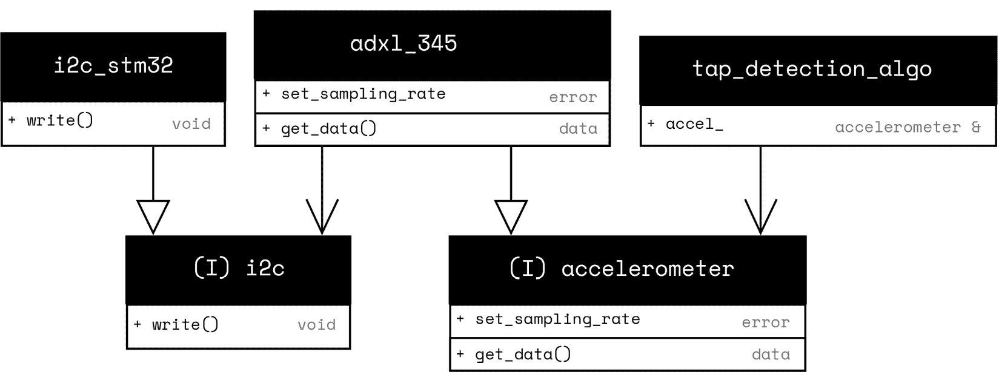
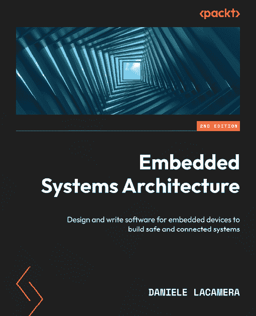
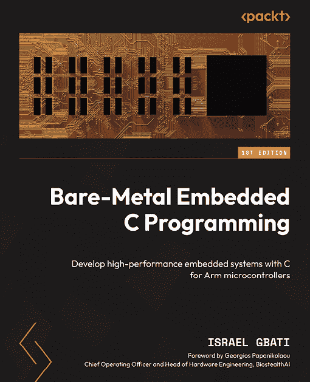

# 18

# 跨平台开发

在前面的章节中，我们探讨了为嵌入式系统设计和实现软件组件的实际示例。每个示例都展示了良好的软件设计实践，并指导您使用现代 C++技术进行实现。

我们在整本书中遵循的设计实践帮助我们创建了可移植的、跨平台的代码。编写跨平台代码很重要，因为它使得软件组件可以在不同的硬件配置中重用。随着我们结束这次旅程，让我们回顾一下前面章节中展示的关键实践。

在本章中，我们将涵盖以下主题：

+   编写可移植代码的重要性

+   SOLID 设计原则

+   可测试性

# 技术需求

本章重点介绍跨平台开发。这里展示的代码可以在多个平台上运行，包括常见的桌面架构。

您可以使用 Compiler Explorer ([`godbolt.org/`](https://godbolt.org/)) 来运行示例。所有源代码都可在 GitHub 上找到，网址为[`github.com/PacktPublishing/Cpp-in-Embedded-Systems/tree/main/Chapter18`](https://github.com/PacktPublishing/Cpp-in-Embedded-Systems/tree/main/Chapter18)。

# 编写可移植代码的重要性

硬件项目成熟、发展并适应市场需求和供应链条件。在 2020 年至 2022 年期间，全球半导体行业面临严重的供应链危机，主要是由 COVID-19 大流行引发的，并因几个因素而加剧。封锁扰乱了生产，而对电子产品（例如笔记本电脑、服务器）的需求激增与汽车行业的误判相撞。汽车制造商最初取消了芯片订单，然后在需求反弹时急忙补货。

因此，许多组件变得稀缺、价格过高或完全不可用。产品必须通过替换电子组件（如传感器、驱动程序、通信模块甚至微控制器）来适应。这反过来又需要修改固件以匹配新的硬件。

对于编写良好的固件，这种适应相对简单，只需实现特定的硬件接口。例如，如果一个产品使用了加速度计并需要替换它，一个设计良好的固件架构只需实现新组件的接口，而无需更改业务逻辑。

跨平台代码也可以在主机上的模拟环境中运行。在第*17 章*中，我们在主机上运行了 Pigweed 的演示应用程序。这是可能的，多亏了 Pigweed 良好的接口设计，它允许主机实现低级硬件接口。相同的业务应用程序代码可以在多个目标上运行，包括主机，其中输入和输出是模拟的。

结构良好的代码更容易阅读、修改和维护。良好的设计原则即使在需求变化的情况下也能保持项目的灵活性。接下来，我们将探讨五个 SOLID 原则。

# SOLID 设计原则

本书中的示例与**SOLID**设计原则相一致，这些原则最初由 Robert C. Martin 在他的 2000 年论文《设计原则与设计模式》中描述。它们作为编写代码的公认指南，这些代码随着时间的推移保持可适应性和易于工作。尽管 SOLID 原则最初是在面向对象编程中引入的，但它们关注于创建模块化、可维护和可扩展的代码，可以在更广泛的软件开发环境中应用。SOLID 助记符中的每个字母代表一个原则：

+   **单一职责原则 (SRP)**: 一个类应该只有一个职责，使其只有一个改变的理由。

+   **开闭原则 (OCP)**: 一个类应该对扩展开放但对修改封闭。通过动态或静态多态扩展类来添加新功能，而不是修改它。

+   **里氏替换原则 (LSP)**: 派生类应该可以在不破坏软件行为的情况下替换其父类。

+   **接口隔离原则 (ISP)**: 接口类应该保持小巧和简洁，以便派生类只实现它们需要的那些方法。

+   **依赖倒置原则 (DIP)**: 高级模块（例如，加速度计）不应依赖于低级模块（例如，I2C）。两者都应依赖于抽象（接口）而不是具体实现。

接下来，我们将通过一个设计加速度计接口的示例，解释如何使用它，并展示它如何与 SOLID 原则相一致以及为什么这种一致性很重要。首先，我们将设计一个加速度计接口类。代码如下：

```cpp
#include <cstdio>
#include <cstdint>
class accelerometer {
public:
struct data {
    float x;
    float y;
    float z;
};
enum class sampling_rate {
    c_20_hz,
    c_50_hz,
    c_100_hz,
};
enum error {
      ok,
      not_supported
};
virtual error set_sampling_rate(sampling_rate) = 0;
virtual data get_data() = 0;
}; 
```

前面代码中显示的接口类加速度计将由`adxl_345`类实现，该类将使用 i2c 接口与实际的加速度计硬件（ADXL345 集成电路是一个具有 I2C 数字接口的小型加速度计）进行通信。此外，我们将在 STM32 平台上运行代码，因此我们将创建一个（模拟的）i2c 接口实现 – `i2c_stm32`。代码如下：

```cpp
class i2c {
public:
virtual void write() = 0;
};
class i2c_stm32 : public i2c {
public:
void write() override {
    printf("i2c::write...\r\n");
}
};
class adxl_345 : public accelerometer {
public:
adxl_345(i2c &i2c_obj) : i2c_(i2c_obj) {}
error set_sampling_rate(sampling_rate) override {
    printf("adxl_345: setting sampling rate\r\n");
    i2c_.write();
    return error::ok;
}
data get_data() override {
    return data{0.02f, 0.981f, 0.03f};
}
private:
i2c &i2c_;
}; 
```

接下来，我们将设计一个简单的`tap_detection_algo`类，该类使用加速度计接口来收集运动数据并识别短促的突然运动，通常称为轻敲。轻敲是加速度的快速峰值，可以用作用户输入或触发应用程序中的事件。以下代码展示了轻敲检测类的模板：

```cpp
class tap_detection_algo {
public:
tap_detection_algo(accelerometer &accel) : accel_(accel) {
    auto err = accel_.set_sampling_rate(
        accelerometer::sampling_rate::c_100_hz);
    if(err == accelerometer::error::not_supported) {
    // try another sampling rate and adapt
    }
}
bool run () {
    auto accel_data = accel_.get_data();
    printf("algo: x = %.2f, y = %.2f, z = %.2f\r\n", accel_data.x, 
                                                     accel_data.y,
                                                     accel_data.z);
    // process data
return false;
}
private:
    accelerometer &accel_;
}; 
```

最后，我们将为`main`函数编写代码，该代码实例化一个加速度计并运行轻敲检测算法：

```cpp
int main() {
    i2c_stm32 i2c1;
    adxl_345 accel(i2c1);

    tap_detection_algo algo(accel);
    algo.run();

    return 0;
} 
```

以下 UML 图展示了前面的代码：



图 18.1 – 轻敲检测算法 UML 图

*图 18**.1* 展示了我们设计的软件组件的架构。UML 图中显示的类的代码被简化了，它用于演示以下 SOLID 原则。

### 单一职责原则（SRP）

`accelerometer` 类是一个接口类，包含所有虚拟方法。它的单一职责是定义一个将被高级组件使用并由具体的加速度计实现（如 `adxl_345`）实现的接口。

`adxl_345` 类实现了加速度计接口，它只负责在串行接口（如 I2C 或 SPI）上与 ADXL 345 加速度计进行通信。此类变更的唯一原因是与传感器本身在更高协议级别上的通信相关的错误修复，而不是串行总线本身。

`i2c` 类是一个接口类，负责为不同的 I2C 外设实现定义接口，而 `i2c_stm32` 实现了这个接口。具体实现变更的唯一原因是与串行硬件外设相关的错误修复或优化。

`tap_detection_algo` 类接收加速度计数据，并使用收集到的数据实现敲击检测算法。更改此类的唯一原因是修复或优化算法。

### 开放/封闭原则（OCP）

基于接口的 I2C 和加速度计组件设计使我们能够在不修改任何现有代码的情况下扩展软件。例如，如果我们想在德州仪器的微控制器上运行此代码，我们只需要为该平台实现 i2c 接口。同样，如果我们更换加速度计传感器（例如，更换为 ST LSDO6），我们只需要为新传感器实现加速度计接口。

### Liskov 替换原则（LSP）

LSP（里氏替换原则）是由 Barbara Liskov 在 1987 年提出的。LSP 专注于在基类及其子类之间设计健壮的合同。任何依赖于基类合同的客户端代码，在使用任何派生类时都应正常工作，而不应有意外行为。

在此示例中，如果 `adxl_345` 在请求不支持的采样率时静默失败，而不是以尊重基类合同的方式处理（例如，返回错误状态），则会发生合同违规。

### 接口隔离原则（ISP）

ISP（接口隔离原则）是关于将大型、单一接口拆分为更专注的接口，以便每个类只实现它实际需要的方法。违反此原则的一个例子是拥有一个广泛的**惯性测量单元**（IMU）接口，该接口包括陀螺仪和磁力计功能，而 `adxl_345` 只是一个加速度计，被迫提供它无法有意义支持的方法。

### 依赖倒置原则（DIP）

我们讨论的示例代码清楚地展示了 **依赖倒置原则 (DIP)**。通过使用基于接口的设计，软件组件被干净地解耦：

+   `tap_detection_algo` 类依赖于 `accelerometer` 接口，该接口由 `adxl_345` 实现

+   `adxl_345` 类依赖于 `i2c` 接口，该接口由 `i2c_stm32` 实现

SOLID 原则使我们能够编写高度解耦的软件，并创建可重用、硬件无关的代码。解耦的代码更灵活，并且更容易添加新功能。

*作为练习，在不修改现有类的情况下添加加速度计数据记录功能。*

良好的软件设计也提高了软件的可测试性，我们将在下一部分探讨。

# 可测试性

基于接口的设计导致解耦的软件，这提高了可测试性。让我们分析前面的例子，看看解耦设计如何帮助测试。我们将重点关注敲击检测算法。

在这个例子中，我们创建了一个简单的算法，当任何轴上当前样本与上一个样本之间的差异超过预定义的阈值时，它会检测到敲击。这个过于简化的实现如下所示：

```cpp
#include <cmath>
#include <algorithm>
class tap_detection_algo {
public:
tap_detection_algo(accelerometer &accel)
                    : accel_(accel), first_sample_(true) {}
bool run() {
    auto current = accel_.get_data();
    if (first_sample_) {
        prev_ = current;
        first_sample_ = false;
        return false;
    }
    bool tap = (std::fabs(current.x - prev_.x) > c_threshold) ||
           (std::fabs(current.y - prev_.y) > c_threshold) ||
               (std::fabs(current.z - prev_.z) > c_threshold);
    prev_ = current;	
    return tap;
}
private:
static constexpr float c_threshold = 0.5f;
accelerometer &accel_;
accelerometer::data prev_;
bool first_sample_ = true;
}; 
```

前面的代码实现了一个简单的敲击检测算法。它接受一个加速度计参考，并在每次调用 `run()` 时检索当前传感器数据。如果是第一个样本，它存储该值并返回 false（未检测到敲击）。在后续调用中，它比较每个轴上的当前读数与上一个读数。如果任何轴上的绝对差异超过一个常数阈值，它通过返回 true 信号敲击，然后更新上一个样本。

对于单元测试，我们将创建一个 `fake_accel` 类来模拟一系列加速度计读数。这样，我们可以控制输入数据以检查 `tap_detection_algo` 是否工作。`fake_accel` 类的代码如下所示：

```cpp
class fake_accel : public accelerometer {
public:
fake_accel(const std::vector<data>& samples)
: samples_(samples), index_(0) {}
error set_sampling_rate(sampling_rate) override {
    return error::ok;
}
data get_data() override {
    if (index_ < samples_.size()) {
        return samples_[index_++];
    }
    return samples_.back();
}
private:
std::vector<data> samples_;
size_t index_;
}; 
```

这个类，`fake_accel`，是加速度计接口的测试替身。它通过以下方式模拟加速度计数据：

+   通过其构造函数接受预定义数据样本的 `vector`。

+   实现 `set_sampling_rate` 以始终返回成功的结果。

+   通过 `get_data()` 按顺序返回每个样本，并且一旦所有样本都使用完毕，它就重复返回最后一个样本。

这使其适用于测试依赖于加速度计读数的组件。让我们看看如何使用它来测试以下代码中所示的 GoogleTest 框架中的敲击检测算法：

```cpp
TEST(TapDetectionAlgoTest, DetectTapOnSuddenChange) {
std::vector<accelerometer::data> samples = {
    {0.0f, 1.0f, 0.0f}, // initial reading
    {0.0f, 1.0f, 0.0f}, // no change -> false
    {0.0f, 2.0f, 0.0f} // significant change
};
fake_accel fakeAccel(samples);
tap_detection_algo algo(fakeAccel);
EXPECT_FALSE(algo.run());
EXPECT_FALSE(algo.run());
EXPECT_TRUE(algo.run());
} 
```

此测试验证敲击检测算法是否正确地将加速度计数据的突然变化识别为敲击。测试设置了一个包含三个样本的假加速度计：

+   第一个样本：`{0.0f, 1.0f, 0.0f}` – 用于初始化（无敲击检测）。

+   第二个样本：`{0.0f, 1.0f, 0.0f}` – 与第一个样本相比没有变化，因此没有检测到敲击。

+   第三个样本：`{0.0f, 2.0f, 0.0f}` – y 轴上的显著变化（1.0 的差异，超过了 0.5 的阈值）触发了敲击检测。

测试预期前两次对 `run()` 的调用返回 false，第三次调用返回 true。多亏了基于接口的设计，我们可以将 `fake_accel` 引用传递给 `tap_detection_algo` 构造函数，因为 `fake_accel` 实现了 `accelerometer` 接口。我们向 `fake_accel` 构造函数提供一个 `vector` 容器，其中包含要输入算法的样本。这使得我们能够轻松地使用测试数据集测试算法。

完整示例可以在 GitHub 上找到 ([`github.com/PacktPublishing/Cpp-in-Embedded-Systems/tree/main/Chapter18`](https://github.com/PacktPublishing/Cpp-in-Embedded-Systems/tree/main/Chapter18))。确保在运行时将 GoogleTest 库添加到 Compiler Explorer。

# 摘要

在本章中，我们学习了为什么编写可移植的、跨平台的代码对于嵌入式开发很重要。它允许您轻松重用软件组件并适应硬件变化，并提高可测试性。

您还学习了 SOLID 原则及其在嵌入式系统软件组件设计中的应用。代码可读性和灵活性是优秀软件设计的一些最重要的特性。

我们人类阅读代码，阅读您代码的人可能是未来的您。因此，编写易于阅读的代码应该是优先事项。只有在绝对需要时才牺牲可读性并优化性能。具有灵活的代码允许您轻松适应变化或添加新功能。

通过本章，我们的旅程即将结束。我们开始探索关于 C++ 的常见神话，并对其进行驳斥。从那里，我们涵盖了现代 C++ 的许多重要方面，并学习了如何在嵌入式应用程序开发中应用它们。

我们探讨了如何使用 lambda 表达式编写表达性代码，并利用编译时计算来生成查找表，节省内存和处理能力。我们还利用 C++ 类型安全性来实现类型安全的 HAL。

接下来，我们学习了如何应用设计模式，如适配器、观察者和状态，来解决嵌入式系统中的典型问题。我们探讨了 C++ 标准库、ETL、Pigweed 和 cib，并学习了如何在嵌入式应用程序中使用它们。

在本书的所有示例中，我们专注于编写可读的、可维护的、松耦合的代码，以加强我们的软件设计和开发技能。

希望您喜欢这次旅程，并祝您编码愉快！

# 加入我们的 Discord 社区

加入我们的 Discord 社区空间，与作者和其他读者进行讨论：

[嵌入式系统](https://packt.link/embeddedsystems)


[packtpub.com](https://packtpub.com)

订阅我们的在线数字图书馆，以获得超过 7,000 本书和视频的完整访问权限，以及行业领先的工具，帮助您规划个人发展并推进您的职业生涯。更多信息，请访问我们的网站。

# 为什么订阅？

+   使用来自 4,000 多位行业专业人士的实用电子书和视频，节省学习时间，更多时间用于编码

+   通过为您量身定制的技能计划提高学习效果

+   每月免费获得一本电子书或视频

+   完全可搜索，便于轻松访问关键信息

+   复制粘贴、打印和收藏内容

在 [www.packtpub.com](https://www.packtpub.com)，您还可以阅读一系列免费的技术文章，订阅各种免费通讯，并享受 Packt 书籍和电子书的独家折扣和优惠。

# 您可能还会喜欢的其他书籍

如果您喜欢这本书，您可能还会对 Packt 的以下其他书籍感兴趣：



**嵌入式系统架构，第二版**

Daniele Lacamera

ISBN: 978-1-80323-954-5

+   参与嵌入式产品的设计和定义阶段

+   掌握为 ARM Cortex-M 微控制器编写代码

+   建立嵌入式开发实验室并优化工作流程

+   使用 TLS 保护嵌入式系统

+   揭示通信接口背后的架构之谜

+   理解物联网中连接和分布式设备的设计和开发模式

+   掌握多任务并行执行模式和实时操作系统

+   熟悉可信执行环境 (TEE)



**裸机嵌入式 C 编程**

Israel Gbati

ISBN: 978-1-83546-081-8

+   解码微控制器数据表，实现精确的固件开发

+   掌握寄存器操作，以优化基于 Arm 的微控制器固件创建

+   了解如何自信地导航硬件复杂性

+   了解如何在不任何帮助的情况下编写优化的固件

+   通过练习创建 GPIO、定时器、ADC、UART、SPI、I2C、DMA 等裸机驱动程序

+   使用电源管理技术设计节能的嵌入式系统

# Packt 正在寻找像您这样的作者

如果您有兴趣成为 Packt 的作者，请访问 [authors.packtpub.com](https://authors.packtpub.com) 并今天申请。我们已与成千上万的开发人员和科技专业人士合作，就像您一样，帮助他们将见解分享给全球科技社区。您可以提交一般申请，申请我们正在招募作者的特定热门话题，或提交您自己的想法。

# 分享您的想法

您已完成 *嵌入式系统中的 C++*，我们非常乐意听到您的想法！如果您从亚马逊购买了这本书，请点击此处直接转到该书的亚马逊评论页面并分享您的反馈或在该购买网站上留下评论。

您的评论对我们和科技社区都非常重要，它将帮助我们确保我们提供高质量的内容。
