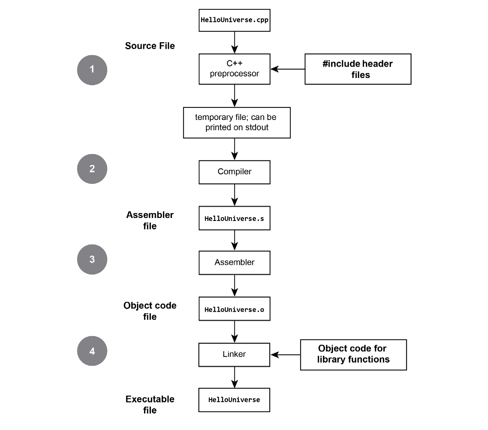
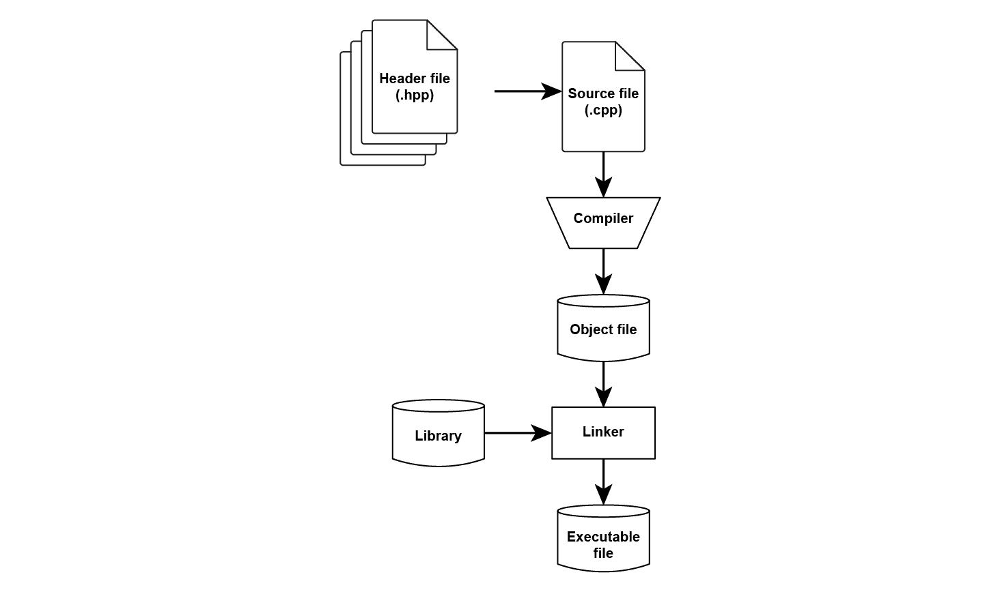
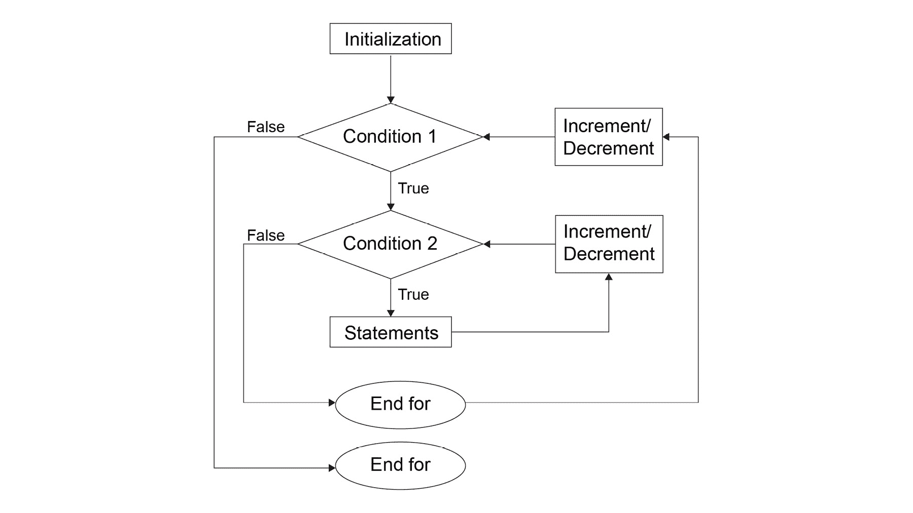

# *第一章*

# 入门

## 课程目标

到本章结束时，你将能够：

+   解释 C++编译模型

+   执行`main()`函数

+   说明变量的声明和定义

+   确定内置算术类型、引用和指针

+   解释变量的作用域

+   使用控制流语句

+   定义并使用数组

在本章中，你将学习如何使用变量和控制流语句来创建更健壮的程序。

## 简介

C++在软件开发行业中已经是一个主要角色超过 30 年，支持世界上一些最成功的公司。

近年来，对该语言的需求比以往任何时候都要增长，它是一个极其流行的选择，适用于大规模系统，许多大型公司都赞助其发展。

C++仍然是一种复杂的语言，它将大量权力交到开发者手中。然而，这也带来了很多犯错的机会。它是一种独特的语言，因为它能够使程序员编写高级抽象，同时保留对硬件、性能和可维护性的完全控制。

## C++编译模型

了解 C++编译工作原理是理解程序如何编译和执行的基础。将 C++源代码编译成机器可读代码包括以下四个过程：

1.  预处理源代码。

1.  编译源代码。

1.  汇编编译后的文件。

1.  将目标代码文件链接以创建可执行文件。

让我们从简单的 C++程序开始，了解编译是如何发生的。

创建一个名为`HelloUniverse.cpp`的文件，并将以下代码复制粘贴到桌面后保存：

```cpp
#include <iostream>
int main(){
	// This is a single line comment
	/* This is a multi-line 
        comment */
	std::cout << "Hello Universe" << std::endl;
	return 0;
} 
```

现在，使用终端上的`cd`命令导航到文件保存的位置，如果你使用的是 UNIX 系统，请执行以下命令：

```cpp
> g++ -o HelloUniverse HelloUniverse.cpp
> ./HelloUniverse
```

如果你使用的是 Windows 系统，必须使用不同的编译器。使用 Visual Studio 编译器编译代码的命令如下：

```cpp
> cl /EHsc HelloUniverse.cpp
> HelloUniverse.exe
```

此程序一旦执行，将在终端上打印`Hello Universe`。

让我们使用以下图表来揭示 C++编译过程：



###### 图 1.1：HelloUniverse 文件的 C++编译

1.  当 C++预处理器遇到`#include <file>`指令时，它将其替换为文件的内容，创建一个扩展的源代码文件。

1.  然后，这个扩展的源代码文件被编译成平台的汇编语言。

1.  编译器生成的文件被汇编器转换成目标代码文件。

1.  此目标代码文件与任何库函数的目标代码文件链接在一起，生成可执行文件。

### 标题文件和源文件的差异

源文件包含实际的实现代码。源文件通常具有`.cpp`扩展名，尽管其他扩展名如`.cc`、`.ccx`或`.c++`也很常见。

另一方面，头文件包含描述可用功能的代码。这些功能可以通过源文件中的可执行代码进行引用和使用，允许源文件知道在其他源文件中定义了哪些功能。头文件最常见的扩展名是`.hpp`、`.hxx`和`.h`。

要从头文件和源文件创建可执行文件，编译器首先预处理它们包含的指令（以`#`符号开头，通常位于文件顶部）。在先前的`HelloUniverse`程序中，指令将是`#include`。在真正的编译之前，编译器会对其进行预处理，并将其替换为`iostream`头文件的内容，该文件描述了从流中进行读取和写入的标准功能。

第二步是处理每个源文件，并生成包含与该源文件相关的机器代码的对象文件。最后，编译器将所有对象文件链接成一个单独的可执行程序。

我们看到，预处理器将指令的内容转换为源文件。头文件也可以包含其他头文件，这将进行展开，创建一个展开链。

例如，让我们假设`logger.hpp`头文件的内容如下：

```cpp
// implementation of logger
```

让我们也假设`calculator.hpp`头文件的内容如下：

```cpp
#include <logger.hpp>
// implementation of calculator
```

在`main.cpp`文件中，我们包含了两个指令，如下面的代码片段所示：

```cpp
#include <logger.hpp>
#include <calculator.hpp>
int main() {
  // use both the logger and the calculator
}
```

展开的结果将如下所示：

```cpp
// implementation of logger
// implementation of logger
// implementation of calculator
int main() {
  // use both the logger and the calculator
}
```

如我们所见，日志记录器在结果文件中添加了两次：

+   它是在第一次添加的，因为我们已经在`main.cpp`文件中包含了`logger.hpp`。

+   它是在第二次添加的，因为我们包含了`calculator.hpp`，然后它又包含了`logger.hpp`。

在我们编译的文件中未直接指定在`#include`指令中，而是由其他包含文件包含的包含文件，被称为**间接包含文件**。

通常，包含相同的头文件多次会创建一个多定义问题，正如我们将在*第 2 课*，*函数*和*第 03 课*，*类*中看到的那样。

由于我们之前解释的间接包含文件，多次包含相同的文件很可能，并且通常会引发编译错误。在 C++中，有一个约定可以防止由于多次包含头文件而产生的问题：**包含保护器**。

包含保护器是一种特定的指令模式，指示预处理器在之前已包含的情况下忽略头文件的内容。

它包括在以下结构内部编写所有头文件代码：

```cpp
#ifndef <unique_name>
#define <unique_name>
// all the header code should go here
#endif /* <unique_name> */
```

这里，`<unique_name>`是在整个 C++项目中唯一的名称；它通常由头文件名组成，例如`logger.hpp`头文件的`LOGGER_HPP`。

上述代码检查一个特殊的预处理变量 `<unique_name>` 是否存在。如果不存在，它将定义它并继续读取头文件的内容。如果存在，它将跳过直到 `#endif` 部分的所有代码。

由于特殊变量最初不存在，预处理程序第一次包含头文件时，它会创建该变量并继续读取文件。随后的时间，变量已经定义，因此预处理程序会跳转到 `#endif` 指令，跳过头文件的所有内容。

编译是一个确保程序在语法上正确的过程，但它不会对程序的逻辑正确性进行检查。这意味着编译正确的程序可能仍然会产生不期望的结果：



###### 图 1.2：可执行文件的编译和链接过程

每个 C++ 程序都需要定义一个起点，即执行应该从代码的哪个部分开始。惯例是在源代码中有一个唯一命名的 `main` 函数，它将是首先被执行的部分。这个函数由操作系统调用，因此它需要返回一个表示程序状态的值；因此，它也被称为 `退出状态码`。

让我们看看我们如何编译一个程序。

与 C 语言一样，C++ 是支持硬件和平台最多的语言。这意味着有许多由不同供应商生产的 C++ 编译器。每个编译器可以以不同的方式接受参数，因此在 C++ 开发时，了解你所使用的编译器的可用选项及其含义非常重要。

我们现在将看到如何使用两个最常用的编译器编译程序：Microsoft Visual Studio 编译器和 GCC。

### 将文件编译成目标文件

要将 `myfile.cpp` 文件编译成名为 `myfile.obj` 的目标文件，我们可以运行以下命令：


###### 图 1.3：编译 CPP 文件

在编译时，通常包括一些头文件。

我们可以不执行任何操作就包含 C++ 标准中定义的头文件，但如果我们想包含用户定义的头文件，我们需要告诉编译器在哪些文件夹中查找头文件。

对于 MSVC，你需要将参数作为 `/I path` 传递，其中 `path` 是要查找头文件的目录路径。

对于 GCC，你需要将参数作为 `-I path` 传递，其中 `path` 的含义与 MSVC 相同。

如果 `myfile.cpp` 在 `include` 目录中包含一个头文件，我们将使用以下命令编译该文件：


###### 图 1.4：使用包含目录编译 CPP 文件

我们可以将多个文件编译成它们各自的目标文件，然后将它们全部链接起来以创建最终的应用程序。

### 链接目标文件

要将两个名为 `main.obj` 和 `mylib.obj` 的目标文件链接成一个可执行文件，我们可以运行以下命令：


###### 图 1.5：编译两个目标文件

使用 MSVC，我们将创建一个名为 `main.exe` 的可执行文件，而使用 `g++`，可执行文件将被命名为 `main`。

为了方便，MSVC 和 GCC 提供了一种方法，可以将多个文件编译成一个可执行文件，而无需为每个文件创建一个目标文件，然后再将文件链接起来。

即使在这种情况下，如果文件包含任何用户定义的头文件，你也需要使用 `/I` 或 `-I` 标志指定头文件的位置。

要将 `main.cpp` 和 `mylib.cpp` 文件一起编译，这些文件使用 `include` 文件夹中的某些头文件，你可以使用以下命令：


###### 图 1.6：包含文件夹的文件编译

### 与 `main` 函数一起工作

在下一章中，我们将更深入地讨论函数；现在，我们可以以以下方式定义 `main` 函数，它什么都不做，除了返回一个成功状态码：

```cpp
int main() 
{
  return 0;
}
```

第一行包含函数的定义，由返回类型 `int`、`main` 函数的名称以及参数列表组成，在这个例子中是一个空列表。然后，我们有了函数的主体，由花括号界定。最后，主体由一条将返回成功状态码的单个指令组成。

#### 注意

与 C 语言不同，在 C++ 程序中，返回语句是可选的。如果你没有明确返回值，编译器会自动添加 `return 0`。

我们将在稍后更详细地讨论这些主题；重要的是要知道这是一个有效的 C++ 程序，它可以被编译和执行。

#### 注意

大多数 C 编译器可以通过确定文件扩展名来编译 C 或 C++ 语言。

### 练习 1：编译和执行 `main` 函数

在这个练习中，我们将创建一个名为 `main.cpp` 的源文件，其中包含代码。编译该文件并运行程序。我们将使用它来探索 C++ 环境：

1.  使用你喜欢的文本编辑器（如果你使用 Windows，可以是 Sublime Text、Visual Studio Code、Atom 或 Notepad++），创建一个新文件并将其命名为 `main.cpp`。

1.  在 `main.cpp` 文件中写下以下代码并保存：

    ```cpp
    int main()
    {
      return 0;
    }
    ```

1.  使用以下命令编译 `main.cpp` 文件：

    ```cpp
    //On UNIX:
    > g++ main.cpp
    //On Windows:
    > cl /EHsc main.cpp
    ```

1.  编译过程将生成一个可执行文件，在 Windows 系统上命名为 `main.exe`，在 UNIX 系统上命名为 `main.out`。

## 内置数据类型

在大多数编程语言中，数据存储在变量中，变量是程序员定义的内存部分的标签。每个变量都有一个关联的类型。类型定义了变量可以持有哪种类型的值。

C++ 的内置数据类型分为两类：

+   **原始数据类型**：可以直接由用户声明变量

+   **抽象或用户定义的数据类型**：由用户定义，例如，在 C++ 中定义一个类或结构

### 原始数据类型

原始数据类型包括以下类型：

+   `int` 类型存储一个从 `-2147483648` 到 `2147483647` 的整数。此数据类型通常占用 `4` 字节内存空间。

+   `char` 类型存储字符数据。它保证足够大，可以表示任何 UTF-8 单字节代码单元；对于 UTF-16 和 UTF-32，分别使用 `char16_t` 和 `char32_t`。`char` 通常占用 1 字节内存空间。

+   `bool` 数据类型能够存储两个值之一：`true` 或 `false`。

+   `float` 类型用于存储单精度浮点值。此数据类型通常占用 4 字节内存空间。

+   `double` 类型用于存储双精度浮点值。此数据类型通常占用 8 字节内存空间。

+   `void` 类型是一个无值的类型，用于不需要返回值的函数。

+   `wchar_t` 类型也用于表示字符集，但允许更大的尺寸。虽然 `char` 支持介于 8 到 32 位的字符，但宽字符是 2 到 4 字节长。

字符类型 `char` 和 `wchar_t` 包含与机器字符集中的字符相对应的数值。

### 数据类型修饰符

C++ 编程语言提供的数值类型分为三类：

+   带符号

+   无符号

+   浮点数

带符号和无符号的类型有不同的尺寸，这意味着每个都可以表示更小或更大的值范围。

整数类型可以是带符号的或无符号的，其中带符号的类型可以用来区分负数或正数，而无符号的只能表示大于或等于零的数。

`signed` 关键字是可选的；程序员只有在类型是无符号的情况下才需要指定它。因此，`signed int` 和 `int` 是相同的类型，但它们与 `unsigned int` 或简称 `unsigned` 不同。确实，如果没有指定，无符号类型始终默认为 `int`。

如前所述，整数可以有不同的尺寸：

+   `int`

+   `short int`

+   `long int`

+   `long long int`

`short int` 类型，或简称 `short`，根据标准保证至少为 16 位。这意味着它可以存储从 `-32768` 到 `32767` 范围内的值。如果它也是 `unsigned`，那么就是 `unsigned short int` 或简称 `unsigned int`，这个范围将是 `0` 到 `65535`。

#### 注意

类型在内存中的有效尺寸可以根据代码编译的平台而改变。C++ 存在于许多平台，从数据中心中的超级计算机到工业环境中的小型嵌入式芯片。为了能够支持所有这些不同类型的机器，标准只为内置类型设定了最小要求。

### 变量定义

变量是一个名为存储的命名空间，它指向内存中的一个位置，可以用来存储值。C++是一种强类型语言，它要求在第一次使用之前必须声明每个变量的类型。

变量的类型被编译器用来确定需要预留的内存以及解释其值的方式。

以下语法用于声明一个新变量：

```cpp
type variable_name;
```

C++中的变量名可以包含字母表中的字母，大小写均可，数字和下划线（_）。虽然允许使用数字，但不能作为变量名的第一个字符。可以通过列出变量名（用逗号分隔）在同一语句中声明相同类型的多个变量：

```cpp
type variable_name1, variable_name2, …;
```

这相当于以下：

```cpp
type variable_name1;
type variable_name2;
type ...;
```

在声明变量时，其值在执行赋值之前是不确定的。也可以声明一个具有给定值的变量；这种操作也称为**变量初始化**。

初始化变量的一个方法——也称为**C 样式初始化**——使用以下语法：

```cpp
type variable_name = value;
```

另一种解决方案是构造函数初始化，我们将在第 3 课，*类*中详细看到。构造函数初始化看起来是这样的：

```cpp
type variable_name (value);
```

一致初始化或列表初始化引入了花括号初始化，这允许对不同类型的变量和对象进行初始化：

```cpp
type variable_name {value};
```

### 揭秘变量初始化

当一个变量被初始化时，编译器可以确定存储提供的值所需的数据类型，这意味着不需要指定变量的类型。编译器确实能够推导出变量的类型，因此这个特性也被称为**类型推导**。因此，引入了**auto**关键字来替换初始化期间的类型名称。初始化语法变为如下：

```cpp
auto vvariable_name = value;
```

避免直接提供类型的一种方法是用`decltype`指定符。它用于推导给定实体的类型，并使用以下语法编写：

```cpp
type variable_name1;
decltype(variable_name1) variable_name2;
```

在这里，`variable_name2`是根据从`variable_name1`推导出的类型声明的。

#### 注意

使用`auto`和`decltype`关键字进行类型推导是由 C++11 标准引入的，以简化在无法获得类型时变量的声明。但与此同时，在不真正需要时它们的扩展使用可能会降低代码的可读性和健壮性。我们将在第 4 课，*泛型编程和模板*中更详细地看到这一点。

在以下代码中，我们将通过创建一个名为`main.cpp`的新源文件并逐行分析代码来检查变量的有效语句。

以下哪个是有效的语句？

```cpp
int foo;
auto foo2;
int bar = 10;
sum = 0;
float price = 5.3 , cost = 10.1;
auto val = 5.6;
auto val = 5.6f;
auto var = val;
int  a = 0, b = {1} , c(0);
```

## 指针和引用

在上一节中，变量被定义为可以通过其名称访问的内存部分。这样，程序员不需要记住保留的内存位置和大小，但可以方便地引用变量名。

在 C++ 中，获取变量实际内存地址的方法是在变量名前加上一个井号符号（`&`），这被称为**取地址运算符**。

使用取地址运算符概念的正确语法如下：

```cpp
&variable_name
```

在代码中使用这将返回变量的物理内存地址。

### 指针

能够在 C++ 中存储内存地址的数据结构被称为**指针**。指针始终指向特定类型的对象，因此我们在声明指针时需要指定所指向的对象的类型。

声明指针的语法如下：

```cpp
type * pointer_name;
```

当涉及到指针时，同一语句中也可以有多个声明，但重要的是要记住每个指针声明都需要一个星号（`*`）。以下是一个多个指针声明的示例：

```cpp
type * pointer_name1, * pointer_name2, *...;
```

当只指定第一个声明时，两个变量将具有不同的类型。例如，在以下声明中，只有前者是指针：

```cpp
type * pointer_name, pointer_name;
```

#### 注意

不论指向的变量类型如何，指针在内存中总是占据相同的大小。这源于指针所需的内存空间与变量存储的值无关，而是与平台相关的内存地址有关。

直观地说，指针赋值的语法与其他任何变量相同：

```cpp
pointer_name = &variable_name; 
```

之前的语法将 `variable_name` 变量的内存地址复制到名为 `pointer_name` 的指针中。

以下代码片段首先将 `pointer_name1` 初始化为 `variable_name` 的内存地址，然后将 `pointer_name2` 初始化为 `pointer_name1` 中存储的值，即 `variable_name` 的内存地址。因此，`pointer_name2` 最终将指向 `variable_name` 变量：

```cpp
type * pointer_name1 = &variable_name; 
type * pointer_name2 = pointer_name1; 
```

以下实现是无效的：

```cpp
type * pointer_name1 = &variable_name; 
type * pointer_name2 = &pointer_name1;
```

这次，`pointer_name2` 将被初始化为 `pointer_name1` 的内存地址，从而产生一个指向另一个指针的指针。将指针指向另一个指针的方法是使用以下代码：

```cpp
type ** pointer_name;
```

两个星号（`*`）表示所指向的类型现在是一个指针。一般来说，语法只需要在指针声明的每个间接级别前使用一个星号（`*`）。

要访问给定内存地址的实际内容，可以使用解引用运算符（`*`），后跟内存地址或指针：

```cpp
type variable_name1 = value;
type * pointer_name = &variable_name1;
type variable_name2 = *pointer_name; 
```

`variable_name2` 包含的值与 `variable_name1` 包含的值相同。赋值时也是如此：

```cpp
type variable_name1 = value1;
type * pointer_name = &variable_name1;
*pointer_name = value2;
```

### 引用

与指针不同，引用只是一个对象的别名，这本质上是一种给现有变量起另一个名字的方式。定义引用的方式如下：

```cpp
type variable_name = value;
type &reference_name = variable_name;
```

让我们检查以下示例：

```cpp
#include <iostream>
int main()
{
  int first_variable = 10;
  int &ref_name = first_variable;
  std::cout << "Value of first_variable: " << first_variable << std::endl;
  std::cout << "Value of ref_name: " << ref_name << std::endl;
}
//Output
Value of first_variable: 10
Value of ref_name: 10
```

我们可以将指针与以下三个主要区别进行识别：

+   一旦初始化，引用就会绑定到其初始对象。因此，不可能将引用重新赋值给另一个对象。对引用执行的所有操作实际上是对被引用的对象的操作。

+   由于没有重新绑定引用的可能性，因此必须对其进行初始化。

+   引用始终与存储在内存中的变量相关联，但该变量可能无效，在这种情况下，不应使用该引用。我们将在*第 6 课，面向对象编程*中看到更多关于这一点的内容。

可以定义多个对同一对象的引用。由于引用不是一个对象，因此不可能有对另一个引用的引用。

在以下代码中，假设`a`是一个整数，`b`是一个浮点数，`p`是一个指向整数的指针，验证哪些变量初始化是有效和无效的：

```cpp
int &c = a;
float &c = &b;
int &c;
int *c;
int *c = p;
int *c = &p;
int *c = a;
int *c = &b;
int *c = *p;
```

### 常量限定符

在 C++中，可以定义一个变量，其值一旦初始化后就不会被修改。通知编译器这种情况的方式是通过`const`关键字。声明和初始化`const`变量的语法如下：

```cpp
const type variable_name = value;
```

在 C++程序中强制不可变性的原因有几个，其中最重要的原因是正确性和性能。确保变量是常量将防止编译器编译出试图意外更改该变量的代码，从而防止可能的错误。

另一个原因是，通知编译器变量的不可变性允许优化代码及其背后的逻辑。

#### 注意

在创建对象后，如果其状态保持不变，那么这种特性被称为不可变性。

不可变性的一个例子如下：

```cpp
#include <iostream>
int main()
{
  const int imm = 10;
  std::cout << imm << std::endl;
  //Output: 10
  int imm_change = 11;
  std::cout << imm_change << std::endl;
  //Output: 11
  imm = imm_change;
  std::cout << imm << std::endl;
  //Error: We cannot change the value of imm
}
```

一个对象是不可变的，如果它的状态在对象创建后不发生变化。因此，如果一个类的实例是不可变的，那么这个类也是不可变的。我们将在*第 3 课，类*中了解更多关于类的内容。

现代 C++支持另一种不可变性的概念，这通过`constexpr`关键字来表示。特别是，当编译器需要在编译时评估常量时，它会被使用。此外，每个被声明为`constexpr`的变量都是隐式`const`的。

前一个主题介绍了指针和引用；结果发现，即使是它们也可以声明为`const`。以下内容相对直观易懂，其语法如下：

```cpp
const type variable_name;
const type &reference_name = variable_name;
```

这种语法展示了我们如何声明一个对具有`const`类型的对象的引用；这样的引用俗称为**const 引用**。

对`const`的引用不能用来改变它们所引用的对象。请注意，将`const`引用绑定到非`const`类型是可能的，这通常用来表达所引用的对象将被用作不可变对象：

```cpp
type variable_name;
const type &reference_name = variable_name;
```

然而，相反的情况是不允许的。如果一个对象是`const`，那么它只能通过`const`引用来引用：

```cpp
const type variable_name = value;
type &reference_name = variable_name; 
// Wrong
```

以下是一个例子：

```cpp
#include <iostream>
int main()
{
  const int const_v = 10;
  int &const_ref = const_v;
  //Error
  std::cout << const_v << std::endl;
  //Output: 10
}
```

就像引用一样，指针可以指向`const`对象，其语法也是类似且直观的：

```cpp
const type *pointer_name = &variable_name;
```

以下是一个例子：

```cpp
#include <iostream>
int main()
{
  int v = 10;
  const int *const_v_pointer  = &v;
  std::cout << v << std::endl;
  //Output: 10
  std::cout << const_v_pointer << std::endl;
  //Output: Memory location of v
}
```

`const`对象的地址只能存储在指向`const`的指针中，但反之则不然。我们可以有一个指向`const`的指针指向一个非`const`对象，在这种情况下，就像对`const`的引用一样，我们无法保证对象本身不会改变，但只能保证指针不能用来修改它。

对于指针，由于它们也是对象，我们还有一个额外的案例，即`const`指针。虽然对于引用来说，`const`引用只是指向`const`的引用的简写，但对于指针来说并非如此，它有完全不同的含义。

事实上，一个`const`指针本身就是一个常量指针。在这里，指针本身并不指示指向的对象；它可能是`const`或非`const`，但我们不能改变的是一旦初始化后指针所指向的地址。其语法如下：

```cpp
type *const pointer_name = &variable_name;
```

如您所见，`const`关键字放在`*`符号之后。记住这个规则的最简单方法是从右向左阅读，所以`pointer-name > const > * > type`可以读作如下：`pointer-name`是一个指向类型为`type`的`const`指针。以下是一个例子：

```cpp
#include <iostream>
int main()
{
  int v = 10;
  int *const v_const_pointer = &v;
  std::cout << v << std::endl;
  //Output: 10
  std::cout << v_const_pointer << std::endl;
  //Output: Memory location of v
}
```

#### 注意

指向`const`和`const`到指针是独立的，可以在同一个语句中表达：

`const type *const pointer_name = &variable_name;`

前面的行表示指向的对象和指针都是`const`。

### 变量的作用域

正如我们已经看到的，变量名指的是程序中一个特定实体的引用。程序中这个名称具有特定意义的活跃区域也称为名称的`作用域`。C++中的作用域由花括号限定，这个区域也称为**块**。在块外部声明的实体具有**全局作用域**，在代码的任何地方都是有效的：


###### 图 1.7：变量的作用域

同一个名称可以在两个作用域中声明，并引用不同的实体。此外，一旦声明，名称就可见，直到其声明的作用域块的末尾。

让我们通过以下示例来理解全局变量和局部变量的作用域：

```cpp
#include <iostream>
int global_var = 100;
//Global variable initialized
int print(){
  std::cout << global_var << std::endl;
  //Output: 100
  std::cout << local_var << std::endl;
  //Output: Error: Out of scope
}
int main()
{
  int local_var = 10;
  std::cout << local_var << std::endl;
  //Output: 10
  std::cout << global_var << std::endl;
  //Output: 100
  print();
  //Output:100
  //Output: Error: Out of scope
}
```

范围可以嵌套，我们分别称包含范围和被包含范围为外部范围和内部范围。外部范围内声明的名称可以在内部使用。在内部范围重新声明最初在外部范围中声明的名称是可能的。结果将是新变量将隐藏在内部范围中声明的变量。

让我们看看以下代码：

```cpp
#include <iostream>
int global_var = 1000;
int main()
{
  int global_var = 100;
  std::cout << "Global: "<< ::global_var << std::endl;
  std::cout << "Local: " << global_var << std::endl;
}
Output:
Global: 1000
Local: 100
```

在下一章中，我们将探讨如何使用函数中的局部和全局变量。

在以下代码中，我们将找到所有变量的值，而无需执行程序。

以下程序展示了变量初始化的工作原理：

```cpp
#include <iostream>
int main()
{
  int a = 10;
  {
    int b = a;
  }
  const int c = 11;
  int d = c;
  c = a;
}
```

## 控制流语句

在程序中，仅通过执行一系列线性操作来提供有用的功能是很少见的。通常，程序必须能够对不同的情况做出不同的反应，或者在不同的上下文中多次执行相同的操作。

现在我们将看到 C++ 为程序员提供的控制流语句，以控制要执行的运算顺序。

### 选择语句 – if-else

C++ 提供了条件执行支持，其中 `if` 关键字指示是否根据提供的条件执行后续语句或块：

```cpp
if (condition) statement
```

如果名为 `condition` 的表达式评估为 `true`，则执行该语句；否则，它将被忽略，程序将继续执行后续代码。

条件执行代码可以是一个单独的语句，也可以是一个包含多个语句的整个块。这些语句需要用大括号 (`{}`) 括起来形成一个块：

```cpp
if (condition) {
  statement_1;
  statement_2;
  statement_N;
}
```

#### 注意

常常会忘记大括号，并以以下方式编写控制语句：

`if (condition)`

`statement1`

`statement2`

在这种情况下，编译器不会警告你，它将根据条件执行 `statement1`，但总是执行 `statement2`。为了避免这种情况，始终添加大括号可能是一个好习惯。

当条件评估为 `false` 时，可以指定要执行的操作。这是通过 `else` 关键字完成的，它后面跟着一个语句或一个块。

以下语法用于指示如果 `case` 条件评估为 `true`，则执行 `statement1`，否则执行 `statement2`：

```cpp
if (condition) statement1 else statement2
```

最后，我们可以将多个 if-else 语句连接起来，以产生更复杂的分支逻辑。让我们看看以下示例：

```cpp
if (condition1) {
  statement1 
} else if (condition2) {
  statement2 
} else {
  statement3
}
```

使用这种通用结构，可以检查无限数量的条件，并只执行相应的语句或 `else` 分支中包含的最终语句。

重要的是要意识到，一旦满足其中一个条件，后续的所有条件都将被丢弃，例如：

```cpp
if (x > 0) { 
  // When x is greater than 0, statement1 is executed.
  // If that is not the case, the control jumps to the else block. 
  statement1 
} else if (x > 100) {
  statement2 
}
```

之前的代码将始终为任何正数 `x` 执行 `statement1`，无论它是否大于 100。

另一种方法是按顺序使用多个 `if` 关键字，如下所示：

```cpp
if (condition1) 
  // If condition1 is true, statement1 is executed
  statement1 
if (condition2) 
  // if condition2 is true then statement2 is executed
  statement2
  /* independently whether condition1 and condition2 is true or not, the   statement3 will be executed */
statement3
```

让我们通过以下示例来消除之前逻辑的神秘感：

```cpp
#include <iostream>
int main()
{
  int x = 10;
  if  (x > 0){
    std::cout << x << std::endl;
  }
  if (x > 11 ){
    std::cout << x << std::endl;
  }
  else{
    std::cout << x-1 << std::endl;
  }
}
Output:
10
9
```

这样，所有条件都是独立评估的，并且可能执行多个语句。

#### 注意

由于`else`语句没有定义条件，在评估`if`语句之后，控制流会转到`else`块以执行语句。

### 选择语句 – switch

另一个选择语句，与`if-else`连接构造类似，是`switch`语句。它限于常量表达式，主要用于检查多个可能的表达式中的一个值：

```cpp
switch (expression)
{
  case constant1:
    group-of-statements-1;
  break;
  case constant2:
    group-of-statements-2;
  break;
...
  default:
    default-group-of-statements;
  break;
}
```

在`switch`关键字后面的括号中出现的`expression`将与多个情况进行比较，寻找表达式与常量之间的第一个相等性。如果没有情况匹配，将执行默认情况（如果存在，因为它是可选的）。

重要的是要记住，评估顺序是顺序的，并且一旦某个常量匹配，就会执行相应的语句组。`break`关键字阻止它们进一步执行。如果不包含`break`关键字，则也会执行随后的所有语句，包括在不同标签下的语句。

我们将在*跳转语句 – break 和 continue*部分更深入地探讨`break`关键字。

### 迭代语句 – for 循环

`for`循环是一个用于重复执行语句一定次数的构造。`for`循环的语法如下：

```cpp
for (initialization; condition; increase){
  statement1;
  statement2;
...
  statementN;
}
```

`for`循环由两部分组成：初始化、条件和增加语句。主体可以是一个单独的语句或多个语句的块。

初始化语句通常（但不一定）用于声明一个新的变量，通常是一个计数器，并将其初始化为某个特定值。初始化语句仅在循环开始时执行一次。

其次，检查条件语句。这与`if`语句中检查的条件类似。如果条件为`true`，则执行循环体，否则程序将继续执行`for`循环体之后的指令。

在执行主体之后，执行增加语句。这通常改变初始化语句的计数器。然后再次检查条件，如果为`true`，则重复步骤。当条件评估为`false`时，循环结束。

`for`循环的头部字段是可选的，可以留空，但分号不能省略。当省略条件时，它始终评估为`true`。例如，以下对应于一个无限循环，其中语句无条件执行：

```cpp
for ( ; ; ) statement;
```

`for`循环的另一种变体称为基于范围的`for`循环，其语法如下：

```cpp
for ( declaration : range ) statement;
```

范围是一系列元素，如数组，这些将在下一节中解释。这个基于范围的 `for` 循环用于遍历这些序列的所有元素。`for` 声明，名称是循环每次迭代声明的临时变量。这用于存储当前元素。声明需要与范围中包含的元素类型相同。

#### 注意

基于范围的 `for` 循环是 `type` 推断和为声明使用 `auto` 关键字使代码更易读并帮助程序员找到正确类型的良好示例。

放在循环内部的循环称为 **嵌套循环**。让我们通过以下图表来了解什么是嵌套 for 循环：



###### 图 1.8：嵌套 for 循环

使用以下示例，让我们探索嵌套 for 循环的工作原理，并在控制台上打印一个倒置的半三角形：

```cpp
#include <iostream>
int main()
{
  for (int x = 0; x < 5; x++){
    for (int y = 5; y > x; y--){
      std::cout << "*";            
    }
    std::cout <<"\n" ;
  }
}
Output:
*****
****
***
**
*
```

### 迭代语句 – while 循环

另一个迭代语句是 `while` 循环。它比 `for` 循环简单。它的语法如下：

```cpp
while (condition) statement;
```

它会重复执行语句，直到满足条件。当条件不再为 `true` 时，循环结束，程序在循环之后继续执行：

#### 注意

一个 `while` 循环可以用 `for` 循环表示。

这里是一个示例：`for ( ; condition ; ) statement;`

### 迭代语句 – do-while 循环

类似的循环是 `do-while` 循环，其中条件是在执行语句之后而不是之前进行检查的。它使用以下语法：

```cpp
do statement while (condition);
```

即使条件永远不会评估为 `true`，它也保证了至少执行一次语句。

### 跳转语句 – break 和 continue

`break` 关键字用于独立结束循环，无论它是否满足条件。在以下程序中，当 `condition2` 变为 `true` 时，`break` 语句将立即终止 `while` 循环：

```cpp
while (condition1){
    statement1;
    if (condition2)
        break;
}
```

或者，可以使用 `continue` 语句来跳过当前迭代中循环体剩余的部分。在下面的示例中，当 `condition2` 评估为 `true` 时，调用 `continue`，导致程序到达循环的末尾，跳过 `statement2` 并继续下一个迭代：

```cpp
while (condition1){
    statement1;
    if (condition2)
        continue;
    statement2;
}
```

#### 注意

`break` 和 `continue` 语句都可以用在 `for` 和 `while` 循环中。

## try-catch 块

在程序执行过程中，可能会发生异常。我们将这些运行时问题称为 **异常**，它们代表了程序正常功能之外出现的异常情况对响应。设计能够抵御错误的代码是程序员必须应对的最困难的事情之一。

异常通常在程序遇到无法处理的情况时使用 `throw` 关键字抛出。这也被称为 **抛出异常**。

`try` 关键字后面跟着一个包含可能抛出一个或多个异常的语句的块。这些异常可以通过一个或多个 `catch` 子句捕获，这些子句按顺序列在 `try` 块之后。此语法的语法如下：

```cpp
try {
  statement1;
} catch (exception-declaration1) { 
  statement2; 
} catch (exception-declaration2) { 
  statement3; 
}
...
```

`catch` 块由 `catch` 关键字、异常声明和块组成。根据 `try` 块内部抛出的异常，选择一个 `catch` 子句并执行相应的块。一旦 `catch` 块终止，程序将继续执行最后一个 `catch` 子句之后的语句。

让我们通过以下示例来了解如何使用 try-catch 条件语句处理异常：

```cpp
#include <iostream> 
int main() 
{ 
  int x = 10; 
  try { 
    std::cout << "Inside try block" << std::endl;
    if (x > 0) // True
    { 
      throw x;// Following statement will be skipped
      std::cout << "After throw keyword" << std::endl;
    }
  } 
  catch (int x ) { 
    std::cout << "Inside catch block: Exception found" << std::endl;
  } 
  std::cout << "Outside try-catch block" << std::endl; 
}
Output:
Inside try block
Inside catch block: Exception found
Outside try-catch block
```

### 练习 2：计算特定数字在给定列表中出现的次数

在这个练习中，我们将讨论使用 `if` 语句和 `for` 循环来计数我们的魔法数字。在这里，我们将尝试找到所有能被 3 整除的数字，范围从 1 到 30。

#### 提示

要找出一个数字是否能被另一个数字整除，请使用取模 (%) 运算符。

现在，让我们执行以下步骤：

1.  导入所有必需的头文件：

    ```cpp
    #include <iostream>
    ```

1.  我们需要将一个数字被 3 整除的次数存储在一个计数器中。因此，我们定义并初始化 `count` 变量为 `0`：

    ```cpp
    unsigned count = 0;
    ```

1.  现在，我们将使用一个生成 1 到 30 的值的 `for` 循环，以便我们可以检查它们是否能被 3 整除：

    ```cpp
    for(unsigned x = 1; x <= 30; x++){
    }
    ```

1.  最后，我们将在 `for` 循环体中使用 `if` 语句和表达式 `x%3 == 0` 来检查，如果除法余数为 `0`，则该表达式评估为 `true`：

    ```cpp
    if (x%3 == 0) {
      count++;
    }
    ```

1.  如果前面的条件返回 `true`，则 `X` 变量能被 `3` 整除，我们可以增加计数器。

1.  最后，我们可以打印 `count`：

    ```cpp
    std::cout << count << std::endl;
    ```

**附加练习**：

+   找出 1 到 100 范围内有多少个数字能被 11 整除

+   打印 1 到 30 范围内所有不能被 3 整除的数字

### 活动 1：使用 while 循环在 1 到 100 范围内找到 7 的因子

在以下活动中，我们将使用 `while` 循环并实现之前练习中的概念，以打印 1 到 100 范围内能被 7 整除的数字。

现在，让我们以以下方式使用 `while` 循环重写之前的代码：

1.  创建一个 `unsigned` 类型的变量。

1.  现在，使用 `while` 循环编写打印能被 `7` 整除的数字的逻辑。

1.  然后，在每次迭代后，我们必须增加 `i` 的值。使用以下代码：

    ```cpp
    i++;
    ```

    本活动的解决方案可以在第 282 页找到。

## 数组

**数组**是一种数据结构，它包含一系列相同类型的元素，这些元素被放置在连续的内存位置中，可以通过它们的位置单独访问。

数组具有固定的大小，不能扩展；这有助于它们的运行时性能，但以有限的灵活性为代价。

### 数组声明

如同任何其他变量一样，数组在使用之前需要声明。数组声明具有以下形式：

```cpp
type name [elements];
```

在这里，`type`是包含元素的类型，`name`是`array`变量的标识符，而`elements`是数组的长度，因此它表示包含的元素数量。

术语`elements`需要是一个在编译时已知的常量表达式，因为那时会评估数组大小以确定分配的静态内存块的维度。

当声明一个数组时，其内容是不确定的，这意味着元素没有被设置为任何特定的值。这对于程序员来说常常令人困惑，因为你可能会期望元素被初始化为数组类型的默认值。

### 数组初始化

可以在声明时特别初始化数组元素，将这些初始值括在花括号中：

```cpp
int foo [5] = { 1, 2, 11, 15, 1989 };
```

当我们初始化列表数组时，我们也可以省略其长度，因为它将由提供的值的数量确定。以下声明与上一个声明等效：

```cpp
int foo [] = { 1, 2, 11, 15, 1989 };
```

如果提供了元素数量，但数组只初始化了较少的元素，那么剩余的值将被*零初始化*，例如：

```cpp
int foo [5] = { 1, 2, 11 };
```

之前的代码等效于以下代码：

```cpp
int foo [5] = { 1, 2, 11, 0, 0 };
```

### 访问数组的值

可以像访问同一类型的任何其他值一样访问数组的值。以下访问数组的语法：

```cpp
name[index]
```

可以访问数组元素以存储新元素或读取其值。

例如，以下语句更新了之前声明的名为`foo`的数组中位置 4 的值：

```cpp
foo [4] = 15
```

以下用于将位置 2 的元素内容复制到一个新变量中：

```cpp
int x = foo [2]
```

重要的是要注意，位置`4`和`2`的元素分别指的是第五个和第三个元素。这是因为索引是从`0`开始的。以下图表说明了数组中索引条目的工作方式：


###### 图 1.9：初始化一维数组

超出数组索引的有效范围在语法上是正确的，因此编译器不会产生任何错误。在 C++中访问数组越界被视为未定义行为，这意味着代码的行为不是由语言规范规定的。这可能导致运行时错误，例如由于访问未分配的内存位置而导致的错误，或者由于尝试访问程序不拥有的内存而导致程序终止（段错误）。 

### 多维数组

多维数组通常描述为*数组中的数组*，其中数组的元素是其他数组。

以下语法说明了二维数组：

```cpp
type name [n][m];
int bi_array [3][4]
```

在这里，`n`是数组的维度，`m`是其元素的维度。

通常，在像之前的二维数组这样的数组中，第一个维度被称为`行`，第二个维度被称为`列`。

多维数组不仅限于二维；它们可以有需要的任意多个维度，但请注意，随着每个维度的增加，使用的内存呈指数增长。类似于一维数组，多维数组可以通过指定每个行的初始化器列表来初始化。让我们检查以下代码：

```cpp
#include <iostream>
int main()
{
  int foo [3][5] = {{ 1, 2, 11, 15, 1989 }, { 0, 7, 1, 5, 19 }, { 9, 6, 131, 1, 2 }};
  for (int x = 0; x < 3; x++) 
  { 
    for (int y = 0; y < 5; y++) 
    {
      std::cout <<"Array element at [" << x << "]" << "[" << y << "]: "<< foo[x][y] << std::endl;
    }
  }
}
Output:
Array element at [0][0]: 1
Array element at [0][1]: 2
Array element at [0][2]: 11
Array element at [0][3]: 15
Array element at [0][4]: 1989
Array element at [1][0]: 0
Array element at [1][1]: 7
Array element at [1][2]: 1
Array element at [1][3]: 5
Array element at [1][4]: 19
Array element at [2][0]: 9
Array element at [2][1]: 6
Array element at [2][2]: 131
Array element at [2][3]: 1
Array element at [2][4]: 2
```

或者，由于编译器可以从定义中推断内部数组的长度，嵌套的大括号是可选的，仅提供以提高可读性：

```cpp
int foo [3][5] = {1, 2, 11, 15, 1989, 0, 7, 1, 5, 19, 9, 6, 131, 1, 2};
```

### 活动二：定义一个二维数组并初始化其元素

在本节中，我们将定义一个整数类型的二维数组（`3x3`）并编写一个程序来为每个元素分配其对应数组索引条目的加和：

1.  定义一个大小为`3x3`的整数数组。

1.  使用嵌套的`for`循环遍历数组的每个元素，并将乘积值`x`和`y`分配给索引。

    #### 注意：

    该活动的解决方案可以在第 282 页找到。

## 摘要

在本章中，我们了解了该语言的基本结构和语法。我们从编译模型的概述开始，该模型是将 C++源代码转换为可执行程序的过程。我们编写、编译并运行了我们的第一个程序，一个简单的`main`函数，该函数成功返回了退出/返回代码。

我们描述了该语言提供的内置算术类型。

我们学习了如何声明和定义变量名，以及引用和指针之间的区别。我们还看到了`const`限定符的使用及其优势。

此外，我们还讨论了控制流语句以及如何利用它们执行更复杂的行为。

最后，我们介绍了数组和多维数组，以及初始化它们和访问其值所需的操作。在下一章中，我们将学习 C++中的函数是什么，以及为什么我们应该在我们的代码中使用它们。
