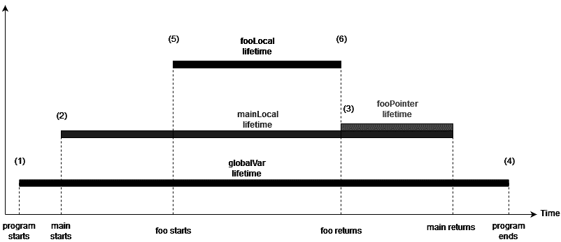

# *第二章*

# 函数

## 课程目标

到本章结束时，你将能够：

+   解释函数是什么以及如何声明它们

+   利用局部和全局变量

+   向函数传递参数并从函数返回值

+   创建重载函数并适当地调用它们

+   应用命名空间的概念来组织函数

在本章中，我们将探讨 C++中的函数，如何使用它们，以及为什么我们想要使用它们。

## 简介

函数是程序员工具箱中编写可维护代码的核心工具。函数的概念在几乎每一种编程语言中都很常见。在不同的语言中，函数有不同的名称：过程、例程等等，但它们都有两个共同的主要特征：

+   它们代表了一系列组合在一起的指令。

+   指令序列通过一个名称来标识，该名称可以用来引用函数。

当函数提供的功能需要时，程序员可以调用或调用该函数。

当函数被调用时，执行指令序列。调用者还可以向函数提供一些数据，以便在程序中的操作中使用。以下是使用函数的主要优点：

+   **减少重复**：通常情况下，程序需要在代码库的不同部分重复相同的操作。函数允许我们编写一个经过仔细测试、文档化且高质量的单一实现。此代码可以从代码库的不同位置调用，这实现了代码的可重用性。这反过来又提高了程序员的效率和软件的质量。

+   **提升代码可读性和可修改性**：通常，我们需要执行多个操作来实现程序中的功能。在这些情况下，将操作组合在一起放入函数中，并为函数赋予描述性的名称，有助于表达我们想要做什么，而不是我们是如何做的。

    使用函数极大地提高了我们代码的可读性，因为现在它由我们试图实现的目标的描述性名称组成，而没有达到结果的噪声。

    实际上，测试和调试更容易，因为你可能只需要修改一个函数，而不必重新审视程序的结构。

+   **更高的抽象级别**：我们可以给函数一个有意义的名称来表示它应该实现什么。这样，调用代码可以关注函数应该做什么，而不需要知道操作是如何执行的。

    #### 注意

    抽象是从类中提取所有相关属性并暴露它们的过程，同时隐藏对特定用途不重要的细节。

    让我们以一棵树为例。如果我们将其应用于果园的情境，我们可以将树抽象为一个“机器”，它占用一定量的空间，并在阳光、水和肥料的条件下，每年产生一定数量的果实。我们感兴趣的是树的生产能力，因此我们希望将其暴露出来，并隐藏所有与我们的案例无关的其他细节。

    在计算机科学中，我们希望应用相同的概念：捕获类的关键基本属性，而不显示实现它的算法。

这的一个典型例子是`sort`函数，它在许多语言中都存在。我们知道函数期望什么以及它将要做什么，但我们很少意识到用于执行它的算法，而且它可能在语言的不同的实现之间发生变化。

在接下来的章节中，我们将揭示函数声明和定义是如何工作的。

## 函数声明和定义

函数声明的作用是告诉编译器函数的名称、参数和返回类型。一旦函数被声明，它就可以在程序的其余部分中使用。

函数的定义指定了函数执行的操作。

声明由返回值的类型组成，后跟函数名，然后是一对括号内的参数列表。后两个组件构成了函数的签名。函数声明的语法如下：

```cpp
// Declaration: function without body
return_type function_name( parameter list );
```

如果函数不返回任何内容，则可以使用`void`类型，如果函数不期望任何参数，则列表可以为空。

让我们来看一个函数声明的例子：

```cpp
void doNothingForNow();
```

在这里，我们声明了一个名为`doNothingForNow()`的函数，它不接受任何参数也不返回任何内容。在此声明之后，我们可以在程序中调用`doNothingForNow()`函数。

要调用没有参数的函数，只需写出函数名后跟一对括号。

当函数被调用时，执行流程会从当前正在执行的函数体转移到被调用函数的体。

在以下示例中，执行流程从`main`函数体的开始处开始，并按顺序执行其操作。它遇到的第一个操作是调用`doNothingForNow()`。在那个时刻，执行流程进入`doNothingForNow()`的体。

当函数内的所有操作都执行完毕，或者函数指示它们返回调用者时，执行流程从函数调用之后的操作恢复。

在我们的例子中，函数调用之后的操作会在控制台上打印`Done`：

```cpp
#include <iostream>

void doNothingForNow();
int main() {
  doNothingForNow ();
  std::cout << "Done";
}
```

如果我们编译这个程序，编译将成功，但链接会*失败*。

在这个程序中，我们指示编译器存在一个名为`doNothingForNow()`的函数，然后我们调用了它。编译器生成一个调用`doNothingForNow()`的输出。

链接器随后尝试从编译器输出创建一个可执行文件，但由于我们没有定义`doNothingForNow()`，它找不到函数的定义，因此失败。

要成功编译程序，我们需要定义`doNothingForNow()`。在下一节中，我们将通过相同的示例来探索如何定义一个函数。

### 定义一个函数

要定义一个函数，我们需要编写与声明相同的信息：返回类型、函数名和参数列表，然后是函数体。函数体定义了一个新的作用域，由花括号分隔的一系列语句组成。

当函数执行时，语句按顺序执行：

```cpp
// Definition: function with body
return_type function_name( parameter_list ) {
  statement1;
  statement2;
...
  last statement;
}
```

让我们通过添加`doNothingForNow()`的函数体来修复程序：

```cpp
void doNothingForNow() {
  // Do nothing
}
```

在这里，我们使用空体定义了`doNothingForNow()`。这意味着一旦函数执行开始，控制流就会返回到调用它的函数。

#### 注意

当我们定义一个函数时，我们需要确保签名（返回值、名称和参数）与声明相同。

定义也计为声明。如果我们定义函数在调用它之前，我们可以省略声明。

现在我们回顾一下我们的程序，因为我们已经为我们的函数添加了定义：

```cpp
#include <iostream>
void doNothingForNow() {
  // do nothing
}
int main() {
  doNothingForNow();
  std::cout << "Done";
}
```

如果我们编译并运行程序，它将成功并在输出控制台显示`Done`。

在程序中，可以有多个相同函数的声明，只要声明相同。另一方面，根据**单一定义规则**（**ODR**），只能存在一个函数的定义。

#### 注意

如果在不同的文件中编译，相同的函数可能有多个定义，但它们必须相同。如果不相同，则程序可能会执行不可预测的操作。

编译器不会警告你！

解决方案是将声明放在**头文件**中，将定义放在**实现文件**中。

一个头文件被包含在许多不同的实现文件中，这些文件中的代码可以调用该函数。

实现文件只编译一次，因此我们可以保证编译器只能看到一次定义。

然后，链接器将编译器的所有输出合并在一起，找到一个函数的定义，并生成一个有效的可执行文件。

### 练习 3：从 main()中调用函数

在我们的应用程序中，我们想要记录错误。为此，我们必须指定一个名为`log()`的函数，当被调用时，它会将`Error!`打印到标准输出。

让我们创建一个可以从多个文件调用的函数，并将其放在一个不同的头文件中，该文件可以包含：

1.  创建一个名为`log.h`的文件，并声明一个没有参数且不返回任何内容的`log()`函数：

    ```cpp
    void log();
    ```

1.  现在，让我们创建一个新的文件，`log.cpp`，在其中定义`log()`函数以打印到标准输出：

    ```cpp
    #include <iostream> 
    // This is where std::cout and std::endl are defined
    void log() {
      std::cout << "Error!" << std::endl;
    }
    ```

1.  将`main.cpp`文件修改为包含`log.h`并在`main()`函数中调用`log()`：

    ```cpp
    #include <log.h>
    int main() {
      log();
    }
    ```

1.  编译这两个文件并运行可执行文件。你会看到当我们执行它时，会打印出**错误！**信息。

## 局部和全局变量

函数体是一个可以包含有效语句的代码块，其中之一是**变量定义**。正如我们在第 1 课“入门”中学到的，当这样的语句出现时，函数声明了一个**局部变量**。

这与全局变量形成对比，全局变量是在函数（以及我们将在第 3 课“类”中探讨的类）外部声明的变量。

局部变量和全局变量之间的区别在于其声明的**作用域**，因此，在谁可以访问它。

#### 注意

局部变量在函数作用域内，并且只能被函数访问。相反，全局变量可以被任何可以看到它们的函数访问。

使用局部变量而不是全局变量是可取的，因为它们使**封装**成为可能：只有函数体内的代码可以访问和修改变量，使变量对程序的其他部分不可见。这使得理解函数如何使用变量变得容易，因为其使用仅限于函数体，我们保证没有其他代码正在访问它。

封装通常有三个单独的原因，我们将在第 3 课“类”中更详细地探讨：

+   为了限制对功能使用的数据的访问

+   为了将数据及其操作它的功能捆绑在一起

+   封装是一个关键概念，它允许你创建抽象

另一方面，全局变量可以被**任何**函数访问。

这使得在与它们交互时很难确定函数的值，除非我们不仅知道我们的函数做什么，而且知道所有与全局变量交互的程序中的其他代码做什么。

此外，我们后来添加到程序中的代码可能会以我们没有预料到的方式修改全局变量，即使没有修改函数本身，也可能破坏函数的功能。这使得修改、维护和演进程序变得极其困难。

解决这个问题的方法是使用`const`限定符，这样就没有代码可以更改变量，我们可以将其视为一个永远不会改变的值。

#### 注意

在可能的情况下，始终使用`const`限定符与全局变量一起使用。

尽量避免使用可变全局变量。

使用全局`const`变量而不是直接在代码中使用值是一种良好的实践。它们允许你给值赋予一个名称和意义，而不承担可变全局变量带来的任何风险。

### 与变量对象一起工作

在 C++中，理解变量、对象及其生命周期之间的关系对于正确编写程序至关重要。

#### 注意

对象是程序内存中的一块数据。

变量是我们赋予对象的名称。

在 C++中，变量作用域和它所引用对象的生存期之间有一个区别。变量作用域是程序中变量可以使用的部分。

相反，对象的生存期是在执行期间对象可以访问的时间。

让我们通过以下程序来了解对象的生存期：

```cpp
#include <iostream>
/* 1 */ const int globalVar = 10;
int* foo(const int* other) {
    /* 5 */ int fooLocal = 0;
     std::cout << "foo's local: " << fooLocal << std::endl;
    std::cout << "main's local: " << *other << std::endl;
    /* 6 */ return &fooLocal;
}
int main()
{
    /* 2 */ int mainLocal = 15;
    /* 3 */ int* fooPointer = foo(&mainLocal);
    std::cout << "main's local: " << mainLocal << std::endl;
    std::cout << "We should not access the content of fooPointer! It's not valid." << std::endl;
    /* 4 */ return 0;
}
```



###### 图 2.1：对象的生存期

变量的生存期从初始化开始，到包含它的块结束时结束。即使我们有变量或引用的指针，我们也应该只在它仍然有效时访问它。`fooPointer`指向一个不再有效的变量，因此不应该使用它！

当我们在函数的作用域内声明一个局部变量时，编译器会在函数执行到达变量声明时自动创建一个对象；变量引用那个对象。

当我们声明一个全局变量时，我们实际上是在一个没有明确持续时间的范围内声明它——它在整个程序运行期间都是有效的。正因为如此，编译器在执行任何函数之前（甚至包括`main()`函数）在程序开始时创建对象。

当执行退出变量声明的范围，或者全局变量在程序终止的情况下，编译器也会负责终止对象的生存期。对象的生存期终止通常被称为**销毁**。

在作用域块中声明的变量，无论是局部还是全局，都称为**自动变量**，因为编译器负责初始化和终止与变量相关联的对象的生存期。

让我们看看一个局部变量的例子：

```cpp
void foo() {
  int a;
}
```

在这种情况下，变量`a`是一个`int`类型的局部变量。当执行到达该语句时，编译器会自动使用所谓的**默认初始化**来初始化它所引用的对象，并且对象将在函数结束时被销毁，同样也是自动的。

#### 注意

对于基本类型，如整数，默认初始化对我们来说不做任何事情。这意味着变量`a`将具有一个未指定的值。

如果定义了多个局部变量，对象的初始化顺序是按照声明的顺序进行的：

```cpp
void foo() {
  int a;
  int b;
}
```

变量`a`在`b`之前初始化。由于变量`b`是在`a`之后初始化的，所以它的对象在`a`所引用的对象之前被销毁。

如果执行从未到达声明处，变量将不会被初始化。如果变量没有被初始化，它也不会被销毁：

```cpp
void foo() {
  if (false) {
    int a;
  }
  int b;
}
```

在这里，变量 `a` 永远没有被默认初始化，因此永远不会销毁。这同样适用于全局变量：

```cpp
const int a = 1;
void main() {
  std::cout << "a=" << a << std::endl;
}
```

变量 `a` 在调用 `main()` 函数之前初始化，并在我们从 `main()` 函数返回值之后销毁。

### 练习 4：在斐波那契数列中使用局部和全局变量

我们想要编写一个函数，该函数返回斐波那契数列中的第 10 个数。

#### 注意

第 *n* 个斐波那契数定义为第 *n-1* 个和第 *n-2* 个的和，序列中的第一个数是 0，第二个数是 1。

示例：

第 10 个斐波那契数 = 第 8 个斐波那契数 + 第 9 个斐波那契数

我们希望使用最佳实践为值命名并赋予其意义，因此我们不会在代码中使用 10，而是将定义一个名为 `POSITION` 的全局 `const` 变量。

我们还将在函数中使用两个局部变量来记住 `n-1th` 和 `n-2th` 的数字：

1.  编写程序并在头文件之后包含以下全局常量变量：

    ```cpp
    #include <iostream>
    const int POSITION = 10;
    const int ALREADY_COMPUTED = 3;
    ```

1.  现在，创建一个名为 `print_tenth_fibonacci()` 的函数，其返回类型为 `void`：

    ```cpp
    void print_tenth_fibonacci()
    ```

1.  在函数内部，包含三个局部变量，分别命名为 `n_1`、`n_2` 和 `current`，类型为 `int`，如下所示：

    ```cpp
      int n_1 = 1;
      int n_2 = 0;
      int current = n_1 + n_2;
    ```

1.  让我们创建一个 `for` 循环，使用我们之前定义的全局变量作为起始和结束索引，生成剩余的斐波那契数，直到达到第 10 个：

    ```cpp
    for(int i = ALREADY_COMPUTED; i < POSITION; ++i){
    	n_2 = n_1;
    	n_1 = current;
    	current = n_1 + n_2;
    }
    ```

1.  现在，在之前的 `for` 循环之后，添加以下打印语句以打印存储在 `current` 变量中的最后一个值：

    ```cpp
      std::cout << current << std::endl;
    ```

1.  在 `main()` 函数中，调用 `print_tenth_fibonacci()` 并打印斐波那契数列的第 10 个元素的值：

    ```cpp
    int main() {
      std::cout << "Computing the 10th Fibonacci number" << std::endl;
      print_tenth_fibonacci();
    }
    ```

让我们了解这个练习的变量数据流。首先，初始化 `n_1` 变量，然后初始化 `n_2`，紧接着初始化 `current`。然后，销毁 `current`，销毁 `n_2`，最后销毁 `n_1`。

`i` 也是由 `for` 循环创建的作用域中的自动变量，因此它在 `for` 循环作用域结束时销毁。

对于 `cond1` 和 `cond2` 的每个组合，确定以下程序中初始化和销毁发生的时间：

```cpp
void foo()
  if(cond1) {
    int a;
  }
  if (cond2) {
    int b;
  }
}
```

## 传递参数和返回值

在 *简介* 部分，我们提到调用者可以向函数提供一些数据。这是通过将参数传递给函数的参数来完成的。

函数接受的参数是其签名的一部分，因此我们需要在每个声明中指定它们。

函数可以接受的参数列表包含在函数名称后面的括号中。函数括号中的参数由逗号分隔，由类型组成，并可选地有一个标识符。

例如，一个接受两个整数的函数声明如下：

```cpp
void two_ints(int, int);
```

如果我们想要给这些参数命名，`a` 和 `b` 分别，我们会写如下：

```cpp
void two_ints(int a, int b);
```

在其主体内部，函数可以像声明变量一样访问函数签名中定义的标识符。函数参数的值是在函数调用时确定的。

要调用一个接受参数的函数，你需要写出函数名，然后在一对括号内写上一系列表达式：

```cpp
two_ints(1,2);
```

这里，我们用两个参数`1`和`2`调用了`two_ints`函数。

调用函数时使用的参数初始化函数期望的参数。在`two_ints`函数中，变量`a`将等于`1`，而`b`将等于`2`。

每次函数被调用时，都会从用于调用函数的参数中初始化一组新的参数。

#### 注意

**参数**：这是一个由函数定义的变量，可以根据代码提供数据。

**参数**：调用者想要绑定到函数参数的值。

在以下示例中，我们使用了两个值，但也可以使用任意表达式作为参数：

```cpp
two_ints(1+2, 2+3);
```

#### 注意

表达式评估的顺序没有指定！

这意味着在调用`two_ints(1+2, 2+3);`时，编译器可能会首先执行`1+2`然后执行`2+3`，或者先执行`2+3`然后执行`1+2`。如果表达式没有改变程序中的任何状态，这通常不是问题，但如果它确实创建了难以检测的 bug，则可能成为问题。例如，给定`int i = 0;`，如果我们调用`two_ints(i++, i++)`，我们不知道函数将被调用为`two_ints(0, 1)`还是`two_ints(1, 0)`。

通常，最好在它们自己的语句中声明会改变程序状态的表达式，并使用不修改程序状态的表达式调用函数。

函数参数可以是任何类型。正如我们之前看到的，C++中的类型可以是值、引用或指针。这给程序员提供了一些选择，可以根据期望的行为从调用者那里接受参数。

在以下子节中，我们将更详细地探讨*按值传递*和*按引用传递*的工作机制。

### 按值传递

当函数的参数类型是值类型时，我们说函数是通过值传递参数，或者参数是通过值传递的。

当参数是值类型时，每次函数被调用时都会创建一个新的局部对象。

正如我们通过自动变量看到的，对象的生存期一直持续到执行未达到函数的作用域的末尾。

当参数被初始化时，会从调用函数时提供的参数中创建一个新的副本。

#### 注意

如果你想要修改一个参数，但又不想或不在乎调用代码看到修改，请使用*按值传递*。

### 练习 5：使用按值传递参数计算年龄

詹姆斯想编写一个 C++程序，通过提供当前年龄作为输入来计算一个人的五年后年龄。

要实现这样一个程序，他打算编写一个函数，该函数通过值接收一个人的年龄并计算他们将在 5 年后多大，然后将其打印到屏幕上：

1.  创建一个名为`byvalue_age_in_5_years`的函数，如图所示。确保调用代码中的值不发生变化：

    ```cpp
    void byvalue_age_in_5_years(int age) {
      age += 5;
      std::cout << "Age in 5 years: " << age << std::endl;
      // Prints 100
    }
    ```

1.  现在，在`main()`中，通过传递变量`age`作为值来调用我们在上一步创建的函数：

    ```cpp
    int main() {
      int age = 95;
      byvalue_age_in_5_years(age);
      std::cout << "Current age: " << age;
      // Prints 95
    }
    ```

    #### 注意

    通过值传递应该是接受参数的默认方式：除非你有特定的理由不这样做，否则始终使用它。

    原因在于这使调用代码和被调用函数之间的分离更加严格：调用代码无法看到被调用函数对参数所做的更改。

通过值传递参数在调用函数和被调用函数之间创建了一个清晰的边界，因为参数是被复制的：

1.  作为调用函数，我们知道我们传递给函数的变量不会被它修改。

1.  作为被调用函数，我们知道即使我们修改了提供的参数，也不会对被调用函数产生影响。

这使得代码更容易理解，因为我们对参数所做的更改不会在函数外部产生影响。

当传递参数时，通过值传递可能是更快的选项，特别是如果参数的内存大小较小（例如，整数、字符、浮点数或小型结构）。

我们需要记住的是，通过值传递会对参数执行复制操作。有时，这可能在内存和处理时间上都可能是一个昂贵的操作，例如在复制包含许多元素的容器时。

有一些情况下，可以通过 C++11 中添加的`move`语义来克服这种限制。我们将在*第 3 课*，*类*中看到更多关于它的内容。

让我们看看一种不同于通过值传递的替代方法，它具有不同的属性集。

### 引用传递

当函数的参数类型是引用类型时，我们说函数是通过引用接受参数或参数是通过引用传递的。

我们之前看到，引用类型不会创建一个新的对象——它只是一个新的变量，或名称，它指向已经存在的对象。

当通过引用接受参数的函数被调用时，引用绑定到用于参数的对象：参数将引用给定的对象。这意味着函数可以访问调用代码提供的对象并对其进行修改。

如果函数的目标是修改一个对象，这很方便，但在这种情况下，理解调用者和被调用函数之间的交互可能更困难。

#### 注意

除非函数必须修改变量，否则始终使用`const`引用，正如我们稍后将会看到的。

### 练习 6：使用引用传递计算年龄增加

詹姆斯想编写一个 C++程序，给定任何人的年龄作为输入，如果他们的年龄在接下来的 5 年内将达到 18 岁或以上，则打印`Congratulations!`。

让我们编写一个接受引用参数的函数：

1.  创建一个名为`byreference_age_in_5_years()`的`void`类型函数，如图所示：

    ```cpp
    void byreference_age_in_5_years(int& age) {
      age += 5;
    }
    ```

1.  现在，在`main()`中，通过将变量`age`作为引用传递来调用我们在上一步创建的函数：

    ```cpp
    int main() {
      int age = 13;
      byreference_age_in_5_years(age);
      if (age >= 18) {
        std::cout << "Congratulations! " << std::endl;
      }
    }
    ```

与按值传递不同，按引用传递的速度不会随着传递的对象的内存大小而改变。

这使得在复制对象时，通过引用传递成为首选方法，因为将值传递给函数是昂贵的，尤其是如果我们不能使用在 C++11 中添加的`move`语义。

#### 注意

如果你想要使用引用传递，但又没有修改提供的对象，请确保使用`const`。

使用 C++，我们可以使用`std::cin`从正在执行的程序的控制台读取输入。

当编写`std::cin >> variable;`时，程序将阻塞等待用户输入，然后只要它是一个有效的值并且程序知道如何读取它，它就会将读取的输入值填充到`variable`中。默认情况下，我们可以分配所有内置数据类型以及标准库中定义的一些类型，如`string`。

### 活动三：检查投票资格

詹姆斯正在创建一个程序，在用户输入当前年龄后，在控制台屏幕上打印消息：`*Congratulations! You are eligible to vote in your country*`或`*No worries, just <value> more years to go.*`。

1.  创建一个名为`byreference_age_in_5_years(int& age)`的函数，并添加以下代码：

    ```cpp
    #include <iostream>
    void byreference_age_in_5_years(int& age) {
      if (age >= 18) {
        std::cout << "Congratulations! You are eligible to vote for your nation." << std::endl;
        return;
    ```

1.  在`else`块中，添加计算他们可以投票剩余年数的代码：

    ```cpp
      } else{
        int reqAge = 18;
      }
    }
    ```

1.  在`main()`中，添加如图所示的输入流，以接受用户输入。在上一个函数中将值作为引用传递：

    ```cpp
    int main() {
        int age;
        std::cout << "Please enter your age:";
        std::cin >> age;
    ```

    这个活动的解决方案可以在第 284 页找到。

## 使用 const 引用或 r-value 引用

临时对象不能作为引用参数的参数传递。为了接受临时参数，我们需要使用`const`引用或*r-value*引用。r-value 引用是由两个井号`&&`标识的引用，只能引用临时值。我们将在*第 4 课*，*泛型编程和模板*中更详细地了解它们。

我们需要记住，指针是一个表示对象位置的值。

作为值，这意味着当我们接受参数作为指针时，指针本身作为值传递。

这意味着函数内部指针的修改将不会对调用者可见。

但如果我们正在修改指针指向的对象，那么原始对象将被修改：

```cpp
void modify_pointer(int* pointer) {
  *pointer = 1;
  pointer = 0;
}
int main() {
  int a = 0;
  int* ptr = &a;
  modify_pointer(ptr);
  std::cout << "Value: " << *ptr << std::endl;
  std::cout << "Did the pointer change? " << std::boolalpha <<  (ptr == &a);
}
```

大多数时候，我们可以将传递指针视为传递引用，前提是你需要意识到指针可能为空。

将参数作为指针接受主要用于三个原因：

+   通过提供起始指针和结束指针或数组的大小来遍历数组的元素。

+   可选地修改一个值。这意味着如果提供了值，函数将修改该值。

+   返回多个值。这通常是为了设置作为参数传递的指针的值，然后返回一个错误代码来指示操作是否执行。

我们将在*第 4 课*，*泛型编程和模板*中看到，C++11 和 C++17 中引入的特性如何使我们能够避免在某些用例中使用指针，消除一些常见错误的可能性，例如取消引用无效指针或访问未分配的内存。

按值传递或按引用传递的选项适用于函数期望的每个参数，独立适用。

这意味着函数可以按值传递一些参数，按引用传递一些参数。

### 从函数返回值

到目前为止，我们已经看到了如何向函数提供值。在本节中，我们将看到函数如何向调用者返回值。

我们之前提到，函数声明的第一部分是函数返回的类型：这通常被称为函数的返回类型。

所有的前一个示例都使用了`void`来表示它们没有返回任何内容。现在，是时候看看一个返回值的函数的例子了：

```cpp
int sum(int, int);
```

前一个函数通过值接受两个整数作为参数，并返回一个整数。

调用者代码中函数的调用是一个求值为整数的表达式。这意味着我们可以在允许表达式的任何地方使用它：

```cpp
int a = sum(1, 2);
```

函数可以通过使用`return`关键字并跟随后要返回的值来返回一个值。

函数可以在其体内多次使用`return`关键字，每次执行到达`return`关键字时，程序将停止执行函数并返回到调用者，如果有的话，返回函数的值。让我们看看以下代码：

```cpp
void rideRollercoasterWithChecks(int heightInCm) {
  if (heightInCm < 100) {
    std::cout << "Too short";
    return;
  }
  if (heightInCm > 210) {
    std::cout << "Too tall";
    return;
  }
  rideRollercoaster();
  // implicit return at the end of the function
}
```

如果函数到达其体的末尾，它也会返回给调用者。

这就是我们之前在示例中所做的，因为我们没有使用`return`关键字。

如果函数具有`void`返回类型，则不显式返回可能是可以的。然而，如果函数预期要返回一个值，它将给出意外的结果：返回的类型将具有一个未指定的值，程序将不会正确。

一定要启用这个警告，因为它会为你节省大量的调试时间。

#### 注意

这很令人惊讶，但每个主要的编译器都允许编译声明了除`void`以外的返回类型的函数，但并没有返回值。

在简单的函数中很容易发现这一点，但在具有许多分支的复杂函数中则要困难得多。

每个编译器都支持选项来警告你如果函数没有提供值就返回。

让我们来看一个返回整数的函数示例：

```cpp
int sum(int a, int b) {
  return a + b;
}
```

正如我们之前所说的，一个函数可以在其体内多次使用`return`语句，如下面的示例所示：

```cpp
int max(int a, int b) {
  if(a > b) {
    return a;
  } else {
    return b;
  }
}
```

我们总是返回一个与参数值无关的值。

#### 注意

在算法中尽早返回是一个好的实践。

原因在于，当你遵循代码的逻辑时，尤其是在有许多条件的情况下，一个`return`语句告诉你哪个执行路径已经完成，这允许你忽略函数剩余部分发生的事情。

如果你只在函数的末尾返回，你总是必须查看函数的完整代码。

由于函数可以声明为返回任何类型，我们必须决定是返回值还是引用。

### 按值返回

返回类型为值类型的函数被称为按值返回。

当一个按值返回的函数到达`return`语句时，程序会创建一个新的对象，该对象从`return`语句中的表达式值初始化。

在前面的函数`sum`中，当代码达到返回`a + b`的阶段时，会创建一个新的整数，其值等于`a`和`b`的和，然后返回。

在调用者的方面，`int a = sum(1,2);`，会创建一个新的临时自动对象，并从函数返回的值（从`a`和`b`的和创建的整数）初始化。

这个对象被称为**临时对象**，因为它的生存期仅在创建它的完整表达式执行期间有效。我们将在*按引用返回*部分看到这意味着什么以及为什么这很重要。

调用代码然后可以使用返回的临时值在另一个表达式中使用，或者将其赋值给一个值。

在完整表达式的末尾添加，因为临时对象的生存期已经结束，它将被销毁。

在这个解释中，我们提到在返回值时对象会被初始化多次。这不是一个性能问题，因为 C++允许编译器优化所有这些初始化，并且初始化通常只发生一次。

#### 注意

按值返回更可取，因为它通常更容易理解，更容易使用，并且与按引用返回一样快。

按值返回为什么这么快？C++11 引入了`move`语义，允许在支持`move`操作时移动而不是复制返回类型。我们将在第 3 课，*类*中看到这一点。甚至在 C++11 之前，所有主流编译器都实现了**返回值优化**（**RVO**）和**命名返回值优化**（**NRVO**），其中函数的返回值直接在它们返回时会被复制的变量中构造。在 C++17 中，这种优化也被称为**复制省略**，成为强制要求。

### 按引用返回

返回类型为引用的函数被称为按引用返回。

当返回引用的函数到达一个`return`语句时，一个新的引用将从`return`语句中使用的表达式初始化。

在调用者中，函数调用表达式被**替换**为返回的引用。

然而，在这种情况下，我们还需要注意所引用的对象的生存期。让我们看一个例子：

```cpp
const int& max(const int& a, const int& b) {
  if (a > b) {
    return a;
  } else {
    return b;
  }
}
```

首先，我们需要注意这个函数已经有一个警告。`max`函数是通过值返回的，当它们相等时，返回`a`或`b`没有区别。

在这个函数中，相反，当`a == b`时，我们返回`b`，这意味着调用此函数的代码需要意识到这种区别。在函数返回非`const`引用时，它可能会修改由返回引用所引用的对象，而返回`a`或`b`可能会有所不同。

我们已经看到了引用如何使我们的代码更难以理解。

让我们看看我们使用的函数：

```cpp
int main() {
  const int& a = max(1,2);
  std::cout << a;
}
```

这个程序有错误！原因是`1`和`2`是临时值，正如我们之前解释的，临时值的生命周期直到包含它的完整表达式结束。

为了更好地理解“*包含它的完整表达式的结束*”的含义，让我们看看前面代码块中的代码：`int& a = max(1,2);`。这段代码中有四个表达式：

+   `1`是一个整数字面量，它仍然算作一个表达式。

+   `2`是一个整数字面量，类似于`1`。

+   `max(expression1, expression2)`是一个函数调用表达式。

+   `a = expression3`是一个赋值表达式。

所有这些都在变量`a`的声明语句中发生。

第三点涵盖了函数调用表达式，而包含完整表达式的内容将在下一点中介绍。

这意味着生命周期`1`和`2`将在赋值结束时停止。但我们得到了其中一个的引用！并且我们正在使用它！

C++禁止访问生命周期已结束的对象，这将导致程序无效。

在更复杂的例子中，例如`int a = max(1,2) + max(3,4);`，`max`函数返回的临时对象将有效直到赋值结束，但之后不再有效。

在这里，我们使用两个引用来求和，然后将结果作为值赋值。如果我们像以下示例中那样将结果赋给一个引用，即`int& a = max(1,2) + max(3,4);`，程序就会出错。

这听起来很令人困惑，但理解这一点很重要，因为它可能是我们在创建它的完整表达式执行完毕后使用临时对象时难以调试的问题的来源。

让我们看看函数返回引用时常见的另一个错误：

```cpp
int& sum(int a, int b) {
  int c = a + b;
  return c;
}
```

我们在函数体内创建了一个局部自动对象，然后返回了对它的引用。

在上一节中，我们了解到局部对象的生存期在函数结束时结束。这意味着我们正在返回一个引用到对象的引用，其生存期将始终被终止。

之前，我们提到了按引用传递参数和按指针传递参数之间的相似性。

当返回指针时，这种相似性仍然存在：指针指向的对象在指针稍后**解引用**时必须存在。

到目前为止，我们已经涵盖了按引用返回时的错误示例。如何正确地将引用用作函数的返回类型？

正确使用引用作为返回值的重要部分是确保对象比引用存在的时间更长：对象必须始终存活——至少直到有引用指向它。

一个常见的例子是访问对象的一部分，例如，使用 `std::array`，与内置数组相比，这是一个更安全的选项：

```cpp
int& getMaxIndex(std::array<int, 3>& array, int index1, int index2) {
  /* This function requires that index1 and index2 must be smaller than 3! */
  int maxIndex = max(index1, index2);
  return array[maxIndex];
```

调用代码如下：

```cpp
int main() {
  std:array<int, 3> array = {1,2,3};
  int& elem = getMaxIndex(array, 0, 2);
  elem = 0;
  std::cout << array[2];
  // Prints 0
}
```

在这个例子中，我们正在返回数组内部元素的引用，而数组比引用存在的时间更长。

以下是一些正确使用按引用返回的指南：

+   永远不要返回局部变量（或其一部分）的引用。

+   永远不要返回一个按值接收的参数（或其一部分）的引用。

当返回作为参数接收的引用时，传递给函数的参数必须比返回的引用存活的时间更长。

即使返回对象的一部分（例如，数组的一个元素）的引用，也要应用之前的规则。

### 活动 4：使用按引用传递和按值传递

在这个活动中，我们将看到在编写函数时，根据函数接受的参数可以做出不同的权衡：

1.  编写一个函数，该函数接受两个数字并返回它们的和。它应该通过值还是引用接收参数？它应该按值还是按引用返回？

1.  之后，编写一个函数，该函数接受两个包含十个整数的 `std::arrays` 和一个索引（保证小于 10），并将两个数组中给定索引处的较大元素返回。

1.  调用函数应该随后修改该元素。它应该通过值还是引用接收参数？它应该按值还是按引用返回？如果值相同会发生什么？

通过引用接收数组并按引用返回，因为我们正在说调用函数应该修改元素。由于没有理由使用引用，所以按值接收索引。

如果值相同，则返回第一个数组中的元素。

#### 注意

这个活动的解决方案可以在第 285 页找到。

## 常量参数和默认参数

在上一章中，我们看到了如何在函数参数和返回类型中使用引用，以及何时使用引用。C++还有一个额外的限定符，即 `const` 限定符，它可以独立于类型的 *ref-ness*（类型是否为引用）使用。

让我们看看在查看函数如何接受参数时，我们调查的各种场景中`const`是如何使用的。

### 通过常量值传递

在按值传递时，函数参数是一个值类型：当调用时，参数会复制参数。

这意味着无论`const`是否在参数中使用，调用代码都无法看到区别。

在函数签名中使用`const`的唯一原因是为了向实现者说明它不能修改这样的值。

这通常不是常见的做法，因为函数签名最大的价值在于让调用者理解调用函数的约定。正因为如此，即使函数不修改参数，也很少看到`int max(const int, const int)`这样的用法。

虽然有一个例外：当函数接受一个`pointer`时。

在这种情况下，函数想要确保它没有将新值赋给指针。在这里，指针的行为类似于引用，因为它不能绑定到新对象，但提供了空值。

一个例子可以是`setValue(int * const)`，这是一个接受`const`指针到`int`的函数。

整数不是`const`，因此它可以被改变，但指针是`const`的，实现者不能在实现过程中改变它。

### 通过常量引用传递

在通过引用传递时，`const`非常重要，每次你在函数的参数中使用引用时，都应该给它添加`const`（如果函数不是设计用来修改它的）。

原因在于引用允许你自由地修改提供的对象。

这是有风险的，因为函数可能会错误地修改调用者不期望修改的对象，而且由于调用者和函数之间没有明确的边界，这也很难以理解。

`const`而不是解决这个问题，因为函数不能通过`const`引用修改对象。

这允许函数使用引用参数，而不必承受使用引用的一些缺点。

函数应该从引用中移除`const`，但仅当它打算修改提供的对象时，否则每个引用都应该`const`。

`const`引用参数的另一个优点是，临时对象可以用作它们的参数。

### 通过常量值返回

没有广泛的原因通过常量值返回，因为调用代码通常将值赋给一个变量，在这种情况下，变量的`const`属性将是决定因素，或者将值传递给下一个表达式，而表达式期望`const`值的情况很少。

通过`const`值返回也抑制了 C++11 的`move`语义，从而降低了性能。

### 通过常量引用返回

函数应该始终通过`const`引用返回，当返回的引用仅用于读取而不被调用代码修改时。

我们应用于返回对象引用时对象生命周期的相同概念也适用于`const`：

+   当返回作为参数接受的引用时，如果参数是`const`引用，则返回的引用也必须是`const`。

+   当返回作为`const`引用参数接受的对象的一部分的引用时，返回的引用也必须是`const`。

如果调用者不期望修改它，则应将作为引用接受的参数返回为`const`引用。

有时，编译会失败，指出代码正在尝试修改一个`const`引用的对象。除非函数的目的是修改对象，否则解决方案不是从参数中的引用中移除`const`，而是寻找为什么你试图执行的操作不与`const`一起工作，以及可能的替代方案。

`const`不是关于实现的，而是关于函数的意义。

当你编写函数签名时，你应该决定是否使用`const`，因为实现将必须找到一种方法来尊重这一点。

例如：

```cpp
void setTheThirdItem(std::array<int, 10>& array, int item)
```

这应该清楚地引用数组，因为它的目的是修改数组。

另一方面，我们可以使用以下方法：

```cpp
int findFirstGreaterThan(const std::array<int, 10>&  array, int threshold)
```

这告诉我们我们只是在查看数组——我们并没有改变它，所以我们应该使用`const`。

#### 注意

尽可能使用`const`是一个最佳实践，因为它允许编译器确保我们不会修改我们不希望修改的对象。

这可以帮助防止错误。

这也有助于记住另一个最佳实践：永远不要使用同一个变量来表示不同的概念。由于变量不能被改变，因此重新使用它而不是创建一个新的变量不太自然。

## 默认参数

C++提供的一个功能，使调用者在调用函数时更容易，是默认参数。

默认参数被添加到函数声明中。语法是在参数标识符之后添加一个`=`符号并提供默认参数的值。一个例子将是：

```cpp
int multiply(int multiplied, int multiplier = 1);
```

函数的调用者可以带有`1`或`2`个参数调用`multiply`：

```cpp
multiply(10); // Returns 10
multiply(10, 2); // Returns 20
```

如果省略了具有默认值的参数，则函数将使用默认值。如果调用者大多数情况下都不想修改具有合理默认值的函数，除非在特定情况下，这非常方便。

想象一个返回字符串第一个单词的函数：

`char const * firstWord(char const * string, char separator = ' ').`

大多数情况下，一个单词由空白字符分隔，但函数可以决定是否使用不同的分隔符。函数提供提供分隔符的可能性并不是强迫大多数调用者，他们只想使用空格，来指定它。

在函数签名声明中设置默认参数是一种最佳实践，而不是在定义中声明它们。

## 命名空间

函数的一个目标是为了更好地组织我们的代码。要做到这一点，给它们赋予有意义的名称是很重要的。

例如，在包管理软件中，可能会有一个名为 `sort` 的函数用于排序包。正如你所看到的，名称与用于排序数字列表的函数名称相同。

C++ 有一个功能可以帮助你避免这类问题并将名称分组：**命名空间**。

命名空间开始了一个作用域，其中声明的所有名称都是命名空间的一部分。

要创建一个命名空间，我们使用 `namespace` 关键字，后跟标识符，然后是代码块：

```cpp
namespace example_namespace {
  // code goes here
}
```

要访问命名空间中的标识符，我们在函数名称前加上命名空间名称。

命名空间也可以嵌套。只需在命名空间内使用之前的相同声明即可：

```cpp
namespace parent {
  namespace child {
    // code goes here
  }
}
```

要访问命名空间中的标识符，你需要在标识符名称前加上声明它的命名空间名称，然后跟 `::`。

你可能已经注意到，在我们使用 `std::cout` 之前。这是因为 C++ 标准库定义了 `std` 命名空间，我们正在访问名为 `cout` 的变量。

要访问多个命名空间中的标识符，可以在所有命名空间列表前加上 `::` 分隔符 – `parent::child::some_identifier`。我们可以通过在名称前加上 `::` 来访问全局作用域中的名称—`::name_in_global_scope`。

如果我们只使用 `cout`，编译器会告诉我们该名称在当前作用域中不存在。

这是因为编译器默认只搜索当前命名空间及其父命名空间来查找标识符，所以除非我们指定 `std` 命名空间，否则编译器不会在其中搜索。

C++ 通过 `using` 声明帮助使这一过程更加便捷。

`using` 声明由 `using` 关键字定义，后跟一个指定了其命名空间的标识符。

例如，`using std::cout;` 是一个 `using` 声明，表示我们想要使用 `cout`。当我们想要使用一个命名空间中的所有声明时，我们可以写 `using namespace namespace_name;`。例如，如果我们想要使用 `std` 命名空间中定义的所有名称，我们可以写：`using namespace std;`。

当在 `using` 声明中声明一个名称时，编译器也会在查找标识符时查找该名称。

这意味着在我们的代码中，我们可以使用 `cout`，编译器会找到 `std::cout`。

`using` 声明只要在声明的范围内就是有效的。

#### 注意

为了更好地组织代码并避免命名冲突，你应该始终将你的代码放在一个特定于你的应用程序或库的命名空间内。

命名空间还可以用来指定某些代码仅由当前代码使用。

让我们想象你有一个名为`a.cpp`的文件，其中包含`int default_name = 0;`，还有一个名为`b.cpp`的文件，其中包含`int default_name = 1;`。当你编译这两个文件并将它们链接在一起时，我们得到一个无效程序：同一个变量被声明为两个不同的值，这违反了**单一定义规则**（**ODR**）。

但你从未打算让这些变量相同。对你来说，它们只是你想要在`.cpp`文件内部使用的变量。

为了让编译器知道这一点，你可以使用匿名命名空间：一个没有标识符的命名空间。

在其中创建的所有标识符都将属于**当前翻译单元**（通常是`.cpp`文件）的私有。

如何访问匿名命名空间内的标识符？你可以直接访问标识符，无需使用命名空间名称，因为匿名命名空间没有标识符，也不需要使用`using`声明。

#### 注意

你应该只在使用匿名命名空间的情况下在`.cpp`文件中编写代码。

### 活动五：在命名空间中组织函数

编写一个函数，根据数值输入在命名空间中读取汽车名称用于抽奖：如果用户输入`1`，他们将赢得一辆兰博基尼；如果用户输入`2`，他们将赢得一辆保时捷：

1.  将第一个命名空间定义为`LamborghiniCar`，并定义一个`output()`函数，当被调用时将打印"`Congratulations! You deserve the Lamborghini.`"。

1.  将第二个命名空间定义为`PorscheCar`，并定义一个`output()`函数，当被调用时将打印"`Congratulations! You deserve the Porsche.`"。

1.  编写一个`main`函数，将数字`1`和`2`的输入读取到名为`magicNumber`的变量中。

1.  创建一个`if-else`循环，如果输入是`1`，则调用第一个命名空间`LamborghiniCar::output()`。否则，当输入是`2`时，类似地调用第二个命名空间。

1.  如果这些条件都不满足，我们打印一条消息，要求他们输入一个介于`1`和`2`之间的数字。

    #### 注意

    本活动的解决方案可以在第 285 页找到。

## 函数重载

我们看到了 C++如何允许我们编写一个函数，该函数可以通过值或引用传递参数，使用`const`，并在命名空间中组织它们。

C++有一个额外的强大功能，允许我们给在执行相同概念操作的不同类型上的函数赋予相同的名称：**函数重载**。

函数重载是指能够声明具有相同名称的多个函数——也就是说，如果它们接受的参数集不同。

这里的一个例子是`multiply`函数。我们可以想象这个函数被定义为整数和浮点数，甚至向量矩阵。

如果函数所代表的概念相同，我们可以提供接受不同类型参数的多个函数。

当调用一个函数时，编译器会查看所有具有该名称的函数，称为**重载集**，并选择与提供的参数最匹配的函数。

函数选择的确切规则很复杂，但行为通常是直观的：编译器会在参数和函数的预期参数之间寻找更好的匹配。如果我们有两个函数，`int increment(int)` 和 `float increment(float)`，并且我们用 `increment(1)` 调用它们，整数重载会被选择，因为整数与整数相比，比浮点数更匹配，即使整数可以被转换为浮点数。这个例子可以是：

```cpp
bool isSafeHeightForRollercoaster(int heightInCm) {
  return heightInCm > 100 && heightInCm < 210;
}
bool isSafeHeightForRollercoaster(float heightInM) {
  return heightInM > 1.0f && heightInM < 2.1f;
}
// Calls the int overload
isSafeHeightForRollercoaster(187);
// Class the float overload
isSafeHeightForRollercoaster(1.67f);
```

多亏了这个特性，调用代码不需要担心编译器将要选择哪个函数重载，而且由于使用了相同的函数来表达相同的意思，代码可以更加清晰。

### 活动 6：为 3D 游戏编写数学库

约翰尼想为他正在制作的视频游戏实现一个 *数学* 库。这将是一个 3D 游戏，因此他需要操作代表三个坐标的点：*x*、*y* 和 *z*。

点被表示为 `std::array<float, 3>`。库将在整个游戏中使用，因此约翰尼需要确保它可以在多次包含时工作（通过创建头文件并在那里声明函数）。

该库需要支持以下步骤：

1.  查找两个浮点数、两个整数或两个点之间的距离。

1.  如果只提供了 2 个点中的一个，则假定另一个点是原点（位置在 `(0,0,0)` 的点）。

1.  此外，约翰尼经常需要从圆的半径（定义为 `2*pi*r`）计算圆的周长，以了解敌人能看到多远。`pi` 在整个程序运行期间是常数（可以在 `.cpp` 文件中全局声明）。

1.  当敌人移动时，它会访问几个点。约翰尼需要计算沿着这些点行走的总距离。

1.  为了简单起见，我们将点的数量限制为 `10`，但约翰尼可能需要多达 `100`。函数将接受 `std::array<std::array<float, 3>, 10>` 并计算连续点之间的距离。

    例如（包含 5 个点的列表）：对于数组 `{{0,0,0}, {1,0,0}, {1,1,0}, {0,1,0}, {0,1,1}}`，总距离是 5，因为从 `{0,0,0}` 到 `{1,0,0}` 的距离是 `1`，然后从 `{1,0,0}` 到 `{1,1,0}` 的距离又是 `1`，以此类推，对于剩余的 3 个点也是如此。

    #### 注意

    本活动的解决方案可以在第 286 页找到。

确保函数组织良好，通过将它们分组在一起。

记住，两点之间的距离是通过计算 `x2-x1)² + (y2-y1)² + (z2-z1)²` 的平方根来得到的。

C++ 提供了 `std::pow` 函数用于 `std::sqrt` 函数，它接受要平方的数字。这两个函数都在 `cmath` 头文件中。

## 摘要

在本章中，我们看到了 C++提供的用于实现函数的强大功能。

我们首先讨论了为什么函数是有用的以及它们可以用来做什么，然后我们深入探讨了如何声明和定义它们。

我们分析了接受参数和返回值的多种方式，如何利用局部变量，然后探讨了如何通过使用`const`和默认参数来提高调用它们的安全性和便利性。

最后，我们看到了函数如何被组织在命名空间中，以及给实现相同概念的不同函数赋予相同名称的能力，这使得调用代码不必考虑调用哪个版本。

在下一章中，我们将探讨如何创建类以及它们在 C++中如何被用来使构建复杂程序变得简单和安全。
