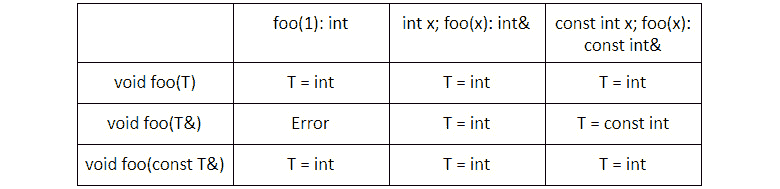
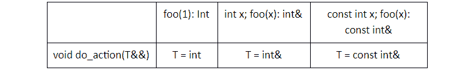

# 第五章：*第四章*

# 泛型编程和模板

## 课程目标

到本章结束时，你将能够：

+   理解模板的工作原理以及何时使用它们

+   识别和实现模板函数

+   实现模板类

+   编写适用于多种类型的代码

在本章中，你将学习如何在程序中有效地使用模板。

## 简介

在编程时，经常会遇到针对不同类型对象重复出现的问题，例如存储对象列表、在列表中搜索元素或找到两个元素之间的最大值。

假设在我们的程序中，我们想要能够找到两个元素之间的最大值，无论是整数还是双精度浮点数。使用我们迄今为止学到的特性，我们可以编写以下代码：

```cpp
int max(int a, int b) {
  if ( a > b) return a;
  else return b;
}
double max(double a, double b) {
  if ( a> b) return a;
  else return b;
}
```

在前面的代码中，两个函数除了参数的 *类型* 和 *返回类型* 之外是相同的。理想情况下，我们希望只编写这类操作一次，并在整个程序中重用它们。

此外，我们的 `max()` 函数只能用存在重载的类型来调用：在这种情况下是 `int` 和 `double`。如果我们希望它能够与任何数值类型一起工作，我们就需要为每种数值类型编写一个 **重载**：我们需要提前知道所有将要用于调用它的类型，特别是当函数是面向其他开发者使用的库的一部分时，因为我们无法知道调用函数时使用的类型。

我们可以看到，在找到最大元素时，并不需要特定于整数的要求；如果元素实现了 `operator<`，则可以找到两个数中的较大者，算法不会改变。在这些情况下，C++提供了一个有效的工具——**模板**。

## 模板

模板是一种定义函数或类的方法，它们可以适用于许多不同的类型，同时只需编写一次。

它们通过具有特殊类型的参数——**类型参数**来实现。

在编写模板代码时，我们可以使用这个类型参数，就像它是一个真实类型一样，例如 `int` 或 `string`。

当调用模板函数或实例化模板类时，类型参数会被替换为调用代码实际使用的真实类型。

现在让我们看看 C++代码中的一个模板示例：

```cpp
template<typename T>
T max(T a, T b) {
  if(a>b) {
    return a;
  } else {
    return b;
  }
}
```

模板总是以 `template` 关键字开头，后跟用 *尖括号* 包围的模板参数列表。

模板参数列表是由逗号分隔的参数列表。在这种情况下，我们只有一个——`typename T`。

`typename` 关键字告诉模板我们正在编写一个使用泛型类型的模板函数，我们将将其命名为 `T`。

#### 注意

你也可以用 `class` 关键字代替 `typename`，因为它们之间没有区别。

然后，函数的定义紧随其后。在函数定义中，当我们想要引用泛型类型时，我们可以使用名称 `T`。

要调用模板，我们指定模板的名称，然后是我们要用作 *类型参数* 的类型的列表，用尖括号括起来：

```cpp
max<int>(10, 15);
```

这调用了模板函数 `max`，指定 `int` 作为类型参数。我们说我们用类型 `int` 实例化了模板函数 `max`，然后调用了该实例。

我们并不总是需要指定模板的类型参数；编译器可以从调用代码中推断它们。稍后的部分将描述这个特性。

由于模板非常强大，C++ 标准库的大部分内容都是基于模板的，我们将在 *第五章*，*标准库容器和算法* 中看到。

现在我们将深入探讨当我们编译包含模板的代码时会发生什么。

### 编译模板代码

与函数和类类似，模板在使用之前需要被 *声明*。

当编译器首次遇到程序中的模板定义时，它会解析它并仅执行通常对其他代码所做的部分检查。

这是因为编译器在解析模板时不知道将要使用哪种类型，因为类型本身就是参数。这阻止编译器执行涉及参数类型的检查，或任何依赖于它们的检查。

因此，你只有在实例化模板时才会收到一些错误的提示。

一旦我们定义了一个模板，我们就可以在我们的代码中实例化它。

当模板被实例化时，编译器查看模板的定义，并使用它生成一个新的代码实例，其中所有对类型参数的引用都被在实例化时提供的类型所替换。

例如：当我们调用 `max<int>(1,2)` 时，编译器查看我们之前指定的模板定义，并生成如下代码：

```cpp
int max(int a, int b) {
  if(a>b) {
    return a;
  } else {
    return b;
  }
}
```

#### 注意

由于编译器从模板定义生成代码，这意味着完整的定义需要对调用代码可见，而不仅仅是声明，就像函数和类的情况一样。

模板仍然可以提前声明，但编译器也必须看到定义。因此，当编写应该由多个文件访问的模板时，模板的定义和声明都必须在 **头文件** 中。

如果模板仅在一个文件中使用，则此限制不适用。

### 练习 11：查找余额最高的用户的银行账户

编写一个模板函数，该函数接受两个银行账户（相同类型）的详细信息，并返回余额最高的银行账户的余额。

对于这个练习，执行以下步骤：

1.  让我们创建两个名为 `EUBankAccount` 和 `UKBankAccount` 的结构体，以表示具有所需基本信息的**欧盟**银行账户和**英国**银行账户，如下面的代码所示：

    ```cpp
    #include <string>
    struct EUBankAccount {
       std::string IBAN;
       int amount;
    };
    struct UKBankAccount {
       std::string sortNumber;
       std::string accountNumber;
       int amount;
    };
    ```

1.  模板函数将不得不比较银行账户的金额。我们想要与不同的银行账户类型一起工作，因此我们需要使用一个模板：

    ```cpp
    template<typename BankAccount>
    int getMaxAmount(const BankAccount& acc1, const BankAccount& acc2) {
        // All bank accounts have an 'amount' field, so we can access it safely
        if (acc1.amount > acc2.amount) {
            return acc1.amount;
        } else {
            return acc2.amount;
        }
    }
    ```

1.  现在，在`main`函数中，调用结构体和模板函数，如下所示：

    ```cpp
    int main() {
        EUBankAccount euAccount1{"IBAN1", 1000};
        EUBankAccount euAccount2{"IBAN2", 2000};
        std::cout << "The greater amount between EU accounts is " << getMaxAmount(euAccount1, euAccount2) << std::endl;
        UKBankAccount ukAccount1{"SORT1", "ACCOUNT_NUM1", 2500};
        UKBankAccount ukAccount2{"SORT2", "ACCOUNT_NUM2", 1500};
        std::cout << "The greater amount between UK accounts is " << getMaxAmount(ukAccount1, ukAccount2) << std::endl;
    }
    ```

    输出如下：

    ```cpp
    The greater amount between EU accounts is 2000
    The greater amount between UK accounts is 2500
    ```

### 使用模板类型参数

如我们之前所见，当模板被使用时，编译器将其用作指南来生成一个具有某些具体类型的模板实例。

这意味着我们可以将类型用作一个*具体*类型，包括对其应用类型修饰符。

我们之前看到，类型可以通过使用`const`修饰符使其成为常量来修改，我们还可以通过使用*引用*修饰符来获取特定类型的对象的引用：

```cpp
template<typename T>
T createFrom(const T& other) {
    return T(other);
}
```

这里，我们可以看到一个`template`函数，它从一个对象的另一个实例创建一个新的对象。

由于该函数不修改原始类型，该函数希望将其作为`const`引用接受。

由于我们在模板中声明了类型`T`，在函数定义中我们可以使用类型修饰符以我们认为更合适的方式接受参数。

注意我们使用了两次类型：一次带有一些修饰符，一次没有修饰符。

这在使用模板和编写函数时提供了很大的灵活性，因为我们可以自由地修改类型以适应我们的需求。

类似地，我们在哪里使用模板参数有很高的自由度。

让我们看看两个具有多个模板类型参数的模板：

```cpp
template<typename A, typename B>
A transform(const B& b) {
    return A(b);
}
template<typename A, typename B>
A createFrom() {
  B factory;
  return factory.getA();
}
```

我们可以看到我们可以在函数参数、返回类型或直接在函数体中实例化模板参数中使用模板参数。

此外，模板参数声明的顺序不会影响模板参数可以在哪里以及如何使用。

### 模板参数类型的要求

在本章开头代码片段中，我们编写了一些接受任何类型的模板。实际上，我们的代码对任何类型都不起作用；例如：`max()`需要类型支持`<`操作。

我们可以看到对类型有一些要求。

让我们尝试理解在 C++代码中使用模板时对类型有要求意味着什么。我们将通过使用以下模板代码来做到这一点：

```cpp
template<typename Container, typename User>
void populateAccountCollection (Container& container, const User& user) {
  container.push_back(user.getAccount());
}
```

我们可以将以下函数作为主函数并编译程序：

```cpp
int main() {
  // do nothing
}
```

当我们编译这个程序时，编译成功结束，没有任何错误。

假设我们将`main`函数改为以下内容：

```cpp
int main() {
  std::string accounts;
  int user;
  populateAccountCollection(accounts, user);
}
```

#### 注意

我们没有指定类型给模板。我们将在本章后面看到，当编译器可以从调用中自动推断类型时。

编译器在编译时会给我们一个错误：

```cpp
error: request for member 'getAccount' in 'user', which is of non-class type 'const int'
```

注意当我们使用模板函数时错误是如何出现的，并且它之前没有被检测到。

错误告诉我们我们试图在一个没有此类方法的整数上调用`getAccount`方法。

为什么编译器在我们编写模板时没有告诉我们这一点？

原因在于编译器不知道类型 `User` 将会是什么；因此，它无法判断 `getAccount` 方法是否存在。

当我们尝试使用模板时，我们尝试使用两种特定的类型生成代码，编译器检查了这些类型是否适合模板；它们不适合，编译器给出了错误。

我们使用的类型没有满足模板类型的要求数据。

不幸的是，在当前的 C++ 标准中，即使是最近的 C++17，也没有简单的方法来指定模板的要求——为此，我们需要良好的文档。

模板有两个类型参数，因此我们可以查看每个类型的要求数据：

+   `User` 对象必须有一个 `getAccount` 方法

+   `Container` 对象必须有一个 `push_back` 方法

当我们调用 `getAccount()` 函数时，编译器发现了第一个问题，并通知我们。

为了解决这个问题，让我们声明一个合适的类，如下所示：

```cpp
struct Account {
  // Some fields
};
class User {
public:
  Account getAccount() const{ 
    return Account();
 }
};
```

现在，让我们借助以下代码调用模板：

```cpp
int main() {
  std::string accounts;
  User user;
  populateAccountCollection(accounts, user);
}
```

我们仍然得到一个错误：

```cpp
error: no matching function for call to 'std::__cxx11::basic_string<char>::push_back(Account)'
```

这次，错误信息不太清晰，但编译器告诉我们没有名为 `push_back` 的方法可以接受 `basic_string<char>`（`std::string` 是它的别名）中的账户。原因是 `std::string` 有一个名为 `push_back` 的方法，但它只接受字符。由于我们用 `Account` 调用它，所以失败了。

我们需要对模板的要求更加精确：

+   返回对象的 `getAccount` 方法

+   接受用户 `getAccount` 返回类型对象的 `push_back` 方法

    #### 注意

    C++标准库中的 `std::vector` 类型允许存储任意类型的元素序列。`push_back` 是一个用于在向量末尾添加新元素的方法。我们将在 *第五章*，*标准库容器和算法* 中了解更多关于向量的内容。

现在，我们将调用代码修改为考虑所有要求：

```cpp
#include <vector>
int main(){
   std::vector<Account> accounts;
   User user;
   populateAccountCollection(accounts, user);
}
```

这次，代码编译正确了！

这表明编译器是如何检查大多数错误的，但只有在实例化模板时才会这样做。

这也非常重要，要清楚地记录模板的要求，以便用户不必阅读复杂的错误信息来了解哪个要求没有被遵守。

#### 注意

为了使我们的模板易于与许多类型一起使用，我们应该尽量对类型设置最少的要求。

## 定义函数和类模板

在上一节中，我们看到了模板在编写抽象方面的优势。在本节中，我们将探讨如何有效地在我们的代码中使用模板来创建 **模板函数** 和 **模板类**。

### 函数模板

在上一节中，我们学习了如何编写函数模板。

在本节中，我们将学习 C++11 引入的两个特性，使编写模板函数更容易。这两个函数是尾随返回类型和 `decltype`。

让我们从 `decltype` 开始。`decltype` 是一个关键字，它接受一个表达式并返回该表达式的类型。让我们看看以下代码：

```cpp
int x;
decltype(x) y;
```

在之前的代码中，`y` 被声明为整数类型，因为我们正在使用表达式 `x` 的类型，它是 `int`。

`decltype` 内部可以使用任何表达式，即使是复杂的表达式，例如：

```cpp
User user;
decltype(user.getAccount()) account;
```

让我们看看第二个特性——**尾随返回类型**。

我们看到函数定义以返回类型开始，然后是函数名，然后是参数。例如：

```cpp
int max(int a, int b);
```

从 C++11 开始，可以使用尾随返回类型：在函数签名末尾指定返回类型。声明具有尾随返回类型的函数的语法是使用关键字 `auto`，然后是函数名和参数，然后是一个 *箭头* 和 *返回类型*。

以下是一个尾随返回类型的示例：

```cpp
auto max(int a, int b) -> int;
```

当编写常规函数时，这并不有利，但当编写模板并与 `decltype` 结合使用时，它变得很有用。

原因是 `decltype` 可以访问函数参数中定义的变量，返回类型可以从中计算得出：

```cpp
template<typename User>
auto getAccount(User user) -> decltype(user.getAccount());
```

这是一个函数模板的 `前向声明` 示例。

#### 注意

当用户想要提供定义时，它需要提供相同的模板声明，然后是函数体。

没有尾随返回类型，我们必须知道 `user.getAccount()` 返回的类型才能将其用作 `getAccount()` 函数的返回类型。`user.getAccount()` 的返回类型可能因模板参数 `User` 的类型而异，这意味着 `getAccount` 函数的返回类型可能会根据 `User` 类型而变化。有了尾随返回类型，我们不需要知道 `user.getAccount()` 返回的类型，因为它会自动确定。更好的是，当我们在函数中使用不同类型或用户更改用于实例化模板的类型之一的 `getAccount` 方法的返回类型时，我们的代码会自动处理它。

最近，C++14 引入了在函数声明中简单地指定 `auto` 的能力，而不需要尾随返回类型：

```cpp
auto max(int a, int b)
```

返回类型由编译器自动推导，为此，编译器需要看到函数的定义——我们不能前向声明返回 `auto` 的函数。

此外，`auto` 总是返回一个值——它永远不会返回一个引用：在使用它时要注意这一点，因为我们可能会无意中创建返回值的副本。

函数模板的一个最后但很有用的特性是，如何在不需要调用它们的情况下引用它们。

到目前为止，我们只看到了如何调用函数模板，但 C++允许我们将函数作为参数传递。例如：在排序容器时，可以提供自定义的比较函数。

我们知道模板只是一个函数的蓝图，而真正的函数只有在模板实例化时才会创建。C++允许我们在不调用它的情况下实例化模板函数。我们可以通过指定模板函数的名称，然后是模板参数，而不添加调用参数来完成此操作。

让我们理解以下示例：

```cpp
template<typename T>
void sort(std::array<T, 5> array, bool (*function)(const T&, const T&));
```

`sort`是一个接受五个元素数组和两个元素比较函数指针的函数：

```cpp
template<typename T>
bool less(const T& a, const T& b) {
  return a < b;
}
```

要使用整数`less`模板的实例调用`sort`，我们将编写以下代码：

```cpp
int main() {
  std::array<int, 5> array = {4,3,5,1,2};
  sort(array, &less<int>);
}
```

在这里，我们取一个指向整数`less`实例的指针。这在使用标准模板库时特别有用，我们将在*第五章*，*标准库容器和算法*中看到。

### 类模板

在上一节中，我们学习了如何编写模板函数。类模板的语法与函数的语法等效：首先，是模板声明，然后是类的声明：

```cpp
template<typename T>
class MyArray {
  // As usual
};
```

并且与函数等效，要实例化一个类模板，我们使用包含类型列表的尖括号：

```cpp
MyArray<int> array;
```

类似于函数，当模板实例化时，会生成类模板代码，并且适用相同的限制：定义需要对编译器可用，并且在模板实例化时执行一些错误检查。

正如我们在*第 3 课*，*类*中看到的，在编写类的主体时，类的名称有时会带有特殊含义。例如，构造函数函数的名称必须与类的名称匹配。

以同样的方式，在编写类模板时，可以直接使用类的名称，它将引用正在创建的特定模板实例：

```cpp
template<typename T>
class MyArray {
  // There is no need to use MyArray<T> to refer to the class, MyArray automatically refers to the current template instantiation
  MyArray();
  // Define the constructor for the current template T
  MyArray<T>();
  // This is not a valid constructor.
};
```

这使得编写模板类与编写常规类有相似的经验，并且增加了能够使用模板参数使类与泛型类型一起工作的额外好处。

与常规类一样，模板类可以有字段和方法。字段可以依赖于模板声明的类型。让我们回顾以下代码示例：

```cpp
template<typename T>
class MyArray {
  T[] internal_array;
};
```

同样，在编写方法时，类可以使用类的类型参数：

```cpp
template<typename T>
class MyArray {
  void push_back(const T& element);
};
```

类也可以有模板方法。模板方法类似于模板函数，但它们可以访问类实例数据。

让我们回顾以下示例：

```cpp
template<typename T>
class MyArray {
  template<typename Comparator>
  void sort (const Comparator & element);
};
```

`sort`方法将接受任何类型，并且如果类型满足方法对类型的所有要求，它将编译。

调用方法时，语法遵循调用函数的语法：

```cpp
MyArray<int> array;
MyComparator comparator;
array.sort<MyComparator>(comparator);
```

#### 注意

方法模板可以是非模板类的一部分。

在这种情况下，编译器有时可以推断出参数的类型，而用户不必指定它。

如果一个方法仅在类中声明，就像我们在`sort`示例中所做的那样，用户可以在以后通过指定类和方法的双重模板类型来实现它：

```cpp
template<typename T> // template of the class
template<typename Comparator> // template of the method
MyArray<T>::sort(const Comparator& element) {
  // implementation
}
```

类型名称不必匹配，但保持名称一致性是一个好习惯。

类似于方法，类也可以有模板重载运算符。方法与常规类重载运算符的编写方式相同，区别在于模板的声明必须先于重载声明的声明，就像我们在方法模板中看到的那样。

最后，需要注意的一点是静态方法和静态字段如何与类模板交互。

我们需要记住，模板是针对将生成的特定类型的代码的指南。这意味着当模板类声明一个静态成员时，该成员仅在具有相同模板参数的模板实例之间共享：

```cpp
template<typename T>
class MyArray {
  const Static int element_size = sizeof(T);
};
MyArray<int> int_array1;
MyArray<int> int_array2;
MyArray<std::string> string_array;
```

`int_array1`和`int_array2`将共享同一个静态变量`element_size`，因为它们都是同一类型：`MyArray<int>`。另一方面，`string_array`有一个不同的，因为它的类类型是`MyArray<std::string>`。`MyArray<int>`和`MyArray<std::string>`，即使是从同一个类模板生成的，也是两个不同的类，因此不共享静态字段。

### 依赖类型

这在代码中相当常见，尤其是在与模板交互的代码中，通常会定义一些公共别名来表示类型。

一个典型的例子是容器的`value_type` `type alias`，它指定了包含的类型：

```cpp
template<typename T>
class MyArray {
public:
  using value_type = T;
};
```

为什么这样做？

原因在于，如果我们接受一个泛型数组作为模板参数，我们可能想找出包含的类型。

如果我们接受一个特定的类型，这个问题就不会出现。由于我们知道向量的类型，我们可以编写以下代码：

```cpp
void createOneAndAppend(std::vector<int>& container) {
  int new_element{}; // We know the vector contains int
  container.push_back(new_element);
}
```

但当我们接受任何提供`push_back`方法的容器时，我们如何做到这一点？

```cpp
template<typename Container>
void createOneAndAppend(Container& container) {
  // what type should new_element be?
  container.push_back(new_element);
}
```

我们可以访问容器内声明的`type alias`，它指定了它包含哪种类型的值，并使用它来实例化新值：

```cpp
template<typename Container>
void createOneAndAppend(Container& container) {
  Container::value_type new_element;
  container.push_back(new_element);
}
```

不幸的是，此代码无法编译。

原因在于`value_type`是一个**依赖类型**。依赖类型是从模板参数之一派生出的类型。

当编译器编译此代码时，它会注意到我们在`Container`类中访问了`value_type`标识符。

这可以是静态字段或`type alias`。编译器在解析模板时无法知道，因为它不知道`Container`类型是什么，以及它是否有`type alias`或静态变量。因此，它假设我们正在访问一个静态值。如果这是情况，我们使用的语法是不正确的，因为我们仍然在访问字段后有`new_element{}`。

为了解决这个问题，我们可以告诉编译器我们正在访问类中的类型，我们通过在要访问的类型前加上 `typename` 关键字来实现：

```cpp
template<typename Container>
void createOneAndAppend(Container& container) {
  typename Container::value_type new_element{};
  container.push_back(new_element);
}
```

### 活动 13：从连接中读取对象

用户正在创建一个需要通过互联网连接发送和接收其当前状态的在线游戏。应用程序有几种类型的连接（TCP、UDP、套接字），每种连接都有一个 `readNext()` 方法，该方法返回一个包含连接内部数据的 100 个字符的 `std::array`，以及一个 `writeNext()` 方法，该方法接受一个 100 个字符的 `std::array`，并将数据放入连接中。

让我们按照以下步骤创建我们的在线应用程序：

1.  应用程序想要通过连接发送和接收的对象有一个 `serialize()` 静态方法，它接受对象的实例并返回一个表示该对象的 100 个字符的 `std::array`。

    ```cpp
    class UserAccount {
    public:
        static std::array<char, 100> serialize(const UserAccount& account) {
            std::cout << "the user account has been serialized" << std::endl;
            return std::array<char, 100>();
        }
        static UserAccount deserialize(const std::array<char, 100>& blob) {
            std::cout << "the user account has been deserialized" << std::endl;
            return UserAccount();
        }
    };
    class TcpConnection {
    public:
        std::array<char, 100> readNext() {
            std::cout << "the data has been read" << std::endl;
            return std::array<char, 100>{};
        }
        void writeNext(const std::array<char, 100>& blob) {
            std::cout << "the data has been written" << std::endl;
        }
    };
    ```

1.  `deserialize()` 静态方法接受一个表示对象的 100 个字符的 `std::array`，并从中创建一个对象。

1.  连接对象已经提供。创建具有以下声明的头文件 `connection.h`：

    ```cpp
    template<typename Object, typename Connection>
    Object readObjectFromConnection(Connection& con) {
      std::array<char, 100> data = con.readNext();
      return Object::deserialize(data);
    }
    ```

1.  编写一个名为 `readObjectFromConnection` 的函数模板，该模板接受一个连接作为唯一参数，以及从连接中读取的对象的类型作为模板类型参数。该函数返回在反序列化连接中的数据后构造的对象实例。

1.  然后，使用 `TcpConnection` 类的实例调用该函数，提取 `UserAccount` 类型的对象：

    ```cpp
    TcpConnection connection;
    UserAccount userAccount = readObjectFromConnection<UserAccount>(connection);
    ```

目标是能够将用户的账户信息发送给同一在线游戏的其他连接用户，以便他们可以看到用户信息，如他们的用户名和角色的等级。

#### 注意

本活动的解决方案可以在第 295 页找到。

### 活动 14：创建支持多种货币的用户账户

编写一个支持并存储多种货币的程序。按照以下步骤：

1.  我们想要创建一个 `Account` 类，它可以存储不同货币的账户余额。

1.  `Currency` 是一个表示特定货币中一定价值的类。它有一个名为 `value` 的公共字段和一个名为 `to()` 的模板函数，该函数接受一个 `Currency` 类型的参数，并返回一个具有适当转换当前类值的该货币类型的实例：

    ```cpp
    struct Currency {
        static const int conversionRate = CurrencyConversion;
        int d_value;
        Currency(int value): d_value(value) {}
    };
    template<typename OtherCurrency, typename SourceCurrency>
    OtherCurrency to(const SourceCurrency& source) {
        float baseValue = source.d_value / float(source.conversionRate);
        int otherCurrencyValue = int(baseValue * OtherCurrency::conversionRate);
        return OtherCurrency(otherCurrencyValue);
    }
    using USD = Currency<100>;
    using EUR = Currency<87>;
    using GBP = Currency<78>;
    template<typename Currency>
    class UserAccount {
    public:
      Currency balance;
    };
    ```

1.  我们的目标是编写一个 `Account` 类，它可以存储由 `template` 参数提供的任何货币的当前余额。

1.  用户账户必须提供一个名为 `addToBalance` 的方法，该方法接受任何类型的货币，并在将其转换为账户使用的正确货币后，将值加到余额上：

    ```cpp
    template<typename OtherCurrency>
      void addToBalance(OtherCurrency& other) {
        balance.value += to<Currency>(other).value;
      }
    ```

1.  用户现在理解了如何编写类模板，如何实例化它们，以及如何调用它们的模板。

    #### 注意

    本活动的解决方案可以在第 296 页找到。

## 非类型模板参数

我们学习了如何使用模板来提供类型作为参数，以及我们如何利用这一点来编写通用代码。

C++中的模板有一个额外的特性——**非类型模板参数**。

非类型模板参数是一种模板参数，它不是类型——它是一个值。

当使用`std::array<int, 10>`时，我们多次使用了这种非类型模板参数。

在这里，第二个参数是一个非类型模板参数，它表示数组的大小。

非类型模板参数的声明在模板的参数列表中，但与类型参数的`typename`关键字不同，它以值的类型开始，后面跟着标识符。

对于作为非类型模板参数支持的类型有严格的限制：它们必须是整型。

让我们检查以下非类型模板参数声明的示例：

```cpp
template<typename T, unsigned int size>
Array {
  // Implementation
};
```

例如：在这里，我们声明了一个类模板，它接受一个类型参数和一个非类型参数。

我们已经看到函数可以直接接受参数，类可以在构造函数中接受参数。此外，常规参数的类型并不限于必须是整型。

模板参数和非模板参数之间有什么区别？为什么我们会使用非类型模板参数而不是常规参数？

主要区别在于参数是否为程序所知。像所有模板参数一样，与非模板参数不同，值必须在编译时已知。

当我们想在需要编译时评估的表达式中使用参数时，这很有用，就像我们在声明数组大小时所做的那样。

另一个优点是编译器在编译代码时可以访问该值，因此它可以在编译期间执行一些计算，从而减少在运行时执行的指令数量，使程序更快。

此外，在编译时知道一些值可以让我们的程序执行额外的检查，这样我们就可以在编译程序时而不是在程序执行时识别问题。

### 活动 15：为游戏中的数学运算编写矩阵类

在游戏中，通常用一种特殊的矩阵来表示角色的方向：一个*四元数*。我们希望编写一个`Matrix`类，它将成为我们游戏内部数学运算的基础。

我们的`Matrix`类应该是一个模板，它接受一个类型、行数和列数。

我们应该将矩阵的元素存储在类内部的`std::array`中。

该类应该有一个名为`get()`的方法，它接受行和列作为参数，并返回该位置的元素引用。

如果行或列超出了矩阵的范围，我们应该调用`std::abort()`。

让我们遵循以下步骤：

1.  `Matrix`类接受三个模板参数——一个类型和`Matrix`类的两个维度。维度是`int`类型。

    ```cpp
    template<typename T, int R, int C>
    class Matrix {
        // We store row_1, row_2, ..., row_C
        std::array<T, R*C> data;
        public:
            Matrix() : data({}) {}
    };
    ```

1.  现在，创建一个大小为行数乘以列数的`std::array`，以便我们有足够的空间存储矩阵的所有元素。

1.  添加一个构造函数以初始化数组：

1.  我们向类中添加一个`get()`方法，该方法返回对元素`T`的引用。该方法需要接受我们想要访问的行和列。

1.  如果索引超出矩阵的范围，我们调用`std::abort()`。在数组中，我们存储第一行的所有元素，然后是第二行的所有元素，依此类推。因此，当我们想要访问第 n 行的元素时，我们需要跳过之前行的所有元素，这些元素的数量将是每行的元素数量（即列数）乘以之前的行数：

    ```cpp
    T& get(int row, int col) {
      if (row >= R || col >= C) {
        std::abort();
      }
      return data[row*C + col];
    }
    ```

    输出如下：

    ```cpp
    Initial matrix:
    1 2 
    3 4 
    5 6 
    ```

    #### 注意

    该活动的解决方案可以在第 298 页找到。

**附加步骤：**

在游戏中，矩阵乘以向量是一个常见的操作。

向类中添加一个方法，该方法接受一个包含矩阵相同类型元素的`std::array`，并返回一个包含乘法结果的`std::array`。请参阅矩阵-向量乘法的定义[`mathinsight.org/matrix_vector_multiplication`](https://mathinsight.org/matrix_vector_multiplication)。

**附加步骤：**

我们添加了一个新方法`multiply`，它以常量引用的方式接受一个类型为`T`、长度为`C`的`std::array`，因为我们没有修改它。

函数返回一个与相同类型的数组，但长度为`R`？

我们遵循矩阵-向量乘法的定义来计算结果：

```cpp
std::array<T, R> multiply(const std::array<T, C>& vector){
    std::array<T, R> result = {};
    for(int r = 0; r < R; r++) {
      for(int c = 0; c < C; c++) {
        result[r] += get(r, c) * vector[c];
      }
    }  
    return result;
  }
```

## 使模板更容易使用

我们总是说我们需要为模板函数或类的参数提供模板参数。现在，在本节中，我们将看到 C++提供的两个特性，使模板的使用更加容易。

这些特性是默认模板参数和模板参数推导。

### 默认模板参数

与函数参数一样，模板参数也可以具有默认值，包括类型和非类型模板参数。

默认模板参数的语法是在模板标识符后添加等号，后跟值：

```cpp
template<typename MyType = int>
void foo();
```

当模板为参数提供一个默认值时，用户在实例化模板时不必指定该参数。默认参数必须在不具有默认值的参数之后。

此外，在定义后续模板参数的默认类型时，可以引用之前的模板参数。

让我们看看一些错误和有效声明的示例：

```cpp
template<typename T = void, typename A>
void foo();
```

+   `T`，具有默认类型，位于模板参数`A`之前，`A`没有默认参数：

    ```cpp
    template<typename T = A, typename A = void>
    void foo();
    ```

+   `T`引用模板参数`A`，它位于`T`之后：

    ```cpp
    template<typename T, typename A = T >
    void foo();
    ```

+   `A`有一个默认值，并且没有其他没有默认值的模板参数跟在它后面。它还引用了`T`，这是在模板参数`A`之前声明的。

使用默认参数的原因是为模板提供一个合理的选项，但仍然允许用户在需要时提供他们自己的类型或值。

让我们看看类型参数的一个例子：

```cpp
template<typename T>
struct Less {
  bool operator()(const T& a, const T& b) {
    return a < b;
  }
};
template<typename T, typename Comparator= Less<T>>
class SortedArray;
```

假设的类型`SortedArray`是一个始终保持其元素排序的数组。它接受它应该持有的元素类型和一个比较器。为了方便用户使用，它默认使用`less`运算符作为比较器。

以下代码展示了用户如何实现它：

```cpp
SortedArray<int> sortedArray1;
SortedArrat<int, Greater<int>> sortedArray2;
```

我们还可以看到一个默认的非类型模板参数的例子：

```cpp
template<size_t Size = 512>
struct MemoryBuffer;
```

假设的类型`MemoryBuffer`是一个在栈上预留内存的对象；程序然后将对象分配到该内存中。默认情况下，它使用 512 字节的内存，但用户可以指定不同的大小：

```cpp
MemoryBuffer<> buffer1;
MemoryBuffer<1024> buffer2;
```

注意`buffer1`声明中的空尖括号。它们是必要的，以向编译器发出信号，表明我们正在使用模板。这个要求在 C++17 中被移除，我们可以写`MemoryBuffer buffer1;`。

### 模板参数推导

所有模板参数都需要为实例化模板而知道，但并非所有参数都需要由调用者显式提供。

**模板参数推导**指的是编译器自动理解用于实例化模板的一些类型的能力，而无需用户显式地输入它们。

我们将看到对于函数，因为这是大多数 C++版本所支持的。C++17 引入了**推导指南**，允许编译器从构造函数中为类模板执行模板参数推导，但我们不会看到它们。

模板参数推导的详细规则非常复杂，因此我们将通过例子来了解它们，以便我们能理解它们。

通常，编译器试图找到与提供的参数最接近的类型。

我们将要分析的代码如下：

```cpp
template<typename T>
void foo(T parameter);
```

调用代码如下：

```cpp
foo(argument);
```

### 参数和参数类型

我们将看到如何根据不同的参数和参数对，推导出类型：



###### 图 4.1：不同的参数和参数类型

错误发生是因为我们不能将临时值，如 1，绑定到一个非`const`引用。

如我们所见，编译器试图推导出一个类型，当它被代入参数时，尽可能与参数匹配。

编译器并不总是能找到这样的类型；在这些情况下，它会报错，用户需要提供类型。

编译器不能推导出以下任何原因的类型：

类型在参数中未使用。例如：如果类型仅在返回类型中使用，或者仅在函数体内部使用，则编译器无法推导出该类型。

参数中的类型是一个派生类型。例如：`template<typename T> void foo(T::value_type a)`。编译器无法根据用于调用函数的参数找到类型`T`。

了解这些规则后，我们可以总结出编写模板时模板参数顺序的最佳实践：我们期望用户提供的类型需要放在可以推导出的类型之前。

原因是用户只能以它们声明的相同顺序提供模板参数。

让我们考虑以下模板：

```cpp
template<typename A, typename B, typename C>
C foo(A, B);
```

当调用`foo(1, 2.23)`时，编译器可以推导出`A`和`B`，但不能推导出`C`。由于我们需要所有类型，并且用户必须按顺序提供它们，因此用户必须提供所有类型：`foo<int, double, and float>(1, 2.23);`。

假设我们将无法推导出的类型放在可以推导出的类型之前，如下例所示：

```cpp
template< typename C, typename A, typename B>
C foo(A, B);
```

我们可以用`foo<float>(1, 2.23)`调用该函数。然后，我们会提供用于`C`的类型，编译器会自动推导出`A`和`B`。

以类似的方式，我们需要对默认模板参数进行推理。

由于它们需要放在最后，我们需要确保将用户更有可能想要修改的类型放在前面，因为这将迫使用户提供所有模板参数直到该参数。

### 活动十六：使矩阵类更容易使用

在*活动十五：为游戏中的数学运算编写矩阵类*中创建的`Matrix`类要求我们提供三个模板参数。

现在，在这个活动中，我们希望通过要求用户只传递两个参数来使类更容易使用：`Matrix`类中的行数和列数。该类还应接受第三个参数：`Matrix`类中包含的类型。如果没有提供，则默认为`int`。

在上一个活动中，我们在矩阵中添加了一个`multiply`操作。现在我们希望用户能够通过指定类型之间如何执行乘法来自定义函数。默认情况下，我们希望使用`*`运算符。为此，`<functional>`头文件中存在一个名为`std::multiplies`的`class`模板。它的工作方式与我们之前在本章中看到的`Less`类类似：

1.  我们首先导入`<functional>`，以便我们可以访问`std::multiplies`。

1.  然后，我们将类模板中模板参数的顺序改变，使得大小参数首先出现。我们还添加了一个新的模板参数`Multiply`，这是我们用于计算向量中元素乘法的默认类型，并将其实例存储在类中。

1.  我们现在需要确保`multiply`方法使用用户提供的`Multiply`类型来执行乘法。

1.  为了做到这一点，我们需要确保我们调用`multiplier(operand1, operand2)`而不是`operand1 * operand2`，这样我们就可以使用我们存储在类内部的实例：

    ```cpp
    std::array<T, R> multiply(const std::array<T, C>& vector) {
        std::array<T, R> result = {};
        for(int r = 0; r < R; r++) {
            for(int c = 0; c < C; c++) {
                result[r] += multiplier(get(r, c), vector[c]);
            }
        }
        return result;
    }
    ```

1.  添加一个我们可以如何使用该类的示例：

    ```cpp
    // Create a matrix of int, with the 'plus' operation by default
    Matrix<3, 2, int, std::plus<int>> matrixAdd;
    matrixAdd.setRow(0, {1,2});
    matrixAdd.setRow(1, {3,4});
    matrixAdd.setRow(2, {5,6});
    std::array<int, 2> vector = {8, 9};
    // This will call std::plus when doing the multiplication
    std::array<int, 3> result = matrixAdd.multiply(vector);
    ```

    输出如下：

    ```cpp
    Initial matrix:
    1 2 
    3 4 
    5 6 
    Result of multiplication (with plus instead of multiply): [20, 24, 28]
    ```

    #### 注意

    这个活动的解决方案可以在第 300 页找到。

## 在模板中实现泛型

到目前为止，我们已经学习了编译器如何通过自动推断使用的类型来使我们的模板函数更容易使用。模板代码决定是否将参数作为值或引用接受，编译器为我们找到类型。但如果我们想对参数是值还是引用保持无知，并且想无论怎样都与之工作，我们该怎么办？

一个例子是 C++17 中的`std::invoke`。`std::invoke`是一个函数，它接受一个函数作为第一个参数，后面跟着一系列参数，并使用这些参数调用函数。例如：

```cpp
void do_action(int, float, double);
double d = 1.5;
std::invoke(do_action, 1, 1.2f, d);
```

如果你想在调用函数之前进行日志记录，或者你想在不同的线程中执行函数，例如`std::async`所做的那样，类似的例子也会适用。

让我们通过以下代码来消除差异：

```cpp
struct PrintOnCopyOrMove {
  PrintOnCopyOrMove(std::string name) : _name(name) {}
  PrintOnCopyOrMove(const PrintOnCopyOrMove& other) : _name(other._name) { std::cout << "Copy: " << _name << std::endl; }
  PrintOnCopyOrMove(PrintOnCopyOrMove&& other) : _name(other._name) { std::cout << "Move: " << _name << std::endl; }

  std::string _name;
};
void use_printoncopyormove_obj(PrintOnCopyOrMove obj) {}
```

#### 注意

`use_printoncopyormove_obj`总是通过值接受参数。

假设我们执行以下代码：

```cpp
PrintOnCopyOrMove local{"l-value"};
std::invoke(use_printoncopyormove_obj, local);
std::invoke(use_printoncopyormove_obj, PrintOnCopyOrMove("r-value"));
```

代码将打印以下内容：

```cpp
Copy: l-value
Move: r-value
```

我们如何编写一个像`std::invoke`这样的函数，它无论参数的引用类型（口语中称为“ref-ness”，类似于如何使用“const-ness”来讨论类型是否具有 const 资格）如何都能正常工作？

答案是**转发引用**。

转发引用看起来像右值引用，但它们只适用于编译器推断类型的场景：

```cpp
void do_action(PrintOnCopyOrMove&&)
// not deduced: r-value reference
template<typename T>
void do_action(T&&) // deduced by the compiler: forwarding reference
```

#### 注意

如果你在一个模板中看到一个类型标识符被声明，那么类型是被推断出来的，并且类型有&&，那么它是一个转发引用。

让我们看看转发引用的推断是如何工作的：



###### 图 4.2：转发引用函数。

#### 注意

假设类型没有被推断出来，而是被明确提供，例如：

`int x = 0;`

`do_action<int>(x);`

这里，`T`将是`int`，因为它被明确地说明了。

优势，正如我们之前看到的，是我们可以与任何类型的引用一起工作，当调用代码知道它可以移动对象时，我们可以利用移动构造函数提供的额外性能，但当引用更受欢迎时，代码也可以使用它。

此外，一些类型不支持复制，我们可以使我们的模板也能与这些类型一起工作。

当我们编写模板函数的主体时，参数被用作`l-value`引用，我们可以编写忽略`T`是`l-value`引用还是`r-value`引用的代码：

```cpp
template<typename T>
void do_action(T&& obj) { /* forwarding reference, but we can access obj as if it was a normal l-value reference */
  obj.some_method();
  some_function(obj);
}
```

在 *第三章*，*类* 中，我们学习了当需要使用在调用后不再访问的对象时，`std::move` 可以使我们的代码更高效。

但我们看到了，我们永远不应该移动作为左值引用参数接收的对象，因为调用我们的代码可能在我们返回后仍然使用该对象。

当我们使用前向引用编写模板时，我们面临一个困境：我们的类型可能是一个值或一个引用，那么我们如何决定是否可以使用 `std::move`？

这是否意味着我们不能利用 `std::move` 带来的好处？

当然，答案是 *不*：

```cpp
template<typename T>
void do_action(T&& obj) {
  do_something_with_obj(???); 
// We are not using obj after this call.
}
```

在这种情况下，我们应该使用移动还是不使用移动？

答案是 *是*：如果 `T` 是一个值，我们应该移动；如果不是，则不应该移动。

C++ 为我们提供了一个工具来做这件事：`std::forward`。

`std::forward` 是一个函数模板，它始终接受一个显式模板参数和一个函数参数：`std::forward<T>(obj)`。

`Forward` 会查看 `T` 的类型，如果是左值引用，则简单地返回 `obj` 的引用，如果不是，则相当于在对象上调用 `std::move`。

让我们看看它是如何工作的：

```cpp
template<typename T>
void do_action(T&& obj) {
  use_printoncopyormove_obj(std::forward<T>(obj)); 
}
```

现在，我们使用以下代码来调用它：

```cpp
PrintOnCopyOrMove local{"l-value"};
do_action(local);
do_action(PrintOnCopyOrMove("r-value"));
do_action(std::move(local));
// We can move because we do not use local anymore
```

当执行时，代码将打印以下输出：

```cpp
Copy: l-val
Move: r-val
Move: l-val
```

我们成功地编写了不依赖于类型是作为引用还是值传递的代码，消除了对模板类型参数的可能要求。

#### 注意

模板可以有许多类型参数。前向引用可以独立应用于任何类型参数。

这很重要，因为模板代码的调用者可能知道传递值或传递引用更好，而我们的代码应该能够在需要请求特定引用类型的情况下正常工作。

我们还看到了如何仍然保持移动的优势，这对于不支持复制的某些类型是必需的。这可以使我们的代码运行得更快，即使对于支持复制的类型也是如此，而不会使我们的代码复杂化：当我们有前向引用时，我们在本应使用 `std::move` 的地方使用 `std::forward`。

### 活动 17：确保在执行账户操作时用户已登录

我们希望允许我们的电子商务网站的用户执行任意操作（在这个活动的范围内，他们将添加和删除项目）在他们的购物车中。

在执行任何操作之前，我们想确保用户已登录。现在，让我们遵循以下指示：

1.  确保存在一个用于识别用户的 `UserIdentifier` 类型，一个表示用户购物车的 `Cart` 类型，以及一个表示购物车中任何项目的 `CartItem` 类型：

    ```cpp
    struct UserIdentifier {
        int userId = 0;
    };
    struct Cart {
        std::vector<Item> items;
    };
    ```

1.  确保存在一个具有签名 `bool isLoggedIn(const UserIdentifier& user)` 的函数，以及一个用于获取用户购物车的函数 `Cart getUserCart(const UserIdentifier& user)`:

    ```cpp
    bool isLoggedIn(const UserIdentifier& user) {
        return user.userId % 2 == 0;
    }
    Cart getUserCart(const UserIdentifier& user) {
        return Cart();
    }
    ```

1.  在我们的大部分代码中，我们只能访问用户的`UserIdentifier`，我们想确保在进行任何购物车操作之前，我们总是检查用户是否已登录。

1.  为了解决这个问题，我们决定编写一个名为`execute_on_user_cart`的函数模板，它接受用户标识符、一个操作和一个单一参数。该函数将检查用户是否已登录，如果是，则检索其购物车，然后执行传递购物车和单一参数的操作：

    ```cpp
    template<typename Action, typename Parameter>
    void execute_on_user_cart(UserIdentifier user, Action action, Parameter&& parameter) {
        if(isLoggedIn(user)) {
            Cart cart = getUserCart(user);
            action(cart, std::forward<Parameter>(parameter));
        } else {
            std::cout << "The user is not logged in" << std::endl;
        }
    }
    ```

1.  我们想要执行的一项操作是`void remove_item(Cart, CartItem)`。我们想要执行的另一项操作是`void add_items(Cart, std::vector<CartItem>)`：

    ```cpp
    void removeItem(Cart& cart, Item cartItem) {
        auto location = std::find(cart.items.begin(), cart.items.end(), cartItem);
        if (location != cart.items.end()) {
            cart.items.erase(location);
        }
        std::cout << "Item removed" << std::endl;
    }
    void addItems(Cart& cart, std::vector<Item> items) {
        cart.items.insert(cart.items.end(), items.begin(), items.end());
        std::cout << "Items added" << std::endl;
    }
    ```

    #### 注意

    函数模板的参数可以用来接受函数作为参数。

    目标是创建一个函数，它会在用户登录的情况下执行必要的检查，以便在整个程序中我们可以使用它来安全地执行对用户购物车所需的所有业务操作，而不会忘记检查用户的登录状态。

1.  我们还可以移动不是前向引用的类型：

    ```cpp
    template<typename Action, typename Parameter>
    void execute_on_user_cart(UserIdentifier user, Action action, Parameter&& parameter) {
        if(isLoggedIn(user)) {
            Cart cart = getUserCart(user);
            action(std::move(cart), std::forward<Parameter>(parameter));
        }
    }
    ```

1.  如何使用我们在活动早期描述的操作来使用`execute_on_user_cart`函数的示例如下：

    ```cpp
    UserIdentifier user{/* initialize */};
    execute_on_user_cart(user, remove_item, CartItem{});
    std::vector<CartItem> items = {{"Item1"}, {"Item2"}, {"Item3"}}; // might be very long
    execute_on_user_cart(user, add_items, std::move(items));
    ```

1.  我们软件中的开发者可以编写他们需要在购物车中执行的功能，并调用`execute_on_user_cart`来安全地执行它们。

    #### 注意

    解决这个活动的解决方案可以在第 302 页找到。

## 可变模板

我们刚刚看到了如何编写一个可以独立于它们的引用性接受参数的模板。

但是，我们之前提到的标准库中的两个函数`std::invoke`和`std::async`有一个额外的属性：它们可以接受任意数量的参数。

以类似的方式，`std::tuple`，一种类似于`std::array`的类型，但可以包含不同类型的值，可以包含任意数量的类型。

模板如何接受任意数量的不同类型的参数？

在过去，解决这个问题的方法是为同一个函数提供大量的重载，或者为类或结构体提供多个实现，每个参数数量一个。

这显然是难以维护的代码，因为它迫使我们多次编写相同的代码。另一个缺点是模板参数的数量有限，所以如果你的代码需要比提供的更多的参数，你将没有方法来使用该函数。

C++11 为这个问题提供了一个很好的解决方案：**参数包**。

参数包是一个可以接受零个或多个模板参数的模板参数。

通过在模板参数的类型后附加`…`来声明参数包。

参数包是与任何模板一起工作的功能：函数和类：

```cpp
template<typename… Types>
void do_action();
template<typename… Types>
struct MyStruct;
```

具有参数包的模板称为**可变模板**，因为它是一个接受可变数量参数的模板。

实例化变长模板时，可以通过用逗号分隔来向参数包提供任意数量的参数：

```cpp
do_action<int, std:string, float>();
do_action<>();
MyStruct<> myStruct0;
MyStruct<float, int> myStruct2;
```

`Types` 将包含在实例化模板时提供的参数列表。

参数包本身是一系列类型，代码不能直接与之交互。

变长模板可以通过在模式后附加 `…` 来展开参数包，从而使用参数包。

当一个模式展开时，它会根据其参数包中的类型数量重复，用逗号分隔。当然，为了展开，一个模式必须至少包含一个参数包。如果模式中存在多个参数，或者相同的参数出现多次，它们将同时展开。

最简单的模式是参数包的名称：`Types…`。

例如：为了让函数接受多个参数，它会在函数参数中展开参数包：

```cpp
template<typename… MyTypes>
void do_action(MyTypes… my_types);
do_action();
do_action(1, 2, 4.5, 3.5f);
```

当我们调用函数时，编译器会自动推导参数包的类型。在最后一次调用中，`MyTypes` 将包含 `int`、`double` 和 `float`，生成的函数签名将是 `void do_action(int __p0, int __p1, double __p2, float __p3)`。

#### 注意

模板参数列表中的参数包只能后面跟着具有默认值的模板参数，或者由编译器推导的模板参数。

最常见的是，参数包是模板参数列表中的最后一个。

函数参数 `my_types` 被称为**函数参数包**，也需要展开以便能够访问单个参数。

例如：让我们写一个变长结构体：

```cpp
template<typename… Ts>
struct Variadic {
  Variadic(Ts… arguments);
};
```

让我们写一个创建结构体的函数：

```cpp
template<typename… Ts>
Variadic<Ts…> make_variadic(Ts… args) {
  return Variadic<Ts…>(args…);
}
```

这里，我们有一个接受参数包并在其调用另一个变长结构体的构造函数时展开的变长函数。

`parameter packs` 函数，这是一个变长参数函数，只能在某些位置展开——最常见的是在调用函数时作为参数。

模板 `parameter packs`，这是一个类型变长参数，可以在模板参数列表中展开：实例化模板时 `<>` 之间的参数列表。

如我们之前提到的，展开的模式可能比仅仅参数名称更复杂。

例如：我们可以访问在类型中声明的类型别名，或者我们可以对参数调用一个函数：

```cpp
template<typename… Containers>
std::tuple<typename Containers::value_type…> get_front(Containers… containers) {
  return std::tuple<typename Containers::value_type…>(containers.front()…);
}
```

我们可以这样调用：

```cpp
std::vector<int> int_vector = {1};
std::vector<double> double_vector = {2.0};
std::vector<float> float_vector = {3.0f};
get_front(int_vector, double_vector, float_vector) // Returns a tuple<int, double, float> containing {1, 2.0, 3.0}
```

或者，我们可以将参数作为函数的参数传递：

```cpp
template<typename… Ts>
void modify_and_call (Ts… args) {
  do_things(modify (args)…));
}
```

这将调用每个参数的 `modify` 函数，并将结果传递给 `do_things`。

在本节中，我们看到了 C++ 的变长参数功能如何让我们编写可以与任何数量和类型的参数一起工作的函数和类。

虽然编写变长模板不是日常任务，但几乎每个程序员在日常编码中都使用变长模板，因为它使得编写强大的抽象变得容易得多，标准库也广泛使用了它。

此外，在适当的情况下，变长模板可以让我们编写出在多种我们需要的情况下都能工作的表达性代码。

### 活动十八：使用任意数量的参数安全地在用户购物车上执行操作

在前面的活动中，我们看到了一个函数，`execute_on_user_cart`，它允许我们执行接受类型为`Cart`的对象和单个参数的任意函数。

在这个活动中，我们希望通过允许任何接受类型为`Cart`的对象和任意数量参数的函数来扩展我们对用户购物车可以执行的操作类型：

1.  将前面的活动扩展到接受任何类型的参数数量，并传递给提供的操作。

1.  编写变长模板并学习如何扩展它们：

    ```cpp
    template<typename Action, typename... Parameters>
    void execute_on_user_cart(UserIdentifier user, Action action, Parameters&&... parameters) {
        if(isLoggedIn(user)) {
            Cart cart = getUserCart(user);
            action(std::move(cart), std::forward<Parameters>(parameters)...);
        }
    }
    ```

    #### 注意

    这个活动的解决方案可以在第 303 页找到。

## 编写易于阅读的模板

到目前为止，我们已经看到了许多我们可以用来编写强大模板的功能，这些模板允许我们在面对特定问题时创建高级抽象。

但，就像往常一样，代码更多地是被阅读而不是被编写，我们应该优化可读性：代码应该表达代码的意图，而不仅仅是实现的操作。

模板代码有时会使得做到这一点变得困难，但有一些模式可以帮助。

### 类型别名

类型 `name = type`.

在声明之后，任何使用*Name*的地方都将等同于使用*Type*。

这非常强大，原因有三：

+   它可以为复杂类型提供一个更短且更有意义的名称

+   它可以声明一个嵌套类型以简化对其的访问

+   它允许你避免在依赖类型前指定`typename`关键字

让我们看看这两个点的示例。

假设我们有一个类型，`UserAccount`，它包含用户的一些字段，例如用户 ID、用户余额、用户电子邮件等。

我们希望根据账户余额将用户账户组织到一个高分数榜中，以可视化哪些用户最积极地使用我们的服务。

要做到这一点，我们可以使用需要一些参数的数据结构：要存储的类型、排序类型的方式、比较类型的方式，以及可能的其他方式。

类型可能如下所示：

```cpp
template<typename T, typename Comparison = Less<T>, typename Equality = Equal<T>>
class SortedContainer;
```

为了便于使用，模板正确地提供了一些默认值给`Comparison`和`Equality`，它们使用`<`和`==`运算符，但我们的`UserAccount`类型没有实现`<`运算符，因为没有明确的排序，而`==`运算符也没有达到我们的预期，因为我们只对比较余额感兴趣。为了解决这个问题，我们实现了两个结构来提供我们需要的功能：

```cpp
SortedContainer<UserAccount, UserAccountBalanceCompare, UserAccountBalanceEqual> highScoreBoard;
```

创建一个高分数榜既冗长。

使用类型别名，我们可以编写以下内容：

```cpp
using HighScoreBoard = SortedContainer<UserAccount, UserAccountBalanceCompare, UserAccountBalanceEqual>;
```

在此之后，我们可以直接创建`HighScoreBoard`的实例，输入很少，并且清楚地指定意图：

```cpp
HighScoreBoard highScoreBoard;
```

现在，如果我们想更改排序账户的方式，我们也有一个单独的地方可以更新。例如：如果我们还想考虑用户在服务中注册的时间长短，我们可以更改比较器。每个类型别名的用户都会更新，而不用担心忘记更新某个位置。

此外，我们清楚地有一个位置可以放置关于使用所选类型的决策的文档。

#### 注意

当使用类型别名时，给出一个代表类型用途的名称，而不是它的工作方式。`UserAccountSortedContainerByBalance`不是一个好的名称，因为它告诉我们类型是如何工作的，而不是它的意图。

第二种情况对于允许代码进行自我检查（即查看类的某些细节）非常有用：

```cpp
template<typename T>
class SortedContainer {
public:
  T& front() const;
};
template<typename T>
class ReversedContainer {
public:
  T& front() const;
}
```

我们有几个容器，它们大多支持相同的操作。我们希望编写一个模板函数，它接受任何容器并返回第一个元素，即`front`：

```cpp
template<typename Container>
??? get_front(const Container& container);
```

我们如何找出返回的类型是什么？

一种常见的模式是在类内部添加类型别名，如下所示：

```cpp
template<typename T>
class SortedContainer {
  using value_type = T; // type alias
  T& front() const;
};
```

现在，函数可以访问包含元素的类型：

```cpp
template<typename Container>
typename Container::value_type& get_front(const Container& container);
```

#### 注意

记住，`value_type`依赖于`Container`类型，因此它是一个依赖类型。当我们使用依赖类型时，必须在`front`中使用`typename`关键字。

这样，我们的代码就可以与声明了嵌套类型`value_type`的任何类型一起工作。

第三个用例，即避免重复输入`typename`关键字，在与遵循先前模式的代码交互时很常见。

例如：我们可以有一个接受类型的类：

```cpp
template<typename Container>
class ContainerWrapper {
  using value_type = typename Container::value_type;
}
```

在类的其余部分，我们可以直接使用`value_type`，而无需再输入`typename`。这使我们能够避免大量的重复。

这三种技术也可以组合使用。例如：你可以有如下所示的内容：

```cpp
template<typename T>
class MyObjectWrapper {
  using special_type = MyObject<typename T::value_type>;
};
```

### 模板类型别名

如本章前一部分所述，创建类型别名的功能已经非常有助于提高我们代码的可读性。

C++赋予我们定义泛型类型别名的功能，以便它们可以被我们的代码的用户简单地重用。

模板别名是一个生成别名的模板。

如本章中我们看到的所有模板一样，它们以模板声明开始，然后是别名声明，该声明可以依赖于模板中声明的类型：

```cpp
template<typename Container>
using ValueType = typename Container::value_type;
```

`ValueType`是一个模板别名，可以使用常规模板语法实例化：`ValueType<SortedContainer> myValue;`。

这允许代码在需要访问任何容器内的`value_type`类型时，只需使用别名`ValueType`。

模板别名可以结合模板的所有特性：它们可以接受多个参数，接受非类型参数，甚至使用参数包。

## 摘要

在本章中，学生们被引入了 C++中的模板。我们了解到模板的存在是为了创建在运行时零开销且独立于对象类型的高层抽象。我们解释了类型要求的概念：类型必须满足的要求才能与模板正确工作。然后我们向学生们展示了如何编写函数模板和类模板，并提到了依赖类型，以给学生提供理解在编写模板代码时可能发生的错误类别的工具。

我们展示了模板如何与非类型参数一起工作，以及如何通过提供默认模板参数来简化模板的使用，这得益于模板参数推导。

我们向学生们展示了如何利用前向引用、`std::forward`和模板参数包来编写更通用的模板。

最后，我们总结了使模板更容易阅读和维护的一些工具。

在下一章中，我们将介绍标准库容器和算法。
