# C++ 概念

在本章中，我们将探讨编写 C++ 程序的基础。在这里，我们将涵盖足够的内容，以便我们能够理解 C++ 编程语言的能力。这将有助于理解本书中使用的代码。

要运行示例，请使用 Visual Studio 2017。您可以在 [`visualstudio.microsoft.com/vs/`](https://visualstudio.microsoft.com/vs/) 免费下载社区版：


本章涵盖的主题如下：

+   程序基础

+   变量

+   运算符

+   语句

+   迭代

+   函数

+   数组和指针

+   `Struct` 和 `Enum`

+   类和继承

# 程序基础

C++ 是一种编程语言，但究竟什么是程序？程序是一系列按顺序执行的指令，以产生期望的输出。

让我们看看我们的第一个程序：

```cpp
#include <iostream> 
// Program prints out "Hello, World" to screen 
int main() 
{ 
    std::cout<< "Hello, World."<<std::endl; 
    return 0; 
} 
```

我们可以逐行查看此代码。

当我们想要包含任何使用有效 C++ 语法的内容时，使用 `#` `include`。在这种情况下，我们正在将标准 C++ 库包含到我们的程序中。我们想要包含的文件指定在 `<>` 角括号内。在这里，我们包含了一个名为 `iostream.h` 的文件。该文件处理数据到控制台/屏幕的输入和输出。

在第二行，`//` 双斜杠标志着代码注释的开始。代码中的注释不会被程序执行。它们主要是为了告诉查看代码的人当前代码正在做什么。注释代码是一个好的实践，这样当你查看一年前写的代码时，你会知道代码的作用。

基本上，`main()` 是一个函数。我们将在稍后介绍函数，但 `main` 函数是程序中首先执行的函数，也称为入口点。函数用于执行特定任务。在这里，打印 `Hello, World` 的任务分配给了 `main` 函数。需要执行的内容必须包含在函数的大括号内。在 `main()` 关键字之前的前缀 `int` 暗示该函数将返回一个整数。这就是为什么我们在 `main` 函数的末尾返回 0，表明程序可以执行且可以无错误地终止。

当我们想要将某些内容打印到控制台/屏幕上时，我们使用 C++ 的 `std::cout`（控制台输出）命令将内容发送到屏幕。我们想要发送的内容应该以输出操作符 `<<` 开始和结束。此外，`<<std::endl` 是另一个 C++ 命令，它指定了行尾，并且在该行之后不应打印任何其他内容。我们必须在 `std::` 前使用前缀来告诉 C++ 我们正在使用带有 `std` 命名空间的标准命名空间。但为什么命名空间是必要的呢？我们需要命名空间是因为任何人都可以使用 `std` 声明一个变量名。编译器如何区分这两种类型的 `std` 呢？为此，我们有了命名空间来区分它们。

注意，我们在主函数中编写的两行代码的每一行都以分号（`;`）结尾。分号告诉编译器这是该行代码指令的结束，以便程序在到达分号时停止读取并转到下一行指令。因此，在每条指令的末尾添加分号是强制性的。

我们之前编写的两行代码可以合并为一行，如下所示：

```cpp
std::cout<< "Hello, World."<<std::endl;return 0; 
```

即使它只写了一行，对于编译器来说，有两个指令，两个指令都以分号结尾。

第一条指令是将`Hello, World`打印到控制台，第二条指令是终止程序而不产生错误。

忘记分号是一个非常常见的错误，即使是经验丰富的程序员有时也会犯这个错误。所以，当你遇到第一组编译器错误时，记住这一点是很好的。

让我们按照以下步骤在 Visual Studio 中运行此代码：

1.  打开 Visual Studio，通过 File | New | Project 创建一个新项目。

1.  在左侧，选择 Visual C++然后选择 Other。对于 Project Type，选择 Empty Project。给这个项目一个名称。Visual Studio 自动将第一个项目命名为`MyFirstProject`。你可以随意命名。

1.  选择你想要项目保存的位置：

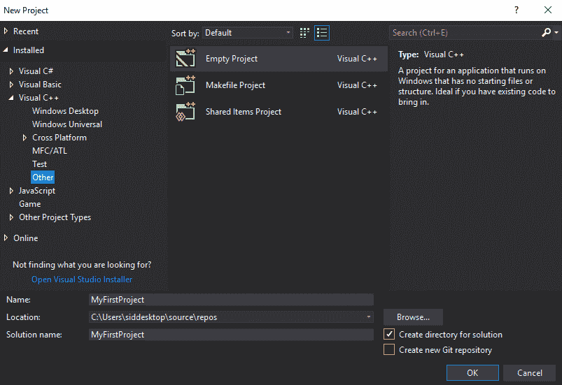

1.  项目创建后，在 Solution Explorer 中，右键单击并选择 Add | New Item：

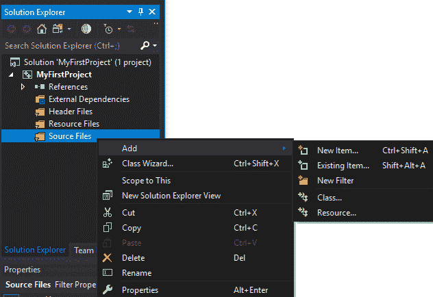

1.  创建一个新的`.cpp`文件，称为`Source`文件：

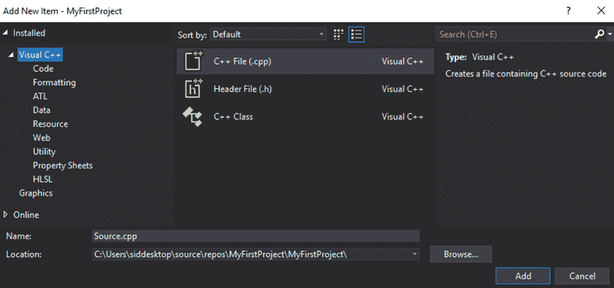

1.  将该节开始的代码复制到`Source.cpp`文件中。

1.  现在按键盘上的*F5*键或按窗口顶部的 Local Window Debugger 按钮来运行应用程序。

1.  运行程序时，应该会弹出一个控制台窗口。为了使控制台保持打开状态，以便我们可以看到正在发生的事情，请将以下突出显示的行添加到代码中：

```cpp
#include <iostream> 
#include <conio.h>
// Program prints out "Hello, World" to screen 
int main() 
{ 
   std::cout << "Hello, World." << std::endl;       
    _getch();
   return 0; 
} 

```

`_getch()`的作用是使程序暂停并等待控制台输入字符，而不将字符打印到控制台。因此，程序将等待一些输入然后关闭控制台。

要查看打印到控制台的内容，我们只需添加它以方便使用。要使用此功能，我们需要包含`conio.h`头文件。

1.  当你再次运行项目时，你将看到以下输出：

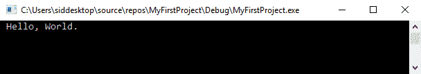

现在我们知道了如何运行一个基本程序，让我们看看 C++中包含的不同数据类型。

# 变量

变量用于存储值。你存储在变量中的任何值都存储在与之关联的内存位置。你可以使用以下语法给变量赋值。

我们可以先通过指定类型和变量名来声明变量类型：

```cpp
Type variable;
```

在这里，`type`是变量类型，`variable`是变量的名称。

接下来，我们可以给变量赋值：

```cpp
Variable = value;
```

现在这个值已经赋给了变量。

或者，你可以在一行中同时声明变量并给它赋值，如下所示：

```cpp
type variable = value;
```

在设置变量之前，你必须指定变量类型。然后你可以使用等号（`=`）给变量赋值。

让我们看看一些示例代码：

```cpp
#include <iostream> 
#include <conio.h>
// Program prints out value of n to screen 
int main() 
{ 
   int n = 42;  
std::cout <<"Value of n is: "<< n << std::endl;     
    _getch();
   return 0; 
} 
```

在`Source.cpp`中将之前的代码替换为以下代码并运行应用程序。你应该得到以下输出：

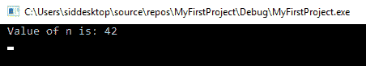

在这个程序中，我们指定数据类型为`int`。`int`是 C++数据类型，可以存储整数。因此，它不能存储小数。我们声明一个名为`n`的变量，并将其赋值为`42`。不要忘记在行尾添加分号。

在下一行，我们将值打印到控制台。请注意，为了打印`n`的值，我们只需在`cout`中传递`n`，而无需添加引号。

在 32 位系统上，`int`变量使用 4 个字节（等于 32 位）的内存。这基本上意味着`int`数据类型可以存储从 0 到 2³²-1（4,294,967,295）的值。然而，需要一个位来描述值的符号（正或负），这留下了 31 位来表示实际值。因此，有符号的`int`可以存储从-2³¹（-2,147,483,648）到 2³¹-1（2,147,483,647）的值。

让我们看看其他一些数据类型：

+   `bool`：布尔值只能有两个值。它可以存储`true`或`false`。

+   `char`：这些存储介于 *-128* 和 *127* 之间的整数。请注意，`char`或字符变量用于存储 ASCII 字符，例如单个字符——例如字母。

+   `short`和`long`：这些也是整数类型，但它们能够存储比`int`更多的信息。`int`的大小依赖于系统，而`long`和`short`的大小不依赖于使用的系统。

+   `float`：这是一个浮点类型。这意味着它可以存储带有小数点的值，例如 3.14、0.000875 和-9.875。它可以存储最多七位小数的值。

+   `double`：这是一个精度更高的`float`类型。它可以存储最多 15 位小数的十进制值。

| **数据类型** | **最小值** | **最大值** | **大小（字节）** |
| --- | --- | --- | --- |
| `bool` | `false` | `true` | 1 |
| `char` | -128 | 127 | 1 |
| `short` | -32768 | 32767 | 2 |
| `int` | -2,147,483,648 | 2,147,483,647 | 4 |
| `long` | -2,147,483,648 | 2,147,483,647 | 4 |
| `float` | 3.4 x 10^-38 | 3.4 x 10³⁸ | 4 |
| `double` | 1.7 x 10^-308 | 1.7 x 10³⁰⁸ | 8 |

你还有相同数据类型的无符号数据类型，用于最大化它们可以存储的值的范围。无符号数据类型用于存储正值。因此，所有无符号值都从 0 开始。

因此，`char`和`unsigned char`可以存储从*0*到*255*的正值。与`unsigned char`类似，我们还有`unsigned short`、`int`和`long`。

你可以像下面这样给`bool`、`char`和`float`赋值：

```cpp
#include <iostream> 
#include <conio.h> 
// Program prints out value of bool, char and float to screen 
int main() 
{ 
   bool a = false; 
   char b = 'b'; 
   float c = 3.1416f; 
   unsigned int d = -82; 

   std::cout << "Value of a is : " << a << std::endl; 
   std::cout << "Value of b is : " << b << std::endl; 
   std::cout << "Value of c is : " << c << std::endl; 
   std::cout << "Value of d is : " << d << std::endl; 

   _getch(); 
   return 0; 
} 
```

这是运行应用程序时的输出结果：

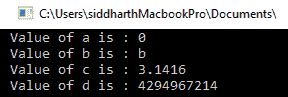

除了`d`之外，所有内容打印都很正常，`d`被分配了`-82`。这里发生了什么？嗯，这是因为`d`只能存储无符号值，所以如果我们给它分配`-82`，它就会得到一个垃圾值。将其更改为不带负号的`82`，它就会打印出正确的值：

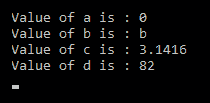

与`int`不同，`bool`存储一个二进制值，其中`false`是`0`，`true`是`1`。所以，当你打印出`true`和`false`的值时，输出将分别是`1`和`0`。

基本上，`char`存储用单引号指定的字符，带有小数点的值以你存储在浮点数中的方式打印。在分配`float`时，在值末尾添加一个`f`，以告诉系统它是一个浮点数而不是双精度数。

# 字符串

非数值变量要么是一个字符，要么是一系列称为字符串的字符。在 C++中，一系列字符可以存储在一个特殊变量中，称为字符串。字符串通过标准`string`类提供。

为了声明和使用`string`对象，我们必须包含字符串头文件。在`#include <conio.h>`之后，还要在文件顶部添加`#include <string>`。

字符串变量声明的方式与其他变量类型相同，只是在字符串类型之前你必须使用`std`命名空间。

如果你不喜欢添加`std::`命名空间前缀，你还可以在`#include`之后添加使用`std`命名空间的行。这样，你就不需要添加`std::`前缀，因为程序没有它也能很好地理解。然而，它和其他变量一样可以打印出来：

```cpp
#include <iostream> 
#include <conio.h> 
#include <string> 

// Program prints out values to screen 

int main() 
{ 

   std::string name = "The Dude"; 

   std::cout << "My name is: " << name << std::endl; 

   _getch(); 
   return 0; 
} 
```

这里是输出结果：

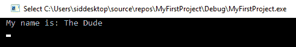

# 运算符

运算符是一个符号，它在变量或表达式上执行某种操作。到目前为止，我们已经使用了`=`符号，它调用一个赋值运算符，将等号右侧的值或表达式赋给等号左侧的变量。

其他种类运算符的最简单形式是算术运算符，如`+`、`-`、`*`、`/`和`%`。这些运算符作用于变量，如`int`和`float`。让我们看看这些运算符的一些用法示例：

```cpp
#include <iostream> 
#include <conio.h> 
// Program prints out value of a + b and x + y to screen 
int main() 
{ 
   int a = 8; 
   int b = 12; 
   std::cout << "Value of a + b is : " << a + b << std::endl; 

   float x = 7.345f; 
   float y = 12.8354; 
   std::cout << "Value of x + y is : " << x + y << std::endl; 

   _getch(); 
   return 0; 
} 
```

这个输出的结果如下：

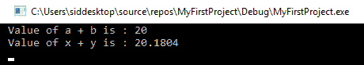

让我们看看其他操作的示例：

```cpp
#include <iostream> 
#include <conio.h> 

// Program prints out values to screen 

int main() 
{ 
   int a = 36; 
   int b = 5; 

   std::cout << "Value of a + b is : " << a + b << std::endl; 
   std::cout << "Value of a - b is : " << a - b << std::endl; 
   std::cout << "Value of a * b is : " << a * b << std::endl; 
   std::cout << "Value of a / b is : " << a / b << std::endl; 
   std::cout << "Value of a % b is : " << a % b << std::endl; 

   _getch(); 
   return 0; 
} 
```

输出结果如下：

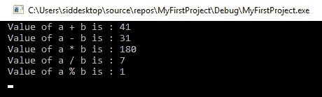

`+`、`-`、`*`和`/`符号是自解释的。然而，还有一个算术运算符：`%`，称为取模运算符。它返回除法的余数。

5 在 36 中包含多少次？答案是 7 次，余数为 1。这就是为什么结果是 1 的原因。

除了算术运算符之外，我们还有增量/减量运算符。

在编程中，我们经常递增变量。你可以用 `a=a+1;` 来递增，用 `a=a-1;` 来递减变量值。或者，你也可以用 `a+=1;` 和 `a-=1;` 来递增和递减，但在 C++ 编程中，有一个更短的方法来做这件事，那就是使用 `++` 和 `--` 符号来递增和递减变量的值 `1`。

让我们看看如何使用它来递增和递减一个值 `1` 的例子：

```cpp
#include <iostream> 
#include <conio.h> 

// Program prints out values to screen 

int main() 
{ 

   int a = 36; 
   int b = 5; 

   std::cout << "Value of ++a is : " << ++a << std::endl; 
   std::cout << "Value of --b is : " << --b << std::endl; 

   std::cout << "Value of a is : " << a << std::endl; 
   std::cout << "Value of b is : " << b << std::endl; 

   _getch(); 
   return 0; 
} 
```

这个输出的结果如下：

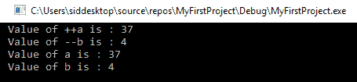

因此，`++` 或 `--` 运算符永久地递增值。如果 `++` 运算符在变量左侧，它被称为前递增运算符。如果它放在后面，它被称为后递增运算符。两者之间有一点区别。如果我们把 `++` 放在另一边，我们得到以下输出：

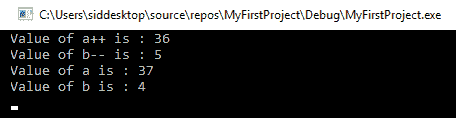

在这种情况下，`a` 和 `b` 在下一行中递增和递减。所以，当你打印这些值时，它会打印出正确的结果。

在这个简单的例子中，这没有区别，但总的来说，它确实有区别，了解这个区别是好的。在这本书中，我们将主要使用后递增运算符。

事实上，这就是 C++ 得名的原因；它是 C 的一个增量。

除了算术、递增和递减运算符之外，你还有逻辑和比较运算符。

逻辑运算符如下表所示：

| **运算符** | **操作** |
| --- | --- |
| `!` | 非 |
| `&&` | 与 |
| `&#124;&#124;` | 或 |

这里是比较运算符：

| **运算符** | **比较** |
| --- | --- |
| `==` | 等于 |
| `!=` | 不等于 |
| `<` | 小于 |
| `>` | 大于 |
| `<=` | 小于等于 |
| `>=` | 大于等于 |

我们将在下一节中介绍这些运算符。

# 语句

一个程序可能不总是线性的。根据你的需求，你可能需要分支或分叉，重复一组代码，或者做出决定。为此，有条件语句和循环。

在条件语句中，你检查一个条件是否为真。如果是，你将执行该语句。

第一个条件语句是 `if` 语句。这个语句的语法如下：

```cpp
If (condition) statement; 

```

让我们看看如何在以下代码中使用它。这里我们使用一个比较运算符：

```cpp
#include <iostream> 
#include <conio.h> 

// Program prints out values to screen 

int main() 
{ 
   int a = 36; 
   int b = 5; 

   if (a > b) 
   std::cout << a << " is greater than " << b << std::endl; 

   _getch(); 
   return 0; 
} 

```

输出如下：

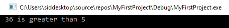

我们检查 `a` 是否大于 `b`，如果条件为真，则打印出该语句。

但如果情况相反呢？为此，我们有 `if...else` 语句，这是一个基本上执行替代语句的语句。其语法如下：

```cpp
if (condition) statement1; 
else statement2; 
```

让我们通过代码来看看：

```cpp
#include <iostream> 
#include <conio.h> 

// Program prints out values to screen 

int main() 
{ 

   int a = 2; 
   int b = 28; 

   if (a > b) 
   std::cout << a << " is greater than " << b << std::endl; 
   else 
   std::cout << b << " is greater than " << a << std::endl; 

   _getch(); 
   return 0; 
}
```

在这里，`a` 和 `b` 的值被改变，使得 `b` 大于 `a`：


注意一点是，在 `if` 和 `else` 条件之后，C++ 将执行单行语句。如果有多个语句在 `if` 或 `else` 之后，则这些语句需要用大括号括起来，如下所示：

```cpp

   if (a > b) 
   {      
         std::cout << a << " is greater than " << b << std::endl; 
   } 
   else 
   { 
         std::cout << b << " is greater than " << a << std::endl; 
   }    
```

在使用 `else if` 之后，也可以有 `if` 语句：

```cpp
#include <iostream> 
#include <conio.h> 

// Program prints out values to screen 

int main() 
{ 

   int a = 28; 
   int b = 28; 

   if (a > b) 
   {      
         std::cout << a << " is greater than " << b << std::endl; 
   } 
   else if (a == b)  
{ 

         std::cout << a << " is equal to " << b << std::endl; 
   } 
   else 
   { 
         std::cout << b << " is greater than " << a << std::endl; 
   } 

   _getch(); 
   return 0; 
} 
```

输出如下所示：

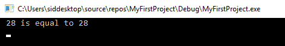

# 迭代

迭代是重复调用相同语句的过程。C++ 有三个迭代语句：`while`、`do...while` 和 `for` 语句。迭代也常被称为循环。

`while` 循环的语法如下所示：

```cpp
while (condition) statement;
```

让我们看看它的实际操作：

```cpp
#include <iostream> 
#include <conio.h>  
// Program prints out values to screen  
int main() 
{  
   int a = 10;  
   int n = 0;  
   while (n < a) { 

         std::cout << "value of n is: " << n << std::endl;  
         n++;    
   } 
   _getch(); 
   return 0;  
} 
```

这是此代码的输出：

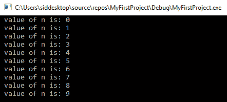

在这里，`n` 的值会被打印到控制台，直到满足条件为止。

`do while` 语句几乎与 `while` 语句相同，只是在这种情况下，首先执行语句，然后测试条件。语法如下：

```cpp
do statement  
while (condition); 
```

你可以自己尝试并查看结果。

编程中最常用的循环是 `for` 循环。其语法如下所示：

```cpp
for (initialization; continuing condition; update) statement; 
```

`for` 循环非常自包含。在 `while` 循环中，我们必须在 `while` 循环外部初始化 `n`，但在 `for` 循环中，初始化是在 `for` 循环的声明中完成的。

这里是与 `while` 循环相同的示例，但使用的是 `for` 循环：

```cpp
#include <iostream> 
#include <conio.h>  
// Program prints out values to screen  
int main() 
{  
   for (int n = 0; n < 10; n++)       
         std::cout << "value of n is: " << n << std::endl;  
   _getch(); 
   return 0; 
} 
```

输出与 `while` 循环相同，但与 `while` 循环相比，代码更加紧凑。此外，`n` 在 `for` 循环体中是局部作用域。

我们也可以将 `n` 增加 `2` 而不是 `1`，如下所示：

```cpp
#include <iostream> 
#include <conio.h> 

// Program prints out values to screen  
int main() 
{  
   for (int n = 0; n < 10; n+=2)      
         std::cout << "value of n is: " << n << std::endl; 
   _getch(); 
   return 0; 
} 
```

这是此代码的输出：

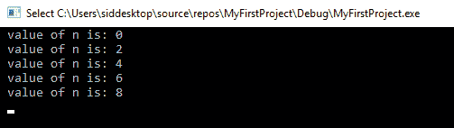

# 跳转语句

除了条件和迭代语句，你还有 `break` 和 `continue` 语句。

`break` 语句用于跳出迭代。如果满足某个条件，我们可以离开循环并强制其退出。

让我们看看 `break` 语句的使用情况：

```cpp
#include <iostream> 
#include <conio.h>  
// Program prints out values to screen  
int main() 
{  
   for (int n = 0; n < 10; n++) 
   {         
         if (n == 5) {               
               std::cout << "break" << std::endl; 
               break; 
         } 
         std::cout << "value of n is: " << n << std::endl; 
   }  
   _getch(); 
   return 0; 
} 
```

此输出的结果如下所示：

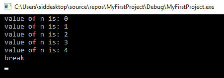

`continue` 语句将跳过当前迭代，并继续执行直到循环结束的语句。在 `break` 代码中，将 `break` 替换为 `continue` 以查看差异：

```cpp
#include <iostream> 
#include <conio.h> 

// Program prints out values to screen 

int main() 
{ 

   for (int n = 0; n < 10; n++) 
   { 
         if (n == 5) { 

               std::cout << "continue" << std::endl; 

               continue; 
         } 
         std::cout << "value of n is: " << n << std::endl; 
   } 
   _getch(); 
   return 0; 
} 
```

当将 `break` 替换为 `continue` 时，这是输出结果：

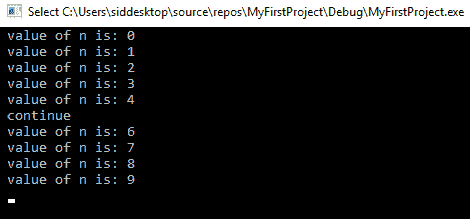

# Switch 语句

最后一个语句是 `switch` 语句。`switch` 语句检查多个值的几种情况，如果值与表达式匹配，则执行相应的语句并退出 `switch` 语句。如果没有找到任何值，则输出默认语句。

其语法如下所示：

```cpp
switch( expression){ 

case constant1:  statement1; break; 
case constant2:  statement2; break; 
. 
. 
. 
default: default statement; break;  

}  
```

这看起来与 `else if` 语句非常相似，但更为复杂。以下是一个示例：

```cpp
#include <iostream> 
#include <conio.h> 

// Program prints out values to screen 

int main() 
{ 
   int a = 28; 

   switch (a) 
   { 
   case 1: std::cout << " value of a is " << a << std::endl; break; 
   case 2: std::cout << " value of a is " << a << std::endl; break; 
   case 3: std::cout << " value of a is " << a << std::endl; break; 
   case 4: std::cout << " value of a is " << a << std::endl; break; 
   case 5: std::cout << " value of a is " << a << std::endl; break; 
   default: std::cout << " value a is out of range " << std::endl; break; 
   } 

   _getch(); 
   return 0; 
} 
```

输出如下所示：

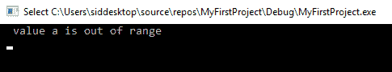

将`a`的值改为等于`2`，你就会看到当`2`的情况正确时，它会打印出该语句。

还要注意，添加`break`语句是很重要的。如果你忘记添加它，那么程序将无法跳出该语句。

# 函数

到目前为止，我们已经在`main`函数中编写了所有的代码。如果你只做一项任务，这是可以的，但一旦你开始用程序做更多的事情，代码就会变得更大，随着时间的推移，所有内容都会在`main`函数中，这会显得非常混乱。

使用函数，你可以将你的代码拆分成更小、更易于管理的块。这将使你能够更好地组织你的程序。

函数有以下语法：

```cpp
type function name (parameter1, parameter2) {statements;}
```

从左到右，这里的`type`是返回类型。在执行一个语句之后，函数能够返回一个值。这个值可以是任何类型，所以我们在这里指定一个类型。函数一次只能有一个变量。

函数名就是函数本身的名称。

然后，在括号内，你将传入参数。这些参数是传递给函数的特定类型的变量，以便执行特定功能。

这里有一个例子：传入两个参数，但你可以传入你想要的任何数量的参数。你可以在每个函数中传入多个参数，每个参数之间用逗号分隔。

让我们看看这个例子：

```cpp
#include <iostream> 
#include <conio.h> 

// Program prints out values to screen 

void add(int a, int b)  
{ 
   int c = a + b; 

   std::cout << "Sum of " << a << " and " << b << " is " << c <<   
   std::endl;  
}  
int main() 
{ 
   int x = 28; 
   int y = 12; 

   add(x, y); 

   _getch(); 
   return 0; 
}   
```

在这里，我们创建了一个名为`add`的新函数。目前，请确保在`main`函数之前添加函数；否则，`main`将不知道函数的存在。

`add`函数不返回任何内容，所以我们使用`void`关键字在函数的开始处。并不是所有的函数都必须返回一个值。接下来，我们命名函数为`add`，然后传入两个参数，这两个参数是`int`类型的`a`和`b`。

在函数中，我们创建了一个名为`c`的新变量，其类型为`int`，将传入的参数值相加，并将其赋值给`c`。新的`add`函数最终会打印出`c`的值。

此外，在`main`函数中，我们创建了两个名为`x`和`y`的`int`类型变量，调用了`add`函数，并将`x`和`y`作为参数传入。

当我们调用函数时，我们将`x`的值传递给`a`，将`y`的值传递给`b`，它们相加并存储在`c`中，得到以下输出：


当你创建新的函数时，请确保它们写在`main`函数之上；否则，它将看不到函数，编译器会抛出错误。

现在，让我们再写一个函数。这次，我们将确保函数返回一个值。创建一个名为`multiply`的新函数，如下所示：

```cpp
int multiply(int a, int b) { 

   return a * b; 

}
```

在`main`函数中，在调用`add`函数之后，添加以下行：

```cpp
   add(x, y); 

   int c = multiply(12, 32); 

   std::cout << "Value returned by multiply function is: " << c <<  
   std::endl; 
```

在 `multiply` 函数中，我们有一个返回类型为 `int`，因此函数在函数末尾期望有一个返回值，我们使用 `return` 关键字返回。返回值是 `a` 变量与 `b` 变量的乘积。

在 `main` 函数中，我们创建了一个名为 `c` 的新变量；调用 `multiply` 函数并传入 `12` 和 `32`。在乘法之后，返回值将被分配给 `c` 的值。之后，我们在 `main` 函数中打印出 `c` 的值。

这个输出的结果如下：

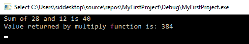

我们可以有一个具有相同名称的函数，但我们可以传入不同的变量或不同数量的变量。这被称为**函数重载**。

创建一个名为 `multiply` 的新函数，但这次传入浮点数并设置返回值为浮点数：

```cpp
float multiply(float a, float b) { 

   return a * b; 

} 
```

这被称为函数重载，其中函数名称相同，但它接受不同类型的参数。

在 `main` 函数中，在我们打印了 `c` 的值之后，添加以下代码：

```cpp
float d = multiply(8.352f, -12.365f); 
std::cout << "Value returned by multiply function is: " << d << std::endl;
```

那么，浮点值后面的这个 `f` 是什么意思呢？嗯，`f` 只是将双精度浮点数转换为浮点数。如果我们不加 `f`，编译器将把值视为双精度浮点数。

当你运行程序时，你会得到打印出的 `d` 的值：

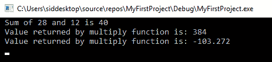

# 变量的作用域

你可能已经注意到，在程序中现在有两个名为 `c` 的变量。`main` 函数中有一个 `c`，`add` 函数中也有一个 `c`。它们都命名为 `c` 但值却不同，这是怎么回事？

在 C++ 中，存在局部变量的概念。这意味着变量的定义仅限于其定义的局部代码块内。因此，`add` 函数中的 `c` 变量与 `main` 函数中的 `c` 变量处理方式不同。

还有全局变量，需要在函数或代码块外部声明。任何写在花括号之间的代码都被认为是代码块。因此，要使变量成为全局变量，它需要位于程序的主体中，或者它需要在函数的代码块外部声明。

# 数组

到目前为止，我们只看了单个变量，但如果我们想将一些变量分组在一起呢？比如一个班级所有学生的年龄。你可以继续创建单独的变量，`a`、`b`、`c`、`d` 等等，要访问每个变量，你必须调用它们，这很麻烦，因为你不知道它们持有的数据类型。

为了更好地组织数据，我们可以使用数组。数组使用连续的内存空间按顺序存储值，你可以使用索引号访问每个元素。

数组的语法如下：

```cpp
type name [size] = { value0, value1, ....., valuesize-1};
```

因此，我们可以如下存储五个学生的年龄：

```cpp
int age[5] = {12, 6, 18 , 7, 9 }; 
```

当创建具有固定数量值的数组时，你不必指定大小，但这样做是个好主意。要访问每个值，我们使用从 `0` 到 `4` 的索引作为第一个元素，其值为 `12` 在第 *0*^(th) 索引处，以及最后一个元素，`9` 在第四个索引处。

让我们看看如何在代码中使用它：

```cpp
#include <iostream> 
#include <conio.h> 

// Program prints out values to screen 
int main() 
{ 
   int age[5] = { 12, 6, 18 , 7, 9 }; 

   std::cout << "Element at the 0th index " << age[0]<< std::endl; 
   std::cout << "Element at the 4th index " << age[4] << std::endl; 

   _getch(); 
   return 0; 
} 
```

输出如下：

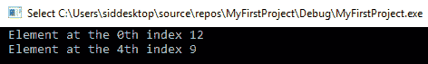

要访问数组中的每个元素，你可以使用 `or` 循环：

```cpp
#include <iostream> 
#include <conio.h> 

// Program prints out values to screen 
int main() 
{ 
   int age[5] = { 12, 6, 18 , 7, 9 }; 

   for (int i = 0; i < 5; i++) { 

         std::cout << "Element at the "<< i << "th index is: " << 
         age[i] << std::endl;  
   }  
   _getch(); 
   return 0; 
} 
```

输出如下：

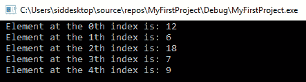

我们不是调用 `age[0]` 等等，而是使用 `for` 循环本身的 `i` 索引，并将其传递到 `age` 数组中以打印出索引和存储在该索引处的值。

`age` 数组是一维数组。在图形编程中，我们看到了我们使用二维数组，这通常是一个 4x4 矩阵。让我们看看二维 4x4 数组的示例。二维数组定义如下：

```cpp
int matrix[4][4] = {
{2, 8, 10, -5},
{15, 21, 22, 32},
{3, 0, 19, 5},
{5, 7, -23, 18}
};
```

要访问每个元素，你使用嵌套的 `for` 循环。

让我们在以下代码中看看这个：

```cpp
#include <iostream> 
#include <conio.h> 

// Program prints out values to screen 
int main() 
{ 

   int matrix[4][4] = { 
                              {2, 8, 10, -5}, 
                              {15, 21, 22, 32}, 
                              {3, 0, 19, 5}, 
                              {5, 7, -23, 18} 
   }; 

   for (int x = 0; x < 4; x++) { 
         for (int y = 0; y < 4; y++) { 
               std::cout<< matrix[x][y] <<" "; 
         } 
         std::cout<<""<<std::endl; 
   } 

   _getch(); 
   return 0; 
} 
```

输出如下：

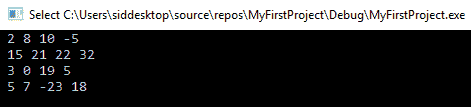

作为测试，创建两个矩阵并尝试执行矩阵乘法。

你甚至可以将数组作为参数传递给函数，以下是一个示例。

这里，`matrixPrinter` 函数不返回任何内容，而是打印出 4x4 矩阵中每个元素存储的值：

```cpp
#include <iostream> 
#include <conio.h> 

void matrixPrinter(int a[4][4]) { 

   for (int x = 0; x < 4; x++) { 
         for (int y = 0; y < 4; y++) { 
               std::cout << a[x][y] << " "; 
         } 
         std::cout << "" << std::endl; 
   } 
} 

// Program prints out values to screen 
int main() 
{ 

   int matrix[4][4] = { 
                            {2, 8, 10, -5}, 
                            {15, 21, 22, 32}, 
                            {3, 0, 19, 5}, 
                            {5, 7, -23, 18} 
   }; 

   matrixPrinter(matrix); 

   _getch(); 
   return 0; 
} 

```

我们甚至可以使用 `char` 数组来创建一个单词字符串。与 `int` 和 `float` 数组不同，数组中的字符不必放在花括号内，也不需要用逗号分隔。

要创建一个字符数组，你定义如下：

```cpp
   char name[] = "Hello, World !"; 
```

你可以通过调用数组的名称来打印出值，如下所示：

```cpp
#include <iostream> 
#include <conio.h> 

// Program prints out values to screen 
int main() 
{ 

   char name[] = "Hello, World !"; 

   std::cout << name << std::endl; 

   _getch(); 
   return 0; 
} 
```

输出如下：

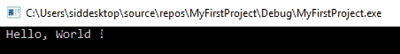

# 指针

每当我们声明新变量以便在其中存储值时，我们实际上向操作系统发送一个内存分配请求。如果剩余足够的空闲内存，操作系统将尝试为我们的应用程序保留一块连续的内存。

当我们想要访问存储在该内存空间中的值时，我们调用变量名。

我们不必担心存储值的内存位置。然而，如果我们想获取变量存储位置的地址呢？

定位变量在内存中的地址称为变量的引用。要访问此，我们使用 `&` 操作符的地址。要获取地址位置，我们将操作符放在变量之前。

指针是变量，就像任何其他变量一样，它们用于存储一个值；然而，这种特定的变量类型允许存储另一个变量的地址——即引用。

在 C/C++中，每个变量也可以通过在其变量名前加一个星号（`*`）来声明为指针，该指针持有对特定数据类型值的引用。这意味着，例如，`int`指针持有对可能存储`int`值的内存地址的引用。

指针可以用在任何内置或自定义数据类型上。如果我们访问`pointer`变量的值，我们只会得到它引用的内存地址。因此，为了访问`pointer`变量引用的实际值，我们必须使用所谓的解引用运算符（`*`）。

如果我们有一个名为`age`的变量并将其赋值，为了获取引用地址位置，我们使用`&age`来存储这个地址。为了存储引用地址，我们不能只是使用常规变量；我们必须使用指针变量，并在它之前使用解引用运算符来访问地址，如下所示：

```cpp
   int age = 10;  
   int *location = &age; 
```

这里，指针位置将存储`age`变量值存储的地址。

如果我们打印`location`的值，我们将得到存储`age`的引用地址：

```cpp
#include <iostream> 
#include <conio.h>  
// Program prints out values to screen 
int main() 
{  
   int age = 10;  
   int *location = &age; 
   std::cout << location << std::endl;  
   _getch(); 
   return 0; 
} 
```

这是输出：

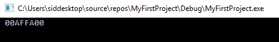

这个值对于你可能不同，因为位置会因机器而异。

要获取`location`变量本身存储的位置，我们可以同时打印出`&location`。

这是变量在我的系统内存中的内存位置：


让我们再看另一个例子：

```cpp
#include <iostream> 
#include <conio.h> 

// Program prints out values to screen 
int main() 
{ 
   int age = 18; 
   int *pointer; 

   pointer = &age; 

   *pointer = 12; 

   std::cout << age << std::endl; 

   _getch(); 
   return 0; 
}  
```

这里，我们创建了两个`int`变量；一个是常规的`int`，另一个是指针类型。

我们首先将`age`变量设置为`18`，然后设置`age`的地址，并将其分配给名为`pointer`的指针变量。

现在，`int`指针正指向存储`age`变量`int`值的同一地址。

接下来，在`pointer`变量上使用解引用运算符，以获得对引用地址存储的`int`值的访问，并将当前值更改为`12`。

现在，当我们打印出`age`变量的值时，我们将看到前面的语句确实改变了`age`变量的值。空指针是一个不指向任何内容的指针，其设置如下：

```cpp
   int *p = nullptr; 
```

指针与数组紧密相关。因为数组不过是连续的内存序列，所以我们可以使用指针与它们一起使用。

考虑我们在数组部分提到的数组示例：

```cpp
int age[5] = { 12, 6, 18 , 7, 9 }; 
```

我们可以不用索引，而是用指针指向数组中的值。

考虑以下代码：

```cpp
#include <iostream> 
#include <conio.h> 

// Program prints out values to screen 
int main() 
{ 
   int *p = nullptr; 
   int age[5] = { 12, 6, 18 , 7, 9 }; 

   p = age; 

   std::cout << *p << std::endl; 

   p++; 

   std::cout << *p << std::endl; 

   std::cout << *(p + 3) << std::endl; 

std::cout << *p << std::endl; 

   _getch(); 
   return 0; 
} 
```

在`main`函数中，我们创建了一个名为`pointer`的指针，以及一个包含五个元素的数组。我们将数组分配给指针。这导致指针获取数组第一个元素的地址。因此，当我们打印指针指向的值时，我们得到数组的第一个元素的值。

使用`指针`，我们也可以像常规`int`一样递增和递减。然而，与常规`int`递增不同，当你递增指针时，它会增加变量的值，而指针会指向下一个内存位置。所以，当我们递增`p`时，它现在指向数组的下一个内存位置。递增和递减指针意味着将引用的地址移动一定数量的字节。字节数取决于用于`指针`变量的数据类型。

在这里，指针是`int`类型，所以当我们移动指针一个单位时，它移动 4 个字节并指向下一个整数。当我们打印`p`现在指向的值时，它打印第二个元素的值。

我们也可以通过获取指针的当前位置并添加到它，使用`*(p + n)`来获取数组中其他元素的价值，其中`n`是从当前位置获取的*第 n*个数字。所以，当我们做`*(p + 3)`时，我们将从`p`当前指向的位置获取第三个元素。由于`p`递增到了第二个元素，从第二个元素开始的第三个元素是第五个元素，因此打印出第五个元素的价值。

然而，这并没有改变`p`指向的位置，它仍然是第二个位置。

这是输出的结果：

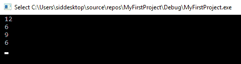

# 结构体

结构体或`struct`用于将数据组合在一起。一个`struct`可以包含不同的数据元素，称为成员，整数、浮点数、字符等。你可以创建许多类似`struct`的对象，并在`struct`中存储值以进行数据管理。

`struct`的语法如下：

```cpp
struct name{ 

type1 name1; 
type2 name2; 
. 
. 
} ; 

```

可以如下创建`struct`对象：

```cpp
struct_name     object_name; 
```

一个对象是`struct`的一个实例，在创建`struct`时我们可以将属性分配给创建的数据类型。以下是一个例子。

在你想要维护学生年龄和班级身高数据库的情况下，你的`struct`定义将如下所示：

```cpp
struct student { 

   int age; 
   float height; 

}; 
```

现在你可以创建一个对象数组并存储每个学生的值：

```cpp
int main() 
{ 

   student section[3]; 

   section[0].age = 17; 
   section[0].height = 39.45f; 

   section[1].age = 12; 
   section[1].height = 29.45f; 

   section[2].age = 8; 
   section[2].height = 13.45f; 

   for (int i = 0; i < 3; i++) { 

         std::cout << "student " << i << " age: " << section[i].age << 
           " height: " << section[i].height << std::endl; 
   } 

   _getch(); 
   return 0; 
} 
```

这是输出的结果：

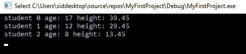

# 枚举

枚举用于在列表中列举项目。当比较项目时，比较名称比仅仅比较数字更容易。例如，一周中的日子是星期一到星期日。在一个程序中，我们将星期一分配给 0，星期二分配给 1，星期日分配给 7，例如。要检查今天是否是星期五，你必须数到并到达 5。然而，检查`Today == Friday`不是更容易吗？

为了这个，我们有枚举，声明如下：

```cpp
enum name{ 
value1, 
value2, 
. 
. 
. 
};
```

因此，在我们的例子中，它可能看起来像这样：

```cpp
#include <iostream> 
#include <conio.h> 

// Program prints out values to screen 

enum Weekdays { 
   Monday = 0, 
   Tuesday, 
   Wednesday, 
   Thursday, 
   Friday, 
   Saturday, 
   Sunday, 
}; 

int main() 
{ 

   Weekdays today; 

   today = Friday; 

   if (today == Friday) { 
         std::cout << "The weekend is here !!!!" << std::endl; 
   } 

   _getch(); 
   return 0; 
} 
```

这个输出的结果如下：

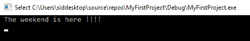

还要注意，`Monday = 0`。如果我们不使用初始化器，第一个项目的值将被设置为 `0`。每个后续未使用初始化器的项目将使用前一个项目的值加上 `1` 作为其值。

# 类

在 C++ 中，结构和类是相同的。你可以用它们做完全一样的事情。唯一的区别是默认的访问修饰符：结构为 `public`，类为 `private`。

类的声明如下所示：

```cpp
class name{ 

access specifier: 

name(); 
~name(); 

member1; 
member2; 

} ; 
```

类以 `class` 关键字开头，后跟类的名字。

在类中，我们首先指定访问修饰符。有三个访问修饰符：`public`、`private` 和 `protected`：

+   `public`：所有成员在任何地方都可以访问。

+   `private`：成员仅可以从类内部访问。

+   `protected`：成员可以被继承自该类的其他类访问。

默认情况下，所有成员都是私有的。

此外，`name();` 和 `~name();` 被称为类的构造函数和析构函数。它们的名字与类的名字本身相同。

构造函数是一个特殊函数，当创建类的新的对象时会被调用。析构函数在对象被销毁时被调用。

我们可以自定义构造函数来在使用成员变量之前设置值。这被称为构造函数重载。

注意，尽管构造函数和析构函数是函数，但它们没有提供返回值。这是因为它们不是为了返回值而存在的。

让我们看看一个类的例子，我们创建了一个名为 `shape` 的类。这个类有两个成员变量 `a` 和 `b` 的边，以及一个成员函数，该函数计算并打印面积：

```cpp
class shape {  
   int a, b;  
public: 

   shape(int _length, int _width) { 
         a = _length;  
         b = _width; 

         std::cout << "length is: " << a << " width is: " << b << 
                      std::endl; 
   } 

   void area() { 

         std::cout << "Area is: " << a * b << std::endl; 
   } 
}; 
```

我们通过创建类的对象来使用类。

这里，我们创建了两个对象，分别称为 `square` 和 `rectangle`。我们通过调用自定义构造函数来设置值，该构造函数设置 `a` 和 `b` 的值。然后，我们通过使用点操作符（在键盘上按下 `.` 按钮后输入对象的名字）调用对象的 `area` 函数：

```cpp
int main() 
{  
   shape square(8, 8); 
   square.area(); 

   shape rectangle(12, 20); 
   rectangle.area(); 

   _getch(); 
   return 0; 
} 
```

输出如下所示：

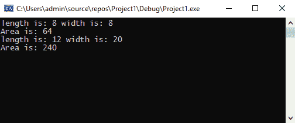

# 继承

C++ 的一个关键特性是继承，通过它可以创建从其他类派生出来的类，这样派生类或子类会自动包含其父类的一些成员变量和函数。

例如，我们研究了 `shape` 类。从这一点出发，我们可以有一个名为 `circle` 的单独类，另一个名为 `triangle` 的类，它具有与其他形状相同的属性，例如面积。

继承类的语法如下所示：

```cpp
class inheritedClassName: accessSpecifier parentClassName{ 

};   
```

注意，`accessSpecifier` 可以是 `public`、`private` 或 `protected`，具体取决于你想要提供给父成员变量和函数的最小访问级别。

让我们看看继承的一个例子。考虑相同的 `shape` 类，它将是父类：

```cpp
class shape { 

protected:  
   float a, b;  
public: 
    void setValues(float _length, float _width) 
   { 
         a = _length; 
         b = _width; 

         std::cout << "length is: " << a << " width is: " << b <<  
         std::endl; 
   }  
   void area() {  
         std::cout << "Area is: " << a * b << std::endl; 
   } 

}; 
```

由于我们希望`triangle`类能够访问父类的`a`和`b`，我们必须将访问修饰符设置为 protected，如前所述；否则，它将默认设置为 private。除此之外，我们还更改了数据类型为 float 以获得更高的精度。完成这些后，我们创建了一个名为`setValues`的函数来设置`a`和`b`的值。然后我们创建了一个`shape`类的子类，命名为`triangle`：

```cpp
class triangle : public shape { 

public: 
   void area() { 

         std::cout << "Area of a Triangle is: " << 0.5f * a * b << 
                      std::endl; 
   } 

}; 
```

由于从`shape`类继承，我们不需要添加`a`和`b`成员变量，也不需要添加`setValues`成员函数，因为这些是从`shape`类继承的。我们只需添加一个名为`area`的新函数，该函数计算三角形的面积。

在主函数中，我们创建了一个`triangle`类的对象，设置了值，并按如下方式打印面积：

```cpp
int main() 
{ 

   shape rectangle; 
   rectangle.setValues(8.0f, 12.0f); 
   rectangle.area(); 

   triangle tri; 
   tri.setValues(3.0f, 23.0f); 
   tri.area(); 

   _getch(); 
   return 0; 
}
```

这里是这个输出的内容：

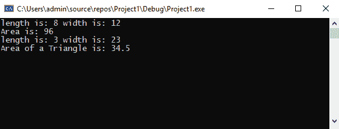

为了计算`circle`的面积，我们修改了`shape`类并添加了一个新的重载的`setValues`函数，如下所示：

```cpp
#include <iostream> 
#include <conio.h> 

class shape { 

protected: 

   float a, b; 

public: 

   void setValues(float _length, float _width) 
   { 
         a = _length; 
         b = _width; 

         std::cout << "length is: " << a << " height is: " << b << 
                      std::endl; 
   } 

 void setValues(float _a)
{
a = _a;
} 
   void area() { 

         std::cout << "Area is: " << a * b << std::endl; 
   } 

};
```

然后我们将添加一个新的继承类，命名为`circle`：

```cpp
class circle : public shape { 

public: 
   void area() { 

         std::cout << "Area of a Circle is: " << 3.14f * a * a << 
                      std::endl; 
   } 

}; 
```

在主函数中，我们创建一个新的`circle`对象，设置半径，并打印面积：

```cpp
int main() 
{ 

   shape rectangle; 
   rectangle.setValues(8.0f, 12.0f); 
   rectangle.area(); 

   triangle tri; 
   tri.setValues(3.0f, 23.0f); 
   tri.area(); 

   circle c; 
   c.setValues(5.0f); 
   c.area(); 

   _getch(); 
   return 0; 
}
```

这里是这个输出的内容：

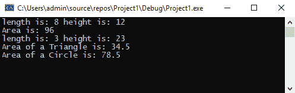

# 摘要

在本章中，我们介绍了编程的基础知识——从变量是什么以及如何将值存储在它们中，到查看运算符和语句，到如何决定何时需要它们。之后，我们探讨了迭代器和函数，这些可以简化我们的工作并尽可能自动化代码。数组和指针帮助我们分组和存储类似类型的数据，而`struct`和`enum`则允许我们创建自定义数据类型。最后，我们探讨了类和继承，这是使用 C++的关键，使得定义具有自定义属性的我们的数据类型变得方便。

在下一章中，我们将探讨图形编程的基础，并探索如何在屏幕上显示三维和二维对象。
