# 第三章：设置您的游戏

在本章中，我们将从游戏制作的基础知识以及游戏所需的基本图形组件开始。由于本书将涵盖使用 C++ 的图形，我们将主要关注游戏中图形引擎所需的图形功能。我们还将介绍音效系统，以便使游戏更加有趣。

为了创建一个基本的图形引擎，我们将使用**简单快速多媒体库**（**SFML**），因为它包含了启动游戏所需的大部分功能。选择 SFML 的原因是它非常基础且易于理解，与其他引擎和框架不同。

在本章中，我们将为我们的游戏创建一个窗口并向其中添加动画。我们还将学习如何创建和控制玩家的移动。

本章涵盖了以下主题：

+   SFML 概述

+   下载 SFML 并配置 Visual Studio

+   创建窗口

+   绘制形状

+   添加精灵

+   键盘输入

+   处理玩家移动

# SFML 概述

游戏（与其它娱乐媒体不同）实际上涉及加载各种资源，如图像、视频、声音、字体类型等。SFML 提供了将所有这些功能加载到游戏中的函数。

SFML 兼容多个平台，这意味着它允许你在不同的平台上开发和运行游戏。它还支持除 C++ 之外的各种语言。此外，它是开源的，因此你可以查看源代码并向其添加功能（如果尚未包含）。

SFML 被分解为五个模块，可以定义为以下内容：

+   **系统**：此模块直接与系统（如 Windows）交互，该系统本质上将是它将使用的**操作系统**（**OS**）。由于 SFML 兼容多个平台，并且每个操作系统在处理数据方面都有所不同，因此此模块负责与操作系统交互。

+   **窗口**：在屏幕上渲染任何内容时，我们首先需要的是一个视口或窗口。一旦我们获得访问权限，我们就可以开始将渲染的场景发送到它。窗口模块负责窗口的创建、输入处理等。

+   **图形**：在我们获得窗口访问权限后，我们可以使用图形模块开始将场景渲染到窗口中。在 SFML 中，图形模块主要使用 OpenGL 进行渲染，仅处理 2D 场景渲染。因此，它不能用于制作 3D 游戏。

+   **音频**：音频模块负责播放音频和音频流，以及录音。

+   **网络**：SFML 还包括一个用于发送和接收数据的网络库，可用于开发多人游戏。

# 下载 SFML 并配置 Visual Studio

现在我们已经熟悉了基础知识，让我们开始吧：

1.  导航到 SFML 下载页面 ([`www.sfml-dev.org/download.php`](https://www.sfml-dev.org/download.php)):

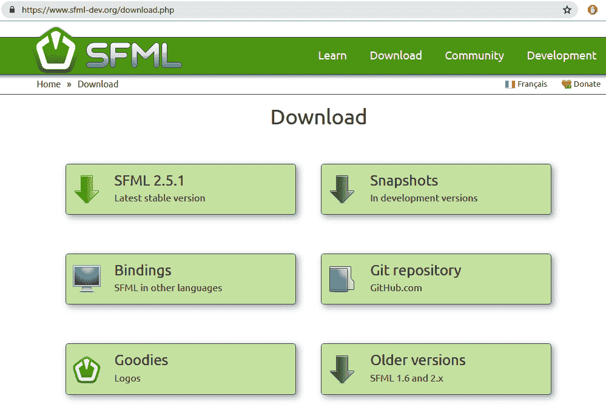

1.  选择**SFML 2.5.1**。或者，您也可以克隆仓库并使用 CMake 构建最新版本。

1.  下载 32 位或 64 位版本（取决于您的操作系统）用于 Visual Studio 2017。

虽然我们将为 Windows 开发游戏，但您可以从同一网页下载 SFML 的 Linux 或 macOS 版本。

在下载的 ZIP 文件中，您将看到以下目录：

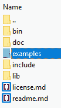

这些目录可以定义如下：

+   `bin`：这里包含运行所有 SFML 模块所需的全部**动态链接库**（DLLs）。这包含一个`.dll`文件，其中包含调试和发布版本。调试版本在文件末尾有一个`-d`后缀。没有这个后缀的文件是发布版本的`.dll`文件。

+   `doc`：这里包含以 HTML 格式提供的 SFML 文档。

+   `examples`：这里包含我们可以用来实现 SFML 模块和功能的示例。它告诉我们如何打开窗口、包含 OpenGL、执行网络操作以及如何创建一个基本的 pong 游戏。

+   `include`：这里包含所有模块的头文件。图形模块有用于创建精灵、加载纹理、创建形状等类的类。

+   `lib`：这里包含我们运行 SFML 所需的全部库文件。

此外，还有两个文件：`readme.md` 和 `license.md`。许可文件表明 SFML 可用于商业目的。因此，它可以被修改和重新分发，前提是你不要声称是你创建的。

1.  要设置 Visual Studio 项目，创建一个名为`SFMLProject`的新项目。在这个 Visual Studio 项目根目录中，`SFMLProject.vcxproj`文件所在的位置，提取`SFML-2.5.1`文件夹并将其放置在此处。

1.  然后，在根目录中，将`.bin`文件夹中的所有`.dll`文件移动到根目录。您的项目根目录应类似于以下截图：

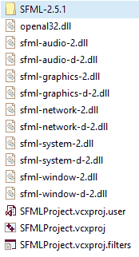

1.  在 Visual Studio 项目中，创建一个新的`source.cpp`文件。

1.  接下来，通过在解决方案资源管理器中右键单击项目来打开项目属性。

1.  确保选择了 Win32 配置。在配置属性下，选择 VC++目录。将`$(ProjectDir)\SFML-2.5.1\include`添加到包含目录。然后，将`$(ProjectDIr)\SFML-2.5.1\lib`添加到库目录，如以下截图所示：

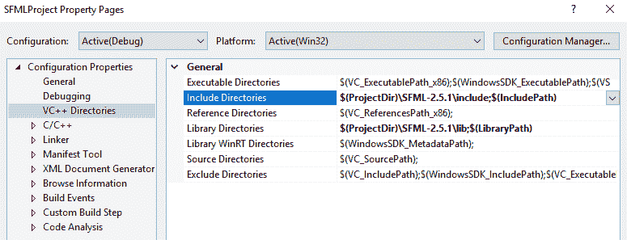

`$(ProjectDir)`关键字始终确保文件是相对于项目目录进行搜索的，即`.vcxproj`文件所在的目录。这使得项目可移植，并且能够在任何 Windows 系统上运行。

1.  接下来，我们必须设置我们想要使用的库；在链接器下拉菜单中选择“输入”，并输入以下`.lib`文件：

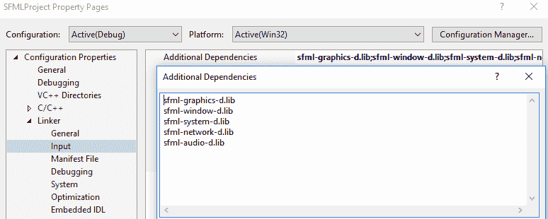

虽然我们在这本书中不会使用`sfml-network-d.lib`，但最好还是包含它，这样，如果您以后想要制作多人游戏，您就已经为它做好了准备。

现在我们已经完成了设置，我们终于可以开始编写一些代码了。

# 创建窗口

在我们绘制任何东西之前，我们首先需要的是一个窗口，这样我们才能在屏幕上显示一些内容。让我们创建一个窗口：

1.  在`source.cpp`文件的顶部，包含`Graphics.hpp`文件以访问 SFML 图形库：

```cpp
#include "SFML-2.5.1\include\SFML\Graphics.hpp"  
```

1.  接下来，添加主函数，它将是应用程序的主要入口点：

```cpp
int main(){ 

return 0; 
}  
```

1.  要创建窗口，我们必须指定我们想要创建的窗口大小。SFML 有一个`Vector2f`数据类型，它接受一个`x`值和一个`y`值，并使用它们来定义我们将要使用的窗口大小。

在`include`和`main`之间添加以下代码行。创建一个名为`viewSize`的变量，并将`x`和`y`值分别设置为`1024`和`768`：

```cpp
sf::Vector2f viewSize(1024, 768); 
```

游戏资源是为分辨率创建的，因此我正在使用这个视图大小；我们还需要指定一个`viewMode`类。

`viewMode`是一个 SFML 类，用于设置窗口的宽度和高度。它还获取表示像素中颜色值的位数。`viewMode`还获取您的显示器支持的分辨率，这样您就可以让用户将游戏的分辨率设置为所需的 4K 分辨率。

1.  要设置视图模式，在设置`viewSize`变量后添加以下代码：

```cpp
sf::videoMode vm(viewSize.x, viewSize.y);  
```

1.  现在，我们终于可以创建一个窗口了。窗口是通过`RenderWindow`类创建的。`RenderWindow`构造函数接受三个参数：一个`viewMode`参数、一个窗口名称参数和一个`Style`参数。

我们已经创建了一个`viewMode`参数，并且我们可以使用一个字符串在这里传递窗口名称。第三个参数，`Style`。`Style`是一个`enum`值；我们可以添加一个称为位掩码的数值，以创建我们想要的窗口样式：

+   `sf::style::Titlebar`：这将在窗口顶部添加一个标题栏。

+   `sf::style::Fullscreen`：这创建了一个全屏模式的窗口。

+   `sf::style::Default`：这是默认样式，它结合了调整窗口大小、关闭窗口和添加标题栏的能力。

1.  让我们创建一个默认样式的窗口。首先，使用以下命令创建窗口，并在创建`viewMode`参数后添加它：

```cpp
sf::RenderWindow window(vm, "Hello SFMLGame !!!", sf::Style::Default); 
```

1.  在`main()`类中，我们将创建一个`while`循环，它将处理游戏的主循环。这将检查窗口是否打开，这样我们就可以通过更新和渲染场景中的对象来添加一些键盘事件。`while`循环将在窗口打开时运行。在`main`函数中添加以下代码：

```cpp
int main() { 

   //Initialize Game Objects 

         while (window.isOpen()) { 

               // Handle Keyboard Events 
               // Update Game Objects in the scene 
               // Render Game Objects  

         } 

   return 0; 
}
```

现在，运行应用程序。在这里，你有一个不那么有趣的带有白色背景的窗口。嘿，至少你现在有一个窗口了！要在这里显示某些内容，我们必须清除窗口并在每一帧中显示我们绘制的任何内容。这是通过使用`clear`和`display`函数来完成的。

1.  在我们可以渲染场景之前，我们必须调用`window.clear()`，然后调用`window.display()`来显示场景对象。

在`while`循环中，添加`clear`和`display`函数。游戏对象将在`clear`函数和`display`函数之间绘制：

```cpp
int main() { 

   //init game objects 
         while (window.isOpen()) { 
               // Handle Keyboard events 
               // Update Game Objects in the scene 
    window.clear(sf::Color::Red);                
 // Render Game Objects  
window.display();
         } 
   return 0; 
} 
```

`clear`函数接受一个清除颜色。在这里，我们将颜色红色作为值传递给函数。此函数用这种实色值填充整个窗口：


# 绘制形状

SFML 为我们提供了绘制基本形状（如矩形、圆形和三角形）的功能。形状可以设置到一定的大小，并具有如`fillColor`、`Position`和`Origin`等函数，这样我们就可以分别设置颜色、形状在视口中的位置以及形状可以围绕其旋转的原点。让我们看看一个矩形形状的例子：

1.  在`while`循环之前，添加以下代码来设置矩形：

```cpp

   sf::RectangleShape rect(sf::Vector2f(500.0f, 300.0f)); 
   rect.setFillColor(sf::Color::Yellow); 
   rect.setPosition(viewSize.x / 2, viewSize.y / 2); 
   rect.setOrigin(sf::Vector2f(rect.getSize().x / 2, 
   rect.getSize().y / 2)); 

```

在这里，我们创建了一个`Rectangle`参数，其类型为`RectangleShape`，并命名为`rect`。`RectangleShape`的构造函数接受矩形的尺寸。其尺寸为`500` x `300`。然后，我们将矩形的颜色设置为黄色。之后，我们将矩形的设置在视口的中心，并将原点设置为矩形的中心。

1.  要绘制矩形，我们必须调用`window.draw()`函数并将矩形传递给它。确保你在`while`循环中的`clear`和`display`函数之间调用此函数。现在，添加以下代码：

```cpp

   #include "SFML-2.5.1\include\SFML\Graphics.hpp" 

   sf::Vector2f viewSize(1024, 768); 
   sf::VideoMode vm(viewSize.x, viewSize.y); 
   sf::RenderWindow window(vm, "Hello Game SFML !!!", 
   sf::Style::Default); 

   int main() { 

   //init game objects 

   sf::RectangleShape rect(sf::Vector2f(500.0f, 300.0f));
 rect.setFillColor(sf::Color::Yellow);
 rect.setPosition(viewSize.x / 2, viewSize.y / 2);
 rect.setOrigin(sf::Vector2f(rect.getSize().x / 2, 
   rect.getSize().y / 2));
         while (window.isOpen()) { 
               // Handle Keyboard events 
               // Update Game Objects in the scene 

               window.clear(sf::Color::Red); 

               // Render Game Objects  
               window.draw(rect);

               window.display(); 
         } 
   return 0; 
} 
```

1.  现在，运行项目；你将看到一个黄色的矩形在红色的视口中，如下所示：

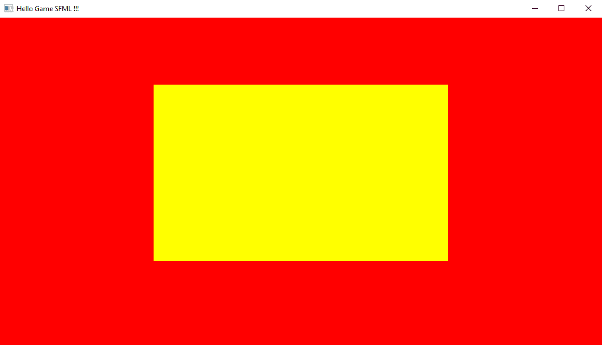

1.  如果我们将位置设置为`(0, 0)`，你将看到在 SFML 中的 2D 矩形的原点在哪里——它在视口的左上角：

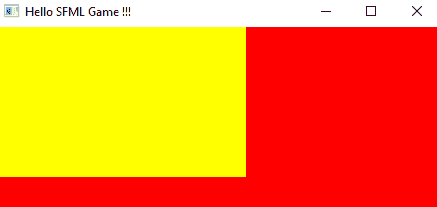

1.  通过撤销上一个动作将其移回视口的中心。然后，再次将矩形设置为视口的中心，如下所示：

```cpp
rect.setPosition(viewSize.x / 2, viewSize.y / 2);
```

1.  现在，我们可以添加一些更多的形状，例如圆形和三角形。我们可以使用`CircleShape`类来创建圆形，而使用`ConvexShape`类来创建三角形。在主循环之前，我们将使用`CircleShape`和`Triangle`与`ConvexShape`创建一个圆形，如下所示：

```cpp
   sf::CircleShape circle(100); 
   circle.setFillColor(sf::Color::Green); 
   circle.setPosition(viewSize.x / 2, viewSize.y / 2); 
   circle.setOrigin(sf::Vector2f(circle.getRadius(), 
   circle.getRadius())); 
   sf::ConvexShape triangle; 
   triangle.setPointCount(3); 
   triangle.setPoint(0, sf::Vector2f(-100, 0)); 
   triangle.setPoint(1, sf::Vector2f(0, -100)); 
   triangle.setPoint(2, sf::Vector2f(100, 0)); 
   triangle.setFillColor(sf::Color(128, 0, 128, 255)); 
   triangle.setPosition(viewSize.x / 2, viewSize.y / 2); 
```

`CircleShape`类只接受一个参数（即圆的半径），与需要两个参数的矩形相比。我们使用`setFillColor`函数将圆的颜色设置为绿色，然后设置其位置和原点。

要创建三角形，我们使用`ConvexShape`类。要创建一个形状，我们指定`setPointCount`，它接受一个参数。我们将使用它来指定组成形状的点数。接下来，使用`setPoint`函数，我们设置点的位置。这需要两个参数：第一个是点的索引，第二个是点的位置。

要创建三角形，我们使用三个点：第一个，索引为`0`，位置为`(-100, 0)`；第二个，索引为`1`，位置为`(0, -100)`；第三个，索引为`2`，位置为`(100, 0)`。

现在，我们需要设置三角形的颜色。我们通过设置红色、绿色、蓝色和 alpha 值来实现这一点。在 SFML 中，颜色是 8 位整数值。这意味着每个颜色范围在 0 到 255 之间，其中 0 是黑色，255 是最大颜色范围。所以，当我们把三角形的颜色设置为`triangle.setFillColor(sf::Color(128, 0, 128, 255));`时，红色是其最大范围的二分之一，没有绿色，蓝色也是最大范围的二分之一，alpha 值为`255`，使三角形完全不透明。然后，我们设置三角形的位置，使其位于屏幕中心。

1.  接下来，我们绘制圆形和三角形。在绘制矩形之后，调用圆形和三角形的`draw`函数，如下所示：

```cpp
  while (window.isOpen()) { 
               // Handle Keyboard events 
               // Update Game Objects in the scene 

               window.clear(sf::Color::Red); 

               // Render Game Objects  
               window.draw(rect); 
               window.draw(circle);
 window.draw(triangle);

               window.display(); 
         } 
```

1.  上述代码的输出如下：

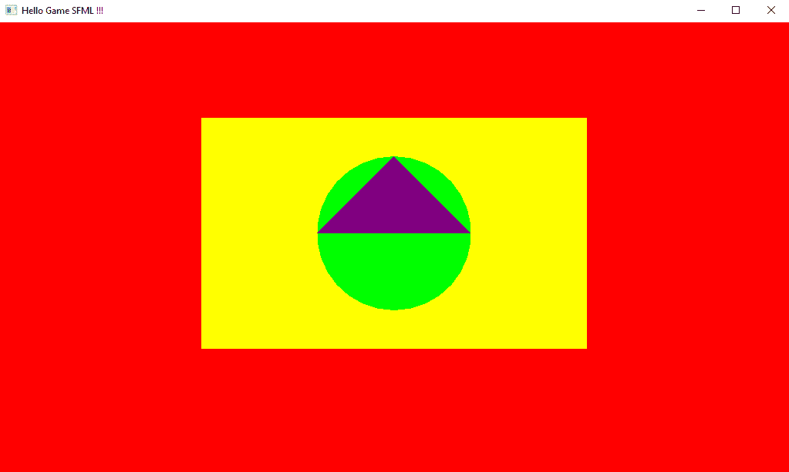

注意，在创建三角形时，第二个点的*y*值被设置为负`100`：

```cpp
triangle.setPoint(0, sf::Vector2f(-100, 0)); 
triangle.setPoint(1, sf::Vector2f(0, -100)); 
triangle.setPoint(2, sf::Vector2f(100, 0)); 
```

然而，三角形是向上指的。这意味着*+y*轴是向下的。你会发现这种情况在 2D 框架中很常见。此外，场景的原点位于左上角，因此坐标系如下：

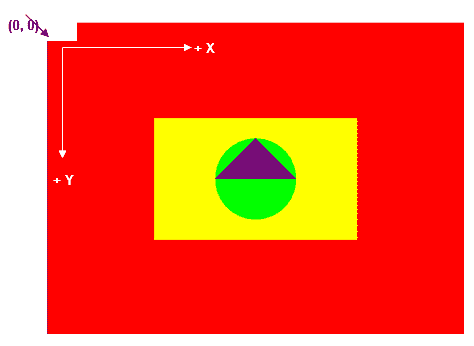

还需要注意的是，绘制顺序很重要。绘制是从后往前进行的。因此，首先绘制的形状将位于同一位置上后来绘制的形状之后。后来绘制的对象只是简单地覆盖了先前的对象，就像艺术家在画布上绘画时在现实生活中所做的那样。所以，请确保先绘制较大的对象，然后稍后绘制较小的对象。如果你在绘制较大的对象之前绘制了较小的对象，那么较小的对象将位于较大的对象之后，你将看不到它们。确保这种情况不会发生，因为你不会得到任何错误，代码中的所有内容都将正确，所以你不会知道是否出了问题。

# 添加精灵

精灵是一个应用了图片的矩形。你可能想知道，“为什么不直接使用图片呢？”当然，我们确实加载了一张图片，然后我们无法移动或旋转它。因此，我们将图片或纹理应用到可以移动和旋转的矩形上，使其看起来像图片在这样做。让我们学习如何做到这一点：

1.  由于我们将在游戏项目中加载图像，该游戏项目位于项目的根目录，因此让我们创建一个名为 `Assets` 的文件夹。

1.  在此文件夹中，创建一个名为 `graphics` 的子文件夹，然后将 `sky.png` 文件复制粘贴到 `graphics` 文件夹中：

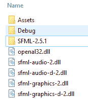

要创建精灵，我们使用 SFML 的 `Sprite` 类。`Sprite` 类接受一个纹理。然后，使用 `Texture` 类加载图片。在绘制时，你需要调用 `window.draw.(sprite)` 来绘制精灵。让我们看看如何做到这一点。

1.  声明一个名为 `skyTexture` 的 `Texture` 类和一个名为 `skySprite` 的 `Sprite` 类。这应该在创建 `RenderWindow` 类之后完成：

```cpp
sf::Texture skyTexture; 
sf::Sprite skySprite;
```

1.  在 `source.cpp` 文件中创建一个名为 `init` 的新函数，它位于 `main` 函数之前。由于我们不希望 `main` 函数过于杂乱，我们将添加初始化 `skyTexture` 和 `skySprite` 的代码到其中。在 `init` 函数中，添加以下代码：

```cpp
void init() { 

// Load sky Texture 
   skyTexture.loadFromFile("Assets/graphics/sky.png"); 

// Set and  Attacha Texture to Sprite 
   skySprite.setTexture(skyTexture); 

} 
```

首先，我们通过调用 `loadFromFile` 函数加载 `skyTexture` 函数。我们传入要加载的文件的路径和文件名。在这里，我们想从 `Assets` 文件夹中加载 `sky.png` 文件。

接下来，我们使用精灵的 `setTexture` 函数，并将 `skyTexture` 函数传递给它。

1.  要做到这一点，在 `main` 和 `init` 函数上方创建一个名为 `draw()` 的新函数。我们在其中调用 `draw (`skySprite`) 来绘制精灵，如下所示：

```cpp
void draw() { 

   window.draw(skySprite); 

} 
```

1.  现在，我们必须在 `main` 函数的开始处调用 `init()`，并在我们添加到 `main` 函数的 `while` 循环中调用 `draw()`。你可以从 `main` 函数中删除用于创建和绘制形状的所有代码。你的 `main` 函数应该如下所示：

```cpp
 #include "SFML-2.5.1\include\SFML\Graphics.hpp" 

sf::Vector2f viewSize(1024, 768); 
sf::VideoMode vm(viewSize.x, viewSize.y); 
sf::RenderWindow window(vm, "Hello Game SFML !!!", sf::Style::Default); 

sf::Texture skyTexture; 
sf::Sprite skySprite; 

void init() { 

   skyTexture.loadFromFile("Assets/graphics/sky.png"); 
   skySprite.setTexture(skyTexture); 

} 

void draw() { 

   window.draw(skySprite); 

} 

int main() { 

   init(); 

   while (window.isOpen()) { 

         window.clear(sf::Color::Red); 

         draw(); 

         window.display(); 

   } 

   return 0; 
} 
```

输出如下：

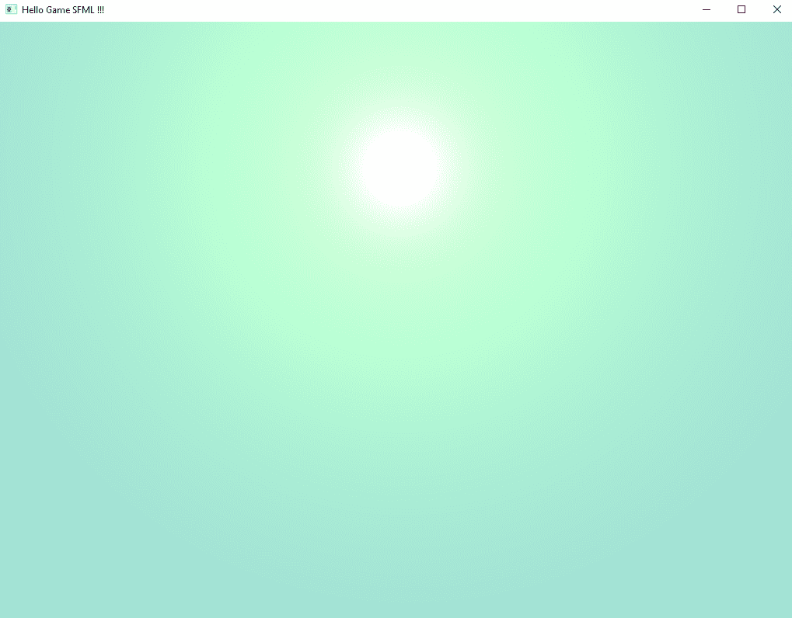

向太阳致敬！瞧，我们已经加载了天空纹理，并在窗口中以精灵的形式绘制了它。

1.  我还包含了一张背景纹理图片，名为 `bg.png`，它位于本章项目的 `Assets` 文件夹中。尝试以相同的方式加载纹理并绘制纹理。

1.  我将背景纹理和精灵的变量分别命名为 `bgTexture` 和 `bgSprite`，并将 `bgSprite` 变量绘制到场景中。别忘了将 `bg.png` 文件添加到 `Assets/graphics` 目录。

你的场景现在应该如下所示：

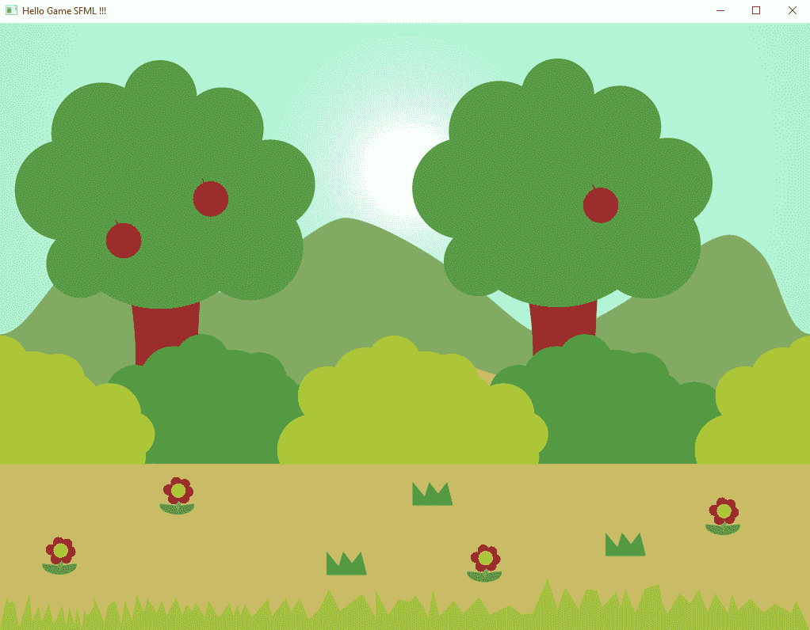

1.  接下来，添加另一个名为 `heroSprite` 的精灵，并使用 `heroTexture` 加载图片。将精灵的原点设置为它的中心，并将其放置在场景的中间。这里提供了 `hero.png` 文件图像，确保将其放置在 `Assets/graphics` 文件夹中。现在，声明 `heroSprite` 和 `heroTexture`，如下所示：

```cpp
sf::Texture heroTexture; 
sf::Sprite heroSprite; 

In the init function initialize the following values: 
   heroTexture.loadFromFile("Assets/graphics/hero.png"); 
   heroSprite.setTexture(heroTexture); 
   heroSprite.setPosition(sf::Vector2f(viewSize.x/2, 
      viewSize.y/2)); 
   heroSprite.setOrigin(heroTexture.getSize().x / 2, 
      heroTexture.getSize().y / 2);  
```

1.  要设置精灵的原点，我们将纹理和高度除以 `2`。

使用 `draw` 函数绘制 `heroSprite` 精灵，如下所示：

```cpp
void draw() { 
   window.draw(skySprite); 
   window.draw(bgSprite); 
   window.draw(heroSprite);
}
```

1.  我们的英雄现在将出现在场景中，如下所示：

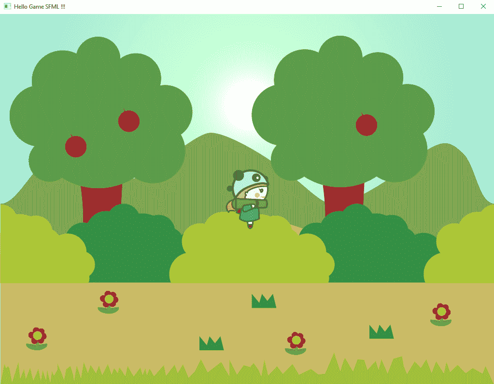

# 键盘输入

能够添加形状、精灵和纹理是很好的，然而，计算机游戏本质上都是交互式的。我们需要允许玩家使用键盘输入，以便他们可以访问游戏内容。但我们如何知道玩家按下了哪个按钮呢？嗯，这是通过事件轮询来处理的。轮询只是定期检查键的状态；事件用于检查是否触发了事件，例如视口的关闭。

SFML 提供了 `sf::Event` 类，以便我们可以轮询事件。我们可以使用窗口的 `pollEvent` 函数来检查可能发生的事件，例如玩家按下按钮。

创建一个名为 `updateInput()` 的新函数。在这里，我们将创建一个名为 `event` 的新 `sf::Event` 类对象。我们将创建一个名为 `window.pollEvent` 的 `while` 循环，并将 `event` 变量传递进去以检查事件。

到目前为止，我们一直在使用 *Shift* + *F5* 或 Visual Studio 中的停止按钮来停止应用程序。我们可以做的基本事情之一是检查 *Esc* 键是否被按下。如果被按下，我们希望关闭窗口。为此，添加以下代码：

```cpp
void updateInput() { 

   sf::Event event; 

   while (window.pollEvent(event)) { 

if (event.key.code == sf::Keyboard::Escape || 
         event.type ==sf::Event::Closed) 
                     window.close(); 
   } 

} 
```

在 `while` 循环中，我们需要检查事件键码是否是 *Esc* 键码，或者事件是否是 `Event::closed`。然后，我们调用 `window.close()` 函数来关闭窗口。当我们关闭窗口时，它将关闭应用程序。

在主 `while` 循环中在 `window.clear()` 函数之前调用 `updateInput()` 函数。现在，当应用程序运行时按下 *Esc*，它将关闭。SFML 不只是限制输入到键盘；它还提供了鼠标、摇杆和触摸输入的功能。

# 处理玩家移动

现在我们已经可以访问玩家的键盘，我们可以学习如何移动游戏对象。当键盘上按下右箭头键时，让我们将玩家角色向右移动。当右箭头键释放时，我们将停止移动英雄：

1.  在 `heroSprite` 之后创建一个全局的 `Vector2f` 叫做 `playerPosition`。

1.  创建一个布尔数据类型 `playerMoving` 并将其设置为 `false`。

1.  在 `updateInput` 函数中，我们将检查右键是否被按下或释放。如果按钮被按下，我们将 `playerMoving` 设置为 `true`。如果按钮被释放，则将 `playerMoving` 设置为 `false`。

`updateInput` 函数应该如下所示：

```cpp
void updateInput() { 

   sf::Event event; 

   while (window.pollEvent(event)) { 

         if (event.type == sf::Event::KeyPressed) { 

               if (event.key.code == sf::Keyboard::Right) { 

                     playerMoving = true; 
               } 
         }           
         if (event.type == sf::Event::KeyReleased) { 

               if (event.key.code == sf::Keyboard::Right) { 
                     playerMoving = false; 
               }               
         } 

         if (event.key.code == sf::Keyboard::Escape || event.type 
         == sf::Event::Closed) 
               window.close();  
   } 
}
```

1.  为了更新场景中的对象，我们将创建一个名为 `update` 的函数，它将接受一个名为 `dt` 的浮点数。这代表时间差，指的是上一次更新和当前更新调用之间经过的时间。在 `update` 函数中，我们将检查玩家是否在移动。如果玩家在移动，那么我们将沿着 *+x* 方向移动玩家的位置，并将其乘以 `dt`。

我们乘以时间步长（delta time）的原因是，如果不这样做，更新将不会是时间依赖的，而是处理器依赖的。如果你不将位置乘以 `dt`，那么在更快的电脑上更新将会更快，而在较慢的电脑上则会更慢。所以，确保任何移动都是乘以 `dt`。

`update` 函数应该如下所示。确保这个函数出现在 `main` 函数之前：

```cpp
void update(float dt) { 

   if (playerMoving) { 
         heroSprite.move(50.0f * dt, 0); 
   } 
} 
```

1.  在 `main` 函数的开始处，创建一个名为 `Clock` 的 `sf::Clock` 类型的对象。`Clock` 类负责获取系统时钟，并允许我们以秒、毫秒或微秒为单位获取时间步长。

1.  在 `while` 循环中，在调用 `updateInput()` 之后，创建一个名为 `dt` 的 `sf::Time` 类型的变量，并通过调用 `clock.restart()` 来设置 `dt` 变量。

1.  现在，调用 `update` 函数并传入 `dt.asSeconds()`，这将给出每秒 60 帧的时间步长，大约是 .0167 秒。

`main` 函数应该如下所示：

```cpp

int main() { 

   sf::Clock clock; 
   init(); 
   while (window.isOpen()) { 

         // Update input 
         updateInput(); 

         // Update Game 
         sf::Time dt = clock.restart(); 
         update(dt.asSeconds()); 

   window.clear(sf::Color::Red); 

         //Draw Game  
         draw(); 

         window.display();   
   }  
   return 0; 
} 
```

1.  现在，当你运行项目并按键盘上的右箭头键时，玩家将开始向右移动，并且当你释放右箭头键时停止：

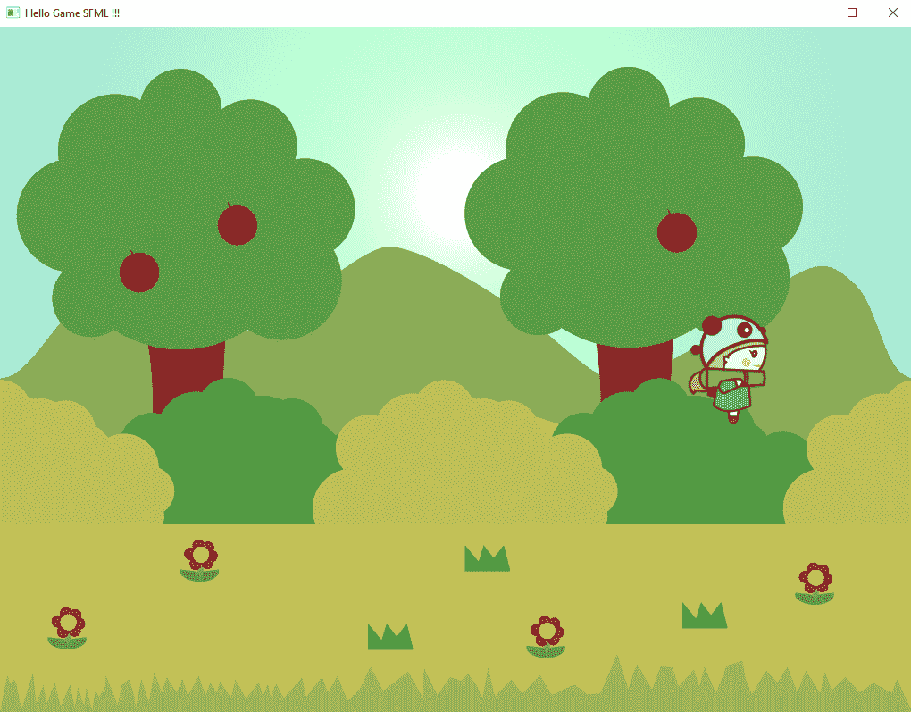

# 摘要

在本章中，我们探讨了如何设置 SFML 以便我们可以开始创建游戏。我们涵盖了构成 SFML 的五个基本模块，并查看如何使用 SFML 创建形状，以及将背景和玩家精灵添加到场景中。我们还添加了键盘输入，并使用它来使玩家角色在场景内移动。

在下一章中，我们将创建游戏的基本框架。我们还将把玩家角色移动到单独的类中，并为角色添加一些基本的物理属性，以便它们可以在游戏中跳跃。
