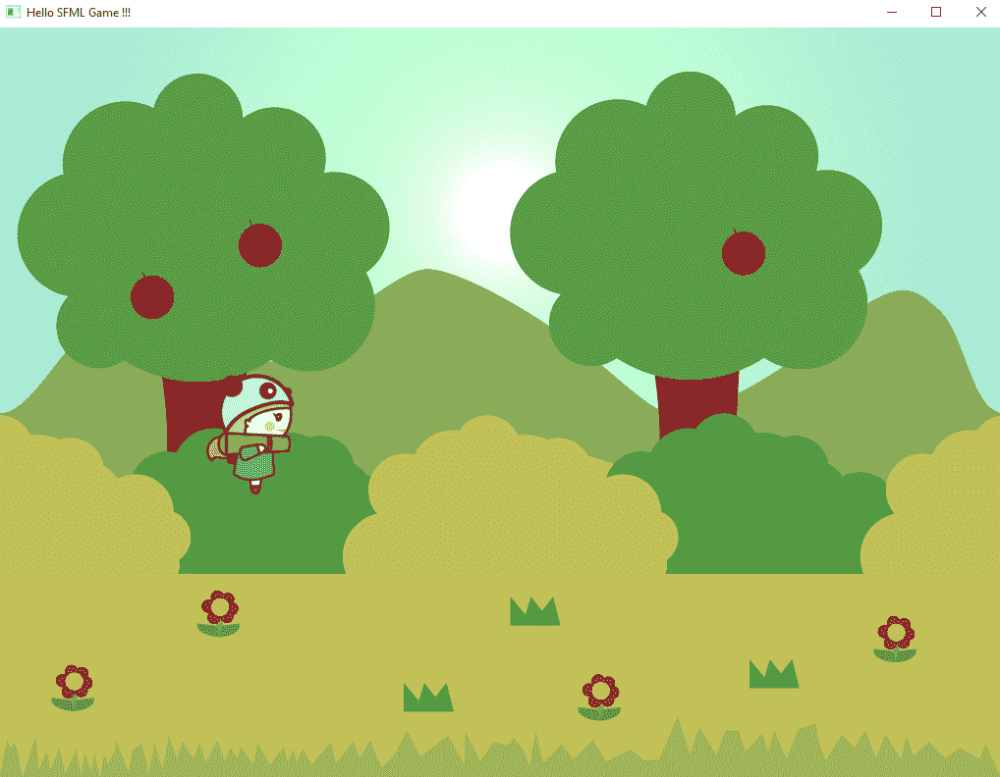
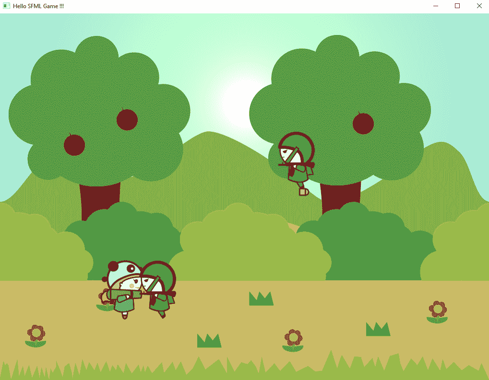

# 第四章：创建您的游戏

在本章中，我们将通过将游戏对象作为类添加而不是将它们添加到 `source.cpp` 文件中来使我们的项目更加灵活。在这种情况下，我们将使用类来创建主要角色和敌人。我们将创建一个新的火箭类，玩家将能够向敌人射击。当我们按下按钮时，我们将定期生成敌人以及新的火箭。最后，我们将检查火箭和敌人之间的碰撞，并相应地从场景中移除敌人。

本章将涵盖以下主题：

+   从头开始

+   创建 `Hero` 类

+   创建 `Enemy` 类

+   添加敌人

+   创建 `Rocket` 类

+   添加火箭

+   碰撞检测

# 从头开始

由于我们将为主要角色创建一个新的类，我们将从主文件中删除与玩家角色相关的代码。让我们学习如何做到这一点。

从 `main.cpp` 文件中删除所有与玩家相关的代码。完成此操作后，文件应如下所示：

```cpp
#include "SFML-2.5.1\include\SFML\Graphics.hpp" 

sf::Vector2f viewSize(1024, 768); 
sf::VideoMode vm(viewSize.x, viewSize.y); 
sf::RenderWindow window(vm, "Hello SFML Game !!!", sf::Style::Default); 

sf::Vector2f playerPosition; 
bool playerMoving = false; 

sf::Texture skyTexture; 
sf::Sprite skySprite; 

sf::Texture bgTexture; 
sf::Sprite bgSprite; 

void init() { 

   skyTexture.loadFromFile("Assets/graphics/sky.png"); 
   skySprite.setTexture(skyTexture); 

   bgTexture.loadFromFile("Assets/graphics/bg.png"); 
   bgSprite.setTexture(bgTexture); 

} 

void updateInput() { 

   sf::Event event; 

   // while there are pending events... 
   while (window.pollEvent(event)) { 

      if (event.key.code == sf::Keyboard::Escape || event.type == 
          sf::Event::Closed) 
         window.close(); 

   } 

} 

void update(float dt) { 

} 

void draw() { 

   window.draw(skySprite); 
   window.draw(bgSprite); 

} 

int main() { 

   sf::Clock clock; 
   window.setFramerateLimit(60); 

   init(); 

   while (window.isOpen()) { 

      updateInput(); 

      sf::Time dt = clock.restart(); 
      update(dt.asSeconds()); 

      window.clear(sf::Color::Red); 

      draw(); 

      window.display(); 

   } 

   return 0; 
} 
```

# 创建 `Hero` 类

我们现在将按照以下步骤继续创建一个新类：

1.  在解决方案资源管理器中选择项目，然后右键单击并选择添加 | 类。在这个类名中，指定名称为 `Hero`。您将看到 `.h` 和 `.cpp` 文件部分将自动填充为 `Hero.h` 和 `Hero.cpp`。点击确定。

1.  在 `Hero.h` 文件中，添加 SFML 图形头文件并创建 `Hero` 类：

```cpp
#include "SFML-2.5.0\include\SFML\Graphics.hpp" 

class Hero{ 

}; 
```

1.  在 `Hero` 类中，我们将创建类所需的函数和变量。我们还将创建一些公共属性，这些属性可以在类外部访问，如下所示：

```cpp
public: 
   Hero(); 
   ~Hero(); 

   void init(std::string textureName, sf::Vector2f position, float 
   mass); 
   void update(float dt); 
   void jump(float velocity); 
   sf::Sprite getSprite(); 

```

这里，我们有构造函数和析构函数，它们将在对象创建和销毁时分别被调用。我们添加了一个 `init` 函数，用于传递纹理名称、生成玩家并指定质量。我们在这里指定质量是因为我们将创建一些非常基础的物理效果，这样当按下跳跃按钮时，玩家将跳起来并安全着地。

此外，`update`、`jump` 和 `getSprite` 函数将分别更新玩家位置、使玩家跳跃和获取用于描绘玩家角色的精灵。

1.  除了这些 `public` 变量之外，我们还需要一些只能在类内部访问的 `private` 变量。在 `Hero` 类中添加这些变量，如下所示：

```cpp
private: 

   sf::Texture m_texture; 
   sf::Sprite m_sprite; 
   sf::Vector2f m_position; 

int jumpCount = 0;    
float m_mass; 
   float m_velocity; 
   const float m_gravity = 9.80f; 
      bool m_grounded; 

```

在 `private` 部分中，我们为 `texture`、`sprite` 和 `position` 创建变量，以便我们可以本地设置这些值。我们有一个名为 `jumpCount` 的 `int` 变量，这样我们就可以检查玩家角色跳跃的次数。这需要因为玩家有时可以双跳，这是我们不想看到的。

我们还需要`float`变量来存储玩家的质量、跳跃时的速度以及下落回地面时的重力，这是一个常数。`const`关键字告诉程序这是一个常数，在任何情况下都不应该改变其值。

最后，我们添加一个`bool`值来检查玩家是否在地面上。只有当玩家在地面上时，他们才能开始跳跃。

1.  接下来，在`Hero.cpp`文件中，我们将实现`.h`文件中添加的函数。在`.cpp`文件的顶部，包含`Hero.h`文件，然后添加构造函数和析构函数：

```cpp
#include "Hero.h" 

Hero::Hero(){ 

} 
```

`::`符号代表作用域解析运算符。具有相同名称的函数可以在两个不同的类中定义。为了访问特定类的成员，使用作用域解析运算符。

1.  这里，`Hero`函数的作用域限定在`Hero`类中：

```cpp
 Hero::~Hero(){ 

}
```

1.  接下来，我们将设置`init`函数，如下所示：

```cpp
void Hero::init(std::string textureName, sf::Vector2f position, float mass){ 

   m_position = position; 
   m_mass = mass; 

   m_grounded = false; 

   // Load a Texture 
   m_texture.loadFromFile(textureName.c_str()); 

   // Create Sprite and Attach a Texture 
   m_sprite.setTexture(m_texture); 
   m_sprite.setPosition(m_position); 
   m_sprite.setOrigin(m_texture.getSize().x / 2, 
   m_texture.getSize().y / 2); 

} 
```

我们将位置和质量设置为局部变量，并将接地状态设置为`false`。然后，通过调用`loadFromFile`并传入纹理名称的字符串来设置纹理。`c_str()`短语返回一个指向包含空终止序列的字符数组的指针（即`C`字符串），表示当前`string`对象的价值（[`www.cplusplus.com/reference/string/string/c_str/`](http://www.cplusplus.com/reference/string/string/c_str/))。然后，我们设置精灵纹理、位置和精灵本身的原始位置。

1.  现在，我们添加了`update`函数，在其中我们实现了更新玩家位置的逻辑。玩家的角色不能左右移动；相反，它只能向上移动，即*y*方向。当施加初始速度时，玩家会向上跳起，然后由于重力开始下落。将`update`函数添加到更新英雄位置如下：

```cpp
void Hero::update(float dt){ 

   m_force -= m_mass * m_gravity * dt; 

   m_position.y -= m_force * dt; 

   m_sprite.setPosition(m_position); 

   if (m_position.y >= 768 * 0.75f) { 

      m_position.y = 768 * 0.75f; 
      m_force = 0; 
      m_grounded = true; 
      jumpCount = 0; 
   } 

}  
```

当速度施加到角色上时，玩家最初会因为力量而向上移动，但随后会开始下落，因为重力。结果速度向下作用，其计算公式如下：

*速度 = 加速度 × 时间*

我们将加速度乘以质量，以便玩家下落得更快。为了计算垂直移动的距离，我们使用以下公式：

*距离 = 速度 × 时间*

然后，我们计算前一个帧和当前帧之间的移动距离。然后，根据我们计算出的位置设置精灵的位置。

我们还有一个条件来检查玩家是否在屏幕底部的四分之一距离处。我们将其乘以`768`，这是窗口的高度，然后乘以`.75f`，此时玩家被认为是站在地面上。如果满足这个条件，我们设置玩家的位置，设置结果速度为`0`，设置地面布尔值为`true`，最后将跳跃计数器重置为`0`。

1.  当我们想要让玩家跳跃时，我们调用`jump`函数，该函数需要一个初始速度。我们现在将添加`jump`函数，如下所示：

```cpp
void Hero::jump(float velocity){ 

   if (jumpCount < 2) { 
      jumpCount++; 

      m_velocity = VELOCITY; 
      m_grounded = false; 
   } 

}
```

在这里，我们首先检查`jumpCount`是否小于`2`，因为我们只想让玩家跳跃两次。如果`jumpCount`小于`2`，则将`jumpCount`值增加`1`，设置初始速度，并将地面布尔值设置为`false`。

1.  最后，我们添加了`getSprite`函数，该函数简单地获取当前精灵，如下所示：

```cpp
 sf::Sprite Hero::getSprite(){ 

   return m_sprite; 
}  
```

恭喜！我们现在有了我们的`Hero`类。让我们通过以下步骤在`source.cpp`文件中使用它：

1.  在`main.cpp`文件的顶部包含`Hero.h`：

```cpp
#include "SFML-2.5.1\include\SFML\Graphics.hpp" 
#include "Hero.h"
```

1.  接下来，添加`Hero`类的一个实例，如下所示：

```cpp
sf::Texture skyTexture; 
sf::Sprite skySprite; 

sf::Texture bgTexture; 
sf::Sprite bgSprite; 
Hero hero;
```

1.  在`init`函数中，初始化`Hero`类：

```cpp
   // Load bg Texture 

   bgTexture.loadFromFile("Assets/graphics/bg.png"); 

   // Create Sprite and Attach a Texture 
   bgSprite.setTexture(bgTexture); 

   hero.init("Assets/graphics/hero.png", sf::Vector2f(viewSize.x *
 0.25f, viewSize.y * 0.5f), 200); 
```

在这里，我们设置纹理图片；为此，将位置设置为屏幕左侧的`.25`（或 25%）处，并在`y`轴上居中。我们还设置了质量为`200`，因为我们的角色相当胖。

1.  接下来，我们想要在按下上箭头键时让玩家跳跃。因此，在`updateInput`函数中，在轮询窗口事件时，我们添加以下代码：

```cpp
while (window.pollEvent(event)) {  
    if (event.type == sf::Event::KeyPressed) {
 if (event.key.code == sf::Keyboard::Up) {
 hero.jump(750.0f);
 }
 }
      if (event.key.code == sf::Keyboard::Escape || event.type == 
       sf::Event::Closed) 
         window.close(); 

   }  
```

在这里，我们检查玩家是否按下了按键。如果按键被按下，并且按钮是键盘上的上箭头，那么我们调用`hero.jump`函数，并传入初始速度值`750`。

1.  接下来，在`update`函数中，我们调用`hero.update`函数，如下所示：

```cpp
void update(float dt) { 
 hero.update(dt); 
} 

```

1.  最后，在`draw`函数中，我们绘制英雄精灵：

```cpp
void draw() { 

   window.draw(skySprite); 
   window.draw(bgSprite); 
 window.draw(hero.getSprite());

}
```

1.  你现在可以运行游戏了。当玩家在地面时，按下键盘上的上箭头按钮，可以看到玩家跳跃。当玩家在空中时，再次按下跳跃按钮，你将看到玩家在空中再次跳跃：



# 创建`Enemy`类

玩家角色看起来非常孤单。她准备好制造一些混乱，但现在没有什么可以射击的。让我们添加一些敌人来解决这个问题：

1.  敌人将通过敌人类创建；让我们创建一个新的类，并将其命名为`Enemy`。

1.  就像`Hero`类一样，`Enemy`类也将有一个`.h`文件和一个`.cpp`文件。在`Enemy.h`文件中，添加以下代码：

```cpp
#pragma once 
#include "SFML-2.5.1\include\SFML\Graphics.hpp" 

class Enemy 
{ 
public: 
   Enemy(); 
   ~Enemy(); 

   void init(std::string textureName, sf::Vector2f position, 
     float_speed); 
   void update(float dt); 
   sf::Sprite getSprite(); 

private: 

   sf::Texture m_texture; 
   sf::Sprite m_sprite; 
   sf::Vector2f m_position; 
   float m_speed; 

}; 
```

这里，`Enemy`类，就像`Hero`类一样，也有构造函数和析构函数。此外，它有一个`init`函数，该函数接受纹理和位置；然而，它不是质量，而是一个用于设置敌人初始速度的浮点变量。敌人不会受到重力的影响，并且只会从屏幕右侧生成并向屏幕左侧移动。还有`update`和`getSprite`函数；由于敌人不会跳跃，所以没有`jump`函数。最后，在私有部分，我们创建了纹理、精灵、位置和速度的局部变量。

1.  在`Enemy.cpp`文件中，我们添加了构造函数、析构函数、`init`、`update`和`getSprite`函数：

```cpp
#include "Enemy.h" 

Enemy::Enemy(){} 

Enemy::~Enemy(){} 

void Enemy::init(std::string textureName, sf::Vector2f position, 
    float _speed) { 

   m_speed = _speed; 
   m_position = position; 

   // Load a Texture 
   m_texture.loadFromFile(textureName.c_str()); 

   // Create Sprite and Attach a Texture 
   m_sprite.setTexture(m_texture); 
   m_sprite.setPosition(m_position); 
   m_sprite.setOrigin(m_texture.getSize().x / 2,    
   m_texture.getSize().y / 2); 

} 
```

不要忘记在主函数顶部包含`Enemy.h`。然后我们添加构造函数和析构函数。在`init`函数中，我们设置局部速度和位置值。接下来，我们从文件中加载`Texture`并设置敌人的纹理、位置和原点。

1.  在`update`和`getSprite`函数中，我们更新位置并获取敌人精灵：

```cpp
 void Enemy::update(float dt) { 

   m_sprite.move(m_speed * dt, 0); 

} 

sf::Sprite Enemy::getSprite() { 

   return m_sprite; 
}
```

1.  我们已经准备好了`Enemy`类。现在让我们看看如何在游戏中使用它。

# 添加敌人

在`main.cpp`类中，包含`Enemy`头文件。由于我们想要多个敌人实例，我们需要添加一个名为`enemies`的向量，并将所有新创建的敌人添加到其中。

在以下代码的上下文中，`vector`一词与数学毫无关系，而是与对象列表有关。实际上，它就像一个数组，我们可以存储多个对象。我们使用向量而不是数组，因为向量是动态的，这使得添加和从列表中删除对象（与数组相比，数组是一个静态列表）更容易。让我们开始吧：

1.  我们需要在`main.cpp`文件中包含`<vector>`，如下所示：

```cpp
#include "SFML-2.5.1\include\SFML\Graphics.hpp" 
#include <vector> 

#include "Hero.h" 
#include "Enemy.h" 
```

1.  接下来，添加一个名为`enemies`的新变量，其类型为`vector`，它将存储`Enemy`数据类型：

```cpp
sf::Texture bgTexture; 
sf::Sprite bgSprite; 

Hero hero; 

std::vector<Enemy*> enemies;  
```

1.  为了创建一个特定对象类型的向量，你使用`vector`关键字，并在箭头括号内指定向量将持有的数据类型，然后指定你创建的向量的名称。这样，我们可以创建一个名为`spawnEnemy()`的新函数，并在主函数顶部添加其原型。

当任何函数在主函数下方编写时，主函数将不知道该函数的存在。因此，将创建一个原型并将其放置在主函数上方。这意味着函数现在可以在主函数下方实现——本质上，原型告诉主函数下面将有一个函数将被实现，因此要留意它。

```cpp
sf::Vector2f viewSize(1024, 768);
sf::VideoMode vm(viewSize.x, viewSize.y); 
sf::RenderWindow window(vm, "Hello SFML Game !!!", sf::Style::Default); 

void spawnEnemy(); 
```

现在，我们希望敌人从屏幕的右侧生成，但我们还希望敌人以与玩家相同的高度、略高于玩家的高度或远高于玩家的高度生成，这样玩家就必须使用单跳或双跳来攻击敌人。

1.  为了做到这一点，我们在`init`函数下方添加一些随机性，使游戏不那么可预测。为此，我们添加以下代码行：

```cpp
hero.init("Assets/graphics/hero.png", sf::Vector2f(viewSize.x * 
0.25f, viewSize.y * 0.5f), 200); 

srand((int)time(0)); 
```

`srand`短语是一个伪随机数，通过传递种子值进行初始化。在这种情况下，我们传递当前时间作为种子值。

对于每个种子值，将生成一系列数字。如果种子值始终相同，则将生成相同的数字序列。这就是我们传递时间值的原因——以确保每次生成的数字序列都不同。我们可以通过调用`rand`函数来获取序列中的下一个随机数。

1.  接下来，我们添加`spawnEnemy`函数，如下所示：

```cpp
void spawnEnemy() { 

   int randLoc = rand() % 3; 

   sf::Vector2f enemyPos; 

   float speed; 

   switch (randLoc) { 

   case 0: enemyPos = sf::Vector2f(viewSize.x, viewSize.y * 0.75f);
   speed = -400; break; 

   case 1: enemyPos = sf::Vector2f(viewSize.x, viewSize.y * 0.60f); 
   speed = -550; break; 

   case 2: enemyPos = sf::Vector2f(viewSize.x, viewSize.y * 0.40f); 
   speed = -650; break; 

   default: printf("incorrect y value \n"); return; 

   } 

   Enemy* enemy = new Enemy(); 
   enemy->init("Assets/graphics/enemy.png", enemyPos, speed); 

   enemies.push_back(enemy); 
} 
```

在这里，我们首先获取一个随机数——这将由于获取随机位置时的模运算符而创建一个新的从`0`到`2`的随机数。因此，每次函数被调用时，`randLoc`的值将是`0`、`1`或`2`。

创建一个新的`enemyPos`变量，其值将根据`randLoc`值分配。我们还将根据`randLoc`值设置敌人的速度；为此，我们创建一个新的浮点数`speed`，稍后将其分配。然后我们创建一个`switch`语句，它接受`randLoc`值——这允许随机位置生成敌人。

根据场景的不同，我们可以设置敌人的`enemyPosition`变量和速度：

+   当`randLoc`为`0`时，敌人从底部生成并以速度`-400`移动。

+   当`randLoc`为`1`时，敌人从屏幕中间生成并以速度`-500`移动。

+   当`randLoc`的值为`2`时，敌人从屏幕顶部生成并以更快的速度`-650`移动。

+   如果`randLoc`不是这些值中的任何一个，则输出一条消息，说明`y`的值不正确，而不是中断，我们返回以确保敌人不会在随机位置生成。

要在控制台打印消息，我们可以使用`printf`函数，它接受一个字符串值。在字符串的末尾，我们指定`\n`；这是一个关键字，告诉编译器这是行的末尾，之后写的内容需要放在新的一行，类似于调用`std::cout`。

1.  一旦我们知道位置和速度，我们就可以创建敌人对象本身并初始化它。请注意，敌人是以指针的形式创建的；否则，纹理的引用会丢失，当敌人生成时，纹理将不会显示。此外，当我们使用`new`关键字创建敌人作为原始指针时，系统会分配内存，我们稍后必须删除它。

1.  在敌人创建后，我们通过调用向量的`push`函数将其添加到`enemies`向量中。

1.  我们希望敌人以固定的时间间隔自动出生。为此，我们创建两个新变量来跟踪当前时间，并在每`1.125`秒生成一个新敌人。

1.  接下来，创建两个新的`float`类型变量，分别称为`currentTime`和`prevTime`：

```cpp
Hero hero; 

std::vector<Enemy*> enemies; 

float currentTime; 
float prevTime = 0.0f;  
```

1.  然后，在`update`函数中，在更新`hero`函数之后，添加以下代码行以创建一个新敌人：

```cpp
 hero.update(dt); 
 currentTime += dt;
 // Spawn Enemies
 if (currentTime >= prevTime + 1.125f)))) {
 spawnEnemy();
 prevTime = currentTime;
}
```

首先，我们增加`currentTime`变量。这个变量将在游戏开始后立即开始增加，以便我们可以跟踪自我们开始游戏以来已经过去了多长时间。接下来，我们检查当前时间是否大于或等于上一个时间加上`1.125`秒，因为这是我们希望新敌人出生的时间。如果是`true`，那么我们调用`spawnEnemy`函数，这将创建一个新的敌人。我们还设置上一个时间等于当前时间，这样我们就可以知道最后一个敌人是在什么时候出生的。好！所以，现在我们已经让游戏中的敌人开始出生了，我们可以`update`敌人并`draw`它们。

1.  在`update`函数中，我们同样创建一个`for`循环来更新敌人并删除一旦它们超出屏幕左侧的敌人。为此，我们在`update`函数中添加以下代码：

```cpp
   // Update Enemies 

   for (int i = 0; i < enemies.size(); i++) { 

      Enemy *enemy = enemies[i]; 

      enemy->update(dt); 

      if (enemy->getSprite().getPosition().x < 0) { 

         enemies.erase(enemies.begin() + i); 
         delete(enemy); 

      } 
   } 
```

这正是向量使用非常有帮助的地方。使用向量，我们能够向向量中添加、删除和插入元素。在这个例子中，我们获取向量中位置索引为`i`的敌人的引用。如果那个敌人超出屏幕并需要被删除，那么我们只需使用`erase`函数并传递从向量开始的位置索引来删除该索引处的敌人。当我们重置游戏时，我们也删除了我们创建的敌人的局部引用。这也会释放我们创建新敌人时分配的内存空间。

1.  在`draw`函数中，我们通过一个`for...each`循环遍历每个敌人并绘制它们：

```cpp
window.draw(skySprite); 
window.draw(bgSprite); 

window.draw(hero.getSprite()); 

for (Enemy *enemy : enemies) { 
  window.draw(enemy->getSprite()); 
}
```

我们使用`for...each`循环遍历所有敌人，因为`getSprite`函数需要在它们所有身上调用。有趣的是，当我们需要更新敌人时我们没有使用`for...each`，因为使用`for`循环，如果我们需要删除它，我们可以简单地使用敌人的索引。

1.  最后，将`Enemy.png`文件添加到`Assets/graphics`文件夹。现在，当你运行游戏时，你将看到敌人以不同的高度在屏幕左侧出生并移动：


# 创建火箭类

游戏中现在有敌人了，但玩家仍然不能射击它们。让我们创建一些火箭，这样它们就可以通过以下步骤从玩家的火箭筒中发射出来：

1.  在项目中，创建一个名为`Rocket`的新类。如以下代码块所示，`Rocket.h`类与`Enemy.h`类非常相似：

```cpp
#pragma once 

#include "SFML-2.5.1\include\SFML\Graphics.hpp" 

class Rocket 
{ 
public: 
   Rocket(); 
   ~Rocket(); 

   void init(std::string textureName, sf::Vector2f position, 
      float_speed); 
   void update(float dt); 
   sf::Sprite getSprite(); 

private: 

   sf::Texture m_texture; 
   sf::Sprite m_sprite; 
   sf::Vector2f m_position; 
   float m_speed; 

}; 
```

`public`部分包含`init`、`update`和`getSprite`函数。`init`函数接受要加载的纹理名称、设置的位置以及初始化对象的速度。`private`部分有`texture`、`sprite`、`position`和`speed`的局部变量。

1.  在`Rocket.cpp`文件中，我们添加构造函数和析构函数，如下所示：

```cpp
#include "Rocket.h" 

Rocket::Rocket(){ 
} 

Rocket::~Rocket(){ 
} 
```

在`init`函数中，我们设置`speed`和`position`变量。然后我们设置`texture`变量，并用`texture`变量初始化精灵。

1.  接下来，我们设置精灵的`position`变量和原点，如下所示：

```cpp
void Rocket::init(std::string textureName, sf::Vector2f position, float _speed){ 

   m_speed = _speed; 
   m_position = position; 

   // Load a Texture 
   m_texture.loadFromFile(textureName.c_str()); 

   // Create Sprite and Attach a Texture 
   m_sprite.setTexture(m_texture); 
   m_sprite.setPosition(m_position); 
   m_sprite.setOrigin(m_texture.getSize().x / 2, 
     m_texture.getSize().y / 2); 

} 
```

1.  在`update`函数中，对象根据`speed`变量移动：

```cpp
void Rocket::update(float dt){ 
   \ 
   m_sprite.move(m_speed * dt, 0); 

} 
```

1.  `getSprite`函数返回当前精灵，如下所示：

```cpp
sf::Sprite Rocket::getSprite() { 

   return m_sprite; 
} 
```

# 添加火箭

现在我们已经创建了火箭，让我们学习如何添加它们：

1.  在`main.cpp`文件中，我们按照如下方式包含`Rocket.h`类：

```cpp
#include "Hero.h" 
#include "Enemy.h" 
#include "Rocket.h" 
```

1.  然后我们创建一个新的`Rocket`向量，称为`rockets`，它接受`Rocket`：

```cpp
std::vector<Enemy*> enemies; 
std::vector<Rocket*> rockets;  
```

1.  在`update`函数中，在我们更新了所有敌人之后，我们更新所有火箭。我们还会删除超出屏幕右边的火箭：

```cpp
   // Update Enemies 

   for (int i = 0; i < enemies.size(); i++) { 

      Enemy* enemy = enemies[i]; 

      enemy->update(dt); 

      if (enemy->getSprite().getPosition().x < 0) { 

         enemies.erase(enemies.begin() + i); 
         delete(enemy); 

      } 
   } 
 // Update rockets

 for (int i = 0; i < rockets.size(); i++) {

 Rocket* rocket = rockets[i];

 rocket->update(dt);

 if (rocket->getSprite().getPosition().x > viewSize.x) {
 rockets.erase(rockets.begin() + i);
 delete(rocket);
 }
}
```

1.  最后，我们通过遍历场景中的每个火箭，使用`draw`函数绘制所有火箭：

```cpp
    for (Enemy *enemy : enemies) { 

      window.draw(enemy->getSprite()); 
   } 

for (Rocket *rocket : rockets) {
 window.draw(rocket->getSprite());
}
```

1.  现在，我们实际上可以发射火箭了。在`main.cpp`文件中，在类中创建一个名为`shoot()`的新函数，并在主函数的顶部添加它的原型：

```cpp
void spawnEnemy(); 
void shoot(); 
```

1.  在`shoot`函数中，我们将添加发射火箭的功能。我们将生成新的火箭并将它们推回到`rockets`向量中。你可以按照以下方式添加`shoot`函数：

```cpp
void shoot() { 

   Rocket* rocket = new Rocket(); 

rocket->init("Assets/graphics/rocket.png",  
            hero.getSprite().getPosition(),  
    400.0f); 

   rockets.push_back(rocket); 

} 
```

当这个函数被调用时，它创建一个新的`Rocket`，并用`Rocket.png`文件初始化它，将其位置设置为与英雄精灵的位置相同，然后将速度设置为`400.0f`。然后火箭被添加到`rockets`向量中。

1.  现在，在`updateInput`函数中，添加以下代码，以便当按下向下箭头键时，调用`shoot`函数：

```cpp
   if (event.type == sf::Event::KeyPressed) { 

      if (event.key.code == sf::Keyboard::Up) { 

         hero.jump(750.0f); 
      } 

      if (event.key.code == sf::Keyboard::Down) { 

         shoot(); 
      } 
   }  
```

1.  不要忘记将`rocket.png`文件放置在`assets`文件夹中。现在，当你运行游戏并按下向下箭头键时，会发射一枚火箭：



# 碰撞检测

在本章的最后部分，让我们添加一些碰撞检测，以便当火箭和敌人`同时`接触时，火箭实际上可以消灭敌人：

1.  创建一个名为`checkCollision`的新函数，并在主函数的顶部创建它的原型：

```cpp
void spawnEnemy(); 
void shoot(); 

bool checkCollision(sf::Sprite sprite1, sf::Sprite sprite2); 
```

1.  这个函数接受两个精灵，以便我们可以检查它们之间的交集。在添加`shoot`函数的同一位置添加以下代码来实现该函数：

```cpp
void shoot() { 

   Rocket* rocket = new Rocket(); 

   rocket->init("Assets/graphics/rocket.png", 
     hero.getSprite().getPosition(), 400.0f); 

   rockets.push_back(rocket); 

} 

bool checkCollision(sf::Sprite sprite1, sf::Sprite sprite2) { 

   sf::FloatRect shape1 = sprite1.getGlobalBounds(); 
   sf::FloatRect shape2 = sprite2.getGlobalBounds(); 

   if (shape1.intersects(shape2)) { 

      return true; 

   } 
   else { 

      return false; 

   } 

}
```

在 `checkCollision` 函数内部，我们创建了两个 `FloatRect` 类型的局部变量。然后，我们将精灵的 `GlobalBounds` 分配给每个名为 `shape1` 和 `shape2` 的 `FloatRect` 变量。`GlobalBounds` 获取精灵的矩形区域，该区域从当前对象所在的位置开始。

`FloatRect` 类型只是一个矩形；我们可以使用 `intersects` 函数来检查这个矩形是否与另一个矩形相交。如果第一个矩形与另一个矩形相交，那么我们返回 `true` 来表示精灵之间存在交集或碰撞。如果没有交集，则返回 `false`。

1.  在 `update` 函数中，在更新 `enemy` 和 `rocket` 类之后，我们使用嵌套 `for` 循环检查每个火箭和每个敌人之间的碰撞。你可以如下添加碰撞检查：

```cpp
   // Update rockets 

   for (int i = 0; i < rockets.size(); i++) { 

      Rocket* rocket = rockets[i]; 

      rocket->update(dt); 

      if (rocket->getSprite().getPosition().x > viewSize.x) { 

         rockets.erase(rockets.begin() + i); 
         delete(rocket); 

      } 

   } 

    // Check collision between Rocket and Enemies 

   for (int i = 0; i < rockets.size(); i++) { 
      for (int j = 0; j < enemies.size(); j++) { 

         Rocket* rocket = rockets[i]; 
         Enemy* enemy = enemies[j]; 

         if (checkCollision(rocket->getSprite(), 
            enemy->getSprite())) { 

            rockets.erase(rockets.begin() + i); 
            enemies.erase(enemies.begin() + j); 

            delete(rocket); 
            delete(enemy); 

            printf(" rocket intersects enemy \n"); 
         } 

      } 
   }   
```

在这里，我们创建了一个双重 `for` 循环，调用 `checkCollision` 函数，然后将每个火箭和敌人传递给它以检查它们之间的交集。

1.  如果存在交集，我们将火箭和敌人从向量中移除，并从场景中删除它们。这样，我们就完成了碰撞检测。

# 摘要

在本章中，我们创建了一个单独的 `Hero` 类，以便所有与 `Hero` 类相关的代码都集中在一个单独的文件中。在这个 `Hero` 类中，我们管理跳跃和火箭的射击。接下来，我们创建了 `Enemy` 类，因为对于每个英雄，故事中都需要一个反派！我们学习了如何将敌人添加到向量中，以便更容易地在敌人之间循环以更新它们的位置。我们还创建了一个 `Rocket` 类，并使用向量管理火箭。最后，我们学习了如何检查敌人和火箭之间的碰撞。这为游戏循环的构建奠定了基础。

在下一章中，我们将完成游戏，向其中添加声音和文本，以便向玩家提供音频反馈并显示当前分数。
