# 第六章：开始使用 OpenGL

在前三个章节中，我们在微小的 Bazooka 游戏中使用**简单快速媒体库**（**SFML**）渲染了名为 sprite 的 2D 对象。SFML 的核心是 OpenGL；这用于在屏幕上渲染任何内容，包括 2D 对象。

SFML 非常擅长将所有内容打包成一个精美的小包，这使得我们能够快速开始 3D 游戏。然而，为了理解图形库实际上是如何工作的，我们需要通过深入了解如何使用它来学习 OpenGL 的工作原理，这样我们就可以在屏幕上渲染任何内容。

在本章中，我们将了解如何使用图形库，如 OpenGL，来在任意场景中渲染 3D 对象。我们将涵盖以下主题：

+   什么是 OpenGL？

+   创建我们的第一个 OpenGL 项目

+   创建窗口和清屏

+   创建一个`Mesh`类

+   创建一个相机类

+   Shaderloader 类

+   光照渲染器类

+   绘制对象

# 什么是 OpenGL？

那么，我们所说的 OpenGL 是什么？嗯，OpenGL 是一组图形 API；本质上，这是一个允许你访问图形硬件功能的代码集合。当前 OpenGL 的版本是 4.6，但任何能够运行 OpenGL 4.5 的图形硬件也可以运行 4.6。

OpenGL 完全独立于硬件和操作系统，所以无论你使用的是 NVIDIA 还是 AMD GPU，它在这两种硬件上都会以相同的方式工作。OpenGL 的功能工作方式是由一个规范定义的，该规范被图形硬件制造商在开发其硬件的驱动程序时使用。这就是为什么有时我们不得不更新图形硬件驱动程序，如果某些东西看起来不对或者游戏表现不佳。

此外，OpenGL 在 Windows 或 Linux 机器上运行都是相同的。然而，在 macOS Mojave 上已被弃用，但如果你运行的 macOS 版本早于 Mojave，则它仍然兼容。

OpenGL 只负责在场景中渲染对象。与允许你创建窗口然后访问键盘和鼠标输入的 SFML 不同，我们需要添加一个单独的库来处理所有这些。

因此，让我们通过在场景中渲染一个 3D OpenGL 对象来开始准备我们的项目。

# 创建我们的第一个 OpenGL 项目

既然我们已经了解了 OpenGL 是什么，让我们来检查如何创建我们的第一个 OpenGL 项目，如下所示：

1.  在 Visual Studio 中创建一个新的空 C++项目，并将其命名为`OpenGLProject`。

1.  然后，下载 GLEW；这是一个 C/C++扩展加载库。OpenGL 支持各种 GPU 供应商可以使用来编写和扩展 OpenGL 功能性的扩展。这个库将确定平台支持哪些扩展。

1.  前往[`glew.sourceforge.net/`](http://glew.sourceforge.net/)下载 Windows 32 位和 64 位二进制文件：

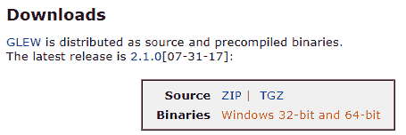

1.  接下来，我们需要下载 GLFW；这是一个平台无关的 API，用于创建窗口、读取输入和处理事件。访问 [`www.glfw.org/download.html`](https://www.glfw.org/download.html) 并下载 64 位 Windows 二进制文件。在这本书中，我们将主要关注在 Windows 平台上实现它：

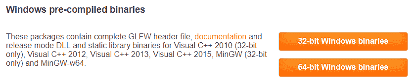

1.  接下来，我们需要下载 `glm`，它用于我们图形计算的数学运算。访问 [`glm.g-truc.net/0.9.9/index.html`](https://glm.g-truc.net/0.9.9/index.html) 并从该网站下载 GLM。

1.  现在我们已经下载了所有必需的库和头文件，我们可以开始将它们添加到我们的项目中。

1.  在项目文件根目录（Visual Studio 项目文件存储的位置）中，创建一个名为 `Dependencies` 的新目录。

1.  从此目录中提取 `glew`、`glfw` 和 `glm`；`Dependencies` 目录现在应该如下所示：

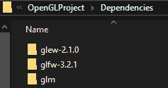

1.  打开 Visual Studio 项目。我们需要设置头文件和库文件的位置。为此，打开 `OpenGLProject` 的项目属性，将配置设置为 Release，平台设置为 x64。

1.  在 C/C++ | 通用下，选择 Additional Include Directories 并选择以下目录用于 GLEW 和 GLFW：

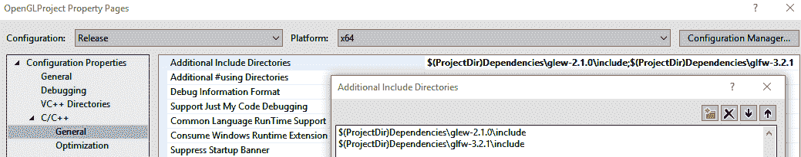

1.  接下来，在 Linker | General 下，选择 Additional Library Directories，然后选择 `glew` 和 `glfw` 目录中 `.lib` 文件的位置，如下所示：

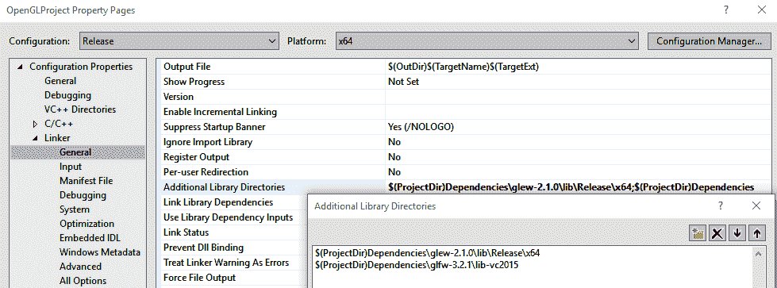

1.  接下来，我们必须转到 Linker | Input 并指定我们正在使用的 `.lib` 文件。

1.  在 Linker | Input 下，选择 Additional Dependencies 并添加 opengl32.lib、glfw3.lib 和 glew32.lib，如下所示：

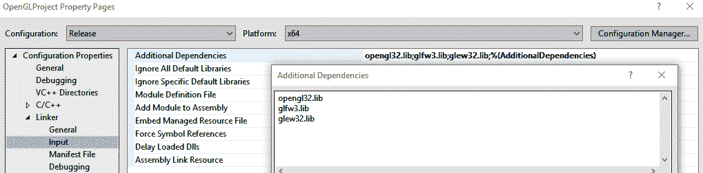

1.  虽然我们没有特别下载 `opengl32.lib`，但在更新图形硬件的驱动程序时它会自动包含。因此，请确保您正在运行最新的 GPU 驱动程序；如果不是，请从制造商的网站下载它们。

1.  最后，我们必须将 `glew32.dll` 和 `glfw3.dll` 文件添加到项目的根目录中。`glew32.dll` 在 `glew-2.1.0/bin/Release/64` 中，而 `glfw3.dll` 在 `glfw-3.2.1/lib-vc2015` 中。

1.  项目文件根目录现在应该如下所示：

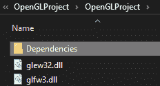

1.  在完成这些之后，我们终于可以开始着手项目了。

# 创建窗口和清屏

现在，让我们探索如何使用我们创建的 OpenGL 项目：

1.  我们首先要做的是创建一个窗口，这样我们就可以开始将游戏对象渲染到屏幕上了。

1.  创建一个新的 `.cpp` 文件；Visual Studio 会自动将其命名为 `source.cpp`，所以保持原样即可。

1.  在文件顶部，包含`glew`和`glfw`头文件。确保首先包含`glew.h`，因为它包含了需要包含的正确 OpenGL 头文件：

```cpp
#include <GL/glew.h> 
#include <GLFW/glfw3.h> 

Then create a main function and add the following to it. 

int main(int argc, char **argv) 
{ 

   glfwInit(); 

   GLFWwindow* window = glfwCreateWindow(800, 600,
    " Hello OpenGL ", NULL, NULL); 

   return 0; 
} 
```

1.  在这里，我们首先需要做的是通过调用`glfwInit()`来初始化`glfw`。

1.  一旦初始化完成，我们就可以创建一个窗口，我们的游戏场景将会在这个窗口上渲染。为了创建一个窗口，我们需要创建一个新的`GLFWWindow`实例，命名为`window`，并调用`glfwCreateWindow`函数。这个函数需要五个参数，包括窗口的宽度和高度，以及窗口的名称。最后的两个参数——`monitor`和`share`——被设置为`NULL`。`monitor`参数指定了窗口将要创建的特定显示器。如果设置为`null`，则选择默认显示器。`share`参数允许我们与用户共享窗口资源。在这里，我们将其设置为`NULL`，因为我们不想共享窗口资源。

1.  现在，运行项目；你将看到在应用程序关闭之前，窗口会短暂出现。

1.  嗯，这并不很有趣。让我们添加剩余的代码，这样我们就可以在视口中看到一些被渲染的内容。

1.  我们首先需要做的是初始化 OpenGL 上下文。OpenGL 上下文是 OpenGL 所有当前状态的集合。我们将在接下来的章节中讨论不同的状态。

1.  要做到这一点，调用`glfwMakeCurrentContext`并传入我们刚刚创建的窗口：

```cpp
glfwMakeContextCurrent(window);     
```

1.  我们现在可以通过调用`glewInit()`来初始化 GLEW。

1.  接下来，我们将在`main`函数中的`glewInit()`和`return 0`之间添加以下代码：

```cpp
   while (!glfwWindowShouldClose(window)){ 

               // render our scene 

         glfwSwapBuffers(window); 
         glfwPollEvents(); 
   } 

         glfwTerminate();
```

1.  在这里，我们创建了一个`while`循环，调用`glfwWindowShouldClose`，然后将其传递给当前窗口。当窗口打开时，将执行`glfwSwapBuffers(window);`和`glfwPollEvents();`命令。

1.  在`while`循环中，我们将渲染我们的场景。然后，我们将交换显示缓冲区。显示缓冲区是当前帧被渲染和存储的地方。当当前帧正在显示时，下一帧实际上在后台被渲染，我们看不到。当下一帧准备好时，当前帧与新的帧进行交换。这种帧的交换是通过`glfwSwapBuffer`完成的，并由 OpenGL 管理。

1.  在交换显示缓冲区之后，我们需要检查是否有任何触发的事件，例如在`glfwPollEvents()`中窗口被关闭。一旦窗口关闭，`glfw`将被终止。

1.  如果你现在运行项目，你将看到一个黑色的窗口；虽然它没有消失，但仍然不是很令人印象深刻。我们可以使用 OpenGL 以我们选择的颜色清除视口，所以让我们来做这件事。

1.  创建一个名为`void renderScene()`的新函数。从现在开始，我们将把渲染到场景中的任何内容都添加到这个函数中。将`void renderScene()`的新原型添加到`source.cpp`文件的顶部。

1.  在`renderScene`函数中，添加以下代码行：

```cpp
void renderScene(){ 

   glClear(GL_COLOR_BUFFER_BIT | GL_DEPTH_BUFFER_BIT); 
   glClearColor(1.0, 0.0, 0.0, 1.0);//clear yellow 

   // Draw game objects here 
}
```

在第一个函数中，我们调用 `glClear()`。所有 OpenGL 函数都以 `gl` 前缀开始；`glClear` 函数清除缓冲区。在这种情况下，我们要求 OpenGL 清除颜色缓冲区和深度缓冲区。颜色缓冲区存储场景中所有的颜色信息。深度缓冲区存储哪个像素在前面；这意味着如果一个像素在另一个像素后面，那么那个像素将不会被存储。这对于 3D 场景尤为重要，其中一些对象可能位于其他对象后面，并被前面的对象遮挡。我们只需要有关前面对象像素的信息，因为我们只会看到那些对象，而不会看到后面的对象。

接下来，我们调用 `glClearColor` 函数并传入一个 RGBA 值；在这种情况下，是红色。`glClearColor` 函数在每一帧中用特定的颜色清除颜色缓冲区。缓冲区需要在每一帧中清除；否则，上一帧将被当前帧中的图像覆盖。想象一下，这就像在每一帧在画板上画任何东西之前清除黑板一样。

深度缓冲区也在每一帧之后使用默认的白色颜色清除。这意味着我们不需要手动清除它，因为这将是默认操作的。

1.  现在，在交换缓冲区之前调用 `renderScene` 并再次运行项目。你应该会看到一个漂亮的黄色视口，如下所示：

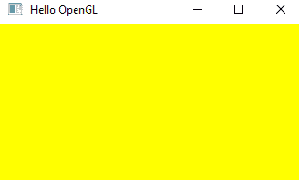

在绘制对象之前，我们必须创建一些额外的类，这些类将帮助我们定义想要绘制的形状。我们还需要创建一个相机类，以便设置一个虚拟相机，通过这个相机我们可以查看场景。此外，我们需要编写一个基本的顶点、一个 `shader` 片段和一个 `Shaderloader` 类，这些类将创建一个 `shader` 程序，我们可以使用它来渲染我们的形状。

首先，让我们创建 `Mesh` 类，这是我们定义想要绘制的不同形状的地方。

# 创建 Mesh 类

以下步骤解释了如何创建一个 `Mesh` 类：

1.  创建新的 `.h` 和 `.cpp` 文件，分别命名为 `Mesh.h` 和 `Mesh.cpp`。这些文件将用于创建一个新的 `Mesh` 类。在 `Mesh.h` 文件中，添加以下代码：

```cpp
#include <vector> 
#include "Dependencies/glm/glm/glm.hpp" 

enum MeshType { 

   kTriangle = 0, 
   kQuad = 1, 
   kCube = 2, 
   kSphere = 3 

}; 

struct Vertex { 

   glm::vec3 pos; 
   glm::vec3 normal; 
   glm::vec3 color; 
   glm::vec2 texCoords; 

}; 

class Mesh { 

public: 
   static void setTriData(std::vector<Vertex>& vertices, 
     std::vector<uint32_t>&indices); 
   static void setQuadData(std::vector<Vertex>& vertices,    
     std::vector<uint32_t>&indices); 
   static void setCubeData(std::vector<Vertex>& vertices, 
     std::vector<uint32_t>&indices); 
   static void setSphereData(std::vector<Vertex>& vertices, 
     std::vector<uint32_t>&indices); 

};
```

1.  在 `Mesh.h` 文件的顶部，我们包含一个向量，以便我们可以将点存储在向量中，并包含 `glm.hpp`。这将帮助我们使用 `vec3` 变量在空间中定义点。

1.  然后，我们创建一个新的 `enum` 类型，称为 `MeshType`，并创建四种类型：`Mesh Triangle`、`Quad`、`Cube` 和 `Sphere`。我们这样做是为了指定我们使用的网格类型，并且数据将相应地填充。

1.  接下来，我们创建一个新的 `struct` 类型，称为 `Vertex`，它有 `vec3` 属性，分别命名为 `pos`、`Color` 和 `Normal`，以及一个 `vec2` 属性，称为 `textCoords`。

每个顶点都有某些属性，例如 `Position`、`Color`、`Normal` 和 `Texture Coordinate`。`Position` 和 `Color` 分别存储每个顶点的位置和颜色信息。`Normal` 指定法线属性指向的方向，而 `Texture Coordinate` 指定纹理应该如何布局。当介绍光照和如何将纹理应用到我们的对象时，我们将介绍法线和纹理坐标属性。

1.  然后，创建 `Mesh` 类。这个类有四个函数，用于设置每个顶点的顶点和索引数据。

1.  在 `Mesh.cpp` 文件中，我们包含 `Mesh.h` 文件并设置四个形状的数据。以下是如何 `setTriData` 为顶点和索引设置值的示例：

```cpp
#include "Mesh.h" 

void Mesh::setTriData(std::vector<Vertex>& vertices, std::vector<uint32_t>& indices) { 

   std::vector<Vertex> _vertices = { 

{ { 0.0f, -1.0f, 0.0f },          // Position 
{ 0.0f, 0.0f, 1.0 },              // Normal 
{ 1.0f, 0.0f, 0.0 },              // Color 
{ 0.0, 1.0 }                      // Texture Coordinate 
},                                // 0 

         { { 1.0f, 1.0f, 0.0f },{ 0.0f, 0.0f, 1.0 },{ 0.0f, 1.0f, 
          0.0 },{ 0.0, 0.0 } }, // 1 

         { { -1.0f, 1.0f, 0.0f },{ 0.0f, 0.0f, 1.0 },{ 0.0f, 0.0f, 
          1.0 },{ 1.0, 0.0 } }, // 2 
   }; 

   std::vector<uint32_t> _indices = { 
         0, 1, 2, 
   }; 

   vertices.clear(); indices.clear(); 

   vertices = _vertices; 
   indices = _indices; 
} 
```

1.  对于三角形的三个顶点，我们在 `vertices` 向量中设置位置、法线、颜色和纹理坐标信息。

接下来，我们在 `indices` 向量中设置索引。关于其他函数的定义，您可以参考本书附带的项目。然后，我们将 `_vertices` 和 `_indices` 向量分别设置为引用顶点和索引。

# 创建 `Camera` 类

以下步骤将帮助您创建 `Camera` 类：

1.  创建两个文件：`Camera.h` 和 `Camera.cpp`。在 `Camera.h` 文件中，包含以下代码：

```cpp
#include <GL/glew.h> 

#include "Dependencies/glm/glm/glm.hpp" 
#include "Dependencies/glm/glm/gtc/matrix_transform.hpp" 

```

1.  然后，创建 `Camera` 类本身，如下所示：

```cpp
class Camera 
{ 
public: 

   Camera(GLfloat FOV, GLfloat width, GLfloat height, GLfloat 
     nearPlane, GLfloat farPlane, glm::vec3 camPos); 
   ~Camera(); 

   glm::mat4 getViewMatrix(); 
   glm::mat4 getProjectionMatrix(); 
   glm::vec3 getCameraPosition(); 

private: 

   glm::mat4 viewMatrix; 
   glm::mat4 projectionMatrix; 
   glm::vec3 cameraPos; 

};
```

1.  在 `camera` 类的构造函数和公共区域中，我们获取**视野**（**FOV**）、视口的宽度和高度、到 `nearPlane` 的距离、到 `farPlane` 的距离以及我们想要设置相机位置的坐标。

1.  我们还添加了三个获取器来获取视图矩阵、投影矩阵和相机位置。

1.  在私有部分，我们创建三个变量：两个用于设置视图和投影矩阵的 4x4 矩阵和一个 `vec3` 属性来指定相机位置。

1.  在 `Camera.cpp` 文件中，我们在顶部包含 `Camera.h` 文件并创建 `camera` 构造函数，如下所示：

```cpp
#include "Camera.h" 

Camera::Camera(GLfloat FOV, GLfloat width, GLfloat height, GLfloat nearPlane, GLfloat farPlane, glm::vec3 camPos){ 

   cameraPos = camPos; 
   glm::vec3 cameraFront = glm::vec3(0.0f, 0.0f, 0.0f); 
   glm::vec3 cameraUp = glm::vec3(0.0f, 1.0f, 0.0f); 

   viewMatrix = glm::lookAt(cameraPos, cameraFront, cameraUp); 
   projectionMatrix = glm::perspective(FOV, width /height, 
                      nearPlane, farPlane); 
} 
```

1.  在构造函数中，我们将相机位置设置为局部变量，并设置两个名为 `cameraFront` 和 `cameraUp` 的 `vec3` 属性。我们的相机将是一个静止的相机，始终朝向世界坐标的中心；`up` 向量始终指向正 y 轴。

1.  要创建 `viewMatrix`，我们调用 `glm::lookAt` 函数，并传入 `cameraPos`、`cameraFront` 和 `cameraUp` 向量。

1.  我们通过设置 `FOV` 的 `FOV` 值来创建投影矩阵；这是一个由 `width` 值除以 `height`、`nearPlane` 和 `farPlane` 值给出的宽高比。

1.  在设置视图和投影矩阵后，我们现在可以创建获取器函数，如下所示：

```cpp
glm::mat4 Camera::getViewMatrix() { 

   return viewMatrix; 
} 
glm::mat4 Camera::getProjectionMatrix() { 

   return projectionMatrix; 
} 

glm::vec3 Camera::getCameraPosition() { 

   return cameraPos; 
} 
```

接下来，我们将创建 `shaderLoader` 类，这将使我们能够创建 `shader` 程序。

# `ShaderLoader` 类

以下步骤将向您展示如何在 OpenGL 项目中实现 `ShaderLoader` 类：

1.  在 `ShaderLoader` 类中，创建一个名为 `createProgram` 的公共函数，它接收顶点和片段 `shader` 文件。

1.  我们还将创建两个私有函数：`readShader`，它返回一个字符串，以及 `createShader`，它返回一个无符号的 GL `int`：

```cpp
#include <GL/glew.h> 

class ShaderLoader { 

   public: 

         GLuint CreateProgram(const char* vertexShaderFilename, 
           const char* fragmentShaderFilename); 

   private: 

         std::string readShader(const char *filename); 
         GLuint createShader(GLenum shaderType, std::string source, 
           const char* shaderName); 
};
```

1.  在 `ShaderLoader.cpp` 文件中，我们包含我们的 `ShaderLoader.h` 头文件、`iostream` 系统头文件和 `fstream` 向量，如下所示：

```cpp
#include "ShaderLoader.h"  

#include<iostream> 
#include<fstream> 
#include<vector>
```

`iostream` 用于当你想要将某些内容打印到控制台时；`fstream` 用于读取文件。我们将需要它，因为我们将会传递顶点和着色器文件给 `fstream` 读取，以及用于存储字符字符串的向量。

1.  首先，我们创建 `readerShader` 函数；这将用于读取我们传递的 `shader` 文件：

```cpp
std::string ShaderLoader::readShader(const char *filename) 
{ 
   std::string shaderCode; 
   std::ifstream file(filename, std::ios::in); 

   if (!file.good()){ 
         std::cout << "Can't read file " << filename << std::endl; 
         std::terminate(); 
   } 

   file.seekg(0, std::ios::end); 
   shaderCode.resize((unsigned int)file.tellg()); 
   file.seekg(0, std::ios::beg); 
   file.read(&shaderCode[0], shaderCode.size()); 
   file.close(); 
   return shaderCode; 
} 

```

`shader` 文件的内容随后被存储在一个字符串中并返回。

1.  接下来，我们创建 `createShader` 函数，该函数将实际编译着色器，如下所示：

```cpp
GLuint ShaderLoader::createShader(GLenum shaderType, std::string source, const char* shaderName) 
{ 

   int compile_result = 0; 

   GLuint shader = glCreateShader(shaderType); 
   const char *shader_code_ptr = source.c_str(); 
   const int shader_code_size = source.size(); 

   glShaderSource(shader, 1, &shader_code_ptr, 
     &shader_code_size); 
   glCompileShader(shader); 
   glGetShaderiv(shader, GL_COMPILE_STATUS, 
     &compile_result); 

   //check for errors 

   if (compile_result == GL_FALSE) 
   { 

         int info_log_length = 0; 
         glGetShaderiv(shader, GL_INFO_LOG_LENGTH, 
           &info_log_length); 

         std::vector<char> shader_log(info_log_length); 

         glGetShaderInfoLog(shader, info_log_length, NULL, 
           &shader_log[0]); 
         std::cout << "ERROR compiling shader: " << 
          shaderName << std::endl <<&shader_log[0] <<
          std::endl; 
         return 0; 
   } 
   return shader; 
}  
```

1.  `CreateShader` 函数接收以下三个参数：

+   第一个参数是 `enum` 参数，称为 `shaderType`，它指定了要编译的 `shader` 类型。在这种情况下，它可以是顶点着色器或片段着色器。

+   第二个参数是包含着色器代码的字符串。

+   最后一个参数是包含 `shader` 类型的字符串，它将用于指定在编译 `shader` 类型时是否存在问题。

1.  在 `CreateShader` 函数中，我们调用 `glCreateShader` 以指定正在创建的着色器类型；然后，调用 `glCompileShader` 编译着色器。之后，我们获取着色器的编译结果。

1.  如果编译着色器存在问题，那么我们将发送一条消息，说明存在编译着色器的错误，并附带 `shaderLog`，其中将详细说明编译错误。如果没有错误发生，则返回着色器。

1.  最后一个函数是 `createProgram` 函数，它接收 `vertex` 和 `fragment` 着色器：

```cpp
GLuint ShaderLoader::createProgram (const char* vertexShaderFilename, const char* fragmentShaderFilename){

  std::string vertex_shader_code = readShader 
                                   (vertexShaderFilename);

  std::string fragment_shader_code = readShader 
                                     (fragmentShaderFilename);

  GLuint vertex_shader = createShader (GL_VERTEX_SHADER, 
                         vertex_shader_code,
                         “vertex shader” );

  GLuint fragment_shader = createShader (GL_FRAGMENT_SHADER, 
                           fragment_shader_code,
                           “fragment shader”);

  int link_result = 0;
  //create the program handle, attach the shaders and link it
  GLuint program = glCreateProgram();
  glAttachShader(program, vertex_shader);
  glAttachShader(program, fragment_shader);

  glLinkProgram(program);
  glGetProgramiv(program, GL_LINK_STATUS, &link_result);
  //check for link errors
  if (link_result == GL_FALSE) {

    int info_log_length = 0;
    glGetProgramiv(program, GL_INFO_LOG_LENGTH, &info_log_length);

    std::vector<char> program_log(info_log_length);

    glGetProgramInfoLog(program, info_log_length, NULL, 
      &program_log[0]);
    std::cout << “Shader Loader : LINK ERROR” << std::endl 
      <<&program_log[0] << std::endl;

    return 0;
  }
  return program;
}
```

1.  此函数接收顶点和片段着色器文件，读取它们，然后编译这两个文件。

1.  然后，我们通过调用 `glCreateProgram()` 创建一个新的 `shaderProgram` 函数并将其分配给程序。

1.  现在，我们必须通过调用 `glAttachShader` 并传递程序和着色器来将两个着色器附加到程序上。

1.  最后，我们通过调用 `glLinkProgram` 链接程序。之后，我们传递程序并检查是否有链接错误。

1.  如果存在任何链接错误，我们将向控制台发送错误消息，并附带一个程序日志，其中将详细说明链接错误。如果没有错误，则返回程序。

# 光照渲染器类

现在，是时候绘制我们的第一个对象了；为此，执行以下步骤：

1.  我们将在当前场景上方绘制一个基本的光源，以便我们可以可视化光源在场景中的位置。我们将使用这个光源的位置来计算我们对象上的光照。请注意，具有平面着色的对象不需要在其上进行光照计算。

1.  首先，创建一个`LightRenderer.h`文件和一个`.cpp`文件，然后创建`LightRenderer`类。

1.  在`LightRenderer.h`文件的顶部，包含以下头文件：

```cpp
#include <GL/glew.h> 

#include "Dependencies/glm/glm/glm.hpp" 
#include "Dependencies/glm/glm/gtc/type_ptr.hpp" 

#include "Mesh.h" 
#include "ShaderLoader.h"; 
#include "Camera.h"  
```

1.  我们需要`glew.h`来调用 OpenGL 命令，同时我们需要`glm`头文件来定义`vec3`和矩阵。

1.  我们还需要`Mesh.h`，它允许我们在光源中定义光的形状。你可以使用`ShaderLoader`类来加载着色器以渲染对象，并使用`Camera.h`来获取相机在场景中的位置、视图和投影矩阵。

1.  我们接下来将创建`LightRenderer`类：

```cpp
class LightRenderer 
{ 

}; 
```

我们将向这个类添加以下`public`部分：

```cpp
public: 
   LightRenderer(MeshType meshType, Camera* camera); 
   ~LightRenderer(); 

   void draw(); 

   void setPosition(glm::vec3 _position); 
   void setColor(glm::vec3 _color); 
   void setProgram(GLuint program); 

   glm::vec3 getPosition(); 
   glm::vec3 getColor(); 

```

1.  在公共部分，我们创建一个构造函数，我们将传递`MeshType`给它；这将用于设置我们想要渲染的对象的形状。然后，我们有析构函数。在这里，我们有一个名为`draw`的函数，它将用于绘制网格。然后，我们有几个设置器用于设置对象的位置、颜色和着色器程序。

1.  在定义公共部分之后，我们设置`private`部分，如下所示：

```cpp
private: 

   Camera* camera; 

   std::vector<Vertex>vertices; 
   std::vector<GLuint>indices; 

glm::vec3 position, color; 

GLuint vbo, ebo, vao, program;  
```

1.  在`private`部分，我们有一个`private`变量，以便我们可以局部存储相机。我们创建向量来存储顶点和索引数据；我们还创建局部变量来存储位置和颜色信息。然后，我们有`GLuint`，它将存储`vbo`、`ebo`、`vao`和程序变量。

程序变量将包含我们想要用于绘制对象的着色器程序。然后，我们有`vbo`，代表顶点缓冲对象；`ebo`，代表元素缓冲对象；以及`vao`，代表顶点数组对象。让我们检查这些缓冲对象并了解它们的作用：

+   **顶点缓冲对象**（**VBO**）：这是几何信息；它包括位置、颜色、法线和纹理坐标等属性。这些属性在 GPU 上按顶点存储。

+   **元素缓冲对象**（**EBO**）：用于存储每个顶点的索引，并在绘制网格时使用。

+   **顶点数组对象**（**VAO**）：这是一个辅助容器对象，用于存储所有的 VBOs 和属性。当你为每个对象渲染每一帧时，你可能会有多个 VBOs，因此再次绑定 VBOs 会变得繁琐。

缓冲区用于在 GPU 内存中存储信息，以便快速高效地访问数据。现代 GPU 的内存带宽大约为 600 GB/s，与当前高端 CPU 的约 12 GB/s 相比，这是一个巨大的差距。

缓冲区对象用于存储、检索和移动数据。在 OpenGL 中生成缓冲区对象非常容易。你可以通过调用`glGenBuffers()`轻松地生成一个。

这就是`LightRender.h`的全部内容；现在，让我们继续到`LightRenderer.cpp`，如下所示：

1.  在`LightRenderer.cpp`的顶部，包含`LightRenderer.h`。然后，添加构造函数，如下所示：

```cpp
LightRenderer::LightRenderer(MeshType meshType, Camera* camera) { 

} 
```

1.  在`LightRenderer`构造函数中，我们开始添加代码。首先，我们初始化本地相机，如下所示：

```cpp
this->camera = camera; 
```

1.  接着，我们设置我们想要绘制的对象的形状，这取决于`MeshType`类型。为此，我们将创建一个`switch`语句并调用适当的`setData`函数，如下所示：

```cpp
   switch (modelType) { 

         case kTriangle: Mesh::setTriData(vertices, indices); 
           break; 
         case kQuad: Mesh::setQuadData(vertices, indices); break; 
         case kCube: Mesh::setCubeData(vertices, indices); break; 
         case kSphere: Mesh::setSphereData(vertices, indices); 
           break; 
   }  
```

1.  接下来，我们将生成并绑定`vao`缓冲区对象，如下所示：

```cpp
glGenVertexArrays(1, &vao); 
glBindVertexArray(vao); 

```

`glGenVertexArrays`函数需要两个参数；第一个参数是我们想要生成的顶点数组对象名称的数量。在这种情况下，我们只想创建一个，所以它被这样指定。第二个参数接受一个数组，其中存储了顶点数组名称，因此我们传递了`vao`缓冲区对象。

1.  接下来调用`glBindVertexArray`函数，并将`vao`传递给它以绑定`vao`缓冲区对象。`vao`缓冲区对象将在应用程序的整个运行期间被绑定。缓冲区是一个管理特定内存块的对象；缓冲区可以是不同类型的，因此它们需要绑定到特定的缓冲区目标，以便它们可以为缓冲区赋予意义。

1.  一旦`vao`缓冲区对象被绑定，我们就可以生成顶点缓冲区对象并存储顶点属性。

1.  要生成顶点缓冲区对象，我们调用`glGenBuffers()`；这也需要两个参数。第一个参数是我们想要生成的缓冲区数量，而第二个参数是 VBO 数组。在这种情况下，因为我们只有一个`vbo`缓冲区对象，所以我们将第一个参数设置为`1`，并将`vbo`作为第二个参数传递：

```cpp
glGenBuffers(1, &vbo);  
```

1.  接下来，我们必须指定缓冲区类型。这是通过使用`glBindBuffer()`函数完成的；它再次需要两个参数。第一个是缓冲区类型，在这种情况下，它是`GL_ARRAY_BUFFER`类型，而第二个参数是缓冲区对象的名称，即`vbo`。现在，添加以下代码行：

```cpp
glBindBuffer(GL_ARRAY_BUFFER, vbo);
```

1.  在下一步中，我们实际上传递了我们要存储在缓冲区中的数据。这是通过调用`glBufferData`完成的；`glBufferData`函数需要四个参数：

+   第一个参数是缓冲区类型，在这种情况下，是`GL_ARRAY_BUFFER`。

+   第二个参数是要存储的缓冲区数据的字节数。

+   第三个参数是指向数据的指针，该数据将被复制。

+   第四个参数是存储数据的预期用途。

在我们的情况下，我们只需修改一次数据并多次使用它，所以它将被称为`GL_STATIC_DRAW`。

1.  现在，添加用于存储数据的`glBufferData`函数，如下所示：

```cpp
glBufferData(GL_ARRAY_BUFFER,  
sizeof(Vertex) * vertices.size(),  
&vertices[0],  
GL_STATIC_DRAW); 
```

现在，我们必须设置我们将要使用的顶点属性。在创建`struct`顶点时，我们有位置、颜色、法线和纹理坐标等属性；然而，我们可能并不总是需要所有这些属性。因此，我们只需要指定我们需要的属性。在我们的例子中，由于我们不使用任何光照计算或应用任何纹理到对象上，我们不需要指定这些属性——我们现在只需要位置和颜色属性。然而，这些属性需要首先启用。

1.  要启用这些属性，我们将调用`glEnableVertexAttribArray`并传入我们想要启用的索引。位置将在 0 号索引，因此我们将值设置为如下：

```cpp
glEnableVertexAttribArray(0);   
```

1.  接下来，我们调用`glVertexAttribPointer`以便我们可以设置我们想要使用的属性。第一个属性将位于 0 号索引。这需要六个参数，如下所示：

+   第一个参数是顶点属性的索引，在这个例子中，它是 0。

+   第二个参数是属性的大小。本质上，这是顶点属性拥有的组件数量。在这种情况下，它是*x*、*y*和*z*组件的位置，因此指定为`3`。

+   第三个参数用于组件的变量类型；由于它们在`GLfloat`中指定，我们指定`GL_FLOAT`。

+   第四个参数是一个布尔值，指定值是否应该被归一化或是否应该转换为定点值。由于我们不希望值被归一化，我们指定`GL_FALSE`。

+   第五个参数称为步长，它是连续顶点属性之间的偏移量。想象一下顶点在内存中的布局如下。步长指的是你将必须通过以到达下一组顶点属性；这是`struct`顶点的大小：

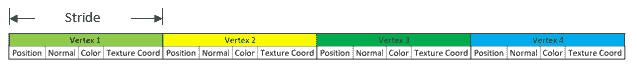

+   第六个参数是顶点属性在`struct`顶点中第一个组件的偏移量。我们正在查看的属性是位置属性，它在`struct`顶点的开始处，因此我们将传递`0`：

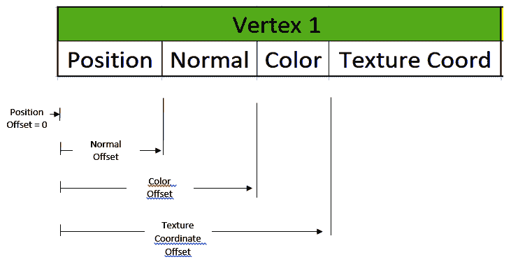

1.  设置`glVertexAttribute`指针，如下所示：

```cpp
glVertexAttribPointer(0, 3, GL_FLOAT, GL_FALSE, sizeof(Vertex), (GLvoid*)0);
```

1.  让我们再创建一个属性指针，以便我们可以为对象着色。像之前一样，我们需要启用属性并设置`attrib`指针，如下所示：

```cpp
glEnableVertexAttribArray(1); 
glVertexAttribPointer(1, 3, GL_FLOAT, GL_FALSE, sizeof(Vertex), (void*)(offsetof(Vertex, Vertex::color))); 

```

1.  由于下一个属性索引是`1`，我们使用`1`启用属性数组。在设置属性指针时，第一个参数是`1`，因为这是第一个索引。`color`有三个组件——*r*、*g*和*b*——所以下一个参数是`3`。颜色定义为浮点数，因此我们指定`GL_FLOAT`作为此参数。

1.  由于我们不希望第四个参数被归一化，我们将参数设置为 `GL_FALSE`。第五个参数是步长，它仍然等于 `struct` 顶点的尺寸。最后，对于偏移量，我们使用 `offsetof` 函数来设置 `struct` 顶点中 `vertex::color` 的偏移量。

接下来，我们必须设置元素缓冲区对象。这是通过与设置顶点缓冲区对象相同的方式进行：我们需要生成元素，设置绑定，然后将数据绑定到缓冲区，如下所示：

1.  首先，我们通过调用 `glGenBuffers` 来生成缓冲区。这是通过传递我们想要创建的缓冲区数量，即 `1`，然后传递要生成的缓冲区对象的名称来完成的：

```cpp
glGenBuffers(1, &ebo); 
glBindBuffer(GL_ELEMENT_ARRAY_BUFFER, ebo); 

glBufferData(GL_ELEMENT_ARRAY_BUFFER, sizeof(GLuint) * indices.size(), &indices[0], GL_STATIC_DRAW); 
```

1.  然后，我们将缓冲区类型绑定到缓冲区对象上，在这个例子中，它是 `GL_ELEMENT_ARRAY_BUFFER`。它将存储元素或索引数据。

1.  然后，我们通过调用 `glBufferData` 来设置索引数据本身。我们首先传递缓冲区类型，设置元素数据的大小，然后传递数据和用法 `GL_STATIC_DRAW`，就像我们之前做的那样。

1.  在构造函数的末尾，我们作为预防措施解绑缓冲区和顶点数组：

```cpp
glBindBuffer(GL_ARRAY_BUFFER, 0); 
glBindVertexArray(0);
```

1.  接下来，我们将创建一个名为 `draw` 的函数；这个函数将用于绘制对象本身。为此，添加以下 `draw` 函数：

```cpp
void LightRenderer::draw() { 

}
```

1.  我们将使用这个函数来添加绘制对象的代码。我们首先要做的是创建一个名为 `model` 的 `glm::mat4` 函数并初始化它；然后，我们将使用 `glm::translate` 函数将对象移动到所需的位置：

```cpp
glm::mat4 model = glm::mat4(1.0f); 

   model = glm::translate(glm::mat4(1.0),position); 
```

接下来，我们将设置模型、视图和投影矩阵来将对象从其局部空间转换。这已经在 第二章 中介绍过，即 *数学和图形概念*，所以现在是你去复习图形概念的好时机。

模型、视图和投影矩阵在顶点着色器中设置。通过调用 `glUseProgram` 并传入一个着色器程序来将信息发送到着色器。

```cpp
glUseProgram(this->program); 
```

然后，我们可以通过统一变量发送所需的信息。在着色器中，我们将使用一个名称创建一个统一数据类型。在 `draw` 函数中，我们需要通过调用 `glGetUniformLocation` 来获取这个统一变量的位置，然后传递程序和我们在着色器中设置的变量字符串，如下所示：

```cpp
   GLint modelLoc = glGetUniformLocation(program, "model"); 
```

这将返回一个包含变量位置的 `GLuint` 值，在这里是模型矩阵。

现在，我们可以使用`glUniform`函数设置模型矩阵的值。由于我们正在设置一个矩阵统一变量，我们使用`glUniformMatrix3fv`函数；它接受四个参数。第一个参数是我们之前获得的定位，第二个参数是我们传递的数据量；在这种情况下，我们只传递一个矩阵，所以我们将其指定为`1`。第三个参数是一个布尔值，它指定数据是否需要转置。我们不希望矩阵被转置，所以我们将其指定为`GL_FALSE`。最后一个参数是数据的指针，`gl::ptr_value`；我们将其传递给模型矩阵。

现在，添加设置模型矩阵的函数，如下所示：

```cpp
glUniformMatrix4fv(modelLoc, 1, GL_FALSE, glm::value_ptr(model));
```

与模型矩阵类似，我们必须将视图和投影矩阵传递给着色器。为此，我们从`camera`类中获取视图和投影矩阵。然后，我们获取在着色器中定义的统一变量的位置，并使用`glUniformMatrix4fv`函数设置视图和投影矩阵的值：

```cpp
   glm::mat4 view = camera->getViewMatrix(); 
   GLint vLoc = glGetUniformLocation(program, "view"); 
   glUniformMatrix4fv(vLoc, 1, GL_FALSE, glm::value_ptr(view)); 

   glm::mat4 proj = camera->getprojectionMatrix(); 
   GLint pLoc = glGetUniformLocation(program, "projection"); 
   glUniformMatrix4fv(pLoc, 1, GL_FALSE, glm::value_ptr(proj)); 
```

一旦我们有了绘制对象所需的所有数据，我们就可以最终绘制对象了。在这个时候，我们调用`glBindVertexArray`，绑定`vao`缓冲区对象，然后调用`glDrawElements`函数来绘制对象。

`glDrawElements`函数接受四个参数。第一个参数是我们可以通过调用`GL_LINES`来绘制的线条模式。或者，我们可以使用`GL_TRIANGLES`来绘制三角形。实际上，还有更多类型的模式可以指定，但在这个案例中，我们只会指定`GL_TRIANGLES`。

第二个参数是需要绘制的元素数量或索引数量。这是在我们创建对象时指定的。第三个参数是我们将要传递的索引数据类型，它是`GL_UNSIGNED_INT`类型。最后一个参数是索引存储的位置——这被设置为 0。

添加以下代码行：

```cpp
glBindVertexArray(vao); 
glDrawElements(GL_TRIANGLES, indices.size(), GL_UNSIGNED_INT, 0); 
```

为了安全起见，我们将通过将它们的值设置为`0`来解绑顶点数组和程序变量：

```cpp
glBindVertexArray(0); 
glUseProgram(0); 

```

这标志着`draw`函数的结束。

添加析构函数以及其余的设置器和获取器以完成类的定义，如下所示：

```cpp
LightRenderer::~LightRenderer() { 

} 

void LightRenderer::setPosition(glm::vec3 _position) { 

   position = _position; 
} 

void LightRenderer::setColor(glm::vec3 _color) { 

   this->color = _color; 
} 

void LightRenderer::setProgram(GLuint _program) { 

   this->program = _program; 
} 

//getters 
glm::vec3 LightRenderer::getPosition() { 

   return position; 
} 

glm::vec3 LightRenderer::getColor() { 

   return color; 
} 

```

# 绘制对象

让我们回到`source.cpp`文件，并按照以下方式渲染`LightRenderer`：

1.  在文件顶部，包含`ShaderLoader.h`、`Camera.h`和`LightRenderer.h`，然后创建一个名为`camera`和`light`的`Camera`和`LightRenderer`类实例，如下所示：

```cpp
#include "ShaderLoader.h" 
#include "Camera.h" 
#include "LightRenderer.h" 
Camera* camera; 
LightRenderer* light;
```

1.  创建一个名为`initGame`的新函数，并将其原型添加到文件顶部。在`gameInit`函数中，加载着色器并初始化相机和光源。

1.  添加新的函数，如下所示：

```cpp
 void initGame(){ 
... 

}  
```

1.  我们首先要做的是启用深度测试，以便只绘制前方的像素。这是通过调用`glEnable()`函数并传入`GL_DEPTH_TEST`变量来完成的；这将启用以下深度测试：

```cpp
   glEnable(GL_DEPTH_TEST); 
```

1.  接下来，在`init`函数中，我们将创建一个名为`shader`的新`ShaderLoader`实例。然后，我们需要调用`createProgram`函数并将顶点和片段着色器文件传递进去以着色光源。程序将返回一个`GLuint`值，我们将其存储在一个名为`flatShaderProgram`的变量中，如下所示：

```cpp
ShaderLoader shader; 

GLuint flatShaderProgram = shader.createProgram("Assets/Shaders/FlatModel.vs", "Assets/Shaders/FlatModel.fs"); 
```

1.  顶点和着色器文件位于`Shaders`文件夹下的`Assets`文件夹中；`FlatModel.vs`文件将如下所示：

```cpp
#version 450 core 

layout (location = 0) in vec3 Position; 
layout (location = 1) in vec3 Color; 

uniform mat4 projection; 
uniform mat4 view; 
uniform mat4 model; 

out vec3 outColor; 

void main(){ 

   gl_Position = projection * view * model * vec4(Position, 1.0); 

   outColor = Color; 
}
```

`#version`指定了我们使用的 GLSL 版本，即`450`。这代表 OpenGL 版本 4.50。接下来，`layout (location = 0)`和`layout (location = 1)`指定了传入的顶点属性的位置；在这种情况下，这是位置和颜色。`0`和`1`索引对应于设置`vertexAttribPointer`时的索引号。在指定的变量中，这些数据被放置在着色器中，并存储在着色器特定的`vec3`数据类型中，称为`Position`和`Color`。

我们从`draw`调用中发送的用于存储模型、视图和投影矩阵的三个统一变量存储在一个名为`uniform`的变量类型和一个`mat4`存储数据类型中，两者都是矩阵类型。之后，我们创建另一个名为`out`类型的变量，指定这将从顶点着色器发送出去；这是`vec3`类型，称为`outColor`。接下来，所有实际工作都在`main`函数内部完成。为此，我们通过乘以模型、视图和投影矩阵来变换局部坐标系。结果是存储在名为`gl_Position`的 GLSL 内建变量中——这是物体的最终位置。然后，我们将`Color`属性存储在我们创建的名为`outColor`的`out vec3`变量中——这就是顶点着色器的工作内容！

1.  接下来，让我们看一下片段着色器的`FlatModel.fs`文件：

```cpp
#version 450 core 

in vec3 outColor; 

out vec4 color; 

void main(){ 

   color = vec4(outColor, 1.0f); 

} 

```

在片段着色器文件中，我们也指定了我们使用的 GLSL 版本。

接下来，我们指定一个名为`outColor`的`in vec3`变量，它将是从顶点着色器发送出的颜色。这可以在片段着色器中使用。我们还创建了一个名为`color`的`out vec4`变量，它将从片段着色器发送出去，并用于着色物体。从片段着色器发送出的颜色预期是一个`vec4`变量。然后，在主函数中，我们将`outColor`从`vec3`变量转换为`vec4`变量，并将其设置为`color`变量。

在着色器中，我们可以通过执行以下操作将`vec3`变量转换为`vec4`变量。这看起来可能有点奇怪，但为了方便起见，这种独特功能在着色器编程中可用，使我们的生活变得稍微容易一些。

1.  返回到`source.cpp`文件，当我们传递顶点和片段着色器文件时，它们将创建`flatShaderProgram`。接下来，在`initGame`函数中，我们创建并初始化相机，如下所示：

```cpp
camera = new Camera(45.0f, 800, 600, 0.1f, 100.0f, glm::vec3(0.0f, 
         4.0f, 6.0f)); 
```

这里，我们创建了一个具有`45`度视野、宽度和高度为`800` x `600`、近平面和远平面分别为`0.1f`和`100.0f`的新相机，以及沿*X*轴`0`的位置、沿 Y 轴`4.0`的位置和沿 Z 轴`6.0`的位置。

1.  接下来，我们创建`light`，如下所示：

```cpp
light = new LightRenderer(MeshType::kTriangle, camera); 
light->setProgram(flatShaderProgram); 
light->setPosition(glm::vec3(0.0f, 0.0f, 0.0f)); 
```

1.  这是通过三角形的形状实现的，然后将其传递给相机。然后，我们将着色器设置为`flatShaderProgram`并将位置设置为世界中心。

1.  现在，我们在`renderScene()`函数中调用光的`draw`函数，如下所示：

```cpp
void renderScene(){ 

   glClear(GL_COLOR_BUFFER_BIT | GL_DEPTH_BUFFER_BIT); 
   glClearColor(1.0, 1.0, 0.0, 1.0);//clear yellow  
   light->draw(); 

}
```

1.  我将清除屏幕颜色改为黄色，以便可以清楚地看到三角形。接下来，在`main`函数中调用`initGame`函数，如下所示：

```cpp
int main(int argc, char **argv) 
{ 

   glfwInit(); 

   GLFWwindow* window = glfwCreateWindow(800, 600, 
                        " Hello OpenGL ", NULL, NULL); 

   glfwMakeContextCurrent(window); 

   glewInit(); 

   initGame(); 

   while (!glfwWindowShouldClose(window)){ 

         renderScene(); 

         glfwSwapBuffers(window); 
         glfwPollEvents(); 
   } 

   glfwTerminate(); 

   delete camera; 
   delete light; 

   return 0; 
}
```

1.  在最后删除相机和光源，以便释放系统资源。

1.  现在，运行项目以查看我们设置为光源形状的辉煌三角形：

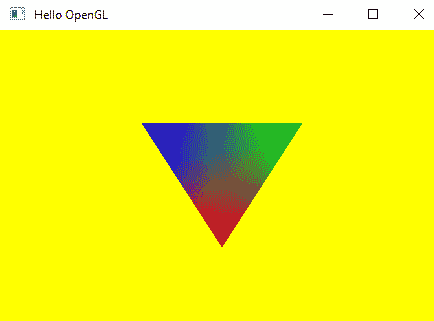

1.  将`MeshType`类型更改为`cube`以查看绘制的是立方体：

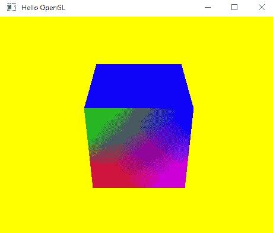

如果你得到错误而不是彩色对象作为输出，那么这可能意味着你做错了什么，或者你的驱动程序没有更新，你的 GPU 不支持 OpenGL 4.5。

1.  为了确保 GLFW 支持你的驱动程序版本，添加以下代码，该代码检查任何 GLFW 错误。然后，运行项目并查看控制台输出中的任何错误：

```cpp
static void glfwError(int id, const char* description)
{
  std::cout << description << std::endl;
}

int main(int argc, char **argv)
{

  glfwSetErrorCallback(&glfwError);

  glfwInit();

  GLFWwindow* window = glfwCreateWindow(800, 600, " Hello OpenGL ", 
                       NULL, NULL);

  glfwMakeContextCurrent(window);

  glewInit();

  initGame();

  while (!glfwWindowShouldClose(window)){

    renderScene();

    glfwSwapBuffers(window);
    glfwPollEvents();
  }

  glfwTerminate();

  delete camera;
  delete light;

  return 0;
}
```

如果你得到以下输出，那么这可能意味着你使用的 OpenGL 版本不受支持：

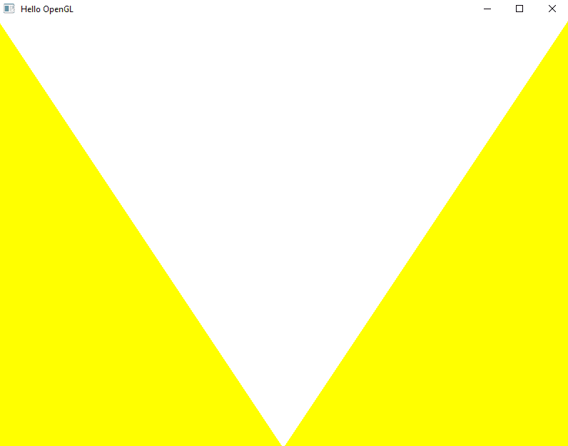

这将伴随着以下错误，提示你使用的 GLSL 版本不受支持：

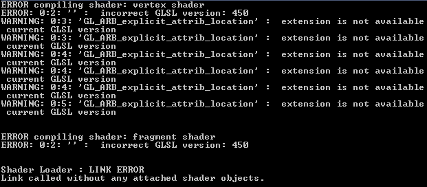

在这种情况下，将着色器顶部代码的版本更改为`330`而不是`450`，然后再次尝试运行项目。

这应该会给出你期望的输出。

# 摘要

在本章中，我们创建了一个新的 OpenGL 项目并添加了必要的库以使项目工作。然后，我们使用 GLFW 创建了一个新窗口进行工作。在编写几行代码之后，我们能够使用我们选择的颜色清除视口。

接下来，我们开始准备一些可以帮助我们绘制对象（如`Mesh`类，它定义了对象的形状，以及我们用来查看对象的`Camera`类）的类。然后，我们创建了一个`ShaderLoader`类，它帮助我们创建用于绘制对象的着色器程序。

在完成必要的准备后，我们创建了一个`LightRenderer`类。这个类用于绘制一个代表由形状定义的光源位置的对象。我们使用这个类来绘制我们的第一个对象。

在下一章中，我们将探讨如何通过向渲染引擎添加纹理和物理效果来绘制其他对象。
