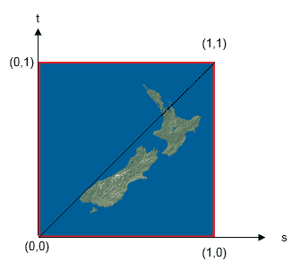
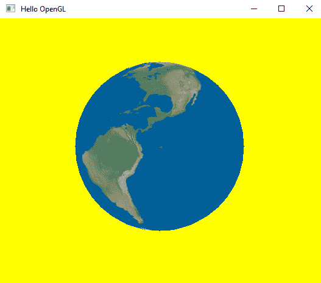
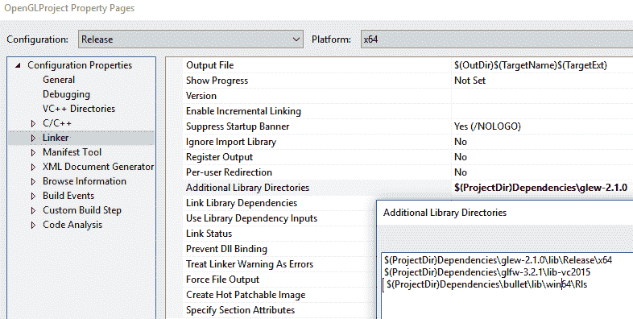
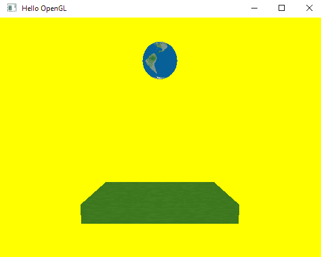

# 第七章：基于 Game 对象构建

在最后一章，我们探讨了如何使用 OpenGL 绘制基本形状。现在我们已经掌握了基础知识，让我们通过给对象添加一些纹理来提高它们，这样对象就不会仅仅看起来像一个普通的立方体和球体。

我们可以像上次那样编写我们的物理代码，但是当处理 3D 对象时，编写自己的物理代码可能会变得困难且耗时。为了简化过程，我们将使用外部物理库来处理物理和碰撞检测。

我们将在本章中涵盖以下主题：

+   创建 `MeshRenderer` 类

+   创建 `TextureLoader` 类

+   添加 Bullet 物理引擎

+   添加刚体

# 创建 `MeshRenderer` 类

对于绘制常规游戏对象，我们将从 `LightRenderer` 类中创建一个单独的类，通过添加纹理，并且我们还将通过添加物理属性来给对象添加运动。我们将在本章的下一节中绘制一个纹理对象，并给这个对象添加物理。为此，我们将创建一个新的 `.h` 和 `.cpp` 文件，名为 `MeshRenderer`。

在 `MeshRenderer.h` 文件中，我们将执行以下操作：

1.  首先，我们将添加以下包含：

```cpp
#include <vector> 

#include "Camera.h" 
#include "LightRenderer.h" 

#include <GL/glew.h> 

#include "Dependencies/glm/glm/glm.hpp" 
#include "Dependencies/glm/glm/gtc/matrix_transform.hpp" 
#include "Dependencies/glm/glm/gtc/type_ptr.hpp" 
```

1.  接下来，我们将创建类本身，如下所示：

```cpp
Class MeshRenderer{  

}; 
```

1.  我们首先创建 `public` 部分，如下所示：

```cpp
   public: 
         MeshRenderer(MeshType modelType, Camera* _camera); 
         ~MeshRenderer(); 

          void draw(); 

         void setPosition(glm::vec3 _position); 
         void setScale(glm::vec3 _scale); 
         void setProgram(GLuint _program); 
         void setTexture(GLuint _textureID); 
```

在本节中，我们创建一个构造函数，它接受 `ModelType` 和 `_camera`。之后，我们添加析构函数。我们有一个单独的函数用于绘制对象。

1.  然后我们使用一些 `setter` 函数来设置位置、缩放、着色器程序以及 `textureID` 函数，我们将使用它来设置对象上的纹理。

1.  接下来，我们将添加 `private` 部分，如下所示：

```cpp
   private: 

         std::vector<Vertex>vertices; 
         std::vector<GLuint>indices; 
         glm::mat4 modelMatrix; 

         Camera* camera; 

         glm::vec3 position, scale; 

               GLuint vao, vbo, ebo, texture, program;  
```

在 `private` 部分，我们有向量来存储顶点和索引。然后，我们有一个名为 `modelMatrix` 的 `glm::mat4` 变量，用于存储模型矩阵值。

1.  我们为相机创建一个局部变量，并为存储位置和缩放值创建 `vec3s`。

1.  最后，我们有 `Gluint` 来存储 `vao`、`vbo`、`ebo`、`textureID` 和着色器程序。

我们将接着通过以下步骤来设置 `MeshRenderer.cpp` 文件：

1.  首先，我们将在 `MeshRenderer.cpp` 的顶部包含 `MeshRenderer.h` 文件。

1.  接下来，我们将为 `MeshRenderer` 创建构造函数，如下所示：

```cpp
MeshRenderer::MeshRenderer(MeshType modelType, Camera* _camera) { 

} 
```

1.  为了这个，我们首先初始化 `camera`、`position` 和 `scale` 本地值，如下所示：

```cpp
   camera = _camera; 

   scale = glm::vec3(1.0f, 1.0f, 1.0f); 
   position = glm::vec3(0.0, 0.0, 0.0);
```

1.  然后我们创建一个 `switch` 语句，就像我们在 `LightRenderer` 中做的那样，以获取网格数据，如下所示：

```cpp
   switch (modelType){ 

         case kTriangle: Mesh::setTriData(vertices, indices);  
               break; 
         case kQuad: Mesh::setQuadData(vertices, indices);  
               break; 
         case kCube: Mesh::setCubeData(vertices, indices); 
               break; 
         case kSphere: Mesh::setSphereData(vertices, indices);  
               break; 
   } 
```

1.  然后，我们生成并绑定 `vao`、`vbo` 和 `ebo`。此外，我们按照以下方式设置 `vbo` 和 `ebo` 的数据：

```cpp
   glGenVertexArrays(1, &vao); 
   glBindVertexArray(vao); 

   glGenBuffers(1, &vbo); 
   glBindBuffer(GL_ARRAY_BUFFER, vbo); 
   glBufferData(GL_ARRAY_BUFFER, sizeof(Vertex) * vertices.size(),
   &vertices[0], GL_STATIC_DRAW); 

   glGenBuffers(1, &ebo); 
   glBindBuffer(GL_ELEMENT_ARRAY_BUFFER, ebo); 
   glBufferData(GL_ELEMENT_ARRAY_BUFFER, sizeof(GLuint) * 
      indices.size(), &indices[0], GL_STATIC_DRAW); 
```

1.  下一步是设置属性。在这种情况下，我们将设置 `position` 属性，但不是颜色，我们将设置纹理坐标属性，因为它将用于在对象上设置纹理。

1.  0 索引处的属性仍然是一个顶点位置，但这次第一个索引处的属性将是一个纹理坐标，如下面的代码所示：

```cpp
glEnableVertexAttribArray(0);

glVertexAttribPointer(0, 3, GL_FLOAT, GL_FALSE, sizeof(Vertex), 
   (GLvoid*)0);

glEnableVertexAttribArray(1);

glVertexAttribPointer(1, 2, GL_FLOAT, GL_FALSE, sizeof(Vertex),   
   (void*)(offsetof(Vertex, Vertex::texCoords)));
```

在这里，顶点位置的属性保持不变，但对于纹理坐标，第一个索引如之前一样被启用。变化发生在组件数量上。纹理坐标在*x*轴和*y*轴上定义，因为这是一个 2D 纹理，所以对于第二个参数，我们指定`2`而不是`3`。步长仍然保持不变，但偏移量改为`texCoords`。

1.  为了关闭构造函数，我们解绑缓冲区和`vertexArray`，如下所示：

```cpp
glBindBuffer(GL_ARRAY_BUFFER, 0); 
glBindVertexArray(0); 
```

1.  我们现在添加`draw`函数，如下所示：

```cpp
void MeshRenderer::draw() { 

} 

```

1.  在这个`draw`函数中，我们首先将模型矩阵设置为以下内容：

```cpp

   glm::mat4 TranslationMatrix = glm::translate(glm::mat4(1.0f),  
      position); 

   glm::mat4 scaleMatrix = glm::scale(glm::mat4(1.0f), scale); 

   modelMatrix = glm::mat4(1.0f); 

   modelMatrix = TranslationMatrix *scaleMatrix; 
```

1.  我们将创建两个矩阵来存储`translationMatrix`和`scaleMatrix`，然后设置它们的值。

1.  然后我们将初始化`modelMatrix`变量，将缩放和变换矩阵相乘，并将它们赋值给`modelMatrix`变量。

1.  接下来，我们不再创建单独的视图和投影矩阵，而是可以创建一个名为`vp`的单个矩阵，并将乘积的视图和投影矩阵赋值给它，如下所示：

```cpp
glm::mat4 vp = camera->getprojectionMatrix() * camera->
               getViewMatrix(); 

```

显然，视图和投影矩阵相乘的顺序很重要，不能颠倒。

1.  我们现在可以将值发送到 GPU。

1.  在我们将值发送到着色器之前，我们必须做的第一件事是调用`glUseProgram`并设置着色器程序，以便数据被发送到正确的程序。一旦完成，我们就可以设置`vp`和`modelMatrix`的值，如下所示：

```cpp
glUseProgram(this->program); 

GLint vpLoc = glGetUniformLocation(program, "vp"); 
glUniformMatrix4fv(vpLoc, 1, GL_FALSE, glm::value_ptr(vp)); 

GLint modelLoc = glGetUniformLocation(program, "model"); 
glUniformMatrix4fv(modelLoc, 1, GL_FALSE, glm::value_ptr(modelMatrix));  
```

1.  接下来，我们将绑定`texture`对象。我们使用`glBindTexture`函数来绑定纹理。该函数接受两个参数，第一个是纹理目标。我们有一个 2D 纹理，因此我们将`GL_TEXTURE_2D`作为第一个参数传递，并将纹理 ID 作为第二个参数。为此，我们添加以下行来绑定纹理：

```cpp
glBindTexture(GL_TEXTURE_2D, texture);  
```

你可能想知道为什么在设置纹理位置时我们没有使用`glUniformMatrix4fv`或类似函数，就像我们为矩阵所做的那样。嗯，因为我们只有一个纹理，程序默认将统一位置设置为 0 索引，所以我们不必担心这一点。这就是我们绑定纹理所需的所有内容。

1.  接下来，我们可以绑定`vao`并绘制对象，如下所示：

```cpp
glBindVertexArray(vao);           
glDrawElements(GL_TRIANGLES, indices.size(), GL_UNSIGNED_INT, 0);   
```

1.  最后，按照以下方式解绑`VertexArray`：

```cpp
glBindVertexArray(0); 

```

1.  接下来，我们将添加析构函数和`setters`的定义，如下所示：

```cpp
MeshRenderer::~MeshRenderer() { 

} 

// setters  

void MeshRenderer::setTexture(GLuint textureID) { 

   texture = textureID; 

} 

void MeshRenderer::setScale(glm::vec3 _scale) { 

   this->scale = _scale; 
} 

void MeshRenderer::setPosition(glm::vec3 _position) { 

   this->position = _position; 
} 

void MeshRenderer::setProgram(GLuint _program) { 

   this->program = _program; 
} 
```

# 创建 TextureLoader 类

我们创建了`MeshRenderer`类，但我们仍然需要加载纹理并设置纹理 ID，这可以传递给`MeshRenderer`对象。为此，我们将创建一个`TextureLoader`类，该类将负责加载纹理。让我们看看如何做到这一点。

我们首先需要创建一个新的`.h`和`.cpp`文件，名为`TextureLoader`。

要加载 JPEG 或 PNG 图像，我们将使用一个仅包含头文件的库，称为 STB。可以从[`github.com/nothings/stb`](https://github.com/nothings/stb)下载。从链接克隆或下载源代码，并将`stb-master`文件夹放置在`Dependencies`文件夹中。

在`TextureLoader`类中，添加以下内容：

```cpp
#include <string> 
#include <GL/glew.h> 

class TextureLoader 
{ 
public: 
   TextureLoader(); 

   GLuint getTextureID(std::string  texFileName); 
   ~TextureLoader(); 
}; 
```

然后，我们将使用`string`和`glew.h`库，因为我们将会传递 JPEG 所在文件的路径，`STB`将从那里加载文件。我们将添加构造函数和析构函数，因为它们是必需的；否则，编译器会给出错误。然后，我们将创建一个名为`getTextureID`的函数，它接受一个字符串作为输入并返回`GLuint`，这将作为纹理 ID。

在`TextureLoader.cpp`文件中，我们包含了`TextureLoader.h`。然后添加以下代码以包含`STB`：

```cpp
#define STB_IMAGE_IMPLEMENTATION 
#include "Dependencies/stb-master/stb_image.h" 
```

我们添加`#define`，因为它在`TextureLoader.cpp`文件中是必需的，导航到`stb_image.h`，并将其包含到项目中。然后添加构造函数和析构函数，如下所示：

```cpp

TextureLoader::TextureLoader(){ 

} 

TextureLoader::~TextureLoader(){ 

} 
```

接下来，我们创建`getTextureID`函数，如下所示：

```cpp
GLuint TextureLoader::getTextureID(std::string texFileName){ 

}  
```

在`getTextureID`函数中，我们首先创建三个`int`变量来存储宽度、高度和通道数。图像通常只有三个通道：红色、绿色和蓝色。然而，它可能有一个第四个通道，即 alpha 通道，用于透明度。JPEG 图片只有三个通道，但 PNG 文件可能有三个或四个通道。

在我们的游戏中，我们只会使用 JPEG 文件，因此`channels`参数始终为三个，如下代码所示：

```cpp
   int width, height, channels;  
```

我们将使用`stbi_load`函数将图像数据加载到无符号字符指针中，如下所示：

```cpp
stbi_uc* image = stbi_load(texFileName.c_str(), &width, &height,   
                 &channels, STBI_rgb); 
```

函数接受五个参数。第一个是文件/文件名的字符串。然后，它作为第二、第三和第四个参数返回宽度、高度和通道数，并在第五个参数中设置所需的组件。在这种情况下，我们只想有`r`、`g`和`b`通道，所以我们指定`STBI_rgb`。

然后，我们必须按照以下方式生成和绑定纹理：

```cpp
GLuint mtexture; 
glGenTextures(1, &mtexture); 
glBindTexture(GL_TEXTURE_2D, mtexture);    
```

首先，创建一个名为`mtexture`的`GLuint`类型的纹理 ID。然后，我们调用`glGenTextures`函数，传入我们想要创建的对象数量，并传入数组名称，即`mtexture`。我们还需要通过调用`glBindTexture`并传入纹理类型来绑定纹理类型，即`GL_TEXTURE_2D`，指定它是一个 2D 纹理，并声明纹理 ID。

接下来，我们必须设置纹理包裹。纹理包裹决定了当纹理坐标在*x*和*y*方向上大于或小于`1`时会发生什么。

纹理可以以四种方式之一进行包裹：`GL_REPEAT`、`GL_MIRRORED_REPEAT`、`GL_CLAMP_TO_EDGE`或`GL_CLAMP_TO_BORDER`。

如果我们想象一个纹理被应用到四边形上，那么正的*s*轴水平运行，而*t*轴垂直运行，从原点（左下角）开始，如下面的截图所示：



让我们看看纹理可以如何被包裹的不同方式，如下列所示：

+   `GL_REPEAT` 在应用于四边形时只是重复纹理。

+   `GL_MIRROR_MIRROR_REPEAT` 重复纹理，但下一次也会镜像纹理。

+   `GL_CLAMP_TO_EDGE` 将纹理边缘的 `rgb` 值重复应用于整个对象。在下面的截图中，红色边缘像素被重复。

+   `GL_CLAMP_TO_BORDER` 采用用户特定的值并将其应用于对象的末端，而不是应用边缘颜色，如下面的截图所示：


对于我们的目的，我们需要 `GL_REPEAT`，这已经是默认设置，但如果你必须设置它，你需要添加以下内容：

```cpp
glTexParameteri(GL_TEXTURE_2D, GL_TEXTURE_WRAP_S, GL_REPEAT); 
glTexParameteri(GL_TEXTURE_2D, GL_TEXTURE_WRAP_T, GL_REPEAT);  
```

你使用 `glTexParameteri` 函数，它接受三个参数。第一个是纹理类型，即 `GL_TEXTURE_2D`。下一个参数是你想要应用包裹方向的参数，即 `S` 或 `T`。`S` 方向与 *x* 相同，`T` 与 *y* 相同。最后一个参数是包裹参数本身。

接下来，我们可以设置纹理过滤。有时，当你将低质量纹理应用于大四边形时，如果你放大查看，纹理将会出现像素化，如下面截图的左侧所示：


左侧的图片是设置纹理过滤为 `GL_NEAREST` 的输出，右侧的图片是应用纹理过滤到 `GL_LINEAR` 的结果。`GL_LINEAR` 包裹线性插值周围的纹理元素值，与 `GL_NEAREST` 相比，给出了更平滑的结果。

当纹理被放大时，最好将值设置为 `GL_LINEAR` 以获得更平滑的图像，而当图像被缩小时，可以将其设置为 `GL_NEAREST`，因为纹理元素（即纹理元素）将非常小，我们无论如何都看不到它们。

要设置纹理过滤，我们使用相同的 `glTexParameteri` 函数，但不是将包裹方向作为第二个参数传递，而是指定 `GL_TEXTURE_MIN_FILTER` 和 `GL_TEXTURE_MAG_FILTER` 作为第二个参数，并将 `GL_NEAREST` 或 `GL_LINEAR` 作为第三个参数，如下所示：

```cpp
glTexParameteri(GL_TEXTURE_2D, GL_TEXTURE_MIN_FILTER, GL_NEAREST); 
glTexParameteri(GL_TEXTURE_2D, GL_TEXTURE_MAG_FILTER, GL_LINEAR); 
```

加载一个巨大的图像与对象如此之远以至于你甚至看不到它是没有意义的，因此出于优化的目的，你可以创建米普图。米普图基本上是将纹理转换为较低的分辨率。当纹理远离相机时，它将自动将图像转换为较低的分辨率图像。当相机更近时，它也会转换为较高的分辨率图像。

这是我们所使用纹理的米普链：


可以使用`glTexParameteri`函数再次设置米普图质量。这基本上是用`GL_NEAREST`替换为`GL_NEAREST_MIPMAP_NEAREST`、`GL_LINEAR_MIPMAP_NEAREST`、`GL_NEAREST_MIPMAP_LINEAR`或`GL_LINEAR_MIPMAP_LINEAR`。

最佳选项是`GL_LINEAR_MIPMAP_LINEAR`，因为它在两个米普图中以及样本之间线性插值了纹理单元的值，同样也在周围的纹理单元之间进行线性插值（纹理单元是图像中最低的单位，就像像素是屏幕上表示颜色的最小单位一样。如果在一台 1080p 的屏幕上显示一张 1080p 的图片，那么 1 个纹理单元就映射到 1 个像素）。

因此，我们将使用以下作为我们新的过滤/米普图值：

```cpp
glTexParameteri(GL_TEXTURE_2D, GL_TEXTURE_MIN_FILTER, 
   GL_LINEAR_MIPMAP_LINEAR); 
glTexParameteri(GL_TEXTURE_2D, GL_TEXTURE_MAG_FILTER, GL_LINEAR); 
```

一旦设置完毕，我们就可以最终使用`glTexImage2D`函数创建纹理，如下所示：

```cpp
glTexImage2D(GL_TEXTURE_2D, 0, GL_RGB, width, height, 0,GL_RGB, 
    GL_UNSIGNED_BYTE, image); 
```

`glTexImage2D`函数接受九个参数。这些参数如下所述：

+   第一个是纹理类型，它是`GL_TEXTURE_2D`。

+   第二个是米普图级别。如果我们想使用较低质量的图片，可以将此值设置为`1`、`2`或`3`。为了我们的目的，我们将保留此值为`0`，这是基本级别。

+   对于第三个参数，我们将指定我们想要从图像中存储的所有全色通道。由于我们想要存储所有三个通道，我们指定`GL_RGB`。

+   我们指定的第四和第五个参数是图片的宽度和高度。

+   下一个参数必须设置为`0`，如文档中指定（文档可以在[`www.khronos.org/registry/OpenGL-Refpages/gl4/html/glTexImage2D.xhtml`](https://www.khronos.org/registry/OpenGL-Refpages/gl4/html/glTexImage2D.xhtml)找到）。

+   我们指定的下一个参数是图像源的数据格式。

+   下一个参数是传入的数据类型，它是`GL_UNSIGNED_BYTE`。

+   最后，我们设置图像数据。

现在纹理已经创建，我们调用`glGenerateMipmap`并传入`GL_TEXTURE_2D`纹理类型，如下所示：

```cpp
glGenerateMipmap(GL_TEXTURE_2D); 
```

然后，我们解绑纹理，释放图片，并最终像这样返回`textureID`函数：

```cpp
glBindTexture(GL_TEXTURE_2D, 0); 
stbi_image_free(image); 

   return mtexture; 
```

所有的这些工作完成后，我们最终将我们的纹理添加到游戏对象中。

在`source.cpp`中，通过以下步骤包含`MeshRenderer.h`和`TextureLoader.h`：

1.  在顶部，创建一个名为球体的`MeshRenderer`指针对象，如下所示：

```cpp
Camera* camera; 
LightRenderer* light; 
MeshRenderer* sphere;
```

1.  在`init`函数中，创建一个新的`GLuint`类型的着色器程序，名为`texturedShaderProgram`，如下所示：

```cpp
GLuint flatShaderProgram = shader.CreateProgram(
                           "Assets/Shaders/FlatModel.vs", 
                           "Assets/Shaders/FlatModel.fs"); 
GLuint texturedShaderProgram = shader.CreateProgram(
                               "Assets/Shaders/TexturedModel.vs",   
                               "Assets/Shaders/TexturedModel.fs");
```

1.  我们现在将加载两个名为`TexturedModel.vs`和`TexturedModel.fs`的着色器，如下所示：

+   这里是`TexturedModel.vs`着色器：

```cpp
#version 450 core 
layout (location = 0) in vec3 position; 
layout (location = 1) in vec2 texCoord; 

out vec2 TexCoord; 

uniform mat4 vp; 
uniform mat4 model; 

void main(){ 

   gl_Position = vp * model *vec4(position, 1.0); 

   TexCoord = texCoord; 
} 

```

与`FlatModel.vs`的唯一区别是，在这里，第二个位置是一个名为`texCoord`的`vec2`。我们在`main`函数中创建一个输出`vec2`，名为`TexCoord`，我们将在这个值中存储这个值。

+   这里是`TexturedModel.fs`着色器：

```cpp
 #version 450 core 

in vec2 TexCoord; 

out vec4 color; 

// texture 
uniform sampler2D Texture; 

void main(){ 

         color = texture(Texture, TexCoord);  
} 
```

我们创建一个新的`vec2`，名为`TexCoord`，以接收从顶点着色器传来的值。

然后，我们创建一个新的统一类型`sampler2D`，并命名为`Texture`。纹理通过一个采样器接收，该采样器将根据我们在创建纹理时设置的包装和过滤参数来采样纹理。

然后，根据采样器和纹理坐标使用`texture`函数设置颜色。此函数将采样器和纹理坐标作为参数。根据采样器，在纹理坐标处的 texel 被采样，并返回该颜色值，并将其分配给该纹理坐标处的对象。

让我们继续创建`MeshRenderer`对象。使用`TextureLoader`类的`getTextureID`函数加载`globe.jpg`纹理文件，并将其设置为名为`sphereTexture`的`GLuint`，如下所示：

```cpp
 TextureLoader tLoader; 
GLuint sphereTexture = tLoader.getTextureID("Assets/Textures/globe.jpg");  
```

创建球体`MeshRederer`对象，设置网格类型，并传递摄像机。设置程序、纹理、位置和缩放，如下所示：

```cpp
   sphere = new MeshRenderer(MeshType::kSphere, camera); 
   sphere->setProgram(texturedShaderProgram); 
   sphere->setTexture(sphereTexture); 
   sphere->setPosition(glm::vec3(0.0f, 0.0f, 0.0f)); 
   sphere->setScale(glm::vec3(1.0f)); 
```

在`renderScene`函数中，按照以下方式绘制`sphere`对象：

```cpp
void renderScene(){ 

   glClear(GL_COLOR_BUFFER_BIT | GL_DEPTH_BUFFER_BIT); 
   glClearColor(1.0, 1.0, 0.0, 1.0); 

   sphere->draw(); 

}  
```

运行项目后，您应该会看到带有纹理的地球，如下面的截图所示：



摄像机创建如下，并将其设置为四单位的*z*位置：

```cpp

camera = new Camera(45.0f, 800, 600, 0.1f, 100.0f, glm::vec3(0.0f, 
         0.0f, 4.0f)); 
```

# 添加 Bullet 物理

要将物理元素添加到我们的游戏中，我们将使用 Bullet 物理引擎。这是一个开源项目，在 AAA 游戏和电影中得到了广泛应用。它用于碰撞检测以及软体和刚体动力学。该库对商业用途免费。

从[`github.com/bulletphysics/bullet3`](https://github.com/bulletphysics/bullet3)下载源代码，并使用 CMake 构建 x64 的发布版本项目。为了方便起见，该章节的项目中包含了头文件和`lib`文件。您可以将文件夹复制并粘贴到`dependencies`文件夹中。

现在我们有了文件夹，让我们看看如何按照以下步骤添加 Bullet 物理：

1.  如下截图所示，将`include`文件夹添加到“C/C++ | 一般 | 额外包含目录”：


1.  在链接器设置中，将`lib/win64/Rls`文件夹添加到“链接器 | 一般 | 额外库目录”：



1.  将`BulletCollision.lib`、`BulletDynamics.lib`和`LinearMath.lib`添加到“链接器 | 输入 | 额外依赖项”，如下面的截图所示：


这些库负责根据重力、外力等条件计算游戏对象的运动，进行碰撞检测和内存分配。

1.  准备工作完成之后，我们就可以开始将物理元素添加到游戏中了。在`source.cpp`文件中，将`btBulletDynamicsCommon.h`包含在文件顶部，如下所示：

```cpp
#include "Camera.h" 
#include "LightRenderer.h" 
#include "MeshRenderer.h" 
#include "TextureLoader.h" 

#include <btBulletDynamicsCommon.h> 
```

1.  然后，创建一个新的指向`btDiscreteDynamicsWorld`的指针对象，如下所示：

```cpp
btDiscreteDynamicsWorld* dynamicsWorld; 
```

1.  此对象跟踪当前场景中所有物理设置和对象。

然而，在创建`dynamicWorld`之前，Bullet 物理库需要首先初始化一些对象。

这些必需的对象如下列出：

+   `btBroadPhaseInerface`：碰撞检测实际上分为两个阶段：`broadphase`和`narrowphase`。在`broadphase`阶段，物理引擎消除所有不太可能发生碰撞的对象。这个检查是通过使用对象的边界框来完成的。然后，在`narrowphase`阶段，使用对象的实际形状来检查碰撞的可能性。具有强烈碰撞可能性的对象对被创建。在以下屏幕截图中，围绕球体的红色框用于`broadphase`碰撞，而球体的白色线网用于`narrowphase`碰撞：


+   `btDefaultColliusion` **configuration**：这用于设置默认内存。

+   `btCollisionDispatcher`**:** 使用实际形状测试具有强烈碰撞可能性的对象对以检测碰撞。这用于获取碰撞检测的详细信息，例如哪个对象与哪个其他对象发生了碰撞。

+   `btSequentialImpulseConstraintSolver`：你可以创建约束，例如铰链约束或滑块约束，这些约束可以限制一个物体相对于另一个物体的运动或旋转。例如，如果墙壁和门之间存在铰链关节，那么门只能绕着关节旋转，不能移动，因为它在铰链关节处是固定的。约束求解器负责正确计算这一点。计算会重复多次，以接近最优解。

在`init`函数中，在我们创建`sphere`对象之前，我们将按照以下方式初始化这些对象：

```cpp
//init physics 
btBroadphaseInterface* broadphase = new btDbvtBroadphase(); 
btDefaultCollisionConfiguration* collisionConfiguration = 
   new btDefaultCollisionConfiguration(); 
btCollisionDispatcher* dispatcher = 
   new btCollisionDispatcher(collisionConfiguration); 
btSequentialImpulseConstraintSolver* solver = 
   new btSequentialImpulseConstraintSolver(); 
```

1.  然后，我们将通过将`dispatcher`、`broadphase`、`solver`和`collisionConfiguration`作为参数传递给`btDiscreteDynamicsWorld`函数来创建一个新的`dynamicWorld`，如下所示：

```cpp
dynamicsWorld = new btDiscreteDynamicsWorld(dispatcher, broadphase, solver, collisionConfiguration); 
```

1.  现在我们已经创建了物理世界，我们可以设置物理参数。基本参数是重力。我们将其值设置为现实世界的条件，如下所示：

```cpp
dynamicsWorld->setGravity(btVector3(0, -9.8f, 0)); 
```

# 添加刚体

现在我们可以创建刚体或软体，并观察它们与其他刚体或软体的相互作用。刚体是一个不会改变其形状或物理特性的有生命或无生命物体。另一方面，软体可以是可挤压的，并使其形状发生变化。

在以下示例中，我们将专注于创建刚体。

要创建一个刚体，我们必须指定物体的形状和运动状态，然后设置物体的质量和惯性。形状是通过`btCollisionShape`定义的。一个物体可以有不同的形状，有时甚至是一个形状的组合，称为复合形状。我们使用`btBoxShape`来创建立方体和长方体，使用`btSphereShape`来创建球体。我们还可以创建其他形状，如`btCapsuleShape`、`btCylinderShape`和`btConeShape`，这些形状将由库用于`narrowphase`碰撞。

在我们的案例中，我们将创建一个球体形状并观察我们的地球球体弹跳。所以，让我们开始吧：

1.  使用以下代码创建一个`btSphere`用于创建球形，并将半径设置为`1.0`，这也是我们渲染的球体的半径：

```cpp
   btCollisionShape* sphereShape = new btSphereShape(1.0f);   
```

1.  接下来，设置`btDefaultMotionState`，其中我们指定球体的旋转和位置，如下所示：

```cpp
btDefaultMotionState* sphereMotionState = new btDefaultMotionState(btTransform(btQuaternion(0, 0, 0, 1), btVector3(0, 10.0f, 0))); 
```

我们将旋转设置为`0`，并将刚体的位置设置为沿*y*轴的`10.0f`距离。我们还应该设置质量和惯性，并计算`sphereShape`的惯性，如下所示：

```cpp
btScalar mass = 10.0; 
btVector3 sphereInertia(0, 0, 0); 
sphereShape->calculateLocalInertia(mass, sphereInertia); 

```

1.  要创建刚体，我们首先必须创建`btRigidBodyConstructionInfo`并将其变量传递给它，如下所示：

```cpp
btScalar mass = 10.0; 
btVector3 sphereInertia(0, 0, 0); 
sphereShape->calculateLocalInertia(mass, sphereInertia); 

btRigidBody::btRigidBodyConstructionInfo sphereRigidBodyCI(mass, 
sphereMotionState, sphereShape, sphereInertia); 

```

1.  现在，通过将`btRigidBodyConstructionInfo`传递给它来创建刚体对象，如下所示：

```cpp
btRigidBody* sphereRigidBody = new btRigidBody(sphereRigidBodyCI); 
```

1.  现在，使用以下代码设置刚体的物理属性，包括摩擦和恢复力：

```cpp
sphereRigidBody->setRestitution(1.0f); 
sphereRigidBody->setFriction(1.0f);  
```

这些值介于`0.0f`和`1.0.0.0`之间，意味着物体非常光滑且没有摩擦，没有恢复力或弹性。另一方面，`1.0`表示物体外部粗糙且弹性极强，就像一个弹跳球。

1.  在设置完这些必要的参数后，我们需要将刚体添加到我们创建的`dynamicWorld`中，如下所示，使用`dynamicsWorld`的`addRigidBody`函数：

```cpp
dynamicsWorld->addRigidBody(sphereRigidBody); 
```

现在，为了让我们的球体网格真正像球体刚体一样表现，我们必须将刚体传递给球体网格类并做一些小的修改。打开`MeshRenderer.h`和`.cpp`文件。在`MeshRenderer.h`文件中，包含`btBulletDynamicsCommon.h`头文件，并在`private`部分添加一个名为`rigidBody`的本地`btRigidBody`。您还应该将构造函数修改为接受一个刚体，如下所示：

```cpp
#include <btBulletDynamicsCommon.h> 

   class MeshRenderer{ 

public: 
MeshRenderer(MeshType modelType, Camera* _camera, btRigidBody* _rigidBody); 
         . 
         . 
   private: 
         . 
         . 
         btRigidBody* rigidBody; 
};
```

1.  在`MeshRenderer.cpp`文件中，将构造函数修改为接受一个`rigidBody`变量，并将局部`rigidBody`变量设置为它，如下所示：

```cpp
MeshRenderer::MeshRenderer(MeshType modelType, Camera* _camera, btRigidBody* _rigidBody) { 

   rigidBody = _rigidBody; 
   camera = _camera; 
   . 
   . 
}
```

1.  然后，在`draw`函数中，我们必须替换设置`modelMatrix`变量的代码，使用获取球体刚体值的代码，如下所示：

```cpp
   btTransform t; 

   rigidBody->getMotionState()->getWorldTransform(t); 
```

1.  我们使用`btTransform`变量从刚体的`getMotionState`函数中获取变换，然后获取`WorldTransform`变量并将其设置为我们的`brTransform`变量`t`，如下所示：

```cpp
   btQuaternion rotation = t.getRotation(); 
   btVector3 translate = t.getOrigin(); 
```

1.  我们创建两个新的 `btQuaternion` 类型的变量来存储旋转，以及一个 `btVector3` 类型的变量来存储变换值，使用 `btTransform` 类的 `getRotation` 和 `getOrigin` 函数，如下所示：

```cpp
glm::mat4 RotationMatrix = glm::rotate(glm::mat4(1.0f), rotation.getAngle(),glm::vec3(rotation.getAxis().getX(),rotation.getAxis().getY(), rotation.getAxis().getZ())); 

glm::mat4 TranslationMatrix = glm::translate(glm::mat4(1.0f), 
                              glm::vec3(translate.getX(),  
                              translate.getY(), translate.getZ())); 

glm::mat4 scaleMatrix = glm::scale(glm::mat4(1.0f), scale); 
```

1.  接下来，我们创建三个 `glm::mat4` 类型的变量，分别称为 `RotationMatrix`、`TranslationMatrix` 和 `ScaleMatrix`，并使用 `glm::rotate` 和 `glm::translation` 函数设置旋转和变换的值。然后，我们将之前存储的旋转和变换值传递进去，如下所示。我们将保持 `ScaleMatrix` 变量不变：

```cpp
   modelMatrix = TranslationMatrix * RotationMatrix * scaleMatrix;  
```

新的 `modelMatrix` 变量将是按照顺序缩放、旋转和变换矩阵的乘积。在 `draw` 函数中，其余的代码将保持不变。

1.  在 `init` 函数中，更改代码以反映修改后的 `MeshRenderer` 构造函数：

```cpp
   // Sphere Mesh 

   sphere = new MeshRenderer(MeshType::kSphere, camera, 
            sphereRigidBody); 
   sphere->setProgram(texturedShaderProgram); 
   sphere->setTexture(sphereTexture); 
   sphere->setScale(glm::vec3(1.0f)); 
```

1.  我们不需要设置位置，因为这将由刚体设置。按照以下代码设置相机，以便我们可以看到球体：

```cpp
camera = new Camera(45.0f, 800, 600, 0.1f, 100.0f, glm::vec3(0.0f, 
         4.0f, 20.0f)); 
```

1.  现在，运行项目。我们可以看到球体正在被绘制，但它没有移动。这是因为我们必须更新物理体。

1.  我们必须使用 `dynamicsWorld` 和 `stepSimulation` 函数来每帧更新模拟。为此，我们必须计算前一个帧和当前帧之间的时间差。

1.  在 `source.cpp` 的顶部包含 `<chrono>`，这样我们就可以计算 tick 更新。现在，我们必须对 `main` 函数和 `while` 循环进行如下更改：

```cpp
auto previousTime = std::chrono::high_resolution_clock::now(); 

while (!glfwWindowShouldClose(window)){ 

         auto currentTime = std::chrono::
                            high_resolution_clock::now(); 
         float dt = std::chrono::duration<float, std::
                    chrono::seconds::period>(currentTime - 
                    previousTime).count(); 

         dynamicsWorld->stepSimulation(dt); 

         renderScene(); 

         glfwSwapBuffers(window); 
         glfwPollEvents(); 

         previousTime = currentTime; 
   } 

```

在 `while` 循环之前，我们创建一个名为 `previousTime` 的变量，并用当前时间初始化它。在 `while` 循环中，我们获取当前时间并将其存储在变量中。然后，我们通过减去两个时间来计算前一个时间和当前时间之间的时间差。现在我们有了时间差，所以我们调用 `stepSimulation` 并传入时间差。然后我们渲染场景，交换缓冲区并轮询事件，就像平常一样。最后，我们将当前时间设置为前一个时间。

现在，当我们运行项目时，我们可以看到球体正在下落，这非常酷。然而，球体没有与任何东西互动。

让我们在底部添加一个盒子刚体，并观察球体如何从它弹起。在球体 `MeshRenderer` 对象之后，添加以下代码来创建一个盒子刚体：

```cpp
   btCollisionShape* groundShape = new btBoxShape(btVector3(4.0f, 
                                   0.5f, 4.0f)); 

   btDefaultMotionState* groundMotionState = new  
     btDefaultMotionState(btTransform(btQuaternion
     (0, 0, 0, 1), btVector3(0, -2.0f, 0))); 
   btRigidBody::btRigidBodyConstructionInfo 
    groundRigidBodyCI(0.0f, new btDefaultMotionState(), 
    groundShape, btVector3(0, 0, 0)); 

   btRigidBody* groundRigidBody = new btRigidBody(
                                  groundRigidBodyCI); 

   groundRigidBody->setFriction(1.0); 
   groundRigidBody->setRestitution(0.9); 

   groundRigidBody->setCollisionFlags(btCollisionObject
     ::CF_STATIC_OBJECT); 

   dynamicsWorld->addRigidBody(groundRigidBody);  
```

在这里，我们首先创建一个 `btBoxShape` 类型的形状，长度、高度和深度分别设置为 `4.0`、`0.5` 和 `4.0`。接下来，我们将设置运动状态，其中我们将旋转设置为零，并将位置设置为 *y* 轴上的 `-2.0` 和 *x* 轴和 *z* 轴上的 `0`。对于构造信息，我们将质量和惯性设置为 `0`。我们还设置了默认的运动状态并将形状传入。接下来，我们通过将刚体信息传入其中来创建刚体。一旦创建了刚体，我们就设置了恢复力和摩擦值。接下来，我们使用 `rigidBody` 的 `setCollisionFlags` 函数将刚体类型设置为静态。这意味着它将像砖墙一样，不会移动并且不受其他刚体作用力的影响，但其他物体仍然会受到它的影响。

最后，我们将地面刚体添加到世界中，这样盒子刚体也将成为物理模拟的一部分。我们现在必须创建一个用于渲染地面刚体的 `MeshRenderer` 立方体。在顶部创建一个新的 `MeshRenderer` 对象，称为 `Ground`，在其下方你创建了球体 `MeshRenderer` 对象。在 `init` 函数中，我们在其中添加了地面刚体的代码，添加以下内容：

```cpp
   // Ground Mesh 
   GLuint groundTexture = tLoader.getTextureID(
                          "Assets/Textures/ground.jpg"); 
   ground = new MeshRenderer(MeshType::kCube, camera,  
            groundRigidBody); 
   ground->setProgram(texturedShaderProgram); 
   ground->setTexture(groundTexture); 
   ground->setScale(glm::vec3(4.0f, 0.5f, 4.0f));  
```

我们将通过加载 `ground.jpg` 创建一个新的纹理，所以请确保你已经将它添加到 `Assets/ Textures` 目录中。调用构造函数并将 `meshtype` 设置为 `cube`，然后设置相机并传入地面刚体。接下来，我们设置着色器程序、纹理和物体的比例。

1.  在 `renderScene` 函数中，按照以下方式绘制地面 `MeshRenderer` 对象：

```cpp
void renderScene(){ 

   glClear(GL_COLOR_BUFFER_BIT | GL_DEPTH_BUFFER_BIT); 
   glClearColor(1.0, 1.0, 0.0, 1.0); 

   sphere->draw(); 
   ground->draw(); 
}
```

1.  现在，当你运行项目时，你将看到球体在地面上弹跳：



# 摘要

在本章中，我们创建了一个名为 `MeshRenderer` 的新类，它将被用来将纹理化的 3D 对象渲染到场景中。我们创建了一个纹理加载类，它将被用来从提供的图像中加载纹理。然后，我们通过添加 Bullet Physics 库给对象添加了物理效果。然后我们初始化了物理世界，并通过将刚体本身添加到世界中，创建了并添加了刚体到网格渲染器中，使得渲染的物体受到物理影响。

在下一章中，我们将添加游戏循环，以及计分和文本渲染来在视口中显示分数。我们还将向我们的世界添加光照。
