# 第八章：通过碰撞、循环和光照增强您的游戏

在本章中，我们将学习如何添加碰撞以检测球和敌人之间的接触；这将确定失败条件。我们还将检查球和地面之间的接触，以确定玩家是否可以跳跃。然后，我们将完成游戏循环。

一旦游戏循环完成，我们就能添加文本渲染来显示玩家的得分。为了显示必要的文本，我们将使用 FreeType 库。这将从字体文件中加载字符。

我们还将向场景中的对象添加一些基本光照。光照将使用 Phong 光照模型进行计算，我们将介绍如何在实践中实现这一点。为了完成游戏循环，我们必须添加一个敌人。

在本章中，我们将涵盖以下主题：

+   添加`RigidBody`名称

+   添加敌人

+   移动敌人

+   检查碰撞

+   添加键盘控制

+   游戏循环和得分

+   文本渲染

+   添加光照

# 添加刚体名称

为了识别我们将要添加到场景中的不同刚体，我们将在`MeshRenderer`类中添加一个属性，该属性将指定每个被渲染的对象。让我们看看如何做到这一点：

1.  在`MeshRenderer.h`类中，该类位于`MeshRenderer`类内部，将类的构造函数修改为接受一个字符串作为对象的名称，如下所示：

```cpp
MeshRenderer(MeshType modelType, std::string _name, Camera *  
   _camera, btRigidBody* _rigidBody) 
```

1.  添加一个名为`name`的新公共属性，其类型为`std::string`，并初始化它，如下所示：

```cpp
         std::string name = ""; 
```

1.  接下来，在`MeshRenderer.cpp`文件中，修改构造函数的实现，如下所示：

```cpp
MeshRenderer::MeshRenderer(MeshType modelType, std::string _name,  
   Camera* _camera, btRigidBody* _rigidBody){ 

   name = _name; 
... 
... 

} 
```

我们已成功将`name`属性添加到`MeshRenderer`类中。

# 添加敌人

在我们将敌人添加到场景之前，让我们稍微整理一下代码，并在`main.cpp`中创建一个名为`addRigidBodies`的新函数，以便所有刚体都在一个函数中创建。为此，请按照以下步骤操作：

1.  在`main.cpp`文件的源代码中，在`main()`函数上方创建一个名为`addRigidBodies`的新函数。

1.  将以下代码添加到`addRigidBodies`函数中。这将添加球体和地面。我们这样做是为了避免将所有游戏代码放入`main()`函数中：

```cpp
   // Sphere Rigid Body 

   btCollisionShape* sphereShape = new btSphereShape(1); 
   btDefaultMotionState* sphereMotionState = new 
     btDefaultMotionState(btTransform(btQuaternion(0, 0, 0, 1), 
     btVector3(0, 0.5, 0))); 

   btScalar mass = 13.0f; 
   btVector3 sphereInertia(0, 0, 0); 
   sphereShape->calculateLocalInertia(mass, sphereInertia); 

   btRigidBody::btRigidBodyConstructionInfo sphereRigidBodyCI(mass, 
      sphereMotionState, sphereShape, sphereInertia); 

   btRigidBody* sphereRigidBody = new btRigidBody(
                                  sphereRigidBodyCI); 

   sphereRigidBody->setFriction(1.0f); 
   sphereRigidBody->setRestitution(0.0f); 

   sphereRigidBody->setActivationState(DISABLE_DEACTIVATION); 

   dynamicsWorld->addRigidBody(sphereRigidBody); 

   // Sphere Mesh 

   sphere = new MeshRenderer(MeshType::kSphere, "hero", camera, 
            sphereRigidBody); 
   sphere->setProgram(texturedShaderProgram); 
   sphere->setTexture(sphereTexture); 
   sphere->setScale(glm::vec3(1.0f)); 

   sphereRigidBody->setUserPointer(sphere); 

   // Ground Rigid body 

   btCollisionShape* groundShape = new btBoxShape(btVector3(4.0f, 
                                   0.5f, 4.0f)); 
   btDefaultMotionState* groundMotionState = new 
       btDefaultMotionState(btTransform(btQuaternion(0, 0, 0, 1), 
       btVector3(0, -1.0f, 0))); 

   btRigidBody::btRigidBodyConstructionInfo groundRigidBodyCI(0.0f, 
      groundMotionState, groundShape, btVector3(0, 0, 0)); 

   btRigidBody* groundRigidBody = new btRigidBody(
                                  groundRigidBodyCI); 

   groundRigidBody->setFriction(1.0); 
   groundRigidBody->setRestitution(0.0); 

   groundRigidBody->setCollisionFlags(
       btCollisionObject::CF_STATIC_OBJECT); 

   dynamicsWorld->addRigidBody(groundRigidBody); 

   // Ground Mesh 
   ground = new MeshRenderer(MeshType::kCube, "ground", camera, 
            groundRigidBody); 
   ground->setProgram(texturedShaderProgram); 
   ground->setTexture(groundTexture); 
   ground->setScale(glm::vec3(4.0f, 0.5f, 4.0f)); 

   groundRigidBody->setUserPointer(ground); 

```

注意，一些值已被更改以适应我们的游戏。我们还将禁用球体的去激活，因为我们不这样做的话，当我们需要球体为我们跳跃时，球体将无响应。

要访问渲染网格的名称，我们可以通过使用`RigidBody`类的`setUserPointer`属性将该实例设置为刚体的一个属性。`setUserPointer`接受一个 void 指针，因此可以传递任何类型的数据。为了方便起见，我们只是传递`MeshRenderer`类的实例本身。在这个函数中，我们还将添加敌人的刚体到场景中，如下所示：

```cpp
// Enemy Rigid body 

btCollisionShape* shape = new btBoxShape(btVector3(1.0f, 1.0f, 1.0f)); 
btDefaultMotionState* motionState = new btDefaultMotionState(btTransform(btQuaternion(0, 0, 0, 1), 
btVector3(18.0, 1.0f, 0))); 
btRigidBody::btRigidBodyConstructionInfo rbCI(0.0f, motionState, shape, btVector3(0.0f, 0.0f, 0.0f)); 

   btRigidBody* rb = new btRigidBody(rbCI); 

   rb->setFriction(1.0); 
   rb->setRestitution(0.0); 

//rb->setCollisionFlags(btCollisionObject::CF_KINEMATIC_OBJECT); 

rb->setCollisionFlags(btCollisionObject::CF_NO_CONTACT_RESPONSE); 

   dynamicsWorld->addRigidBody(rb); 

   // Enemy Mesh 
   enemy = new MeshRenderer(MeshType::kCube, "enemy", camera, rb); 
   enemy->setProgram(texturedShaderProgram); 
   enemy->setTexture(groundTexture); 
   enemy->setScale(glm::vec3(1.0f, 1.0f, 1.0f)); 

   rb->setUserPointer(enemy); 
```

1.  以与我们添加球体和地面的相同方式添加敌人。由于敌人对象的形状是立方体，我们使用`btBoxShape`为刚体设置盒子的形状。我们将位置设置为沿*X*轴 18 个单位距离和沿*Y*轴 1 个单位距离。然后，我们设置摩擦和恢复值。

对于刚体的类型，我们将它的碰撞标志设置为`NO_CONTACT_RESPONSE`而不是`KINEMATIC_OBJECT`。我们本来可以将类型设置为`KINEMATIC_OBJECT`，但那样的话，当敌人对象与之接触时，它会对其他对象，如球体，施加力。为了避免这种情况，我们使用`NO_CONTACT_RESPONSE`，它只会检查敌人刚体和另一个物体之间是否有重叠，而不是对其施加力。

您可以取消注释`KINEMATIC_OBJECT`代码行的注释，并注释掉`NO_CONTACT_RESPONSE`代码行，以查看使用任一方式如何改变物体在物理模拟中的行为。

1.  一旦我们创建了刚体，我们将刚体添加到世界中，为敌人对象设置网格渲染器，并将其命名为**敌人**。

# 移动敌人

为了更新敌人的移动，我们将添加一个由刚体世界调用的`tick`函数。在这个`tick`函数中，我们将更新敌人的位置，使其从屏幕的右侧移动到左侧。我们还将检查敌人是否已经超过了屏幕的左侧边界。

如果已经超过，那么我们将将其位置重置为屏幕的右侧。为此，请按照以下步骤操作：

1.  在这个更新函数中，我们将更新我们的游戏逻辑和得分，以及我们如何检查球体与敌人以及球体与地面的接触。将`tick`函数回调原型添加到`Main.cpp`文件的顶部，如下所示：

```cpp
   void myTickCallback(btDynamicsWorld *dynamicsWorld, 
      btScalar timeStep); 
```

1.  在`TickCallback`函数中更新敌人的位置，如下所示：

```cpp
void myTickCallback(btDynamicsWorld *dynamicsWorld, btScalar timeStep) { 

         // Get enemy transform 
         btTransform t(enemy->rigidBody->getWorldTransform()); 

         // Set enemy position 
         t.setOrigin(t.getOrigin() + btVector3(-15, 0, 0) * 
         timeStep); 

         // Check if offScreen 
         if(t.getOrigin().x() <= -18.0f) { 
               t.setOrigin(btVector3(18, 1, 0)); 
         } 
         enemy->rigidBody->setWorldTransform(t); 
         enemy->rigidBody->getMotionState()->setWorldTransform(t); 

} 
```

在`myTickCallback`函数中，我们获取当前的变换并将其存储在一个变量`t`中。然后，我们通过获取当前位置，将其向左移动 15 个单位，并将其乘以当前时间步长（即前一个时间和当前时间之间的差异）来设置原点，即变换的位置。

一旦我们得到更新后的位置，我们检查当前位置是否小于 18 个单位。如果是，那么当前位置已经超出了屏幕左侧的边界。因此，我们将当前位置设置回视口的右侧，并使物体在屏幕上环绕。

然后，我们通过更新刚体的`worldTransform`和物体的运动状态来更新物体本身的位置到这个新位置。

1.  在`init`函数中将`tick`函数设置为动态世界的默认`TickCallback`，如下所示：

```cpp
dynamicsWorld = new btDiscreteDynamicsWorld(dispatcher, broadphase, 
                solver, collisionConfiguration); 
dynamicsWorld->setGravity(btVector3(0, -9.8f, 0));  
dynamicsWorld->setInternalTickCallback(myTickCallback); 
```

1.  构建并运行项目，以查看屏幕右侧生成的立方体敌人，然后它穿过球体并向屏幕左侧移动。当敌人离开屏幕时，它将循环回到屏幕右侧，如下面的截图所示：

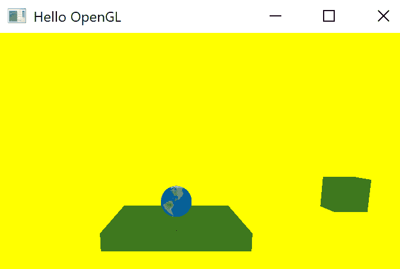

1.  如果我们将敌人的`collisionFlag`设置为`KINEMATIC_OBJECT`，你会看到敌人不会穿过球体，而是将其推离地面，如下所示：

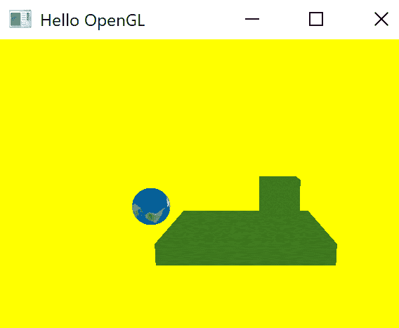

1.  这不是我们想要的，因为我们不希望敌人与任何对象进行物理交互。将敌人的碰撞标志改回`NO_CONTACT_RESPONSE`以修正此问题。

# 检查碰撞

在 tick 函数中，我们需要检查球体与敌人以及球体与地面的碰撞。按照以下步骤进行：

1.  要检查对象之间的接触数，我们将使用动态世界对象的`getNumManifolds`属性。在每次更新周期中，流形将包含有关场景中所有接触的信息。

1.  我们需要检查联系人数是否大于零。如果是，那么我们检查哪些对象对彼此接触。在更新敌人对象后，添加以下代码以检查英雄与敌人之间的接触：

```cpp
int numManifolds = dynamicsWorld->getDispatcher()->
  getNumManifolds(); 

   for (int i = 0; i < numManifolds; i++) { 

       btPersistentManifold *contactManifold = dynamicsWorld->
       getDispatcher()->getManifoldByIndexInternal(i); 

       int numContacts = contactManifold->getNumContacts(); 

       if (numContacts > 0) { 

           const btCollisionObject *objA = contactManifold->
           getBody0(); 
           const btCollisionObject *objB = contactManifold->
           getBody1(); 

           MeshRenderer* gModA = (MeshRenderer*)objA->
           getUserPointer(); 
           MeshRenderer* gModB = (MeshRenderer*)objB->
           getUserPointer(); 

                if ((gModA->name == "hero" && gModB->name == 
                  "enemy") || (gModA->name == "enemy" && gModB->
                  name == "hero")) { 
                        printf("collision: %s with %s \n",
                        gModA->name, gModB->name); 

                         if (gModB->name == "enemy") { 
                             btTransform b(gModB->rigidBody-
                             >getWorldTransform()); 
                             b.setOrigin(btVector3(18, 1, 0)); 
                             gModB->rigidBody-
                             >setWorldTransform(b); 
                             gModB->rigidBody-> 
                             getMotionState()-
                             >setWorldTransform(b); 
                           }else { 

                                 btTransform a(gModA->rigidBody->
                                 getWorldTransform()); 
                                 a.setOrigin(btVector3(18, 1, 0)); 
                                 gModA->rigidBody->
                                 setWorldTransform(a); 
                                 gModA->rigidBody->
                                 getMotionState()->
                                 setWorldTransform(a); 
                           } 

                     } 

                     if ((gModA->name == "hero" && gModB->name == 
                         "ground") || (gModA->name == "ground" &&               
                          gModB->name  == "hero")) { 
                           printf("collision: %s with %s \n",
                           gModA->name, gModB->name); 

                     } 
         } 
   } 
```

1.  首先，我们获取接触流形或接触对的数量。然后，对于每个接触流形，我们检查接触数是否大于零。如果是大于零，那么这意味着在当前更新中已经发生了接触。

1.  然后，我们获取两个碰撞对象并将它们分配给`ObjA`和`ObjB`。之后，我们获取两个对象的用户指针并将它们转换为`MeshRenderer`类型，以访问我们分配的对象的名称。在检查两个对象之间的接触时，对象 A 可以与对象 B 接触，或者反之亦然。如果球体与敌人之间有接触，我们将敌人位置设置回视口的右侧。我们还检查球体与地面的接触。如果有接触，我们只需打印出有接触即可。

# 添加键盘控制

让我们添加一些键盘控制，以便我们可以与球体交互。我们将设置，当我们按下键盘上的上键时，球体会跳跃。我们将通过向球体应用冲量来添加跳跃功能。为此，请按照以下步骤操作：

1.  首先，我们将使用`GLFW`，它有一个键盘回调函数，这样我们就可以为游戏添加键盘交互。在我们开始`main()`函数之前，我们将设置此键盘回调函数：

```cpp
void updateKeyboard(GLFWwindow* window, int key, int scancode, int action, int mods){ 

   if (glfwGetKey(window, GLFW_KEY_ESCAPE) == GLFW_PRESS) { 
         glfwSetWindowShouldClose(window, true);    
   } 

   if (key == GLFW_KEY_UP && action == GLFW_PRESS) { 
               if (grounded == true) { 
                     grounded = false; 

sphere->rigidBody->applyImpulse(btVector3(0.0f, 
   100.0f, 0.0f), btVector3(0.0f, 0.0f, 0.0f)); 
                     printf("pressed up key \n"); 
               } 
         } 
} 
```

我们关注的两个主要参数是键和动作。通过键，我们可以获取哪个键被按下，通过动作，我们可以检索对该键执行了什么操作。在函数中，我们使用`glfwGetKey`函数检查是否按下了*Esc*键。如果是，则使用`glfwSetWindowShouldClose`函数通过传递`true`作为第二个参数来关闭窗口。

要使球体跳跃，我们检查是否按下了向上键。如果是，我们创建一个新的布尔成员变量`grounded`，它描述了球体接触地面时的状态。如果是真的，我们将布尔值设置为`false`，并通过调用`rigidbody`的`applyImpulse`函数在 Y 方向上对球体的刚体原点施加`100`单位的冲量。

1.  在`tick`函数中，在我们获取流形数量之前，我们将`grounded`布尔值设置为`false`，如下所示：

```cpp
 grounded = false; 

   int numManifolds = dynamicsWorld->getDispatcher()->
                      getNumManifolds(); 
```

1.  当球体和地面接触时，我们将`grounded`布尔值设置为`true`，如下所示：

```cpp
   if ((gModA->name == "hero" && gModB->name == "ground") || 
         (gModA->name == "ground" && gModB->name == "hero")) { 

//printf("collision: %s with %s \n", gModA->name, gModB->name); 

         grounded = true; 

   }   
```

1.  在主函数中，使用`glfwSetKeyCallback`将`updateKeyboard`设置为回调，如下所示：

```cpp
int main(int argc, char **argv) { 
...       
   glfwMakeContextCurrent(window); 
   glfwSetKeyCallback(window, updateKeyboard); 
   ... 
   }
```

1.  现在，构建并运行应用程序。按下向上键以查看球体跳跃，但只有当它接触地面时，如下所示：

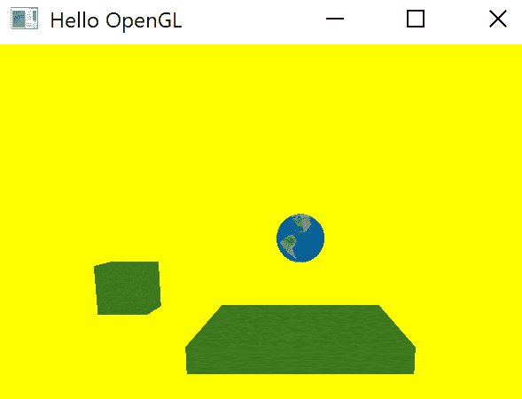

# 游戏循环和计分

让我们通过添加计分和完成游戏循环来结束这个话题：

1.  除了`grounded`布尔值外，再添加另一个布尔值并检查`gameover`。完成这些后，在`main.cpp`文件顶部添加一个名为`score`的`int`，并将其初始化为`0`，如下所示：

```cpp
GLuint sphereTexture, groundTexture; 

bool grounded = false; 
bool gameover = true; 
int score = 0; 

```

1.  接下来，在`tick`函数中，敌人只有在游戏未结束时才会移动。因此，我们将敌人的位置更新包裹在一个`if`语句中，以检查游戏是否结束。如果游戏未结束，则更新敌人的位置，如下所示：

```cpp
void myTickCallback(btDynamicsWorld *dynamicsWorld, btScalar timeStep) { 

   if (!gameover) { 

         // Get enemy transform 
         btTransform t(enemy->rigidBody->getWorldTransform()); 

         // Set enemy position 

         t.setOrigin(t.getOrigin() + btVector3(-15, 0, 0) * 
         timeStep); 

         // Check if offScreen 

         if (t.getOrigin().x() <= -18.0f) { 

               t.setOrigin(btVector3(18, 1, 0)); 
               score++; 
               label->setText("Score: " + std::to_string(score)); 

         } 

         enemy->rigidBody->setWorldTransform(t); 
         enemy->rigidBody->getMotionState()->setWorldTransform(t); 
   } 
... 
} 
```

1.  如果敌人超出屏幕的左侧，我们也增加分数。仍然在`tick`函数中，如果球体和敌人之间有接触，我们将分数设置为`0`并将`gameover`设置为`true`，如下所示：

```cpp

         if ((gModA->name == "hero" && gModB->name == "enemy") || 
                    (gModA->name == "enemy" && gModB->name ==
                     "hero")) { 

                     if (gModB->name == "enemy") { 
                         btTransform b(gModB->rigidBody->
                         getWorldTransform()); 
                         b.setOrigin(btVector3(18, 1, 0)); 
                         gModB->rigidBody->
                         setWorldTransform(b); 
                         gModB->rigidBody->getMotionState()->
                         setWorldTransform(b); 
                           }else { 

                           btTransform a(gModA->rigidBody->
                           getWorldTransform()); 
                           a.setOrigin(btVector3(18, 1, 0)); 
                           gModA->rigidBody->
                           setWorldTransform(a); 
                           gModA->rigidBody->getMotionState()->
                           setWorldTransform(a); 
                           } 

                           gameover = true; 
                           score = 0; 

                     }   
```

1.  在`updateKeyboard`函数中，当按下向上键盘键时，我们检查游戏是否结束。如果是，我们将`gameover`布尔值设置为`false`，这将开始游戏。现在，当玩家再次按下向上键时，角色将跳跃。这样，相同的键可以用来开始游戏，也可以用来使角色跳跃。

1.  根据以下要求修改`updateKeyboard`函数，如下所示：

```cpp
void updateKeyboard(GLFWwindow* window, int key, int scancode, int action, int mods){ 

   if (glfwGetKey(window, GLFW_KEY_ESCAPE) == GLFW_PRESS) { 
         glfwSetWindowShouldClose(window, true); 
   } 

   if (key == GLFW_KEY_UP && action == GLFW_PRESS) { 

         if (gameover) { 
               gameover = false; 
         } else { 

               if (grounded == true) { 

                     grounded = false; 

sphere->rigidBody->applyImpulse(btVector3(0.0f, 100.0f, 0.0f), 
   btVector3(0.0f, 0.0f, 0.0f)); 
                     printf("pressed up key \n"); 
               } 
         } 
   } 
}   
```

1.  虽然我们在计算分数，但用户仍然看不到分数是多少，所以让我们给游戏添加文本渲染。

# 文本渲染

对于文本渲染，我们将使用一个名为 FreeType 的库，加载字体并从中读取字符。FreeType 可以加载一个流行的字体格式，称为 TrueType。TrueType 字体具有`.ttf`扩展名。

TTFs 包含称为 glyphs 的矢量信息，可以用来存储任何数据。一个用例当然是使用它们来表示字符。

因此，当我们想要渲染特定的字形时，我们将通过指定其大小来加载字符字形；字符将以不损失质量的方式生成。

FreeType 库的源代码可以从他们的网站 [`www.freetype.org/`](https://www.freetype.org/) 下载，并从中构建库。也可以从 [`github.com/ubawurinna/freetype-windows-binaries`](https://github.com/ubawurinna/freetype-windows-binaries) 下载预编译的库。

让我们将库添加到我们的项目中。由于我们正在为 64 位操作系统开发，我们感兴趣的是 `include` 目录和 `win64` 目录；它们包含我们项目版本的 `freetype.lib` 和 `freetype.dll` 文件：

1.  在你的依赖文件夹中创建一个名为 `freetype` 的文件夹，并将文件提取到其中，如下所示：

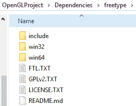

1.  打开项目的属性，在 C/C++ 下的 Additional Include Directory（附加包含目录）中添加 `freetype` 包含目录的位置，如下所示：

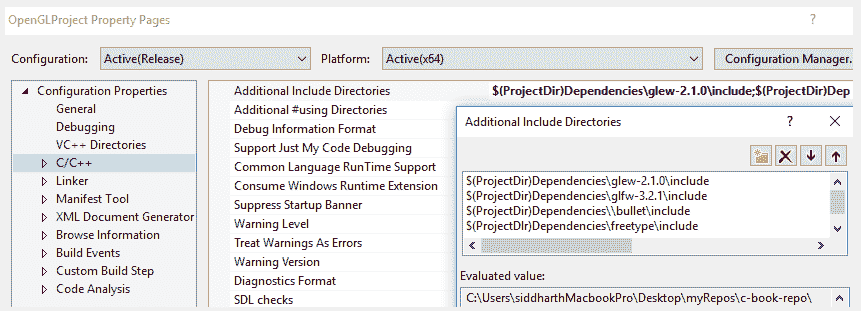

1.  在 Configuration Properties | Linker | General | Additional Library Directories（配置属性 | 链接器 | 一般 | 附加库目录）下，添加 freetype `win64` 目录，如下所示：

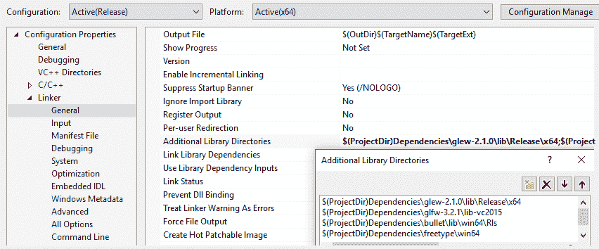

1.  在项目目录中，从 `win64` 目录复制 `Freetype.dll` 文件并将其粘贴到这里：

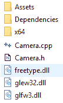

在准备工作完成之后，我们可以开始着手进行项目工作了。

1.  创建一个名为 `TextRenderer` 的类，以及一个名为 `TextRenderer.h` 的文件和一个名为 `TextRenderer.cpp` 的文件。我们将向这些文件添加文本渲染的功能。在 `TextRenderer.h` 中，包含 `GL` 和 `glm` 的常用包含头文件，如下所示：

```cpp
#include <GL/glew.h> 

#include "Dependencies/glm/glm/glm.hpp" 
#include "Dependencies/glm/glm/gtc/matrix_transform.hpp" 
#include "Dependencies/glm/glm/gtc/type_ptr.hpp"
```

1.  接下来，我们将包含 `freetype.h` 的头文件，如下所示：

```cpp
#include <ft2build.h> 
#include FT_FREETYPE_H    
```

1.  `FT_FREETYPE_H` 宏仅仅在 `freetype` 目录中包含了 `freetype.h`。然后，我们将 `include <map>`，因为我们需要映射每个字符的位置、大小和其他信息。我们还将 `include <string>` 并将一个字符串传递给要渲染的类，如下所示：

```cpp
#include <string> 
```

1.  对于每个字形，我们需要跟踪某些属性。为此，我们将创建一个名为 `Character` 的 `struct`，如下所示：

```cpp
struct Character { 
   GLuint     TextureID;  // Texture ID of each glyph texture 
   glm::ivec2 Size;       // glyph Size 
   glm::ivec2 Bearing;    // baseline to left/top of glyph 
   GLuint     Advance;    // id to next glyph 
}; 

```

对于每个字形，我们将存储我们为每个字符创建的纹理的纹理 ID。我们存储它的大小、基线，即字形顶部左角到字形基线的距离，以及字体文件中下一个字形的 ID。

1.  这就是包含所有字符字形的字体文件的外观：

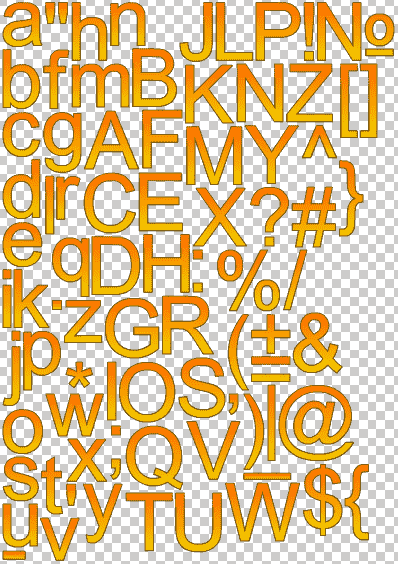

每个字符的信息都是相对于其相邻字符存储的，如下所示：

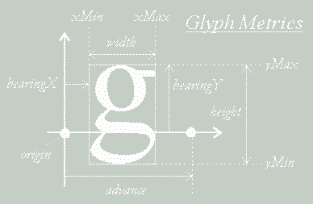

在加载 `FT_Face` 类型的字体面之后，我们可以逐个访问这些属性。每个字形的宽度和高度可以通过每个字形的属性访问，即 `face->glyph->bitmap.width` 和 `face->glyph->bitmap.rows`。

每个字形的图像数据可以通过 `bitmap.buffer` 属性访问，我们在创建每个字形的纹理时将使用它。以下代码显示了所有这些是如何实现的。

如果字体是水平对齐的，可以通过字形的 `advance.x` 属性访问字体文件中的下一个字形。

关于库的理论就到这里。如果你有兴趣了解更多，必要的文档可以在 FreeType 的网站上找到：[`www.freetype.org/freetype2/docs/tutorial/step2.html#section-1`](https://www.freetype.org/freetype2/docs/tutorial/step2.html#section-1)。

让我们继续处理 `TextRenderer.h` 文件，并创建 `TextRenderer` 类，如下所示：

```cpp
class TextRenderer{ 

public: 
   TextRenderer(std::string text, std::string font, int size, 
     glm::vec3 color, GLuint  program); 
   ~TextRenderer(); 

   void draw(); 
   void setPosition(glm::vec2 _position); 
   void setText(std::string _text); 

private: 
   std::string text; 
   GLfloat scale; 
   glm::vec3 color; 
   glm::vec2 position; 

   GLuint VAO, VBO, program; 
   std::map<GLchar, Character> Characters; 

};   
```

在公共部分下的类中，我们添加构造函数和析构函数。在构造函数中，我们传入要绘制的字符串、要使用的文件、要绘制的文本的大小和颜色，以及传入在绘制字体时使用的着色器程序。

然后，我们有 `draw` 函数来绘制文本，几个设置器来设置位置，以及一个 `setText` 函数，如果需要，可以设置新的字符串进行绘制。在私有部分，我们有用于文本字符串、缩放、颜色和位置的局部变量。我们还有 `VAO`、`VBO` 和 `program` 的成员变量，这样我们就可以绘制文本字符串。在类的末尾，我们创建一个映射来存储所有加载的字符，并将每个 `GLchar` 分配到映射中的字符 `struct`。这就是 `TextRenderer.h` 文件需要做的所有事情。

在 `TextRenderer.cpp` 文件中，将 `TextRenderer.h` 文件包含在文件顶部，并执行以下步骤：

1.  添加 `TextRenderer` 构造函数的实现，如下所示：

```cpp
TextRenderer::TextRenderer(std::string text, std::string font, int size, glm::vec3 color, GLuint program){ 

} 
```

在构造函数中，我们将添加加载所有字符的功能，并为绘制文本准备类。

1.  让我们初始化局部变量，如下所示：

```cpp
   this->text = text; 
   this->color = color; 
   this->scale = 1.0; 
   this->program = program; 
   this->setPosition(position); 
```

1.  接下来，我们需要设置投影矩阵。对于文本，我们指定正交投影，因为它没有深度，如下所示：

```cpp
   glm::mat4 projection = glm::ortho(0.0f, static_cast<GLfloat>
                         (800), 0.0f, static_cast<GLfloat>(600)); 
   glUseProgram(program); 
   glUniformMatrix4fv(glGetUniformLocation(program, "projection"), 
      1, GL_FALSE, glm::value_ptr(projection)); 
```

投影是通过 `glm::ortho` 函数创建的，它接受原点 x、窗口宽度、原点 y 和窗口高度作为创建正交投影矩阵的参数。我们将使用当前程序并将投影矩阵的值传递到名为 projection 的位置，然后将其传递给着色器。由于这个值永远不会改变，它将在构造函数中调用并赋值一次。

1.  在加载字体本身之前，我们必须初始化 FreeType 库，如下所示：

```cpp
// FreeType 
FT_Library ft; 

// Initialise freetype 
if (FT_Init_FreeType(&ft)) 
std::cout << "ERROR::FREETYPE: Could not init FreeType Library" 
          << std::endl; 
```

1.  现在，我们可以加载字体本身，如下所示：

```cpp
// Load font 
FT_Face face; 
if (FT_New_Face(ft, font.c_str(), 0, &face)) 
         std::cout << "ERROR::FREETYPE: Failed to load font" 
                   << std::endl; 

```

1.  现在，设置字体大小（以像素为单位）并禁用字节对齐限制。如果我们不对字节对齐进行限制，字体将被绘制得混乱，所以别忘了添加这个：

```cpp
// Set size of glyphs 
FT_Set_Pixel_Sizes(face, 0, size); 

// Disable byte-alignment restriction 
glPixelStorei(GL_UNPACK_ALIGNMENT, 1); 
```

1.  然后，我们将加载我们加载的字体中的前`128`个字符，并创建和分配纹理 ID、大小、基线和进位。之后，我们将字体存储在字符映射中，如下所示：

```cpp
   for (GLubyte i = 0; i < 128; i++){ 

         // Load character glyph  
         if (FT_Load_Char(face, i, FT_LOAD_RENDER)){ 
               std::cout << "ERROR::FREETYTPE: Failed to 
                            load Glyph" << std::endl; 
               continue; 
         } 

         // Generate texture 
         GLuint texture; 
         glGenTextures(1, &texture); 
         glBindTexture(GL_TEXTURE_2D, texture); 

         glTexImage2D( 
               GL_TEXTURE_2D, 
               0, 
               GL_RED, 
               face->glyph->bitmap.width, 
               face->glyph->bitmap.rows, 
               0, 
               GL_RED, 
               GL_UNSIGNED_BYTE, 
               face->glyph->bitmap.buffer 
               ); 

         // Set texture filtering options 
         glTexParameteri(GL_TEXTURE_2D, GL_TEXTURE_WRAP_S, 
         GL_CLAMP_TO_EDGE); 
         glTexParameteri(GL_TEXTURE_2D, GL_TEXTURE_WRAP_T, 
         GL_CLAMP_TO_EDGE); 
         glTexParameteri(GL_TEXTURE_2D, GL_TEXTURE_MIN_FILTER,
         GL_LINEAR); 
         glTexParameteri(GL_TEXTURE_2D, GL_TEXTURE_MAG_FILTER,
         GL_LINEAR); 

         // Create a character 
         Character character = { 
               texture, 
               glm::ivec2(face->glyph->bitmap.width, 
                           face->glyph->bitmap.rows), 
               glm::ivec2(face->glyph->bitmap_left, 
           face->glyph->bitmap_top), 
               face->glyph->advance.x 
         }; 

         // Store character in characters map 
         Characters.insert(std::pair<GLchar, Character>(i,
         character)); 
   } 
```

1.  一旦加载了字符，我们可以解绑纹理并销毁字体外观和 FreeType 库，如下所示：

```cpp
   glBindTexture(GL_TEXTURE_2D, 0); 

   // Destroy FreeType once we're finished 
   FT_Done_Face(face); 
   FT_Done_FreeType(ft);
```

1.  每个字符都将作为一个单独的四边形上的纹理来绘制，因此为四边形设置`VAO`/`VBO`，创建一个位置属性并启用它，如下所示：

```cpp
   glGenVertexArrays(1, &VAO); 
   glGenBuffers(1, &VBO); 

   glBindVertexArray(VAO); 

   glBindBuffer(GL_ARRAY_BUFFER, VBO); 
   glBufferData(GL_ARRAY_BUFFER, sizeof(GLfloat) * 6 * 4, NULL, 
       GL_DYNAMIC_DRAW); 

   glEnableVertexAttribArray(0); 
   glVertexAttribPointer(0, 4, GL_FLOAT, GL_FALSE, 4 * 
      sizeof(GLfloat), 0); 

```

1.  现在，我们需要解绑`VBO`和`VAO`，如下所示：

```cpp
   glBindBuffer(GL_ARRAY_BUFFER, 0); 
   glBindVertexArray(0); 

```

构造函数就到这里。现在，我们可以继续到绘制函数。让我们看看：

1.  首先，创建绘制函数的实现，如下所示：

```cpp
void TextRenderer::draw(){
} 
```

1.  我们将向这个函数添加绘制功能。首先，我们将获取文本需要开始绘制的位置，如下所示：

```cpp
glm::vec2 textPos = this->position; 
```

1.  然后，我们必须启用混合。如果我们不启用混合，整个文本的四边形将被着色，而不是仅着色文本存在的区域，如左边的图像所示：


在左边的图像中，S 应该出现的地方，我们可以看到整个四边形被红色着色，包括应该透明的像素。

通过启用混合，我们使用以下方程式将最终颜色值设置为像素：

*颜色[最终] = 颜色[源] * Alpha[源] + 颜色[目标] * 1- Alpha[源]*

这里，源颜色和源 alpha 是文本在某个像素位置的颜色和 alpha 值，而目标颜色和 alpha 是颜色缓冲区中颜色和 alpha 的值。

在这个例子中，由于我们稍后绘制文本，目标颜色将是黄色，而源颜色，即文本，将是红色。目标 alpha 值为 1.0，而黄色是不透明的。对于文本，如果我们看一下 S 字母，例如，在 S 内部，即红色区域，它是完全不透明的，但它是透明的。

使用这个公式，让我们计算 S 周围透明区域的最终像素颜色，如下所示：

*颜色[最终] = (1.0f, 0.0f, 0.0f, 0.0f) * 0.0 + (1.0f, 1.0f, 0.0f, 1.0f) * (1.0f- 0.0f)*

= (1.0f, 1.0f, 0.0f, 1.0f);*

这只是黄色背景颜色。

相反，在 S 字母内部，它不是透明的，所以该像素位置的 alpha 值为 1。因此，当我们应用相同的公式时，我们得到最终颜色，如下所示：

*颜色[最终] = (1.0f, 0.0f, 0.0f, 1.0f) * 1.0 + (1.0f, 1.0f, 0.0f, 1.0f) * (1.0f- 1.0f)*

*= (1.0f, 0.0f, 0.0f, 1.0f)*

这只是红色文本颜色，如下面的图所示：

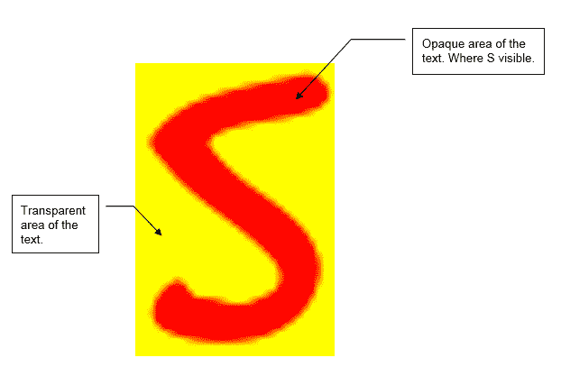

让我们看看它在实践中是如何实现的。

1.  `blend`函数如下：

```cpp
   glEnable(GL_BLEND); 
```

现在，我们需要设置源和目标混合因子，即 `GL_SRC_ALPHA`。对于源像素，我们使用其 alpha 值不变，而对于目标，我们将 alpha 设置为 `GL_ONE_MINUS_SRC_ALPHA`，即源 alpha 减去一，如下所示：

```cpp
glBlendFunc(GL_SRC_ALPHA, GL_ONE_MINUS_SRC_ALPHA); 
```

默认情况下，源值和目标值被添加。你也可以进行减法、加法和除法操作。

1.  现在，我们需要调用 `glUseProgram` 函数来设置程序，将文本颜色设置为统一位置，并设置默认纹理，如下所示：

```cpp
   glUseProgram(program); 
   glUniform3f(glGetUniformLocation(program, "textColor"), 
      this->color.x, this->color.y, this->color.z); 
   glActiveTexture(GL_TEXTURE0); 
```

1.  接下来，我们需要绑定 `VAO`，如下所示：

```cpp
   glBindVertexArray(VAO); 
```

1.  让我们遍历我们要绘制的文本中的所有字符，获取它们的大小、偏移量，以便我们可以设置每个要绘制的字符的位置和纹理 ID，如下所示：

```cpp
   std::string::const_iterator c; 

   for (c = text.begin(); c != text.end(); c++){ 

         Character ch = Characters[*c]; 

         GLfloat xpos = textPos.x + ch.Bearing.x * this->scale; 
         GLfloat ypos = textPos.y - (ch.Size.y - ch.Bearing.y) * 
         this->scale; 

         GLfloat w = ch.Size.x * this->scale; 
         GLfloat h = ch.Size.y * this->scale; 

         // Per Character Update VBO 
         GLfloat vertices[6][4] = { 
               { xpos, ypos + h, 0.0, 0.0 }, 
               { xpos, ypos, 0.0, 1.0 }, 
               { xpos + w, ypos, 1.0, 1.0 }, 

               { xpos, ypos + h, 0.0, 0.0 }, 
               { xpos + w, ypos, 1.0, 1.0 }, 
               { xpos + w, ypos + h, 1.0, 0.0 } 
         }; 

         // Render glyph texture over quad 
         glBindTexture(GL_TEXTURE_2D, ch.TextureID); 

         // Update content of VBO memory 
         glBindBuffer(GL_ARRAY_BUFFER, VBO); 

         // Use glBufferSubData and not glBufferData 
         glBufferSubData(GL_ARRAY_BUFFER, 0, sizeof(vertices), 
         vertices);  

         glBindBuffer(GL_ARRAY_BUFFER, 0); 

         // Render quad 
         glDrawArrays(GL_TRIANGLES, 0, 6); 

         // Now advance cursors for next glyph (note that advance 
         is number of 1/64 pixels) 
         // Bitshift by 6 to get value in pixels (2⁶ = 64 (divide 
         amount of 1/64th pixels by 64 to get amount of pixels)) 
         textPos.x += (ch.Advance >> 6) * this->scale;  
   } 
```

我们现在将绑定 `VBO` 并使用 `glBufferSubData` 将所有要绘制的四边形的顶点数据传递进去。一旦绑定，四边形将通过 `glDrawArrays` 绘制，我们传递 `6` 作为要绘制的顶点数。

然后，我们计算 `textPos.x`，这将决定下一个字符将被绘制的位置。我们通过将当前字符的进位乘以缩放并添加到当前文本位置的 `x` 分量来获取这个距离。对 `advance` 进行 `6` 比特的位移，以获取像素值。

1.  在绘制函数的末尾，我们解绑顶点数组和纹理，然后禁用混合，如下所示：

```cpp
glBindVertexArray(0); 
glBindTexture(GL_TEXTURE_2D, 0); 

glDisable(GL_BLEND);  
```

1.  最后，我们添加 `setPOsiton` 和 `setString` 函数的实现，如下所示：

```cpp
void TextRenderer::setPosition(glm::vec2 _position){ 

   this->position = _position; 
} 

void TextRenderer::setText(std::string _text){ 
   this->text = _text; 
} 
```

我们最终完成了 `TextRenderer` 类。现在，让我们学习如何在我们的游戏中显示文本：

1.  在 `main.cpp` 文件中，在文件顶部包含 `TextRenderer.h` 并创建一个名为 `label` 的类的新对象，如下所示：

```cpp
#include "TextRenderer.h" 

TextRenderer* label;  

```

1.  为文本着色程序创建一个新的 `GLuint`，如下所示：

```cpp
GLuint textProgram 
```

1.  然后，创建文本的新着色程序，如下所示：

```cpp
textProgram = shader.CreateProgram("Assets/Shaders/text.vs", "Assets/Shaders/text.fs"); 
```

1.  `text.vs` 和 `text.fs` 文件放置在 `Assets` 目录下的 `Shaders.text.vs` 中，如下所示：

```cpp
#version 450 core 
layout (location = 0) in vec4 vertex; 
uniform mat4 projection; 

out vec2 TexCoords; 

void main(){ 
    gl_Position = projection * vec4(vertex.xy, 0.0, 1.0); 
    TexCoords = vertex.zw; 
}   
```

我们从属性中获取顶点位置和投影矩阵作为统一变量。纹理坐标在主函数中设置，并发送到下一个着色器阶段。四边形的顶点位置通过在 `main()` 函数中将局部坐标乘以正交投影矩阵来设置。

1.  接下来，我们将进入片段着色器，如下所示：

```cpp
#version 450 core 

in vec2 TexCoords; 

uniform sampler2D text; 
uniform vec3 textColor; 

out vec4 color; 

void main(){     
vec4 sampled = vec4(1.0, 1.0, 1.0, texture(text, TexCoords).r); 
color = vec4(textColor, 1.0) * sampled; 
} 
```

我们从顶点着色器获取纹理坐标和纹理以及颜色作为统一变量。创建一个新的 `vec4` 叫做颜色，用于发送颜色信息。在 `main()` 函数中，我们创建一个新的 `vec4` 叫做 sampled，并将 r、g 和 b 值存储为 `1`。我们还把红色颜色作为 alpha 值来绘制文本的不透明部分。然后，创建一个新的 `vec4` 叫做颜色，其中将白色颜色替换为我们想要文本绘制的颜色，并分配颜色变量。

1.  让我们继续实现文本标签。在`init`函数中的`addRigidBody`函数之后，初始化`label`对象，如下所示：

```cpp
label = new TextRenderer("Score: 0", "Assets/fonts/gooddog.ttf", 
        64, glm::vec3(1.0f, 0.0f, 0.0f), textProgram); 
   label->setPosition(glm::vec2(320.0f, 500.0f)); 

```

在构造函数中，我们设置要渲染的字符串，传入字体文件的路径，传入文本高度、文本颜色和文本程序。然后，我们使用`setPosition`函数设置文本的位置。

1.  接下来，在`tick`函数中，我们更新分数时，也更新文本，如下所示：

```cpp
         if (t.getOrigin().x() <= -18.0f) { 

               t.setOrigin(btVector3(18, 1, 0)); 
               score++; 
               label->setText("Score: " + std::to_string(score));
         }
```

1.  在`tick`函数中，当游戏结束时，我们重置字符串，如下所示：

```cpp
               gameover = true; 
               score = 0; 
               label->setText("Score: " + std::to_string(score));
```

1.  在`render`函数中，我们调用`draw`函数来绘制文本，如下所示：

```cpp
void renderScene(float dt){ 

   glClear(GL_COLOR_BUFFER_BIT | GL_DEPTH_BUFFER_BIT); 
   glClearColor(1.0, 1.0, 0.0, 1.0); 

   // Draw Objects 

   //light->draw(); 

   sphere->draw(); 
   enemy->draw(); 
   ground->draw(); 

   label->draw(); 
} 
```

由于 alpha 混合，文本必须在所有其他对象绘制完毕后绘制。

1.  最后，确保字体文件已经添加到`Fonts`文件夹下的`Assets`文件夹中，如下所示：

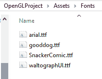

提供了一些字体文件，您可以进行实验。更多免费字体可以从[`www.1001freefonts.com/`](https://www.1001freefonts.com/)和[`www.dafont.com/`](https://www.dafont.com/)下载。构建并运行游戏以查看绘制的文本和更新：

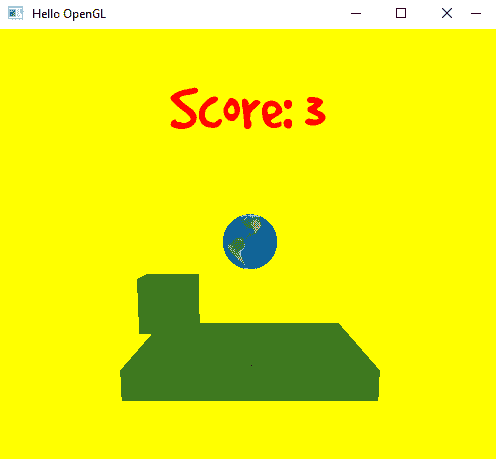

# 添加光照

最后，让我们给场景中的对象添加一些光照，以使对象看起来更有趣。我们将通过允许光照渲染器在场景中绘制来实现这一点。在这里，光照来自这个球体的中心。使用光源的位置，我们将计算像素是否被照亮，如下所示：


左侧的图片显示了未照亮的场景。相比之下，右侧的场景使用了地球球体照明，地面受到光源的影响。面向光源的表面最亮，例如球体的顶部。这就在球体的顶部创建了一个**镜面反射**。由于表面离光源较远/与光源成角度，这些像素值逐渐扩散。然后，还有一些完全未面向光源的表面，例如面向我们的地面侧面。然而，它们仍然不是完全黑色，因为它们仍然受到来自光源的光照，这些光照反射并成为环境光的一部分。**环境光**、**漫反射**和**镜面反射**成为我们想要照亮物体时照明模型的主要部分。照明模型用于在计算机图形中模拟光照，因为我们受限于硬件的处理能力，这与现实世界不同。

根据 Phong 着色模型的像素最终颜色公式如下：

*C = ka* Lc+ Lc * max(0, n l) + ks * Lc * max(0, v r) p*

这里，我们有以下属性：

+   *k*[*a* ]是环境强度。

+   *L[c]*是光颜色。

+   *n*是表面法线。

+   *l*是光方向。

+   *k[s]*是镜面反射强度。

+   *v*是视图方向。

+   *r* 是关于表面法线的反射光方向。

+   *p* 是 Phong 指数，它将决定表面的光泽度。

对于 **n**、**l**、**v** 和 **r** 向量，请参考以下图表：

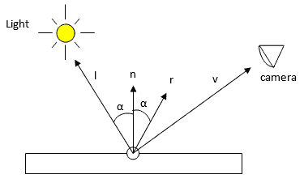

让我们看看如何在实践中实现这一点：

1.  所有的光照计算都是在对象的片段着色器中完成的，因为这将影响物体的最终颜色，这取决于光源和相机位置。对于每个要照明的物体，我们还需要传入光颜色、漫反射和镜面强度。在 `MeshRenderer.h` 文件中，更改构造函数，使其接受光源、漫反射和镜面强度，如下所示：

```cpp
MeshRenderer(MeshType modelType, std::string _name, Camera * 
   _camera, btRigidBody* _rigidBody, LightRenderer* _light, float 
   _specularStrength, float _ambientStrength);
```

1.  在文件顶部包含 `lightRenderer.h`，如下所示：

```cpp
#include "LightRenderer.h"
```

1.  在类的私有部分添加一个 `LightRenderer` 对象以及用于存储环境光和镜面强度的浮点数，如下所示：

```cpp
        GLuint vao, vbo, ebo, texture, program; 
        LightRenderer* light;
        float ambientStrength, specularStrength;
```

1.  在 `MeshRenderer.cpp` 文件中，更改构造函数的实现，并将传入的变量分配给局部变量，如下所示：

```cpp
MeshRenderer::MeshRenderer(MeshType modelType, std::string _name, 
   Camera* _camera, btRigidBody* _rigidBody, LightRenderer* _light, 
   float _specularStrength, float _ambientStrength) { 

   name = _name; 
   rigidBody = _rigidBody; 
   camera = _camera; 
   light = _light; 
   ambientStrength = _ambientStrength; 
   specularStrength = _specularStrength; 
... 
} 

```

1.  在构造函数中，我们还需要添加一个新的法线属性，因为我们需要表面法线信息来进行光照计算，如下所示：

```cpp
glEnableVertexAttribArray(0); 
glVertexAttribPointer(0, 3, GL_FLOAT, GL_FALSE, sizeof(Vertex), 
   (GLvoid*)0); 

 glEnableVertexAttribArray(1); 
 glVertexAttribPointer(1, 2, GL_FLOAT, GL_FALSE, sizeof(Vertex), 
      (void*)(offsetof(Vertex, Vertex::texCoords))); 
 glEnableVertexAttribArray(2);
 glVertexAttribPointer(2, 3, GL_FLOAT, GL_FALSE, sizeof(Vertex), 
     (void*)(offsetof(Vertex, Vertex::normal))); 

```

1.  在 `Draw` 函数中，我们将相机位置、光源位置、光源颜色、镜面强度和环境强度作为统一变量传递给着色器，如下所示：

```cpp
   // Set Texture 
   glBindTexture(GL_TEXTURE_2D, texture); 

   // Set Lighting 
   GLuint cameraPosLoc = glGetUniformLocation(program, 
                         "cameraPos"); 
   glUniform3f(cameraPosLoc, camera->getCameraPosition().x,
   camera-> getCameraPosition().y, camera->getCameraPosition().z); 

   GLuint lightPosLoc = glGetUniformLocation(program, "lightPos"); 
   glUniform3f(lightPosLoc, this->light->getPosition().x, 
     this-> light->getPosition().y, this->light->getPosition().z); 

   GLuint lightColorLoc = glGetUniformLocation(program, 
                          "lightColor"); 
   glUniform3f(lightColorLoc, this->light->getColor().x, 
     this-> light->getColor().y, this->light->getColor().z); 

   GLuint specularStrengthLoc = glGetUniformLocation(program, 
                                "specularStrength"); 
   glUniform1f(specularStrengthLoc, specularStrength); 

   GLuint ambientStrengthLoc = glGetUniformLocation(
                               program, "ambientStrength"); 
   glUniform1f(ambientStrengthLoc, ambientStrength); 

   glBindVertexArray(vao);        
   glDrawElements(GL_TRIANGLES, indices.size(), 
      GL_UNSIGNED_INT, 0); 
   glBindVertexArray(0); 

```

1.  我们还需要为效果创建新的顶点和片段着色器。让我们创建一个新的顶点着色器，称为 `LitTexturedModel.vs`，如下所示：

```cpp
#version 450 core 
layout (location = 0) in vec3 position; 
layout (location = 1) in vec2 texCoord; 
layout (location = 2) in vec3 normal; 

out vec2 TexCoord; 
out vec3 Normal; 
out vec3 fragWorldPos; 

uniform mat4 vp; 
uniform mat4 model; 

void main(){ 

   gl_Position = vp * model *vec4(position, 1.0); 

   TexCoord = texCoord; 
   fragWorldPos = vec3(model * vec4(position, 1.0)); 
   Normal = mat3(transpose(inverse(model))) * normal; 

} 
```

1.  我们添加新的位置布局以接收法线属性。

1.  创建一个新的 `out vec3`，以便我们可以将法线信息发送到片段着色器。我们还将创建一个新的 `out vec3` 来发送片段的世界坐标。在 `main()` 函数中，我们通过将局部位置乘以世界矩阵来计算片段的世界位置，并将其存储在 `fragWorldPos` 变量中。法线也被转换为世界空间。与我们将局部位置相乘的方式不同，用于将法线转换为法线世界空间的模型矩阵需要以不同的方式处理。法线乘以模型矩阵的逆矩阵，并存储在法线变量中。这就是顶点着色器的内容。现在，让我们看看 `LitTexturedModel.fs`。

1.  在片段着色器中，我们获取纹理坐标、法线和片段世界位置。接下来，我们获取相机位置、光源位置和颜色、镜面和环境强度统一变量，以及作为统一变量的纹理。最终的像素值将存储在名为 `color` 的 `out vec4` 中，如下所示：

```cpp
#version 450 core 

in vec2 TexCoord; 
in vec3 Normal; 
in vec3 fragWorldPos; 

uniform vec3 cameraPos; 
uniform vec3 lightPos; 
uniform vec3 lightColor; 

uniform float specularStrength; 
uniform float ambientStrength; 

// texture 
uniform sampler2D Texture; 

out vec4 color;    
```

1.  在着色器的 `main()` 函数中，我们添加了光照计算，如下面的代码所示：

```cpp
 void main(){ 

       vec3 norm = normalize(Normal); 
       vec4 objColor = texture(Texture, TexCoord); 

       //**ambient 
       vec3 ambient = ambientStrength * lightColor; 

       //**diffuse 
       vec3 lightDir = normalize(lightPos - fragWorldPos); 
       float diff = max(dot(norm, lightDir), 0.0); 
       vec3 diffuse = diff * lightColor; 

       //**specular  
       vec3 viewDir = normalize(cameraPos - fragWorldPos); 
       vec3 reflectionDir = reflect(-lightDir, norm); 
       float spec = pow(max(dot(viewDir, 
                    reflectionDir),0.0),128); 
       vec3 specular = specularStrength * spec * lightColor; 

       // lighting shading calculation 
       vec3 totalColor = (ambient + diffuse + specular) * 
       objColor.rgb; 

       color = vec4(totalColor, 1.0f); 

}  
```

1.  我们首先获取法线和物体颜色。然后，根据公式方程，我们通过乘以环境强度和光颜色来计算方程的环境部分，并将其存储在名为`ambient`的`vec3`中。对于方程的漫反射部分，我们通过从世界空间中像素的位置减去两个位置来计算光方向。结果向量被归一化并保存在`vec3 lightDir`中。然后，我们计算法线和光方向之间的点积。

1.  之后，我们获取结果值或`0`中的较大值，并将其存储在名为`diff`的浮点数中。这个值乘以光颜色并存储在`vec3`中以获得漫反射颜色。对于方程的镜面反射部分，我们通过从相机位置减去片段世界位置来计算视图方向。

1.  结果向量被归一化并存储在`vec3 specDir`中。然后，通过使用反射`glsl`内建函数并传入`viewDir`和表面法线来计算相对于表面法线的反射光向量。

1.  然后，计算视图和反射向量的点积。选择计算值和`0`中的较大值。将得到的浮点值提高到`128`次幂。值可以从`0`到`256`。值越大，物体看起来越亮。通过将镜面反射强度、计算的镜面反射值和存储在镜面`vec3`中的光颜色相乘来计算镜面反射值。

1.  最后，通过将三个环境、漫反射和镜面反射值相加，然后乘以对象颜色来计算总的着色。对象颜色是一个`vec4`，所以我们将其转换为`vec3`。总颜色通过将`totalColor`转换为`vec4`分配给颜色变量。要在项目中实现这一点，创建一个新的着色程序，称为`litTexturedShaderProgram`。

    按照以下方式：

```cpp
GLuint litTexturedShaderProgram; 
Create the shader program and assign it to it in the init function in main.cpp. 
   litTexturedShaderProgram = shader.CreateProgram(
                              "Assets/Shaders/LitTexturedModel.vs",                 
                              "Assets/Shaders/LitTexturedModel.fs"); 
```

1.  在添加`rigidBody`函数中，按照以下方式更改球体、地面和敌人的着色器：

```cpp
  // Sphere Rigid Body 

  btCollisionShape* sphereShape = new btSphereShape(1);
  btDefaultMotionState* sphereMotionState = new 
     btDefaultMotionState(btTransform(btQuaternion(0, 0, 0, 1), 
     btVector3(0, 0.5, 0)));

  btScalar mass = 13.0f;
  btVector3 sphereInertia(0, 0, 0);
  sphereShape->calculateLocalInertia(mass, sphereInertia);

  btRigidBody::btRigidBodyConstructionInfo 
     sphereRigidBodyCI(mass, sphereMotionState, sphereShape, 
     sphereInertia);

  btRigidBody* sphereRigidBody = new btRigidBody
                                 (sphereRigidBodyCI);

  sphereRigidBody->setFriction(1.0f);
  sphereRigidBody->setRestitution(0.0f);

  sphereRigidBody->setActivationState(DISABLE_DEACTIVATION);

  dynamicsWorld->addRigidBody(sphereRigidBody);

  // Sphere Mesh

  sphere = new MeshRenderer(MeshType::kSphere, “hero”, 
           camera, sphereRigidBody, light, 0.1f, 0.5f);
  sphere->setProgram(litTexturedShaderProgram);
  sphere->setTexture(sphereTexture);
  sphere->setScale(glm::vec3(1.0f));

  sphereRigidBody->setUserPointer(sphere);

  // Ground Rigid body

  btCollisionShape* groundShape = new btBoxShape(btVector3(4.0f,   
                                  0.5f, 4.0f));
  btDefaultMotionState* groundMotionState = new 
    btDefaultMotionState(btTransform(btQuaternion(0, 0, 0, 1), 
     btVector3(0, -1.0f, 0)));

  btRigidBody::btRigidBodyConstructionInfo 
    groundRigidBodyCI(0.0f, groundMotionState, groundShape, 
    btVector3(0, 0, 0));

  btRigidBody* groundRigidBody = new btRigidBody
                                 (groundRigidBodyCI);

  groundRigidBody->setFriction(1.0);
  groundRigidBody->setRestitution(0.0);

  groundRigidBody->setCollisionFlags(
     btCollisionObject::CF_STATIC_OBJECT);

  dynamicsWorld->addRigidBody(groundRigidBody);

  // Ground Mesh
  ground = new MeshRenderer(MeshType::kCube, “ground”,
           camera, groundRigidBody, light, 0.1f, 0.5f);
  ground->setProgram(litTexturedShaderProgram);
  ground->setTexture(groundTexture);
  ground->setScale(glm::vec3(4.0f, 0.5f, 4.0f));

  groundRigidBody->setUserPointer(ground);

  // Enemy Rigid body

  btCollisionShape* shape = new btBoxShape(btVector3(1.0f, 
                            1.0f, 1.0f));
  btDefaultMotionState* motionState = new btDefaultMotionState(
      btTransform(btQuaternion(0, 0, 0, 1), 
      btVector3(18.0, 1.0f, 0)));
  btRigidBody::btRigidBodyConstructionInfo rbCI(0.0f, 
     motionState, shape, btVector3(0.0f, 0.0f, 0.0f));

  btRigidBody* rb = new btRigidBody(rbCI);

  rb->setFriction(1.0);
  rb->setRestitution(0.0);

  //rb->setCollisionFlags(btCollisionObject::CF_KINEMATIC_OBJECT);

  rb->setCollisionFlags(btCollisionObject::CF_NO_CONTACT_RESPONSE);

  dynamicsWorld->addRigidBody(rb);

  // Enemy Mesh
  enemy = new MeshRenderer(MeshType::kCube, “enemy”, 
          camera, rb, light, 0.1f, 0.5f);
  enemy->setProgram(litTexturedShaderProgram);
  enemy->setTexture(groundTexture);
  enemy->setScale(glm::vec3(1.0f, 1.0f, 1.0f));

  rb->setUserPointer(enemy);

```

1.  构建并运行项目以查看光照着色器生效：

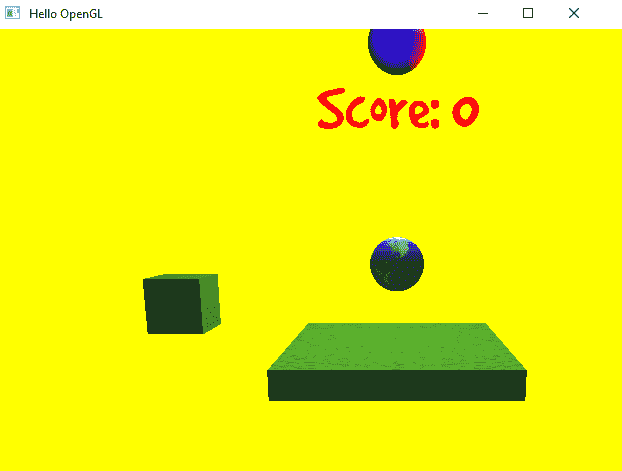

作为练习，尝试向背景添加纹理，就像我们在 SFML 游戏中做的那样。

# 摘要

在本章中，我们看到了如何添加游戏对象之间的碰撞检测，然后通过添加控制和得分来完成了游戏循环。使用字体加载库 FreeType，我们将 TrueType 字体加载到我们的游戏中，以添加得分文本。最后，为了锦上添花，我们通过向对象添加 Phong 光照模型来添加场景中的光照。

在图形上，我们还可以添加很多内容来增加游戏的真实感，例如添加后处理效果的帧缓冲区。我们还可以添加如灰尘和雨的粒子效果。要了解更多信息，我强烈推荐[learnopengl.com](http://learnopengl.com)，如果你希望了解更多关于 OpenGL 的信息，它是一个惊人的资源。

在下一章中，我们将开始探索 Vulkan 渲染 API，并查看它与 OpenGL 的不同之处。
