# Vulkan 入门

在前三个章节中，我们使用 OpenGL 进行渲染。虽然 OpenGL 适合开发原型并快速开始渲染，但它确实有其弱点。首先，OpenGL 非常依赖驱动程序，这使得它在性能方面较慢且不可预测，这也是为什么我们更喜欢使用 Vulkan 进行渲染的原因。

在本章中，我们将涵盖以下主题：

+   关于 Vulkan

+   配置 Visual Studio

+   Vulkan 验证层和扩展

+   Vulkan 实例

+   Vulkan 上下文类

+   创建窗口表面

+   选择物理设备并创建逻辑设备

# 关于 Vulkan

使用 OpenGL 时，开发者必须依赖 NVIDIA、AMD 和 Intel 等厂商发布适当的驱动程序，以便在游戏发布前提高游戏性能。只有当开发者与厂商紧密合作时，这才能实现。如果不是这样，厂商只能在游戏发布后才能发布优化驱动程序，并且发布新驱动程序可能需要几天时间。

此外，如果你想要将你的 PC 游戏移植到移动平台，并且你使用 OpenGL 作为渲染器，你将需要将渲染器移植到 OpenGLES，它是 OpenGL 的一个子集，其中 ES 代表嵌入式系统。尽管 OpenGL 和 OpenGLES 之间有很多相似之处，但要使其在其他平台上工作，仍然需要做额外的工作。为了减轻这些问题，引入了 Vulkan。Vulkan 通过减少驱动程序的影响并提供明确的开发者控制来提高游戏性能，从而赋予开发者更多的控制权。

Vulkan 是从底层开发的，因此与 OpenGL 不向后兼容。当使用 Vulkan 时，你可以完全访问 GPU。

使用完整的 GPU 访问，你也有完全的责任来实现渲染 API。因此，使用 Vulkan 的缺点在于，当你用它进行开发时，你必须指定一切。

总的来说，这使得 Vulkan 成为一个非常冗长的 API，你必须指定一切。然而，这也使得当 GPU 添加新功能时，很容易为 Vulkan 的 API 规范创建扩展。

# 配置 Visual Studio

Vulkan 只是一个渲染 API，因此我们需要创建一个窗口并进行数学运算。对于这两者，我们将使用 GLFW 和 GLM，就像我们创建 OpenGL 项目时一样。为此，请按照以下步骤操作：

1.  创建一个新的 Visual Studio C++项目，并将其命名为`VulkanProject`。

1.  将 OpenGL 项目中的`GLFW`和`GLM`文件夹复制到`VulkanProject`文件夹中，放在名为`Dependencies`的文件夹内。

1.  下载 Vulkan SDK。访问 [`vulkan.lunarg.com/sdk/home`](https://vulkan.lunarg.com/sdk/home) 并下载 SDK 的 Windows 版本，如以下截图所示：

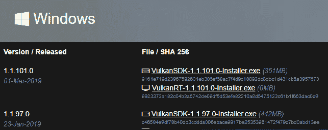

1.  按照以下截图所示安装 SDK：

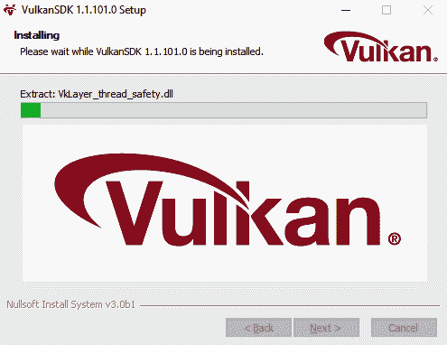

1.  在 `Dependencies` 目录中创建一个名为 `Vulkan` 的新文件夹。从 Vulkan SDK 文件夹中复制并粘贴 `Lib` 和包含文件夹到 `C:\` 驱动器，如图所示：

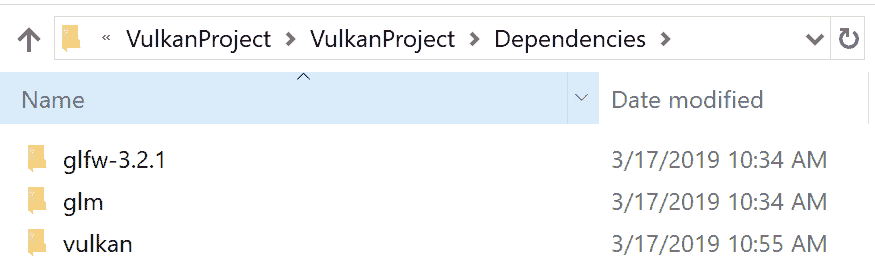

1.  在 Visual Studio 项目中，创建一个新的空白 `source.cpp` 文件。打开 Vulkan 项目属性，并将 `include` 目录添加到 C/C+ | 通用 | 额外包含目录。

1.  确保在配置和平台下拉列表中选择了所有配置和所有平台，如图所示：

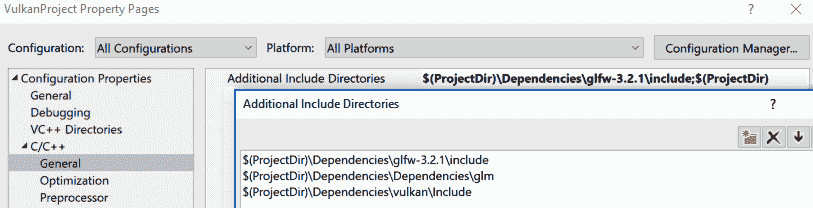

1.  在链接器 | 通用部分下添加库目录，如图所示：

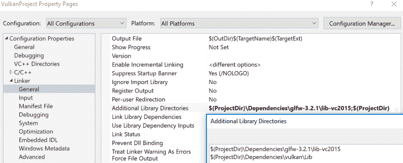

1.  在链接器 | 输入中设置您想要使用的库，如图所示：

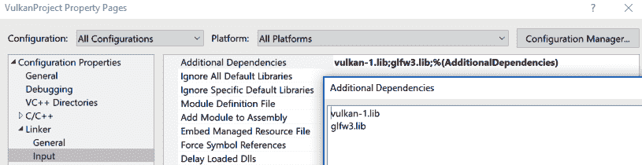

在完成准备工作后，让我们检查我们的窗口创建是否正常工作：

1.  在 `source.cpp` 中添加以下代码：

```cpp

#defineGLFW_INCLUDE_VULKAN 
#include<GLFW/glfw3.h> 

int main() { 

   glfwInit(); 

   glfwWindowHint(GLFW_CLIENT_API, GLFW_NO_API); 
   glfwWindowHint(GLFW_RESIZABLE, GLFW_FALSE); 

   GLFWwindow* window = glfwCreateWindow(1280, 720, "HELLO VULKAN ", nullptr, nullptr); 

   while (!glfwWindowShouldClose(window)) { 

         glfwPollEvents(); 
   } 

   glfwDestroyWindow(window); 
   glfwTerminate(); 

   return 0; 
}
```

首先，我们包含 `glfw3.h` 并让 `GLFW` 包含一些与 Vulkan 相关的头文件。然后，在主函数中，我们通过调用 `glfwInit()` 初始化 `GLFW`。然后，我们调用 `glfwWindowHint` 函数。第一个 `glfwWindowHint` 函数不会创建 OpenGL 上下文，因为它默认由 `Glfw` 创建。在下一个函数中，我们禁用了即将创建的窗口的调整大小功能。

然后，我们以创建 OpenGL 项目中创建窗口的类似方式创建一个 1,280 x 720 的窗口。我们创建一个 `while` 循环来检查窗口是否应该关闭。如果窗口不需要关闭，我们将轮询系统事件。一旦完成，我们将销毁窗口，终止 `glfw`，并返回 `0`。

1.  这应该会给我们一个可以工作的窗口。以调试模式作为 x64 可执行文件运行应用程序，以查看显示的窗口和显示的 HELLO VULKAN，如图所示：


# Vulkan 验证层和扩展

在我们开始创建 Vulkan 应用程序之前，我们必须检查应用程序验证层和扩展。让我们更详细地了解一下：

+   **验证层**：由于给予开发者的控制权很大，开发者也有可能以错误的方式实现 Vulkan 应用程序。Vulkan 验证层会检查这些错误，并告知开发者他们正在做错事，需要修复。

+   **扩展**：在 Vulkan API 的开发过程中，可能会为新的 GPU 引入新功能。为了保持 Vulkan 的更新，我们需要通过添加扩展来扩展其功能。

这类的一个例子是在 RTX 系列 GPU 中引入光线追踪。在 Vulkan 中，创建了一个新的扩展来支持 NVIDIA 在硬件上的这一变化，即`Vk_NV_ray_tracing`。如果我们的游戏使用这个扩展，我们可以检查硬件是否支持它。

类似的扩展也可以在应用程序级别添加和检查。其中一个这样的扩展是调试报告扩展，当我们在实现 Vulkan 时出现问题时，我们可以生成这个扩展。我们的第一个类将向应用程序添加此功能，以检查应用程序验证层和扩展。

让我们开始创建我们的第一个类。创建一个名为`AppValidationLayersAndExtensions`的新类。在`AppValidationLayersAndExtensions.h`中，添加以下代码：

```cpp
#pragmaonce 

#include<vulkan\vulkan.h> 
#include<vector> 
#include<iostream> 

#defineGLFW_INCLUDE_VULKAN 
#include<GLFW\glfw3.h> 

classAppValidationLayersAndExtensions { 

public: 
   AppValidationLayersAndExtensions(); 
   ~AppValidationLayersAndExtensions(); 

   const std::vector<constchar*> requiredValidationLayers = { 
         "VK_LAYER_LUNARG_standard_validation" 
   }; 

   bool checkValidationLayerSupport(); 
   std::vector<constchar*>getRequiredExtensions
     (boolisValidationLayersEnabled); 

   // Debug Callback 
   VkDebugReportCallbackEXT callback; 

   void setupDebugCallback(boolisValidationLayersEnabled, 
      VkInstancevkInstance); 
   void destroy(VkInstanceinstance, boolisValidationLayersEnabled); 

   // Callback 

* pCreateInfo, VkResultcreateDebugReportCallbackEXT( 
       VkInstanceinstance, 
       constVkDebugReportCallbackCreateInfoEXT         
       constVkAllocationCallbacks* pAllocator, 
       VkDebugReportCallbackEXT* pCallback) { 

         auto func = (PFN_vkCreateDebugReportCallbackEXT)
                     vkGetInstanceProcAddr(instance, 
                     "vkCreateDebugReportCallbackEXT"); 

         if (func != nullptr) { 
               return func(instance, pCreateInfo, pAllocator, pCallback); 
         } 
         else { 
               returnVK_ERROR_EXTENSION_NOT_PRESENT; 
         } 

   } 

   void DestroyDebugReportCallbackEXT( 
         VkInstanceinstance, 
         VkDebugReportCallbackEXTcallback, 
         constVkAllocationCallbacks* pAllocator) { 

         auto func = (PFN_vkDestroyDebugReportCallbackEXT)
                     vkGetInstanceProcAddr(instance, 
                     "vkDestroyDebugReportCallbackEXT"); 
         if (func != nullptr) { 
               func(instance, callback, pAllocator); 
         } 
   } 

}; 
```

我们包含`vulkan.h`、`iostream`、`vector`和`glfw`。然后，我们创建一个名为`requiredValidationLayers`的向量；这是我们将`VK_LAYER_LUNARG_standard_validation`传递的地方。对于我们的应用程序，我们需要标准验证层，其中包含所有验证层。如果我们只需要特定的验证层，我们也可以单独指定它们。接下来，我们创建两个函数：一个用于检查验证层的支持，另一个用于获取所需的扩展。

为了在发生错误时生成报告，我们需要一个调试回调。我们将向其中添加两个函数：一个用于设置调试回调，另一个用于销毁它。这些函数将调用`debug`、`create`和`destroy`函数；它们将调用`vkGetInstanceProcAddr`以获取`vkCreateDebugReportCallbackEXT`和`vkDestroyDebugReportCallbackEXT`指针函数的指针，以便我们可以调用它们。

如果生成调试报告不那么令人困惑会更好，但不幸的是，这就是必须这样做的方式。然而，我们只需要做一次。让我们继续实施`AppValidationLayersAndExtentions.cpp`：

1.  首先，我们添加构造函数和析构函数，如下所示：

```cpp
AppValidationLayersAndExtensions::AppValidationLayersAndExtensions(){} 

AppValidationLayersAndExtensions::~AppValidationLayersAndExtensions(){} 
Then we add the implementation to checkValidationLayerSupport(). 

bool AppValidationLayersAndExtensions::checkValidationLayerSupport() { 

   uint32_t layerCount; 

   // Get count of validation layers available 
   vkEnumerateInstanceLayerProperties(&layerCount, nullptr); 

   // Get the available validation layers names  
   std::vector<VkLayerProperties>availableLayers(layerCount); 
   vkEnumerateInstanceLayerProperties(&layerCount,
   availableLayers.data()); 

   for (const char* layerName : requiredValidationLayers) { //layers we
   require 

         // boolean to check if the layer was found 
         bool layerFound = false; 

         for (const auto& layerproperties : availableLayers) { 

               // If layer is found set the layar found boolean to true 
               if (strcmp(layerName, layerproperties.layerName) == 0) { 
                     layerFound = true; 
                     break; 
               } 
         } 

         if (!layerFound) { 
               return false; 
         } 

         return true; 

   } 

}
```

要检查支持的验证层，调用`vkEnumerateInstanceLayerProperties`函数两次。我们第一次调用它以获取可用的验证层数量。一旦我们有了计数，我们再次调用它以填充层的名称。

我们创建一个名为`layerCount`的`int`，并在第一次调用`vkEnumerateInstanceLayerProperties`时传入它。该函数接受两个参数：第一个是计数，第二个最初保持为`null`。一旦函数被调用，我们将知道有多少验证层可用。对于层的名称，我们创建一个新的名为`availableLayers`的`VkLayerProperties`类型向量，并用`layerCount`初始化它。然后，函数再次被调用，这次我们传入`layerCount`和向量作为参数来存储信息。之后，我们在所需层和可用层之间进行检查。如果找到了验证层，函数将返回`true`。如果没有找到，它将返回`false`。

1.  接下来，我们需要添加`getRequiredInstanceExtensions`函数，如下所示：

```cpp
std::vector<constchar*>AppValidationLayersAndExtensions::getRequiredExtensions(boolisValidationLayersEnabled) { 

   uint32_t glfwExtensionCount = 0; 
   constchar** glfwExtensions; 

   // Get extensions 
   glfwExtensions = glfwGetRequiredInstanceExtensions
                    (&glfwExtensionCount); 

   std::vector<constchar*>extensions(glfwExtensions, glfwExtensions 
     + glfwExtensionCount); 

   //debug report extention is added. 

   if (isValidationLayersEnabled) { 
         extensions.push_back("VK_EXT_debug_report"); 
   } 

   return extensions; 
}
```

`getRequiredInstanceExtensions`短语将获取由`GLFW`支持的扩展。它接受一个布尔值来检查验证层是否启用，并返回一个包含支持扩展名称的向量。在这个函数中，我们创建一个名为`glfwExtensionCount`的`unint32_t`和一个用于存储扩展名称的`const` char。我们调用`glfwGetRequiredExtensions`，传入`glfwExtensionCount`，并将其设置为等于`glfwExtensions`。这将把所有必需的扩展存储在`glfwExtensions`中。

我们创建一个新的扩展向量，并存储`glfwExtention`名称。如果我们启用了验证层，则可以添加一个额外的扩展层，称为`VK_EXT_debug_report`，这是用于生成调试报告的扩展。这个扩展向量在函数结束时返回。

1.  然后，我们添加调试报告回调函数，该函数将在出现错误时生成报告消息，如下所示：

```cpp
 staticVKAPI_ATTRVkBool32VKAPI_CALL debugCallback( 
   VkDebugReportFlagsEXTflags, 
   VkDebugReportObjectTypeEXTobjExt, 
   uint64_tobj, 
   size_tlocation, 
   int32_tcode, 
   constchar* layerPrefix, 
   constchar* msg, 
   void* userData) { 

   std::cerr <<"validation layer: "<<msg<< std::endl << std::endl; 

   returnfalse; 

} 
```

1.  接下来，我们需要创建`setupDebugCallback`函数，该函数将调用`createDebugReportCallbackExt`函数，如下所示：

```cpp
voidAppValidationLayersAndExtensions::setupDebugCallback(boolisValidationLayersEnabled, VkInstancevkInstance) { 

   if (!isValidationLayersEnabled) { 
         return; 
   } 

   printf("setup call back \n"); 

   VkDebugReportCallbackCreateInfoEXT info = {}; 

   info.sType = VK_STRUCTURE_TYPE_DEBUG_REPORT
                _CALLBACK_CREATE_INFO_EXT; 
   info.flags = VK_DEBUG_REPORT_ERROR_BIT_EXT | 
                VK_DEBUG_REPORT_WARNING_BIT_EXT; 
   info.pfnCallback = debugCallback; // callback function 

   if (createDebugReportCallbackEXT(vkInstance, &info, nullptr, 
     &callback) != VK_SUCCESS) { 

         throw std::runtime_error("failed to set debug callback!"); 
   } 

} 

```

此函数接受一个布尔值，用于检查验证层是否启用。它还接受一个 Vulkan 实例，我们将在本类之后创建它。

在创建 Vulkan 对象时，我们通常必须用所需的参数填充一个结构体。因此，要创建`DebugReportCallback`，我们首先必须填充`VkDebugReportCallbackCreateInfoExt`结构体。在这个结构体中，我们传入`sType`，它指定了结构体类型。我们还传入任何用于错误和警告报告的标志。最后，我们传入`callback`函数本身。然后，我们调用`createDebugReportCallbackExt`函数，传入实例、结构体、用于内存分配的空指针和`callback`函数。尽管我们为内存分配传入了一个空指针，但 Vulkan 将自行处理内存分配。如果你有自己的内存分配函数，此函数是可用的。

1.  现在，让我们创建`destroy`函数，以便我们可以销毁调试报告`callback`函数，如下所示：

```cpp
voidAppValidationLayersAndExtensions::destroy(VkInstanceinstance, boolisValidationLayersEnabled){ 

   if (isValidationLayersEnabled) { 
         DestroyDebugReportCallbackEXT(instance, callback, nullptr); 
   } 

} 
```

# Vulkan 实例

要使用 `AppValidationLayerAndExtension` 类，我们必须创建一个 Vulkan 实例。为此，请按照以下步骤操作：

1.  我们将创建另一个名为 `VulkanInstance` 的类。在 `VulkanInstance.h` 中，添加以下代码：

```cpp
#pragmaonce 
#include<vulkan\vulkan.h> 

#include"AppValidationLayersAndExtensions.h" 

classVulkanInstance 
{ 
public: 
   VulkanInstance(); 
   ~VulkanInstance(); 

   VkInstance vkInstance; 

   void createAppAndVkInstance(,boolenableValidationLayers  
        AppValidationLayersAndExtensions *valLayersAndExtentions); 

};  
```

我们包含 `vulkan.h` 和 `AppValidationLayersAndExtentions.h`，因为我们创建 Vulkan 实例时将需要所需的验证层和扩展。我们添加了构造函数、析构函数以及 `VkInstance` 的实例，以及一个名为 `ceeateAppAndVkInstance` 的函数。这个函数接受一个布尔值，用于检查验证层是否启用，以及 `AppValidationLayersAndExtensions`。这就是头文件的内容。

1.  在 `.cpp` 文件中，添加以下代码：

```cpp
#include"VulkanInstance.h" 

VulkanInstance::VulkanInstance(){} 

VulkanInstance::~VulkanInstance(){}
```

1.  然后添加 `createAppAndVkInstance` 函数，这将允许我们创建 Vulkan 实例，如下所示：

```cpp
voidVulkanInstance::createAppAndVkInstance(boolenableValidationLayers, AppValidationLayersAndExtensions *valLayersAndExtentions) { 

   // links the application to the Vulkan library 

   VkApplicationInfo appInfo = {}; 
   appInfo.sType = VK_STRUCTURE_TYPE_APPLICATION_INFO; 
   appInfo.pApplicationName = "Hello Vulkan"; 
   appInfo.applicationVersion = VK_MAKE_VERSION(1, 0, 0); 
   appInfo.pEngineName = "SidTechEngine"; 
   appInfo.engineVersion = VK_MAKE_VERSION(1, 0, 0); 
   appInfo.apiVersion = VK_API_VERSION_1_0; 

   VkInstanceCreateInfo vkInstanceInfo = {}; 
   vkInstanceInfo.sType = VK_STRUCTURE_TYPE_INSTANCE_CREATE_INFO; 
   vkInstanceInfo.pApplicationInfo = &appInfo; 

   // specify extensions and validation layers 
   // these are global meaning they are applicable to whole program 
      not just the device 

   auto extensions = valLayersAndExtentions->
                   getRequiredExtensions(enableValidationLayers); 

   vkInstanceInfo.enabledExtensionCount = static_cast<uint32_t>
      (extensions.size());; 
   vkInstanceInfo.ppEnabledExtensionNames = extensions.data(); 

   if (enableValidationLayers) { 
     vkInstanceInfo.enabledLayerCount = static_cast<uint32_t>
     (valLayersAndExtentions->requiredValidationLayers.size()); 
     vkInstanceInfo.ppEnabledLayerNames = 
     valLayersAndExtentions->requiredValidationLayers.data(); 
   } 
   else { 
         vkInstanceInfo.enabledLayerCount = 0; 
   } 
  if (vkCreateInstance(&vkInstanceInfo, nullptr, &vkInstance) !=
   VK_SUCCESS) {
   throw std::runtime_error("failed to create vkInstance ");
  }
}   
```

在前面的函数中，我们必须填充 `VkApplicationInfostruct`，这在创建 `VkInstance` 时是必需的。然后，我们创建 `appInfo` 结构体。在这里，我们指定的第一个参数是 `struct` 类型，它是 `VK_STRUCTURE_TYPE_APPLICATION_INFO` 类型。下一个参数是应用程序名称本身，我们在这里指定应用程序版本，版本号为 1.0。然后，我们指定引擎名称和版本。最后，我们指定要使用的 Vulkan API 版本。

一旦应用程序 `struct` 已被填充，我们可以创建 `vkInstanceCreateInfo` 结构体，这将创建 Vulkan 实例。在我们创建的结构体实例中——就像之前的所有结构体一样——我们必须指定具有 `struct` 类型的结构体，它是 `VK_STRUCTURE_TYPE_INSTANCE_CREATE_INFO`。

然后，我们必须传递应用程序信息结构体。我们必须指定 Vulkan 扩展和验证层以及计数。这些信息是从 `AppValidationLayersAndExtensions` 类中检索的。验证层仅在类处于调试模式时启用；否则，它不会被启用。

现在，我们可以通过调用 `vkCreateInstance` 函数来创建 Vulkan 实例。这个函数有三个参数：创建信息实例、分配器和用于存储 Vulkan 实例的实例变量。对于分配，我们指定 `nullptr` 并让 Vulkan 处理内存分配。如果 Vulkan 实例没有创建，将在控制台打印运行时错误，表示函数未能创建 Vulkan 实例。

为了使用这个 `ValidationAndExtensions` 类和 Vulkan 实例类，我们将创建一个新的 Singleton 类，名为 `VulkanContext`。我们这样做是因为在创建我们的 `ObjectRenderer` 时，我们需要访问这个类中的一些 Vulkan 对象。

# Vulkan 上下文类

Vulkan 上下文类将包含我们创建 Vulkan 渲染器所需的所有功能。在这个类中，我们将创建验证层，创建 Vulkan 应用程序和实例，选择我们想要使用的 GPU，创建 swapchain，创建渲染目标，创建渲染通道，并添加命令缓冲区，以便我们可以将我们的绘图命令发送到 GPU。

我们还将添加两个新的函数：`drawBegin`和`drawEnd`。在`drawBegin`函数中，我们将添加绘图准备阶段的函数。`drawEnd`函数将在我们绘制一个对象并准备它以便可以在视口中呈现之后被调用。

创建一个新的`.h`类文件和`.cpp`文件。在`.h`文件中，包含以下代码：

```cpp
#defineGLFW_INCLUDE_VULKAN 
#include<GLFW\glfw3.h> 

#include<vulkan\vulkan.h> 

#include"AppValidationLayersAndExtensions.h" 
#include"VulkanInstance.h" 
```

接下来，我们将创建一个布尔值`isValidationLayersEnabled`。如果应用程序以调试模式运行，则将其设置为`true`；如果以发布模式运行，则设置为`false`：

```cpp
#ifdef _DEBUG 
boolconstbool isValidationLayersEnabled = true; 
#else 
constbool isValidationLayersEnabled = false; 
#endif 
```

接下来，我们创建类本身，如下所示：

```cpp
classVulkanContext { 

public: 

staticVulkanContextn* instance;   
staticVulkanContext* getInstance(); 

   ~VulkanContext(); 

   void initVulkan(); 

private: 

   // My Classes 
   AppValidationLayersAndExtensions *valLayersAndExt; 
   VulkanInstance* vInstance; 

};
```

在`public`部分，我们创建一个静态实例和`getInstance`变量和函数，该函数用于设置和获取这个类的实例。我们添加了析构函数并添加了一个`initVulkan`函数，该函数将用于初始化 Vulkan 上下文。在`private`部分，我们创建了`AppValidationLayersAndExtensions`和`VulkanInstance`类的实例。在`VulkanContext.cpp`文件中，我们将实例变量设置为`null`，并在`getInstance`函数中检查实例是否已创建。如果没有创建，我们创建一个新的实例，返回它，并添加析构函数：

```cpp
#include"VulkanContext.h" 

VulkanContext* VulkanContext::instance = NULL; 

VulkanContext* VulkanContext::getInstance() { 

   if (!instance) { 
         instance = newVulkanContext(); 
   } 
   return instance; 
} 

VulkanContext::~VulkanContext(){ 
```

然后，我们添加`initVulkan`函数的功能，如下所示：

```cpp
voidVulkanContext::initVulkan() { 

   // Validation and Extension Layers 
   valLayersAndExt = newAppValidationLayersAndExtensions(); 

   if (isValidationLayersEnabled && !valLayersAndExt->
     checkValidationLayerSupport()) { 
         throw std::runtime_error("Validation Layers 
           Not Available !"); 
   } 

   // Create App And Vulkan Instance() 
   vInstance = newVulkanInstance(); 
   vInstance->createAppAndVkInstance(isValidationLayersEnabled, 
      valLayersAndExt); 

   // Debug CallBack 
   valLayersAndExt->setupDebugCallback(isValidationLayersEnabled, 
     vInstance->vkInstance); 

}  
```

首先，我们创建一个新的`AppValidationLayersAndExtensions`实例。然后，我们检查验证层是否启用并检查验证层是否受支持。如果`ValidationLayers`不可用，将发出运行时错误，表示验证层不可用。

如果验证层受支持，将创建一个新的`VulkanInstance`类实例并调用`createAppAndVkInstance`函数，该函数创建一个新的`vkInstance`。

完成这些后，我们通过传递布尔值和`vkInstance`调用`setupDebugCallBack`函数。在`source.cpp`文件中，包含`VulkanContext.h`文件，并在窗口创建后调用`initVulkan`，如下所示：

```cpp
 #defineGLFW_INCLUDE_VULKAN 
#include<GLFW/glfw3.h> 

#include"VulkanContext.h" 

int main() { 

   glfwInit(); 

   glfwWindowHint(GLFW_CLIENT_API, GLFW_NO_API); 
   glfwWindowHint(GLFW_RESIZABLE, GLFW_FALSE); 

   GLFWwindow* window = glfwCreateWindow(1280, 720, "HELLO VULKAN ", 
                        nullptr, nullptr); 

   VulkanContext::getInstance()->initVulkan(); 

   while (!glfwWindowShouldClose(window)) { 

         glfwPollEvents(); 
   }               

   glfwDestroyWindow(window); 
   glfwTerminate(); 

   return 0; 
}
```

希望你在构建和运行应用程序时不会在控制台窗口中遇到任何错误。如果你遇到错误，请逐行检查代码，确保没有拼写错误：

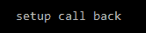

# 创建窗口表面

我们需要一个针对当前平台创建的窗口的接口，以便我们可以展示我们将要渲染的图像。我们使用`VKSurfaceKHR`属性来获取对窗口表面的访问权限。为了存储操作系统支持的表面信息，我们将调用`glfw`函数`glfwCreateWindowSurface`来创建操作系统支持的表面。

在`VulkanContext.h`中，添加一个名为`surface`的新变量，类型为`VkSurfaceKHR`，如下所示：

```cpp
private: 

   //surface 
   VkSurfaceKHR surface; 

```

由于我们需要访问在`source.cpp`中创建的窗口实例，因此更改`initVulkan`函数，使其接受一个`GLFWwindow`，如下所示：

```cpp
   void initVulkan(GLFWwindow* window); 

```

在`VulkanContext.cpp`中，更改`initVulkan`的实现，如下所示，并调用`glfwCreateWindowSurface`函数，该函数接受 Vulkan 实例和窗口。接下来，传入`null`作为分配器和表面以创建表面对象：

```cpp
 void VulkanContext::initVulkan(GLFWwindow* window) { 

   // -- Platform Specific 

   // Validation and Extension Layers 
   valLayersAndExt = new AppValidationLayersAndExtensions(); 

   if (isValidationLayersEnabled && !valLayersAndExt->
      checkValidationLayerSupport()) { 
         throw std::runtime_error("Requested Validation Layers
            Not Available !"); 
   } 

   // Create App And Vulkan Instance() 
   vInstance = new VulkanInstance(); 
   vInstance->createAppAndVkInstance(isValidationLayersEnabled, 
     valLayersAndExt); 

   // Debug CallBack 
   valLayersAndExt->setupDebugCallback(isValidationLayersEnabled, 
    vInstance->vkInstance); 

   // Create Surface 
   if (glfwCreateWindowSurface(vInstance->vkInstance, window, 
      nullptr, &surface) != VK_SUCCESS) { 

         throw std::runtime_error(" failed to create window 
           surface !"); 
   } 
} 

```

最后，在`source.cpp`中更改`initVulkan`函数，如下所示：

```cpp
   GLFWwindow* window = glfwCreateWindow(WIDTH, HEIGHT, 
                        "HELLO VULKAN ", nullptr, nullptr); 

   VulkanContext::getInstance()->initVulkan(window); 
```

# 选择物理设备并创建逻辑设备

现在，我们将创建`Device`类，它将用于遍历我们拥有的不同物理设备。我们将选择一个来渲染我们的应用程序。为了检查您的 GPU 是否与 Vulkan 兼容，请检查 GPU 供应商网站上的兼容性列表，或访问[`en.wikipedia.org/wiki/Vulkan_(API)`](https://en.wikipedia.org/wiki/Vulkan_(API))。

基本上，任何来自 Geforce 600 系列以及 Radeon HD 2000 系列及以后的 NVIDIA GPU 都应该得到支持。为了访问物理设备并创建逻辑设备，我们将创建一个新的类，这样我们就可以随时访问它。创建一个名为`Device`的新类。在`Device.h`中添加以下包含：

```cpp
#include<vulkan\vulkan.h> 
#include<stdexcept> 

#include<iostream> 
#include<vector> 
#include<set> 

#include"VulkanInstance.h" 
#include"AppValidationLayersAndExtensions.h" 
```

为了方便起见，我们还将添加几个结构体。第一个叫做`SwapChainSupportDetails`；它能够访问`VkSurfaceCapabilitiesKHR`，其中包含有关表面的所有所需详细信息。我们还将添加`VkSurfaceFormatKHR`类型的`surfaceFormats`向量，它跟踪表面支持的所有不同图像格式，以及`VkPresentModeKHR`类型的`presentModes`向量，它存储 GPU 支持的显示模式。

渲染的图像将被发送到窗口表面并显示。这就是我们能够使用渲染器（如 OpenGL 或 Vulkan）看到最终渲染图像的原因。现在，我们可以一次显示这些图像，如果我们想永远查看静态图像，这是可以的。然而，当我们运行每 16 毫秒更新一次（每秒 60 次）的游戏时，可能会出现图像尚未完全渲染，但需要显示的情况。在这种情况下，我们会看到半渲染的图像，这会导致屏幕撕裂。

为了避免这种情况，我们使用双缓冲。这允许我们渲染图像，使其具有两个不同的图像，称为前缓冲区和后缓冲区，并在它们之间进行 ping-pong。然后，我们展示已经完成渲染的缓冲区，并在下一个帧仍在渲染时将其显示到视口中，如下面的图所示。还有不同的方式来展示图像。当我们创建 swapchain 时，我们将查看这些不同的呈现模式：

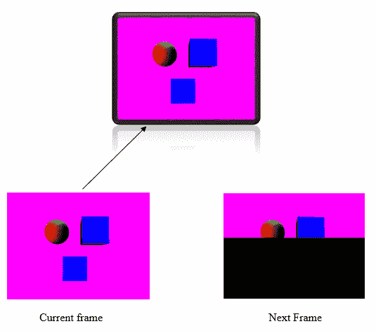

我们需要创建一个结构体来跟踪表面属性、格式和呈现模式，如下所示：

```cpp
structSwapChainSupportDetails { 

   VkSurfaceCapabilitiesKHR surfaceCapabilities; // size and images 
                                                  in swapchain 
   std::vector<VkSurfaceFormatKHR> surfaceFormats; 
   std::vector<VkPresentModeKHR> presentModes; 
}; 
```

GPU 也有被称为`QueueFamilies`的东西。命令被发送到 GPU，然后使用队列执行。有针对不同类型工作的单独队列。渲染命令被发送到渲染队列，计算命令被发送到计算队列，还有用于展示图像的呈现队列。我们还需要知道 GPU 支持哪些队列以及有多少队列存在。

渲染器、计算和呈现队列可以组合，并被称为队列家族。这些队列可以以不同的方式组合，形成多个队列家族。这意味着可以组合渲染和呈现队列形成一个队列家族，而另一个家族可能只包含计算队列。因此，我们必须检查我们是否至少有一个包含图形和呈现队列的队列家族。这是因为我们需要一个图形队列来传递我们的渲染命令，以及一个呈现队列在渲染后展示图像。

我们将添加一个结构体来检查这两个方面，如下所示：

```cpp
structQueueFamilyIndices { 

   int graphicsFamily = -1; 
   int presentFamily = -1; 

   bool arePresent() { 
         return graphicsFamily >= 0 && presentFamily >= 0; 
   } 
}; 
```

现在，我们将创建`Device`类本身。在创建类之后，我们添加构造函数和析构函数，如下所示：

```cpp
 { 

public: 

   Device(); 
   ~Device();  
```

然后，我们需要添加一些变量，以便我们可以存储物理设备、`SwapChainSupportDetails`和`QueueFamilyIndices`，如下所示：

```cpp
   VkPhysicalDevice physicalDevice; 
   SwapChainSupportDetails swapchainSupport; 
   QueueFamilyIndices queueFamiliyIndices; 

```

要创建双缓冲，我们必须检查设备是否支持它。这是通过使用`VK_KHR_SWAPCHAIN_EXTENSION_NAME`扩展来完成的，该扩展检查 swapchain。首先，我们创建一个`char*`常量向量，并传入扩展名称，如下所示：

```cpp
std::vector<constchar*>deviceExtensions = { VK_KHR_SWAPCHAIN_EXTENSION_NAME };
```

然后，我们添加了`pickPhysicalDevice`函数，该函数将根据设备是否合适来选择。在检查合适性的过程中，我们将检查所选设备是否支持 swapchain 扩展，获取 swapchain 支持详情，以及获取队列家族索引，如下所示：

```cpp
   void pickPhysicalDevice (VulkanInstance* vInstance, 
     VkSurfaceKHR surface); 

   bool isDeviceSuitable(VkPhysicalDevice device, 
     VkSurfaceKHR surface); 

   bool checkDeviceExtensionSupported(VkPhysicalDevice device) ; 
   SwapChainSupportDetails querySwapChainSupport(VkPhysicalDevice 
      device, VkSurfaceKHR surface); 
   QueueFamilyIndices findQueueFamilies(VkPhysicalDevice device, 
      VkSurfaceKHR surface); 
```

我们还将添加一个获取器函数来获取当前设备的队列家族，如下所示：

```cpp
 QueueFamilyIndicesgetQueueFamiliesIndicesOfCurrentDevice();  
```

一旦我们有了想要使用的物理设备，我们将创建一个逻辑设备的实例。逻辑设备是物理设备本身的接口。我们将使用逻辑设备来创建缓冲区等。我们还将存储当前设备的图形和呈现队列，以便我们可以发送图形和呈现命令。最后，我们将添加一个`destroy`函数，用于销毁我们创建的物理和逻辑设备，如下所示：

```cpp
   // ++++++++++++++ 
   // Logical device 
   // ++++++++++++++ 

   void createLogicalDevice(VkSurfaceKHRsurface, 
      boolisValidationLayersEnabled, AppValidationLayersAndExtensions 
      *appValLayersAndExtentions); 

   VkDevice logicalDevice; 

   // handle to the graphics queue from the queue families of the gpu 
   VkQueue graphicsQueue; // we can also have seperate queue for 
                            compute, memory transfer, etc. 
   VkQueue presentQueue; // queue for displaying the framebuffer 

   void destroy(); 
}; // End of Device class
```

`Device.h`文件的内容就到这里。让我们继续到`Device.cpp`。首先，我们包含`Device.h`并添加构造函数和析构函数，如下所示：

```cpp
#include"Device.h" 

Device::Device(){} 

Device::~Device(){ 

} 
```

现在，真正的任务开始了。我们需要创建一个`pickPhysicalDevice`函数，它接受一个 Vulkan 实例和`VkSurface`，如下所示：

```cpp

voidDevice::pickPhysicalDevice(VulkanInstance* vInstance, VkSurfaceKHRsurface) { 

   uint32_t deviceCount = 0; 

   vkEnumeratePhysicalDevices(vInstance->vkInstance, &deviceCount, 
      nullptr); 

   if (deviceCount == 0) { 
         throw std::runtime_error("failed to find GPUs with vulkan 
           support !"); 
   } 

   std::cout <<"Device Count: "<< deviceCount << std::endl; 

   std::vector<VkPhysicalDevice>devices(deviceCount); 
   vkEnumeratePhysicalDevices(vInstance->vkInstance, &deviceCount, 
      devices.data()); 

   std::cout << std::endl; 
   std::cout <<"DEVICE PROPERTIES"<< std::endl; 
   std::cout <<"================="<< std::endl; 

   for (constauto& device : devices) { 

         VkPhysicalDeviceProperties  deviceProperties; 

         vkGetPhysicalDeviceProperties(device, &deviceProperties); 

         std::cout << std::endl; 
         std::cout <<"Device name: "<< deviceProperties.deviceName 
                   << std::endl; 

         if (isDeviceSuitable(device, surface)) 
               physicalDevice = device; 

   break; 

   } 

   if (physicalDevice == VK_NULL_HANDLE) { 
         throw std::runtime_error("failed to find suitable GPU !"); 
   } 

} 
```

在这里，我们创建一个`int32`来存储物理设备的数量。我们使用`vkEnumeratePhysicalDevices`获取可用的 GPU 数量，并将 Vulkan 实例、计数和第三个参数的`null`传递过去。这将检索可用的设备数量。如果`deviceCount`为零，这意味着没有可用的 GPU。然后，我们将可用的设备数量打印到控制台。

要获取物理设备本身，我们创建一个名为`devices`的向量，它将存储`VkPhysicalDevice`数据类型；这将为我们存储设备。我们将再次调用`vkEnumeratePhysicalDevices`函数，但这次——除了传递 Vulkan 实例和设备计数之外——我们还将设备信息存储在我们传递的第三个参数中。然后，我们将打印出带有`DEVICE PROPERTIES`标题的设备数量。

要获取可用设备的属性，我们将遍历设备数量，并使用`vkGetPhysicalDeviceProperties`获取它们的属性，在将它们存储在`VkPhysicalDeviceProperties`类型的变量中之前。

现在，我们需要打印出设备的名称，并在设备上调用`DeviceSuitable`。如果设备合适，我们将将其存储为`physicalDevice`并退出循环。请注意，我们将第一个可用的设备设置为我们将要使用的设备。

如果没有合适的设备，我们将抛出一个运行时错误，表示未找到合适的设备。让我们看看`DeviceSuitable`函数：

```cpp
bool Device::isDeviceSuitable(VkPhysicalDevice device, VkSurfaceKHR 
   surface)  { 

   // find queue families the device supports 

   QueueFamilyIndices qFamilyIndices = findQueueFamilies(device, 
                                       surface); 

   // Check device extentions supported 
   bool extensionSupported = checkDeviceExtensionSupported(device); 

   bool swapChainAdequate = false; 

   // If swapchain extension is present  
   // Check surface formats and presentation modes are supported 
   if (extensionSupported) { 

         swapchainSupport = querySwapChainSupport(device, surface); 
         swapChainAdequate = !swapchainSupport.surfaceFormats.empty() 
                             && !swapchainSupport.presentModes.empty(); 

   } 

   VkPhysicalDeviceFeatures supportedFeatures; 
   vkGetPhysicalDeviceFeatures(device, &supportedFeatures); 

   return qFamilyIndices.arePresent() && extensionSupported && 
     swapChainAdequate && supportedFeatures.samplerAnisotropy; 

} 

```

在这个函数中，我们通过调用`findQueueFamilies`获取队列家族索引。然后，我们检查是否支持`VK_KHR_SWAPCHAIN_EXTENSION_NAMEextension`。之后，我们检查设备上的 swapchain 支持。如果表面格式和呈现模式不为空，`swapChainAdequateboolean`设置为`true`。最后，我们通过调用`vkGetPhysicalDeviceFeatures`获取物理设备特性。

最后，如果队列家族存在，swapchain 扩展被支持，swapchain 足够，并且设备支持各向异性过滤，我们将返回`true`。各向异性过滤是一种使远处的像素更清晰的模式。

各向异性过滤是一种模式，当启用时，有助于从极端角度查看的纹理变得更加清晰。

在以下示例中，右侧的图像启用了各向异性过滤，而左侧的图像未启用。在右侧的图像中，白色虚线在道路下方仍然相对可见。然而，在左侧的图像中，虚线变得模糊且像素化。因此，需要各向异性过滤：


（摘自[`i.imgur.com/jzCq5sT.jpg`](https://i.imgur.com/jzCq5sT.jpg))

让我们看看在上一函数中调用的三个函数。首先，让我们看看`findQueueFamilies`函数：

```cpp
QueueFamilyIndicesDevice::findQueueFamilies(VkPhysicalDevicedevice, VkSurfaceKHRsurface) { 

   uint32_t queueFamilyCount = 0; 

   vkGetPhysicalDeviceQueueFamilyProperties(device, &queueFamilyCount, 
      nullptr); 

   std::vector<VkQueueFamilyProperties>queueFamilies(queueFamilyCount); 

   vkGetPhysicalDeviceQueueFamilyProperties(device, &queueFamilyCount, 
      queueFamilies.data()); 

   int i = 0; 

   for (constauto& queueFamily : queueFamilies) { 

         if (queueFamily.queueCount > 0 && queueFamily.queueFlags 
           &VK_QUEUE_GRAPHICS_BIT) { 
               queueFamiliyIndices.graphicsFamily = i; 
         } 

         VkBool32 presentSupport = false; 
         vkGetPhysicalDeviceSurfaceSupportKHR(device, i, surface, 
           &presentSupport); 

         if (queueFamily.queueCount > 0 && presentSupport) { 
               queueFamiliyIndices.presentFamily = i; 
         } 

         if (queueFamiliyIndices.arePresent()) { 
               break; 
         } 

         i++; 
   } 

   return queueFamiliyIndices; 
}
```

要获取队列家族属性，我们调用`vkGetPhysicalDeviceQueueFamilyProperties`函数；然后，在物理设备中，我们传递一个`int`，我们用它来存储队列家族的数量，以及`null`指针。这将给我们提供可用的队列家族数量。

接下来，对于属性本身，我们创建了一个`VkQueueFamilyProperties`类型的向量，称为`queueFamilies`，用于存储必要的信息。然后，我们调用`vkGetPhysicalDeviceFamilyProperties`并传递物理设备、计数和`queueFamilies`本身，以填充所需的数据。我们创建一个`int`，`i`，并将其初始化为`0`。这将存储图形和演示索引的索引。

在`for`循环中，我们检查每个队列家族是否支持图形队列，通过查找`VK_QUEUE_GRAPHICS_BIT`。如果支持，我们设置图形家族索引。

然后，我们通过传递索引来检查演示支持。这将检查是否相同的家族也支持演示。如果它支持演示，我们将`presentFamily`设置为该索引。

如果队列家族支持图形和演示，图形和演示索引将是相同的。

以下截图显示了按设备划分的队列家族数量以及每个队列家族中的队列数量：

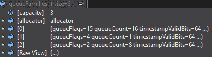

我的 GPU 上有三个队列家族。第一个队列家族在 0^(th)索引处有 16 个队列，第二个队列家族在 1^(st)索引处有一个队列，第三个队列家族在 2^(nd)索引处有八个队列。

`queueFlags`指定队列家族中的队列。支持的队列可以是图形、计算、传输或稀疏绑定。

然后，我们检查是否找到了图形和显示索引，然后退出循环。最后，我们返回`queueFamilyIndices`。我在 Intel Iris Plus Graphics 650 上运行项目。这个集成的英特尔 GPU 有一个支持图形和显示队列的队列家族。不同的 GPU 有不同的队列家族，每个家族可能支持多种队列类型。接下来，让我们看看支持的设备扩展。我们可以通过使用`checkDeviceExtensionSupported`函数来检查这一点，该函数接受一个物理设备，如下面的代码所示：

```cpp
 boolDevice::checkDeviceExtensionSupported(VkPhysicalDevicedevice){ 

   uint32_t extensionCount; 

   // Get available device extentions count 
   vkEnumerateDeviceExtensionProperties(device, nullptr, 
     &extensionCount, nullptr); 

   // Get available device extentions 
   std::vector<VkExtensionProperties>availableExtensions(extensionCount); 

   vkEnumerateDeviceExtensionProperties(device, nullptr,  
     &extensionCount, availableExtensions.data()); 

   // Populate with required device exentions we need 
   std::set<std::string>requiredExtensions(deviceExtensions.begin(), 
     deviceExtensions.end()); 

   // Check if the required extention is present 
   for (constauto& extension : availableExtensions) { 
         requiredExtensions.erase(extension.extensionName); 
   } 

   // If device has the required device extention then return  
   return requiredExtensions.empty(); 
} 

```

通过调用`vkEnumerateDeviceExtensionProperties`并传递物理设备、空指针、一个用于存储计数的`int`和一个空指针来获取设备支持的扩展数量。实际的属性存储在`availableExtensions`向量中，该向量存储`VkExtensionProperties`数据类型。通过再次调用`vkEnumerateDeviceExtensionProperties`，我们获取设备的扩展属性。

我们将所需的扩展添加到`requiredExtensions`向量中。然后，我们使用所需的扩展检查可用的扩展向量。如果找到所需的扩展，我们就从向量中移除它。这意味着设备支持该扩展，并从函数返回值，如下面的代码所示：

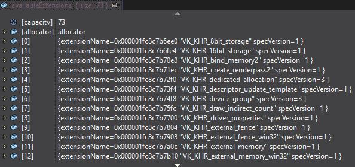

运行在我设备上的设备有 73 个可用的扩展，如下面的代码所示。你可以设置一个断点并查看设备扩展属性以查看设备的支持扩展。我们将要查看的第三个函数是`querySwapChainSupport`函数，它填充了可用的表面功能、表面格式和显示模式：

```cpp
SwapChainSupportDetailsDevice::querySwapChainSupport
   (VkPhysicalDevicedevice, VkSurfaceKHRsurface) { 

   SwapChainSupportDetails details; 

   vkGetPhysicalDeviceSurfaceCapabilitiesKHR(device, surface, 
      &details.surfaceCapabilities); 

   uint32_t formatCount; 
   vkGetPhysicalDeviceSurfaceFormatsKHR(device, surface, &formatCount, 
      nullptr); 

   if (formatCount != 0) { 
         details.surfaceFormats.resize(formatCount); 
         vkGetPhysicalDeviceSurfaceFormatsKHR(device, surface, 
            &formatCount, details.surfaceFormats.data()); 
   } 

   uint32_t presentModeCount; 
   vkGetPhysicalDeviceSurfacePresentModesKHR(device, surface, 
     &presentModeCount, nullptr); 

   if (presentModeCount != 0) { 

         details.presentModes.resize(presentModeCount); 
         vkGetPhysicalDeviceSurfacePresentModesKHR(device, surface, 
           &presentModeCount, details.presentModes.data()); 
   } 

   return details; 
} 
```

要获取表面功能，我们调用`vkGetPhysicalDeviceSurfaceCapabilitiesKHR`并将设备（即`surface`）传递给它以获取表面功能。要获取表面格式和显示模式，我们分别调用`vkGetPhysicalDeviceSurfaceFormatKHR`和`vkGetPhysicalDeviceSurfacePresentModeKHR`两次。

第一次调用`vkGetPhysicalDeviceSurfacePresentModeKHR`函数时，我们获取现有格式和模式的数量；我们第二次调用它以获取已填充并存储在结构体向量的格式和模式。

这里是我的设备表面的功能：

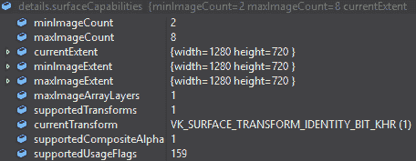

因此，最小图像计数是两个，这意味着我们可以添加双缓冲。以下是我的设备支持的表面格式和色彩空间：

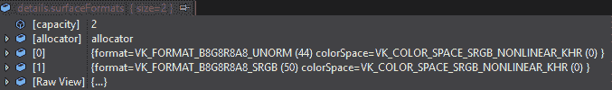

这里是我的设备支持的显示模式：

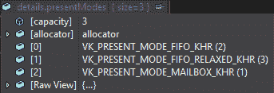

因此，我的设备似乎只支持即时模式。我们将在后续章节中看到它的用法。在获取物理设备属性后，我们为`queueFamiliyIndices`设置 getter 函数，如下所示：

```cpp
QueueFamilyIndicesDevice::getQueueFamiliesIndicesOfCurrentDevice() { 

   return queueFamiliyIndices; 
} 
```

现在，我们可以使用`createLogicalDevice`函数创建逻辑设备。

要创建逻辑设备，我们必须填充`VkDeviceCreateInfo`结构体，这需要`queueCreateInfo`结构体。让我们开始吧：

1.  创建一个向量，以便我们可以存储`VkDeviceQueueCreateInfo`和图形和呈现队列所需的任何信息。

1.  创建另一个`int`类型的向量，以便我们可以存储图形和呈现队列的索引。

1.  对于每个队列家族，填充`VkDeviceQueueCreateInfo`。创建一个局部结构体，传入结构体类型、队列家族索引、队列计数和优先级（为`1`），然后将它推入`queueCreateInfos`向量，如下所示：

```cpp
void Device::createLogicalDevice(VkSurfaceKHRsurface, boolisValidationLayersEnabled, AppValidationLayersAndExtensions *appValLayersAndExtentions) { 

   // find queue families like graphics and presentation 
   QueueFamilyIndices indices = findQueueFamilies(physicalDevice, 
          surface); 

   std::vector<VkDeviceQueueCreateInfo> queueCreateInfos; 

   std::set<int> uniqueQueueFamilies = { indices.graphicsFamily, 
                                       indices.presentFamily }; 

   float queuePriority = 1.0f; 

   for (int queueFamily : uniqueQueueFamilies) { 

         VkDeviceQueueCreateInfo queueCreateInfo = {}; 
         queueCreateInfo.sType = VK_STRUCTURE_TYPE_DEVICE
                                 _QUEUE_CREATE_INFO; 
         queueCreateInfo.queueFamilyIndex = queueFamily; 
         queueCreateInfo.queueCount = 1; // we only require 1 queue 
         queueCreateInfo.pQueuePriorities = &queuePriority; 
         queueCreateInfos.push_back(queueCreateInfo); 
   } 
```

1.  要创建设备，指定我们将使用的设备功能。对于设备功能，我们将创建一个`VkPhysicalDeviceFeatures`类型的变量，并将`samplerAnisotropy`设置为`true`，如下所示：

```cpp
 //specify device features  
   VkPhysicalDeviceFeatures deviceFeatures = {};  

   deviceFeatures.samplerAnisotropy = VK_TRUE; 

```

1.  创建`VkDeviceCreateInfo`结构体，这是创建逻辑设备所必需的。将类型设置为`VK_STRUCTURE_TYPE_DEVICE_CREATE_INFO`，然后设置`queueCreateInfos`、计数和要启用的设备功能。

1.  设置设备扩展计数和名称。如果启用了验证层，我们设置验证层的计数和名称。通过调用`vkCreateDevice`并传入物理设备、创建设备信息和`null`分配器来创建`logicalDevice`。然后，创建逻辑设备，如下所示。如果失败，则抛出运行时错误：

```cpp
   VkDeviceCreateInfo createInfo = {}; 
   createInfo.sType = VK_STRUCTURE_TYPE_DEVICE_CREATE_INFO; 
   createInfo.pQueueCreateInfos = queueCreateInfos.data(); 
   createInfo.queueCreateInfoCount = static_cast<uint32_t>
                                     (queueCreateInfos.size()); 

   createInfo.pEnabledFeatures = &deviceFeatures; 
   createInfo.enabledExtensionCount = static_cast<uint32_t>
     (deviceExtensions.size()); 
   createInfo.ppEnabledExtensionNames = deviceExtensions.data(); 

   if (isValidationLayersEnabled) { 
      createInfo.enabledLayerCount = static_cast<uint32_t>(appValLayersAndExtentions->requiredValidationLayers.size()); 
      createInfo.ppEnabledLayerNames = appValLayersAndExtentions->
                               requiredValidationLayers.data(); 
   } 
   else { 
         createInfo.enabledLayerCount = 0; 
   } 

   //create logical device 

   if (vkCreateDevice(physicalDevice, &createInfo, nullptr, 
      &logicalDevice) != VK_SUCCESS) { 
         throw std::runtime_error("failed to create logical 
            device !"); 
   }
```

1.  获取设备图形和呈现队列，如下所示。我们现在完成了`Device`类的操作：

```cpp
//get handle to the graphics queue of the gpu 
vkGetDeviceQueue(logicalDevice, indices.graphicsFamily, 0, 
&graphicsQueue); 

//get handle to the presentation queue of the gpu 
vkGetDeviceQueue(logicalDevice, indices.presentFamily, 0, &presentQueue); 

}  
```

1.  这完成了`Device`类的封装。在`VulkanContext.h`文件中包含`Device.h`文件，并在`VulkanContext`类的私有部分添加一个新的`Device`类型设备对象，如下所示：

```cpp
// My Classes
   AppValidationLayersAndExtensions *valLayersAndExt; 
   VulkanInstance* vInstance; 
   Device* device; 
```

1.  在`VulkanContext.cpp`文件中的`VulkanInit`函数中，在创建表面之后添加以下代码：

```cpp
device = new Device(); 
device->pickPhysicalDevice(vInstance, surface); 
device->createLogicalDevice(surface, isValidationLayersEnabled,
   valLayersAndExt);   
```

1.  这将创建`device`类的新实例，并从可用的物理设备中选择一个设备。然后，你将能够创建逻辑设备。运行应用程序以查看应用程序将在哪个设备上运行。在我的台式机上，找到了以下设备计数和名称：


1.  在我的笔记本电脑上，应用程序找到了以下设备名称的设备：

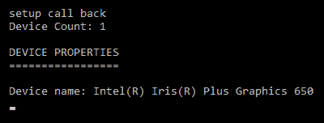

1.  在`findQueueFamilies`、`checkDeviceExtensionSupport`和`querySwapChainSupport`函数内部设置断点，以检查队列家族设备扩展的数量以及 GPU 对 swapchain 的支持情况。

# 摘要

我们已经完成了大约四分之一的渲染到视口的过程。在这一章中，我们设置了验证层和我们需要设置的扩展，以便设置 Vulkan 渲染。我们创建了一个 Vulkan 应用程序和实例，然后创建了一个设备类，以便我们可以选择物理设备。我们还创建了一个逻辑设备，以便我们可以与 GPU 交互。

在下一章中，我们将创建 swapchain 本身，以便我们可以在缓冲区之间进行交换，并且我们将创建渲染和深度纹理来绘制场景。我们将创建一个渲染通道来设置渲染纹理的使用方式，然后创建绘制命令缓冲区，这些缓冲区将执行我们的绘制命令。
