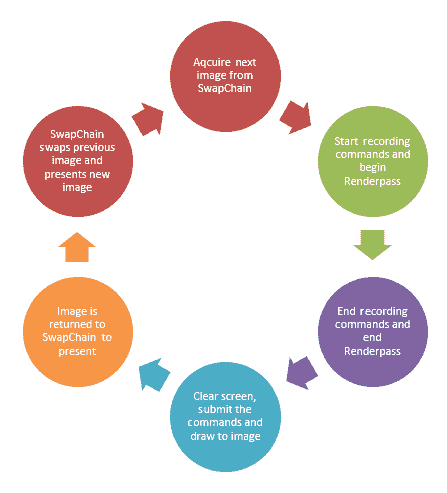
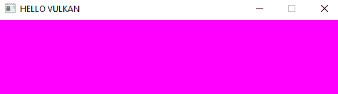
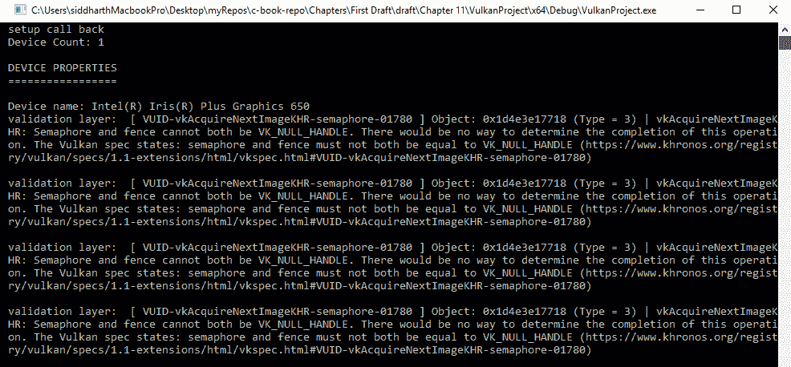

# 准备清除屏幕

在上一章中，我们启用了 Vulkan 验证层和扩展，创建了 Vulkan 应用程序和实例，选择了设备，并创建了逻辑设备。在这一章中，我们将继续探索创建清晰的屏幕图像并将其呈现到视口的过程。

在绘制图像之前，我们首先使用一个颜色值清除和擦除之前的图像。如果我们不这样做，新的图像将覆盖在之前的图像上，这将产生一种迷幻的效果。

每幅图像被清除和渲染后，然后呈现在屏幕上。当当前图像正在显示时，下一幅图像已经在后台被绘制。一旦渲染完成，当前图像将与新图像交换。这种图像交换由 **SwapChain** 负责处理。

在我们的案例中，我们正在绘制的 SwapChain 中的每一幅图像仅仅存储颜色信息。这个目标图像被渲染，因此被称为渲染目标。我们也可以有其他的目标图像。例如，我们可以有一个深度目标/图像，它将存储每帧每个像素的深度信息。因此，我们也创建了这些渲染目标。

每帧的每个目标图像被设置为附件并用于创建帧缓冲区。由于我们采用双缓冲（意味着我们有两套图像进行交换），我们为每一帧创建一个帧缓冲区。因此，我们将为每一帧创建两个帧缓冲区——一个用于每一帧——并将图像作为附件添加。

我们给 GPU 的命令——例如，绘制命令——通过每个帧使用命令缓冲区发送到 GPU。命令缓冲区存储所有要使用设备图形队列提交给 GPU 的命令。因此，对于每一帧，我们创建一个命令缓冲区来携带我们所有的命令。

一旦命令提交并且场景被渲染，我们不仅可以将绘制的图像呈现在屏幕上，我们还可以将其保存并添加任何后处理效果，例如运动模糊。在渲染过程中，我们可以指定渲染目标的使用方式。尽管在我们的案例中，我们不会添加任何后处理效果，但我们仍然需要创建一个渲染过程。因此，我们创建了一个渲染过程，它将指定我们将使用多少 SwapChain 图像和缓冲区，它们是什么类型的缓冲区，以及它们应该如何使用。

图像将经历的各个阶段如下：



本章涵盖的主题如下：

+   创建 `SwapChain`

+   创建 `Renderpass`

+   使用渲染视图和 `Framebuffers`

+   创建 `CommandBuffer`

+   开始和结束 `Renderpass`

+   创建清除屏幕

# 创建 SwapChain

当场景渲染时，缓冲区会交换并显示到窗口表面。表面是平台相关的，并且根据操作系统，我们必须相应地选择表面格式。为了正确显示场景，我们根据表面格式、显示模式和图片的范围（即窗口可以支持的宽度和高度）创建 `SwapChain`。

在 第十章 的 *绘制 Vulkan 对象* 中，当我们选择要使用的 GPU 设备时，我们检索了设备的属性，例如表面格式和它支持的显示模式。当我们创建 `SwapChain` 时，我们将匹配并检查设备提供的表面格式和显示，以及窗口支持的表面格式，以创建 `SwapChain` 对象本身。

我们创建了一个新的类，名为 `SwapChain`，并将以下包含添加到 `SwapChain.h`：

```cpp
#include <vulkan\vulkan.h> 
#include <vector> 
#include <set> 
#include <algorithm>  
```

然后，我们创建类，如下所示：

```cpp
classSwapChain { 
public: 
   SwapChain(); 
   ~SwapChain(); 

   VkSwapchainKHR swapChain; 
   VkFormat swapChainImageFormat; 
   VkExtent2D swapChainImageExtent; 

   std::vector<VkImage> swapChainImages; 

   VkSurfaceFormatKHRchooseSwapChainSurfaceFormat(
     const std::vector<VkSurfaceFormatKHR>&availableFormats); 

   VkPresentModeKHRchooseSwapPresentMode(
     const std::vector<VkPresentModeKHR>availablePresentModes); 

   VkExtent2DchooseSwapExtent(constVkSurfaceCapabilitiesKHR&capabilities); 

   void create(VkSurfaceKHRsurface); 

void destroy(); 
}  
```

在类的公共部分，我们创建构造函数和析构函数。然后，我们创建 `VkSwapchainKHR`、`VkFormat` 和 `VkExtent2D` 类型的变量来存储 `swapchain` 本身。当我们创建表面时，我们存储支持的图片格式以及图片的范围，即视口的宽度和高度。这是因为，当视口拉伸或改变时，swapchain 图片的大小也会相应地改变。

我们创建了一个 `VkImage` 类型的向量，称为 `swapChainImages`，用于存储 SwapChain 图片。创建了三个辅助函数，`chooseSwapChainSurfaceFormat`、`chooseSwapPresentMode` 和 `chooseSwapExtent`，以获取最合适的表面格式、显示模式和 SwapChain 范围。最后，`create` 函数接收我们将在其中创建 swapchain 本身的表面。我们还添加了一个用于销毁和释放资源回系统的函数。

`SwapChain.h` 文件的内容就是这些。我们现在将转到 `SwapChain.cpp` 以包含函数的实现。

在 `SwapChain.cpp` 文件中，添加以下包含：

```cpp
#include"SwapChain.h" 

#include "VulkanContext.h"
```

我们需要包含 `VulkanContext.h` 来获取设备的 `SwapChainSupportDetails` 结构体，这是我们在上一个章节中在选择了物理设备并创建了逻辑设备时填充的。在我们创建 swapchain 之前，让我们先看看三个辅助函数以及每个是如何创建的。

三个函数中的第一个是 `chooseSwapChainSurfaceFormat`。这个函数接收一个 `VkSurfaceFormatKHR` 类型的向量，这是设备支持的可用格式。使用这个函数，我们将选择最合适的表面格式。函数的创建方式如下：

```cpp
VkSurfaceFormatKHRSwapChain::chooseSwapChainSurfaceFormat(const std::vector<VkSurfaceFormatKHR>&availableFormats) { 

   if (availableFormats.size() == 1 &&availableFormats[0].format == 
     VK_FORMAT_UNDEFINED) { 
         return{VK_FORMAT_B8G8R8A8_UNORM, 
           VK_COLOR_SPACE_SRGB_NONLINEAR_KHR }; 
   } 

   for (constauto& availableFormat : availableFormats) { 
         if (availableFormat.format == VK_FORMAT_B8G8R8A8_UNORM&& 
            availableFormat.colorSpace == 
            VK_COLOR_SPACE_SRGB_NONLINEAR_KHR) { 
                return availableFormat; 
         } 
   } 
   returnavailableFormats[0]; 
} 
```

首先，我们检查可用的格式是否仅为 `1`，并且是否由设备未定义。这意味着没有首选格式，因此我们选择对我们最方便的一个。

返回的值是颜色格式和颜色空间。颜色格式指定了颜色本身的格式，`VK_FORMAT_B8G8R8A8_UNORM`，这告诉我们我们在每个像素中存储 32 位信息。颜色存储在蓝色、绿色、红色和 Alpha 通道中，并且按照这个顺序。每个通道存储 8 位，这意味着 2⁸，即 256 种颜色值。"UNORM"表明每个颜色值是归一化的，所以颜色值不是从 0-255，而是归一化在 0 和 1 之间。

我们选择 SRGB 色彩空间作为第二个参数，因为我们希望有更多的颜色范围被表示。如果没有首选格式，我们将遍历可用的格式，然后检查并返回我们需要的格式。我们选择这个色彩空间，因为大多数表面支持这种格式，因为它广泛可用。否则，我们只返回第一个可用的格式。

下一个函数是`chooseSwapPresentMode`，它接受一个名为`availablePresentModes`的`VkPresentModeKHR`向量。展示模式指定了最终渲染的图片如何呈现到视口。以下是可用的模式：

+   `VK_PRESENT_MODE_IMMEDIATE_KHR`：在这种情况下，图片将在有可呈现的图片时立即显示。图片不会被排队等待显示。这会导致图片撕裂。

+   `VK_PRESENT_MODE_FIFO_KHR`：要呈现的获取的图片被放入一个队列中。队列的大小是交换链大小减一。在垂直同步（vsync）时，第一个要显示的图片以**先进先出（FIFO）**的方式显示。由于图片是按照它们被添加到队列中的顺序显示的，并且启用了垂直同步，所以没有撕裂。这种模式需要始终支持。

+   `VK_PRESENT_MODE_FIFO_RELAXED_KHR`：这是`FIFO`模式的一种变体。在这种模式下，如果渲染速度超过显示器的刷新率，那是可以的，但如果绘图速度慢于显示器，当下一个可用的图片立即呈现时，将会出现屏幕撕裂。

+   `VK_PRESENTATION_MODE_MAILBOX_KHR`：图片的展示被放入一个队列中，但它只有一个元素，与`FIFO`不同，`FIFO`队列中有多个元素。下一个要显示的图片将等待队列被显示，然后展示引擎将显示图片。这不会导致撕裂。

基于这些信息，让我们创建`chooseSwapPresentMode`函数：

```cpp
VkPresentModeKHRSwapChain::chooseSwapPresentMode(
  const std::vector<VkPresentModeKHR>availablePresentModes) { 

   VkPresentModeKHR bestMode = VK_PRESENT_MODE_FIFO_KHR; 

   for (constauto& availablePresentMode : availablePresentModes) { 

         if (availablePresentMode == VK_PRESENT_MODE_MAILBOX_KHR) { 
               return availablePresentMode; 
         } 
         elseif (availablePresentMode == VK_PRESENT_MODE_IMMEDIATE_KHR) { 
               bestMode = availablePresentMode; 
         } 

         return bestMode; 
   } 
} 
```

由于`FIFO`模式是我们最偏好的模式，我们在函数中将它设置好，以便我们可以将其与设备的可用模式进行比较。如果不可用，我们将选择下一个最佳模式，即`MAILBOX`模式，这样展示队列至少会多一个图片以避免屏幕撕裂。如果两种模式都不可用，我们将选择`IMMEDIATE`模式，这是最不希望的模式。

第三个函数是`chooseSwapExtent`函数。在这个函数中，我们获取我们绘制窗口的分辨率来设置 swapchain 图片的分辨率。它被添加如下：

```cpp

VkExtent2DSwapChain::chooseSwapExtent(constVkSurfaceCapabilitiesKHR&
   capabilities) { 

   if (capabilities.currentExtent.width != std::numeric_limits<uint32_t>::max()) { 
         returncapabilities.currentExtent; 
   } 
   else { 

         VkExtent2D actualExtent = { 1280, 720 }; 

         actualExtent.width = std::max(capabilities.minImageExtent.
                              width, std::min(capabilities.
                              maxImageExtent. width, 
                              actualExtent.width)); 
         actualExtent.height = std::max(capabilities.minImageExtent.
                               height, std::min(capabilities.
                               maxImageExtent.height, 
                               actualExtent.height)); 

         return actualExtent; 
   } 
} 

```

这个窗口的分辨率应该与 swapchain 图片匹配。一些窗口管理器允许图片和窗口之间的分辨率不同。这可以通过将值设置为`uint32_t`的最大值来表示。如果不这样做，那么在这种情况下，我们将返回通过硬件能力检索到的当前范围，或者选择与最大和最小值之间的分辨率最匹配的分辨率，与实际设置的分辨率 1,280 x 720 相比。

现在我们来看一下`create`函数，在这个函数中我们实际上创建`SwapChain`本身。为了创建这个函数，我们将添加创建`SwapChain`的功能：

```cpp
void SwapChain::create(VkSurfaceKHR surface) { 
... 
} 

```

我们首先做的事情是获取设备支持详情，这是我们创建`Device`类时为我们的设备检索到的：

```cpp
SwapChainSupportDetails swapChainSupportDetails = VulkanContext::getInstance()-> getDevice()->swapchainSupport;
```

然后，使用我们创建的`helper`函数，我们获取表面格式、展示模式和范围：

```cpp
   VkSurfaceFormatKHR surfaceFormat = chooseSwapChainSurfaceFormat
     (swapChainSupportDetails.surfaceFormats); 
   VkPresentModeKHR presentMode = chooseSwapPresentMode
     (swapChainSupportDetails.presentModes); 
   VkExtent2D extent = chooseSwapExtent
      (swapChainSupportDetails.surfaceCapabilities); 
```

然后我们设置 swapchain 所需的图片的最小数量：

```cpp
uint32_t imageCount = swapChainSupportDetails.
                      surfaceCapabilities.minImageCount; 
```

我们还应该确保我们不超过可用的最大图片数量，所以如果`imageCount`超过了最大数量，我们将`imageCount`设置为最大计数：

```cpp
   if (swapChainSupportDetails.surfaceCapabilities.maxImageCount > 0 && 
     imageCount > swapChainSupportDetails.surfaceCapabilities.
     maxImageCount) { 
         imageCount = swapChainSupportDetails.surfaceCapabilities.
                      maxImageCount; 
   } 

```

要创建 swapchain，我们首先必须填充`VkSwapchainCreateInfoKHR`结构，所以让我们创建它。创建一个名为`createInfo`的变量并指定结构体的类型：

```cpp
   VkSwapchainCreateInfoKHR createInfo = {}; 
   createInfo.sType = VK_STRUCTURE_TYPE_SWAPCHAIN_CREATE_INFO_KHR; 
```

在这里，我们必须指定要使用的表面、最小图片计数、图片格式、空间和范围。我们还需要指定图片数组层。由于我们不会创建一个像虚拟现实游戏这样的立体应用，其中会有两个表面，一个用于左眼，一个用于右眼，因此我们只需将其值设置为`1`。我们还需要指定图片将用于什么。在这里，它将用于使用颜色附件显示颜色信息：

```cpp
   createInfo.surface = surface; 
   createInfo.minImageCount = imageCount; 
   createInfo.imageFormat = surfaceFormat.format; 
   createInfo.imageColorSpace = surfaceFormat.colorSpace; 
   createInfo.imageExtent = extent; 
   createInfo.imageArrayLayers = 1; // this is 1 unless you are making
   a stereoscopic 3D application 
   createInfo.imageUsage = VK_IMAGE_USAGE_COLOR_ATTACHMENT_BIT;
```

我们现在指定图形、展示索引和计数。我们还指定了共享模式。展示和图形家族可以是相同的，也可以是不同的。

如果展示和图形家族不同，共享模式被认为是`VK_SHARING_MODE_CONCURRENT`类型。这意味着图片可以在多个队列家族之间使用。然而，如果图片在同一个队列家族中，共享模式被认为是`VK_SHARING_MODE_EXCLUSIVE`类型：

```cpp
   if (indices.graphicsFamily != indices.presentFamily) { 

         createInfo.imageSharingMode = VK_SHARING_MODE_CONCURRENT; 
         createInfo.queueFamilyIndexCount = 2; 
         createInfo.pQueueFamilyIndices = queueFamilyIndices; 

   } 
   else { 

         createInfo.imageSharingMode = VK_SHARING_MODE_EXCLUSIVE; 
         createInfo.queueFamilyIndexCount = 0; 
         createInfo.pQueueFamilyIndices = nullptr; 
   } 
```

如果我们想，我们可以对图片应用预变换，以翻转或镜像它。在这种情况下，我们只保留当前变换。我们还可以将图片与其它窗口系统进行 alpha 混合，但我们只是保持不透明，忽略 alpha 通道，设置显示模式，并设置如果前面有窗口，像素是否应该被裁剪。我们还可以指定一个旧的`SwapChain`，如果当前`SwapChain`在调整窗口大小时变得无效。由于我们不调整窗口大小，所以我们不需要指定旧的 swapchain。

在设置信息结构后，我们可以创建 swapchain 本身：

```cpp
if (vkCreateSwapchainKHR(VulkanContext::getInstance()->getDevice()->
   logicalDevice, &createInfo, nullptr, &swapChain) != VK_SUCCESS) { 
         throw std::runtime_error("failed to create swap chain !"); 
   } 
```

我们使用`vkCreateSwapchainKHR`函数创建 swapchain，该函数接受逻辑设备、`createInfo`结构、分配器回调和 swapchain 本身。如果由于错误而没有创建`SwapChain`，我们将发送错误。现在 swapchain 已创建，我们将获取 swapchain 图片。

根据图片数量，我们调用`vkGetSwapchainImagesKHR`函数，该函数用于首先获取图片数量，然后再次调用该函数以将图片填充到`vkImage`向量中：

```cpp
   vkGetSwapchainImagesKHR(VulkanContext::getInstance()->getDevice()->
      logicalDevice, swapChain, &imageCount, nullptr); 
   swapChainImages.resize(imageCount); 
   vkGetSwapchainImagesKHR(VulkanContext::getInstance()->getDevice()->
      logicalDevice, swapChain, &imageCount, swapChainImages.data()); 
```

图片的创建稍微复杂一些，但 Vulkan 会自动创建彩色图片。我们可以设置图片格式和范围：

```cpp
   swapChainImageFormat = surfaceFormat.format; 
   swapChainImageExtent= extent; 
```

然后，我们添加一个`destroy`函数，通过调用`vkDestroySwapchainKHR`函数来销毁`SwapChain`：

```cpp
void SwapChain::destroy(){ 

   // Swapchain 
   vkDestroySwapchainKHR(VulkanContext::getInstance()-> getDevice()->
      logicalDevice, swapChain, nullptr); 

} 
```

在`VulkanApplication.h`文件中，包含`SwapChain`头文件并在`VulkanApplication`类中创建一个新的`SwapChain`实例。在`VulkanApplication.cpp`文件中，在`initVulkan`函数中，在创建逻辑设备之后，创建`SwapChain`如下：

```cpp
   swapChain = new SwapChain(); 
   swapChain->create(surface);
```

构建并运行应用程序以确保`SwapChain`创建没有错误。

# 创建 Renderpass

在创建`SwapChain`之后，我们继续到`Renderpass`。在这里，我们指定有多少个颜色附件和深度附件，以及每个附件在帧缓冲区中使用的样本数量。

如本章开头所述，帧缓冲区是一组目标附件。附件可以是颜色、深度等类型。颜色附件存储要呈现给视口的颜色信息。还有其他用户看不到但内部使用的附件。这包括深度，例如，它包含每个像素的所有深度信息。在渲染遍历中，除了附件类型外，我们还指定了如何使用附件。

对于这本书，我们将展示场景中渲染到视口的内容，因此我们只需使用单个遍历。如果我们添加后处理效果，我们将对渲染的图片应用此效果，为此我们需要使用多个遍历。我们将创建一个新的类`Renderpass`，在其中我们将创建渲染遍历。

在`Renderpass.h`文件中，添加以下包含和类：

```cpp
#include <vulkan\vulkan.h> 
#include <array> 

class Renderpass 
{ 
public: 
   Renderpass(); 
   ~Renderpass(); 

   VkRenderPass renderPass; 

   void createRenderPass(VkFormat swapChainImageFormat); 

   void destroy(); 
};
```

在类中添加构造函数、析构函数以及`VkRenderPass`和`renderPass`变量。添加一个名为`createRenderPass`的新函数，用于创建`Renderpass`本身，它接受图片格式。还要添加一个函数，用于在用完后销毁`Renderpass`对象。

在`Renderpass.cpp`文件中，添加以下包含项，以及构造函数和析构函数：

```cpp
#include"Renderpass.h" 
#include "VulkanContext.h"
Renderpass::Renderpass(){} 

Renderpass::~Renderpass(){} 

```

现在我们添加`createRenderPass`函数，在其中我们将添加创建当前要渲染场景的`Renderpass`的功能：

```cpp
voidRenderpass::createRenderPass(VkFormatswapChainImageFormat) { 
... 
} 
```

当我们创建渲染管线时，我们必须指定我们使用的附加项的数量和类型。因此，对于我们的项目，我们只想有颜色附加项，因为我们只会绘制颜色信息。我们也可以有一个深度附加项，它存储深度信息。我们需要提供子管线，如果有的话，那么有多少，因为我们可能使用子管线为当前帧添加后处理效果。

对于附加项和子管线，我们必须在创建渲染管线时填充结构并传递给它们。

因此，让我们填充结构。首先，我们创建附加项：

```cpp
   VkAttachmentDescription colorAttachment = {}; 
   colorAttachment.format = swapChainImageFormat; 
   colorAttachment.samples = VK_SAMPLE_COUNT_1_BIT; 
   colorAttachment.loadOp = VK_ATTACHMENT_LOAD_OP_CLEAR; 
   colorAttachment.storeOp = VK_ATTACHMENT_STORE_OP_STORE;  
   colorAttachment.stencilLoadOp = VK_ATTACHMENT_LOAD_OP_DONT_CARE; 
   colorAttachment.stencilStoreOp = VK_ATTACHMENT_STORE_OP_DONT_CARE; 

   colorAttachment.initialLayout = VK_IMAGE_LAYOUT_UNDEFINED; 
   colorAttachment.finalLayout = VK_IMAGE_LAYOUT_PRESENT_SRC_KHR;  
```

我们创建结构并指定要使用的格式，该格式与`swapChainImage`格式相同。我们必须提供样本数量为 1，因为我们不会使用多采样。在`loadOp`和`storeOp`中，我们指定在渲染前后对数据进行什么操作。我们指定在加载附加项时，我们将数据清除到常量值。在渲染过程之后，我们存储数据，以便我们稍后可以从中读取。然后我们决定在模板操作前后对数据进行什么操作。

由于我们不使用模板缓冲区，我们在加载和存储时指定“不关心”。我们还需要在处理图片前后指定数据布局。图片的先前布局不重要，但渲染后，图片需要改变到布局，以便它准备好进行展示。

现在我们将遍历`subpass`。每个`subpass`都引用需要指定为单独结构的附加项：

```cpp
   VkAttachmentReference colorAttachRef = {}; 
   colorAttachRef.attachment = 0;  
   colorAttachRef.layout = VK_IMAGE_LAYOUT_COLOR_ATTACHMENT_OPTIMAL;  

```

在`subpass`引用中，我们指定了附加索引，即 0^(th)索引，并指定了布局，这是一个具有最佳性能的颜色附加。接下来，我们创建`subpass`结构：

```cpp
   VkSubpassDescription subpass = {}; 
   subpass.pipelineBindPoint = VK_PIPELINE_BIND_POINT_GRAPHICS; 
   subpass.colorAttachmentCount = 1;  
   subpass.pColorAttachments = &colorAttachRef; 

```

在管线绑定点中，我们指定这是一个图形子管线，因为它可能是一个计算子管线。指定附加数量为`1`并提供颜色附加。现在，我们可以创建渲染管线信息结构：

```cpp
   std::array<VkAttachmentDescription, 1> attachments = 
      { colorAttachment }; 

   VkRenderPassCreateInfo rpCreateInfo = {}; 
   rpCreateInfo.sType = VK_STRUCTURE_TYPE_RENDER_PASS_CREATE_INFO; 
   rpCreateInfo.attachmentCount = static_cast<uint32_t>
                                  (attachments.size()); 
   rpCreateInfo.pAttachments = attachments.data(); 
   rpCreateInfo.subpassCount = 1; 
   rpCreateInfo.pSubpasses = &subpass; 

```

我们创建一个`VkAttachmentDescription`类型的单元素数组，然后创建信息结构并传入类型。附加项数量和附加项被传入，然后子管线数量和子管线也被传入。通过调用`vkCreateRenderPass`并传入逻辑设备、创建信息和分配器回调来创建渲染管线：

```cpp

 if (vkCreateRenderPass(VulkanContext::getInstance()-> 
   getDevice()->logicalDevice, &rpCreateInfo, nullptr, &renderPass)
   != VK_SUCCESS) { 
         throw std::runtime_error(" failed to create renderpass !!"); 
   }
```

最后，在 `destroy` 函数中，我们在完成之后调用 `vkDestroyRenderPass` 来销毁它：

```cpp
voidRenderpass::destroy(){ 

   vkDestroyRenderPass(VulkanContext::getInstance()-> getDevice()->
      logicalDevice, renderPass, nullptr); 

} 
```

在 `VulkanApplication.h` 中，包含 `RenderPass.h` 并创建一个渲染通道对象。在 `VulkanApplication.cpp` 中，在创建交换链之后，创建渲染通道：

```cpp
   renderPass = new Renderpass(); 
   renderPass->createRenderPass(swapChain->swapChainImageFormat); 
```

现在，构建并运行项目以确保没有错误。

# 使用渲染目标和帧缓冲区

要使用图片，我们必须创建一个 `ImageView`。图片没有任何信息，例如 mipmap 级别，并且您无法访问图片的一部分。然而，通过使用图片视图，我们现在指定了纹理的类型以及它是否有 mipmap。此外，在渲染通道中，我们指定了每个帧缓冲区的附件。我们将在这里创建帧缓冲区并将图片视图作为附件传递。

创建一个名为 `RenderTexture` 的新类。在 `RenderTexture.h` 文件中，添加以下头文件然后创建该类：

```cpp
 #include <vulkan/vulkan.h> 
#include<array> 

class RenderTexture 
{ 
public: 
   RenderTexture(); 
   ~RenderTexture(); 

   std::vector<VkImage> _swapChainImages; 
   VkExtent2D _swapChainImageExtent; 

   std::vector<VkImageView> swapChainImageViews; 
   std::vector<VkFramebuffer> swapChainFramebuffers; 

   void createViewsAndFramebuffer(std::vector<VkImage> swapChainImages,  
     VkFormat swapChainImageFormat, VkExtent2D swapChainImageExtent, 
     VkRenderPass renderPass); 

   void createImageViews(VkFormat swapChainImageFormat); 
   void createFrameBuffer(VkExtent2D swapChainImageExtent, 
      VkRenderPass renderPass); 

   void destroy(); 

}; 
```

在类中，我们像往常一样添加构造函数和析构函数。我们将存储 `swapChainImages` 和要本地使用的范围。我们创建两个向量来存储创建的 ImageViews 和帧缓冲区。为了创建视图和帧缓冲区，我们将调用 `createViewsAndFramebuffers` 函数，该函数接受图片、图片格式、范围和渲染通道作为输入。该函数将内部调用 `createImageViews` 和 `CreateFramebuffer` 来创建视图和缓冲区。我们将添加 `destroy` 函数，该函数销毁并释放资源回系统。

在 `RenderTexture.cpp` 文件中，我们还将添加以下包含以及构造函数和析构函数：

```cpp
#include "RenderTexture.h" 
#include "VulkanContext.h" 
RenderTexture::RenderTexture(){} 

RenderTexture::~RenderTexture(){} 
```

然后，添加 `createViewAndFramebuffer` 函数：

```cpp
void RenderTexture::createViewsAndFramebuffer(std::vector<VkImage> swapChainImages, VkFormat swapChainImageFormat,  
VkExtent2D swapChainImageExtent,  
VkRenderPass renderPass){ 

   _swapChainImages =  swapChainImages; 
   _swapChainImageExtent = swapChainImageExtent; 

   createImageViews(swapChainImageFormat); 
   createFrameBuffer(swapChainImageExtent, renderPass); 
}
```

我们首先将图像和 `imageExtent` 分配给局部变量。然后，我们调用 `imageViews` 函数，接着调用 `createFramebuffer`，以便创建它们。要创建图像视图，使用 `createImageViews` 函数：

```cpp
void RenderTexture::createImageViews(VkFormat swapChainImageFormat){ 

   swapChainImageViews.resize(_swapChainImages.size()); 

   for (size_t i = 0; i < _swapChainImages.size(); i++) { 

         swapChainImageViews[i] = vkTools::createImageView
                                  (_swapChainImages[i], 
               swapChainImageFormat,  
               VK_IMAGE_ASPECT_COLOR_BIT); 
   } 
} 
```

我们首先根据交换链图像的数量指定向量的大小。对于每个图像数量，我们使用 `vkTool` 命名空间中的 `createImageView` 函数创建图像视图。`createImageView` 函数接受图像本身、图像格式和 `ImageAspectFlag`。这将根据您想要为图像创建的视图类型是 `VK_IMAGE_ASPECT_COLOR_BIT` 或 `VK_IMAGE_ASPECT_DEPTH_BIT`。`createImageView` 函数在 `Tools.h` 文件下的 `vkTools` 命名空间中创建。`Tools.h` 文件如下：

```cpp
#include <vulkan\vulkan.h> 
#include <stdexcept> 
#include <vector> 

namespace vkTools { 

   VkImageView createImageView(VkImage image, VkFormat format, 
       VkImageAspectFlags aspectFlags); 

}
```

函数的实现创建在 `Tools.cpp` 文件中，如下所示：

```cpp
#include "Tools.h" 
#include "VulkanContext.h"

namespace vkTools { 
   VkImageView createImageView(VkImage image, VkFormat format, VkImageAspectFlags aspectFlags) { 

         VkImageViewCreateInfo viewInfo = {}; 
         viewInfo.sType = VK_STRUCTURE_TYPE_IMAGE_VIEW_CREATE_INFO; 
         viewInfo.image = image; 
         viewInfo.viewType = VK_IMAGE_VIEW_TYPE_2D; 
         viewInfo.format = format; 

         viewInfo.subresourceRange.aspectMask = aspectFlags; 
         viewInfo.subresourceRange.baseMipLevel = 0; 
         viewInfo.subresourceRange.levelCount = 1; 
         viewInfo.subresourceRange.baseArrayLayer = 0; 
         viewInfo.subresourceRange.layerCount = 1; 

         VkImageView imageView; 
         if (vkCreateImageView(VulkanContext::getInstance()->
            getDevice()->logicalDevice, &viewInfo, nullptr, &imageView) 
            != VK_SUCCESS) { 
               throw std::runtime_error("failed to create 
                 texture image view !"); 
         } 

         return imageView; 
   } 

} 
```

要创建 `imageView`，我们必须填充 `VkImageViewCreateInfo` 结构体，然后使用 `vkCreateImageView` 函数创建视图本身。为了填充视图信息，我们指定结构体类型、图片本身、视图类型，即 `VK_IMAGE_VIEW_TYPE_2D`、一个 2D 纹理，然后指定格式。我们传递 aspectFlags 用于方面掩码。我们创建的图像视图没有任何 mipmap 级别或层，因此我们将它们设置为 `0`。如果我们正在制作类似 VR 游戏的东西，我们才需要多个层。

然后，我们创建一个 `VkImage` 类型的 `imageView` 并使用 `vkCreateImageView` 函数创建它，该函数接受逻辑设备、视图信息结构体，然后创建并返回图片视图。这就是 Tools 文件的所有内容。

当我们想要可重用的函数时，我们将使用 Tools 文件并为其添加更多函数。现在，让我们回到 `RenderTexture.cpp` 文件并添加创建帧缓冲区的函数。

我们将为交换链中的每一帧创建帧缓冲区。`createFramebuffer` 函数需要图片范围和渲染通道本身：

```cpp
void RenderTexture::createFrameBuffer(VkExtent2D swapChainImageExtent, VkRenderPass renderPass){ 

   swapChainFramebuffers.resize(swapChainImageViews.size()); 

   for (size_t i = 0; i < swapChainImageViews.size(); i++) { 

         std::array<VkImageView, 2> attachments = { 
               swapChainImageViews[i] 
         }; 

         VkFramebufferCreateInfo fbInfo = {}; 
         fbInfo.sType = VK_STRUCTURE_TYPE_FRAMEBUFFER_CREATE_INFO; 
         fbInfo.renderPass = renderPass;  
         fbInfo.attachmentCount = static_cast<uint32_t>
                                  (attachments.size());; 
         fbInfo.pAttachments = attachments.data();; 
         fbInfo.width = swapChainImageExtent.width; 
         fbInfo.height = swapChainImageExtent.height; 
         fbInfo.layers = 1;  

         if (vkCreateFramebuffer(VulkanContext::getInstance()->
            getDevice()->logicalDevice, &fbInfo, NULL, 
            &swapChainFramebuffers[i]) != VK_SUCCESS) { 

               throw std::runtime_error(" failed to create 
                  framebuffers !!!"); 
         } 
   } 
} 

```

对于我们创建的每一帧，帧缓冲区首先填充 `framebufferInfo` 结构体，然后调用 `vkCreateFramebuffer` 创建帧缓冲区本身。对于每一帧，我们创建一个新的信息结构体并指定结构体类型。然后我们传递渲染通道、附件数量和附件视图，指定帧缓冲区的宽度和高度，并将层设置为 `1`。

最后，我们通过调用 `vkCreateFramebuffer` 函数创建帧缓冲区：

```cpp
void RenderTexture::destroy(){ 

   // image views 
   for (auto imageView : swapChainImageViews) { 

         vkDestroyImageView(VulkanContext::getInstance()->getDevice()->
            logicalDevice, imageView, nullptr); 
   } 

   // Framebuffers 
   for (auto framebuffer : swapChainFramebuffers) { 
         vkDestroyFramebuffer(VulkanContext::getInstance()->
            getDevice()->logicalDevice, framebuffer, nullptr); 
   } 

} 
```

在 `destroy` 函数中，我们通过调用 `vkDestroyImageView` 和 `vkDestroyFramebuffer` 销毁我们创建的每个图像视图和帧缓冲区。这就是 `RenderTexture` 类的所有内容。

在 `VulkanApplication.h` 中，包含 `RenderTexture.h` 并在 `VulkanApplication` 类中创建一个名为 `renderTexture` 的其实例。在 `VulkanApplication.cpp` 文件中，包含 `initVulkan` 函数并创建一个新的 `RenderTexture`：

```cpp
   renderTexture = new RenderTexture(); 
   renderTexture->createViewsAndFramebuffer(swapChain->swapChainImages, 
         swapChain->swapChainImageFormat, 
         swapChain->swapChainImageExtent, 
         renderPass->renderPass); 
```

# 创建命令缓冲区

在 Vulkan 中，GPU 上执行的所有绘图和其他操作都使用命令缓冲区完成。命令缓冲区包含绘图命令，这些命令被记录并执行。绘图命令需要在每一帧中记录和执行。要创建命令缓冲区，我们必须首先创建命令池，然后从命令池中分配命令缓冲区，然后按帧记录命令。

让我们创建一个新的类来创建命令缓冲池，并分配命令缓冲区。我们还要创建一个用于开始和停止录制以及销毁命令缓冲区的函数。创建一个新的类，命名为 `DrawCommandBuffer`，以及 `DrawCommandBuffer.h` 如下所示：

```cpp
#include <vulkan\vulkan.h> 
#include <vector> 

class DrawCommandBuffer 
{ 
public: 
   DrawCommandBuffer(); 
   ~DrawCommandBuffer(); 

   VkCommandPool commandPool; 
   std::vector<VkCommandBuffer> commandBuffers; 

   void createCommandPoolAndBuffer(size_t imageCount); 
   void beginCommandBuffer(VkCommandBuffer commandBuffer); 
   void endCommandBuffer(VkCommandBuffer commandBuffer); 

   void createCommandPool(); 
   void allocateCommandBuffers(size_t imageCount); 

   void destroy(); 
}; 
```

在类中，我们创建构造函数和析构函数。我们创建变量来存储命令池和一个向量来存储`VkCommandBuffer`。我们最初创建一个函数来创建命令池和分配命令缓冲区。接下来的两个函数`beginCommandBuffer`和`endCommandBuffer`将在我们想要开始和停止记录命令缓冲区时被调用。`createCommandPool`和`allocateCommandBuffers`函数将由`createCommandPoolAndBuffer`调用。

当我们想要将资源释放给系统时，我们将创建`destroy`函数来销毁命令缓冲区。在`CommandBuffer.cpp`中，添加必要的包含文件和构造函数及析构函数：

```cpp
#include "DrawCommandBuffer.h" 
#include "VulkanContext.h"

DrawCommandBuffer::DrawCommandBuffer(){} 

DrawCommandBuffer::~DrawCommandBuffer(){}   

```

然后，我们添加`createCommandPoolAndBuffer`，它接受图片数量：

```cpp
void DrawCommandBuffer::createCommandPoolAndBuffer(size_t imageCount){ 

   createCommandPool(); 
   allocateCommandBuffers(imageCount); 
}
```

`createCommandPoolAndBuffer`函数将调用`createCommandPool`和`allocateCommandBuffers`函数。首先，我们创建`createCommandPool`函数。命令必须发送到特定的队列。当我们创建命令池时，我们必须指定队列：

```cpp
void DrawCommandBuffer::createCommandPool() { 

   QueueFamilyIndices qFamilyIndices = VulkanContext::
                                       getInstance()->getDevice()-> 
                                       getQueueFamiliesIndicesOfCurrentDevice(); 

   VkCommandPoolCreateInfo cpInfo = {}; 

   cpInfo.sType = VK_STRUCTURE_TYPE_COMMAND_POOL_CREATE_INFO; 
   cpInfo.queueFamilyIndex = qFamilyIndices.graphicsFamily; 
   cpInfo.flags = VK_COMMAND_POOL_CREATE_RESET_COMMAND_BUFFER_BIT; 

   if (vkCreateCommandPool(VulkanContext::getInstance()->
       getDevice()->logicalDevice, &cpInfo, nullptr, &commandPool) 
       != VK_SUCCESS) { 
          throw std::runtime_error(" failed to create command pool !!"); 
   } 

} 
```

首先，我们获取当前设备的队列家族索引。为了创建命令池，我们必须填充`VkCommandPoolCreateInfo`结构体。像往常一样，我们指定类型。然后，我们设置池必须创建的队列家族索引。之后，我们设置`VK_COMMAND_POOL_CREATE_RESET_COMMAND_BUFFER_BIT`标志，这将每次重置命令缓冲区的值。然后，我们通过传递逻辑设备和信息结构体来使用`vkCreateCommandPool`函数获取命令池。接下来，我们创建`allocateCommandBuffers`函数：

```cpp
void DrawCommandBuffer::allocateCommandBuffers(size_t imageCount) { 

   commandBuffers.resize(imageCount); 

   VkCommandBufferAllocateInfo cbInfo = {}; 
   cbInfo.sType = VK_STRUCTURE_TYPE_COMMAND_BUFFER_ALLOCATE_INFO; 
   cbInfo.commandPool = commandPool; 
   cbInfo.level = VK_COMMAND_BUFFER_LEVEL_PRIMARY; 
   cbInfo.commandBufferCount = (uint32_t)commandBuffers.size(); 

   if (vkAllocateCommandBuffers(VulkanContext::getInstance()->
      getDevice()->logicalDevice, &cbInfo, commandBuffers.data()) 
      != VK_SUCCESS) { 

         throw std::runtime_error(" failed to allocate 
            command buffers !!"); 
   } 

} 

```

我们调整`commandBuffers`向量的大小。然后，为了分配命令缓冲区，我们必须填充`VkCommandBufferAllocateInfo`。我们首先设置结构体的类型和命令池。然后，我们必须指定命令缓冲区的级别。你可以有一个命令缓冲区的链，其中主命令缓冲区包含次级命令缓冲区。对于我们的用途，我们将命令缓冲区设置为主要的。然后，我们设置`commandBufferCount`，它等于交换链的图片数量。

然后，我们使用`vkAllocateCommandBuffers`函数分配命令缓冲区。我们传递逻辑设备、信息结构体和要分配内存的命令缓冲区。

然后，我们添加`beginCommandBuffer`。这个函数接受当前命令缓冲区以开始在其中记录命令：

```cpp

void DrawCommandBuffer::beginCommandBuffer(VkCommandBuffer commandBuffer){ 

   VkCommandBufferBeginInfo cbBeginInfo = {}; 

   cbBeginInfo.sType = VK_STRUCTURE_TYPE_COMMAND_BUFFER_BEGIN_INFO; 

   cbBeginInfo.flags = VK_COMMAND_BUFFER_USAGE_SIMULTANEOUS_USE_BIT; 

   if (vkBeginCommandBuffer(commandBuffer, &cbBeginInfo) != VK_SUCCESS) { 

         throw std::runtime_error(" failed to begin command buffer !!"); 
   } 

}
```

为了记录命令缓冲区，我们还需要填充`VkCommandBufferBeginInfoStruct`。再次指定结构体类型和`VK_COMMAND_BUFFER_USAGE_SIMULTANEOUS_USE_BIT`标志。这使我们能够在上一帧仍在使用时调度下一帧的命令缓冲区。通过传递当前命令缓冲区来调用`vkBeginCommandBuffer`以开始记录命令。

接下来，我们添加`endCommandBuffer`函数。这个函数只是调用`vkEndCommandBuffer`来停止向命令缓冲区记录：

```cpp
void DrawCommandBuffer::endCommandBuffer(VkCommandBuffer commandBuffer){ 

   if (vkEndCommandBuffer(commandBuffer) != VK_SUCCESS) { 

         throw std::runtime_error(" failed to record command buffer"); 
   } 

} 
```

我们可以使用`Destroy`函数销毁命令缓冲区和池。在这里，我们只销毁池，这将销毁命令缓冲区：

```cpp
void DrawCommandBuffer::destroy(){ 

   vkDestroyCommandPool(VulkanContext::getInstance()->
      getDevice()->logicalDevice, commandPool, nullptr); 

} 
```

在`VulkanApplication.h`文件中，包含`DrawCommandBuffer.h`并创建此类的对象。在`VulkanApplication.cpp`文件中，在`VulkanInit`函数中，在创建`renderViewsAndFrameBuffers`之后，创建`DrawCommandBuffer`：

```cpp
   renderTexture = new RenderTexture(); 
   renderTexture->createViewsAndFramebuffer(swapChain->swapChainImages, 
         swapChain->swapChainImageFormat, 
         swapChain->swapChainImageExtent, 
         renderPass->renderPass); 

   drawComBuffer = new DrawCommandBuffer(); 
   drawComBuffer->createCommandPoolAndBuffer(swapChain->
     swapChainImages.size());
```

# 开始和结束`Renderpass`

除了在每一帧中记录的命令外，每一帧的 renderpass 也会被处理，其中颜色和深度信息被重置。因此，由于我们每一帧中只有颜色附加层，我们必须为每一帧清除颜色信息。回到`Renderpass.h`文件，并在类中添加两个新函数，分别称为`beginRenderPass`和`endRenderPass`，如下所示：

```cpp
class Renderpass 
{ 
public: 
   Renderpass(); 
   ~Renderpass(); 

   VkRenderPass renderPass; 

   void createRenderPass(VkFormat swapChainImageFormat); 

   void beginRenderPass(std::array<VkClearValue, 1> 
      clearValues, VkCommandBuffer commandBuffer, VkFramebuffer 
      swapChainFrameBuffer, VkExtent2D swapChainImageExtent); 

   void endRenderPass(VkCommandBuffer commandBuffer); 

   void destroy(); 
}; 

```

在`RenderPass.cpp`中，添加`beginRenderPass`函数的实现：

```cpp
void Renderpass::beginRenderPass(std::array<VkClearValue, 1> clearValues, 
    VkCommandBuffer commandBuffer, VkFramebuffer swapChainFrameBuffer, 
    VkExtent2D swapChainImageExtent) { 

   VkRenderPassBeginInfo rpBeginInfo = {}; 
   rpBeginInfo.sType = VK_STRUCTURE_TYPE_RENDER_PASS_BEGIN_INFO; 
   rpBeginInfo.renderPass = renderPass; 
   rpBeginInfo.framebuffer = swapChainFrameBuffer; 
   rpBeginInfo.renderArea.offset = { 0,0 }; 
   rpBeginInfo.renderArea.extent = swapChainImageExtent; 

   rpBeginInfo.pClearValues = clearValues.data(); 
   rpBeginInfo.clearValueCount = static_cast<uint32_t>(clearValues.size()); 

   vkCmdBeginRenderPass(commandBuffer,&rpBeginInfo,
      VK_SUBPASS_CONTENTS_INLINE); 
} 
```

我们接下来填充`VkRenderPassBeginInfo`结构体。在这里，我们指定结构体类型，传入 renderpass 和当前 framebuffer，设置渲染区域为整个 viewport，并传入清除值和计数。清除值是我们想要清除屏幕的颜色值，计数将是`1`，因为我们只想清除颜色附加层。

要开始`Renderpass`，我们传入当前命令缓冲区、信息结构体，并将第三个参数指定为`VK_SUBPASS_CONTENTS_INLINE`，指定 renderpass 命令绑定到主命令缓冲区。

在`endCommandBuffer`函数中，我们完成当前帧的`Renderpass`：

```cpp
void Renderpass::endRenderPass(VkCommandBuffer commandBuffer){ 

   vkCmdEndRenderPass(commandBuffer); 
} 

```

要结束`Renderpass`，调用`vkCmdEndRenderPass`函数并传入当前命令缓冲区。

我们已经有了所需的类来开始清除屏幕。现在，让我们转到 Vulkan 应用程序类，并添加一些代码行以使其工作。

# 创建清除屏幕

在`VulkanApplication.h`文件中，我们将添加三个新函数，分别称为`drawBegin`、`drawEnd`和`cleanup`。`drawBegin`将在传递任何绘图命令之前被调用，`drawEnd`将在绘图完成后、帧准备好呈现到 viewport 时被调用。在`cleanup`函数中，我们将销毁所有资源。

我们还将创建两个变量。第一个是`uint32_t`，用于从 swapchain 获取当前图片，第二个是`currentCommandBuffer`，类型为`VkCommandBuffer`，用于获取当前命令缓冲区：

```cpp
public: 

   static VulkanApplication* getInstance(); 
   static VulkanApplication* instance; 

   ~VulkanApplication(); 

   void initVulkan(GLFWwindow* window); 

   void drawBegin(); 
   void drawEnd(); 
void cleanup(); 

private: 

   uint32_t imageIndex = 0; 
   VkCommandBuffer currentCommandBuffer; 

   //surface 
   VkSurfaceKHR surface; 

```

在`VulkanApplication.cpp`文件中，我们添加`drawBegin`和`drawEnd`函数的实现：

```cpp
void VulkanApplication::drawBegin(){ 

   vkAcquireNextImageKHR(VulkanContext::getInstance()->
      getDevice()->logicalDevice, 
         swapChain->swapChain, 
         std::numeric_limits<uint64_t>::max(), 
         NULL,  
         VK_NULL_HANDLE, 
         &imageIndex); 

   currentCommandBuffer = drawComBuffer->commandBuffers[imageIndex]; 

   // Begin command buffer recording 
   drawComBuffer->beginCommandBuffer(currentCommandBuffer); 

   // Begin renderpass 
   VkClearValue clearcolor = { 1.0f, 0.0f, 1.0f, 1.0f }; 

   std::array<VkClearValue, 1> clearValues = { clearcolor }; 

   renderPass->beginRenderPass(clearValues, 
         currentCommandBuffer, 
         renderTexture->swapChainFramebuffers[imageIndex], 
         renderTexture->_swapChainImageExtent); 

} 
```

首先，我们从交换链中获取下一张图片。这是通过使用 Vulkan 的`vkAcquireNextImageKHR` API 调用来完成的。为此，我们传递逻辑设备和交换链实例。接下来，我们需要传递超时时间，因为我们不关心时间限制，所以我们传递最大数值。接下来的两个变量保持为 null。这些需要信号量和栅栏，我们将在后面的章节中讨论。最后，我们传递`imageIndex`本身。

然后，我们从命令缓冲区向量中获取当前命令缓冲区。我们通过调用`beginCommandBuffer`开始记录命令缓冲区，命令将被存储在`currentCommandBuffer`对象中。我们现在开始渲染过程。在这个过程中，我们传递清除颜色值，这是紫色，因为*为什么不呢？*！传递当前`commandbuffer`、帧缓冲区和图片范围。

我们现在可以实现`drawEnd`函数：

```cpp
void VulkanApplication::drawEnd(){ 

   // End render pass commands 
   renderPass->endRenderPass(currentCommandBuffer); 

   // End command buffer recording 
   drawComBuffer->endCommandBuffer(currentCommandBuffer); 

   // submit command buffer 
   VkSubmitInfo submitInfo = {}; 
   submitInfo.sType = VK_STRUCTURE_TYPE_SUBMIT_INFO; 
   submitInfo.commandBufferCount = 1; 
   submitInfo.pCommandBuffers = &currentCommandBuffer; 

   vkQueueSubmit(VulkanContext::getInstance()->getDevice()->
      graphicsQueue, 1, &submitInfo, NULL); 

   // Present frame 
   VkPresentInfoKHR presentInfo = {}; 
   presentInfo.sType = VK_STRUCTURE_TYPE_PRESENT_INFO_KHR; 
   presentInfo.swapchainCount = 1; 
   presentInfo.pSwapchains = &swapChain->swapChain; 
   presentInfo.pImageIndices = &imageIndex; 

   vkQueuePresentKHR(VulkanContext::getInstance()->
       getDevice()->presentQueue, &presentInfo); 

   vkQueueWaitIdle(VulkanContext::getInstance()->
       getDevice()->presentQueue); 

} 
```

我们结束渲染过程并停止向命令缓冲区记录。然后，我们必须提交命令缓冲区和呈现帧。要提交命令缓冲区，我们创建一个`VkSubmitInfo`结构体，并用结构体类型、每帧的缓冲区计数（每帧 1 个）和命令缓冲区本身填充它。通过调用`vkQueueSubmit`并将图形队列、提交计数和提交信息传递进去，命令被提交到图形队列。

一旦渲染了帧，它就会通过呈现队列呈现到视口。

要在绘制完成后呈现场景，我们必须创建并填充`VkPresentInfoKHR`结构体。对于呈现，图片被发送回交换链。当我们创建信息和设置结构体的类型时，我们还需要设置交换链、图像索引和交换链计数，该计数为 1。

然后，我们使用`vkQueuePresentKHR`通过传递呈现队列和呈现信息到函数中来呈现图片。最后，我们使用`vkQueueWaitIdle`函数等待主机完成给定队列的呈现操作，该函数接受呈现队列。此外，当你完成使用资源时，最好清理资源，因此添加`cleanup`函数：

```cpp
void VulkanApplication::cleanup() { 

   vkDeviceWaitIdle(VulkanContext::getInstance()->
     getDevice()->logicalDevice); 

   drawComBuffer->destroy(); 
   renderTexture->destroy(); 
   renderPass->destroy(); 
   swapChain->destroy(); 

   VulkanContext::getInstance()->getDevice()->destroy(); 

   valLayersAndExt->destroy(vInstance->vkInstance, 
      isValidationLayersEnabled); 

   vkDestroySurfaceKHR(vInstance->vkInstance, surface, nullptr);   
   vkDestroyInstance(vInstance->vkInstance, nullptr); 

} 
 delete drawComBuffer;
 delete renderTarget;
 delete renderPass;
 delete swapChain;
 delete device;

 delete valLayersAndExt;
 delete vInstance;

 if (instance) {
  delete instance;
  instance = nullptr;
 }
```

当我们销毁对象时，我们必须调用`vkDeviceWaitIdle`来停止使用设备。然后，我们以相反的顺序销毁对象。因此，我们首先销毁命令缓冲区，然后是渲染纹理资源，然后是渲染过程，然后是交换链。然后我们销毁设备、验证层、表面，最后是 Vulkan 实例。最后，我们删除为`DrawCommandBuffer`、`RenderTarget`、`Renderpass`、`Swapchain`、`Device`、`ValidationLayersAndExtensions`和`VulkanInstance`创建的类实例。

最后，我们删除`VulkanContext`的实例，并在删除后将其设置为`nullptr`。

在`source.cpp`文件中的`while`循环中，调用`drawBegin`和`drawEnd`函数。然后在循环后调用`cleanup`函数：

```cpp
#define GLFW_INCLUDE_VULKAN 
#include<GLFW/glfw3.h> 

#include "VulkanApplication.h" 

int main() { 

   glfwInit(); 

   glfwWindowHint(GLFW_CLIENT_API, GLFW_NO_API); 
   glfwWindowHint(GLFW_RESIZABLE, GLFW_FALSE); 

   GLFWwindow* window = glfwCreateWindow(1280, 720, 
                        "HELLO VULKAN ", nullptr, nullptr); 

   VulkanApplication::getInstance()->initVulkan(window); 

   while (!glfwWindowShouldClose(window)) { 

         VulkanApplication::getInstance()->drawBegin(); 

         // draw command  

         VulkanApplication::getInstance()->drawEnd(); 

         glfwPollEvents(); 
   }               

   VulkanApplication::getInstance()->cleanup(); 

   glfwDestroyWindow(window); 
   glfwTerminate(); 

   return 0; 
} 

```

当你构建并运行命令时，你会看到一个紫色的视口，如下所示：



屏幕看起来没问题，但如果你查看控制台，你会看到以下错误，它说当我们调用`vkAcquireNextImageKHR`时，信号量和栅栏都不能为`NULL`：



# 摘要

在本章中，我们探讨了交换链、渲染通道、渲染视图、帧缓冲区和命令缓冲区的创建。我们还探讨了每个的作用以及为什么它们对于渲染清晰的屏幕很重要。

在下一章中，我们将创建资源，使我们能够将几何图形渲染到视口中。一旦我们准备好了对象资源，我们将渲染这些对象。然后我们将探讨信号量和栅栏以及为什么它们是必需的。
