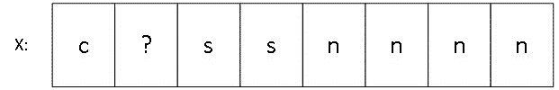
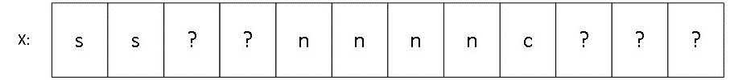

# 1

# 对象、指针和引用

在我们开始讨论 C++中的内存管理之前，让我们确保我们彼此理解，并就一个共同的词汇达成一致。如果你是经验丰富的 C++程序员，你可能有自己的关于指针、对象和引用的想法。你的想法将源于丰富的经验。如果你是从其他语言转向这本书，你也可能对这些术语在 C++中的含义以及它们与内存和内存管理的关系有自己的看法。

在本章中，我们将确保我们对一些基本（但深刻）的概念有一个共同的理解，以便我们可以在接下来的冒险中共同建立在这个共享理解的基础上。具体来说，我们将探讨以下问题：

+   C++中内存是如何表示的？我们所说的内存究竟是什么，至少在 C++语言的环境中？

+   对象、指针和引用是什么？在 C++中，我们通过这些术语意味着什么？对象的生存期规则是什么？它们如何与内存相关？

+   在 C++中，数组是什么？在这种语言中，数组是一种底层但效率极高的结构，其表示方式直接影响到内存管理。

# 技术要求

本书假设读者对 C++或与 C、Java、C#或 JavaScript 语法相似的语言有一些基本知识。因此，我们不会解释变量声明、循环、`if`语句或函数的基本知识。

然而，在本章中，我们将使用一些读者可能不太熟悉的 C++语言的某些方面。在阅读本书之前，请参阅*附录**:* *你应该知道的事情*。

一些示例使用了 C++20 或 C++23，所以请确保你的编译器支持这个标准的版本，以便充分利用它们。

本章的代码可以在以下位置找到：[`github.com/PacktPublishing/C-Plus-Plus-Memory-Management/tree/main/chapter1`](https://github.com/PacktPublishing/C-Plus-Plus-Memory-Management/tree/main/chapter1)。

# C++中内存的表示

这是一本关于内存管理的书。读者们正在试图弄清楚这意味着什么，而我作为作者，正在试图传达它的含义。

标准对内存的描述可以在[[wg21.link/basic.memobj](http://wg21.link/basic.memobj)]中看到。本质上，C++中的内存被表达为一或多个连续字节的序列。这为将内存表达为一系列不连续的连续内存块的可能性打开了大门，因为从历史上看，C++支持由各种不同段组成的内存。C++程序中的每个字节都有一个唯一的地址。

C++程序中的内存被各种实体填充，如对象、函数、引用等。有效地管理内存需要掌握这些实体的含义以及程序如何利用它们。

在 C++中，单词“字节”的含义非常重要。正如[[wg21.link/intro.memory](http://wg21.link/intro.memory)]中详细说明的那样，字节是 C++中的基本存储单元。在 C++中，一个字节中的位数是实现定义的。然而，标准确实声明，一个字节必须足够宽，以包含基本字面字符集中的任何元素的普通字面编码以及 UTF-8 编码形式的八位代码单元。它还指出，一个字节是由连续位序列组成的。

令人惊讶的是，在 C++中，一个字节不一定是八位：一个字节由至少八个位组成，但可能由更多位组成（这在某些异构硬件上很有用）。这种情况可能会在未来改变，因为标准委员会可能会在某个时候限制这个定义，但这是本书出版时的状况。这里的关键思想是，字节是程序中最小的可寻址内存单元。

## 对象、指针和引用

我们倾向于非正式地使用诸如对象、指针和引用之类的词语，而不太考虑它们的含义。在 C++这样的语言中，这些词语有精确的含义，定义并界定了我们在实践中可以做什么。

在我们动手操作之前，让我们来考察一下这些术语在 C++中的正式含义。

### 对象

如果我们对使用不同语言的程序员进行民意调查，并询问他们如何定义“对象”这个术语，我们可能会得到诸如“将变量和相关函数组合在一起的东西”或“类的实例”之类的答案，这对应于从面向对象编程领域对这一术语的传统理解。

C++作为一种语言，试图为用户定义的类型（如 struct 或 class）提供同质支持。它还提供了对基本类型（如`int`或`float`）的支持。因此，对于 C++来说，对象的定义是以其属性来表达的，而不是以这个词语的含义来表达的，并且这个定义包括最基本的数据类型。C++中对象的定义在[[wg21.link/intro.object](http://wg21.link/intro.object)]中描述，并考虑以下因素：

+   对象如何被显式创建，例如在定义对象或通过`operator new`的多种变体之一构造它时。对象也可能被隐式创建，例如在创建临时对象作为某些表达式的结果时，或者当改变`union`的当前成员时。

+   对象存在于某个地方（它有一个地址）并且占据一个非零大小的存储区域，从其构造开始到其销毁结束。

+   对象的其他属性，包括其名称（如果有的话）、其类型和其存储持续时间（`自动`、`静态`、`thread_local`等）。

C++标准明确指出函数不是对象，即使函数有一个地址并占用存储空间。

从这个事实中，我们可以推断出即使是普通的`int`也是一个对象，但函数不是。亲爱的读者，您已经可以看到，您正在阅读的这本书将涉及基本主题，因为对象的生命周期和占用的存储空间是我们在日常程序中使用这些实体时的基本属性的一部分。诸如生命周期和存储空间这样的东西显然是内存管理的一部分。您可以通过这个简单的程序来证实这一事实：

```cpp
#include <type_traits>
int main() {
   static_assert(std::is_object_v<int>);
   static_assert(!std::is_object_v<decltype(main)>);
}
```

什么是对象？它是有生命周期并占用存储空间的东西。控制这些特性是这本书存在的原因之一。

### 指针

在 C++标准的文本中，有无数（大约 2,000 次）提到了“指针”这个词，但如果你打开该文档的电子版并搜索，你会发现正式的定义出奇地难以找到。考虑到人们倾向于将这个想法与 C 语言以及（通过扩展）C++语言联系起来，这一点可能会让人感到惊讶。

让我们尝试给出一个有用而又非正式的定义：指针是一个类型化的地址。它将一个类型与内存中某个位置的存储内容关联起来。因此，在如下代码中，我们可以看到`n`是一个`int`对象，而`p`指向一个`int`对象，恰好是`n`对象的地址：

```cpp
int n = 3; // n is an int object
char c;
// int *p = &c; // no, illegal
int *p = &n;
```

在这里理解这一点很重要，即`p`确实指向一个`int`，除非`p`被未初始化，`p`指向`nullptr`，或者程序员在类型系统中玩弄技巧，故意让`p`指向其他内容。当然，指针`p`是一个对象，因为它遵守了所有相关的规则。

关于指针的许多（语法上的）困惑可能源于`*`和`&`符号的上下文意义。关键是要记住，当它们出现在名称的引入部分和用于现有对象时，它们有不同的角色：

```cpp
int m = 4, n = 3;
int *p; // p declares (and defines) a pointer to an int
        // (currently uninitialized), introducing a name
p = 0; // p is a null pointer (it does not necessarily
       // point to address zero; 0 as used here is
       // just a convention)
p = nullptr; // likewise, but clearer. Prefer nullptr to
             // literal 0 whenever possible to describe
             // a null pointer
p = &m; // p points to m (p contains the address of m)
assert(*p == 4); // p already exists; with *p we are
                 // accessing what p points to
p = &n; // p now points to n (p contains the address of n)
int *q = &n; // q declares (and defines) a pointer to an
             // int and &n represents the address of n, the
             // address of an int: q is a pointer to an int
assert(*q == 3); // n holds 3 at this stage, and q points
                 // to n, so what q points to has value 3
assert(*p == 3); // the same holds for p
assert(p == q); // p and q point to the same int object
*q = 4; // q already exists, so *q means "whatever q
        // points to"
assert(n == 4); // indeed, n now holds value 4 since we
                // modified it indirectly through q
auto qq = &q;   // qq is the address of q, and its type is
                // "pointer to a pointer to an int", thus
                // int **... But we will rarely – if ever –
                // need this
int &r = n; // declaration of r as a reference to integer n
            // (see below). Note that & is used in a
            // declaration in this case
```

正如您所看到的，在引入对象时，`*`表示“指向”。在现有对象上，它表示“指针指向的内容”（即被指对象）。同样，在引入名称时，`&`表示“引用”（我们很快就会讨论）。在现有对象上，它表示“地址”并产生一个指针。

指针允许我们进行算术运算，但这（合法地）被视为一种危险的操作，因为它可以带我们到程序中的任意位置，因此可能导致严重损坏。指针的算术运算取决于其类型：

```cpp
int *f();
char *g();
int danger() {
   auto p = f(); // p points to whatever f() returned
   int *q = p + 3; // q points to where p points to plus
                   // three times the size of an int. No
                   // clue where this is, but it's a bad,
                   // bad idea...
   auto pc = g(); // pc points to whatever g() returned
   char * qc = pc + 3; // qc points to where pc points
                       // to plus three times the size
                       // of a char. Please don't make
                       // your pointers go to places you
                       // don't know about like this
}
```

当然，访问任意地址的内容只是自找麻烦。这是因为这意味着调用未定义的行为（在*第二章*中描述），如果你这样做，那么你将独自承担后果。请在实际代码中不要这样做，因为这可能会伤害程序——或者更糟，伤害人们。C++ 强大而灵活，但如果你用 C++ 编程，你被期望要负责任和专业。

C++ 有四种用于指针操作的专用类型：

+   `void*` 表示“没有特定（类型相关）语义的地址。”一个 `void*` 是一个没有关联类型的地址。所有指针（如果我们不考虑 `const` 和 `volatile` 修饰符）都可以隐式转换为 `void*`；一种非正式的阅读方式是“所有指针，无论类型如何，实际上都是地址。”反之则不成立。例如，并不是所有地址都可以隐式转换为 `int` 指针。

+   `char*` 表示“字节的指针。”由于 C++ 的 C 语言根源，一个 `char*` 可以与内存中的任何地址别名（无论其名称如何，它唤起的“字符”在 C 和 C++ 中实际上意味着“字节”）。在 C++ 中，有一个持续的努力给 `char` 赋予“字符”的意义，但截至本文写作时，`char*` 可以与程序中的几乎所有内容别名。这阻碍了一些编译器优化机会（很难约束或推理可能导致内存中任何内容的东西）。

+   `std::byte*` 是新的“字节的指针”，至少从 C++17 开始。`byte*` 的（长期）意图是替换那些进行字节对字节操作或寻址的函数中的 `char*`，但由于有大量代码使用 `char*` 来实现这一目的，这需要时间。

以下是一个从 `void*` 转换到和从 `void*` 转换的示例：

```cpp
int n = 3;
int *p = &n; // fine so far
void *pv = p; // Ok, a pointer is an address
// p = pv; // no, a void* does not necessarily point to
           // an int (Ok in C, not in C++)
p = static_cast<int *>(pv); // fine, you asked for it, but
                            // if you're wrong you're on
                            // your own
```

以下示例，相对较为详细，使用了 `const char*`（但也可以使用 `const byte*`）。它表明，在某些情况下，可以比较两个对象的字节对字节表示，以查看它们是否等效：

```cpp
#include <iostream>
#include <type_traits>
using namespace std;
bool same_bytes(const char *p0, const char *p1,
                std::size_t n) {
    for(std::size_t i = 0; i != n; ++i)
        if(*(p0 + i) != *(p1 + i))
            return false;
    return true;
}
template <class T, class U>
   bool same_bytes(const T &a, const U &b) {
      using namespace std;
       static_assert(sizeof a == sizeof b);
       static_assert(has_unique_object_representations_v<
          T
       >);
       static_assert(has_unique_object_representations_v<
          U
       >);
       return same_bytes(reinterpret_cast<const char*>(&a),
                         reinterpret_cast<const char*>(&b),
                         sizeof a);
   }
struct X {
   int x {2}, y{3};
};
struct Y {
   int x {2}, y{3};
};
#include <cassert>
int main() {
    constexpr X x;
    constexpr Y y;
    assert(same_bytes(x, y));
}
```

`has_unique_object_representations` 特性对于唯一由其值定义的类型是真实的，也就是说，免于填充位的类型。这有时很重要，因为 C++ 没有说明对象中的填充位会发生什么，并且对两个对象进行位对位的比较可能会产生令人惊讶的结果。请注意，浮点类型的对象不被认为是唯一由其值定义的，因为有许多不同的值可以被认为是 NaN，或“不是一个数字”。

### 参考文献

C++ 语言支持两个相关的间接引用家族：指针和引用。与它们的表亲指针一样，引用在 C++ 标准中经常被提及（超过 1,800 次），但很难找到它们的正式定义。

我们将再次尝试提供一个非正式但实用的定义：引用可以被视为现有实体的别名。我们故意没有使用对象，因为可以引用函数，而且我们已经知道函数不是对象。

指针是对象。因此，它们占用存储空间。另一方面，引用不是对象，不使用自己的存储空间，尽管实现可以用指针来模拟它们的存在。比较`std::is_object_v<int*>`与`std::is_object_v<int&>`：前者为`true`，后者为`false`。

将`sizeof`运算符应用于引用，将返回它所引用的大小。因此，取引用的地址将返回它所引用的地址。

在 C++中，引用始终绑定到对象，并且直到引用的生命周期结束都绑定到该对象。另一方面，指针在其生命周期内可以指向许多不同的对象，正如我们之前所看到的：

```cpp
// int &nope; // would not compile (what would nope
              // refer to?)
int n = 3;
int &r = n; // r refers to n
++r; // n becomes 4
assert(&r == &n); // taking the address of r means taking
                  // the address of n
```

指针和引用之间的另一个区别是，与指针的情况不同，没有引用算术这样的东西。这使得引用比指针更安全。程序中可以容纳这两种类型的间接引用（我们将在本书中使用它们！），但对于日常编程，一个很好的经验法则是尽可能使用引用，必要时使用指针。

现在我们已经检查了内存的表示，并查看 C++如何定义一些基本概念，如字节、对象、指针或引用，我们可以深入探讨对象的一些重要定义属性。

# 理解对象的基本属性

我们之前提到，在 C++中，一个对象有一个类型和一个地址。它从构造开始到销毁结束，占据一段存储空间。现在，我们将更详细地研究这些基本属性，以便了解这些属性如何影响我们编写程序的方式。

## 对象生命周期

C++的一个优点，但也是其相对复杂性的原因之一，来自于对对象生命周期的控制。在 C++中，一般来说，自动对象在其作用域结束时按定义好的顺序被销毁。静态（全局）对象在程序终止时按某种定义好的顺序被销毁（在给定文件中，销毁顺序是清晰的，但对于不同文件中的静态对象来说更复杂）。动态分配的对象在“你的程序说的时候”被销毁（这里有很多细微差别）。

让我们通过以下（非常）简单的程序来检查对象生命周期的某些方面：

```cpp
#include <string>
#include <iostream>
#include <format>
struct X {
   std::string s;
   X(std::string_view s) : s{ s } {
      std::cout << std::format("X::X({})\n", s);
   }
   ~X(){
      std::cout << std::format("~X::X() for {}\n", s);
   }
};
X glob { "glob" };
void g() {
   X xg{ «g()» };
}
int main() {
   X *p0 = new X{ "p0" };
   [[maybe_unused]] X *p1 = new X{ "p1" }; // will leak
   X xmain{ "main()" };
   g();
   delete p0;
   // oops, forgot delete p1
}
```

当程序执行时，将打印以下内容：

```cpp
X::X(glob)
X::X(p0)
X::X(p1)
X::X(main())
X::X(g())
~X::X() for g()
~X::X() for p0
~X::X() for main()
~X::X() for glob
```

构造函数和析构函数的数量不匹配是一个迹象，表明我们做错了什么。更具体地说，在这个例子中，我们手动使用`operator new`创建了一个对象（由`p1`指向），但之后从未手动销毁该对象。

对于不熟悉 C++的程序员来说，指针和被指对象之间的区别是一个常见的混淆来源。在这个程序中，`p0`和`p1`都在到达它们的范围末尾时被销毁（由`main()`函数的闭合括号），就像`xmain`一样。然而，由于`p0`和`p1`指向动态分配的对象，被指对象必须显式地被销毁，我们为`p0`做了这件事，但（为了示例的目的，故意）没有为`p1`做。

那么`p1`的指针对象会发生什么？嗯，它已经被手动构造，但尚未手动销毁。因此，它在内存中漂浮，没有人可以再访问它。这就是人们通常所说的内存泄露：程序分配但从未释放的内存块。

然而，比泄露由`p1`指向的`X`对象的存储空间更糟糕的是，被指向对象的析构函数永远不会被调用，这可能导致各种资源泄露（文件未关闭、数据库连接未关闭、系统句柄未释放等）。在*第四章*《使用析构函数》中，我们将探讨如何避免这种情况，并同时编写干净、简单的代码。

## 对象大小、对齐和填充

由于每个对象都占用存储空间，与对象关联的空间是 C++类型的一个重要（如果说是低级）属性。例如，看看以下代码：

```cpp
class B; // forward declaration: there will be a class B
         // at some point in the future
void f(B*); // fine, we know what B is, even if we don't
            // know the details yet, and all object
            // addresses are of the same size
// class D : B {}; // oops! To know what a D is, we have
                   // to know how big a B is and what a
                   // B object contains since a D is a B
```

在这个例子中，尝试定义`D`类将无法编译。这是因为为了创建一个`D`对象，编译器需要为`D`对象预留足够的空间，但`D`对象也是一个`B`对象，因此我们不知道`D`对象的大小，除非我们知道`B`对象的大小。

一个对象的大小，或者说一个类型的大小，可以通过`sizeof`运算符获得。这个运算符产生一个编译时非零无符号整数值，对应存储对象所需的字节数：

```cpp
char c;
// a char occupies precisely one byte of storage, per
// standard wording
static_assert(sizeof c == 1); // for objects parentheses
                              // are not required
static_assert(sizeof(c) == 1); // ... but you can use them
static_assert(sizeof(char) == 1); // for types, parentheses
                                  // are required
struct Tiny {};
// all C++ types occupy non-zero bytes of storage by
// definition, even if they are "empty" like type Tiny
static_assert(sizeof(Tiny) > 0);
```

在前面的例子中，`Tiny`类是空的，因为它没有数据成员。一个类可以具有成员函数，但仍然是空的。在 C++中，暴露成员函数的空类非常常见。

C++对象总是至少占用一个字节的存储空间，即使在像`Tiny`这样的空类的情况下也是如此。这是因为如果对象的大小为零，那么该对象可以与它的直接邻居位于相同的内存位置，这会很难理解。

C++与许多其他语言不同，它没有标准化所有基本类型的大小。例如，`sizeof(int)`的值可能因编译器和平台而异。尽管如此，关于对象大小的规则仍然存在：

+   运算符 `sizeof` 报告的类型为 `signed char`、`unsigned char` 和 `char` 的对象的大小是 1，同样 `sizeof(std::byte)` 也是如此，因为这些类型都可以用来表示一个字节。

+   表达式 `sizeof(short)>=sizeof(char)` 和 `sizeof(int)>=sizeof(short)` 在所有平台上都成立，这意味着可能存在 `sizeof(char)` 和 `sizeof(int)` 都为 1 的情况。在基本类型宽度的方面（即值表示中使用的位数），C++ 标准仅限于声明每种类型的最低宽度。该列表可以在 [[wg21.link/tab:basic.fundamental.width](http://wg21.link/tab:basic.fundamental.width)] 找到。

+   正如我们之前所说的，表达式 `sizeof(T)>0` 对任何类型 `T` 都成立。在 C++ 中，没有零大小的对象，即使是空类也没有。

+   任何 `struct` 或 `class` 类型的对象占用的空间不能小于其数据成员的大小之和（但有一些例外）。

这最后一条规则值得解释。考虑以下情况：

```cpp
class X {};
class Y {
   X x;
};
int main() {
   static_assert(sizeof(X) > 0);
   static_assert(sizeof(Y) == sizeof(X)); // <-- here
}
```

标记为 `<-- here` 的行可能很有趣。为什么如果每个 `Y` 对象都包含一个 `X` 对象，`sizeof(Y)` 会等于 `sizeof(X)`？记住，即使 `X` 是一个空类，`sizeof(X)` 仍然大于 `0`，因为每个 C++ 对象都必须至少占用一个字节的存储空间。然而，在 `Y` 的情况下，它不是一个空类，每个 `Y` 对象由于其 `x` 数据成员已经占用了存储空间。没有必要为这种类型的对象人为地增加存储空间。

现在，考虑这一点：

```cpp
class X {
   char c;
};
class Y {
   X x;
};
int main() {
   static_assert(sizeof(X) == sizeof(char)); // <-- here
   static_assert(sizeof(Y) == sizeof(X)); // <-- here too
}
```

同样的推理再次适用：类型为 `X` 的对象占用的存储空间与其唯一的数据成员（类型为 `char`）相同，类型为 `Y` 的对象占用的存储空间与其唯一的数据成员（类型为 `X`）相同。

继续这一探索，考虑这一点：

```cpp
class X { };
class Y {
   X x;
   char c;
};
int main() {
   static_assert(sizeof(Y) >= sizeof(char) + sizeof(X));
}
```

这是之前提到的规则，但以正式的方式针对特定类型进行了表达。在这种情况下，假设 `sizeof(X)` 等于 `1` 是高度可能的，甚至可以合理地预期 `sizeof(Y)` 将等于 `sizeof(char)` 和 `sizeof(X)` 的总和。

最后，考虑这一点：

```cpp
class X { };
class Y : X { // <--  private inheritance
   char c;
};
int main() {
   static_assert(sizeof(Y) == sizeof(char)); // <-- here
}
```

我们从 `X` 类型的对象作为 `Y` 类型的数据成员，转变为 `X` 成为 `Y` 的基类。这有一个有趣的结果：由于基类 `X` 是空的，并且根据定义我们知道派生类 `Y` 的对象将至少占用一个字节的存储空间，因此可以将基类 `X` 融合到派生类 `Y` 中。这是一种有用的优化，称为 **空基优化**。你可以合理地预期编译器在实际中会执行这种优化，至少在单继承关系中是这样。

注意，由于`X`在`Y`中的存在是一个实现细节，而不是参与类`Y`接口的东西，所以我们在这个例子中使用了私有继承。空基优化在公共或保护继承中同样适用，但在这个情况下，私有继承保留了`Y`的`X`部分是只有`Y`知道的事实。

自 C++20 以来，如果你认为组合比继承更适合描述类`X`和`Y`等两个类之间的关系，你可以将数据成员标记为`[[no_unique_address]]`，以通知编译器，如果这个成员是一个空类对象，它不需要在封装对象内占用存储空间。编译器不必强制遵守，因为属性可以被忽略，所以请确保在编写依赖于此的代码之前，验证你选择的编译器实现了这一功能：

```cpp
class X { };
class Y {
   char c;
   [[no_unique_address]] X x;
};
int main() {
   static_assert(sizeof(X) > 0);
   static_assert(sizeof(Y) == sizeof(char)); // <-- here
}
```

到目前为止的所有示例都非常简单，使用了具有零、一个或两个非常小的数据成员的类。代码很少这么简单。考虑以下程序：

```cpp
class X {
   char c; // sizeof(char) == 1 by definition
   short s;
   int n;
};
int main() {
   static_assert(sizeof(short) == 2); // we suppose this...
   static_assert(sizeof(int) == 4);   // ... and this
   static_assert(
      sizeof(X) >= sizeof(char)+sizeof(short)+sizeof(int)
   );
}
```

假设前两个静态断言成立，这是很可能的但并非保证，我们知道`sizeof(X)`至少会是`7`（其数据成员大小的总和）。然而，在实践中，你可能会看到`sizeof(X)`等于`8`。现在，这可能会让人一开始感到惊讶，但这却是被称为**对齐**的某种逻辑结果。

对象的对齐（或其类型的对齐）告诉我们该对象可以在内存中的哪个位置。`char`类型具有`1`的对齐，因此可以将`char`对象直接放置在任何地方（只要可以访问该内存）。对于`2`的对齐（对于`short`类型可能是这种情况），对象只能放置在地址是`2`的倍数的位置。更普遍地说，如果一个类型具有`n`的对齐，那么该类型的对象必须放置在地址是`n`的倍数的位置。请注意，对齐必须是严格正的 2 的幂；不遵守此规则会导致未定义行为。当然，你的编译器不会让你陷入这种境地，但如果你不小心，考虑到我们将在本书中使用的某些技巧，你可能会陷入这样的麻烦。权力越大，责任越大。

C++语言提供了两个与对齐相关的运算符：

+   `alignof`运算符，它返回类型`T`或该类型对象的自然对齐。

+   `alignas`运算符，它允许程序员强制对齐对象。这在玩弄内存（正如我们将要做的那样）或与异构硬件（这里的“异构”可以非常广泛地理解）接口时非常有用。当然，`alignas`只能合理地增加类型的自然对齐，而不能减少它。

对于某些基本类型`T`，可以期望断言`sizeof(T)`等于`alignof(T)`成立，但这个断言并不适用于复合类型。例如，考虑以下情况：

```cpp
class X {
   char c;
   short s;
   int n;
};
int main() {
   static_assert(sizeof(short) == alignof(short));
   static_assert(sizeof(int) == alignof(int));
   static_assert(sizeof(X) == 8); // highly probable
   static_assert(alignof(X) == alignof(int)); // likewise
}
```

一般而言，对于复合类型，对齐将对应其数据成员的最坏对齐。在这里，“最坏”意味着“最大”。对于类`X`，最坏对齐的数据成员是`n`类型的`int`，因此，`X`对象将对齐在`alignof(int)`字节边界上。

你现在可能想知道，如果`sizeof(short)==2`和`sizeof(int)==4`，我们为什么可以期望断言`sizeof(X)`等于`8`成立。让我们看看`X`类型对象的可能布局：



图 1.1 – 内存中类型 X 对象的紧凑布局

图中的每个方框都是内存中的一个字节。正如我们所见，`c`和`s`的第一个字节之间有一个`?`。这来自于对齐。如果`alignof(short)==2`和`alignof(int)==4`，那么`X`对象的唯一正确布局是将其`n`成员放置在`4`字节边界上。这意味着在`c`和`s`之间将有一个填充字节（一个不参与`X`值表示的字节）来对齐`s`在两个字节边界上，并将`n`对齐在四个字节边界上。

可能更令人惊讶的是，在类中数据成员的布局顺序会影响该类对象的大小。例如，考虑以下情况：

```cpp
class X {
   short s;
   int n;
   char c;
};
int main() {
   static_assert(sizeof(short) == alignof(short));
   static_assert(sizeof(int) == alignof(int));
   static_assert(alignof(X) == alignof(int));
   static_assert(sizeof(X) == 12); // highly probable
}
```

这通常会让人们感到惊讶，但这是真的，值得思考。通过这个例子，`X`对象的可能布局如下：



图 1.2 – 内存中类型 X 对象的非紧凑布局

到现在为止，`s`和`n`之间的两个`?`“方块”可能已经很清楚，但三个尾随的`?`“方块”可能看起来有些令人惊讶。毕竟，为什么在对象的末尾添加填充？

答案是**由于数组**。正如我们很快将要讨论的，数组的元素在内存中是连续的，因此，确保数组的每个元素都正确对齐是很重要的。在这种情况下，类`X`对象尾部的填充字节确保如果`X`对象数组中的某个元素被正确对齐，那么下一个元素也将被正确对齐。

现在你已经了解了对齐，考虑一下，仅仅改变类`X`的一个版本到另一个版本中元素顺序，就导致该类型每个对象的内存消耗增加了 50%。这同时损害了你的程序内存空间消耗和速度。C++编译器不能为你重新排序数据成员，因为你的代码看到了对象的地址。改变数据成员的相对位置可能会破坏用户的代码，因此程序员需要小心选择他们的布局。请注意，保持对象小并不是影响对象布局选择的唯一因素，特别是在多线程代码中（有时将两个对象彼此隔开可以导致更好的缓存使用），因此应该记住布局很重要，但不是一件可以天真对待的事情。

## 拷贝和移动

在这一点上，我们需要对拷贝和移动这两个在像 C++这样的有实际对象的语言中的基本考虑因素说几句话。

C++语言认为六个成员函数是特殊的。除非你采取措施防止它，否则这些函数将自动为你生成。这些如下：

+   **默认构造函数**：可能是六个中最不特殊的一个，因为它只有在你没有编写自己的构造函数时才会隐式生成。

+   **析构函数**：在对象的生命周期结束时被调用。

+   **拷贝构造函数**：当使用与同一类型的单个对象作为参数来构造对象时被调用。

+   **拷贝赋值操作**：当用另一个对象的副本替换现有对象的内容时会被调用。

+   `std::move()`.

+   **移动赋值操作**：它的行为类似于拷贝赋值，但应用于当传递给赋值运算符的参数是可以移动的时候。

当一个类型没有在其自身上显式管理任何资源时，通常可以不写这些特殊函数，因为编译器生成的将正好是想要的。例如，考虑以下：

```cpp
struct Point2D {
   float x{}, y{};
};
```

这里，类型`Point2D`代表一个没有不变量（`x`和`y`数据成员的所有值都是可接受的）的 2D 坐标。由于我们为`x`和`y`使用了默认初始化器，将这些数据成员设置为 0，因此默认的`Point2D`对象将代表坐标`(0,0)`，并且六个特殊成员函数将按预期工作。拷贝构造函数将调用数据成员的拷贝构造函数，拷贝赋值将调用它们的拷贝赋值运算符，析构函数将是平凡的，并且移动操作将像拷贝操作一样行为，因为数据成员是基本类型。

如果我们决定添加一个参数化构造函数来显式允许用户代码将`x`和`y`数据成员初始化为除我们选择的默认值之外的其他值，我们可以这样做。然而，这将使我们失去隐式默认构造函数：

```cpp
struct Point2D {
   float x{}, y{};
   Point2D(float x, float y) : x{ x }, y{ y } {
   }
};
void oops() {
   Point2D pt; // does not compile, pt has no default ctor
}
```

我们当然可以解决这个问题。一种方法是通过显式编写默认构造函数的细节：

```cpp
struct Point2D {
   float x, y; // no need for default initializations
   Point2D(float x, float y) : x{ x }, y{ y } {
   }
   Point2D() : x{ }, y{ } { // <-- here
   }
};
void oops() {
   Point2D pt; // Ok
}
```

另一种方法是，将默认构造函数的工作委托给参数化构造函数：

```cpp
struct Point2D {
   float x, y; // no need for default initializations
   Point2D(float x, float y) : x{ x }, y{ y } {
   }
   Point2D() : Point2D{ 0, 0 } { // <-- here
   }
};
void oops() {
   Point2D pt; // Ok
}
```

另一种更好的方法是通知编译器，尽管我们做了某些事情（编写另一个构造函数），否则会阻止它，但我们仍然希望保留默认行为：

```cpp
struct Point2D {
   float x{}, y{};
   Point2D(float x, float y) : x{ x }, y{ y } {
   }
   Point2D() = default; // <-- here
};
void oops() {
   Point2D pt; // Ok
}
```

后者通常会导致生成的代码质量最好，因为当编译器理解程序员的意图时，它们在从最小的努力中获得最大结果方面非常出色。在这种情况下，`=default`使得意图非常明确：*请按照通常情况下如果我的代码没有* *干扰* *我会做的事情来做*。

关于这些构造函数的说明

我们为了这个例子在`Point2D`中添加了参数化构造函数，但在这个情况下并不必要，因为`Point2D`是一个聚合类型。这些类型有特殊的初始化支持，但这并不是我们演示的重点。聚合类型是符合几个限制的类型（没有用户声明的或继承的构造函数，没有私有非静态数据成员，没有虚拟基类等），并且通常没有需要维护的不变量，但可以非常高效地由编译器初始化。

当一个类显式管理资源时，默认生成的特殊函数很少做我们想要的事情。实际上，编译器在这种情况下如何知道我们的意图呢？假设我们创建了一个类似`string`的简单类，从以下（不完整）的摘录开始：

```cpp
#include <cstring> // std::strlen()
#include <algorithm> // std::copy()
class naive_string { // too simple to be useful
   char *p {}; // pointer to the elements (nullptr)
   std::size_t nelems {}; // number of elements (zero)
public:
   std::size_t size() const {
      return nelems;
   }
   bool empty() const {
      return size() == 0;
   }
   naive_string() = default; // empty string
   naive_string(const char *s)
      : nelems{ std::strlen(s) } {
      p = new char[size() + 1]; // leaving room for a
                                // (convenient) trailing 0
      std::copy(s, s + size(), p);
      p[size()] = '\0';
   }
   // index-wise access to characters, const and non-const
   // versions: the const version is useful for const
   // naive_string objects, whereas the non-const version
   // lets user code modify elements
   // precondition: n < size()
   char operator[](std::size_t n) const { return p[n]; }
   char& operator[](std::size_t n) { return p[n]; }
   // ... additional code (below) goes here
};
```

尽管这个类很简单，但它显然通过分配一个`size()+1`字节的块来显式地分配资源，以存储从`p`开始的字符序列的副本。因此，编译器提供的特殊成员函数不会为我们这个类做正确的事情。例如，默认生成的复制构造函数会复制指针`p`，但这意味着我们将有两个指针（原始的`p`和副本中的`p`）共享一个共同的指向，这可能不是我们想要的。默认生成的析构函数会销毁指针，但我们还希望释放指向的资源，避免内存泄漏，等等。

在这种情况下，我们希望实现所谓的“三法则”，并编码析构函数以及两个复制操作（复制构造函数和复制赋值操作）。在 C++11 引入移动语义之前，这已经足够正确地实现我们类型资源管理了。从技术上讲，现在仍然是这样的，但考虑到移动语义将帮助我们以多种方式获得更有效的类型。在当代代码中，当讨论实现“三法则”以及两个移动操作（除了“三法则”）的代码时，我们通常称之为“五法则”。

### 析构

由于我们的`naive_string`类型使用`p`所指向的动态分配数组进行资源管理，因此该类的析构函数将很简单，因为它的作用仅限于释放`p`所指向的内存块：

```cpp
// ...
   ~naive_string() {
      delete [] p;
   }
// ...
```

注意，没有必要检查`p`是否非空（在 C++中，`delete nullptr;`什么也不做，并且本质上是无害的）。另外，请注意我们使用的是`delete[]`而不是`delete`，因为我们使用`new[]`而不是`new`来分配内存块。这些操作之间的细微差别将在*第七章*中解释。

### 复制操作

复制构造函数是在使用另一个该类的对象作为参数构造`naive_string`类的对象时调用的函数。例如，考虑以下：

```cpp
// ...
void f(naive_string); // pass-by-value
void copy_construction_examples() {
   naive_string s0{ "What a fine day" };
   naive_string s1 = s0; // constructs s1 so this is
                         // copy construction
   naive_string s2(s0); // ...this too
   naive_string s3{ s0 }; // ...and so is this
   f(s0); // likewise because of pass-by-value
   s1 = s0; // this is not a copy construction as s1
            // already exists: this is a copy assignment
}
```

对于我们的`naive_string`类，一个正确的复制构造函数可以写成如下：

```cpp
// ...
   naive_string(const naive_string &other)
      : p{ new char[other.size() + 1] },
        nelems{ other.size() } {
      std::copy(other.p, other.p + other.size(), p);
      p[size()] = '\0';
   }
// ...
```

复制赋值可以以多种方式编写，但其中许多都是复杂的或者直接危险。例如，考虑以下示例……但不要像这样编写你的赋值运算符！：

```cpp
// ...
   // bad copy assignment operator
   naive_string& operator=(const naive_string &other) {
      // first, release the memory held by *this
      delete [] p;
      // then, allocate a new chunk of memory
      p = new char[other.size() + 1]; // <-- note this line
      // copy the contents themselves
      std::copy(other.p, other.p + other.size(), p);
      // adjust the size and add the trailing zero
      nelems = other.size();
      p[size()] = '\0';
      return *this;
   }
// ...
```

现在，这看起来可能合理（如果有点冗长），但如果我们看看执行内存分配的行，我们不禁要问：如果失败了会怎样？确实可能会。例如，如果进程正在耗尽可用内存，而`other.size()`对于剩余的资源来说太大，它可能会失败。在 C++中，默认情况下，使用`operator new`在失败时抛出异常。这将完成复制赋值函数的执行，使`*this`处于一个不正确（并且危险！）的状态，其中`p`非空且`nelems`非零，但`p`指向的内存大多数情况下被认为是垃圾：我们不再拥有的内存，如果使用其内容会导致未定义的行为。

我们可以声称我们可以做得更好，并编写更多的代码来尝试修复这个错误。避免以这种方式编写复制赋值运算符的建议也适用于这种情况：

```cpp
// ...
   // another bad copy assignment operator
   naive_string& operator=(const naive_string &other) {
      // first, allocate a new chunk of memory
      char *q = new char[other.size() + 1];
      // then release the memory held by *this and make
      // p point to the new chunk
      delete [] p; // <-- pay attention to this line
      p = q;
      // copy the contents themselves
      std::copy(other.p, other.p + other.size(), p);
      // adjust the size and add the trailing zero
      nelems = other.size();
      p[size()] = '\0';
      return *this;
   }
// ...
```

表面上看这似乎更安全，因为我们不会尝试清理`*this`的现有状态，直到我们确定分配已经成功。它甚至可能通过大多数测试——直到有人构建以下测试：

```cpp
void test_self_assignment() {
   naive_string s0 { "This is not going to end well..." };
   s0 = s0; // oops!
}
```

在这个用例中，我们的复制赋值操作将表现得非常糟糕。在为`q`分配了适当大小的内存块之后，它将删除`p`所指向的内容。不幸的是，这也正是`other.p`所指向的内容，破坏了我们试图从其复制的实际源数据。接下来的步骤将从我们不再拥有的内存中读取，程序将变得没有意义。

我们仍然可以尝试修复这个问题，甚至让它工作，但请注意：

```cpp
// ...
   // this works, but it's getting complicated and
   // is a sign we're doing something wrong
   naive_string& operator=(const naive_string &other) {
      // prevent self-assignment
      if(this == &other) return *this;
      // then, do that sequence of steps
      char *q = new char[other.size() + 1];
      delete [] p; // <-- pay attention to this line
      p = q;
      std::copy(other.p, other.p + other.size(), p);
      nelems = other.size();
      p[size()] = '\0';
      return *this;
   }
// ...
```

这个修复是一个 pessimization，因为我们将使每个复制赋值调用都为实际上几乎从未使用过的`if`分支付费。 brute-force 问题解决方法使我们编写了复杂的代码，尽管它工作得很好（尽管它不一定显而易见），并且我们需要在编写每个资源管理类时重新考虑它。

关于词语 pessimization

词语*pessimization*通常用作*optimization*的反义词，指的是一种编程策略或技术，使得程序行为不如应有的效率。前面的例子是这种策略的一个著名例子：每个人都会为`if`语句引入的潜在分支付费，即使它只为罕见和异常情况所必需——这些情况本不应该发生。

面对一个“pessimization”机会时，后退一步重新考虑通常是值得的。也许我们在处理问题时采取了错误的角度。

幸运的是，C++中有一个著名的习语，称为**安全赋值习语**，口语上称为复制-交换。技巧在于认识到赋值由两部分组成：一个破坏性部分，它清理目标对象拥有的现有状态（赋值的左侧），以及一个构建性部分，它从源对象复制状态到目标对象（赋值的右侧）。破坏性部分通常等同于类型析构器中的代码，而构建性部分通常等同于类型复制构造器中的代码。

这种技术的非正式复制-交换名称来源于它通常是通过类型复制构造器、析构器和`swap()`成员函数的组合来实现的，该函数逐个交换成员变量：

```cpp
// ...
   void swap(naive_string &other) noexcept {
      using std::swap; // make the standard swap function
                       // available
      swap(p, other.p); // swap data members
      swap(nelems, other.nelems);
   }
   // idiomatic copy assignment
   naive_string& operator=(const naive_string &other) {
      naive_string { other }.swap(*this); // <-- here
      return *this; // yes, that's it!
   }
// ...
```

这个习语非常实用，值得了解和使用，因为它具有异常安全性、简单性，并且适用于几乎所有的类型。执行所有工作的那一行执行了三个步骤：

+   首先，它使用该类型的复制构造器构建`other`的匿名副本。现在，如果抛出异常，这可能会失败，但如果真的发生了，`*this`没有被修改，因此保持未损坏。

+   其次，它交换了那个匿名临时变量的内容（包含我们要放入`*this`中的内容）与目标对象的内容（将现在不再需要的状态放入那个匿名临时对象中）。

+   最后，在表达式的末尾销毁匿名临时对象（因为它是匿名的），留下`*this`持有`other`的状态副本。

这个习语甚至可以安全地用于自我赋值。它会产生不必要的复制，但它将每个调用都会支付但几乎没有人从中受益的`if`分支，与很少会无用的复制进行了交易。

你可能会注意到`swap()`成员函数开头的大括号前的`noexcept`。我们稍后会回到这个问题，但就目前而言，重要的观点是我们可以声称这个函数（因为它操作的是基本类型的对象）永远不会抛出异常。这个信息将帮助我们在这本书的后面部分实现一些宝贵的优化。

### 移动操作

我们通过其析构函数、复制构造函数和复制赋值成员函数增强的`naive_string`现在适当地管理资源。然而，它可以变得更快，有时甚至更安全。

考虑以下某人可能想要添加到我们的类中以补充的非成员字符串连接运算符：

```cpp
// returns the concatenation of s0 and s1
naive_string operator+(naive_string s0, naive_string s1);
```

这样的操作可以用在以下用户代码中：

```cpp
naive_string make_message(naive_string name) {
   naive_string s0{ "Hello "},
                s1{ "!" };
   return s0 + name + s1; // <-- note this line
}
```

在`return`语句之后的表达式首先调用`operator+()`，并从`s0`和`name`的连接中创建一个未命名的`naive_string`对象。然后，这个未命名的对象作为另一个调用`operator+()`的第一个参数传递，该调用从第一个未命名的对象和`s1`的连接中创建另一个未命名的对象。根据我们当前的实施，每个未命名的对象都会产生分配、其缓冲区中数据的复制、销毁以及更多操作。这比乍一看要昂贵，而且由于每个分配都可能抛出异常，所以情况变得更糟。

尽管如此，它仍然有效。

自 C++11 以来，我们可以通过移动语义使此类代码的效率显著提高。除了我们刚才讨论的传统三法则函数之外，我们还可以通过添加移动构造函数和移动赋值运算符来增强像`naive_string`这样的类。当编译器操作它知道将不再使用的对象时，这些操作会隐式地启动。考虑以下内容：

```cpp
// ...
   return s0 + name + s1;
// ...
```

这可以翻译为以下内容：

```cpp
// ...
   return (s0 + name) + s1;
//         ^^^^^^^^^^^ <-- anonymous object (we cannot
/                          refer to it afterward)
// ...
```

然后它翻译为以下内容：

```cpp
// ...
   ((s0 + name) + s1);
// ^^^^^^^^^^^^^^^^^^^ <-- anonymous object (idem)
// ...
```

当我们仔细思考时，复制操作的原因是为了在需要时保持源对象完整。没有名称的临时对象不需要从进一步的修改中保留，因为它们以后无法被引用。因此，我们可以对这些操作更加激进，实际上是将它们的内容移动而不是复制。标准要求我们遵循的规则是，将移动后的对象留在有效但不确定的状态。本质上，移动后的对象必须处于一种可以安全销毁或赋值的状态，并且其不变性仍然保持。在实践中，这通常意味着将移动后的对象留在类似于其默认状态的东西。

对于我们的`naive_string`类型，移动构造函数可能看起来像这样：

```cpp
// ...
   naive_string(naive_string &&other) noexcept
      : p{ std::move(other.p) },
        nelems{ std::move(other.nelems) } {
      other.p = nullptr;
      other.nelems = 0;
   }
// ...
```

在这个特定情况下，可以避免调用 `std::move()`（移动基本类型对象等同于复制它们），但可能更卫生的做法是确保在源代码中明确表达移动这些对象的意图。我们将在本节稍后简要地看看 `std::move()`，但重要的是要记住，`std::move()` 并不移动任何东西。它只是向编译器标记一个对象是可移动的。换句话说，*它* *是一个类型转换*。

关于我们的移动构造函数，需要注意的重要事项如下：

+   参数的类型是 `naive_string&&`。这意味着它是一个对 `rvalue` 的引用，其中 `rvalue` 非正式地意味着“可以在赋值运算符的右侧找到的东西。”

+   与 `swap()` 一样，它被标记为 `noexcept`，以表达在执行过程中不会抛出异常的事实。

+   这实际上是将状态从源对象 `other` 转移到正在构建的对象 `*this`。在完成这次转移后，我们将 `other` 留在有效状态（相当于默认的 `naive_string` 对象），遵循标准的建议。

可以使用一个在 `<utility>` 头文件中找到的名为 `std::exchange()` 的小巧但非常有用的函数，以稍微简略的方式编写这个函数。确实，考虑以下表达式：

```cpp
a = std::exchange(b, c);
```

这个表达式意味着“将 `b` 的值赋给 `a`，但将 `b` 的值替换为 `c` 的值。”这在实际代码中是一个非常常见的操作序列。使用这个函数，我们的移动构造函数变成了以下形式：

```cpp
// ...
   naive_string(naive_string &&other) noexcept
      : p{ std::exchange(other.p, nullptr) },
        nelems{ std::exchange(other.nelems, 0) } {
   }
// ...
```

这种形式是典型的 C++ 代码，在某些情况下可能导致一些有趣的优化。

那么，移动赋值又如何呢？嗯，我们可以参考我们之前详细讨论过的典型复制赋值，并如下表达：

```cpp
   // idiomatic copy assignment
   naive_string& operator=(naive_string &&other) noexcept {
      naive_string { std::move(other) }.swap(*this);
      return *this;
   }
```

沿着我们的复制赋值运算符设定的路径，我们将移动赋值运算符表达为 `swap()`、析构函数和移动构造函数的组合。这两个惯用语的背后逻辑是相同的。

# 数组

我们在前面的例子中使用了数组，但并没有真正提供一个正式的定义来描述这个有用但低级的结构。注意，在本节中，“数组”一词指的是原始的内置数组，而不是其他非常有用但更高级的结构，如 `std::vector<T>` 或 `std::array<T,N>`。

简单来说，在 C++ 中，数组是相同类型元素的连续序列。因此，在以下摘录中，`a0` 对象在内存中占用 `10*sizeof(int)` 字节，而 `a1` 对象占用 `20*sizeof(std::string)` 字节：

```cpp
int a0[10];
std::string a1[20];
```

在某个类型 `T` 的数组中，索引 `i` 和 `i+1` 之间的字节数恰好等于 `sizeof(T)`。

考虑以下表达式，这在 C++ 中，就像在 C 中一样，用于某个数组 `arr`：

```cpp
arr[i]
```

它计算出的地址与以下相同：

```cpp
*(arr + i)
```

由于指针运算是有类型的，这个表达式中的`+ i`部分意味着“加上`i`个元素”或者“加上`i`个元素的字节大小”。

数组的大小必须是正数，除非数组是动态分配的：

```cpp
int a0[5]; // Ok
static_assert(sizeof a0 == 5 * sizeof(int));
enum { N = sizeof a0 / sizeof a0[0] }; // N == 5
// int a1[0]; // not allowed: the array would be at the
              // same address as the next object in memory!
int *p0 = new int[5]; // Ok, but you have to manage the
                      // pointee now
int *p1 = new int[0]; // Ok, dynamically allocated; you
                      // still have to manage the pointee
// ...
delete [] p1; // good
delete [] p0; // good; be responsible
```

每次调用`operator new[]`都必须产生不同的地址，即使数组的大小是 0。每次调用在技术上都会返回不同对象的地址。

# 摘要

在本章中，我们探讨了 C++语言的基本概念，例如：什么是对象？指针和引用是什么？当我们谈论对象或类型的尺寸和对齐时，我们指的是什么？为什么 C++中没有零大小对象？类的特殊成员是什么，我们何时需要显式地编写它们？这个非详尽的主题列表为我们提供了一个共同词汇表，从其中我们可以构建你，亲爱的读者，将在接下来的章节中找到的内容。

有了这个，我们就可以动手实践了。我们已经给自己提供了一套低级工具和思想，用于构建高级抽象，但我们必须给自己一些自律。

下一章将讨论我们需要避免的一些事情。这包括未定义的行为、实现定义的行为（程度较小）、不规范的代码（不需要诊断），缓冲区溢出以及其他不推荐的行为。

然后，我们将接着介绍一个章节，描述 C++类型转换，以及它们如何帮助我们表达清晰的想法，即使在我们觉得需要规避语言类型系统为我们设定的某些规则时。

之后，我们将开始构建美丽而强大的抽象，这将帮助我们实现我们的目标，即安全有效地管理资源，特别是管理内存。
