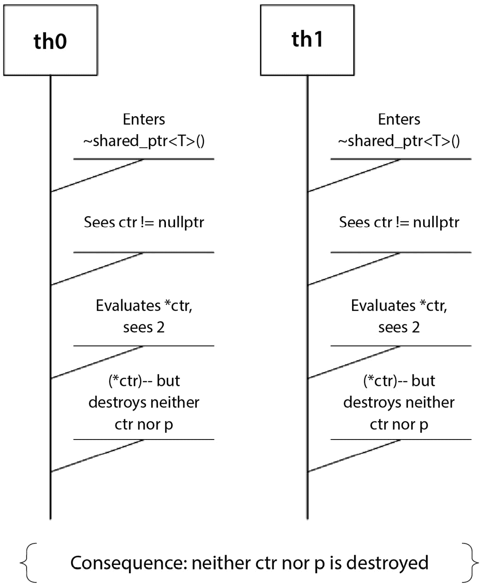
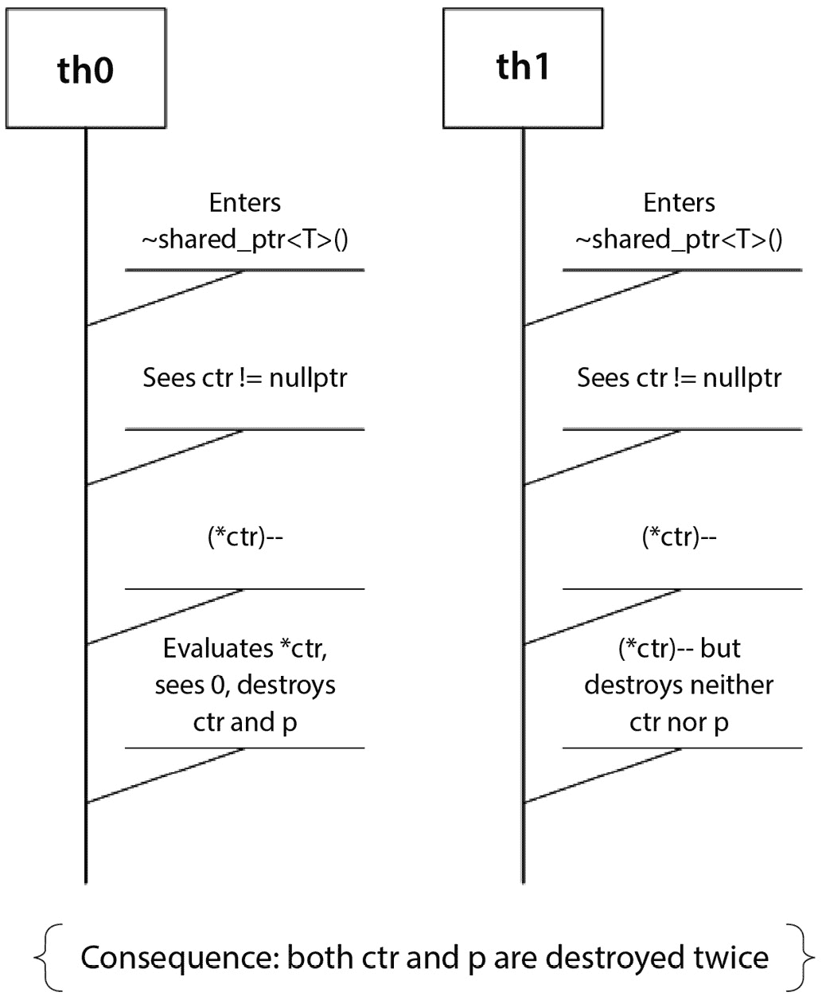

# 编写智能指针

在*第五章*中，我们考察了可用的标准智能指针，重点介绍了其中最重要的：`unique_ptr<T>`和`shared_ptr<T>`。这些类型是当代 C++程序员工具箱中的宝贵且重要的工具，在适当的时候使用它们可以使程序比大多数手写替代方案更小、更快、更简单。

本书旨在讨论如何在 C++程序中管理内存。因此，在本章中，我们将编写`unique_ptr<T>`和`shared_ptr<T>`的简单版本，以展示如果需要，可以如何编写这些类型的简单但可行的版本。我们**强烈**建议您在实际应用中使用标准版本，而不是本书中的版本（至少在生产代码中是这样）：标准版本已经经过彻底测试、优化，并被众多程序员有效地使用。我们在这里编写“自制”版本的原因仅仅是为了培养对如何编写此类类型的直觉：仍然存在一些公司使用 C++11 之前的编译器，有时出于合理的原因，在某些环境中可能存在编写受标准智能指针启发的但略有不同的智能指针的理由。

我们将考察一些标准智能指针未涵盖的领域，这可能是因为它们被认为足够简单，用户可以自行实现，或者它们被认为足够专业，应该通过第三方库来实现，或者还没有明确的标准化路径。

总结来说，在本章中，我们将做以下几件事：

+   简要了解所有权语义，包括标准智能指针以及我们可能——有时会——自己实现的那些。

+   为了掌握可能涉及的一些技术，我们将实现我们自己的简单但可用的`std::unique_ptr`版本。

+   实现我们自己的简单但可用的`std::shared_ptr`版本。请注意，在这里所说的“可用”是指在简单环境中可用，因为`std::shared_ptr`的完整实现比本书可以合理涵盖的要复杂得多。

+   实现一个具有单一所有权和复制语义的非标准智能指针，展示实现此目标的不同技术。

+   实现两个不同的非所有权的“智能”指针，这些指针类型非常轻量级，但有助于编写更好、更安全的代码。

在阅读本章之后，我们应该对涉及编写在语法上表现为指针但提供（或仅澄清）所有权的类型的技术有更好的掌握。所使用的技术应该大部分可以用于其他类型的问题，无论是与内存管理相关还是不相关的问题。

这个计划听起来怎么样？那么，让我们开始吧！

# 技术要求

你可以在这个章节的 GitHub 仓库中找到这个章节的代码文件：[`github.com/PacktPublishing/C-Plus-Plus-Memory-Management/tree/main/chapter6`](https://github.com/PacktPublishing/C-Plus-Plus-Memory-Management/tree/main/chapter6)。

# 所有权语义

智能指针全在于明确间接访问资源的所有权。如果我们限制自己使用标准设施，无论是智能的还是非智能的，我们拥有的就是以下内容：

| **类型** | **领域** |
| --- | --- |
| `unique_ptr<T>` | **所有权语义**：单一所有权。**显著的特有成员函数**：不可复制。析构函数负责销毁指针所指向的对象。 |
| `shared_ptr<T>` | **所有权语义**：共享所有权。**显著的特有成员函数**：复制、赋值和销毁更新共享使用计数。最后一个共同所有者的析构函数负责销毁指针所指向的对象和使用计数。 |
| `T*` | **所有权语义**：在类型系统中未定义所有权（所有权规则必须写入用户代码）。**显著的特有成员函数**：不适用（这是一个基本类型）。 |

表 6.1 – 按指针类型划分的使用类别

考虑到所有这些，这是一个小型的动物园。为了填充这个表格，我们还能设想出哪些其他类型的语义呢？好吧，以下是一些可能的：

+   一种 `observer_ptr<T>` 类型，它表现得像 `T*` 但使得通过如对指针应用 `delete` 这样的操作意外声明所有权变得更加困难（确实会发生意外）

+   一种 `non_null_ptr<T>` 类型，它表现得像 `T*` 但不会出现 `null` 指针，从而简化了客户端代码

+   一种 `remote_ptr<T>` 类型，它像一个代理来处理远程指针

+   一种 `dup_ptr<T>` 类型，它实现了与 `unique_ptr<T>` 相同的单一所有权，但它可复制，并且在复制 `dup_ptr<T>` 时复制指针所指向的对象，依此类推

我们不会实现所有这些（特别是 `remote_ptr<T>` 的情况，尽管它很有趣，但超出了本书的范围，还有许多其他异类语义我们可以考虑，你可以根据本章中找到的想法来实现它们），但我们将会编写一些。每个案例的重要方面是明确定义预期的语义，确保它们没有被现有类型覆盖，并确保我们适当地实现它们。

让我们从最简单实现开始，这可能是最著名的标准智能指针：`unique_ptr`。

# 编写你自己的（天真）unique_ptr

我们首先尝试一个简单、自制的版本 of `std::unique_ptr<T>`。正如本章开头所提到的，我们的目标是培养编写此类类型所需代码的直觉，而不是鼓励你尝试替换标准设施：它们存在，它们工作，它们经过测试，使用它们。哦，而且它们使用了许多我们无法在本书中探索的酷技巧，因为我们想控制本书的大小！

## 类型签名

如*第五章*中所述，`unique_ptr<T>`实际上并不存在，因为该类型实际上是`unique_ptr<T,D>`，其中`D`默认为`default_deleter<T>`。

我们将涵盖`unique_ptr`的两种形式（标量和数组）。这两个特殊化的原因在于，对于`T[]`，我们希望`unique_ptr`暴露`operator[]`，但我们不希望为标量`T`类型暴露这一点。

让我们从我们将提供的基删除器类型开始。请注意，如果需要，用户可以提供其他删除器类型，只要它们使用相同的`operator()`签名：

```cpp
namespace managing_memory_book {
   // basic deleter types
   template <class T>
   struct deleter_pointer_wrapper {
      void (*pf)(T*);
      deleter_pointer_wrapper(void (*pf)(T*)) : pf{ pf } {
      }
      void operator()(T* p) const { pf(p); }
   };
   template <class T>
   struct default_deleter {
      void operator()(T* p) const { delete p; }
   };
   template <class T>
   struct default_deleter<T[]> {
      void operator()(T* p) const { delete[] p; }
   };
   // ...
}
```

到目前为止，我们有三种可调用的删除器类型，它们都是类类型（原因很快就会变得明显，但要知道有时统一性是有价值的）。其中一个是`deleter_pointer_wrapper<T>`，它封装了一个可复制的状态（一个函数指针），但除此之外，它就像其他两个一样：当在`T*`上调用时，它将对那个指针应用一些（用户提供的）函数。

下一步将是选择`unique_ptr<T,D>`的形式。我们预计大多数删除器将是无状态的，并使用`deleter_pointer_wrapper<T>`。为了在这两种选项之间进行选择，我们需要检测`D`是否是一个函数指针，我们将通过我们自己的`is_deleter_function_candidate<T>`特性来实现这一点。

我们实现中检测删除器函数候选者的部分如下：

```cpp
#include <type_traits>
namespace managing_memory_book {
   // ...
   template <class T>
   struct is_deleter_function_candidate
      : std::false_type {};
   template <class T>
   struct is_deleter_function_candidate<void (*)(T*)>
      : std::true_type {};
   template <class T>
   constexpr auto is_deleter_function_candidate_v =
      is_deleter_function_candidate<T>::value;
   // ...
}
```

这部分可能很直观，但想法是，大多数类型都不是删除器函数的候选者，但`void(*)(T*)`类型的函数是。

然后，我们到达了一般的`unique_ptr<T>`类型，用于标量。我们将使用我们的删除器函数检测特性来有条件地选择`D`类型，并将`deleter_pointer_wrapper<T>`作为我们类型的基类，并将它转换为指向该基类的指针，以便在我们的析构函数中释放资源：

```cpp
namespace managing_memory_book {
   // ...
   // unique_ptr general template
   template <class T, class D = default_deleter<T>>
   class unique_ptr : std::conditional_t <
      is_deleter_function_candidate_v<D>,
      deleter_pointer_wrapper<T>, D
   > {
      using deleter_type = std::conditional_t <
         is_deleter_function_candidate_v<D>,
         deleter_pointer_wrapper<T>,
         D
      >;
      T* p = nullptr;
   public:
      unique_ptr() = default;
      unique_ptr(T* p) : p{ p } {
      }
      unique_ptr(T* p, void (*pf)(T*))
         : deleter_type{ pf }, p{ p } {
      }
      ~unique_ptr() {
         (*static_cast<deleter_type*>(this))(p);
      }
   };
   // ...
}
```

对于我们类型的`T[]`特殊化，基本上采取相同的方法：

```cpp
namespace managing_memory_book {
   // ...
   // unique_ptr specialization for arrays
   template <class T, class D>
   class unique_ptr<T[], D> : std::conditional_t <
      is_deleter_function_candidate_v<D>,
      deleter_pointer_wrapper<T>,
      D
   > {
      using deleter_type = std::conditional_t <
         is_deleter_function_candidate_v<D>,
         deleter_pointer_wrapper<T>,
         D
      >;
      T* p = nullptr;
   public:
      unique_ptr() = default;
      unique_ptr(T* p) : p{ p } {
      }
      unique_ptr(T* p, void (*pf)(T*))
         : deleter_type{ pf }, p{ p } {
      }
      ~unique_ptr() {
         (*static_cast<deleter_type*>(this))(p);
      }
   };
}
```

注意到默认的`unique_ptr`在概念上会像`null`指针一样，这对大多数人来说应该不会感到意外。现在我们已经有了基本的概念，让我们探索`unique_ptr`特有的语义。

## 特殊成员函数

特殊成员函数的代码对于`unique_ptr`的标量和数组形式将是相同的。我们已经在上一节中看到了析构函数和默认构造函数，所以让我们看看其他四个，成对来看：

+   我们希望类型是不可复制的，因为它代表了指针的唯一所有权（如果它是可复制的，指针的所有权属于原始的还是复制的？）

+   我们希望移动操作实现所有权的转移

通用情况和其数组特殊化的代码如下（请注意，代码使用了`std::exchange()`和`std::swap()`，这两个都包含在`<utility>`头文件中）：

```cpp
// ...
      unique_ptr(const unique_ptr&) = delete;
      unique_ptr& operator=(const unique_ptr&) = delete;
      void swap(unique_ptr &other) noexcept {
         using std::swap;
         swap(p, other.p);
      }
      unique_ptr(unique_ptr &&other) noexcept
         : p{ std::exchange(other.p, nullptr) } {
      }
      unique_ptr& operator=(unique_ptr &&other) noexcept {
         unique_ptr{ std::move(other) }.swap(*this);
         return *this;
      }
// ...
```

到目前为止，大部分内容应该是显而易见的。你可能会注意到 `std::exchange()` 的使用，它将 `other.p` 复制到 `this->p`，然后将 `nullptr` 复制到 `other.p`，实现了预期的所有权转移。请注意，我们类型的移动操作既简单又不会抛出异常，这两者都是非常理想化的属性。

有些操作将在一般情况和数组情况下都实现，即 `operator bool`（只有当对象不表示 `null` 指针时才为 `true`），`empty()`（只有当对象表示 `null` 指针时才为 `true`），以及 `operator==()` 和 `operator!=()`。这些实现基本上是微不足道的。我们还想公开的另一个成员函数是 `get()`，包括其 `const` 和非 `const` 版本，以便于需要与底层函数（如系统调用）交互的客户端代码暴露底层指针：

```cpp
// ...
      bool empty() const noexcept { return !p; }
      operator bool() const noexcept { return !empty(); }
      bool operator==(const unique_ptr &other)
         const noexcept {
         return p == other.p;
      }
      // inferred from operator==() since C++20
      bool operator!=(const unique_ptr &other)
         const noexcept {
         return !(*this == other);
      }
      T *get() noexcept { return p; }
      const T *get() const noexcept { return p; }
// ...
```

如前述代码注释中所述，从 C++20 开始，只要 `operator==()` 提供了预期的签名，就不需要显式实现 `operator!=()`。编译器将简单地从 `operator==()` 合成 `operator!=()`。

现在，让我们看看 `operator*()`、`operator->()` 和 `operator[]()` 这些类似指针的函数是如何实现的。

## 类似指针的函数

类似指针的函数在标量情况和数组情况中是不同的。对于指向标量的，我们希望实现 `operator*()` 和 `operator->()`：

```cpp
// ...
      T& operator*() noexcept { return *p; }
      const T& operator*() const noexcept { return *p; }
      T* operator->() noexcept { return p; }
      const T* operator->() const noexcept { return p; }
// ...
```

`operator->()` 成员函数是一个奇怪的生物：当用于对象时，它将在返回的对象上重新调用（并在返回的对象上再次调用，依此类推），直到返回一个原始指针，此时编译器将知道如何处理。这是一个非常强大的机制。

对于指向数组的（即 `unique_ptr<T[]>` 特化），我们希望实现 `operator[]`，这将比 `operator*()` 或 `operator->()` 更有意义：

```cpp
// ...
      T& operator[](std::size_t n) noexcept {
         return p[n];
      }
      const T& operator[](std::size_t n) const noexcept {
         return p[n];
      }
// ...
```

你可能会注意到这些成员函数的明显重复，因为每个函数都以 `const` 和非 `const` 的形式暴露出来，这种“趋势”是由稍早前的 `get()` 成员函数开始的。这是一种 *语法* 上的相似性，但它们在 *语义* 上是不同的：特别是，只有 `const` 形式可以通过 `const` `unique_ptr<T>` 对象访问。

如果你有一个 C++23 编译器，你可以让它根据正确编写的模板成员函数集合成你在实践中使用的形式：

```cpp
// the following is for both the array and non-array cases
template <class U>
   decltype(auto) get(this U && self) noexcept {
      return self.p;
   }
// the following two are only for the non-array case
template <class U>
   decltype(auto) operator*(this U && self) noexcept {
      return *(self.p);
   }
template <class U>
   decltype(auto) operator->(this U && self) noexcept {
      return self.p;
   }
// the following is only for the array case
template <class U>
   decltype(auto) operator[](this U && self,
                             std::size_t n) noexcept {
   return self.p[n];
}
```

这将我们需要编写的成员函数数量减少了一半。这是怎么做到的？嗯，C++23 引入了“推导的 `this`”机制，允许显式地将成员函数的第一个参数标记为 `this` 关键字。这样做并结合前向引用（`U&&` 类型）可以让编译器推导出 `this` 的 `const`-性（或缺乏 `const`-性），实际上是在一个函数中表达 `const` 和非 `const` 两个版本。注意这些函数伴随的 `decltype(auto)` 返回类型，它们推断出 `return` 语句。

就这样！我们现在有一个简单但功能齐全的 `unique_ptr<T>` 实现，适用于大多数用例。

当然，`unique_ptr<T>` 虽然很好，但并不是万能的，在实际程序中还有其他需要解决的问题。让我们继续探讨 `shared_ptr<T>` 的简化实现，看看我们如何实现共享所有权的语义。

使用我们自制的 `unique_ptr<T>` 和默认删除器的一个简单程序如下：

```cpp
// ... (our own unique_ptr<T> goes here...)
struct X {};
int main() {
   unique_ptr<X> p{ new X };
} // X::~X() called here
```

使用自定义删除器的一个程序如下：

```cpp
// ... (our own unique_ptr<T> goes here...)
class X {
   ~X(){}
public:
   static void destroy(X *p) { delete p; }
};
int main() {
   unique_ptr<X, &X::destroy> p{ new X };
} // X::destroy(p.get()) called here
```

# 编写自己的（原始）shared_ptr

`shared_ptr<T>` 类型实现起来是一个难题，优化起来更是难上加难。在这种情况下，使用现有智能指针的标准版本的邀请比 `unique_ptr<T>` 更加强烈：这种类型很难做到正确，而标准版本则受益于多年的经验和测试。在本节中，仅为了实验目的使用原始版本（它适用于简单情况，但编写一个工业级实现是职业级的工作）。

编写 `shared_ptr` 的主要困难在于它是一个具有两个职责的类型：它共同拥有被指点和使用计数器，需要一定的谨慎，尤其是在异常安全性方面。经典面向对象编程的单职责原则是一个正确的原则：具有单一职责的类型比具有两个或更多职责的类型更容易做到正确。

为了使我们的论点简单，我们将避免标准 `shared_ptr` 协议的许多细节，仅限于管理一个标量 `T`。让我们一步一步地来看这个类型：

```cpp
#include <atomic>
#include <utility>
namespace managing_memory_book {
   // naïve shared_ptr
   template <class T>
   class shared_ptr {
      T* p = nullptr;
      std::atomic<long long> *ctr = nullptr;
      // ...
```

如前所述，`shared_ptr<T>` 负责管理 `T*` 和指向客户端计数器的指针，这两者都需要被管理并在共同所有者之间共享。请注意，我们的共享计数器是一个指向原子整数的指针，因为 `shared_ptr<T>` 在多线程情况下特别相关，在这些情况下，不知道哪个线程将是对象的最后一个用户。因此，像增加和减少计数器这样的操作需要同步，以避免发生 *数据竞争*。

避免数据竞争

如果一个程序遇到一个给定对象（a）被至少两个线程并发访问，（b）至少有一个访问是写操作，并且（c）没有同步，那么这个程序就出现了我们所说的**数据竞争**，我们基本上失去了从源代码中推理它的能力。这是一个非常糟糕的情况。

在我们的情况下，对共享计数器的操作很可能会并发进行，因此它们必须进行同步。这就解释了我们使用低级同步对象作为计数器的原子整数。

构造一个`shared_ptr<T>`对象可能很棘手：

+   默认情况下，我们将定义`shared_ptr<T>`为空，从概念上等同于一个`null`指针。

+   `shared_ptr<T>`的构造函数接受`T*`作为参数，代表对所指向对象的**所有权获取**行为。因此，如果在分配计数器时抛出异常，那么这个指针将被销毁。

+   复制构造函数将代表对所指向对象的**共享所有权**，并确保考虑到源对象可能表示一个`null`指针的情况。

+   移动构造函数模拟了**所有权转移**。正如移动操作通常那样，它非常快，并且表现出高度可预测的行为。

如以下代码片段所示，对于具有多个职责的类型，即使是构造也是一个微妙的过程。在接收`T*`参数的构造函数中，我们可能需要分配共享计数器，这可能会抛出异常，这种情况我们需要处理。在复制构造函数中，我们需要考虑到参数可能表示一个空的`shared_ptr<T>`，在这种情况下，共享计数器将是`null`：

```cpp
      // ...
   public:
      shared_ptr() = default;
      shared_ptr(T* p) : p{ p } {
         if(p) try {
            ctr = new std::atomic<long long>{ 1LL };
         } catch(...) {
            delete p;
            throw;
         }
      }
      shared_ptr(const shared_ptr &other)
         : p{ other.p }, ctr{ other.ctr } {
         if(ctr) ++(*ctr);
      }
      shared_ptr(shared_ptr &&other) noexcept
         : p{ std::exchange(other.p, nullptr) },
           ctr{ std::exchange(other.ctr, nullptr) } {
      }
      bool empty() const noexcept { return !p; }
      operator bool() const noexcept { return !empty(); }
// ...
```

`empty()`和`operator bool()`成员函数已被包含在该片段中，因为这些函数直接与默认构造函数（此类型的空状态）的表达方式相关联。

赋值运算符并不令人意外：复制赋值模拟了释放当前持有的资源控制权并共享其参数的资源的行为，而移动赋值模拟了释放当前持有的资源控制权并将参数持有的资源控制权转移到被赋值对象的行为：

```cpp
      // ...
      void swap(shared_ptr &other) noexcept {
         using std::swap;
         swap(p, other.p);
         swap(ctr, other.ctr);
      }
      shared_ptr& operator=(const shared_ptr &other) {
         shared_ptr{ other }.swap(*this);
         return *this;
      }
      shared_ptr& operator=(shared_ptr &&other) noexcept {
         shared_ptr{ std::move(other) }.swap(*this);
         return *this;
      }
      // ...
```

销毁可能是此类中最棘手的部分。我们想要确保最后一个所有者销毁它，以避免不朽对象。关键点是`shared_ptr<T>`只有在它是该对象的最后一个用户时才应该销毁指向的`T`对象。

至少有两种“显而易见”的简单算法是无效的。一个是**如果**`ctr`**不为空，那么如果**`*ctr==1`**，则删除**`p`**和删除**`ctr`**。这个算法允许两个线程在`*ctr==2`时同时进入析构函数。在这种情况下，可能两个线程都没有看到`*ctr==1`，并且指针永远不会被销毁：



图 6.1 – 导致对象永生的竞态条件

另一个是 *如果* `ctr` *不为空，则递减* `*ctr`*。如果* `*ctr==0`*，删除 *p* 和删除 *ctr*。此算法允许两个线程在 `*ctr==2` 时同时进入析构函数，然后两个线程同时递减 `*ctr`，导致两个线程都可能看到 `*ctr==0`，从而可能导致指针的重复删除：



图 6.2 – 对象重复删除的竞态条件

这两种情况都不好，尽管原因不同，所以我们需要做得更好。过程的难点在于确保执行线程可以知道它是使 `*ctr` 成为零的那个线程。解决此类问题的通用方法需要将两个步骤（仅在变量具有事先已知的值时更改其值，并被告知此写入是否发生）封装在单个操作中，这至少需要一个多核机器上的硬件操作支持。

C++ 通过原子操作提供了对这些基本硬件操作的抽象。其中一个原子操作被命名为 `compare_exchange_weak()`，它接受 `expected` 值（被认为是变量中的值）和 `desired` 值（希望写入该变量的值，但只有当它保持 `expected` 时），并且只有在实际发生写入时才返回 `true`。为了方便，`expected` 通过引用传递，并使用当时对象实际持有的值进行更新，因为此函数通常在循环中调用，直到成功写入 `desired` 实际发生，这涉及到每次重新读取 `expected` 以更新函数对变量当前状态的看法。

与图片共舞

这种 `expected` 和 `desired` 的舞蹈可以看作是拍照。一个线程想要递减 `*ctr`，但 `*ctr` 保持可变状态且被并发访问，这意味着其值可以随时改变。因此，我们在我们控制的局部变量中拍下照片（`expected`）。我们基于我们想要写入的值（`desired`）基于我们知道的那个局部照片，我们知道它没有改变。然后，我们尝试根据这个（可能过时的）知识采取行动，看看我们的假设（`*ctr` 保持 `expected`）是否成立。这让我们知道，是我们将 `desired` 写入 `*ctr` 的。

基于这个知识，析构函数的一个可能的实现如下：

```cpp
      // ...
      ~shared_ptr() {
         if(ctr) {
            auto expected = ctr->load();
            auto desired = expected - 1;
            while(ctr->compare_exchange_weak(expected,
                                             desired))
                desired = expected - 1;
            if(desired == 0) { // I was the last user of *p
               delete p;
               delete ctr;
            }
         }
      }
      // ...
```

在循环之后，我们知道我们在 `*ctr` 保持 `expected` 时写入了 `desired`，因此如果 `desired` 是 `0`（意味着 `expected` 是 `1`），我们知道我们是最后一个使用那个指针的用户。是的，这很微妙。而且这只是一个 `shared_ptr<T>` 的玩具版本。我们可以以许多方式对其进行优化，但这超出了本书的范围。

一个更简单的解决方案

这里展示的 `compare_exchange_weak()` 解决方案是我们可用的许多选项之一。它被选为这本书的原因是，它为并发更新问题提供了一个有趣的通用解决方案，并且如果你对内存顺序约束感到舒适（我们在这里不会深入讨论），它还提供了优化机会。在这个特定的情况下，我们可以用类似 `if((*ctr)-- == 1)` 的东西替换循环，就像原子地递减 `*ctr` 并且之前持有的值是 `1` 一样，那么我们可以确信 `*ctr` 现在是 `0`。

我们 `shared_ptr<T>` 实现的另一个重要成员函数涉及比较（`operator==` 和 `operator!=`），允许获取底层原始 `T*` 的 `get()` 成员函数，以及 `operator*()` 和 `operator->()` 这样的间接操作符：

```cpp
      // ...
      bool operator==(const shared_ptr &other)
         const noexcept { return p == other.p; }
      // inferred from operator==() since C++20
      bool operator!=(const shared_ptr &other)
         const noexcept { return !(*this == other); }
      T *get() noexcept { return p; }
      const T *get() const noexcept { return p; }
      T& operator*() noexcept { return *p; }
      const T& operator*() const noexcept { return *p; }
      T* operator->() noexcept { return p; }
      const T* operator->() const noexcept { return p; }
   };
}
```

如果你愿意，可以自由地应用前面在 `unique_ptr` 部分展示的 “推导 `this`” C++23 功能来简化这段代码。还请记住，在 C++20 中，`operator!=()` 将从 `operator==()` 推导出来，并且不需要在源代码中显式编写。

这个智能指针的客户代码的一个非常简单的例子如下：

```cpp
#include <thread>
#include <chrono>
#include <random>
#include <iostream>
using namespace std::literals;
struct X {
   int n;
   X(int n) : n{ n } {}
   ~X() { std::cout << "X::~X()\n"; }
};
int main() {
   using managing_memory_book::shared_ptr;
   std::mt19937 prng{ std::random_device{}() };
   std::uniform_int_distribution<int> die{ 200, 300 };
   shared_ptr<X> p{ new X{ 3 } };
   using std::chrono::milliseconds; // shortcut
   std::thread th0{ [p, dt = die(prng)] {
      std::this_thread::sleep_for(milliseconds{dt});
      std::cout << "end of th0, p->n : " << p->n << '\n';
   } };
   std::thread th1{ [p, dt = die(prng)] {
      std::this_thread::sleep_for(milliseconds{dt});
      std::cout << "end of th1, p->n : " << p->n << '\n';
   } };
   th1.detach();
   th0.detach();
   std::this_thread::sleep_for(350ms);
   std::cout << "end main()\n";
}
```

在这个例子中，`th0` 和 `th1` 都会暂停一个伪随机的毫秒数，然后显示一些内容并结束执行，因此我们无法预先知道 `th0` 和 `th1` 中哪一个会先结束；两个线程都是分离的，这意味着我们不会在它们上面调用 `join()`，因此我们不能假设 `main()` 是最后一个使用共享资源的用户。

例子是为了保持简单而设计的，并且需要重复的是，由于 `shared_ptr<T>` 的使用成本显著高于 `unique_ptr<T>`，当资源有一个明确的最后一个所有者时，人们通常会优先选择后者。

## 关于 `make_shared()` 的一些话

在阅读关于 C++ 以及特别是 `shared_ptr<T>` 的内容时，你可能会读到，在可能的情况下，推荐的做法是替换以下内容：

```cpp
std::shared_ptr<X> p{ new X { /* ... args ... */ };
```

用以下内容替换它：

```cpp
auto p= std::make_shared<X>( /* ... args ... */ );
```

如果是这样的话，你可能想知道（a）为什么这是推荐的做法，以及（b）为什么我们还没有解决这个问题。对于（a）的答案我们现在可以提供，但对于（b）的答案是我们需要等待直到我们达到 *第七章* 才有实现这种功能所需的工具和知识。

要理解为什么我们推荐优先使用 `make_shared<T>()` 工厂函数而不是直接调用 `shared_ptr<T>` 构造函数，关键思想是，使用 `shared_ptr<T>` 构造函数时，`T` 对象是由客户端代码分配的，并交给正在构建的 `shared_ptr<T>`，它接管这个指针并单独分配一个共享计数器。然后我们最终会有两个分配（`T` 对象和计数器），可能位于不同的缓存行上。

现在，如果我们来看一下 `make_shared<T>()`，这个工厂函数负责分配 `T` 对象和计数器，并将函数接收到的参数完美转发给 `T` 构造函数。由于同一个函数执行了两次分配，它可以将它们融合在一个包含 `T` 对象和计数器的内存块的单次分配中，*将它们都放在相同的缓存行上*。如果在短时间内单个线程倾向于从两个指针（`T*` 和计数器）中读取，这可能会提高性能特性，但（有时可能会发生）如果另一个线程观察到计数器值的频繁变化，可能会造成伤害。正如在优化相关情况下经常发生的那样，测量并确保在一般情况下效果良好的方法也适用于你自己的特定用例。

显然，为了实现这种优化，我们需要能够创建这样的块（概念上，一个包含 `T` 和一个原子整数的结构体）并确保 `shared_ptr<T>` 可以包含这两种表示（两个单独的指针或指向包含两个对象的块的指针），同时保持可用性和效率。在到达那里时，控制使用在 *第二章* 和 *第三章* 中看到的技巧将是有帮助的。

# 编写基于策略的复制指针

让我们暂时抛开标准智能指针。假设我们想要编写一种智能指针类型，其语义既不符合 `std::unique_ptr<T>` 的单一所有者模式，也不符合 `std::shared_ptr<T>` 的共享所有者模式。为了这个例子，更具体地说，我们想要单一所有者语义，但与 `std::unique_ptr<T>` 不同，它是可移动的但不可复制的，我们希望指针的复制导致指向的对象的复制。我们能做什么？

好吧，这是 C++，所以我们当然可以自己编写。让我们称我们自己的这种新的智能指针类型为 `dup_ptr<T>`（表示“复制指针”，或“复制指向的对象的指针”）。由于我们在本章前面已经探讨了如何通过我们自制的 `unique_ptr<T>` 实现单一所有者，本节将主要关注复制指向对象的问题。

我们所说的复制是什么意思？嗯，有两种预期情况：复制一个非多态类型的对象和一个多态类型的对象，其中多态在这里的意思是“至少有一个 `virtual` 成员函数”。当然，程序员是极具创造力的生物，知道有人最终会遇到更奇特的情况，所以我们将尽力处理上述“预期情况”，并为那些有特殊应用的人留下一条门路。

为什么多态类型和非多态类型之间有差异？考虑以下程序：

```cpp
struct X { int n; };
struct B {
   int n;
   B(int n) : n{ n } {}
   virtual ~B() = default;
};
struct D0 : B {
   D0(int n) : B{ n } { /* ... */ }
   // ...
};
struct D1 : B {
   D1(int n) : B{ n } { /* ... */ }
   // ...
};
// precondition: p != nullptr (to keep things simple)
X* duplicate(X *p) {
   return new X{ *p }; // Ok
}
// precondition: p != nullptr (to keep things simple)
B* duplicate(B *p) {
   return new B{ *p }; // Bad idea!
}
#include <memory>
int main() {
   using std::unique_ptr;
   X x{ 3 };
   unique_ptr<X> px { duplicate(&x) };
   D0 d0{ 4 };
   unique_ptr<B> pb{ duplicate(&d0) }; // trouble ahead
}
```

我们可以假设`duplicate(X*)`函数可以安全地创建一个`X`类型的对象，因为`X`没有`virtual`成员函数，因此很可能不是作为公共基类而设计的。然而，`duplicate(B*)`通过调用`B`的构造函数做错事的可能性很高，因为作为参数传递的`B*`可能是`B`或指向任何从`B`派生出的类（这里，`D0*`）的对象的指针。因此，调用`new B{ *p };`仅构建基部分，切除了指向的对象的任何状态，导致程序可能不正确。

在面向对象编程领域，众所周知，复制多态类型对象的常用方法是**主观复制**，也称为`virtual`成员函数，唯一真正能声称知道指针所指类型的是…指针所指的对象本身。

那么`dup_ptr<T>`将要做什么呢？它将根据`T`的特性选择一个**复制策略**：默认情况下，如果`T`是多态的，我们将通过克隆来复制；否则，我们将通过复制来复制。当然，如果需要，我们将允许客户端代码指定一个自定义的复制机制。

我们将探讨三种选择默认复制策略的方法：基于接口的侵入式方法，基于特性和使用 C++17 特性的编译时检测克隆成员函数的非侵入式方法，以及另一种基于 C++20 概念的非侵入式方法。

## 通过接口进行检测

用户代码中可以做的事情之一是要求可克隆类型实现一个特定的接口，如下例所示：

```cpp
struct cloneable {
   virtual cloneable * clone() const = 0;
   virtual ~cloneable() = default;
};
```

这样的解决方案可能不值得标准化：它是侵入式的，增加了一些开销（我们假设可复制的类型将是多态类型，这是可能的但不是强制的），等等。当然，它可以成为你自己的代码库的解决方案。将这个想法应用于之前错误处理多态类型复制的示例重访，我们得到以下结果：

```cpp
// ... type cloneable
struct X { int n; };
struct B : cloneable { // every B is cloneable
   int n;
   B(int n) : n{ n } {}
   virtual ~B() = default;
   B * clone()
protected: // cloneable types are meaningfully copied
           // in a subjective manner
   B(const B&) = default;
};
struct D0 : B {
   D0(int n) : B{ n } { /* ... */ }
   D0* clone() const override { return new D0{ *this }; }
   // ...
};
struct D1 : B {
   D1(int n) : B{ n } { /* ... */ }
   D1* clone() const override { return new D1{ *this }; }
   // ...
};
```

现在，假设我们想要开发一个`dup_ptr<T>`的骨架，它复制非`cloneable`派生类型，克隆`cloneable`类型。为此，我们可以使用`std::conditional`类型特性和在两个函数对象类型之间进行选择，一个`Copier`类型用于复制，一个`Cloner`类型用于克隆：

```cpp
// ... type cloneable
struct Copier {
   template <class T> T* operator()(const T *p) const {
      return new T{ *p };
   }
};
struct Cloner {
   template <class T> T* operator()(const T *p) const {
      return p->clone();
   }
};
#include <type_traits>
template <class T,
          class Dup = std::conditional_t<
             std::is_base_of_v<cloneable, T>,
             Cloner, Copier
          >>
class dup_ptr {
   T *p{};
   // use an object of type Dup when duplication is
   // required: copy constructor and copy assignment
   // ...
public:
   dup_ptr(const dup_ptr &other)
      : p{ other.empty()? nullptr : Dup{}(other.p) } {
   }
   // ...
};
```

这个实现假设了一个无状态的（没有成员变量）`Dup`类型，这是高度可能的，但在实践中应该进行文档记录（如果我们接受有状态的`Dup`类型，我们需要实例化一个`Dup`对象并编写复制和移动该对象的代码，这将导致一个更复杂的实现）。使用这个实现，任何从`cloneable`派生的类型都将被克隆，其他类型将被复制，除非用户代码提供了`Dup`类型的异构实现。

## 通过特性进行检测

如果我们不希望对我们的 `cloneable` 类型施加基类，我们可以使用类型特质来检测存在一个 `const` 修饰的 `clone()` 成员函数，并假设这是一个合理的声明，即克隆比复制更好。请注意，这种非侵入性假设了一个不言自明的关于 `clone()` 意义的协议。

我们可以通过许多方式实现这一点，但最干净、最通用的方法可能是使用自 C++17 以来在 `<type_traits>` 中找到的沃尔特·布朗博士的 `std::void_t` 类型：

```cpp
// types Cloner and Copier (see above)
template <class, class = void>
   struct has_clone : std::false_type { };
template <class T>
   struct has_clone <T, std::void_t<
      decltype(std::declval<const T*>()->clone())
   >> : std::true_type { };
template <class T>
   constexpr bool has_clone_v = has_clone<T>::value;
template <class T, class Dup = std::conditional_t<
             has_clone_v<T>, Cloner, Copier
>> class dup_ptr {
   T *p{};
public:
   // ...
   dup_ptr(const dup_ptr &other)
      : p{ other.empty()? nullptr : Dup{}(other.p) } {
   }
   // ...
};
```

`std::void_t` 类型是一项杰出的工作，它允许有知识的人以有限的方式模拟 C++20 以来 `requires` 允许的通用表达式。阅读这个示例的方法如下：

+   通常，`has_clone<T>::value` 是 `false`

+   对于任何 `T` 类型，对于某些 `const T*` 对象 `p` 的 `p->clone()`，`has_clone<T>::value` 是 `true`

一旦选择了 `Dup` 类型，正常操作继续。这种实现相对于之前的一个优点是，它检查是否存在一个适当编写的 `clone()` 成员函数，而之前的实现检查是否存在特定的基类。实现一个函数比从特定的基类派生更轻量级的合同。

关于 `std::void_t` 的一些话

`std::void_t` 类型是一项杰出的工作。使用它依赖于 `has_clone<T>` 对于大多数类型是 `false`，但当表达式 `p->clone()` 对于某些 `const T*` 对象 `p` 是有效的时候是 `true`。即使在概念真正发挥其作用之前，我们也能轻松地测试任何表达式的有效性，这真是太美了，我们非常感谢沃尔特·布朗博士（Dr. Walter Brown）为我们带来了这个宝石（以及其他许多宝石）。

## 通过概念进行检测

自从 C++20 以来，像 `std::void_t` 这样的技巧不如以前有用，因为概念现在是语言类型系统的一部分。通过概念，我们可以定义一个 `cloneable` 类型 `T`，使其在 `const T*` 上调用 `clone()` 是良好形成的，并且得到可以转换为 `T*` 的结果。

因此，我们有以下内容：

```cpp
template <class T>
   concept cloneable = requires(const T *p) {
      { p->clone() } -> std::convertible_to<T*>;
   };
template <class T, class Dup = std::conditional_t<
            cloneable<T>, Cloner, Copier
>> class dup_ptr {
   T *p{};
public:
   // ...
   dup_ptr(const dup_ptr &other)
      : p{ other.empty()? nullptr : Dup{}(other.p) } {
   }
   // ...
};
```

概念，就像特质一样，是解决这个问题的非侵入式解决方案。然而，特质是一种编程技术，它内嵌在类型系统中，我们可以（例如）编写针对 `cloneable<T>` 专门化的代码，以及不针对 `cloneable<T>` 编写的代码。在我们的情况下，我们希望为既不使用复制构造函数也不使用 `clone()` 成员函数的类型留下开放的大门，这表明当前设置，允许客户端代码提供其他复制机制，可能是更可取的。

C++26

C++26 将包含两个名为 `std::indirect` 和 `std::polymorphic` 的标准类型，它们将覆盖一个接近于本 `dup_ptr` 描述的利基市场。它于 2025 年 2 月 15 日获得投票通过。

# 一些不太聪明但有用的智能指针

因此，我们有标准的智能指针，如 `unique_ptr<T>`（单一所有者）和 `shared_ptr<T>`（共享所有者），我们可以为更特殊的情况编写自己的（我们检查了 `dup_ptr<T>`，其中在指针被复制时，我们有单一所有者，但指向的对象被复制）。我们的程序类型系统中可能还有其他常见的语义我们想要封装？

好吧，至少有两个“简单”的可以考虑：实现一个“永不为空”的语义和实现一个“仅观察”的语义。

## 一个 non_null_ptr 类型

让我们回到一个早期的例子，我们写了以下内容：

```cpp
// ...
// precondition: p != nullptr (to keep things simple)
X* duplicate(X *p) {
   return new X{ *p }; // Ok
}
// ...
```

注意注释，它将不提供空指针的责任放在用户代码上。我们可以用许多其他方式来处理这个约束，包括以下内容：

+   断言 `!p`

+   如果 `!p`，调用 `std::abort()`

+   如果 `!p`，调用 `std::terminate()`

+   抛出 `!p`，等等

重要的是，如果我们关心指针不为空，并且我们在运行时代码中注入 `if(!p)` 测试，那么我们可能正在做错事，因为这可能是（或应该是）类型系统的一部分：*这个函数只接受非空指针*。代码比注释更有说服力。

这个想法出现在一些商业库中（例如，一些主要编译器供应商提供的指南支持库中的 `gsl::non_null<T>`），只要有一个明确的方式报告错误，就很容易实现。为了举例，我们将假设这个明确的方式是抛出异常：

```cpp
class invalid_pointer {};
template <class T>
   class non_null_ptr {
      T *p;
   public:
      non_null_ptr(T *p) : p{ p } {
         if (!p) throw invalid_pointer{};
      }
      T* get() const { return p; }
      constexpr operator bool() const noexcept {
         return true;
      }
   // ...
```

使用这种类型，任何接受 `non_null_ptr<T>` 参数的函数都知道其中的 `T*` 指针将非空，从而减轻客户端代码验证的负担。这使得 `non_null_ptr<T>` 成为期望非空 `T*` 的函数接口的一个美丽的类型。

到目前为止，这个类的其余部分主要是简单易写的。关键特性是 `non_null_ptr<T>` 不会暴露默认构造函数，因为那个构造函数必须将 `p` 数据成员初始化为某个默认值（可能是 `nullptr`），但 `non_null_ptr<T>` 类型模拟了一个非空指针，这会导致不合理的代码。

在使用方面，看看这个：

```cpp
struct X { int n; };
class invalid {};
int extract_value(const X *p) {
   if(!p) throw invalid{};
   return p->n;
}
#include <iostream>
int main() try {
   X x{ 3 };
   std::cout << extract_value(&x) << '\n'
             << extract_value(nullptr) << '\n';
} catch(invalid) {
   std::cerr << "oops\n";
}
```

现在，比较一下这个，假设 `non_null_ptr<T>` 在用空指针构造时抛出异常：

```cpp
// definition of the non_null_ptr type (omitted)
struct X { int n; };
int extract_value(const non_null_ptr<X> &p) {
   return p->n; // no need for validation as it stems
                // from the type system itself
}
#include <iostream>
int main() try {
   X x{ 3 };
   std::cout << extract_value(&x) << '\n'
             << extract_value(nullptr) << '\n';
} catch(...) {
   std::cerr << "oops\n";
}
```

在这种情况下，`non_null_ptr<T>` 比 `T*` 的两个主要优点是类型系统通过 `non_null_ptr<T>` 更好地记录了意图（使用 `T*`，空指针可能没问题，但使用 `non_null_ptr<T>`，则显然不是），并且被调用的函数可以在不进行验证的情况下继续执行，验证（再次）内置于类型系统中。使用比 `T*` 更丰富的类型使调用代码和被调用代码都变得更好。

如果被调用的函数需要 `T*`？这种情况可能发生，例如，当它需要调用一个 C 函数时。那么，使用 `non_null_ptr<T>` 对象的 `get()` 成员函数。C++ 如果不是实用主义，那就什么都不是了。

## 一个 observer_ptr 类型

有没有一个非常愚蠢的智能指针类型名为`observer_ptr<T>`，它只关心表达这样一个观点：“智能”指针实际上确实*不是*指针，因为在那种类型上，应用于原始指针的操作被限制。典型的问题是，对`T*`应用`delete`会起作用，但对`observer_ptr<T>`应用`delete`则不会，因为`observer_ptr<T>`不是指针。确实，考虑以下：

```cpp
class X { /* ... */ };
void f(X *p) {
   // use *p
   // we passed a raw pointer to f(), so f() should
   // observe it, not own it
delete p; // wait! You're not supposed to do that!
}
```

你可能会说，正如评论中所说的，“但是那个函数不应该做那样的事情！它不拥有`*p`！”但是，嗯，错误是会发生的，误解也是如此。在这种情况下，误解的影响由于论证的类型中没有任何内容表明将`operator delete`应用于`p`是不正确的而被加剧了！

现在，让我们稍微改变一下签名：

```cpp
class X { /* ... */ };
void f(observer_ptr<X> p) {
   // use *p
   // delete p; // nope, does not compile
}
```

“使用`*p`”的注释在这两个版本中保持不变。`observer_ptr<T>`类型提供了几乎所有合理运算符和成员函数（`get()`、`operator*()`、`operator->()`、`empty()`等等）的几乎平凡的版本，因此`T*`和`observer_ptr<T>`在用户代码中的使用应该大致相同；唯一的区别在于像应用`delete`或执行指针运算这样的错误使用。

有时，仅仅在函数接口中明确意图就能使代码变得更好。

# 摘要

在*第五章*中，我们花了一些时间讨论标准智能指针的正确用法。在当前章节中，我们“弄脏了我们的手”，也就是说，我们编写了自制的（以及简化的）`unique_ptr<T>`和`shared_ptr<T>`版本。正如多次提到的，这旨在作为一种教育性的探索，因为你的库供应商无疑在两种情况下都提供了显著更好的（更完整、更高效、更好测试等）实现。

在本章中，我们还探讨了提供自制智能指针类型的可能性，有一个基于三种不同选择复制算法的策略`dup_ptr<T>`。意图是表明这是可以做到的，如何做到，以及我们如何提供合理、可用的默认值，而不会因为用户代码中更奇特的要求而阻碍它们。

在本章的结尾，我们考察了一些相对简单（但有用）的智能（或者说轻度智能）指针，这些指针可以在函数的边缘（通常是作为参数类型）使用，通过类型系统隐式地表达语义要求，而不是强迫用户代码明确地强制执行这些要求……有时甚至无法做到。

令人意外的是，内存管理不仅限于智能指针。在下一章中，我们将探讨`new`、`new[]`、`delete`和`delete[]`运算符的工作原理，我们如何自己实现它们，以及为什么我们有时想这样做。

# 第三部分：掌握（内存管理机制）

在本部分，我们将更深入地探讨，并检查您如何接管 C++语言中的一些核心内存分配机制，并按需定制它们。我们将看到您如何控制诸如 new 和 delete 之类的运算符的行为，如何使用专业知识来获得特定的执行属性，以及这些运算符如何以创新的方式使用。我们还将利用这些知识应用于一些实际应用，以实现快速、有时甚至非常快速的内存管理操作。

本部分包含以下章节：

+   *第七章*, *重载内存分配运算符*

+   *第八章*, *编写一个简单的内存泄漏检测器*

+   *第九章*, *非典型分配机制*

+   *第十章*, *基于区域的内存管理和其他优化*

+   *第十一章*, *延迟回收*
