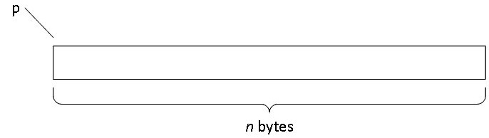
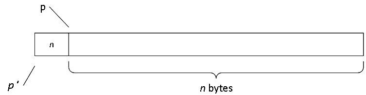
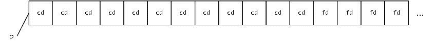
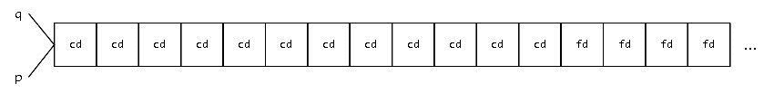
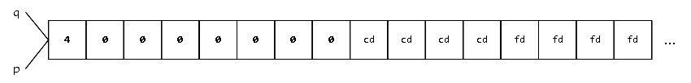
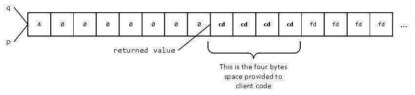
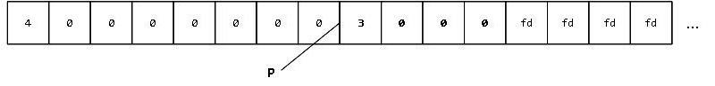

# 8

# 编写一个简单的内存泄漏检测器

在*第七章*中，我们探讨了各种方法来重载内存分配操作符，即 `new`、`new[]`、`delete` 和 `delete[]`，以便掌握编写这些操作符所涉及的语法以及它们如何在客户端代码中使用。我们讨论了这些操作符如何与异常交互（甚至在 `nothrow` 版本的情况下），并看到了为什么它们在大多数情况下应该以四组或其倍数的形式编写。例如，调用 `nothrow` 版本的 `operator new()` 来获取一些指针 `pV`，然后在稍后调用 `delete p` 的代码，如果只重载了 `nothrow` 版本而没有重载“常规”版本，那么两者可能最终无法相互兼容，这会导致问题迅速出现。

我们实际上还没有讨论的是，我们的代码如何通过控制这些操作符来受益。确实，这有多种用途：追踪内存是如何或在哪里被分配的，测量进程中的内存碎片，实现一种专门的战略来控制分配或释放过程的性能特性，等等。由于这本书的篇幅有限，我们无法希望涵盖所有可能的选项，因此我们将选择一个，希望这个例子足够启发你，让你能够自己探索其他途径。

本章我们将探讨的例子是一个简单但实用的内存泄漏检测器。更详细地说，我们将做以下几件事：

1.  我们首先将详细阐述计划，概述我们的泄漏检测器将如何工作以及我们将使用哪些技巧来实现我们的目标。

1.  然后，我们将实现我们工具的第一个版本，这个版本表面上看起来似乎是可行的。我们将逐步分析对 `operator new()` 的调用以及相应的 `operator delete()`，以了解在整个过程中内存中发生了什么。

1.  在这一点上，我们将利用前几章学到的知识来识别我们第一个解决方案中的缺陷以及我们可以如何修复它们。

1.  最后，我们将重新审视我们的初始实现，并最终得到一个既简单又能在实际代码中使用的解决方案。

由于这将是一个非常具体的章节，你可以期待在我们前进的过程中（或进一步）发展（或完善）一些有用的技能：

+   第一件事是在编码前进行规划。在本章中，我们将编写非常底层的代码，这使得我们有一个清晰的方向尤为重要。毕竟，当我们“接近机器”编码并处理原始内存时，编译器提供的类型系统这一安全网往往会变得较薄，如果我们不小心，就更容易出错（代价高昂的错误）。

+   第二个任务是安全地使用共享可变资源。我们的泄漏检测器将使用内存分配操作符的全局版本，以便覆盖所有类型的分配请求，至少除非用户决定使用这些操作符的专用版本，因此我们需要管理程序的全局状态。此外，我们知道用户代码可能是多线程的，因此我们分配的内存的会计需要一种同步形式，以避免数据竞争。

+   第三个任务是承认在绕过类型系统时对对齐的影响。由于我们将处理原始内存以满足客户端代码事先未知的需求，我们将学会做出适用于所有“自然”（在“非对齐”的意义上）内存分配用例的选择。

+   最后，我们将检查如何根据原始内存的内容调试我们的代码。由于我们旨在使本书不受工具的限制，我们将采用一种图表方法来解决这个问题，但在实践中，您应该将本章中我们所做的事情适应到您最喜欢的调试工具的隐喻中。所有合理的调试器都会让您检查特定内存地址的内容，您肯定会在某些时候想要这样做。

让我们深入探讨吧！

# 技术要求

您可以在本书的 GitHub 仓库中找到本章的代码文件：[`github.com/PacktPublishing/C-Plus-Plus-Memory-Management/tree/main/chapter8`](https://github.com/PacktPublishing/C-Plus-Plus-Memory-Management/tree/main/chapter8)。

# 计划

我们计划编写一个内存泄漏检测器，这个任务一开始可能看起来很奇怪和抽象。我们如何开始呢？好吧，一种澄清我们需要做什么的方法是编写一个小型测试程序，同时展示我们期望我们的工具如何被使用，并突出从用户代码的角度看我们的工具的关键方面：

```cpp
#include <iostream>
// this is incomplete (for now)
int main() {
   auto pre = // current amount of allocated memory
   { // BEGIN
      int *p = new int{ 3 };
      int *q = new int[10]{ }; // initialized to zero
      delete p;
     // oops! Forgot to delete[] q
   } // END
   auto post = // current amount of allocated memory
   // with this code, supposing sizeof(int)==4, we
   // expect to see "Leaked 40 bytes" printed
   if(post != pre)
      std::cout << "Leaked " << (post - pre) << " bytes\n";
}
```

如您所见，这个“故意泄漏”的程序执行了两次分配，但只有一次释放，"忘记"（对我们来说很方便）释放一个包含十个`int`对象的数组。假设`sizeof(int)==4`，我们的泄漏检测器应该允许程序报告 40 字节的泄漏。

这个程序并没有告诉我们如何在特定时间（portably）获取动态分配的内存量（我们将在本章后面编写这个服务），但它确实显示了分配和释放操作位于一对大括号之间（参见示例程序注释中的`BEGIN`和`END`）。正如您所知，C++中，匹配的大括号定义了一个作用域，作用域确保了在其中定义的自动变量的销毁。这里的想法是，即使存在 RAII 对象（参见*第四章*），我们也要检测到泄漏，因为它们也可能有错误，所以我们要确保在尝试发出诊断之前它们被销毁。

如本章引言中所述，我们将通过重载内存分配操作符的**全局**形式来实现我们的泄漏检测器。你可能已经猜到了，这些操作符需要共享一些状态：至少，它们需要共享在特定时刻分配的内存数量的知识，因为`new`和`new[]`操作符会增加这个数量，而`delete`和`delete[]`操作符会减少它。

注意，对于我们的泄漏检测器，这些操作符的数组和非数组形式将是相同的，但这并不总是如此：可以设想不同的策略来分配标量和数组，例如，就像在程序中分别跟踪这两种形式所做的事情一样。为了简单起见，在本章中，我们通常会简单地提到`new`来描述`new`和`new[]`，并且对于`delete`也会使用相同的方法。

由于这些是自由函数，而不是某个对象的成员函数，我们需要求助于一个**全局变量**来存储这个状态。我知道全局变量通常是不受欢迎的，大多数情况下有很好的理由，但它们确实存在于像这种情况。

全局变量，哦我的天！

不喜欢全局变量的理由有很多：它们使局部推理变得困难（谁知道它们在哪里和何时被访问？），它们往往成为缓存访问的瓶颈并减慢程序的速度，它们在当代（可能是多线程的）程序中往往需要同步，等等。我们之所以求助于这种机制，是因为我们需要这样做：C++为我们提供了各种各样的工具，因为它是一种用于解决各种问题的语言，所以当这些工具是手头任务的正确工具时，使用它们并不丢人。只是确保你做出明智的选择，并且能够为之辩护！

为了稍微减少全局变量给许多人带来的明显厌恶感，我们将把这个状态封装在一个对象中，但当然，这个对象也将是全局的。

我们将应用`Accountant`，因为它的职责将是帮助内存分配操作符在程序执行期间跟踪分配和释放的字节数。

单例，哦我的天！

就设计模式而言，单例模式可能是最不受欢迎的之一，原因与人们不喜欢全局变量的原因类似：难以测试或模拟，需要同步，容易成为性能瓶颈，等等。坦白说，这里的真正罪魁祸首是**共享可变状态**，由于这种状态在整个程序中都是全局可访问的，这使问题变得更糟。你可能已经猜到了，由于共享可变状态正是我们需要用来跟踪在特定时间分配的内存数量的，嗯……这正是我们将要使用的！

现在，对于实际的实现，我们需要制定一个策略来跟踪分配和释放的字节数。总体思路是 `operator new()` 将告诉 `Accountant` 对象已经分配了字节，而 `operator delete()` 将告诉 `Accountant` 对象已经释放了字节。现在，为了这个活动的目的，我们将使用传统的（直到包括 C++11）这些操作符的形式。你可能还记得从 *第七章*，它们的签名如下：

```cpp
void *operator new(std::size_t n);
void *operator new[](std::size_t n);
void operator delete(void*p) noexcept;
void operator delete[](void*p) noexcept;
```

由于你在读这本书，你肯定是一个非常敏锐的读者，所以你可能已经注意到了这里的一个问题：我们的分配函数知道从它们的参数中分配的字节数，但我们的释放函数没有这个特权，它们只提供了要释放的内存块的起始地址。这意味着我们需要一种方法来在 `operator new()` 返回的地址和关联的内存块大小之间建立联系。

这似乎是一个容易解决的问题：只需分配类似于 `std::vector<std::pair<void*,std::size_t>>` 或 `std::map<void*,std::size_t>` 的道德等价物，以便轻松检索与给定地址关联的 `std::size_t`，但这样的容器需要分配内存，这意味着为了实现我们分配内存的方式而分配内存。这至少可能会出现问题，因此我们需要另一个解决方案。

我们会做任何理智的程序员在类似情况下都会做的事情：我们会撒谎。是的，我们会！你为什么认为我们花了时间查看那些第一章中的棘手和危险代码？

你说撒谎能帮助我们解决问题吗？好吧，记住，写下以下代码会导致以 `sizeof(X)` 作为参数调用 `operator new()`：

```cpp
X *p = new X{ /* ... */ };
```

让我们称这个参数为 `n`。这意味着如果分配和随后的构造都成功，从客户端代码的角度来看，情况将如下所示：



图 8.1 – 从客户端代码的角度看分配的内存块

为了让 `operator delete()` 能够根据 `p` 找到 `n` 的值，一种策略（以及我们将为此示例采用的策略）将是将 `n` 的值隐藏在 `p` 之前。从我们自己的代码的角度来看，内存的实际布局将如下所示：



图 8.2 – 从分配操作符的角度看分配的内存块。

在这里，`p`将是客户端代码中看到的地址，但`p'`将是实际分配的内存块的起始位置。显然，*这是谎言*：分配函数返回的地址将是一个有效的地址，可以在其中构造对象，但它不会是我们实际分配的内存块的起始位置。只要`p`和`p'`之间的空间对`operator new()`和`operator delete()`都是已知的，这就可以工作。

由于显而易见的原因，重载`operator new()`来完成这种技巧意味着我们必须重载`operator delete()`来完成相反的体操：给定一些指针`p`，在内存中向后移动到`p'`的位置，找到那里隐藏的`n`值，并通知`Accountant`对象已经释放了`n`字节。

现在，让我们看看我们将如何做到这一点。

# 第一个实现（几乎可行）

现在我们有一个计划，因此我们准备开始实现我们泄漏检测器的初始版本。这个实现将稍微天真，但将帮助我们理解基本思想；一旦基本基础设施到位，我们将检查实现的更微妙方面。*不要在生产代码中使用这个第一个版本*，因为它将是（稍微但危险地）不正确的。当然，我们将在本章的后面提供正确版本。

作为建议，在我们稍后在本章中介绍它们之前，尝试自己识别我们实现的“粗糙边缘”。这里会留下一些线索，如果你阅读了这一章之前的章节，你可能已经对应该寻找什么有了想法。

## 会计单例类

我们的`Accountant`类将是对单例设计模式的实现，其作用是允许全局重载的内存分配操作员跟踪程序中动态分配的字节数。如前所述，单例是一个概念：在程序中只有一个实例的类。这种概念可以在各种语言中实现（至少是支持某种变体的面向对象范式的语言），并且尊重每种语言的特定性。

C++的一个关键特性是用户代码中存在实际对象，而不仅仅是对象的引用。这意味着 C++的单例通常具有以下特征：

+   一个`private`的默认构造函数，因为如果这个构造函数是`public`的，它就可以被多次调用，这将使类成为一个非单例。

+   删除复制操作，因为我们允许对象的副本会使它成为一个非单例。

+   确保单例可以被创建和访问的一种方法。这种机制必须不能被滥用以创建多个对象。由于我们的默认构造函数将是`private`，这种机制将是一个`static`成员函数（这将是我们选择的方式）或是一个`friend`函数。

+   最后，用于对象表示的状态以及单例提供的任何服务。

我们`Accountant`类的一个对象将公开三种服务：一个让`new`和`new[]`运算符通知`Accountant`对象内存已被占用，一个通知它内存已被释放，还有一个让客户端代码知道在特定时间使用了多少内存。

到目前为止，我们对`Accountant`类的理解是不完整的，如下所示：

```cpp
#ifndef LEAK_DETECTOR_H
#define LEAK_DETECTOR_H
#include <cstddef>
#include <new>
class Accountant {
   Accountant(); // note: private
   //...
public:
   // deleted copy operations
   Accountant(const Accountant&) = delete;
   Accountant& operator=(const Accountant&) = delete;
   // to access the singleton object
   static Accountant& get();
   // services offered by the object
   // n bytes were allocated
   void take(std::size_t n);
   // n bytes were deallocated
   void give_back(std::size_t n);
   // number of bytes currently allocated
   std::size_t how_much() const;
};
// allocation operators (free functions)
void *operator new(std::size_t);
void *operator new[](std::size_t);
void operator delete(void*) noexcept;
void operator delete[](void*) noexcept;
#endif
```

通过这种方式，我们就可以完成本章前面提到的测试程序的框架：

```cpp
#include "leak_detector.h"
#include <iostream>
int main() {
   auto pre = Accountant::get().how_much();
   { // BEGIN
      int *p = new int{ 3 };
      int *q = new int[10]{ }; // initialized to zero
      delete p;
     // oops! Forgot to delete[] q
   } // END
   auto post = Accountant::get().how_much();
   // with this code, supposing sizeof(int)==4, we
   // expect to see "Leaked 40 bytes" printed
   if(post != pre)
      std::cout << "Leaked " << (post - pre) << " bytes\n";
}
```

现在，我们需要检查`Accountant`类的实现。我们需要决定的第一件事是实际对象将如何以及在哪里创建。实际上，有惊人的多种方法可以做到这一点，但就我们而言（我们并不关心执行速度），正确实例化对象的最简单方法被称为**Meyers 单例**，以纪念现已退休但始终受到尊敬的**斯科特·梅耶斯**，他在其著名的书籍《Effective C++：改进您的程序和设计的具体方法（第 3 版）》的第 47 条中提出了这一技术。

Meyers 单例技术

Meyers 单例技术旨在避免俗称的**静态初始化顺序灾难**，这是一个非正式的名称，用来描述在由多个翻译单元组成的 C++程序中，无法从源代码中知道全局对象将被构造的顺序（这个问题也存在于销毁顺序上，尽管 Meyers 技术对此无能为力）。

技巧是将单例对象声明为提供对对象访问的`static`成员函数中的`static`局部变量（在这里，是`get()`函数）：这样做确保对象只会在函数第一次被调用时创建，并且在整个程序执行过程中保持其状态。这样做会有轻微但可测量的成本，因为对象构建周围存在一种低级隐式同步，以避免在多线程程序中对象被创建多次。

这种技术确保所有这样的单例都按正确的顺序创建（这意味着，如果单例 A 的构造函数需要单例 B 的服务，这将导致单例 B“及时”构建）即使它们在技术上被视为“全局”变量，只要创建它们的调用中没有循环当然。

在状态方面，由于`take()`和`give_back()`都接受`std::size_t`类型的参数，所以可能会倾向于将当前内存量也表示为`std::size_t`，但请允许我推荐另一种方法。实际上，`std::size_t`是一个指向无符号整型的别名，这意味着这种表示法会使得检测已分配的字节数多于已释放的字节数的情况变得困难，这是我们肯定希望处理的不愉快情况。因此，我们将使用一个（较大的）有符号整型。

好吧，你可能认为：我们可以使用`long long`表示法！然而，请记住，内存分配和释放机制需要是线程安全的，因此我们需要确保对那个整型表示的所有访问都将同步。有许多方法可以实现这一点，但最简单的方法可能是使用原子类型，在我们的例子中是`std::atomic<long long>`。请注意，原子对象是不可复制的，所以我们的单例会隐式地不可复制，但明确地陈述这一事实并没有什么坏处，就像我们在删除复制操作时做的那样。

`Accountant`类的完整实现如下：

```cpp
#ifndef LEAK_DETECTOR_H
#define LEAK_DETECTOR_H
#include <cstddef>
#include <atomic>
#include <new>
class Accountant {
   std::atomic<long long> cur;
   Accountant() : cur{ 0LL } { // note: private
   }
public:
   // deleted copy operations
   Accountant(const Accountant&) = delete;
   Accountant& operator=(const Accountant&) = delete;
   // to access the singleton object
   static auto& get() { // auto used for simplicity
      static Accountant singleton; // here it is
      return singleton;
   }
   // services offered by the object
   // n bytes were allocated
   void take(std::size_t n) { cur += n; }
   // n bytes were deallocated
   void give_back(std::size_t n) { cur -= n; }
   // number of bytes currently allocated
   std::size_t how_much() const { return cur.load(); }
};
// allocation operators (free functions)
void *operator new(std::size_t);
void *operator new[](std::size_t);
void operator delete(void*) noexcept;
void operator delete[](void*) noexcept;
#endif
```

对于大多数服务来说，理解起来可能很简单。由于`cur`是一个原子对象，所以像`+=`或`-=`这样的操作将以同步方式修改`cur`，从而避免数据竞争。`how_much()`函数的两个微妙之处值得简要讨论：

+   第一点是，我们返回的是`cur.load()`而不是`cur`，因为我们关心的是由`atomic`对象表示的值，而不是原子对象本身（它是一个同步机制，不是一个整数值，并且如前所述不可复制）。这就像在特定时间点拍摄该值的快照一样。

+   第二点，是第一点的结果，即当客户端代码获取该函数返回的值时，实际值可能已经改变，所以如果在使用多线程的情况下使用这个函数，它本质上是有风险的。当然，对于我们的测试代码来说这不是问题，但这是需要注意的一点。

现在我们已经建立了一个跟踪分配字节数的框架，我们可以开始编写实际的分配和释放函数。

## 实现 new 和 new[]运算符

如果您还记得我们的计划，我们在内存分配操作符中要做的就是在客户端代码请求的字节数`n`的基础上稍微多分配一些，因为我们将在返回给客户端的`n`字节块之前隐藏`n`。最少，我们需要分配`n + sizeof n`字节来实现这一点。在这个例子中，我们将使用`std::malloc()`和`std::free()`来执行低级分配操作。

我们将按照 C++的惯例通过抛出`std::bad_alloc`来表示分配失败。如果分配成功，我们将通知`Accountant`对象已分配了`n`字节，尽管我们将分配得更多。我们的策略导致我们分配比请求的更多的事实是一个不影响客户端代码的副作用，甚至可能在尝试诊断问题时造成混淆：一个分配单个字节并被告知它泄漏了多得多的程序会有些尴尬。

一个完整但天真（并且稍微不正确，如前所述）的实现如下所示：

```cpp
#include <cstdlib>
void *operator new(std::size_t n) {
   // allocate n bytes plus enough space to hide n
   void *p = std::malloc(n + sizeof n); // to revisit
   // signal failure to meet postconditions if needed
   if(!p) throw std::bad_alloc{};
   // hide n at the beginning of the allocated block
   auto q = static_cast<std::size_t*>(p);
   *q = n; // to revisit
   // inform the Accountant of the allocation
   Accountant::get().take(n);
   // return the beginning of the requested block memory
   return q + 1; // to revisit
}
void *operator new[](std::size_t n) {
   // exactly the same as operator new above
}
```

记住，尽管在这个例子中`operator new()`和`operator new[]()`是相同的，但在所有情况下都没有义务使它们相同。此外，请注意，本节中的一些行有注释说明“待回顾”，因为我们将在本章稍后更仔细地查看这些内容。

## 实现 delete 和 delete[]操作符。

我们的释放操作符将与分配操作符精心准备的谎言合作：我们知道`new`和`new[]`操作符返回指向一个`n`字节块的指针，但那个块并不是真正分配的，它“只是”一个对象短暂居住的地方。因此，`delete`和`delete[]`操作符在执行实际释放之前进行必要的地址调整是很重要的。

正确实现`operator delete`的规则如下：

+   在空指针上应用`operator delete()`或`operator delete[]()`是一个无操作。

+   释放函数不应抛出异常。

+   释放代码应与相关的分配函数保持一致。

并非所有空指针都相同。

虽然对于某个名为`p`的`T*`对象，如果`p==nullptr`，则写入`delete p`或`delete [] p`将是一个无操作。然而，写入`delete nullptr`将无法编译，因为`nullptr`是`std::nullptr_t`类型的对象，而不是指针。

根据上一节中我们的分配操作符的实现，这意味着一个大致合适的释放操作符可能如下所示：

```cpp
void operator delete(void *p) noexcept {
   // delete on a null pointer is a no-op
   if(!p) return;
   // find the beginning of the block that was allocated
   auto q = static_cast<std::size_t*>(p) - 1; // to revisit
   // inform the Accountant of the deallocation
   Accountant::get().give_back(*q);
   // free the memory
   std::free(q);
}
void operator delete[](void *p) noexcept {
   // exactly the same as operator delete above
}
```

这样就完成了谎言，或者说，至少完成了泄漏检测器，至少对于这个第一个（并且不完美）的实现是这样。如果你在`sizeof(int)==4`的编译器上运行带有我们实现的测试程序，你可以期望它显示其执行泄漏了预期的 40 字节。

## 可视化这一切。

当享受这种低级编程（接管程序的记忆分配函数、操作原始内存块、隐藏信息以及玩弄地址）时，很难可视化正在做什么，以及会有什么后果。

如果你喜欢的调试器允许这样做，你可能想尝试逐步执行测试程序的执行。请确保你在所谓的“调试”（非优化）模式下工作，以便充分利用这一经验，因为优化后的代码通常会被编译器充分转换，使得源代码和生成的代码之间的关联变得难以确定。

让我们一步一步地分析对 `operator new()` 的调用。我们首先在 `main()` 函数的开始处询问 `Accountant` 动态分配的内存量：

```cpp
int main() {
   auto pre = Accountant::get().how_much();
   { // BEGIN
      int *p = new int{ 3 };
      int *q = new int[10]{ }; // initialized to zero
      delete p;
     // oops! Forgot to delete[] q
   } // END
   auto post = Accountant::get().how_much();
   if(post != pre)
      std::cout << "Leaked " << (post - pre) << " bytes\n";
}
```

此时可以预期 `pre==0`，但存在一些情况，例如全局对象在其构造函数中调用 `new`，这可能导致 `pre` 有其他值。这是可以的，因为我们通过这种方法监控的是在 `BEGIN` 和 `END` 标记的大括号之间是否存在内存泄漏，而这应该与那些大括号外分配的字节数是否为零无关。

下一步是调用 `operator new()` 并请求一个足够存储一个 `int` 对象的内存块：

```cpp
int main() {
   auto pre = Accountant::get().how_much();
   { // BEGIN
      int *p = new int{ 3 };
      int *q = new int[10]{ }; // initialized to zero
      delete p;
     // oops! Forgot to delete[] q
   } // END
   auto post = Accountant::get().how_much();
   if(post != pre)
      std::cout << "Leaked " << (post - pre) << " bytes\n";
}
```

这引导我们到我们的 `operator new()` 实现中，其中 `n==sizeof(int)`。为了这个例子，假设 `sizeof(int)==4` 和 `sizeof(std::size_t)==8`，我们的 `std::malloc()` 调用将请求至少 12 字节的内存块：

```cpp
void *operator new(std::size_t n) {
   void *p = std::malloc(n + sizeof n);
   if(!p) throw std::bad_alloc{};
   auto q = static_cast<std::size_t*>(p);
   *q = n;
   Accountant::get().take(n);
   return q + 1;
}
```

当 `std::malloc()` 调用完成后，如果你用调试器查看 `p` 所指向的内存，可能会看到以下内容（所有数字均以十六进制形式表示）：



图 8.3 – 分配块的可能的初始状态

注意，你看到的这些特定值没有保证，因为 C++ 对 `std::malloc()` 返回的内存块的初始化没有提出任何要求。然而，当使用“调试构建”时，这些 `0xcd` 十六进制值（或类似的可识别模式）是可能的，因为为调试编译的库通常会在未初始化的内存中放置可识别的位模式，以帮助检测编程错误。

你可能还会注意到尾部的四个字节（每个都包含 `0xfd`），这些字节也令人可疑地可识别，表明我使用的 `std::malloc()` 实现分配了比请求的更多的内存，并在我的代码请求的块之后存储了一个标记，可能是为了帮助检测缓冲区溢出。毕竟，我们的库和我们一样有相同的实现自由度！

我们做的第一个错误是关于实际请求的内存分配超量。现在，我们对所指向内存的本质又撒了一个谎：

```cpp
void *operator new(std::size_t n) {
void *p = std::malloc(n + sizeof n);
   if(!p) throw std::bad_alloc{};
   auto q = static_cast<std::size_t*>(p);
   *q = n;
   Accountant::get().take(n);
   return q + 1;
}
```

如同在 *第三章* 中解释的那样，使用 `static_cast` 可以有效地将指针从或转换为 `void*`。我们现在对同一内存块有两个视角，`p` 声称该块包含原始内存，而 `q` 声称（错误地）它至少包含一个 `std::size_t`：



图 8.4 – 同一内存块的两个视角

通过 `q`，我们在分配的内存块的开头隐藏了 `n` 的值。记住，这不是我们将返回给调用者的内容，因此这是在不让客户端代码知道的情况下完成的：

```cpp
void *operator new(std::size_t n) {
   void *p = std::malloc(n + sizeof n);
   if(!p) throw std::bad_alloc{};
   auto q = static_cast<std::size_t*>(p);
   *q = n;
   Accountant::get().take(n);
   return q + 1;
}
```

`p` 和 `q` 指向的内存的一个可能视图现在如下所示：



图 8.5 – 隐藏 n 值后内存块的可能状态

再次强调，你的视图可能与这个不同：我们写入了一个八字节的整数值，这解释了受此写入影响的连续字节数，但整数字节的顺序取决于底层硬件架构：一些架构的 `4` 位更接近右侧，而不是像这个例子中这样在左侧。

在通知 `Accountant` 我们分配了 4 个字节（而不是 12 个，记住）之后，我们到达了返回到调用者的 4 字节块的实际请求开始点：

```cpp
void *operator new(std::size_t n) {
   void *p = std::malloc(n + sizeof n);
   if(!p) throw std::bad_alloc{};
   auto q = static_cast<std::size_t*>(p);
   *q = n;
   Accountant::get().take(n);
   return q + 1;
}
```

看看我们的内存块，现在的情况如下：



图 8.6 – 返回点内存块的状态

返回调用者时，`int` 对象的构造函数应用于 `operator new()` 返回的块：

```cpp
int main() {
   auto pre = Accountant::get().how_much();
   { // BEGIN
      int *p = new int{ 3 };
      int *q = new int[10]{ }; // initialized to zero
      delete p;
     // oops! Forgot to delete[] q
   } // END
auto post = Accountant::get().how_much();
   if(post != pre)
      std::cout << "Leaked " << (post - pre) << " bytes\n";
}
```

在 `main()` 中对 `p` 指向的内存应用构造函数后，我们的内存块看起来如下：



图 8.7 – 构建 *p 后内存块的可能状态

*Voilà*！所有这一切的美丽之处在于，客户端代码（`main()` 函数）根本不知道我们玩弄了这些诡计并执行了这些谎言，就像我们真的不知道 `std::malloc()` 为我们做了哪些其他诡计一样（除非我们能查看其源代码，当然）。程序执行继续正常，`*p` 可以像任何其他 `int` 一样使用，直到我们决定释放它：

```cpp
int main() {
   auto pre = Accountant::get().how_much();
   { // BEGIN
      int *p = new int{ 3 };
      int *q = new int[10]{ }; // initialized to zero
      delete p;
     // oops! Forgot to delete[] q
   } // END
auto post = Accountant::get().how_much();
   if(post != pre)
      std::cout << "Leaked " << (post - pre) << " bytes\n";
}
```

当进入 `operator delete()` 时，你可能会注意到由 `p` 参数指向的内存以值 `3`（`int` 的值）开始，而不是值 `4`。这合乎逻辑，因为 `p` 指向的是客户端代码获得的内存块，而不是我们实际分配的块的开始：


图 8.8 – 销毁前的内存块状态（调用者视角）

在继续之前，重要的是要理解这里你看到 `3` 的原因可能是 `int` 是一个平凡可销毁的类型，所以它的析构函数实际上是一个空操作。通常，在 `operator delete()` 开始执行的时候，指向的对象的析构函数已经运行，内存块可能包含几乎所有内容。

在 `operator delete()` 中，我们的第一个任务是检索在相应的 `operator new()` 调用期间我们隐藏的 `n` 值的位置：

```cpp
void operator delete(void *p) noexcept {
   if(!p) return;
   auto q = static_cast<std::size_t*>(p) - 1;
   Accountant::get().give_back(*q);
   std::free(q);
}
```

在这一点上，`q` 是存储 `n` 值的位置，也是分配的内存块开始的地方。我们通知 `Accountant` 有 `n` 字节被释放，并调用 `std::free()` 来执行实际的释放操作。

如果你正在观察调用 `std::free()` 时由 `q` 指向的内存，那么你可能会看到该内存被写入（但这并非保证会发生）。同样，你也有可能看到在 `q` 之前以及你分配的字节内存块结束之后被写入的内存。记住，`std::free()`，就像 `std::malloc()` 一样，可以执行它需要的任何账目管理任务，就像它可以覆盖已经释放的内存块一样，尤其是在为调试而构建的情况下；或者，它也可以让内存保持原样，这在优化构建中更为常见。

那很有趣，不是吗？它确实看起来是可行的，至少在某些机器上。然而，正如之前所述，我们这个泄漏检测器的这个版本有 bug，这些 bug 可能会给我们带来真正的麻烦。作为一个提示，要知道如果我们在一个 `std::size_t` 是四字节宽的编译器上编译这个泄漏检测器，并尝试调用 `new double`，我们可能会遇到非常严重的问题。现在是我们更仔细地审视我们的实现，以了解为什么会出现这种情况并修复我们造成的问题的时候了。

# 识别（并修复）问题

我们的初始实现实际上有一个真正的问题，以及一些工作正常但可以更简洁且值得讨论的问题。

真正的问题是我们在危险的方式中表达我们的谎言，并且我们没有充分考虑对齐要求。确实，看看我们 `operator new()` 的初始实现：

```cpp
void *operator new(std::size_t n) {
   // allocate n bytes plus enough space to hide n
   void *p = std::malloc(n + sizeof n); // to revisit
   // signal failure to meet postconditions if needed
   if(!p) throw std::bad_alloc{};
   // hide n at the beginning of the allocated block
   auto q = static_cast<std::size_t*>(p);
   *q = n; // to revisit
   // inform the Accountant of the allocation
   Accountant::get().take(n);
   // return the beginning of the requested block memory
   return q + 1; // to revisit
}
```

我们确实知道 `std::malloc()` 返回的内存必须适当地对齐，以适应我们机器的最严格（意味着最坏）的自然对齐：确实，由于该函数不知道分配完成后将构造什么对象，它必须确保分配的内存块在所有“自然”情况下都得到适当的对齐。C++ 编译器提供 `std::max_align_t` 作为机器上具有最严格自然对齐的类型的一个别名，在实践中这通常是，但不一定是 `double` 类型。

现在，我们分配比请求的更多一点，精确地说，比请求的`sizeof(std::size_t)`更多字节。这在某种程度上是可以接受的：我们可以确信在`std::malloc()`返回的块的开头存储`std::size_t`，因为即使在最坏的情况下，这个块也是正确对齐的。

然后，我们“跳过”`std::size_t`，并返回一个比我们分配的地址多`sizeof(std::size_t)`字节的地址。如果即使在最坏的情况下仍然产生正确对齐的地址，这可能还是可以接受的，但这只有在`std::size_t`和`std::max_align_t`具有相同大小的情况下才成立，这是**不保证的**（在实践中，它们的大小通常不同）。

如果这些类型的大小不同，并且因此`operator new()`返回的地址不匹配`std::max_align_t`的对齐要求，会发生什么？好吧，这取决于：

+   如果我们“幸运”地得到一个正确对齐的地址，那么它就可以工作。例如，假设`alignof(int)==4`和`alignof(std::max_align_t)==8`，那么调用`new int`将可以工作，即使`operator new`返回的地址是 4 的倍数但不是 8 的倍数。然而，调用`new double`可能只会带来痛苦。这种“幸运”可能是一种诅咒，隐藏一个潜在的、破坏性的错误一段时间，并在以后带来不愉快的惊喜。

+   你可能会得到缓慢且危险的代码，因为某些硬件将支持访问未对齐的对象。然而，你并不想这样做，因为为了实现这一点，机器需要执行杂技般的操作，将看似简单的操作，例如在寄存器中加载`double`，转换成一系列操作（加载“低”字节，加载“高”字节，并通过位操作从这两部分中创建一个`double`）。这导致代码执行速度显著减慢，显然，如果是一个多线程程序，还可能变得危险，因为一个线程可能会读取一个部分形成的对象（这被称为**撕裂读取**）或写入一个部分形成的对象（一个**撕裂写入**）。你真的不希望调试发生这种情况的代码。

+   你的代码可能会简单地崩溃，就像在许多嵌入式平台（包括相当多的游戏机）上发生的那样。在这种情况下，这可能是最合理的结果。

为了解决这个问题，我们需要确保从我们的重载`operator new()`返回的地址对`std::max_align_t`是正确对齐的，并且`operator delete()`相应地调整。一种方法是通过确保“隐藏区域”的大小，使得跳过额外的内存块仍然导致一个对`std::max_align_t`对象正确对齐的地址：

```cpp
void *operator new(std::size_t n) {
   // allocate n bytes plus enough space to hide n,
   // taking worst case natural alignment into account
   void *p = std::malloc(sizeof(std::max_align_t) + n);
   // signal failure to meet postconditions if needed
   if(!p) throw std::bad_alloc{};
   // hide n at the beginning of the allocated block
   *static_cast<std::size_t*>(p) = n; // to revisit
   // inform the Accountant of the allocation
   Accountant::get().take(n);
   // return the beginning of the requested block memory
   return static_cast<std::max_align_t*>(p) + 1;
}
```

如您所见，此实现除了为请求的`n`字节分配空间外，还为`std::max_align_t`分配空间，然后“跳过”额外的存储空间，从而得到一个在最坏情况下仍然正确对齐的地址。如果`sizeof(std::size_t)`恰好小于`sizeof(std::max_align_t)`，这可能会意味着比初始（错误）实现浪费更多的空间，但至少我们知道客户端代码能够在那里构造其对象。

相应的`operator delete()`将执行相同的指针体操，但方向相反，回退`sizeof(std::max_align_t)`字节：

```cpp
void operator delete(void *p) noexcept {
   // delete on a null pointer is a no-op
   if(!p) return;
   // find the beginning of the block that was allocated
   p = static_cast<std::max_align_t*>(p) - 1;
   // inform the Accountant of the deallocation
   Accountant::get().give_back(
     *static_cast<std::size_t*>(p)
   );
   // free the memory
   std::free(p);
}
```

注意，此实现将`std::max_align_t*`赋值给`void*`（指针`p`），这是完全合法的，不需要进行类型转换。

我们应该讨论的另一个问题在这个实现中不是技术问题，但在一般情况下是问题。看看`operator new()`的以下摘录：

```cpp
void *operator new(std::size_t n) {
   void *p = std::malloc(n + sizeof(std::max_align_t));
   if(!p) throw std::bad_alloc{};
   // hide n at the beginning of the allocated block
*static_cast<std::size_t*>(p) = n; // to revisit
   Accountant::get().take(n);
   return static_cast<std::max_align_t*>(p) + 1;
}
```

您注意到有什么奇怪的地方吗？高亮显示的代码行在`p`指向的位置执行赋值操作，但这个赋值只有在现有对象上才有意义。在那个时刻，位置`*p`处有一个对象吗？

答案是…奇怪。要创建一个对象，必须调用其构造函数，但我们在代码中的位置`p`从未调用`std::size_t`的构造函数。这可能会让您想知道为什么我们的代码似乎能正常工作。实际上情况是这样的：

+   C++中有些类型被称为`std::nullptr_t`，包括它们的 cv-限定版本）和隐式生命周期类（没有用户提供的析构函数的聚合体，至少有一个合格的平凡构造函数以及一个非删除的平凡析构函数）。您会注意到，`std::size_t`作为一个无符号整型别名的别名，属于隐式生命周期类型的范畴。如果您有一个 C++23 编译器，您可以通过`std::is_implicit_lifetime<T>`特性来编程测试某些类型`T`是否符合隐式生命周期类型。

+   一些标准库函数隐式地开始隐式生命周期类型的对象的寿命。这包括一些 C 函数，如`std::memcpy()`、`std::memmove()`和`std::malloc()`，还包括`std::bit_cast`、分配器中的某些函数（参见*第十四章*）以及 C++23 中的两个函数，分别命名为`std::start_lifetime_as()`和`std::start_lifetime_as_array()`。

使这个赋值操作在这个特定情况下工作的是，我们正在向一个隐式生命周期类型的对象所在的内存块中写入，该内存块是正确对齐的，并且是用具有隐式开始对象寿命特性的这些特殊函数之一分配的。如果我们决定存储比某些隐式生命周期类型的对象更复杂的东西，我们的赋值要么在编译时失败（如果我们的编译器足够好，能注意到我们的错误），要么在运行时造成损害的风险。

一种更好、通常也更安全的隐藏`n`值在未初始化存储中的方法，是使用`placement new`，正如在*第七章*中所述。因此，以下`operator new()`的实现通常更可取，因为它避免了（通常是错误的）对一个非对象的赋值：

```cpp
void *operator new(std::size_t n) {
   void *p = std::malloc(n + sizeof(std::max_align_t));
   if(!p) throw std::bad_alloc{};
   // hide n at the beginning of the allocated block
new (p) std::size_t{ n };
   Accountant::get().take(n);
   return static_cast<std::max_align_t*>(p) + 1;
}
```

注意，由于`std::size_t`有一个平凡的析构函数，因此不需要在`operator delete()`中调用它的析构函数；只需释放其底层存储就足够了，这样就可以结束它的生命周期。现在我们有一个正确、有效的泄漏检测器！

# 回顾我们的实现（以及学到的教训）

我们只是重载了内存分配运算符，公然绕过了类型系统的保护，执行了可能危险的操作，这些操作可能导致对齐错误的对象，并看到了如何避免这个陷阱。这确实是一次有趣的冒险，但作为一位敏锐的读者，你可能会想知道这个技巧的成本，特别是它在内存消耗方面的成本。

使用我们“分配多于请求的量并在开头隐藏`n`”的方法，每次分配都会比客户端代码需要的多消耗`sizeof(std::max_align_t)`个字节。如果我们分配大对象，这种成本可能微不足道，但如果我们分配小对象，这种开销可能是不合理的，并且可能主导我们整个程序的内存消耗。

记住从*第七章*中提到的，C++14 使得提供接受刚刚销毁的对象大小作为参数的`operator delete()`重载成为可能。这使得在`operator new()`期间隐藏`n`的行为变得冗余，因为我们这样做正是为了在`operator delete()`中检索`n`，而我们现在不再需要这样做。

由于我们不需要隐藏`n`，我们可以简化我们的实现并显著减少我们的内存消耗：

```cpp
void *operator new(std::size_t n) {
   // allocate n bytes (no need for more!)
   void *p = std::malloc(n);
   // signal failure to meet postconditions if needed
   if(!p) throw std::bad_alloc{};
   // inform the Accountant of the allocation
   Accountant::get().take(n);
   // return the beginning of the requested block memory
   return p;
}
void *operator new[](std::size_t n) {
   // exactly the same as operator new above
}
void operator delete(void *p, std::size_t n) noexcept {
   // delete on a null pointer is a no-op
   if(!p) return;
   // inform the Accountant of the deallocation
   Accountant::get().give_back(n);
   // free the memory
   std::free(p);
}
void operator delete[](void *p, std::size_t n) noexcept {
   // exactly the same as operator delete above
}
```

这个泄漏检测器仍然有效，并且与它之前更天真的版本相比，代表了一个严格的升级。

# 摘要

这很有趣，不是吗？你可以使用这个非常简单的工具让它更有趣：例如，你可以用它来检查分配的内存块的前后注入哨兵值，以检查溢出和下溢，或者你可以用它来制作你内存使用方式的某种映射。

这就结束了我们对利用我们可用的内存分配设施的应用程序的第一轮探索。我们的下一步，也是下一章，将引导我们探讨一个 C++程序如何与典型内存或处理典型分配情况交互。

当然，没有任何一种编程语言（即使是像 C++这样多功能和广泛的编程语言）能够声称涵盖操作系统可能提供服务的所有可能的内存类型，也不应该是这种语言的角色。然而，正如我们将看到的，C++为我们提供了构建桥梁所需的“语法粘合剂”，以连接非典型需求与程序的其他部分。
