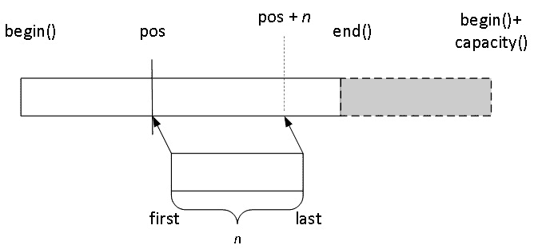

# 使用显式内存管理编写泛型容器

自我们从 C++内存管理机制和技术奥秘的旅程开始以来，我们已经走了很长的路。从 *第四章* 到 *第七章*，我们建立了一个有趣的工具箱，我们可以在此基础上构建，也可以从中适应以解决我们未来可能遇到的新问题。这个工具箱现在包含了许多其他东西，例如以下内容：

+   通过这些技术，对象隐式管理其资源

+   类似指针但将指向者的责任编码在类型系统中的类型

+   我们可以接管程序内存分配机制行为的各种方式

我们尚未涉及的一个（非常重要！）的内存管理方面是如何在容器中管理内存。这实际上是一个非常有趣的话题，我们将通过三个不同的角度，在三个不同的章节中探讨这个问题。

第一个角度是如何在容器中显式且高效地处理内存管理。这正是当前章节的内容。在某些应用领域，实现（或维护）自己的容器而不是使用标准库提供的容器是一种惯例。这样做可能有各种原因：例如，也许贵公司有高度专业化的需求。也许贵公司对标准库容器过去的性能不满意，可能是因为当时的实现没有达到预期的效率，因此开发了替代的容器。在基于自己的容器编写代码多年之后，回到标准库容器可能会显得成本过高。

第二个角度，相对较短，是如何在容器中隐式且高效地处理内存，将在本书的*第十三章*中介绍，我们将回顾并简化当前章节中看到的实现。

第三个角度，它更为复杂和微妙，是如何通过容器中的分配器来处理内存，并将构成本书的*第十四章*。

在当前章节中，我们将编写一个类似（天真）的 `std::vector<T>` 的名为 `Vector<T>` 的类。我们将利用这个机会来讨论异常安全性（一个重要的问题，尤其是在编写泛型代码时）。然后，我们会注意到，到目前为止，我们在效率上非常低，从某种程度上说，`std::vector<T>` 将比我们的 `Vector<T>` 替代品更有效率，至少对于某些类型来说是这样。基于这一认识，我们将重新审视我们的设计，以更好的内存管理，看到许多方面的重大改进，并讨论一些重要的低级标准内存管理设施，这些设施可以使我们的生活更容易。

我们还将编写一个名为 `ForwardList<T>` 的类似 `std::forward_list<T>` 的自定义版本，因为基于节点的容器存在一些特定的问题和考虑因素，而类似向量的类型实际上并不允许我们深入讨论。本章将编写一个“纯”版本的链表，我们将在*第十三章*中简要回顾它，然后在*第十四章*中更详细地讨论。

这意味着在阅读完本章之后，你将能够做到以下几件事情：

+   使用原始的内存管理技术编写正确且异常安全的容器

+   理解与 `const` 或引用数据成员相关的问题

+   使用标准提供的低级内存管理算法

更普遍地说，你将知道为什么 `std::vector<T>` 是如此之快，以及为什么在资源管理游戏中这个类型如此难以超越。你还将了解基于节点的容器（如 `std::forward_list<T>`）面临的挑战，尽管后面的章节将更深入地探讨这一点。但这并不意味着你不应该编写自己的容器（对于特定的用例，我们通常可以做得比通用解决方案更好），但这确实意味着你将更好地了解为什么（以及何时）这样做，以及你需要投入多少努力。

全面性或代表性

本书通常不追求全面的表现或实现（物理对象如书籍有大小限制！），本章也不例外……远非如此！实现受标准库启发的两种容器类型所提供的全部成员函数将使本书大幅增长——而且你的标准库实现涵盖了比本书所能展示的更多边缘情况（以及提供了更多酷炫的优化）。因此，我们将尝试展示一组核心成员函数，你可以从中构建，而不是试图编写每一个。

# 技术要求

你可以在本书的 GitHub 仓库中找到本章的代码文件：[`github.com/PacktPublishing/C-Plus-Plus-Memory-Management/tree/main/chapter12`](https://github.com/PacktPublishing/C-Plus-Plus-Memory-Management/tree/main/chapter12)。

# 编写自己的 vector<T> 替代方案

假设你有一天突然说：“嘿，我要在 `std::vector` 的领域打败它”并自信地开始编码。以下是一些建议：

+   这个看似简单的任务竟然如此难以完成：一方面，`std::vector` 是一件艺术品，另一方面，你的标准库编写者也是技艺高超的个人。

+   你可能仍然认为你可以做到，所以尝试一下是完全可以的，但请确保用两种类型的元素测试你的想法：一种是 trivially constructible（例如，`int`或`double`），另一种不是（例如，`std::string`），并比较结果。对于许多人来说，前者将导致出色的性能，但后者可能会带来……悲伤。

+   这种差异的原因在于，像`std::vector`这样的容器在管理内存方面非常高效（我知道，在这本书中读到这一点肯定相当令人震惊！）。实际上，它比自制的替代品要好得多，除非你投入大量的时间和精力，并且（很可能是）有一个特定的用例在心中，对于这个用例，自制的版本会被更具体地优化。

你的标准库供应商确实投入了这样的时间和精力，这样做是为了你的利益，因此，学习如何最优地使用`std::vector`可能最终会是一条比尝试编写你自己的等效容器带来更好结果的道路。当然，最终，使用哪个容器取决于你，你通常可以为特定情况编写代码，其性能优于标准容器的通用解决方案。

关于我们将如何编写我们的容器的通用说明

我们将在本章和随后的章节中编写（并使用）容器，因此如果我们要对我们将如何进行有一个共同的理解，就需要简要解释。首先，我们将在容器中使用与标准容器中使用的类型别名相匹配的类型别名，因为这有助于在其他标准库工具（如标准算法）中实现更流畅的集成。然后，我们将努力使用与标准库中相同的公共名称来命名我们的成员函数（例如，我们将编写`empty()`来测试容器是否为空或不是，这与标准库中的现有实践相匹配，尽管有些人可能会认为`is_empty()`更可取）。最后，我们将采用逐步改进的方法：我们的第一个版本将比后来的版本简单但效率较低，所以耐心点，亲爱的读者：我们正在遵循自己的道路走向启迪！

## 连续元素容器的表示选择

非正式地说，`std::vector`代表一个动态分配的数组，可以根据需要增长。与任何数组一样，`std::vector<T>`是内存中连续排列的`T`类型元素的序列。我们将我们的自制版本命名为`Vector<T>`，以便使其与`std::vector<T>`在视觉上明显区分开来。

要获得一个性能合理的实现，第一个关键思想是*区分大小和容量*。如果我们不这样做，决定将大小和容量视为同一件事，我们的`Vector<T>`实现将始终在概念上处于满载状态，并且需要增长，这意味着分配更多内存，将元素从旧存储复制到新存储，丢弃旧存储，等等，每次插入单个元素都需要这样做。说这样的实现会痛苦似乎是一个严重的低估。

向量类类型的内部表示主要有两种方法。一种方法是跟踪三个指针：

+   指向分配存储的开始

+   指向元素末尾

+   指向分配存储的末尾（注意，我们在这里指的是半开区间，包括开始但不包括结束）

简化的说明如下：

```cpp
template <class T>
   class Vector {
      T *elems;
      T *end_elems;
      T *end_storage;
      // ...
```

另一个方法是保留对分配存储开始的指针，以及两个整数（分别用于容器的尺寸和容量）。在这种情况下，一个简化的说明如下：

```cpp
template <class T>
   class Vector {
      T *elems;
      std:size_t nelems; // number of elements
      std::size_t cap; // capacity
      // ...
```

在这个意义上，这些是等效的表示，因为它们都允许我们编写正确的容器，但它们带来了不同的权衡。例如，保留三个指针使得计算`end()`迭代器变得快速，但使得`size()`和`capacity()`需要计算指针减法，而保留一个指针和两个整数使得`size()`和`capacity()`都快速，但需要计算指针和整数的加法来获取`end()`迭代器。

就大小而言，三指针表示使得`sizeof(Vector<T>)`等于`3*sizeof(void*)`，因此在 64 位平台上，对齐为 8 的情况下，可能是 24 字节。指针和两个整数可能具有相同的大小，也可能根据使用的整数类型略有不同。例如，在 64 位机器上选择 32 位整数作为大小和容量将导致 16 字节的表示和对齐为 8。这些细节可能在资源受限的系统上有所区别，但正如你可能已经推断出的那样，`Vector<T>`等事物的主要内存消耗成本来自为`T`对象分配的内存。

由于大小考虑、对哪些成员函数平均调用频率的估计等因素，不同的实现将做出不同的表示选择。我们也将需要做出选择；在这本书中，我们将选择“一个指针和两个整数”的方法，但请记住，这只是几个合理选项之一（你甚至可以玩一下这个想法，通过其他表示选择来实现以下内容，看看这会把你引向何方！）。

## `Vector<T>`的实现

我们将逐步分析我们的初始（天真）`Vector<T>`实现，逐步了解这一切是如何工作的，以及是什么让我们声称这个实现确实是天真的。我们的第一步已经基本完成，主要是通过定义我们的抽象，通过符合标准库的类型别名和选择我们的内部表示：

```cpp
#include <cstddef>
#include <algorithm>
#include <utility>
#include <initializer_list>
#include <iterator>
#include <type_traits>
template <class T>
   class Vector {
   public:
      using value_type = T;
      using size_type = std::size_t;
      using pointer = T*;
      using const_pointer = const T*;
      using reference = T&;
      using const_reference = const T&;
   private:
      pointer elems{};
      size_type nelems{},
                cap{};
      // ...
```

你会注意到这种实现选择了为`Vector<T>`的三个数据成员使用非`static`数据成员初始化器，并将它们初始化为其默认值（整数是 0，指针是 null），这在我们的实现中是合适的，因为它代表了一个空的容器，这似乎是一个默认`Vector<T>`的合理状态。

一些简单但基本的成员函数随后而来：

```cpp
   // ...
   public:
      size_type size() const { return nelems; }
      size_type capacity() const { return cap; }
      bool empty() const { return size() == 0; }
   private:
      bool full() const { return size() == capacity(); }
   // ...
```

注意`empty()`和`full()`的实现。有些人可能会在实现成员函数时内部访问数据成员（在这里：使用`nelems`和`cap`而不是`size()`和`capacity()`），但考虑重用你更基本的成员函数来实现更“合成”的函数。这将使你的代码对实现的变化不那么敏感，并且 C++编译器非常擅长函数内联，尤其是当这些函数是非`virtual`时。

到目前为止，我们可能能设计出的最有用的成员集可能是我们类的迭代器类型和数据成员，因为这将帮助我们使用标准算法干净且高效地实现其余的成员函数。

### 迭代器

C++容器通常将其接口的一部分暴露为迭代器，我们的也不例外。我们将为`const`和非`const`迭代器类型定义类型别名，因为这使实现如界限检查迭代器等替代方案变得简单，如果我们觉得需要这样做，并实现`begin()`和`end()`成员函数的`const`和非`const`版本：

```cpp
      // ...
   public:
      using iterator = pointer;
      using const_iterator = const_pointer;
      iterator begin() { return elems; }
      const_iterator begin() const { return elems; }
      iterator end() { return begin() + size(); }
      const_iterator end() const {
         return begin() + size();
      }
      // for users' convenience
      const_iterator cend() const { return end(); }
      const_iterator cbegin() const { return begin(); }
      // ...
```

你可能会对为`begin()`和`end()`编写的`const`和非`const`版本带来的语法重复表示不满，因为它们在语法上相似，但在语义上不同。如果你手头有 C++23 编译器，你可以通过方便的“推导`this`”功能来简化这一点：

```cpp
      // alternative approach (requires C++23)
      template <class S>
         auto begin(this S && self) { return self.elems; }
      template <class S>
         auto end(this S && self) {
            return self.begin() + self.size();
         }
```

这是一种稍微复杂的方式来表达这些函数，但它通过利用类型推导系统通过转发引用将`begin()`和`end()`的两个版本合并为一个。

### 构造函数和其他特殊成员函数

现在我们来看看构造函数。我们将首先查看的是默认构造函数和一个参数化构造函数，它接受元素数量和一个初始值作为参数，这样`Vector<char>(3,'a')`就产生了一个包含三个值为`'a'`的元素的容器。请注意，在这种情况下，`default`默认构造函数（是的，我知道）是隐式`constexpr`的，因为所有非`static`成员初始化器都可以在`constexpr`上下文中解析：

```cpp
      // ...
      Vector() = default;
      Vector(size_type n, const_reference init)
         : elems{ new value_type[n] },
           nelems{ n }, cap{ n } {
         try {
            std::fill(begin(), end(), init);
         } catch(...) {
            delete [] elems;
            throw;
         }
      }
      // ...
```

请注意在这个构造函数中的异常处理代码，因为它会反复出现。我们正在编写一个通用容器，因此我们使用了一些我们事先不知道的类型 `T`。当调用 `std::fill()`，将 `init` 参数的值赋给序列中每个 `T` 对象时，我们正在将一个 `T` 值赋给一个 `T` 对象，但我们不知道那个赋值操作符是否可以抛出异常。

我们的职责是 `elems`，一个动态分配的 `T` 类型的数组，所以如果其中一个赋值操作符抛出异常，我们需要确保在 `Vector<T>` 构造函数失败之前，该数组被销毁并释放；否则，我们将泄漏内存，甚至更糟的是，我们在这个数组中构造的对象将不会被最终化。`catch(...)` 块意味着“捕获任何东西”，实际上并不真正知道在这种情况下你捕获了什么，而 `throw;` 表达式意味着“重新抛出你所捕获的任何东西”。确实，我们不想在这种情况下处理异常（我们没有足够的执行上下文知识来这样做：这是一个控制台应用程序？一个图形应用程序？一个嵌入式系统？其他什么？）；我们只想确保我们未能构造 `Vector<T>` 对象没有泄漏资源，并让用户代码确切地知道为什么我们的构造函数未能满足其后置条件（未能构造一个有效的对象）。

复制构造函数将遵循类似的模式，除了不是用单个值的副本填充序列，而是从源序列（`other`）复制值到目标序列（`*this` 或 `elems`，取决于你如何看待它）。移动构造函数当然大不相同：

```cpp
      // ...
      Vector(const Vector &other)
         : elems{ new value_type[other.size()] },
           nelems{ other.size() }, cap{ other.size() } {
         try {
            std::copy(other.begin(), other.end(), begin());
         } catch(...) {
            delete [] elems;
            throw;
         }
      }
      // ...
      Vector(Vector &&other) noexcept
         : elems{ std::exchange(other.elems, nullptr) },
           nelems{ std::exchange(other.nelems, 0) },
           cap{ std::exchange(other.cap, 0) } {
      }
      // ...
```

如您所见，对于这种类型，复制构造函数是一个昂贵的家伙：为 `other.size()` 个对象进行分配（对于非平凡构造的对象，伴随着对类型 `T` 的默认构造函数的多次调用），然后进行 `other.size()` 次赋值，以及抛入异常处理。

移动构造函数更简单：它是一个常数时间的 `noexcept` 函数。在大多数类中，技术上不需要移动操作（毕竟，C++ 没有移动操作也能良好地运行多年），但当你能利用它们时，你很可能应该这样做。速度提升可能是惊人的，执行速度变得更加可预测。

关于价值和显著特性

如果你仔细阅读复制构造函数的代码，可能会注意到`*this`没有复制`other.capacity()`，而是决定让`cap`成为`other.size()`的副本。实际上，在这种情况下这样做是正确的：容器的大小（即所谓的`capacity()`）更多的是该对象生命周期的产物，显示了它随时间增长的过程。我们想要的是，在复制一个对象之后，原始对象和副本在`operator==`运算符下比较相等，当然，`capacity()`函数不会干预这个功能：两个数组通常被认为相等，如果它们有相同数量的元素，并且当与另一个容器中的对应元素比较时，每个元素都有相同的值。在实际情况中复制容量是可行的，但对于大多数用例来说，这将是浪费的。

我添加了一个构造函数，它接受一个`initializer_list<T>`参数，以便用类型为`T`的值的序列初始化`Vector<T>`对象。析构函数应该是自解释的：

```cpp
      // ...
      Vector(std::initializer_list<T> src)
         : elems{ new value_type[src.size()] },
           nelems {src.size() }, cap{ src.size() } {
         try {
            std::copy(src.begin(), src.end(), begin());
         } catch(...) {
            delete [] elems;
            throw;
         }
      }
      // ...
      ~Vector() {
         delete [] elems;
      }
```

如果以……无纪律的方式实现从源对象（这里：`other`）到目标对象（`*this`）的复制赋值运算符，可能会很复杂，因为它涉及到清理代码（`*this`在赋值之前的内容）、复制源对象的状态，并确保我们正确处理自赋值和复制源对象状态时可能抛出的异常。

幸运的是，Scott Meyers（以及无数其他人）提出的一个巧妙技巧解决了这个问题，他注意到复制赋值可以表达为复制构造函数（对象复制的焦点）、析构函数（清理发生的地方）和`swap()`成员函数的组合：你只需将参数复制到一个匿名对象中（以使它的生命周期最小），然后交换那个未命名的临时对象的状态与`*this`的状态，从而使得`*this`成为`other`的副本。这种编程习惯几乎总是有效的，这也解释了它的成功！

移动赋值可以像复制赋值一样表达，但在赋值运算符的实现中，用移动构造函数替换复制构造函数：

```cpp
      // ...
      void swap(Vector &other) noexcept {
         using std::swap;
         swap(elems, other.elems);
         swap(nelems, other.nelems);
         swap(cap, other.cap);
      }
      Vector& operator=(const Vector &other) {
         Vector{ other }.swap(*this);
         return *this;
      }
      Vector& operator=(Vector &&other) {
         Vector{ std::move(other) }.swap(*this);
         return *this;
      }
      // ...
```

### 类似向量的类的基本服务

我们现在已经实现了处理`Vector<T>`对象内部表示的特殊成员函数，但编写一个方便的动态数组类型还有更多的工作要做。例如，成员函数允许你访问`first()`元素，或者最后一个（`back()`）元素，或者允许你通过方括号访问数组中的特定索引的元素（这些都是预期的）：

```cpp
      // ...
      reference operator[](size_type n) {
         return elems[n];
      }
      const_reference operator[](size_type n) const {
         return elems[n];
      }
      // precondition: !empty()
      reference front() { return (*this)[0]; }
      const_reference front() const { return (*this)[0]; }
      reference back() { return (*this)[size() - 1]; }
      const_reference back() const {
         return (*this)[size() - 1];
      }
      // ...
```

如预期的那样，在空的`Vector<T>`上调用`front()`或`back()`是未定义的行为（如果你愿意，你可以让这些函数抛出异常，但这样所有人都要为那些可能只在不那么`this`的功能中表现不佳的少数程序付出代价）：

```cpp
      // alternative approach, (requires C++23)
      // ...
      template <class S>
         decltype(auto) operator[](this S && self,
                                   size_type n) {
            return self.elems[n];
         }
      // precondition: !empty()
      template <class S>
         decltype(auto) front(this S &&self) {
            return self[0];
         }
      template <class S>
         decltype(auto) back(this S &&self) {
            return self[self.size()-1];
         }
      // ...
```

一些开发者可能会想在 `const` 和非 `const` 形式下都添加一个 `at()` 成员函数，它的行为类似于 `operator[]`，但如果尝试访问底层数组越界则抛出异常。如果你愿意，可以这样做。

比较两个 `Vector<T>` 对象是否相等或不相等，如果我们使用算法，并且为我们的类型实现了迭代器，那么这是一个相对简单的问题：

```cpp
      // ...
      bool operator==(const Vector &other) const {
         return size() == other.size() &&
                std::equal(begin(), end(), other.begin());
      }
      // can be omitted since C++20 (synthesized by
      // the compiler through operator==())
      bool operator!=(const Vector &other) const {
         return !(*this == other);
      }
      // ...
```

最后，你可能会说，我们达到了讨论内存管理的书籍中最吸引我们的点：如何向我们的容器中添加元素，以及底层内存是如何管理的。在不逐一介绍客户端代码可能使用的向 `Vector<T>` 对象添加元素的所有机制的情况下，我们至少会检查 `push_back()` 和 `emplace_back()` 成员函数：

+   在这个版本中，将有两个 `push_back()` 成员函数：一个接受 `const T&` 作为参数，另一个接受 `T&&`。接受 `const T&` 参数的那个函数将在容器的末尾复制该参数，而接受 `T&&` 的那个函数将移动它到那个位置。

+   `emplace_back()` 成员函数将接受一个可变参数包，然后将它们完美地转发到将被放置在容器末尾的 `T` 对象的构造函数中。

+   `emplace_back()` 通过返回对新构造对象的引用来提供便利，以防用户代码希望立即使用它。这不是通过 `push_back()` 实现的，`push_back()` 是用一个已经完全构造的对象调用的，用户代码已经可以访问它。

在所有三个函数中，我们首先检查容器是否已满，如果是，则调用 `grow()`，这是一个私有成员函数。`grow()` 函数需要分配比容器当前持有的更多内存，这当然可能会失败。注意，如果 `grow()` 抛出异常，则新对象的添加从未发生，容器保持完整。注意，`grow()` 考虑了 `capacity()` 的值为 `0` 的可能性，在这种情况下，将选择任意默认容量。

一旦 `grow()` 成功，我们就在容器的存储中添加新元素到最后的对象之后。注意，值是通过赋值添加的，这意味着赋值操作左侧的对象，意味着 `grow()` 不仅添加了存储，还用（很可能是）类型 `T` 的默认对象初始化了它。因此，我们可以推断，在这个 `Vector<T>` 的实现中，类型 `T` 需要公开一个默认构造函数：

```cpp
      // ...
      void push_back(const_reference val) {
         if(full())
            grow();
         elems[size()] = val;
         ++nelems;
      }
      void push_back(T &&val) {
         if(full())
            grow();
         elems[size()] = std::move(val);
         ++nelems;
      }
   template <class ... Args>
      reference emplace_back(Args &&...args) {
         if (full())
            grow();
         elems[size()] =
            value_type(std::forward<Args>(args)...);
         ++nelems;
         return back();
      }
   private:
      void grow() {
         resize(capacity()? capacity() * 2 : 16);
      }
   // ...
```

注意，`push_back()` 和 `emplace_back()` 中的插入代码在两种情况下都执行以下操作：

```cpp
elems[size()] = // the object to insert
++nelems;
```

你可能会想将元素数量的增加和实际的插入表达式合并为一个，如下所示：

```cpp
elems[nelems++] = // the object to insert
```

然而，不要这样做。“你为什么阻止我？”你可能会问。嗯，这会导致异常不安全的代码！原因在于 `operator++()` 的后缀版本有很高的（非常高！）优先级，*远高于*赋值。这意味着在组合表达式中，`nelems++` 发生得非常早（这可能会被忽视，因为那个表达式返回 `nelems` 的旧值），而赋值发生在稍后，但赋值可能会抛出异常：我们正在将类型 `T` 的对象赋值给另一个相同类型的对象，我们不知道 `T::operator=(const T&)` 是否会抛出异常。当然，如果它抛出了异常，赋值就不会发生，并且容器末尾不会添加任何对象；但元素的数量会增加，导致一个不一致的 `Vector<T>` 对象。

这里有一个通用的技巧：在你知道可以安全修改之前不要修改你的对象。尽量先执行可能抛出异常的操作，然后执行可以修改你的对象的操作。这样你会睡得更好，并且对象损坏的风险会得到一定程度的缓解。

我们的 `grow()` 成员函数通过调用 `resize()` 并将容器的容量加倍（除非该容量为 0，在这种情况下它选择一个默认容量）来完成其工作。`resize()` 是如何工作的？在我们的实现中，这只是一个分配足够内存来覆盖新容量需求的问题，然后将对象从旧内存块复制或移动到新内存块，然后替换旧内存块并更新容量。

我们如何知道应该移动还是复制对象？嗯，由于移动可能会破坏原始对象，我们只有在 `T::operator=(T&&)` 明确为 `noexcept` 的情况下才会这样做。`std::is_nothrow_move_assignable<T>` 特性是我们用来确定这一点（如果它不是，那么我们复制对象，这是安全的选择，因为它保留了原始对象）的工具：

```cpp
  // ...
  public:
     void resize(size_type new_cap) {
        if (new_cap <= capacity()) return;
        auto p = new T[new_cap];
        if constexpr(std::is_nothrow_move_assignable_v<T>){
           std::move(begin(), end(), p);
        } else try {
           std::copy(begin(), end(), p);
        } catch (...) {
           delete[] p;
           throw;
        }
        delete[] elems;
        elems = p;
        cap = new_cap;
     }
     // ...
```

好吧，我同意这并不是简单的代码，但它也不是不可逾越的。记住，这仅仅是我们第一次草稿，并且对于大量类型来说，它将比 `std::vector<T>` 慢得多。

我们应该解决的这个容器的最后一个方面是如何向其中 `insert()` 元素以及如何从其中 `erase()` 元素。在工业级容器，如标准库中找到的容器，有一系列函数来执行这两个任务，所以我们将限制自己只做每个任务中的一个：在容器的指定位置插入一系列值，以及从容器的指定位置删除一个元素。

我们的`insert()`成员函数将是一个模板，它接受一对源迭代器，命名为`first`和`last`，以及一个名为`pos`的`const_iterator`，它表示`Vector<T>`对象内的一个位置。将其作为模板意味着我们可以使用任何容器的迭代器对作为插入值的来源，这确实是一个有用的特性。

在函数内部，我们将使用`pos`的非`const`等价物，命名为`pos_`，但这仅仅是因为我们正在编写一个简化和不完整的容器，其中许多本应在`const_iterator`对象上工作的成员函数缺失。

为了执行插入，我们将计算`remaining`，这是容器中可用的空间（以对象数量表示），以及`n`，它将是插入的对象数量。如果剩余空间不足，我们将通过我们的`resize()`成员函数分配更多空间。当然，调用`resize()`可能会导致`pos_`变得无效（它指向旧的内存块，一旦`resize()`完成任务，它将被另一个块替换），因此我们在调整大小之前会计算容器中的相对`index`，并在调整大小后在新的内存块中重新计算`pos_`的等价物。

插入过程中的一个有趣转折是，在执行`pos_`位置插入`n`个对象之前，我们希望将`pos_`到`end()`处的对象复制（或移动，但在这里我们将保持简单）到`end()+n`的位置，但如果我们想避免在复制过程中覆盖一些我们试图复制的对象，那么这个复制必须**向后**（从最后一个到第一个）进行。`std::copy_backward()`算法就是这样表达的：第三个参数表示复制的目标停止的位置，而不是开始的位置。

只有在这种情况下，我们才会复制由`first`和`last`确定的序列到`pos_`位置，更新`Vector<T>`对象中的元素数量，并返回标准所要求的（指向第一个插入元素的迭代器，或者在`first==last`的情况下返回`pos`，这意味着它们确定了一个空序列）：

```cpp
   template <class It>
   iterator insert(const_iterator pos, It first, It last) {
      iterator pos_ = const_cast<iterator>(pos);
      // deliberate usage of unsigned integrals
      const std::size_t remaining = capacity() - size();
      const std::size_t n = std::distance(first, last);
      if (remaining < n) {
         auto index = std::distance(begin(), pos_);
         resize(capacity() + n - remaining);
         pos_ = std::next(begin(), index);
      }
      std::copy_backward(pos_, end(), end() + n);
      std::copy(first, last, pos_);
      nelems += n;
      return pos_;
   }
```

我们的`erase()`成员函数将接受一个名为`pos`的`const_iterator`参数，表示要从`Vector<T>`对象中删除的元素的位置。我们再次求助于在函数内部使用一个名为`pos_`的非`const`迭代器的技巧。删除`end()`是一个无操作（正如它应该的那样）；否则，我们将从`next(pos_)`到`end()`进行线性复制到以`pos_`开始的地址，有效地用其直接后继替换从该点开始的所有元素。

最后，我们将最后一个元素替换为某个默认值，这可能看起来不是必要的，但实际上是必要的，因为末尾的 `T` 对象可能正在持有需要释放的资源。例如，在一个使用 `Vector<Res>` 对象的程序中，其中 `Res` 是一个 RAII 类型，在析构时释放资源，如果不替换“位于末尾之后”的对象，可能会导致相关的资源仅在 `Vector` 对象被销毁时关闭，这可能会比客户端代码预期的晚得多。

然后我们更新 `Vector<T>` 对象中的元素数量。再次强调，这种实现意味着我们要求 `T` 提供一个默认构造函数，这并不是根本必要的（我们将在本章后面减轻这一要求）：

```cpp
   iterator erase(const_iterator pos) {
      iterator pos_ = const_cast<iterator>(pos);
      if (pos_ == end()) return pos_;
      std::copy(std::next(pos_), end(), pos_);
      *std::prev(end()) = {};
      --nelems;
      return pos_;
   }
```

我相信您一定在想我们如何做得更好，但我们会很快回到这个问题。在此期间，我们将研究如何实现一个基于节点的容器（类似于自制的 `std::forward_list<T>` 类型）。

# 编写自己的 `forward_list<T>` 替代方案

编写类似于 `std::list`、`std::unordered_map`、`std::map` 等基于节点的容器是一个有趣的练习，但在这个章节中，它有趣的事实并不一定会立即“闪耀”。这类类的兴趣点将在第十三章和第十四章中更为明显，但我们将仍然编写一个基本、简化的版本，以便在接下来的页面和章节中更清晰地展示我们的容器类型的发展。 

前向列表是一种对精简的练习。我们希望类型尽可能小，并且能很好地完成其功能。一些前向列表在内存中只占用单个指针的大小（指向序列中第一个节点的指针）；在我们的实现中，我们将为额外的整数（元素数量）付出代价，以获得 `size()` 成员函数的常数时间复杂度保证。

## 基于节点的容器的表示选择

在我们的实现中，`ForwardList<T>` 将持有节点，每个节点将包含一个由值（类型为 `T`）和指向序列中下一个节点的指针组成的对。最后一个节点将具有空指针作为 `next` 节点。

`ForwardList<T>` 对象的表示将是一个 `Node*` 和一个无符号整数（表示列表中的元素数量）。我们的实现将非常简单，并展示一组小的成员函数。您可以随意扩展它，只要您限制自己只编写高效可写的函数。

## `ForwardList<T>` 的实现

就像我们对 `Vector<T>` 所做的那样，我们将逐步分析我们的初始（天真）`ForwardList<T>` 实现。我们的第一步是通过标准库符合的类型别名定义我们的抽象，并选择我们的内部表示，这通常是容器的情况：

```cpp
#include <cstddef>
#include <algorithm>
#include <utility>
#include <iterator>
#include <initializer_list>
#include <concepts>
template <class T>
class ForwardList {
public:
   using value_type = T;
   using size_type = std::size_t;
   using pointer = T*;
   using const_pointer = const T*;
   using reference = T&;
   using const_reference = const T&;
   // ...
```

如前所述，`ForwardList<T>::Node`对象将持有值和指向序列中下一个节点的指针。最初，下一个节点始终是一个空指针；组织节点是列表的责任，节点本身负责存储的值的所有权：

```cpp
   // ...
private:
   struct Node {
      value_type value;
      Node *next = nullptr;
      Node(const_reference value) : value { value } {
      }
      Node(value_type &&value)
         : value { std::move(value) } {
      }
   };
   Node *head {};
   size_type nelems {};
   // ...
```

`ForwardList<T>`对象的默认状态将与空列表（`head`为空指针且没有元素）相当。这对于大多数容器来说是一个合理的默认值，因为用户在实际中请求默认构造函数时通常期望一个空容器。

`size()`和`empty()`成员函数都很容易编写。我使用空头而不是零`size()`来表达`empty()`，因为在某些（合理的）`ForwardList`实现中，大小会被计算而不是存储，这将使`size()`成为一个线性复杂度的操作而不是常数时间的操作。在实践中，公开一个常数时间的`size()`成员函数是一个好主意，因为它符合大多数用户的期望：

```cpp
   // ...
public:
   size_type size() const { return nelems; }
   bool empty() const { return !head; }
   // ...
```

链表上的迭代器不能是原始指针，因为它存储的元素在内存中不是连续的。我们需要一个类，其实例可以遍历列表中的元素，并且可以考虑到元素的`const`属性（或缺乏该属性）。

我们的（私有）`ForwardList<T>::Iterator`类将是一个模板，其类型为`U`，其中（在实践中）`U`对于`ForwardList<T>::iterator`将是`T`，对于`ForwardList<T>::const_iterator`将是`const T`。

C++中的标准迭代器预期提供五个别名：

+   `value_type`：被指向值的类型。

+   `reference`：表示指向被指向值的引用的类型。

+   `pointer`：表示指向被指向值的指针的类型。

+   `difference_type`：表示此类型两个迭代器之间距离的类型（一个有符号整数）。

+   `iterator_category`：截至 C++20，有六个类别，它们通过描述迭代器可以做什么来指导代码生成。在我们的情况下，因为我们将提供`++`但不提供`--`，我们将我们的迭代器描述为`forward_iterator_category`的一部分。

迭代器是一个描述我们如何遍历值序列的对象，`ForwardList<T>::Iterator`也不例外。迭代器暴露的关键操作可能是`operator++()`（在序列中前进一个位置）、`operator!=()`（比较两个迭代器以确定我们是否到达了序列的末尾），以及`operator*()`和`operator->()`（访问被指向的元素或其服务）。请注意，我们将`ForwardList<T>`作为友元，因为这个类将负责节点的组织，当您对私有数据成员（如`cur`）具有完全访问权限时，这会更容易完成：

```cpp
   // ...
private:
   template <class U> class Iterator {
   public:
      using value_type =
         typename ForwardList<T>::value_type;
      using pointer = typename ForwardList<T>::pointer;
      using reference = typename ForwardList<T>::reference;
      using difference_type = std::ptrdiff_t;
      using iterator_category =
         std::forward_iterator_tag;
      friend class ForwardList<T>;
   private:
      Node *cur {};
   public:
      Iterator() = default;
      Iterator(Node *p) : cur { p } {
      }
      Iterator& operator++() {
         cur = cur->next;
         return *this;
      }
      Iterator operator++(int) {
         auto temp = *this;
         operator++();
         return temp;
      }
      bool operator==(const Iterator &other) const {
         return cur == other.cur;
      }
      // not needed since C++20
      bool operator!=(const Iterator &other) const {
         return !(*this == other);
      }
      U& operator*() { return cur->value; }
      const U& operator*() const { return cur->value; }
      U* operator->() { return cur->value; }
      const U* operator->() const { return cur->value; }
   };
public:
   using iterator = Iterator<T>;
   using const_iterator = Iterator<const T>;
   // ...
```

之前提出的实现使用了一个基于元素类型 `U` 的模板，这些元素可以被 `Iterator<U>` 遍历。我们使用 `U` 而不是 `T`，因为 `T` 是 `ForwardList<T>` 对象中值的类型。在 `ForwardList<T>` 中，我们通过 `iterator` 和 `const_iterator` 分别为 `Iterator<T>` 和 `Iterator<const T>` 类型创建别名。如果我们更喜欢那种方法，我们也可以编写两个不同的类型，但模板似乎更简洁。

`begin()` 和 `end()` 成员函数集实际上非常简单；`begin()` 返回列表的头部迭代器，而 `end()` 返回的“概念上位于末尾”的节点是一个空指针，这正是我们的 `Iterator<U>` 的默认构造函数所提供的：

```cpp
   // ...
   iterator begin() { return { head }; }
   const_iterator begin() const { return { head }; }
   const_iterator cbegin() const { return begin(); }
   iterator end() { return {}; }
   const_iterator end() const { return {}; }
   const_iterator cend() const { return end(); }
   // ...
```

我们有时需要清除 `ForwardList<T>` 对象，这将导致我们销毁该容器的内容。在这个实现中，为了简单起见，我让析构函数调用 `clear()` 成员函数，但我们可以通过单独编写析构函数来节省一点处理时间（`nelems` 的重新初始化，在析构函数中不需要）：

```cpp
   // ...
   void clear() noexcept {
      for(auto p = head; p; ) {
         auto q = p->next;
         delete p;
         p = q;
      }
      nelems = 0;
   }
   ~ForwardList() {
      clear();
   }
   // ...
```

可能会让人感到诱惑的事情是编写一个 `Node` 析构函数，它会对它的 `next` 数据成员应用 `delete`；如果我们这样做，`clear()` 将会简单地是 `delete head;`（这将调用 `delete head->next` 并从该点递归地继续）然后是 `nelems=0;`。然而，如果我是你，我不会这样做：原则上，`ForwardList<T>` 对象应该组织 `ForwardList<T>` 中的节点，而这个责任不应该交给众多的 `Node` 对象本身。然后，还有一个小的技术问题：调用 `delete head;` 将会调用 `delete head->next;`，然后技术上会调用 `delete` 在 `head->next->next;` 上，依此类推。如果列表足够长，这会导致非常具体的栈溢出风险，而循环可以完全避免这种情况。

这里有一个简单的教训：当每个类都有一个单一责任时，生活会更简单。这已经有一段时间被知道为“单一责任原则”。这个原则是众所周知的面向对象编程 SOLID 原则中的 'S'。让容器处理基于节点的容器中的节点组织，并让节点存储值。

就构造函数而言，我们将为这个类实现一个小集合：

+   一个模拟空列表的默认构造函数

+   一个接受 `std::initializer_list<T>` 作为参数的构造函数

+   一个复制构造函数，它按顺序从源列表复制每个节点

+   一个移动构造函数

+   一个接受满足 `std::input_iterator` 概念的某些类型 `It` 的两个对象的序列构造函数（本质上：允许你至少遍历一次序列并消费元素，这是我们完成工作所需的所有）

事实上，这个最后的构造函数可以被看作是对其他一些构造函数的泛化，并且只有默认构造函数和移动构造函数真正从单独编写中受益（如果我们不将工作委托给一个通用构造函数，我们可以更有效地计算序列的大小，所以如果这在你的代码库中有所区别，请随意这样做）：

```cpp
   // ...
   ForwardList() = default;
   template <std::input_iterator It>
      ForwardList(It b, It e) {
         if(b == e) return;
         try {
            head = new Node{ *b };
            auto q = head;
            ++nelems;
            for(++b; b != e; ++b) {
               q->next = new Node{ *b };
               q = q->next;
               ++nelems;
            }
         } catch (...) {
            clear();
            throw;
         }
      }
   ForwardList(const ForwardList& other)
      : ForwardList(other.begin(), other.end()) {
   }
   ForwardList(std::initializer_list<T> other)
      : ForwardList(other.begin(), other.end()) {
   }
   ForwardList(ForwardList&& other) noexcept
      : head{ std::exchange(other.head, nullptr) },
        nelems{ std::exchange(other.nelems, 0) } {
   }
   // ...
```

毫不奇怪，赋值可以通过我们在之前 `Vector<T>` 类型案例中应用的安全赋值习语来表示：

```cpp
   // ...
   void swap(ForwardList& other) noexcept {
      using std::swap;
      swap(head, other.head);
      swap(nelems, other.nelems);
   }
   ForwardList& operator=(const ForwardList& other) {
      ForwardList{ other }.swap(*this);
      return *this;
   }
   ForwardList& operator=(ForwardList&& other) {
      ForwardList{ std::move(other) }.swap(*this);
      return *this;
   }
   // ...
```

一些剩余的操作可以合理地被认为是微不足道的，例如，`front()`、`operator==()` 和 `push_front()`。正如你可以合理地假设对于前向列表，我们不会实现 `back()` 或 `push_back()` 成员函数，因为我们没有有效的算法来完成我们的表示选择（唯一合理的算法需要遍历整个结构以找到最后一个节点，从而导致线性复杂度的算法）：

```cpp
   // ...
   // precondition: !empty()
   reference front() { return head->value; }
   const_reference front() const { return head->value; }
   bool operator==(const ForwardList &other) const {
      return size() == other.size() &&
             std::equal(begin(), end(), other.begin());
   }
   // can be omitted since C++20
   bool operator!=(const ForwardList &other) const {
      return !(*this == other);
   }
   void push_front(const_reference val) {
      auto p = new Node{ val };
      p->next = head;
      head = p;
      ++nelems;
   }
   void push_front(T&& val) {
      auto p = new Node{ std::move(val) };
      p->next = head;
      head = p;
      ++nelems;
   }
   // ...
```

作为将值插入容器的一个例子，考虑以下 `insert_after()` 成员函数，该函数在由 `pos` 指向的节点之后插入一个值为 `value` 的节点。使用此函数，我们可以轻松构建更复杂的函数，例如在列表中的某个位置之后插入一系列值的函数（试试看！）：

```cpp
   // ...
   iterator insert_after
      (iterator pos, const_reference value) {
      auto p = new Node{ value };
      p->next = pos.cur->next;
      pos.cur->next = p;
      ++nelems;
      return { p };
   }
   // ...
```

提供向容器中添加元素的可能性确实是一个有用的功能，同样，提供从容器中删除元素的选择也是。例如，请参见以下 `erase_after()` 成员函数的实现：

```cpp
   // ...
   iterator erase_after(iterator pos) {
      if (pos == end() || std::next(pos) == end())
         return end();
      auto p = pos.cur->next->next;
      delete pos.cur->next;
      pos.cur->next = p;
      return { p->next };
   }
};
```

这应该就足够了这个类。在本章的其余部分，对于 `ForwardList<T>` 来说，改进的空间很小，但我们将回到这个类，特别是在 *第十三章*，以及更详细的 *第十四章*。

然而，对于 `Vector<T>`，我们可以做得比迄今为止更好……但这需要一些额外的复杂性。但我们准备好了，不是吗？

# 更好的内存管理

因此，这位谦逊的作者声称我们优雅但简单的 `Vector<T>` 类型与 `std::vector<T>` 无法匹敌。这听起来可能是一个大胆的声明：毕竟，我们似乎已经完成了所需的工作，而且，我们不仅使用了算法而不是原始循环；我们还捕获了异常，因为我们希望异常安全，但仅限于清理资源……我们做错了什么？

如果你在一个 `Vector<int>` 对象和一个 `std::vector<int>` 对象之间运行比较基准测试，实际上，你可能会在两个测试的相应数字之间发现不了太大的差异。例如，尝试向每个这些容器中添加一百万个 `int` 对象（通过 `push_back()`），你会认为我们的容器表现得很不错。酷！现在，将其改为 `Vector<std::string>` 和 `std::vector<std::string>` 之间的比较测试，你可能会有些失望，因为我们“落后在尘埃中”，正如他们所说。

关于小对象优化的一词

如果你添加的不是太短的字符串（至少 25 个字符，比如），这将显示更多，因为对于某些不确定的“短”字符串值，大多数标准库都会执行所谓的**小字符串优化**（**SSO**），这是**小对象优化**（**SOO**）的一个特例。通过这种优化，当存储在对象中的数据足够小的时候，实现将使用所谓的“控制块”（实际上是数据成员）的存储作为原始存储，从而完全避免动态内存分配。正因为如此，“小”字符串不会分配，并且在实践中非常非常快。

但为什么呢？

在这两个测试的元素类型中有一个线索：`int`是一个平凡可构造的类型，而`std::string`不是。这个线索表明`std::vector`可能调用 fewer 构造函数，本质上比`Vector<T>`在处理内存和其中的对象方面更有效率。

问题是什么？好吧，让我们看看`Vector<T>`的一个构造函数，以了解我们实现中存在的问题。除了默认构造函数（在我们的实现中是默认的）和移动构造函数之外，任何构造函数都可以，所以让我们选择接受元素数量和初始值作为参数的那个。请特别注意以下高亮代码：

```cpp
   // ...
   Vector(size_type n, const_reference init)
      : elems{ new value_type[n] }, nelems{ n }, cap{ n } {
      try {
         std::fill(begin(), end(), init);
      } catch(...) {
         delete [] elems;
         throw;
      }
   }
   // ...
```

`elems`数据成员的构造分配了一个足够容纳`n`个类型为`T`的对象的内存块，并为这些`n`个元素中的每一个调用默认构造函数。显然，如果`T`是平凡可构造的，那么这些默认构造函数并不是一个大的担忧来源，但如果你认为`T`不是平凡可构造的，那么你可能会质疑这样做的好处。

仍然，你可能会争辩说对象需要被构造，但然后向前看，你会注意到`std::fill()`将每个这些默认的`T`对象替换为`init`的一个副本，这表明对象的初始默认构造基本上是浪费时间（我们从未使用过这些对象！）这是`std::vector<T>`比我们做得更好的那种类型：避免浪费操作，仅限于必要的事情。

我们现在将尝试了解我们如何能更接近`std::vector<T>`在实践中实现的效果。

## 更高效的 Vector<T>

更高效的`Vector<T>`的关键是区分分配和构造，这是我们在这本书中多次讨论过的，并且，嗯，以适当的方式和受控的环境欺骗类型系统。是的，这本书中那些“邪恶”的早期章节现在会很有用。

我们不会在本页中重写整个`Vector<T>`，但我们会查看选定的成员函数来突出需要完成的工作（完整的实现可以在本章开头提到的 GitHub 仓库中找到）。

我们可以尝试手动进行这项工作，使用我们已知的语言设施，例如 `std::malloc()`，来分配一个原始内存块，并使用放置 `new` 来在该块中构造对象。使用相同的构造函数，该构造函数接受元素数量和初始值作为参数，我们就会得到以下内容：

```cpp
   // ...
   Vector(size_type n, const_reference init)
      // A
      : elems{ static_cast<pointer>(
           std::malloc(n * sizeof(value_type)
        ) }, nelems{ n }, cap{ n } {
      // B
      auto p = begin(); // note: we know p is a T*
      try {
      // C
         for(; p != end(); ++p)
            new(static_cast<void*>(p)) value_type{ init };
      } catch(...) {
      // D
         for(auto q = begin(); q != p; ++q)
            q->~value_type();
         std::free(elems);
         throw;
      }
   }
   // ...
```

现在是…令人不愉快。请注意这个函数中标记为 **A** 到 **D** 的部分：

+   在 `n` 个类型为 `T` 的对象中，但我们限制自己使用原始内存分配（在这个点上没有调用 `T` 对象的构造函数），但我们保留一个指向该内存块的 `T*` 以供我们自己的目的。我们的实现需要内部知道，在这一点上 `elems` 指针的类型是不正确的。

+   在 `begin()` 中知道 `iterator` 在我们的实现中与 `T*` 是同一件事。如果我们的实现使用类而不是原始指针来模拟迭代器，我们就必须在这里做一些工作，以获取底层指针到原始存储的指针，以便实现函数的其余部分。

+   在我们分配的内存块内 `T` 对象的位置。由于那里没有对象可以替换，我们使用放置 `new` 来构造这些对象，并利用我们对类型系统撒谎的事实（即我们使用了 `T*`，尽管我们分配了原始内存）来进行从对象到对象的指针算术操作。

+   在 `T` 对象中。因为我们是我们唯一知道其中存在 `T` 个对象的人，就像我们是我们唯一知道我们未能构造的第一个对象确切位置的人一样，我们需要手动销毁这些对象，然后释放（现在为原始的）内存块并重新抛出异常。作为额外的好处，这种实现甚至不符合标准；我们应该按照构造的相反顺序销毁对象，而本例并没有这样做。

顺便说一下，这个例子清楚地说明了为什么你不能从析构函数中抛出异常：如果在 **D** 期间抛出异常，我们无法合理地希望恢复（至少不是不承担高昂的成本）。

你，亲爱的读者，现在可能正在想，这对非专业人士来说过于复杂，而且错误率极高，以至于他们无法希望以这种方式编写整个容器。确实，这种复杂性会渗透到大量成员函数中，使得质量控制比你所希望的更加困难。

但是等等，还有希望！正如你可能想象的那样，你的库供应商面临着与我们相同的挑战（以及更多！），因此标准库提供了低级设施，使得在自定义容器中处理原始内存成为一项合理可实现的任务，只要你了解，嗯，你在这本书中迄今为止所读到的内容。

## 使用低级标准设施

`<memory>` 标准库头文件是内存管理爱好者的一座宝库。我们已经在该头文件中讨论了定义的标准智能指针（见*第五章*以获取提醒），但如果你深入研究，你将看到一些用于操作原始内存的算法。

以 `Vector<T>` 构造函数为例，它接受一个元素数量和一个初始值作为参数，我们从相对简单的东西开始，它分配一个 `T` 对象的数组并通过调用 `std::fill()` 来替换它们，变成了一个显著更复杂的版本。原始版本既简单又低效（我们构建了不需要的对象只是为了替换它们）；替换版本更高效（做最小的工作），但需要更多的技能来编写和维护。

我们现在将检查这些功能对我们分配成员函数实现的影响。我们将首先关注构造函数，因为它们是一个很好的起点。

### 对构造函数的影响

在实践中，当你想编写一个显式管理内存的自定义容器时，最好使用 `<memory>` 中找到的低级功能。以下是一个例子：

```cpp
   // ...
   Vector(size_type n, const_reference init)
      : elems{ static_cast<pointer>(
           std:malloc(n * sizeof(value_type))
        ) }, nelems{ n }, cap{ n } {
      try {
         std::uninitialized_fill(begin(), end(), init);
      } catch(...) {
         std::free(elems);
         throw;
      }
   }
   // ...
```

这比我们完全自己编写的版本要好得多，不是吗？这个版本的两大亮点如下：

+   我们分配了一个适当大小的原始内存块，而不是 `T` 对象的数组，从而避免了初始版本中所有不必要的默认构造函数。

+   我们用 `std::uninitialized_fill()` 的调用替换了 `std::fill()`（在 `<algorithm>` 中找到），它使用 `T::operator=(const T&)` 并因此假设赋值操作左侧存在一个现有的对象，而 `std::uninitialized_fill()` 则假设它正在遍历原始内存并通过放置 `new` 来初始化对象。

这个算法（以及这个家族的其他算法）的美丽之处在于它是异常安全的。如果由 `std::uninitialized_fill()` 调用的任何一个构造函数最终抛出异常，那么在异常发生之前它成功创建的对象将会被销毁（按照构造的相反顺序，正如它们应该的那样），然后异常才会离开函数。

这实际上是我们手动（笨拙地）编写的。除了我们现在分配和释放原始内存之外，其余的代码与原始的简单版本非常相似。这可能会让你感觉好很多……而且确实应该如此。

对于其他构造函数也可以采取类似的方法。以复制构造函数为例：

```cpp
   // ...
   Vector(const Vector& other)
      : elems{ static_cast<pointer>(
           std::malloc(n * sizeof(value_type))
        ) },
        nelems{ other.size() }, cap{ other.size() } {
      try {
         std::uninitialized_copy(
            other.begin(), other.end(), begin()
         );
      } catch (...) {
         std::free(elems);
         throw;
      }
   }
   // ...
```

正如你所见，有了合适的算法，在原始内存上工作的快速实现与原始的、较慢的版本非常相似。

这里关键的是理解 API 的边界。例如，`std::uninitialized_copy()`函数接受三个参数：源序列的开始和结束（这个序列假定包含对象）以及目标序列的开始（这个序列假定是适当对齐的，由原始内存组成，而不是对象）。如果函数因为满足其后置条件并在目标序列中构造了对象而完成其执行，那么目标序列包含对象。另一方面，如果函数未能满足其后置条件，那么目标序列中没有对象，因为无论函数构造了什么，它也会销毁。

可以用其他构造函数进行类似的操作，记住默认构造函数和移动构造函数实现得非常不同，因此需要不同的处理方式。

### 对析构函数的影响

在`Vector<T>`的这个实现中，析构函数很有趣：当对象达到其生命周期的末尾时，我们不能简单地对其`elems`数据成员调用`delete[]`，因为它最初并没有通过`new[]`分配，它是由一系列`T`对象组成的，后面可能跟着一系列原始字节。我们不想对任意序列的字节调用`T::~T()`，因为这可能会在我们的程序中造成相当大的破坏并引起**UB**。

唯一知道容器中有多少对象的是`Vector<T>`对象本身，这意味着它将需要`destroy()`剩余的对象，然后才能`free()`（现在已无对象）的剩余内存块。在`T`对象序列上应用`std::destroy()`算法会在每个对象上调用`T::~T()`，将对象序列转换为原始内存：

```cpp
   // ...
   ~Vector() {
      std::destroy(begin(), end());
      std::free(elems);
   }
   // ...
```

这些低级内存管理算法确实有助于阐明我们编写的代码的意图，正如你所看到的。

### 对每个元素插入函数的影响

在成员函数`push_back()`和`emplace_back()`中也发生了类似的情况，我们过去通过赋值替换数组末尾的一些现有对象；现在我们需要在数组的末尾构造一个对象，因为那里已经没有对象了（我们不无谓地构造对象；这就是我们努力的目标！）。

我们当然可以使用 placement `new`来完成这个任务，但标准库提供了一个道德上的等价物，名为`std::construct_at()`。这使得从源代码中我们的意图更加清晰：

```cpp
   // ...
   void push_back(const_reference val) {
      if (full())
         grow();
      std::construct_at(end(), val);
      ++nelems;
   }
   void push_back(T&& val) {
      if (full())
         grow();
      std::construct_at(end(), std::move(val));
      ++nelems;
   }
   template <class ... Args>
      reference emplace_back(Args &&...args) {
         if (full())
            grow();
         std::construct_at(
            end(), std::forward<Args>(args)...
         );
         ++nelems;
         return back();
      }
```

### 对增长函数的影响

我们最初实现的`grow()`函数在`Vector<T>`上调用的是`resize()`，但`resize()`是用来初始化存储为对象的。为了在不使用对象初始化的情况下使分配的存储空间增长，我们需要一个不同的成员函数，即`reserve()`。

关于`resize()`和`reserve()`之间的区别

简单来说，`resize()` 可能向容器中添加对象，因此它可以修改 `size()` 和 `capacity()`。另一方面，`reserve()` 不会向容器添加任何对象，仅限于可能增加容器使用的存储空间；换句话说，`reserve()` 可以改变 `capacity()` 但不会改变 `size()`。

沿着 `std::vector<T>` 设定的例子，我们的 `Vector<T>` 类将提供 `resize()` 和 `reserve()`。以下是一个 `resize()` 的版本，它适应了我们部分对象、部分原始内存容器的现实情况，并伴随着一个适合 `Vector<T>` 的 `reserve()` 实现。我们将分别讨论 `reserve()` 和 `resize()`：

```cpp
   // ...
private:
   void grow() {
      reserve(capacity()? capacity() * 2 : 16);
   }
public:
   void reserve(size_type new_cap) {
      if(new_cap <= capacity()) return;
      auto p = static_cast<pointer>(
         std::malloc(new_cap * sizeof(T))
      );
      if constexpr(std::is_nothrow_move_assignable_v<T>) {
         std::uninitialized_move(begin(), end(), p);
      } else try {
         std::uninitialized_copy(begin(), end(), p);
      } catch (...) {
         std::free(p);
         throw;
      }
      std::destroy(begin(), end());
      std::free(elems);
      elems = p;
      cap = new_cap;
   }
   // ...
```

`reserve()` 成员函数首先确保请求的新容量高于现有容量（否则就没有什么可做的）。如果是这样，它将分配一个新的内存块，并将 `Vector<T>` 对象的现有元素移动或复制到该新内存中（如果移动 `T` 对象可以抛出异常，则将进行复制：亲爱的读者，进行移动操作时 `noexcept` 是值得的！）使用构建对象到原始内存中的算法。

然后销毁 `elems` 中留下的 `T` 对象（即使它们已经被移动：它们仍然需要被最终化），并确保更新 `cap` 并使 `elems` 指向新的存储块。当然，`size()` 不会改变，因为容器中没有添加新对象。

对于 `resize()`（如下所示）的过程类似，但不同之处在于，从 `size()` 索引开始的内存块中的位置被初始化为默认的 `T` 而不是保留在原始内存状态。因此，`size()` 被更新，导致与调用 `reserve()` 后获得的语义不同：

```cpp
   // ...
   void resize(size_type new_cap) {
      if(new_cap <= capacity()) return;
      auto p = static_cast<pointer>(
         std::malloc(new_cap * sizeof(T))
      );
      if constexpr(std::is_nothrow_move_assignable_v<T>) {
         std::uninitialized_move(begin(), end(), p);
      } else try {
         std::uninitialized_copy(begin(), end(), p);
      } catch (...) {
         std::free(p);
         throw;
      }
      std::uninitialized_fill(
         p + size(), p + capacity(), value_type{}
      );
      std::destroy(begin(), end());
      std::free(elems);
      elems = p;
      nelems = new_cap;
      cap = new_cap;
   }
   // ...
```

我们正在实施的这种更复杂的结构显然会影响我们 `insert()` 或 `erase()` 元素的方式。

### 对元素插入和删除函数的影响

如预期的那样，成员函数如 `insert()` 和 `erase()` 必须更新以考虑我们对 `Vector<T>` 对象内部组织所做的更改。只要每个函数的语义从一开始就清晰，这并不痛苦（实际上，如果有任何更改，它们可能非常微小），但它确实需要小心。

例如，以 `insert(pos,first,last)` 为例，我们正在从 *图 12.1* 描述的简单模型转移到：



图 12.1 – 简单 Vector<T>插入模型的示例

在这里，在位置 `pos` 插入 `first,last)` 序列意味着（以相反顺序）复制 `[pos,end())` 中的元素到位置 `pos + n`，然后使用 `[first,last)` 覆盖 `[pos,pos+n)` 中的元素，以更复杂的模型描述 *图 12.2*：

![图 12.2 – 当前 Vector<T>插入模型的示例

图 12.2 – 当前 Vector<T> 插入模型的示例

理念是我们需要在 `pos` 位置插入 `first,last)`，这意味着 `[pos,pos+n)` 中的元素必须被复制（或移动）。这将需要在原始内存中构造一些对象（如图中所示的灰色区域）并通过复制（或移动）赋值来替换一些其他对象。

这里需要考虑四个步骤：

+   应该从 `[begin(),end())` 序列中复制或移动多少个元素到容器末尾的原始内存块中，以及在这些块中应该在哪里构造结果对象。

+   如果需要从 `[first,last)` 序列中插入到原始内存中的元素（可能没有），应该有多少个？如果有这样的对象，它们将被插入到 `end()`。

+   如果需要从 `[pos,end())` 序列中复制或移动元素以替换容器中现有的对象（可能没有），应该有多少个？在这种情况下，目标范围的末尾将是 `end()`。

+   最后，从 `[first,last)` 序列中剩余要插入的部分将被复制到容器的 `pos` 位置开始处。

一种可能的实现方式如下：

```cpp
   // ...
   template <class It>
   iterator insert(const_iterator pos, It first, It last) {
      iterator pos_ = const_cast<iterator>(pos);
      const auto remaining = capacity() - size();
      const auto n = std::distance(first, last);
      // we use cmp_less() here as remaining is an unsigned
      // integral but n is a signed integral
      if (std::cmp_less(remaining, n)) {
         auto index = std::distance(begin(), pos_);
         reserve(capacity() + n - remaining);
         pos_ = std::next(begin(), index);
      }
      // objects to displace (move or copy) from the
      // [begin(),end()) sequence into raw memory
      const auto nb_to_uninit_displace =
         std::min<std::ptrdiff_t>(n, end() - pos_);
      auto where_to_uninit_displace =
         end() + n - nb_to_uninit_displace;
      if constexpr(std::is_nothrow_move_constructible_v<T>)
         std::uninitialized_move(
            end() - nb_to_uninit_displace, end(),
            where_to_uninit_displace
         );
      else
         std::uninitialized_copy(
            end() - nb_to_uninit_displace, end(),
            where_to_uninit_displace
         );
      // objects from [first,last) to insert into raw
      // memory (note: there might be none)
      const auto nb_to_uninit_insert =
         std::max<std::ptrdiff_t>(
            0, n - nb_to_uninit_displace
         );
      auto where_to_uninit_insert = end();
      std::uninitialized_copy(
         last - nb_to_uninit_insert, last,
         where_to_uninit_insert
      );
      // objects to displace (copy or move) from the
      // [pos,end()) sequence into that space (note:
      // there might be none)
      const auto nb_to_backward_displace =
         std::max<std::ptrdiff_t>(
            0, end() - pos_ - nb_to_uninit_displace
         );
       // note : end of destination
      auto where_to_backward_displace = end();
      if constexpr (std::is_nothrow_move_assignable_v<T>)
         std::move_backward(
            pos_, pos_ + nb_to_backward_displace,
            where_to_backward_displace
         );
      else
         std::copy_backward(
            pos_, pos_ + nb_to_backward_displace,
            where_to_backward_displace
         );
      // objects to copy from [first,last) to pos
      std::copy(
         first, first + n - nb_to_uninit_insert, pos
      );
      nelems += n;
      return pos_;
   }
```

确保您不要移动 `[first,last)` 中的元素：这将是对用户不友好的，因为它可能会破坏源范围内的数据！

至于我们最初以更天真方式编写的 `erase()` 成员函数，我们需要做出的关键调整是在处理被移除元素的方式上：您可能还记得，在我们的天真版本中，我们在容器的末尾将默认的 `T` 赋值给被移除的元素，并抱怨这增加了类型 `T` 中默认构造函数的可疑要求。在这个版本中，我们将简单地销毁这个对象，结束其生命周期，并将其底层存储转换回原始内存：

```cpp
   iterator erase(const_iterator pos) {
      iterator pos_ = const_cast<iterator>(pos);
      if (pos_ == end()) return pos_;
      std::copy(std::next(pos_), end(), pos_);
      std::destroy_at(std::prev(end()));
      --nelems;
      return pos_;
   }
```

希望这能让您，亲爱的读者，对编写更严肃的自家 `std::vector` 类型的实现有更好的理解，并对您最喜欢的标准库提供者的工艺有更高的欣赏。要知道，他们为您的程序能够如此高效地运行付出了这一切和更多！

## 常量或引用成员和 std::launder()

在我们结束这一章之前，我们需要说几句关于那些奇怪的容器，这些容器持有 `const` 类型的对象，以及那些元素为具有 `const` 或引用成员的类型容器的奇事。

考虑这个看似无害的程序：

```cpp
// ...
int main() {
   Vector<const int> v;
   for(int n : { 2, 3, 5, 7, 11 })
      v.push_back(n);
}
```

就我们目前的实现而言，这将无法编译，因为我们的实现调用了一些低级函数（如 `std::free()`、`std::destroy_at()`、`std::construct_at()` 等），这些函数的参数是一个指向非 `const` 类型的指针。

如果我们要支持这样的程序，这意味着我们将在实现的一些地方“去除”`const`属性。例如，替换以下行

```cpp
      std::free(elems); // illegal if elems points to const
```

with this:

```cpp
      using type = std::remove_const_t<value_type>*;
      std::free(std::copy() or std::copy_backward() algorithms will not work on const objects or objects with const data members. You can make it work by replacing assignment with destruction followed by construction, but your code will be less exception-safe if the construction fails just after the destruction of the object that had to be replaced.
Of course, casting away `const`-ness leads us into tricky territory as we are bordering the frightening lands of undefined behavior. Standard library implementors can, of course, do what they want, having the ears of the compiler implementors, but we mere mortals do not share this privilege and, for that reason, must tread carefully.
A similar situation arises with composite objects that have data members of some reference type: you cannot make a container of references as references are not objects, but you sure can make a container of objects with reference-type data members. The problem, of course, is making sense of what happens when an object with a reference data member is being replaced.
Let’s take a simpler example than `Vector<T>` to explain this situation. Suppose we have the following class, made to hold a reference to some object of type `T`:

```

#include <type_traits>

模板 <class T>

struct X {

static_assert(std::is_trivially_destructible_v<T>);

T &r;

public:

X(T &r) : r{ r } {

}

T& value() { return r; }

const T & value() const { return r; }

};

// ...

```cpp

 As is, this class is simple enough and seems easy to reason about. Now, suppose we have the following client code:

```

// ...

#include <iostream>

#include <new>

int main() {

int n = 3;

X<int> h{ n };

h.value()++;

std::cout << n << '\n'; // 4

std::cout << h.value() << '\n'; // 4

int m = -3;

// h = X<int>{ m }; // 不行

X<int> *p = new (static_cast<void*>(&h)) X<int>{ m };

std::cout << p->value() << '\n'; // -3

// UB (-3? 4? 其他什么？)

std::cout << h.value() << '\n';

std::cout << std::launder(&h)->value() << '\n'; // -3

}

```cpp

 Replacing an `X<int>` object through assignment is incorrect as having a reference data member deletes your assignment operator, at least by default (the default meaning would be ambiguous: should the reference be rebound to something else, or should the referred-to object be assigned to?).
One way to get around this problem is to destroy the original object and construct a new object in its place. In our example, since we ensured (through `static_assert`) that `T` was trivially destructible, we just constructed a new object where the previous one stood (ending the previous object’s lifetime). The bits are then all mapped properly to the new object... except that the compiler might not follow our reasoning.
In practice, compilers track the lifetime of objects the best they can, but we placed ourselves in a situation where the original `X<int>` object has never been explicitly destroyed. For that reason, this original `X<int>` object could still be considered to be there by the compiler, but the bits of the original object have been replaced by the new object placed at that specific address through very manual means. There might be a discrepancy between what the bits say and what the compiler understands from the source code, because (to be honest) we have been playing dirty tricks with the explicit construction of an object at a specific address that happens to have been occupied by another object.
Accessing `value()` through `p` will definitely give you `-3` as it’s obvious that `p` points to an `X<int>` object that holds a reference to `m`, and `m` has the value `-3` at that point. Accessing `value()` through `h` is undefined behavior (will the resulting code give you what the bits say or what the compiler thinks that code is saying?).
This sort of evil-seeming situation, where the code logic as understood by the compiler might not match the bits, happens with objects with `const` data members, objects with reference data members, and some `union` types crafted in weird ways, but these are the tools we use for the low-level manipulation of objects, and that can be found underneath `std::optional<T>`, `std::vector<T>`, and others. It’s our fault, in the end, for using these weird types, but it’s part of life.
When the bits do not necessarily align with what the compiler can understand, we have `std::launder()`. Use this cautiously: it’s an optimization barrier that states “just look at the bits, compiler; forget what you know about source code when looking at this pointed-to object.” Of course, this is a very dangerous tool and should be used with a lot of care, but sometimes it’s just what is needed.
Summary
Whew, this was a long chapter! We implemented a naïve `vector`-like container, then a naïve `forward_list`-like container, and then took another look at the `vector`-like container (we will return to the `forward_list`-like container in the next two chapters) to show how tighter control over memory can lead to more efficient containers.
Our implementations in this chapter were “manual,” in the sense that we did the memory management by hand. That involved writing a lot of code, something we will reconsider in [*Chapter 13*. In *Chapter 14*, we will examine how allocators interact with containers, and will use this opportunity to revisit our `forward_list`-like container as there will be interesting aspects to examine as we continue our adventure through memory management in C++.

```
