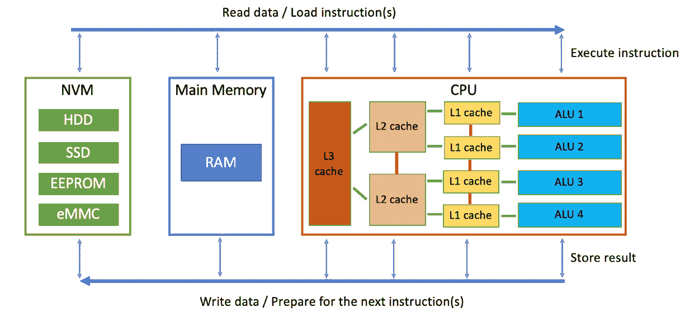
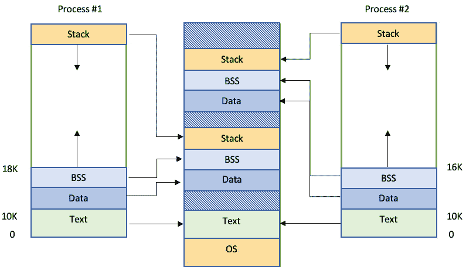
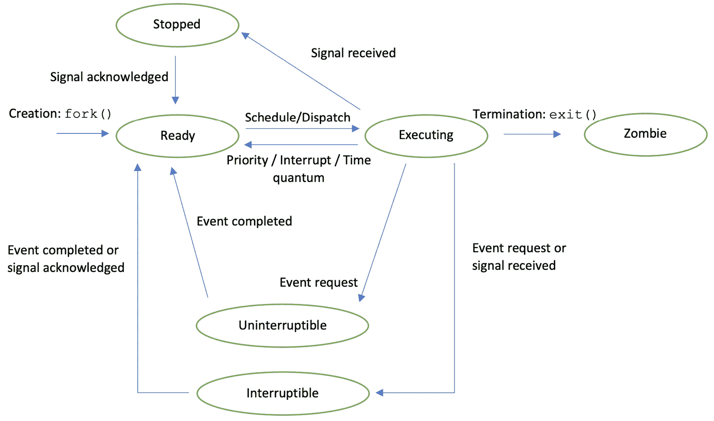
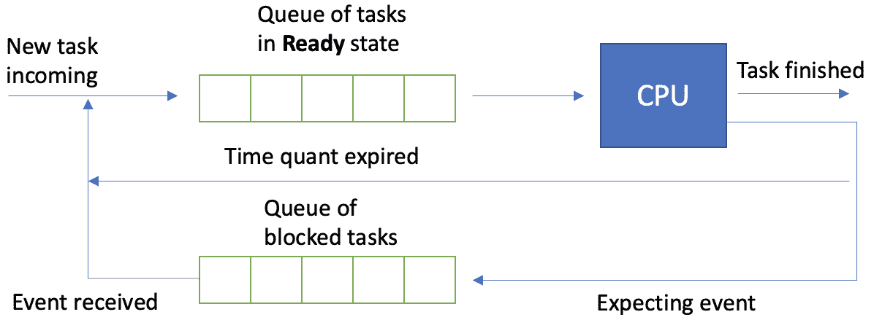
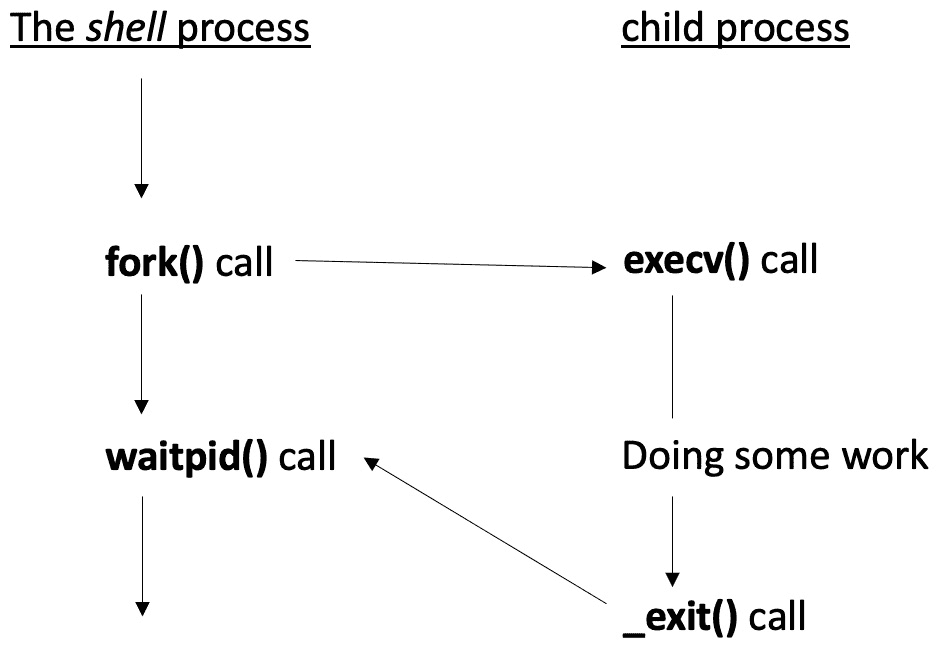

# 2

# 深入了解进程管理

你在上一章中已经熟悉了进程的概念。现在，是时候深入了解细节了。了解进程管理如何与系统的整体行为相关联是很重要的。在本章中，我们将强调用于进程控制和资源访问管理的基本操作系统机制。我们将利用这个机会向你展示如何使用一些 C++ 功能。

一旦我们调查了程序及其相应的进程作为系统实体，我们将讨论一个进程在其生命周期中经历的状态。你将学习如何创建新的进程和线程。你还将看到这些活动背后的问题。稍后，我们将逐步引入多线程代码的示例。通过这样做，你将有机会学习一些与异步执行相关的 POSIX 和 C++ 技术的基础。

无论你的 C++ 经验如何，本章都将帮助你了解你可能在系统级别陷入的一些陷阱。你可以使用你对各种语言特性的了解来增强你的执行控制和进程可预测性。

本章将涵盖以下主要主题：

+   调查进程的本质

+   继续探讨进程状态和一些调度机制

+   深入了解进程创建

+   介绍 C++ 中线程操作的系统调用

# 技术要求

要运行本章中的代码示例，你必须准备以下内容：

+   能够编译和执行 C++20 的基于 Linux 的系统（例如，**Linux** **Mint 21**）

+   GCC12.2 编译器 ([`gcc.gnu.org/git/gcc.gitgcc-source`](https://gcc.gnu.org/git/gcc.gitgcc-source))，使用 `-std=c++2a` 和 `-lpthread` 标志

+   或者，对于所有示例，你也可以使用 [`godbolt.org/`](https://godbolt.org/)

+   本章中所有代码示例均可从以下链接下载：[`github.com/PacktPublishing/C-Programming-for-Linux-Systems/tree/main/Chapter%202`](https://github.com/PacktPublishing/C-Programming-for-Linux-Systems/tree/main/Chapter%202)。

# 拆解进程创建

正如我们在上一章中提到的，进程是程序的运行实例，包含其相应的元数据、占用的内存、打开的文件等。它是操作系统中的主要作业执行者。回想一下，编程的整体目标是把一种类型的数据转换成另一种类型的数据，或者进行计数。我们通过编程语言所做的就是向硬件提供指令。通常，我们 *告诉* CPU 要做什么，包括在不同内存部分移动数据片段。换句话说，计算机必须 *计算*，我们必须告诉它如何做。这种理解至关重要，并且与所使用的编程语言或操作系统无关。

通过这样，我们回到了系统编程和了解系统行为的话题。让我们立即声明，进程创建和执行既不简单也不快。进程切换也是如此。这通常无法用肉眼观察到，但如果你必须设计一个高度可扩展的系统或对系统执行期间的事件有严格的截止日期，那么你迟早会进行进程交互分析。再次，这就是计算机的工作方式，当你进入资源优化时，这种知识是有用的。

谈到资源，让我们再次提醒自己，我们的进程最初只是一个程序。它通常存储在**非易失性存储器**（**NVM**）中。根据系统不同，这可能是硬盘驱动器、SSD、ROM、EEPROM、Flash 等等。我们提到这些设备是因为它们具有不同的物理特性，例如速度、存储空间、写入访问和碎片化。这些因素中的每一个都是系统耐用性的重要因素，但在这个章节中，我们主要关心的是速度。

再次，正如我们在上一章中提到的，程序，就像所有其他操作系统资源一样，是一个文件。C++程序是一个可执行目标文件，其中包含必须提供给 CPU 的代码——例如，指令。这个文件是编译的结果。编译器是另一个程序，它将 C++代码转换为机器指令。了解我们的系统支持哪些指令至关重要。操作系统和编译器是集成标准、库、语言特性等的先决条件，并且有很大可能性，编译后的目标文件无法在另一个与我们不完全匹配的系统上运行。此外，相同的代码，在另一个系统或通过另一个编译器编译，很可能会生成不同大小的可执行目标文件。文件越大，从**NVM**加载程序到**主存储器**（**随机存取存储器**（**RAM**）是最常用的）所需的时间就越长。为了分析我们代码的速度并尽可能地为给定系统优化它，我们将查看一个关于我们的数据或指令沿着完整路径流动的通用图。这稍微有些离题，所以请耐心等待：



图 2.1 – 加载程序及其指令执行序列

这里提供了一个通用的 CPU 概述，因为不同的架构会有不同的布局。L1 和 L2 缓存是**静态 RAM**（**SRAM**）元素，这使得它们非常快，但也很昂贵。因此，我们必须保持它们体积小。我们还保持它们体积小以实现小的 CPU 延迟。L2 缓存具有更大的容量，以便在**算术逻辑单元**（**ALUs**）之间创建共享空间——一个常见的例子是在单个核心中的两个硬件线程，其中 L2 缓存扮演共享内存的角色。L3 缓存并不总是存在，但它通常基于**动态 RAM**（**DRAM**）元素。它比 L1 和 L2 缓存慢，但允许 CPU 有一个额外的缓存级别，仅用于加速目的。一个例子就是指导 CPU 猜测并从 RAM 中预取数据，从而节省在 RAM 到 CPU 加载中的时间。现代 C++特性可以大量使用这种机制，从而在进程执行中实现显著的加速。

此外，根据它们的作用，识别出三种类型的缓存：**指令缓存**、**数据缓存**和**转换后备缓冲器**（**TLB**）。前两种是显而易见的，而**TLB**与 CPU 缓存没有直接关系——它是一个独立的单元。它用于数据和指令的地址，但其作用是加速虚拟到物理地址的转换，我们将在本章后面讨论这一点。

RAM 经常被使用，主要涉及**双数据速率同步动态 RAM**（**DDR SDRAM**）内存电路。这是一个非常重要的点，因为不同的 DDR 总线配置有不同的速度。而且不管速度如何，它仍然不如 CPU 内部传输快。即使 CPU 满载，DDR 也很少被完全利用，因此成为我们的*第一个重大瓶颈*。正如在*第一章*中提到的，NVM 比 DDR 慢得多，这是它的*第二个重大瓶颈*。我们鼓励您分析您的系统并查看速度差异。

重要提示

您的程序大小很重要。优化执行程序指令或加载数据的事件序列的过程是一个永久和持续的平衡行为。在考虑代码优化之前，您必须了解您的系统硬件和操作系统！

如果您仍然不确信，那么考虑以下情况：如果我们有一个程序用于在某个屏幕上可视化一些数据，对于桌面 PC 用户来说，如果 1 秒后或 10 秒后出现，可能不是问题。但如果这是一个飞机上的飞行员，那么在严格的时间窗口内显示数据是一个安全合规特性。我们程序的大小也很重要。我们相信接下来的几节将为您提供分析您环境所需的工具。那么，我们的程序在执行过程中会发生什么？让我们来看看。

## 内存段

*内存段*也被称为*内存布局*或*内存部分*。这些只是内存区域，不应与分段内存架构混淆。一些专家在讨论编译时操作时更喜欢使用*部分*，而在运行时使用*布局*。选择你喜欢的，只要它能描述同一件事。主要段包括**文本**（或**代码**）、**数据**、**BSS**、**栈**和**堆**，其中**BSS**代表**由符号开始的块**或**由符号开始的块**。让我们更详细地看看：

+   也有`const`变量。

+   **数据**：这个段也是在编译时创建的，由初始化的全局、静态或全局和静态数据组成。它用于初步分配的存储，当你不希望依赖于运行时分配时使用。

+   `0`，理论上按照语言标准，但实际上在进程启动时由操作系统的程序加载器设置为`0`。

+   **栈**：程序栈是一个表示运行程序例程的内存段——它保存它们的局部变量，并在被调用的函数返回时跟踪继续的位置。它是在运行时构建的，并遵循**后进先出**（**LIFO**）策略。我们希望保持它小而快。

+   **堆**：这是另一个在运行时创建的段，用于动态内存分配。对于许多嵌入式系统来说，它被认为是禁止的，但我们将在此书稍后进一步探讨它。有许多有趣的教训可以学习，而且有时很难避免它。

在*图 2.1*中，你可以观察到两个正在运行相同可执行文件并正在运行时加载到主内存中的进程。我们可以看到，对于 Linux，**文本**段只复制一次，因为它应该对两个进程都是相同的。**堆**缺失，因为我们现在不关注它。正如你所见，**栈**不是无限的。当然，其大小取决于许多因素，但我们猜测你已经在实践中看到过几次*栈溢出*消息。这是一个不愉快的运行时事件，因为程序流程被不优雅地破坏，并且有可能在系统级别引起问题：



图 2.2 – 两个进程的内存段

在*图 2.2*中，主内存的顶部代表**虚拟地址空间**，其中操作系统使用一个称为**页表**的数据结构来将进程的内存布局映射到物理内存地址。这是一种重要的技术，可以概括操作系统管理内存资源的方式。这样，我们就不必考虑设备的特定特性或接口。在抽象层面上，它很像我们在*第一章*中访问文件的方式。我们将在本章稍后回到这个讨论。

让我们使用以下代码示例进行分析：

```cpp
void test_func(){}
int main(){
     test_func(); return 0;
}
```

这是一个非常简单的程序，其中函数在入口点之后立即被调用。这里没有什么特别之处。让我们为 C++20 编译它，不进行任何优化：

```cpp
$ g++ mem_layout_example.cpp -std=c++2a -O0 -o test
```

生成的二进制对象称为 `test`。让我们通过 `size` 命令分析它：

```cpp
$ size test
 text       data        bss        dec        hex    filename
 2040        640          8       2688        a80    test
```

总大小为 2,688 字节，其中 2,040 字节是指令，640 字节是 **数据**，8 字节用于 **BSS**。正如你所见，我们没有全局或静态数据，但仍然有 648 字节被占用。记住，编译器仍在工作，所以那里有一些分配的符号，当需要时我们可以进一步分析：

```cpp
$ readelf -s test
```

现在，让我们专注于其他事情并按照以下方式编辑代码：

```cpp
void test_func(){
    static uint32_t test_var;
}
```

一个未初始化的静态变量必须导致 **BSS** 增长：

```cpp
$ size test
text       data        bss        dec        hex    filename
2040        640         16       2696        a88    test
```

因此，**BSS** 变得更大——不是 4 字节，而是 8 字节。让我们检查一下新变量的大小：

```cpp
$ nm -S test | grep test_var
0000000000004018 0000000000000004 b _ZZ9test_funcvE8test_var
```

一切正常——无符号 32 位整数是 4 字节，正如预期的那样，但编译器在那里放了一些额外的符号。我们还可以看到它在符号前面的 `b`。现在，让我们再次更改代码：

```cpp
void test_func(){
    static uint32_t test_var = 10;}
```

我们已经初始化了变量。现在，我们期望它在 **数据** 段中：

```cpp
$ size test
text       data        bss        dec        hex    filename
2040        644          4       2688        a80    test
$ nm -S test | grep test_var
0000000000004010 0000000000000004 d _ZZ9test_funcvE8test_var
```

如预期的那样，符号前面的 `d`）。你还可以看到编译器已经将 `2688` 字节缩小了。

让我们进行最后的更改：

```cpp
void test_func(){
    const static uint32_t test_var = 10;}
```

由于 `const` 在程序执行期间不能更改，它必须被标记为只读。为此，它可以放入 **文本** 段。请注意，这取决于系统实现。让我们检查一下：

```cpp
$ size test
 text       data        bss        dec        hex    filename
 2044        640          8       2692        a84    test
$ nm -S test | grep test_var
0000000000002004 0000000000000004 r _ZZ9test_funcvE8test_var
```

正确！我们可以看到符号前面的字母 `r`，以及 `2044` 而不是之前提到的 `2040`。编译器从定义中生成一个 8 字节的 `static` 看起来相当有趣？我们鼓励你尝试一下。

到目前为止，你可能已经建立了联系，即编译时较大的部分通常意味着可执行文件更大。而可执行文件更大意味着程序启动所需的时间更长，因为从 NVM 到主内存的数据复制速度明显慢于从主内存到 CPU 缓存的复制速度。我们将在讨论上下文切换时回到这个话题。如果我们想保持启动速度快，那么我们应该考虑较小的编译时部分，但较大的运行时部分。这是一个通常由软件架构师或对系统有良好概述和知识的人进行的权衡。必须考虑的先决条件包括 NVM 的读写速度、DDR 配置、系统启动、正常工作和关闭时的 CPU 和 RAM 负载、活动进程数量等。

我们将在本书的后面重新讨论这个话题。现在，让我们专注于新进程创建时内存段的意义。它们的意义将在本章后面讨论。

# 继续讨论进程状态和一些调度机制

在上一节中，我们讨论了如何启动一个新的进程。但在底层发生了什么？如第一章中所述，在 Linux 的调度器中，进程和线程被视为任务。它们的状态是通用的，对它们的理解对于正确的程序规划非常重要。当任务期望一个资源时，可能需要等待甚至停止。我们也可以通过同步机制来影响这种行为，例如信号量和互斥锁，我们将在本章后面讨论。我们相信，理解这些基础知识对于系统程序员来说至关重要，因为不良的任务状态管理可能导致不可预测性和整体系统退化。这在大型系统中表现得尤为明显。

现在，让我们暂时放慢脚步，尝试简化代码的目标——它需要指导 CPU 执行操作并修改数据。我们的任务是思考正确的指令应该是什么，这样我们就可以在重新调度或通过阻塞资源什么都不做时节省时间。让我们看看我们的进程可能处于的状态：



图 2.3 – Linux 任务状态及其依赖关系

前面的图中的状态是详细的，但 Linux 以四个一般字母表示法向用户展示它们：

+   **执行（R – 运行和可运行）**：处理器（核心或线程）为进程的指令提供服务——任务正在运行。调度算法可能迫使它执行。然后，任务变为可运行状态，并被添加到可运行队列中，等待轮到它们。这两种状态都是不同的，但都被表示为“正在执行”的进程。

+   **睡眠（D – 不可中断和 S – 可中断）**：还记得上一章中关于文件读写操作的例子吗？那是一种由等待外部资源引起的不可中断睡眠形式。在资源可用且进程可以再次执行之前，睡眠状态不能通过信号中断。可中断睡眠不仅依赖于资源可用性，还允许进程通过信号进行控制。

+   **停止（T）**：你有没有使用 *Ctrl* + *Z* 来停止一个进程？这是将进程置于停止状态的信号，但根据信号请求，它可能被忽略，进程将继续。或者，进程可以被停止，直到它被信号通知继续。我们将在本书后面讨论信号。

+   **僵尸（Z）**：我们在第一章中看到了这种状态——进程已终止，但在操作系统的任务向量中仍然可见。

使用 `top` 命令，你将在进程信息列的顶部行看到字母 `S`：

```cpp
$ top
. . .
PID USER PR NI VIRT RES SHR S %CPU %MEM TIME+ COMMAND
```

它将显示每个进程状态的字母表示。另一个选项是`ps`命令，其中`STAT`列将给出当前状态：

```cpp
$ ps a
PID TTY STAT TIME COMMAND
```

通过这样，我们知道了任务最终处于哪些状态，但不知道它们是如何以及为什么在这些状态之间切换的。我们将在下一节继续这个讨论。

## 调度机制

现代 Linux 发行版提供了许多调度机制。它们唯一的目的就是帮助操作系统以优化的方式决定下一个必须执行的任务。是优先级最高的任务，还是完成最快的任务，或者两者兼而有之？还有其他标准，所以不要陷入一个错误的假设，认为一个可以解决你所有的问题。当系统中**R**状态下的进程数量多于可用处理器时，调度算法尤为重要。为了管理这项任务，操作系统有一个**调度器**——每个操作系统都以某种形式实现的根本模块。它通常是一个独立的内核进程，充当负载均衡器，这意味着它使计算机资源保持忙碌，并为多个用户提供服务。它可以配置为追求低延迟、公平执行、最大吞吐量或最短等待时间。在实时操作系统中，它必须保证满足截止日期。这些因素显然是相互冲突的，调度器必须通过适当的折衷来解决这个问题。系统程序员可以根据用户的需求配置系统的偏好。但这是如何发生的呢？

## 高级调度

我们请求操作系统启动一个程序。首先，我们必须从 NVM 中加载它。这个调度级别考虑的是**程序加载器**的执行。程序的地址由操作系统提供。**文本**和**数据**段被加载到主内存中。大多数现代操作系统都会**按需**加载程序。这使进程启动更快，并且意味着在给定时刻只提供所需的代码。**BSS**数据也在那里分配和初始化。然后，虚拟地址空间被映射。携带指令的新进程被创建，并初始化所需的字段，如进程 ID、用户 ID、组 ID 等。**程序计数器**被设置为程序的入口点，控制权传递给加载的代码。由于 NVM 的硬件限制，这种开销在进程的生命周期中相当重要。让我们看看程序达到 RAM 后会发生什么。

## 低级调度

这是一系列尝试提供最佳任务执行顺序的技术。尽管我们在这本书中很少提到“调度”这个词，但请确保我们做的每一个操作都会导致任务状态切换，这意味着我们促使调度器行动。这种动作被称为**上下文切换**。切换也需要时间，因为调度算法可能需要重新排序任务队列，并且新启动的任务指令必须从 RAM 复制到 CPU 缓存。

重要提示

多个运行的任务，无论是并行还是非并行，可能会导致在重新调度上花费时间而不是在程序执行上。这是另一种平衡行为，这取决于系统程序员的 设计。

这里是一个基本的概述：



图 2.4 – 准备/阻塞任务队列

算法必须从队列中选择一个任务并将其放置以执行。在系统级别，基本层次结构如下（从最高优先级到最低）：调度器 -> 块设备 -> 文件管理 -> 字符设备 -> 用户进程。

根据队列的数据结构实现和**调度器**的配置，我们可以执行不同的算法。以下是一些例子：

+   **先来先服务（First-come-first-serve，FCFS）**：如今，这种方法很少使用，因为较长的任务可能会阻碍系统的性能，而重要的进程可能永远不会被执行。

+   **最短作业优先（Shortest job first，SJF）**：这比 FCFS 提供了更短的等待时间，但较长的任务可能永远不会被调用。它缺乏可预测性。

+   **最高优先级先执行（Highest priority first，HPF）**：在这里，任务有优先级，最高优先级的任务将被执行。但谁设置优先级值，谁决定新到达的进程是否会导致重新调度？Kleinrock 规则就是这样一种纪律，其中优先级线性增加，而任务保持在队列中。根据运行-保持比率，不同的顺序被执行——FCFS、Last-CFS、SJF 等等。关于这个问题的有趣文章可以在这里找到：[`dl.acm.org/doi/10.1145/322261.322266`](https://dl.acm.org/doi/10.1145/322261.322266)。

+   **轮询（Round-robin）**：这是一个无资源饥饿和抢占式算法，每个任务在相等的时间量子中获得。任务按环形顺序执行。每个任务都获得一个 CPU 时间槽，等于时间量子。当时间量子到期时，任务被推回到队列的末尾。正如你可能推断的那样，队列的长度和时间量子（通常在 10 到 300 毫秒之间）非常重要。为了保持公平性，现代操作系统调度器中还会采用一些额外的技术来丰富这个算法。

+   **完全公平调度（Completely fair scheduling，CFS）**：这是当前的 Linux 调度机制。它根据系统的状态应用上述算法的组合：

    ```cpp
    $ chrt -m
    SCHED_OTHER   the standard round-robin time-sharing policy
    SCHED_BATCH   for "batch" style execution of processes
    SCHED_IDLE    for running very low priority background jobs.
    SCHED_FIFO    a first-in, first-out policy
    SCHED_RR      a round-robin policy
    ```

这种方法很复杂，值得单独一本书来讨论。

我们关心的是以下内容：

+   **优先级**：其值是实际任务优先级，用于调度。介于 0 到 99 之间的值专用于实时进程，而介于 100 到 139 之间的值用于用户进程。

+   **Nice**：其值在用户空间级别上有意义，并在运行时调整进程的优先级。root 用户可以从 -20 到 +19 设置它，而普通用户可以从 0 到 +19 设置它，其中较高的 **nice** 值意味着较低的优先级。默认值为 0。

它们的依赖关系是，对于用户进程，优先级 = nice + 20，对于实时进程，优先级 = -1 – real_time_priority。优先级值越高，调度优先级越低。我们无法更改进程的基本优先级，但我们可以以不同的 `ps` 和新的优先级启动它：

```cpp
$ nice -5 ps
```

在这里，`-5` 表示 `5`。将其改为 `5` 需要使用 **sudo** 权限：

```cpp
$ sudo nice -5 ps
```

使用 `renice` 命令和 `pid` 可以在进程运行时更改进程的优先级：

```cpp
$ sudo renice -n -10 -p 9610
```

这将设置 `nice` 值为 `-10`。

要启动实时进程或设置和检索 `pid` 的实时属性，您必须使用 `chrt` 命令。例如，让我们用它来启动一个优先级为 `99` 的实时进程：

```cpp
$ sudo chrt --rr 99 ./test
```

我们鼓励您查看其他算法，例如 **反馈**、**自适应分区调度**（**APS**）、**最短剩余时间**（**SRT**）、**最高响应比** **下一个**（**HRRN**）。

调度算法的主题很广泛，不仅涉及操作系统任务的执行，还涉及其他领域，如网络数据管理。我们无法在这里全面介绍，但重要的是要说明如何最初处理它并了解您系统的优势。话虽如此，让我们继续通过查看进程管理来继续讨论。

# 了解更多关于进程创建的知识

在系统编程中，遵循严格的进程创建和执行时间表是一种常见做法。程序员使用守护进程，如 `systemd` 和其他内部开发的解决方案，或者启动脚本。我们也可以使用终端，但这主要是当我们修复系统状态并恢复它，或者测试某个特定功能时。从我们的代码中启动进程的另一种方式是通过系统调用。您可能知道其中的一些，例如 `fork()` 和 `vfork()`。

## 介绍 fork()

让我们来看一个例子；我们稍后会讨论它：

```cpp
#include <iostream>
#include <unistd.h>
using namespace std;
void process_creator() {
    if (fork() == 0) // {1}
        cout << "Child with pid: " << getpid() << endl;
    else
        cout << "Parent with pid: " << getpid() << endl;
}
int main() {
    process_creator();
    return 0;
}
```

是的，我们知道您可能之前已经见过类似的例子，并且很清楚应该输出什么 – 通过 `fork()` `1` 启动了一个新的进程，并且打印出了两个 `pid` 值：

```cpp
Parent with pid: 92745
Child with pid: 92746
```

在 `Parent` 中，`fork()` 将返回新创建进程的 ID；这样，父进程就能知道其子进程。在 `Child` 中，将返回 `0`。这种机制对于进程管理非常重要，因为 `fork()` 会创建调用进程的副本。理论上，编译时段（**text**、**data** 和 **BSS**）在主内存中重新创建。新的 **栈** 从程序的相同入口点开始展开，但在 fork 调用处分支。然后，父进程遵循一条逻辑路径，子进程遵循另一条。每个都使用自己的 **data**、**BSS** 和 **heap**。

你可能认为大型的编译时段和栈会因为重复而造成不必要的内存使用，尤其是在我们不做修改的情况下。你是对的！幸运的是，我们正在使用虚拟地址空间。这允许操作系统对内存有额外的管理和抽象。在前一节中，我们讨论了无限 `fork()` 的进程将导致所谓的 `exec`。

## exec 和 clone()

`exec` 函数调用实际上不是一个系统调用，而是一组具有 `execXX(<args>)` 模式的系统调用。每个都有其特定的作用，但最重要的是，它们通过其文件系统路径创建一个新的进程，称为 `NULL`。这段代码与之前的例子类似，但做了一些修改：

```cpp
. . .
void process_creator() {
    if (execv("./test_fork", NULL) == -1) // {1}
        cout << "Process creation failed!" << endl;
    else
        cout << "Process called!" << endl;
}
. . .
```

结果如下：

```cpp
Parent with pid: 12191
Child with pid: 12192
```

你可能已经注意到打印输出中缺少了一些内容。哪里去了 `"Process called!"` 消息？如果出了问题，比如可执行文件找不到，那么我们将观察到 `"Process creation failed!"`。但在这个例子中，我们知道它已经运行，因为有了父进程和子进程的输出。这个答案可以在本代码示例之前的段落中找到——内存段被 `test_fork` 中的段所替换。

与 `exec` 类似，`clone()` 是对真实 `clone()` 系统调用的包装函数。它创建一个新的进程，如 `fork()`，但允许你精确地管理新进程的实例化方式。一些例子包括虚拟地址空间共享、信号处理、文件描述符等。前面提到的 `vfork()` 是 `clone()` 的一个特殊变体。我们鼓励你花些时间看看一些例子，尽管我们相信大多数时候，`fork()` 和 `execXX()` 就足够了。

如你所见，我们为给定的例子选择了 `execv()` 函数 {`1`}。我们使用这个函数是为了简单，也因为它与 *图 2**.5* 有关。但在我们查看这个图之前，我们还可以使用其他函数：`execl()`、`execle()`、`execip()`、`execve()` 和 `execvp()`。遵循 `execXX()` 模式，我们需要遵守给定的要求：

+   `e` 要求函数使用指向系统环境变量的指针数组，这些变量传递给新创建的进程。

+   `l` 需要将命令行参数存储在一个临时数组中，并将它们传递给函数调用。这只是为了在处理数组大小时方便。

+   `p` 需要将路径的环境变量（在 Unix 中表示为 `PATH`）传递给新加载的进程。

+   `v` 在本书中之前被使用过——它要求将命令行参数提供给函数调用，但它们是以指针数组的形式传递的。在我们的例子中，我们将其设置为 `NULL` 以简化。

让我们看看现在这个样子：

```cpp
int execl(const char* path, const char* arg, …)
int execlp(const char* file, const char* arg, …)
int execle(const char* path, const char* arg, …, char*
  const envp[])
int execv(const char* path, const char* argv[])
int execvp(const char* file, const char* argv[])
int execvpe(const char* file, const char* argv[], char
  *const envp[])
```

简而言之，当涉及到我们创建新进程的方式时，它们的实现是相同的。是否使用它们严格取决于您的需求和软件设计。在接下来的几章中，我们将多次回顾进程创建的主题，特别是当涉及到共享资源时，所以这不会是我们最后一次提到它。

让我们看看一个简单的例子：假设我们有一个通过命令行终端——`&`——启动的进程系统命令。这可以通过以下图表表示：



图 2.5 – 从 shell 执行命令

我们使用这张图来强调 Linux 中进程之间父-子关系的不可见系统调用。在后台，是 `exec()`。内核接管控制权并转到应用程序的入口点，在那里调用 `main()`。可执行文件完成其工作，当 `main()` 返回时，进程结束。结束例程是特定于实现的，但您可以通过 `exit()` 和 `_exit()` 系统调用以受控的方式触发它。同时，**shell** 被置于等待状态。现在，我们将介绍如何终止一个进程。

## 终止进程

通常，`exit()` 被视为一个库函数，它是在 `_exit()` 之上实现的。它做一些额外的工作，例如缓冲区清理和关闭流。在 `main()` 中使用 `return` 可以被认为是调用 `exit()` 的等效操作。`_exit()` 将通过释放数据和栈段、销毁内核对象（共享内存、信号量等）、关闭文件以及通知父进程其状态变化（将触发 `SIGCHLD` 信号）来处理进程终止。它们的接口如下：

+   `void` `_exit(int status)`

+   `void` `exit(int status)`

人们普遍认为，当 `status` 值设置为 `0` 时，表示正常进程终止，而其他值表示由内部进程问题引起的终止。因此，在 `stdlib.h` 中定义了 `EXIT_SUCCESS` 和 `EXIT_FAILURE` 符号。为了演示这一点，我们可以修改之前提到的 fork 示例，如下所示：

```cpp
...
#include <stdlib.h>
...
    if (fork() == 0) {
        cout << "Child process id: " << getpid() << endl;
        exit(EXIT_SUCCESS); // {1}
    }
    else {
        cout << "Parent process id: " << getpid() << endl;
    }
...
```

因此，子进程将按预期继续进行，因为没有发生任何特别的事情，但我们使它能够更好地管理其终止策略。输出将与上一个例子相同。我们将在下一节中进一步丰富这一点，通过一个代码片段。

但在我们这样做之前，让我们注意，这两个函数通常都与一种受控的过程终止方式相关。`abort()`将以类似的方式导致进程终止，但会触发`SIGABRT`信号。正如下一章所讨论的，一些信号应该被处理而不是被忽略——这是一个优雅地处理进程退出例程的好例子。同时，父进程会做什么，它会不会受到子进程退出代码的影响？让我们看看。

## 阻塞调用进程

如您在*图 2.5*中可能已经注意到的，一个进程可能被设置为等待。使用`wait()`、`waitid()`或`waitpid()`系统调用将导致调用进程被阻塞，直到它收到一个信号或其子进程改变状态：它被终止、被信号停止或被信号恢复。我们使用`wait()`来指示系统释放与子进程相关的资源；否则，它将成为一个**僵尸进程**，如前一章所述。这三种方法几乎相同，但后两种符合 POSIX 标准，并提供了对监控子进程的更精确控制。这三个接口如下：

+   `pid_t wait(int *status);`

+   `pid_t waitpid(pid_t pid, int *status, int options);`

+   `int waitid(idtype_t idtype, id_t id, siginfo_t * infop, int options);`

`status`参数对前两个函数具有相同的作用。`wait()`可以表示为`waitpid(-1, &status, 0)`，这意味着进程调用者必须等待任何终止的子进程并接收其状态。让我们直接通过`waitpid()`来看一个例子：

```cpp
#include <sys/wait.h>
...
void process_creator() {
    pid_t pids[2] = {0};
    if ((pids[0] = fork()) == 0) {
        cout << "Child process id: " << getpid() << endl;
        exit(EXIT_SUCCESS); // {1}
    }
    if ((pids[1] = fork()) == 0) {
        cout << "Child process id: " << getpid() << endl;
        exit(EXIT_FAILURE); // {2}
    }
    int status = 0;
    waitpid(pids[0], &status, 0); // {3}
    if (WIFEXITED(status)) // {4}
        cout << "Child " << pids[0]
             << " terminated with: "
             << status << endl;
    waitpid(pids[1], &status, 0); // {5}
    if (WIFEXITED(status)) // {6}
        cout << "Child " << pids[1]
             << " terminated with: "
             << status << endl;
...
```

此执行的输出结果如下：

```cpp
Child process id: 33987
Child process id: 33988
Child 33987 terminated with: 0
Child 33988 terminated with: 256
```

如您所见，我们正在创建两个子进程，并将其中一个设置为成功退出，另一个设置为失败([`1`]和[`2`])。我们将父进程设置为等待它们的退出状态([`1`]和[`5`])。当子进程退出时，父进程会通过信号得到通知，正如前面所描述的，并打印出退出状态([`4`]和[`6`])。

此外，`idtype`和`waitid()`系统调用使我们能够等待一个特定的进程，也可以等待一组进程。其状态参数提供了关于实际状态更新的详细信息。让我们再次修改这个例子：

```cpp
...
void process_creator() {
...
    if ((pids[1] = fork()) == 0) {
        cout << "Child process id: " << getpid() << endl;
        abort(); // {1}
    }
    siginfo_t status = {0}; // {2}
    waitid(P_PID, pids[1], &status, WEXITED); // {3}
    if (WIFSIGNALED(status)) // {4}
        cout << "Child " << pids[1]
             << " aborted: "
             << "\nStatus update with SIGCHLD: "
             << status.si_signo
             << "\nTermination signal - SIGABRT: "
             << status.si_status
             << "\nTermination code - _exit(2): "
             << status.si_code << endl;
}...
```

输出如下：

```cpp
Child process id: 48368
Child process id: 48369
Child 48369 aborted:
Status update with SIGCHLD: 20
Termination signal - SIGABRT: 6
Termination code - _exit(2): 2
```

我们将`exit()`改为`abort()`([`1`])，这导致子进程接收`SIGABRT`信号并以默认处理方式退出（这并不完全是我们之前建议的）。我们使用`struct`状态([`2`])来收集更有意义的状态变化信息。`waitid()`系统调用用于监控单个进程，并设置为等待其退出([`3`])。如果子进程发出退出信号，那么我们将打印出有意义的信息([`4`])，在我们的例子中，这证明了我们得到了`SIGABRT`（值为`6`），更新伴随着`SIGCHLD`（值为`20`），并且退出代码为`2`，正如文档中所述。

`waitid()`系统调用有多种选项，通过它，你可以实时监控你派生的进程。我们在这里不会深入探讨，但如果需要，你可以在手册页面上找到更多信息：[`linux.die.net/man/2/waitid`](https://linux.die.net/man/2/waitid)。

一个重要的注意事项是，根据我们之前讨论的 POSIX 和 Linux 的线程管理策略，默认情况下，一个线程将等待同一线程组中其他线程的子线程。话虽如此，我们将在下一节中探讨一些线程管理。

# 介绍 C++中线程操作的系统调用

如同在*第一章*中讨论的那样，我们使用线程来并行执行不同的程序。它们只存在于进程的作用域内，它们的创建开销比线程的大，所以我们认为它们是轻量级的，尽管它们有自己的栈和`task_struct`。它们几乎可以自给自足，除了它们依赖于父进程的存在。这个进程也被称为*主线程*。所有由它创建的其他线程都需要加入它才能启动。你可以在系统上同时创建成千上万的线程，但它们不会并行运行。你可以运行的并行任务数量为*n*，其中*n*是系统并发 ALU 的数量（偶尔，这些是硬件的并发线程）。其他的将根据操作系统的任务调度机制进行调度。让我们看看 POSIX 线程接口的最简单例子：

```cpp
pthread_t new_thread;
pthread_create(&new_thread, <attributes>,
               <procedure to execute>,
               <procedure arguments>);
pthread_join(new_thread, NULL);
```

当然，我们还可以使用其他系统调用来进一步管理 POSIX 线程，例如退出线程、接收被调用过程的返回值、从主线程分离等。让我们看看 C++的线程实现：

```cpp
std::thread new_thread(<procedure to execute>);
new.join();
```

这看起来更简单，但它提供了与 POSIX 线程相同的操作。为了与语言保持一致，我们建议您使用 C++线程对象。现在，让我们看看这些任务是如何执行的。由于我们将在*第六章*中介绍新添加的 C++20 **jthreads**功能，因此我们将在接下来的几节中提供一个系统编程概述。

## 线程的连接和分离

无论您是通过 POSIX 系统调用还是 C++ 加入线程，您都需要执行此操作来通过给定的线程执行例程并等待其终止。有一点需要注意——在 Linux 上，`pthread_join()` 的线程对象必须是可连接的，而 C++ 线程对象默认情况下不可连接。将线程分别连接是一个好习惯，因为同时连接它们会导致未定义的行为。它与 `wait()` 系统调用的工作方式相同，只是它涉及线程而不是进程。

同样，进程可以作为守护进程运行，线程也可以通过分离来成为守护进程——POSIX 的 `pthread_detach()` 或 C++ 中的 `thread::detach()`。我们将在下面的示例中看到这一点，但我们还将分析线程的可连接设置：

```cpp
#include <iostream>
#include <chrono>
#include <thread>
using namespace std;
using namespace std::chrono;
void detached_routine() {
    cout << "Starting detached_routine thread.\n";
    this_thread::sleep_for(seconds(2));
    cout << "Exiting detached_routine thread.\n";
}
void joined_routine() {
    cout << "Starting joined_routine thread.\n";
    this_thread::sleep_for(seconds(2));
    cout << "Exiting joined_routine thread.\n";
}
void thread_creator() {
    cout << "Starting thread_creator.\n";
    thread t1(detached_routine);
    cout << "Before - Is the detached thread joinable: "
         << t1.joinable() << endl;
    t1.detach();
    cout << "After - Is the detached thread joinable: "
         << t1.joinable() << endl;
    thread t2(joined_routine);
    cout << "Before - Is the joined thread joinable: "
         << t2.joinable() << endl;
    t2.join();
    cout << "After - Is the joined thread joinable: "
         << t2.joinable() << endl;
    this_thread::sleep_for(chrono::seconds(1));
    cout << "Exiting thread_creator.\n";
}
int main() {
    thread_creator();
}
```

相应的输出如下：

```cpp
Starting thread_creator.
Before - Is the detached thread joinable: 1
After - Is the detached thread joinable: 0
Before - Is the joined thread joinable: 1
Starting joined_routine thread.
Starting detached_routine thread.
Exiting joined_routine thread.
Exiting detached_routine thread.
After - Is the joined thread joinable: 0
Exiting thread_creator.
```

上述示例相当简单——我们创建了两个线程对象：一个是要从主线程句柄中分离出来（`detached_routine()`），而另一个（`joined_thread()`）将在退出后连接到主线程。我们在创建时以及设置它们工作后检查它们的可连接状态。正如预期的那样，线程到达它们的例程后，它们就不再可连接，直到它们被终止。

## 线程终止

Linux (POSIX) 提供了两种从线程内部以受控方式结束线程例程的方法：`pthread_cancel()` 和 `pthread_exit()`。正如您可能从它们的名字中猜到的，第二个会终止调用线程，并且预期总是成功。与 `exit()` 系统调用不同，在执行此操作期间，不会释放进程共享资源，例如信号量、文件描述符、互斥锁等，因此请确保在线程退出之前管理它们。取消线程是一种更灵活的方法来做这件事，但它最终会调用 `pthread_exit()`。由于线程取消请求是发送到线程对象的，因此它有机会执行取消清理并调用线程特定的数据析构函数。

由于 C++ 是系统调用接口的抽象，它使用线程对象的范围来管理其生命周期，并且做得很好。当然，背景中发生的事情是特定于实现、系统和编译器的。我们将在本书的后续章节中再次探讨这个主题，所以请利用这个机会熟悉这些接口。

# 摘要

在本章中，我们探讨了在进程或线程创建和操作期间发生的低级事件。我们讨论了进程的内存布局及其重要性。您还了解了一些关于操作系统任务调度方式的重要观点以及进程和线程状态更新期间在后台发生的事情。我们将在本书的后续章节中使用这些基础知识。下一章将涵盖文件系统管理，并将提供一些该领域的有趣 C++ 工具。
