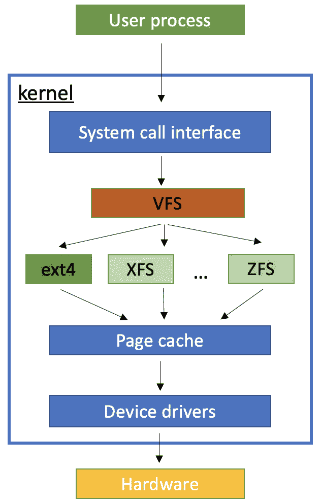
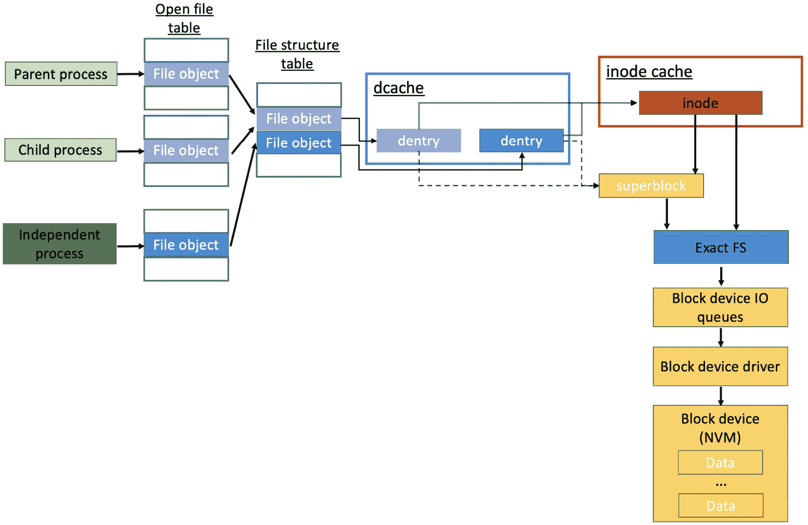
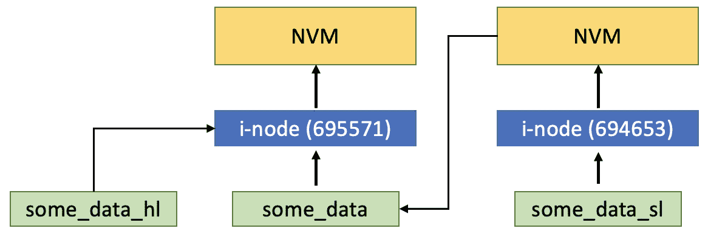
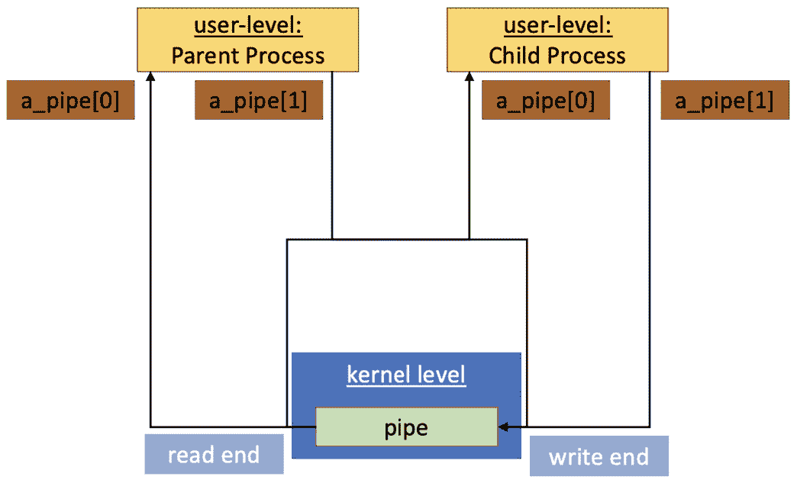
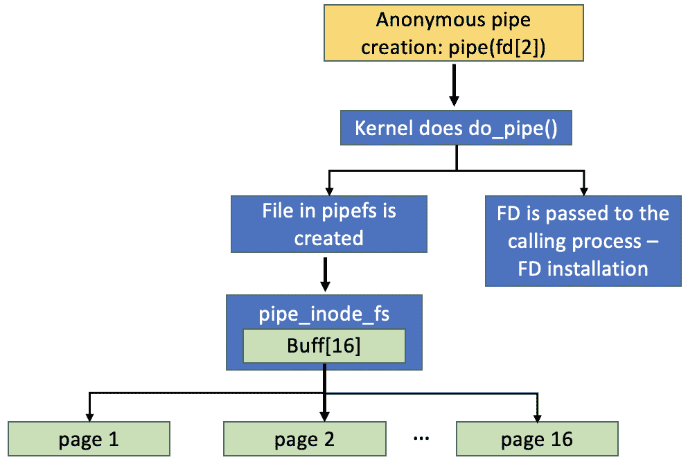
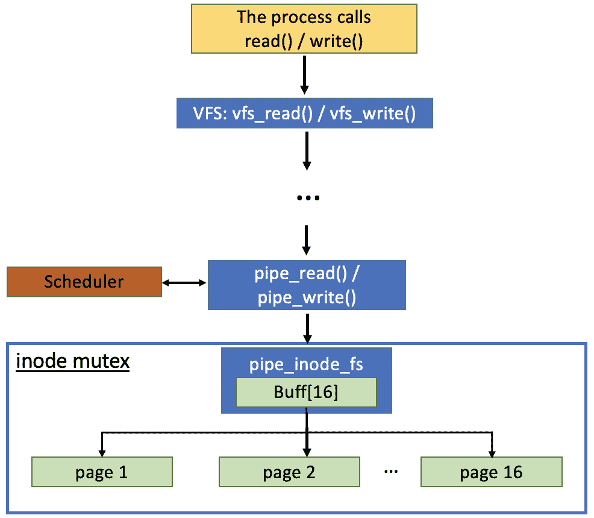
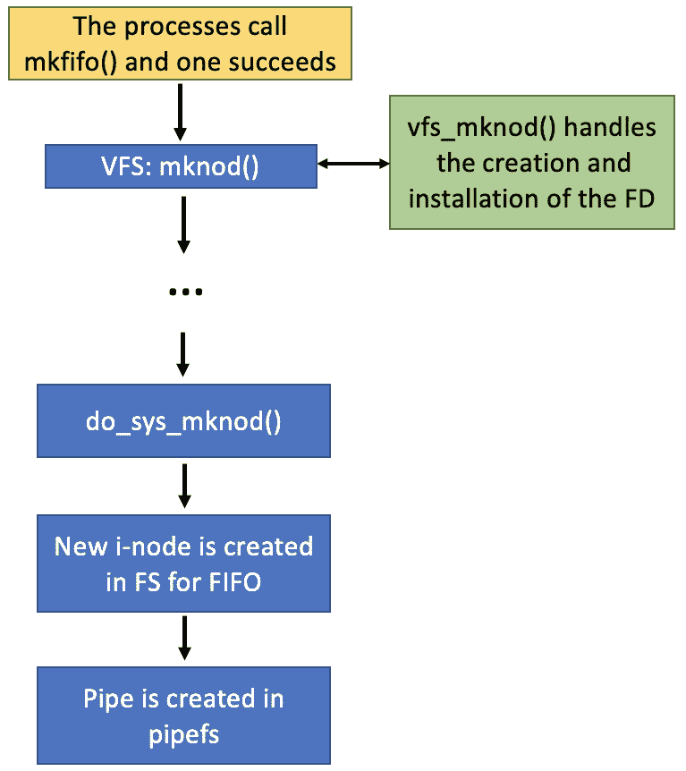
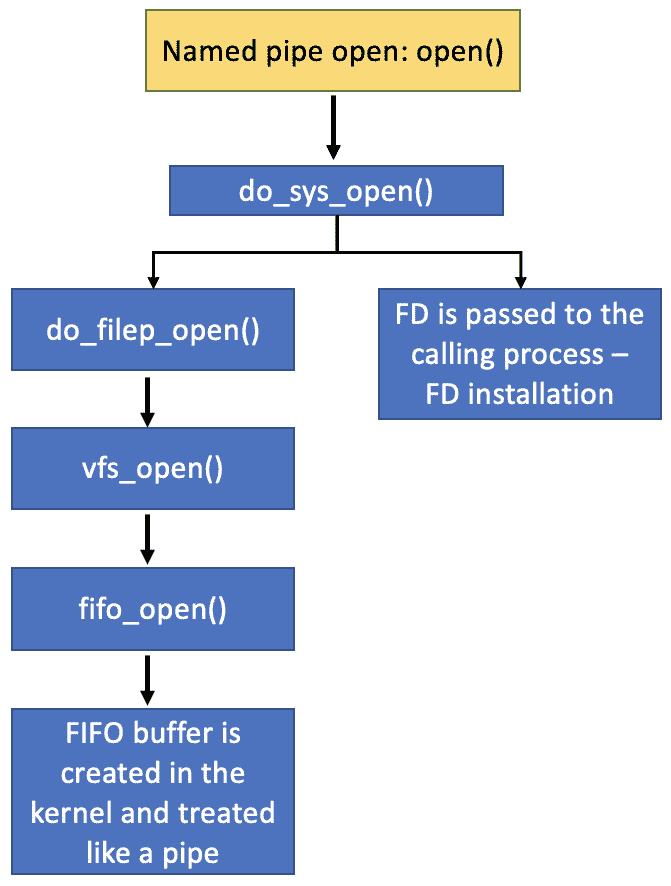

# 在文件系统中导航

在本章中，我们将回顾在*第一章*中简要讨论的文件概念。你将详细了解 Linux 中的**文件系统**（**FS**）及其具体细节。我们不会深入到某些文件系统实现中，因为你会看到有很多，但我们将建立与之工作的基础。你将了解更多关于 Linux 的 FS 层次结构——它的分区、对象类型和一些常用操作。

你将熟悉`string_views`。在这里你将学习的一些操作将在*第五章*中再次回顾，届时我们将讨论错误处理。

最后但同样重要的是，你将亲身体验到被称为**管道**的基本**进程间通信**（**IPC**）机制。我们还将讨论作为系统实体的信号及其对通信的影响。如果你对进程间的数据传输不熟悉，那么你应该从这里开始。如果你有经验，你可能会注意到代码可能更加复杂——例如，使用管道实现服务器-客户端应用程序。我们了解这一点，但我们相信这些示例是一个很好的起点——这种机制的额外可扩展性会产生不希望的影响。我们将在*第七章*中进一步讨论这一点。

在本章中，我们将涵盖以下主要主题：

+   探索 Linux 的文件系统基础

+   使用 C++执行文件系统操作

+   通过匿名管道和命名管道进行 IPC

+   简要观察信号处理

# 技术要求

为了运行代码示例，读者必须准备以下内容：

+   能够编译和执行 C 和 C++20 的基于 Linux 的系统（例如，Linux Mint 21）：

    +   **gcc12.2**编译器：[`gcc.gnu.org/git/gcc.git gcc-source`](https://gcc.gnu.org/git/gcc.gitgcc-source)

    +   使用带有**-std=c++2a**标志的**g++**编译 C++代码

    +   编译 C 代码时不带**gcc**标志

+   对于所有示例，你也可以使用[`godbolt.org/.`](https://godbolt.org/%0D)

+   代码示例可以在这里找到：[`github.com/PacktPublishing/C-Programming-for-Linux-Systems/tree/main/Chapter%203`](https://github.com/PacktPublishing/C-Programming-for-Linux-Systems/tree/main/Chapter%203)

# 探索 Linux 的文件系统基础

我们在*第一章*中介绍了一些 Unix（和 Linux）文件系统的定义。让我们看看它们在系统编程的更大图景中真正意味着什么。你可能还记得 Linux 系统中有哪些类型的文件——常规文件、目录、特殊文件、链接、套接字和命名管道。我们将在本章中处理其中大部分，并了解它们各自的作用。关于 Unix 中的文件，包括 Linux，可以这样简单思考：

“在 UNIX 系统中，一切皆文件；如果某物不是文件，那么它就是一个*进程*。”

因此，所有不是进程的东西都有一个 API，这包括文件操作系统调用。让我们同意文件是数据逻辑组织的主要工具。那么，必然存在某种是文件组织的主要工具。好吧，这就是文件管理系统，或者简单地说是文件系统，发挥作用的地方。它负责物理介质上的文件布局——例如，`open()`、`write()`等。

文件系统还允许用户暂时忘记硬件的细节，专注于数据操作，以及像有序目录一样使用文件系统。它帮助在用户界面或命令行界面上的文件结构和数据可视化，访问权限，以及资源的有效使用。当用户有机会专注于文件创建、删除、修改和共享时，文件系统更关注数据准确性、设备驱动程序错误处理、多用户访问等问题。这是一个重要的观点，因为我们将在本书后面的某些地方观察到一些错误状态——例如，在*第五章*，其中文件系统是创建异常情况的实体。它还影响任务调度，正如我们之前提到的。让我们看看 Linux 中的文件系统结构和其具体细节。

## Linux 的文件系统（FS）

我们必须提到，存在许多种类的文件系统。每种文件系统都适合其特定的用途，正如用户体验所暗示的，存在多种偏好，并不是所有文件系统都同时存在。Linux 具有支持超过 100 种文件系统的能力。它们可以组合运行在单个系统上。这为用户提供了最佳操作的机会，并使他们能够从中受益。如果文件系统只需要组织文件结构，那么一个普通的文件系统就可以做到这一点——例如，`ext2`或`FAT`。如果我们想要文件一致性和更少出错的操作，那么可以选择`ext4`、`ReiserFS`或`XFS`。对于在线数据存储，`NFS`和`CIFS`可能很有用。对于大文件和大量小文件，也需要特定的管理，因此`ZFS`和`btrfs`很有用。最后但同样重要的是，还有一些文件系统不是基于物理存储，而是在`proc`、`sys`、`ram`和`tmp`中代表实体。然而，在抽象层面上，文件操作似乎是一样的。因此，我们可以有一个统一的接口。这不仅允许系统程序员以相同的方式使用不同的文件系统，而且还允许操作系统的用户界面可视化同一文件树下的所有文件和目录。Linux 通过**虚拟文件系统**（**VFS**）实现这一点。它也被称为**虚拟文件系统切换器**——一个位于内核中的层，为程序提供通用接口。在详细探讨之前，让我们从设计角度看看它是什么样的。



图 3.1 – Linux 内核中的 VFS 软件层

此外，VFS 是面向对象的。不幸的是，这不会对我们使用 C++代码有很大帮助。不过，它是一个 C 语言中面向对象编程的好例子，因为对象实际上是`struct`类型，包含文件数据和指向文件操作的函数指针。我们将在本章稍后讨论这些对象。现在让我们看看目录结构和标准化分区。

## 目录结构和分区

Linux 的目录结构在`#!`中得到了很好的展示。你可以通过执行此命令了解更多信息：

```cpp
$ man magic
```

回到文件系统结构——它从`root`目录开始，用`/`表示。在系统引导序列的早期阶段，`root`文件系统被挂载到该目录上。其他所有文件系统都在操作系统启动期间或甚至在正常操作期间挂载。你可以按照以下方式检查自己的配置：

```cpp
$ cat /etc/fstab
# /etc/fstab: static file system information.
...
# <file system> <mount point>   <type>  <options>       <dump>  <pass>
# / was on /dev/sda5 during installation
UUID=618800a5-57e8-43c1-9856-0a0a14ebf344 /               ext4    errors=remount-ro 0       1
# /boot/efi was on /dev/sda1 during installation
UUID=D388-FA76  /boot/efi       vfat    umask=0077      0       1
/swapfile                                 none            swap    sw              0       0
```

它提供了有关*挂载点*和相应文件系统类型的详细信息。在此文件之外，文件系统将以具有确切路径的单独目录的形式在系统中可见。每个目录都可以通过`root`目录访问。一个重要点是`/`和`/root`是不同的目录，因为前者是`root`目录，而后者是*root 用户*的主目录。其他一些重要的分区和目录如下：

+   `/bin`: 包括常用用户可执行文件。

+   `/boot`: 包括 Linux 系统启动文件、内核的静态部分和引导加载程序配置。

+   `/dev`: 包括对所有外围硬件的引用，这些硬件通过具有特殊文件类型`'c'`或`'b'`的文件表示，并提供对真实设备的访问。我们曾在*第一章*中提到过这些特殊文件类型。

+   `/etc`: 包括系统配置文件。

+   `/home`: 这是顶级目录，可供用户文件使用，所有用户都有各自的公共子目录。

+   `/lib`: 这包括启动系统所需的共享库文件。

+   `/mnt`: 外部文件系统的临时挂载点。它与`/media`结合得很好，其中媒体设备（如 USB 闪存驱动器）被挂载。

+   `/opt`: 这包括可选文件和第三方软件应用程序。

+   `/proc`: 这包含有关系统资源的信息。

+   `/tmp`: 这是一个由操作系统和多个程序用于临时存储的临时目录——重启后会进行清理。

+   `/sbin`: 这包括系统二进制文件，通常由系统管理员使用。

+   `/usr`: 这通常包括只读文件，但也有一些例外。它是用于程序、库和二进制文件、*man*文件和文档的。

+   `/var`: 这包括可变数据文件——通常是日志文件、数据库文件、存档电子邮件等。

让我们回到**挂载点**和**文件系统分区**。由于很多人对这些不太熟悉，我们将借此机会简要解释它们。一个很好的理由是，正如已经提到的，系统程序员一次要处理许多文件系统（FSes），其中一些与网络驱动器或不同设备相关。

Linux 不像 Windows 那样给分区分配字母；因此，你很容易将一个单独的设备与一个简单的目录混淆。大多数时候，这不会成为大问题，但如果你关心资源管理、弹性和安全性，可能会成为问题。例如，车辆对硬件耐用性有严格的要求，这延伸到 10-15 年的可服务性。考虑到这一点，你必须了解设备的特性，尤其是如果你经常在其上写入或无意义地填满其整个空间。文件系统管理数据的方式对于及时耗尽外围设备的内存也非常关键，因此这个选择很重要。

`fstab`显示了文件系统挂载的位置，但它还描述了其他内容。首先，让我们记住**文件系统分区**的目的是将单个设备——例如硬盘驱动器——分成多个分区。这主要用于具有安全要求的嵌入式系统。然而，Linux 还提供了**逻辑卷管理器**（**LVM**），它允许灵活的设置。换句话说，文件系统可以很容易地缩小或扩大，这在更大规模系统中更受欢迎。

创建多个文件系统不仅作为用户数据分组工具，还允许在某个分区因故障而损坏时保持其他分区完整。另一种用法是当设备的存储不可用时——通常，它只是充满了数据。整个系统可能会停止工作，因为它也依赖于存储空间。因此，最好只完全填充一个文件系统并引发错误。其他文件系统将保持完整，系统将继续工作。从这个角度来看，这是一个安全且稳健的解决方案。但请记住，它不能保护你免受整体设备故障的影响。因此，许多网络存储设备依赖于**廉价磁盘冗余阵列**（**RAID**）。我们在这里不会处理它，但我们鼓励你阅读更多关于它的内容。

现在，你可能已经注意到了之前`fstab`输出中的一些额外数据。除了**根分区**外，我们实际上将分区类型分为**数据**和**交换**分区：

+   **数据分区**：这包括根分区，以及系统启动和正常运行所需的所有必要信息。它还包括 Linux 的标准数据。

+   在 `fstab` 中的 `swap`，它为系统提供了在内存溢出时将数据从主内存移动到 NVM 的选项。这仅对系统本身可见。这并不意味着你应该溢出你的 RAM，但只是为了保持额外的灵活性，以免影响系统的可用性。记住，NVM 比主存储芯片慢得多！

重要提示

系统管理员通常配置分区布局。有时，一个分区会跨越多个 NVM 设备。这种设计严格与系统的用途相关。一旦分区对您作为用户可用，您就只能添加更多。我们强烈建议您除非您非常清楚自己在做什么以及为什么这么做，否则不要更改它们的属性。

关于 `df` 命令，在我们的例子中，它是这样的：

```cpp
$ df -h
Filesystem      Size  Used Avail Use% Mounted on
udev            5,9G     0  5,9G   0% /dev
tmpfs           1,2G  1,3M  1,2G   1% /run
/dev/sda5        39G   24G   14G  64% /
tmpfs           6,0G     0  6,0G   0% /dev/shm
tmpfs           5,0M  4,0K  5,0M   1% /run/lock
tmpfs           6,0G     0  6,0G   0% /sys/fs/cgroup
/dev/sda1       511M  4,0K  511M   1% /boot/efi
tmpfs           1,2G   16K  1,2G   1% /run/user/29999
```

很容易看出文件系统类型和挂载点之间的关系，例如，`文件系统` 和 `挂载在` 列。我们不会对此进行更详细的说明，但我们鼓励您阅读更多关于 `parted` 工具的信息，该工具正是用于创建和编辑分区的。

## Linux 文件系统对象

正如我们在上一节中提到的，文件系统是通过对象实现的，我们关注的主要有四种类型：

+   **超级块**：这代表挂载的文件系统元数据——相应的设备、修改标志、相应的文件系统类型、文件系统访问权限、修改的文件等等。

+   `open()`、`create()`、`lookup()`、`mkdir()`。常规文件、特殊文件、目录和 `stat` 命令：

    ```cpp
    $ stat test
      File: test
      Size: 53248         Blocks: 104        IO Block: 4096   regular file
    Device: 805h/2053d    Inode: 696116      Links: 1
    Access: (0775/-rwxrwxr-x)  Uid: (29999/     oem)   Gid: (29999/     oem)
    ...
    ```

    现在，看看权限位——`0775/-rwxrwxr-x`。数字和符号标志具有相同的意义，但表示方式不同。`-` 表示标志未设置。`r` 表示文件可以被当前用户、组或所有人读取（从左到右读取）。`w` 表示 `x` 代表 `p` 在前面，它将此文件标记为 `1`。在操作过程中可能会看到的其他符号包括 `d` 代表 `b` 代表 `c` 代表 `s` 代表 **套接字**。

+   **目录项（dentry）**：为了便于使用，我们不会像 inode 那样用数字来引用物理文件，而是使用名称和位置。因此，我们需要一个转换表，将符号名称（用于用户）映射到 inode 编号（用于内核）。最简单的方法是通过路径名来表示，如下所示：

    ```cpp
    $ ls -li test
    696116 -rwxrwxr-x 1 oem oem 53248 Jul 30 08:29 test
    ```

    如您所见，inode 与上一个例子相同——`696116`，符号名称是 `test`。

+   `open()` 在 `close()` 时被销毁。这个对象包含的一些成员是，当为特定的文件系统实现调用 `open()` 方法时，文件被放置在调用进程的文件描述符表中。在用户空间中，文件描述符用于应用程序的文件操作。

下面的图表提供了通过多个进程访问单个文件的概述：



图 3.2 – 文件访问组织

在这里我们可以看到一些有趣的事情。尽管进程打开的是同一个文件，但在到达真实数据之前，它们会经过不同的执行路径。首先，进程有自己的`fork()`，子进程获得相同的**打开文件表**。独立进程指向一个单独的表。然后，假设我们有两个指向同一文件的**dentry**，我们的文件对象指向它。这种情况发生在我们通过不同的路径名到达同一物理文件时。当我们处理同一个文件时，条目将指向单个 inode 和**超级块**实例。从那时起，确切地讲，文件所在的文件系统将接管其特定的功能。

虽然如此，但有一个免责声明——操作系统不是多个进程同时更新文件的仲裁者。它将按照我们在上一章中讨论的规则调度这些操作。如果您想为这样的操作制定特定的策略，那么这必须被明确设计和应用。尽管文件系统提供了文件锁定作为`sudo rm -rf`，但你可能会删除当前正在使用的文件。这可能导致不可逆转的系统问题。我们使用文件锁定来确保对文件内容的并发访问安全。它允许一次只有一个进程访问文件，从而避免可能的竞争条件，你将在*第六章*中了解到这一点。Linux 支持两种类型的文件锁定——建议性锁定和强制锁定，你可以在这里了解更多信息：[`www.kernel.org/doc/html/next/filesystems/locking.xhtml`](https://www.kernel.org/doc/html/next/filesystems/locking.xhtml)。

重要提示

通过各自的 inode 进行物理文件唯一标识的数字不是无限的。VFS 可能包含如此多的微小文件，以至于它耗尽了创建新文件的能力，而 NVM 上仍有空闲空间。这种情况在高规模系统中比你想的更常见。

你可能也想知道如何通过不同的路径名访问相同的文件。嗯，你还记得我们在*第一章*中关于链接文件的讨论吗？我们谈到了**硬链接**和**符号链接**。对于给定的文件，硬链接总是可用的——例如，当至少有一个与数据相关的硬链接时，相应的文件被认为是存在于文件系统中的。通过它，路径名直接与文件所在的 NVM 上的点相关联，并且可以从那里打开。指向设备上同一点的多个路径名会导致多个硬链接构造。让我们来看看。首先，我们将列出一些文件的详细信息：

```cpp
$ ls -li some_data
695571 -rw-rw-r-- 1 oem 5 May 28 18:13 some_data
```

然后，我们将通过`ln`命令为同一文件创建一个硬链接，并列出这两个文件：

```cpp
$ ln some_data some_data_hl
$ ls -li some_data some_data_hl
695571 -rw-rw-r-- 2 oem oem 5 May 28 18:13 some_data
695571 -rw-rw-r-- 2 oem oem 5 May 28 18:13 some_data_hl
```

如您所见，它们都具有相同的 inode，因为它们具有不同的字符名称，但它们是同一文件。文件的唯一真实表示是`695571`。这意味着它们真正指向硬盘上的同一块。然后，我们看到硬链接计数已从`1`增加到`2`（在访问权限和`uid`列之间）。

再次使用`ln`命令，但这次我们将添加`-s`选项。我们将列出迄今为止的所有文件：

```cpp
$ ln -s some_data some_data_sl
$ ls -li some_data some_data_hl some_data_sl
695571 -rw-rw-r-- 2 oem oem 5 May 28 18:13 some_data
695571 -rw-rw-r-- 2 oem oem 5 May 28 18:13 some_data_hl
694653 lrwxrwxrwx 1 oem oem 9 May 28 18:16 some_data_sl -> some_data
```

你可以很容易地看到新文件 – `some_data_sl` – 与原始文件及其硬链接有不同的 inode。它指向 NVM 中的新位置，并有自己的访问权限。此外，它还直观地显示了它真正指向的路径名。即使存在指向符号链接的符号链接，`ls -li`也会显示符号链接设置的指向文件，如下所示：

```cpp
696063 -rw-rw-r--  1 oem oem  4247 Jul  2 13:25 test.dat
696043 lrwxrwxrwx  1 oem oem     8 Aug  6 10:07 testdat_sl -> test.dat
696024 lrwxrwxrwx  1 oem oem    10 Aug  6 10:07 testdat_sl2 -> testdat_sl
```

然后查看字节大小 – 原始文件的大小仅为`4247`字节，而符号链接的大小为`8`字节，下一个为`10`。实际上，原始文件的大小对符号链接的大小没有影响，但其他因素确实如此 – 您可以通过计算引用文件**路径名**中的字符数来找出它。

所有的前缀文件名都将为您提供访问和修改文件的能力。它们还为您提供从多个访问点获取数据的灵活性，而无需重复使用和无效地使用额外的存储空间。许多系统程序员使用符号链接来重新排序文件系统，仅为了便于某些专用用户进程的数据管理。Linux 系统本身也这样做，只是为了重新排序文件系统层次结构，出于同样的原因。让我们通过以下图表创建这个示例的概述：



图 3.3 – 硬链接和符号链接概述

重要提示

即使原始文件被移动或删除，符号链接也会继续指向其路径名作为目标，而硬链接必须指向一个现有文件。符号链接可以在分区间工作，但硬链接不能在不同卷或文件系统上的路径之间建立链接。

在下一节中，我们将继续操作文件，但这次是通过 C++代码。

# 使用 C++执行文件系统操作

在 C++17 中，更接近系统编程的文件系统操作得到了简化。FS 库允许 C++开发者区分 Linux 的文件系统类型，并对其执行某些操作。让我们看看一个示例接口：

```cpp
bool is_directory(const std::filesystem::path& p)
```

此方法检查给定的路径名是否是`is_fifo()`、`is_regular_file()`、`is_socket()`和`is_symlink()`。你能告诉我为什么我们没有`is_hardlink()`方法吗？没错——如果两个具有不同字符名称的文件指向同一个 inode，那么它们都提供了对相同内容的访问。尽管我们可以通过`hard_link_count()`方法获取 inode 的硬链接计数器，但这并不重要。

由于 C++语言可以在多个操作系统上编译，FS 函数也依赖于那些特定系统的相应 FS。例如，FAT 不支持符号链接；因此，与之相关的函数将失败，错误处理留给系统程序员。你可以使用`std::filesystem::filesystem_error`异常对象来获取当前错误 FS 错误状态的相关细节。这类讨论可以在*第五章*中找到。

我们之前提到，并发文件访问必须由软件工程师管理，否则操作系统将根据其看法调度操作。这个库也是如此。不要期望它能够自行处理竞争条件或修改冲突。现在，让我们看看一些操作如何使用。不过有一个免责声明——正如之前提到的，错误条件将在稍后讨论，所以这里不会关注它们。

我们将在以下代码段中的标记 `{1}`处创建一个新的目录：

```cpp
#include <iostream>
#include <filesystem>
using namespace std;
using namespace std::filesystem;
int main() {
    auto result = create_directory("test_dir"); // {1}
    if (result)
        cout << "Directory created successfully!\n";
    else
        cout << "Directory creation failed!\n";
    return 0;
}
```

现在，让我们看看 FS 上发生了什么：

```cpp
$ ./create_dir
Directory created successfully!
```

如果你再次调用程序，它将失败，因为目录已经存在：

```cpp
.$ /create_dir
Directory creation failed!
```

我们按照之前的示例（*见图 3**.3*）描述的方式填充新目录，但这次使用 C++代码（以下代码中的标记 `{1}` 和 `{2}`）：

```cpp
...
int main() {
    if (exists("some_data")) {
       create_hard_link("some_data", "some_data_hl");// {1}
       create_symlink("some_data", "some_data_sl"); // {2}
    }
...
```

当然，从`some_data`所在的目录调用程序，或者相应地提供其路径名——通过`some_data`，所以它的大小是`9`字节。尽管如此，画面几乎相同——当然，inode 是不同的：

```cpp
79105062 rw-rw-r-- 2 oem oem 9 May 29 16:33 some_data
79105062 rw-rw-r-- 2 oem oem 9 May 29 16:33 some_data_hl
79112163 lrwxrwxrwx 1 oem oem 9 May 29 17:04 some_data_sl  -> some_data
```

我们还手动创建了一个新的内部目录，称为`inner_test_dir`，并添加了一个新文件，称为`inner_some_data`。让我们迭代目录，既非递归（以下代码中的标记 `{1}`），也递归（以下代码中的标记 `{2}`），并打印出目录内容：

```cpp
...
int main() {
    const path path_to_iterate{"test_dir"};
    for (auto const& dir_entry :
        directory_iterator{path_to_iterate}) { // {1}
        cout << dir_entry.path() << endl;
    }
    cout << endl;
    for (auto const& dir_entry :
        recursive_directory_iterator{path_to_iterate}) {
        cout << dir_entry.path() << endl; // {2}
    }
    return 0;
}
```

输出并不令人惊讶：

```cpp
"test_dir/inner_test_dir"
"test_dir/some_data"
"test_dir/some_data_sl"
"test_dir/some_data_hl"
"test_dir/inner_test_dir"
"test_dir/inner_test_dir/inner_some_data"
"test_dir/some_data"
"test_dir/some_data_sl"
"test_dir/some_data_hl"
```

现在，我们想要检查一些文件是否是符号链接（以下代码中的标记 `{1}`），如果是，就打印出它们的目标：

```cpp
...
int main() {
    const path path_to_iterate{"test_dir"};
    for (auto const& dir_entry :
        recursive_directory_iterator{path_to_iterate}) {
        auto result = is_symlink(dir_entry.path()); // {1}
        if (result) cout << read_symlink(dir_entry.path());
    }
}
```

再次，输出符合预期——目标是初始源文件：

```cpp
$ ./sym_link_check
"some_data"
```

在我们继续进行其他修改之前，让我们尝试重命名符号链接文件（以下代码段中的标记 `{1}`），：

```cpp
...
int main() {
    if (exists("some_data_sl")) {
        rename("some_data_sl", "some_data_sl_rndm"); // {1}
    }
...
```

我们看到重命名是成功的：

```cpp
79112163 lrwxrwxrwx 1 oem oem 9 May 29 17:04 some_data_sl_rndm -> some_data
```

让我们删除初始文件——`some_data`（以下代码中的标记 `{2}`），并观察系统上的空闲空间变化（以下代码中的标记 `{1}` 和 `{3}`）：

```cpp
...
int main() {
    if (exists("some_data")) {
        std::filesystem::space_info space_obj =
            space(current_path());// {1}
        cout << "Capacity: "
            << space_obj.capacity << endl;
        cout << "Free: "
            << space_obj.free << endl;
        cout << "Available: "
            << space_obj.available << endl;
        remove("some_data"); // {2}
        space_obj = space(current_path()); // {3}
        cout << "Capacity: "
            << space_obj.capacity << endl;
        cout << "Free: "
            << space_obj.free << endl;
        cout << "Available: "
            << space_obj.available << endl;
    }
...
```

下面是输出：

```cpp
Capacity: 41678012416
Free: 16555171840
Available: 14689452032
Capacity: 41678012416
Free: 16555175936
Available: 14689456128
```

如你所见，已经释放了 `4096` 字节，尽管文件的大小只有 `9` 字节。这是因为我们实际使用的最小值是一个 NVM 块的大小——操作系统可以写入或从文件中读取的最小数据单元。在这种情况下，它是 4 KB。如果你对细节不感兴趣，但只想检查空间值是否已更新，那么在 C++ 20 中，你也有 `==` 操作符重载；因此，你可以直接比较两个 `space_info` 对象，这些对象实际上是 `space()` 返回的值（标记 `{1}` 和 `{3}`）。

我们使用这些代码示例快速浏览了 C++ 文件系统库。我们希望这对您来说是一个很好的概述，尽管我们从函数跳到了函数。它应该对您的工作有所帮助。下一节将处理一个非常重要的话题——多进程通信的基础。正如您从本章的开头就已经知道的那样，Linux 将一切不是进程的东西都视为文件。通信资源也是如此，我们将带着我们的 C++ 知识深入探讨。会有一些更多的理论，所以请继续关注我们！

# 通过匿名管道和命名管道进行 IPC

在我们开始研究这个主题之前，让我们问你这个问题。你曾经做过以下事情吗？

```cpp
$ cat some_data | grep data
some data
```

如果是的话，那么你可能把 `|` 称为带有 `|` 符号的管道，和它们一样？不！那是一个匿名管道。系统程序员在所谓的 `pipefs` 之间进行区分，而用户执行标准的 VFS 系统调用。我们将使用管道作为例子来可视化一些关于文件系统的观察。那么，让我们开始吧！

## 匿名或未命名的管道

`|` 符号，你可以很容易地得出结论，这种实现更多地与短期通信相关，并且它在时间上不是持久的。匿名管道有两个端点——一个读端和一个写端。这两个端点都由一个文件描述符表示。一旦两个端点都关闭，管道就会被销毁，因为没有更多的方式可以通过打开的文件描述符来引用它。此外，这种类型的通信被称为单工 FIFO 通信——例如，它创建了一个单向数据传输——通常是从父进程到子进程。让我们看一个例子，它使用系统调用创建一个匿名管道和一个简单的数据传输：

```cpp
#include <iostream>
#include <unistd.h>
#include <string.h>
using namespace std;
constexpr auto BUFF_LEN = 64;
constexpr auto pipeIn   = 0;
constexpr auto pipeOut  = 1;
```

我们需要一个整数数组来保存文件描述符，表示管道的 *in* 和 *out* 端点——`a_pipe`。然后，这个数组被传递给 `pipe()` 系统调用，如果发生错误，它将返回 `-1`，如果成功，则返回 `0`（见标记 `{1}`）：

```cpp
int main() {
   int a_pipe[2]{};
   char buff[BUFF_LEN + 1]{};
   if (pipe(a_pipe) == -1) {  // {1}
       perror("Pipe creation failed");
       exit(EXIT_FAILURE);
   }
   else {
      if (int pid = fork(); pid == -1) {
         perror("Process creation failed");
         exit(EXIT_FAILURE);
      }
      else if (pid == 0) {
         // Child: will be the reader!
         sleep(1); // Just to give some extra time!
         close(a_pipe[pipeOut]); // {2}
         read(a_pipe[pipeIn], buff, BUFF_LEN); // {3}
         cout << "Child: " << buff << endl;
     }
```

我们通过 `fork()` 创建一个新的进程，就像我们在 *第二章* 中做的那样。了解这一点后，你能告诉我最后创建了多少个管道吗？没错——创建了一个管道，文件描述符在进程之间共享。

由于数据传输是单向的，我们需要为每个进程关闭未使用的端点 – 标记 `{2}` 和 `{4}`。如果进程在其自己的**管道**中写入和读取文件描述符，它将只能获得之前写入那里的信息：

```cpp
      else {
         // Parent: will be the writer!
         close(a_pipe[pipeIn]); // {4}
         const char *msg = {"Sending message to child!"};
         write(a_pipe[pipeOut], msg, strlen(msg) + 1);
         // {5}
      }
   }
   return 0;
}
```

换句话说，我们禁止孩子*回嘴*父母，而父母只能向孩子发送数据。数据通过将其写入文件并从中读取（见标记 `{3}` 和 `{5}`）来发送。这是一段非常简单的代码，通常，通过匿名管道的通信就是那么简单。然而，请注意 – `write()` 和 `read()` 是阻塞调用；如果没有从管道中读取的内容（管道缓冲区为空），相应的进程读取器将被阻塞。如果管道容量耗尽（管道缓冲区已满），进程写入器将被阻塞。如果没有读取器来消耗数据，将触发 `SIGPIPE`。我们将在本章的最后部分提供一个这样的例子。在*第六章*中，我们将展示的方式不会有竞态条件风险，但数据创建和消费的同步仍然掌握在程序员手中。下面的图表提供了当我们使用匿名管道时发生的一些额外信息：



图 3.4 – 匿名管道通信机制

在后台，在内核级别，还有一些其他操作在进行：



图 3.5 – 匿名管道创建

可以使用 `fcntl(fd, F_GETPIPE_SZ)` 和 `F_SETPIPE_SZ` 操作分别检查和设置管道的容量。您可以看到，管道默认有 16 个 *页面*。*页面*是虚拟内存可以管理的最小数据单位。如果一个页面是 4,096 KB，那么在溢出之前它可以传输 65,536 字节的数据。我们将在本章后面讨论这个问题。然而，请记住，一些系统可能会有所不同，*图 3**.5* 中的信息可能对您是错误的。以类似的方式，我们可以在 `read()` 和 `write()` 操作的较低级别表示发生的事情。

在下面的图中，使用文件系统作为共享（全局）内存的问题出现了。请注意，尽管文件系统通过互斥锁有自己的保护机制，但这在用户级别上并不能帮助我们正确同步数据。通过多个进程简单地修改常规文件将导致问题，如前所述。使用管道这样做会带来较少的问题，但我们仍然不处于安全状态。正如您所看到的，**调度器**参与了其中，我们可能会陷入不断等待的进程的**死锁**。与命名管道相比，使用匿名管道更容易避免这种情况。



图 3.6 – 管道读写操作

现在我们已经建立了通信，为什么还需要像命名管道这样的额外文件类型呢？我们将在下一节中讨论这个问题。

## 命名管道

命名管道比匿名管道要复杂一些，因为它们有更多的可编程上下文。例如，它们有字符名称，并且可以在文件系统（FS）中被用户观察到。它们在进程完成与它们的工作后不会被销毁，而是在执行特定系统调用以删除文件时——`unlink()`——才会被销毁。因此，我们可以说它们提供了 *持久性*。与匿名管道类似，我们可以在以下 CLI 命令中演示命名管道，结果创建 `fifo_example`：

```cpp
$ ./test > fifo_example
$ cat fifo_example
$ Child: Sending message to child!
```

此外，通信是双向的——例如，数据传输可以双向工作。尽管如此，你的工作可能会推动你使用 C++ 代码封装系统调用。下一个示例提供了一个示例概述，免责声明是它是例示性的，并且随着 C++ 上下文被添加到代码中，程序的大小会变大。让我们从一个早期的 **管道** 示例中获取一个例子，我们可以用 C++ 代码对其进行修改，但行为保持不变：（注意：由于原文中未提供具体的代码示例，因此译文中的“Let’s get an example from the **pipe** from earlier, which we can modify with C++ code, but the behavior remains the same:”部分仅作为示例，实际翻译时需要根据具体代码内容进行。）

```cpp
#include <sys/stat.h>
#include <unistd.h>
#include <array>
#include <iostream>
#include <filesystem>
#include <string_view>
using namespace std;
using namespace std::filesystem;
static string_view fifo_name     = "example_fifo"; // {1}
static constexpr size_t buf_size = 64;
void write(int out_fd,
           string_view message) { // {2}
    write(out_fd,
          message.data(),
          message.size());
}
```

在标记 `{1}` 处，我们引入了 `string_view` 对象。它代表一个指向字符串或数组的指针对及其相应的尺寸。由于它是一个 `view-handle` 类类型，我们最好以值的方式传递它（见标记 `{2}`），同时提供预期的子字符串操作接口。它始终是 `const`，因此你不需要将其声明为 `const`。所以，它是一个对象，它的大小更大，但它有一个好处，即无条件地安全——处理典型的 C 字符串错误情况，如 `NULL-termination`。任何问题都会在编译时得到处理。在我们的情况下，我们可以简单地将其用作 `const char*` 或 `const string` 的替代品。让我们继续进行读取操作：

```cpp
string read(int in_fd) { // {3}
    array <char, buf_size> buffer;
    size_t bytes = read(in_fd,
                        buffer.data(),
                        buffer.size());
    if (bytes > 0) {
        return {buffer.data(), bytes}; // {4}
    }
    return {};
}
int main() {
    if (!exists(fifo_name))
        mkfifo(fifo_name.data(), 0666); // {5}
    if (pid_t childId = fork(); childId == -1) {
        perror("Process creation failed");
        exit(EXIT_FAILURE);
    }
```

标记 `{2}` 和 `{3}` 显示了 `write()` 和 `read()` 的 C++ 封装。你可以看到，我们不是做 `strlen()` 或 `sizeof()` 的杂技，而是分别使用 `string_view` 的 `data()` 和 `array` 的 `size()`，因为它们通过相应的对象打包在一起。一个重要点是，我们使用 `array<char, buf_size>` 来具体指定缓冲区大小和类型。同样，我们可以使用 `string` 而不是 `array`，因为它定义为 `basic_string<char>`，并且我们可以使用 `reserve(buf_size)` 来限制其大小。选择实际上取决于你在函数后面的需求。在我们的情况下，我们将使用 `array` 作为从管道直接读取固定大小 `char` 缓冲区的直接表示。之后我们构建结果 `string` 或者让它为空（见标记 `{4}`）。

现在，我们将使用已知的 `exists()` 函数来丢弃第二个 `mkfifo()` 调用，该调用由第二个到达的进程执行。然后，我们检查文件是否真正是 FIFO（见标记 `{6}`）：

```cpp
    else {
        if(is_fifo(fifo_name)) { // {6}
            if (childId == 0) {
                if (int named_pipe_fd =
                        open(fifo_name.data(), O_RDWR);
                    named_pipe_fd >= 0) { // {7}
                    string message;
                    message.reserve(buf_size);
                    sleep(1);
                    message = read(named_pipe_fd); // {8}
                    string_view response_msg
                        = "Child printed the message!";
                    cout << "Child: " << message << endl;
                    write(named_pipe_fd,
                          response_msg); // {9}
                    close(named_pipe_fd);
                }
```

现在，看看标记 `{7}` 和 `{10}`。你看到我们打开管道、保留这个结果以及检查其值的地方了吗？正确——我们将这些操作打包在一起放在 `if` 语句中，从而将我们的作用域集中在同一个逻辑位置。然后，我们通过新添加的功能包装器（标记 `{8}` 和 `{12}`）从管道中读取。然后我们通过 `write()` 包装器（标记 `{9}` 和 `{11}`）向管道写入。请注意，在标记 `{9}` 时，我们向函数传递 `string_view`，而在标记 `{11}` 时，我们传递一个 `string`。这在两种情况下都有效，从而进一步证明了我们使用 `string_views` 而不是 `const string`、`const char *` 等来处理此类接口的观点：

```cpp
                else {
                    cout << "Child cannot open the pipe!"
                         << endl;
                }
            }
            else if (childId > 0) {
                if (int named_pipe_fd =
                        open(fifo_name.data(), O_RDWR);
                    named_pipe_fd >= 0) { // {10}
                    string message
                    = "Sending some message to the child!";
                    write(named_pipe_fd,
                          message); // {11}
                    sleep(1);
                    message = read(named_pipe_fd); // {12}
                    cout << "Parent: " << message << endl;
                    close(named_pipe_fd);
                }
            }
            else {
                cout << "Fork failed!";
      }
```

管道在标记 `{13}` 处被移除，但我们将保留它进行实验。例如，我们可以列出命名管道：

```cpp
$ ls -la example_fifo
prw-r--r-- 1 oem oem 0 May 30 13:45 example_fifo
```

请注意，其大小为 `0`。这意味着写入的内容已被全部消耗。在 `close()` 时，内核将刷新文件描述符，并在主内存中销毁 FIFO 对象，就像匿名管道那样。有时可能会发生 *reader* 没有完全消耗数据的情况。如您所记得，它可以存储 16 页的数据。这就是我们鼓励您使用 `read()` 和 `write()` 函数返回的字节数来决定是否需要终止进程的原因。现在，看看权限位——你注意到什么有趣的地方了吗？是的——它们前面有一个额外的 `p`，这标志着这个文件是一个管道。你之前在章节中观察到这一点了吗？如果没有，你可以回过头去检查 inode 的权限位。

让我们继续看最后的代码片段：

```cpp
            remove(fifo_name); // {13}
        }
    }
    return 0;
}
```

这是一个简单的单次 ping-pong 应用程序，其输出如下：

```cpp
Child: Sending some message to the child!
Parent: Child printed the message!
```

你仍然可以使用 IO 操作来发送消息，但那时 `string_view` 就不适用了。在下一节中，我们将简要概述当通过管道进行通信被干扰时会发生什么。为了保持对系统调用的关注，我们暂时将 C++ 放在一边。

现在让我们回到 C++ 文件系统库。我们可以通过库操作检查当前文件是否真的是 FIFO 文件。如果是，我们可以使用 `remove()` 函数将其删除。这和 `unlink()` 一样，尽管它比系统调用本身多了一层抽象。同样，这将给我们一些平台无关性：

```cpp
...
int main() {
    if (exists("example_fifo") && is_fifo("example_fifo")){
        remove("example_fifo");
        cout << "FIFO is removed";
    } ...
```

正如你所见，我们使用了本章前面解释过的已知方法。现在让我们看看在 VFS 和内核级别会发生什么：



图 3.7 – 命名管道创建系统操作

这个图以及下一个图给你提供了一个例子，说明了为什么匿名管道被认为稍微轻量一些。看看从进程调用者的初始系统调用到实际 FSinode 操作执行之间有多少个函数调用。话虽如此，再加上关闭和删除文件所做的额外努力，很容易得出结论，即使是相关的代码也更大。尽管如此，命名管道用于持久性和不同进程之间的通信，包括那些没有父子关系的进程。想想看——你在 FS 中有通信资源端点，你知道它的字符名称，然后你只需要从两个独立的过程中打开它，并开始数据传输。其他 IPC 机制也使用了类似的方法，我们将在后面的*第七章*中讨论。在此之前，查看以下图表，看看在简单的`open()`函数和内核中创建 FIFO 缓冲区之间有多少个操作：



图 3.8 – 命名管道的打开和转换为管道

文件系统库不允许你直接与文件描述符一起工作。同时，系统调用期望它们。将来，在 C++标准中可能会有所不同。

注意

已知有一种非标准的将文件描述符与`iostream`关联的方法。你可以在这里参考：[`www.josuttis.com/cppcode/fdstream.xhtml`](http://www.josuttis.com/cppcode/fdstream.xhtml)。

我们将在下一节中简要概述当通过管道进行通信被干扰时会发生什么。

# 简要观察信号处理

在 Linux 中，信号是一种强大且简单的方式，通过向它们发送软件中断来同步进程，表明已发生重要事件。它们具有不同的性质，取决于其角色。其中一些是可以忽略的，而另一些则不行，会导致进程被阻塞、解除阻塞或终止。我们在上一章讨论了这些行为，但我们可以做些什么来优雅地处理它们呢？我们将使用匿名管道示例来触发`SIGPIPE`信号。

让我们看看以下示例：

```cpp
...
void handle_sigpipe(int sig) { // {1}
   printf("SIGPIPE handled!\n");
}
int main() {
   int an_pipe[2] = {0};
   char buff[BUFF_LEN + 1] = {0};
   if (pipe(an_pipe) == 0) {
      int pid = fork();
      if (pid == 0) {
         close(an_pipe[pipeOut]); // {2}
         close(an_pipe[pipeIn]);
      }
```

我们定义了一个`SIGPIPE`处理程序（标记`{1}`），如果这个信号被触发，我们可以提供额外的功能。我们故意关闭子进程的管道端点，这样就没有进程会从它那里读取。然后，我们声明一个信号动作，它将信号处理程序映射到动作本身（标记`{3}`和`{4}`）。我们给子进程一些时间来关闭文件描述符，然后我们尝试在**管道**中写入：

```cpp
      else {
         struct sigaction act = {0};
         sigemptyset(&act.sa_mask);
         act.sa_handler = handle_sigpipe; // {3}
         if(sigaction(SIGPIPE, &act, 0) == -1) {// {4}
            perror("sigaction"); return (1);
         }
         close(an_pipe[pipeIn]);
         sleep(1);
         const char *msg = {"Sending message to child!"};
         write(an_pipe[pipeOut], msg, strlen(msg) + 1);
// {5} ...
```

内核将触发 `SIGPIPE` 信号，其目的是阻塞父进程，直到有读取者出现。在这种情况下，我们会打印一条消息，告知用户已收到信号，父进程将被终止。实际上，这是处理此类信号默认的行为。我们使用处理程序来相应地通知用户：

```cpp
$ ./sighandler_test
SIGPIPE handled!
```

然而，我们也可以通过在标记 `{3}` 上进行以下简单更改来忽略信号：

```cpp
act.sa_handler = SIG_IGN; // {3}
```

再次调用程序不会触发处理程序，这意味着信号被忽略，进程将按照其工作流程继续执行。你可以在代码中使用这两种方法，但请注意——某些信号不能被忽略。我们将在本书的后续内容中使用这一知识。

# 摘要

在本章中，我们没有展示通过 C++ 修改文件数据的任何示例。我们的目标主要是解释不同的 Linux 文件系统实体。我们使用 C++ 文件系统库来丰富这方面的知识——例如，提高系统编程意识。你了解了不同文件系统对象的作用及其具体细节。你还拥有了 C++ 工具来管理文件资源并提升你的抽象能力。还有一些关于如何通过匿名和命名管道在进程间通信的实践示例。我们还讨论了它们在操作系统层面的实现，并简要探讨了 Linux 中的信号处理。

在下一章中，我们将更深入地探讨 C++ 语言，根据最新的标准为其安全使用奠定基础。在本书的后续部分，我们将重新审视本章中展示的一些代码片段。我们将通过使用新的 C++ 特性来不断改进它们。
