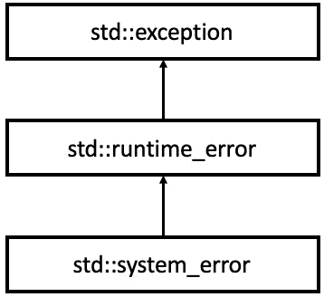

# 第五章：使用 C++ 处理错误

本章将重点介绍 C++ 中的错误处理。作为一名程序员，您不可避免地会遇到需要确定最佳方法来传播程序错误的情况。无论您使用错误代码还是异常，我们都会深入研究它们，以更好地了解如何有效地使用它们。

在本章中，我们将探讨如何使用 C++ 处理 POSIX API 报告的错误。我们将从介绍 `errno` 线程局部变量和 `strerror` 函数开始。之后，我们将介绍 `std::error_code` 和 `std::error_condition`，并演示它们如何帮助封装来自 POSIX API 的 POSIX 错误。我们还将研究自定义错误类别，这允许我们比较来自不同来源的错误，并开发平台无关的错误处理代码。

随着我们不断深入，我们将了解 C++ 中的异常以及如何将 `std::error_code` 转换为 `std::system_error` 异常。我们还将探讨一些与异常一起工作的最佳实践，例如通过值抛出异常并通过引用捕获它们。此外，我们将熟悉对象切片，这是一种在通过值而不是通过引用捕获异常时可能发生的副作用。最后，我们将深入研究 C++ 中的 RAII 技术，该技术消除了语言中 `finally` 构造的需求。

到本章结束时，您将彻底了解在 C++ 中处理错误的多种方式，并且您将熟悉创建容错代码的几种技术。

总结来说，我们将涵盖以下主题：

+   使用 C++ 处理 POSIX API 的错误

+   从错误代码到异常

好的，现在是时候开始了！

# 技术要求

本章中所有示例都在以下配置的环境中进行了测试：

+   Linux Mint 21 Cinnamon 版本

+   GCC 12.2 及编译器标志：

    +   `-std=c++20`

+   稳定的互联网连接

+   请确保您的环境至少与此一样新。对于所有示例，您还可以使用 [`godbolt.org/`](https://godbolt.org/)。

+   本章中所有代码示例均可从 [`github.com/PacktPublishing/C-Programming-for-Linux-Systems/tree/main/Chapter%205`](https://github.com/PacktPublishing/C-Programming-for-Linux-Systems/tree/main/Chapter%205) 下载。

# 使用 C++ 处理 POSIX API 的错误

在符合 POSIX 标准的系统（如 Unix 和 Linux）中，错误处理基于使用错误代码和错误消息在函数和应用程序之间通信错误。

通常情况下，当一个函数遇到错误时，它会返回一个非零错误代码并将全局变量 `errno` 设置为特定的错误值，以指示错误的性质。然后应用程序可以使用 `errno` 变量来确定错误的起因并采取适当的行动。

除了错误代码之外，POSIX 兼容的函数通常还提供描述错误性质的错误消息。这些错误消息通常使用 `strerror` 函数访问，该函数接受一个错误代码作为输入，并返回一个指向以空字符终止的字符序列的指针，包含相应的错误消息。

POSIX 错误处理风格要求开发者在每次可能失败的系统调用或函数调用之后检查错误，并以一致且有意义的方式处理错误。这可能包括记录错误消息、重试失败的操作或在发生关键错误时终止程序。

让我们看看以下示例，其中我们演示了如何使用 `errno` 变量和 `strerror()` 函数来处理 C++ 中 POSIX 函数的错误。

该示例使用 `open()` 和 `close()` POSIX 函数，这些函数试图从我们的 Linux 测试环境的文件系统中打开和关闭文件：

```cpp
#include <iostream>
#include <fcntl.h>
#include <unistd.h>
#include <cstring>
int main() {
    const int fd{open("no-such-file.txt", O_RDONLY)}; //
      {1}
    if (fd == -1) {
        std::cerr << "Error opening file: " <<
          strerror(errno) << '\n';
        std::cerr << "Error code: " << errno << '\n';
        return  EXIT_FAILURE;
    }
    // Do something with the file...
    if (close(fd) == -1) {
        std::cerr << "Error closing file: " <<
          strerror(errno) << '\n';
        std::cerr << "Error code: " << errno << '\n';
        return  EXIT_FAILURE;
    }
    return 0;
}
```

在这个例子中，我们尝试使用 `open()` 函数打开一个名为 `no-such-file.txt` 的文件进行读取；见标记 `{1}`。如果成功，`open()` 返回一个非负整数，这对应于成功打开的文件的文件描述符 ID。如果 `open()` 返回 `-1`，我们知道发生了错误，因此我们使用 `strerror(errno)` 打印错误信息，并返回 `errno` 的值，其中包含相应的错误代码。

如果 `open()` 成功，我们对文件进行一些操作，然后使用 `close()` 函数关闭它。如果 `close()` 返回 `-1`，我们再次使用 `strerror(errno)` 打印错误信息，并返回 `errno` 的值。

这是一种常见的 POSIX 函数错误处理技术。在发生错误的情况下，它们返回 `-1` 并将 `errno` 变量设置为相应的错误代码。`errno` 变量是一个 `int` 类型的 *线程局部* 可修改变量。这意味着在多线程环境中使用它是安全的。每个线程将有自己的副本，并且由该线程调用的 POSIX 方法将使用此实例来报告错误。

为了在发生错误的情况下打印有意义的消息，我们使用 `strerror()` 函数，该函数接受一个整数并尝试将其值与一组已知的系统特定错误代码描述相匹配。`open()` 函数可以报告多个错误，并根据发生的错误类型将不同的值设置为 `errno`。让我们看看示例的输出：

```cpp
Error opening file: No such file or directory
Error code: 2
```

如我们所见，`open()` 方法未能打开文件，因为它不存在。在这种情况下，它将 `errno` 设置为 `2` 的值，这对应于函数文档中指定的 `ENOENT` 值。在系统调用之前显式将 `errno` 设置为 `0` 是一种良好的做法，以确保调用之后可以读取其实际响应。

## 使用 std::error_code 和 std::error_condition

C++标准库为处理来自 POSIX 接口等低级 API 的错误提供了几个类。这些类是用于处理特定系统错误的`std::error_code`和用于处理可移植错误代码的`std::error_condition`。让我们更详细地探讨这两种风格。

### std::error_code

让我们重新整理之前的例子，以便提供一个用于创建具有特定目录路径的目录的函数：

```cpp
#include <iostream>
#include <sys/stat.h>
std::error_code CreateDirectory(const std::string& dirPath) {
    std::error_code ecode{};
    if (mkdir(dirPath.c_str(), 0777) != 0) {
        ecode = std::error_code{errno,
          std::generic_category()}; // {1}
    }
    return ecode;
}
int main() {
    auto ecode{CreateDirectory("/tmp/test")};
    if (ecode){ // {2}
        std::cerr << "Error 1: " << ecode.message() <<
          '\n';
    }
    ecode = CreateDirectory("/tmp/test"); // {3}
    if (ecode){
        std::cerr << "Error 2: " << ecode.message() <<
          '\n';
    }
    if (ecode.value() == EEXIST) {
        std::cout << "This is platform specific and not
          portable.\n";
    }
    return 0;
}
```

与我们新函数的客户端`CreateDirectory`直接使用`errno`变量来确定操作是否成功不同，我们将利用标准库提供的实用类`std::error_code`。`std::error_code`用于存储和传输由库或系统调用生成的错误代码。它是一种包装类，其中预定义了用于处理错误的错误类别。POSIX 函数返回的错误大多是标准的，因此它们在标准库中是预定义的。因此，从`errno`值创建一个`std::error_code`实例并指定该值对应于`std::generic_category()`，就像在先前的例子中的标记`{1}`所做的那样，是直截了当的。`errno`值实际上被转换成了`std::errc`枚举器的一个常量。

创建的`std::error_code`对象有两个方法可以提供有关底层错误的信息。`std::error_code::message()`方法返回一个有意义的字符串，可用于日志记录。在我们的例子中，`std::error_code::value()`方法返回最初存储在`errno`变量中的值。但用户可能最值得注意的是`std::error_code`对象中预定义的`operator bool()`。如果对象中存储了错误，它返回`true`；否则返回`false`。

如前例所示，`CreateCategory()`方法的调用者检查是否发生了错误，如果是，则获取存储在此错误中的消息；请参阅标记`{2}`。在这里，您可以找到在我们测试环境中运行的程序输出：

```cpp
Error 2: File exists
This is platform specific and not portable.
```

如程序输出所示，第一次`CreateDirectory()`调用成功，但第二次调用失败；请参阅标记`{3}`。这是因为`CreateDirectory()`的实现首先检查是否存在这样的目录，如果不存在，则为我们创建它。但如果目录已存在，`mkdir()`系统调用返回`-1`并将`errno`设置为`EEXIST`。

关于`std::error_code`类的一个重要事实是它是平台特定的。这意味着存储在其中的错误值强烈依赖于底层操作系统。在类似 POSIX 的系统（如 Linux）的情况下，我们有的错误值是`EEXIST`。但这对其他操作系统不一定成立。

因此，如果我们设计我们的代码尽可能不依赖于平台，我们需要避免以下比较：

```cpp
if (ecode.value() == EEXIST)
```

但我们还需要一种方法来确保已存在的目录不会破坏我们的程序逻辑。是的，从 POSIX 的角度来看这是一个错误，但就我们的特定业务逻辑而言，这并不是程序执行继续的问题。

### std::error_condition

解决这个问题的正确方法是有助于另一个标准库类——`std::error_condition`。正如其名所示，它的主要目的是提供条件程序逻辑。让我们对前面示例中的`CreateDirectory()`方法进行轻微的重构：

```cpp
std::error_code CreateDirectory(const std::string& dirPath) {
    std::error_code ecode{};
    if (mkdir(dirPath.c_str(), 0777) != 0) {
        std::errc cond{errno}; // {1}
        ecode = std::make_error_code(cond); // {2}
    }
    return ecode;
}
```

如您所见，与上一个示例的不同之处在于我们构建`error_code`对象的方式。在重构的代码中，我们首先创建一个`std::errc`类型的对象，并用 POSIX `errno`的值初始化它；参见标记 `{1}`。`std::errc`是一个作用域枚举类。它定义了与特定 POSIX 错误码相对应的*可移植错误条件*。这意味着我们不再依赖于与特定 POSIX 错误码相对应的平台特定宏，例如`EEXIST`，而是切换到一个无论来自哪个平台都将具有相同错误条件的错误。

重要提示

你可以在这里找到`std::errc`作用域枚举器预定义的可移植错误条件，它们对应于它们的等效 POSIX 错误码：[`en.cppreference.com/w/cpp/error/errc`](https://en.cppreference.com/w/cpp/error/errc)。

一旦我们创建了`std::errc`的一个实例，我们就将其传递给创建错误码的工厂方法——`std::make_error_code()`（参见标记 `{2}`）——它为我们生成一个通用类别的`std::error_code`。

现在，让我们看看`main()`方法是如何被修改以实现平台无关性的：

```cpp
int main() {
    auto ecode{CreateDirectory("/tmp/test")};
    if (ecode){
        std::cerr << "Error 1: " << ecode.message() <<
          '\n';
    }
    ecode = CreateDirectory("/tmp/test");
    if (ecode){
        std::cerr << "Error 2: " << ecode.message() <<
          '\n';
    }
    if (ecode == std::errc::file_exists) { // {3}
        std::cout << "This is platform agnostic and is
          portable.\n";
    }
    return 0;
}
```

我们仍然调用了两次`CreateDirectory()`方法，第二次调用仍然返回了一个`error_code`。但主要的不同之处在于我们比较`ecode`对象的方式；参见标记 `{3}`。我们不是将其与 POSIX 错误码的整数值进行比较，而是将其与一个包含可移植错误条件的对象进行比较——`std::errc::file_exists`。它具有相同的语义，表示文件已存在，但它具有平台无关性。在下一节中，我们将看到这有多么有用。

### 使用自定义错误类别

每个软件开发者都应该尽可能努力编写可移植的代码。编写可移植的代码提供了可重用性，这可以显著降低开发成本。当然，这并不总是可能的。有些情况下，你编写的代码是针对特定系统定制的。但对于所有其他情况，将你的代码从底层系统中抽象出来，可以让你轻松地将它迁移到其他系统，而无需进行大量重构以使其工作。这更安全，也更经济。

让我们回到我们之前的例子，我们试图抽象从 POSIX 系统调用接收到的错误代码。它应该可以与可移植的错误条件，如 `std::errc::file_exists` 进行比较。我们将通过以下用例扩展这一点。想象一下，我们有一个自定义库，它也处理文件。让我们称它为 `MyFileLibrary`。但这个库不支持 POSIX 错误代码。它提供了一种不同的 *类别* 的自定义错误代码，这些代码在语义上对应于一些 POSIX 代码，但具有不同的错误值。

该库支持以下错误及其相应的错误代码：

```cpp
enum class MyFileLibraryError {
    FileNotFound = 1000,
    FileAlreadyExists = 2000,
    FileBusy = 3000,
    FileTooBig = 4000
};
```

如您所见，我们的库可以返回 `FileAlreadyExists` 枚举常量，就像 `mkdir()` 系统调用一样，但具有不同的错误值 – `1000`。因此，消耗 `MyFileLibrary` 和 `mkdir()` 的主要逻辑应该能够以相同的方式处理这些错误，因为它们在语义上是相等的。让我们看看如何做到这一点。

在我们之前的例子中，我们创建了 POSIX API 返回的错误代码：

```cpp
ecode = std::error_code{errno, std::generic_category()};
```

我们使用了 `std::generic_category`，它是从基类别类 – `std::error_category` 派生出来的。它在我们标准库中是预定义的，这样它就 *知道* POSIX 错误代码。这实际上是 API 返回的实际错误代码与 `std::error_condition` 之间进行转换的地方。因此，为了使 `MyFileLibrary` 具有相同的特性，我们需要定义一个新的 `std::error_category` 派生类。我们将它命名为 `MyFileLibraryCategory`：

```cpp
class MyFileLibraryCategory : public std::error_category {
public:
    const char* name() const noexcept override { // {1}
        return "MyFileLibrary";
    }
    std::string message(int ev) const override { // {2}
        switch (static_cast<MyFileLibraryError>(ev)) {
        case MyFileLibraryError::FileAlreadyExists:
            return "The file already exists";
        default:
            return "Unsupported error";
        }
    }
    bool equivalent(int code,
                    const std::error_condition& condition)
                      const noexcept override { // {3}
        switch (static_cast<MyFileLibraryError>(code)) {
        case MyFileLibraryError::FileAlreadyExists:
            return condition == std::errc::file_exists; //
                {4}
        default:
            return false;
        }
    }
};
```

`std::error_category` 基类有几个 *虚* 方法，如果派生类中重写了这些方法，则允许自定义行为。在我们的例子中，我们重写了以下方法：

+   `name()` 方法，用于报告该错误属于哪个类别；参见标记 `{1}`

+   `message()` 方法，用于报告与特定错误值相对应的消息字符串；参见标记 `{2}`

+   `equivalent()` 方法，用于将我们的库生成的自定义错误代码与预定义的 `std::error_condition` 值进行比较

`equivalent()` 方法获取自定义错误代码，将其转换为 `MyFileLibraryError` 类型的值，并为每个特定情况决定它匹配的 `condition`；参见标记 `{3}`。

现在，既然我们有了我们新的、闪亮的自定义错误类别 – `MyFileLibraryCategory` – 让我们看看如何使用它：

```cpp
const MyFileLibraryCategory my_file_lib_category{}; // {1}
int main() {
    std::error_code file_exists{static_cast<int>
      (MyFileLibraryError::FileAlreadyExists),
       my_file_lib_category}; // {2}
    if (file_exists == std::errc::file_exists) { // {3}
        std::cout << "Msg: " << file_exists.message() <<
          '\n'; // {4}
        std::cout << "Category: " << file_exists
          .default_error_condition().category().name() <<
             '\n'; // {5}
    }
    return 0;
}
```

我们需要采取的第一步是实例化我们自定义类别的对象；参见标记 `{1}`。然后，我们创建一个 `error_code` 实例，将其初始化为 `FileAlreadyExists` 错误值，并指定它属于 `MyFileLibraryCategory` 类别；参见标记 `{2}`。由于我们有一个有效的错误代码实例 – `file_exists` – 我们现在可以将其与平台无关的 `std::errc::file_exists` 错误条件进行比较。

以下为程序的输出：

```cpp
Msg: The file already exists
Category: MyFileLibrary
```

正如您所看到的，借助我们定义的自定义错误类别`MyFileLibraryCategory`，现在可以比较由`MyFileLibrary`生成的错误和通用的`std::errc::file_exists`。相应的错误消息会显示出来（见标记 `{3}`），以及类别本身（见标记 `{4}`）。

重要提示

在这里，您可以找到`std::error_category`基类公开的所有虚拟方法的完整描述：[`en.cppreference.com/w/cpp/error/error_category`](https://en.cppreference.com/w/cpp/error/error_category)。

现在我们已经熟悉了错误代码和错误条件的使用，让我们看看如何使用 C++异常的强大机制来传播错误。

# 从错误代码到异常

异常处理是编程的一个重要方面，尤其是在处理可能破坏程序正常流程的错误时。虽然代码库中处理错误的方法有多种，但异常提供了一种强大的机制，以分离错误流程和正常程序流程的方式来处理错误。

当处理错误代码时，确保所有错误情况都得到适当处理并且代码保持可维护性可能具有挑战性。通过将错误代码封装在异常中，我们可以创建一种更实用的错误处理方法，这使得推理代码和集中捕获错误变得更加容易。

在处理代码库中的错误处理时，很难说哪种方法更好，而使用异常的决定应基于实用考虑。虽然异常可以在代码组织和可维护性方面提供显著的好处，但它们可能带来性能上的惩罚，这在某些系统中可能不可接受。

在本质上，异常是一种将正常程序流程与错误流程分离的方法。与可以忽略的错误代码不同，异常不容易被忽视，这使得它们成为确保以一致和集中方式处理错误的一种更可靠的方法。

虽然异常可能不是每个代码库的最佳选择，但它们提供了一种强大的错误处理方式，可以使代码更容易维护和推理。通过了解如何正确使用异常，程序员可以就如何在代码中处理错误做出明智的决定。让我们更深入地探讨这一点。

## `std::system_error`

在上一节中，我们创建了一个程序，该程序正确处理了 POSIX 系统调用`mkdir()`报告的错误。现在，让我们看看如何使用异常而不是错误代码来改进这个程序中的错误处理。以下是重访的`CreateDirectory()`方法：

```cpp
void CreateDirectory(const std::string& dirPath) { // {1}
    using namespace std;
    if (mkdir(dirPath.c_str(), 0777) != 0) {
        const auto ecode{make_error_code(errc{errno})}; //
           {2}
        cout << "CreateDirectory reports error: " <<
          ecode.message() << '\n';
        system_error exception{ecode}; // {3}
        throw exception; // {4}
    }
}
```

在 `CreateDirectory()` 方法中，我们使用 `mkdir()` API 进行系统调用，如果失败，则返回非零结果并将 POSIX 错误代码存储在 `errno` 变量中。到目前为止没有什么新的。就像我们之前的例子一样，我们从一个值创建一个 `std::error_code`（参见标记 `{2}`）来向我们的 `CreateDirectory()` 方法的调用者报告它。但与直接返回函数的结果错误不同，我们更愿意使用异常来做这件事，并使我们的函数 `{1}`。

由于我们已经有了一个错误代码对象被创建，我们将使用它来从它创建一个异常。为了做到这一点，我们将使用标准库中的一个预定义的异常类，该类明确定义为封装 `std::error_code` 对象 – `std::system_error`。

`std::system_error` 是从 C++ 标准库的 `std::exception` 接口类派生出来的派生类型。它被各种库函数使用，这些函数通常与 OS 功能接口，可以通过生成 `std::error_code` 或 `std::error_condition` 来报告错误。



图 5.1 – std::system_error 异常的继承图

在我们的例子中，为了创建一个 `std::system_error` 对象，我们必须将其构造函数传递给 `std::error_code ecode` 的实例，这是我们之前创建的；参见标记 `{3}`。

与从标准库的基异常类 `std::exception` 派生出来的任何其他异常一样，`std::system_error` 有一个 `what()` 方法。它的目的是报告一个有意义的字符串，解释异常背后的错误细节。更具体地说，它调用封装的 `std::error_code` 对象的 `message()` 方法，并返回其结果。

由于我们已经有了一个新的、闪亮的异常对象被创建，我们现在需要*抛出*它回到我们的 API 的调用者那里。这是通过 `throw` 关键字完成的；参见标记 `{4}`。一个重要的提示是，我们通过*值*抛出异常对象；我们不抛出对它的引用或指针。

重要提示

通常情况下，尽可能通过值传递抛出异常。

异常相对于错误代码的一个关键优点是它们*不能被调用者省略*。当一个函数返回一个错误代码时，决定是否检查返回值的是函数的调用者。有些情况下，返回值没有检查可能是由于错误，这会导致程序中的错误。当使用异常作为错误处理机制时，没有这样的可能性。一旦抛出异常，它就会沿着调用栈向上传播，直到被适当的程序异常处理逻辑捕获或达到函数栈的顶部。如果在传播路径的任何地方都没有捕获到异常，也称为*栈展开*，那么它将通过调用 `std::terminate` 函数来终止程序。

重要提示

查看以下 `std::system_error` 参考页面：[`en.cppreference.com/w/cpp/error/system_error`](https://en.cppreference.com/w/cpp/error/system_error).

现在，让我们回到我们的示例，看看 `main()` 方法应该如何重新设计以处理 `CreateDirectory()` 方法抛出的异常：

```cpp
int main() {
    try {
        CreateDirectory("/tmp/test"); // First try succeeds
        CreateDirectory("/tmp/test"); // Second try throws
    } catch (const std::system_error& se) { // {5}
        const auto econd{se.code()
          .default_error_condition()}; // {6}
        if (econd != std::errc::file_exists) { // {7}
            std::cerr << "Unexpected system error: " <<
              se.what() << '\n';
            throw; // {8}
        }
        std::cout << "Nothing unexpected, safe to
          continue.\n";
    }
    return 0;
}
```

与错误代码不同，一旦函数返回，就需要分配和检查，异常需要被捕获，并应采取适当的行动。在 C++ 中，通过语言中的 try-catch 构造来捕获异常。在前面的示例中，你可以看到我们调用了两次 `CreateDirectory()` 方法，因为第二次调用将生成一个错误，该错误将作为异常向上传播。这个异常将被标记 `{5}` 中的 `catch` 子句捕获。正如你所看到的，`catch` 子句期望一个参数，指定应该捕获什么；参见标记 `{5}`。其语法类似于函数的参数列表，其中你可以通过值或引用传递对象。

在我们的示例中，我们通过*常量引用*捕获了 `CreateDirectory()` 方法抛出的异常。我们不通过值捕获的原因是避免不必要的对象复制，更重要的是，避免*对象切片*。我们很快将深入了解 C++ 中异常捕获技术的具体细节，但现在，让我们专注于我们的当前示例。一旦捕获到异常，我们就可以从中提取 `error_condition` 对象；参见标记 `{6}`。这是可能的，因为 `system_error` 类支持错误代码和错误条件，并使我们能够获取它们。当我们有 `error_condition` 时，我们可以成功地对已知的 `errc` 代码进行检查，以确定这个异常是否是我们程序的真实问题，或者它可以被忽略；参见标记 `{7}`。

重要提示

在可能的情况下，通过引用（优先使用常量引用）而不是通过值来捕获异常，以避免潜在的切片对象和由于对象复制而产生的额外开销。

我们的业务程序逻辑预期，报告文件已存在的错误是正常的，不应该中断程序执行。最终，它表示我们尝试创建一个已存在的目录，这是可以接受的，我们可以继续。但如果错误是其他我们不知道如何处理的情况，那么我们必须报告这个错误并将其重新抛出到调用堆栈中的上层方法，这些方法可能更知道如何处理这种类型的错误。这是通过语言中的 `throw` 子句完成的；参见标记 `{8}`。这里的一个重要细节是，为了*重新抛出现有的异常*而不是抛出一个新的异常，你必须只使用带有*无参数*的 `throw;`。

重要提示

使用不带参数的 `throw;` 子句来重新抛出现有的异常。

当然，如果错误是我们预期的，比如`std::errc::file_exists`，那么我们可以安全地继续程序执行，而不需要重新抛出这个异常。你可以按照以下方式找到程序的输出：

```cpp
CreateDirectory reports error: File exists
Nothing unexpected, safe to continue.
```

我们可以看到异常是由`CreateDirectory()`方法抛出的，并在`main()`方法的`catch`子句中被捕获。在这个例子中，我们看到使用异常而不是错误码可以清楚地分离正常程序执行路径和错误路径，并使得重新抛出我们无法正确处理的错误变得更容易。

## 按值抛出，按引用捕获

在 C++中，我们实际上可以抛出每一个对象。你可以这样成功做到：

```cpp
throw 42;
```

前面的语句抛出了一个值为`42`的整数对象。但仅仅因为你能够做某事，并不意味着这样做是个好主意。异常的目标是提供错误发生的上下文。抛出`42`的值并没有提供太多上下文，对吧？对于你的异常接收者来说，`42`意味着什么？并不多！

这个说法得到了由 C++标准委员会的一些关键成员开发的核心指南项目的充分证实。无论你的专业水平如何，C++核心指南都是每个 C++开发者的一个非常有用的指南。它汇集了关于 C++不同特性的建议和最佳实践。

重要提示

确保熟悉 C++核心指南，你可以在[`isocpp.github.io/CppCoreGuidelines/CppCoreGuidelines#c-core-guidelines`](https://isocpp.github.io/CppCoreGuidelines/CppCoreGuidelines#c-core-guidelines)找到它。

C++核心指南指出，我们必须确保抛出有意义的异常。如果你没有为你的情况定义一个标准的异常，你可以抛出一个从某些标准异常派生的用户定义类型：

[`isocpp.github.io/CppCoreGuidelines/CppCoreGuidelines#e14-use-purpose-designed-user-defined-types-as-exceptions-not-built-in-types`](https://isocpp.github.io/CppCoreGuidelines/CppCoreGuidelines#e14-use-purpose-designed-user-defined-types-as-exceptions-not-built-in-types)

C++核心指南还建议我们按值抛出异常，并按引用捕获它们。当然，如果能按常量引用捕获那就更好了。按值抛出确保抛出的对象的生存期将由你的系统运行时管理。否则，如果你抛出一个指向你已在堆上分配的对象的指针，而这个对象的责任是在不再需要时删除它，那么你最终可能会遇到内存泄漏：

[`isocpp.github.io/CppCoreGuidelines/CppCoreGuidelines#e15-throw-by-value-catch-exceptions-from-a-hierarchy-by-reference`](https://isocpp.github.io/CppCoreGuidelines/CppCoreGuidelines#e15-throw-by-value-catch-exceptions-from-a-hierarchy-by-reference)

让我们通过一个例子来分析。我们将定义一个方法——`Throw()`——它通过值抛出一个带有错误代码——`bad_file_descriptor` 的 `std::system_error` 异常：

```cpp
void Throw() {
    using namespace std;
    throw system_error{make_error_code
      (errc::bad_file_descriptor)};
}
```

此方法将由 `main()` 方法调用，我们将在此捕获抛出的异常：

```cpp
int main() {
    using namespace std;
    try {
        try {
            Throw(); // {1}
        } catch (runtime_error e) { // {2}
            throw e; // {3}
        }
    } catch (const exception& e) { // {4}
        const system_error& se{dynamic_cast<const
          system_error&>(e)}; // {5}
        const auto econd{se.code()
          .default_error_condition()};
        std::cerr << econd.message() << '\n';
    }
    return 0;
}
```

如前例所示，我们定义了两个 `try-catch` 块——一个内层和一个外层。这样做的原因是，在同一个 `try-catch` 块中抛出的异常不能被另一个 `catch` 子句捕获。它们会被传播出去，因此，为了捕获它们，我们需要一个外部的 `try-catch` 块。

在标记 `{1}` 中，我们调用了 `Throw()` 方法，它抛出了一个异常。但在标记 `{2}` 中，我们捕获了这个抛出的异常。实际上，我们没有直接捕获 `std::system_error`，而是捕获了它的父类——`std::runtime_error`。你也可以看到，我们通过 `runtime_error e` 的方式通过值捕获了这个异常。

一旦捕获到 `runtime_error` 异常，我们采取的唯一行动就是通过以下语句将其从内层 `try-catch` 块中抛出：

```cpp
throw e;
```

在重新抛出现有异常时，一定要小心。上面的语句**没有重新抛出**在 `catch` 子句中捕获的异常，而是抛出了一个新的 `runtime_error` 异常实例，它是捕获到的异常的副本。

一旦抛出了新的异常，它就会被标记 `{4}` 中的外部 `catch` 子句捕获。正如你所见，我们遵循了 C++ 核心指南的建议，捕获了一个常量引用而不是标准库的基类异常类——`std::exception`——它也是 `std::runtime_error` 的基类。

在 `catch` 子句中，我们尝试将其向下转换为原始类型——`std::system_error`——并打印其 `std::error_condition` 中的消息。让我们看看程序的输出：

```cpp
terminate called after throwing an instance of 'std::bad_cast'
  what():  std::bad_cast
```

但令人惊讶的是，我们没有得到预期的结果。向下转换失败了，当它失败时，会生成一个标准异常——`std::bad_cast`——这个异常从外部 `catch` 子句中被抛出。但这个异常没有被另一个 `try-catch` 块保护，因此它传播出了 `main()` 方法，这在事实上是程序函数栈的顶部。正如我们之前解释的，如果在函数栈向上传播过程中没有捕获到异常，那么将会调用 `std::terminate` 函数。

但为什么当我们尝试向下转换为 `std::system_error` 时，转换失败了？原因是 `Throw()` 方法抛出了 `std::system_error`，理论上一切应该正常工作。嗯，应该是这样的，但实际上并没有。让我们深入探讨这个问题。

`Throw()` 方法实际上是通过值抛出一个 `std::system_error` 实例。但内层 `catch` 子句通过值捕获了一个基类异常，并抛出了它的一个副本：

```cpp
catch (runtime_error e) {
    throw e;
}
```

这导致了一个问题，因为我们重新抛出的对象不再是`std::system_error`的实例。它已经被裁剪到其基类——`std::runtime_error`。所有原本属于*原始* `std::system_error`对象的信息现在不再是新创建的*副本*的`std::runtime_error`——`e`类型的一部分。

因此，向下转换为`std::system_error`失败，我们的程序终止。

总结来说，我们可以通过遵循通过值抛出异常、通过引用捕获异常以及尽可能重新抛出现有异常而不是它们的副本的规则来成功防止这类错误。

## try/catch … finally

你可能已经注意到，在 C++语言中，我们有`try-catch`块，但没有`finally`构造。如果你有 C#或 Java 等语言的经验，你将习惯于使用`finally`子句来释放你使用过的资源。但这种方法只适用于异常情况，其中`try`子句在`finally`的使用之前。

但在没有`finally`的情况下，我们如何在 C++中实现呢？让我们回顾一下使用`open()`和`close()` POSIX 函数打开和关闭文件的初始示例：

```cpp
int main() {
    try {
        const int fd{open("/tmp/cpp-test-file", O_RDONLY)};
          // {1}
        if (fd == -1) { return errno; }
        // Do something with the file and suddenly
          something throws {2}
        if (close(fd) == -1) { return errno; } // {3}
    } catch (...) {
        std::cerr << "Something somewhere went terribly
          wrong!\n";
        return -1;
    }
    return 0;
}
```

如同我们在本章前面讨论的那样，使用`open()` POSIX 方法打开文件会返回文件描述符的 ID，如果函数成功打开文件；否则，就像许多 POSIX 函数一样，它返回`-1`；见标记 `{1}`。

一旦你的文件被打开，确保它在最终关闭时的责任就落在了你身上。因此，我们在`main()`方法的末尾调用`close()`方法来确保文件在离开`main()`之前被关闭（见标记 `{3}`）。但是，你怎么能确保在关闭文件之前不会发生某些异常情况，不会抛出异常呢？实际上，唯一可以确保这种情况不会发生的情况是如果你的系统中不支持异常。但在我们的测试 Linux 环境中，情况并非如此。更糟糕的是，在实际的代码库中工作，很难确保你在正常业务逻辑执行过程中调用的某些方法不会抛出异常。

想象一下，如果你的程序在关闭文件之前抛出异常会发生什么；见标记 `{2}`。实际上，你将*泄露*资源。作为一个经验法则，我们永远不应该泄露资源，无论这会不会导致问题。

但如果没有语言中的`finally`子句，我们如何保护自己不泄露资源呢？让我们来看看最典型的 C++编程技术之一：

```cpp
void Throw() {
    cout << "Ops, I need to throw ...\n";
    throw system_error{make_error_code
      (errc::bad_file_descriptor)};
}
int main() {
    const string_view myFileName{"/tmp/cpp-test-file"}; //
      {1}
    ofstream theFile(myFileName.data()); // {2}
    try {
        file_guard guard(myFileName, O_RDONLY); // {3}
        const auto fd = guard.getFileDescriptor();
        Throw(); // {4}
    } catch (const exception& e) {
        cout << e.what();
        return -1;
    }
    return 0;
}
```

我们已经重新设计了`main()`方法，使其仅创建一个文件（见标记 `{2}`），并将文件名（见标记 `{1}`）传递给一个新的`file_guard`类型对象（见标记 `{3}`），我们稍后将对其进行探讨。`file_guard`对象负责以特定名称打开和关闭文件：

```cpp
using namespace std;
class file_guard final {
public:
    file_guard(string_view file, mode_t mode) : // {5}
        fd{open(file.data(), mode)}
    {
        if (fd == -1) {
            throw system_error
              {make_error_code(errc{errno})};
        }
        cout << "File '" << file <<
        "' with file descriptor '" <<
        fd << "' is opened.\n";
    }
    explicit file_guard(const file_guard&) = delete; // {6}
    file_guard& operator=(const file_guard&) = delete;
    explicit file_guard(file_guard&& other) noexcept : //
      {7}
        fd{move(other.fd)} { other.fd = -1; }
    file_guard& operator=(file_guard&& other) noexcept
    {
        fd = move(other.fd);
        other.fd = -1;
        return *this;
    }
    int getFileDescriptor() const noexcept { // {8}
        return fd;
    }
    ~file_guard() noexcept { // {9}
        if (fd != -1) {
            close(fd);
            cout << "File with file descriptor '" << fd <<
              "' is closed.\n";
        }
    }
private:
    int fd;
};
```

类在其构造函数中获取文件路径和文件应打开的模式；见标记 `{5}`。在构造函数的初始化列表中，调用 POSIX 的`open()`方法。结果是文件描述符 ID，被分配给类的`_fd`成员。如果`open()`失败，异常将从`file_guard`构造函数抛出。在这种情况下，我们不需要担心关闭文件，因为我们没有成功打开它。

在类的析构函数中，我们有相反的操作；见标记 `{9}`。如果文件描述符不是`-1`，这意味着在该之前文件已被成功打开，我们将关闭它。

这种 C++编程技术被称为**资源获取即初始化**，或简称**RAII**。它是一种资源管理技术，在 RAII 对象的构造过程中获取资源，并在该对象的销毁过程中释放资源。与使用自动垃圾回收且资源释放时机对用户来说并不完全清晰的 Java 和 C#等语言不同，C++对象具有精确定义的存储持续时间和生命周期。因此，我们可以依赖这一特性，并利用 RAII 对象来管理我们的资源。

回到我们的`main()`方法，如果文件已打开（见标记 `{3}`），但在显式关闭之前发生错误，我们可以确信一旦`file_guard`对象超出作用域，它将被自动关闭。

这种技术无论系统是否有异常处理机制都广泛使用。您可以使用 RAII（Resource Acquisition Is Initialization，资源获取即初始化）封装资源，并确保它们将在离开 RAII 对象的作用域时自动释放。

在我们的`file_guard`示例中，我们移除了拷贝构造函数和拷贝赋值运算符，只留下了移动构造函数和移动运算符，声称这个 RAII 对象是不可拷贝的。

C++经常被质疑没有`finally`构造。然而，C++的发明者 Bjarne Stroustrup 解释说，RAII 是一个更好的替代品：[`www.stroustrup.com/bs_faq2.xhtml#finally`](https://www.stroustrup.com/bs_faq2.xhtml#finally)。

Stroustrup 认为，在实际的代码库中，资源获取和释放的操作要多得多，使用 RAII 而不是`finally`会导致代码更少。此外，它更不容易出错，因为 RAII 包装器只需要编写一次，而且不需要手动释放资源。

标准库中有许多 RAII 对象的示例，例如`std::unique_ptr`、`std::lock_guard`和`std::fstreams`。

# 摘要

本章介绍了在 C++中使用 POSIX API 进行错误处理的各种技术。我们讨论了`errno`的使用，这是一个线程局部变量，以及`strerror`函数。我们还探讨了`std::error_code`和`std::error_condition`如何封装 POSIX 错误，以及自定义错误类别如何使我们能够比较不同来源生成的错误，并开发平台无关的错误处理代码。此外，我们还深入探讨了 C++中的异常，以及如何将`std::error_code`转换为`std::system_error`类型的异常。

我们还探讨了处理异常的最佳实践，例如通过值抛出异常并通过引用捕获异常，以避免对象切片等问题。最后，我们学习了 C++中的 RAII 技术，它消除了在语言中需要`finally`结构的需要。

在下一章中，我们将探讨使用 C++的并发主题。

# 第二部分：系统编程的高级技术

在这部分，你将学习关于 C++20 高级特性的专业知识，这将进一步提高你的操作系统和 C++开发技能。虽然示例仍然实用，但变得更加复杂，需要一些关于系统编程主题的初步了解。

本部分包含以下章节：

+   *第六章**，使用 C++进行并发系统编程*

+   *第七章**，进行进程间通信*

+   *第八章**，在 Linux 中使用时钟、定时器和信号*

+   *第九章**，理解 C++内存模型*

+   *第十章**，在系统编程中使用 C++协程*
