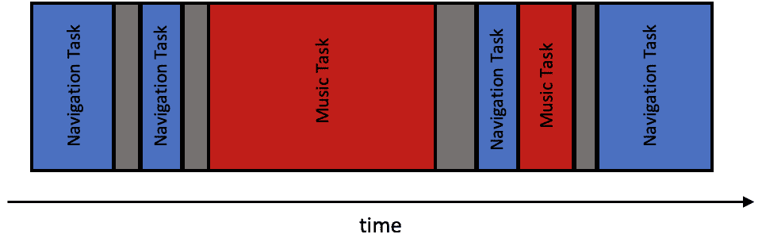
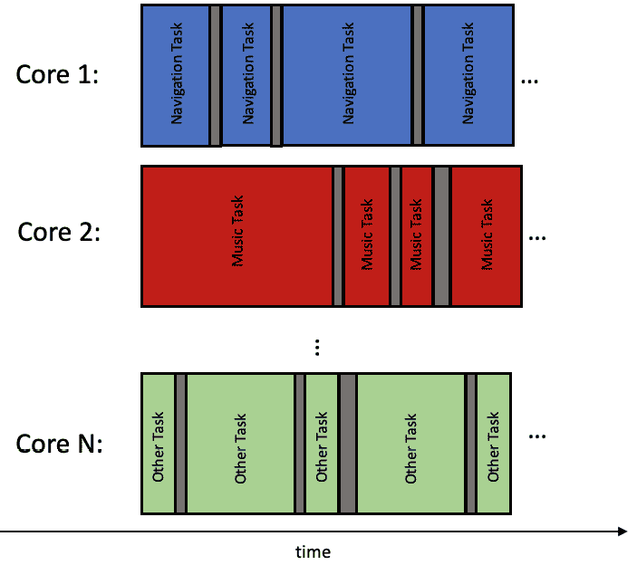
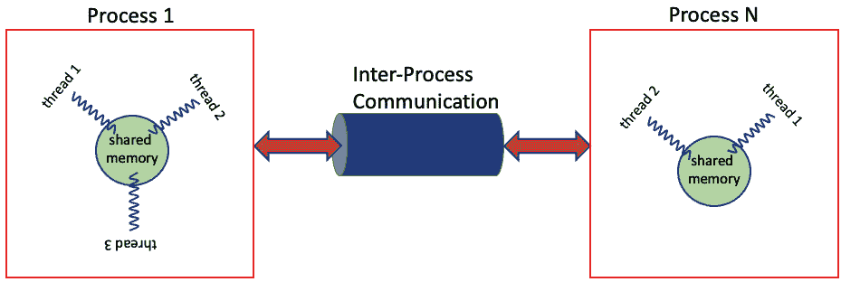
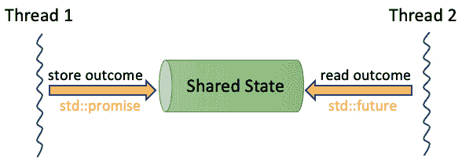

# 使用 C++ 进行并发系统编程

在本章中，我们将探讨并发意味着什么，以及它与并行性的区别。我们将了解进程和线程的基本原理和理论。我们将探讨 C++ 内存模型的变化，这些变化强制语言支持原生并发。我们还将熟悉什么是竞态条件，它如何导致数据竞争，以及如何防止数据竞争。接下来，我们将熟悉 C++20 的 `std::jthread` 原语，它使多线程支持成为可能。我们将了解 `std::jthread` 类的细节，以及如何使用 `std::stop_source` 原语停止已运行的 `std::jthread` 实例。最后，我们将学习如何同步并发代码的执行，以及如何从执行的任务中报告计算结果。我们将学习如何使用 C++ 同步原语，如 *屏障* 和 *闩锁* 来同步并发任务的执行，以及如何使用 *承诺* 和 *未来* 正确报告这些任务的结果。

总结来说，在本章中，我们将涵盖以下主题：

+   什么是并发？

+   线程与进程

+   使用 C++ 进行并发

+   揭秘竞态条件和数据竞争

+   实践多线程

+   并行执行期间共享数据

那么，让我们开始吧！

# 技术要求

本章中的所有示例都在以下配置的环境中进行了测试：

+   Linux Mint 21 Cinnamon 版本

+   GCC 12.2 与编译器标志 – `-std=c++20 -pthread`

+   稳定的互联网连接

+   请确保您的环境至少是这个版本。对于所有示例，您还可以使用 [`godbolt.org/`](https://godbolt.org/)。

+   本章中的所有代码示例均可从 [`github.com/PacktPublishing/C-Programming-for-Linux-Systems/tree/main/Chapter%206`](https://github.com/PacktPublishing/C-Programming-for-Linux-Systems/tree/main/Chapter%206) 下载。

# 什么是并发？

现代汽车已经成为高度复杂的机器，不仅提供交通功能，还提供各种其他功能。这些功能包括信息娱乐系统，允许用户播放音乐和视频，以及加热和空调系统，调节乘客的气温。考虑一个这样的场景，这些功能不能同时工作。在这种情况下，驾驶员必须在开车、听音乐或保持舒适气候之间做出选择。这并不是我们对汽车的期望，对吧？我们期望所有这些功能都能同时可用，增强我们的驾驶体验，提供舒适的旅程。为了实现这一点，这些功能必须并行运行。

但是它们真的并行运行，还是只是并发运行？有什么区别吗？

在计算机系统中，**并发**和**并行**在某些方面是相似的，但它们并不相同。想象一下，你有一些工作要做，但这些工作可以分成几个独立的小部分。并发指的是多个工作部分在重叠的时间间隔内开始、执行和完成，没有保证特定的执行顺序。另一方面，并行是一种执行策略，这些部分在具有多个计算资源的硬件上同时执行，例如多核处理器。

当多个工作部分，我们称之为**任务**，在一定时间内以未指定的顺序执行时，就会发生并发。操作系统可能会运行一些任务，并强制其他任务等待。在并发执行中，任务持续争取执行槽位，因为操作系统不保证它们会一次性执行所有任务。此外，在任务执行过程中，它可能会突然被暂停，另一个任务开始执行。这被称为**抢占**。很明显，在并发任务执行中，任务的执行顺序是没有保证的。

让我们回到我们的汽车例子。在现代汽车中，信息娱乐系统负责同时执行许多活动。例如，它可以在运行导航部分的同时让你听音乐。这是可能的，因为系统可以并发地运行这些任务。它在处理音乐内容的同时运行与路线计算相关的任务。如果硬件系统只有一个核心，那么这些任务应该并发运行：



图 6.1 – 并发任务执行

从前面的图中，你可以看到每个任务以不可预测的顺序获得非确定性的执行时间。此外，没有保证你的任务会在下一个任务开始之前完成。这就是抢占发生的地方。当你的任务正在运行时，它突然被暂停，另一个任务被安排执行。请记住，任务切换不是一个便宜的过程。系统消耗处理器的计算资源来执行这个动作——进行上下文切换。结论应该是这样的：我们必须设计我们的系统来尊重这些限制。

另一方面，并行是一种并发形式，涉及在**独立的处理单元**上同时执行多个操作。例如，具有多个 CPU 的计算机可以并行执行多个任务，这可以导致性能的显著提升。你不必担心上下文切换和抢占。尽管如此，它也有其缺点，我们将详细讨论。



图 6.2 – 并行任务执行

回到我们的汽车例子，如果信息娱乐系统的 CPU 是多核的，那么导航系统的相关任务可以在一个核心上执行，而音乐处理任务可以在其他一些核心上执行。因此，你不需要采取任何行动来设计你的代码以支持抢占。当然，这只有在你能确定你的代码将在这样的环境中执行时才成立。

并发与并行之间的基本联系在于，并行性可以应用于并发计算，而不会影响结果的准确性，但仅仅并发并不保证并行性。

总结来说，并发是计算中的一个重要概念，它允许同时执行多个任务，尽管这并不保证。这可能会导致性能提升和资源利用效率的提高，但代价是代码更加复杂，需要尊重并发带来的陷阱。另一方面，从软件角度来看，真正并行执行代码更容易处理，但必须由底层系统支持。

在下一节中，我们将熟悉 Linux 中执行线程和进程之间的区别。

# 线程与进程

在 Linux 中，**进程**是正在执行程序的实例。一个进程可以有一个或多个执行线程。**线程**是可以在同一进程内独立于其他线程执行的指令序列。

每个进程都有自己的内存空间、系统资源和执行上下文。进程之间是隔离的，默认情况下不共享内存。它们只能通过文件和**进程间通信**（**IPC**）机制，如管道、队列、套接字、共享内存等来通信。

另一方面，线程是进程内的轻量级执行单元。从非易失性内存中加载指令到 RAM 或甚至缓存的开销已经由创建线程的进程——父进程——承担。每个线程都有自己的堆栈和寄存器值，但共享父进程的内存空间和系统资源。因为线程在进程内共享内存，所以它们可以轻松地相互通信并同步自己的执行。一般来说，这使得它们在并发执行方面比进程更有效率。



图 6.3 – IPC

进程和线程之间的主要区别如下：

+   **资源分配**：进程是独立的实体，拥有自己的内存空间、系统资源和调度优先级。另一方面，线程与它们所属的进程共享相同的内存空间和系统资源。

+   **创造与销毁**：进程是由操作系统创建和销毁的，而线程是由它们所属的进程创建和管理的。

+   **上下文切换**：当发生上下文切换时，操作系统会切换整个进程上下文，包括其所有线程。相比之下，线程上下文切换只需要切换当前线程的状态，这在一般情况下更快，资源消耗也更少。

+   **通信和同步**：使用管道、队列、套接字和共享内存等 IPC 机制来启用进程间的通信。另一方面，线程可以通过在同一个进程内共享内存来直接通信。这也使得线程之间的同步变得高效，因为它们可以使用锁和其他同步原语来协调对共享资源的访问。

重要提示

Linux 在内核中调度任务，这些任务要么是线程，要么是单线程进程。每个任务都通过内核线程来表示；因此，调度器不会区分线程和进程。

进程和线程在现实生活中有它们的类比。假设你正在与一组人合作完成一个项目，项目被划分为不同的任务。每个任务代表需要完成的工作单元。你可以将项目视为进程，每个任务视为线程。

在这个类比中，进程（项目）是一系列需要完成以实现共同目标的关联任务集合。每个任务（线程）是一个独立的工作单元，可以被分配给特定的人来完成。

当你将一项任务分配给某个人时，你就在项目中（进程）创建了一个新的线程。被分配任务（线程）的人可以独立地工作，而不会干扰到他人的工作。他们还可以与其他团队成员（线程）沟通，协调他们的工作，就像进程内的线程可以相互沟通一样。他们还需要使用共同的资源来完成他们的任务。

相反，如果你将项目划分为不同的项目，你将创建多个进程。每个进程都有自己的资源、团队成员和目标。确保这两个进程共享项目完成所需的资源变得更加困难。

因此，计算机中的进程和线程分别类似于现实生活中的项目和任务。进程代表需要完成以实现共同目标的关联任务集合，而线程是独立的工作单元，可以被分配给特定的人来完成。

在 Linux 中，进程是具有自己内存和资源的程序实例，而线程是进程内的轻量级执行单元，它们共享相同的内存和资源。线程可以更有效地进行通信，更适合需要并行执行的任务，而进程提供了更好的隔离和容错能力。

考虑到所有这些，让我们看看如何在 C++中编写并发代码。

# C++的并发

C++ 语言自 C++11 起就内置了对管理并发线程的支持。但它没有为管理并发进程提供任何原生支持。C++ 标准库提供了各种用于线程管理、线程间同步和通信、保护共享数据、原子操作和并行算法的类。**C++ 内存模型**也是考虑到线程意识而设计的。这使得它成为开发并发应用程序的一个很好的选择。

使用 C++ 进行多线程是指在一个程序中同时运行多个执行线程的能力。这允许程序利用多个 CPU 核心，并行执行任务，从而加快任务完成速度并提高整体性能。

C++ 标准库引入了 `std::thread` 线程管理类。一旦实例化，用户就有责任处理线程的目标。用户必须选择是连接线程还是将其从父线程中分离。如果他们不加以管理，程序将终止。

随着 C++20 的发布，引入了一个全新的线程管理类 `std::jthread`。它使得创建和管理线程相对容易。要创建一个新线程，你可以创建 `std::jthread` 类的实例，传递你想要在单独线程中运行的函数或可调用对象。与 `std::thread` 相比，`std::jthread` 的一个关键优势是，你不必显式地担心将其连接。它将在 `std::jthread` 销毁时自动完成。在本章的后面部分，我们将更深入地探讨 `std::jthread` 以及如何使用它。

请记住，多线程也会使程序变得更加复杂，因为它需要仔细管理共享资源和线程同步。如果管理不当，多线程可能导致死锁和竞态条件等问题，这些问题可能导致程序挂起或产生意外的结果。

此外，多线程要求开发者确保代码是线程安全的，这可能是一项具有挑战性的任务。并非所有任务都适合多线程；有些任务如果尝试并行化，实际上可能会运行得更慢。

总体而言，使用 C++ 进行多线程可以在性能和资源利用方面提供显著的好处，但它也要求仔细考虑潜在挑战和陷阱。

现在，让我们熟悉一下编写并发代码最常见的陷阱。

# 揭秘竞态条件和数据竞争

在 C++中，多线程支持首次在 C++11 语言版本中引入。C++11 标准提供的关键元素之一是内存模型，它有助于促进多线程。内存模型解决两个问题：对象在内存中的布局以及对这些对象的并发访问。在 C++中，所有数据都由对象表示，这些对象是具有各种属性（如类型、大小、对齐、生命周期、值和可选名称）的内存块。每个对象在内存中保持一段时间，并存储在一个或多个内存位置中，这取决于它是一个简单的标量对象还是一个更复杂的数据类型。

在 C++的多线程编程中，考虑如何处理多个线程对共享对象的并发访问至关重要。如果两个或更多线程尝试访问不同的内存位置，通常不会有问题。然而，当线程尝试同时写入同一内存位置时，可能会导致数据竞争，这可能导致程序中出现意外的行为和错误。

重要提示

数据竞争发生在多个线程尝试访问数据，并且至少有一个线程尝试修改它，而没有采取预防措施来同步内存访问时。数据竞争可能导致程序中出现未定义的行为，并成为问题的来源。

但你的程序是如何出现数据竞争的？这发生在存在未妥善处理的竞态条件时。让我们来看看数据竞争和竞态条件的区别：

+   **竞态条件**：一种代码的正确性取决于特定时间或严格操作顺序的情况

+   **数据竞争**：当两个或更多线程访问一个对象，并且至少有一个线程修改它时

基于这些定义，我们可以推断出，你程序中发生的每一个数据竞争都是由于没有正确处理竞态条件的结果。但反之并不总是成立：并非每个竞态条件都会导致数据竞争。

通过查看示例来理解竞态条件和数据竞争是最佳方式。让我们想象一个原始的银行系统，一个非常原始的系统，我们希望它不存在于任何地方。

比尔和约翰在一家银行有账户。比尔账户中有 100 美元，约翰账户中有 50 美元。比尔总共欠约翰 30 美元。为了还清债务，比尔决定向约翰的账户进行两次转账。第一次转账 10 美元，第二次转账 20 美元。所以实际上，比尔将偿还约翰。两次转账完成后，比尔账户中剩下 70 美元，而约翰账户累计达到 80 美元。

让我们定义一个包含账户所有者姓名和他们在某一时刻的账户余额的`Account`结构：

```cpp
struct Account {
    Account(std::string_view the_owner, unsigned
      the_amount) noexcept :
        balance{the_amount}, owner{the_owner} {}
    std::string GetBalance() const {
        return "Current account balance of " + owner +
                " is " + std::to_string(balance) + '\n';
    }
private:
    unsigned balance;
    std::string owner;
};
```

在 `Account` 结构中，我们还将添加 `+=` 和 `-=` 重载操作符方法。这些方法分别负责向相应的账户存入或提取特定金额的钱。在每个操作之前和之后，都会打印出账户的当前余额。以下是这些操作符的定义，它们是 `Account` 结构的一部分：

```cpp
Account& operator+=(unsigned amount) noexcept {
        Print(" balance before depositing: ", balance,
          owner);
        auto temp{balance}; // {1}
        std::this_thread::sleep_for(1ms);
        balance = temp + amount; // {2}
        Print(" balance after depositing: ", balance,
          owner);
        return *this;
    }
    Account& operator-=(unsigned amount) noexcept {
        Print(" balance before withdrawing: ", balance,
          owner);
        auto temp{balance}; // {1}
        balance = temp - amount; // {2}
        Print(" balance after withdrawing: ", balance,
          owner);
        return *this;
    }
```

查看操作符函数的实现过程可以看出，它们首先读取账户的当前余额，然后将其存储在一个局部对象中（标记为 `{1}`），最后，使用局部对象的值，根据指定的金额进行增加或减少。

简单到不能再简单了！

账户新余额的结果被写回到 `Account` 结构的 `balance` 成员中（标记为 `{2}`）。

我们还需要定义一个负责实际钱款转账的方法：

```cpp
void TransferMoney(unsigned amount, Account& from, Account& to) {
    from -= amount; // {1}
    to += amount; // {2}
}
```

它所做的唯一事情是从一个账户（标记为 `{1}`）中提取所需金额，并将其存入另一个账户（标记为 `{2}`），这正是我们成功在账户之间转账所需要做的。

现在，让我们看看我们的 `main` 程序方法，它将执行我们的示例：

```cpp
int main() {
    Account bill_account{"Bill", 100}; // {1}
    Account john_account{"John", 50}; // {2}
    std::jthread first_transfer{[&](){ TransferMoney(10,
      bill_account, john_account); }}; // {3}
    std::jthread second_transfer{[&](){ TransferMoney(20,
      bill_account, john_account); }}; // {4}
    std::this_thread::sleep_for(100ms); // {5}
    std::cout << bill_account.GetBalance(); // {6}
    std::cout << john_account.GetBalance(); // {7}
    return 0;
}
```

首先，我们需要为比尔和约翰创建账户，并分别存入 $100 和 $70（标记为 `{1}` 和 `{2}`）。然后，我们必须进行实际的钱款转账：一次转账 $10，另一次转账 $20（标记为 `{3}` 和 `{4}`）。我知道这段代码可能对你来说看起来不熟悉，但别担心，我们将在本章中很快深入探讨 `std::jthread`。

目前你必须知道的重要细节是，我们试图通过 C++ 多线程库的帮助，使两次转账 *并发* 进行。在过程结束时，我们为两个执行线程设置了一些时间来完成钱款转账（标记为 `{5}`）并打印结果（标记为 `{6}` 和 `{7}`）。正如我们之前讨论的，转账完成后，比尔应该在他的账户中有 $70，而约翰应该有 $80。

让我们看看程序输出：

```cpp
140278035490560 Bill balance before withdrawing: 100
140278027097856 Bill balance before withdrawing: 100
140278027097856 Bill balance after withdrawing: 80
140278035490560 Bill balance after withdrawing: 90
140278027097856 John balance before depositing: 50
140278035490560 John balance before depositing: 50
140278027097856 John balance after depositing: 70
140278035490560 John balance after depositing: 60
Current account balance of Bill is 80
Current account balance of John is 60
```

等等，比尔有 $80，而约翰有 $60！这是怎么可能的？

这是因为我们创建了一个导致 *竞争条件* 的 *数据竞争*！让我们来解释一下。更深入地查看 `operator+=` 方法的实现，我们可以发现问题。顺便说一下，其他操作符方法的情况也是完全相同的：

```cpp
Account& operator+=(unsigned amount) noexcept {
    Print(" balance before withdrawing: ", balance, owner);
    auto temp{balance}; // {1}
    std::this_thread::sleep_for(1ms); // {2}
    balance = temp + amount; // {3}
    Print(" balance after withdrawing: ", balance, owner);
    return *this;
}
```

在标记 `{1}` 处，我们将账户的当前余额缓存到一个位于栈上的局部对象中。

重要提示

C++ 内存模型保证每个线程都有其自己的所有具有自动存储期的对象的副本——栈对象。

接下来，我们给当前执行线程至少`1ms`的休息时间（标记 `{2}`）。通过这个语句，我们将线程置于休眠状态，允许其他线程（如果有）获取处理器时间并开始执行。到目前为止，没有什么可担心的，对吧？一旦线程重新开始执行，它将使用账户余额的缓存值，并增加新的金额。最后，它将新计算出的值存储回`Account`结构的`balance`成员。

仔细观察程序的输出，我们注意到以下内容：

```cpp
140278035490560 Bill balance before withdrawing: 100
140278027097856 Bill balance before withdrawing: 100
140278027097856 Bill balance after withdrawing: 80
140278035490560 Bill balance after withdrawing: 90
```

第一次转账开始执行。它作为具有`140278035490560`标识符的线程的一部分运行。我们看到在第一次提款完成之前，第二次提款也开始执行。其标识符为`140278027097856`。第二次提款首先完成提款，使得比尔的银行账户余额变为 80 美元。然后，第一次提款重新开始。但接下来发生了什么？它并没有从比尔的账户中再取出 10 美元，而是实际上退还了 10 美元！这是因为第一个线程在已经缓存了初始账户余额 100 美元时被挂起。这创建了一个*竞态条件*。同时，第二次转账已经改变了账户余额，现在当第一个转账重新开始执行时，它已经使用过时的缓存值。这导致盲目地用过时的值覆盖了更新的账户余额。发生了*数据竞态*。

## 我们如何避免它们？

幸运的是，C++编程语言提供了各种并发控制机制来解决这些挑战，例如原子操作、锁、信号量、条件变量、屏障等。这些机制有助于确保共享资源以可预测和安全的方式被访问，并且线程能够有效地协调以避免数据竞态。在接下来的章节中，我们将深入了解一些这些同步原语。

# 实践中的多线程

在计算机科学中，一个执行线程是一系列可以被操作系统调度器独立管理的代码指令序列。在 Linux 系统中，线程始终是进程的一部分。C++线程可以通过标准提供的多线程能力相互并发执行。在执行过程中，线程共享公共内存空间，与每个进程都有自己的内存空间不同。具体来说，进程的线程共享其可执行代码、动态和全局分配的对象，这些对象没有被定义为`thread_local`。

## Hello C++ jthread

每个 C++程序都至少包含一个线程，这就是运行`int main()`方法的线程。多线程程序在主线程执行的某个点上启动额外的线程。让我们看看一个简单的 C++程序，它使用多个线程将输出打印到标准输出：

```cpp
#include <iostream>
#include <thread>
#include <syncstream>
#include <array>
int main() {
    std::array<std::jthread, 5> my_threads; // Just an
      array of 5 jthread objects which do nothing.
    const auto worker{[]{
        const auto thread_id = std::
           this_thread::get_id();  // 3
        std::osyncstream sync_cout{std::cout};
        sync_cout << "Hello from new jthread with id:"
                  << thread_id << '\n';
    }};
    for (auto& thread : my_threads) {
        thread = std::jthread{worker}; // This moves the
          new jthread on the place of the placeholder
    }
    std::osyncstream{std::cout} << "Hello Main program
      thread with id:" << std::this_thread::get_id() <<
        '\n';
    return 0; // jthread dtors join them here.
}
```

当程序启动时，进入 `int main()` 方法。到目前为止没有什么令人惊讶的。在执行开始时，我们在方法栈上创建了一个变量，称为 `my_threads`。它是一种 `std::array` 类型，其中包含五个元素。`std::array` 类型代表标准库中的一个容器，封装了 C 风格的固定大小数组。它具有标准容器的优点，例如知道自己的大小，支持赋值，随机访问迭代器等。与 C++ 中的任何其他数组类型一样，我们需要指定它包含什么类型的元素。在我们的例子中，`my_threads` 包含五个 `std::jthread` 对象。`std::jthread` 类是在 C++20 标准发布时引入到 C++ 标准库中的。它代表一个执行线程，就像 `std::thread`，它在 C++11 的发布中引入。与 `std::thread` 相比，`std::jthread` 的一些优点是它在销毁时会自动重新连接，并且在某些特定情况下可以被取消或停止。它定义在 `<thread>` 头文件中；因此，我们必须包含它才能成功编译。

是的，你问的是正确的问题！如果我们已经定义了一个 `jthread` 对象的数组，它们实际上执行什么工作呢？预期是每个线程都与一些需要完成的工作相关联。但在这里，简单的答案是 *没有*。我们的数组包含五个 `jthread` 对象，实际上并不代表一个执行线程。它们更像是一个占位符，因为当 `std::array` 被实例化时，如果没有传递其他参数，它也会使用它们的默认构造函数创建包含的对象。

现在我们定义一些线程可以与之关联的工作者。`std::jthread` 类接受任何 *可调用* 类型作为工作者。这类类型提供单个可调用的操作。这类类型的广泛例子包括函数对象和 lambda 表达式，我们已经在 *第四章* 中详细介绍了。在我们的例子中，我们将使用 lambda 表达式，因为它们提供了一种创建匿名函数对象（functors）的方法，这些对象可以内联使用或作为参数传递。C++11 中 lambda 表达式的引入简化了创建匿名函数对象的过程，使其更加高效和直接。以下代码展示了我们定义的工作者方法作为一个 lambda 表达式：

```cpp
const auto worker{[]{
    const auto thread_id = std::this_thread::get_id();
    std::osyncstream sync_cout{std::cout};
    sync_cout << "Hello from new jthread with id:" <<
      thread_id << '\n';
}};
```

定义好的 lambda 表达式`const auto worker{…};`相当简单。它在函数栈上实例化。它没有输入参数，也不捕获任何外部状态。它所做的唯一工作是向标准输出打印`jthread`对象的 ID。C++标准并发支持库提供的每个线程都有一个与之关联的唯一标识符。`std::this_thread::get_id()`方法返回被调用的特定线程的 ID。这意味着如果这个 lambda 表达式被传递到几个不同的线程，它应该打印出不同的线程 ID。

由许多并发线程向`std::cout`打印可能会产生意想不到的结果。`std::cout`对象被定义为全局的、线程安全的对象，这确保了写入它的每个字符都是原子性的。然而，对于字符串等字符序列没有提供任何保证，并且当多个线程同时向`std::cout`写入字符串时，输出很可能是这些字符串的混合。嗯，这并不是我们真正想要的。我们期望每个线程都能完全打印出它的消息。因此，我们需要一个同步机制，确保将字符串写入`std::cout`是完全原子的。幸运的是，C++20 在`<syncstream>`标准库头文件中引入了一整套新的类模板，它提供了同步线程向同一个流写入的机制。其中之一是`std::osyncstream`。你可以像使用常规流一样使用它。只需通过传递`std::cout`作为参数来创建它的一个实例。然后，借助其`std::basic_ostream& operator<<(...)`类方法，你可以插入数据，就像常规流一样。保证一旦`std::osyncstream`对象超出作用域并被销毁，所有插入的数据都将被原子性地刷新到输出。在我们的例子中，`sync_cout`对象将在 lambda 即将完成其执行并离开作用域时被销毁。这正是我们想要的行为。

最后，我们准备给我们的线程分配一些工作去做。这意味着我们需要将工作 lambda 函数与`my_threads`数组中的五个线程关联起来。但是`std::jthread`类型只支持在其构造过程中添加工作方法。这就是为什么我们需要创建其他的`jthread`对象，并用它们替换`my_threads`数组中的占位符：

```cpp
for (auto& thread : my_threads) {
    thread = jthread{worker}; // This moves the new jthread
      on the place of the placeholder
}
```

作为标准容器，`std::array` 本地支持基于范围的 for 循环。因此，我们可以轻松地遍历 `my_threads` 中的所有元素，并用已经具有相关工作者的新 `jthread` 对象替换它们。首先，我们创建具有自动存储期的新的 `jthread` 对象，并分配一个工作对象。在我们的情况下，对于每个新创建的线程，我们分配同一个工作对象。这是可能的，因为在当前情况下，`jthread` 类在 `jthread` 对象中复制了工作实例，因此每个 `jthread` 对象都得到了工作 lambda 的副本。当构造这些对象时，该过程是在调用者的上下文中执行的。这意味着在评估、复制或移动参数期间发生的任何异常都将抛出在当前的 `main` 线程中。

一个重要的细节是，新创建的 `jthread` 对象不会被复制到数组的现有元素中，而是被移动。因此，`std::jthread` 类隐式地删除了其复制构造函数和赋值运算符，因为将一个线程复制到已存在的线程中并没有太多意义。在我们的情况下，新创建的 `jthread` 对象将在现有数组元素的存储中创建。

当一个 `jthread` 对象被构造时，相关的线程立即开始执行，尽管可能由于 Linux 调度特性而有一些延迟。线程从构造函数参数指定的函数开始执行。在我们的例子中，这是与每个线程关联的工作 lambda。如果工作返回一个结果，它将被忽略，如果它通过抛出异常结束，则执行 `std::terminate` 函数。因此，我们需要确保我们的工作代码不抛出异常，或者我们捕获所有可抛出的异常。

当一个线程启动时，它开始执行其专用的工作。每个线程都有自己的函数栈空间，这保证了在工作者中定义的任何局部变量在每个线程中都有一个单独的实例。因此，`const auto thread_id` 在工作者中被初始化为不同的 ID，这取决于它是由哪个线程运行的。我们不需要采取任何预防措施来确保存储在 `thread_id` 中的数据的一致性。标准保证具有自动存储期的数据在线程之间不共享。

一旦所有 `jthread` 对象都创建完成，`main` 线程将并发地打印其 ID 以及其他线程的 ID。每个线程的执行顺序没有保证，一个线程可能被另一个线程中断。因此，确保代码能够处理潜在的抢占，并在所有情况下保持健壮性是很重要的：

```cpp
std::osyncstream{std::cout} << "Hello Main program thread
  with id:" << std::this_thread::get_id() << '\n';
```

所有线程现在都与应用程序的主线程并发运行。我们需要确保主线程以线程安全的方式向标准输出打印。我们再次使用 `std::osyncstream` 的一个实例，但这次我们不创建一个命名变量——相反，我们创建一个临时变量。这种做法因其易用性而受到青睐，类似于使用 `std::cout` 对象。标准保证在每个语句结束时刷新输出，因为临时变量会持续到语句结束，并且它们的析构函数会被调用，从而导致输出刷新。

这里是程序的一个示例输出：

```cpp
Hello from new jthread with id:1567180544
Hello from new jthread with id:1476392704
Hello from new jthread with id:1468000000
Hello Main program thread with id:1567184704
Hello from new jthread with id:1558787840
Hello from new jthread with id:1459607296
```

`std::jthread` 名称指的是一个**连接**线程。与 `std::thread` 不同，`std::jthread` 还具有**自动**连接它所启动的线程的能力。`std::thread` 的行为有时可能会令人困惑。如果 `std::thread` 没有被连接或分离，并且仍然被认为是**可连接的**，那么在其销毁时将会调用 `std::terminate` 函数。一个线程被认为是可连接的，如果既没有调用 `join()` 方法，也没有调用 `detach()` 方法。在我们的例子中，所有的 `jthread` 对象在销毁时会自动连接，并不会导致程序终止。

## 取消线程——这真的可能吗？

在 C++ 20 发布之前，这并不完全可能。不能保证 `std::thread` 是可停止的，因为没有一个标准的工具可以停止线程的执行。相反，使用了不同的机制。停止 `std::thread` 需要主线程和工作线程之间的协作，通常使用标志或原子变量或某种消息系统。

随着 C++20 的发布，现在有一个标准化的工具可以请求 `std::jthread` 对象停止它们的执行。停止令牌出现了。查看关于 `std::jthread` 定义的 C++ 标准参考页面（[`en.cppreference.com/w/cpp/thread/jthread`](https://en.cppreference.com/w/cpp/thread/jthread)），我们发现以下内容：

“`jthread` 类代表一个单独的执行线程。它具有与 `std::thread` 相同的一般行为，除了在销毁时会自动重新连接，并且在某些情况下可以被取消/停止。”

我们已经看到 `jthread` 对象在销毁时会自动连接，但关于取消/停止以及“某些情况”是什么意思呢？让我们更深入地探讨这个问题。

首先，不要期望 `std::jthread` 揭示某种神奇机制，某种按下时可以停止正在运行的线程的红色按钮。这始终是实现的问题，你的工作函数是如何实现的。如果你想使你的线程可取消，你必须确保你以正确的方式实现了它，以便允许取消：

```cpp
#include <iostream>
#include <syncstream>
#include <thread>
#include <array>
using namespace std::literals::chrono_literals;
int main() {
    const auto worker{[](std::stop_token token, int num){
      // {1}
        while (!token.stop_requested()) { // {2}
            std::osyncstream{std::cout} << "Thread with id
              " << num << " is currently working.\n";
            std::this_thread::sleep_for(200ms);
        }
        std::osyncstream{std::cout} << "Thread with id " <<
          num << " is now stopped!\n";
    }};
    std::array<std::jthread, 3> my_threads{
        std::jthread{worker, 0},
        std::jthread{worker, 1},
        std::jthread{worker, 2}
    };
    // Give some time to the other threads to start
      executing …
    std::this_thread::sleep_for(1s);
    // 'Let's stop them
    for (auto& thread : my_threads) {
        thread.request_stop(); // {3} - this is not a
          blocking call, it is just a request.
    }
    std::osyncstream{std::cout} < "Main thread just
      requested stop!\n";
    return 0; // jthread dtors join them here.
}
```

观察我们之前的工作线程 lambda 函数的定义，我们可以看到它现在略有修改（标记 `{1}`）。它接受两个新的参数——`std::stop_token token` 和 `int num`。停止令牌反映了 `jthread` 对象共享的停止状态。如果工作方法接受许多参数，那么停止令牌必须始终是第一个传递的参数。

确保工作方法能够处理取消操作是至关重要的。这就是停止令牌的作用所在。我们的逻辑应该以这种方式实现，以便定期检查是否收到了停止请求。这是通过调用 `std::stop_token` 对象的 `stop_requested()` 方法来完成的。每个具体的实现都决定在哪里以及何时进行这些检查。如果代码不尊重停止令牌的状态，那么线程就不能优雅地取消。因此，正确设计你的代码取决于你。

幸运的是，我们的工作线程 lambda 尊重线程停止令牌的状态。它持续检查是否收到停止请求（标记 `{2}`）。如果没有，它将打印线程的 ID 并进入休眠状态 `200ms`。这个循环会一直持续到父线程决定向其工作线程发送停止请求（标记 `{3}`）。这是通过调用 `std::jthread` 对象的 `request_stop()` 方法来完成的。

这是程序的输出：

```cpp
Thread with id 0 is currently working.
Thread with id 1 is currently working.
Thread with id 2 is currently working.
Thread with id 1 is currently working.
Thread with id 2 is currently working.
Thread with id 0 is currently working.
Thread with id 1 is currently working.
Thread with id 2 is currently working.
Thread with id 0 is currently working.
Thread with id 2 is currently working.
Thread with id 1 is currently working.
Thread with id 0 is currently working.
Thread with id 1 is currently working.
Thread with id 0 is currently working.
Thread with id 2 is currently working.
Main thread just requested stop!
Thread with id 1 is now stopped!
Thread with id 0 is now stopped!
Thread with id 2 is now stopped!
```

既然我们已经知道了如何使用 `std::stop_token` 来停止特定 `std::jthread` 的执行，那么让我们看看如何使用单个停止源来停止多个 `std::jthread` 对象的执行。

## `std::stop_source`

`std::stop_source` 类允许你为 `std::jthread` 发出取消请求。当通过 `stop_source` 对象发出停止请求时，它对所有与相同停止状态关联的其他 `stop_source` 和 `std::stop_token` 对象都是可见的。你只需要发出信号，任何消费它的线程工作器都会收到通知。

通过利用 `std::stop_token` 和 `std::stop_source`，线程可以异步地发出或检查停止执行请求。停止请求是通过 `std::stop_source` 来发出的，它影响所有相关的 `std::stop_token` 对象。这些令牌可以被传递给工作函数并用于监控停止请求。`std::stop_source` 和 `std::stop_token` 都共享停止状态的所有权。`std::stop_source` 类的方法 `request_stop()` 以及 `std::stop_token` 中的方法 `stop_requested()` 和 `stop_possible()` 都是原子操作，以确保不会发生数据竞争。

让我们看看如何使用停止令牌来重新设计我们之前的示例：

```cpp
#include <iostream>
#include <syncstream>
#include <thread>
#include <array>
using namespace std::literals::chrono_literals;
int main() {
    std::stop_source source;
    const auto worker{[](std::stop_source sr, int num){
        std::stop_token token = sr.get_token();
        while (!token.stop_requested()) {
            std::osyncstream{std::cout} << "Thread with id
              " << num << " is currently working.\n";
            std::this_thread::sleep_for(200ms);
        }
        std::osyncstream{std::cout} << "Thread with id " <<
          num << " is now stopped!\n";
    }};
    std::array<std::jthread, 3> my_threads{
        std::jthread{worker, source, 0},
        std::jthread{worker, source, 1},
        std::jthread{worker, source, 2}
    };
    std::this_thread::sleep_for(1s);
    source.request_stop(); // this is not a blocking call,
      it is just a request. {1}
    Std::osyncstream{std::cout} << "Main thread just
      requested stop!\n";
    return 0; // jthread dtors join them here.
}
```

`main` 方法从声明 `std::stop_source` 源开始，它将被 `main` 线程用来向所有子工作者线程发出信号并请求它们停止。工作者 lambda 被稍微修改，以便接受 `std::stop_source sr` 作为输入。这实际上是工作者被通知停止请求的通信通道。`std::stop_source` 对象被复制到所有与已启动线程相关的工作者中。

而不是遍历所有线程并对每个线程调用停止请求，我们需要的唯一操作是在 `main` 线程的源实例上直接调用 `request_stop()`（标记 `{1}`）。这将向所有消费它的工作者广播停止请求。

如其名所示，在停止源对象上调用 `request_stop()` 方法只是一个请求，而不是阻塞调用。因此，不要期望你的线程在调用完成后立即停止。

下面是程序的示例输出：

```cpp
Thread with id 0 is currently working.
Thread with id 1 is currently working.
Thread with id 2 is currently working.
Thread with id 1 is currently working.
Thread with id 2 is currently working.
Thread with id 0 is currently working.
Thread with id 1 is currently working.
Thread with id 2 is currently working.
Thread with id 0 is currently working.
Thread with id 1 is currently working.
Thread with id 0 is currently working.
Thread with id 2 is currently working.
Thread with id 1 is currently working.
Thread with id 0 is currently working.
Thread with id 2 is currently working.
Main thread just requested stop!
Thread with id 1 is now stopped!
Thread with id 0 is now stopped!
Thread with id 2 is now stopped!
```

现在，我们已经熟悉了在 C++ 中停止线程执行的两种机制。现在是时候看看我们如何能够在多个线程之间共享数据了。

# 并行执行期间的数据共享

*以任务而非线程为思考方式* ([`isocpp.github.io/CppCoreGuidelines/CppCoreGuidelines#cp4-think-in-terms-of-tasks-rather-than-threads`](https://isocpp.github.io/CppCoreGuidelines/CppCoreGuidelines#cp4-think-in-terms-of-tasks-rather-than-threads))。

回顾到 *C++ 核心指南*，它们建议我们最好坚持使用任务而不是线程。线程是一种技术实现理念，是对机器工作方式的一种看法。另一方面，任务是你想要执行的工作的实用概念，理想情况下与其他任务并行。一般来说，实用概念更容易理解，并且提供更好的抽象，我们更倾向于使用它们。

但在 C++ 中，任务是什么？它是另一个标准库原语吗？还是其他什么？让我们看看！

在 C++ 中，除了线程，还可以使用任务来异步执行工作。一个任务由一个工作器和两个相关组件组成：一个 **promise** 和一个 **future**。这些组件通过共享状态连接，这是一种数据通道。promise 执行工作并将结果放入共享状态，而 future 获取结果。promise 和 future 都可以在单独的线程中运行。future 的一个独特之处在于它可以在稍后时间检索结果，使得 promise 计算结果与相关 future 检索结果的操作独立。



图 6.4 – 线程间通信

标准库中定义的`<future>`头文件对于利用任务来说是必要的。它提供了获取在单独线程中执行的功能的结果的能力，也称为`std::promise`类，这些结果通过共享状态进行通信，异步任务可以在其中存储其返回值或异常。然后可以使用`std::future`访问这个共享状态以检索返回值或存储的异常。

让我们看看一个简单的例子，其中线程将其结果作为字符串报告给父线程：

```cpp
#include <future>
#include <thread>
#include <iostream>
using namespace std::literals::chrono_literals;
int main() {
    std::promise<std::string> promise; // {1}
    std::future<std::string> future{promise.get_future()};
      // {2} – Get the future from the promise.
    std::jthread th1{[p{std::move(promise)}]() mutable { //
      {3} – Move the promise inside the worker thread.
        std::this_thread::sleep_for(20ms);
        p.set_value_at_thread_exit("I promised to call you
          back once I am ready!\n"); // {4}
    }};
    std::cout << "Main thread is ready.\n";
    std::cout << future.get(); // {5} – This is a blocking
      call!
    return 0;
}
```

正如我们之前讨论的，线程通过共享状态相互通信。在`int main()`方法中，我们声明`std::promise<std::string> promise`，这是我们事实上的数据源（标记 `{1}`）。`std::promise`类是一个模板类，一旦实例化就需要进行参数化。在我们的例子中，我们希望工作线程`std::thread th1`返回一个字符串作为结果。因此，我们使用`std::string`类型实例化`std::promise`。我们还需要一种方式让`main`线程能够获取工作线程将要设置的结果。为了做到这一点，我们需要从已经实例化的承诺中获取一个`std::future`对象。这是可能的，因为`std::promise`类型有一个返回其相关未来的方法——`std::future<...> get_future()`。在我们的例子中，我们实例化了一个未来对象`future`，它通过承诺的`get_future()`方法初始化（标记 `{2}`）。

由于我们已经有一个承诺及其相关的未来，我们现在可以准备将承诺作为工作线程的一部分进行移动。我们这样做是为了确保它不会被`main`线程再使用（标记 `{3}`）。我们的工作线程相当简单，它只是休眠`20ms`并在承诺中设置结果（标记 `{4}`）。`std::promise`类型提供了几种设置结果的方法。结果可以是承诺参数化的类型值，也可以是工作执行期间抛出的异常。值是通过`set_value()`和`set_value_at_thread_exit()`方法设置的。这两种方法之间的主要区别在于，`set_value()`立即通知共享状态值已准备好，而`set_value_at_thread_exit()`则在线程执行完成后这样做。

同时，`main`线程的执行被阻塞，等待工作线程的结果。这是在调用`future.get()`方法时完成的。这是一个阻塞调用，等待线程在共享状态通知未来结果已设置之前被阻塞。在我们的例子中，这发生在工作线程完成后，因为只有当工作完成时共享状态才会被通知（标记 `{5}`）。

程序的预期输出如下：

```cpp
Main thread is ready.
I promised to call you back once I am ready!
```

## 障碍和锁

C++20 标准引入了新的线程同步原语。屏障和 latch 是简单的线程同步原语，它们会阻塞线程，直到计数器达到零。这些原语以 `std::latch` 和 `std::barrier` 类的形式由标准库提供。

这两种同步机制有什么区别？关键区别是 `std::latch` 只能使用一次，而 `std::barrier` 可以被多个线程多次使用。

屏障和 latch 相比 C++ 标准提供的其他同步原语（如条件变量和锁）有什么优势？屏障和 latch 更容易使用，更直观，在某些情况下可能提供更好的性能。

让我们看看以下示例：

```cpp
#include <thread>
#include <iostream>
#include <array>
#include <latch>
#include <syncstream>
using namespace std::literals::chrono_literals;
int main() {
    std::latch progress{2}; // {1}
    std::array<std::jthread, 2> threads {
        std::jthread{&{
            std::osyncstream{std::cout} << "Starting thread
              " << num << " and go to sleep.\n";
            std::this_thread::sleep_for(100ms);
            std::osyncstream{std::cout} << "Decrementing
              the latch for thread " << num << '\n';
            progress.count_down(); // {2}
            std::osyncstream{std::cout} << "Thread " << num
              << " finished!\n";
        }, 0},
        std::jthread{&{
            std::osyncstream{std::cout} << "Starting thread
              " << num << ". Arrive on latch and wait to
                 become zero.\n";
            progress.arrive_and_wait(); // {3}
            std::osyncstream{std::cout} << "Thread " << num
              << " finished!\n";
        }, 1}
    };
    std::osyncstream{std::cout} << "Main thread waiting
      workers to finish.\n";
    progress.wait(); // {4} wait for all threads to finish.
    std::cout << "Main thread finished!\n";
    return 0;
}
```

我们有两个线程的数组，它们在 latch 上同步。这意味着每个线程开始执行并完成其工作，直到达到 latch。

`std::latch` 类是一种同步机制，它使用向下计数的计数器来协调线程。计数器在初始化时设置，并作为参数传递给构造函数。然后线程可以等待直到计数器达到零。一旦初始化，计数器就不能增加或重置。从多个线程并发访问 `std::latch` 的成员函数保证是线程安全的，并且没有数据竞争。

在我们的例子（标记 `{1}`）中，我们使用 `2` 的值初始化了 latch，因为我们有两个工作线程需要与主线程同步。一旦工作线程达到 latch，它有三个选择：

+   减少它并继续（标记 `{2}`）。这是通过 `std::latch` 类的成员函数 – `void count_down(n = 1)` 来实现的。这个调用是非阻塞的，并自动将 latch 的内部计数器值减去 `n`。如果尝试使用负值或大于内部计数器当前值的值来减少，则行为是未定义的。在我们的例子中，这是一个 ID 为 `0` 的工作线程，一旦它准备好，就会减少 latch 计数器并完成。

+   减少它并等待直到 latch 变为零（标记 `{3}`）。为了做到这一点，你必须使用 `std::latch` 类的另一个方法 – `void arrive_and_wait(n = 1)`。这个方法一旦被调用，就会减少 latch 的值 `n` 并阻塞它，直到 latch 的内部计数器达到 `0`。在我们的例子中，这是一个 ID 为 `1` 的工作线程，一旦它准备好，就会开始等待，直到另一个工作线程完成。

+   只需阻塞并等待闩锁的内部计数器变为零（标记 `{4}`）。这是可能的，因为 `std::latch` 提供了一个方法——`void wait() const`。这是一个阻塞调用，调用线程会在闩锁的内部计数器达到零之前被阻塞。在我们的例子中，`main` 线程会阻塞并开始等待工作线程完成它们的执行。

我们程序的结果是 `main` 线程的执行被挂起，直到工作线程完成它们的任务。`std::latch` 类提供了一个方便的方式来同步多个线程的执行：

```cpp
Main thread waiting workers to finish.
Starting thread 1\. Arrive on latch and wait to become zero.
Starting thread 0 and go to sleep.
Decrementing the latch for thread 0
Thread 0 finished!
Main thread finished!
Thread 1 finished!
```

与 `std::latch` 非常相似的同步原语是 `std::barrier`。屏障是线程同步原语，允许一组线程等待直到它们都达到一个特定的同步点。与闩锁不同，屏障可以被多次使用。一旦线程从同步点释放，它们可以重用屏障。同步点是一个特定时刻，线程可以暂停其执行，直到满足特定条件。这使得屏障非常适合同步重复任务或由多个线程执行同一更大任务的不同阶段。

为了更好地理解什么是屏障，让我们用一个例子来说明。想象一下，你在家里安装了一个温度传感器的网络。在每一个房间中，都安装了一个传感器。每个传感器在特定的时间段内进行温度测量，并将结果缓冲在其内存中。当传感器完成 10 次测量后，它会将它们作为一个数据块发送到服务器。这个服务器负责收集家中所有传感器的所有测量数据，并计算温度平均值——每个房间的平均温度和整个家的平均温度。

让我们讨论一下算法。为了计算你整个家的平均温度，我们首先需要处理传感器在某个特定时间段发送到服务器的温度测量数据。这意味着我们需要处理接收到的特定房间的所有温度样本，以计算该房间的平均温度，并且我们需要为家中的所有房间都这样做。最后，有了每个房间的计算出的平均温度，我们可以计算整个家的平均温度。

听起来我们需要处理大量的数据。尽可能地在数据处理中尝试并行化是有意义的。是的，你说得对：并非所有的数据处理都可以并行化！我们需要遵守一系列严格的行为顺序。首先，我们需要计算每个房间的平均温度。房间之间没有依赖关系，因此我们可以并行执行这些计算。一旦我们计算出所有房间的温度，我们就可以继续计算整个家的平均温度。这正是 `std::barrier` 会提供帮助的地方。

`std::barrier` 同步原语在特定的同步点（屏障）阻塞线程，直到所有线程到达。然后，它允许调用回调并执行特定操作。在我们的例子中，我们需要等待所有房间计算完成——等待在屏障上。然后，将执行回调，我们将计算整个家庭的平均温度：

```cpp
using Temperature =
    std::tuple<std::string, // The name of the room
               std::vector<double>, // Temperature
                 measurements
               double>; // Calculated mean temperature
                        // value for a specific room
std::vector<Temperature> room_temperatures {
    {"living_room",{}, 0.0},
    {"bedroom", {}, 0.0},
    {"kitchen", {}, 0.0},
    {"closet", {}, 0.0}
};
```

让我们从定义我们的数据容器开始，我们将在此容器中存储每个房间进行的温度测量，以及工作线程计算出的平均值。我们将使用一个房间温度向量 `room_temperature`，在其中我们将存储房间名称、测量值向量以及平均值。

现在，我们需要定义将并行计算每个房间平均值的工人：

```cpp
std::stop_source message;
std::barrier measurementBarrier{ // {1}
    static_cast<int>(room_temperatures.size()), // {2}
    [&message]() noexcept { // {3}
        // 1\. Compute the mean temperature of the entire
          home.
        // 2\. Push new temperature data
        // 3\. After 5 measurement cycles request stop.
    }
};
std::vector<std::jthread> measurementSensors;
for (auto& temp : room_temperatures) {
    measurementSensors.emplace_back([&measurementBarrier,
      &message, &temp](){
        const auto& token = message.get_token();
        while(!token.stop_requested()) {
            ProcessMeasurement(temp);
            measurementBarrier.arrive_and_wait(); // {4}
        }
    });
}
```

我们创建了与房间数量相同的 `jthread` 实例。每个 `jthread` 实例被创建，并分配了一个工作 lambda。正如你所看到的，工作 lambda 捕获了一个 `std::stop_source` 对象，该对象将用于通知它没有其他工作待处理，线程执行应该完成。lambda 还捕获了 `std::barrier measurementBarrier`，它将被用于阻塞每个已经准备好其计算的线程，直到所有其他线程也准备好（标记 `{1}`）。

`std::barrier` 实例需要使用同步点的数量（标记 `{2}`）进行初始化。这意味着当达到屏障的线程数量等于初始化值时，屏障将被提升。在我们的例子中，我们使用将要并发计算每个房间平均温度的工作线程数量来初始化屏障。屏障可以接受一个可选的初始化参数，即回调函数（标记 `{3}`）。此函数不得抛出异常，因此我们将其标记为 `noexcept`。它将在所有线程到达屏障并提升屏障之前被调用。请注意，标准并未指定哪个线程将执行此回调。我们将使用此回调来完成以下操作：

+   遍历所有已计算房间的平均温度，并计算整个家庭的平均温度。这是我们期望程序提供的结果。

+   为工人线程提供下一次计算周期的新温度数据。与 `std::latch` 不同，`std::barrier` 允许我们根据需要多次使用同一个屏障。

+   检查我们是否已经计算了整个家庭平均温度的五次，如果是这样，则通知工人他们需要优雅地停止并退出程序。

当一个线程开始工作并且它准备好进行计算时，它会遇到屏障（标记 `{4}`）。这是可能的，因为 `std::barrier` 提供了一个方法：`void arrive_and_wait()`。这个调用实际上减少了屏障的内部计数器，通知它线程已经到达，并阻塞线程，直到计数器达到零并且触发屏障的回调。

在以下代码中，你可以找到负责生成示例温度值和计算平均温度值的函数：

```cpp
void GetTemperatures(Temperature& temp) {
    std::mt19937 gen{std::random_device{}()};
    // Add normal distribution with mean = 20
    // and standard deviation of 8
    std::normal_distribution<> d{20, 8};
    auto& input_data{std::get<1>(temp)};
    input_data.clear();
    for (auto n{0}; n < 10; ++n) {
        // Add input data
        input_data.emplace_back(d(gen));
    }
}
void ProcessMeasurement(Temperature& temp){
    const auto& values{std::get<1>(temp)};
    auto& mean{std::get<2>(temp)};
    mean = std::reduce(values.begin(), values.end()) /
      values.size();
}
```

一旦我们有了所有代码片段，让我们看看我们程序的 `main` 方法实现：

```cpp
int main() {
    // Init data
    std::ranges::for_each(room_temperatures,
      GetTemperatures);
    std::stop_source message;
    std::barrier measurementBarrier{
        static_cast<int>(room_temperatures.size()),
        [&message]() noexcept {
            // Get all results
            double mean{0.0};
            for (const auto& room_t : room_temperatures) {
                std::cout << "Mean temperature in "
                          << std::get<0>(room_t)
                          << " is " << std::get<2>(room_t)
                            << ".\n";
                mean += std::get<2>(room_t);
            }
            mean /= room_temperatures.size();
            std::cout << "Mean temperature in your home is
              " << mean << " degrees Celsius.\n";
            std::cout << "=======================
              ======================\n";
            // Add new input data
            std::ranges::for_each(room_temperatures,
              GetTemperatures);
            // Make 4 measurements and request stop.
            static unsigned timer{0};
            if (timer >= 3) {
                message.request_stop();
            }
            ++timer;
        }
    };
    std::vector<std::jthread> measurementSensors;
    for (auto& temp : room_temperatures) {
        measurementSensors.emplace_back
          ([&measurementBarrier, &message, &temp](){
            const auto& token = message.get_token();
            while(!token.stop_requested()) {
                ProcessMeasurement(temp);
                measurementBarrier.arrive_and_wait();
            }
        });
    }
    return 0;
}
```

对于我们示例中的输入温度数据，我们使用随机数生成器，它产生具有正态分布的数据。因此，我们得到以下输出：

```cpp
Mean temperature in living_room is 18.7834.
Mean temperature in bedroom is 16.9559.
Mean temperature in kitchen is 22.6351.
Mean temperature in closet is 20.0296.
Mean temperature in your home is 19.601 degrees Celsius.
=============================================
Mean temperature in living_room is 19.8014.
Mean temperature in bedroom is 20.4068.
Mean temperature in kitchen is 19.3223.
Mean temperature in closet is 21.2223.
Mean temperature in your home is 20.1882 degrees Celsius.
=============================================
Mean temperature in living_room is 17.9305.
Mean temperature in bedroom is 22.6204.
Mean temperature in kitchen is 17.439.
Mean temperature in closet is 20.3107.
Mean temperature in your home is 19.5752 degrees Celsius.
=============================================
Mean temperature in living_room is 19.4584.
Mean temperature in bedroom is 19.0377.
Mean temperature in kitchen is 16.3529.
Mean temperature in closet is 20.1057.
Mean temperature in your home is 18.7387 degrees Celsius.
=============================================
```

在前面的示例中，我们展示了如何使用同步原语与 `std::jthread` 提供程序中的线程间同步。

# 概述

在本章中，我们探讨了与 C++ 中并发和并行相关的多个主题。我们首先讨论了术语和并发与并行之间的区别，包括抢占。然后，我们深入探讨了程序如何在单个和多个处理单元上执行，区分了进程和执行线程，并简要探讨了管道、套接字和共享内存等通信机制。

在 C++ 的背景下，我们考察了语言如何支持并发，特别是通过 `std::thread` 类和 C++20 中引入的新 `std::jthread` 原语。我们还讨论了与竞争条件和数据竞争相关的风险，包括一个货币转账操作的示例。为了避免这些问题，我们考察了诸如锁、原子操作和内存屏障等机制。

接下来，我们仔细研究了 `std::jthread` 类，探讨了其功能和正确用法。此外，我们还了解了 C++20 中引入的新同步流包装器，用于并发环境中的打印。我们还介绍了如何使用 `std::stop_token` 取消正在运行的线程，以及如何使用 `std::stop_source` 请求多个线程停止。

然后，我们将重点转向使用 `std::future` 和 `std::promise` 从线程返回结果。此外，我们还讨论了 `std::latch` 和 `std::barrier` 的使用，通过温度站的示例演示了后者如何用于同步线程。

总体而言，我们探讨了与 C++ 中并发和并行相关的多个主题，从基本术语和概念到更高级的技术和机制，用于避免数据竞争和同步线程。但请保持关注，因为在下一章中，你将熟悉一些在软件编程中广泛使用的 IPC 机制。
