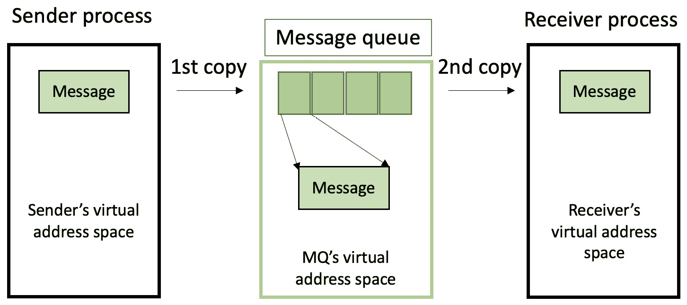
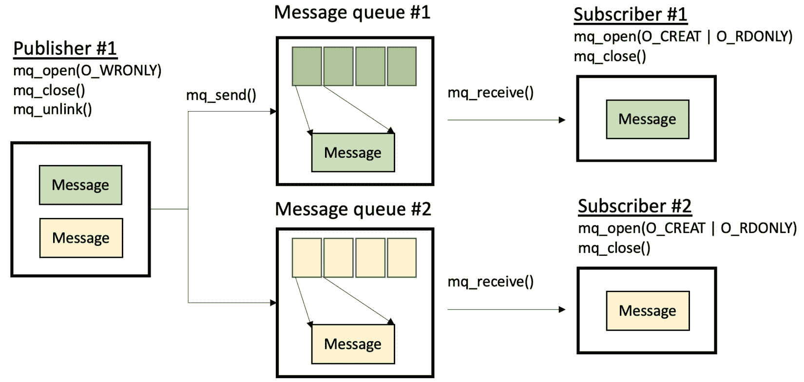
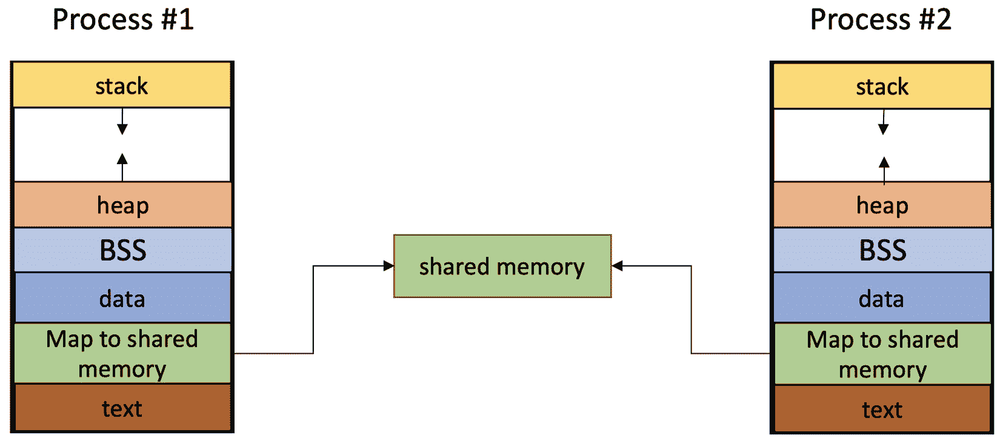
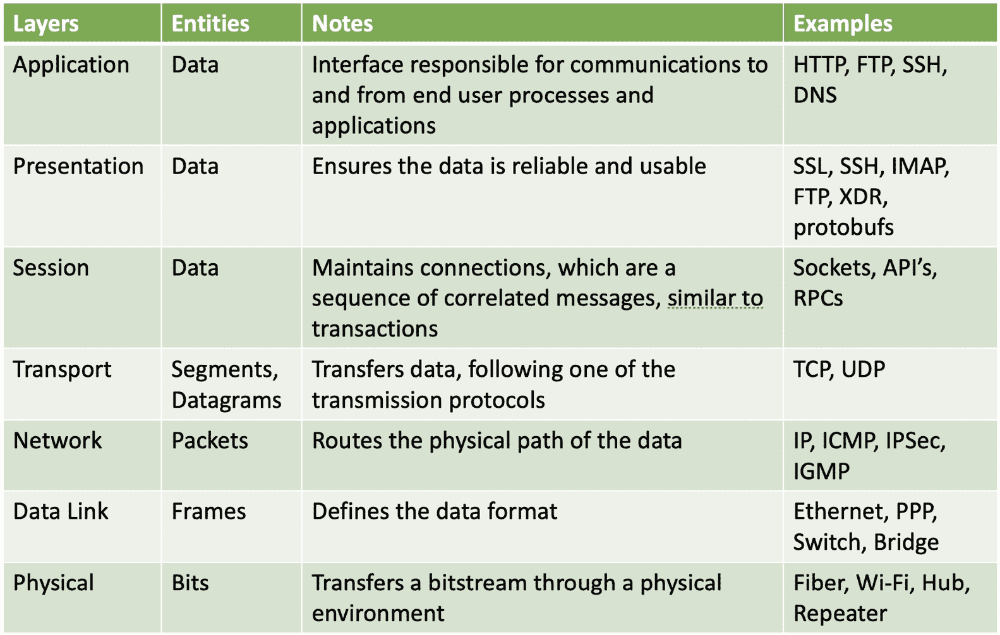
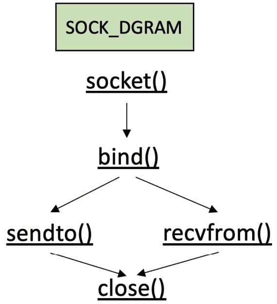
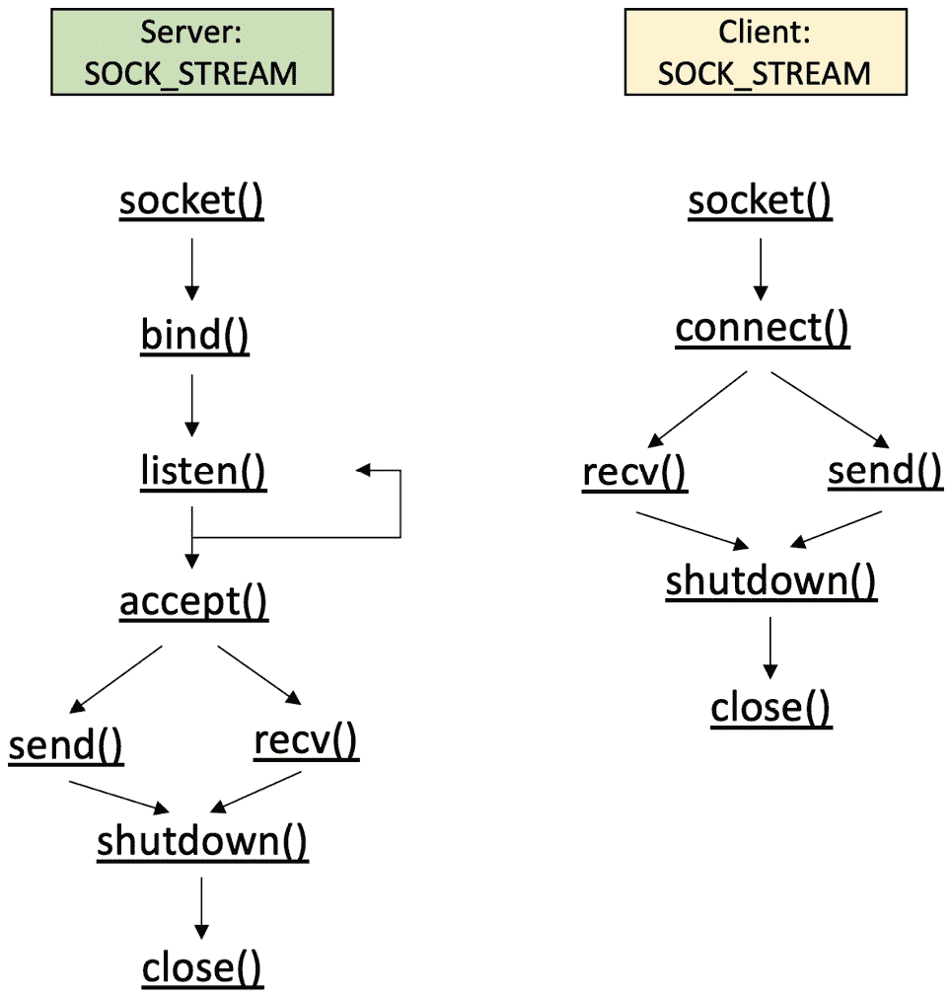

# 继续进行进程间通信

上一章介绍了 C++20 的许多功能，允许你并行执行任务。除了全局变量外，它没有涵盖进程或线程之间的通信方式。在系统级别，大多数异步调用都源于进程和不同计算机系统之间的持续通信。

在本章中，你将了解 Linux 提供的**进程间通信**（**IPC**）接口。通过它们，你将全面了解满足系统和软件需求的可能性。你将从学习**消息队列**（**MQs**）作为对*第三章*（B20833_03.xhtml#_idTextAnchor047）中管道讨论的延续。此外，我们将详细分析**信号量**和**互斥锁**同步技术的工作。我们将介绍一些易于使用的 C++20 新特性，你将不再需要自己实现这些特性。

这使我们能够继续使用**共享内存**技术，这将为你提供快速传输大量数据的选择。最后，如果你对网络中计算机系统的通信感兴趣，你将了解套接字和网络通信协议。通过这些，我们为你提供了一些实际命令来管理自己的网络系统。

我们将在本章开始的讨论基础上，在*第九章*（B20833_09.xhtml#_idTextAnchor129）中进行扩展。

在本章中，我们将涵盖以下主要主题：

+   介绍 MQs 和发布/订阅机制

+   通过信号量和互斥锁保证原子操作

+   使用共享内存

+   通过套接字进行网络通信

# 技术要求

要运行代码示例，你必须准备以下内容：

+   一种基于 Linux 的系统，能够编译和执行 C++20（例如，**Linux** **Mint 21**）

+   一个带有`-std=c++2a`、`-lpthread`和`-lrt`标志的 GCC 12.2 编译器([`gcc.gnu.org/git/gcc.git gcc-source`](https://gcc.gnu.org/git/gcc.gitgcc-source))

+   对于所有示例，你也可以选择使用[`godbolt.org/`](https://godbolt.org/)

+   本章中所有代码示例均可从[`github.com/PacktPublishing/C-Programming-for-Linux-Systems/tree/main/Chapter%207`](https://github.com/PacktPublishing/C-Programming-for-Linux-Systems/tree/main/Chapter%207)下载

# 介绍 MQs 和发布/订阅机制

我们很高兴再次回到 IPC 主题。上次我们讨论它是在*第三章*，在那里我们解释了管道并使用了一些代码示例。你学习了进程间交换数据的基本机制，但正如你所记得的，有一些阻塞点。与任何编程工具一样，管道有特定的用途 – 它们速度快，可以帮助你从相关（派生）进程（通过**匿名管道**）和不相关进程（通过**命名管道**）发送和接收数据。

以类似的方式，我们可以使用 MQ 来传输数据，这些数据对相关和不相关的进程都是可用的。它们提供了向多个接收进程发送单个消息的能力。但正如你所见，管道在发送和接收二进制数据方面是原始的，而 MQ 则引入了 *消息* 的概念。传输策略仍然在调用过程中配置 – 队列名称、大小、信号处理、优先级等 – 但其策略和数据序列化的能力现在掌握在 MQ 的实现手中。这为程序员提供了一种相对简单灵活的方式来准备和处理数据消息。根据我们的软件设计，我们可以轻松实现异步发送-接收数据传输或 **发布/订阅**（**pub/sub**）机制。Linux 为 MQ 提供了两个不同的接口 – 一个是为本地服务器应用程序设计的（来自 System V），另一个是为实时应用程序设计的（来自 POSIX）。出于本书的目的，我们更喜欢使用 POSIX 接口，因为它在配置上更丰富、更简洁。它也是一个基于文件的机制，如*第一章*中所述，你可以通过以下方式找到挂载的队列：

```cpp
$ ls /dev/mqueue
```

此接口可通过操作系统实时函数库 `librt` 获取，因此在编译时需要链接它。MQ 本身可以表示如下：



图 7.1 – 通过 MQ 表示 IPC

让我们看看一个例子，其中我们从一个进程向另一个进程发送数据。示例数据已经存储在文件中，并加载到通过 MQ 发送。完整的示例可以在[`github.com/PacktPublishing/C-Programming-for-Linux-Systems/tree/main/Chapter%207`](https://github.com/PacktPublishing/C-Programming-for-Linux-Systems/tree/main/Chapter%207)找到：

```cpp
constexpr auto MAX_SIZE = 1024;
string_view QUEUE_NAME  = "/test_queue";
```

我们将初始配置与队列名称一起作为路径名设置：

```cpp
void readFromQueue() {
...
    mqd_t          mq   = { 0 };
    struct mq_attr attr = { 0 };
    array<char, MAX_SIZE> buffer{};
    attr.mq_flags = 0;
    attr.mq_maxmsg = 10;
    attr.mq_msgsize = MAX_SIZE;
    attr.mq_curmsgs = 0;
    if (mq = mq_open(QUEUE_NAME.data(), O_CREAT | O_RDONLY,
                     0700, &attr); mq > -1) { // {1}
        for (;;) {
            if (auto bytes_read = mq_receive(mq,
                                             buffer.data(),
                                             buffer.size(),
                                             NULL);
                                  bytes_read > 0) { // {2}
                buffer[bytes_read] = '\0';
                cout << "Received: "
                     << buffer.data()
                     << endl; // {3}
            }
            else if (bytes_read == -1) {
                cerr << "Receive message failed!";
            }
```

额外的配置应用于消息队列，并且接收端已准备就绪。通过调用 `mq_open()` 函数，在文件系统中创建消息队列并打开其读取端。通过一个无限循环，数据在从二进制文件中读取的同时被接收并打印出来（前述代码中的标记 `{2}` 和 `{3}`）。直到文件完全被消耗。然后，关闭接收端和读取端（以下代码中的标记 `{4}`）。如果没有其他事情要做，可以通过 `mq_unlink()` 从文件系统中删除消息队列：

```cpp
            else {
                cout << "\n\n\n***Receiving ends***"
                     << endl;
                mq_close(mq); // {4}
                break;
            }
        }
    }
    else {
        cerr << "Receiver: Failed to load queue: "
             << strerror(errno);
    }
    mq_unlink(QUEUE_NAME.data());
}
```

这个例子使用两个线程实现，但也可以用两个进程以同样的方式完成。消息队列的功能将保持不变。我们再次调用 `mq_open()` 并为写入打开消息队列（以下代码中的标记 `{5}`）。创建的队列可以容纳多达 10 条消息，每条消息的大小为 1,024 字节——这是通过之前代码片段中的消息队列属性定义的。如果您不希望消息队列操作阻塞，可以在属性中使用 `O_NONBLOCK` 标志，或者在 `mq_receive()` 调用之前使用 `mq_notify()`。这样，如果消息队列为空，读取器将被阻塞，但 `mq_notify()` 会在消息到达时触发一个信号，进程将被恢复。

然后，使用测试数据打开本地存储的文件，并从中读取（以下代码中的标记 `{6}` 和 `{7}`）。在读取的同时（您也可以使用 `std::ofstream`），我们通过消息队列发送其内容（以下代码中的标记 `{8}`）。消息具有可能的最小优先级，这意味着 `0`。在一个队列中有更多消息的系统，我们可以设置更高的优先级，并且它们将按降序处理。最大值可以从 `sysconf(_SC_MQ_PRIO_MAX)` 中看到，对于 Linux 来说，这是 `32768`，但 POSIX 强制从 0 到 31 的范围，以便与其他操作系统兼容。让我们检查以下代码片段：

```cpp
void writeToQueue() {
...
   if (mq = mq_open(QUEUE_NAME.data(), O_WRONLY,
                     0700, NULL); mq > -1) { // {5}
        int fd = open("test.dat", O_RDONLY); // {6}
        if (fd > 0) {
            for (;;) {
                // This could be taken from cin.
                array<char, MAX_SIZE> buffer{};
                if (auto bytes_to_send =
                        read(fd,
                             buffer.data(),
                        buffer.size());
                             bytes_to_send > 0) { // {7}
                    if (auto b_sent =
                            mq_send(mq,
                                    buffer.data(),
                                    buffer.size(),
                                    0);
                                    b_sent == -1) {// {8}
                        cerr << "Sent failed!"
                             << strerror(errno);
                    }
```

然后，我们发送一个零大小的消息来指示通信的结束（标记 `{9}`）：

```cpp
...
                else if (bytes_to_send == 0) {
                    cout << "Sending ends...." << endl;
                    if (auto b_sent =
                            mq_send(mq,
                                    buffer.data(),
                                    0,
                                    0); b_sent == -1) {
                                    // {9}
                        cerr << "Sent failed!"
                             << strerror(errno);
```

结果如下（为了可读性，文件中的打印数据已缩减）：

```cpp
Thread READER starting...
Thread WRITER starting...
Sending ends....
Received: This is a testing file...
Received: ing fileThis is a testing file...
***Receiving ends***
Main: program completed. Exiting.
```

考虑到我们只有两个工作者——`readFromQueue()` 和 `writeToQueue()`，这是一个非常简单的例子。消息队列允许我们扩展并执行多对多的通信。这种方法可以在许多嵌入式系统中找到，因为它也符合实时性，并且不需要使用任何同步原语。许多微服务架构和无服务器应用程序都依赖于它。在下一节中，我们将讨论基于消息队列的最流行的模式之一。

## 发布/订阅机制

你可能已经意识到，在扩展时，一个 MQ 可能会成为瓶颈。正如你在前面的例子中观察到的，存在消息计数和大小限制。另一个问题是，消息被消费后，它将从队列中移除——同一时间只能有一个消费者消费特定的消息。数据提供者（生产者）还必须管理正确的消息地址，这意味着添加额外的数据以帮助消费者识别消息是发送给谁的，每个消费者都必须遵循这一策略。

一种推荐的方法是为每个消费者创建一个单独的消息队列（MQ）。生产者事先知道这些 MQ，无论是在编译时（所有 MQ 都由系统程序员在数据段中列出）还是在运行时（每个消费者在启动时都会发送其 MQ 路径名，生产者将处理这些信息）。这样，消费者就*订阅*接收来自特定生产者的数据，而生产者则将其数据发布到它所知道的全部 MQ。因此，我们称这种机制为**发布-订阅**机制。

当然，具体的实现可能会有所不同，这取决于软件设计，但基本思想将保持不变。此外，可能有多个生产者向多个消费者发送数据，我们称这种情况为**多对多**实现。请看下面的图示：



图 7.2 – pub/sub 机制的 MQ 实现表示

随着我们向进程解耦的方向发展，我们的系统变得更加灵活。由于订阅者不需要花费计算时间来识别消息是否是针对他们的，因此更容易进行扩展。添加新的生产者或消费者而不打扰他人也很容易。MQ 是在操作系统级别实现的，因此我们可以将其视为一个健壮的进程间通信（IPC）机制。然而，一个可能的缺点是，生产者通常不会从订阅者那里收到任何健康信息。这导致 MQ 中充满了未消费的数据，生产者被阻塞。因此，在更抽象的级别上实现了额外的实现框架，以处理此类用例。我们鼓励你进一步研究**观察者**和**消息代理**设计模式。内部开发的 pub/sub 机制通常建立在它们之上，而不一定通过 MQ。尽管如此，正如你可能已经猜到的，通过这样的机制发送大量数据将是一个缓慢的操作。因此，我们需要一个工具来快速获取大量数据。不幸的是，这需要额外的同步管理来避免数据竞争，类似于*第六章*。下一节将介绍同步原语。

# 通过信号量和互斥保证原子操作

让我们尝试*放大*共享资源，看看在 CPU 中会发生什么。我们将提供一个简单而有效的方法来解释数据竞争究竟从哪里开始。它们已经在*第六章*中进行了充分讨论。我们在这里学到的所有内容都应该被视为一种补充，但并发和并行处理的分析方法与之前相同。但现在，我们关注具体低级问题。

让我们仔细看看以下片段：

```cpp
int shrd_res = 0; //Some shared resource.
void thread_func(){
    shrd_res ++;
    std::cout << shrd_res;
}
```

这是一段非常简单的代码，其中变量被增加并打印出来。根据 C++标准，这种修改在多线程环境中是未定义的行为。让我们看看它是如何做到的——而不是在这里通过进程的内存布局来分析，我们将并行分析其伪汇编代码：

```cpp
...
int shrd_res = 0;      store 0
shrd_res++;            load value
                       add 1
                       store value
std::cout << shrd_res; load value
...
```

假设这个增加过程在一个线程函数中，并且有多个线程在执行它。`加 1`指令是在加载的值上执行的，而不是在`shrd_res`的实际内存位置上。前面的代码片段将被多次执行，并且很可能是并行的。如果我们注意到线程是一组指令，那么直观的想法是这些指令将以单一的方式执行。换句话说，每个线程例程应该在没有中断的情况下运行，这通常是情况。然而，我们应该记住一个小细节——CPU 被设计成保持较小的延迟。它不是为了数据并行而构建的。因此，从字面上讲，它的主要目标是加载大量的小型任务。我们的每个线程都在一个单独的处理器上执行；这可能是单独的 CPU、CPU 线程或 CPU 核心——这完全取决于系统。如果处理器的数量（CPU、核心或线程）小于*N*，那么剩余的线程预计会排队等待，直到有处理器空闲。

现在，初始线程的指令已经加载到那里并按原样执行。即使 CPU 核心在架构上相同，它们的目的是尽可能快地执行。这意味着由于多个硬件波动，它们在速度上并不期望相等。但`shared_resource`是一个变量，它……是一个共享资源。这意味着第一个到达并增加它的将会这样做，其他人会跟随。即使我们不在乎`std::cout`的结果（例如，打印顺序不再顺序进行），我们仍然有东西要担心。你可能已经猜到了！我们不知道我们将要增加的值是什么——是`shared_resource`的最后一个存储值，还是新增加的一个？这怎么可能发生？

让我们看看：

```cpp
Thread 1: shrd_res++; T1: load value
                      T1: add 1
Thread 2: shrd_res++; T2: load value
                      T2: add 1
                      T2: store value
                      T1: store value
```

你是否理解了刚才发生的事情？`Thread 1` 的指令序列因为 `Thread 2` 的执行而被中断。现在，我们能预测将要打印的内容吗？这被称为 `Thread 2` 永远没有被执行，因为存储在 `shared_resource` 中的最后一个值将是：

```cpp
T1: add 1
```

换句话说，我们丢失了一个增加。没有指令告诉 CPU 这两个过程必须分别调用并连续执行。应该很清楚，可能存在有限数量的指令组合，所有这些都会导致意外的行为，因为这取决于硬件的状态。这种操作被称为 **非原子**。为了正确处理并行性，我们需要依赖于 **原子** 操作！这是软件开发者的工作，要考虑这一点，并通知 CPU 这样的指令集。例如，互斥锁和信号量用于管理 *原子* 范围。我们将在下一节中详细分析它们的作用。

## 信号量

如果你做一个问卷调查，询问多个职业的人什么是 **信号量**，你会得到不同的答案。一个来自机场的人会告诉你这是一个通过使用旗帜来向某人发出信号的系统。一个警察可能会告诉你这只是一个交通灯。询问一个火车司机可能会得到类似的回答。有趣的是，这就是 *我们的* 信号量的来源。总的来说，这些答案应该向你暗示这是一个 *信号* 机制。

重要提示

编程信号量是由 Edsger Dijkstra 发明的，主要用于防止竞态条件。它们帮助我们指示资源是否可用，并计算给定类型的共享资源单元的数量。

与之前提到的信号机制一样，信号量不能保证代码无错误，因为它们不能阻止进程或线程获取资源单元——它们只是通知。就像火车可能会忽略信号并驶向被占用的轨道一样，或者汽车可能会在繁忙的十字路口继续行驶，这可能会造成灾难！再次强调，软件工程师的任务是找出如何使用信号量来确保系统的健康。因此，让我们开始使用它们。

Dijkstra 提供了我们围绕临界区的主要两个函数：`P(S)` 和 `V(S)`。正如你可能知道的，他是荷兰人，所以这些函数的名称来自荷兰语中的 *尝试* 和 *增加* (*probeer* 和 *vrhoog*，分别)，其中 `S` 是信号量变量。仅从它们的名称中，你就可以得到它们将要做什么的线索。让我们用伪代码来看看它们：

```cpp
unsigned int S = 0;
V(S):
    S=S+1;
P(S):
    while(S==0):
        // Do nothing.
    S = S – 1;
```

因此，`P(S)`会无限期地检查信号量是否已发出资源可用的信号——信号量被增加。一旦`S`被增加，循环就会停止，信号量的值会减少，以便其他代码可以执行。根据增加的值，我们可以识别两种类型的信号量：**二进制**和**计数**。二进制信号量常被误认为是**互斥**（**mutex**）机制。逻辑是相同的——例如，资源是否可以自由访问和修改——但技术的本质是不同的，正如我们之前解释的，没有任何东西阻止一些不良的并发设计忽略信号量。我们将在稍后讨论这个问题，但现在，让我们关注信号量做了什么。在我们开始编写代码之前，让我们声明一下，在类 Unix 操作系统上存在一些信号量接口。使用的选择取决于抽象级别和标准。例如，并非每个系统都有 POSIX，或者它并没有完全公开。由于我们将专注于 C++20 的使用，我们将使用以下示例仅作为参考。以下示例的完整源代码可以在[`github.com/PacktPublishing/C-Programming-for-Linux-Systems/tree/main/Chapter%207`](https://github.com/PacktPublishing/C-Programming-for-Linux-Systems/tree/main/Chapter%207)找到。

让我们来看看 Linux 上的两个常见信号量接口。第一个是**无名信号量**——我们可以通过以下接口来展示它：

```cpp
sem_t sem;
sem_init(sem_t *sem, int pshared, unsigned int value);
int sem_destroy(sem_t *sem);
int sem_post(sem_t *sem);
int sem_wait(sem_t *sem);
```

`sem`变量是信号量，它分别通过`sem_init()`和`sem_destroy()`进行初始化和销毁。`P(S)`函数由`sem_wait()`表示，而`V(S)`函数由`sem_post()`表示。还有`sem_trywait()`，如果你想在减少不立即发生时报告错误，以及`sem_timedwait()`，它是一个在减少可能发生的特定时间窗口内的阻塞调用。这看起来很清楚，除了初始化部分。你可能已经注意到了`value`和`pshared`参数。第一个显示了信号量的初始值。例如，二进制信号量可以是`0`或`1`。第二个更有趣。

如你所回忆，在*第二章*中，我们讨论了内存段。想象一下，如果我们创建的信号量在`pshared`上被用于这个目的。如果它被设置为`0`，那么信号量是进程本地的，但如果它被设置为非零值，那么它是进程间共享的。关键是创建一个在全局可见内存区域上的信号量，例如共享内存（shmem），包括文件系统作为一个共享资源池。以下是**命名信号量**的概述：

+   `/dev/shm`。我们将其视为文件。例如，以下代码将创建一个名为 `/sem` 且权限为 `0644` 的信号量——它只能由所有者读写，但其他人只能读取，并且它将在文件系统中可见，直到稍后通过代码删除：

    ```cpp
    sem_t *global_sem = sem_open("/sem", O_CREAT, 0644,
      0);
    ```

+   `P(S)` 和 `V(S)` 调用保持不变。完成之后，我们必须关闭文件，如果不再需要，则删除它：

    ```cpp
    sem_close(global_sem);
    sem_unlink("/sem");
    ```

如*第一章*所述，您可以看到 POSIX 调用遵循相同的模式，通过 `<object>_open`、`<object>_close`、`<object>_unlink` 和 `<object>_<specific function>` 后缀。这使得它们的使用对每个 POSIX 对象都是通用的，正如您可能已经在本章早期观察到的那样。

简要说明一下，存在**低级信号量**，其中系统调用与 OS 类型紧密相关或基于直接 OS 信号操作。这种方法的实现和维护比较复杂，因为它们是特定的，被认为是微调。请随意研究您自己的系统。

### C++ 信号量入门

有了这个想法，我们希望继续提升抽象级别，因此我们将讨论 C++ 的信号量对象。这是 C++20 中的一个新特性，当您想要使代码更加系统通用时非常有用。让我们通过 `atomic<uint16_t> shared_resource` 来查看它。如本节开头所述，信号量有助于任务同步，但我们需要一个数据竞争保护。`atomic` 类型确保我们遵循 C++ 内存模型，编译器将按照 `std::memory_order` 保持 CPU 指令的顺序。您可以回顾*第六章*以了解数据竞争的解释。

我们将继续创建两个全局 `binary_semaphore` 对象，以适当地同步访问（如乒乓球）。`binary_semaphore` 对象是 `counting_semaphore` 对象的别名，其最大值为 `1`。我们需要一个程序结束规则，因此我们将定义迭代次数的限制。我们将要求编译器通过 `constexpr` 关键字将其定义为常量。最后，但同样重要的是，我们将创建两个线程，它们将作为生产者（增加共享资源）和消费者（减少它）。让我们看看代码示例：

```cpp
...
uint32_t shared_resource = 0;
binary_semaphore sem_to_produce(0);
binary_semaphore sem_to_consume(0);
constexpr uint32_t limit = 65536;
```

信号量被构建和初始化。我们继续处理线程。`release()` 函数增加一个内部计数器，这会向其他人发出信号（以下代码中的 `{2}` 标记，类似于 `sem_post()`）。我们使用 `osyncstream(cout)` 来构建非交错输出。以下是生产者线程：

```cpp
void producer() {
    for (auto i = 0; i <= limit; i++) {
        sem_to_produce.acquire(); // {1}
        ++shared_resource;
        osyncstream(cout) << "Before: "
                          << shared_resource << endl;
        sem_to_consume.release(); // {2}
        osyncstream(cout) << "Producer finished!" << endl;
    }
}
```

这是消费者线程：

```cpp
void consumer() {
    for (auto i = 0; i <= limit; i++) {
        osyncstream(cout)  << "Waiting for data..."
                           << endl;
        sem_to_consume.acquire();
        --shared_resource;
        osyncstream(cout)  << "After: "
                           << shared_resource << endl;
        sem_to_produce.release();
        osyncstream(cout)  << "Consumer finished!" << endl;
    } }
int main() {
    sem_to_produce.release();
    jthread t1(producer); jthread t2(consumer);
    t1.join(); t2.join();}
```

在迭代过程中，我们根据 `limit` 会看到多次此输出：

```cpp
Waiting for data...
Before: 1
Producer finished!
After: 0
Consumer finished!
...
```

回到代码的逻辑，我们必须强调，C++ 信号量被认为是轻量级的，并允许对共享资源进行多个并发访问。但请注意：提供的代码使用了 `acquire()`（标记 `{1}`，类似于 `sem_wait()`），这是一个阻塞调用——例如，你的任务将会被阻塞，直到信号量被释放。你可以使用 `try_acquire()` 来实现非阻塞。我们依赖于这两个信号量来创建可预测的操作序列。我们通过释放生产者信号量（例如，主线程）来启动这个过程，这样生产者就会收到信号，首先开始工作。

代码可以通过移除 C++ 原语并添加上述系统调用到代码中的相同位置来修改，以使用 POSIX 信号量。此外，我们鼓励你使用一个信号量实现相同的效果。考虑使用辅助变量或条件变量。请记住，这样的操作会使同步变得异构，并且在大规模上难以管理。

当前的代码显然无法同步多个进程，与**命名信号量**不同，因此它实际上不是那里的替代品。我们还可以希望对共享资源的访问更加严格——例如，在并发环境中只有一个访问时刻。那么，我们就需要下一节中描述的互斥锁的帮助。

## 互斥（mutex）

互斥锁是一种来自操作系统操作的机制。共享资源也被称为**临界区**，需要无风险地访问，以避免竞态条件。一种允许在给定时刻只允许一个任务修改临界区，并排除其他任务相同请求的机制，称为**互斥**或**互斥锁**。互斥锁由操作系统内部实现，对用户空间是隐藏的。它们提供了一种**锁定-解锁**的访问功能，并且被认为比信号量更严格，尽管它们被作为二进制信号量来控制。

重要提示

调用线程锁定资源，并被迫解锁它。没有保证系统中的更高实体能够覆盖锁定并解除并行功能的阻塞。建议尽快释放每个锁定，以允许系统线程扩展并节省空闲时间。

POSIX 互斥锁的创建和使用与未命名的信号量几乎相同：

```cpp
pthread_mutex_t global_lock;
pthread_mutex_init(&global_lock, NULL);
pthread_mutex_destroy(&global_lock);
pthread_mutex_lock(&global_lock);
pthread_mutex_unlock(&global_lock);
```

函数名的模式再次被遵循，因此让我们关注 `pthread_mutex_lock()` 和 `pthread_mutex_unlock()`。我们使用它们来锁定和解锁一个临界区以进行操作，但它们不能帮助我们处理事件序列。锁定资源只能保证没有竞态条件。如果需要，正确的事件序列是由系统程序员设计的。错误的事件序列可能会导致**死锁**和**活锁**：

+   **死锁**：一个或多个线程被阻塞并且无法改变它们的状态，因为它们正在等待一个永远不会发生的事件。一个常见的错误是两个（或更多）线程相互循环——例如，一个线程正在等待共享资源 A，同时持有共享资源 B 的锁，而第二个线程持有 A 的锁，但会在 B 解锁时释放它。两者都将保持阻塞，因为它们都不会是第一个**放弃资源**的。即使没有互斥锁，这种行为也可能发生。另一个错误是两次锁定互斥锁，在 Linux 的情况下，这可以通过操作系统检测到。存在死锁解决算法，其中锁定多个互斥锁可能由于死锁而最初无法成功，但在有限次数的尝试后可以保证成功。

    ```cpp
    NULL, but we could use them to decide on the mutex kind. The default one, known as a fast mutex, is not deadlock-safe. The recursive mutex type will not cause a deadlock; it will count the number of lock requests by the same thread. The error-checking mutex will detect and mark a double lock. We encourage you to give them a try.
    ```

+   **活锁**：线程没有被阻塞，但同样，它们无法改变它们的状态，因为它们需要共享资源来继续前进。一个很好的现实世界例子是两个人面对面站在入口处。双方都会出于礼貌让开，但他们很可能会朝着对方的方向移动。如果发生这种情况，并且他们一直这样做，那么没有人会被阻塞，但与此同时，他们无法继续前进。

这两类错误都很常见，可以用信号量复制，因为它们也是阻塞的，并且很少出现在小规模系统中，那里它们很容易调试。只有几个线程时，代码的逻辑很容易跟踪，并且进程是可管理的。具有数千个线程的大规模系统同时执行了大量的锁。错误复制通常是一个坏时机和模糊的任务序列的问题。因此，它们很难捕捉和调试，我们建议你在锁定关键部分时要小心。

C++提供了一个灵活的锁接口。它不断升级，我们现在有几种行为可供选择。让我们对变量进行并行增加。为了清晰起见，我们使用`increment()`线程过程，类似于之前的代码，但我们用互斥锁替换了信号量。你可能已经猜到了，代码将防止竞争条件，但线程执行的顺序是未定义的。我们可以通过额外的标志、条件变量或简单的睡眠来安排这个顺序，但让我们保持这种方式进行实验。更新的代码片段如下：

```cpp
...
uint32_t shared_resource = 0;
mutex shres_guard;
constexpr uint32_t limit = INT_MAX;
```

我们定义了我们的共享资源和互斥锁。让我们看看增加是如何发生的：

```cpp
void increment() {
    for (auto i = 0; i < limit; i++) {
        lock_guard<mutex> lock(shres_guard); // {1}
        ++shared_resource;
    }
    cout << "\nIncrement finished!" << endl;
}
...
```

观察到的输出如下：

```cpp
$ time ./test
Increment finished!
Increment finished!
real    3m34,169s
user    4m21,676s
sys     2m43,331s
```

很明显，在不使用多线程的情况下增加变量会比这个结果快得多。你甚至可以尝试运行它直到`UINT_MAX`。

因此，前面的代码创建了一个全局可见的互斥锁，并使用一个`unique_lock`对象（标记 `{1}`）来包装它。这类似于`pthread_mutex_init()`，它允许我们延迟锁定，执行递归锁定，转移锁定所有权，并在特定时间约束内执行解锁尝试。锁在其作用域块内有效——在当前示例中，它是线程过程的范围。锁拥有互斥锁的所有权。当它达到作用域的末尾时，锁被销毁，互斥锁被释放。你应该已经知道这种做法作为`scoped_lock`对象来锁定多个互斥锁，同时通过其设计避免死锁。

在使用互斥锁时，你还需要考虑其他一些事情。互斥锁达到内核级别。任务状态直接受到影响，多个锁将导致多个**上下文切换**。正如你之前回忆的那样，我们可能会在重新调度中浪费时间。这意味着操作系统需要从 RAM 中的一个内存区域跳转到另一个内存区域，只是为了加载另一个任务的指令。你必须考虑对你有利的事情：许多具有小范围的锁导致许多切换，或者少数具有较大作用域块的锁在更长的时间段内保持资源。

最终，我们的目标只是向 CPU 指示一个原子区域。如果你还记得，我们在信号量示例中使用了`atomic`模板。我们可以用`atomic`变量更新我们的代码，并移除互斥锁的锁定：

```cpp
atomic<uint32_t> shared_resource = 0;
```

结果如下：

```cpp
$ time ./test
Increment finished!
Increment finished!
real    0m0,003s
user    0m0,002s
sys     0m0,000s
```

如你所见，仅仅通过移除互斥锁就能显著提高时间效率。为了辩论的目的，你可以重新添加信号量，你仍然会观察到比互斥锁更快的执行速度。我们建议你查看代码的汇编代码，针对三种情况——只有`atomic`变量、有互斥锁和有信号量。你会发现`atomic`对象在指令层面上非常简单，并且在用户级别执行。由于它是真正的原子操作，CPU（或其核心）将在增加时保持忙碌。记住，任何解决数据竞争的技术都会固有地带来性能成本。最佳性能可以通过最小化需要同步原语的位置及其作用域来实现。

重要提示

C++20 为并发执行提供了令人兴奋的特性，例如**jthread**、**协程**、**更新的原子类型**和**合作取消**。除了第一个之外，我们将在本书的后面部分查看其他特性。除了这些之外，Linux 还有用于使用 IPC 实体的系统调用，这些实体是为多进程数据交换而构建的。话虽如此，我们在尝试组合互斥锁、信号量、标志和条件变量之前，建议你考虑使用现有的异步工作机制。所有这些 C++和 Linux 特性都是为了以稳定的方式扩展并节省你设计解决方案的时间。

我们到目前为止所做的一切都是为了确保我们能够原子性地访问临界区。原子操作、互斥锁和信号量会给你这个——一种指示 CPU 指令作用域的方法。但还有两个问题：我们能做得更快、更轻量吗？原子操作意味着我们保持指令的顺序吗？第一个问题的答案是**可能**。第二个问题的答案是**不**！现在我们有动力去深入了解 C++的**内存模型**和**内存顺序**。如果你对此感兴趣，我们邀请你跳转到*第九章*，在那里我们讨论更多有趣的并发任务。现在，我们将继续通过**shmem** **IPC**机制讨论共享资源的话题。

# 使用共享内存

与管道一样，一旦消耗了 MQ 数据，数据就会丢失。双工消息数据复制会增加用户空间和内核空间之间的调用，因此预期会有开销。**shmem**机制是快速的。正如你在上一章和上一节中学到的，数据访问的同步是一个必须由系统程序员解决的问题，尤其是在出现竞态条件时。

重要说明：术语**共享内存**本身是模糊的。它是两个线程可以同时访问的全局变量吗？或者是一个多个 CPU 核心用作在彼此之间传输数据的共同基础的共享 RAM 区域？或者是一个文件系统中的文件，许多进程对其进行修改？很好的问题——感谢提问！一般来说，所有这些都是共享资源的一种，但当我们谈论术语**内存**时，我们应该真正考虑一个在**主内存**中可见的区域，其中多个任务可以使用它来交换和修改数据。不仅限于任务，还包括不同的处理器核心和核心复杂（如 ARM），如果它们可以访问相同的预定义内存区域。这些技术需要特定的配置文件——一个内存映射，它严格依赖于处理器，并且具有特定的实现。它提供了使用，例如，**紧密耦合内存**（**TCM**）来加速频繁使用的代码和数据部分，或者将 RAM 的一部分用作核心之间的数据交换的 shmem 的机会。由于这太依赖于处理器，我们不会继续讨论它。相反，我们将继续讨论 Linux 的**shmem** **IPC**机制。

重要注意事项

进程将它们的部分**虚拟内存**分配为一个共享段。传统上，操作系统禁止进程访问彼此的内存区域，但 shmem 是一种机制，允许进程在 shmem 的边界内请求移除这种限制。我们使用它通过简单的读写操作或 POSIX 中已提供的函数快速摄取和修改大量数据，而通过 MQ 或管道是无法实现这种功能的。

与 MQs 相比，这里没有序列化或同步。系统程序员负责管理 IPC 的数据传输策略（再次）。但是，由于共享区域位于 RAM 中，我们减少了上下文切换，从而降低了开销。我们可以通过以下图来可视化它：



图 7.3 – 通过进程的内存段展示 Shmem

shmem 区域通常被描绘在两个进程的地址空间之间。目的是强调这个空间在进程之间是如何真正共享的。实际上，这取决于具体实现，我们将其留给内核 – 我们关心的是映射到 shmem 段本身。它允许两个进程同时观察相同的内容。那么，让我们开始吧。

## 了解 mmap()和 shm_open()

创建 shmem 映射的初始系统调用是`shmget()`。这适用于任何基于 Unix 的操作系统，但对于符合 POSIX 标准的系统，有更舒适的途径。如果我们想象我们在进程的地址空间和文件之间进行映射，那么`mmap()`函数将基本上完成这项工作。它是符合 POSIX 标准的，并且按需执行读取操作。你可以简单地使用`mmap()`来指向一个常规文件，但数据将在进程完成工作后仍然保留在那里。你还记得第三章中的管道吗？这里的情况类似。有与`fork()`一起使用的`mmap()`系统调用。

如果你有多独立进程，那么它们知道如何访问共享区域的唯一方式是通过其路径名。`shm_open()`函数将为你提供一个带有名称的文件，就像`mq_open()`所做的那样 – 你可以在`/dev/shm`中观察到它。这同样需要`librt`库。了解这一点后，你会直觉地认为我们通过文件系统操作限制了 I/O 开销和上下文切换，因为该文件位于 RAM 中。最后但同样重要的是，这种共享内存的大小是灵活的，在需要时可以扩大到几 GB。其限制取决于系统。以下示例的完整版本可以在 https://github.com/PacktPublishing/C-Programming-for-Linux-Systems/tree/main/Chapter%207 找到：

```cpp
...
string_view SHM_ID      = "/test_shm";
string_view SEM_PROD_ID = "/test_sem_prod";
string_view SEM_CONS_ID = "/test_sem_cons";
constexpr auto SHM_SIZE = 1024;
sem_t *sem_prod; sem_t *sem_cons;
void process_creator() {
...
    if (int pid = fork(); pid == 0) {
        // Child - used for consuming data.
        if (fd = shm_open(SHM_ID.data(),
                          O_RDONLY,
                          0700); // {1}
            fd == -1) {
....
```

这个例子非常具体，因为我们故意使用了进程而不是线程。这使我们能够展示`shm_open()`（标记{1}）的使用，因为不同的进程使用 shmem 的路径名（在编译时已知）来访问它。让我们继续读取数据：

```cpp
        shm_addr = mmap(NULL, SHM_SIZE,
                        PROT_READ, MAP_SHARED,
                        fd, 0); // {2}
        if (shm_addr == MAP_FAILED) {
...
        }
        array<char, SHM_SIZE> buffer{};
```

我们可以使用互斥锁，但当前我们只需要一个进程向另一个进程发出信号，表明其工作已完成，所以我们应用了信号量（在之前的代码块中标记为{3}和{7}）如下：

```cpp
        sem_wait(sem_cons);
        memcpy(buffer.data(),
               shm_addr,
               buffer.size()); // {3}
        if(strlen(buffer.data()) != 0) {
            cout << "PID : " << getpid()
                 << "consumed: " << buffer.data();
        }
        sem_post(sem_prod); exit(EXIT_SUCCESS);
```

要使内存区域共享，我们使用带有`MAP_SHARED`选项的`mmap()`函数，并通过以下页面设置相应地标记读取器和写入器凭据：`PROT_READ`和`PROT_WRITE`（标记为`{2}`和`{6}`）。我们还使用`ftruncate()`函数设置区域的大小（标记为`{5}`）。在给定的示例中，信息被写入 shmem，而有人必须读取它。这是一种单次生产者-消费者模式，因为写入完成后，写入者会给读取者时间（标记为`{8}`），然后 shmem 被设置为零（标记为`{9}`）并删除（标记为`{10}`）。现在，让我们继续讨论父进程的代码——数据的生产者：

```cpp
    else if (pid > 0) {
        // Parent - used for producing data.
        fd = shm_open(SHM_ID.data(),
                      O_CREAT | O_RDWR,
                      0700); // {4}
        if (fd == -1) {
...
        res = ftruncate(fd, SHM_SIZE); // {5}
```

再次，shmem 区域被映射：

```cpp
        if (res == -1) {
...
        shm_addr = mmap(NULL, SHM_SIZE,
                        PROT_WRITE, MAP_SHARED,
                        fd, 0); // {6}
        if (shm_addr == MAP_FAILED) {
...
        sem_wait(sem_prod);
        string_view produced_data
            {"Some test data, coming!"};
        memcpy(shm_addr,
               produced_data.data(),
               produced_data.size());
        sem_post(sem_cons);    // {7}
        waitpid(pid, NULL, 0); // {8}
        res = munmap(shm_addr, SHM_SIZE); // {9}
        if (res == -1) {
...
        fd = shm_unlink(SHM_ID.data()); //{10}
        if (fd == -1) {
```

如前所述，我们使用`sem_open()`命名的信号量（标记为`{11}`）允许两个进程进行同步。我们无法通过本章前面讨论的信号量来完成，因为它们没有名称，只在单个进程的上下文中知名。最后，我们还将信号量从文件系统中删除（标记为`{12}`），如下所示：

```cpp
...
}
int main() {
    sem_prod = sem_open(SEM_PROD_ID.data(),
                        O_CREAT, 0644, 0); // {11}
...
    sem_post(sem_prod);
    process_creator();
    sem_close(sem_prod); // {12}
    sem_close(sem_cons);
    sem_unlink(SEM_PROD_ID.data());
    sem_unlink(SEM_CONS_ID.data());
    return 0;
}
```

程序的结果如下：

```cpp
PID 3530: consumed: "Some test data, coming!"
```

Shmem 是一个有趣的话题，我们将在*第九章*中再次回到这个话题。其中一个原因是 C++允许我们适当地封装 POSIX 代码，并使代码更安全。类似于*第三章*，在 C++代码中混合系统调用应该经过深思熟虑。但同样值得探讨`memory_order`的使用案例。如果**jthreads**或**coroutines**不适用于您的用例，那么目前讨论的同步机制，连同**智能指针**，为您提供了设计最适合您系统的最佳解决方案的灵活性。但在我们达到那里之前，我们首先需要讨论其他事情。让我们继续讨论计算机系统之间的通信。

# 通过套接字进行网络通信

如果管道、MQ 和 shmem 能够共同克服它们的问题，那么为什么我们还需要套接字？这是一个简单答案的伟大问题——我们需要它们在网络上不同系统之间进行通信。有了这个，我们就拥有了交换数据的完整工具集。在我们理解套接字之前，我们需要快速了解网络通信。无论网络类型或其介质如何，我们都必须遵循由**开放系统互连**（**OSI**）**基本参考模型**确立的设计。如今，几乎所有的操作系统都支持**互联网协议**（**IP**）家族。与其他计算机系统建立通信的最简单方法就是使用这些协议。它们遵循分层，正如**ISO-OSI**模型所描述的，现在我们将快速看一下这一点。

## OSI 模型的概述

OSI 模型通常表示如下表所示。系统程序员通常需要它来分析他们的通信在哪里受到干扰。尽管套接字旨在执行网络数据传输，但它们也适用于本地进程间通信（IPC）。一个原因是通信层，尤其是在大型系统中，是独立实用程序或抽象层，位于应用程序之上。因为我们希望使它们与环境无关，这意味着我们不在乎数据是在本地传输还是通过互联网传输，那么套接字就非常适合。话虽如此，我们必须意识到我们使用的通道以及我们的数据是如何传输的。让我们看看：



图 7.4 – 以表格形式表示的 OSI 模型

全球网络通信，特别是互联网，是一个广泛且复杂的话题，我们无法在本书的单个章节中掌握它。但思考你的系统是有价值的——它有什么样的网络通信硬件；也许你应该考虑检查*物理*和*数据链路*层。一个简单的练习是配置你自己的家庭网络——连接的设备、路由器等等。系统是否可以安全且安全地被外部（如果需要）访问？然后检查*网络*、*表示*和*应用*层。尝试一些**端口转发**并创建一个具有数据交换加密的应用程序。软件是否能够足够快地扩展，以适应当前的带宽和速度？让我们看看*会话*和*传输*层能提供什么——我们将在下一段中探讨它们。它是否健壮，在受到攻击时是否仍然可用？然后重新审视所有层。当然，这些都是简单且单方面的观察，但它们允许你双重检查你的需求。

因此，如果我们忽略硬件的作用，只关注建立连接，我们就可以回到套接字和相应的**会话**层。你可能已经注意到，一些网站会在一段时间后自动注销你。你有没有想过为什么会这样？好吧，**会话**是在设备或端点之间建立的信息交换的双向链接。强烈建议为会话的销毁应用时间限制和需求。打开的连接不仅意味着攻击者可以嗅探的开放通道，而且意味着服务器端使用的一种资源。这需要计算能力，而这可能被重新分配到其他地方。服务器通常保留当前状态和会话历史，因此我们将此类通信标记为**有状态的**——至少一个设备保持状态。但如果我们能够处理请求而无需知道并保留以前的数据，我们就可以进行**无状态的**通信。然而，我们仍然需要会话来建立面向连接的数据交换。为此，在**传输**层找到了一个已知的协议——**传输控制协议**（**TCP**）。如果我们不想建立双向信息传输通道，而只想实现广播应用程序，那么我们可以通过**用户数据报协议**（**UDP**）提供的无连接通信来进行。让我们在接下来的章节中检查它们。

## 通过 UDP 熟悉网络

正如我们所说，这个协议可以实现无连接通信，但这并不意味着端点之间没有连接。这意味着它们不需要持续连接来维护数据传输并在它们自己的端进行解释。换句话说，丢失一些数据包（例如，在在线会议中通话时听不到某人，可能）对于系统的行为本身可能不是至关重要的。这可能对你来说很重要，但让我们说实话，我们打赌你更需要高速，而这是有代价的。像**域名系统**（**DNS**）、**动态主机配置协议**（**DHCP**）、音视频流平台等网络应用程序都使用 UDP。差异和数据包丢失通常通过数据重传来处理，但这是在**应用**层实现的，并取决于程序员的实现。从示意图上看，建立此类连接的系统调用如下：



图 7.5 – UDP 系统调用实现

如您所见，这确实很简单——通信双方（或更多）的应用程序只需遵循该顺序即可。该协议并不强制您遵守消息顺序或传输质量，它只是快速。让我们看看以下示例，请求从套接字进行 *N* 次骰子投掷。代码的完整版本可以在 [`github.com/PacktPublishing/C-Programming-for-Linux-Systems/tree/main/Chapter%207`](https://github.com/PacktPublishing/C-Programming-for-Linux-Systems/tree/main/Chapter%207) 找到：

```cpp
...
constexpr auto PORT     = 8080;
constexpr auto BUF_SIZE = 16;
auto die_roll() {
...
void process_creator() {
    auto sockfd = 0;
    array<char, BUF_SIZE> buffer{};
    string_view stop{ "No more requests!" };
    string_view request{ "Throw dice!" };
    struct sockaddr_in servaddr {};
    struct sockaddr_in cliaddr {};
```

如您所见，通信配置相当简单——一方必须绑定到一个地址，以便知道从哪里接收数据（标记 `{3}`），而另一方只需直接将数据写入套接字。套接字配置在标记 `{1}` 中描述：

```cpp
    servaddr.sin_family = AF_INET; // {1}
    servaddr.sin_addr.s_addr = INADDR_ANY;
    servaddr.sin_port = htons(PORT);
    if (int pid = fork(); pid == 0) {
        // Child
        if ((sockfd = socket(AF_INET, SOCK_DGRAM, 0))
                < 0) {
            const auto ecode
                { make_error_code(errc{errno}) };
            cerr << "Error opening socket!";
            system_error exception{ ecode };
            throw exception;
        } // {2}
        if (bind(sockfd,
            (const struct sockaddr*)&servaddr,
            sizeof(servaddr)) < 0) {
            const auto ecode
                { make_error_code(errc{errno}) };
            cerr << "Bind failed!";
            system_error exception{ ecode };
            throw exception;
        } // {3}
```

地址族被定义为 `AF_INET`，这意味着我们将依赖于 IPv4 兼容的地址。我们可以使用 `AF_INET6` 来表示 IPv6，或者使用 `AF_BLUETOOTH` 来表示蓝牙。我们通过套接字的 `SOCK_DGRAM` 设置使用 UDP（标记 `{2}` 和 `{10}`）。通过这种方式，我们将一个进程中的数字传输到另一个进程。您可以想象它们是一个服务器和一个客户端：

```cpp
        socklen_t len = sizeof(cliaddr);
        for (;;) {
            if (auto bytes_received =
                recvfrom(sockfd, buffer.data(),
                    buffer.size(),
                    MSG_WAITALL,
                    (struct sockaddr*)&cliaddr,
                    &len);
                bytes_received >= 0) { // {4}
                buffer.data()[bytes_received] = '\0';
                cout << "Request received: "
                     << buffer.data() << endl;
                if (request.compare(0,
                                    bytes_received,
                                    buffer.data()) == 0) {
                                                    // {5}
                    string_view res_data
                        { to_string(die_roll()) };
```

收到新的骰子投掷请求（标记 `{4}`）并打印出请求数据。然后，将请求字符串与一个不可变的字符串进行比较，这样我们就知道这个请求只是为了骰子投掷（标记 `{5}`）。如您所见，我们使用了 `MSG_WAITALL` 设置，这意味着套接字操作将阻塞调用进程——通常在没有传入数据时。此外，这是一个 UDP 通信，因此数据包顺序可能不会遵循，并且通过 `recvfrom()` 接收 `0` 字节是一个有效的用例。话虽如此，我们使用额外的消息来标记通信的结束（标记 `{6}` 和 `{14}`）。为了简单起见，如果 `request.compare()` 的结果不是 `0`，则通信结束。可以添加对多个选项的额外检查。我们可以使用类似的手势来开始通信——这取决于系统程序员的决策和应用需求。继续进行客户端的功能：

```cpp
                    sendto(sockfd, res_data.data(),
                           res_data.size(),
                           MSG_WAITALL,
                           (struct sockaddr*)&cliaddr,
                           len);
                }
                else break; // {6}
...
        }
        if (auto res = close(sockfd); res == -1) { // {8}
            const auto ecode
                { make_error_code(errc{errno}) };
            cerr << "Error closing socket!";
            system_error exception{ ecode };
            throw exception;
        }
        exit(EXIT_SUCCESS);
```

`die_roll()` 函数被调用 `dice_rolls` 次数（标记 `{10}` 和 `{11}`），结果通过套接字（标记 `{12}`）发送。在收到结果后（标记 `{13}`），发送结束消息（标记 `{14}`）。我们在这个例子中主要使用了 `MSG_CONFIRM`，但必须小心使用这个标志。它应该在您期望从发送给同一对等方收到响应时使用。它告诉 OSI 模型的数据链路层有一个成功的回复。我们可以将 `recvfrom()` 设置更改为 `MSG_DONTWAIT`，就像标记 `{12}` 一样，但实现自己的重试机制或切换到 TCP 会是一个好主意：

```cpp
       for (auto i = 1; i <= dice_rolls; i++) { // {11}
            if (auto b_sent = sendto(sockfd,
                                     request.data(),
                                     request.size(),
                                     MSG_DONTWAIT,
                                     (const struct
                                      sockaddr*)&servaddr,
                                     sizeof(servaddr));
                                     b_sent >= 0) { // {12}
...
            if (auto b_recv =
                    recvfrom(sockfd,
                             buffer.data(),
                             buffer.size(),
                             MSG_WAITALL,
...                             { // {13}
                buffer.data()[b_recv] = '\0';
                cout << "Dice roll result for throw number"
                     << i << " is "
                     << buffer.data() << endl;
            }
```

在关闭语句之后关闭通信（标记 `{8}` 和 `{15}`）：

```cpp
       sendto(sockfd,
              stop.data(),
              stop.size(),
              MSG_CONFIRM,
              (const struct sockaddr*)&servaddr,
              sizeof(servaddr)); // {14}
       if (auto res = close(sockfd); res == -1) {
            const auto ecode
                { make_error_code(errc{errno}) };
            cerr << "Error closing socket!";
            system_error exception{ ecode };
            throw exception; // {15}
        }
...
```

输出的简短版本如下：

```cpp
Choose a number of dice throws between 1 and 256.
5
Request received: Throw dice!
Dice roll result for throw number 1 is 2
....
Dice roll result for throw number 5 is 6
Request received: No more requests
```

我们必须设置服务器可以被访问的地址和端口。通常，服务器计算机上会持续运行许多应用程序，其中一些为顾客执行服务。这些服务与服务器端口绑定，用户可以调用它们来完成一些工作——获取在线商店的内容、查看天气、获取一些银行详情、可视化图形网站等等。一次只有一个应用程序（服务）可以与给定的端口一起工作。如果您在第一个应用程序活动时尝试使用它，您将得到一个`Address already in use`错误（或类似错误）。目前，我们正在使用端口`8080`，这是为 TCP/UDP（和 HTTP）通常打开的。您也可以尝试使用`80`，但在 Linux 上，非 root 用户没有这个能力——您需要更高的用户权限来使用小于`1000`的端口。最后但同样重要的是，IP 地址设置为`INADDR_ANY`。这通常在我们在一个系统上进行通信时使用，我们不在乎它的地址。不过，如果我们想使用它，我们可以在执行以下命令后使用它：

```cpp
$ ip addr show
1: lo: <LOOPBACK,UP,LOWER_UP> mtu 65536 qdisc noqueue state UNKNOWN group default qlen 1000
    link/loopback 00:00:00:00:00:00 brd 00:00:00:00:00:00
    inet 127.0.0.1/8 scope host lo
       valid_lft forever preferred_lft forever
    inet6 ::1/128 scope host
       valid_lft forever preferred_lft forever
2: ens32: <BROADCAST,MULTICAST,UP,LOWER_UP> mtu 1500 qdisc fq_codel state UP group default qlen 1000
    link/ether 00:0c:29:94:a5:25 brd ff:ff:ff:ff:ff:ff
    inet 192.168.136.128/24 brd 192.168.136.255 scope global dynamic noprefixroute ens32
       valid_lft 1345sec preferred_lft 1345sec
    inet6 fe80::b11f:c011:ba44:35e5/64 scope link noprefixroute
       valid_lft forever preferred_lft forever...
```

在我们的案例中，这是`192.168.136.128`。我们可以在标记`{1}`处更新代码如下：

```cpp
servaddr.sin_addr.s_addr = inet_addr("192.168.136.128");
```

另一个选项是使用 localhost 地址——`127.0.0.1`——与回环设备地址：`INADDR_LOOPBACK`一起使用。我们用它来运行本地服务器，通常用于测试目的。但如果我们使用一个确切的 IP 地址，那么这是在我们需要非常具体地指定应用程序端点时进行的，如果 IP 地址是静态的，我们期望本地网络上的其他人能够调用它。如果我们想将其暴露给外界，以便我们的服务对其他人可用（比如说我们拥有一个在线商店，我们希望向世界提供我们的购物服务），那么我们必须考虑**端口转发**。

重要注意事项

现在，仅仅暴露端口被认为是不安全的，因为任何人都可以访问该设备。相反，服务不仅由防火墙、加密机制等保护，还被部署在虚拟机上。这增加了一层额外的安全防护，因为攻击者永远无法访问真实设备，而只能访问其一个非常有限的版本。这样的决定也提供了更高的可用性，因为受攻击的表面可以立即移除，系统管理员可以从健康快照中启动一个新的虚拟机，使服务再次可用。根据实现方式，这也可以自动化。

最后一点——如果我们传输大量数据，文件内容可能会被放置不当。这同样可以从之前提到的 UDP 中预期，因为数据包的顺序。如果这不符合您的需求，并且您需要一个更健壮的实现，那么您应该检查下一节中的 TCP 描述。

## 通过 TCP 考虑健壮性

UDP 的替代方案是 TCP。它被认为是可靠的——消息是有序的，它是面向连接的，并且具有延长的延迟。像万维网（**WWW**）、电子邮件、远程管理应用程序等应用程序都是基于此协议的。你可能已经注意到了（你将在**图 7.6**中观察到），相应的系统调用在顺序上与其他编程语言中的名称相似。这有助于不同领域专家在设计网络应用程序时有一个共同的基础，并轻松理解事件序列。这是一个非常简单的方法，帮助他们遵循 OSI 模型中的协议，使用这些名称作为提示，了解当前通信的位置。正如我们在上一节中提到的，套接字用于环境无关的解决方案，其中系统具有不同的操作系统，通信的应用程序使用不同的编程语言。例如，它们是用 C、C++、Java 或 Python 实现的，而它们的客户端可以是 PHP、JavaScript 等等。

TCP 通信的系统调用在以下图中表示：



**图 7.6 – TCP 系统调用实现**

如你所见，它比 UDP 更复杂，正如预期的那样。为什么会这样？好吧，我们需要保持一个已建立的连接，并且内核确认数据包传输。如果你记得，在**第一章**[B20833_01.xhtml#_idTextAnchor014]和**第二章**[B20833_02.xhtml#_idTextAnchor029]中，我们讨论了套接字也是文件，我们可以这样对待它们。而不是执行`send()`和`recv()`调用，你可以简单地执行`write()`和`read()`调用。前者专门用于网络通信的角色，而后者通常是所有文件通用的。使用`read()`和`write()`调用将类似于通过管道进行通信，但这是在计算机系统之间，因此它再次取决于你的需求。

让我们看看以下示例——一个简单的请求-响应交换，我们将在本地网络上的不同机器上执行这个交换，因为之前提到的 IP 地址仅适用于我们的内部网络。首先，让我们看看我们是否可以 ping 通服务器：

```cpp
$ ping 192.168.136.128
Pinging 192.168.136.128 with 32 bytes of data:
Reply from 192.168.136.128: bytes=32 time<1ms TTL=64
Reply from 192.168.136.128: bytes=32 time<1ms TTL=64
Reply from 192.168.136.128: bytes=32 time<1ms TTL=64
```

因此，我们已经可以访问这台机器。现在，让我们将服务器作为一个独立的应用程序运行（完整的代码可以在 https://github.com/PacktPublishing/C-Programming-for-Linux-Systems/tree/main/Chapter%207 中找到）。配置几乎相同，所以我们省略了代码片段中的这些部分：

```cpp
...
constexpr auto PORT     = 8080;
constexpr auto BUF_SIZE = 256;
constexpr auto BACKLOG  = 5;
constexpr auto SIG_MAX  = 128;
void exitHandler(int sig) {
    cerr << "Exit command called - terminating server!"
         << endl;
    exit(SIG_MAX + sig);
}
int main() {
    signal(SIGINT, exitHandler);
    constexpr auto ip = "192.168.136.128";
...
```

我们打开套接字：

```cpp
    if (auto server_sock =
            socket(AF_INET, SOCK_STREAM, 0);
            server_sock < 0) {
```

我们使用`SOCK_STREAM`来表示这是一个 TCP 连接。我们还使用了硬编码的 IP 地址。在绑定到地址后，我们需要监听一个`BACKLOG`数量的活动连接。如果连接数小于`BACKLOG`值，通常可以接受每个新的连接：

```cpp
...
        server_addr.sin_addr.s_addr = inet_addr(ip);
        result = bind(server_sock,
            (struct sockaddr*)&server_addr,
            sizeof(server_addr));
...
        result = listen(server_sock, BACKLOG);
        if (result != 0) {
            cerr << "Cannot accept connection";
        }
        cout << "Listening..." << endl;
        for (;;) {
            addr_size = sizeof(client_addr);
            client_sock =
                accept(server_sock,
                       (struct sockaddr*)&client_addr,
                       &addr_size);
```

到目前为止，我们只有以下内容：

```cpp
$ ./server
Listening...
```

现在，让我们准备接受客户端并处理其请求。我们使用`MSG_PEEK`标志来检查传入的消息，并使用`MSG_DONTWAIT`发送消息。为了简单和可读性，我们省略了`sendto()`的结果检查：

```cpp
            if (client_sock > 0) {
                cout << "Client connected." << endl;
                array<char, BUF_SIZE> buffer{};
                if (auto b_recv = recv(client_sock,
                                       buffer.data(),
                                       buffer.size(),
                                       MSG_PEEK);
                                  b_recv > 0) {
                    buffer.data()[b_recv] = '\0';
                    cout << "Client request: "
                         << buffer.data() << endl;
                    string_view response =
                        { to_string(getpid()) };
                    cout << "Server response: "
                         << response << endl;
                    send(client_sock,
                         response.data(),
                         response.size(),
                         MSG_DONTWAIT);
                }
```

并且在结束时关闭套接字：

```cpp
...
           if (auto res =
                        close(client_sock); res == -1) {
...
```

现在，让我们从另一个系统连接一个客户端。它的实现与 UDP 类似，除了必须调用`connect()`并且必须成功：

```cpp
...
       if (auto res =
                connect(serv_sock,
                        (struct sockaddr*)&addr,
                        sizeof(addr)); res == -1) {
            const auto ecode
                { make_error_code(errc{errno}) };
            cerr << "Error connecting to socket!";
            system_error exception{ ecode };
            throw exception;
        }
        string_view req = { to_string(getpid()) };
        cout << "Client request: " << req << endl;
```

服务器的输出如下变化：

```cpp
$ ./server
Listening...
Client connected.
Client request: 12502
Server response: 12501
```

让我们继续通信，发送信息回来：

```cpp
        if (auto res =
                send(serv_sock,
                     req.data(),
                     req.size(),
                     MSG_DONTWAIT);
                res >= 0) {
            array<char, BUF_SIZE> buffer{};
            if (auto b_recv =
                    recv(serv_sock,
                         buffer.data(),
                         buffer.size(),
                         MSG_PEEK);
                    res > 0) {
                buffer.data()[b_recv] = '\0';
                cout << "Server response: "
                     << buffer.data();
...
       if (auto res = close(serv_sock); res == -1) {
...
      cout << "\nJob done! Disconnecting." << endl;
```

我们正在关闭客户端端的通信，包括套接字。客户端的输出如下：

```cpp
$ ./client
Client request: 12502
Server response: 12501
Job done! Disconnecting.
```

当客户端的工作完成时，进程终止并关闭其套接字，但服务器仍然为其他客户端保持活跃，因此如果我们从不同的 shell 多次调用客户端，服务器将会有以下输出：

```cpp
Listening...
Client connected.
Client request: 12502
Server response: 12501
Client connected.
Client request: 12503
Server response: 12501
```

服务器将在其队列中处理最多五个客户端会话。如果客户端没有关闭它们的套接字，或者服务器在超时后没有强制终止它们的连接，它将无法接受新的客户端，并且会观察到“客户端连接失败”的消息。在下一章中，我们将讨论不同的基于时间的技巧，所以请考虑将它们与您的实现相结合，以提供有意义的会话超时。

如果我们想要优雅地处理服务器终止，可以简单地实现一个信号处理程序，就像我们在*第三章*中所做的那样。这次，我们将处理*Ctrl* + *C*键组合，导致以下输出：

```cpp
...
Client request: 12503
Server response: 12501
^CExit command called - terminating server!
```

如前所述，服务器和客户端的不当终止可能导致挂起的套接字和打开的端口。这将对系统造成问题，因为简单的应用程序重启将失败并显示`Address already in use`。如果发生这种情况，请通过`ps`命令检查剩余的进程。您可以通过`kill`命令终止正在运行的过程，就像您在*第一章*和*第二章*中学到的那样。有时，这还不够，服务器也不应该那么容易终止。因此，您可以在检查了哪些端口已打开后更改端口。您可以通过以下命令完成此操作：

```cpp
$ ss -tnlp
State Recv-Q Send-Q Local Address:Port Peer Address:Port  Process
LISTEN 0           5            192.168.136.128:8080 0.0.0.0:*      users:(("server",pid=9965,fd=3))
LISTEN   0         4096         127.0.0.53%lo:53         0.0.0.0:*
LISTEN   0         5            127.0.0.1:631            0.0.0.0:*
LISTEN   0         5            [::1]:631                [::]:*
```

您可以看到服务器正在指定的地址和端口上运行：`192.168.136.128:8080`。我们也可以使用以下方法检查到某个端口的连接：

```cpp
$ lsof -P -i:8080
COMMAND   PID USER   FD   TYPE DEVICE SIZE/OFF NODE NAME
server  10116  oem    3u  IPv4  94617      0t0  TCP oem-virtual-machine:8080 (LISTEN)
```

随着现在在线服务的增多，我们无法避免网络编程。我们鼓励您将这些示例作为简单的应用程序开始。了解更多的套接字设置也很重要，因为这将帮助您满足特定的需求。

# 摘要

在本章中，你学习了各种执行 IPC 的方法。你熟悉了消息队列（MQs）作为发送小块数据的简单、实时和可靠的工具。我们还深入探讨了基本同步机制，如信号量和互斥锁，以及它们的 C++20 接口。结合共享内存（shmem），你观察到我们如何快速交换大量数据。最后，通过主要的协议 UDP 和 TCP，介绍了通过套接字进行网络通信。

复杂的应用通常依赖于多种进程间通信（IPC）技术来实现其目标。了解它们——包括它们的优点和缺点——非常重要。这将帮助你决定你特定的实现方案。大多数情况下，我们会在 IPC 解决方案之上构建层，以确保应用程序的健壮性——例如，通过重试机制、轮询、事件驱动设计等。我们将在*第九章*中重新探讨这些主题。下一章将为你提供通过不同计时器自我监控可用性和性能的工具。
