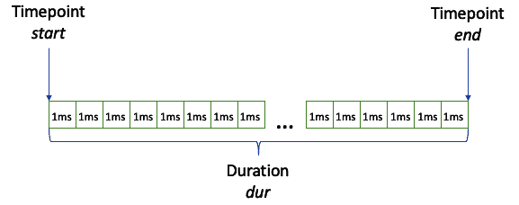

# 在 Linux 中使用时钟、定时器和信号

在本章中，我们将首先探索 Linux 环境中可用的各种定时器。随后，我们将深入研究时钟纪元的重要性，并探讨 UNIX 时间的概念。接着，我们将揭示在 Linux 中使用 POSIX 精确测量时间间隔的方法。进一步地，我们将揭示 `std::chrono` 的领域，并检查 C++ 为有效的时间相关操作提供的功能。我们的旅程随后进展到对 `std::chrono` 框架中定义的持续时间、时间点和时钟的全面审查。继续前进，我们将熟悉 `std::chrono` 中可用的各种时钟。在我们导航的过程中，我们将迈出第一步，利用 `std::chrono` 提供的日历功能。在探索的最后阶段，我们将熟悉时区，并利用 `std::chrono` 的强大工具执行无缝的时间转换。

在本章中，我们将涵盖以下主要主题：

+   探索 Linux 中的定时器

+   在 C++ 中处理时间

+   使用时钟、定时器和比率

+   使用日历和时区功能

那么，让我们开始吧！

# 技术要求

本章中的所有示例都在以下配置的环境中进行了测试：

+   Linux Mint 21 Cinnamon 版本。

+   GCC 13.2，编译器标志：`-std=c++20`。

+   稳定的互联网连接。

+   请确保您的环境至少是这个版本。对于所有示例，您还可以使用 [`godbolt.org/`](https://godbolt.org/)。

+   本章中的所有代码示例都可以从 [`github.com/PacktPublishing/C-Programming-for-Linux-Systems/tree/main/Chapter%208`](https://github.com/PacktPublishing/C-Programming-for-Linux-Systems/tree/main/Chapter%208) 下载。

# 在 Linux 中处理时间

时间是任何计算机系统的一个基本方面，Linux 也不例外。在 Linux 中，有不同类型的定时器可供使用，每个定时器都设计用于处理特定的任务和需求。

这些定时器可以用来测量程序的执行时间、安排任务、触发事件等等。在本节中，我们将探讨 Linux 中可用的不同类型的定时器以及如何有效地使用它们。

这里列出了 Linux 系统中使用的不同类型的定时器：

+   **系统定时器**：Linux 内核使用系统定时器来跟踪时间和安排各种任务。系统定时器用于测量系统运行时间、延迟和超时。Linux 中最重要的系统定时器是 *Jiffies* 定时器，它在系统时钟的每次滴答中增加 1。Jiffies 定时器用于跟踪自系统启动以来经过的时间，并且它经常被各种内核模块和驱动程序使用。

+   `/dev/rtc` 设备文件或 `hwclock` 命令行工具。RTC 用于在启动时同步系统时间，并维护系统事件的准确时间戳。

+   **高分辨率计时器（HRTs）**：HRTs 提供纳秒级分辨率，这使得它们适合需要精确计时的实时应用程序。HRTs 可用于测量代码段的执行时间、以高精度安排事件或驱动高速硬件。

+   `timer_create()`、`timer_settime()` 和 `timer_delete()` 系统调用。

+   **计时器队列**：计时器队列是 Linux 内核提供的一种调度事件和超时的机制。计时器队列作为事件优先队列实现，其中每个事件都与一个计时器相关联。计时器队列可用于安排周期性任务、实现超时或在特定间隔触发事件。计时器队列在各个内核模块和设备驱动程序中被广泛使用。

但说到计时器，我们首先需要了解在计算机系统中时间意味着什么。让我们看看。

## Linux 基准点

在计算机科学中，*基准点* 指的是在特定系统或上下文中用作测量时间的参考的具体时间点。它作为其他时间值计算或表示的起点。换句话说，这是计算机测量系统时间的时间起点。

基准点通常定义为特定的时间点，通常表示为自特定基准时间点以来经过的秒数、毫秒数或其他小于毫秒的时间间隔。基准点的选择取决于系统和上下文。例如，在 Linux 类似系统中，Linux 就是这样的系统，基准点被定义为 *1970 年 1 月 1 日 00:00:00 UTC*（协调世界时）。这个基准时间通常被称为 *UNIX 基准点* 或 *UNIX 时间*。基于 UNIX 的系统中的时间值通常表示为自 UNIX 基准点以来经过的秒数。

现在，我们已经更好地理解了 UNIX 基准点，让我们看看如何在实践中使用这些计时器的例子。

## 在 Linux 中使用计时器

既然我们已经了解了 Linux 中可用的不同类型的计时器，让我们探索如何在我们的应用程序中使用它们。我们将查看一个启动 POSIX 计时器并等待其被信号的通知的例子：

```cpp
#include <iostream>
#include <csignal>
#include <unistd.h>
#include <sys/time.h>
#include <atomic>
static std::atomic_bool continue_execution{true};
int main() {
    struct sigaction sa{};
    sa.sa_handler = [](int signum) {
        // Timer triggered, stop the loop.
        std::cout << "Timer expired. Stopping the
          task...\n";
        continue_execution = false;
    };
    sigemptyset(&sa.sa_mask);
    sa.sa_flags = 0;
    sigaction(SIGALRM, &sa, nullptr);
    // Configure the timer to trigger every 1 seconds
    struct itimerval timer{
        .it_interval{.tv_sec{1}, .tv_usec{0}},
        .it_value{.tv_sec{1}, .tv_usec{0}}
    };
    // Start the timer
    setitimer(ITIMER_REAL, &timer, nullptr);
    std::cout << "Timer started. Waiting for timer
      expiration...\n";
    // Keep the program running to allow the timer to
      trigger
    while (continue_execution) {
        sleep(1);
    }
    return 0;
}
```

在这个例子中，我们定义了一个 lambda 处理器，该处理器将在计时器到期时被调用。在处理器内部，我们打印一条消息，表明计时器已到期，并设置繁忙循环的退出条件。

我们使用`sigaction`函数设置信号处理程序。然后，我们使用`it_interval`和`it_value`成员配置计时器。配置计时器后，我们通过调用带有`ITIMER_REAL`选项的`setitimer` POSIX 函数来启动它，该选项设置一个实时计时器，在到期时发送`SIGALRM`信号。我们进入一个循环以无限期地运行程序。循环中的`sleep(1)`调用确保程序不会立即退出，并允许计时器触发。

程序的输出如下：

```cpp
Program returned: 0
Timer started. Waiting for timer expiration...
Timer expired. Stopping the task...
```

在软件开发中，另一个常见的任务是测量代码段的执行时间。这也可以通过使用 POSIX 时间功能来实现。要测量代码段的执行时间，我们可以在 POSIX 中使用高分辨率计时器（HRT）。

要在 POSIX 中使用 HRT，我们将使用`clock_gettime()`函数以及`CLOCK_MONOTONIC`时钟 ID。以下是一个演示在 POSIX 中使用 HRT 的示例：

```cpp
#include <iostream>
#include <ctime>
static const auto LIMIT{10000};
void just_busy_wait_f() {
    for (auto i{0}; i < LIMIT; ++i) {
        for (auto j{0}; j < LIMIT; ++j);
    }
}
int main() {
    timespec start, end;
    // Start the timer
    clock_gettime(CLOCK_MONOTONIC, &start);
    // Measured code segment
    just_busy_wait_f();
    // Stop the timer
    clock_gettime(CLOCK_MONOTONIC, &end);
    // Calculate the elapsed time
    const auto elapsed{(end.tv_sec - start.tv_sec) +
      (end.tv_nsec - start.tv_nsec) / 1e9};
    std::cout << "Elapsed time: " << elapsed << "
      seconds\n";
    return 0;
}
```

在这个例子中，我们声明了两个`timespec`结构，`start`和`end`，以保存计时器的开始和结束时间戳。我们使用`clock_gettime()`函数使用高分辨率时钟获取当前时间。

我们调用`clock_gettime()`两次：一次在任务开始时（记录开始时间）和一次在结束时（记录结束时间）。使用`CLOCK_MONOTONIC`时钟 ID，它代表一个不受系统时间调整影响的单调时钟。

在捕获开始和结束时间戳后，我们通过减去时间戳的相应秒和纳秒组件来计算经过的时间。然后将结果打印为经过的时间（以秒为单位）。

我们测试实验室中的示例输出如下：

```cpp
Program returned: 0
Elapsed time: 0.169825 seconds
```

请记住，在您的环境中，结果可能会有所不同。

注意，这个例子演示了使用计时器测量执行时间的一种方法。根据您的需求，您可以选择不同的计时器机制。

## POSIX 计时器特性

让我们看看 POSIX 计时器的一些特性：

+   **强大且灵活**：POSIX 计时器提供了一组丰富的功能，包括不同的计时器类型（例如，间隔计时器和一次性计时器）、各种时钟源以及精确控制计时器行为。

+   **低级控制**：POSIX 计时器提供了对计时器设置的精细控制，例如信号处理和计时器到期行为。

+   **向后兼容性支持**：POSIX 计时器是 POSIX API 的一部分，在类 UNIX 系统上已经可用很长时间了，这使得它们在需要与旧代码或特定 POSIX 要求保持兼容性时非常合适。

+   **平台特定**：POSIX 计时器并非在所有平台上都可用，因此如果可移植性是一个问题，最好切换到更合适的选择。

但在 C++中我们有什么更好的替代方案呢？我们将在下一节中看到。

# C++中的时间处理

虽然 POSIX 计时器有其优点，但在 C++ 中存在提供更高层次和更便携的定时和时间相关操作解决方案的库。

这样的库的一个好例子是 `std::chrono`。这是一个提供与时间相关操作和测量的一组实用工具的 C++ 库。它是标准库的一部分，包含在 `<chrono>` 头文件中。`std::chrono` 库提供了一种灵活且类型安全的机制来表示和操作时间间隔、时间点、时钟以及与时间相关的操作。通过使用 `std::chrono`，您将受益于 C++ 标准库带来的标准化、类型安全、灵活性和集成。与传统的 POSIX 方法相比，`std::chrono` 的一些优势如下：

+   `std::chrono` 是 C++ 标准库的一部分，使其成为一个跨平台解决方案，可以在不同的操作系统和编译器上保持一致性。另一方面，POSIX 是特定于类 UNIX 系统的，可能在所有平台上不可用或表现不一致。

+   `std::chrono` 提供了类型安全的时间间隔和时间点的表示。它提供了一套丰富的持续时间时钟类型，可以无缝地一起使用，从而实现更安全、更具表现力的代码。POSIX 计时器虽然功能强大，但通常依赖于低级类型，如 `timespec` 结构体，这可能导致错误并需要手动转换。

+   `std::chrono` 为时间相关操作提供了一个灵活且具有表现力的接口。它提供了方便的方式来对持续时间执行算术运算、在不同时间单位之间进行转换以及格式化时间值。POSIX 计时器虽然适用于特定的定时要求，但缺乏 `std::chrono` 提供的高级抽象和实用工具。

+   `std::chrono` 与 C++ 标准库的其他部分无缝集成。它可以与算法、容器和并发设施一起使用，从而实现更紧密和高效的代码。POSIX 计时器作为一个低级接口，可能需要额外的工作才能与其他 C++ 标准库组件集成。

+   `std::chrono` 得益于现代 C++ 中引入的进步和特性。它支持用户定义文字、lambda 函数和类型推导等特性，使得编写简洁和具有表现力的代码变得更加容易。POSIX 计时器作为 POSIX API 的一部分，可能无法充分利用现代 C++ 语言特性。

`<chrono>` 库为处理与时间相关的操作提供了一套全面的特性，例如测量时间间隔、表示时间点以及执行各种时间计算和转换。以下是 `std::chrono` 的关键组件和特性：

+   `<chrono>` 定义了几个时钟类型，它们代表不同的时间来源和不同的纪元。`std::chrono::system_clock` 代表可调整的全局 RTC，`std::chrono::steady_clock` 代表不受系统时间调整影响的一致单调时钟，`std::chrono::high_resolution_clock` 代表具有最高可用分辨率的时钟（如果系统支持）。

+   `std::chrono::duration` 模板类表示一个时间间隔，即指定的时间段。持续时间是使用特定时间单位计数的滴答数；例如，五个小时是五个单位的 *小时* 滴答。可以定义不同类型的持续时间，从年到纳秒。示例持续时间包括 `std::chrono::seconds`、`std::chrono::milliseconds` 和 `std::chrono::months`。

+   `std::chrono::time_point` 模板类由一个时钟和持续时间类型参数化。

+   `std::chrono` 允许在持续时间和时间点之间进行转换，以及涉及持续时间的算术运算。它提供了将不同持续时间之间进行转换的函数，如 `std::chrono::duration_cast`，以及将不同时间点之间进行转换的函数 `std::chrono::time_point_cast`。

+   `std::chrono` 提供了查询当前时间的实用工具，例如 `std::chrono::system_clock::now()`，它返回当前的系统时间点。

+   `std::chrono` 在 `std::literals::chrono_literals` 命名空间中提供用户定义的时间相关字面量。它们允许您使用带时间单位的字面量创建 `std::chrono::duration` 对象。这使得处理与时间相关的计算时代码更易于阅读和方便。

+   `std::chrono` 提供了日历功能，例如处理天、月和年。它还提供了闰年和闰秒的表示法。

+   `std::chrono` 根据地理位置提供关于全球不同时区的信息。

通过使用 `std::chrono`，您可以执行精确且可移植的时间测量，处理超时，计算时间差，并以类型安全的方式处理与时间相关的操作。

重要提示

以下是一个指向 C++ 参考文档中 `<chrono>` 头文件的链接：[`en.cppreference.com/w/cpp/header/chrono`](https://en.cppreference.com/w/cpp/header/chrono)。

下面是一个如何使用 `std::chrono` 来测量代码片段执行时间的示例：

```cpp
#include <iostream>
#include <chrono>
using namespace std::chrono;
int main() {
    const auto start{steady_clock::now()}; // {1}
    just_busy_wait_f(); // {2}
    const auto end{steady_clock::now()}; // {3}
    const auto dur{duration_cast<milliseconds>(end -
      start)}; // {4}
    std::cout << "Execution time: " << dur.count() << "
      milliseconds\n"; // {5}
    return 0;
}
```

在前面的示例中，使用 `std::chrono::steady_clock` 来测量与上一个示例中相同函数的执行时间（参见标记 `{2}`）。`start` 和 `end` 变量代表使用 `steady_clock` 的 `now()` 静态函数在代码执行前后获取的 *时间点*（参见标记 `{1}` 和 `{3}`）。`std::chrono::duration_cast` 用于将时间点之间的计算持续时间转换为毫秒（参见标记 `{4}`）。

程序的输出应类似于以下内容：

```cpp
Program returned: 0
Execution time: 179 milliseconds
```

正如你所见，`std::chrono::duration`类有一个`count()`方法，它返回特定持续时间中的单位数；参见标记 `{5}`。

但让我们更深入地了解它是如何真正工作的。

# 使用时钟、计时器和比率

在进入更多关于时钟和计时器的例子之前，我们首先需要更好地理解 chrono 库是如何定义*持续时间*的。

正如我们在前面的例子中所见，持续时间是两个时间点之间的距离，称为*时间点*。在我们的前一个例子中，这些是`start`和`end`时间点。



图 8.1 – 时间点和持续时间

持续时间本身是滴答计数和表示从一个滴答到下一个滴答的秒数的分数的组合。这个分数由`std::ratio`类表示。以下是一些示例：

```cpp
using namespace std::chrono;
constexpr std::chrono::duration<int, std::ratio<1>>
  six_minutes_1{360};
constexpr std::chrono::duration<double, std::ratio<3600>>
  six_minutes_2{0.1};
constexpr std::chrono::minutes six_minutes_3{6};
constexpr auto six_minutes_4{6min};
std::cout << six_minutes_1 << '\n';
std::cout << six_minutes_2 << '\n';
std::cout << six_minutes_3 << '\n';
std::cout << six_minutes_4 << '\n';
static_assert(six_minutes_1 == six_minutes_2);
static_assert(six_minutes_2 == six_minutes_3);
static_assert(six_minutes_3 == six_minutes_4);
```

在前面的例子中，我们以几种方式定义了六分钟的持续时间。在`six_minutes_1`变量中，我们指定了这个持续时间为 360 秒。相同的持续时间也可以表示为 1/10 小时 – `six_minutes_2`变量。最后两个持续时间 – `six_minutes_3`和`six_minutes_4` – 使用`std::chrono`预定义的持续时间类型和字面量表示相同的六分钟持续时间。以下是前面代码块的输出：

```cpp
360s
0.1h
6min
6min
```

正如你所见，`std::duration`还提供了相当强大的格式化功能，因此一旦持续时间传递给字符串或流操作符，它将添加相应的后缀，这样我们就可以看到持续时间类型。

为了确保前面的持续时间确实对应六分钟，我们已经用`static_assert`测试了它们，如果不匹配，程序将失败。

重要提示

以下是一个链接到 C++参考文档中的`std::duration`类：[`en.cppreference.com/w/cpp/chrono/duration`](https://en.cppreference.com/w/cpp/chrono/duration)。

让我们回到我们之前的一个例子，稍作修改，并更仔细地看看一个`timepoint`对象：

```cpp
using namespace std::chrono;
const time_point start{steady_clock::now()}; // {1}
const duration epoch_to_start{start.time_since_epoch()}; //
  {2}
std::cout << "Time since clock epoch: " << epoch_to_start
  << '\n'; // {3}
```

正如你所见，我们再次构造了一个`timepoint`对象`start`，在这个对象中，我们从 Linux 系统的`steady_clock`实例中获取其实例化时刻的时间；参见标记 `{1}`。`std::chrono::time_point`类存储一个`std::chrono::duration`值，这个值实际上表示从时钟纪元开始的时间间隔。为了允许获取这个值，`std::chrono::duration`类公开了一个返回持续时间的`time_since_epoch()`方法，单位为纳秒；参见标记 `{2}`。

这是前面代码在我们测试环境中执行的结果。请注意，如果你执行此代码，结果可能会有所不同：

```cpp
Time since clock epoch: 2080809926594ns
```

在某些用例中，如我们计算代码块执行时间的例子，以纳秒为单位的时间持续时间可能不方便。然而，将持续时间从高精度类型转换为低精度类型会导致精度损失。因此，如果我们需要以分钟和纳秒为单位查看持续时间，我们不能只是这样做：

```cpp
using namespace std::chrono;
const minutes
  dur_minutes{steady_clock::now().time_since_epoch()};
```

这是因为前面的代码无法编译。背后的原因是`time_since_epoch()`方法返回的持续时间具有纳秒的精度。如果我们把数据存储在分钟里，我们肯定会失去精度。为了确保这不是一个错误，编译器阻止了我们。

但我们如何有意地将持续时间值从一种精度转换为另一种精度呢？正如我们在第一个例子中所看到的，我们可以使用库提供的`std::chrono::duration_cast`函数。它使我们能够将具有更高精度的持续时间类型转换为具有更低精度的持续时间类型。让我们重新处理前面的例子，看看它是如何工作的：

```cpp
using namespace std::chrono;
auto dur_from_epoch{steady_clock::now()
  .time_since_epoch()}; // {1}
minutes dur_minutes{duration_cast<minutes>
  (dur_from_epoch)}; // {2}
std::cout << "Duration in nanoseconds: " << dur_from_epoch
  << '\n'; //{3}
std::cout << "Duration in minutes: " << dur_minutes <<
  '\n'; //{4}
```

如您在标记 `{1}`中所见，我们再次从时钟的纪元得到纳秒的持续时间。在标记 `{2}`中，我们初始化另一个持续时间变量，但这次是以分钟为单位。为了做到这一点，我们使用`std::chrono::duration_cast<minutes>`，它将源分辨率转换为目标分辨率，并将其截断到最接近的整数值。在我们的测试环境中，前面代码块的结果如下：

```cpp
Duration in nanoseconds: 35206835643934ns
Duration in minutes: 586min
```

我们可以看到，以纳秒为单位的测量持续时间相当于大约 586.78 分钟，但它被截断到 586 分钟。

当然，我们也可能需要向上舍入而不是简单地向下截断值。幸运的是，`chrono`库通过`std::chrono::round`方法提供了这种能力，它正好做到了这一点。以下是一个例子：

```cpp
using namespace std::chrono;
seconds dur_sec_1{55s}; //{1}
seconds dur_sec_2{65s}; //{2}
minutes dur_min_1{round<minutes>(dur_sec_1)}; //{3}
minutes dur_min_2{round<minutes>(dur_sec_2)}; //{4}
std::cout << "Rounding up to " << dur_min_1 << '\n';
std::cout << "Rounding down to " << dur_min_2 << '\n';
```

在这个例子中，我们定义了两个持续时间变量，`dur_sec_1`和`dur_sec_2`。`dur_sec_1`被初始化为 55 秒（见标记 `{1}`），而`dur_sec_2`被初始化为 65 秒（见标记 `{2}`）。然后，使用`std::chrono::round`函数，我们初始化另外两个持续时间变量，但这次以分钟为分辨率（见标记 `{3}`和 `{4}`）。这两个持续时间变量都被四舍五入到一分钟：

```cpp
Rounding up to 1min
Rounding down to 1min
```

`chrono`库还提供了`ceil`和`floor`持续时间的方法。所有这些都可以在官方文档中找到。

重要提示

`round`、`floor`和`ceil`方法对于持续时间值的文档可以在以下链接中找到：[`en.cppreference.com/w/cpp/chrono/duration/round`](https://en.cppreference.com/w/cpp/chrono/duration/round)，https://en.cppreference.com/w/cpp/chrono/duration/floor，以及[`en.cppreference.com/w/cpp/chrono/duration/ceil`](https://en.cppreference.com/w/cpp/chrono/duration/ceil)。

由于我们对时间操作有了更好的理解，让我们更仔细地看看`std::chrono`为我们提供的不同类型的时钟。

## 关于 C++20 中的时钟的更多信息

我们已经在之前的例子中使用了 `std::chrono::steady_clock`。这只是 C++ `chrono` 库中可用的预定义时钟之一。正如其名称所暗示的，`std::chrono::steady_clock` 是一个稳定的时钟。这意味着它是一个单调时钟，其中时间只向前移动，并且其时间点值总是增加。当我们想要测量时间间隔时，它很适用。它的纪元可以变化。

另一个常用的时钟是 `std::chrono::system_clock`。在 Linux 中，它代表系统测量的时间。这意味着它不保证是单调的，并且可以在任何时候进行调整。在 Linux 中，它的纪元与 UNIX 纪元相匹配。让我们看一个例子：

```cpp
using namespace std::chrono;
time_point<system_clock> systemClockEpoch;
std::cout << std::format("system_clock epoch:
  {0:%F}T{0:%R%z}.", systemClockEpoch) << '\n';
```

前面的例子打印了 Linux 系统时钟纪元，它对应于 UNIX 纪元——`1970`年`1`月`1`日的`00:00:00: UTC`：

```cpp
system_clock epoch: 1970-01-01T00:00+0000.
```

请记住，`std::chrono::system_clock` 并不考虑 *闰秒*，这些秒可以从测量时间中添加或减去。一般来说，闰秒是对协调世界时（UTC）的一次一秒调整，每年可能发生两次，以反映地球绕太阳旋转的精度。

重要提示

关于闰秒的更多信息，请参阅此处：[`en.wikipedia.org/wiki/Leap_second`](https://en.wikipedia.org/wiki/Leap_second)。

C++20 引入了几种更多的预定义时钟。其中一些是 `std::chrono::utc_clock`，它测量 UTC，以及 `std::chrono::tai_clock`，它测量**国际原子时**（**TAI**）。

重要提示

关于 UTC 和 TAI 的更多信息，请参阅此处：[`en.wikipedia.org/wiki/Coordinated_Universal_Time`](https://en.wikipedia.org/wiki/Coordinated_Universal_Time) 和 [`en.wikipedia.org/wiki/International_Atomic_Time`](https://en.wikipedia.org/wiki/International_Atomic_Time)。

TAI 时钟和 UTC 时钟之间的一个关键区别是，UTC 时钟保证会考虑自时钟纪元以来进行的闰秒修正，但 TAI 时钟不考虑这些修正。让我们看一个例子：

```cpp
using namespace std::chrono;
tai_time tai{tai_clock::now()};
utc_time utc{utc_clock::now()};
std::cout << "International atomic time (TAI): " << tai <<
  '\n';
std::cout << "Coordinated universal time (UTC): " << utc <<
  '\n';
```

在前面的例子中，我们从两个时钟——`utc` 和 `tai`——获取了当前时间。以下是结果：

```cpp
International atomic time (TAI): 2023-08-04 14:02:57.95506
Coordinated universal time (UTC): 2023-08-04 14:02:20.95506
```

如您所见，无论两个时钟是否同时调用，它们显示的时间都不同。并且它们的差异正好是 *37 秒*。这种差异来自自 1972 年引入以来进行的闰秒调整。

`std::chrono::utc_clock` 应用闰秒调整。通过使用 chrono 的 UTC 时钟，这些闰秒调整将自动为您完成，您不需要采取任何特殊行动。因此，chrono 库提供了一个在时钟类型之间进行转换的方法——`std::chrono::clock_cast`，它可以将 `std::chrono::time_point` 值从一个时钟转换为另一个时钟。让我们再看一个例子：

```cpp
using namespace std::chrono;
tai_time tai{tai_clock::now()};
std::cout << "International atomic time (TAI): " << tai <<
  '\n';
utc_time utc{clock_cast<utc_clock>(tai)};
std::cout << "Coordinated universal time (UTC): " << utc <<
  '\n';
```

如您所见，由 chrono 的 TAI 时钟生成的`time_point tai`对象被转换为 UTC 时钟的时间点。结果如下：

```cpp
International atomic time (TAI): 2023-08-04 14:16:22.72521
Coordinated universal time (UTC): 2023-08-04 14:15:45.72521
```

如我们所预期，TAI 时钟比 UTC 时钟快 37 秒。因此，UTC 不能正确地测量时间差，因为可能会添加或删除闰秒。

重要提示

您可以在 C++ chrono 库中找到所有预定义的时钟：[`en.cppreference.com/w/cpp/chrono#Clocks`](https://en.cppreference.com/w/cpp/chrono#Clocks)。

现在，由于我们已经对时间和时钟有了很好的理解，让我们看看 C++ chrono 库为日历和时间区域提供了哪些功能。

# 使用日历和时间区域功能

C++20 向标准引入了对日历和时间区域操作的新支持。当我们谈论日历操作时，这意味着在日、月和年中的操作。它们与时间区域概念一起，允许在不同时区之间进行时间转换，同时考虑时区调整，如夏令时。

让我们定义一个日期并使用`chrono`库打印它：

```cpp
using namespace std::chrono;
year theYear{2023};
month theMonth{8};
day theDay{4};
std::cout << "Year: " << theYear;
std::cout << ", Month: " << theMonth;
std::cout << ", Day: " << theDay << '\n';
```

如您所见，`std::chrono`命名空间提供了`year`、`month`和`day`类，这使得处理日期变得容易。这些类的优点是它们提供了严格的类型和边界检查，一些用于加法和减法的运算符，以及格式化功能。前面代码的结果如下：

```cpp
Year: 2023, Month: Aug, Day: 04
```

如您所见，将`Month`变量传递给`operator<<`会应用格式化，以便月份的值打印为`Aug`。此外，这些类提供了对应用值的验证和边界检查：

```cpp
using namespace std::chrono;
std::cout << "Year: " << year{2023} ;
std::cout << ", Month: " << month{13};
std::cout << ", Day: " << day{32} << '\n';
```

在前面的例子中，我们应用了一个无效的月份和月份中的日期。结果如下：

```cpp
Year: 2023, Month: 13 is not a valid month, Day: 32 is not a valid day
```

如您所见，`month`和`day`值已通过验证，当它们传递给`operator<<`时，它会打印出这些值无效。

`year`类表示公历中的一个年份，这使得我们可以询问该年份是否为闰年：

```cpp
using namespace std::chrono;
sys_time now{system_clock::now()};
year_month_day today{floor<days>(now)};
std::cout << "Today is: " << today << '\n';
year thisYear{today.year()};
std::cout << "Year " << thisYear;
if (thisYear.is_leap()) {
    std::cout << " is a leap year\n";
} else {
    std::cout << " is not a leap year\n";
}
```

在这个例子中，我们首先获取当前系统时间`now`，然后将其转换为`year_month_day`类型的对象。该对象表示一个方便的基于字段的时点。它包含`year`、`month`和`day`对象，并允许直接访问它们。它还支持从`std::chrono::sys_days`实例化，这实际上是一个系统时钟的时点。因此，我们传递`now`时点并创建`today`对象。然后，我们获取`year`对象`thisYear`，并使用`year`类的`is_leap()`方法检查它是否是闰年：

```cpp
Today is: 2023-08-05
Year 2023 is not a leap year
```

如预期，2023 年不是闰年。

`chrono`库在日期创建中大量使用`operator/`。C++20 为该运算符的参数提供了大约 40 个重载。让我们看一个例子：

```cpp
using namespace std::chrono;
year_month_day date1{July/5d/2023y};
year_month_day date2{1d/October/2023y};
year_month_day date3{2023y/January/27d};
std::cout << date1 << '\n';
std::cout << date2 << '\n';
std::cout << date3 << '\n';
```

如您所见，我们通过传递新引入的 *chrono 文字面量*（月份、日期和年份）以及 `operator/` 来创建 `year_month_day` 对象。chrono 为创建日期提供了方便的文字面量；您只需在日期值后附加 `d`。对于年份也是如此，您需要附加 `y` 并构建一个 `year` 对象。对于月份，chrono 库为每年的所有月份定义了命名常量。

重要提示

以下是一个链接，列出了 chrono 库中的月份常量：[`en.cppreference.com/w/cpp/chrono/month`](https://en.cppreference.com/w/cpp/chrono/month)。

在实例化 `year_month_day` 对象时，我们使用 `operator/` 来传递日期值。从前面的示例中可以看出，chrono 支持许多日期、月份和年份值的组合。所有这些都可以在标准文档中找到。

重要提示

以下是一个链接，列出了日期管理中 `operator/` 的所有重载：[`en.cppreference.com/w/cpp/chrono/operator_slash`](https://en.cppreference.com/w/cpp/chrono/operator_slash)。

我们示例中使用的所有重载都旨在创建有效的 `year_month_date` 对象。让我们看看输出结果：

```cpp
2023-07-05
2023-10-01
2023-01-27
```

如我们所见，我们已成功使用 chrono 文字面量和 `operator/` 创建了三个不同的有效日期。

## 在 C++ 中处理时区

C++20 的 `chrono` 库提供了处理时区的能力。它集成了 IANA 时区数据库，该数据库包含全球许多地理位置的本地时间信息。

重要提示

在此处查找有关 IANA 时区数据库的更多信息：[`www.iana.org/time-zones`](https://www.iana.org/time-zones)。

使用 `chrono`，您可以获取 IANA 数据库的副本，并浏览特定地理位置的信息：

```cpp
using namespace std::chrono;
const tzdb& tzdb{get_tzdb()};
const std::vector<time_zone>& tzs{tzdb.zones};
for (const time_zone& tz : tzs) {
    std::cout << tz.name() << '\n';
}
```

从示例中我们可以看出，在 `std::chrono` 命名空间中有一个方法——`get_tzdb()`，它返回对 IANA 数据库的引用。在数据库中，您可以找到有关其版本的信息，还可以获取所有可用的 `std::chrono::time_zone` 对象的排序列表。

`std::chrono::time_zone` 类存储有关特定地理区域和名称之间时区转换的信息。前一个示例的输出如下：

```cpp
Africa/Abidjan
Africa/Accra
Africa/Addis_Ababa
Africa/Algiers
Africa/Asmara
Africa/Bamako
...
```

现在，一旦我们有了所有可用的时间区，让我们尝试根据地理位置找到一个特定的时间区，并看看那里的时间是什么：

```cpp
using namespace std::chrono;
const tzdb& tzdb{get_tzdb()};
const std::vector<time_zone>& tzs{tzdb.zones};
const auto& res{std::find_if(tzs.begin(), tzs.end(), []
  (const time_zone& tz){
    std::string name{tz.name()};
    return name.ends_with("Sofia");
})};
if (res != tzs.end()) {
    try {
        const std::string_view myLocation{res->name()};
        const std::string_view london{"Europe/London"};
        const time_point now{system_clock::now()};
        const zoned_time zt_1{myLocation, now};
        const zoned_time zt_2{london, now};
        std::cout << myLocation << ": " << zt_1 << '\n';
        std::cout << london << ": " << zt_2 << '\n';
    } catch (const std::runtime_error& e) {
        std::cout << e.what() << '\n';
    }
}
```

在这个例子中，我们再次获取可用的时区列表，并尝试找到城市`索非亚`的时区。然后，我们使用找到的时区的全名创建另一个对象，该对象使用特定的地理位置和系统时间值——`std::chrono::zoned_time`。这个类代表了一个时区和时间点之间的逻辑对。我们还创建了另一个`zoned_time zt_2`对象，但针对的是城市`伦敦`，它代表与`zt_1`相同的时间点，但位于另一个地理位置。上述代码的结果如下：

```cpp
Europe/Sofia: 2023-08-05 13:43:53.503184619 EEST
Europe/London: 2023-08-05 11:43:53.503184619 BST
```

如您所见，这两个对象都显示了一个有效的时间，但相对于它们的地理位置而言。这就是我们如何安全地获取特定地理位置的当前时间，同时考虑夏令时的情况。

# 摘要

在本章中，我们探讨了 Linux 环境中可用的不同计时器。随后，我们了解了时钟纪元和 UNIX 时间概念的重要性。接着，我们深入研究了 Linux 中 POSIX 的实际实现，以实现准确的时间测量。此外，我们还研究了`std::chrono`领域，并检查了 C++为有效的时间相关操作提供的各种功能。我们的探索随后带我们详细了解了`std::chrono`框架中定义的持续时间、时间点和时钟。向前推进，我们熟悉了`std::chrono`中可用的各种时钟类型。随着我们的旅程继续，我们开始探索`std::chrono`提供的日历功能。最后，我们熟悉了时区，并提高了使用`std::chrono`提供的工具执行无缝时间转换的熟练度。现在，我们已准备好进入下一章，我们将更深入地探讨 C++内存模型的细节。
