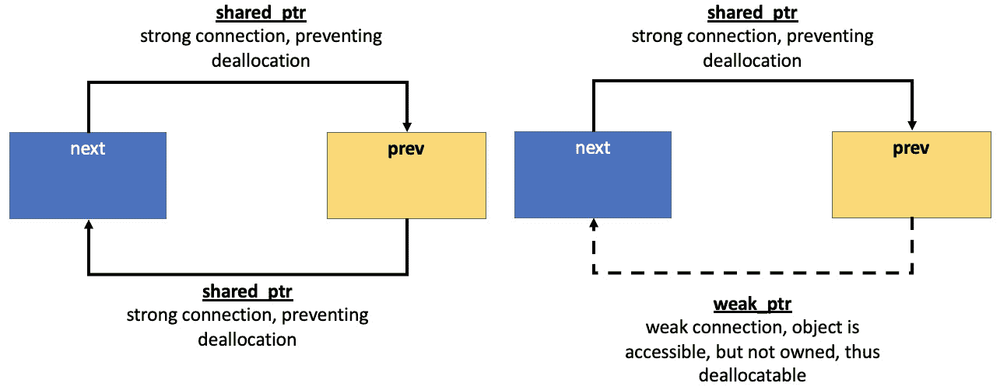
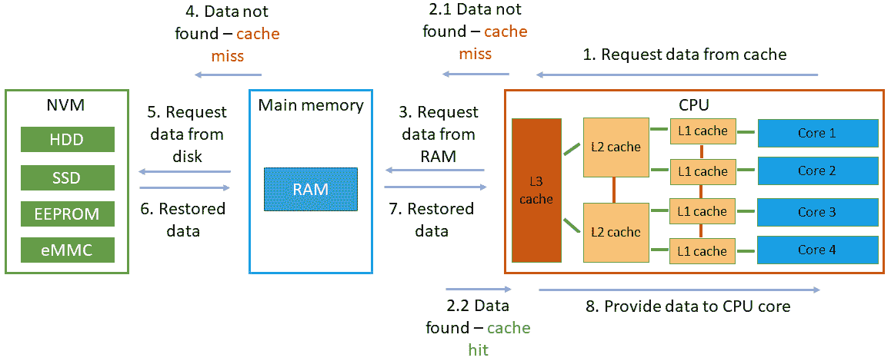
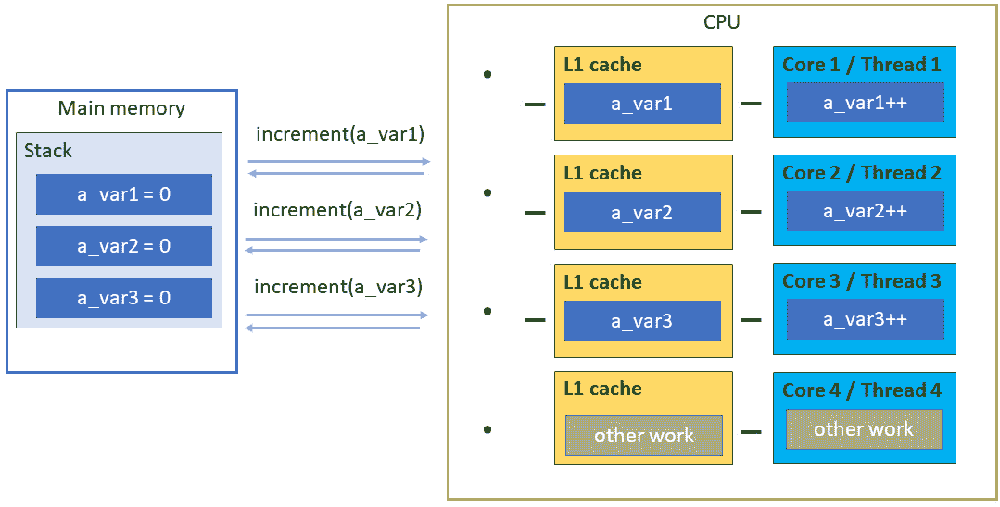

# 9

# 理解 C++ 内存模型

本章是延续第*第七章*的讨论，在第七章中，我们讨论了一些多进程和多线程技术；本章将增强它们的用法。我们将引导您了解各种技术，同时缩小到本章的主要焦点——C++内存模型。但为了讨论这一点，您将首先通过智能指针和可选对象对内存健壮性进行简要检查。我们将在稍后使用它们来实现**延迟初始化**并安全地处理**共享内存**区域。接下来是针对**缓存友好**代码的改进内存访问分析。您将了解为什么即使在软件设计中做得一切正确，使用多线程执行也可能成为陷阱。

本章为您提供了扩展对同步原语理解的机会。在学习**条件变量**的同时，您还将了解**读写锁**的好处。我们将使用 C++20 的**范围**来以不同的方式可视化相同共享数据。逐一结合这些机制，我们将以最大的主题——指令排序来最终完成我们的分析。通过 C++ 的**内存顺序**，您将了解正确原子例程设置的重要性。最后，我们将使用**自旋锁**实现来总结所有技术。

在本章中，我们将涵盖以下主要主题：

+   了解 C++ 中的智能指针和可选

+   了解 C++ 中的条件变量、读写锁和范围

+   讨论多处理器系统——C++ 中的缓存局部性和缓存友好性

+   通过自旋锁实现回顾 C++ 内存模型中的共享资源

# 技术要求

为了运行代码示例，读者必须准备以下内容：

+   能够编译和执行 C++20 的基于 Linux 的系统（例如，**Linux** **Mint 21**）

+   GCC12.2 编译器：[`gcc.gnu.org/git/gcc.git gcc-source`](https://gcc.gnu.org/git/gcc.gitgcc-source)

    +   使用 `-std=c++2a`，`-lpthread` 和 `-``lrt` 标志

+   对于所有示例，您还可以使用 [`godbolt.org/`](https://godbolt.org/)。

+   本章中所有代码示例均可从 [`github.com/PacktPublishing/C-Programming-for-Linux-Systems/tree/main/Chapter%209`](https://github.com/PacktPublishing/C-Programming-for-Linux-Systems/tree/main/Chapter%209) 下载。

# 了解 C++ 中的智能指针和可选

在*第四章*中，我们回顾了 C++基础知识，以便在语言方面保持一致。另一个也被认为是*必需品*的工具是智能指针。通过这些工具，我们能够提高程序的安全性，并更有效地管理我们的资源。正如前面章节所讨论的，这是我们作为系统程序员的主要目标之一。还记得**RAII**原则吗？智能指针基于这一点，帮助 C++开发者减少甚至消除*内存泄漏*。它们还可以帮助管理共享内存，正如你将在本章后面看到的那样。

*内存泄漏*发生在我们分配内存但未能释放它的时候。这种情况不仅可能是因为我们忘记了调用对象的析构函数，还可能是因为我们失去了对该内存地址的指针。除此之外，还需要考虑*野指针*和*悬挂指针*。第一种情况是当指针存在于*栈*上，但它从未与实际对象（或地址）相关联。第二种情况是当我们释放了对象使用的内存，但指针的值仍然*悬挂*在周围，我们引用了一个已经被删除的对象。总的来说，这些错误不仅可能导致**内存碎片化**，还可能导致**缓冲区溢出**漏洞。

这些问题很难捕捉和重现，尤其是在大型系统中。系统程序员和软件集成工程师使用诸如地址清理器、静态和动态代码分析器以及性能分析器等工具，依赖它们来预测未来的缺陷。但是，这样的工具成本高昂，消耗大量的计算能力，因此我们不能始终依赖它们来保证更高的代码质量。话虽如此，我们还能做什么呢？答案是简单的——使用智能指针。

注意

你可以在标准中了解更多关于智能指针的信息，或者参考[`en.cppreference.com/w/cpp/memory`](https://en.cppreference.com/w/cpp/memory)。

## 通过智能指针重审 RAII

即使是有经验的 C++开发者，在处理内存释放的正确时机时也会犯错误。其他语言使用垃圾回收技术来处理内存管理，但重要的是要提到，那里也会发生内存泄漏。代码中实现了多种算法来检测此类情况，但并不总是成功。例如，对象之间的循环依赖有时很难解决——指向彼此的两个对象应该被删除，还是应该保持分配？如果它们保持分配，这构成泄漏吗？因此，我们必须谨慎对待内存使用。此外，垃圾回收器努力释放内存，但不管理打开的文件、网络连接、锁等。为此，C++实现了自己的控制工具——指针的包装类，帮助我们正确地释放内存，通常是在对象超出作用域时（对象生命周期已在*第四章*中讨论）。智能指针在内存和性能方面效率高，这意味着它们（几乎）不会比原始指针多花费（多少）成本。同时，它们在内存管理方面提供了稳健性。C++标准中有三种类型的智能指针：

+   `unique_ptr`: 这是一个只能有一个所有者的指针。它不能被复制或共享，但所有权可以被转让。它的大小与单个原始指针相同。当它超出作用域时，它将被销毁，对象将被释放。

+   `shared_ptr`: 它可以有多个所有者，当所有所有者都放弃对该对象的所有权或所有所有者都超出作用域时，它将被销毁。它使用一个指向对象的引用计数器。它的大小是两个原始指针——一个用于分配的对象，一个用于包含引用计数的共享控制块。

+   `weak_ptr`: 这提供了对一个或多个共享指针拥有的对象的访问，但不计算引用。它用于观察一个对象，但不用于管理其生命周期。它由两个指针组成——一个用于控制块，一个用于指向它从中构建的共享指针。通过`weak_ptr`你可以了解底层的`shared_ptr`是否仍然有效——只需调用`expired()`方法。

让我们通过以下示例演示它们的初始作用：

```cpp
struct Book {
   string_view title;
   Book(string_view p_title) : title(p_title) {
        cout << "Constructor for: " << title << endl; }
   ~Book() {cout << "Destructor for: " << title << endl;}};
int main() {
    unique_ptr<Book> book1 =
        make_unique<Book>("Jaws");
    unique_ptr<Book> book1_new;
    book1_new = move(book1); // {1}
    cout << book1_new->title << endl;
    shared_ptr<Book> book2 =
        make_unique<Book>("Dune");
    shared_ptr<Book> book2_new;
    book2_new = book2; // {2}
    cout << book2->title <<" "<< book2_new->title << endl;
    cout << book2.use_count() << endl;
```

正如你所见，我们在创建`Book`对象时使用堆，因为我们调用`new`。但是，由于智能指针处理内存管理，我们不需要显式调用析构函数：

```cpp
Constructor for: Jaws
Jaws
Constructor for: Dune
Dune Dune
2
Destructor for: Dune
Destructor for: Jaws
```

首先，我们将`book1`对象的拥有权移动到另一个`unique_ptr` – `book1_new`（标记{1}）。我们通过第二个`unique_ptr`打印其`title`，因为第一个已经无效。我们对另一个`Book`对象执行相同的操作，但通过一个`shared_ptr`对象（标记{2}）。这次`title`变量可以从两个指针访问。我们还打印了引用计数，我们看到有两个对该对象的引用。

`weak_ptr`在系统编程中也有有用的优势。你可以使用`weak_ptr`来检查指针的有效性。`weak_ptr`还可以解决对象之间的循环依赖问题。让我们考虑一个双链表列表节点的例子。下一个例子将说明`weak_ptr`的好处。现在是时候建议你不要自己实现这样的数据结构了，尤其是当它们已经是 C++标准的一部分时。

现在，让我们将`Book`对象用作`ListNode` `struct`的内容：

```cpp
struct ListNode {
    Book data;
    ListNode(string_view p_title) {
        data.title = p_title;
        cout << "Node created: " << data.title << endl;
    }
```

我们还添加了两个成员变量用于前一个和后一个节点，但其中一个将是`weak_ptr`。一个需要注意的是，`weak_ptr`引用在`shared_ptr`控制块中不被计为引用。现在，我们既有了对对象的访问，又有机会在每次分配时将引用计数归零：

```cpp
    ~ListNode() {
        cout << "Node destroyed: " << data.title
             << endl;
    }
    shared_ptr<ListNode> next;
    weak_ptr<ListNode> prev;
};
int main() {
    shared_ptr<ListNode> head =
        make_shared<ListNode>("Dune");
    head->next = make_shared<ListNode>("Jaws");
    if (!head->next->prev.expired())
        head->next->prev = head;
```

从输出中可以看出，所有对象都已成功删除：

```cpp
Node created: Dune
Node created: Jaws
Node destroyed: Dune
Node destroyed: Jaws
```

`weak_ptr`在缓存实现中也非常有用。想想看 – 如果你失去了对一个对象的全部引用，你将失去该对象本身；但是，使用智能指针，它肯定会销毁。所以，想象一下，最近访问的对象或重要性较高的对象通过`shared_ptr`在当前代码作用域中保持。但是`weak_ptr`允许我们在需要在该作用域中稍后引用该对象时，在该作用域中保持对对象的引用。在这种情况下，我们会为它创建一个`weak_ptr`对象。但是想象一下，与此同时，其他代码作用域通过`shared_ptr`持有对该对象的引用，从而保持其分配。换句话说，我们知道关于该对象的信息，但不需要担心其管理。因此，如果以后还需要，该对象仍然是可访问的，但如果不再需要，它将被删除。以下图表显示了`shared_ptr`在左侧可能的不正确使用，以及右侧描述的实现：



图 9.1 – 通过 shared_ptr 产生的循环依赖和通过 weak_ptr 解决

在本节中，我们不会深入探讨其他可能需要智能指针的设计解决方案，但稍后在本章的系统编程领域，我们将回到这些解决方案。在下一节中，我们将讨论一种与`weak_ptr`相反的技术，其中我们保留了对尚未在内存中创建的对象的意识。

## 在 C++中进行懒初始化

你玩电子游戏吗？在玩游戏的时候，你是否曾在图形中看到过缺失的纹理？当你用角色靠近时，是否有图形资源突然出现？你在其他 UI 中也观察到这种行为吗？如果你的回答大多是肯定的，那么你可能已经遇到了**延迟初始化**。很容易理解它的目的是将对象的构建推迟到真正需要的时候。通过这样做，我们只允许系统分配所需的资源。我们还用它来加速我们的代码，尤其是在高 CPU 负载期间运行时，比如在系统启动时。我们不会浪费 CPU 周期去创建那些（在很久以后）才需要的大的对象，而是让 CPU 腾出来处理其他请求。从负面来看，我们可能会遇到无法及时加载对象的情况，正如你在游戏中可能观察到的。正如我们在*第二章*中讨论的那样，这也用于程序加载时，内核以延迟方式分配虚拟内存——直到被引用，可执行代码的页面才被加载。

就像其他任何模式一样，**延迟初始化**不能解决所有问题。因此，系统程序员必须选择是否应该将其应用于给定应用程序的功能。通常，图形和网络存储资源的一部分保持延迟初始化是首选的，因为它们无论如何都是按需加载的。换句话说，用户并不总是看到 UI 的全部内容。因此，事先存储在内存中不是必需的。C++有特性允许我们轻松实现这种方法。以下是我们展示**延迟初始化**的示例：

```cpp
#include <iostream>
#include <chrono>
#include <optional>
#include <string_view>
#include <thread>
using namespace std;
using namespace std::literals::chrono_literals;
struct Settings {
    Settings(string_view fileName) {
        cout << "Loading settings: " << fileName << endl;
    }
    ~Settings() {
        cout << "Removing settings" << endl;
    }
```

我们提出一个`Settings`类，它将帮助我们模拟从磁盘加载和更新设置列表的过程。请注意，我们是通过值传递而不是引用传递：

```cpp
    void setSetting(string_view setting,
                    string_view value) {
        cout << "Set setting: " << setting
             << " to: " << value << endl;
    }
};
```

这种技术由于减少了从内存中的加载而节省了时间。在 C++中，除了数组之外，按值传递（或按拷贝传递）是默认的参数传递技术，对于小型类型，如`int`来说，这是便宜且最优的。按引用传递是按值传递的替代方案，`string_view`对象的处理方式与`int`相同，使用比其他标准对象（如`string`）更便宜的拷贝构造函数。回到我们的例子，我们正在创建一个配置对象`Config`，它将包含设置文件（在现实场景中可能不止一个文件）并允许在配置中更改设置。我们的`main()`方法模拟应用程序的启动。`Config`对象将被构建，但设置文件只有在启动完成后、进程资源可用时才会被加载：

```cpp
struct Config {
    optional<Settings> settings{};
    Config() {
        cout << "Config loaded..." << endl;
    }
    void changeSetting(string_view setting,
                       string_view value) {
        if (!settings)
            settings.emplace("settings.cfg");
        settings->setSetting(setting, value);
    }
};
int main() {
    Config cfg;
    cout << "Application startup..." << endl;
    this_thread::sleep_for(10s);
    cfg.changeSetting("Drive mode", "Sport");
    cfg.changeSetting("Gear label", "PRNDL");
```

我们观察到文件是在启动完成后加载的，正如我们所预期的：

```cpp
Config loaded...
Application startup...
Loading settings: settings.cfg
Set setting: Drive mode to: Sport
Set setting: Gear label to: PRNDL
Removing settings
```

`optional` 类模板的设计是为了让函数在失败时可以返回 *nothing*，或者在成功时返回一个有效结果。我们也可以用它来处理构建成本高昂的对象。它还管理一个在特定时间可能存在也可能不存在的值。它易于阅读，意图明确。如果一个 `optional` 对象包含一个值，那么这个值保证是作为 `optional` 对象的一部分分配的，并且不会发生动态内存分配。因此，`optional` 对象模拟了一个对对象的 *reservation*，而不是一个指针。这是 `optional` 和智能指针之间的一个关键区别。尽管使用智能指针来处理大型和复杂对象可能是一个更好的主意，但 `optional` 给你提供了一个在所有参数都已知时（如果它们在执行早期未知）稍后构建对象的机会。两者在实现 **延迟初始化** 方面都能很好地工作——这取决于你的偏好。

在本章的后面部分，我们将回到智能指针及其在管理共享内存方面的可用性。不过，首先，我们将使用下一节来介绍一些有用的同步机制。

# 了解 C++ 中的条件变量、读写锁和范围

现在我们开始讨论同步原语，其中一个是 **条件变量**。它的目的是允许多个线程在事件发生（即条件满足）之前保持阻塞。**条件变量** 的实现需要一个额外的布尔变量来指示条件是否满足，一个 *互斥锁* 来序列化对布尔变量的访问，以及条件变量本身。

POSIX 为多个用例提供了一个接口。你还记得在 *第七章* 中关于使用共享内存的 **生产者-消费者** 示例吗？所以，`pthread_cond_timedwait()` 用于在给定时间内阻塞一个线程。或者简单地通过 `pthread_cond_wait()` 等待一个条件，并通过 `pthread_cond_signal()` 向一个线程或 `pthread_cond_broadcast()` 向所有线程发出信号。通常，条件是在互斥锁的作用域内定期检查的：

```cpp
...
pthread_cond_t  condition_variable;
pthread_mutex_t condition_lock;
...
pthread_cond_init(&condition_variable, NULL);
...
void consume() {
    pthread_mutex_lock(&condition_lock);
    while (shared_res == 0)
        pthread_cond_wait(&condition_variable,
                          &condition_lock);
    // Consume from shared_res;
    pthread_mutex_unlock(&condition_lock);
}
void produce() {
    pthread_mutex_lock(&condition_lock);
    if (shared_res == 0)
        pthread_cond_signal(&condition_variable);
    // Produce for shared_res;
    pthread_mutex_unlock(&condition_lock);
}
pthread_mutex_unlock(&condition_lock);
...
pthread_cond_destroy(&condition_variable);
...
```

如果我们将抽象级别提升到与我们在 *第七章* 中所做的一样，C++ 会给我们提供相同的技巧，但使用起来更简单、更安全——我们受到 RAII 原则的保护。让我们检查以下 C++ 代码片段：

```cpp
...
#include <condition_variable>
mutex cv_mutex;
condition_variable cond_var;
...
void waiting() {
    cout << "Waiting for work..." << endl;
    unique_lock<mutex> lock(cv_mutex);
    cond_var.wait(lock);
    processing();
    cout << "Work done." << endl;
}
void done() {
    cout << "Shared resource ready."  << endl;
    cond_var.notify_one();
}
int main () {
    jthread t1(waiting); jthread t2(done);
    t1.join(); t2.join();
    return 0;
}
```

输出如下：

```cpp
Waiting for work...
Shared resource ready.
Processing shared resource.
Work done.
```

在这种形式中，代码是不正确的。没有要检查的条件，共享资源本身也缺失。我们只是在为以下示例做准备，这些示例是我们之前在*第七章*中讨论的内容的延续。但请注意，使用了一个`{4}`)，而第一个是在等待时（标记`{2}`）。正如你所看到的，我们依赖于一个*互斥锁*来锁定作用域内的共享资源（标记`{1}`），并通过它触发条件变量以继续工作（标记`{2}`和`{3}`）。因此，CPU 不会忙于等待，因为没有无限循环等待条件，从而为其他进程和线程释放了对 CPU 的访问。但是线程仍然保持阻塞，因为**条件变量**的`wait()`方法会解锁**互斥锁**，线程被原子性地置于睡眠状态。当线程被信号时，它将被恢复并重新获取**互斥锁**。这并不总是有用的，你将在下一节中看到。

## 通过条件变量进行协作取消

一个重要的注意事项是，条件变量应该只通过条件和谓词来等待。如果不这样做，等待该条件的线程将保持阻塞状态。你还记得来自*第六章*的线程取消示例吗？我们使用了`jthread`并在线程之间通过`stop_token`类和`stop_requested`方法发送*停止通知*。这种机制被称为`jthread`技术，被认为是安全且易于应用的，但它可能不是你的软件设计选项，或者可能不足以满足需求。取消线程可能与等待事件直接相关。在这种情况下，**条件变量**可能会派上用场，因为不需要无限循环或轮询。回顾来自*第六章*的线程取消示例“取消线程，这真的可能吗？”，我们有以下内容：

```cpp
while (!token.stop_requested())
```

我们正在执行轮询，因为线程工作线程在同时做其他事情时定期检查是否已发送取消信号。但如果取消是我们唯一关心的事情，那么我们就可以使用`stop_requested`函数简单地*订阅*取消事件。C++20 允许我们定义一个`stop_callback`函数，因此，结合条件变量和`get_stop_token()`，我们可以进行协作取消，而不需要无限循环：

```cpp
#include <condition_variable>
#include <iostream>
#include <mutex>
#include <thread>
#include <syncstream>
using namespace std;
int main() {
    osyncstream{cout} << "Main thread id: "
                      << this_thread::get_id()
                      << endl;
```

因此，让我们完成上一节中的示例工作，并在工作线程中的**条件变量**添加一个谓词：

```cpp
    jthread worker{[](stop_token token) {
        mutex mutex;
        unique_lock lock(mutex);
        condition_variable_any().wait(lock, token,
            [&token] { return token.stop_requested(); });
        osyncstream{cout} << "Thread with id "
                          << this_thread::get_id()
                          << " is currently working."
                          << endl;
    }};
    stop_callback callback(worker.get_stop_token(), [] {
    osyncstream{cout} <<"Stop callback executed by thread:"
                      << this_thread::get_id()
                      << endl;
    });
    auto stopper_func = [&worker] {
        if (worker.request_stop())
            osyncstream{cout} << "Stop request executed by
              thread: "
                              << this_thread::get_id()
                              << endl;
    };
    jthread stopper(stopper_func);
    stopper.join(); }
```

输出如下：

```cpp
Main thread id: 140323902175040
Stop callback executed by thread: 140323893778176
Stop request executed by thread: 140323893778176
Thread with id 140323902170880 is currently working.
```

因此，工作线程仍然在执行，但`stopper`线程在`stop_callback`函数中获得了停止令牌。当通过停止函数请求停止时，**条件变量**将通过令牌被信号。

既然我们有了除了**信号量**之外的另一种线程间通信的机制，我们就可以让**共享内存**重新回到游戏中。让我们看看它是如何与条件变量和智能指针一起工作的。

## 结合智能指针、条件变量和共享内存

我们已经在*第七章**，使用共享内存*中探讨了**共享内存**的概念。现在，让我们利用本章前面部分的知识，通过一些 C++技术来增强代码的安全性。我们稍微简化了场景。完整的示例可以在[`github.com/PacktPublishing/C-Programming-for-Linux-Systems/tree/main/Chapter%209`](https://github.com/PacktPublishing/C-Programming-for-Linux-Systems/tree/main/Chapter%209)找到。

我们使用`unique_ptr`参数提供一个特定的析构函数：

```cpp
template<typename T>
struct mmap_deallocator {
    size_t m_size;
    mmap_deallocator(size_t size) : m_size{size} {}
    void operator()(T *ptr) const {
       munmap(ptr, m_size);
    }
};
```

我们依赖于以下：

```cpp
unique_ptr<T, mmap_deallocator<T>>(obj, del);
```

正如你所见，我们也在使用模板来提供在**共享内存**中存储任何类型对象的可能性。在堆中保持具有大型层次结构和成员的复杂对象很容易，但存储和访问它们的数据并不简单。多个进程将能够访问**共享内存**中的这些对象，但这些进程能否引用指针后面的内存？如果引用的内存不在那里或者共享虚拟地址空间中，那么将会抛出一个内存访问违规异常。因此，要小心处理。

我们继续进行下一个示例。使用已知的条件变量技术，但这次我们添加了一个真实的谓词来等待：

```cpp
mutex cv_mutex;
condition_variable cond_var;
bool work_done = false;
```

我们的`producer()`方法创建并映射了`{1}`。这种技术被称为`new`运算符同时执行这两个操作。此外，对象本身被一个带有相应析构函数的`unique_ptr`对象包装。一旦离开作用域，该内存部分将通过`munmap()`方法重置。使用**条件变量**向消费者发出信号，表明数据已准备就绪：

```cpp
template<typename T, typename N>
auto producer(T buffer, N size) {
    unique_lock<mutex> lock(cv_mutex);
    cond_var.wait(lock, [] { return work_done == false; });
    if (int fd =
            shm_open(SHM_ID, O_CREAT | O_RDWR, 0644);
                     fd != -1) {
        ftruncate(fd, size);
```

创建并调整了`shm`区域的大小。现在，让我们使用它来存储数据：

```cpp
        if (auto ptr =
                mmap(0, size,
                     PROT_RW, MAP_SHARED,
                     fd, 0); ptr != MAP_FAILED) {
            auto obj = new (ptr) T(buffer);
            auto del = mmap_deallocator<T>(size);
            work_done = true;
            lock.unlock();
            cond_var.notify_one();
            return unique_ptr<T,
                mmap_deallocator<T>>(obj, del);
        }
        else {
          const auto ecode{ make_error_code(errc{errno}) };
…
        }
    }
    else {
        const auto ecode{ make_error_code(errc{errno}) };
...
        throw exception;
    }
    // Some shm function failed.
    throw bad_alloc();
}
```

消费者的实现方式类似，只是等待以下情况：

```cpp
cond_var.wait(lock, []{ return work_done == true; });
```

最后，启动并连接两个线程作为生产者和消费者，以提供以下输出：

```cpp
Sending: This is a testing message!
Receiving: This is a testing message!
```

当然，示例可以更加复杂，添加周期性的生产和消费。我们鼓励你尝试一下，只需使用另一种类型的缓冲区——如你所记得的，`string_view`对象是常量。确保析构函数被正确实现和调用。它用于使代码更安全并排除内存泄漏的可能性。

正如你可能观察到的，在我们这本书的工作中，我们经常只想访问一个对象来读取它，而不修改其数据。在这种情况下，我们不需要全面的锁定，但需要某种方法来区分仅仅是读取数据还是修改它。这种技术是*读写锁*，我们将在下一节中介绍。

## 使用 C++实现读写锁和 ranges

POSIX 直接提供了读写锁机制，而 C++则将其隐藏在不同的名称下——`shared_mutex`和`shared_timed_mutex`。让我们看看在 POSIX 中它是如何传统上工作的。我们有*读写锁*对象（`rwlock`），它具有预期的 POSIX 接口，其中线程可以对其持有多个并发读锁。目标是允许多个读取器访问数据，直到一个线程决定修改它。那个线程通过写入锁来锁定资源。大多数实现更倾向于写入锁而不是读锁，以避免写入饥饿。当涉及到数据竞争时，这种行为不是必要的，但它确实会导致应用程序执行的最小瓶颈。

这尤其适用于处理大规模系统的数据读取器——例如，多个只读 UI。C++的特性再次为我们提供了这个任务的简单而强大的工具。因此，我们不会花时间研究 POSIX 的示例。如果你感兴趣，我们建议你自己查看，从 https://linux.die.net/man/3/pthread_rwlock_rdlock 开始。

在继续 C++示例之前，让我们考虑以下场景——少数线程想要修改一个共享资源——一个数字向量，而更多的线程想要可视化数据。我们在这里想要使用的是`shared_timed_mutex`。它允许两种级别的访问：*独占*，其中只有一个线程可以拥有互斥锁；和*共享*，其中多个线程共享互斥锁的所有权。

重要提示

请记住，`shared_timed_mutex`和`shared_mutex`类型比简单的`mutex`更重，尽管在某些平台上`shared_mutex`被认为比`shared_timed_mutex`更高效。当你确实需要大量的读取操作时，你应该使用它们。对于短时间的操作爆发，坚持使用互斥锁会更好。你需要具体测量你系统的资源使用情况，以便确定选择哪一个。

以下示例说明了`shared_mutex`的使用方法。我们还将利用这个机会介绍 C++中的`ranges`库。这个特性是 C++20 的一部分，并且与`string_views`一起提供了一种灵活的方式来可视化、过滤、转换和切片 C++容器，以及其他功能。通过这个示例，你将了解一些关于`ranges`库的有用技术，这些技术将伴随着代码进行解释。完整的示例可以在 https://github.com/PacktPublishing/C-Programming-for-Linux-Systems/tree/main/Chapter%209 找到。

让我们有一个带有共享资源——书籍 `vector` 的 `Book` 结构体。我们将使用 `shared_mutex` 来处理读写锁：

```cpp
struct Book {
    string_view title;
    string_view author;
    uint32_t    year;
};
shared_mutex shresMutex;
vector<Book> shared_data =  {{"Harry Potter", ...
```

我们使用 `wr_` 前缀实现向共享资源添加书籍的方法，以区分其与其他方法的角色。我们还在资源上执行写锁（标记 `{1}`）：

```cpp
void wr_addNewBook(string_view title,
                   string_view author,
                   uint32_t year) {
    lock_guard<shared_mutex> writerLock(shresMutex); // {1}
    osyncstream{cout} << "Add new book: " << title << endl;
    shared_data.emplace_back(Book {title, author, year});
    this_thread::sleep_for(500ms);
}
```

现在，我们开始实现多个读取例程。它们以 `rd_` 前缀标记，并且每个例程执行一个读取锁，这意味着资源将同时可供多个读取者使用：

```cpp
void rd_applyYearFilter(uint32_t yearKey) {
    auto year_filter =
        yearKey
       { return book.year < yearKey; };
    shared_lock<shared_mutex> readerLock(shresMutex);
    osyncstream{cout}
   << "Apply year filter: " << endl; // {2}
    for (const auto &book : shared_data |
                            views::filter(year_filter))
        osyncstream{cout} << book.title << endl;
}
```

观察标记 `{2}` 之后的 `for` 循环。它不仅遍历共享资源，而且通过管道（|）字符过滤掉其部分内容，这与在*第三章*中介绍的管道和 `grep` 类似，但在这里，它不是一个管道。我们通过管道操作符创建了一个*范围视图*，从而为迭代提供了额外的逻辑。换句话说，我们操作了容器的视图。这种方法不仅适用于 `vectors`，也适用于其他 C++ 可迭代对象。为什么？*范围*用于通过迭代器扩展和泛化算法，使代码更加紧凑且错误率更低。

很容易看出这里的*范围*意图。此外，*范围视图*是一个轻量级对象，类似于 `string_view`。它表示一个可迭代的序列——*范围*本身，是在容器的迭代器之上创建的。它基于*Curiously Recurring Template Pattern*。通过*范围*接口，我们可以改变容器的表示，以某种方式转换其值，过滤掉值，分割和组合序列，展示唯一元素，打乱元素，滑动窗口通过值，等等。所有这些操作都是通过已实现的简单*范围适配器*语法完成的。在我们的示例中，`rd_applyYearFilter` 有一个 `for` 循环，其中过滤掉了比 `yearKey` 更早的书籍。我们也可以以逆序打印共享资源的元素：

```cpp
void rd_Reversed() {
    for (const auto &book : views::reverse(shared_data))
        osyncstream{cout} << book.title << endl; ...
```

我们甚至可以将视图组合起来，如下所示：

```cpp
for (const auto &book :
         views::reverse(shared_data) |
         views::filter(nameSizeKey
              {return book.author.size() < nameSizeKey;}))}
```

之前的代码片段以逆序遍历元素，但它还过滤掉了作者姓名长度超过给定值的书籍。在下一个代码片段中，我们展示了如何在迭代过程中简单地丢弃容器的一部分：

```cpp
for (const auto &book :
   ranges::drop_view(shared_data, dropKey))
        osyncstream{cout} << book.title << endl;
```

如果这太通用，你可以使用特定的子范围，这将创建一个 `range` 对象。`range` 对象可以像任何其他对象一样使用，如下所示：

```cpp
auto const sub_res =
    ranges::subrange(shared_data.begin(),
                     shared_data.begin()+5);
    for (const auto& book: sub_res){
        osyncstream{cout}
        << book.title << " " << book.author
             <<  " " << book.year << endl;
```

完成所有这些操作后，我们创建线程以并发方式执行所有这些操作，并观察*读写锁*如何管理它们。运行示例将根据线程的调度产生不同的输出顺序：

```cpp
    thread yearFilter1(
        []{ rd_applyYearFilter(1990); });
    thread reversed(
        []{ rd_Reversed(); });
    thread reversed_and_filtered(
        []{ rd_ReversedFilteredByAuthorNameSize(8); });
    thread addBook1(
        []{ wr_addNewBook("Dune", "Herbert", 1965); });
    thread dropFirstElements(
        []{ rd_dropFirstN(1); });
    thread addBook2(
        []{ wr_addNewBook("Jaws", "Benchley", 1974); });
    thread yearFilter2(
        []{ rd_applyYearFilter(1970); });
```

输出按照描述的*范围视图*（以下内容略有调整以便于阅读）：

```cpp
Apply reversed order:
It
East of Eden
Harry Potter
Drop first N elements:
East of Eden
It
Apply reversed order and filter by author name size:
It
Harry Potter
Apply year filter:
East of Eden
It
Add new book: Dune
Apply year filter:
East of Eden
Dune
Add new book: Jaws
Print subranged books in main thread:
East of Eden Steinbeck 1952
It King 1986
```

你现在已经了解了另一种技术组合，你可以使用它来扩展一个由多个线程处理展示任务的系统。现在让我们退一步，讨论一下与数据竞争无关的并发执行可能出现的陷阱。我们继续讨论缓存友好的代码。

# 讨论多处理器系统——C++中的缓存局部性和缓存友好性

你可能还记得此时此刻的*第二章*，在那里我们讨论了多线程和多核处理器。相应的计算单元被表示为处理器。我们还可视化了指令从**NVM**（磁盘）传输到处理器的过程，通过这个过程我们解释了进程和*软件*线程的创建。

我们希望我们的代码能够满足性能要求。让代码表现良好的最重要的方面是选择合适的算法和数据结构。经过一些思考，你可以尝试从每个 CPU 周期中榨取最大价值。算法误用的最常见例子之一就是使用冒泡排序对大型无序数组进行排序。所以，确保学习你的算法和数据结构——结合本节及以后的知识，这将使你成为一个真正强大的开发者。

正如你所知，我们离 RAM 越远，接近处理器寄存器的程度越高，操作就越快，内存容量就越小。每次处理器从 RAM 中加载数据到缓存时，它要么只是坐着等待数据出现，要么执行其他非相关任务。因此，从当前任务的角度来看，CPU 周期被浪费了。当然，达到 100%的 CPU 利用率可能是不可能的，但我们应该至少意识到它在做无谓的工作。所有这些可能在你现在看来似乎没有意义，但如果我们粗心大意，并发系统将会受到影响。

C++ 语言提供了多种工具来进一步提高性能，包括通过硬件指令的**预取机制**和**分支预测优化**。即使不做任何特别的事情，现代编译器和 CPU 也会使用这些技术做得很好。然而，通过提供正确的提示、选项和指令，我们还可以进一步提高性能。了解缓存中的数据也有助于减少访问它所需的时间。请记住，缓存只是数据和指令的一种快速、临时的存储类型。因此，当我们以良好的方式处理缓存时，即所谓的**缓存友好代码**，我们可以利用 C++ 的特性。需要注意的是，这个陈述的反面——误用 C++ 特性会导致缓存性能不佳，或者至少不是最佳性能。您可能已经猜到这与系统的规模和快速数据访问的需求有关。让我们在下一节中进一步讨论这个问题。

## 通过缓存友好代码考虑缓存局部性

我们已经提到了缓存友好代码的概念，但它究竟意味着什么呢？首先，您需要了解 `int` 或甚至无符号的 `char`。

因此，缓存已经成为几乎所有系统的主要方面。在本书的前面，我们提到较慢的硬件，如磁盘，有时有自己的缓存内存来减少访问频繁打开的文件所需的时间。操作系统可以缓存频繁使用的数据，例如文件，作为虚拟地址空间的部分，从而进一步提高性能。这也被称为**时间局部性**。

考虑以下场景：第一次尝试在缓存中找不到数据，这被称为**缓存未命中**。然后它在 RAM 中查找，找到后，作为一个或多个**缓存块**或**缓存行**被加载到缓存中。之后，如果此数据被多次请求并且仍然在缓存中找到，这被称为**缓存命中**，它将保留在缓存中并保证更快的访问，或者至少比第一次**缓存未命中**更快。您可以在以下图中观察到这一点：



图 9.2 – 硬件级别上时间局部性的表示

正如我们之前提到的**预取机制**，有一个已知的事实，即具有多个**缓存命中**的对象意味着其周围的数据也可能很快被引用。这导致处理器**请求**或**预取**从 RAM 中额外的附近数据，并提前将其加载到缓存中，以便在最终需要时它将在缓存中。这导致了**空间局部性**，意味着访问附近的内存并从缓存以块的形式（称为**缓存行**）进行的事实中受益，从而只需支付一次传输费用并使用几个字节的内存。预取技术假设代码已经具有**空间局部性**，以提高性能。

这两个局部性原则都是基于假设的。但代码分支需要良好的设计。分支树越简单，预测就越简单。再次强调，你需要仔细考虑要使用的数据结构和算法。你还需要旨在连续内存访问，将代码简化为简单的循环和小函数；例如，从使用链表切换到数组或矩阵。对于小型对象，`std::vector`容器仍然是最佳选择。此外，我们理想地寻求一个可以适应一个**缓存行**的数据结构对象——但有时这因为应用程序的要求而根本不可能。

我们的过程应该以连续块的形式访问数据，其中每个块的大小与缓存行的大小相同（通常是 64 字节，但取决于系统）。但如果我们要进行并行评估，那么每个 CPU 核心（处理器）处理的数据最好与其他核心的数据在不同的**缓存行**中。如果不是这样，缓存硬件将不得不在核心和 CPU 之间来回移动数据，CPU 将再次浪费在无意义的工作上的时间，性能将下降，而不是提高。这个术语被称为**伪共享**，我们将在下一节中对其进行探讨。

## 简要了解伪共享

通常情况下，除非程序员另有指示，否则小数据块将组合在一个单独的**缓存行**中，正如我们将在以下示例中看到的那样。这是处理器为了保持低延迟而工作的方式——一次处理每个核心的一个缓存行。即使它不是满的，**缓存行**的大小也将被分配为 CPU 可以处理的最小块。如前所述，如果两个或更多线程独立地请求该**缓存行**中的数据，那么这将减慢多线程执行的效率。

处理**伪共享**的影响意味着获得可预测性。就像代码分支可以被预测一样，系统程序员也可以预测一个对象是否是缓存行的大小，因此每个单独的对象可以驻留在自己的内存块中。此外，所有计算都可以在局部作用域内进行，共享数据修改发生在给定过程的末尾。当然，这种活动最终会导致资源的浪费，但这是一个设计和偏好的问题。如今，我们可以使用编译器优化来提高这种可预测性和性能，但我们不应该总是依赖于此。让我们首先检查我们的缓存行大小：

```cpp
#include <iostream>
#include <new>
using std::hardware_destructive_interference_size;
int main() {
    std::cout << "L1 Cache Line size: "
        << hardware_destructive_interference_size
        << " bytes";
    return 0;
}
```

预期的输出如下：

```cpp
L1 Cache Line size: 64 bytes
```

现在我们知道了如何使用`std::atomic`来保证对共享资源的单一修改，但我们同时也强调了这并不是全部。让我们用三个原子变量丰富之前的例子：

```cpp
    cout << "L1 Cache Line size: "
         << hardware_constructive_interference_size
         << " bytes" << endl;
    atomic<uint32_t> a_var1;
    atomic<uint32_t> a_var2;
    atomic<uint32_t> a_var3;
```

打印地址给出以下结果：

```cpp
       cout << "The atomic var size is: " << sizeof(a_var1)
            << " and its address are: \n"
            << &a_var1 << endl
            << &a_var2 << endl
            << &a_var3 << endl;
        ...
```

输出如下：

```cpp
L1 Cache Line size: 64 bytes
The atomic var size is: 4 and the addresses are:
0x7ffeb0a11c7c
0x7ffeb0a11c78
0x7ffeb0a11c74
```

这意味着即使我们有原子变量，它们也可以适应单个`atomic_ref<T>::required_alignment`，这允许程序员根据当前的缓存行大小对齐原子，从而保持它们之间的良好距离。让我们如下应用它到所有原子变量：

```cpp
    alignas(hardware_destructive_interference_size)
        atomic<uint32_t> a_var1;
```

输出如下：

```cpp
L1 Cache Line size: 64 bytes
The atomic var size is: 4 and the addresses are:
0x7ffc3ac0af40
0x7ffc3ac0af00
0x7ffc3ac0aec0
```

在前面的代码片段中，你可以看到地址的差异正如预期的那样，变量对齐良好，这始终是系统程序员的职责。现在，让我们应用你可能从*第七章*中记得的`increment()`方法：

```cpp
void increment(std::atomic<uint32_t>& shared_res) {
    for(int I = 0; i < 100000; ++i) {shared_res++;}
}
```

我们增加一个原子资源，正如在*第八章*中所述，我们知道如何测量过程的持续时间。因此，我们可以分析以下四种场景的性能。有一点需要注意——如果你有兴趣，可以调整编译器的优化级别来观察以下值的差异，因为我们没有使用任何优化标志。完整的代码示例可以在[`github.com/PacktPublishing/C-Programming-for-Linux-Systems/tree/main/Chapter%209`](https://github.com/PacktPublishing/C-Programming-for-Linux-Systems/tree/main/Chapter%209)找到。我们的场景如下：

+   单线程应用程序，调用`increment()` 3 次，对一个原子变量进行 300,000 次增加，耗时 2,744 微秒

+   直接与一个原子变量进行共享，由 3 个线程并行地各自增加 100,000 次，耗时 5,796 微秒

+   与三个未对齐的原子变量发生伪共享，由 3 个线程并行地各自增加 100,000 次，耗时 3,545 微秒

+   不与三个对齐的原子变量共享，由 3 个线程并行地各自增加 100,000 次，耗时 1,044 微秒

由于我们没有使用基准测试工具，我们无法测量缓存未命中或命中的次数。我们只是做以下操作：

```cpp
    ...
    auto start = chrono::steady_clock::now();
    alignas(hardware_destructive_interference_size)
        atomic<uint32_t> a_var1 = 0;
    alignas(hardware_destructive_interference_size)
        atomic<uint32_t> a_var2 = 0;
    alignas(hardware_destructive_interference_size)
        atomic<uint32_t> a_var3 = 0;
    jthread t1([&]() {increment(a_var1);});
    jthread t2([&]() {increment(a_var2);});
    jthread t3([&]() {increment(a_var3);});
    t1.join();
    t2.join();
    t3.join();
    auto end = chrono::steady_clock::now();
    ...
```

**无共享**工作在以下图中展示：



图 9.3 – 多核心/线程上无共享（正确共享）数据的表示

重要提示

显然，我们或者必须在并行修改它们之前对原子资源进行对齐，或者为小过程使用单线程应用程序。时间度量可能因系统和编译器优化标志而异。记住，当你从硬件中获得最佳性能时，这些加速是非常好的，但深入这么多细节也可能导致代码复杂、调试困难以及维护上的时间浪费。这是一个平衡行为。

在多线程期间发生**伪共享**，如果共享对象适合一个缓存行，则可以修复。但如果对象的大小超过一个缓存行呢？

## 在 C++中共享大于缓存行的资源

这里的分析相对简单，因为它并不那么依赖于语言。代表大型数据结构的大对象只是...很大。它们无法适应单个**缓存行**，因此它们在本质上不是**缓存友好**的。面向数据的设计处理这个问题。例如，你可以考虑使用更小的对象，或者只为并行工作共享它们的小部分。此外，考虑算法的优化也是好的。使它们线性化会导致更好的**分支预测**。这意味着使条件语句依赖于可预测的而不是随机的数据。复杂的条件语句可以用算术解决方案和模板替换，或者以不同的方式链接，这样 CPU 就更容易预测哪个分支有更高的发生概率。这些操作，再次强调，可能会导致难以阅读的代码和复杂的调试，因此只有在代码不够快以满足你的要求时才进行这些操作。

由于**分支预测错误**可能代价高昂且隐藏得很好，因此另一个建议是所谓的**条件移动**。它不是基于预测，而是基于数据。数据依赖包括*条件为真*和*条件为假*的情况。在执行将数据从寄存器之一移动到另一个寄存器的条件指令之后，第二个寄存器的内容取决于它们的先前值和第一个寄存器的值。正如提到的，良好的分支设计允许更好的性能。但是数据依赖需要一到两个 CPU 周期才能到达，有时使它们成为一个更安全的赌注。一个可能的陷阱是当条件是这样的，从内存中取出的值没有被分配给寄存器时——那么它就只是无意义的等待。幸运的是，对于系统程序员来说，指令集中的**条件移动**指令通常在寄存器上很接近。

`std::array` 和 `std::vector`。是的，向量可以调整大小，但它仍然对缓存友好，因为元素在内存中是相邻的。当然，如果你因为频繁调整大小而需要重新分配向量，那么可能这不是你需要的数据结构。你可以考虑使用 `std::deque` 容器，它在集合中间的修改中效率很高，或者作为替代的 `std::list`，它是一个链表，并且完全不友好缓存。

重要提示

根据系统不同，许多连续内存块的重新分配（构造和析构）可能会导致内存碎片化。这种情况可能由于内存管理的软件算法、语言标准、操作系统、驱动程序、设备等原因造成。直到它发生之前很难预测。内存分配开始失败可能需要大量的连续执行时间。在 RAM 中，所有空闲内存块的总和可能有足够的空闲空间，但可能没有足够大的单个块来容纳当前重新分配或创建的连续块。过度的碎片化可能导致性能下降，甚至服务拒绝。

关于这个主题的最后一句话是，有许多文章讨论了高效使用 C++ 算法和容器的最佳方法。这值得一本单独的书，而且大多数情况下都是非常 CPU 特定的——或者至少当你达到绝对性能时是这样。例如，**条件移动**会直接导致汇编代码，而这在这里我们没有机会去探索。话虽如此，当涉及到算法和数据结构时，针对不同实际问题的解决方案种类繁多。

# 通过自旋锁实现重新审视 C++ 内存模型中的共享资源

我们在*第七章*中学习了原子操作。在本章中，你了解到原子变量在缓存中的放置同样至关重要。最初，原子和锁的引入是为了在多个线程想要进入相同的临界区时保证正确性。现在，我们的研究将深入一点。原子操作的最后一块拼图。请检查以下代码片段：

```cpp
Thread 1: shrd_res++; T1: load value
                      T1: add 1
Thread 2: shrd_res++; T2: load value
                      T2: add 1
                      T2: store value
                      T1: store value
```

这是一个非原子操作的例子。即使我们将其变为原子操作，我们仍然没有关于指令顺序的说明。直到现在，我们使用同步原语来指示 CPU 哪些指令部分必须作为一个统一的上下文来处理。我们现在需要指示处理器这些指令的顺序。我们通过 C++ 的 `memory_order` 来实现，它是 C++ 标准内存模型的一部分。

## 在 C++ 中引入 memory_order 类型

使用`memory_order`类型，我们指定原子和非原子内存访问在原子操作周围的排序方式。前一小节中的代码片段的原子实现以及本章早期使用读写锁的示例都可能存在相同的问题：两个原子操作作为一个整体并不是原子的。原子作用域内的指令顺序将被保持，但不是在它周围。这通常是在 CPU 和编译器的优化技术之后完成的。因此，如果有许多读取线程，我们（和线程）期望观察到的变化顺序可能会变化。这种效果甚至可能在单线程执行期间出现，因为编译器可能会根据内存模型重新排列指令。

注意

我们鼓励您在此处查看有关`memory_order`的完整信息：https://en.cppreference.com/w/cpp/atomic/memory_order。

一个重要的说明是，C++中所有原子操作默认的行为是应用顺序一致性排序。C++20 中定义的内存排序如下：

+   松弛排序，标记如下：

    ```cpp
    memory_order_relaxed = memory_order::relaxed;
    ```

    这种排序是最基本的。这是最便宜的选择，除了当前操作的原子性外，不提供任何保证。一个例子是`shared_ptr`引用计数器的增加，因为它需要是原子的，但不需要排序。

+   发布-获取排序，标记如下：

    ```cpp
    memory_order_acquire = memory_order::acquire;
    memory_order_release = memory_order::release;
    memory_order_acq_rel = memory_order::acq_rel;
    ```

    当发布操作生效时，防止读取和写入在原子区域之后重新排序。`acquire`操作类似，但在原子区域之前禁止重新排序。第三种模型`acq_rel`是两者的组合。这种模型在创建读写锁时可能非常有帮助，但因为没有进行锁定操作。`shared_ptr`引用计数的递减是通过这种技术完成的，因为它需要与析构函数同步。

+   发布-消费排序，标记如下：

    ```cpp
    memory_order_consume = memory_order::consume;
    ```

    `consume`操作的要求至今仍在修订中。它被设计成像`acquire`操作一样工作，但仅针对特定数据。这样，编译器在优化代码时比`acquire`操作更灵活。显然，正确处理数据依赖会使代码更复杂，因此这种模型并不广泛使用。您可以在访问很少写入的并发数据结构时看到它——配置和设置、安全策略、防火墙规则，或者通过指针介导发布的发布-订阅应用程序；生产者通过一个指针发布，消费者可以通过该指针访问信息。

+   顺序一致性排序，标记如下：

    ```cpp
    memory_order_seq_cst = memory_order::seq_cst;
    ```

    这与松散顺序正好相反。原子区域及其周围的所有操作都遵循严格顺序。没有任何指令可以跨越原子操作强加的障碍。它被认为是最昂贵的模型，因为所有优化机会都丢失了。顺序一致排序对多生产者-多消费者应用程序很有帮助，其中所有消费者都必须按精确顺序观察所有生产者的操作。

一个直接受益于内存顺序的著名例子是**自旋锁**机制。我们将在下一节中继续探讨这个问题。

## 在 C++中为多处理器系统设计自旋锁

操作系统经常使用这种技术，因为它对短期的操作非常有效，包括逃避重新调度和上下文切换的能力。但是，长时间持有的锁可能会被操作系统调度器中断。**自旋锁**意味着一个给定的线程要么获取锁，要么会等待*自旋*（在一个循环中）——检查锁的可用性。我们在本章介绍**协作取消**时讨论了类似的*忙等待*例子。这里的危险是，长时间保持锁将使系统进入**活锁**状态，正如在*第二章*中描述的那样。持有锁的线程通过释放它不会进一步进展，而其他线程将保持*自旋*状态，试图获取锁。C++非常适合实现自旋锁，因为原子操作可以详细配置。在底层编程中，这种方法也被称为测试-设置。以下是一个例子：

```cpp
struct SpinLock {
    atomic_bool state = false;
    void lock() {
        while (state.exchange(true,
                              std::memory_order_acquire){
            while (state.load(std::memory_order_relaxed))
           // Consider this_thread::yield()
                // for excessive iterations, which
                // go over a given threshold.
}
    void unlock() noexcept {
        state.store(false, std::memory_order_release); };
```

你可能想知道为什么我们不使用已经知道的同步技术。好吧，记住，这里所有的内存顺序设置只花费一个 CPU 指令。它们既快又简单，从软件和硬件的角度来看。尽管如此，你应该限制它们的使用时间非常短，因为 CPU 被阻止为另一个进程做有用的工作。

使用原子布尔值来标记`SpinLock`的状态是锁定还是解锁。`unlock()`方法很简单——当关键部分释放时，通过释放顺序将`false`值（`store()`是原子的）设置到`state`成员。所有后续的读写操作都必须以原子方式排序。`lock()`方法首先运行一个循环，尝试访问关键部分。`exchange()`方法将`state`设置为`true`，并返回先前的值`false`，从而中断循环。从逻辑上讲，这与信号量`P(S)`和`V(S)`函数非常相似。内循环将执行无序限制的忙等待场景，并且不会产生**缓存未命中**。

重要提示

`store()`、`load()`和`exchange()`操作有`memory_order`要求，以及支持的一组顺序。使用额外的和意外的顺序会导致未定义的行为，并使 CPU 忙碌而不做有用的工作。

**自旋锁**的高级版本是票据锁算法。与队列类似，票据以先进先出的方式提供给线程。这样，它们进入临界区的顺序就可以公平地管理。与自旋锁相比，这里避免了饥饿。然而，这种机制的可扩展性并不好。首先，需要读取、测试和获取锁的指令更多，因为管理顺序的指令也更多。其次，一旦临界区空闲，所有线程的上下文都必须加载到缓存中，以确定它们是否被允许获取锁并进入临界区。

由于其低延迟，C++在这里具有优势。完整的示例可在[`github.com/PacktPublishing/C-Programming-for-Linux-Systems/tree/main/Chapter%209`](https://github.com/PacktPublishing/C-Programming-for-Linux-Systems/tree/main/Chapter%209)找到。

首先，我们实现`TicketLock`机制，提供必要的`lock()`和`unlock()`方法。我们使用两个辅助成员变量，`serving`和`next`。正如你所见，它们被对齐以在单独的`lock()`和`unlock()`方法中实现。此外，通过`fetch_add()`执行原子递增，允许锁生成票据。没有读写操作发生在其周围，因此它以宽松的顺序执行。与`SpinLock`不同，`unlock()`方法以宽松的方式加载一个票据号值，并将其存储为当前服务的线程：

```cpp
struct TicketLock {
    alignas(hardware_destructive_interference_size)
        atomic_size_t serving;
    alignas(hardware_destructive_interference_size)
        atomic_size_t next;
```

`TicketLock`算法的锁定和解锁方法如下：

```cpp
    void lock() {
        const auto ticket = next.fetch_add(1,
                                memory_order_relaxed);
        while (serving.load(memory_order_acquire) !=
               ticket);
    }
    void unlock() {
        serving.fetch_add(1, memory_order_release);
    }
};
```

现在，创建了一个全局的`spinlock`对象，其类型为`TicketLock`。我们还创建了一个`vector`，它充当共享资源。`producer()`和`consumer()`例程如预期的那样——前者将创建数据，后者将消费它，包括清除共享资源。由于这两个操作都将并行执行，它们的执行顺序是随机的。如果你想创建类似乒乓的行为，可以使用**条件变量**或**信号量**作为信号机制。当前的实现仅限于**票据锁**的目的：

```cpp
TicketLock spinlock = {0};
vector<string> shared_res {};
void producer() {
    for(int i = 0; i < 100; i ++) {
        osyncstream{cout} << "Producing: " << endl;
        spinlock.lock();
        shared_res.emplace_back("test1");
        shared_res.emplace_back("test2");
        for (const auto& el : shared_res)
            osyncstream{cout} << "p:" << el << endl;
        spinlock.unlock();
        this_thread::sleep_for(100ms);
    }
}
```

消费者与你已经学过的类似：

```cpp
void consumer() {
    for (int i = 0; i < 100; i ++) {
         this_thread::sleep_for(100ms);
         osyncstream{cout} << "Consuming: " << endl;
         spinlock.lock();
         for (const auto& el : shared_res)
             osyncstream{cout} << "c:" << el << endl;
```

移除向量中的内容：

```cpp
         shared_res.clear();
         spinlock.unlock();
         if (shared_res.empty())
             osyncstream{cout} << "Consumed" << endl;
     }
}
```

输出如下：

```cpp
Producing:
p:test1
p:test2
Consuming:
c:test1
c:test2
...
```

输出显示，生产和消费例程被视为一个整体，尽管它们没有被调用相同次数，这是预期的。如前所述，除了暂停线程`100ms`外，你也可以通过添加一个**条件变量**来修改代码：

```cpp
void producer() {
    for(int i = 0; i < 100; i ++) {
        cout <<"Producing:" << endl;
        unique_lock<mutex> mtx(cv_mutex);
        cond_var.wait(mtx, []{ return work_done ==
                                      !work_done; });
```

继续进行预期的关键部分：

```cpp
        spinlock.lock();
        shared_res.emplace_back"test1");
        shared_res.emplace_back"test2");
        for (const auto& el : shared_res)
            cout <<"p" << el << endl;
        spinlock.unlock();
        work_done = !work_done;
    }
}
```

结合所有这些技术——内存健壮性、同步原语、缓存友好性和指令排序意识——你拥有了真正提升代码性能和调整以获得特定系统最佳性能的工具。我们想借此机会提醒你，这样的详细优化可能会导致代码难以阅读和调试困难，因此只有在需要时才使用它们。

# 摘要

在本章中，我们汇集了实现 C++代码最佳性能所需的所有工具。你学习了在不同系统和软件层面上的技术，因此你现在想要休息一下是可以理解的。确实，花更多时间在一些我们覆盖的内容上会更好，例如**分支预测**和**缓存友好性**，或者通过**条件变量**和内存顺序实现更多算法。我们强烈建议你将本章作为系统改进和更高效工作的一个步骤。

下一章将专注于 C++特性中的一个更多重要改进——**协程**。你会发现它们要轻得多，对于这里讨论的一些机制，如事件等待，它们要更受欢迎得多。
