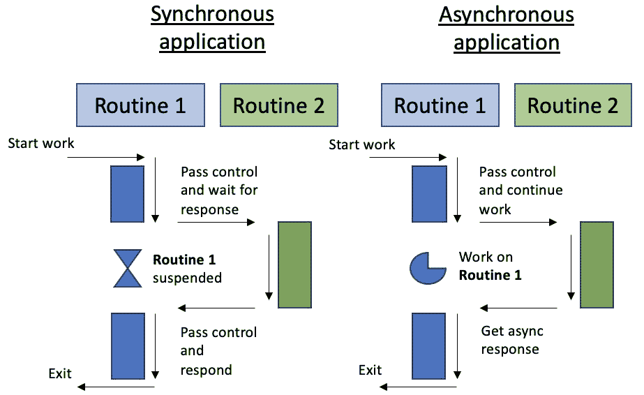
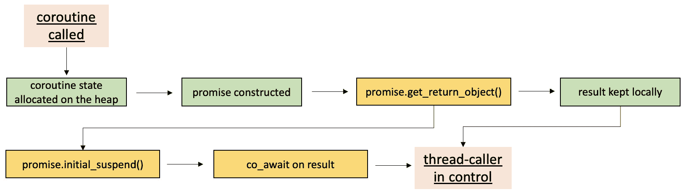
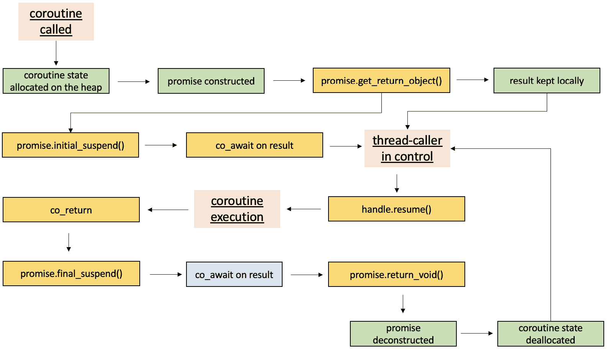
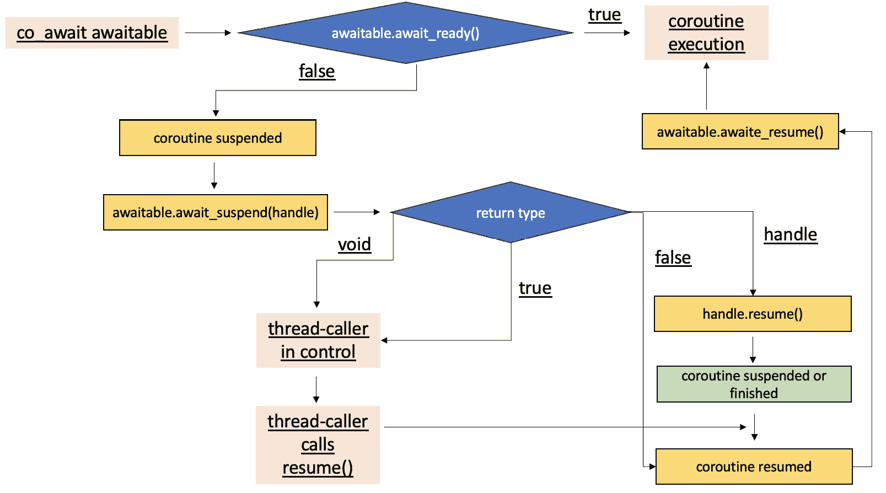

# 使用 C++进行系统编程的协程

我们几乎到了本书的结尾。最后一章致力于一个对于系统编程非常有用但相对较新的 C++标准特性。**协程**对象迅速找到了它们的应用，成为了一等状态机对象。它们的强大之处在于隐藏在**协程帧**背后的逻辑。请注意，这是一个高级主题，C++的协程接口既不简单也不舒适使用。它经过深思熟虑，但与其他编程语言相比，绝对不是最用户友好的。

在本章中，您将学习使用此功能的基本知识。如果您是初学者，那么您将花费一些时间来理解其要求。如果您在其他编程语言中有协程的先前经验，那么您将更容易使用协程。尽管如此，我们仍将利用本章来探讨其在系统编程中的应用。

我们将展示与**网络**和**共享内存**相关的先前示例的两个实际解决方案。您将立即看到例程的可预测性和清晰的执行路径。我们希望您对无需使用同步原语而执行的并发方式印象深刻。在现实世界环境中的直接重用是可能的；只需确保您有所需的编译器，因为这个特性仍然很新。不再拖延，让我们进入我们的最后一个主题。

在本章中，我们将涵盖以下主要主题：

+   介绍协程

+   C++中的网络编程和协程

+   通过 C++中的协程重新审视共享内存问题

+   对协程及其在 C++中的实现的最终思考

# 技术要求

为了运行代码示例，您必须准备以下内容：

+   能够编译和执行 C++20 的基于 Linux 的系统（例如，**Linux** **Mint 21**）

+   GCC12.2 编译器 – [`gcc.gnu.org/git/gcc.git gcc-source`](https://gcc.gnu.org/git/gcc.gitgcc-source):

    +   使用 `-fcoroutines`，`-std=c++2a`，`-lpthread` 和 `-``lrt` 标志

+   对于一些示例，您还可以使用[`godbolt.org/`](https://godbolt.org/)。

+   本章中所有代码示例均可从[`github.com/PacktPublishing/C-Programming-for-Linux-Systems/tree/main/Chapter%2010`](https://github.com/PacktPublishing/C-Programming-for-Linux-Systems/tree/main/Chapter%2010)下载

# 介绍协程

在你的旅程结束时，我们想提醒你关于你在*第一章*和*第二章*中学到的关于**进程**和**线程**的知识。如果你记得很好，进程只是一个程序的运行实例。它有自己的地址空间，这个地址空间不与其他共享，除非通过共享内存。线程存在于进程内，并且它们不能独立于进程存在，尽管在 Linux 中，进程和线程都被视为**任务**。它们以相同的方式进行调度，并且在内核级别上有相同的控制结构。然而，线程被认为是轻量级的，因为程序初始加载的大开销由父进程承担。

但这并不是全部。还有**纤程**和协程。如果进程和线程真正是**并发**的，并且并行地在共享资源上工作，纤程就像线程一样，但不是**并发**兼容的。虽然线程通常依赖于任务调度器的**抢占式**时间切片，但纤程使用**协作式多任务处理**。也就是说，在执行时，它们会自己让出运行权给另一个纤程。它们也被称为**堆栈式协程**。同时，C++中的协程被称为**无堆栈协程**，并且不是由操作系统管理的。换句话说，堆栈式协程可以在嵌套的堆栈帧中被挂起，而无堆栈协程只能通过顶层例程进行嵌套。

这两个设施被认为是隐式同步的，因此所有来自前几章的同步原语和**原子**构造都是不必要的。但你可以想象早期的例子，即从文件系统中读取——操作系统等待文件打开，并通知进程调用者继续其工作。想象一下，纤程和协程正是为了这种反应式访问而有用，这种访问不需要额外的 CPU 处理。实际上，网络和文件系统是纤程和协程被认为最有价值的领域。当一个请求被提出时，纤程将控制权交给主线程，而当 I/O 操作完成时，纤程继续其暂停的地方。

协程技术相当古老。C++最近引入了它，这对于网络编程、I/O 操作、事件管理等非常有用。协程也被认为是具有暂停能力的执行。然而，它们以协作的方式提供多任务处理，并不并行工作。这意味着任务不能同时执行。同时，它们对实时系统友好，允许快速在协程之间切换上下文，并且不需要系统调用。实际上，它们对**实时操作系统**非常友好，因为执行顺序和调度是由系统程序员控制的，正如你将在本章后面看到的那样。C++中的协程对于实现任务图和状态机也非常有用。

你们中的一些人可能想知道协程和标准单线程函数式编程之间的区别是什么。好吧，后者被认为是一种同步方法，而前者是一种具有同步可读性的异步方法。但协程实际上是为了减少不必要的（忙碌的）等待，并在准备所需资源或调用时做些有用的事情。下面的图示简单但提醒我们同步和异步执行之间的相应差异。



图 10.1 – 同步与异步应用程序执行对比

一个常规的单线程执行在某些方面也是有限的。首先，在程序内部调用、挂起或恢复一个函数是不可追踪的，或者至少不是通过引用来追踪。换句话说，控制流在后台发生，是隐式的。此外，控制流有一个严格的方向——一个函数要么返回给调用者，要么向内调用另一个函数。每次函数调用都会在栈上创建一个新的记录，并且立即发生，一旦调用，方法就不能延迟。一旦该函数返回，其栈的部分就会被清除，无法恢复。换句话说，激活是不可追踪的。

另一方面，协程有自己的生命周期。协程是一个对象，可以显式引用。如果协程应该比调用者存活得更久，或者应该转移到另一个协程，那么它可以存储在`int func(int arg)`原型中，这意味着一个名为`func`的函数，接收一个整型类型的参数`arg`，返回一个整型。类似的协程可能永远不会返回给调用者，而调用者期望的值可能由另一个协程产生。让我们看看在 C++中这是如何发生的。

## C++中的协程功能

最初，你可以把它们想象成`Task exCoroutine()`任务（任务与 Linux 中对任务的定义不同）——如果它使用以下三个操作符之一：`co_await`、`co_yield`或`co_return`，它就被解释为协程。以下是一个例子：

```cpp
#include <coroutine>
...
Task exCoroutine() {
    co_return;
}
int main() { Task async_task = exCoroutine(); }
```

包装类型目前是`Task`。它在调用者级别上是已知的。协程对象通过`co_return`运算符被标识为`exCoroutine()`函数。创建`Task`类是系统程序员的职责。它不是标准库的一部分。那么`Task`类是什么呢？

```cpp
struct Task {
    struct promise_type {
        Task get_return_object()
            { return {}; }
        std::suspend_never initial_suspend()
            { return {}; }
        std::suspend_never final_suspend() noexcept
            { return {}; }
        void return_void() {}
        void unhandled_exception() {}
    };
};
```

重要提示

这是一个在几乎所有协程示例中都使用的非常通用的模式。您最初应该参考[`en.cppreference.com/w/cpp/language/coroutines`](https://en.cppreference.com/w/cpp/language/coroutines)。

我们称执行给定例程但不返回值的任务为协程。此外，协程与一个`promise`对象相关联——我们曾在*第六章*中讨论过这一点。`promise`对象在协程级别上进行操作。协程通过这个对象返回操作结果或抛出异常。这个功能也要求使用`promise`。它还包括传递的参数——按值复制，当前调用引用的表示；挂起点，以便协程可以相应地恢复；以及该点之外的作用域内的局部变量。那么，我们的代码做了什么？从用户的角度来看，它什么也没做，但在后台有很多事情发生。让我们观察以下图表：



图 10.2 – 协程启动的简单演示

记住，按值参数在协程的作用域内被复制或移动，而按引用参数保持为引用。这意味着程序员应该考虑它们在任务调用者中的生命周期，以避免出现悬垂指针。之后，构造`promise`并调用`get_return_object()`。当协程首次挂起时，结果将返回给任务调用者。

*图 10.2*演示了`promise`返回`suspend_always`并且我们懒加载启动协程的情况。`initial_suspend()`操作恢复，但没有继续的知道或上下文，协程将永远不会恢复并且会泄漏。为了处理这种情况，我们需要...一个`handle`对象。你可以把`handle`对象看作是一个视图。类似于`string_view`对象和`string`对象之间的关系，或者`vector`对象和具有`range view`对象的`range`对象之间的关系，`handle`对象用于提供对`*this`的间接访问。通过`handle`对象，我们可以调用`resume()`来继续协程的工作。它必须首先挂起，否则行为将是未定义的：



图 10.3 – 图形演示了协程的创建和恢复

调用`initial_suspend()`操作，并通过`co_await`处理结果。这是通过编译器在`suspend_never`可等待对象周围生成额外的代码来实现的——协程不是以懒加载的方式创建，而是立即启动。这两个都在 C++标准库中定义。

当前协程执行`co_return`关键字（在`exCoroutine()`中）。但这样，协程主体就退出了。如果我们想用它来产生不断的新或下一个生成的值，那么我们需要`co_yield`运算符。我们称这样的协程为`co_yield`运算符，即`co_await promise.yield_value(<some expression>)`。否则，如果它只是调用`co_await`，那么它就像之前提到的任务一样。现在，如果我们再次看看*图 10**.3*，使用`co_yield`运算符将箭头从*控制中的线程调用者*重定向到*协程执行*，从而为协程继续工作提供机会。换句话说，`co_return`关键字将导致执行完成，而`co_yield`关键字只是暂时挂起协程。

让我们退一步，看看`co_await`调用。它们的工作在以下图中展示：



图 10.4 – 表示在 co_await 调用后生成的调用的图形

现在，使用`Handle`类型的私有变量来调用真正的`resume()`函数。让我们检查一下代码：

```cpp
using namespace std;
struct Task {
    struct promise_type {
        using Handle = coroutine_handle<promise_type>;
        Task get_return_object() {
            return Task { Handle::from_promise(*this) };
        }
...
```

我们将使用`explicit`指定符。在 C++ 20 中，它允许你对构造函数调用更加严格。也就是说，它不能用于复制初始化或隐式转换。此外，我们保持我们的`handle`对象私有。现在，让我们看看这可能会派上什么用场（标记{1}和{2}，同时提供一个包装器给调用者——标记{1}和{3}）：

```cpp
    explicit Task (promise_type::Handle crtHdnl) :
                                 crtHandle(crtHdnl) {}
    void resume() { crtHandle.resume(); } // {1}
private:
        promise_type::Handle crtHandle;   // {2}
...
    auto async_task = exCoroutine();
    async_task.resume();  // {3}
```

让我们使用这种代码结构来构建一个完全功能性的示例。我们将重命名`Task`结构为`Generator`，并实现一个具有生成器功能的协程。完整的代码可以在以下位置找到：[`github.com/PacktPublishing/C-Programming-for-Linux-Systems/tree/main/Chapter%2010`](https://github.com/PacktPublishing/C-Programming-for-Linux-Systems/tree/main/Chapter%2010)。

我们将通过协程增加变量 N 的次数。这就是为什么它需要能够产生，所以我们向`Generator`添加以下内容：

```cpp
...
   suspend_always yield_value(auto value) {
            currValue = value;
            return {};
        }
...
        uint32_t currValue;
    };
```

然后，获取下一个元素的过程如下：

```cpp
    int next() {
        crtHndl.resume();
        return crtHndl.promise().currValue; } ...
```

在主线程中继续协程主体及其创建。增量将发生 100,000 次。这个例子允许程序员以懒加载的方式生成数据，而不使用大量 RAM。同时，没有使用单独的线程，因此执行保持在用户空间，没有进行大量的上下文切换：

```cpp
Generator exCoroutine() {
    auto idx = 0;
    for (;;) {
        co_yield idx++;
    }
}
int main() {
    auto crt = exCoroutine();
    for (auto idx = 1; (idx = crt.next()) <= 100000; )
        cout << idx << " ";
    cout << endl;
    return 0;
}
```

输出的简短版本如下：

```cpp
1 2 3 4 ... 100000
```

很遗憾，你可能已经理解了为什么在 C++ 中创建一个简单的协程应用程序并不那么简单。作为一个新特性，这个功能仍在不断改进，预计在即将到来的 C++ 版本中会有新的接口，这将简化协程的使用。但这不应该阻止你继续使用它们。这个例子可以很容易地扩展到其他功能，你可以逐步建立你的知识。在接下来的章节中，我们将做 exactly this，并将讨论带回系统编程领域。

# C++ 中的网络编程和协程

在 *第七章* 中，你学习了如何使用 `Generator` 定义来匹配 **协程** 的类型，正如之前讨论的那样。传统上，该对象被制成仅可移动的 – 这允许我们限制协程包装器的使用，但在一般情况下，协程对象是不可复制的且不可移动的，因为 **协程帧** 是它们的一部分，并且一些局部变量可以是其他局部变量的引用或指针。因此，让我们相应地扩展结构：

重要提示

这，再次，是一个非常通用的模式，几乎在每一个协程示例中都使用。你应该最初参考[`en.cppreference.com/w/cpp/language/coroutines`](https://en.cppreference.com/w/cpp/language/coroutines)。

```cpp
template<typename T> struct Generator {
    Generator(const Generator&)              = delete;
    Generator& operator = (const Generator&) = delete;
    Generator(Generator&& other) noexcept :
        c_routine(other.c_routine) {
        other.c_routine = {};
    }
```

你会注意到，`struct` 对象被定义为 `template` 以使其通用。我们重载 `()` 操作符，以便能够适当地将控制权交还给调用者：

```cpp
    Generator& operator = (Generator&& other) noexcept {
        if (this == &other)
            return *this;
        if (c_routine)
            c_routine.destroy();
        c_routine = other.c_routine;
        other.c_routine = {};
        return *this;
    }
    optional<T> operator()() {
        c_routine.resume();
        if (c_routine.done()) {
            return nullopt;
        }
        return c_routine.promise().currValue;
    }
```

我们还在异常期间添加了行为 – 应用程序将被终止：

```cpp
        void unhandled_exception() {
            exit(EXIT_FAILURE);
   }
```

在主线程中，我们创建并连接两个线程 – 一个服务器和一个客户端。每个线程都将执行相应域的协程。我们提供了一个 `socket`（以下代码中的标记 {9}）：

```cpp
   auto sockfd = 0;
    if ((sockfd = socket(AF_INET, SOCK_DGRAM, 0)) < 0) {
        const auto ecode{ make_error_code(errc{errno}) };
        cerr << "Error opening shm region";
        system_error exception{ ecode };
        throw exception;
    }
    auto server = jthread([&sockfd] {
        struct sockaddr_in servaddr = { 0 };
        servaddr.sin_family = AF_INET;
        servaddr.sin_addr.s_addr = INADDR_ANY;
        servaddr.sin_port = htons(PORT);
        if (bind(sockfd,
            (const struct sockaddr*)&servaddr,
            sizeof(struct sockaddr_in)) < 0) {
            perror("Bind failed");
            exit(EXIT_FAILURE);
        }
        cout << "\nsend_to():\n";
        string_view message{ "This is a test!" };
        auto sender = send_to(sockfd, message,
           servaddr);
                                                   // {9}
```

在 `sendto()` 方法内部。我们使用 `string_view` 对象，就像我们在 *第三章* 中做的那样 – 主要原因是代码的安全性以及数据及其大小的紧凑性。在循环结束时，我们使用 `co_yield value`，从而向主线程提供发送的字节数。无限循环允许协程在真正被外部逻辑取消之前运行 – 在这种情况下，它被调用 10 次，因为主线程中的 `for` 循环（以下代码中的标记 {10}）：

```cpp
    for (int i = 1; i <= 10; i++) {
            auto sentData = sender();
            cout << i << " Bytes sent: "
                 << *sentData << endl;     // {10}
        }
    });
```

客户端线程以类似的方式实现：

```cpp
    auto client = jthread([&sockfd] {
        cout << "\nrecv_from():\n" << endl;
        struct sockaddr_in clntaddr = { 0 };
        auto receiver = recv_from(sockfd, clntaddr);
        for (auto i = 1; i <= 10; i++) {
            auto recvData = receiver();
            cout << i << " Message received: "
                 << *recvData << endl;   // {11}
        }
    });
    server.join(); client.join();
    close(sockfd); return 0;
}
```

服务器端协程具有以下主体：

```cpp
Generator<size_t> send_to(int sockfd,
                          string_view buffer,
                          auto servaddr) noexcept {
    for (;;) {
        auto value = sendto(sockfd,
                            buffer.data(),
                            buffer.size(),
                            MSG_DONTWAIT,
                            (const struct sockaddr*)
                                &servaddr,
                            sizeof(servaddr));
        co_yield value;
    }
}
```

客户端协程以类似的方式实现：

```cpp
Generator<string> recv_from(int sockfd,
                                 auto clntaddr,
                                 size_t buf_size =
                                       BUF_SIZE) noexcept {
    socklen_t len = sizeof(struct sockaddr_in);
    array<char, BUF_SIZE> tmp_buf = {};
```

协程函数调用 `recvfrom()` 系统调用。在结束时，不是存储接收到的字节，而是将来自套接字的消息存储在 `currValue` 成员变量中。然后，在主线程中打印出来。我们还使用了 `MSG_DONTWAIT` 标志。由于代码是异步的，每次相应的输出将以不同的方式打印出来。最后一部分符合预期：

```cpp
    for (;;) {
         recvfrom(sockfd,
                  tmp_buf.data(),
                  tmp_buf.size(),
                  MSG_DONTWAIT,
                  (struct sockaddr*)&clntaddr,
                  &len);
         co_yield tmp_buf.data();
    }
```

文本的合并或错位是预期之中的，但这证明了协程的可使用性。输出的简短版本如下：

```cpp
send_to():
1 Bytes sent: 15
...
10 Bytes sent: 15
recv_from():
1 Message received: This is a test!
...
10 Message received: This is a test!
```

完整示例可以在 https://github.com/PacktPublishing/C-Programming-for-Linux-Systems/tree/main/Chapter%2010 找到。

在上一章中，我们也遇到了同步并行线程的问题，但代码并不总是真正并行。例如，等待“资源可访问”这样的事件是并发的问题，而不是并行执行。话虽如此，协程在共享内存问题中也是一个强大的工具——让我们在下一节中看看它。

# 通过 C++ 协程重新审视共享内存问题

我们与 **条件变量** 有关的一个问题是进程启动时的同步。换句话说，对于生产者-消费者示例，我们不知道哪些线程将首先启动。我们通过条件变量——它的 **互斥锁** 以及一个谓词来同步代码，以处理事件的正确顺序。否则，我们可能会丢失信息或陷入 **死锁**。在这本书的大部分示例准备过程中，我们遇到了这种情况，这使得写作体验更加丰富。但协程提供了另一种方法，有时可能更高效且更易于使用（在你习惯了协程的接口之后，因为它并不容易掌握）。

下一示例是由 **awaitable-awaiter** 模式激发的。它与条件变量类似，但它不使用这样的同步原语。然而，通知信号依赖于一个原子变量。我们将回到 Task 协程。它将用于处理接收端。完整示例在此：[`github.com/PacktPublishing/C-Programming-for-Linux-Systems/tree/main/Chapter%2010`](https://github.com/PacktPublishing/C-Programming-for-Linux-Systems/tree/main/Chapter%2010)。

重要提示

该示例受到了 [`www.modernescpp.com/index.php/c-20-thread-synchronization-with-coroutines/`](https://www.modernescpp.com/index.php/c-20-thread-synchronization-with-coroutines/) 的启发。

我们重用了来自 *第九章* 的 **共享内存** 示例中的代码：

```cpp
template<typename T, typename N>
Task receiver(Event& event, int fd, N size) {
    co_await event;
    ftruncate(fd, size);
```

我们首先对共享内存进行对齐并设置其大小，然后继续将指针映射到它上面：

```cpp
    if (const auto ptr = mmap(0, size,
                           PROT_RW, MAP_SHARED,
                           fd, 0); ptr != MAP_FAILED) {
        auto* obj = static_cast<T*>(ptr);
        auto del = mmap_deallocator<T>(size);
        auto res =
            unique_ptr<T, mmap_deallocator<T>>(obj, del);
        if (res != nullptr)
            cout << "Receiver: " << *res << endl;
    }
    else {
        cerr << "Error mapping shm region";
    } }
```

确保对 `res` 的地址可访问以在协程内部进行解引用非常重要。否则，代码将因 `Segmentation fault` 而崩溃，这比悬挂指针更可取。另一个需要注意的是，不同的编译器（或环境）将为这段代码提供不同的行为。在我们到达 `Event` 结构体之前，让我们看看发送者做了什么——再次，我们回到了之前的代码：

```cpp
template<typename T, typename N>
void Event::notify(T buffer, int fd, N size) noexcept {
    notified = false;
    auto* waiter =
        static_cast<Awaiter*>(suspended.load());
    if (waiter != nullptr) {
        ftruncate(fd, size);
```

再次，我们确保共享内存的大小正确，并将指针映射到它上面：

```cpp
        if (const auto ptr = mmap(0, size,
                                  PROT_RW, MAP_SHARED,
                                  fd, 0);
                              ptr != MAP_FAILED) {
            auto* obj = new (ptr) T(buffer);
            auto del = mmap_deallocator<T>(size);
            auto res =
                unique_ptr<T, mmap_deallocator<T>>
                                                (obj, del);
        }
        else {
            cerr << "Error mapping shm region";
        }
        waiter->coroutineHandle.resume();
    }
}
```

初始时，通知标志被设置为`false`，这意味着协程将不会像常规函数那样执行，而是将被挂起。然后，加载`waiter`对象，它是`nullptr`，因为它之前没有被设置。相应的`resume()`操作没有被调用。随后执行的`await_suspend()`函数将`waiter`的状态存储在`suspended`成员变量中。稍后，`notify()`被触发并完全执行：

```cpp
bool
Event::Awaiter::await_suspend(coroutine_handle<> handle)
  noexcept {
    coroutineHandle = handle;
    if (event.notified) return false;
    event.suspended.store(this);
    return true;
}
```

在主线程中，需要一个`Event`对象来同步工作流程。同时定义了一个共享内存区域。如果在每个协程中调用`shm_open()`，它实际上不会是共享虚拟内存，因为文件描述符将访问每个协程的私有区域。因此，我们最终会遇到`Segmentation fault`。有两个线程，分别代表发送者和接收者端。上述协程分别在线程合并后分别被调用：

```cpp
    Event event{};
    int fd = shm_open(SHM_ID, O_CREAT | O_RDWR, 0644);
    auto senderT = jthread([&event, &fd]{
         event.notify<const char*, size_t>(message.data(),
                                           fd,
                                           message.size());
    });
```

接收者的代码类似，但将`event`对象作为参数传递：

```cpp
    auto receiverT = jthread([&event, &fd]{
         receiver<char*, size_t>(ref(event),
                                 fd, (message.size())); });
```

输出如下：

```cpp
This is a testing message!
```

此示例为您提供了以并发方式管理共享资源的灵活性。awaiter-awaitable 的通知机制将完成工作，无需同步原语。我们鼓励您亲自尝试。同时，我们将继续讨论系统编程中协程的使用的一些最终注意事项。

# 关于协程及其在 C++中的实现的最终思考

之前的例子虽然实用，但并不简单。它们有助于理解协程执行可能遵循的顺序。可视化协程的状态图是很有帮助的，尽管我们仍然认为对于经验不足的开发者来说可能会有些混乱。

如前所述，**图 10.2**、**图 10.3**和**图 10.4**基本上涵盖了通过代码示例我们已经解释的内容。了解围绕协程及其成员生成的额外逻辑量是有用的。大部分逻辑都是在后台发生的，系统程序员只需安排调度。在本章的示例中，我们通过`promise`对象和可等待对象来实现这一点。上述图示部分表示协程的执行作为一个有限状态机，这应该会提示你，这也是协程有用处的另一个应用场景。它们将状态机转换为一等对象。一旦协程框架被定义，大部分逻辑都保留在那里，并且对调用者隐藏。这为系统程序员提供了暂时放下并发逻辑的机会，只通过简短的代码片段调用协程，就像我们这样做。系统行为代码和任务调度将更简单、更明显。因此，管理算法、解析器、数据结构遍历、轮询等许多功能的大部分能力都可以通过这种技术来解释。不幸的是，我们无法在此涵盖所有内容，但我们相信检查这些内容是值得的。

最后但同样重要的是，我们想强调协程对这个语言来说相对较新。由于 C++中的协程接口仍然缺乏舒适性和简单性，你可以在互联网上找到许多定制的协程库。我们建议您只依赖可信赖的库，或者等待这个设施的下一次标准特性。应用这些特性比重新实现它们更有意义。正如你所看到的，这是一个相当复杂的概念，并且在这方面有很多研究正在进行。对于好奇的读者，我们鼓励您花些时间了解 C++中协程的演变，尤其是在最近几年。C++标准中讨论了三种技术——协程 TS、核心协程和可恢复表达式。尽管目前标准中只使用其中一种，但三者都值得注意。Geoffrey Romer、Gor Nishanov、Lewis Baker 和 Mihail Mihailov 在这里进行了很好的总结和分析：[`www.open-std.org/jtc1/sc22/wg21/docs/papers/2019/p1493r0.pdf`](https://www.open-std.org/jtc1/sc22/wg21/docs/papers/2019/p1493r0.pdf)。

随意查看。本章中我们提供的许多澄清都在文档中以优秀的视觉对比形式呈现，对比了常规函数和协程。同时，我们继续完成剩余部分。

# 摘要

通过这种方式，我们已经涵盖了这本书的所有主题。随着 C++23 即将到来的改进，协程及其发展将得到越来越多的分析，尤其是在系统编程领域——当然，也会在那里应用。虽然一开始可能难以理解，但协程允许您继续磨练 C++的使用，并为您提供另一个增强代码的工具。

在本章中，您学习了如何在并发应用程序中应用它们，但它们的作用远不止于此。我们对接下来会发生什么感到兴奋。我们预计，编译器将完全覆盖我们在这本书中——故意地——没有涵盖的`modules`语言特性，并将其广泛应用。另一个有趣的功能是`std::generator`——C++23 中用于同步创建协程的视图。`std::stacktrace`可以从抛出的异常中获取，这将帮助您进行代码调试。为了便于打印，您还将能够使用`std::print`。`std::expected`的单调接口将允许您存储两个值中的任意一个。除此之外，文件将通过`#embed`在编译时作为数组加载。

我们想借此机会向您——读者——表达我们的感激之情！我们希望您觉得这本书有用，并将其中的部分内容应用到您的日常工作中。我们也希望您享受阅读这本书的过程，就像我们享受写作这本书一样。对我们来说，这是一次巨大的旅程，我们很高兴能与您分享未来的旅程。在此，我们祝愿您在所有项目中好运连连！
