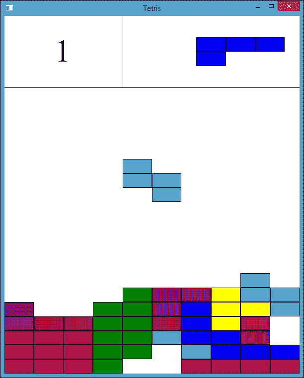
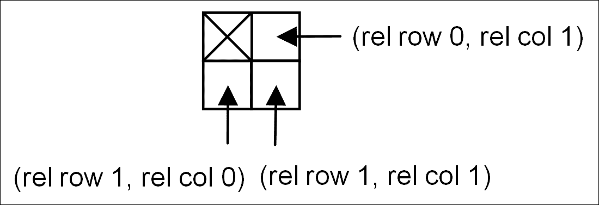
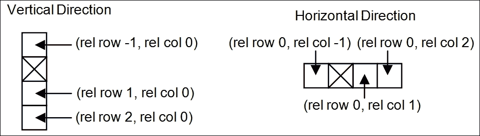
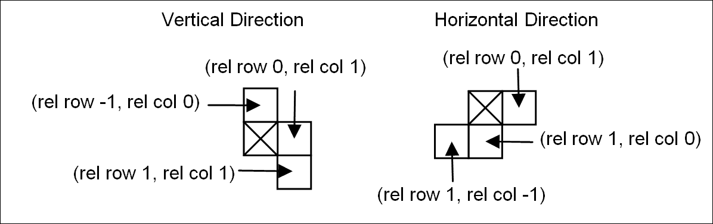
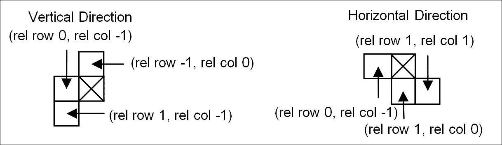
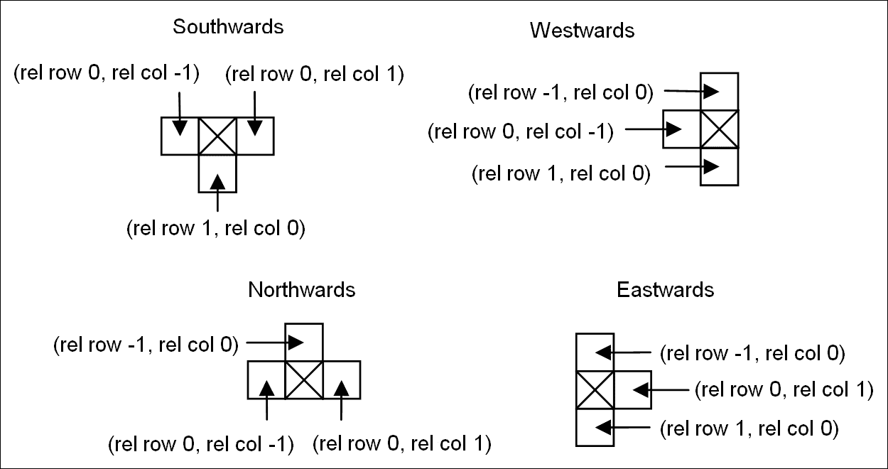
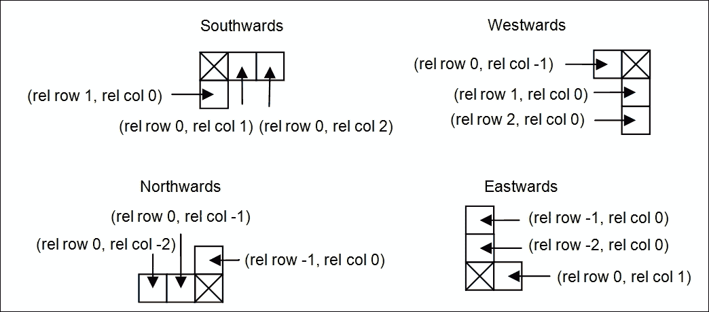
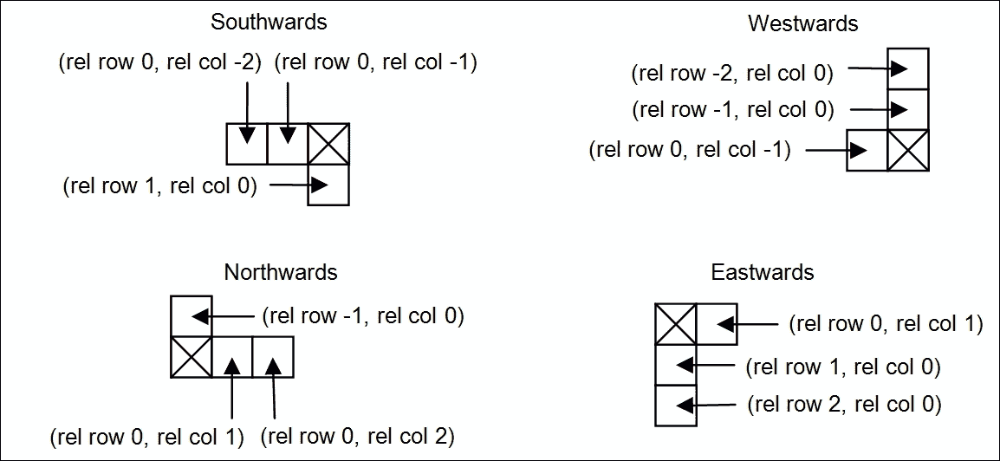

# 第三章. 构建俄罗斯方块应用程序

在本章中，我们开发了一个经典的俄罗斯方块游戏。我们进一步探讨了`Window`类，包括文本写入和绘制更复杂的图形。我们还探讨了计时、随机数和图形更新，如下落图形和闪光效果。其示意图如下：



# MainWindow 函数

`MainWindow`函数与第二章中的*小小世界!*中的方法类似。它设置应用程序名称并返回主窗口的指针，在这种情况下，是一个`TetrisWindow`类的实例。正如第二章中所述，*小小世界!*应用程序名称在访问注册表、打开或保存文件以及**关于**菜单项时使用。然而，在这个应用程序中，没有使用任何这些功能：

**MainWindow.cpp**

```cpp
#include "..\\SmallWindows\\SmallWindows.h" 
#include "GameGrid.h" 
#include "TetrisFigure.h" 
#include "RedFigure.h" 
#include "BrownFigure.h" 
#include "TurquoiseFigure.h" 
#include "GreenFigure.h" 
#include "YellowFigure.h" 
#include "BlueFigure.h" 
#include "PurpleFigure.h" 
#include "TetrisWindow.h" 

void MainWindow(vector<String> /* argumentList */, 
                WindowShow windowShow) { 
  Application::ApplicationName() = TEXT("Tetris"); 
  Application::MainWindowPtr() = new TetrisWindow(windowShow); 
} 

```

# 俄罗斯方块窗口

在这个应用程序中，我们不使用第二章中的`StandardDocument`框架，即*小小世界！*。相反，`TetrisWindow`类直接扩展了 Small Windows 根类`Window`。原因很简单，我们不需要`StandardDocument`框架或其基类`Document`的功能。我们不使用菜单或快捷键，也不保存或加载文件：

**TetrisWindow.h**

```cpp
class TetrisWindow : public Window { 
  public: 
    TetrisWindow(WindowShow windowShow); 
    ~TetrisWindow(); 

```

在这个应用程序中，我们忽略了鼠标。相反，我们关注键盘处理。当用户按下或释放一个键时，会调用`OnKeyDown`方法：

```cpp
    bool OnKeyDown(WORD key, bool shiftPressed, 
                   bool controlPressed); 

```

与圆形应用程序类似，每当窗口的客户区域需要重绘时，都会调用`OnDraw`方法：

```cpp
    void OnDraw(Graphics& graphics, DrawMode drawMode) const; 

```

当窗口获得或失去输入焦点时，会分别调用`OnGainFocus`和`OnLoseFocus`方法。当窗口失去输入焦点时，它将不会接收任何键盘输入，计时器将被关闭，防止下落图形移动：

```cpp
    void OnGainFocus(); 
    void OnLoseFocus(); 

```

`OnTimer`方法在窗口具有焦点时每秒被调用一次。它尝试将下落图形向下移动一步。如果无法将图形向下移动，它会调用`NewFigure`方法。`NewFigure`方法尝试在游戏板上引入一个新的图形。如果失败，则调用`GameOver`方法，询问用户是否想要新游戏。如果用户想要新游戏，则调用`NewGame`方法。如果用户不想要新游戏，则退出应用程序：

```cpp
    void OnTimer(int timerId); 
    void EndOfFigure(); 
    void GameOver(); 
    void NewGame(); 

```

`DeleteFullRows`通过调用`IsRowFull`方法检查每一行，并对每一行满的行调用`FlashRow`和`DeleteRow`方法：

```cpp
    void DeleteFullRows(); 
    bool IsRowFull(int row); 
    void FlashRow(int row); 
    void DeleteRow(int markedRow); 

```

如果用户通过点击窗口右上角的叉号尝试关闭窗口，则会调用`TryClose`方法。它显示一个消息框，询问用户是否真的想要退出：

```cpp
    bool TryClose(); 

```

`gameGrid`字段持有显示图形的网格（见下一节）。下落的图形（`fallingFigure`）正在网格上下降，下一个将要下降的图形（`nextFigure`）显示在右上角。每次玩家填满一行，分数（`currScore`）就会增加。计时器标识符（`TimerId`）用于跟踪计时器，并赋予任意值`1000`。最后，图形列表（`figureList`）将被填充七个图形，每种颜色一个。每次需要新的图形时，将从列表中随机选择一个图形并复制：

```cpp
  private: 
    GameGrid gameGrid; 
    TetrisFigure fallingFigure, nextFigure; 

    int currScore = 0; 
    bool timerActive = true, inverse = false; 

    static const int TimerId = 1000; 
    vector<TetrisFigure> figureList; 
}; 

```

在`Window`构造函数调用中的`PreviewCoordinate`参数表示窗口的大小是固定的，第二个参数表示大小为 100 * 100 个单位。这意味着与圆应用不同，图形和游戏板的大小会随着用户改变窗口大小而改变：

**TetrisWindow.cpp**

```cpp
#include "..\\SmallWindows\\SmallWindows.h" 
#include "GameGrid.h" 
#include "TetrisFigure.h" 
#include "RedFigure.h" 
#include "BrownFigure.h" 
#include "TurquoiseFigure.h" 
#include "GreenFigure.h" 
#include "YellowFigure.h" 
#include "BlueFigure.h" 
#include "PurpleFigure.h" 
#include "TetrisWindow.h" 

TetrisWindow::TetrisWindow(WindowShow windowShow) 
 :Window(PreviewCoordinate, Rect(0, 0, 100, 100), 
         nullptr, OverlappedWindow, NoStyle, Normal), 

```

客户端区域的顶部 20%被保留用于分数和下一个图形。游戏网格覆盖客户端区域的底部 80%（从高度单位 20 到 100）：

```cpp
  gameGrid(Rect(0, 20, 100, 100)) { 

```

由于我们扩展了`Window`类，我们需要手动设置窗口标题：

```cpp
  SetHeader(TEXT("Tetris")); 

```

计时器间隔设置为`1000`毫秒，这意味着`OnTimer`每秒会被调用一次。随机生成器通过调用 C 标准函数`srand`和`time`进行初始化：

```cpp
  SetTimer(TimerId, 1000); 
  srand((unsigned int) time(nullptr)); 

```

图形列表初始化时包含每种颜色的一个图形；下落和下一个图形从这个列表中随机选择。每次我们需要一个新的图形时，列表中的一个图形将被复制：

```cpp
  figureList.push_back(RedFigure(this, &gameGrid)); 
  figureList.push_back(BrownFigure(this, &gameGrid)); 
  figureList.push_back(TurquoiseFigure(this, &gameGrid)); 
  figureList.push_back(GreenFigure(this, &gameGrid)); 
  figureList.push_back(YellowFigure(this, &gameGrid)); 
  figureList.push_back(BlueFigure(this, &gameGrid)); 
  figureList.push_back(PurpleFigure(this, &gameGrid)); 

  fallingFigure = figureList[rand() % figureList.size()]; 
  nextFigure = figureList[rand() % figureList.size()]; 
} 

```

严格来说，在关闭俄罗斯方块窗口时，没有必要丢弃计时器。析构函数仅为了完整性而包含：

```cpp
TetrisWindow::~TetrisWindow() { 
  DropTimer(TimerId); 
} 

```

## 键盘输入

`OnKeyDown`方法覆盖了`Window`类中的方法，并在用户按下每个键时被调用。我们尝试根据按下的键移动下落的图形。我们不在乎用户是否按下了*Shift*或*Ctrl*键：

```cpp
bool TetrisWindow::OnKeyDown(WORD key, bool /* shiftPressed */, 
                             bool /* controlPressed */) { 
  switch (key) { 
    case KeyLeft: 
      fallingFigure.TryMoveLeft(); 
      break; 

    case KeyRight: 
      fallingFigure.TryMoveRight(); 
      break; 

    case KeyUp: 
      fallingFigure.TryRotateAnticlockwise(); 
      break; 

    case KeyDown: 
      fallingFigure.TryRotateAnticlockwise(); 
      break; 

```

当用户按下空格键时，下落的图形以可见的速度下落，以产生下落的错觉。我们尝试通过调用 Win32 API 函数`Sleep`，每 10 毫秒将下落的图形下移一步：

```cpp
    case KeySpace: 
      while (fallingFigure.TryMoveDown()) { 
        ::Sleep(10); 
      } 
      break; 
  } 

  return true; 
} 

```

## 绘图

`OnDraw`方法首先绘制游戏网格和两条将客户端区域分为三部分的线。左上角显示当前分数，右上角显示下一个图形，而下半部分显示实际的游戏网格：

```cpp
void TetrisWindow::OnDraw(Graphics& graphics, 
                          DrawMode /* drawMode */) const { 
  gameGrid.DrawGameGrid(graphics, inverse); 
  graphics.FillRectangle(Rect(Point(0, 0), Point(100,20)), 
                         White, White); 
  graphics.DrawLine(Point(40, 0), Point(40, 20), Black); 
  graphics.DrawLine(Point(0, 20), Point(100, 20), Black); 

```

注意，我们在绘制下一个图形时添加了一个偏移量，以便从游戏网格移动到右上角。值`25`将图形从网格中间移动到其右半部分的中间，而值`-18`则从网格向上移动到网格前的区域：

```cpp
  fallingFigure.DrawFigure(graphics); 
  nextFigure.DrawFigure(graphics, Size(25, -18)); 

```

分数字体设置为`Times New Roman`，大小`10`。在这里，大小不是指排版点数，而是指逻辑单位。由于调用`Window`构造函数时声明我们提供了`PreviewCoordinate`坐标系和大小 100 * 100，文本的高度将是 10 个单位，这是文本客户端区域高度的十分之一。它也是客户端区域中记分部分高度的一半：

```cpp
  Font scoreFont(TEXT("Times New Roman"), 10); 

```

调用`DrawText`方法时的最终`false`参数表示文本的大小不会重新计算。在接下来的章节中，我们将显示保持相同大小的文本，无论窗口大小和屏幕分辨率如何。然而，在本章中，当用户更改窗口大小时，文本的大小将会改变：

```cpp
  graphics.DrawText(Rect(0, 0, 40, 20), to_String(currScore), 
                    scoreFont, Black, White, false); 
} 

```

## 输入焦点

`OnGainFocus`和`OnLoseFocus`方法分别开始和停止计时器，这样当窗口失去焦点时，下落图形不会下落：

```cpp
void TetrisWindow::OnGainFocus() { 
  SetTimer(TimerId, 1000); 
} 

void TetrisWindow::OnLoseFocus() { 
  DropTimer(TimerId); 
} 

```

## 计时器

当计时器具有输入焦点时，计时器处于活动状态。当活动时，每次调用`OnTimer`方法（每秒一次）时都会调用`TryMoveDown`方法。当图形无法再下落（`TryMoveDown`方法返回`false`）时，将调用`EndOfFigure`方法：

```cpp
void TetrisWindow::OnTimer(int /* timerId */) { 
  if (timerActive) { 
    if (!fallingFigure.TryMoveDown()) { 
      EndOfFigure(); 
    } 
  } 
} 

```

## 新图形

当下落图形无法向下移动时，`OnTimer`方法调用`NewFigure`方法。首先，我们需要通过调用`AddToGrid`方法将下落图形存储到游戏网格中。然后，我们将下一个图形变为新的下落图形，并从图形列表中随机选择新的下一个图形。我们使新的下落图形区域和绘制下一个图形的右上角区域无效：

```cpp
void TetrisWindow::NewFigure() { 
  fallingFigure.AddToGrid(); 
  fallingFigure = nextFigure; 
  fallingFigure.InvalidateFigure(); 

  nextFigure = figureList[rand() % figureList.size()]; 
  Rect nextArea(40, 0, 100, 20); 
  Invalidate(nextArea); 
  UpdateWindow(); 

```

我们删除可能的完整行并更新窗口：

```cpp
  DeleteFullRows(); 
  UpdateWindow(); 

```

如果新的下落图形从一开始就不有效，则游戏结束并调用`GameOver`：

```cpp
  if (!fallingFigure.IsFigureValid()) { 
    GameOver(); 
  } 
} 

```

## 游戏结束

`GameOver`方法显示分数并让用户决定他们是否想要新游戏。如果他们想要新游戏，它将通过`NewGame`调用进行初始化。如果用户不想玩新游戏，调用 Win32 API 函数`PostQuitMessage`将终止应用程序的执行。

注意，我们调用另一个版本的`Invalidate`方法，没有参数。它使整个客户端区域无效：

```cpp
void TetrisWindow::GameOver() { 
  Invalidate(); 
  UpdateWindow(); 

```

当显示消息时，计时器处于非活动状态：

```cpp
  timerActive = false; 
  String message = TEXT("Game Over.\nYou scored ") + 
                   to_String(currScore) + 
                   TEXT(" points.\nAnother game?"); 

  if (MessageBox(message, TEXT("Tetris"), YesNo, Question)==Yes) { 
    NewGame(); 
  } 
  else { 
    ::PostQuitMessage(0); 
  } 
} 

```

## 新游戏

`NewGame`方法初始化随机选择的新下落和下一个图形，重置分数，并在激活计时器之前清除游戏网格，以及使窗口无效并更新，这使得新的下落图形开始下落，新的游戏开始：

```cpp
void TetrisWindow::NewGame() { 
  fallingFigure = figureList[rand() % figureList.size()]; 
  nextFigure = figureList[rand() % figureList.size()]; 

  currScore = 0; 
  gameGrid.ClearGameGrid(); 
  timerActive = true; 
  Invalidate(); 
  UpdateWindow(); 
} 

```

## 删除和闪烁行

在删除完整行时，我们遍历行，闪烁并删除每一行。我们增加分数并更新行区域。请注意，行从网格的顶部开始。这意味着我们必须从最高行到最低行进行循环，以便按正确顺序删除行。

注意，如果行被闪烁并删除，我们不会更新`row`变量，因为被删除的行将被上面的行替换，这也需要被检查：

```cpp
void TetrisWindow::DeleteFullRows() { 
  int row = Rows - 1;  
  while (row >= 0) { 
    if (IsRowFull(row)) { 
      FlashRow(row); 
      DeleteRow(row); 

      ++currScore; 
      Rect scoreArea(0, 0, 40, 20); 
      Invalidate(scoreArea); 
      UpdateWindow(); 
    } 
    else { 
      --row; 
    } 
  } 
} 

```

如果一行不包含白色正方形，则认为该行是满的：

```cpp
bool TetrisWindow::IsRowFull(int row) { 
  for (int col = 0; col < Cols; ++col) { 
    if (gameGrid[row][col] == White) { 
      return false; 
    } 
  } 

  return true; 
}  

```

闪烁效果是通过三次以 50 毫秒的间隔重新绘制行，在正常和反转颜色（`inverse`方法被设置）下实现的。在这个过程中，特别重要的是我们只使所选行的区域无效。否则，整个窗口客户端区域都会闪烁：

```cpp
void TetrisWindow::FlashRow(int row) { 
  Rect gridArea = gameGrid.GridArea(); 
  int colWidth = gridArea.Width() / Cols, 
      rowHeight = gridArea.Height() / Rows; 

  Rect rowArea(0, row * rowHeight, Cols * colWidth, 
               (row + 1) * rowHeight); 

  for (int count = 0; count < 3; ++count) { 
    inverse = true; 
    Invalidate(rowArea + gridArea.Top()Left()); 
    UpdateWindow(); 
    ::Sleep(50); 

    inverse = false; 
    Invalidate(rowArea + gridArea.Top()Left()); 
    UpdateWindow(); 
    ::Sleep(50); 
  } 
} 

```

当删除一行时，我们实际上并没有删除它。相反，我们将被删除行上面的每一行向下移动一步，并用白色正方形填充顶部行。一个复杂的问题是，我们是从顶部开始计数行的。这使得屏幕上最低的行是具有最高索引的行。这给人一种我们从底部开始，直到达到顶部，移除每一行完整行的外观：

```cpp
void TetrisWindow::DeleteRow(int markedRow) { 
  for (int row = markedRow; row > 0; --row) { 
    for (int col = 0; col < Cols; ++col) { 
      gameGrid[row][col] = gameGrid[row - 1][col]; 
    } 
  } 

  for (int col = 0; col < Cols; ++col) { 
    gameGrid[0][col] = White; 
  } 

  Invalidate(gameGrid.GridArea()); 
  Invalidate(g); 
  UpdateWindow(); 
} 

```

## 关闭窗口

最后，当用户通过点击右上角的交叉点来关闭窗口时，我们需要确认他们确实想要退出。如果`TryClose`方法返回`true`，则窗口将被关闭：

```cpp
bool TetrisWindow::TryClose() { 
  timerActive = false; 

  if (MessageBox(TEXT("Quit?"), TEXT("Tetris"), 
                 YesNo, Question) == Yes) { 
    return true; 
  } 

  timerActive = true; 
  return false; 
} 

```

# TetrisFigure 类

在这个应用程序中，有一个根`figure`类和每个下落图形类型的一个子类。所有图形都可以在用户请求时向侧面移动或旋转。它们也由计时器向下移动。

有七个图形，每个颜色一个：红色、棕色、青色、绿色、黄色、蓝色和紫色。每个图形都有独特的形状。然而，它们都包含四个正方形。根据它们旋转的能力，它们可以进一步分为三组。红色图形是最简单的。它是一个正方形，根本不会旋转。棕色、青色和绿色图形可以在垂直和水平方向旋转，而黄色、蓝色和紫色图形可以在北、东、南、西方向旋转。对于红色图形来说，这并不重要，因为它根本不会旋转。

`TetrisFigure`类的`row`和`col`字段持有图形的中心，这在本节插图中的图形上用十字标记。`color`字段持有图形的颜色，`direction`持有图形的当前方向。

最后，`direction`数组持有围绕标记正方形的三个正方形的相对位置。最多有四个方向。每个方向持有三个正方形，它们是除了图形中心之外剩下的三个正方形。每个正方形持有两个整数：中心行的相对位置和列的相对位置。

默认构造函数用于初始化`TetrisWindow`类中的`fallingFigure`和`nextFigure`方法。第二个构造函数是受保护的，因为它只被它的子类调用。每个图形都有自己的`TetrisFigure`子类。它们的构造函数接受指向颜色网格的指针，并定义其颜色、起始位置和图形模式：

**TetrisFigure.h**

```cpp
class TetrisFigure { 
  public: 
    TetrisFigure(); 

  protected: 
    TetrisFigure(Window* windowPtr, GameGrid* colorGridPtr, 
           Color color, int row, int col, Direction direction, 
           IntPair* northList, IntPair* eastList, 
           IntPair* southList, IntPair* westList); 

  public: 
    TetrisFigure& operator=(const TetrisFigure& figure); 

```

`TryMoveLeft`、`TryMoveRight`、`TryRotateClockwise`、`TryRotateClockwise`、`TryRotateAnticlockwise` 和 `TryMoveDown` 方法都试图移动图形。它们调用 `IsFigureValid` 方法，该方法检查新位置是否有效，即它不在游戏网格外部或位于已被占用的位置。`IsFigureValid` 方法反过来又为它的四个方块调用 `IsSquareValid` 方法：

```cpp
    void TryMoveLeft(); 
    void TryMoveRight(); 
    void TryRotateClockwise(); 
    void TryRotateAnticlockwise(); 
    bool TryMoveDown(); 

```

`IsFigureValid` 方法有两种版本，其中第一个版本由 `TetrisWindow` 方法调用，另一个版本由前面的 `try` 方法调用，以测试下落图形的新位置是否有效：

```cpp
    bool IsFigureValid();
    static bool IsFigureValid(int direction, int row, int col,
                  GameGrid* gameGridPtr, IntPair* figureInfo[]);
    static bool IsSquareValid(int row, int col,
                              GameGrid* gameGridPtr);
```

`AddToGrid` 方法将图形的四个方块添加到游戏网格：

```cpp
    void AddToGrid();

```

`InvalidateFigure` 方法使图形占据的区域无效，`DrawFigure` 方法绘制图形：

```cpp
    void InvalidateFigure(Size offsetSize = ZeroSize); 
    void DrawFigure(Graphics& graphics, 
                    Size offsetSize = ZeroSize) const; 

```

`gameGridPtr` 字段是指向游戏网格的指针，我们在尝试移动图形时访问它，以决定其新位置是否有效。`color` 字段是图形的颜色（红色、棕色、青绿色、绿色、黄色、蓝色或紫色）。`row`、`col` 和 `direction` 字段持有图形的当前位置和方向。

`figureInfo` 字段持有图形的形状。图形可以持有最多四个方向：北、东、南、西。记住，`row` 和 `col` 持有图形的位置。更具体地说，它们持有构成图形的四个方块的中心方块的位置（以下插图中的十字标记）。其他三个方块由整数对定义，表示它们相对于中心方块的位置。

技术上，`figureInfo` 是一个包含四个指针的数组（每个方向一个），每个指针指向一个包含三个整数对的数组，持有三个方块相对于中心方块的位置：

```cpp
  protected: 
    Window* windowPtr; 
    GameGrid* gameGridPtr; 
    Color color; 
    int row, col; 
    Direction direction; 
    IntPair* figureInfo[4]; 
 }; 

```

默认构造函数是必要的，因为 `fallingFigure` 和 `nextFigure` 是 `TetrisWindow` 类的成员对象。然而，它们不需要初始化，因为它们的值被分配给 `figureList` 数组中的七个图形之一：

**TetrisFigure.cpp**

```cpp
#include "..\\SmallWindows\\SmallWindows.h" 
#include "GameGrid.h" 
#include "TetrisFigure.h" 
#include "TetrisWindow.h" 

TetrisFigure::TetrisFigure() { 
  // Empty 
} 

```

第二个构造函数由彩色图形子类构造函数调用，以初始化图形。它接受指向主窗口和游戏网格的指针、图形的颜色、其起始位置和方向，以及北、东、南、西方向的位置列表。每个列表都包含三个整数对，表示方块相对于中心方块的位置：

```cpp
TetrisFigure::TetrisFigure(Window*windowPtr, GameGrid*gameGridPtr, 
                           Color color, int row, int col, 
                           Direction direction, 
                           IntPair* northList, IntPair* eastList, 
                           IntPair* southList, IntPair* westList) 
 :windowPtr(windowPtr), 
  gameGridPtr(gameGridPtr), 
  color(color), 
  row(row), 
  col(col), 
  direction(direction) { 
  figureInfo[North] = northList; 
  figureInfo[East] = eastList; 
  figureInfo[South] = southList; 
  figureInfo[West] = westList; 
} 

```

赋值运算符是必要的，因为 `TetrisWindow` 类中的 `fallingFigure` 和 `nextFigure` 方法是从图形列表复制的：

```cpp
TetrisFigure& TetrisFigure::operator=(const TetrisFigure& figure) { 
  if (this != &figure) { 
    windowPtr = figure.windowPtr; 
    gameGridPtr = figure.gameGridPtr; 
    color = figure.color; 
    row = figure.row; 
    col = figure.col; 
    direction = figure.direction; 
    figureInfo[North] = figure.figureInfo[North]; 
    figureInfo[East] = figure.figureInfo[East]; 
    figureInfo[South] = figure.figureInfo[South]; 
    figureInfo[West] = figure.figureInfo[West]; 
  } 

  return *this; 
} 

```

当用户按下箭头键时，会调用`TryMoveLeft`、`TryMoveRight`、`TryRotateClockwise`和`TryRotateAnticlockwise`方法。如果成功，它们会尝试移动图形并使其之前和当前区域无效：

```cpp
void TetrisFigure::TryMoveLeft() { 
  if (IsFigureValid(direction, row, col - 1
                    gameGridPtr, figureInfo)) { 
    windowPtr->Invalidate(Area()); 
    --col; 
    windowPtr->Invalidate(Area()); 
    windowPtr->UpdateWindow(); 
  } 
} 

void TetrisFigure::TryMoveRight() { 
  if (IsFigureValid(direction, row, col + 1
                     gameGridPtr, figureInfo)) { 
    windowPtr->Invalidate(Area()); 
    ++col; 
    windowPtr->Invalidate(Area()); 
    windowPtr->UpdateWindow(); 
  } 
} 

void TetrisFigure::TryRotateClockwise() { 
  Direction newDirection = (direction == West) ? North : 
                           ((Direction) (direction + 1)); 

  if (IsFigureValid(newDirection, row, col, 
                    gameGridPtr, figureInfo)) { 
    InvalidateFigure(); 
    direction = newDirection; 
    InvalidateFigure(); 
    windowPtr->UpdateWindow(); 
  } 
} 

void TetrisFigure::TryRotateAnticlockwise() { 
  Direction newDirection = (this->direction == North) ? West : 
                           ((Direction) (direction - 1)); 

  if (IsFigureValid(newDirection, row, col, 
                    gameGridPtr, figureInfo)) { 
    InvalidateFigure(); 
    direction = newDirection; 
    InvalidateFigure(); 
    windowPtr->UpdateWindow(); 
  } 
} 

```

当玩家按下空格键时，计时器会调用`TryMoveDown`方法。它也会在`TetrisWindow`类的`OnTimer`方法中被调用；它返回一个`Boolean`值，表示移动是否成功：

```cpp
bool TetrisFigure::TryMoveDown() { 
  if (IsFigureValid(direction, row + 1, col
                     gameGridPtr, figureInfo)) { 
    windowPtr->Invalidate(Area()); 
    ++row; 
    windowPtr->Invalidate(Area()); 
    windowPtr->UpdateWindow(); 
    return true; 
  } 

  return false; 
} 

```

第一版本的`IsFigureValid`方法由`TetrisWindow`类调用，并调用第二个静态版本，带有图形的当前位置和方向：

```cpp
bool TetrisFigure::IsFigureValid() { 
  return IsFigureValid(direction, row, col
                     gameGridPtr, figureInfo); 
} 

```

第二版本的`IsFigureValid`方法由前面的`try`方法调用，并通过为图形中的每个方块调用`IsSquareValid`方法来检查图形是否有效。为了做到这一点，它需要在`figureInfo`方法中查找包含方块的相对位置。整数对的第一个值是行，第二个值是列：

```cpp
bool TetrisFigure::IsFigureValid(int direction, int row, int col, 
                                 GameGrid* gameGridPtr, 
                                 IntPair* figureInfo[]) { 
  int relRow0 = row + figureInfo[direction][0].first, 
      relCol0 = col + figureInfo[direction][0].second, 
      relRow1 = row + figureInfo[direction][1].first, 
      relCol1 = col + figureInfo[direction][1].second, 
      relRow2 = row + figureInfo[direction][2].first, 
      relCol2 = col + figureInfo[direction][2].second; 

  return IsSquareValid(row, col, gameGridPtr) && 
         IsSquareValid(relRow0, relCol0, gameGridPtr) && 
         IsSquareValid(relRow1, relCol1, gameGridPtr) && 
         IsSquareValid(relRow2, relCol2, gameGridPtr); 
} 

```

如果给定的方块位于游戏网格内且未被占用，则`IsSquareValid`方法返回`true`。如果方块是白色的，则认为它未被占用：

```cpp
bool TetrisFigure::IsSquareValid(int row, int col,
                                 GameGrid* gameGridPtr) { 
  return (row >= 0) && (row < Rows) && 
         (col >= 0) && (col < Cols) && 
         ((*gameGridPtr)[row][col] == White); 
} 

```

当下落的图形达到其最终位置时，它将被添加到游戏网格中。这是通过将图形的颜色设置为游戏网格中当前位置的方块来完成的。当一个下落图形无法再下落而不会与之前的图形碰撞，或者已经达到游戏网格的底部边界时，它就达到了最终位置：

```cpp
void TetrisFigure::AddToGrid() { 
  (*gameGridPtr)[row][col] = color; 

  { int relRow = row + figureInfo[direction][0].first, 
        relCol = col + figureInfo[direction][0].second; 
    (*gameGridPtr)[relRow][relCol] = color; 
  } 

  { int relRow = row + figureInfo[direction][1].first, 
        relCol = col + figureInfo[direction][1].second; 
    (*gameGridPtr)[relRow][relCol] = color; 
  } 

  { int relRow = row + figureInfo[direction][2].first, 
        relCol = col + figureInfo[direction][2].second; 
    (*gameGridPtr)[relRow][relCol] = color; 
  } 
} 

```

当图形被移动后，我们需要重新绘制它。为了避免炫目，我们只想使其区域无效，这是通过`InvalidateFigure`方法完成的。我们查找图形四个方块的行和列，并在游戏网格中对每个方块调用`InvalidateSquare`方法：

```cpp
void TetrisFigure::InvalidateFigure(Size offsetSize/*=ZeroSize*/){ 
  gameGridPtr->InvalidateSquare(windowPtr, row, col, offsetSize); 

  { int relRow = row + figureInfo[direction][0].first, 
        relCol = col + figureInfo[direction][0].second; 
    gameGridPtr->InvalidateSquare(windowPtr, relRow, 
                                  relCol, offsetSize); 
  }  
  { int relRow = row + figureInfo[direction][1].first, 
        relCol = col + figureInfo[direction][1].second; 
    gameGridPtr->InvalidateSquare(windowPtr, relRow, 
                                  relCol, offsetSize); 
  } 
  { int relRow = row + figureInfo[direction][2].first, 
        relCol = col + figureInfo[direction][2].second; 
    gameGridPtr->InvalidateSquare(windowPtr, relRow, 
                                  relCol, offsetSize); 
  } 
} 

```

在绘制图形之前，我们需要查找图形方块的定位，以类似于`InvalidateFigure`方法的方式绘制它们：

```cpp
void TetrisFigure::DrawFigure(Graphics& graphics,Size offsetSize) 
                              const { 
  gameGridPtr->DrawSquare(graphics, row, col, 
                          Black, color, offsetSize); 

  { int relRow = row + figureInfo[direction][0].first, 
        relCol = col + figureInfo[direction][0].second; 
    gameGridPtr->DrawSquare(graphics, relRow, relCol, 
                            Black, color, offsetSize); 
  } 

  { int relRow = row + figureInfo[direction][1].first, 
        relCol = col + figureInfo[direction][1].second; 
    gameGridPtr->DrawSquare(graphics, relRow, relCol, 
                            Black, color, offsetSize); 
  } 

  { int relRow = row + figureInfo[direction][2].first, 
        relCol = col + figureInfo[direction][2].second; 
    gameGridPtr->DrawSquare(graphics, relRow, relCol, 
                            Black, color, offsetSize); 
  } 
} 

```

## 红色图形

红色图形是一个大正方形，由四个较小的规则正方形组成。它是游戏中最简单的图形，因为它在旋转时不会改变形状。这意味着我们只需要查看一个图形，如下所示：



这也意味着只需要定义一个方向的方块就足够了，这样就可以定义图形在所有四个方向上的形状：

**RedFigure.h**

```cpp
class RedFigure : public TetrisFigure { 
  public: 
    static IntPair GenericList[]; 
    RedFigure(Window* windowPtr, GameGrid* gameGridPtr); 
};
```

**RedFigure.cpp**

```cpp
#include "..\\SmallWindows\\SmallWindows.h" 
#include "GameGrid.h" 
#include "TetrisFigure.h" 
#include "RedFigure.h" 

IntPair RedFigure::GenericList[] =
                 {IntPair(0,1), IntPair(1,0), IntPair(1,1)};

RedFigure::RedFigure(Window* windowPtr, GameGrid* gameGridPtr)
 :TetrisFigure(windowPtr, gameGridPtr, Red, 1, (Cols / 2) - 1,
                 North, GenericList, GenericList, GenericList, 
                 GenericList) {
 // Empty.
}
```

通用列表中的第一个整数对（`rel row 0`，`rel col 1`）表示标记方块的右侧方块，第二个整数对（`rel row 1`，`rel col 0`）表示标记方块的下方方块，第三个整数对（`rel row 1`，`rel col 1`）表示标记方块的下方和右侧方块。请注意，行向下增加，列向右增加。

## 棕色图形

棕色图形可以水平或垂直定向。它被初始化为垂直模式，因为它只能旋转到两个方向。北和南数组被初始化为垂直数组，而东和西数组被初始化为水平数组，如下图所示：



由于行号向下增加，列号向右增加，因此在垂直方向上最顶部的方块（以及水平方向上最左边的方块）由负值表示：

**BrownFigure.h**

```cpp
class BrownFigure : public TetrisFigure { 
  public: 
    static IntPair HorizontalList[], VerticalList[]; 
    BrownFigure(Window* windowPtr, GameGrid* gameGridPtr); 
};
```

**BrownFigure.cpp**

```cpp
#include "..\\SmallWindows\\SmallWindows.h" 
#include "GameGrid.h" 
#include "TetrisFigure.h" 
#include "BrownFigure.h"

IntPair BrownFigure::HorizontalList[] =
                     {IntPair(-1,0), IntPair(1,0), IntPair(2,0)},
        BrownFigure::VerticalList[] =
                     {IntPair(0,-1), IntPair(0,1), IntPair(0,2)};

BrownFigure::BrownFigure(Window* windowPtr, GameGrid* gameGridPtr)
  :TetrisFigure(windowPtr, gameGridPtr, Brown, 1, (Cols / 2) - 1,
                North, HorizontalList, VerticalList,
                HorizontalList, VerticalList) {
 // Empty.
}
```

## 湖蓝色图形

与棕色图形类似，湖蓝色图形可以在垂直和水平方向旋转，如下图所示：



**TurquoiseFigure.h**

```cpp
class TurquoiseFigure : public TetrisFigure { 
  public: 
    static IntPair HorizontalList[], VerticalList[]; 
    TurquoiseFigure(Window* windowPtr, GameGrid* gameGridPtr); 
};
```

**TurquoiseFigure cpp**

```cpp
#include "..\\SmallWindows\\SmallWindows.h"
#include "GameGrid.h"
#include "TetrisFigure.h"
#include "TurquoiseFigure.h"

IntPair TurquoiseFigure::HorizontalList[] =
                 {IntPair(-1,0), IntPair(0,1), IntPair(1,1)},
        TurquoiseFigure::VerticalList[] =
                 {IntPair(1,-1), IntPair(1,0), IntPair(0,1)};

TurquoiseFigure::TurquoiseFigure(Window* windowPtr,
                                 GameGrid* gameGridPtr)
 :TetrisFigure(windowPtr, gameGridPtr, Turquoise, 1, (Cols/2) - 1,
               North, HorizontalList, VerticalList,
               HorizontalList, VerticalList) {
  // Empty.
}
```

## 绿色图形

绿色图形相对于湖蓝色图形是镜像的，如下所示：



**GreenFigure.h**

```cpp
class GreenFigure : public TetrisFigure { 
  public: 
    static IntPair HorizontalList[], VerticalList[]; 
    GreenFigure(Window* windowPtr, GameGrid* gameGridPtr); 
};
```

**GreenFigure.cpp**

```cpp
#include "..\\SmallWindows\\SmallWindows.h"
#include "GameGrid.h"
#include "TetrisFigure.h"
#include "GreenFigure.h"

IntPair GreenFigure::HorizontalList[] =
                  {IntPair(1,-1), IntPair(0,-1), IntPair(-1,0)}, GreenFigure::VerticalList[] = 
                  {IntPair(0,-1), IntPair(1,0), IntPair(1,1)}; 

GreenFigure::GreenFigure(Window* windowPtr, GameGrid* gameGridPtr)
 :TetrisFigure(windowPtr, gameGridPtr, Green, 1, Cols / 2, 
               North, HorizontalList, VerticalList,
               HorizontalList, VerticalList) {
 // Empty.
}
```

## 黄色图形

黄色图形可以在北、东、南、西方向旋转。它被初始化为南方，如下图所示：



**YellowFigure.h**

```cpp
class YellowFigure : public TetrisFigure { 
  public: 
    static IntPair NorthList[], EastList[], 
                   SouthList[], WestList[]; 
    YellowFigure(Window* windowPtr, GameGrid* gameGridPtr); 
};
```

**YellowFigure.cpp**

```cpp
#include "..\\SmallWindows\\SmallWindows.h"
#include "GameGrid.h"
#include "TetrisFigure.h"
#include "YellowFigure.h"
IntPair YellowFigure::NorthList[] =
              {IntPair(0,-1), IntPair(-1,0), IntPair(0,1)},
        YellowFigure::EastList[] =
              {IntPair(-1,0),IntPair(0,1),IntPair(1,0)}, 
        YellowFigure::SouthList[] = 
              {IntPair(0,-1),IntPair(1,0),IntPair(0,1)},
        YellowFigure::WestList[] = 
              {IntPair(-1,0),IntPair(0,-1),IntPair(1,0)};

YellowFigure::YellowFigure(Window* windowPtr,
                           GameGrid* gameGridPtr)
 :TetrisFigure(windowPtr, gameGridPtr, Yellow, 1, (Cols / 2) - 1,
               South, NorthList, EastList, SouthList, WestList) {
  // Empty. 
}
```

## 黄色图形

蓝色图形也可以在四个方向上定向。它被初始化为南方，如下图所示：



**BlueFigure.h**

```cpp
class BlueFigure : public TetrisFigure { 
  public: 
    static IntPair NorthList[], EastList[], 
           SouthList[], WestList[]; 
    BlueFigure(Window* windowPtr, GameGrid* gameGridPtr); 
};
```

**BlueFigure.cpp**

```cpp
#include "..\\SmallWindows\\SmallWindows.h"
#include "GameGrid.h"
#include "TetrisFigure.h"
#include "BlueFigure.h"

IntPair BlueFigure::NorthList[] =
                    {IntPair(0,-2),IntPair(0,-1),IntPair(-1,0)},
        BlueFigure::EastList[] =
                    {IntPair(-2,0), IntPair(-1,0), IntPair(0,1)},
        BlueFigure::SouthList[] =
                    {IntPair(1,0), IntPair(0,1), IntPair(0,2)},
        BlueFigure::WestList[] =
                    {IntPair(0,-1), IntPair(1,0), IntPair(2,0)};

BlueFigure::BlueFigure(Window* windowPtr, GameGrid* gameGridPtr)
 :TetrisFigure(windowPtr, gameGridPtr, Blue, 1, (Cols / 2) - 1,
              South, NorthList, EastList, SouthList, WestList) {
  // Empty. 
}
```

## 紫色图形

最后，紫色图形相对于蓝色图形是镜像的，并且也初始化为南方，如下图所示：



**PurpleFigure.h**

```cpp
class PurpleFigure : public TetrisFigure { 
  public: 
    static IntPair NorthList[], EastList[], 
                   SouthList[], WestList[]; 
    PurpleFigure(Window* windowPtr, GameGrid* gameGridPtr); 
};
```

**PurpleFigure.cpp**

```cpp
#include "..\\SmallWindows\\SmallWindows.h"
#include "GameGrid.h"
#include "TetrisFigure.h"
#include "PurpleFigure.h"

IntPair PurpleFigure::NorthList[] =
              {IntPair(-1,0),IntPair(0,1),IntPair(0,2)},
        PurpleFigure::EastList[] =
              {IntPair(1,0), IntPair(2,0), IntPair(0,1)},
        PurpleFigure::SouthList[] =
              {IntPair(0,-2),IntPair(0,-1),IntPair(1,0)},
        PurpleFigure::WestList[] =
              {IntPair(0,-1),IntPair(-2,0),IntPair(-1,0)}; 

PurpleFigure::PurpleFigure(Window* windowPtr,
                           GameGrid* gameGridPtr)
 :TetrisFigure(windowPtr, gameGridPtr, Purple, 1, Cols / 2, South,
               NorthList, EastList, SouthList, WestList) {
  // Empty. 
}
```

# GameGrid 类

最后，`GameGrid`类相当简单。它跟踪游戏板上的方块。`gridArea`字段是占据总客户端区域的部分：

**GameGrid.h**

```cpp
const int Rows = 20, Cols = 10;  

class GameGrid { 
  public: 
    GameGrid(Rect gridArea); 
    void ClearGameGrid(); 

    Color* operator[](int row) {return gameGrid[row];} 
    void InvalidateSquare(Window* windowPtr, int row, 
                          int col, Size offsetSize); 
    void DrawGameGrid(Graphics& graphics, bool inverse) const; 

    void DrawSquare(Graphics& graphics, int row, int col, 
                    Color penColor, Color brushColor, 
                    Size offsetSize = ZeroSize) const; 

    Rect GridArea() const {return gridArea;} 

  private: 
    Rect gridArea; 
    Color gameGrid[Rows][Cols]; 
}; 

```

当由`TetrisWindow`构造函数调用时，网格区域将被设置为(0, 20, 100, 100)单位，将其放置在窗口客户端区域的底部 80%：

**GameGrid.cpp**

```cpp
#include "..\\SmallWindows\\SmallWindows.h" 
#include "GameGrid.h" 

GameGrid::GameGrid(Rect gridArea) 
 :gridArea(gridArea) { 
  ClearGameGrid(); 
} 

```

当清除网格时，我们实际上将每个正方形设置为白色：

```cpp
void GameGrid::ClearGameGrid () { 
  for (int row = 0; row < Rows; ++row) { 
    for (int col = 0; col < Cols; ++col) { 
      gameGrid[row][col] = White; 
    } 
  } 
} 

```

## 无效化和绘制正方形

`DrawGameGrid` 遍历网格中的方块。白色方块被白色边框包围，而其他颜色的方块被黑色边框包围。如果`inverseColor`参数为真，则在绘制之前反转方块颜色。这在闪烁行时很有用：

```cpp
void GameGrid::DrawGameGrid(Graphics& graphics, bool inverse) 
                            const { 
  for (int row = 0; row < Rows; ++row) { 
    for (int col = 0; col < Cols; ++col) { 
      Color squareColor = gameGrid[row][col]; 
      Color penColor = (squareColor == White) ? White : Black; 
      Color brushColor = inverse ? squareColor.Inverse() 
                                 : squareColor; 
      DrawSquare(graphics, row, col, penColor, brushColor); 
    } 
  } 
} 

```

注意，`InvalidateSquare` 和 `DrawSquare` 方法添加了一个偏移量。在所有情况下都是零，除非在`TetrisWindow`类中无效化或绘制下一个图形。两种方法都计算网格的行和列的大小，并定义无效化或绘制的正方形区域：

```cpp
void GameGrid::InvalidateSquare(Window* windowPtr, int row, 
                                int col, Size offsetSize) { 
  int colWidth = gridArea.Width() / Cols, 
      rowHeight = gridArea.Height() / Rows; 

  Rect squareArea(col * colWidth, row * rowHeight, 
                  (col + 1) * colWidth, (row + 1) * rowHeight); 
  windowPtr->Invalidate(gridArea.TopLeft() + squareArea + 
                        offsetSize); 
} 

void GameGrid::DrawSquare(Graphics& graphics, int row, int col, 
                          Color penColor, Color brushColor, 
                          Size offsetSize /* = ZeroSize */) const{ 
  int colWidth = gridArea.Width() / Cols, 
      rowHeight = gridArea.Height() / Rows; 

  Rect squareArea (col * colWidth, row * rowHeight, 
                  (col + 1) * colWidth, (row + 1) * rowHeight); 
  graphics.FillRectangle(gridArea.TopLeft() + squareArea + 
                         offsetSize, penColor, brushColor); 
} 

```

# 摘要

在本章中，我们开发了一个俄罗斯方块游戏。你了解了时间控制和随机化，以及一个新的坐标系，更高级的绘图方法，如何捕捉键盘事件，以及如何编写文本。

在第四章，*处理形状和图形*中，我们将开发一个能够绘制线条、箭头、矩形和椭圆的绘图程序。
